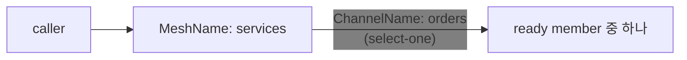
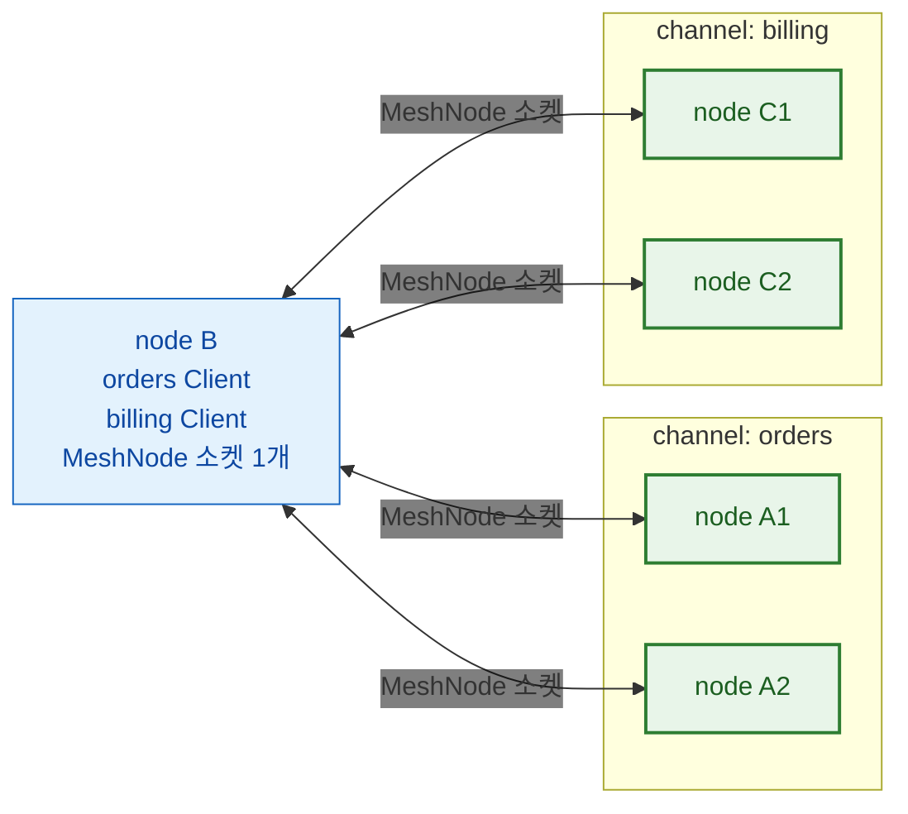
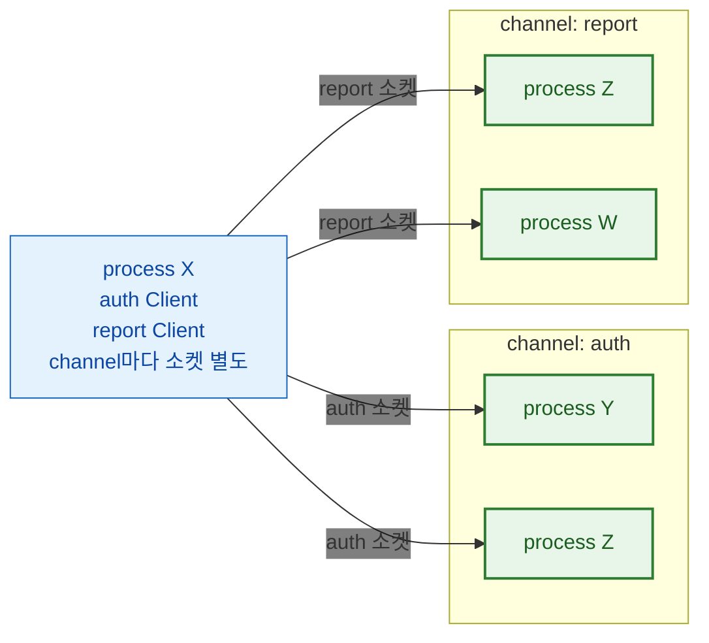
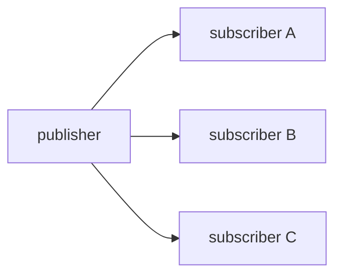
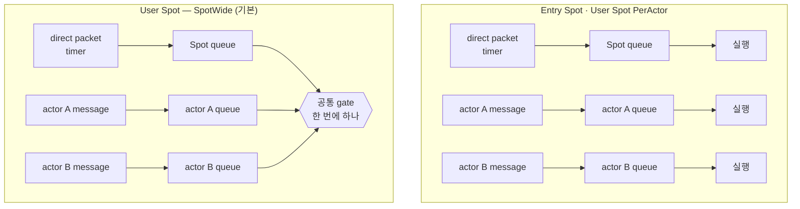
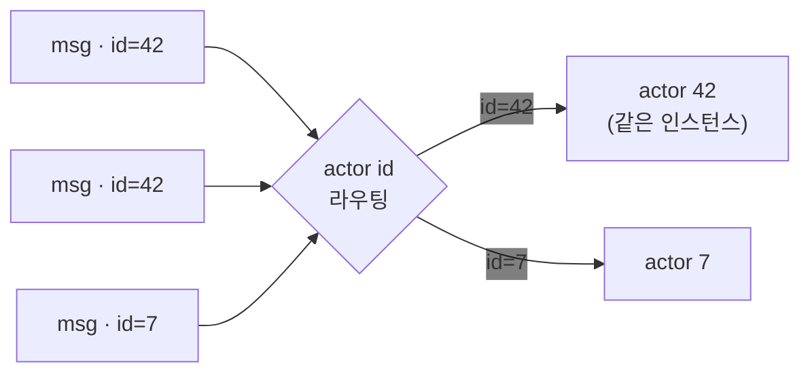
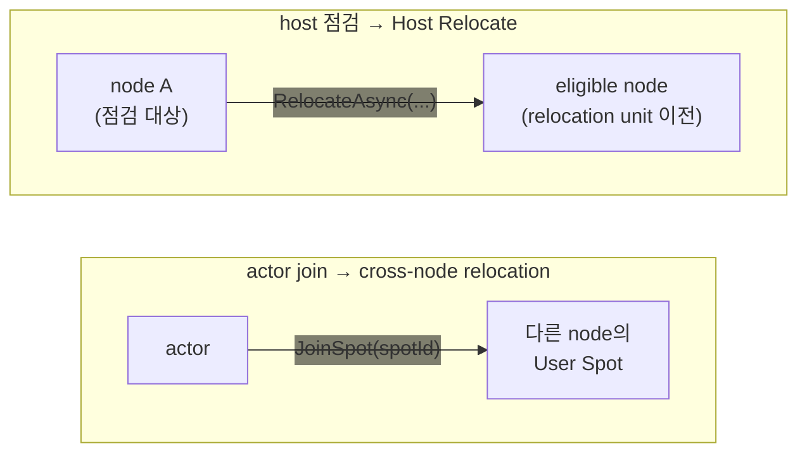
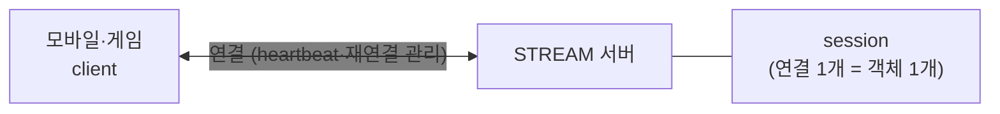
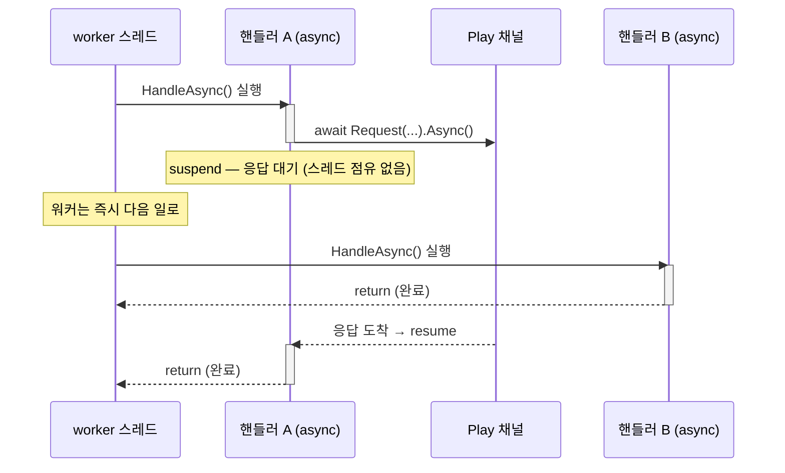
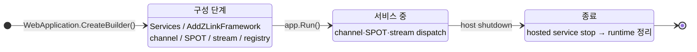

<!-- framework-adapter-nav:start -->
[문서 목록](../../../README.ko.md) | [이전: Getting Started](02-getting-started.ko.md) | [다음: 기능 맵 — 무엇을, 얼마나 쉽게, 언제](04-feature-map.ko.md)
<!-- framework-adapter-nav:end -->

# 3. 핵심 개념

> 개념의 정식 의미는 [공통 스펙 목차](../../common/README.ko.md)가,
> 인터페이스의 정식 정의는 [spec/handler-interfaces](../../common/spec/server/languages/dotnet/02-handler-interfaces.ko.md)가
> 다룬다. 이 문서는 그 의미가 `.NET`에서 어떤 모양으로 보이는지 정리한다.

ZLink framework는 **다섯 가지 핵심 개념**을 제공한다:
**channel · spot · actor · stream · location**. 나머지 챕터는 전부 이 다섯의 변주다.
아래에서 차례로 보고, 중간에 actor·spot이 다른 node로 옮겨가는
[relocation](#4-relocation--다른-node로-옮겨가기)을, 마지막에 이들을 받치는
[실행·구성 모델](#7-보조--실행구성-모델)을 다룬다.

## 1. channel — 서버 간 연결

**MeshNode**가 서버 간 연결의 기초 단위다. MeshNode 하나 위에 독립적인 두 역할을
추가한다.

- **Object role** — spot·actor를 배치하는 자리다.
  [spot](#2-spot--상태를-소유하고-순서대로-처리하는-단위),
  [actor](#3-actor--id로-식별되는-상태-객체)에서 각각
  설명한다.
- **Channel role** — request·send·publish를 주고받는 자리다. 이 절이 다룬다.

`ChannelName`은 그 mesh 안에서 같은 기능을 맡은 node들을 묶는 논리 이름이다 —
주소(`host:port`) 대신 `"orders"` 같은 이름으로 호출 대상을 고른다. 호출자는
`IZLinkRouteClient`에 `MeshName`과 `ChannelName`을 함께 넘긴다.

호출자는 지금 어느 node가 그 요청을 처리하는지 몰라도 된다. 주소도 node 번호도 아닌
논리 이름(`ChannelName`, spot id, actor id)만 넘기면, 그 이름이 지금 어느 node에 있든
framework가 찾아서 전달한다. 이렇게 **대상이 어디 있는지 호출자가 몰라도 되는 성질**을
위치 투명성이라 한다. channel·spot·actor 모두 이 방식으로 동작한다. 그래서 서버를
늘리거나(scale-out) 줄여도(scale-in) 호출 코드는 그대로다.

`ChannelName`을 부르면 framework가 그 순간 요청을 받을 수 있는 node 중 하나를 골라
보낸다 — 이 선택을 **select-one**이라 한다.



등록은 이런 모양이다.

```csharp
var mesh = options.AddRouteMesh("services")     // MeshNode 하나가 mesh "services"에 참여한다.
    .Listen("tcp://0.0.0.0:7101");              // 다른 node가 접속할 자기 endpoint.

mesh.Objects().Server();                        // Object role — 이 node에 spot·actor를 배치한다.

mesh.Channel("orders").Server()                 // Channel role — "orders" 요청을 이 node가 처리한다.
    .AddRequestHandler<GetOrderHandler, GetOrder, Order>();

mesh.Channel("billing").Client();               // 호출만 하는 channel은 Client — handler를 두지 않는다.
```

peer 주소를 코드에 적지 않고 서버 증감을 따라가는 자동 연결은
[10-location](10-location.ko.md)이 다룬다.

> **주의:** `MeshName`과 `ChannelName`은 서로 다른 이름이다. 하나의 mesh에 여러
> `ChannelName`을 등록할 수 있고, 서로 다른 mesh에서 같은 `ChannelName`을 사용할 수도 있다.

**Node direct는 다른 용도다.** RID로 node 하나를 지정하는 호출도 있다.
select-one과 달리 항상 그 RID 하나로만 전달하고, 그 node가 사라져도 대신 처리할 다른
node를 선택하지 않는다. **위치 투명성이 없다.**

따라서 업무 요청에는 사용하지 않는다. 특정 node 하나를 지정해야 하는 운영 조회나
진단에만 사용한다.

### 1.1 "channel"이라는 이름을 쓰는 세 가지

세 등록은 모두 `ChannelName`을 사용하지만, 지원하는 메시징 방식과 소켓을
공유하는지가 다르다.

| 종류 | 등록 | 소켓 | 연결 패턴 |
| --- | --- | --- | --- |
| route mesh channel | `mesh.Channel(name).Server()`/`.Client()` | 이미 열려있는 MeshNode 소켓을 공유한다 | `ChannelName` select-one으로 request/send, spot 간 publish(Logical Multicast) — RID를 직접 지정하는 Node direct는 별도(위 참고) |
| ClientServer channel | `AddClientServerChannel(name)` | MeshNode와 별개인 자기 소켓을 연다(`.Listen()`, 연결은 수동 `.Connect()` 또는 자동 discovery) | Client가 시작한 request/send만 — Server는 그 reply 말고는 먼저 보낼 수 없다 |
| fanout channel | `AddFanoutChannel(name)` | 독자적인 PUB/SUB 소켓을 연다 | publisher → 다수 subscriber |

앞의 둘은 특히 구분하기 쉽지 않다. **route mesh channel은 MeshNode 연결을 공유하는
논리 이름**이고, **ClientServer channel은 다른 channel과 transport를 공유하지 않는
독립 연결 단위**다.

**route mesh channel** — MeshNode 소켓 하나로 mesh에 붙고, channel 이름은 그 위에서
"이 요청을 누가 받는가"를 가르는 논리 묶음이다.



node B는 소켓 하나로 mesh에 붙어 있고, 그 위에서 `orders`와 `billing`을 둘 다 호출한다.
`orders`를 부르면 select-one이 그 상자 안의 A1·A2 중 하나를, `billing`을 부르면 C1·C2
중 하나를 고른다. 상자는 소켓이 아니라 이름으로 묶인 그룹이라, channel을 열 개 더
등록해도 B의 소켓은 그대로 하나다.

**ClientServer channel** — 상자 모양은 같지만, 상자마다 자기 소켓을 따로 연다.



Server가 둘이라 select-one은 똑같이 동작한다. 다른 건 소켓이다 — `auth`와 `report`가
각자 연결을 열고, 같은 process Z가 양쪽 channel에 다 들어가 있어도 두 소켓을 따로
쓴다. Channel마다 연결 대상과 수명을 따로 관리한다.

방향도 고정이라 Server는 Client가 시작한 요청에만 응답할 수 있다. Server가 먼저 알림을
보내야 한다면 ClientServer가 아니라 RouteMesh를 쓴다. TicTacToe에서 로그인 인증
(`tictactoe.api` ClientServer channel)을 Game Spot 생성(MeshNode의 Object role)과
분리하는 이유다([02-getting-started §7](02-getting-started.ko.md)).

**pub/sub도 두 갈래다.** route mesh channel 위에서 spot끼리 이벤트를 주고받는 것을
**Logical Multicast**라 한다. 앞의 다이어그램처럼 이미 연결된 mesh 소켓을 그대로 쓰므로
별도 소켓이 없고, 받는 쪽은 그 channel에서 같은 topic을 구독한 spot으로 한정된다.

```csharp
// 발행 — TicTacToeGame spot 안에서.
await Context.Outbound
    .Publish(SampleTopics.PlayerMilestoneChannel,   // 전달 범위를 정하는 ChannelName.
             SampleTopics.PlayerMilestone,          // 그 안에서 받을 spot을 고르는 topic.
             milestoneEvent)
    .Async(cancellationToken);

// 구독 — PlayEntrySpot이 시작할 때.
Context.Handlers.AddSubscribe<PlayerWinMilestoneEventHandler>(
    SampleTopics.PlayerMilestoneChannel,            // 발행 쪽과 같은 ChannelName·topic이어야 받는다.
    SampleTopics.PlayerMilestone);
```

spot 밖에서 발행해야 하면 `IZLinkSpotPublisherClient`를 주입받아 같은 방식으로 보낸다.

반대로 **fanout channel**(스펙에서는 **Classic fanout**)은 그 자체로 독립된 PUB/SUB
소켓 쌍을 연다. spot이나 MeshNode와 무관하게 발행자 하나가 연결된 구독자 전원에게
전달한다.



둘 다 **발행이 끝났다고 전달이 보장되지는 않는다.** 발행 호출이 완료됐다는 건 보낼
준비가 로컬에서 접수됐다는 뜻이지, 구독자가 그 이벤트를 처리했다는 확인이 아니다.
저장·재전송·ack도 없다.

차이는 **대상 범위**다. Logical Multicast는 그 mesh 안에서 같은 channel·topic을 구독한
spot으로 한정되고, Classic fanout은 mesh 구성과 무관하게 연결된 구독자 전체로 퍼진다.
request/send/pub-sub 사용법과 handler 노출은
[05-channel-messaging](05-channel-messaging.ko.md)이 다룬다.

## 2. spot — 상태를 소유하고 순서대로 처리하는 단위

게임 방, 주문 하나, 길드 하나처럼 **여러 요청이 같은 상태를 건드리는 대상**이 있다.
이걸 직접 만들면 두 가지를 챙겨야 한다. 그 상태를 지금 어느 process가 들고 있는지 찾아
요청을 그리로 보내는 일과, 도착한 요청들이 상태를 동시에 건드리지 않게 막는 일이다.
상태를 process 메모리에 두면 앞의 라우팅을 직접 관리해야 하고, DB나 Redis에 두면
요청마다 읽고 쓰면서 락을 잡아야 한다.

spot은 이 둘을 framework가 맡는다. 대상을 **메모리에 살아 있는 객체 하나**로 두고,
그 앞으로 온 요청을 **한 줄로 세워 차례로** 처리한다. 동시에 두 요청이 같은 상태를
건드리는 상황 자체가 생기지 않으니 락이 필요 없다.

id로 주소를 지정한다는 점이 channel과 다르다. `"orders"` channel을 부르면 그 일을
할 수 있는 아무 node나 처리하지만, `room-42` spot으로 보낸 요청은 지금 그 spot을
들고 있는 node의 그 객체 하나가 처리한다. 어느 node인지는
[앞에서 본](#1-channel--서버-간-연결) 위치 투명성 그대로 framework가 찾는다.

spot은 MeshNode의 **Object role**에 등록한다. 같은 MeshNode의 Channel role과는
별개 표면이다.

| | channel handler | spot handler |
| --- | --- | --- |
| 주소 | `ChannelName` — 처리할 수 있는 node 아무거나 | spot id — 그 상태를 가진 객체 하나 |
| 수명 | 요청마다 새로 만들고 버린다 | 만들어진 뒤 닫힐 때까지 살아 있다 |
| 실행 | 서로 다른 요청은 동시에 실행 | 같은 queue의 작업은 한 번에 하나씩 |
| 상태 | handler에 두지 않는다 | spot이 직접 소유한다 |

상세(등록·lifecycle·timer·outbound)는 [06-spot](06-spot.ko.md).

### 2.1 spot 세 종류 — Entry · User · Instance

세 종류 모두 id와 상태를 가지고 순서대로 실행하는 spot이지만, **누가 언제 만드는지**와
**actor를 담을 수 있는지**가 다르다.

| | Entry Spot | User Spot | Instance Spot |
| --- | --- | --- | --- |
| 만드는 시점 | Object Server가 시작할 때 framework가 자동으로 | application이 "지금 만들자"고 명시적으로 | 그 id로 **첫 message**가 왔을 때 자동으로(cold activation) |
| id | framework가 발급 | `Create`는 framework가, `GetOrCreate`는 caller가 지정 | caller가 보낸 message의 대상 id |
| actor를 담을 수 있나 | 담는다 — actor가 처음 놓이는 자리 | 담는다 — actor가 join·leave로 드나든다 | 담지 못한다 |
| 닫기 | application이 닫지 않는다(server 수명과 함께) | application이 닫는다 | application이 닫는다 |
| 쓰는 곳 | 로그인 직후처럼 아직 아무 User Spot에도 들어가지 않은 actor의 대기 자리 | 게임 방·대전 판처럼 참가자가 모였다 흩어지는 단위 | 주문·길드처럼 id만 있으면 되는 단위 |

**Entry Spot**은 actor의 기본 자리다. actor를 만들면 그 node의 Entry Spot에 놓이고,
User Spot에 join하면 그리로 옮겨가고, leave하면 다시 Entry Spot으로 돌아온다.
Object Server마다 하나씩 있고 application이 만들거나 닫지 않는다.

**User Spot**은 application이 수명을 직접 쥐는 단위다. 언제 만들고 언제 닫을지가
코드에 드러난다. actor가 join·leave로 드나들 수 있어서, 게임 방처럼 참가자가 모였다
흩어지는 대상에 맞는다.

**Instance Spot**은 만들 시점을 결정하는 일 자체를 없앤다. 주문 id·길드 id로 첫
요청이 오면 그 자리에서 만들어진다(cold activation). actor를 담지 못하는 대신, "이걸
언제 만들지"를 고민할 필요가 없는 게 장점이다.

```csharp
mesh.Objects().Server()
    .AddEntrySpot<PlayEntrySpot>()                  // 시작할 때 자동 생성. stable type이 없다.
    .AddSpotFactory<TicTacToeGame>(                 // 만들라고 할 때 생성.
        "tictactoe-game",                           // stable type — 이 이름으로 만들 spot을 고른다.
        factory => factory.DisableRelocation())
    .AddInstanceSpotFactory<GuildSpot>(             // 그 id로 첫 message가 오면 생성.
        "guild",
        factory => factory.RecreateOnRelocation());
```

### 2.2 실행 모델 — 무엇이 무엇과 동시에 실행되나

spot에 들어오는 작업은 두 갈래로 줄을 선다. spot 자신에게 온 direct packet과 timer는
**Spot queue**로, 그 spot에 속한 actor 앞으로 온 message는 **actor별 queue**로 간다.
그 줄들을 동시에 실행해도 되는지가 종류마다 다르다.

| | 무엇이 한 줄로 서나 | 상태를 어디에 두나 |
| --- | --- | --- |
| Entry Spot | actor는 각자 자기 순서대로. Spot 작업은 그와 별개로 실행 | actor가 각자 소유. actor끼리 공유할 상태는 외부 저장소 |
| User Spot `SpotWide`(기본) | Spot·actor·timer **전부** 한 번에 하나씩 | spot이 직접 소유. actor와 공유해도 락이 필요 없다 |
| User Spot `PerActor` | actor별로, Spot lane별로 각각. 서로 다른 줄은 동시 실행 | actor가 각자 소유. 공유 상태는 외부 저장소 |
| Instance Spot | direct packet과 timer가 한 줄로(actor 없음) | spot이 직접 소유 |



**`SpotWide`가 기본**이고, 대부분 이걸 쓰면 된다. 그 spot의 모든 일이 한 줄로
처리되니 spot과 actor가 같은 상태를 함께 봐도 락이 필요 없다 — 게임 방이라면 보드판과
참가자 목록이 그런 상태다. 대신 느린 작업 하나가 그 spot 전체를 멈춘다.

**`PerActor`**는 actor마다 독립적으로 돌아야 처리량이 나오는 경우에 고른다. 대신
여러 줄이 동시에 실행되므로, actor들이 함께 바꾸는 상태를 spot 필드에 두면 경합이
생긴다. 그런 공유 상태는 Redis나 database처럼 node 밖에 둔다. **Entry Spot도 같은
모델**이라 같은 제약을 받는다.

execution mode는 factory를 등록할 때 정하고 실행 중에는 바꾸지 않는다.

## 3. actor — ID로 식별되는 상태 객체

actor는 **ID로 식별되는 상태 보유 객체**다. 같은 ID로 온 메시지는 늘 같은
인스턴스가 처리한다. 외부 client session을 actor에 바인딩하면 **연결 서버(세션)와
로직 서버(actor)를 분리**할 수 있다 — 연결을 받는 node와 도메인 로직을 실행하는 node를
나누는 패턴이다.



상세는 [07-actor-spot](07-actor-spot.ko.md).

## 4. relocation — 다른 node로 옮겨가기

actor나 spot이 지금 owner node를 떠나 다른 node에서 계속 실행되는 것을 relocation이라
한다. 서로 다른 두 계기로 시작된다.

**actor가 다른 node의 spot에 join할 때.** actor가 어떤 User Spot에 join을 요청했는데
그 spot이 다른 node에 있으면, join이 받아들여지는 순간 actor가 상태와 대기 중인 작업을
그대로 들고 그 node로 옮겨간다. application이 요청해서 일어나는 이동이다.

**무중단 점검·배포로 host를 옮길 때.** 운영자가 한 host의 실행 단위를 다른 host로
옮긴다. `SpotWide` User Spot은 member Actor와 함께 옮기고, Entry Spot과 `PerActor`
User Spot에 속한 Actor는 Actor별로 옮긴다. application이 개별 join을 요청하지 않아도
framework가 처리하며, 완료된 뒤 원래 host를 종료할 수 있다.



두 경로 모두 **같은 relocation policy**를 따른다. spot·actor factory를 등록할 때 하나를
고정하고, 실행 중에는 바꾸지 않는다.

| policy | target에서 하는 일 |
| --- | --- |
| `DisableRelocation()` | Cross-node 이동을 시작하기 전에 거부한다. 이 대상이 남아 있으면 host relocation을 완료할 수 없다 |
| `RecreateOnRelocation()` | target에서 새 인스턴스를 다시 만든다. 대기 중이던 message·timer는 유지하되 application 상태는 복원하지 않는다 |
| `PreserveStateWith<TAdapter>()` | adapter가 정한 방식으로 application 상태를 bytes로 담아 target에 그대로 복원한다 |

```csharp
mesh.Objects().Server()
    .AddActorFactory<PlayerActor, PlayerActorFactory>(
        "player",
        factory => factory.PreserveStateWith<PlayerActorRelocationAdapter>());
```

`PerActor` User Spot은 Spot state를 옮기지 않으므로
`RecreateOnRelocation()`만 사용할 수 있다. Member Actor의 policy는 각 Actor factory가
따로 정한다.

actor join 호출과 완료 결과 수신은 [07-actor-spot §5](07-actor-spot.ko.md), 무중단
점검·배포로서의 Host Relocate는 [12-operations §2](12-operations.ko.md)가 다룬다.

## 5. stream — 외부 client 연결

stream은 모바일·게임 같은 **외부 client와의 연결 지향 양방향 채널**이다. 서버
간 [channel](#1-channel--서버-간-연결)과 달리 서버가 연결 수명·heartbeat를 관리하고,
연결 하나가 서버 측 **session** 객체에 대응한다. 연결이 끊긴 뒤 다시 연결하는 동작은
client connector가 담당한다.



상세는 [09-stream](09-stream.ko.md).

## 6. location — 주소 해석

앱 코드는 가능하면 channel 이름 같은 논리 이름만 알고, 실제 peer 주소(`host:port`)는
배포가 공유하는 **location store** 가 푼다. 각 서버는 시작할 때 자기 위치(descriptor row)를
store에 자동 등록하고, client는 channel 이름만으로 store에서 상대를 찾아 연결한다.
서버 구성이 바뀌면 연결도 갱신된다 — 사용법은 [10-location](10-location.ko.md), 계약은
[공통 스펙](../../common/spec/21-location-runtime.ko.md)이 다룬다.

store 없이 endpoint를 역할 등록에 직접 적는 수동 연결도 그대로 지원한다(개발·테스트·
소규모 고정 배포, [05-channel-messaging §6](05-channel-messaging.ko.md)). 같은 MeshNode에서
두 방식을 섞을 수는 없다.

> **샘플에서 보기 — [TicTacToe](../../common/sample/tictactoe/README.ko.md).** 다섯 개념이
> 한 샘플에 전부 나오는 가장 작은 예다. Play 서버의 등록 코드 한 곳에서 다섯이 만난다.
>
> | 개념 | TicTacToe에서 |
> | --- | --- |
> | channel | Play 서버가 독립 `tictactoe.api` ClientServer Channel로 인증 정보를 조회한다 |
> | spot | 대국 한 판이 `TicTacToeGame` spot 하나 — 두 플레이어의 수가 이 안에서 직렬 처리된다 |
> | actor | 플레이어가 actor이고, 재접속해도 같은 actor로 이어져 두던 판을 계속한다 |
> | stream | client가 API 응답의 Play STREAM endpoint에 직접 연결해 수를 두고 push를 받는다 |
> | location | Redis location store가 새 `TicTacToeGame` spot을 만들 Play node를 자동으로 고른다 — API 코드에 특정 Play node 주소가 없다 |
>
> 다섯 개념이 각각 어떤 문제를 푸는지는 위에서 봤고, **함께 놓이면 어떤 모양인지**는
> 이 샘플이 보여 준다.

## 7. 보조 — 실행·구성 모델

위 다섯 개념을 받치는 공통 동작이다. 여기서 한 번 짚고, 상세는 각 챕터가 소유한다.

### 7.1 핸들러 모델 — 채널/HTTP 핸들러 vs SPOT 핸들러

핸들러는 실행 컨텍스트에 따라 두 종류로 나뉘고, 구조와 수명이 완전히 다르다.

- **채널/HTTP 핸들러** — 독립 class다. 의존성은 **생성자 주입**으로 받는다.
  서로 다른 요청이 동시에 실행될 수 있으므로 가변 도메인 상태를 핸들러 멤버에
  두지 않는다. Application이 DI에 handler를 직접 등록했다면 그 등록의 lifetime을
  따른다.
- **SPOT 핸들러** — spot 클래스의 메서드가 아니라, 그 spot에 **바인딩된 별도 class**다.
  그 spot이 시작할 때 자기 핸들러를 등록한다. Direct handler와 timer는 Spot queue에서
  직렬 실행한다. Actor handler와 함께 직렬 실행할지는 execution mode가 정한다.

```csharp
// Spot handler는 대상 spot 타입을 첫 제네릭 인자로 받는 별도 class다.
public sealed class GetStateHandler
    : IZLinkSpotRequestHandler<RoomSpot, GetStateRequest, GetStateReply>
{
    public ValueTask<GetStateReply> HandleAsync(RoomSpot spot, GetStateRequest req, CancellationToken ct)
        => ValueTask.FromResult(new GetStateReply(spot.Occupants)); // 첫 인자로 대상 spot을 받는다.
}

public sealed class RoomSpot(IZLinkSpotContext context) : IZLinkSpot
{
    public IZLinkSpotContext Context { get; } = context;
    public IReadOnlyList<string> Occupants { get; } = [];

    public void Configure()
    {
        Context.Handlers.AddPacket<GetStateHandler>(); // 이 Spot의 direct request handler를 등록한다.
    }
}
```

어느 작업이 어느 작업과 동시에 실행되는지는 spot 종류와 execution mode가 정한다 —
[실행 모델](#22-실행-모델--무엇이-무엇과-동시에-실행되나) 참고.

직렬 실행은 스레드 하나를 계속 점유한다는 뜻이 아니다. Handler가 `await`에 도달하면
실행 스레드는 다른 일을 처리할 수 있지만, 해당 줄의 turn은 handler가 완료될 때까지
유지된다. `SpotWide`에서는 그동안 같은 spot의 다음 callback을 시작하지 않는다. 오래
걸리는 I/O를 기다리는 동안 다음 turn을 실행해야 한다면 [06-spot](06-spot.ko.md)의
`Yield` 계약을 사용한다.

가변 도메인 상태(게임 룸 등)는 **spot**, 불변 구성(topology)은 싱글톤 서비스, 공유
인프라(캐시·카운터)는 싱글톤 + 자체 동기화에 둔다. Spot handler 작성과 직렬 실행
보장은 [06-spot](06-spot.ko.md), 채널 핸들러 노출은 [05-channel-messaging](05-channel-messaging.ko.md).

**handler 노출은 명시적이다.** Assembly scan은 handler type을 발견하고, typed registration은
그 handler를 어느 `MeshName`과 `ChannelName`에 노출할지 고정한다.

```csharp
options.AddHandlersFromAssemblyOf<Program>();   // 발견: assembly에서 handler type을 찾는다.

mesh.Channel("orders").Server()
    .AddRequestHandler<GetOrderHandler>();      // 노출: 이 handler를 services/orders에만 연결한다.
```

다음 구성 오류는 lazy first-call로 미루지 않고 **host startup에서
즉시** 예외로 막힌다: `MeshName` 중복, 같은 channel 안 `kind + packet name` 중복,
local endpoint 또는 peer 연결 정보 누락, 허용되지 않는 handler 반환형.

### 7.2 실행 모델 — `async`/`await`, `ValueTask`

프레임워크 전반의 비동기 값은 `ValueTask` / `ValueTask<T>`로 표현된다. send는
source runtime이 작업을 제출할 수 있을 때까지 기다리며 target handler 완료는 기다리지
않는다. Request는 상대 reply가 도착할 때까지 기다린다. 송신 수락과 backpressure는
framework가 처리한다. 규칙은 하나다 — **런타임(핸들러) 스레드에서는 `await`,
blocking(`.Result`/`.GetAwaiter().GetResult()`)은 테스트·클라이언트 시나리오에서만.**

```csharp
public async ValueTask<CreateGameReply> HandleAsync(
    CreateGameRequest request, IZLinkMessageContext context, CancellationToken ct)
{
    // 런타임(핸들러) 스레드 — await로 비운다. blocking(.Result/.GetAwaiter().GetResult())은 금지.
    var room = await _client
        .RequestToChannel("tictactoe.play", new CreateRoomRequest(request.GameName))
        .Timeout(TimeSpan.FromSeconds(5))   // reply를 기다릴 상한.
        .Async<CreateRoomReply>(ct);        // reply가 도착할 때까지 await로 대기하고 그 reply를 받는다.

    return new CreateGameReply(room.RoomId, room.GameName);
}
```

채널 핸들러는 채널별 async 수신 루프에서, HTTP 핸들러는 `ASP.NET Core` 요청
파이프라인에서 실행된다. 핸들러가 `await`에 도달하면 async 상태 머신만 멈추고(suspend)
실행 스레드는 풀로 돌아가 다른 일을 처리한다. Spot handler의 logical turn은 그대로
유지되므로 같은 lane은 그 handler 완료 전까지 다음 callback을 시작하지 않는다.

아래 타임라인은 같은 흐름을 시간순으로 본 것이다. A가 `await`로 suspend 되면 같은
스레드가 즉시 B를 처리하고, A는 응답이 오면 resume 된다.



그래서 비동기 호출을 콜백 없이 **동기식 코드처럼 위에서 아래로** 쓰면서도, worker
몇 개로 수많은 동시 요청을 처리한다. 같은 코드를 `.Result`로 막으면 스레드 하나가
계속 점유하기 때문에 핸들러 안에서 금지한다. 실패는 `await` 경로에서
예외로 던져진다.

### 7.3 host 수명주기

framework runtime은 `ASP.NET Core`의 **hosted service** 로 host 시작/종료에 묶인다.
channel·SPOT·STREAM runtime은 startup에서 등록한 역할을 보고 생성되어 shutdown에서
정리된다.



- **구성 단계** — `app.Run()` 전에 모든 선언을 끝낸다. 잘못된 구성은 host
  startup에서 예외로 거부된다.
- **종료** — host shutdown 신호가 오면 hosted service `stop()` → channel/SPOT/STREAM
  runtime 정리 순으로 내려간다.
- 백그라운드 작업은 표준 `IHostedService`로 같은 수명주기에 편입시킨다.

### 7.4 구성: DI 컨테이너 · 구성 표면 지도

- **DI 컨테이너** — handler·client·filter는 모두 `ASP.NET Core`의 **동일한 DI
  컨테이너**에서 생성자 주입으로 만들어진다. 별도 컨테이너를 두지 않고
  `builder.Services`에 그대로 등록한다.
- **구성 표면 지도** — 어디서 무엇을 선언하는지:

  | 표면 | 역할 | 다루는 장 |
  | --- | --- | --- |
  | `builder.Services.AddZLinkFramework(...)` | channel/SPOT/STREAM 선언 | 5~9장 |
  | `options.AddRouteMesh(...)` / `AddFanoutChannel(...)` | RouteMesh·fanout 선언 | [5장](05-channel-messaging.ko.md) |
  | runtime event handler | monitoring event 관찰 | [11장](11-monitoring.ko.md) |

## 8. 더 깊이

- request/send/pub-sub 전체 사용법: [05-channel-messaging](05-channel-messaging.ko.md)
- 전체 인터페이스/attribute/context: [spec/handler-interfaces](../../common/spec/server/languages/dotnet/02-handler-interfaces.ko.md)
- 기능 선택 기준: [04-feature-map](04-feature-map.ko.md)

---
<!-- framework-adapter-nav:bottom:start -->
[문서 목록](../../../README.ko.md) | [이전: Getting Started](02-getting-started.ko.md) | [다음: 기능 맵 — 무엇을, 얼마나 쉽게, 언제](04-feature-map.ko.md)
<!-- framework-adapter-nav:bottom:end -->
