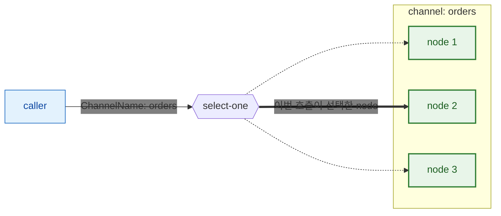
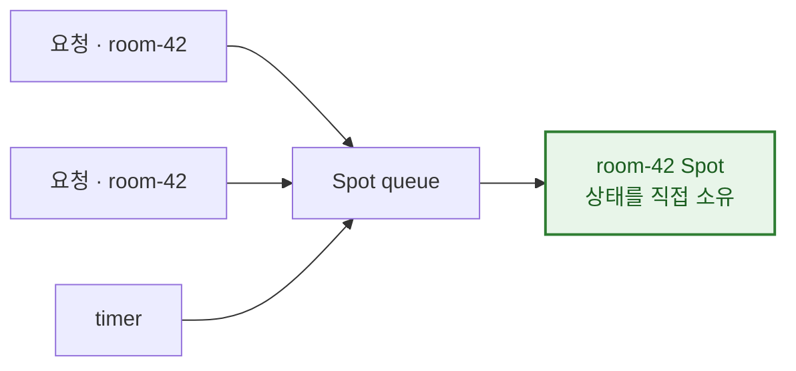
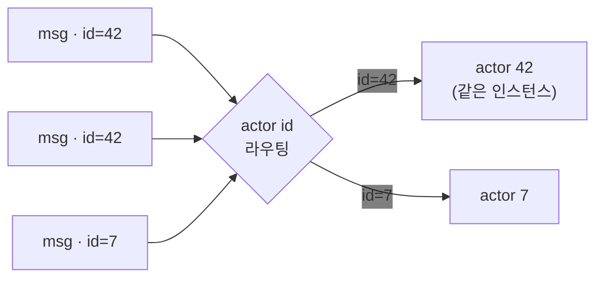
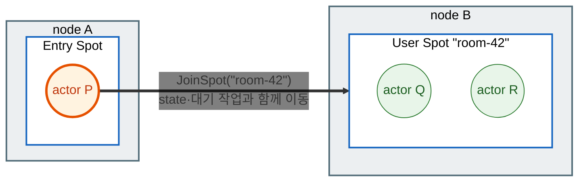
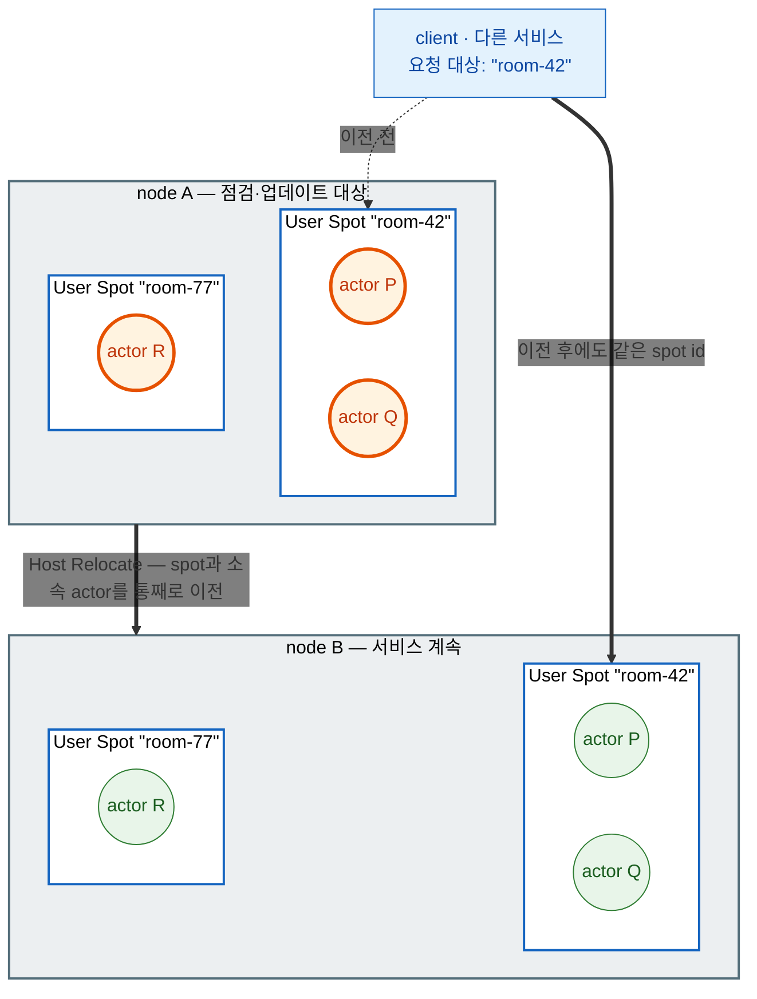
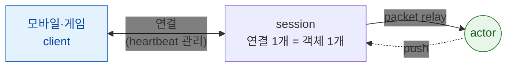
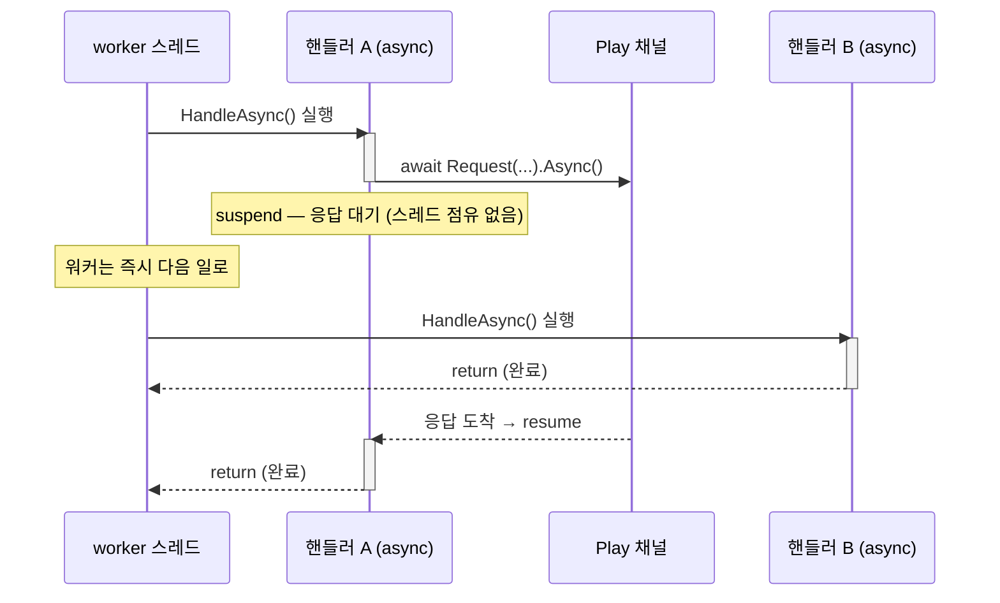
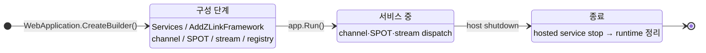

<!-- framework-adapter-nav:start -->
[문서 목록](../../../README.ko.md) | [이전: Getting Started](02-getting-started.ko.md) | [다음: 기능 맵 — 무엇을, 얼마나 쉽게, 언제](04-feature-map.ko.md)
<!-- framework-adapter-nav:end -->

# 3. 핵심 개념

> 개념의 정식 의미는 [공통 스펙 목차](../../common/README.ko.md)가,
> 인터페이스의 정식 정의는 [spec/handler-interfaces](../../common/spec/server/languages/dotnet/02-handler-interfaces.ko.md)가
> 다룬다. 이 문서는 그 의미가 `.NET`에서 어떤 모양으로 보이는지 정리한다.

ZLink framework는 **다섯 가지 핵심 개념**을 제공한다:
**channel · spot · actor · stream · location**. 나머지 챕터는 전부 이 다섯의 변주다.
아래에서 차례로 보고, 중간에 actor·spot이 다른 node로 옮겨가는
[relocation](#4-relocation--다른-node로-옮겨가기)을, 마지막에 이들을 받치는
[실행·구성 모델](#7-보조--실행구성-모델)을 다룬다.

## 1. channel — 서버 간 연결

**MeshNode**가 서버 간 연결의 기초 단위다. MeshNode 하나 위에 독립적인 두 역할을
추가한다.

- **Object role** — spot·actor를 배치하는 자리다.
  [spot](#2-spot--상태를-소유하고-순서대로-처리하는-단위),
  [actor](#3-actor--id로-식별되는-상태-객체)에서 각각
  설명한다.
- **Channel role** — request·send·publish를 주고받는 자리다. 이 문서에서 설명한다.

`ChannelName`은 그 mesh 안에서 같은 기능을 맡은 node들을 묶는 논리 이름이다 —
주소(`host:port`) 대신 `"orders"` 같은 이름으로 호출 대상을 고른다. 호출자는
`IZLinkRouteClient`에 `MeshName`과 `ChannelName`을 함께 넘긴다.

호출자는 지금 어느 node가 그 요청을 처리하는지 몰라도 된다. 주소도 node 번호도 아닌
논리 이름(`ChannelName`, spot id, actor id)만 넘기면, 그 이름이 지금 어느 node에 있든
framework가 찾아서 전달한다. 이렇게 **대상이 어디 있는지 호출자가 몰라도 되는 성질**을
위치 투명성이라 한다. channel·spot·actor 모두 이 방식으로 동작한다. 그래서 서버를
늘리거나(scale-out) 줄여도(scale-in) 호출 코드는 그대로다.

`ChannelName`으로 메시지를 전송하면 framework가 그 순간 요청을 받을 수 있는 node 중
하나를 선택해 전달한다 — 이 선택을 **select-one**이라 한다.



같은 `orders` channel을 맡은 node가 셋이면 호출마다 그중 하나가 선택된다. 호출자는
어느 node가 선택됐는지 알지 못하고, 알 필요도 없다.

MeshNode 하나에 두 역할을 함께 얹은 모양은 이렇다.

```csharp
var mesh = options.AddRouteMesh("services")     // MeshNode 하나가 mesh "services"에 참여한다.
    .Listen("tcp://0.0.0.0:7101");              // 다른 node가 접속할 자기 endpoint.

mesh.Objects().Server();                        // Object role — 이 node에 spot·actor를 배치한다.
mesh.Channel("orders").Server();                // Channel role — "orders" 요청을 이 node가 처리한다.
mesh.Channel("billing").Client();               // 호출만 하는 channel은 Client.
```

peer 주소를 코드에 적지 않고 서버 증감을 따라가는 자동 연결은
[10-location](10-location.ko.md)이 다룬다.

> **주의:** `MeshName`과 `ChannelName`은 서로 다른 이름이다. 하나의 mesh에 여러
> `ChannelName`을 등록할 수 있고, 서로 다른 mesh에서 같은 `ChannelName`을 사용할 수도 있다.

"channel"이라는 이름을 쓰는 등록은 셋이고, 소켓을 공유하는지가 다르다.

| 종류 | 소켓 |
| --- | --- |
| route mesh channel | 이미 열려있는 MeshNode 소켓을 공유한다 |
| ClientServer channel | MeshNode와 별개인 자기 소켓을 연다 |
| fanout channel | 독자적인 PUB/SUB 소켓을 연다 |

pub/sub도 두 갈래다. route mesh channel 위에서 Spot끼리 주고받는 **Logical Multicast**는
mesh 소켓을 그대로 쓰고, **fanout channel**은 자기 소켓으로 연결된 구독자 전원에게
전달한다. 셋의 구조 비교와 사용법은
[05-channel-messaging §1](05-channel-messaging.ko.md#1-channel-종류)이 다룬다.

## 2. spot — 상태를 소유하고 순서대로 처리하는 단위

게임 방 하나, 길드 하나, 경매 물건 하나처럼 **여러 요청이 같은 상태를 동시에 건드리는
대상**이 있다.
이걸 직접 만들면 두 가지를 챙겨야 한다. 그 상태를 지금 어느 process가 들고 있는지 찾아
요청을 그리로 보내는 일과, 도착한 요청들이 상태를 동시에 건드리지 않게 막는 일이다.
상태를 process 메모리에 두면 앞의 라우팅을 직접 관리해야 하고, DB나 Redis에 두면
요청마다 읽고 쓰면서 락을 잡아야 한다.

spot은 이 둘을 framework가 맡는다. 대상을 **메모리에 살아 있는 객체 하나**로 두고,
그 앞으로 온 요청을 **한 줄로 세워 차례로** 처리한다. 동시에 두 요청이 같은 상태를
건드리는 상황 자체가 생기지 않으니 락이 필요 없다.

id로 주소를 지정한다는 점이 channel과 다르다. `"orders"` channel로 전송하면 그 일을
할 수 있는 아무 node나 처리한다. 반면 `"room-42"` 같은 spot id로 요청을 보내면, 그
spot이 존재하는 node가 메시지를 받아 그 spot에게 전달해 처리하도록 한다. 그 node가
어디인지는 [앞에서 본](#1-channel--서버-간-연결) 위치 투명성 그대로 framework가 찾는다.



spot은 MeshNode의 **Object role**에 등록한다. 같은 MeshNode의 Channel role과는
별개 표면이다.

| | channel handler | spot handler |
| --- | --- | --- |
| 주소 | `ChannelName` — 처리할 수 있는 node 중 하나 | spot id — 그 상태를 가진 객체 하나 |
| 수명 | 요청마다 새로 만들고 버린다 | 생성된 뒤 닫힐 때까지 유지된다 |
| 실행 | 서로 다른 요청은 동시에 실행 | 같은 queue의 작업은 한 번에 하나씩 |
| 상태 | handler에 두지 않는다 | spot이 직접 소유한다 |

spot은 만들어지는 시점에 따라 **Entry Spot · User Spot · Instance Spot** 세 종류로
나뉘고, 어떤 작업이 동시에 실행되는지는 **execution mode**가 정한다. 세 종류의 차이,
execution mode 선택, 등록·lifecycle·timer·outbound는 [06-spot](06-spot.ko.md)이 다룬다.

## 3. actor — ID로 식별되는 상태 객체

actor는 **ID로 식별되는 상태 보유 객체**다. 같은 ID로 온 메시지는 늘 같은
인스턴스가 처리한다. actor는 항상 어떤 spot에 속하며, 외부 client 연결과 묶는 방법은
[stream](#5-stream--외부-client-연결)에서 이어진다.



상세는 [07-actor-spot](07-actor-spot.ko.md).

## 4. relocation — 다른 node로 옮겨가기

actor나 spot이 지금 owner node를 떠나 다른 node에서 계속 실행되는 것을 relocation이라
한다. 서로 다른 두 계기로 시작된다.

actor는 spot 안에, spot은 node 안에 있다. relocation은 이 담김 관계를 유지한 채
소속만 다른 node로 바뀌는 것이다.

**actor가 다른 node의 spot에 join할 때.** actor가 어떤 User Spot에 join을 요청했는데
그 spot이 다른 node에 있으면, join이 받아들여지는 순간 actor가 상태와 대기 중인 작업을
그대로 들고 그 node로 옮겨간다. application이 요청해서 일어나는 이동이다.



호출에 적는 것은 **spot id뿐**이다. `room-42`가 지금 node B에 있다는 사실은 코드에
없고 framework가 찾는다. 이동이 끝나면 actor P는 node B의 `room-42` spot에 속한
member가 되어 Q·R와 같은 실행 규칙을 따른다.

**무중단 점검·배포로 host를 옮길 때.** 운영자가 한 host의 spot과 actor를 다른 host로
옮긴다. application이 개별 join을 요청하지 않아도 framework가 처리하며, 완료된 뒤
원래 host를 종료할 수 있다.



이것이 relocation의 핵심 쓸모다. 상태를 들고 있는 서버는 보통 그 상태 때문에 함부로
내릴 수 없어서, 점검이나 배포를 하려면 접속을 끊고 기다리게 만들어야 한다. Host
Relocate는 spot과 actor의 state를 그대로 유지하면서 다른 node로 옮겨 node A를 비운다.
호출하는 쪽은 여전히 `room-42`라는 같은 id로 요청하므로 이전 사실을 알 필요가 없다.
결과적으로 **stateful 서비스를 stateless 서비스처럼 무중단으로 교체**할 수 있다.

두 경로 모두 **같은 relocation policy**를 따른다. 이동할 때 application 상태를 어떻게
할지(옮기지 않음 · 새로 만듦 · 그대로 복원)를 spot·actor factory 등록에서 하나
고정하며, 실행 중에는 바꾸지 않는다.

policy 종류와 선택 기준은 [07-actor-spot §1](07-actor-spot.ko.md), actor join 호출과
완료 결과 수신은 [07-actor-spot §5](07-actor-spot.ko.md), 무중단 점검·배포로서의
Host Relocate와 이전 단위 구분은 [12-operations §2](12-operations.ko.md)가 다룬다.

## 5. stream — 외부 client 연결

stream은 모바일·게임 같은 **외부 client와의 연결 지향 양방향 채널**이다. 서버
간 [channel](#1-channel--서버-간-연결)과 달리 서버가 연결 수명·heartbeat를 관리하고,
연결 하나가 서버 측 **session** 객체에 대응한다. 연결이 끊긴 뒤 다시 연결하는 동작은
client connector가 담당한다.

session을 [actor](#3-actor--id로-식별되는-상태-객체)에 **bind**하면, 그 연결로 들어온
메시지를 session이 직접 처리하지 않고 bind된 actor로 relay한다. 반대 방향도 같아서
actor가 보내는 push는 그 actor에 bind된 session을 통해 client로 나간다.



그래서 **연결을 받는 node와 도메인 로직을 실행하는 node를 나눌 수 있다.** session은
gateway node에 두고 actor는 다른 node에 두어도, relay 경로는 framework가 유지한다.
actor가 [relocation](#4-relocation--다른-node로-옮겨가기)으로 옮겨가도 같은 session이
새 위치로 이어진다.

상세는 [09-stream](09-stream.ko.md), session과 actor를 bind하는 방법은
[08-actor-session](08-actor-session.ko.md)이 다룬다.

## 6. location — 주소 해석

Application 코드는 channel 이름 같은 논리 이름만 사용하고, 실제 peer 주소(`host:port`)는
배포 전체가 공유하는 **location store**가 해석한다. 각 서버는 시작할 때 자기 위치를
descriptor로 store에 등록하고, 호출하는 쪽은 논리 이름으로 store에서 대상을 찾아
연결한다. 서버 구성이 바뀌면 연결도 갱신된다.

사용법은 [10-location](10-location.ko.md), 계약은
[공통 스펙](../../common/spec/21-location-runtime.ko.md)이 정의한다.

store 없이 endpoint를 등록에 직접 지정하는 수동 연결도 지원한다 — 개발·테스트와
소규모 고정 배포에 사용한다([05-channel-messaging §6](05-channel-messaging.ko.md)).
같은 MeshNode에서 두 방식을 함께 사용할 수는 없다.

> **샘플에서 보기 — [TicTacToe](../../common/sample/tictactoe/README.ko.md).** 다섯 개념이
> 한 샘플에 전부 나오는 가장 작은 예다. Play 서버의 등록 코드 한 곳에서 다섯이 만난다.
>
> | 개념 | TicTacToe에서 |
> | --- | --- |
> | channel | Play 서버가 독립 `tictactoe.api` ClientServer Channel로 인증 정보를 조회한다 |
> | spot | 대국 한 판이 `TicTacToeGame` spot 하나 — 두 플레이어의 수가 이 안에서 직렬 처리된다 |
> | actor | 플레이어가 actor이고, 재접속해도 같은 actor로 이어져 두던 판을 계속한다 |
> | stream | client가 API 응답의 Play STREAM endpoint에 직접 연결해 수를 두고 push를 받는다 |
> | location | Redis location store가 새 `TicTacToeGame` spot을 만들 Play node를 자동으로 고른다 — API 코드에 특정 Play node 주소가 없다 |
>
> 다섯 개념이 각각 어떤 문제를 푸는지는 위에서 봤고, **함께 놓이면 어떤 모양인지**는
> 이 샘플이 보여 준다.

## 7. 보조 — 실행·구성 모델

위 다섯 개념을 받치는 공통 동작이다. 여기서 한 번 짚고, 상세는 각 챕터가 소유한다.

### 7.1 handler 모델 — channel handler vs spot handler

Framework가 dispatch하는 handler는 실행 문맥에 따라 세 종류로 나뉘고, 구조와 수명이
다르다.

- **channel handler** — 독립 class다. 의존성은 **생성자 주입**으로 받는다. 서로 다른
  요청이 동시에 실행될 수 있으므로 가변 도메인 상태를 handler 멤버에 두지 않는다.
  Handler와 scoped dependency는 dispatch가 끝날 때까지 유지된다.
- **spot handler** — spot 클래스의 메서드가 아니라 그 Spot에 바인딩된 별도 class다.
  Spot activation에서 한 번 만들고 닫히거나 relocation될 때 정리한다. Direct handler와
  timer는 Spot queue에서 직렬 실행한다.
- **actor handler** — 해당 Actor activation에서 한 번 만들고 leave·destroy·relocation
  때 정리한다. 서로 다른 Actor는 handler instance와 scoped dependency를 공유하지 않는다.

Handler type의 DI 등록 lifetime으로 이 수명을 바꿀 수 없으며 별도 lifetime option도
없다. 생성자 dependency만 각 dispatch·Spot·Actor scope에서 resolve한다. 복구해야 하는
상태는 handler field가 아니라 Spot 또는 Actor에 둔다.

> Framework는 HTTP 요청을 처리하지 않는다. `ASP.NET Core`의 endpoint·middleware가
> HTTP를 맡고, channel handler는 그와 별개인 서버 간 메시지 dispatch 경로다. class를
> 만들어 DI로 의존성을 받고 등록해 두면 runtime이 호출한다는 **작성 방식**이 controller
> action과 닮았을 뿐이다.

```csharp
// Spot handler는 대상 spot 타입을 첫 제네릭 인자로 받는 별도 class다.
public sealed class GetStateHandler
    : IZLinkSpotRequestHandler<RoomSpot, GetStateRequest, GetStateReply>
{
    public ValueTask<GetStateReply> HandleAsync(RoomSpot spot, GetStateRequest req, CancellationToken ct)
        => ValueTask.FromResult(new GetStateReply(spot.Occupants)); // 첫 인자로 대상 spot을 받는다.
}

public sealed class RoomSpot(IZLinkSpotContext context) : IZLinkSpot
{
    public IZLinkSpotContext Context { get; } = context;
    public IReadOnlyList<string> Occupants { get; } = [];

    public void Configure()
    {
        Context.Handlers.AddPacket<GetStateHandler>(); // 이 Spot의 direct request handler를 등록한다.
    }
}
```

어느 작업이 어느 작업과 동시에 실행되는지는 spot 종류와 execution mode가 정한다 —
[06-spot §2.1](06-spot.ko.md#21-실행-모델--무엇이-무엇과-동시에-실행되나) 참고.

직렬 실행은 스레드 하나를 계속 점유한다는 뜻이 아니다. Handler가 `await`에 도달하면
실행 스레드는 다른 일을 처리할 수 있지만, 해당 turn은 handler가 완료될 때까지
유지된다. `SpotWide`에서는 그동안 같은 spot의 다음 callback을 시작하지 않는다. 오래
걸리는 I/O를 기다리는 동안 다음 turn을 실행해야 한다면 [06-spot](06-spot.ko.md)의
`Yield` 계약을 사용한다.

가변 도메인 상태(게임 룸 등)는 **spot**, 불변 구성(topology)은 싱글톤 서비스, 공유
인프라(캐시·카운터)는 싱글톤 + 자체 동기화에 둔다. Spot handler 작성과 직렬 실행
보장은 [06-spot](06-spot.ko.md), channel handler 노출은
[05-channel-messaging](05-channel-messaging.ko.md)이 다룬다.

**handler 노출은 명시적이다.** Assembly scan은 handler type을 발견하고, typed registration은
그 handler를 어느 `MeshName`과 `ChannelName`에 노출할지 고정한다.

```csharp
options.AddHandlersFromAssemblyOf<Program>();   // 발견: assembly에서 handler type을 찾는다.

mesh.Channel("orders").Server()
    .AddRequestHandler<GetOrderHandler>();      // 노출: 이 handler를 services/orders에만 연결한다.
```

다음 구성 오류는 lazy first-call로 미루지 않고 **host startup에서
즉시** 예외로 막힌다: `MeshName` 중복, 같은 channel 안 `kind + packet name` 중복,
local endpoint 또는 peer 연결 정보 누락, 허용되지 않는 handler 반환형.

### 7.2 실행 모델 — `async`/`await`, `ValueTask`

프레임워크 전반의 비동기 값은 `ValueTask` / `ValueTask<T>`로 표현된다. send는
source runtime이 작업을 제출할 수 있을 때까지 기다리며 target handler 완료는 기다리지
않는다. Request는 상대 reply가 도착할 때까지 기다린다. 송신 수락과 backpressure는
framework가 처리한다. 규칙은 하나다 — **런타임(핸들러) 스레드에서는 `await`,
blocking(`.Result`/`.GetAwaiter().GetResult()`)은 테스트·클라이언트 시나리오에서만.**

```csharp
public async ValueTask<CreateGameReply> HandleAsync(
    CreateGameRequest request, IZLinkMessageContext context, CancellationToken ct)
{
    // 런타임(핸들러) 스레드 — await로 비운다. blocking(.Result/.GetAwaiter().GetResult())은 금지.
    var room = await _client
        .RequestToChannel("tictactoe.play", new CreateRoomRequest(request.GameName))
        .Timeout(TimeSpan.FromSeconds(5))   // reply를 기다릴 상한.
        .Async<CreateRoomReply>(ct);        // reply가 도착할 때까지 await로 대기하고 그 reply를 받는다.

    return new CreateGameReply(room.RoomId, room.GameName);
}
```

Channel handler는 channel별 async 수신 루프에서 실행된다. Handler가 `await`에
도달하면 async 상태 머신만 멈추고(suspend) 실행 스레드는 풀로 돌아가 다른 일을
처리한다. Spot handler의 logical turn은 그대로 유지되므로 같은 lane은 그 handler
완료 전까지 다음 callback을 시작하지 않는다.

아래 타임라인은 같은 흐름을 시간순으로 본 것이다. A가 `await`로 suspend 되면 같은
스레드가 즉시 B를 처리하고, A는 응답이 오면 resume 된다.



그래서 비동기 호출을 콜백 없이 **동기식 코드처럼 위에서 아래로** 쓰면서도, worker
몇 개로 수많은 동시 요청을 처리한다. 같은 코드를 `.Result`로 막으면 스레드 하나가
계속 점유하기 때문에 핸들러 안에서 금지한다. 실패는 `await` 경로에서
예외로 던져진다.

### 7.3 host 수명주기

framework runtime은 `ASP.NET Core`의 **hosted service** 로 host 시작/종료에 묶인다.
channel·SPOT·STREAM runtime은 startup에서 등록한 역할을 보고 생성되어 shutdown에서
정리된다.



- **구성 단계** — `app.Run()` 전에 모든 선언을 끝낸다. 잘못된 구성은 host
  startup에서 예외로 거부된다.
- **종료** — host shutdown 신호가 오면 hosted service `stop()` → channel/SPOT/STREAM
  runtime 정리 순으로 내려간다.
- 백그라운드 작업은 표준 `IHostedService`로 같은 수명주기에 편입시킨다.

### 7.4 구성: DI 컨테이너 · 구성 표면 지도

- **DI 컨테이너** — handler·client·filter는 모두 `ASP.NET Core`의 **동일한 DI
  컨테이너**에서 생성자 주입으로 만들어진다. 별도 컨테이너를 두지 않고
  `builder.Services`에 그대로 등록한다.
- **구성 표면 지도** — 어디서 무엇을 선언하는지:

  | 표면 | 역할 | 다루는 장 |
  | --- | --- | --- |
  | `builder.Services.AddZLinkFramework(...)` | channel/SPOT/STREAM 선언 | 5~9장 |
  | `options.AddRouteMesh(...)` / `AddFanoutChannel(...)` | RouteMesh·fanout 선언 | [5장](05-channel-messaging.ko.md) |
  | runtime event handler | monitoring event 관찰 | [11장](11-monitoring.ko.md) |

## 8. 더 깊이

- request/send/pub-sub 전체 사용법: [05-channel-messaging](05-channel-messaging.ko.md)
- 전체 인터페이스/attribute/context: [spec/handler-interfaces](../../common/spec/server/languages/dotnet/02-handler-interfaces.ko.md)
- 기능 선택 기준: [04-feature-map](04-feature-map.ko.md)

---
<!-- framework-adapter-nav:bottom:start -->
[문서 목록](../../../README.ko.md) | [이전: Getting Started](02-getting-started.ko.md) | [다음: 기능 맵 — 무엇을, 얼마나 쉽게, 언제](04-feature-map.ko.md)
<!-- framework-adapter-nav:bottom:end -->
