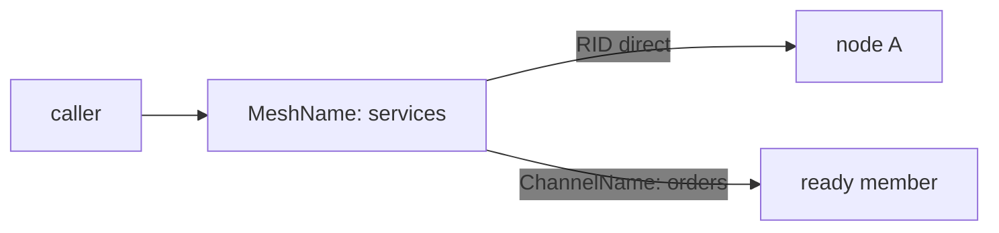
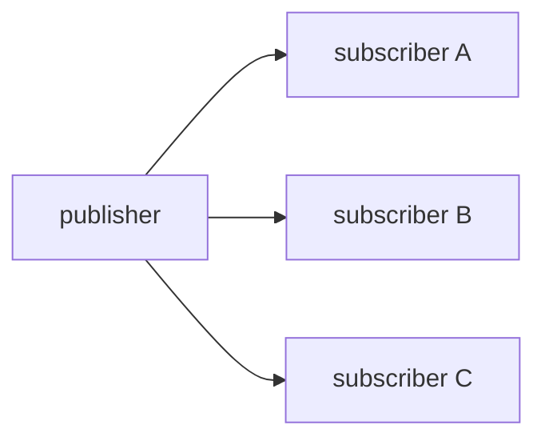
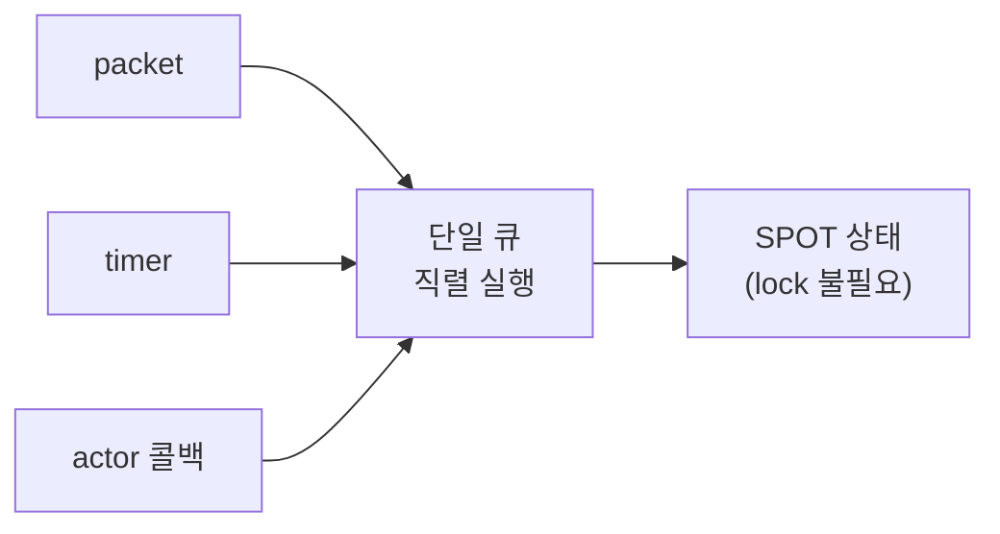
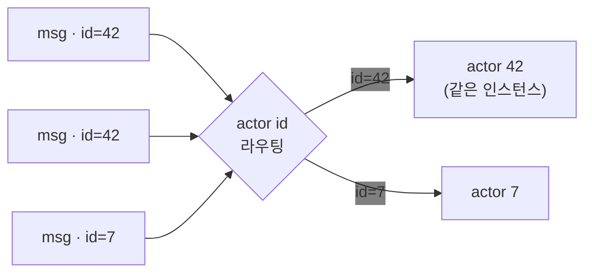
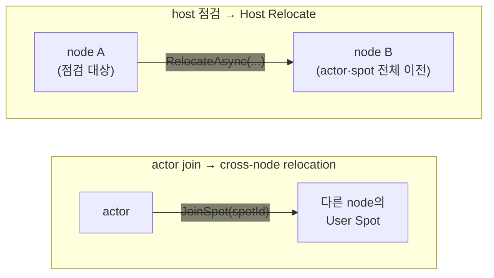
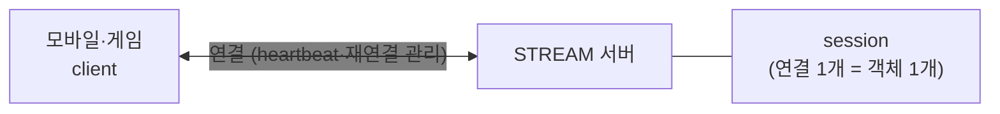
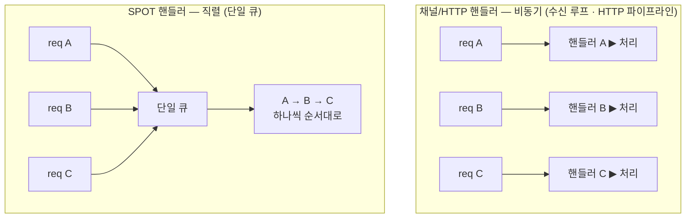
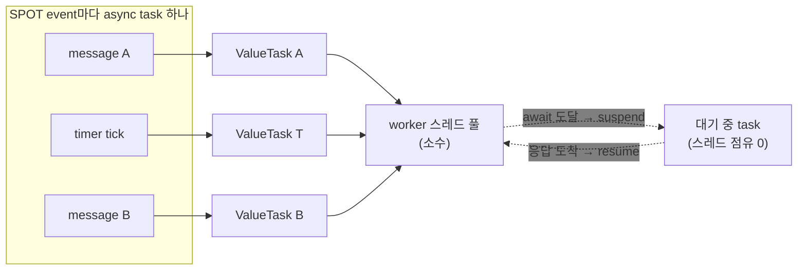
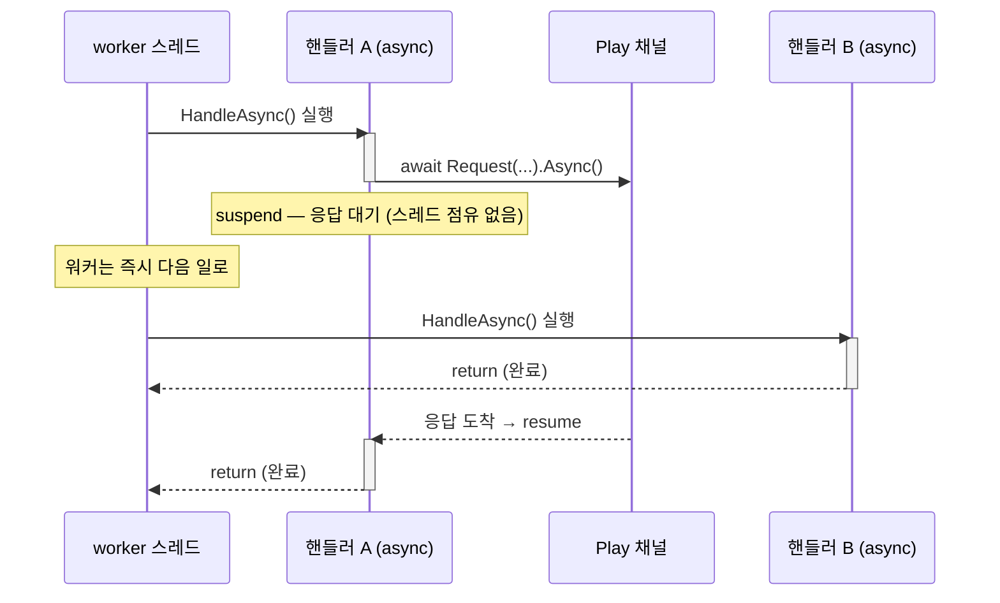
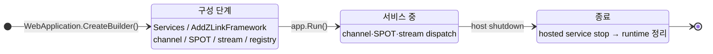

<!-- framework-adapter-nav:start -->
[문서 목록](../../../README.ko.md) | [이전: Getting Started](02-getting-started.ko.md) | [다음: 기능 맵 — 무엇을, 얼마나 쉽게, 언제](04-feature-map.ko.md)
<!-- framework-adapter-nav:end -->

# 3. 핵심 개념

> 개념의 정식 의미는 [공통 스펙 목차](../../common/README.ko.md)가,
> 인터페이스의 정식 정의는 [spec/handler-interfaces](../../common/spec/server/languages/dotnet/02-handler-interfaces.ko.md)가
> 다룬다. 이 문서는 그 의미가 `.NET`에서 어떤 모양으로 보이는지 정리한다.

ZLink framework는 **다섯 가지 핵심 개념**으로 선다:
**channel · spot · actor · stream · location**. 나머지 챕터는 전부 이
다섯의 변주다. §1~§3에서 channel·spot·actor를 차례로 보고, §4에서 actor·spot이 다른
node로 옮겨가는 relocation을, §5~§6에서 stream·location을 본다. §7은 이들을 받치는
실행·구성 모델이다.

## 1. channel — 서버 간 연결

channel은 **서버 간 호출 대상을 묶는 논리 이름**이다. 주소(`host:port`)가 아니라
`"orders"` 같은 `ChannelName`으로 호출 대상을 선택한다. `MeshName`은 서로 통신할
MeshNode 집합을 구분하고, `ChannelName`은 그 mesh 안에서 같은 기능을 제공하는 membership을
묶는다. 호출자는 `IZLinkRouteClient`에 두 이름을 함께 넘긴다.

**channel 종류(kind)** — 서버 간 연결 방식이 다르다:

| 종류 | 등록 | 연결 패턴 |
| --- | --- | --- |
| route mesh | `AddRouteMesh` + `Channel(name).Server()`/`.Client()` | node direct 또는 `ChannelName` 대상 request/send |
| fanout | `AddFanoutChannel` | publisher → 다수 subscriber, topic (PUB / SUB) |

- **route mesh** — `MeshName`으로 mesh를 고른 뒤 RID로 노드 하나를 직접 지정하거나,
  `ChannelName`의 처리 가능 membership 중 하나를 선택한다.



- **fanout** — publisher가 발행하면 같은 이벤트가 subscriber 여럿에 전달된다.



MeshNode는 `Listen(endpoint)`로 자기 endpoint를 열고 `PeerConnections.Connect(endpoint)`로
수동 peer를 지정할 수 있다. `Channel(name)`은 `.Server()`로 그 channel의 handler를
등록하거나 `.Client()`로 호출만 하는 역할을 선언한다 — 호출만 하는 노드는 `.Client()`를
쓰면 되고, 처리 대상에서 빼려고 weight를 조정할 필요가 없다. 자동 discovery를 사용할 때의
등록과 연결은 [10-location](10-location.ko.md)이 다룬다. request/send/pub-sub 사용법과
handler 노출은 [05-channel-messaging](05-channel-messaging.ko.md)이 다룬다.

> **주의:** `MeshName`과 `ChannelName`은 서로 다른 이름이다. 하나의 mesh에 여러
> `ChannelName`을 등록할 수 있고, 서로 다른 mesh에서 같은 `ChannelName`을 사용할 수도 있다.

## 2. spot — 상태 단위

spot은 room/zone/stage처럼 **동적으로 생성되고 제거되는 상태 단위**다. 한 spot에
들어오는 packet · timer · actor 콜백은 **한 줄로 직렬 실행**되므로, spot이 소유한
상태에 lock 없이 접근한다. "어디서 도는가"가 channel handler와 다르다(§7).

| | channel handler | SPOT handler |
| --- | --- | --- |
| 위치 | MeshNode의 `ChannelName` membership | `MeshNode` 안의 entry/user Spot |
| 실행 | 서로 다른 요청은 동시에 실행 가능 | 같은 SPOT 안에서는 직렬 실행 |
| 상태 | 공유 상태를 직접 멤버에 두지 않음 | SPOT이 상태를 직접 소유 |

한 SPOT에 들어오는 모든 일은 **단일 큐**를 통과해 한 줄로 처리된다 — 그래서 상태에
lock이 없다.



상세(등록·lifecycle·timer·outbound)는 [06-spot](06-spot.ko.md).

### 2.1 spot 종류 — Entry · User · Instance

spot은 **누가 언제 만드는지**에 따라 세 종류로 나뉜다.

| 종류 | .NET public type | 만드는 시점 |
| --- | --- | --- |
| Entry Spot | `IZLinkEntrySpot` | Object Server가 시작할 때 framework가 자동으로 만든다 |
| User Spot | `IZLinkSpot` | application이 `IZLinkSpotManager.Create`/`GetOrCreate`로 명시적으로 만든다 |
| Instance Spot | `IZLinkInstanceSpot` | 별도 create 호출 없이, 그 id로 온 **최초 message**가 만든다(cold activation) |

Entry Spot은 actor가 생성 직후 머무는 기본 실행 위치다. User Spot은 방·판·주문처럼
application이 "지금 만들자"고 정하는 상태 단위이고([02-getting-started](02-getting-started.ko.md)에서
`Create`로 만든 `TicTacToeGame`이 이 종류다), Instance Spot은 그 판단 자체를 생략한다 —
길드 id·주문 id처럼 **id만 있으면** 첫 요청이 온 순간 spot이 준비된다. 등록은 각각
`AddEntrySpot<T>()`, `AddSpotFactory<T>(type, configure)`,
`AddInstanceSpotFactory<T>(type, configure)`다.

## 3. actor — ID로 식별되는 상태 객체

actor는 **ID로 식별되는 상태 보유 객체**다. 같은 ID로 온 메시지는 늘 같은
인스턴스가 처리한다. 외부 client session을 actor에 바인딩하면 **연결 서버(세션)와
로직 서버(actor)를 분리**할 수 있다 — 연결을 받는 노드와 도메인 로직을 도는 노드를
나누는 패턴이다.



상세는 [07-actor-spot](07-actor-spot.ko.md).

## 4. relocation — 다른 node로 옮겨가기

actor나 spot이 지금 owner node를 떠나 다른 node에서 계속 실행되는 것을 relocation이라
한다. 서로 다른 두 계기로 시작된다.

**actor가 다른 node의 spot에 join할 때.** actor는 `Context.JoinSpot(spotId, ...)`으로
User Spot에 join을 요청한다. 그 spot이 다른 node에 있으면, join이 받아들여지는 순간
actor가 상태와 대기 중인 작업을 그대로 들고 그 node로 옮겨간다 — application이 호출해서
시작하는 이동이다.

**무중단 점검·배포로 host를 옮길 때.** 운영자가 `RelocateAsync(...)`로 한 host의 모든
actor·spot을 다른 host로 옮긴다. application이 개별 join을 호출하지 않아도 framework가
한꺼번에 처리하고, 이동이 끝나면 원래 host를 내려도 서비스는 끊기지 않는다.



두 경로 모두 **같은 relocation policy**를 따른다. spot·actor factory를 등록할 때 하나를
고정하고, 실행 중에는 바꾸지 않는다.

| policy | target에서 하는 일 |
| --- | --- |
| `DisableRelocation()` | 다른 node로 옮기지 않는다. 지금 node가 계속 처리한다 |
| `RecreateOnRelocation()` | target에서 새 인스턴스를 다시 만든다. 대기 중이던 message·timer는 유지하되 application 상태는 복원하지 않는다 |
| `PreserveStateWith<TAdapter>()` | adapter가 정한 방식으로 application 상태를 bytes로 담아 target에 그대로 복원한다 |

```csharp
mesh.Objects().Server()
    .AddActorFactory<PlayerActor, PlayerActorFactory>(
        "player",
        factory => factory.PreserveStateWith<PlayerActorRelocationAdapter>());
```

actor join 호출과 완료 결과 수신은 [07-actor-spot §5](07-actor-spot.ko.md), 무중단
점검·배포로서의 Host Relocate는 [12-operations §2](12-operations.ko.md)가 다룬다.

## 5. stream — 외부 client 연결

stream은 모바일·게임 같은 **외부 client와의 연결 지향 양방향 채널**이다. 서버
간 channel(§1)과 달리 연결 수명·재연결·heartbeat를 framework가 관리하고, 연결
하나가 서버 측 **session** 객체에 대응한다.



상세는 [09-stream](09-stream.ko.md).

## 6. location — 주소 해석

앱 코드는 가능하면 channel 이름 같은 논리 이름만 알고, 실제 peer 주소(`host:port`)는
배포가 공유하는 **location store** 가 푼다. 각 서버는 시작할 때 자기 위치(descriptor row)를
store에 자동 등록하고, client는 channel 이름만으로 store에서 상대를 찾아 연결한다.
서버가 늘고 줄면 연결도 따라간다 — 사용법은 [10-location](10-location.ko.md), 계약은
[공통 스펙](../../common/spec/21-location-runtime.ko.md)이 다룬다.

store 없이 endpoint를 역할 등록에 직접 적는 수동 연결도 그대로 지원한다(개발·테스트·
소규모 고정 배포, [05-channel-messaging §6](05-channel-messaging.ko.md)). 같은 MeshNode에서
두 방식을 섞을 수는 없다.

> **샘플에서 보기 — [TicTacToe](../../common/sample/tictactoe/README.ko.md).** 다섯 개념이
> 한 샘플에 전부 나오는 가장 작은 예다. Play 서버의 등록 코드 한 곳에서 다섯이 만난다.
>
> | 개념 | TicTacToe에서 |
> | --- | --- |
> | channel | Play 서버가 독립 `tictactoe.api` ClientServer Channel로 인증 정보를 조회한다 |
> | spot | 대국 한 판이 `TicTacToeGame` spot 하나 — 두 플레이어의 수가 이 안에서 직렬 처리된다 |
> | actor | 플레이어가 actor이고, 재접속해도 같은 actor로 이어져 두던 판을 계속한다 |
> | stream | client가 API 응답의 Play STREAM endpoint에 직접 연결해 수를 두고 push를 받는다 |
> | location | Redis location store가 새 `TicTacToeGame` spot을 만들 Play node를 자동으로 고른다 — API 코드에 특정 Play node 주소가 없다 |
>
> 다섯 개념이 각각 어떤 문제를 푸는지는 위에서 봤고, **함께 놓이면 어떤 모양인지**는
> 이 샘플이 보여 준다.

## 7. 보조 — 실행·구성 모델

위 다섯 개념을 받치는 공통 동작이다. 여기서 한 번 짚고, 상세는 각 챕터가 소유한다.

### 7.1 핸들러 모델 — 채널/HTTP 핸들러 vs SPOT 핸들러

핸들러는 실행 컨텍스트에 따라 두 종류로 나뉘고, 구조와 수명이 완전히 다르다.

- **채널/HTTP 핸들러** — 독립 class. interface 기반
  (`IZLinkRequestHandler<TRequest, TReply>` 등)이나 attribute 기반
  (`[ZLinkHandlerGroup]` + `[ZLinkRequest]`/`[ZLinkSend]`/`[ZLinkPublish]` 메서드)으로
  작성하고, 의존성은 **생성자 주입**으로 받는다. 수명은 **transient**(요청마다 새로),
  실행은 채널별 **async 수신 루프**에서(HTTP 핸들러는 `ASP.NET Core` 요청 파이프라인)
  실행된다. 그래서 가변 도메인 상태를 핸들러 멤버에 두지 않는다.
- **SPOT 핸들러** — spot 클래스(`IZLinkSpot`)의 메서드가 아니라, 그 spot에
  **바인딩된 별도 핸들러 class** 다. spot 용 핸들러 인터페이스를 구현하고, 그 spot의
  `Configure()`에서 등록한다(어떤 인터페이스·API가 무엇을 맡는지는 아래 예제 주석 참고).
  같은 SPOT 안에서는 **전체 직렬 실행**이라 상태에 lock이 필요 없다.

```csharp
// SPOT 핸들러는 대상 spot 타입을 첫 제네릭 인자로 받는 별도 class 다.
public sealed class GetStateHandler
    : IZLinkSpotRequestHandler<RoomSpot, GetStateRequest, GetStateReply>  // request 핸들러: <대상 spot, 요청, 응답>
{
    public ValueTask<GetStateReply> HandleAsync(RoomSpot spot, GetStateRequest req, CancellationToken ct)
        => ValueTask.FromResult(new GetStateReply(spot.Occupants));       // 첫 인자로 대상 spot 인스턴스를 받는다
}
// (이 밖에 IZLinkSpotPacketHandler<TSpot, TMessage> = send packet, IZLinkSpotTimerHandler<TSpot> = timer)

public void Configure()   // 등록은 그 spot의 Configure() 안에서 한다
{
    Context.Handlers.AddPacket<GetStateHandler>();              // send/request packet 핸들러 등록
    Context.Handlers.AddActorPacket<MoveHandler, RoomActor>(); // actor가 보낸 packet 핸들러 등록 (actor 사용 시)
}
```

| | 채널/HTTP 핸들러 | entry spot | room spot |
| --- | --- | --- | --- |
| 기반 | 독립 class (interface/attribute) | `IZLinkSpot` 구현 | `IZLinkSpot` 구현 |
| 수명 | transient (요청마다) | `MeshNode`와 동일 (영속) | 상태 단위와 동일 (영속) |
| 실행 | 비동기 (채널별 수신 루프·HTTP 파이프라인) | **전체 직렬** — 단일 큐 | **전체 직렬** — 단일 큐 |
| 공유 상태 | 핸들러에 두지 않음 | 큐 안에서 안전 | 락 없이 안전 |
| 역할 | 요청 처리·위임 | 배정·매칭·할당 | 도메인 상태 소유·처리 |
| 계약 | interface 구현 / attribute 메서드 | `Configure()` + `Context.Handlers` 등록 | `Configure()` + `Context.Handlers` 등록 |
| DI | 생성자 주입 | `IZLinkSpotContext`로 채널 client 연결 | `IZLinkSpotContext`로 채널 client 연결 |

**실행 모델 비교** — 같은 3개 요청이 두 핸들러에서 어떻게 도는가:



위 그림은 **처리 순서**를 보여준다. 채널/HTTP 핸들러는 요청마다 독립 실행되고, SPOT
핸들러는 같은 SPOT 큐에 들어온 일을 하나씩 처리한다. 아래 그림은 같은 상황을
**스레드 점유** 관점에서 다시 본 것이다. 각 event는 async task가 되고, task가
`await`에 도달하면 스레드를 점유하지 않은 채 응답을 기다린다.



채널/HTTP 핸들러는 요청마다 새 인스턴스로 비동기 처리되니 핸들러 멤버에 가변 상태를 두면
경합이 난다. SPOT 핸들러는 단일 큐로 **한 번에 하나씩** 처리하니 상태에 lock이
필요 없다. 다만 직렬 실행은 "스레드 하나를 계속 점유한다"는 뜻이 아니다. SPOT의
event(message·timer)는 각각 task가 되어 소수의 worker 스레드에 다중화되고,
`await`에 걸린 task는 스레드를 **놓는다**(blocking 아님). 그래서 스레드 몇 개로
대기 중인 task 수천 개를 떠받칠 수 있다.

Entry Spot과 user/domain Spot은 둘 다 순서 보장을 제공하지만, 메시지가 들어오는 경로와
실행 기준이 다르다. user/domain Spot은 `spotRid`로 주소 지정되는 도메인 상태 단위이고,
Entry Spot의 actor packet은 대상 actor mailbox 기준으로 처리된다. 자세한 차이는
[06-spot](06-spot.ko.md)의 실행 직렬화 설명에서 다룬다.

가변 도메인 상태(게임 룸 등)는 **SPOT**, 불변 구성(topology)은 싱글톤 서비스, 공유
인프라(캐시·카운터)는 싱글톤 + 자체 동기화에 둔다. SPOT 핸들러 작성과 직렬 실행
보장은 [06-spot](06-spot.ko.md), 채널 핸들러 노출은 [05-channel-messaging](05-channel-messaging.ko.md).

**handler 노출은 명시적이다.** Assembly scan은 handler type을 발견하고, typed registration은
그 handler를 어느 `MeshName`과 `ChannelName`에 노출할지 고정한다.

```csharp
options.AddHandlersFromAssemblyOf<Program>(); // 지정한 assembly에서 handler type을 발견한다.
options.AddRouteMesh("services")
    .Listen("tcp://0.0.0.0:7101")
    .SetRoutingIdPrefix("orders")
    .Channel("orders").Server()
    .AddRequestHandler<GetOrderHandler>();    // 이 handler를 services/orders에만 노출한다.
```

다음 구성 오류는 lazy first-call로 미루지 않고 **host startup에서
즉시** 예외로 막힌다: `MeshName` 중복, 같은 channel 안 `kind + packet name` 중복,
local endpoint 또는 peer 연결 정보 누락, 허용되지 않는 handler 반환형.

### 7.2 실행 모델 — `async`/`await`, `ValueTask`

프레임워크 전반의 비동기 값은 `ValueTask` / `ValueTask<T>`로 표현된다. handler와
outbound 호출은 비동기 경계를 가진다. send/push는 one-way `Submit(...)` 호출로 표현하고,
송신 수락과 backpressure 처리는 framework 내부 책임으로 둔다. request의
`Async<TReply>(...)`는 **remote reply가 도착할 때까지 기다려** 그 reply를 돌려준다.
`RequestToChannel(...).Timeout(...)`은 그 **reply 대기 시간**의 상한을 정한다. 규칙은 하나다 —
**런타임(핸들러) 스레드에서는 `await`, blocking(`.Result`/`.GetAwaiter().GetResult()`)은
테스트·클라이언트 시나리오에서만.**

```csharp
public async ValueTask<CreateGameReply> HandleAsync (
    CreateGameRequest request, IZLinkMessageContext context, CancellationToken ct)
{
    // 런타임(핸들러) 스레드 — await로 비운다. blocking(.Result/.GetAwaiter().GetResult())은 금지.
    var room = await _client
        .RequestToChannel(
            "tictactoe.play",                         // 선택할 ChannelName
            new CreateRoomRequest(request.GameName))
        .Async<CreateRoomReply>(ct);   // request → remote reply가 도착할 때까지 await로 대기, 그 reply를 받는다
    return new CreateGameReply (room.RoomId, room.GameName);
}
```

채널 핸들러는 채널별 async 수신 루프에서, HTTP 핸들러는 `ASP.NET Core` 요청
파이프라인에서 실행된다. 핸들러가 `await`에 도달하면 async 상태 머신만 멈추고(suspend)
실행 스레드는 풀로 돌아가 다른 일을 처리한다. SPOT 핸들러는 §7.1처럼 단일 큐로 직렬
실행돼, 같은 SPOT 큐는 그 handler 완료 전까지 다음 callback을 시작하지 않는다.

아래 타임라인은 같은 흐름을 시간순으로 본 것이다. A가 `await`로 suspend 되면 같은
스레드가 즉시 B를 처리하고, A는 응답이 오면 resume 된다.



그래서 비동기 호출을 콜백 없이 **동기식 코드처럼 위에서 아래로** 쓰면서도, worker
몇 개로 수많은 동시 요청을 처리한다. 같은 코드를 `.Result`로 막으면 스레드 하나가
통째로 잠들기 때문에 핸들러 안에서 금지한다. 실패는 `await` 경로에서
예외로 던져진다.

### 7.3 host 수명주기

framework runtime은 `ASP.NET Core`의 **hosted service** 로 host 시작/종료에 묶인다.
channel·SPOT·STREAM runtime은 startup에서 등록한 역할을 보고 생성되어 shutdown에서
정리된다.



- **구성 단계** — `app.Run()` 전에 모든 선언을 끝낸다. 잘못된 구성은 §7.1처럼 host
  startup에서 예외로 거부된다.
- **종료** — host shutdown 신호가 오면 hosted service `stop()` → channel/SPOT/STREAM
  runtime 정리 순으로 내려간다.
- 백그라운드 작업은 표준 `IHostedService`로 같은 수명주기에 편입시킨다.

### 7.4 구성: DI 컨테이너 · 구성 표면 지도

- **DI 컨테이너** — handler·client·filter는 모두 `ASP.NET Core`의 **동일한 DI
  컨테이너**에서 생성자 주입으로 만들어진다. 별도 컨테이너를 두지 않고
  `builder.Services`에 그대로 등록한다.
- **구성 표면 지도** — 어디서 무엇을 선언하는지:

  | 표면 | 역할 | 다루는 장 |
  | --- | --- | --- |
  | `builder.Services.AddZLinkFramework(...)` | channel/SPOT/STREAM 선언 | 5~9장 |
  | `options.AddRouteMesh(...)` / `AddFanoutChannel(...)` | RouteMesh·fanout 선언 | [5장](05-channel-messaging.ko.md) |
  | runtime event handler | monitoring event 관찰 | [11장](11-monitoring.ko.md) |

## 8. 더 깊이

- request/send/pub-sub 전체 사용법: [05-channel-messaging](05-channel-messaging.ko.md)
- 전체 인터페이스/attribute/context: [spec/handler-interfaces](../../common/spec/server/languages/dotnet/02-handler-interfaces.ko.md)
- 기능 선택 기준: [04-feature-map](04-feature-map.ko.md)

---
<!-- framework-adapter-nav:bottom:start -->
[문서 목록](../../../README.ko.md) | [이전: Getting Started](02-getting-started.ko.md) | [다음: 기능 맵 — 무엇을, 얼마나 쉽게, 언제](04-feature-map.ko.md)
<!-- framework-adapter-nav:bottom:end -->
