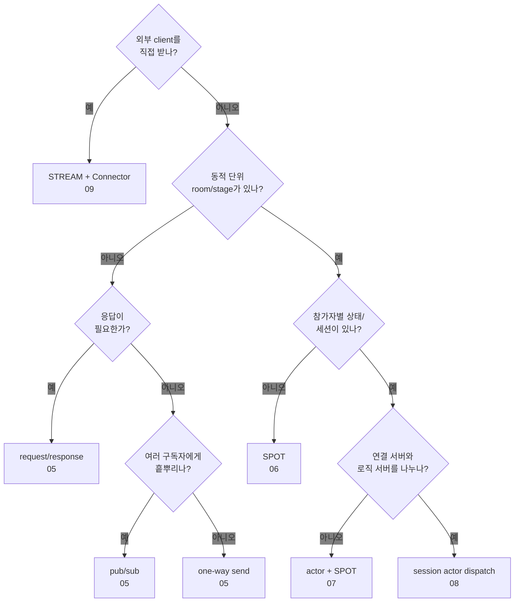

<!-- framework-adapter-nav:start -->
[문서 목록](../../../README.ko.md) | [이전: 핵심 개념](03-concepts.ko.md) | [다음: Channel Messaging — request · send · pub/sub](05-channel-messaging.ko.md)
<!-- framework-adapter-nav:end -->

# 4. 기능 맵 — 무엇을, 얼마나 쉽게, 언제

> 각 기능의 사용법은 뒤 챕터(05~12)가, 정식 계약은 spec 문서가 다룬다. 이 문서는
> 기능 선택을 돕는 지도다 — 무엇이 있고, 얼마나 어렵고, 언제 쓰는지 여기서 잡고
> 해당 챕터로 이동한다.

## 1. 난이도 기준

| 등급 | 의미 |
|------|------|
| **낮음** | handler 1개 + channel 등록 수준. 가이드만으로 도입 가능 |
| **중간** | lifecycle/factory/등록 조합을 이해해야 함 |
| **높음** | 분산 토폴로지·session routing 결정이 필요 |

## 2. 기능 × 난이도 × 언제 쓰나

| 기능 | 난이도 | 언제 쓰나 | 가이드 | 정식 문서 |
|------|:------:|-----------|--------|-----------|
| 서버 간 request/response | 낮음 | 서비스 A가 서비스 B의 결과가 필요할 때 | [5](05-channel-messaging.ko.md) | [channel-messaging](../../common/spec/server/languages/dotnet/01-system-structure.ko.md) |
| 서버 간 단방향 send | 낮음 | 응답 없는 작업 위임/통지 | [5](05-channel-messaging.ko.md) | [channel-messaging](../../common/spec/server/languages/dotnet/01-system-structure.ko.md) |
| pub/sub 이벤트 fan-out | 낮음 | domain event를 여러 구독자에게 전파 | [5](05-channel-messaging.ko.md) | [channel-messaging](../../common/spec/server/languages/dotnet/01-system-structure.ko.md) |
| SPOT(room/stage/zone) | 중간 | 동적 생성·소멸 논리 단위 라우팅 | [6](06-spot.ko.md) | [spot](../../common/spec/server/languages/dotnet/01-system-structure.ko.md) |
| 일반 handler에서 Spot 흐름 진입 | 중간 | HTTP/세션 gateway가 actor 생성 또는 Entry Spot join으로 `ActorRef` 확보 | [6](06-spot.ko.md) | [spot](../../common/spec/server/languages/dotnet/01-system-structure.ko.md) |
| Spot 자동 turn dispatch | 높음 | I/O 완료를 기다리는 동안 실행 turn을 반납하고 원래 dispatcher 문맥에서 재개할 때 | [6](06-spot.ko.md) | [async-execution-policy](../../common/spec/05-async-execution-policy.ko.md) |
| Spot timer (게임 루프 등) | 중간 | 주기 tick, heartbeat, 정리 작업 | [6](06-spot.ko.md) | [spot](../../common/spec/server/languages/dotnet/01-system-structure.ko.md) |
| Stage wrapper | 중간 | `playhouse` Stage 류를 SPOT 위에 얹을 때 | [6](06-spot.ko.md) | [stage-wrapper](../../common/spec/server/languages/dotnet/02-handler-interfaces.ko.md) |
| actor / Entry Spot | 높음 | session과 묶인 actor로 packet 자동 dispatch | [7](07-actor-spot.ko.md) | [actor](../../common/spec/server/languages/dotnet/02-handler-interfaces.ko.md) |
| session actor dispatch | 높음 | 연결 서버와 로직 서버를 분리(재접속 이전성) | [8](08-actor-session.ko.md) | [session-actor-dispatch](../../common/spec/server/languages/dotnet/02-handler-interfaces.ko.md) |
| STREAM session(서버) | 중간 | 외부 client(TCP/WS)를 framework로 받기 | [9](09-stream.ko.md) | [stream](../../common/spec/server/languages/dotnet/01-system-structure.ko.md) |
| Stream Connector(client) | 중간 | client 측에서 STREAM 서버에 접속 | [9](09-stream.ko.md) | [공개 계약](../../common/spec/stream-connector/languages/dotnet/03-stream-connector.ko.md) |
| Location 자동 연결·운영 조회 | 중간 | endpoint를 코드에 적지 않고 서버 증감을 따라가고 싶을 때 | [10](10-location.ko.md) | [location runtime](../../common/spec/21-location-runtime.ko.md) |
| spot 주소 메시징 | 중간 | 다른 노드의 spot/actor로 반복해서 보낼 때(조회 1회 후 주소 보관) | [6](06-spot.ko.md) §5 | [spot 주소 메시징](../../common/spec/16-spot-address-messaging.ko.md) |
| runtime monitoring | 낮음 | socket/mesh/location 이벤트와 spot timer 실패 관찰 | [11](11-monitoring.ko.md) | [monitoring](../../common/spec/server/languages/dotnet/01-system-structure.ko.md) |
| 메시지 흐름 추적 · flow_id | 낮음 | 요청 하나·업무 흐름 하나의 생애주기를 노드 간에 추적 | [11](11-monitoring.ko.md) §5 | [message-flow-tracing](../../common/spec/26-message-flow-tracing.ko.md) · [flow-correlation](../../common/spec/27-flow-correlation.ko.md) |
| 런타임 메트릭 | 낮음 | CCU·큐 깊이·요청 지연을 대시보드로 볼 때(`AddMeter` 한 줄) | [12](12-operations.ko.md) §1 | [runtime-metrics](../../common/spec/25-runtime-metrics.ko.md) |
| graceful drain & readiness | 중간 | 무중단 배포·축소에서 접속 유저를 지키며 노드를 내릴 때 | [12](12-operations.ko.md) §2~§4 | [graceful-drain-handoff](../../common/spec/28-graceful-drain-handoff.ko.md) |

## 3. 빠른 선택 가이드

- **서비스끼리 호출만** → request/response 또는 send. 난이도 낮음,
  [02-getting-started](02-getting-started.ko.md)로 충분.
- **이벤트를 흩뿌린다** → pub/sub.
- **방/판/존 같은 동적 단위** → SPOT. 그 안에 참가자별 상태/세션이 있으면 actor.
- **일반 handler에서 Spot 흐름으로** → actor 생성 또는 Entry Spot join으로 `ActorRef` 확보.
- **외부 게임/모바일 client** → STREAM(서버) + Stream Connector(client).
- **연결 서버와 로직 서버 분리(재접속 이전성)** → session actor dispatch.

## 4. 기능을 실제로 보여 주는 샘플

각 sample은 의도가 겹치지 않게 서로 다른 기능 묶음을 맡는다. "이 기능을 실행 코드로
보고 싶다"면 아래에서 대표 sample로 이동한다. 언어 중립 업무 흐름은 공통 sample이,
`.NET` 등록과 실행 방법은 연결된 문서가 맡는다.

| sample | 핵심 기능 묶음 | codec | 언어별 실행 문서 |
|--------|----------------|:-----:|------------------|
| TicTacToe | 수동 endpoint 직접 연결, STREAM auth, actor game join | JSON | [TicTacToe](../../common/sample/tictactoe/README.ko.md) |
| Bingo | location store 자동 연결, 분리 gateway, Entry Spot, room Spot timer, bound push | Protobuf | [Bingo](../../common/sample/bingo/README.ko.md) |
| SupportChat | conversation Spot, reconnect 이전성, idle timer→close, bound push | JSON | [SupportChat](../../common/sample/supportchat/README.ko.md) |
| DeliveryDispatch | HTTP intake, timeout 재배정, status fanout, delivery Spot, 고객 push | JSON | [DeliveryDispatch](../../common/sample/deliverydispatch/README.ko.md) |
| ShoppingMall | event sourcing, OrderId owner routing, projection rebuild, 보상, scale-out | JSON | [ShoppingMall](../../common/sample/event/shoppingmall.ko.md) |
| GameQuest | fanout 구독, player owner, quest event sourcing, reward idempotency | JSON | [GameQuest](../../common/sample/event/gamequest.ko.md) |

> 기능별 사용법은 05~12가, 샘플의 언어 중립 공통 시나리오는
> [spec/sample](../../common/sample/README.ko.md)가 다룬다.

## 5. 이동 중 actor request는 완료된다

actor가 다른 node로 이동하는 동안 보낸 request도 원래 caller에서 완료된다. target이
처리한 reply는 원래 caller로 correlate되고, timeout은 caller의 기존 경로를 그대로
따르며, 늦게 도착한 reply는 drop된다([spot-actor 스펙 §10.5](../../common/spec/15-spot-actor.ko.md)).
이동 중 reply를 기다리는 request 수는 `zlink.mesh_node.requests.inflight`의
`surface=actor` 값으로 관측한다([12-operations §1](12-operations.ko.md)).

## 6. 더 보기

- 핵심 개념: [03-concepts](03-concepts.ko.md)
- ZLink를 어디에 쓰나(새 서비스 도입 판단): [14-grpc-alternative](14-grpc-alternative.ko.md)
- 모든 계약 인터페이스를 코드로(ContractTests 검증): [13-interface-catalog](13-interface-catalog.ko.md)
- 전체 인터페이스 카탈로그(언어 중립 정식): [spec/handler-interfaces](../../common/spec/server/languages/dotnet/02-handler-interfaces.ko.md)
- 동작 계약은 각 기능 spec을 따르고, 검증 범위는
  [regression test matrix](../internals/regression-test-matrix.ko.md)에서 확인한다.

---
<!-- framework-adapter-nav:bottom:start -->
[문서 목록](../../../README.ko.md) | [이전: 핵심 개념](03-concepts.ko.md) | [다음: Channel Messaging — request · send · pub/sub](05-channel-messaging.ko.md)
<!-- framework-adapter-nav:bottom:end -->
