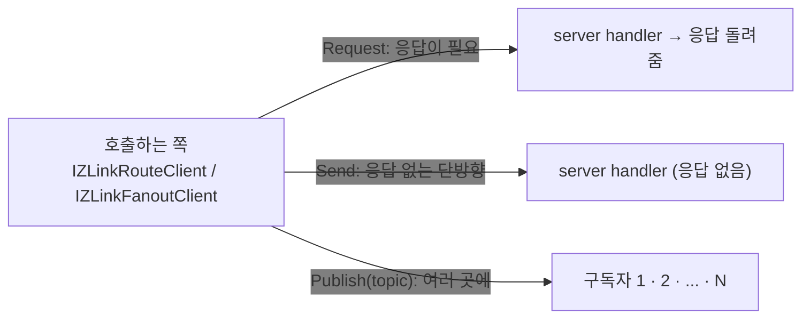
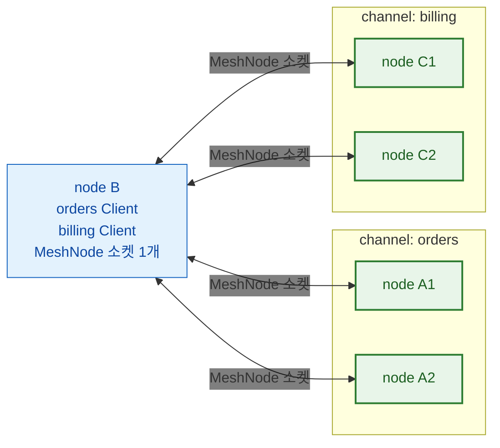
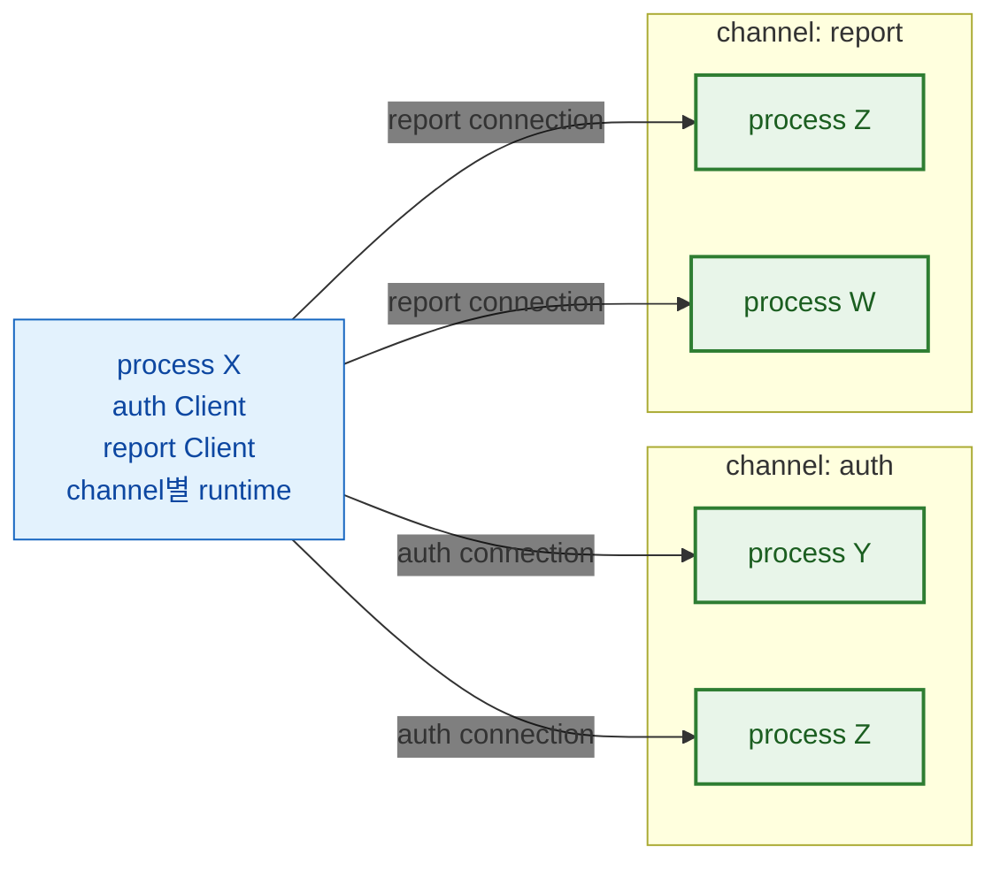
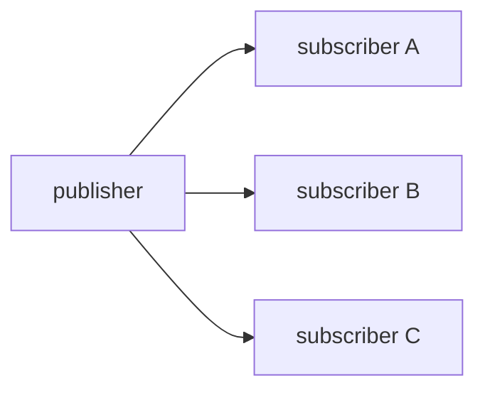
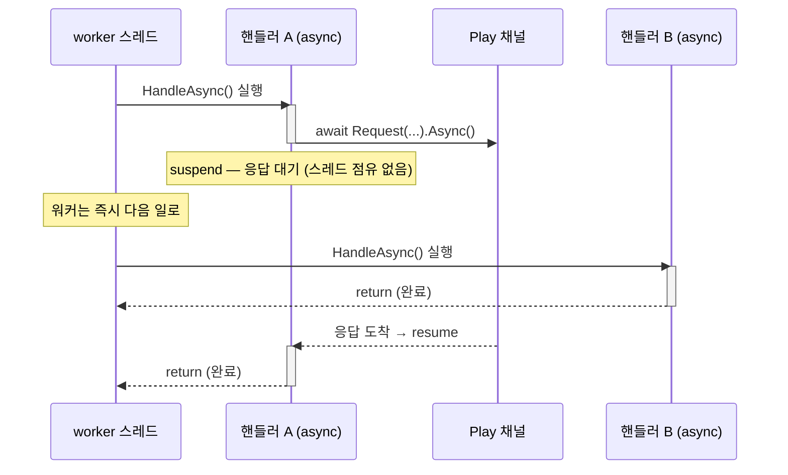
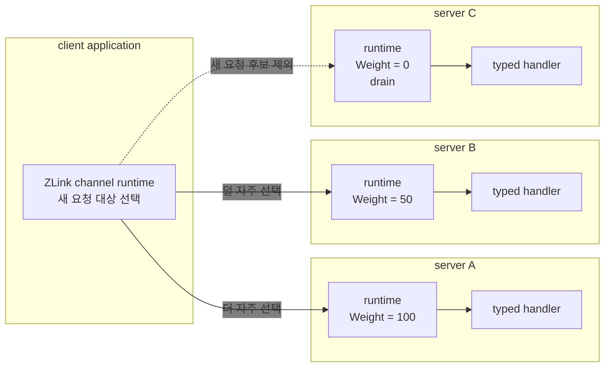
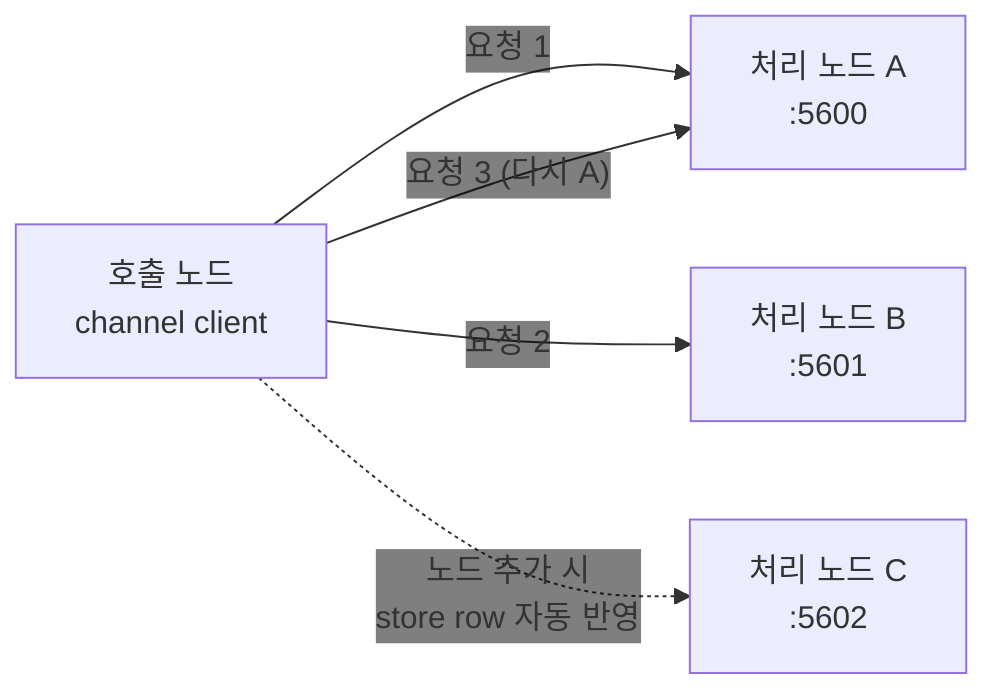
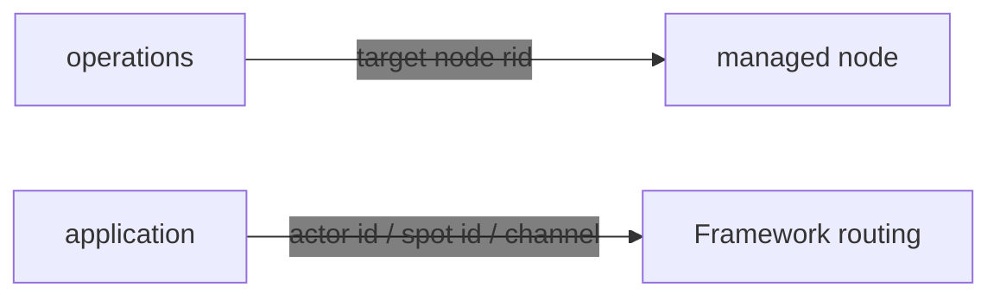

<!-- framework-adapter-nav:start -->
[문서 목록](../../../README.ko.md) | [이전: 핵심 개념](03-concepts.ko.md) | [다음: SPOT — room · stage · zone](06-spot.ko.md)
<!-- framework-adapter-nav:end -->

# 5. Channel Messaging — request · send · pub/sub

> 정식 계약은 [Channel messaging exact interface](../../common/spec/server/languages/dotnet/interfaces/04-channel-messaging.ko.md)와
> [Topology exact interface](../../common/spec/server/languages/dotnet/interfaces/03-configuration-topology.ko.md)가 다룬다. 이
> 챕터는 그 표면을 실제로 어떻게 등록하고 호출하는지 사용법 중심으로 다룬다.

channel messaging은 framework의 가장 기본 축이다. 세 가지 상호작용을 다룬다.

- **request/response** — 응답이 필요한 1:1 호출 (DEALER → ROUTER)
- **one-way send** — 응답이 없는 단방향 명령 (DEALER → ROUTER)
- **publish/subscribe** — 여러 구독자에게 이벤트 fan-out (PUB / SUB)

> 🔰 용어(channel·handler·client·codec 등)가 낯설면
> [03-concepts](03-concepts.ko.md)의 개념 설명을 먼저 본다.
> 괄호 안 `DEALER → ROUTER`·`PUB / SUB`는 하부 소켓 종류로, **어플리케이션이 직접 다루지
> 않는다**(framework가 channel 종류에 따라 자동 매핑).

세 상호작용을 그림으로 먼저 잡으면 이렇다.



- **request** 는 보낸 뒤 **응답을 기다린다**(예: 가격 조회).
- **send** 는 **던지고 끝**이다(예: 캐시 무효화 통지).
- **publish** 는 한 번 보내면 **구독한 모두**가 받는다(예: 도메인 이벤트 전파).

## 0. gRPC를 쓰던 웹 서비스라면

channel messaging은 일반 웹·마이크로서비스 백엔드에서 **서비스 간 gRPC를 대체**하는
용도로 쓴다. 서비스마다 host:port를 알리거나 앞단에 gateway·로드밸런서를 둘 필요 없이,
논리 channel 이름과 location store 자동 연결로 호출을 묶는다. `.proto` IDL·HTTP/2 전용
인프라·코드 생성 없이 DTO(record)와 typed handler만으로 gRPC의 네 가지 호출 형태를 얻는다.

| gRPC 패턴 | ZLink 대체 | 이 가이드 |
|-----------|------------|-----------|
| Unary RPC | request/response | [handler 작성](#2-handler-작성) · [outbound 호출](#4-outbound-호출) |
| Unary `Empty` / fire-and-forget | one-way send | [handler 작성](#2-handler-작성) · [outbound 호출](#4-outbound-호출) |
| Server streaming / 이벤트 피드 | pub/sub fan-out | [outbound 호출](#4-outbound-호출) |
| Client/Bidi streaming | STREAM session | [09-stream](09-stream.ko.md) |
| 서비스 위치 조회(DNS/xDS) | location store 자동 연결 | [10-location](10-location.ko.md) |
| Interceptor | handler filter | [filter](#5-filter--공통-처리) |
| Deadline | request timeout | [outbound 호출](#4-outbound-호출) |

호출 경로에서 달라지는 지점은 하나다. gRPC는 stub이 만든 요청을 L7 로드밸런서나 service
mesh sidecar가 받아 scale-out된 서버 중 하나로 보내지만, ZLink는 application이 논리 channel
이름으로 요청하면 framework runtime이 연결된 서버 runtime 중 하나를 직접 고른다. 그래서
application 코드에 남는 것은 endpoint나 프록시 설정이 아니라 **channel 이름과 handler**다.

예를 들어 주문 서비스라면, gRPC `rpc PlaceOrder(...)`가 다음과 같이 바뀐다.

```csharp
// 서버: handler 하나 (gRPC service 구현 대신)
public sealed class PlaceOrderHandler
    : IZLinkRequestHandler<PlaceOrder, OrderPlaced>
{
    private readonly IOrderStore _orders;
    public PlaceOrderHandler(IOrderStore orders) => _orders = orders;

    public async ValueTask<OrderPlaced> HandleAsync(
        PlaceOrder request, IZLinkMessageContext context, CancellationToken ct)
    {
        await _orders.SaveAsync(request, ct);
        return new OrderPlaced(request.OrderId);
    }
}

// 클라이언트: gRPC stub 대신 IZLinkRouteClient 주입
var placed = await client
    .RequestToChannel("orders",                 // 대상은 ChannelName 하나. 주소도 MeshName도 넣지 않는다.
        new PlaceOrder("order-1042", "acct-77", 18742))
    .Async<OrderPlaced>(ct);
```

이 호출 표면(`RequestToChannel`/`SendToChannel`/`Publish` + 종결자)은
[13-interface-catalog](13-interface-catalog.ko.md) §1.6의 계약 테스트
`ChannelContracts.Channel_messaging_replaces_grpc_unary_command_and_streaming_for_web_services`
로 검증된다.

> 배치 구조·호출 경로·인프라 대응을 gRPC 스택과 나란히 놓고 보려면
> [14-alternative](14-alternative.ko.md)가 그 비교를 다룬다. 이 챕터는 그 판단이 끝난
> 뒤의 사용법을 다룬다.

## 1. channel 종류

[channel](03-concepts.ko.md#1-channel--서버-간-연결)은 주소 대신 `"orders"` 같은 논리
이름으로 호출 대상을 고르는 서버 간 연결 단위다. 그 이름을 `ChannelName`이라 하고,
이름을 등록한 node 중 하나가 요청을 받는다.

"channel"이라는 이름을 쓰는 등록은 셋이다. 모두 `ChannelName`을 사용하지만, 지원하는
메시징 방식과 소켓을 공유하는지가 다르다. 여기서 **MeshNode**는 한 process가 하나
가지는 서버 간 연결의 기초 단위이며, route mesh channel은 그 소켓 위에 이름만 얹는다.

| 종류 | 등록 | 소켓 | 연결 패턴 |
| --- | --- | --- | --- |
| route mesh channel | `mesh.Channel(name).Server()`/`.Client()` | 이미 열려있는 MeshNode 소켓을 공유한다 | `ChannelName` select-one으로 request/send, Spot 간 publish(Logical Multicast) — RID를 직접 지정하는 Node direct는 별도([관리 대상 노드 직접 호출](#9-route-mesh--관리-대상-노드-직접-호출)) |
| ClientServer channel | `AddClientServerChannel(name)` | MeshNode와 별개인 자기 소켓을 연다(`.Listen()`, 연결은 수동 `.Connect()` 또는 자동 discovery) | Client가 시작한 request/send만 — Server는 그 reply 말고는 먼저 보낼 수 없다 |
| fanout channel | `AddFanoutChannel(name)` | 독자적인 PUB/SUB 소켓을 연다 | publisher → 다수 subscriber |

앞의 둘은 특히 구분하기 쉽지 않다. **route mesh channel은 MeshNode 연결을 공유하는
논리 이름**이고, **ClientServer channel은 다른 channel과 transport를 공유하지 않는
독립 연결 단위**다.

### 1.1 route mesh channel — 연결은 한 번, channel은 그 위의 이름

MeshNode 소켓 하나로 mesh에 연결하고, channel 이름은 그 위에서 "이 요청을 누가
받는가"를 가르는 논리 묶음이다.



node B는 소켓 하나로 mesh에 연결되어 있고, 그 위에서 `orders`와 `billing`을 둘 다
호출한다. `orders`를 호출하면 select-one이 그 상자 안의 A1·A2 중 하나를, `billing`을
호출하면 C1·C2 중 하나를 선택한다. 상자는 소켓이 아니라 이름으로 묶인 그룹이므로,
channel을 열 개 더 등록해도 B의 소켓은 하나다.

### 1.2 ClientServer channel — channel별 독립 runtime

ClientServer channel은 RouteMesh transport를 공유하지 않는다. Channel마다 독립
runtime을 만들고, 그 runtime이 Ready Server별 연결을 관리한다.



Server가 둘이면 channel runtime은 두 Server connection을 유지하고 select-one으로
하나를 고른다. `auth`와 `report`는 연결 대상과 수명을 서로 공유하지 않는다. 같은
process Z가 양쪽 channel에 모두 참여해도 각 channel runtime이 Z와의 연결을 따로
관리한다.

방향도 고정이라 Server는 Client가 시작한 요청에만 응답할 수 있다. Server가 먼저 알림을
보내야 한다면 ClientServer가 아니라 RouteMesh를 사용한다. TicTacToe에서 로그인 인증
(`tictactoe.api` ClientServer channel)을 Game Spot 생성(MeshNode의 Object role)과
분리하는 이유다([02-getting-started §7](02-getting-started.ko.md)).

### 1.3 pub/sub은 두 갈래다

[Spot](03-concepts.ko.md#2-spot--상태를-소유하고-순서대로-처리하는-단위)은 id로 찾는 상태
객체이고 자기 앞으로 온 일을 한 줄로 세워 처리한다. route mesh channel 위에서 그 Spot끼리
이벤트를 주고받는 것을 **Logical Multicast**라 한다.
[앞의 다이어그램](#11-route-mesh-channel--연결은-한-번-channel은-그-위의-이름)처럼 이미 연결된
mesh 소켓을 그대로 사용하므로 별도 소켓이 없고,
받는 쪽은 그 channel에서 같은 topic을 구독한 Spot으로 한정된다.

```csharp
// 발행 — TicTacToeGame spot 안에서.
await Context.Outbound
    .Publish(SampleTopics.PlayerMilestoneChannel,   // 전달 범위를 정하는 ChannelName.
             SampleTopics.PlayerMilestone,          // 그 안에서 받을 Spot을 고르는 topic.
             milestoneEvent)
    .Async(cancellationToken);

// 구독 — PlayEntrySpot이 시작할 때.
Context.Handlers.AddSubscribe<PlayerWinMilestoneEventHandler>(
    SampleTopics.PlayerMilestoneChannel,            // 발행 쪽과 같은 ChannelName·topic이어야 받는다.
    SampleTopics.PlayerMilestone);
```

Spot 밖에서 발행해야 하면 `IZLinkSpotPublisherClient`를 주입받아 같은 방식으로 보낸다.

반대로 **fanout channel**(스펙에서는 **Classic fanout**)은 그 자체로 독립된 PUB/SUB
소켓 쌍을 연다. Spot이나 MeshNode와 무관하게 발행자 하나가 연결된 구독자 전원에게
전달한다.



둘 다 **발행 완료가 전달을 보장하지는 않는다.** 발행 호출이 완료됐다는 것은 전송
준비가 로컬에서 접수됐다는 의미이며, 구독자가 그 이벤트를 처리했다는 확인이 아니다.
저장·재전송·ack도 제공하지 않는다.

차이는 **대상 범위**다. Logical Multicast는 그 mesh 안에서 같은 channel·topic을 구독한
Spot으로 한정되고, Classic fanout은 mesh 구성과 무관하게 연결된 구독자 전체로 전달된다.

이어지는 절은 ChannelName request/send와 fanout publish를 차례로 다룬다. 노드를 늘려
처리량을 키우는 방법은 [ChannelName 수평 확장](#8-channelname-수평-확장)이, 특정 노드
하나를 지목하는 Node direct는 [관리 대상 노드 직접 호출](#9-route-mesh--관리-대상-노드-직접-호출)이
따로 다룬다.

## 2. handler 작성

세 가지 상호작용이 각각 어떤 호출과 어떤 handler로 짝을 이루는지 먼저 본다.

| 종류 | 보내는 호출 | 받는 handler | 완료가 뜻하는 것 |
| --- | --- | --- | --- |
| request | `RequestToChannel(name, req).Async<TReply>(ct)` | `IZLinkRequestHandler<TRequest, TReply>` | 상대의 reply가 도착했다 |
| send | `SendToChannel(name, msg).Async(ct)` | `IZLinkSendHandler<TMessage>` | 보내기가 접수됐다 — 상대 처리 결과는 아니다 |
| publish (fanout) | `Publish(name, topic, evt).Async(ct)` | `IZLinkFanoutHandler<TEvent>` | 전송 준비가 접수됐다 — 구독자 수신은 아니다 |

channel handler는 독립 class다. 서로 다른 요청이 동시에 실행될 수 있으므로 가변 도메인
상태를 handler 멤버에 두지 않는다. Handler instance와 scoped dependency는 그 dispatch가
끝날 때까지만 유지된다.

> Framework는 HTTP 요청을 처리하지 않는다. `ASP.NET Core`의 endpoint·middleware가
> HTTP를 맡고, channel handler는 그와 별개인 서버 간 메시지 dispatch 경로다. class를
> 만들어 DI로 의존성을 받고 등록해 두면 runtime이 호출한다는 **작성 방식**이 controller
> action과 닮았을 뿐이다.

handler는 인터페이스를 구현하고, 결과를 반환값으로 돌려준다.

```csharp
// request-response
public sealed class GetProfileHandler
    : IZLinkRequestHandler<GetProfileRequest, GetProfileReply>
{
    private readonly IProfileStore _store;
    public GetProfileHandler(IProfileStore store) => _store = store;

    public async ValueTask<GetProfileReply> HandleAsync(
        GetProfileRequest request,
        IZLinkMessageContext context,
        CancellationToken cancellationToken)
    {
        var profile = await _store.LoadAsync(request.AccountId, cancellationToken);
        return new GetProfileReply(profile.AccountId, profile.Nickname);
    }
}

// one-way send (응답 없음)
public sealed class RefreshCacheHandler
    : IZLinkSendHandler<RefreshCacheCommand>
{
    public ValueTask HandleAsync(
        RefreshCacheCommand message,
        IZLinkMessageContext context,
        CancellationToken cancellationToken)
    {
        // 캐시 무효화 등. 호출자는 결과를 기다리지 않는다.
        return ValueTask.CompletedTask;
    }
}

// publish 수신 (구독자 측)
public sealed class CacheRefreshedEventHandler
    : IZLinkFanoutHandler<CacheRefreshedEvent>
{
    public ValueTask HandleAsync(
        CacheRefreshedEvent message,
        CancellationToken cancellationToken)
    {
        // Classic fanout handler는 등록한 event type의 payload만 받는다.
        return ValueTask.CompletedTask;
    }
}
```

- handler 의존성은 **생성자 주입**으로 받는다(`IProfileStore`처럼). context에서
  service를 꺼내는 service locator 패턴은 쓰지 않는다.
- channel request와 send handler는 공통 `IZLinkMessageContext`에서 nullable ChannelName,
  packet 이름, content type, correlation과 metadata를 읽는다. Cancellation은 context가 아니라
  별도 `CancellationToken` 인자가 소유한다. Logical Multicast subscription은
  `ZLinkPublishMessageContext`에서 topic과 nullable source를 추가로 제공한다. Classic fanout
  `IZLinkFanoutHandler<TEvent>`는 typed event와 `CancellationToken`만 받는다.
- handler class는 dispatch 키가 아니라 **코드 조직 단위**다. 메서드를 한 class에
  주제별로 묶어도, packet마다 class를 따로 둬도 동작은 같다.
- interface 기반 handler는 컴파일 타임 타입 체크가 가장 강하다. `HandleAsync(...)`
  의 payload, context, return 타입이 interface 계약과 맞지 않으면 컴파일이 실패한다.

### attribute 기반 메서드 handler

인터페이스 대신 attribute를 단 메서드로도 같은 handler를 작성할 수 있다. 한
class에 여러 handler 메서드를 둘 때 편하다.

```csharp
[ZLinkHandlerGroup("api")]   // 이 class의 메서드들을 "api" group으로 묶는다. 어느 channel에 노출할지는 등록이 정한다.
public sealed class UserHandlers
{
    private readonly IZLinkFanoutClient _publisher;
    public UserHandlers(IZLinkFanoutClient publisher) => _publisher = publisher;

    [ZLinkRequest]   // 메서드 attribute가 handler 종류를 정한다(channel 이름은 안 받음)
    public ValueTask<GetUserReply> GetUserAsync(
        GetUserRequest request,            // 인자 순서 = (payload, context?, ct?) — context·토큰은 생략 가능
        IZLinkMessageContext context,
        CancellationToken cancellationToken)
        => ValueTask.FromResult(new GetUserReply(request.AccountId, "alice"));

    [ZLinkSend]   // send handler — 반환이 ValueTask(응답 없음). request의 ValueTask<TReply> 와 대비.
    public async ValueTask RefreshCacheAsync(
        RefreshUserCacheCommand command,
        IZLinkMessageContext context,
        CancellationToken cancellationToken)
    {
        await _publisher
            .Publish("api.events", "user.cache-refreshed",
                new UserCacheRefreshedEvent(command.AccountId))
            .Async(cancellationToken);
    }
}
```

- 메서드 시그니처는 `(payload, context?, CancellationToken?)` 순서이며 context와
  토큰은 생략할 수 있다.
- attribute 기반 handler는 한 class에 여러 request/send/publish 메서드를 묶기
  쉽지만, interface 기반처럼 handler 계약을 컴파일 타임에 강하게 고정하지는 않는다.
  잘못된 context 타입이나 반환 타입은 framework의 scan/validation 또는 실행 단계에서
  드러날 수 있다.
- `[ZLinkRequest]`/`[ZLinkSend]`/`[ZLinkPublish]`는 **channel 이름을 받지
  않는다.** channel 매핑은 [등록](#3-handler를-channel에-노출하기)이 소유한다.

handler 작성 방식은 다음 기준으로 고른다.

- handler 하나를 class 하나로 분리하고 타입 안전성을 우선하면 interface 기반을 쓴다.
- 같은 주제의 handler 메서드를 한 class에 여러 개 담고 싶으면 attribute 기반을 쓴다.
- 샘플은 handler type을 발견한 뒤 `Channel(name).Server()`의 typed registration으로
  노출 범위를 고정한다.

### 비동기 실행 — `async`/`await`, `ValueTask`

Framework 전반의 비동기 값은 `ValueTask` / `ValueTask<T>`로 표현된다. send는 source
runtime이 작업을 제출할 수 있을 때까지 기다리며 target handler 완료는 기다리지 않는다.
Request는 상대 reply가 도착할 때까지 기다린다. 송신 수락과 backpressure는 framework가
처리한다. 규칙은 하나다 — **런타임(핸들러) 스레드에서는 `await`,
blocking(`.Result`/`.GetAwaiter().GetResult()`)은 테스트·클라이언트 시나리오에서만.**

```csharp
public async ValueTask<CreateGameReply> HandleAsync(
    CreateGameRequest request, IZLinkMessageContext context, CancellationToken ct)
{
    // 런타임(핸들러) 스레드 — await로 비운다. blocking(.Result/.GetAwaiter().GetResult())은 금지.
    var room = await _client
        .RequestToChannel("tictactoe.play", new CreateRoomRequest(request.GameName))
        .Timeout(TimeSpan.FromSeconds(5))   // reply를 기다릴 상한.
        .Async<CreateRoomReply>(ct);        // reply가 도착할 때까지 await로 대기하고 그 reply를 받는다.

    return new CreateGameReply(room.RoomId, room.GameName);
}
```

Channel handler는 channel별 async 수신 루프에서 실행된다. Handler가 `await`에 도달하면
async 상태 머신만 멈추고(suspend) 실행 스레드는 풀로 돌아가 다른 일을 처리한다.

아래 타임라인은 같은 흐름을 시간순으로 본 것이다. A가 `await`로 suspend 되면 같은
스레드가 즉시 B를 처리하고, A는 응답이 오면 resume 된다.



그래서 비동기 호출을 콜백 없이 **동기식 코드처럼 위에서 아래로** 쓰면서도, worker
몇 개로 수많은 동시 요청을 처리한다. 같은 코드를 `.Result`로 막으면 스레드 하나가
계속 점유하기 때문에 핸들러 안에서 금지한다. 실패는 `await` 경로에서 예외로 던져진다.

같은 `await` 규칙이 Spot·Actor handler에도 적용되지만, 그쪽은 turn이 handler 완료까지
유지되어 동시 실행 범위가 다르다 —
[06-spot §2.1](06-spot.ko.md#21-실행-모델--무엇이-무엇과-동시에-실행되나)이 다룬다.

## 3. handler를 channel에 노출하기

framework는 발견한 handler를 모든 channel에 자동으로 열지 않는다. **발견과
노출은 별개 단계**다.

> `AddHandlersFromAssemblyOf<...>`는 handler type을 발견하고, `Channel(name).Server()`의
> typed registration은 어느 MeshNode의 어느 channel에 노출할지 고정한다.

### RouteMesh와 handler 등록

```csharp
builder.Services.AddZLinkFramework(options =>
{
    options.AddHandlersFromAssemblyOf<Program>(); // handler type 발견
    var mesh = options.AddRouteMesh("services")
        .Listen("tcp://0.0.0.0:7101")
        .SetRoutingId(RoutingId.From("api-1"));
    mesh.Channel("api").Server()                 // Server()가 handler를 받는 역할이다.
        .AddRequestHandler<GetProfileHandler, GetProfileRequest, GetProfileReply>()
        .AddSendHandler<RefreshCacheHandler, RefreshCacheCommand>();
});
```

### 한 MeshNode에 여러 channel 등록

같은 MeshNode 위에 channel을 여러 개 얹을 수 있고, channel마다 역할이 다를 수 있다.

```csharp
var mesh = options.AddRouteMesh("services")
    .Listen("tcp://0.0.0.0:7101")
    .SetRoutingId(RoutingId.From("api-1"));

mesh.Channel("api").Server()                     // 이 node가 처리하는 channel.
    .AddRequestHandler<GetProfileHandler>();     // payload·reply 타입은 handler가 이미 고정한다.
mesh.Channel("billing").Client();                // 호출만 하는 channel은 Client — handler를 등록하지 않는다.
```

fanout channel의 구독 handler는 fanout builder의 `AddHandler<...>()`로 등록한다.

> **샘플에서 보기 — [ZoneWorld](../../common/sample/zoneworld/README.ko.md).** 한 등록
> 코드 안에서 세 종류가 모두 나온다. 관제 보고는 route mesh channel로, 전 노드 공지는
> fanout channel로 받는다.
>
> ```csharp
> mesh.Channel(ZoneWorldNames.ZoneChannel).Server();    // 이 노드가 처리하는 channel.
> mesh.Channel(ZoneWorldNames.ReportChannel).Client();  // 보고를 보내기만 하는 channel.
>
> options.AddFanoutChannel(ZoneWorldNames.BroadcastChannel)
>     .ConnectSubscriber(shared.BroadcastEndpoint)      // publisher endpoint에 연결한다.
>     .AddHandler<WorldAnnounceSubscriber, WorldAnnounceEvent>()
>     .AddHandler<NodeMaintenanceChangedSubscriber, NodeMaintenanceChangedEvent>();
> ```

> **packet 이름 해석 순서:** ① handler 등록의 `packetName` 인자 → ②
> payload 타입의 `[ZLinkPacket("...")]` → ③ 둘 다 없으면 타입 이름(`Type.Name`).
> packet 이름은 이렇게 **등록 시 한 번** 확정된다. 호출 call마다 다시 지정하는
> 표면은 없다. 같은 channel 안에서 `kind + packet 이름`이 겹치면 **시작 단계에서
> 예외**다. 다른 channel끼리는 같은 packet 이름을 재사용해도 된다.

### 잘못된 등록은 시작 단계에서 막힌다

같은 process에서 같은 MeshName을 두 번 등록하거나 MeshNode에 ChannelName을 하나도
등록하지 않으면 startup이 실패한다. ChannelName handler는 MeshName, ChannelName,
message kind와 packet name으로 구분한다. 같은 key를 중복 등록하면
`ZLinkConfigurationException`으로 실패하고, 서로 다른 MeshName이나 ChannelName에는
같은 packet name을 사용할 수 있다. Fanout handler는 독립 fanout channel builder에
등록하며 RouteMesh handler와 섞지 않는다. local endpoint나 peer 연결 정보가 빠진 경우와
허용되지 않는 handler 반환형도 같은 자리에서 걸린다. 이 검사는 첫 호출까지 미루지 않고
**host startup에서 즉시** 예외로 막는다.

## 4. outbound 호출

### request / send — `IZLinkRouteClient`

```csharp
public sealed class PriceService(IZLinkRouteClient client)
{
    public async Task<decimal> GetAsync(string symbol, CancellationToken ct)
    {
        var reply = await client
            .RequestToChannel("price", new PriceRequest(symbol))   // 대상은 ChannelName 하나다.
            .Async<PriceReply>(ct);    // request: reply 타입은 payload가 아니라 .Async<T> 에서 지정
        return reply.Price;
    }

    public async ValueTask RefreshAsync(string accountId, CancellationToken ct)
        => await client
            .SendToChannel("profile", new RefreshCacheCommand(accountId))
            .Async(ct);          // send: 내 runtime이 제출을 받아들일 때까지만 기다린다
}
```

- reply 타입은 메시지가 아니라 **`.Async<TReply>(...)`** 에서 지정한다.
- **`Timeout(...)`은 request 전용 선택 종결자다.** reply 대기 시간은 전역 기본
  **30초**이고, 기본과 달라야 할 때만 붙인다(우선순위는 아래 예제 주석 참고).
  `Send`/`Publish`는 응답을 기다리지 않으므로 timeout 표면 자체가 없다.
- packet 이름은 호출 시점에 바꿀 수 없다.
  [등록할 때](#3-handler를-channel에-노출하기) 한 번 확정된다.
- `IZLinkRouteClient`는 startup에 등록한 RouteMesh를 사용한다. MeshName이나
  ChannelName이 등록되어 있지 않으면 `ZLinkConfigurationException`으로 실패한다.
- **send가 `async`인 이유는 응답이 아니라 보낼 자리를 기다리기 때문이다.** 받는 쪽이
  밀리면 그 자리가 날 때까지 기다렸다가 제출하고, 끝내 나지 않으면 `DeadlineExceeded`로
  끝난다. 이 동작과 관련 옵션은 [16-options](16-options.ko.md#31-backpressure--보낼-자리가-없을-때)가 다룬다.

기본과 달라야 할 때만 종결자를 붙인다:

```csharp
await client
    .RequestToChannel("price", new PriceRequest(symbol))
    .Timeout(TimeSpan.FromSeconds(5))  // 이 호출의 reply 대기 상한을 기본(30초)과 다르게 둘 때만 지정
    .Async<PriceReply>(ct);
// reply 대기 상한 결정 순서(앞이 우선):
//   1) 호출별 .Timeout(...)
//   2) MeshNode builder의 SetDefaultRequestTimeout(...)
//   3) 전역 options.DefaultRequestTimeout (기본 30초)
```

### publish — `IZLinkFanoutClient`

```csharp
public sealed class ProfileService(IZLinkFanoutClient publisher)
{
    public async ValueTask AnnounceAsync(string accountId, CancellationToken ct)
        => await publisher
            // 인자 = (channel, topic, message). topic("profile.cache-refreshed")이 fan-out 라우팅 키다.
            .Publish("api.events", "profile.cache-refreshed",
                new ProfileCacheRefreshedEvent(accountId))
            .Async(ct);
}
```

- topic은 선택이다. `Publish(channelName, message)`로 보내면 그 channel의 구독자 전체가
  받고, `Publish(channelName, topic, message)`는 topic을 분류 라벨로 함께 싣는다.
- publish 한 message는 **구독자 수와 무관하게 한 번만 인코딩**된다. framework는 그
  인코딩 결과를 **구독 중인 각 구독자 연결로 한 번씩 전달**할 뿐, 구독자마다 다시
  직렬화하지 않는다(framework 내부 최적화).
- `IZLinkFanoutClient`는 fanout channel에 publish 하는 DI client 이다.

> **구독 연결.** 구독자는 `AddFanoutChannel(name).ConnectSubscriber(endpoint)`로
> publisher endpoint를 연결한다.

> **구독자 쪽 event dispatch(.NET).** Classic fanout handler는 등록한 typed event와
> `CancellationToken`만 받으며 transport topic을 handler context로 노출하지 않는다. 업무 분기가
> 필요하면 event type이나 등록한 handler를 나눈다.

> **샘플에서 보기 — [DeliveryDispatch](../../common/sample/deliverydispatch/README.ko.md).**
> HTTP로 접수한 주문을 channel 호출로 배차 서버에 위임하고, 배송 상태 변화를 fanout
> publish로 관제·고객 push 구독자에 전파한다. request/send/publish 세 표면이 한 업무
> 흐름 안에서 함께 쓰이는 대표 예다.
>
> ```csharp
> public ValueTask HandleAsync(EventNotify message, CancellationToken ct)
> {
>     // 이 handler에 등록된 EventNotify만 처리한다.
>     return ValueTask.CompletedTask;
> }
> ```

> `Async(...)`/`Async<T>(...)`의 완료는 transport 위임까지만 보장한다.
> remote handler 완료나 구독자 수신을 보장하지 않는다([pub/sub은 두 갈래다](#13-pubsub은-두-갈래다)).

> **pub/sub는 replay가 없다.** 구독자가 **아직 연결되기 전**에 publish 된 메시지나, **연결이 끊긴
> 동안** 지나간 메시지는 다시 받지 못한다(재연결해도 그 사이 것은 안 온다). 놓치면 안 되는 이벤트는
> 별도 재동기화(예: 재연결 후 현재 상태를 한 번 request)로 메운다.

## 5. filter — 공통 처리

ASP.NET Core HTTP middleware(`app.Use(...)`)는 HTTP 파이프라인 전용이라 ZLink
handler에는 적용되지 않는다. 로그·검증·권한 확인·측정처럼 여러 handler에 같은 코드가
반복될 일은 `IZLinkHandlerFilter`로 한곳에 모은다.

```csharp
public sealed class AuditFilter(ILogger<AuditFilter> logger)
    : IZLinkHandlerFilter
{
    public async ValueTask InvokeAsync(
        IZLinkHandlerFilterContext context,   // 이 dispatch의 message 정보 + 어느 경로로 왔는지.
        ZLinkHandlerFilterNext next,          // 인자 없는 delegate — 다음 filter 또는 handler를 실행한다.
        CancellationToken cancellationToken)
    {
        // 운영 명령만 감사 로그로 남기고 일반 업무 요청은 그냥 통과시킨다.
        if (context.DispatchKind == ZLinkHandlerDispatchKind.NodeDirectRequest)
            logger.LogInformation("ops {Packet} on {Mesh}", context.PacketName, context.MeshName);

        await next();                         // 호출하지 않으면 handler가 실행되지 않는다.
    }
}

builder.Services.AddZLinkFramework(options =>
{
    options.UseFilter<AuditFilter>();         // 등록한 순서가 곧 실행 순서다.
    options.UseFilter<ValidationFilter>();
});
```

### 어디에 적용되나

filter는 **node가 받는 message**에 적용된다. Spot이나 actor처럼 수명을 가진 객체가
소유한 handler에는 적용되지 않는다 — 그쪽은 자기 실행 순서와 수명을 그대로 쓰고,
공통 처리가 필요하면 그 handler 안에서 한다.

| dispatch | filter |
| --- | --- |
| channel send·request (route mesh channel과 ClientServer channel 모두) | 실행된다 |
| fanout 구독 handler | 실행된다 |
| Node direct route handler([관리 대상 노드 직접 호출](#9-route-mesh--관리-대상-노드-직접-호출)) | 실행된다 |
| Spot handler, actor handler | 실행되지 않는다 |
| Spot이 등록하는 Logical Multicast 구독 | 실행되지 않는다 |
| STREAM session handler | 실행되지 않는다 |

경로별로 다르게 처리하려면 `context.DispatchKind`를 본다. `ChannelSend`·`ChannelRequest`는
route mesh channel과 ClientServer channel을 함께 가리키므로, 둘을 구분해야 하면
`context.MeshName`을 함께 본다 — route mesh channel과 Node direct는 MeshName을 제공하고
ClientServer channel과 fanout은 제공하지 않는다.

### 실행 순서와 중단

등록한 순서대로 handler 앞을 지나고, `next`가 끝나면 반대 순서로 빠져나온다.

```text
AuditFilter 앞부분
  -> ValidationFilter 앞부분
       -> handler
     ValidationFilter 뒷부분
AuditFilter 뒷부분
```

각 filter는 `next`를 최대 한 번 호출한다. 호출하지 않으면 handler를 실행하지 않고
그 dispatch가 끝나는데, 호출한 쪽이 보는 결과는 경로마다 다르다.

| dispatch | 호출한 쪽이 보는 결과 |
| --- | --- |
| send | 그 dispatch만 끝난다. 보낸 쪽은 이미 전송 접수 결과를 받았으므로 달라지는 것이 없다 |
| request | `Rejected` 오류 reply를 받는다. 값이 없다고 `null`이 정상 응답으로 가지 않는다 |
| fanout 구독 | 그 handler 하나만 끝나고 같은 이벤트를 받은 다른 구독 handler는 그대로 실행된다. 발행자에게는 아무것도 전달되지 않는다 |

filter가 응답 값을 직접 만들어 돌려주는 방법은 없다. 요청을 막으려면 `next`를 호출하지
않고, 응답 내용을 바꾸려면 handler에서 처리한다. `next`를 두 번 부르면 handler를 다시
실행하지 않고 오류로 거부한다 — 코드 실수로 분류한다.

### 인스턴스와 의존성

handler 하나를 실행하는 dispatch마다 scope가 새로 열린다. filter와 handler는 그 scope에서
각각 한 번 만들어지고 **같은 `Scoped` 서비스 인스턴스를 공유**한다. filter에서 꺼낸 값을
handler가 그대로 보는 구조이므로, 요청 단위 상태를 scoped 서비스에 담아 넘길 수 있다.
filter type을 DI에 어떤 lifetime으로 등록하든 이 규칙은 바뀌지 않고, `new`가 아니라
DI에서 만들어진다.

fanout은 이벤트 하나가 아니라 **일치한 구독 handler마다** dispatch가 생긴다. 따라서
filter도 그 수만큼 실행되고, 무거운 filter는 구독자가 늘수록 비용이 그만큼 커진다.

## 6. 연결 제어

수동 연결은 MeshNode의 peer 목록에 설정한다.

```csharp
var mesh = options.AddRouteMesh("services")
    .Listen("tcp://0.0.0.0:7102")
    .SetRoutingId(RoutingId.From("profile-client-1"));
mesh.Channel("profile").Client();
mesh.PeerConnections.Connect("tcp://10.0.10.15:7101");
mesh.PeerConnections.Connect("tcp://10.0.10.16:7101");
```

endpoint 인자는 startup 설정이다. host 시작 뒤 실행 중인 socket을 직접 제어하는
handle이 아니다. **단 하나, 가용성(drain/restore)은 런타임에 바꿀 수 있다 — 아래 참조.**

자동 연결 모드는 peer 목록의 소유권이 location store에 있다. 서버가 새 endpoint로 다시
시작하면 store의 descriptor row가 갱신되고 client 연결도 따라 갱신되므로 별도 조작이
필요 없다. 수동 연결은 설정을 바꾼 뒤 애플리케이션을 다시 시작해야 적용된다.

### 운영 drain / restore (런타임)

유지보수·rolling 재시작·scale-in 직전에, 노드를 종료하거나 store의 descriptor row를 제거하지 않고
**새 요청 수신만 멈추고 싶을 때**가 있다. `IZLinkRouteMeshRuntimeOptions`를 주입받아
MeshName과 ChannelName으로 weight를 변경한다.

여기서 쓰는 `Weight`는 drain 전용 플래그가 아니라, ChannelName membership이 새
메시지를 어느 peer로 보낼지 고를 때 참고하는 **peer 가중치**다. 연결된 서버들의
weight가 모두 같으면 새 요청은 균등하게 round-robin으로 분배된다. weight가 서로
다르면 더 큰 값을 가진 서버가 그 비율만큼 더 자주 선택된다. `0`은 "연결은 유지하지만
새 요청 후보에서는 제외"라는 뜻이고, `100`은 기본 정상 serving 값이다.



위 예에서 server C는 연결과 기존 in-flight 처리는 유지하지만 새 요청 후보에서는 빠진다.
server A와 server B처럼 양수 weight를 가진 peer만 새 요청 후보가 되고, 두 값이 같으면
균등하게 round-robin으로 선택된다.

```csharp
// 운영 admin 엔드포인트. "orders"는 등록한 ChannelName이다.
app.MapPost("/admin/channels/orders/drain",
    (IZLinkRouteMeshRuntimeOptions options) =>
    {
        options.Channel("orders").Weight = 0;  // 이 ChannelName을 새 select-one 대상에서 제외
        return Results.Ok();
    });

app.MapPost("/admin/channels/orders/restore",
    (IZLinkRouteMeshRuntimeOptions options) =>
    {
        options.Channel("orders").Weight = 100; // 정상 복귀
        return Results.Ok();
    });
```

- `Weight = 0`(drain)은 serving socket을 **닫지 않는다**. 이 서버를 새 outbound 후보에서
  빼라는 신호다. 이미 들어온 in-flight 요청은
  끝까지 처리·reply 하고, 그 시점 이후 peer 들이 그 노드를 새 요청 대상에서 뺀다.
  store의 descriptor row도 그대로 남는다(graceful drain).
- `Weight = 100`으로 기본 정상 serving 상태로 복귀한다. 값의 범위는 `0..10000`이고
  기본값은 `100`이다 — 100보다 작게 두면 그만큼 덜 선택되고, 크게 두면 더 자주 선택된다.
- 같은 `Weight`를 등록 시점의 초기값으로도 설정한다.

```csharp
var mesh = options.AddRouteMesh("services")
    .Listen("tcp://0.0.0.0:7101")
    .SetRoutingId(RoutingId.From("orders-1"));
mesh.Channel("orders").Server().SetWeight(30); // 이 channel 역할의 시작 weight
```
- drain 신호 전파는 best-effort eventual 이다 — "drain 신호를 보냈다" 까지 보장하고, peer가
  실제로 후보에서 뺀 시점은 모니터링(`PeerAdmissionChanged` 이벤트, [11-monitoring](11-monitoring.ko.md))
  으로 확인한다. `drain`/`restore`라는 운영 어휘는 위처럼 앱 admin 레이어가 `Weight = 0`/`= 100`
  에 이름을 붙여 노출하면 된다.

## 7. 직렬화 codec

payload 직렬화 codec은 framework 등록에서 활성화한다.

```csharp
options.Codecs.Use(ZLinkProtobufCodec.Default);
options.Codecs.Use(ZLinkMessagePackCodec.Default);
```

payload는 codec이 직렬화할 수 있는 DTO 여야 한다. root/요소 타입이
abstract/interface 면 명시 codec 없이는 설정 오류가 난다.

> **샘플에서 보기 — 언제 codec을 명시하나.**
> [Bingo](../../common/sample/bingo/README.ko.md)만 `Codecs.Use(ZLinkProtobufCodec.Default)`를
> 등록하고 `.proto`로 DTO를 정의한다 — 실시간 게임이라 packet 크기와 인코딩 비용을
> 줄이려는 선택이다. 나머지 샘플
> ([TicTacToe](../../common/sample/tictactoe/README.ko.md) ·
> [SupportChat](../../common/sample/supportchat/README.ko.md) ·
> [ShoppingMall](../../common/sample/event/shoppingmall.ko.md) ·
> [DeliveryDispatch](../../common/sample/deliverydispatch/README.ko.md) ·
> [GameQuest](../../common/sample/event/gamequest.ko.md))는 **codec을 아예 등록하지 않고** 기본값을
> 쓴다. 즉 명시 등록은 필요할 때만 하는 선택이고, 기본값으로 시작해도 된다.

기본 codec 외의 포맷(Avro·Thrift 등)이 필요하면 `IZLinkMessageSerializer`를 구현해
content type으로 등록한다. serializer는 업무 객체 ↔ `Message`(byte payload) 변환만
맡고, packet name 결정·codec 선택은 framework가 그대로 처리한다. custom serializer는
한 payload 타입에 대해 **둘 이상이 매칭하면** 구성 오류가 난다. 타입 조건 없이 모든
타입을 받는 fallback serializer는 하나만 두고,
타입 조건을 받는 serializer는 서로 겹치지
않게 여러 개 둘 수 있다.

```csharp
public sealed class AvroOrderSerializer : IZLinkMessageSerializer
{
    private readonly Avro.Schema _schema = Avro.Schema.Parse(SchemaJson);

    // serializer의 책임은 business 객체 ↔ Message(byte payload) 변환뿐. packet name 결정·codec 선택은 framework.
    public Message Serialize(object value, Type type)
    {
        using var buffer = new MemoryStream();
        var writer = new Avro.Generic.GenericWriter<object>(_schema);
        writer.Write(value, new Avro.IO.BinaryEncoder(buffer));
        return Message.From(buffer.ToArray());
    }

    public object? Deserialize(Message message, Type type)
    {
        var reader = new Avro.Generic.GenericReader<object>(_schema, _schema);
        return reader.Read(null!, new Avro.IO.BinaryDecoder(new MemoryStream(message.ToArray())));
    }
}

options.Codecs.Use(new AvroCodecExtension()); // extension 내부에서 Avro serializer를 한 번 등록한다.
```

등록 후 high-level 호출은 그대로 업무 객체를 주고받고 직렬화는 Avro로 처리된다.
다른 언어의 등록 표면은 [framework-api §9](../../common/spec/06-framework-api.ko.md#9-codec) 표를 본다.

## 8. ChannelName 수평 확장

처리량을 늘리려면 같은 MeshName과 ChannelName membership으로 provider를 여러 개
실행한다. 호출 노드는 location store 자동 연결 또는 `PeerConnections.Connect(...)`로
provider endpoint를 등록한다. 호출자는 `IZLinkRouteClient.RequestToChannel(...)`과
`SendToChannel(...)`을 사용한다.

> **샘플에서 보기 — [ShoppingMall](../../common/sample/event/shoppingmall.ko.md).** `CommerceApi`
> 2개와 `OrderWorkflow` 2개를 동시에 띄워 이 절의 확장을 실제로 검증한다. 호출자
> (`CommerceApi`)는 provider가 몇 개인지 모르고 channel 이름으로만 부르며, 어느
> `CommerceApi` instance가 요청을 받아도 같은 `OrderId`는 항상 같은 owner spot으로
> 도착한다. 두 instance 중 어디서 조회해도 같은 결과가 나오는지가 self-check 항목이다.

```csharp
// 처리 노드 A — 같은 ChannelName을 Server로 등록한 node가 후보가 된다.
var mesh = options.AddRouteMesh("media")
    .Listen("tcp://0.0.0.0:5600")
    .SetRoutingIdPrefix("resize");
mesh.Channel("image.resize").Server()
    .AddRequestHandler<ResizeHandler, ResizeRequest, ResizeReply>();
```

```csharp
// 호출 노드 — 처리 노드 endpoint를 직접 적는 수동 연결.
var caller = options.AddRouteMesh("media")
    .Listen("tcp://0.0.0.0:5590")
    .SetRoutingIdPrefix("resize-client");
caller.Channel("image.resize").Client();          // 호출만 하므로 Client.
caller.PeerConnections.Connect("tcp://10.30.1.10:5600");
caller.PeerConnections.Connect("tcp://10.30.1.10:5601");

// 또는 location store로 자동 발견 — 노드를 추가해도 호출자를 다시 시작하지 않는다.
options.AddRouteMesh("media")
    .Listen(0)
    .Channel("image.resize").Client();
```



특정 엔티티(주문 ID·사용자 ID)를 늘 같은 실행 단위가 처리해야 하면 channel이 아니라
Spot이나 actor를 사용한다([06-spot](06-spot.ko.md)).

> **provider에 안정적 식별자 주기.** `AddRouteMesh(...).SetRoutingId(...)`로
> MeshNode에 고정된 논리 id를 준다. provider가 종료된 뒤 같은 RID로 새 process를 시작해도 location store가 같은
> 논리 id의 새 endpoint로 이어 주므로(same-rid failover), 응답에 어느 노드가 처리했는지(rid)를 실어 보내거나
> 프로세스 교체 후에도 라우팅을 이어 갈 때 쓴다.

## 9. route mesh — 관리 대상 노드 직접 호출

Node direct 호출은 `RoutingId`로 특정 MeshNode 하나를 지정한다. 이 경로는 상태 점검이나
운영 명령처럼 **그 노드 자체**가 대상일 때만 사용한다. Actor·Spot 생성 위치를 고르거나
업무 메시지를 특정 서버에 고정하는 용도로 사용하지 않는다.

```csharp
var mesh = options.AddRouteMesh("play")
    .Listen(playRouterEndpoint)
    .SetRoutingId(RoutingId.From(playRouterId));

// 노드 자체의 운영 상태를 반환하는 handler다.
mesh.AddRouteRequestHandler<NodeStatusHandler, GetNodeStatus, NodeStatus>(
    "ops.node.status");
```

호출자는 관리 시스템에서 확인한 Node RID와 MeshName을 함께 전달한다.

```csharp
var target = RoutingId.From("play-node-1");

var status = await routeClient
    // 특정 노드의 운영 상태를 묻기 때문에 Node direct를 사용한다.
    .RequestToNode("play", target, new GetNodeStatus())
    .Async<NodeStatus>(ct);

public sealed class NodeStatusHandler
    : IZLinkRouteRequestHandler<GetNodeStatus, NodeStatus>
{
    public ValueTask<NodeStatus> HandleAsync(
        GetNodeStatus request,
        ZLinkRouteMessageContext context,
        CancellationToken cancellationToken)
        => ValueTask.FromResult(NodeStatus.Ready());
}
```

업무 메시지는 대상의 논리 주소를 사용한다.

- Actor는 `IZLinkActorClient`와 ActorId로 호출한다.
- Spot은 `IZLinkSpotClient`와 SpotId로 호출한다.
- 서비스 구성원 하나를 선택하려면 `SendToChannel(...)` 또는 `RequestToChannel(...)`을
  사용한다.

Framework가 현재 owner와 eligible node를 선택하므로 application은 Node RID를 보관하지 않는다.



SPOT과의 결합은 [06-spot](06-spot.ko.md)에서 이어진다.

## 10. 통합 예제 — 서버 + outbound + pub/sub

```csharp
var builder = WebApplication.CreateBuilder(args);

builder.Services.AddZLinkFramework(options =>
{
    options.Codecs.Use(ZLinkProtobufCodec.Default);
    options.AddHandlersFromAssemblyOf<Program>();      // 발견: assembly에서 handler type을 찾는다.

    var mesh = options.AddRouteMesh("services")
        .Listen("tcp://0.0.0.0:7101")
        .SetRoutingId(RoutingId.From("api-1"));
    mesh.Channel("api").Server()
        .AddHandlerGroup("api");                       // 노출: attribute handler group을 이 channel에 연결한다.
    mesh.Channel("account").Client();                  // 호출만 하는 channel.

    options.AddFanoutChannel("api.events")
        .EnablePublisher("tcp://0.0.0.0:7201")         // 이 process가 발행자다.
        .ConnectSubscriber("tcp://127.0.0.1:7201")     // 자기 발행도 구독해 보여 주는 예다.
        .AddHandler<UserCacheRefreshedEventHandler, UserCacheRefreshedEvent>();
});

var app = builder.Build();

app.MapPost("/users/{id}", async (
    string id, IZLinkRouteClient client, CancellationToken ct) =>
{
    var account = await client
        .RequestToChannel("account", new GetAccountRequest(id))
        .Async<GetAccountReply>(ct);
    return Results.Ok(account);
});

app.Run();

[ZLinkHandlerGroup("api")]
public sealed class UserHandlers(IZLinkFanoutClient publisher)
{
    [ZLinkRequest]
    public ValueTask<GetUserReply> GetUserAsync(
        GetUserRequest request, IZLinkMessageContext context, CancellationToken ct)
        => ValueTask.FromResult(new GetUserReply(request.AccountId, "alice"));

    [ZLinkSend]
    public async ValueTask RefreshAsync(
        RefreshUserCacheCommand command, IZLinkMessageContext context, CancellationToken ct)
        => await publisher
            .Publish("api.events", "user.cache-refreshed",
                new UserCacheRefreshedEvent(command.AccountId))
            .Async(ct);
}

[ZLinkHandlerGroup("api.events")]
public sealed class UserCacheRefreshedEventHandler
    : IZLinkFanoutHandler<UserCacheRefreshedEvent>
{
    public ValueTask HandleAsync(
        UserCacheRefreshedEvent message, CancellationToken ct)
        => ValueTask.CompletedTask;
}
```

## 11. 자주 막히는 곳

- **handler가 안 불린다** → `AddHandlersFromAssemblyOf(...)`만으로는 노출되지
  않는다. `Channel(name).Server()`의 typed registration이 필요하다
  ([handler를 channel에 노출하기](#3-handler를-channel에-노출하기)).
- **`ZLinkConfigurationException`** → channel이 없거나 해당 역할이 없는
  경우. 등록을 확인한다.
- **시작 시 예외** → channel 이름 중복, 같은 channel `kind + packet 이름` 중복,
  client에 연결 경로 없음. fail-fast 다([잘못된 등록은 시작 단계에서 막힌다](#잘못된-등록은-시작-단계에서-막힌다)).
- **`ZLink` vs `Zlink`** → 서버 framework 타입은 전부 `ZLink`(대문자 L)다.
- **handler 없는 packet으로 보냈을 때(런타임)** → 시작 단계 검증과 별개로, 실행 중 등록되지
  않은 packet 이름이 도착하면 **request는 error reply로 실패**(client는 예외로 받음),
  **send는 조용히 drop** 된다. 다만 조용히 drop 된다는 말은 호출자에게 reply가 없다는
  뜻이지, 관측 흔적이 없다는 뜻은 아니다. message flow 로그/observer를 켜 두면 dispatch
  실패가 구조화 로그와 observer event로 남고, 이유는 marker
  (`no_handler` / `reply_error`·`drop`)로 구분된다([11-monitoring](11-monitoring.ko.md)).

## 12. 더 보기

- 이 챕터 계약의 실행 검증 예문(client/handler/filter/codec): [13-interface-catalog](13-interface-catalog.ko.md) §1 — 검증 클래스 `ChannelContracts`·`HandlerContracts`·`CodecContracts`
- 전체 interface와 handler context:
  [Channel messaging exact interface](../../common/spec/server/languages/dotnet/interfaces/04-channel-messaging.ko.md)
- topology와 handler 등록:
  [Topology exact interface](../../common/spec/server/languages/dotnet/interfaces/03-configuration-topology.ko.md)
- 전체 시나리오: [공통 샘플](../../common/sample/README.ko.md)
- 다음 축: [06-spot](06-spot.ko.md)

---
<!-- framework-adapter-nav:bottom:start -->
[문서 목록](../../../README.ko.md) | [이전: 핵심 개념](03-concepts.ko.md) | [다음: SPOT — room · stage · zone](06-spot.ko.md)
<!-- framework-adapter-nav:bottom:end -->
