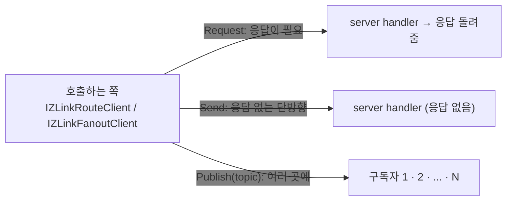
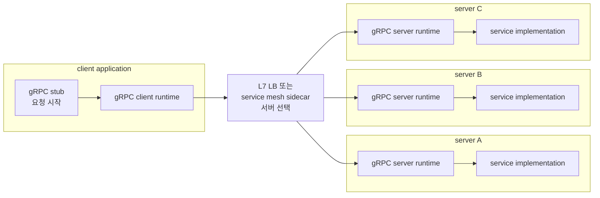
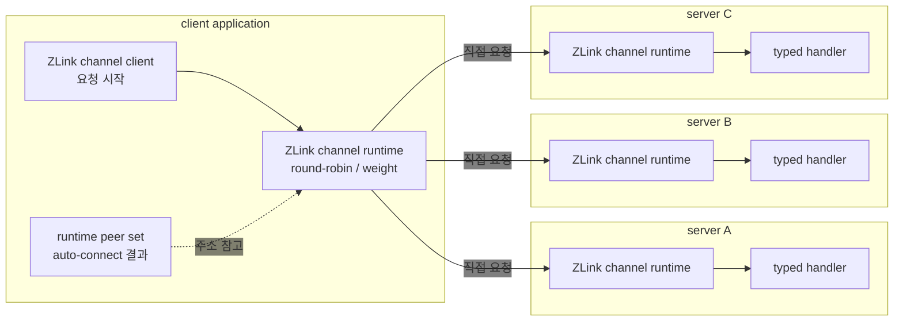
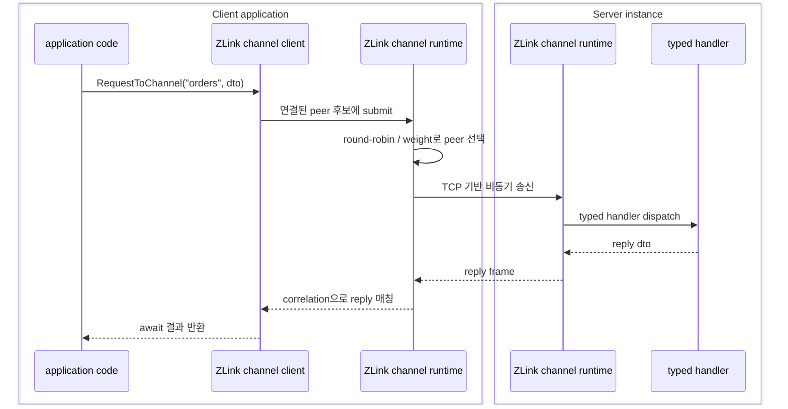
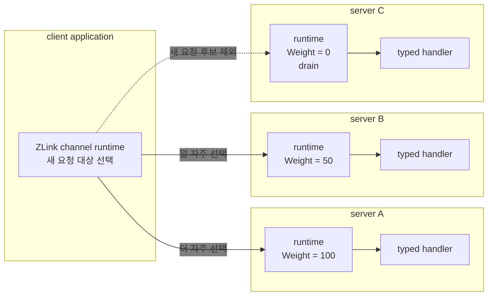
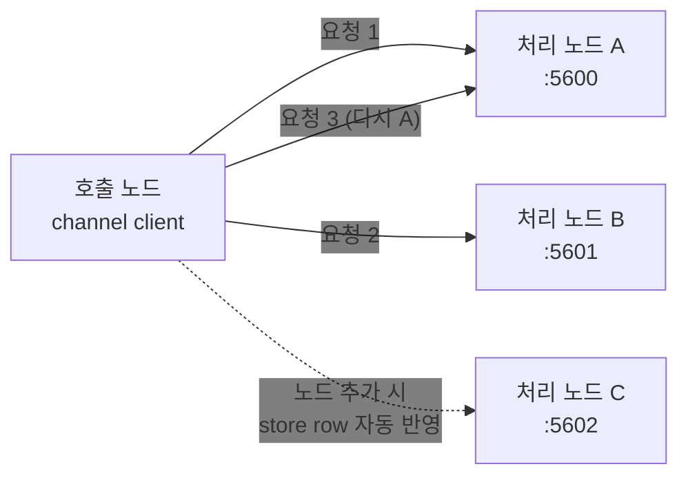
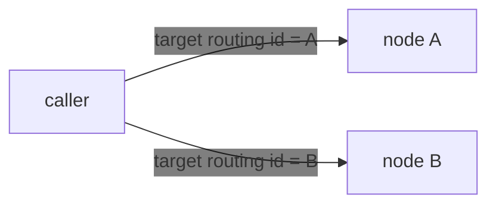

<!-- framework-adapter-nav:start -->
[문서 목록](../../../README.ko.md) | [이전: 기능 맵](04-feature-map.ko.md) | [다음: SPOT — room · stage · zone](06-spot.ko.md)
<!-- framework-adapter-nav:end -->

# 5. Channel Messaging — request · send · pub/sub

> 정식 계약은 [spec/aspnet-core-channel-messaging](../../common/spec/server/languages/dotnet/01-system-structure.ko.md)와
> [spec/handler-interfaces](../../common/spec/server/languages/dotnet/02-handler-interfaces.ko.md)가 다룬다. 이
> 챕터는 그 표면을 실제로 어떻게 등록하고 호출하는지 사용법 중심으로 다룬다.

channel messaging은 framework의 가장 기본 축이다. 세 가지 상호작용을 다룬다.

- **request/response** — 응답이 필요한 1:1 호출 (DEALER → ROUTER)
- **one-way send** — 응답이 없는 단방향 명령 (DEALER → ROUTER)
- **publish/subscribe** — 여러 구독자에게 이벤트 fan-out (PUB / SUB)

> 🔰 용어(channel·handler·client·codec 등)가 낯설면
> [03-concepts §0](03-concepts.ko.md)의 한 줄 풀이를 먼저 본다.
> 괄호 안 `DEALER → ROUTER`·`PUB / SUB`는 하부 소켓 종류로, **어플리케이션이 직접 다루지
> 않는다**(framework가 channel 종류에 따라 자동 매핑).

세 상호작용을 그림으로 먼저 잡으면 이렇다.



- **request** 는 보낸 뒤 **응답을 기다린다**(예: 가격 조회).
- **send** 는 **던지고 끝**이다(예: 캐시 무효화 통지).
- **publish** 는 한 번 보내면 **구독한 모두**가 받는다(예: 도메인 이벤트 전파).

## 0. gRPC를 쓰던 웹 서비스라면

channel messaging은 일반 웹·마이크로서비스 백엔드에서 **서비스 간 gRPC를
대체**하는 용도로 쓴다. 서비스마다 host:port를 알리거나 앞단에
gateway/로드밸런서를 둘 필요 없이, 논리 `channel name` + location store 자동 연결로 호출을 묶는다.
`.proto` IDL·HTTP/2 전용 인프라·코드 생성 없이 DTO(record)와 typed handler 만으로
gRPC의 네 가지 호출 형태를 얻는다.

| gRPC 패턴 | ZLink 대체 | 이 가이드 |
|-----------|------------|-----------|
| Unary RPC | request/response | §2·§4 |
| Unary `Empty` / fire-and-forget | one-way send | §2·§4 |
| Server streaming / 이벤트 피드 | pub/sub fan-out | §4 |
| Client/Bidi streaming | STREAM session | [09-stream](09-stream.ko.md) |
| 서비스 위치 조회(DNS/xDS) | location store 자동 연결 | [10-location](10-location.ko.md) |
| Interceptor | handler filter | §5 |
| Deadline | request timeout | §4 |

메시지 요청 경로로 보면 차이는 더 분명하다. gRPC 기반 내부 호출은 보통 client
application이 gRPC stub으로 요청을 만들고, L7 로드밸런서 또는 service mesh sidecar를
통해 scale-out 된 서버 중 하나로 보낸다. deadline/retry 같은 호출 정책은 클라이언트
코드나 gRPC channel 설정에 둔다. ZLink channel messaging은 application이 논리
`channel name`으로 요청하고, framework runtime이 연결 가능한 서버 runtime 중 하나로
직접 보낸다. 서버 선택은 중간 L7 계층이 아니라 ZLink의 peer 선택이 맡는다. 기본은
연결된 peer 사이의 균등 분배이고, peer weight를 쓰면 새 요청을 받을 서버 비율을
조정하거나 특정 서버를 새 요청 후보에서 뺄 수 있다. 그래서 application 코드는 endpoint
나 프록시 설정보다 **논리 channel 이름과 handler** 를 중심으로 작성된다.

gRPC 구성에서는 요청 분산을 로드밸런서나 mesh 같은 중간 계층이 맡는다.



이 구성에서 client application은 보통 로드밸런서나 mesh의 주소만 알고 요청한다.
scale-out 된 서버 목록과 분산 처리는 로드밸런서나 mesh가 맡고, 서버 안에서는 gRPC
server runtime이 service implementation으로 요청을 전달한다.

ZLink 구성에서는 framework runtime이 연결된 서버 runtime 중 하나를 직접 고른다.



`runtime peer set`은 ZLink runtime이 수동 endpoint 설정이나 location store 자동 연결로
유지하는 연결 후보 집합이다.
메시지는 location store 나 외부 L7 계층을 거치지 않고 runtime에서 서버 runtime으로
간다. 연결된 서버의 weight가 모두 같으면 균등하게 분배되고, weight가 다르면 더 큰
weight를 가진 서버가 새 요청 대상으로 더 자주 선택된다. weight가 `0`인 서버는 기존
연결은 유지하지만 새 outbound 후보에서는 빠진다.

이 그림은 gRPC와 ZLink의 우열을 일반화하려는 비교가 아니다. gRPC는 외부 공개 API,
표준 RPC 계약, 조직 표준 tooling이 중요할 때 여전히 좋은 선택이다. ZLink가 강한
지점은 내부 서비스 호출에서 **논리 channel 이름**, location store 기반 자동 연결,
TCP 기반 비동기 메시징을 함께 쓸 때다. 별도 L7 로드밸런서나 sidecar 없이도 framework가
peer 목록을 보고 연결을 나누지만, 조직 보안 정책이나 외부 ingress가 필요하면 기존
mesh/LB를 함께 둔다.



성능은 payload 크기, codec, 네트워크, peer 수, 배포 방식에 따라 달라진다. 이 장에서
강조하는 핵심은 **호출 경로와 운영 컴포넌트를 줄일 수 있다**는 점이다. ZLink는
HTTP/2 프록시·stub·별도 broker를 통과하는 구성을 줄이고, TCP 기반 비동기 channel로
request/reply와 send를 처리하기 때문에 내부 메시징 경로를 짧게 만들 수 있다.
더 자세한 도입 판단과 gRPC 비교는 [14-grpc-alternative](14-grpc-alternative.ko.md)가
다룬다.

예를 들어 주문 서비스라면, gRPC `rpc PlaceOrder(...)`가 다음과 같이 바뀐다.

```csharp
// 서버: handler 하나 (gRPC service 구현 대신)
public sealed class PlaceOrderHandler
    : IZLinkRequestHandler<PlaceOrder, OrderPlaced>
{
    private readonly IOrderStore _orders;
    public PlaceOrderHandler(IOrderStore orders) => _orders = orders;

    public async ValueTask<OrderPlaced> HandleAsync(
        PlaceOrder request, IZLinkMessageContext context, CancellationToken ct)
    {
        await _orders.SaveAsync(request, ct);
        return new OrderPlaced(request.OrderId);
    }
}

// 클라이언트: gRPC stub 대신 IZLinkRouteClient 주입
var placed = await client
    .RequestToChannel("services", "orders",
        new PlaceOrder("order-1042", "acct-77", 18742))
    .Async<OrderPlaced>(ct);
```

이 호출 표면(`RequestToChannel`/`SendToChannel`/`Publish` + 종결자)은
[13-interface-catalog](13-interface-catalog.ko.md) §1.6의 계약 테스트
`ChannelContracts.Channel_messaging_replaces_grpc_unary_command_and_streaming_for_web_services`
로 검증된다. 아래 본문 예제는 같은 표면을 profile/account/user 등 다른 웹 도메인으로
보여 준다.

> 비슷한 서비스를 새로 만들 때의 기술 선택 경계와 도입 판단은
> [14-grpc-alternative](14-grpc-alternative.ko.md)가 다룬다.

## 1. channel 종류

| 등록 메서드 | 논리 구성 | 용도 |
|-------------|-----------|------|
| `AddRouteMesh` + `ChannelName` | MeshNode + channel membership | request, send, RID direct route |
| `AddFanoutChannel` | 독립 fanout channel | event fan-out |

이 챕터 §2~§7은 RouteMesh의 ChannelName request/send와 독립 fanout(pub/sub)을
다룬다. 수평 확장은 같은 MeshName의 peer를 연결하거나 location store 자동 연결
([10-location](10-location.ko.md))을 사용해서 처리한다. RID direct route는 대상
`RoutingId`를 함께 지정하므로 `IZLinkRouteClient`와 route 전용 handler를 쓴다.
[§8](#8-channelname-수평-확장)·[§9](#9-route-mesh--주소-라우팅)에서 따로 다룬다.
소켓 구조 그림은 [03-concepts §1](03-concepts.ko.md#1-channel--서버-간-연결).

## 2. handler 작성

handler는 인터페이스를 구현하고, 결과를 반환값으로 돌려준다.

```csharp
// request-response
public sealed class GetProfileHandler
    : IZLinkRequestHandler<GetProfileRequest, GetProfileReply>
{
    private readonly IProfileStore _store;
    public GetProfileHandler(IProfileStore store) => _store = store;

    public async ValueTask<GetProfileReply> HandleAsync(
        GetProfileRequest request,
        IZLinkMessageContext context,
        CancellationToken cancellationToken)
    {
        var profile = await _store.LoadAsync(request.AccountId, cancellationToken);
        return new GetProfileReply(profile.AccountId, profile.Nickname);
    }
}

// one-way send (응답 없음)
public sealed class RefreshCacheHandler
    : IZLinkSendHandler<RefreshCacheCommand>
{
    public ValueTask HandleAsync(
        RefreshCacheCommand message,
        IZLinkMessageContext context,
        CancellationToken cancellationToken)
    {
        // 캐시 무효화 등. 호출자는 결과를 기다리지 않는다.
        return ValueTask.CompletedTask;
    }
}

// publish 수신 (구독자 측)
public sealed class CacheRefreshedEventHandler
    : IZLinkFanoutHandler<CacheRefreshedEvent>
{
    public ValueTask HandleAsync(
        CacheRefreshedEvent message,
        CancellationToken cancellationToken)
    {
        // Classic fanout handler는 등록한 event type의 payload만 받는다.
        return ValueTask.CompletedTask;
    }
}
```

- handler 의존성은 **생성자 주입**으로 받는다(`IProfileStore`처럼). context에서
  service를 꺼내는 service locator 패턴은 쓰지 않는다.
- channel request와 send handler는 공통 `IZLinkMessageContext`에서 nullable ChannelName,
  packet 이름, content type, correlation과 metadata를 읽는다. Cancellation은 context가 아니라
  별도 `CancellationToken` 인자가 소유한다. Logical Multicast subscription은
  `ZLinkPublishMessageContext`에서 topic과 nullable source를 추가로 제공한다. Classic fanout
  `IZLinkFanoutHandler<TEvent>`는 typed event와 `CancellationToken`만 받는다.
- handler class는 dispatch 키가 아니라 **코드 조직 단위**다. 메서드를 한 class에
  주제별로 묶어도, packet마다 class를 따로 둬도 동작은 같다.
- interface 기반 handler는 컴파일 타임 타입 체크가 가장 강하다. `HandleAsync(...)`
  의 payload, context, return 타입이 interface 계약과 맞지 않으면 컴파일이 실패한다.

### attribute 기반 메서드 handler

인터페이스 대신 attribute를 단 메서드로도 같은 handler를 작성할 수 있다. 한
class에 여러 handler 메서드를 둘 때 편하다.

```csharp
[ZLinkHandlerGroup("api")]   // 이 class의 메서드들을 "api" group으로 묶어 channel에 노출(§3)
public sealed class UserHandlers
{
    private readonly IZLinkFanoutClient _publisher;
    public UserHandlers(IZLinkFanoutClient publisher) => _publisher = publisher;

    [ZLinkRequest]   // 메서드 attribute가 handler 종류를 정한다(channel 이름은 안 받음)
    public ValueTask<GetUserReply> GetUserAsync(
        GetUserRequest request,            // 인자 순서 = (payload, context?, ct?) — context·토큰은 생략 가능
        IZLinkMessageContext context,
        CancellationToken cancellationToken)
        => ValueTask.FromResult(new GetUserReply(request.AccountId, "alice"));

    [ZLinkSend]   // send handler — 반환이 ValueTask(응답 없음). request의 ValueTask<TReply> 와 대비.
    public async ValueTask RefreshCacheAsync(
        RefreshUserCacheCommand command,
        IZLinkMessageContext context,
        CancellationToken cancellationToken)
    {
        await _publisher
            .Publish("api.events", "user.cache-refreshed",
                new UserCacheRefreshedEvent(command.AccountId))
            .Async(cancellationToken);
    }
}
```

- 메서드 시그니처는 `(payload, context?, CancellationToken?)` 순서이며 context와
  토큰은 생략할 수 있다.
- attribute 기반 handler는 한 class에 여러 request/send/publish 메서드를 묶기
  쉽지만, interface 기반처럼 handler 계약을 컴파일 타임에 강하게 고정하지는 않는다.
  잘못된 context 타입이나 반환 타입은 framework의 scan/validation 또는 실행 단계에서
  드러날 수 있다.
- `[ZLinkRequest]`/`[ZLinkSend]`/`[ZLinkPublish]`는 **channel 이름을 받지
  않는다.** channel 매핑은 등록이 소유한다(§3).

handler 작성 방식은 다음 기준으로 고른다.

- handler 하나를 class 하나로 분리하고 타입 안전성을 우선하면 interface 기반을 쓴다.
- 같은 주제의 handler 메서드를 한 class에 여러 개 담고 싶으면 attribute 기반을 쓴다.
- 샘플은 handler type을 발견한 뒤 `ChannelName(...)`의 typed registration으로
  노출 범위를 고정한다.

## 3. handler를 channel에 노출하기

framework는 발견한 handler를 모든 channel에 자동으로 열지 않는다. **발견과
노출은 별개 단계**다.

> `AddHandlersFromAssemblyOf<...>`는 handler type을 발견하고, `ChannelName(...)`의
> typed registration은 어느 MeshName과 ChannelName에 노출할지 고정한다.

### RouteMesh와 handler 등록

```csharp
builder.Services.AddZLinkFramework(options =>
{
    options.AddHandlersFromAssemblyOf<Program>(); // handler type 발견
    var mesh = options.AddRouteMesh("services")
        .Listen("tcp://0.0.0.0:7101")
        .SetRoutingId(RoutingId.From("api-1"));
    var channel = mesh.ChannelName("api");
    channel.AddRequestHandler<GetProfileHandler, GetProfileRequest, GetProfileReply>();
    channel.AddSendHandler<RefreshCacheHandler, RefreshCacheCommand>();
});
```

### 다른 ChannelName에 개별 등록

```csharp
{
    var mesh = options.AddRouteMesh("pricing")
        .Listen("tcp://0.0.0.0:7301")
        .SetRoutingId(RoutingId.From("price-1"));
    var channel = mesh.ChannelName("price");
    channel.AddRequestHandler<GetPriceHandler>();
    channel.AddSendHandler<RefreshCacheHandler>();

}
```

fanout channel의 publish handler는 builder의 `AddHandler<...>()`로 등록한다.

> **packet 이름 해석 순서:** ① handler 등록의 `packetName` 인자 → ②
> payload 타입의 `[ZLinkPacket("...")]` → ③ 둘 다 없으면 타입 이름(`Type.Name`).
> packet 이름은 이렇게 **등록 시 한 번** 확정된다. 호출 call마다 다시 지정하는
> 표면은 없다. 같은 channel 안에서 `kind + packet 이름`이 겹치면 **시작 단계에서
> 예외**다. 다른 channel끼리는 같은 packet 이름을 재사용해도 된다.

### 잘못된 등록은 시작 단계에서 막힌다

같은 process에서 같은 MeshName을 두 번 등록하거나 MeshNode에 ChannelName을 하나도
등록하지 않으면 startup이 실패한다. ChannelName handler는 MeshName, ChannelName,
message kind와 packet name으로 구분한다. 같은 key를 중복 등록하면
`ZLinkConfigurationException`으로 실패하고, 서로 다른 MeshName이나 ChannelName에는
같은 packet name을 사용할 수 있다. Fanout handler는 독립 fanout channel builder에
등록하며 RouteMesh handler와 섞지 않는다.

## 4. outbound 호출

### request / send — `IZLinkRouteClient`

```csharp
public sealed class PriceService(IZLinkRouteClient client)
{
    public async Task<decimal> GetAsync(string symbol, CancellationToken ct)
    {
        var reply = await client
            .RequestToChannel("pricing", "price", new PriceRequest(symbol))
            .Async<PriceReply>(ct);    // request: reply 타입은 payload가 아니라 .Async<T> 에서 지정
        return reply.Price;
    }

    public async ValueTask RefreshAsync(string accountId, CancellationToken ct)
        => await client
            .SendToChannel("services", "profile", new RefreshCacheCommand(accountId))
            .Async(ct);          // send: admission 결과까지만 기다리고 원격 handler 완료는 기다리지 않는다
}
```

- reply 타입은 메시지가 아니라 **`.Async<TReply>(...)`** 에서 지정한다.
- **`Timeout(...)`은 request 전용 선택 종결자다.** reply 대기 시간은 전역 기본
  **30초**이고, 기본과 달라야 할 때만 붙인다(우선순위는 아래 예제 주석 참고).
  `Send`/`Publish`는 응답을 기다리지 않으므로 timeout 표면 자체가 없다.
- packet 이름은 호출 시점에 바꿀 수 없다. 등록 시(§4의 해석 순서) 한 번 확정된다.
- `IZLinkRouteClient`는 startup에 등록한 RouteMesh를 사용한다. MeshName이나
  ChannelName이 등록되어 있지 않으면 `ZLinkConfigurationException`으로 실패한다.

기본과 달라야 할 때만 종결자를 붙인다:

```csharp
await client
    .RequestToChannel("pricing", "price", new PriceRequest(symbol))
    .Timeout(TimeSpan.FromSeconds(5))  // 이 호출의 reply 대기 상한을 기본(30초)과 다르게 둘 때만 지정
    .Async<PriceReply>(ct);
// reply 대기 상한 결정 순서(앞이 우선):
//   1) 호출별 .Timeout(...)
//   2) MeshNode builder의 SetDefaultRequestTimeout(...)
//   3) 전역 options.DefaultRequestTimeout (기본 30초)
```

### publish — `IZLinkFanoutClient`

```csharp
public sealed class ProfileService(IZLinkFanoutClient publisher)
{
    public async ValueTask AnnounceAsync(string accountId, CancellationToken ct)
        => await publisher
            // 인자 = (channel, topic, message). topic("profile.cache-refreshed")이 fan-out 라우팅 키다.
            .Publish("api.events", "profile.cache-refreshed",
                new ProfileCacheRefreshedEvent(accountId))
            .Async(ct);
}
```

- `Publish`는 인자가 **3개**다: `channelName`, `topic`, `message`. topic은 그 publish에
  적용되는 분류 라벨이다.
- publish 한 message는 **구독자 수와 무관하게 한 번만 인코딩**된다. framework는 그
  인코딩 결과를 **구독 중인 각 구독자 연결로 한 번씩 전달**할 뿐, 구독자마다 다시
  직렬화하지 않는다(framework 내부 최적화).
- `IZLinkFanoutClient`는 fanout channel에 publish 하는 DI client 이다.

> **구독 연결.** 구독자는 `AddFanoutChannel(name).ConnectSubscriber(endpoint)`로
> publisher endpoint를 연결한다.

> **구독자 쪽 event dispatch(.NET).** Classic fanout handler는 등록한 typed event와
> `CancellationToken`만 받으며 transport topic을 handler context로 노출하지 않는다. 업무 분기가
> 필요하면 event type이나 등록한 handler를 나눈다.

> **샘플에서 보기 — [DeliveryDispatch](../../common/sample/deliverydispatch/README.ko.md).**
> HTTP로 접수한 주문을 channel 호출로 배차 서버에 위임하고, 배송 상태 변화를 fanout
> publish로 관제·고객 push 구독자에 전파한다. request/send/publish 세 표면이 한 업무
> 흐름 안에서 함께 쓰이는 대표 예다.
>
> ```csharp
> public ValueTask HandleAsync(EventNotify message, CancellationToken ct)
> {
>     // 이 handler에 등록된 EventNotify만 처리한다.
>     return ValueTask.CompletedTask;
> }
> ```

> `Async(...)`/`Async<T>(...)`의 완료는 transport 위임까지만 보장한다.
> remote handler 완료나 구독자 수신을 보장하지 않는다([03-concepts](03-concepts.ko.md) §6.2).

> **pub/sub는 replay가 없다.** 구독자가 **아직 연결되기 전**에 publish 된 메시지나, **연결이 끊긴
> 동안** 지나간 메시지는 다시 받지 못한다(재연결해도 그 사이 것은 안 온다). 놓치면 안 되는 이벤트는
> 별도 재동기화(예: 재연결 후 현재 상태를 한 번 request)로 메운다.

## 5. filter — 공통 처리

ASP.NET Core HTTP middleware(`app.Use(...)`)는 HTTP 파이프라인 전용이라 ZLink
handler에는 적용되지 않는다. logging/validation/authorization/metrics 같은 공통
처리는 `IZLinkHandlerFilter`로 한다.

```csharp
public sealed class LoggingFilter(ILogger<LoggingFilter> logger)
    : IZLinkHandlerFilter
{
    public async ValueTask<object?> InvokeAsync(
        ZLinkHandlerInvocation invocation,
        ZLinkHandlerDelegate next,
        CancellationToken cancellationToken)
    {
        logger.LogInformation("dispatch {Packet}", invocation.PacketName);
        return await next(cancellationToken);   // 호출하지 않으면 handler 미실행
    }
}

// 등록 (등록 순서대로 pipeline 구성)
builder.Services.AddZLinkFramework(options =>
{
    options.UseFilter<LoggingFilter>();
    options.UseFilter<ValidationFilter>();
});
```

filter도 `new`가 아니라 .NET DI에서 resolve 된다.

## 6. 연결 제어

수동 연결은 MeshNode의 peer 목록에 설정한다.

```csharp
var mesh = options.AddRouteMesh("services")
    .Listen("tcp://0.0.0.0:7102")
    .SetRoutingId(RoutingId.From("profile-client-1"));
mesh.ChannelName("profile");
mesh.PeerConnections.Connect("tcp://10.0.10.15:7101");
mesh.PeerConnections.Connect("tcp://10.0.10.16:7101");
```

endpoint 인자는 startup 설정이다. host 시작 뒤 실행 중인 socket을 직접 제어하는
handle이 아니다. **단 하나, 가용성(drain/restore)은 런타임에 바꿀 수 있다 — 아래 참조.**

자동 연결 모드는 peer 목록의 소유권이 location store에 있다. 서버가 새 endpoint로
새 endpoint로 다시 시작하면 store의 descriptor row가 갱신되고 client 연결도 갱신된다. 별도 조작이 필요
없다. 수동 연결은 설정을 바꾼 뒤 애플리케이션을 재시작해 다시 적용한다.

### 운영 drain / restore (런타임)

유지보수·rolling 재시작·scale-in 직전에, 노드를 종료하거나 store의 descriptor row를 제거하지 않고
**새 요청 수신만 멈추고 싶을 때**가 있다. `IZLinkRouteMeshRuntimeOptions`를 주입받아
MeshName과 ChannelName으로 weight를 변경한다.

여기서 쓰는 `Weight`는 drain 전용 플래그가 아니라, ChannelName membership이 새
메시지를 어느 peer로 보낼지 고를 때 참고하는 **peer 가중치**다. 연결된 서버들의
weight가 모두 같으면 새 요청은 균등하게 round-robin으로 분배된다. weight가 서로
다르면 더 큰 값을 가진 서버가 그 비율만큼 더 자주 선택된다. `0`은 "연결은 유지하지만
새 요청 후보에서는 제외"라는 뜻이고, `100`은 기본 정상 serving 값이다.



위 예에서 server C는 연결과 기존 in-flight 처리는 유지하지만 새 요청 후보에서는 빠진다.
server A와 server B처럼 양수 weight를 가진 peer만 새 요청 후보가 되고, 두 값이 같으면
균등하게 round-robin으로 선택된다.

```csharp
// 운영 admin 엔드포인트. "services"와 "orders"는 등록한 MeshName과 ChannelName이다.
app.MapPost("/admin/channels/orders/drain",
    (IZLinkRouteMeshRuntimeOptions options) =>
    {
        options.Channel("services", "orders").Weight = 0; // 새 select-one 대상에서 제외
        return Results.Ok();
    });

app.MapPost("/admin/channels/orders/restore",
    (IZLinkRouteMeshRuntimeOptions options) =>
    {
        options.Channel("services", "orders").Weight = 100; // 정상 복귀
        return Results.Ok();
    });
```

- `Weight = 0`(drain)은 serving socket을 **닫지 않는다**. 이 서버를 새 outbound 후보에서
  빼라는 신호다. 이미 들어온 in-flight 요청은
  끝까지 처리·reply 하고, 그 시점 이후 peer 들이 그 노드를 새 요청 대상에서 뺀다.
  store의 descriptor row도 그대로 남는다(graceful drain).
- `Weight = 100`으로 기본 정상 serving 상태로 복귀한다. `1..99`로 두면 연결된 peer의
  분배 비율을 낮춘다(weighted).
- 같은 `Weight`를 build-time 초기값으로도 설정한다.

```csharp
var mesh = options.AddRouteMesh("services")
    .Listen("tcp://0.0.0.0:7101")
    .SetRoutingId(RoutingId.From("orders-1"));
mesh.ChannelName("orders").SetWeight(30); // 이 membership의 시작 weight
```
- drain 신호 전파는 best-effort eventual 이다 — "drain 신호를 보냈다" 까지 보장하고, peer가
  실제로 후보에서 뺀 시점은 모니터링(`PeerAdmissionChanged` 이벤트, [11-monitoring](11-monitoring.ko.md))
  으로 확인한다. `drain`/`restore`라는 운영 어휘는 위처럼 앱 admin 레이어가 `Weight = 0`/`= 100`
  에 이름을 붙여 노출하면 된다.

## 7. 직렬화 codec

payload 직렬화 codec은 framework 등록에서 활성화한다.

```csharp
options.Codecs.Use(ZLinkProtobufCodec.Default);
options.Codecs.Use(ZLinkMessagePackCodec.Default);
```

payload는 codec이 직렬화할 수 있는 DTO 여야 한다. root/요소 타입이
abstract/interface 면 명시 codec 없이는 설정 오류가 난다.

> **샘플에서 보기 — 언제 codec을 명시하나.**
> [Bingo](../../common/sample/bingo/README.ko.md)만 `Codecs.Use(ZLinkProtobufCodec.Default)`를
> 등록하고 `.proto`로 DTO를 정의한다 — 실시간 게임이라 packet 크기와 인코딩 비용을
> 줄이려는 선택이다. 나머지 샘플
> ([TicTacToe](../../common/sample/tictactoe/README.ko.md) ·
> [SupportChat](../../common/sample/supportchat/README.ko.md) ·
> [ShoppingMall](../../common/sample/event/shoppingmall.ko.md) ·
> [DeliveryDispatch](../../common/sample/deliverydispatch/README.ko.md) ·
> [GameQuest](../../common/sample/event/gamequest.ko.md))는 **codec을 아예 등록하지 않고** 기본값을
> 쓴다. 즉 명시 등록은 필요할 때만 하는 선택이고, 기본값으로 시작해도 된다.

기본 codec 외의 포맷(Avro·Thrift 등)이 필요하면 `IZLinkMessageSerializer`를 구현해
content type으로 등록한다. serializer는 업무 객체 ↔ `Message`(byte payload) 변환만
맡고, packet name 결정·codec 선택은 framework가 그대로 처리한다. custom serializer는
한 payload 타입에 대해 **둘 이상이 매칭하면** 구성 오류가 난다. 타입 조건 없이 모든
타입을 받는 fallback serializer는 하나만 두고,
타입 조건을 받는 serializer는 서로 겹치지
않게 여러 개 둘 수 있다.

```csharp
public sealed class AvroOrderSerializer : IZLinkMessageSerializer
{
    private readonly Avro.Schema _schema = Avro.Schema.Parse(SchemaJson);

    // serializer의 책임은 business 객체 ↔ Message(byte payload) 변환뿐. packet name 결정·codec 선택은 framework.
    public Message Serialize(object value, Type type)
    {
        using var buffer = new MemoryStream();
        var writer = new Avro.Generic.GenericWriter<object>(_schema);
        writer.Write(value, new Avro.IO.BinaryEncoder(buffer));
        return Message.From(buffer.ToArray());
    }

    public object? Deserialize(Message message, Type type)
    {
        var reader = new Avro.Generic.GenericReader<object>(_schema, _schema);
        return reader.Read(null!, new Avro.IO.BinaryDecoder(new MemoryStream(message.ToArray())));
    }
}

options.Codecs.Use(new AvroCodecExtension()); // extension 내부에서 Avro serializer를 한 번 등록한다.
```

등록 후 high-level 호출은 그대로 업무 객체를 주고받고 직렬화는 Avro로 처리된다.
다른 언어의 등록 표면은 [framework-api §9](../../common/spec/06-framework-api.ko.md#9-codec) 표를 본다.

## 8. ChannelName 수평 확장

처리량을 늘리려면 같은 MeshName과 ChannelName membership으로 provider를 여러 개
실행한다. 호출 노드는 location store 자동 연결 또는 `PeerConnections.Connect(...)`로
provider endpoint를 등록한다. 호출자는 `IZLinkRouteClient.RequestToChannel(...)`과
`SendToChannel(...)`을 사용한다.

> **샘플에서 보기 — [ShoppingMall](../../common/sample/event/shoppingmall.ko.md).** `CommerceApi`
> 2개와 `OrderWorkflow` 2개를 동시에 띄워 이 절의 확장을 실제로 검증한다. 호출자
> (`CommerceApi`)는 provider가 몇 개인지 모르고 channel 이름으로만 부르며, 어느
> `CommerceApi` instance가 요청을 받아도 같은 `OrderId`는 항상 같은 owner spot으로
> 도착한다. 두 instance 중 어디서 조회해도 같은 결과가 나오는지가 self-check 항목이다.

```csharp
// 처리 노드 A
{
    var mesh = options.AddRouteMesh("media")
        .Listen("tcp://0.0.0.0:5600")
        .SetRoutingId(RoutingId.From("resize-a"));
    mesh.ChannelName("image.resize")
        .AddRequestHandler<ResizeHandler, ResizeRequest, ResizeReply>();
}
```

```csharp
// 호출 노드 — 여러 provider endpoint를 같은 channel client에 연결
{
    var mesh = options.AddRouteMesh("media")
        .Listen("tcp://0.0.0.0:5590")
        .SetRoutingId(RoutingId.From("resize-client"));
    mesh.ChannelName("image.resize");
    mesh.PeerConnections.Connect("tcp://10.30.1.10:5600");
    mesh.PeerConnections.Connect("tcp://10.30.1.10:5601");
}

// 또는 location store로 자동 발견 — 노드 추가 시 호출자 재시작 불필요
options.AddRouteMesh("media").ChannelName("image.resize");
```



특정 엔티티(주문 ID·사용자 ID)가 늘 같은 노드로 가야 하면 RID direct route(§9)를 사용한다.

> **provider에 안정적 식별자 주기.** `AddRouteMesh(...).SetRoutingId(...)`로
> MeshNode에 고정된 논리 id를 준다. provider가 종료된 뒤 같은 RID로 새 process를 시작해도 location store가 같은
> 논리 id의 새 endpoint로 이어 주므로(same-rid failover), 응답에 어느 노드가 처리했는지(rid)를 실어 보내거나
> 프로세스 교체 후에도 라우팅을 이어 갈 때 쓴다.

## 9. route mesh — 주소 라우팅

RouteMesh의 RID direct 호출은 `RoutingId`로 특정 MeshNode를 지정한다. `Listen`은 이
노드의 endpoint를 열고 `SetRoutingId`는 논리 주소를 정한다. 수동 peer는
`PeerConnections.Connect(...)`로 등록한다.
SPOT 라우팅 백본이 필요할 때 이 channel 종류를 쓴다([06-spot](06-spot.ko.md)).

```csharp
{
    var mesh = options.AddRouteMesh("tictactoe")
        .Listen(playRouterEndpoint)
        .SetRoutingId(RoutingId.From(playRouterId));
    mesh.PeerConnections.Connect(peerRouterEndpoint);
    mesh.AddRouteRequestHandler<AllocateRoomRouteHandler, AllocateRoom, RoomAllocated>(
        "room.allocate");                  // 마지막 인자 = packet 이름
}
```

RID direct 호출도 `IZLinkRouteClient`를 주입받고 MeshName과 대상 `RoutingId`를
지정한다. `IZLinkRouteClient`는 특정 MeshNode 하나에 묶인 client가 아니므로 호출마다
MeshName을 분명하게 정한다.

```csharp
var target = RoutingId.From("play-node-1");   // 보낼 대상 노드의 RoutingId

var room = await routeClient
    // 인자 = (MeshName, 대상 RoutingId, payload)
    .RequestToNode("tictactoe", target, new AllocateRoom("alice"))
    .Async<RoomAllocated>(ct);

public sealed class AllocateRoomRouteHandler
    : IZLinkRouteRequestHandler<AllocateRoom, RoomAllocated>
{
    public ValueTask<RoomAllocated> HandleAsync(
        AllocateRoom request,
        ZLinkRouteMessageContext context,
        CancellationToken cancellationToken)
        => ValueTask.FromResult(new RoomAllocated("room-1"));
}
```

같은 route channel로 반복 호출하면 application 코드에서 작은 wrapper를 만들어 DI에
등록해도 된다. 이 wrapper는 framework API가 아니라 application이 정한 이름이다. 그래서
업무 코드는 매번 channel 문자열을 반복하지 않고, wrapper 내부에서 어떤 route channel로
나가는지만 한 곳에 둔다.

```csharp
public interface IPlayRoutes
{
    IZLinkRequestCall Request<TRequest>(RoutingId targetNodeRid, TRequest request);
}

public sealed class PlayRoutes(IZLinkRouteClient routes) : IPlayRoutes
{
    public IZLinkRequestCall Request<TRequest>(
        RoutingId targetNodeRid,
        TRequest request)
        => routes.RequestToNode("tictactoe", targetNodeRid, request);
}

builder.Services.AddSingleton<IPlayRoutes, PlayRoutes>();
```



SPOT과의 결합은 [06-spot](06-spot.ko.md)에서 이어진다.

## 10. 통합 예제 — 서버 + outbound + pub/sub

```csharp
var builder = WebApplication.CreateBuilder(args);

builder.Services.AddZLinkFramework(options =>
{
        options.Codecs.Use(ZLinkProtobufCodec.Default);

    var mesh = options.AddRouteMesh("services")
        .Listen("tcp://0.0.0.0:7101")
        .SetRoutingId(RoutingId.From("api-1"));
    mesh.ChannelName("api")
        .AddRequestHandler<UserHandlers, GetUserRequest, GetUserReply>();
    mesh.ChannelName("account"); // outbound select-one membership

    // 이벤트 발행/구독 channel
    {
        var channel = options.AddFanoutChannel("api.events")
            .EnablePublisher("tcp://0.0.0.0:7201")
            .ConnectSubscriber("tcp://127.0.0.1:7201");
        channel.AddHandler<UserCacheRefreshedEventHandler,
            UserCacheRefreshedEvent>();

    }

    options.AddHandlersFromAssemblyOf<Program>();
});

var app = builder.Build();

app.MapPost("/users/{id}", async (
    string id, IZLinkRouteClient client, CancellationToken ct) =>
{
    var account = await client
        .RequestToChannel("services", "account", new GetAccountRequest(id))
        .Async<GetAccountReply>(ct);
    return Results.Ok(account);
});

app.Run();

[ZLinkHandlerGroup("api")]
public sealed class UserHandlers(IZLinkFanoutClient publisher)
{
    [ZLinkRequest]
    public ValueTask<GetUserReply> GetUserAsync(
        GetUserRequest request, IZLinkMessageContext context, CancellationToken ct)
        => ValueTask.FromResult(new GetUserReply(request.AccountId, "alice"));

    [ZLinkSend]
    public async ValueTask RefreshAsync(
        RefreshUserCacheCommand command, IZLinkMessageContext context, CancellationToken ct)
        => await publisher
            .Publish("api.events", "user.cache-refreshed",
                new UserCacheRefreshedEvent(command.AccountId))
            .Async(ct);
}

[ZLinkHandlerGroup("api.events")]
public sealed class UserCacheRefreshedEventHandler
    : IZLinkFanoutHandler<UserCacheRefreshedEvent>
{
    public ValueTask HandleAsync(
        UserCacheRefreshedEvent message, CancellationToken ct)
        => ValueTask.CompletedTask;
}
```

## 11. 자주 막히는 곳

- **handler가 안 불린다** → `AddHandlersFromAssemblyOf(...)`만으로는 노출되지
  않는다. `ChannelName(...)`의 typed registration이 필요하다(§3).
- **`ZLinkConfigurationException`** → channel이 없거나 해당 역할이 없는
  경우. 등록을 확인한다.
- **시작 시 예외** → channel 이름 중복, 같은 channel `kind + packet 이름` 중복,
  client에 연결 경로 없음. fail-fast 다([03-concepts](03-concepts.ko.md) §4).
- **`ZLink` vs `Zlink`** → 서버 framework 타입은 전부 `ZLink`(대문자 L)다.
- **handler 없는 packet으로 보냈을 때(런타임)** → 시작 단계 검증과 별개로, 실행 중 등록되지
  않은 packet 이름이 도착하면 **request는 error reply로 실패**(client는 예외로 받음),
  **send는 조용히 drop** 된다. 다만 조용히 drop 된다는 말은 호출자에게 reply가 없다는
  뜻이지, 관측 흔적이 없다는 뜻은 아니다. message flow 로그/observer를 켜 두면 dispatch
  실패가 구조화 로그와 observer event로 남고, 이유는 marker
  (`no_handler` / `reply_error`·`drop`)로 구분된다([11-monitoring](11-monitoring.ko.md)).

## 12. 더 보기

- 이 챕터 계약의 실행 검증 예문(client/handler/filter/codec): [13-interface-catalog](13-interface-catalog.ko.md) §1 — 검증 클래스 `ChannelContracts`·`HandlerContracts`·`CodecContracts`
- 전체 인터페이스/attribute/context: [spec/handler-interfaces](../../common/spec/server/languages/dotnet/02-handler-interfaces.ko.md)
- dispatch 흐름·lifecycle 정식 계약: [spec/aspnet-core-channel-messaging](../../common/spec/server/languages/dotnet/01-system-structure.ko.md)
- 전체 시나리오: [공통 샘플](../../common/sample/README.ko.md)
- 다음 축: [06-spot](06-spot.ko.md)

---
<!-- framework-adapter-nav:bottom:start -->
[문서 목록](../../../README.ko.md) | [이전: 기능 맵](04-feature-map.ko.md) | [다음: SPOT — room · stage · zone](06-spot.ko.md)
<!-- framework-adapter-nav:bottom:end -->
