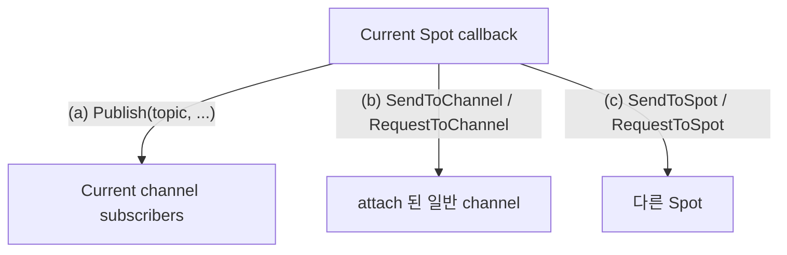
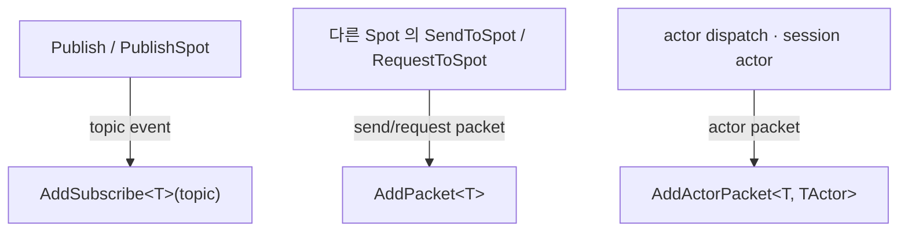
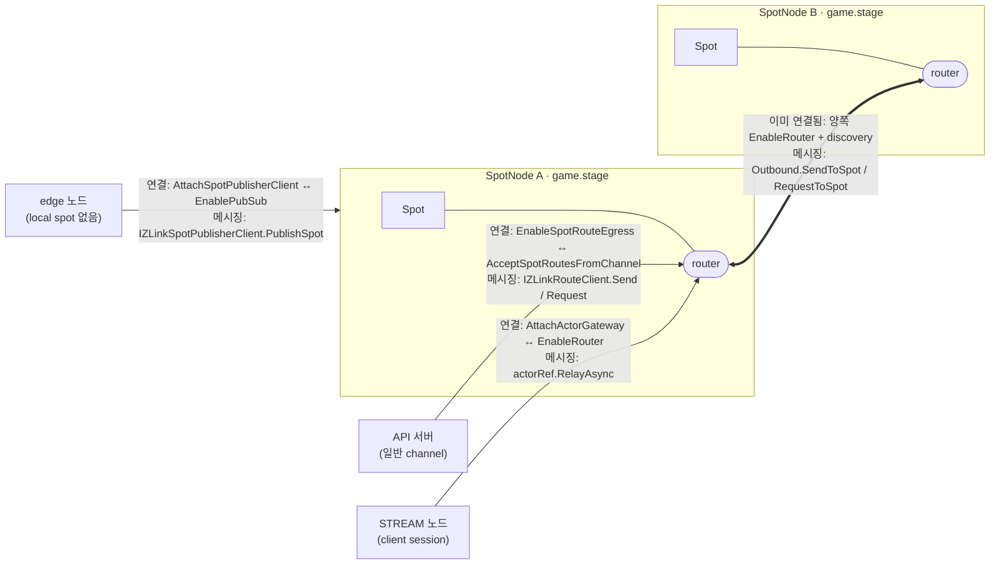

<!-- framework-adapter-nav:start -->
[문서 목록](../../../README.ko.md) | [이전: Channel Messaging](04-channel-messaging.ko.md) | [다음: Actor · Session Actor Dispatch](06-actor-session.ko.md)
<!-- framework-adapter-nav:end -->

# 5. SPOT — room · stage · zone

> 정식 계약은 [spec/aspnet-core-spot](../spec/aspnet-core-spot.ko.md),
> [spec/spot-node](../spec/spot-node.ko.md), [spec/stage-wrapper-on-spot](../spec/stage-wrapper-on-spot.ko.md)가
> 다룬다. 이 챕터는 SPOT 을 등록하고 다루는 사용법 중심이다.
>
> 🔰 SPOT·actor·Entry Spot 등 용어가 낯설면 [03-concepts §0](03-concepts.ko.md)의
> 한 줄 풀이를 먼저 본다.

## 1. SPOT 이란

`SPOT` 은 동적으로 생성·소멸되는 **주소 가능한 논리 인스턴스**다. 게임 room,
playhouse stage, 채팅 room, MMORPG zone 처럼 "있다가 없어지는 단위"를 메시지
라우팅 대상으로 삼는다.

| 개념 | 뜻 |
|------|------|
| `Spot` | room/stage/zone 같은 논리 인스턴스 하나 |
| `SpotNode` | 여러 spot 인스턴스를 호스팅하는 컨테이너 노드 |
| `TSpot` | 생성할 user Spot 타입. framework 안에서 factory 선택에만 쓰며 public 식별자로 들고 다니지 않는다 |
| `spotRid` (`RoutingId`) | `SpotNode` 가 인스턴스 생성 시 발급하는 **논리 주소**. 특정 room/stage 한 개를 가리킨다 |
| Entry Spot | 노드의 기본 실행 컨텍스트(actor 가 생성 직후 머무는 곳) |

SPOT 은 pub/sub helper 가 아니다. publish/subscribe 는 spot **안에서** 쓰는 한
기능일 뿐이다.

규칙 몇 가지:

- `Spot` 은 특정 service 가 아니라 `SpotNode` 에 종속된다.
- `SpotNode` 의 router 와 pub/sub mesh 는 **같은 channel 의 다른 SpotNode 와만**
  연결된다. 다른 channel 로 나가는 호출은 attach 된 channel client 를 쓴다.
- 한 `SpotNode` 에는 active SPOT channel view 가 정확히 하나다.

## 2. SpotNode 등록

discovery 기반 mesh 로 묶는 형태가 표준이다.

```csharp
builder.Services.AddZLinkFramework(options =>
{
    var mesh = options.AddSpotMesh("game.stage");
    mesh.UseDiscovery().AddRegistryEndpoint("tcp://registry1:5551");

    var node = mesh.AddNode("stage-node");
    node.EnableRouter("tcp://0.0.0.0:9001");   // routed packet 수신
    node.EnablePubSub("tcp://0.0.0.0:9000");   // 현재 channel publish/subscribe
    node.AttachChannelClient("orders");        // 다른 channel 로 send/request
    node.AddSpotFactory<StageSpot>();          // 이 노드가 만들 타입
});
```

node 역할은 서로 독립이다.

| node 함수 | 의미 |
|-----------|------|
| `EnableRouter(endpoint)` | 다른 SpotNode/채널에서 오는 routed packet 수신 |
| `EnablePubSub(endpoint)` | 현재 SPOT channel 의 publish/subscribe (없으면 `Publish` 불가) |
| `AttachChannelClient(name)` | 일반 channel 로 send/request 하는 client 부착 |
| `AddSpotFactory<TSpot>()` | 이 노드가 만들 spot 타입 등록. 타입 중복은 시작 예외 |
| `AddEntrySpot<TEntrySpot>()` | Entry Spot handler registry 부착(actor 사용 시, [actor spec](../spec/aspnet-core-actor.ko.md)) |

> top-level `UseDiscovery().AddRegistryEndpoint(...)` 를 등록하면 `AddSpotMesh` 는 그 discovery endpoint 를
> 기본으로 상속한다. mesh 단위로 다른 endpoint 를 쓰려는 경우에만 `mesh.UseDiscovery().AddRegistryEndpoint(...)` 를
> 따로 둔다. 단일 노드만 띄우는 local 테스트도 `AddSpotMesh` 안에서 빈
> `AddNode(...)` 와 `AddNode(...)` 로 표현한다.

## 3. Spot 작성 — handler 등록과 lifecycle

spot 클래스는 `IZLinkSpot` 을 구현하고, 주입받은 `Context` 에 handler·subscribe·
timer 를 `Configure()` 에서 등록한다.

> **SPOT handler 는 `Configure()` context 에서 등록한다.** channel handler 의 attribute
> 자동 등록([04 §3](04-channel-messaging.ko.md))과 달리, spot handler 는 spot 의
> `Configure()` 안에서 `Context.Handlers.AddPacket<T>(...)` / `AddActorPacket<T, TActor>(...)`
> / `AddSubscribe<T>(...)` 와 `Context.AddTimer<T>(...)` 로 등록한다(아래). spot node builder
> 는 entry/spot factory 만 등록하고 handler 는 등록하지 않는다.

```csharp
public sealed class StageSpot(IZLinkSpotContext context) : IZLinkSpot
{
    private IZLinkTimer? _heartbeat;
    public IZLinkSpotContext Context { get; } = context;

    // 같은 Spot 의 callback 은 직렬화되므로 이 상태에 lock 이 필요 없다.
    private int _occupants;

    public void Configure()
    {
        Context.Handlers.AddPacket<GetStageStateHandler>();              // request/send packet
        Context.Handlers.AddSubscribe<StageStateUpdatedHandler>("stage.state.updated"); // topic 구독
    }

    public async ValueTask OnInitializeAsync(CancellationToken cancellationToken)
    {
        _heartbeat = await Context.AddTimer<StageHeartbeatHandler>(
            "heartbeat",
            TimeSpan.FromSeconds(1),
            new ZLinkTimerOptions
            {
                OverrunPolicy = ZLinkTimerOverrunPolicy.DelayNextTick
            },
            cancellationToken);
    }

    public async ValueTask OnClosingAsync(CancellationToken cancellationToken)
    {
        if (_heartbeat is not null)
        {
            await _heartbeat.CancelAsync();
        }
    }
}
```

spot handler 는 첫 인자로 spot 인스턴스를 받는다.

```csharp
public sealed class GetStageStateHandler
    : IZLinkSpotRequestHandler<StageSpot, GetStageStateRequest, GetStageStateReply>
{
    public ValueTask<GetStageStateReply> HandleAsync(
        StageSpot spot,
        GetStageStateRequest request,
        CancellationToken cancellationToken)
        => ValueTask.FromResult(new GetStageStateReply(spot.Context.SpotRid.ToString()));
}

public sealed class StageHeartbeatHandler : IZLinkSpotTimerHandler<StageSpot>
{
    public ValueTask HandleAsync(
        StageSpot spot, ZLinkTimerTick tick, CancellationToken cancellationToken)
        => ValueTask.CompletedTask;
}
```

> **실행 직렬화 — SPOT 의 핵심 보장.** 한 user Spot 의 모든 callback(packet,
> request, subscription, timer, actor packet, channel reply 후속)은 **하나의 Spot
> 실행 큐**에서 직렬로 돈다. 그래서 room board 같은 가변 상태를 lock 없이 만질 수
> 있다. 단 이 보장은 그 Spot 내부 callback 한정이다. 외부에서 `SpotRid` 로 직접
> 접근하는 코드는 별도 동기화가 필요하다.

### timer 사용법

timer 는 spot 안에서 주기적으로 상태를 갱신하거나, 오래된 참가자를 정리하거나,
주기적인 snapshot 을 publish 할 때 사용한다. 일반적인 사용 흐름은 다음과 같다.

1. `Configure()` 에서는 packet, subscribe, actor handler 처럼 동기 등록만 한다.
2. `OnInitializeAsync(...)` 에서 `Context.AddTimer<THandler>(...)` 를 호출한다.
3. 반환된 `IZLinkTimer` 를 spot 필드에 보관한다.
4. `OnClosingAsync(...)` 에서 `CancelAsync()` 로 멈춘다.
5. 실제 주기 작업은 `IZLinkSpotTimerHandler<TSpot>` 구현체에 둔다.

`AddTimer<THandler>(name, period, options, cancellationToken)` 의 인자는 다음 의미다.

| 인자 | 의미 |
|------|------|
| `THandler` | tick 이 발생할 때 실행할 handler 타입. DI 로 생성된다 |
| `name` | timer 이름. monitoring 과 tick metadata 에 들어간다 |
| `period` | tick 간격. `TimeSpan.Zero` 나 음수는 설정 오류다 |
| `options` | tick 이 밀릴 때의 정책과 예외 처리 정책 |
| `cancellationToken` | 등록 작업 취소 토큰 |

timer handler 는 매 tick 마다 spot 인스턴스와 `ZLinkTimerTick` 을 받는다.

```csharp
public sealed class StageHeartbeatHandler : IZLinkSpotTimerHandler<StageSpot>
{
    public async ValueTask HandleAsync(
        StageSpot spot,
        ZLinkTimerTick tick,
        CancellationToken cancellationToken)
    {
        if (tick.SkippedTicks > 0)
        {
            // 이전 tick 이 밀렸다는 뜻이다. 무거운 보정 작업은 여기서 줄일 수 있다.
        }

        await spot.Context.Outbound
            .Publish("stage.heartbeat", new StageHeartbeat(spot.Context.SpotRid, tick.StartedAt))
            .Async(cancellationToken);
    }
}
```

`ZLinkTimerTick` 은 "이번 callback 이 시간표에서 어떤 위치였고, 실제로 얼마나
늦게 실행됐는지"를 설명하는 값이다. handler 안에서 보정, 로깅, 부하 완화,
publish payload 작성에 사용할 수 있다.

| 값 | 의미 |
|----|------|
| `Name` | 등록한 timer 이름. handler 하나가 여러 timer 에 재사용될 때 분기하거나 monitoring payload 에 넣는다 |
| `DeliveryIndex` | 실제 handler callback 번호. "이 handler 가 몇 번째 실행됐는지"가 필요할 때 쓴다 |
| `ScheduledIndex` | fixed-rate 시간표 기준 tick 번호. 건너뛴 tick 까지 포함한 논리 tick 번호다 |
| `Period` | 등록한 tick 간격. handler 에서 다음 상태 계산의 기본 간격으로 쓴다 |
| `ScheduledAt` | 원래 실행될 예정이던 시각. 외부 이벤트 timestamp 나 timeout 판정 기준으로 쓴다 |
| `StartedAt` | handler 실행이 시작된 실제 시각. publish payload 나 last-seen 갱신에 쓴다 |
| `ScheduledElapsed` | timer 시작 이후 `ScheduledAt` 까지의 논리 경과 시간 |
| `StartedElapsed` | timer 시작 이후 `StartedAt` 까지의 실제 경과 시간 |
| `Delay` | 예정 시각보다 얼마나 늦게 시작했는지. timer 부하 감지와 degrade 판단에 쓴다 |
| `SkippedTicks` | overrun 정책 때문에 건너뛴 tick 수. 무거운 보정 작업을 줄이거나 상태를 빠르게 catch-up 할 때 쓴다 |

`DeliveryIndex` 와 `ScheduledIndex` 는 항상 같은 값이 아니다. tick 이 밀려 일부
tick 을 건너뛰면 `ScheduledIndex` 는 시간표를 따라 앞으로 가고,
`DeliveryIndex` 는 실제 callback 횟수만 증가한다. 그래서 "실제로 몇 번
callback 이 왔는가"는 `DeliveryIndex`, "논리 시간표에서 몇 번째 tick 인가"는
`ScheduledIndex` 를 기준으로 삼는다.

이 세 값(`ScheduledIndex` · `Delay` · `SkippedTicks`)이 실제로 어떻게 맞물리는지는
아래 "고빈도 전투 room" 예시에서 코드로 본다.

`ScheduledAt` 과 `StartedAt` 은 목적이 다르다. `ScheduledAt` 은 timer 가 원래
실행됐어야 하는 논리 시각이고, `StartedAt` 은 실제 callback 이 시작된 시각이다.
turn timeout, room TTL, simulation step 처럼 논리 시간이 중요하면 `ScheduledAt`
또는 `ScheduledElapsed` 를 기준으로 삼는다. heartbeat publish, last-seen 갱신,
운영 로그처럼 실제 관측 시각이 중요하면 `StartedAt` 또는 `StartedElapsed` 를
사용한다.

### timer 정책

`ZLinkTimerOptions.OverrunPolicy` 로 tick 이 밀릴 때 동작을 정한다.

| 정책 | 동작 |
|------|------|
| `SkipLateTicks` | 늦은 tick 은 버리고 다음 정시 tick 으로 이동한다 |
| `CatchUpBounded` | `MaxCatchUpTicks` 까지만 밀린 tick 을 연속 보충한다 |
| `DelayNextTick` | handler 완료 후 period 만큼 다시 기다린다 |

정책 선택 기준은 보통 다음과 같다.

| 상황 | 권장 정책 | 이유 |
|------|----------|------|
| heartbeat, presence refresh, stale actor cleanup | `SkipLateTicks` | 최신 상태 한 번이면 충분하다 |
| physics step, turn timeout 보정처럼 빠진 tick 을 일부 반영해야 함 | `CatchUpBounded` | 무한 catch-up 을 막으면서 제한적으로 보충한다 |
| polling, 외부 API 호출, DB cleanup 처럼 handler 완료 뒤 쉬어야 함 | `DelayNextTick` | handler 시간이 길어도 겹쳐 실행하지 않고 부하를 제한한다 |

`CatchUpBounded` 를 쓰면 `MaxCatchUpTicks` 도 함께 정한다.

```csharp
_timer = await Context.AddTimer<StageTickHandler>(
    "stage.tick",
    TimeSpan.FromMilliseconds(100),
    new ZLinkTimerOptions
    {
        OverrunPolicy = ZLinkTimerOverrunPolicy.CatchUpBounded,
        MaxCatchUpTicks = 3
    },
    cancellationToken);
```

기본값은 `SkipLateTicks` 다. `MaxCatchUpTicks` 는 `CatchUpBounded` 에서만 의미가
있고, `CatchUpBounded` 로 설정했는데 `MaxCatchUpTicks <= 0` 이면 설정 오류다.

### 예시: 고빈도 전투 room — tick 이 밀릴 때

위 metadata·정책이 실제로 어디서 쓰이는지 가장 잘 드러나는 곳이 게임의 고빈도
timer 다. 실시간 전투 room 을 보자. 두 개의 timer 를 둔다.

- **`battle.sim` (50ms, 20Hz)** — 전투 simulation step. cooldown, 투사체 이동,
  도트 데미지가 모두 step 수에 묶여 있어 **빠진 step 을 그냥 버리면 게임이 어긋난다.**
  그래서 `CatchUpBounded` 로 빠진 step 을 일부 보충하되, GC 정지처럼 길게 멈췄을 때
  수백 step 을 몰아 도는 death-spiral 은 `MaxCatchUpTicks` 로 막는다.
- **`battle.snapshot` (100ms)** — 클라이언트로 world 상태 broadcast. 밀린 snapshot 을
  몰아 보내봐야 **클라이언트엔 최신 한 장만 의미 있다.** 그래서 `SkipLateTicks`.

```csharp
public async ValueTask OnInitializeAsync(CancellationToken ct)
{
    // 50ms 전투 simulation — 빠진 step 을 최대 4개(=200ms)까지만 보충
    _sim = await Context.AddTimer<BattleSimHandler>(
        "battle.sim",
        TimeSpan.FromMilliseconds(50),
        new ZLinkTimerOptions
        {
            OverrunPolicy = ZLinkTimerOverrunPolicy.CatchUpBounded,
            MaxCatchUpTicks = 4
        },
        ct);

    // 100ms world snapshot — 밀리면 과거는 버리고 최신만
    _snapshot = await Context.AddTimer<BattleSnapshotHandler>(
        "battle.snapshot",
        TimeSpan.FromMilliseconds(100),
        new ZLinkTimerOptions { OverrunPolicy = ZLinkTimerOverrunPolicy.SkipLateTicks },
        ct);
}
```

simulation handler 에서 `tick` 의 세 값이 각각 제 역할을 한다.

```csharp
public sealed class BattleSimHandler : IZLinkSpotTimerHandler<BattleRoomSpot>
{
    public ValueTask HandleAsync(
        BattleRoomSpot room, ZLinkTimerTick tick, CancellationToken ct)
    {
        // ① 논리 시간은 wall clock 이 아니라 ScheduledIndex 로 잡는다.
        //    프레임이 밀려도 cooldown·투사체·도트가 "몇 번째 step" 기준으로 정확히 진행된다.
        room.AdvanceCombat(step: tick.ScheduledIndex, dt: tick.Period);

        // ② Delay 로 부하를 감지해, 권위 판정(데미지/사망)은 유지하되
        //    다시 만들 수 있는 파생 데이터는 이번 tick 에서 건너뛴다.
        if (tick.Delay < TimeSpan.FromMilliseconds(100))
        {
            room.RebuildAoeSpatialIndex();   // AOE 조회용 공간 해시 — 비싸고 다음 tick 에 다시 만들면 됨
        }

        // ③ SkippedTicks > 0 이면 정책 한도를 넘겨 버려진 step 이 있었다는 뜻.
        //    하나씩 재현하지 말고 최신 상태로 빠르게 맞추고, 운영 지표로 남긴다.
        if (tick.SkippedTicks > 0)
        {
            room.FastForwardTo(tick.ScheduledIndex);
            room.ReportSimLag(tick.SkippedTicks, tick.Delay);
        }

        return ValueTask.CompletedTask;
    }
}
```

부하 시나리오로 따라가 보자. 서버가 GC/CPU 스파이크로 **180ms 멈췄다 깨어났다.**

- `battle.sim` 은 그동안 약 3~4 step 이 밀렸다. `CatchUpBounded(4)` 라 깨어난 직후
  handler 가 연속 호출되어 빠진 step 을 메운다. 각 호출의 `ScheduledIndex` 가
  1씩 올라가므로 simulation 은 "건너뛴 step 까지 포함한 논리 시간"을 그대로 따라간다
  (`DeliveryIndex` 는 실제 callback 수라서 catch-up 동안 천천히 따라붙는다).
- 멈춤이 더 길어 4 step 한도를 넘기면 초과분은 버려지고 그 수가 `SkippedTicks` 로
  들어온다. 이때 step 을 하나씩 재현하면 또 밀리므로 `FastForwardTo` 로 한 번에 맞춘다.
- 깨어난 첫 tick 들은 `Delay` 가 크므로 ② 분기에서 공간 해시 재생성 같은 비싼 작업을
  걸러, room 이 빨리 정상 주기로 복귀하게 한다.
- `battle.snapshot` 은 `SkipLateTicks` 라 밀린 동안의 snapshot 이 한 장으로 합쳐져,
  깨어나면 현재 상태 한 장만 broadcast 한다. 오래된 world 를 몰아 보내지 않는다.

요약하면 `ScheduledIndex` 는 **시간 정확성**(빠져도 어긋나지 않게), `Delay` 는
**부하 적응**(밀리면 덜어내기), `SkippedTicks` 는 **복구 신호**(버려진 만큼 빠르게
맞추고 계측)에 쓴다. 정책은 "빠진 걸 따라잡아야 하나(`CatchUpBounded`) / 최신만
중요한가(`SkipLateTicks`) / 겹치면 안 되나(`DelayNextTick`)"로 고른다.

### 예외와 종료

timer handler 에서 처리하지 않은 예외가 나면 runtime monitoring 에
`TimerHandlerFailed` 이벤트가 발생한다([09-monitoring](09-monitoring.ko.md)).
기본값에서는 다음 tick 을 계속 시도한다. 같은 예외가 반복될 수 있는 작업이라면
handler 안에서 application 상태를 점검하고 직접 복구하거나, timer 를 중단하도록
설정한다.

```csharp
_timer = await Context.AddTimer<StageHeartbeatHandler>(
    "heartbeat",
    TimeSpan.FromSeconds(1),
    new ZLinkTimerOptions
    {
        StopOnUnhandledException = true
    },
    cancellationToken);
```

`StopOnUnhandledException` 이 `true` 이면 첫 unhandled exception 뒤 timer 를
중단하고 `TimerStoppedAfterUnhandledException` 이벤트를 기록한다.

timer 를 더 이상 쓰지 않으면 `CancelAsync()` 를 호출한다. 예를 들어 room 이
닫히거나 spot 이 closing 될 때 멈춘다.

```csharp
public async ValueTask OnClosingAsync(CancellationToken cancellationToken)
{
    if (_heartbeat is not null)
    {
        await _heartbeat.CancelAsync();
    }
}
```

user Spot timer 는 같은 spot 실행 큐에서 처리된다. 그래서 같은 spot 의 packet
handler 와 timer handler 는 동시에 같은 spot 상태를 변경하지 않는다. Entry Spot
timer 도 Entry Spot actor packet, lifecycle callback, request continuation 과 같은
실행 큐에서 처리된다. 같은 timer instance 의 callback 역시 겹쳐 실행되지 않는다.

짧은 local 계산을 Spot 실행 큐 밖에서 처리해야 하면 `RunWorker(...)` 를 사용한다. worker
함수 안에서는 Spot 상태를 직접 바꾸지 않고, 완료 뒤 Spot 실행 큐로 돌아온 callback에서
상태를 갱신한다.

```csharp
Context.RunWorker(_ => ScoreCalculator.Calculate(snapshot))
    .Submit(result =>
    {
        CurrentScore = result;
        return ValueTask.CompletedTask;
    });
```

## 4. spot 인스턴스 생성과 조회

spot 인스턴스는 handler 가 아니라 `IZLinkSpotManager` 로 생성·조회한다.

```csharp
public sealed class StageAllocator(IZLinkSpotManager spots, IZLinkSpotPublisherClient publisher)
{
    public async Task<string> OpenAsync(CancellationToken ct)
    {
        ZLinkSpotCreateResult stage = await spots.CreateAsync<StageSpot>(ct);

        await publisher
            .PublishSpot("game.stage", "stage.state.updated",
                new StageStateUpdatedEvent(stage.SpotRid.ToString()))
            .Async(ct);

        return stage.SpotRid.ToString();
    }
}
```

- `CreateAsync<TSpot>()` 는 빈 `Message` 로 생성하고 `OnCreateAsync`가 허용하면
  `OnInitializeAsync` 가 한 번 실행된다.
- `GetOrCreateAsync<TSpot>(spotRid, ...)` 는 이미 있으면 `State = Existing`으로
  재사용하고, 타입이 다르면 `SpotTypeMismatch` 로 실패한다.
- 반환된 `ZLinkSpotCreateResult` 는 long-lived handle 이 아니다. `SpotRid`/
  `State`/`Reply` 만 들고 다니고, 이후 메시징은 publish 나 attach 된 channel client
  로 한다.

## 5. SPOT 의 세 가지 outbound 함수

SPOT 에서 밖으로 나가는 호출은 세 축으로 나뉜다.



### (a)(b)(c) current Spot 안에서 — `IZLinkSpotOutbound`

```csharp
public sealed class StageNoticeHandler
    : IZLinkSpotRequestHandler<StageSpot, BroadcastRequest, BroadcastReply>
{
    public async ValueTask<BroadcastReply> HandleAsync(
        StageSpot spot, BroadcastRequest request, CancellationToken ct)
    {
        var outbound = spot.Context.Outbound;

        // (a) 현재 channel 의 topic 으로 publish
        await outbound.Publish("stage.notice", new StageNoticeEvent(request.Text)).Async(ct);

        // (b) attach 된 일반 channel 로 send/request
        await outbound.SendToChannel("orders", new RoomNoticeMessage(request.Text)).Async(ct);
        var state = await outbound
            .RequestToChannel("orders", new GetOrderStateRequest())
            .Async<GetOrderStateReply>(ct);

        // (c) 다른 Spot 으로 (RoutingId)
        await outbound.SendToSpot(spotRid, new StageNoticeEvent(request.Text)).Async(ct);

        return new BroadcastReply(state.Count);
    }
}
```

### 반대 방향 — SPOT 으로 들어오는 함수

위가 spot 에서 밖으로 나가는 호출이라면, 반대로 밖에서 spot **안으로** 들어오는
메시지는 §3 에서 등록한 handler 가 받는다. 보내는 함수와 받는 handler 는 한 쌍이다.



| 들어오는 메시지 | 보내는 쪽 함수 | 받는 handler (등록은 §3) |
|------------------|----------------|----------------------------|
| topic event | spot 안 `Publish` · 외부 `IZLinkSpotPublisherClient.PublishSpot` | `AddSubscribe<T>(topic)` → `IZLinkSpotSubscriptionHandler<TSpot, TEvent>` |
| send packet | spot 안 `SendToSpot` · 외부 `IZLinkRouteClient.Send(ch, spotRid, …)` | `AddPacket<T>` → `IZLinkSpotPacketHandler<TSpot, TMessage>` |
| request | spot 안 `RequestToSpot` · 외부 `IZLinkRouteClient.Request(ch, spotRid, …)` | `AddPacket<T>` → `IZLinkSpotRequestHandler<TSpot, TRequest, TReply>` |
| actor packet | actor dispatch / session relay | `AddActorPacket<T, TActor>` → `IZLinkSpotActorSendHandler` / `IZLinkSpotActorRequestHandler` |

spot callback **안**에서는 `spot.Context.Outbound.SendToSpot/RequestToSpot/Publish`
를 쓰고, spot callback **밖**(HTTP handler, 일반 channel/route handler, background
service)에서는 `IZLinkRouteClient` 와 `IZLinkSpotPublisherClient` 로 같은 spot 에
보낸다(아래 "외부 코드에서 spot 으로 보내기" 참고).

#### (가) topic event — `PublishSpot` → `AddSubscribe<T>`

받는 쪽: spot 은 `Configure()` 에서 topic 을 구독하고, event 가 오면 같은 Spot
실행 큐에서 직렬로 처리한다.

```csharp
// StageSpot.Configure() 안
Context.Handlers.AddSubscribe<StageStateUpdatedHandler>("stage.state.updated");

public sealed class StageStateUpdatedHandler
    : IZLinkSpotSubscriptionHandler<StageSpot, StageStateUpdatedEvent>
{
    public ValueTask HandleAsync(
        StageSpot spot, StageStateUpdatedEvent message, CancellationToken ct)
    {
        spot.ApplyPeerState(message);   // lock 불필요 — 같은 Spot 큐에서 직렬 실행
        return ValueTask.CompletedTask;
    }
}
```

호출하는 쪽: 로컬 spot 인스턴스가 없는 노드(예: HTTP handler)에서
`IZLinkSpotPublisherClient.PublishSpot(...)` 으로 같은 topic 에 쏘면 위 handler 가 받는다.

```csharp
// 외부 노드의 HTTP handler — current Spot 없이 topic 으로 publish
await spotPublisher
    .PublishSpot("game.stage", "stage.state.updated",
        new StageStateUpdatedEvent(stageRid))
    .Async(ct);
```

#### (나) send/request packet → `AddPacket<T>`

받는 쪽: `AddPacket<T>` 으로 등록한 handler 가 routed 로 들어온 send/request 를
받는다(request 면 reply 를 반환한다). 보내는 쪽이 다른 Spot 이든 외부 코드든 같다.

```csharp
// StageSpot.Configure() 안
Context.Handlers.AddPacket<GetStageStateHandler>();

public sealed class GetStageStateHandler
    : IZLinkSpotRequestHandler<StageSpot, GetStageStateRequest, GetStageStateReply>
{
    public ValueTask<GetStageStateReply> HandleAsync(
        StageSpot spot, GetStageStateRequest request, CancellationToken ct)
        => ValueTask.FromResult(new GetStageStateReply(spot.Occupants));
}
```

호출하는 쪽은 둘이다. **spot callback 안**에서는 편의 함수 `RequestToSpot(spotRid, ...)`
를 쓴다.

```csharp
// 다른 StageSpot 의 handler 안에서 — peer stage 상태를 조회
var peer = await spot.Context.Outbound
    .RequestToSpot(peerStageRid, new GetStageStateRequest())
    .Async<GetStageStateReply>(ct);
```

**spot callback 밖**(HTTP handler, 일반 channel/route handler, background service)에서는
`IZLinkRouteClient` 로 `spotRid` 에 보낸다(route egress 배선은 아래 참고).

```csharp
// 일반 코드(spot 아님) — route client 로 spotRid 에 request
public sealed class StageQueryAdapter(IZLinkRouteClient routes)
{
    public ValueTask<GetStageStateReply> GetAsync(RoutingId spotRid, CancellationToken ct)
        => routes
            .Request("game.stage.route", spotRid, new GetStageStateRequest())
            .Async<GetStageStateReply>(ct);
}
```

#### (다) actor packet — actor dispatch → `AddActorPacket<T, TActor>`

받는 쪽: actor 를 호스팅하는 spot(`IZLinkSpot<TActor>`)은 `AddActorPacket` 으로
actor packet handler 를 등록한다. handler 는 spot 과 함께 dispatch 대상 actor 를 받는다.

```csharp
// StageSpot.Configure() 안 (StageSpot : IZLinkSpot<StageActor>)
Context.Handlers.AddActorPacket<MoveActorHandler, StageActor>();

public sealed class MoveActorHandler
    : IZLinkSpotActorRequestHandler<StageSpot, StageActor, MoveActorCommand, MoveActorReply>
{
    public ValueTask<MoveActorReply> HandleAsync(
        StageSpot spot, StageActor actor,
        ZLinkSpotActorRequestContext context,
        MoveActorCommand message, CancellationToken ct)
    {
        actor.MoveTo(message.X, message.Y);
        return ValueTask.FromResult(new MoveActorReply(message.X, message.Y));
    }
}
```

호출하는 쪽: client stream 의 session 이 들어온 packet 을 bind 된 actor 로 relay 하면,
그 actor 가 join 해 있는 spot 의 위 handler 로 dispatch 된다.

```csharp
// SampleSession.OnDispatchAsync — client packet 을 bound actor 로 relay
var actorRef = Context.Actors.Find(actorId)
    ?? throw new InvalidOperationException("actor not bound");
await actorRef.RelayAsync(header, payload, ct);
```

자세한 actor bind/dispatch 흐름은 [06-actor-session](06-actor-session.ko.md)에서 다룬다.

> 일반 channel 로 들어오는 send/request(§5 (b) 의 반대 방향)는 spot handler 가 아니라
> channel handler 가 받는다([04-channel-messaging](04-channel-messaging.ko.md) §3). spot 의
> inbound 함수는 위 세 가지로 한정된다.

### 외부 코드에서 spot 으로 보내기 — `IZLinkRouteClient` · `IZLinkSpotPublisherClient`

HTTP handler, 일반 channel/route handler, background service 처럼 **current Spot 이
없는** 코드에서는 아래 두 client 를 주입받아 spot 으로 보낸다.

| 보내는 것 | 주입받는 public client | 받는 handler |
|-----------|------------------------|--------------|
| send / request | `IZLinkRouteClient.Send/Request(routerChannelId, spotRid, …)` | spot 의 `AddPacket<T>`(§(나)) |
| publish | `IZLinkSpotPublisherClient.PublishSpot(channel, topic, event)` | spot 의 `AddSubscribe<T>`(§(가)) |

> actor packet(§(다))은 이 두 client 가 아니라 session 이 bind 된 actor 로 relay 하는
> 경로다([06-actor-session](06-actor-session.ko.md)).

send/request 예시는 §(나) "호출하는 쪽" 의 `IZLinkRouteClient` 코드를 그대로 쓴다.
publish 예시는 다음과 같다 — 로컬 spot 인스턴스가 없는 노드가 spot channel 로 이벤트만 쏜다.

```csharp
app.MapPost("/stage/publish", async (
    PublishStageStateHttpRequest request,
    IZLinkSpotPublisherClient spotPublisher,
    CancellationToken ct) =>
{
    await spotPublisher
        .PublishSpot("game.stage", "stage.state.updated",
            new StageStateUpdatedEvent(request.StageRid))
        .Async(ct);
    return Results.Accepted();
});
```

두 client 모두 host 배선이 전제다. `IZLinkRouteClient` 로 spot 에 보내려면 그 노드에
spot route egress(`EnableSpotRouteEgress`)가, 받는 spot 노드에는
`AcceptSpotRoutesFromChannel` 이 있어야 한다. `IZLinkSpotPublisherClient` 는
`AttachSpotPublisherClient("game.stage")` 가 켜져 있어야 한다(아래 "함수를 켜는 배선").
배선이 없으면 주입도 전송도 되지 않는다.

### 함수를 켜는 배선 — host/factory 설정

위 호출은 코드만으로 동작하지 않는다. **메시지가 흐르려면 먼저 노드 사이에 연결이
있어야** 하고, 그 연결을 만드는 함수가 곧 host 설정에서 켜는 배선이다.

기본 그림은 이렇다. spot 은 `SpotNode` 안에 살고, **같은 spot mesh 의 SpotNode 들은
서로 router↔router 로 이미 연결**된다(각 노드 `EnableRouter` + discovery). 그래서
spot↔spot 메시징은 이 연결을 그대로 타고, 추가 배선이 없다. 반면 **외부 채널/노드는
이 mesh 에 없으므로** ① 연결을 만드는 함수를 양쪽에 켜고 ② 그 연결 위에서 정해진
client 로 보낸다.



정리하면, **굵은 화살표(spot↔spot)는 spot mesh 가 알아서 깔아 주는 연결**이고,
나머지 세 화살표는 외부와 잇기 위해 직접 켜야 하는 연결이다. 각 화살표의 "연결" 함수가
아래 표의 양쪽 배선이고, "메시징" 함수가 그 위에서 부르는 호출이다. §2 의 기본 노드
등록에 더해, 함수별 배선은 다음과 같다.

| 함수 | 호출 코드 | 보내는 노드 배선 | 받는 노드 배선 |
|------|-----------|------------------|----------------|
| (a) publish (local spot) | `Outbound.Publish(topic, …)` | `EnablePubSub(ep)` | 구독 노드 `EnablePubSub(ep)` |
| (가) 외부 publish | `publisher.PublishSpot(ch, topic, …)` | `AttachSpotPublisherClient(ch)` | `EnablePubSub(ep)` |
| (b) channel send/req | `Outbound.SendToChannel/RequestToChannel(name, …)` | `AttachChannelClient(name)` | 해당 channel server |
| (나) spot↔spot — 같은 mesh | `Outbound.SendToSpot/RequestToSpot(rid, …)` | `EnableRouter(ep)` + discovery | `EnableRouter(ep)` + discovery |
| (나) 외부 channel → spot | `IZLinkRouteClient.Send/Request(ch, spotRid, …)` | channel `EnableSpotRouteEgress(ingress)` | `EnableRouter(ep)` + `AcceptSpotRoutesFromChannel(ingress)` |
| (다) actor packet | session `actorRef.RelayAsync(…)` | STREAM `AttachActorGateway(spotNode)` | `EnableRouter(ep)` + `AddEntrySpot<…>()` + `AddActorFactory<…>(type)` |

> **(가) subscribe 받는 쪽**은 별도 attach 가 없다. `EnablePubSub` 만 켜면 spot 의
> `AddSubscribe<T>(topic)`(§3) 이 그 topic 을 받는다.

#### 받는 노드 (spot 을 호스팅하는 play 노드)

```csharp
builder.Services.AddZLinkFramework(options =>
{
    options.AddActorFactory<StageActorFactory>("player");   // (다) actor 생성 매핑

    var mesh = options.AddSpotMesh("game.stage");
    mesh.UseDiscovery().AddRegistryEndpoint("tcp://registry1:5551");

    var node = mesh.AddNode("play-node");
    node.EnableRouter("tcp://0.0.0.0:9001");                // (나)(다) routed packet 수신
    node.EnablePubSub("tcp://0.0.0.0:9000");                // (a)(가) publish/subscribe
    node.AcceptSpotRoutesFromChannel("api");                // (나) 다른 channel 에서 오는 route 수락
    node.AddEntrySpot<StageEntrySpot>();                    // (다) actor 가 머무는 entry spot
    node.AddSpotFactory<StageSpot>();
});
```

#### 보내는 노드 (외부 publish · session · 다른 channel egress)

```csharp
builder.Services.AddZLinkFramework(options =>
{
    // (가) local spot 없이 game.stage 로 publish
    var mesh = options.AddSpotMesh("game.stage");
    mesh.UseDiscovery().AddRegistryEndpoint("tcp://registry1:5551");
    var edge = mesh.AddNode("edge-node");
    edge.AttachSpotPublisherClient("game.stage");

    // (나) 다른 channel 에서 play-node 의 "api" ingress 로 spot route egress
    var gateway = options.AddClientServerChannel("gateway.client");
    gateway.EnableClient("tcp://play-node-1:9001");
    gateway.EnableSpotRouteEgress("api");

    // (다) client stream → session 이 actor 로 relay. SpotNode 를 owner gateway 로 지정
    var stream = options.AddStreamNode("client-stream");
    stream.Bind("tcp://0.0.0.0:7101");
    stream.AttachActorGateway("play-node");
});
```

핵심은 **짝**이다. `EnableSpotRouteEgress("api")` 의 인자는 local 이름이 아니라
target 노드가 `AcceptSpotRoutesFromChannel("api")` 로 연 ingress 이름이고,
`AttachSpotPublisherClient("game.stage")` 는 받는 노드의 `EnablePubSub` 와,
`AttachActorGateway("play-node")` 는 그 SpotNode 의 `EnableRouter`/`AddEntrySpot` 와
짝을 이뤄야 한다. 한쪽만 켜면 호출은 컴파일은 되지만 런타임에 도달하지 못한다
(§7 "자주 막히는 곳" 참고).

## 6. Stage wrapper (playhouse Stage 류)

`playhouse` Stage 같은 상위 실행 모델을 SPOT 위에 올릴 수 있다. SPOT 이 transport
바닥(노드 lifecycle, spotRid 생성/종료, publish/subscribe, attach client
send/request, timer, 같은 Spot 직렬 실행)을 제공하고, wrapper 는 그 위에
membership 정책, broadcast 정책, 입장/권한, `stageId -> 주소` 조회를 얹는다.

자세한 추가 요건(실행 컨텍스트 계약, 생성 시 초기 메타데이터, directory)은
[spec/stage-wrapper-on-spot](../spec/stage-wrapper-on-spot.ko.md)가 다룬다.

## 7. 자주 막히는 곳

- **`Publish` 가 안 된다** → 노드에 `EnablePubSub(endpoint)` 가 없다.
- **routed 호출이 안 나간다** → egress(`EnableSpotRouteEgress`)와 ingress
  (`AcceptSpotRoutesFromChannel`) 이름이 짝이 맞는지, target ROUTER 에 실제로
  연결돼 있는지 확인한다.
- **Spot factory 타입 중복** → 같은 `SpotNode` 안에서 같은 타입을 두 번 등록하면 시작 예외.
- **spot 상태에 lock 을 걸어야 하나?** → 같은 user Spot 내부 callback 끼리는 직렬
  실행이라 불필요. 외부 `SpotRid` 직접 접근만 별도 동기화.

## 8. 더 보기

- 이 챕터 계약의 실행 검증 예문(spot/context/client/handler): [11-interface-catalog](11-interface-catalog.ko.md) §3 — 검증 클래스 `SpotContracts`
- 노드/채널 builder 계약: [11-interface-catalog](11-interface-catalog.ko.md) §2.3 — 검증 클래스 `BuilderContracts`
- 정식 계약: [spec/aspnet-core-spot](../spec/aspnet-core-spot.ko.md), [spec/spot-node](../spec/spot-node.ko.md)
- 실행 가능한 전체 예제(room/stage/zone): [guide/samples/spot-samples](samples/spot-samples.ko.md)
- spot 안의 참가자별 상태/세션이 필요하면: [06-actor-session](06-actor-session.ko.md)

---
<!-- framework-adapter-nav:bottom:start -->
[문서 목록](../../../README.ko.md) | [이전: Channel Messaging](04-channel-messaging.ko.md) | [다음: Actor · Session Actor Dispatch](06-actor-session.ko.md)
<!-- framework-adapter-nav:bottom:end -->
