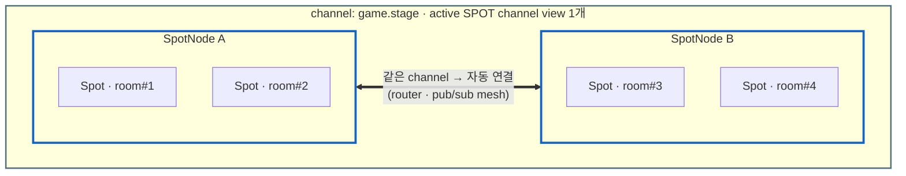
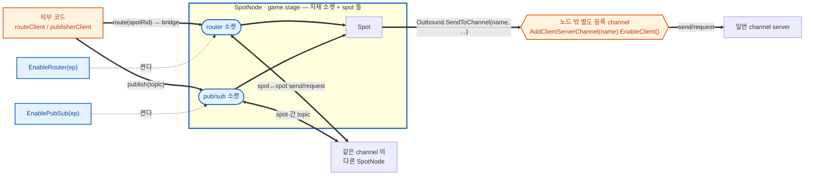
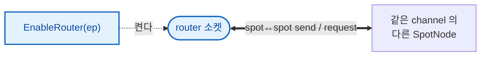
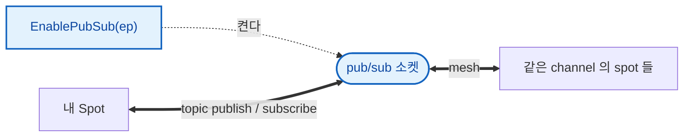
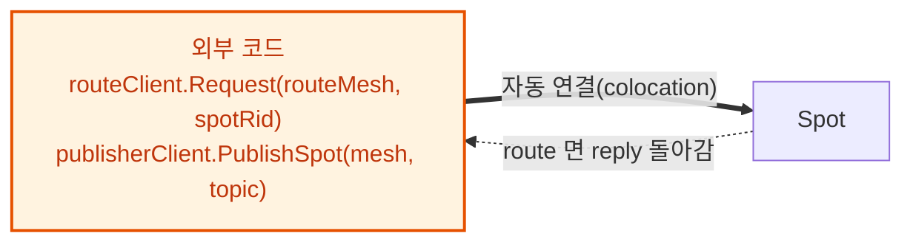
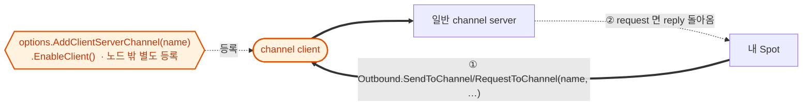
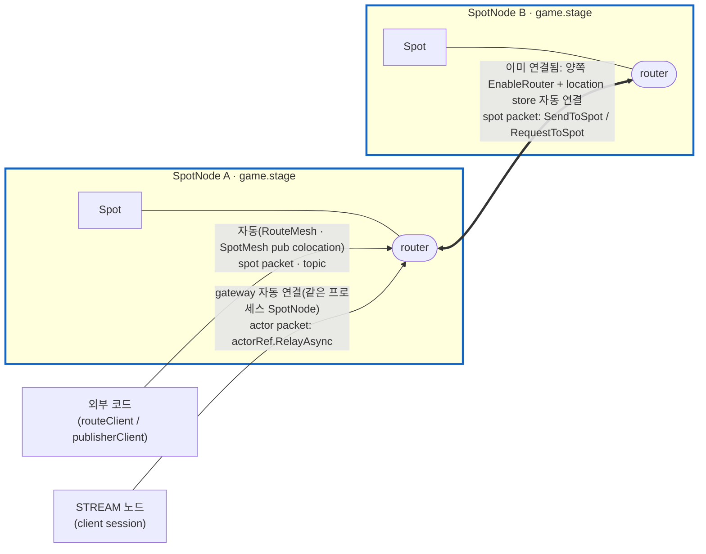
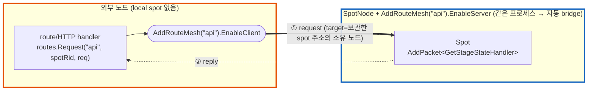

<!-- framework-adapter-nav:start -->
[문서 목록](../../../README.ko.md) | [이전: Channel Messaging](04-channel-messaging.ko.md) | [다음: Actor & Spot 호스팅](06-actor-spot.ko.md)
<!-- framework-adapter-nav:end -->

# 5. SPOT — room · stage · zone

> 정식 계약은 [spec/aspnet-core-spot](../spec/aspnet-core-spot.ko.md),
> [spec/spot-node](../spec/spot-node.ko.md), [spec/stage-wrapper-on-spot](../spec/stage-wrapper-on-spot.ko.md)가
> 다룬다. 이 챕터는 SPOT 을 등록하고 다루는 사용법 중심이다.
>
> 🔰 SPOT·actor·Entry Spot 등 용어가 낯설면 [03-concepts §0](03-concepts.ko.md)의
> 한 줄 풀이를 먼저 본다.

## 현재 구현 기준

외부에서 특정 Spot 으로 send/request 를 보낼 때는 **RouteMesh channel** 을 쓴다. RouteMesh channel 과
`SpotNode` 를 같은 프로세스에 두면, framework 가 둘을 잇는 route bridge 를 자동으로 깐다 — 직접
accept/egress 를 호출하거나 raw `DEALER`·`ROUTER`·`PUB` socket 을 `SpotNode` 에 붙일 필요가 없다.

단, 자동으로 깔리는 것은 transport(소켓 배선)까지다. "이 spot 이 지금 어느 노드에 있는가"는
transport 가 아니라 **주소**의 문제다. 호출자가 `IZLinkSpotAddressResolver` 로 spot rid 를
주소(`ZLinkSpotAddress` — 소유 노드 rid + spot rid)로 한 번 바꿔 보관하고, 보낼 때는 그 주소를
그대로 쓴다. 보내는 순간에는 어떤 위치 조회도 일어나지 않으므로, spot 이 여러 노드에 흩어져
있어도 주소만 맞으면 도달한다. 주소가 낡으면(spot 이동·소멸) 전송이 명확한 오류로 실패하고
그때 다시 resolve 한다 — 이 규칙은 §5 에서 예제로 본다.

외부에서 Spot 으로 topic 을 publish 할 때는 `IZLinkSpotPublisherClient` 를 주입해 `PublishSpot(...)`
으로 보낸다(이 연결은 같은 SpotMesh 에 붙는 것만으로 자동이라 주소가 따로 필요 없다).

## 1. SPOT 이란

`SPOT` 은 동적으로 생성·소멸되는 **주소 가능한 논리 인스턴스**다. 게임 room,
채팅 room, MMORPG zone 처럼 "있다가 없어지는 단위"를 메시지 라우팅 대상으로 삼는다.

| 개념 | 뜻 |
|------|------|
| `Spot` | room/stage/zone 같은 논리 인스턴스 하나 |
| `SpotNode` | 여러 spot 인스턴스를 호스팅하는 컨테이너 노드 |
| `TSpot` | 생성할 user Spot 타입. framework 안에서 factory 선택에만 쓰며 public 식별자로 들고 다니지 않는다 |
| `spotRid` (`RoutingId`) | `SpotNode` 가 인스턴스 생성 시 발급하는 **논리 주소**. 특정 room 한 개를 가리킨다 |
| Entry Spot | 노드의 기본 실행 컨텍스트(actor 가 생성 직후 머무는 곳) |

SPOT 은 pub/sub helper 가 아니다. publish/subscribe 는 spot **안에서** 쓰는 한
기능일 뿐이다.

규칙 세 가지를 그림으로 먼저 보자. 여기서는 **Spot ↔ SpotNode ↔ 같은 channel **
까지, 즉 channel **안쪽** 관계만 본다. 다른 channel·외부와의 연결은 아래 §2 그림에서
함수별로 다룬다.



- **Spot 은 `SpotNode` 안에 산다.** 특정 service 에 매달리는 게 아니라, 자신을
  호스팅하는 노드(컨테이너)에 종속된다. 그림의 Spot 들이 노드 박스 안에 들어 있는 모습.
- **같은 channel 노드끼리는 알아서 연결된다.** 같은 channel 의 SpotNode 끼리는
  router·pub/sub mesh 가 자동으로 이어진다(굵은 화살표). 다른 channel 로 나가는 연결은
  별도 함수가 필요하고, 아래 §2 그림에서 본다.
- **한 `SpotNode` 는 한 channel 만 본다.** active SPOT channel view 가 정확히 하나라,
  노드는 항상 하나의 channel 박스 안에 속한다. 단 **한 프로세스는 여러 `SpotNode` 를 둘 수
  있다**. `AddSpotMesh(...)` 를 channel 이름별로 여러 번 호출하면 각각 자기 channel 박스에
  속한 별도 노드가 된다(§2). 같은 이름으로 두 번 부르면 시작 예외다.

## 2. SpotNode 등록

location store 로 mesh 를 묶는 형태가 표준이다([09-location](09-location.ko.md)).

```csharp
builder.Services.AddZLinkFramework(options =>
{
    // 같은 channel("game.stage") 노드끼리 자동 연결되는 핵심: 각 노드가 자기
    // router/pub-sub bind endpoint 를 location store 의 peer row 로 등록하고,
    // 런타임이 store 에서 읽은 peer 들과 router↔router·pub/sub mesh 를 알아서
    // 배선한다. 그래서 별도 "connect" 코드 없이 §1 그림의 굵은 화살표
    // (SpotNode A <==> B)가 생긴다.
    options.AddLocationStore(new ZLinkRedisLocationStore(redis => redis
        .SetConnectionString("redis-host:6379")
        .SetKeyPrefix("game:prod")));

    var node = options.AddSpotMesh("game.stage");
    node.EnableRouter("tcp://0.0.0.0:9001");   // 이 노드의 router 소켓을 이 endpoint 에 bind (store 의 peer row 로 등록된다)
    node.EnablePubSub("tcp://0.0.0.0:9000");   // 이 노드의 pub/sub 소켓을 이 endpoint 에 bind (같은 channel 의 sub 가 여기로 붙는다)
    node.AddSpotFactory<StageSpot>();          // 이 노드가 만들 타입

    // ↓ spot 이 호출할 외부 channel — 노드 설정이 아니라 options 에 따로 등록(spot 은 이름으로 이용, §5)
    options.AddClientServerChannel("orders").EnableClient();
});
```

> **여러 SpotNode 를 한 프로세스에.** `AddSpotMesh(...)` 는 호출마다 그 channel 의 노드 하나를
> 만든다. 서로 다른 channel 이름으로 여러 번 부르면 한 프로세스가 **여러 SpotNode** 를 호스팅한다
> (예: room 노드 + session gateway 노드 동거). 같은 channel 이름을 두 번 등록하면 시작 예외다.
>
> ```csharp
> options.AddSpotMesh("game.room") // room spot 을 맡는 노드를 별도 channel 로 등록한다.
>     .EnableRouter("tcp://0.0.0.0:9001")
>     .AddSpotFactory<RoomSpot>();
> options.AddSpotMesh("game.zone") // zone spot 은 다른 노드가 맡도록 channel 을 분리한다.
>     .EnableRouter("tcp://0.0.0.0:9002")
>     .AddSpotFactory<ZoneSpot>();
> ```

node 역할은 서로 독립이다.

| node 함수 | 의미 |
|-----------|------|
| `EnableRouter(endpoint)` | 이 노드의 router 소켓을 열어 **같은 channel 의 다른 SpotNode 와 spot↔spot routed send/request**(mesh) |
| `EnablePubSub(endpoint)` | 이 노드의 pub/sub 소켓을 열어 **같은 channel topic publish/subscribe**(mesh). local spot 의 `Publish`/구독에 필요(없으면 불가) |
| `AddSpotFactory<TSpot>()` | 이 노드가 만들 spot 타입 등록. 타입 중복은 시작 예외 |
| `AddEntrySpot<TEntrySpot>()` | Entry Spot handler registry 부착(actor 사용 시, [actor spec](../spec/aspnet-core-actor.ko.md)) |

> **node 함수 vs 전역 함수.** 위 표의 함수들은 노드 한 대의 소켓·타입을 켠다. 반면
> `AddSpotRemoteAddressResolver<T>()` 는 전역(options) 함수다. spot rid → 주소 변환을
> location store 의 기본 resolver 대신 직접 만든 구현으로 바꾸고 싶을 때만 등록한다
> (기본값으로 충분하면 부를 일이 없다). 같은 resolver 를 두 번 등록하면 시작 예외다.

위 표는 **SpotNode 자체 설정**이다 — 자기 소켓(`EnableRouter`·`EnablePubSub`)과 만들 spot 타입
(`AddSpotFactory`·`AddEntrySpot`). 채널은 노드 소속이 아니다. 같은 channel 안의 spot↔spot 은 §1 처럼
자동이고(위 router 소켓), **노드 밖(다른 channel·외부)** 과 주고받는 방향은 둘이다 — 위 소켓과
(따로 등록한) 채널이 이렇게 받쳐 준다.

- **spot → 외부 channel (보낼 때).** 쓰려는 channel 은 노드와 **따로** 등록한다
  (`options.AddClientServerChannel("orders").EnableClient()`). spot 안에서는
  `Context.Outbound.SendToChannel("orders", …)` / `RequestToChannel("orders", …)` 처럼 **channel 이름만**
  부르면 framework 가 그 채널 client 로 내보낸다. 즉 spot 은 채널을 *이름으로 빌려 쓸* 뿐이다(§5).
- **외부 → spot (받을 때).** 외부 코드가 spotRid 로 보낸 route 는 **이 노드의 router 소켓**(route
  bridge)을 타고 spot 으로 들어오고, 외부 publish 는 **이 노드의 pub 소켓**으로 들어온다. 둘 다 위에서
  켠 `EnableRouter`/`EnablePubSub` 소켓을 그대로 재사용한다(외부→spot 연결은 자동 — RouteMesh channel 과
  SpotNode 가 같은 프로세스면 런타임이 잇는다).

각 소켓이 무엇을 켜고 메시지가 어디로 흐르는지 그림으로 보면 이렇다(점선 = 함수가 켠다).



> 🟦 **파란** = 이 노드의 **자체 소켓**(`EnableRouter`·`EnablePubSub`). 같은 channel mesh 에 참여하고,
> **외부→spot inbound**(route bridge·publish)도 바로 이 소켓으로 들어온다.
> 🟧 **주황** = **노드 밖에 따로 등록한 channel**. `AddClientServerChannel(name).EnableClient()` 로
> 별도 등록하고, spot 은 `Outbound` 에서 그 **이름을 불러 빌려 쓴다**(노드 설정이 아니다).

### 함수 하나씩 — 글 설명과 그림

위 종합 그림을 함수 하나씩 떼어서 본다. 각 항목은 "무엇을 켜고, 그래서 무엇이 가능해지는지"
한 줄 설명 다음에 그 함수만의 작은 그림을 둔다.

**🟦 `EnableRouter(ep)`** — 이 노드의 **router 소켓**을 켠다. 같은 channel 의 다른 SpotNode 와
spot↔spot 으로 send/request 를 주고받는 축이다. 같은 channel 노드끼리는 §1 처럼 **location
store 기준**으로 자동 연결되므로 이 소켓만 켜면 추가 배선이 없다. store 없이 peer 를 직접 잇는
수동 연결도 있다(바로 아래 "자동 연결 vs 수동 연결").



**🟦 `EnablePubSub(ep)`** — 이 노드의 **pub/sub 소켓**을 켠다. 같은 channel 에서 topic 을
publish/subscribe 하는 축이다. local spot 안의 `Outbound.Publish(...)` 가 바로 이 소켓을 쓴다.



**자동 연결 vs 수동 연결.** `EnableRouter`/`EnablePubSub` 는 *이 노드의 소켓을 여는 것*까지다. 그
소켓이 **같은 channel 의 다른 노드와 어떻게 이어지는지**는 두 방식이 있다.

  router/pub bind endpoint 를 location store 에 peer row 로 등록하고, store 에서 읽은 같은
  channel peer 들과 router↔router·sub↔pub 를 **런타임이 알아서 잇는다.** connect 코드가 없다.
- **수동(store 없이 직접 지정).** peer 주소를 코드로 박는다. 내 router 가 어느 peer router 로
  연결될지는 `ConnectRouter(endpoint)`(peer 를 콕 집으려면 `ConnectRouter(peerRid, endpoint)`),
  내 sub 가 어느 peer 의 pub 을 구독할지는 `ConnectPeerPub(peerPubEndpoint)` 로 지정한다. peer 가
  늘면 그만큼 호출을 반복한다(노드 수가 고정된 토폴로지에 적합).

```csharp
// (A) 자동 — location store 가 peer 를 알려줘 mesh 를 잇는다 (connect 코드 없음)
var node = options.AddSpotMesh("game.stage");
node.EnableRouter("tcp://0.0.0.0:9001");   // 내 router 소켓을 이 endpoint 에 bind
node.EnablePubSub("tcp://0.0.0.0:9000");   // 내 pub/sub 소켓을 이 endpoint 에 bind

// (B) 수동 — store 없이 peer 를 직접 지정 (TicTacToe Play 노드 방식, 2-노드 고정)
var node = options.AddSpotMesh("game.stage");
node.EnableRouter("tcp://0.0.0.0:9001")                            // 내 router 소켓을 연다
    .SetRoutingId(RoutingId.From("play-a"))                       // 내 노드 rid
    .ConnectRouter(RoutingId.From("play-b"), "tcp://node-b:9001") // 상대 router 로 직접 연결
    .EnablePubSub("tcp://0.0.0.0:9000")                           // 내 pub/sub 소켓을 연다
    .ConnectPeerPub("tcp://node-b:9000");                         // 상대 pub 을 직접 구독
```

**🟦 외부→spot inbound 은 자동(명시 함수 없음) — 위 router/pub 소켓을 그대로 쓴다.** 외부 코드가 `IZLinkRouteClient` 로 spot 주소에
send/request 하거나(route), `IZLinkSpotPublisherClient.PublishSpot(...)` 로 topic 을 보내면(publish),
같은 프로세스에 함께 등록된 **RouteMesh channel**(route) / **SpotMesh pub**(publish)에 런타임이 route
bridge / publisher 를 **자동으로** 붙여 spot 에 전달한다. 예전의 `AcceptSpotRoutesFromChannel`·
`EnableSpotRouteEgress`·`AttachSpotPublisherClient` 같은 짝맞춤 호출은 더 없다. route 면 reply 가
같은 길로 돌아오고, publish 는 단방향(reply 없음)이다. 상세 host 설정은 §5 에서 본다.



**🟧 spot 이 외부 channel 호출 (`AddClientServerChannel(name).EnableClient()`)** — 이건 **노드 설정이
아니라 따로 등록하는 channel** 이다. spot 이 바깥 서비스로 send(단방향)/request(요청→응답 왕복) 할 때,
spot 안에서 `Context.Outbound.SendToChannel(name, …)` / `RequestToChannel(name, …)` 로 그 **channel
이름을 부르면** framework 가 등록된 이 client 로 내보낸다. request 면 server 의 reply 가 spot 으로
되돌아온다. (자세한 사용은 §5)



spot↔spot·actor 까지 포함한 전체 연결·handler·배선 표는 **§5 「한눈에 보기」**에서 한 번에 본다. 여기 §2 그림은 "함수가 켜는 SpotNode 소켓 ↔ channel" 한 축만 떼어 본 것이다.

> 기본으로 사용한다. mesh 단위로 다른 endpoint 를 따로 지정하지 않는다. 단일 노드만 띄우는 local 테스트도 `AddSpotMesh(...)`가 반환한
> builder 에 router, pub/sub, factory 를 바로 설정한다.

## 3. Spot 작성 — handler 등록과 lifecycle

spot 클래스는 `IZLinkSpot` 을 구현하고, 주입받은 `Context` 에 handler·subscribe·
timer 를 `Configure()` 에서 등록한다.

> **SPOT handler 는 spot 의 `Configure()`(와 lifecycle) 안에서 등록한다.** channel handler 처럼
> attribute 로 자동 등록([04 §3](04-channel-messaging.ko.md))되지 않는다. spot node builder 는
> entry/spot factory 만 등록하고, packet·actor packet·subscribe·timer 등록은 spot 코드에서 한다.
> 어떤 API 가 무엇을 등록하는지는 아래 코드 주석을 참고한다.

```csharp
public sealed class StageSpot(IZLinkSpotContext context) : IZLinkSpot
{
    private IZLinkTimer? _heartbeat;
    public IZLinkSpotContext Context { get; } = context;

    // 같은 Spot 의 callback 은 직렬화되므로 이 상태에 lock 이 필요 없다.
    private int _occupants;

    public void Configure()
    {
        // AddPacket<T>: spot 으로 오는 send/request packet handler 등록
        Context.Handlers.AddPacket<GetStageStateHandler>();

        // AddActorPacket<T, TActor>: actor 가 보낸 send/request 를 처리하는 handler 등록 (actor 사용 시)
        // Context.Handlers.AddActorPacket<MoveStageHandler, StageActor>();

        // AddSubscribe<T>(topic): 지정 topic 을 구독해 publish 를 받는 handler 등록
        Context.Handlers.AddSubscribe<StageStateUpdatedHandler>("stage.state.updated");
    }

    public async ValueTask OnInitializeAsync(CancellationToken cancellationToken)
    {
        // AddTimer<T>: 주기 실행 timer handler 등록. Configure 가 아니라 lifecycle 에서 등록한다.
        _heartbeat = await Context.AddTimer<StageHeartbeatHandler>(
            "heartbeat",
            TimeSpan.FromSeconds(1),
            new ZLinkTimerOptions
            {
                OverrunPolicy = ZLinkTimerOverrunPolicy.DelayNextTick
            },
            cancellationToken);
    }

    public async ValueTask OnClosingAsync(CancellationToken cancellationToken)
    {
        if (_heartbeat is not null)
        {
            await _heartbeat.CancelAsync();
        }
    }
}
```

lifecycle callback 은 호출 순서가 정해져 있다. **`OnCreateAsync`(생성 1회) → `OnInitializeAsync`
(초기화 1회) → … → `OnClosingAsync`(종료 1회).** 위 예제는 `OnInitializeAsync`/`OnClosingAsync`
만 보였는데, 생성 시점에 한 번 불리는 `OnCreateAsync` 가 추가로 있다.

```csharp
// OnCreateAsync: 생성 요청 메시지를 받아 초기 상태를 세팅하고, 생성을 수락/거부한다.
public ValueTask<ZLinkSpotCreateResponse> OnCreateAsync(ZLinkMessage request, CancellationToken ct)
{
    var create = request.Decode<DeliverySpotCreate>();   // GetOrCreateAsync 에 넘긴 payload(§4)
    _deliveryId = create.DeliveryId;

    // Accept(reply) 의 reply 는 생성 호출자에게 ZLinkSpotCreateResult.Reply 로 돌아간다(선택).
    return ValueTask.FromResult(ZLinkSpotCreateResponse.Accept(new DeliverySpotCreated(_deliveryId)));
    // 거부하려면 ZLinkSpotCreateResponse.Reject() — 호출자는 State == Rejected 를 받는다.
}
```

> **`Context.SpotRid` vs `Context.NodeRid`.** `Context.SpotRid` 는 이 spot 한 개의 논리 주소,
> `Context.NodeRid` 는 이 spot 을 호스팅하는 **노드**의 routing id 다. 어느 노드가 spot 을
> 소유하는지 응답·로그에 실어 보낼 때 `Context.NodeRid` 를 쓴다.

spot handler 는 첫 인자로 spot 인스턴스를 받는다.

```csharp
// request 핸들러: 제네릭 인자는 <대상 spot, 요청, 응답> 순서다.
public sealed class GetStageStateHandler
    : IZLinkSpotRequestHandler<StageSpot, GetStageStateRequest, GetStageStateReply>
{
    public ValueTask<GetStageStateReply> HandleAsync(
        StageSpot spot,                  // 첫 인자 = 대상 spot 인스턴스. 그 spot 의 상태·Context 에 바로 접근한다.
        GetStageStateRequest request,
        CancellationToken cancellationToken)
        // spot.Context 로 그 spot 의 정보(여기선 SpotRid)를 읽어 응답을 만든다.
        => ValueTask.FromResult(new GetStageStateReply(spot.Context.SpotRid.ToString()));
}

// timer 핸들러: Configure 가 아니라 AddTimer 등록(§ OnInitializeAsync)으로 주기 실행된다.
public sealed class StageHeartbeatHandler : IZLinkSpotTimerHandler<StageSpot>
{
    public ValueTask HandleAsync(
        StageSpot spot,                  // request 핸들러와 동일하게 첫 인자로 대상 spot 을 받는다.
        ZLinkTimerTick tick,             // tick: 이번 주기 실행의 메타(예정 시각·지연 등)
        CancellationToken cancellationToken)
        => ValueTask.CompletedTask;
}
```

> **실행 직렬화 — SPOT 의 핵심 보장.** 한 user Spot 의 모든 callback(packet,
> request, subscription, timer, actor packet, channel reply 후속)은 **하나의 Spot
> 실행 큐**에서 직렬로 돈다. 그래서 room board 같은 가변 상태를 lock 없이 만질 수
> 있다. 단 이 보장은 그 Spot 내부 callback 한정이다. 외부에서 `SpotRid` 로 직접
> 접근하는 코드는 별도 동기화가 필요하다.

여기서 말하는 직렬화는 payload 를 bytes 로 바꾸는 codec 직렬화가 아니라, **메시지를
어떤 실행 줄에서 어떤 순서로 처리하는가**를 뜻한다. Entry Spot 과 user/domain Spot 은
둘 다 framework 가 순서를 보장하지만, 메시지가 들어오는 경로와 순서의 기준이 다르다.

| 구분 | 주소 지정과 진입 경로 | 실행 순서 기준 | 상태를 둘 때의 기준 |
|------|------------------------|----------------|---------------------|
| user/domain Spot | `spotRid` 로 특정 room/stage/zone 을 가리키고, route mesh 나 local call 로 들어온다 | 해당 Spot 인스턴스의 실행 큐 | 그 Spot 이 소유한 도메인 상태 |
| Entry Spot | actor 생성 직후의 기본 위치이며, actor packet 은 session/actor relay 를 거쳐 들어온다 | 대상 actor mailbox 와 Entry Spot dispatch 계약 | actor-local 상태 또는 admission 같은 짧은 진입 처리 |

그래서 room board, match queue, zone state 처럼 여러 메시지가 함께 바꾸는 도메인 상태는
user/domain Spot 에 둔다. Entry Spot 에서는 actor 를 만들거나 actor 의 첫 진입을
처리하는 일을 맡기고, actor packet 의 순서 보장은 Entry Spot 전체 큐만으로 설명하지
않는다. 대상 actor mailbox 가 순서의 중요한 기준이므로 actor dispatch 세부 규칙은
[06-actor-spot](06-actor-spot.ko.md)과 [07-actor-session](07-actor-session.ko.md)에서
함께 본다.

### yield dispatch

Spot/Entry Spot handler 안에서 기본 terminator인 `Async(...)`를 기다리면 handler가
끝날 때까지 같은 Spot 실행 큐의 다음 작업은 시작되지 않는다. 공용 상태를 await 전후로
이어 쓰는 일반 handler는 이 기본 동작을 사용한다.

player 한 명의 admission/preflight처럼 await 전후에 actor-local 값과 reply 값만 쓰는
흐름에서는 `Yield(...)`를 사용할 수 있다. `Yield(...)`는 현재 actor 또는 timer
mailbox turn을 반납하고, completion 뒤 같은 mailbox continuation으로 돌아온다. 같은 actor의
다음 packet은 continuation 뒤에 실행되지만, 다른 actor나 timer 작업은 그 사이에 실행될 수
있다.

Bingo sample의 `MatchBingoActorHandler`는 API channel request와 room `JoinSpot`에
`Yield(...)`를 사용한다. room list, match queue, lobby state 같은 공용 mutable state를
await 전후로 이어서 판단하는 handler에는 `Yield(...)`를 쓰지 않는다.

### timer 사용법

timer 는 spot 안에서 주기적으로 상태를 갱신하거나, 오래된 참가자를 정리하거나,
주기적인 snapshot 을 publish 할 때 사용한다. 일반적인 사용 흐름은 다음과 같다.

1. `Configure()` 에서는 packet, subscribe, actor handler 처럼 동기 등록만 한다.
2. `OnInitializeAsync(...)` 에서 `Context.AddTimer<THandler>(...)` 를 호출한다.
3. 반환된 `IZLinkTimer` 를 spot 필드에 보관한다.
4. `OnClosingAsync(...)` 에서 `CancelAsync()` 로 멈춘다.
5. 실제 주기 작업은 `IZLinkSpotTimerHandler<TSpot>` 구현체에 둔다.

`AddTimer<THandler>(name, period, options, cancellationToken)` 의 인자는 다음 의미다.

| 인자 | 의미 |
|------|------|
| `THandler` | tick 이 발생할 때 실행할 handler 타입. DI 로 생성된다 |
| `name` | timer 이름. monitoring 과 tick metadata 에 들어간다 |
| `period` | tick 간격. `TimeSpan.Zero` 나 음수는 설정 오류다 |
| `options` | tick 이 밀릴 때의 정책과 예외 처리 정책 |
| `cancellationToken` | 등록 작업 취소 토큰 |

timer handler 는 매 tick 마다 spot 인스턴스와 `ZLinkTimerTick` 을 받는다.

```csharp
public sealed class StageHeartbeatHandler : IZLinkSpotTimerHandler<StageSpot>
{
    public async ValueTask HandleAsync(
        StageSpot spot,
        ZLinkTimerTick tick,
        CancellationToken cancellationToken)
    {
        if (tick.SkippedTicks > 0)
        {
            // 이전 tick 이 밀렸다는 뜻이다. 무거운 보정 작업은 여기서 줄일 수 있다.
        }

        await spot.Context.Outbound
            .Publish("stage.heartbeat", new StageHeartbeat(spot.Context.SpotRid, tick.StartedAt))
            .Async(cancellationToken);
    }
}
```

`ZLinkTimerTick` 은 "이번 callback 이 시간표에서 어떤 위치였고, 실제로 얼마나
늦게 실행됐는지"를 설명하는 값이다. handler 안에서 보정, 로깅, 부하 완화,
publish payload 작성에 사용할 수 있다.

| 값 | 의미 |
|----|------|
| `Name` | 등록한 timer 이름. handler 하나가 여러 timer 에 재사용될 때 분기하거나 monitoring payload 에 넣는다 |
| `DeliveryIndex` | 실제 handler callback 번호. "이 handler 가 몇 번째 실행됐는지"가 필요할 때 쓴다 |
| `ScheduledIndex` | fixed-rate 시간표 기준 tick 번호. 건너뛴 tick 까지 포함한 논리 tick 번호다 |
| `Period` | 등록한 tick 간격. handler 에서 다음 상태 계산의 기본 간격으로 쓴다 |
| `ScheduledAt` | 원래 실행될 예정이던 시각. 외부 이벤트 timestamp 나 timeout 판정 기준으로 쓴다 |
| `StartedAt` | handler 실행이 시작된 실제 시각. publish payload 나 last-seen 갱신에 쓴다 |
| `ScheduledElapsed` | timer 시작 이후 `ScheduledAt` 까지의 논리 경과 시간 |
| `StartedElapsed` | timer 시작 이후 `StartedAt` 까지의 실제 경과 시간 |
| `Delay` | 예정 시각보다 얼마나 늦게 시작했는지. timer 부하 감지와 degrade 판단에 쓴다 |
| `SkippedTicks` | overrun 정책 때문에 건너뛴 tick 수. 무거운 보정 작업을 줄이거나 상태를 빠르게 catch-up 할 때 쓴다 |

`DeliveryIndex` 와 `ScheduledIndex` 는 항상 같은 값이 아니다. tick 이 밀려 일부
tick 을 건너뛰면 `ScheduledIndex` 는 시간표를 따라 앞으로 가고,
`DeliveryIndex` 는 실제 callback 횟수만 증가한다. 그래서 "실제로 몇 번
callback 이 왔는가"는 `DeliveryIndex`, "논리 시간표에서 몇 번째 tick 인가"는
`ScheduledIndex` 를 기준으로 삼는다.

이 세 값(`ScheduledIndex` · `Delay` · `SkippedTicks`)이 실제로 어떻게 맞물리는지는
아래 "고빈도 전투 room" 예시에서 코드로 본다.

`ScheduledAt` 과 `StartedAt` 은 목적이 다르다. `ScheduledAt` 은 timer 가 원래
실행됐어야 하는 논리 시각이고, `StartedAt` 은 실제 callback 이 시작된 시각이다.
turn timeout, room TTL, simulation step 처럼 논리 시간이 중요하면 `ScheduledAt`
또는 `ScheduledElapsed` 를 기준으로 삼는다. heartbeat publish, last-seen 갱신,
운영 로그처럼 실제 관측 시각이 중요하면 `StartedAt` 또는 `StartedElapsed` 를
사용한다.

### timer 정책

`ZLinkTimerOptions.OverrunPolicy` 로 tick 이 밀릴 때 동작을 정한다.

| 정책 | 동작 |
|------|------|
| `SkipLateTicks` | 늦은 tick 은 버리고 다음 정시 tick 으로 이동한다 |
| `CatchUpBounded` | `MaxCatchUpTicks` 까지만 밀린 tick 을 연속 보충한다 |
| `DelayNextTick` | handler 완료 후 period 만큼 다시 기다린다 |

정책 선택 기준은 보통 다음과 같다.

| 상황 | 권장 정책 | 이유 |
|------|----------|------|
| heartbeat, presence refresh, stale actor cleanup | `SkipLateTicks` | 최신 상태 한 번이면 충분하다 |
| physics step, turn timeout 보정처럼 빠진 tick 을 일부 반영해야 함 | `CatchUpBounded` | 무한 catch-up 을 막으면서 제한적으로 보충한다 |
| polling, 외부 API 호출, DB cleanup 처럼 handler 완료 뒤 쉬어야 함 | `DelayNextTick` | handler 시간이 길어도 겹쳐 실행하지 않고 부하를 제한한다 |

`CatchUpBounded` 를 쓰면 `MaxCatchUpTicks` 도 함께 정한다.

```csharp
_timer = await Context.AddTimer<StageTickHandler>(
    "stage.tick",
    TimeSpan.FromMilliseconds(100),
    new ZLinkTimerOptions
    {
        OverrunPolicy = ZLinkTimerOverrunPolicy.CatchUpBounded,
        MaxCatchUpTicks = 3
    },
    cancellationToken);
```

기본값은 `SkipLateTicks` 다. `MaxCatchUpTicks` 는 `CatchUpBounded` 에서만 의미가
있고, `CatchUpBounded` 로 설정했는데 `MaxCatchUpTicks <= 0` 이면 설정 오류다.

### 예시: 고빈도 전투 room — tick 이 밀릴 때

위 metadata·정책이 실제로 어디서 쓰이는지 가장 잘 드러나는 곳이 게임의 고빈도
timer 다. 실시간 전투 room 을 보자. 두 개의 timer 를 둔다.

- **`battle.sim` (50ms, 20Hz)** — 전투 simulation step. cooldown, 투사체 이동,
  도트 데미지가 모두 step 수에 묶여 있어 **빠진 step 을 그냥 버리면 게임이 어긋난다.**
  그래서 `CatchUpBounded` 로 빠진 step 을 일부 보충하되, GC 정지처럼 길게 멈췄을 때
  수백 step 을 몰아 도는 death-spiral 은 `MaxCatchUpTicks` 로 막는다.
- **`battle.snapshot` (100ms)** — 클라이언트로 world 상태 broadcast. 밀린 snapshot 을
  몰아 보내봐야 **클라이언트엔 최신 한 장만 의미 있다.** 그래서 `SkipLateTicks`.

```csharp
public async ValueTask OnInitializeAsync(CancellationToken ct)
{
    // 50ms 전투 simulation — 빠진 step 을 최대 4개(=200ms)까지만 보충
    _sim = await Context.AddTimer<BattleSimHandler>(
        "battle.sim",
        TimeSpan.FromMilliseconds(50),
        new ZLinkTimerOptions
        {
            OverrunPolicy = ZLinkTimerOverrunPolicy.CatchUpBounded,
            MaxCatchUpTicks = 4
        },
        ct);

    // 100ms world snapshot — 밀리면 과거는 버리고 최신만
    _snapshot = await Context.AddTimer<BattleSnapshotHandler>(
        "battle.snapshot",
        TimeSpan.FromMilliseconds(100),
        new ZLinkTimerOptions { OverrunPolicy = ZLinkTimerOverrunPolicy.SkipLateTicks },
        ct);
}
```

simulation handler 에서 `tick` 의 세 값이 각각 제 역할을 한다.

```csharp
public sealed class BattleSimHandler : IZLinkSpotTimerHandler<BattleRoomSpot>
{
    public ValueTask HandleAsync(
        BattleRoomSpot room, ZLinkTimerTick tick, CancellationToken ct)
    {
        // ① 논리 시간은 wall clock 이 아니라 ScheduledIndex 로 잡는다.
        //    프레임이 밀려도 cooldown·투사체·도트가 "몇 번째 step" 기준으로 정확히 진행된다.
        room.AdvanceCombat(step: tick.ScheduledIndex, dt: tick.Period);

        // ② Delay 로 부하를 감지해, 권위 판정(데미지/사망)은 유지하되
        //    다시 만들 수 있는 파생 데이터는 이번 tick 에서 건너뛴다.
        if (tick.Delay < TimeSpan.FromMilliseconds(100))
        {
            room.RebuildAoeSpatialIndex();   // AOE 조회용 공간 해시 — 비싸고 다음 tick 에 다시 만들면 됨
        }

        // ③ SkippedTicks > 0 이면 정책 한도를 넘겨 버려진 step 이 있었다는 뜻.
        //    하나씩 재현하지 말고 최신 상태로 빠르게 맞추고, 운영 지표로 남긴다.
        if (tick.SkippedTicks > 0)
        {
            room.FastForwardTo(tick.ScheduledIndex);
            room.ReportSimLag(tick.SkippedTicks, tick.Delay);
        }

        return ValueTask.CompletedTask;
    }
}
```

부하 시나리오로 따라가 보자. 서버가 GC/CPU 스파이크로 **180ms 멈췄다 깨어났다.**

- `battle.sim` 은 그동안 약 3~4 step 이 밀렸다. `CatchUpBounded(4)` 라 깨어난 직후
  handler 가 연속 호출되어 빠진 step 을 메운다. 각 호출의 `ScheduledIndex` 가
  1씩 올라가므로 simulation 은 "건너뛴 step 까지 포함한 논리 시간"을 그대로 따라간다
  (`DeliveryIndex` 는 실제 callback 수라서 catch-up 동안 천천히 따라붙는다).
- 멈춤이 더 길어 4 step 한도를 넘기면 초과분은 버려지고 그 수가 `SkippedTicks` 로
  들어온다. 이때 step 을 하나씩 재현하면 또 밀리므로 `FastForwardTo` 로 한 번에 맞춘다.
- 깨어난 첫 tick 들은 `Delay` 가 크므로 ② 분기에서 공간 해시 재생성 같은 비싼 작업을
  걸러, room 이 빨리 정상 주기로 복귀하게 한다.
- `battle.snapshot` 은 `SkipLateTicks` 라 밀린 동안의 snapshot 이 한 장으로 합쳐져,
  깨어나면 현재 상태 한 장만 broadcast 한다. 오래된 world 를 몰아 보내지 않는다.

요약하면 `ScheduledIndex` 는 **시간 정확성**(빠져도 어긋나지 않게), `Delay` 는
**부하 적응**(밀리면 덜어내기), `SkippedTicks` 는 **복구 신호**(버려진 만큼 빠르게
맞추고 계측)에 쓴다. 정책은 "빠진 걸 따라잡아야 하나(`CatchUpBounded`) / 최신만
중요한가(`SkipLateTicks`) / 겹치면 안 되나(`DelayNextTick`)"로 고른다.

### 예외와 종료

timer handler 에서 처리하지 않은 예외가 나면 runtime monitoring 에
`TimerHandlerFailed` 이벤트가 발생한다([10-monitoring](10-monitoring.ko.md)).
기본값에서는 다음 tick 을 계속 시도한다. 같은 예외가 반복될 수 있는 작업이라면
handler 안에서 application 상태를 점검하고 직접 복구하거나, timer 를 중단하도록
설정한다.

```csharp
_timer = await Context.AddTimer<StageHeartbeatHandler>(
    "heartbeat",
    TimeSpan.FromSeconds(1),
    new ZLinkTimerOptions
    {
        StopOnUnhandledException = true
    },
    cancellationToken);
```

`StopOnUnhandledException` 이 `true` 이면 첫 unhandled exception 뒤 timer 를
중단하고 `TimerStoppedAfterUnhandledException` 이벤트를 기록한다.

timer 를 더 이상 쓰지 않으면 `CancelAsync()` 를 호출한다. 예를 들어 room 이
닫히거나 spot 이 closing 될 때 멈춘다.

```csharp
public async ValueTask OnClosingAsync(CancellationToken cancellationToken)
{
    if (_heartbeat is not null)
    {
        await _heartbeat.CancelAsync();
    }
}
```

user Spot timer 는 같은 spot 실행 큐에서 처리된다. 그래서 같은 spot 의 packet
handler 와 timer handler 는 동시에 같은 spot 상태를 변경하지 않는다. Entry Spot actor
packet 은 대상 actor mailbox 에서 처리하므로 Entry Spot timer 설명과 섞지 않는다.
Entry Spot timer 실행 줄 정합성은 actor packet dispatch 계약과 분리해서 다룬다.

짧은 local 계산을 Spot 실행 큐 밖에서 처리해야 하면 `RunWorker(...)` 를 사용한다. worker
함수 안에서는 Spot 상태를 직접 바꾸지 않고, 완료 뒤 Spot 실행 큐로 돌아온 callback에서
상태를 갱신한다.

```csharp
Context.RunWorker(_ => ScoreCalculator.Calculate(snapshot))
    .Submit((result, ct) =>
    {
        CurrentScore = result;
        return ValueTask.CompletedTask;
    });
```

## 4. spot 인스턴스 생성과 조회

spot 인스턴스는 handler 가 아니라 `IZLinkSpotManager` 로 생성·조회한다.

```csharp
public sealed class StageAllocator(IZLinkSpotManager spots, IZLinkSpotPublisherClient publisher)
{
    public async Task<string> OpenAsync(CancellationToken ct)
    {
        ZLinkSpotCreateResult stage = await spots.CreateAsync<StageSpot>(ct);

        await publisher
            .PublishSpot("game.stage", "stage.state.updated",
                new StageStateUpdatedEvent(stage.SpotRid.ToString()))
            .Async(ct);

        return stage.SpotRid.ToString();
    }
}
```

- `CreateAsync<TSpot>()` 는 빈 `ZLinkMessage` 로 생성하고 `OnCreateAsync`가 허용하면
  `OnInitializeAsync` 가 한 번 실행된다.
- `GetOrCreateAsync<TSpot>(spotRid, ...)` 는 이미 있으면 `State == Existing` 으로
  재사용하고(새로 만들면 `Created`, `OnCreateAsync` 가 거부하면 `Rejected`), 같은
  `spotRid` 가 다른 타입으로 있으면 `SpotTypeMismatch` 오류로 **예외를 던진다**
  (`ZLinkSpotCreateState` 가 아니라 `ZLinkFrameworkErrorKind`).
- 반환된 `ZLinkSpotCreateResult` 는 long-lived handle 이 아니다. `SpotRid`/
  `State`/`Reply` 만 들고 다니고, 이후 메시징은 publish 나 route bridge channel socket
  로 한다.

#### 생성 시 payload 넘기기 — `GetOrCreateAsync(spotRid, createMessage, ct)`

실무에서는 보통 **domain id 로 `spotRid` 를 만들고, 생성 메시지를 함께 넘긴다.** 그 메시지는
spot 의 `OnCreateAsync` 로 그대로 전달돼, spot 이 자기 초기 상태를 세팅한다(§3 참고).

```csharp
// 채널 handler 안 — deliveryId 라는 domain id 로 tracking spot 을 보장(없으면 생성)
await spots.GetOrCreateAsync<DeliveryTrackingSpot>(
    RoutingId.From(request.DeliveryId),               // spotRid = domain id 를 RoutingId 로
    new DeliverySpotCreate(request.DeliveryId),       // 이 payload 가 OnCreateAsync 로 들어간다
    cancellationToken);
```

#### in-process directory — 채널 handler 에서 살아 있는 spot 인스턴스에 닿기

같은 프로세스의 일반 채널 handler 가 특정 spot 인스턴스의 메서드를 직접 부르고 싶을 때는,
spot 이 생성 시 자신을 **directory(앱이 가진 `Dictionary<domainId, spot>`)** 에 등록해 두고
handler 가 그 directory 로 조회한다. cross-node route(§5)와 달리 **같은 노드 안**에서만 쓰는
지름길이다.

```csharp
// 1) DI 싱글톤 directory 등록:  services.AddSingleton<DeliverySpotDirectory>();

// 2) spot 이 OnCreateAsync 에서 자신을 등록 (directory 는 생성자 주입)
public ValueTask<ZLinkSpotCreateResponse> OnCreateAsync(ZLinkMessage request, CancellationToken ct)
{
    _deliveryId = request.Decode<DeliverySpotCreate>().DeliveryId;
    directory.Add(_deliveryId, this);
    return ValueTask.FromResult(ZLinkSpotCreateResponse.Accept(new DeliverySpotCreated(_deliveryId)));
}

// 3) 채널 handler 가 보장 후 조회해서 spot 메서드 호출
await spots.GetOrCreateAsync<DeliveryTrackingSpot>(
    RoutingId.From(request.DeliveryId), new DeliverySpotCreate(request.DeliveryId), ct);
directory.Require(request.DeliveryId).Record(request);   // 같은 노드의 spot 인스턴스 메서드 직접 호출
```

> **동기화 주의.** spot 의 메서드를 directory 로 직접 부르면 spot 의 직렬 실행 큐를 거치지
> 않는다. 위 `Record(...)` 처럼 *간단한 append* 면 괜찮지만, 복잡한 상태를 만질 때는 직접
> 호출 대신 spot packet(`SendToSpot`/`RequestToSpot`, §5)으로 보내 직렬화하는 편이 안전하다.

## 5. SPOT 메시징

spot 이 주고받는 메시지는 **대상이 무엇이냐**로 나뉜다. 종류마다 보내는 함수와 받는
handler 가 짝이고, spot **안**(callback)에서 부르는 함수와 **밖**(HTTP·일반 channel·
background)에서 부르는 함수가 다를 뿐 결국 같은 handler 로 들어간다. 종류는 넷이다.

- **topic** — channel topic 으로 publish/subscribe
- **spot packet** — spot 주소(`ZLinkSpotAddress`)로 보내는 send/request
- **actor packet** — session 에 bind 된 actor 로 들어가는 메시지
- **일반 channel** — spot 이 다른 (비-spot) channel service 를 호출

### 한눈에 보기

연결 그림부터 보자. spot 은 `SpotNode` 안에 살고, **같은 spot mesh 의 SpotNode 들은
router↔router 로 이미 연결**돼 있어(각 노드 `EnableRouter` + location store 자동 연결)
spot↔spot 메시징은 추가 배선이 없다. 외부 노드/채널도 **RouteMesh channel(route)·SpotMesh(publish)를 같은
프로세스에 두면 런타임이 자동으로 잇는다**(굵은 화살표 = spot mesh 자동, 가는 화살표 = colocation 자동 bridge).



종류별 함수·handler·배선을 한 표로 모으면 다음과 같다.

| 종류 | spot 안에서 (`Outbound`) | spot 밖에서 (주입 client) | 받는 handler (§3 등록) | 연결 배선 |
|------|---------------------------|----------------------------|------------------------|-----------|
| topic | `Publish(topic, …)` | `IZLinkSpotPublisherClient.PublishSpot(mesh, topic, …)` | `AddSubscribe<T>(topic)` → `IZLinkSpotSubscriptionHandler` | 같은 SpotMesh pub colocation → **자동** (보내는 쪽 SpotMesh + `EnablePubSub`) |
| actor packet | — | session `actorRef.RelayAsync(…)` | `AddActorPacket<T, TActor>` → `IZLinkSpotActorSendHandler` · `IZLinkSpotActorRequestHandler` | STREAM gateway 자동(같은 프로세스 SpotNode) + `EnableRouter` + `AddEntrySpot` + `AddActorFactory` |
| 일반 channel | `SendToChannel / RequestToChannel(name, …)` | (그 channel 의 handler, [04](04-channel-messaging.ko.md)) | 그 channel 의 handler | `AddClientServerChannel(name).EnableClient()` ↔ 그 channel server |

spot **안**에서 내보내는 코드는 한 handler 에서 세 종류를 이렇게 부른다.

```csharp
public sealed class StageNoticeHandler
    : IZLinkSpotRequestHandler<StageSpot, BroadcastRequest, BroadcastReply>
{
    public async ValueTask<BroadcastReply> HandleAsync(
        StageSpot spot, BroadcastRequest request, CancellationToken ct)
    {
        var outbound = spot.Context.Outbound;

        // topic — 현재 channel 의 topic 으로 publish
        outbound.Publish("stage.notice", new StageNoticeEvent(request.Text)).Submit(ct);

        // 일반 channel — attach 된 비-spot channel 로 send/request
        outbound.SendToChannel("orders", new RoomNoticeMessage(request.Text)).Submit(ct);
        var state = await outbound
            .RequestToChannel("orders", new GetOrderStateRequest())
            .Async<GetOrderStateReply>(ct);

        // spot packet — 다른 Spot 으로. 주소는 미리 resolve 해서 들고 있는 값이다(§5 아래).
        outbound.SendToSpot(peerAddress, new StageNoticeEvent(request.Text)).Submit(ct);

        return new BroadcastReply(state.Count);
    }
}
```

아래에서 종류별로 받는 handler 와 밖에서 보내는 코드를 본다. host 설정 전문은 맨 끝
"host 배선 한곳에 모아 보기" 에 모았다.

### topic — publish / subscribe

받는 쪽은 spot 이 `Configure()` 에서 topic 을 구독한 handler 다. event 는 같은 Spot
실행 큐에서 직렬로 처리된다.

```csharp
// StageSpot.Configure() 안
Context.Handlers.AddSubscribe<StageStateUpdatedHandler>("stage.state.updated");

public sealed class StageStateUpdatedHandler
    : IZLinkSpotSubscriptionHandler<StageSpot, StageStateUpdatedEvent>
{
    public ValueTask HandleAsync(
        StageSpot spot, StageStateUpdatedEvent message, CancellationToken ct)
    {
        spot.ApplyPeerState(message);   // lock 불필요 — 같은 Spot 큐에서 직렬 실행
        return ValueTask.CompletedTask;
    }
}
```

spot **밖**(local spot 없는 노드)에서는 `IZLinkSpotPublisherClient` 로 같은 topic 에 쏜다.

```csharp
app.MapPost("/stage/publish", async (
    PublishStageStateHttpRequest request,
    IZLinkSpotPublisherClient spotPublisher,
    CancellationToken ct) =>
{
    await spotPublisher
        .PublishSpot("game.stage", "stage.state.updated",
            new StageStateUpdatedEvent(request.StageRid))
        .Async(ct);
    return Results.Accepted();
});
```

spot 안에서 자기 channel 로 `Publish` 만 할 거면 자기 노드 `EnablePubSub` 하나면 된다.

### spot packet — send / request

받는 쪽은 `AddPacket<T>` 로 등록한 handler 다. 보내는 쪽이 다른 spot 이든 외부 코드든
같은 handler 가 받고, request 면 reply 를 돌려준다.

```csharp
// StageSpot.Configure() 안
Context.Handlers.AddPacket<GetStageStateHandler>();

public sealed class GetStageStateHandler
    : IZLinkSpotRequestHandler<StageSpot, GetStageStateRequest, GetStageStateReply>
{
    public ValueTask<GetStageStateReply> HandleAsync(
        StageSpot spot, GetStageStateRequest request, CancellationToken ct)
        => ValueTask.FromResult(new GetStageStateReply(spot.Occupants));
}
```

spot **안**(spot↔spot)에서는 `RequestToSpot(주소, …)`. 같은 mesh 라 배선이 자동이다.

대상 spot 의 **주소는 한 번만 조회해서 들고 있는다.** `IZLinkSpotAddressResolver` 로
spot rid 를 주소(`ZLinkSpotAddress` — 소유 노드 rid + spot rid)로 바꾸고, 그 주소를
상태에 보관했다가 보낼 때마다 재사용한다. 보내는 순간에는 어떤 조회도 일어나지 않는다.
주소가 낡으면(spot 이 이동·소멸) 전송이 명확한 오류로 실패하고, 그때 다시 resolve 한다
([공통 스펙: spot 주소 메시징](../../common/spec/spot-address-messaging.ko.md)).

```csharp
// ① 상호작용을 시작할 때 한 번 — spot rid 로 주소 조회
var peerAddress = await spots.ResolveSpotAddressAsync(peerStageRid, ct)
                  ?? throw new InvalidOperationException("peer stage 가 아직 없다");

// ② 이후에는 보관한 주소로 바로 요청 — 조회 없음
var peer = await spot.Context.Outbound
    .RequestToSpot(peerAddress, new GetStageStateRequest())
    .Async<GetStageStateReply>(ct);
```

spot **밖**(외부 코드)에서는 `IZLinkRouteClient` 로 **RouteMesh channel 이름 + spot 주소**에
보낸다. 주소는 spot 안에서와 똑같이 resolve 한 번으로 얻어 보관한다.

```csharp
// 일반 코드(spot 아님) — route client 로 spot 주소에 request
public sealed class StageQueryAdapter(
    IZLinkRouteClient routes,
    IZLinkSpotAddressResolver spots)
{
    private ZLinkSpotAddress? _stage;   // 한 번 resolve 해서 보관

    public async ValueTask<GetStageStateReply> GetAsync(RoutingId spotRid, CancellationToken ct)
    {
        _stage ??= await spots.ResolveSpotAddressAsync(spotRid, ct)
                   ?? throw new InvalidOperationException("stage 가 아직 없다");
        return await routes
            .RequestToSpot("api", _stage.Value, new GetStageStateRequest())   // "api" = RouteMesh channel 이름
            .Async<GetStageStateReply>(ct);
    }
}
```

배선은 **자동**이다. 받는 쪽은 `AddRouteMesh("api")` 를 `SpotNode` 와 같은 프로세스에 두기만 하면,
런타임이 그 RouteMesh ROUTER 에 route bridge 를 붙여 inbound relay 를 spot 에 넘긴다(예전의
`AcceptSpotRoutesFromChannel`·`EnableSpotRouteEgress` 짝맞춤 없음). 보내는 쪽은
`AddRouteMesh("api").EnableClient(...)` 만 하면 된다. **보내는 순간 위치를 찾지 않는다** — 주소에
이미 소유 노드가 들어 있으므로 런타임은 그 노드로 전달만 한다. spot 이 다른 노드로 이동했다면
요청이 `SpotRouteNotFound` 로 실패하고, 호출자가 다시 resolve 해서 재시도한다.
request 면 spot 의 reply 가 같은 길로 돌아온다.



```csharp
// ── 보내는 노드 (API 서버) ──
options.AddRouteMesh("api").EnableClient("tcp://play-node-1:9001");

// ── 받는 노드 (SpotNode) — 같은 프로세스에 RouteMesh + 노드 → 자동 bridge ──
options.AddRouteMesh("api").EnableServer("tcp://0.0.0.0:9001");
var node = options.AddSpotMesh("game.stage");
node.EnableRouter("tcp://0.0.0.0:9101");
node.AddSpotFactory<StageSpot>();
```

### actor packet

받는 쪽은 actor 를 호스팅하는 spot(`IZLinkSpot<TActor>`)이 `AddActorPacket` 으로
actor packet handler 를 등록한다. handler 는 spot 과 함께 dispatch 대상 actor 를 받는다.

```csharp
// StageSpot.Configure() 안 (StageSpot : IZLinkSpot<StageActor>)
Context.Handlers.AddActorPacket<MoveActorHandler, StageActor>();

public sealed class MoveActorHandler
    : IZLinkSpotActorRequestHandler<StageSpot, StageActor, MoveActorCommand, MoveActorReply>
{
    public ValueTask<MoveActorReply> HandleAsync(
        StageSpot spot, StageActor actor,
        ZLinkSpotActorRequestContext context,
        MoveActorCommand message, CancellationToken ct)
    {
        actor.MoveTo(message.X, message.Y);
        return ValueTask.FromResult(new MoveActorReply(message.X, message.Y));
    }
}
```

호출하는 쪽: client stream 의 session 이 들어온 packet 을 bind 된 actor 로 relay 하면,
그 actor 가 join 해 있는 spot 의 위 handler 로 dispatch 된다.

```csharp
// SampleSession.OnDispatchAsync — client packet 을 bound actor 로 relay
var actorRef = Context.Actors.Find(actorId)
    ?? throw new InvalidOperationException("actor not bound");
await actorRef.RelayAsync(payload, ct);
```

자세한 actor bind/dispatch 흐름은 [06-actor-spot](06-actor-spot.ko.md)에서 다룬다.

### 일반 channel — spot 이 다른 channel 호출

spot 이 비-spot channel service(예: `orders`)를 호출하는 경우다. spot **안**에서
`SendToChannel/RequestToChannel` 을 쓰고(위 "한눈에 보기" 의 handler 예시), 해당
client/server channel에 `EnableClient()`가 있어야 한다. 받는 쪽은 그 channel 의 일반 handler 이고
([04-channel-messaging](04-channel-messaging.ko.md) §3) spot handler 가 아니다. 반대
방향(channel → spot)은 위 "spot packet" 의 외부→spot 경로를 쓴다.

### host 배선 한곳에 모아 보기

종류별 연결("한눈에 보기" 의 표·다이어그램)을 실제 host 설정으로 모으면 한 쌍의 노드
설정이 된다. **"받는 노드(spot 호스팅)" 와 "보내는 노드(외부)" 가 짝**을 이룬다.

#### 받는 노드 (spot 을 호스팅하는 play 노드)

```csharp
builder.Services.AddZLinkFramework(options =>
{
    spot.AddActorFactory<StageActorFactory>("player");   // actor packet — actor 생성 매핑

    options.AddRouteMesh("api").EnableServer("tcp://0.0.0.0:9201");  // spot packet — 외부→spot 자동 bridge

    var node = options.AddSpotMesh("game.stage");
    node.EnableRouter("tcp://0.0.0.0:9001");                // spot↔spot · actor packet
    node.EnablePubSub("tcp://0.0.0.0:9000");                // topic publish/subscribe
    node.AddEntrySpot<StageEntrySpot>();                    // actor packet — entry spot
    node.AddSpotFactory<StageSpot>();
});
```

#### 보내는 노드 (외부 publish · session · spot 으로 보내기)

```csharp
builder.Services.AddZLinkFramework(options =>
{

    // spot packet — RouteMesh "api" 로 routeClient.Request. target 노드는 spotRid 로 resolve
    options.AddRouteMesh("api").EnableClient("tcp://play-node-1:9201");

    // topic publish — game.stage SpotMesh 에 붙으면 PublishSpot 이 자동 연결
    var mesh = options.AddSpotMesh("game.stage");
    mesh.EnableRouter("tcp://0.0.0.0:9001");

    // actor packet — stream 의 gateway 는 같은 프로세스 game.stage 노드로 자동 연결
    options.AddStreamNode("client-stream")
        .Bind("tcp://0.0.0.0:7101")
        .RegisterSession<StageSession>();
});
```

STREAM 의 actor-gateway 입구는 **같은 프로세스의 (router 가 켜진) local SpotNode**(여기선
`game.stage`)로 자동 연결된다(별도 호출 없음). 자세한 actor/session 흐름은
[06-actor-spot](06-actor-spot.ko.md)·[07-actor-session](07-actor-session.ko.md)에서 다룬다.

## 6. Stage wrapper (playhouse Stage 류)

`playhouse` Stage 같은 상위 실행 모델을 SPOT 위에 올릴 수 있다. SPOT 이 transport
바닥(노드 lifecycle, spotRid 생성/종료, publish/subscribe, attach client
send/request, timer, 같은 Spot 직렬 실행)을 제공하고, wrapper 는 그 위에
membership 정책, broadcast 정책, 입장/권한, `stageId -> 주소` 조회를 얹는다.

자세한 추가 요건(실행 컨텍스트 계약, 생성 시 초기 메타데이터, directory)은
[spec/stage-wrapper-on-spot](../spec/stage-wrapper-on-spot.ko.md)가 다룬다.

## 7. 자주 막히는 곳

- **`Publish` 가 안 된다** → 노드에 `EnablePubSub(endpoint)` 가 없다.
- **외부→spot route 가 안 닿는다** → 세 가지를 확인한다. (1) 받는 프로세스에서 `AddRouteMesh(name)` 가
  `SpotNode` 와 같은 프로세스에 있는지(자동 bridge 조건), (2) 보내는 쪽이 같은 RouteMesh channel
  이름으로 `EnableClient(...)` 했는지, (3) 보내는 주소가 최신인지 — spot 이 이동·소멸했으면
  `SpotRouteNotFound` 로 실패하므로 다시 resolve 해서 재시도한다.
- **Spot factory 타입 중복** → 같은 `SpotNode` 안에서 같은 타입을 두 번 등록하면 시작 예외.
- **`AddSpotMesh` 가 시작 예외** → 같은 channel 이름으로 두 번 등록했다. 한 프로세스에 여러
  SpotNode 를 둘 수 있지만 이름은 노드마다 달라야 한다.
- **spot 상태에 lock 을 걸어야 하나?** → 같은 user Spot 내부 callback 끼리는 직렬 실행이라 불필요.
  외부 `SpotRid` 직접 접근만 별도 동기화.

## 8. 더 보기

- 이 챕터 계약의 실행 검증 예문(spot/context/client/handler): [12-interface-catalog](12-interface-catalog.ko.md) §3 — 검증 클래스 `SpotContracts`
- 노드/채널 builder 계약: [12-interface-catalog](12-interface-catalog.ko.md) §2.3 — 검증 클래스 `BuilderContracts`
- 정식 계약: [spec/aspnet-core-spot](../spec/aspnet-core-spot.ko.md), [spec/spot-node](../spec/spot-node.ko.md)
- 실행 가능한 전체 예제(room/stage/zone): [guide/samples/spot-samples](samples/spot-samples.ko.md)
- spot 안의 참가자별 상태/세션이 필요하면: [06-actor-spot](06-actor-spot.ko.md)

---
<!-- framework-adapter-nav:bottom:start -->
[문서 목록](../../../README.ko.md) | [이전: Channel Messaging](04-channel-messaging.ko.md) | [다음: Actor & Spot 호스팅](06-actor-spot.ko.md)
<!-- framework-adapter-nav:bottom:end -->
