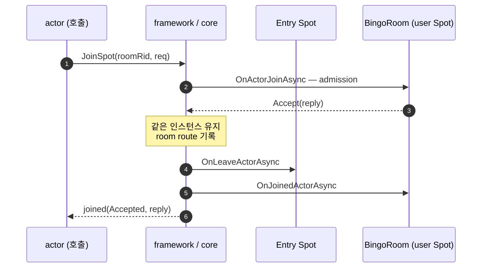
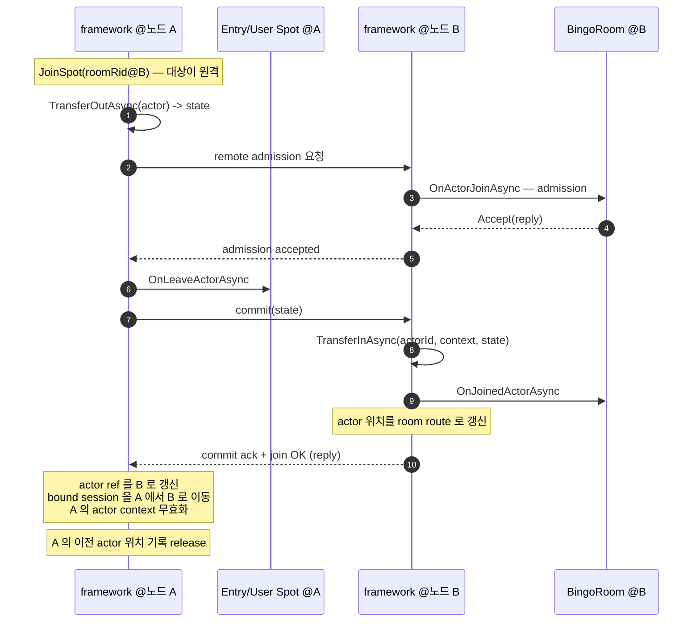

<!-- framework-adapter-nav:start -->
[문서 목록](../../../README.ko.md) | [이전: SPOT](05-spot.ko.md) | [다음: Session Actor Dispatch](07-actor-session.ko.md)
<!-- framework-adapter-nav:end -->

# 6. Actor & Spot 호스팅

> 정식 계약은 [spec/aspnet-core-actor](../spec/aspnet-core-actor.ko.md)가 다룬다.
> 이 챕터는 actor 모델과 **Spot 이 actor 를 호스팅하는 면(location 축)** — 즉 spot 쪽에
> 호출되는 actor lifecycle 콜백과 그 콜백을 부르는 트리거 함수 — 를 다룬다.
> session ↔ actor relay(binding 축)는 [07-actor-session](07-actor-session.ko.md)이 다룬다.
> [05-spot](05-spot.ko.md) 을 먼저 읽었다고 가정한다.
>
> 🔰 actor·session·Entry Spot 용어가 낯설면 [03-concepts §0](03-concepts.ko.md) 한 줄 풀이를 먼저 본다.

## 1. actor 란

actor 는 **ID 로 식별되는 상태 보유 객체**다. 같은 `ActorId` 로 들어오는 메시지는 항상 **같은
인스턴스**가 처리한다(일반 handler 는 stateless 라 메시지마다 새로 resolve 된다). 게임에서 한
플레이어, 한 session 의 진행 상태를 담기에 맞다.

호출자는 actor 가 어느 SpotNode/Spot 에 있는지 몰라도 된다. `actorId` 만으로 호출하면 routing 은
framework 가 등록된 resolver 로 푼다.

actor 의 상태는 **서로 독립인 두 축**으로 본다. 이 챕터는 **위치 축**, 다음 챕터([07](07-actor-session.ko.md))는
**binding 축**이다.

| 축 | 값 | 다루는 곳 |
|----|------|----------|
| **위치(location)** | Entry Spot(생성 직후 기본) ↔ user Spot(join 후) | **이 챕터(§3 spot 호스팅)** |
| **binding** | unbound ↔ STREAM session 에 bound | [07-actor-session](07-actor-session.ko.md) |

위치 이동과 session binding 은 독립이다. user Spot join 에 session bind 가 꼭 필요한 것은 아니다.

```text
None
  +-- factory.CreateAsync --> Created (Entry Spot, unbound)
        +-- bind session --> Entry Spot + bound
        |     +-- JoinSpot --> user Spot + bound
        |           +-- leave (framework) --> Entry Spot + bound
        +-- DestroyActorAsync (Entry Spot) --> None
        +-- disconnect/unbind (framework) --> Entry/user Spot 유지
```

framework 가 자동으로 관리하는 것: Entry Spot 생성/소멸, user Spot 에서 Entry Spot 으로 leave.
session disconnect 는 actor membership 을 바꾸지 않는다. actor 에게 끊김을 알려야 하면 응용이 대상
actor 를 선택해서 `NotifyDisconnectedAsync(...)` 를 호출한다.

actor 객체를 끝내려면 actor 를 Entry Spot 에 둔 뒤 `IZLinkEntrySpotContext.DestroyActorAsync(actor)`
를 호출한다. 이 호출은 lifecycle callback 을 호출하지 않고 native actor ref, framework registry,
bound session mapping 을 정리한다. user Spot 에 있는 actor 를 직접 destroy 할 수 없으므로 room
안에서는 먼저 leave 를 완료해야 한다.

## 2. actor 등록과 작성

actor 는 factory 로 만든다. factory 는 `actorType` 짧은 문자열로 등록한다.

```csharp
builder.Services.AddZLinkFramework(options =>
{
    spot.AddActorFactory<PlayerActorFactory>("player");  // "player" = actorType 등록 키. GetOrCreate 가 이 키로 factory 를 고른다.
    spot.AddStatelessActorTransfer<PlayerActor>("player"); // remote 이동 때 state 전송이 필요 없으면 빈 state 로 이동한다.
    // spot.AddActorTransferAdapter<PlayerActor, PlayerTransferAdapter>("player");
    // remote 이동 때 actor state 를 message 로 옮겨야 하면 custom adapter 를 등록한다.
    // Entry Spot / user Spot 등록(AddEntrySpot / AddSpotFactory)은 SpotNode 쪽에서
    // ([07-actor-session](07-actor-session.ko.md) §6 등록 코드)
});

public sealed class PlayerActorFactory : IZLinkActorFactory
{
    public ValueTask<IZLinkActor> CreateAsync(
        string actorId, IZLinkActorContext context, CancellationToken ct)
        // 같은 actorId 는 framework 가 한 인스턴스만 유지 — CreateAsync 는 그 actorId 의 최초 1회만 불린다.
        => ValueTask.FromResult<IZLinkActor>(new PlayerActor(actorId, context));
}

public sealed class PlayerActor(string actorId, IZLinkActorContext context)
    : IZLinkActor
{
    public string ActorId { get; } = actorId;
    public IZLinkActorContext Context { get; } = context;
}
```

actor 안에서의 spot join 과 현재 상태 조회는 주입된 `IZLinkActorContext` 로 한다. channel outbound
는 actor context 의 기능이 아니며, Entry Spot 또는 user Spot handler 에서 받은 spot context 로
호출한다.

| `IZLinkActorContext` 멤버 | 용도 |
|---------------------------|------|
| `SpotRid?`, `IsJoined` | 현재 Spot join 상태 조회 |
| `BoundSession` | 자기 client 로 push ([07-actor-session §3](07-actor-session.ko.md)) |
| `JoinSpot(spotRid, requestMessage)` | user Spot 으로 join. 기본은 `.Async(ct)` 로 종결한다. user Spot handler 처럼 Spot 실행 줄을 반납해야 하는 제한된 흐름에서는 `.Yield(ct)` 또는 `.Yield<TReply>(ct)` 를 쓸 수 있지만, Entry Spot actor handler 안에서는 사용하지 않는다 |
| `JoinEntrySpot(spotNodeRid, requestMessage)` | target SpotNode 의 Entry Spot 으로 이동. 기본은 `.Async(ct)` 이며, `Yield(...)` 의 제한은 `JoinSpot(...)` 과 같다 |

`JoinSpot`/`JoinEntrySpot` 도 `Request` 처럼 reply 대기 `Timeout(...)` override 를 받는다. 생략하면
기본 timeout 을 쓰고, join 대기가 기본과 달라야 할 때만 지정한다(샘플은 기본값).

`spotRid`는 user Spot 의 `RoutingId`이고, `spotNodeRid`는 Entry Spot 을 가진 SpotNode 의
`RoutingId`다. `matchId`나 `roomId` 같은 domain 값에서 `RoutingId`를 얻는 규칙은 application 이
정하는데, 샘플·e2e 는 대부분 **domain id 를 그대로 `RoutingId.From(roomId)`** 로 쓴다(예: Bingo 의
`RoutingId.From(matched.RoomId)`, DeliveryDispatch 의 `RoutingId.From(deliveryId)`). 즉 별도
매핑 레이어 없이 domain id 자체가 `spotRid` 다.

### actor 생성·보장 — `IZLinkActorManager.GetOrCreateAsync`

actor 를 처음 만들거나(있으면 재사용) 보장하는 진입점은 `IZLinkActorManager.GetOrCreateAsync` 다.
보통 일반 채널 handler 에서 부른다. 생성 요청 payload 를 넘기면 그것이 Entry Spot 의
`OnCreateActorAsync` 로 전달된다(§3). 반환값은 그 actor 를 가리키는 **ref 3종(`NodeRid`·`ActorId`·
`Generation`)** 이라, 이후 session 이 이 값으로 actor 에 bind 한다([07 §2](07-actor-session.ko.md)).

```csharp
public sealed class EnsureCustomerActorHandler(IZLinkActorManager actors)
    : IZLinkRequestHandler<EnsureCustomerActor, CustomerActorEnsured>
{
    public async ValueTask<CustomerActorEnsured> HandleAsync(
        EnsureCustomerActor request, ZLinkRequestContext context, CancellationToken ct)
    {
        var actor = await actors.GetOrCreateAsync(
            request.CustomerId,                 // actorId (domain id)
            SampleNames.CustomerActorType,      // §2 factory 등록 키("player" 같은 actorType)
            request,                            // createReq → Entry Spot 의 OnCreateActorAsync 로 전달(선택)
            ct);

        // 반환된 ref 3종을 session bind 용으로 돌려준다
        return new CustomerActorEnsured(request.CustomerId,
            new ActorRefSnapshot(actor.NodeRid, actor.ActorId, actor.Generation));
    }
}
```

> create payload 가 필요 없으면 `GetOrCreateAsync(actorId, actorType, ct)` 오버로드를 쓴다.
> `Generation` 은 actor 가 다른 노드로 migration 될 때마다 올라가는 값이다(§3 "actor 이동").

## 3. Spot 이 actor 를 호스팅 — 콜백과 트리거 함수

Spot 이 `IZLinkSpot<TActor>`(user Spot) 또는 `IZLinkEntrySpot<TActor>`(Entry Spot)를 구현하면,
framework 가 actor lifecycle 의 특정 시점마다 그 Spot 의 **콜백 메서드**를 부른다. 각 콜백은
**누가 무엇을 호출했을 때 불리는지(트리거 함수)** 가 정해져 있다. 콜백은 그 Spot 의 단일 실행
큐에서 직렬로 돌므로 room 상태를 lock 없이 만질 수 있다.

### 콜백 ↔ 트리거 함수

| spot-side 콜백 | 언제(트리거) | Entry Spot | user Spot |
|----------------|---------------|:----------:|:---------:|
| `OnCreateActorAsync(actor, createReq, ct)` | factory 가 actor 를 **최초 생성**할 때(`IZLinkActorManager.GetOrCreateAsync`) | ✅ 전용 | — |
| `OnActorJoinAsync(admission, req, ct) → ZLinkSpotActorJoinResult` | actor 의 `Context.JoinSpot(spotRid, req)` / `JoinEntrySpot(...)` — **admission 결정 지점**(Accept/Reject). actor instance 가 아니라 `ActorId`, source/target rid snapshot 을 받는다 | ✅ | ✅ |
| `OnJoinedActorAsync(actor, ct)` | 위 join 이 **Accept 된 직후** | ✅ | ✅ |
| `OnLeaveActorAsync(actor, ct)` | actor 가 **그 Spot 을 떠날 때** — 다른 Spot 으로 join(Entry→room 포함) 또는 `leaveActor`/framework leave | ✅ | ✅ |
| `OnDisconnectActorAsync(actor, ct)` | 응용이 그 actor 에 `NotifyDisconnectedAsync(...)` | ✅ | ✅ |
| actor packet handler | session 이 bound actor 로 `actorRef.RelayAsync(payload)`(→ [07 §1](07-actor-session.ko.md)) | ✅ | ✅ |

> **admission 은 `OnActorJoinAsync` 의 반환값으로 정한다.** `ZLinkSpotActorJoinResult.Accept(reply)`
> 면 통과, `Reject(reply)` 면 거부다. reply `ZLinkMessage` 는 join 호출자에게 그대로 돌아간다.
> **reply 는 선택**이라, 돌려줄 게 없으면 인자 없는 `Accept()` / `Reject()` 를 쓴다(샘플의 흔한 형태:
> Entry Spot 은 보통 `Accept()`, user Spot 은 조건 불일치 시 `Reject()`).
> 이 콜백은 admission 만 담당한다. 여기서 membership 확정, location 확정, client event 발행, actor
> instance 변경을 하지 않는다. 그런 처리는 join 이 확정된 뒤 `OnJoinedActorAsync`에서 한다.

> **`OnCreateActorAsync` 는 Entry Spot 전용**이다(actor 가 처음 머무는 곳). user Spot 은 이미 만들어진
> actor 가 join 으로 들어오므로 create 콜백이 없다.

### actor 이동 — 무슨 일이 일어나나 (로컬 vs 크로스노드)

`JoinSpot` 으로 actor 가 한 Spot 에서 다른 Spot 으로 옮길 때, 대상 Spot 이 **같은 SpotNode**에
있느냐 **다른 SpotNode**에 있느냐로 동작이 갈린다.

**① 같은 노드 — route 이동(단일 인스턴스).** 인스턴스는 그대로 두고 위치(route)만 바꾼다.



> admission 이 **Reject** 면 이동·leave 없이 actor 는 Entry Spot 에 그대로 남는다.

**② 다른 노드 — actor transfer(인스턴스 이주).** source node의 actor state를 transfer adapter가
`ZLinkMessage`로 만들고, target node가 그 message로 actor instance를 materialize한다. `OnActorJoinAsync`
는 target admission만 결정하고, remote materialize는 새 actor 생성이 아니므로 Entry Spot
`OnCreateActorAsync`는 호출하지 않는다.



> remote transfer를 지원할 actor type은 transfer adapter 등록이 필요하다. state를 옮길 값이 없으면
> `AddStatelessActorTransfer<TActor>(actorType)`를 등록한다. 이 경우 source는 빈 `ZLinkMessage`를 보내고,
> target은 기존 actor factory 경로로 actor를 만든다. state를 옮겨야 하면
> `AddActorTransferAdapter<TActor, TAdapter>(actorType)`를 등록하고, adapter의 `TransferOutAsync`에서
> state message를 만들고 `TransferInAsync(actorId, context, state, ct)`에서 target actor를 만든다.
> adapter가 없으면 remote transfer는 source `OnLeaveActorAsync` 전에 실패한다.
>
> **bound session(STREAM)은 A→B 로 transfer** 되어 client push 는 끊기지 않는다(이주 후 B 의 actor 가
> `BoundSession.Send` → 같은 client).

| | 같은 노드 | 다른 노드(migration) |
|---|---|---|
| actor 인스턴스 | 그대로(route 만 갱신) | A retire + B materialize |
| in-memory 상태 | 유지 | **transfer adapter state** 또는 stateless 빈 state |
| OnLeave / OnJoined | 같은 노드에서 둘 다 | B 에서 admission accept 후 A 에서 OnLeave / B 에서 TransferIn·OnJoined |
| bound session | 그대로 | A→B transfer |
| 식별 | 같은 `actorId` | 같은 `actorId`, `generation+1` |

> **규칙 — join 이 성공(Accept)하면 그 `actor` 객체를 더 접근하지 않는다.** join 이 끝나면 actor 는 이
> Spot 을 떠났고, **크로스노드면 이 노드의 인스턴스는 retire** 된다(접근하면 stale). 호출한 handler 는
> `joined.Accepted`/`joined.Reply` 로 결과만 처리하고 **반환**한다. join 직후의 client push 같은 후처리는
> actor 가 실제로 사는 **대상 Spot 의 `OnJoinedActorAsync`**(또는 그 Spot handler)에서 한다 — 거기서
> 받는 actor 가 옳은(이동 후) 인스턴스다. 참고로 `OnLeaveActorAsync` 는 actor 객체가 아니라 actor 가
> 떠난 **Spot** 에게 알리는 콜백이다(객체 destroy 가 아니라 membership 통지).

### actor packet handler 등록과 시그니처

actor packet handler 는 actor 클래스가 아니라 **그 actor 를 호스팅하는 Spot 쪽**에 등록한다. 두
방법이다 — Spot 의 `Configure()` 에서 `AddActorPacket<THandler, TActor>()` 로 **수동** 등록하거나,
handler class 에 `[ZLinkSpotActorRequestHandler("...")]`/`[ZLinkSpotActorSendHandler("...")]` attribute
를 붙이고 그 assembly 를 `options.AddHandlersFromAssemblyOf<...>()` 로 등록해 **자동** 등록한다(Bingo
가 이 attribute 방식). Entry Spot 용인지 user Spot 용인지는 handler interface 가
`IZLinkEntrySpotActor...` 냐 `IZLinkSpotActor...` 냐로 갈린다. handler 는 첫 두 인자로 **(spot, actor)**
를 받는다 — Entry Spot 은 `entrySpot`, user Spot 은 그 user Spot 이다.

```csharp
// user Spot: (spot, actor, context, payload). room 상태를 함께 만진다.
[ZLinkSpotActorRequestHandler(nameof(SubmitBingoCardReq))]
internal sealed class SubmitBingoCardHandler
    : IZLinkSpotActorRequestHandler<BingoRoom, PlayerActor, SubmitBingoCardReq, SubmitBingoCardRes>
{
    public async ValueTask<SubmitBingoCardRes> HandleAsync(
        BingoRoom spot, PlayerActor actor,
        ZLinkSpotActorRequestContext context,
        SubmitBingoCardReq message, CancellationToken ct)
    {
        spot.EnsureRoomId(message.RoomId);
        var change = spot.SubmitCard(actor.ActorId, BingoCard.FromSubmittedNumbers(message.Card));
        await spot.PublishAsync(change, ct);
        return new SubmitBingoCardRes { State = change.State };
    }
}
```

> **응답 body 는 반환값으로.** actor request handler 는 응답 body 를 직접 보내지 않고 반환한
> `TReply` 로 정한다. `context.Reply` 는 metadata/compression 같은 응답 frame 옵션만 기록한다.
> send handler(`IZLinkSpotActorSendHandler<...>`)는 반환이 없다(단방향).

### 실행 직렬화 (위치별 큐)

| 대상 | 실행 라인 |
|------|-----------|
| Entry Spot actor packet | actor별 mailbox |
| Entry Spot lifecycle 콜백 · route packet · subscription · timer | Entry Spot 자신의 단일 실행 큐(직렬) |
| user Spot actor packet / packet / timer / subscription · lifecycle 콜백 | 그 user Spot 의 단일 실행 큐(직렬) |

user Spot 은 모든 콜백이 한 줄에 몰려서 lock 없이 room board 같은 가변 상태를 만질 수 있다. **Entry
Spot 은 줄이 둘이라 이 보장이 그대로 적용되지 않는다** — actor packet 은 actor별 mailbox 에서,
lifecycle·route packet·subscription·timer 는 Entry Spot 자신의 줄에서 각각 직렬화되고, 이 두 줄은
서로 동시에 실행될 수 있다. 그래서 Entry Spot 인스턴스의 공유 mutable state(참가자 카운터 등)를
actor 간 또는 actor-vs-lifecycle 순서 보장 수단으로 쓰면 안 되고, 여러 actor·timer·route packet 이
같이 건드리는 상태가 있으면 명시적 동기화(lock)가 필요하다. join 직후 들어온 packet 이 옛 Entry
Spot handler 로 가지 않도록, dispatch 는 actor 의 현재 위치를 다시 읽어 큐를 atomic 하게 고른다.

## 4. 예제 — Bingo 로 따라가는 actor 생애 (콜백이 불리는 순서)

실제 동작 샘플(`samples/Bingo`)로 actor 가 **생성 → Entry Spot → match → room(user Spot) → 정리**
까지 흐르며 위 콜백들이 어디서 불리는지 본다.

### ① Entry Spot — 생성·match (`BingoEntrySpot : IZLinkEntrySpot<PlayerActor>`)

```csharp
internal sealed class BingoEntrySpot(IZLinkEntrySpotContext context, ILogger<BingoEntrySpot> logger)
    : IZLinkEntrySpot<PlayerActor>
{
    public IZLinkEntrySpotContext Context { get; } = context;
    public void Configure() { }   // actor handler 는 attribute 자동 등록(아래 ②)

    // 트리거: GetOrCreateAsync 로 actor 최초 생성. 초기 메타(displayName) 세팅.
    public ValueTask OnCreateActorAsync(PlayerActor actor, ZLinkMessage createRequest, CancellationToken ct)
    {
        actor.SetDisplayName(createRequest.Decode<EnsurePlayerActorReq>().DisplayName);
        return ValueTask.CompletedTask;
    }

    // 트리거: actor.Context.JoinEntrySpot(...) — Entry Spot admission. 여기선 무조건 Accept.
    public ValueTask<ZLinkSpotActorJoinResult> OnActorJoinAsync(
        ZLinkActorJoinAdmission admission, ZLinkMessage request, CancellationToken ct)
        => ValueTask.FromResult(ZLinkSpotActorJoinResult.Accept(request));

    // 트리거: 위 join Accept 직후. 옵션에 따라 Entry Spot 에서 바로 actor 종료.
    public async ValueTask OnJoinedActorAsync(PlayerActor actor, CancellationToken ct)
    {
        if (actor.DestroyAfterEntrySpotJoin)
            await Context.DestroyActorAsync(actor, ct);   // lifecycle 콜백 없이 actor 정리
    }
}
```

### ② Entry Spot actor handler — room 배정 후 user Spot 으로 join

session 이 relay 한 `MatchBingoReq` 를 Entry Spot actor handler 가 받아, API 로 room 을 배정받고
`actor.Context.JoinSpot(roomRid, ...)` 를 호출한다 → 이 호출이 **room(user Spot)의 `OnActorJoinAsync`
admission 을 트리거**한다.

```csharp
[ZLinkSpotActorRequestHandler(nameof(MatchBingoReq))]
internal sealed class MatchBingoActorHandler(ILogger<MatchBingoActorHandler> logger)
    : IZLinkEntrySpotActorRequestHandler<BingoEntrySpot, PlayerActor, MatchBingoReq, MatchBingoRes>
{
    public async ValueTask<MatchBingoRes> HandleAsync(
        BingoEntrySpot entrySpot, PlayerActor actor,
        ZLinkSpotActorRequestContext context, MatchBingoReq message, CancellationToken ct)
    {
        // Entry Spot actor handler 에서는 일반 async 대기로 외부 API 결과를 기다린다.
        var matched = await entrySpot.Context.Outbound
            .RequestToChannel(SampleNames.ApiChannel, new MatchBingoApiReq { ActorId = actor.ActorId, Mode = message.Mode })
            .Async<MatchBingoApiRes>(ct);

        // 배정된 room 의 user Spot 으로 join → BingoRoom.OnActorJoinAsync 가 admission 판정
        var joined = await actor.Context
            .JoinSpot(RoutingId.From(matched.RoomId), new BingoRoomJoinReq { RoomId = matched.RoomId, ActorId = actor.ActorId })
            .Async<BingoRoomJoinRes>(ct); // Entry Spot actor handler 에서는 Yield terminator 를 쓰지 않는다.
        // joined.Accepted / joined.Reply 로 결과 처리 …
        return new MatchBingoRes { RoomId = matched.RoomId };
    }
}
```

> **join 후 `actor` 를 다시 만지지 않는다.** join 이 끝나면 actor 는 이 Entry Spot 을 떠났으므로
> (크로스노드면 이 노드 인스턴스는 retire), `joined` 결과만 쓰고 반환한다. join 직후 client 에 push 할
> 게 있으면 room(`BingoRoom`)의 `OnJoinedActorAsync` 에서 한다(§3 "actor 이동" 규칙).

### ③ room (user Spot) — admission · leave · disconnect (`BingoRoom : IZLinkSpot<PlayerActor>`)

```csharp
internal sealed class BingoRoom(IZLinkSpotContext context, /* … */) : IZLinkSpot<PlayerActor>
{
    public IZLinkSpotContext Context { get; } = context;

    // 트리거: ②의 actor.Context.JoinSpot(roomRid, req). 입장 admission — Accept 면 join 확정.
    public async ValueTask<ZLinkSpotActorJoinResult> OnActorJoinAsync(
        ZLinkActorJoinAdmission admission, ZLinkMessage request, CancellationToken ct)
    {
        var reply = await JoinAsync(admission.ActorId, request.Decode<BingoRoomJoinReq>(), ct);  // admission 결과만 결정
        return ZLinkSpotActorJoinResult.Accept(reply);   // 정원 초과 등에서 Reject(...) 가능
    }

    public ValueTask OnJoinedActorAsync(PlayerActor actor, CancellationToken ct) { /* room membership 확정 */ return ValueTask.CompletedTask; }

    // 트리거: Context.leaveActor(actor) 또는 framework leave. room 상태에서 제거.
    public ValueTask OnLeaveActorAsync(PlayerActor actor, CancellationToken ct) { _actors.Remove(actor.ActorId); return ValueTask.CompletedTask; }

    // 트리거: 응용의 actor.NotifyDisconnectedAsync(). 끊김 표시만, membership 은 유지.
    public ValueTask OnDisconnectActorAsync(PlayerActor actor, CancellationToken ct) { actor.MarkDisconnected(); return ValueTask.CompletedTask; }

    // 게임 종료 시 room 이 직접 참가자들을 내보낸다 → 각 actor 의 OnLeaveActorAsync 트리거.
    internal async ValueTask LeaveFinishedActorsAsync(CancellationToken ct)
    {
        foreach (var actor in _actors.Values.ToArray())
            await Context.leaveActor(actor, ct);
    }
}
```

흐름 요약: `OnCreateActorAsync`(Entry, 1회) → `JoinEntrySpot`→ Entry `OnActorJoin/OnJoined` →
match handler → `JoinSpot`→ room `OnActorJoin`(admission)/`OnJoined` → 게임 중 actor packet handler →
종료 시 `leaveActor`→ room `OnLeaveActor`. 끊김은 `NotifyDisconnectedAsync`→ `OnDisconnectActor`(독립).

## 5. 더 보기

- session ↔ actor relay(인증·binding·bound session push·등록 코드): [07-actor-session](07-actor-session.ko.md)
- 이 챕터 계약의 실행 검증 예문(actor/context/factory/handler): [12-interface-catalog](12-interface-catalog.ko.md) §4 — 검증 클래스 `ActorContracts`
- 정식 계약: [spec/aspnet-core-actor](../spec/aspnet-core-actor.ko.md)
- 전체 예제: [bingo 샘플](samples/bingo-game-sample.ko.md), [tictactoe 샘플](samples/tictactoe-game-sample.ko.md)
- Spot 자체(생성·메시징·timer): [05-spot](05-spot.ko.md)

---
<!-- framework-adapter-nav:bottom:start -->
[문서 목록](../../../README.ko.md) | [이전: SPOT](05-spot.ko.md) | [다음: Session Actor Dispatch](07-actor-session.ko.md)
<!-- framework-adapter-nav:bottom:end -->
