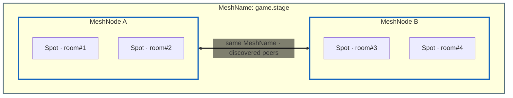
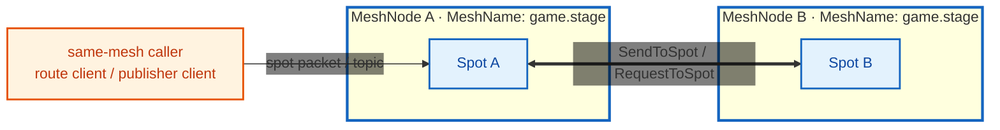
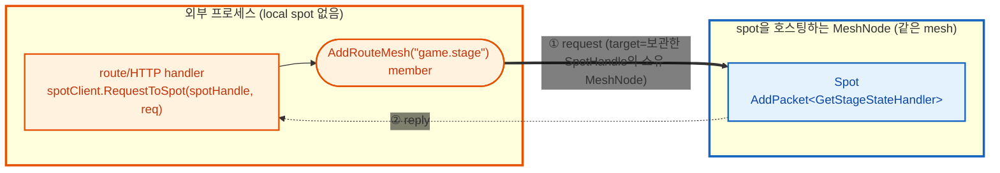

<!-- framework-adapter-nav:start -->
[문서 목록](../../../README.ko.md) | [이전: Channel Messaging](05-channel-messaging.ko.md) | [다음: Actor & Spot 호스팅](07-actor-spot.ko.md)
<!-- framework-adapter-nav:end -->

# 6. SPOT — room · stage · zone

> 정식 계약은 [spec/aspnet-core-spot](../../common/spec/server/languages/dotnet/01-system-structure.ko.md),
> [spec/spot-node](../../common/spec/server/languages/dotnet/01-system-structure.ko.md), [spec/stage-wrapper-on-spot](../../common/spec/server/languages/dotnet/02-handler-interfaces.ko.md)가
> 다룬다. 이 챕터는 SPOT을 등록하고 다루는 사용법 중심이다.
>
> 🔰 SPOT·actor·Entry Spot 등 용어가 낯설면 [03-concepts §0](03-concepts.ko.md)의
> 한 줄 풀이를 먼저 본다.

## 10.0.0 목표 사용법

외부(다른 프로세스·다른 channel)에서 특정 Spot에 메시지를 보내는 방법은 두 가지다.

- **send/request** — `IZLinkSpotClient`로 spot 전송 대상(`SpotHandle`)에 보낸다. `SpotHandle`은
  `IZLinkSpotManager.ResolveAsync(meshName, spotRid)`로 한 번 조회해서 보관하고, 보낼 때마다 그 값을
  그대로 재사용한다. framework는 위치 event와 주기적 조회로 handle의 내부 주소를 갱신한다.
  request 도중 주소가 무효화되면 안전한 경우에 한해 주소를 다시 조회하고 한 번 재전송한다.
  send는 이미 전달되었을 가능성이 있으므로 자동으로 다시 전송하지 않는다. 예제는 §5에서 본다.
- **publish** — `IZLinkSpotPublisherClient`를 주입해 `Publish(channelName, topic, ...)`으로
  topic을 보낸다. `ChannelName`에 등록된 process-local RouteMesh 송신 경로가 대상
  Server membership을 찾으므로 `SpotHandle`은 필요 없다.

Spot direct 호출은 대상 Spot과 같은 mesh의 MeshNode를 등록하고, Logical Multicast는 대상
`ChannelName`의 Client 경로를 등록하면 framework가 연결을 관리한다. 호출자는 논리적 대상을
나타내는 `SpotHandle` 또는 `ChannelName`만 사용하고 내부 주소와 갱신 정책은 framework에 맡긴다.

## 1. SPOT 이란

`SPOT`은 동적으로 생성·소멸되는 **주소 가능한 논리 인스턴스**다. 게임 room,
채팅 room, MMORPG zone처럼 "있다가 없어지는 단위"를 메시지 라우팅 대상으로 삼는다.

| 개념 | 뜻 |
|------|------|
| `Spot` | room/stage/zone 같은 논리 인스턴스 하나 |
| `MeshNode` | 여러 spot 인스턴스를 호스팅하는 컨테이너 노드 |
| `TSpot` | 생성할 user Spot 타입. framework 안에서 factory 선택에만 쓰며 public 식별자로 전달하지 않는다 |
| `spotRid` (`RoutingId`) | `MeshNode`가 인스턴스 생성 시 내주는 **논리 주소**. 특정 room 한 개를 가리킨다 |
| Entry Spot | 노드의 기본 실행 컨텍스트(actor가 생성 직후 머무는 곳) |

SPOT은 pub/sub helper가 아니다. publish/subscribe는 spot **안에서** 쓰는 한
기능일 뿐이다.

규칙 세 가지를 그림으로 먼저 보자. 여기서는 **Spot ↔ MeshNode ↔ 같은 MeshName**
관계를 본다. 다른 channel·외부와의 연결은 §2에서 다룬다.



- **Spot은 `MeshNode` 안에 존재한다.** 특정 service에 종속되는 게 아니라, 자신을
  호스팅하는 노드(컨테이너)에 속한다. 그림의 Spot 들이 노드 박스 안에 들어 있는 모습.
- **같은 mesh 노드끼리는 자동으로 연결된다.** 같은 mesh의 MeshNode는 location
  store에 등록된 descriptor를 사용해 peer 연결을 관리한다. 고정 배포는 manual
  peer 연결을 사용할 수 있다.
- **한 `MeshNode`는 한 mesh만 본다.** 노드는 항상 하나의 mesh 박스 안에 속한다.
  단 **한 프로세스는 여러 `MeshNode`를 둘 수 있다**. `AddRouteMesh(...)`를 mesh
  이름별로 여러 번 호출하면 각각 자기 mesh 박스에 속한 별도 노드가 된다(§2).
  같은 이름으로 두 번 부르면 시작 예외다.

## 2. MeshNode 등록

SPOT은 RouteMesh의 MeshNode가 소유한다. Production에서는 location store를 등록해
같은 `MeshName`의 peer가 서로의 endpoint와 membership을 찾게 한다
([10-location](10-location.ko.md)).

```csharp
builder.Services.AddZLinkFramework(options =>
{
    options.AddLocationStore(new ZLinkRedisLocationStore(redis => redis
        .SetConnectionString("redis-host:6379")
        .SetKeyPrefix("game:prod")));

    var node = options.AddRouteMesh("services")             // SPOT을 소유할 MeshName
        .SetBindHost("0.0.0.0")
        .Listen(9001)                                        // 이 MeshNode가 받을 port
        .SetRoutingId(RoutingId.From("stage-a"));
    node.Channel("game.stage")
        .Server();                                           // 이 노드가 제공하는 membership
    node.Channel("orders")
        .Client();                                           // orders로 보내는 process-local 송신 경로
    node.AddSpotFactory<StageSpot>();                        // 이 노드가 생성할 SPOT 타입
});
```

`IZLinkSpotOutbound.SendToChannel(...)`과 `RequestToChannel(...)`은 `ChannelName`으로
process-local 송신 경로를 선택한다. 따라서 Spot이 `orders` channel을 호출하려면 같은
프로세스의 RouteMesh 또는 ClientServer에 `orders` Client 경로를 하나 등록한다. 호출자는
대상 MeshName이나 endpoint를 전달하지 않는다.

> **여러 MeshNode를 한 프로세스에.** `AddRouteMesh(...)`는 호출마다 다른 mesh의 노드
> 하나를 만든다. 서로 다른 mesh 이름으로 여러 번 호출하면 한 프로세스가 여러 MeshNode를
> 호스팅할 수 있다. 같은 mesh 이름을 두 번 등록하면 시작 예외다.
>
> ```csharp
> var room = options.AddRouteMesh("game.room")
>     .Listen(9001)
>     .SetRoutingId(RoutingId.From("room-a"));
> room.Channel("game.room").Server();        // room mesh의 Server membership
> room.AddSpotFactory<RoomSpot>();
>
> var zone = options.AddRouteMesh("game.zone")
>     .Listen(9002)
>     .SetRoutingId(RoutingId.From("zone-a"));
> zone.Channel("game.zone").Server();        // zone mesh의 Server membership
> zone.AddSpotFactory<ZoneSpot>();
> ```

MeshNode의 공개 설정은 다음과 같다.

| node 함수 | 의미 |
|-----------|------|
| `Listen(port)` | 이 MeshNode가 peer 연결을 받을 port 설정. host는 `SetBindHost(...)` 또는 process 공통 network 설정으로 지정 |
| `SetRoutingId(rid)` | 이 MeshNode를 식별할 고정 RID 설정 |
| `UseAllocatedRoutingId(...)` | location store에서 충돌 없이 RID slot 할당 |
| `Channel(name).Client()` | 해당 ChannelName으로 보내는 process-local 송신 경로 등록 |
| `Channel(name).Server()` | 이 MeshNode가 제공하는 logical channel membership 등록 |
| `Channel(name).Server().SetWeight(weight)` | Server membership의 select-one 가중치 설정 |
| `PeerConnections` | location store 없이 사용할 manual peer 연결 설정 |
| `ConfigureSpotPublisher()` | Logical Multicast 전송 설정 |
| `AddSpotFactory<TSpot>()` | 이 노드가 만들 spot 타입 등록. 타입 중복은 시작 예외 |
| `AddEntrySpot<TEntrySpot>()` | Entry Spot handler registry 등록(actor 사용 시, [actor spec](../../common/spec/server/languages/dotnet/02-handler-interfaces.ko.md)) |

### 자동 연결과 수동 연결

같은 MeshName의 peer를 찾는 방식은 두 가지다.

- **자동(location store 기준, 기본).** MeshNode descriptor를 location store에 등록하고,
  같은 MeshName의 peer 정보를 읽어 runtime이 연결을 관리한다.
- **수동(store 없이 직접 지정).** `PeerConnections`에 peer endpoint를 지정한다.
  예상 RID를 함께 주면 연결 대상 identity도 확인한다. 노드 수가 고정된 토폴로지에 적합하다.

```csharp
// (A) 자동 — location store가 같은 MeshName의 peer 정보를 제공한다.
var automatic = options.AddRouteMesh("game.stage")
    .Listen(9001)
    .SetRoutingId(RoutingId.From("stage-a"));
automatic.Channel("game.stage").Server();

// (B) 수동 — store 없이 고정 peer endpoint와 예상 RID를 지정한다.
var manual = options.AddRouteMesh("game.stage.manual")
    .Listen(9002)
    .SetRoutingId(RoutingId.From("play-a"));
manual.Channel("game.stage").Server();
manual.PeerConnections.Connect(
    RoutingId.From("play-b"), "tcp://node-b:9001");
```

### 외부 프로세스에서 Spot 호출

외부 코드가 `IZLinkSpotClient`로 `SpotHandle`에 send/request 하거나
`IZLinkSpotPublisherClient`로 topic을 publish하려면, 그 프로세스도 같은
`MeshName`에 참여한다. Logical Multicast도 보내면 대상 `ChannelName`의 Client 경로를
등록한다. 수신하지 않는 호출 전용 MeshNode는 Server membership 없이 임시 port를 사용할 수 있다.

```csharp
var caller = options.AddRouteMesh("game.stage")
    .Listen()
    .SetRoutingId(RoutingId.From("stage-api"));
caller.Channel("game.stage").Client(); // Logical Multicast를 보내는 송신 경로다.
```

그 뒤 `IZLinkSpotManager.ResolveAsync(...)`로 얻은 `SpotHandle`을 `IZLinkSpotClient`에 넘긴다.
받는 MeshNode에 별도 bridge를 등록할 필요는 없다. 상세 호출 코드는 §5에서 본다.

> **location store는 프로세스 공용 등록(`AddLocationStore(...)`) 하나를** 기본으로 사용한다.
> mesh 단위로 다른 store endpoint를 따로 지정하지 않는다. 단일 노드만 실행하는 local
> 테스트도 `AddRouteMesh(...)`가 반환한 builder에 `Listen`, membership, factory를 바로 설정한다.

## 3. Spot 작성 — handler 등록과 lifecycle

spot 클래스는 `IZLinkSpot`을 구현하고, 주입받은 `Context`에 handler·subscribe·
timer를 `Configure()`에서 등록한다.

> **SPOT handler 등록은 Spot이 소유한다.** `Configure()`에서 packet과 subscription
> handler를 등록하고, lifecycle에서 timer를 등록한다. MeshNode builder는 Spot factory와
> Entry Spot을 등록하며 개별 Spot handler 노출 범위를 대신 결정하지 않는다.

```csharp
public sealed class StageSpot(IZLinkSpotContext context) : IZLinkSpot
{
    private IZLinkTimer? _heartbeat;
    public IZLinkSpotContext Context { get; } = context;

    // 같은 Spot의 callback은 직렬화되므로 이 상태에 lock이 필요 없다.
    private int _occupants;

    public void Configure()
    {
        // AddPacket<T>: spot으로 오는 send/request packet handler 등록
        Context.Handlers.AddPacket<GetStageStateHandler>();

        // AddSubscribe<T>(channel, topic): 지정 ChannelName과 topic의 publish handler 등록
        Context.Handlers.AddSubscribe<StageStateUpdatedHandler>(
            "game.stage", "stage.state.updated");
    }

    public async ValueTask OnInitializeAsync(CancellationToken cancellationToken)
    {
        // AddTimer<T>: 주기 실행 timer handler 등록. Configure가 아니라 lifecycle에서 등록한다.
        _heartbeat = await Context.AddTimer<StageHeartbeatHandler>(
            "heartbeat",
            TimeSpan.FromSeconds(1),
            new ZLinkTimerOptions
            {
                OverrunPolicy = ZLinkTimerOverrunPolicy.DelayNextTick
            },
            cancellationToken);
    }

    public async ValueTask OnClosingAsync(CancellationToken cancellationToken)
    {
        if (_heartbeat is not null)
        {
            await _heartbeat.CancelAsync();
        }
    }
}
```

lifecycle callback은 호출 순서가 정해져 있다. **`OnCreateAsync`(생성 1회) → `OnInitializeAsync`
(초기화 1회) → … → `OnClosingAsync`(종료 1회).** 위 예제는 `OnInitializeAsync`/`OnClosingAsync`
만 보였는데, 생성 시점에 한 번 불리는 `OnCreateAsync`가 추가로 있다.

```csharp
// OnCreateAsync: 생성 요청 메시지를 받아 초기 상태를 세팅하고, 생성을 수락/거부한다.
public ValueTask<ZLinkSpotCreateResponse> OnCreateAsync(ZLinkMessage request, CancellationToken ct)
{
    var create = request.Decode<DeliverySpotCreate>();   // GetOrCreateAsync에 넘긴 payload(§4)
    _deliveryId = create.DeliveryId;

    // 초기 상태 구성이 끝나면 생성을 수락한다.
    return ValueTask.FromResult(ZLinkSpotCreateResponse.Accept());
    // 거부하려면 ZLinkSpotCreateResponse.Reject() — 호출자는 State == Rejected를 받는다.
}
```

> **`Context.SpotRid` vs `Context.NodeRid`.** `Context.SpotRid`는 이 spot 한 개의 논리 주소,
> `Context.NodeRid`는 이 spot을 호스팅하는 **`MeshNode`**의 routing id 다. 어느 `MeshNode`가
> spot을 소유하는지 응답·로그에 실어 보낼 때 `Context.NodeRid`를 쓴다.

spot handler는 첫 인자로 spot 인스턴스를 받는다.

```csharp
// request 핸들러: 제네릭 인자는 <대상 spot, 요청, 응답> 순서다.
public sealed class GetStageStateHandler
    : IZLinkSpotRequestHandler<StageSpot, GetStageStateRequest, GetStageStateReply>
{
    public ValueTask<GetStageStateReply> HandleAsync(
        StageSpot spot,                  // 첫 인자 = 대상 spot 인스턴스. 그 spot의 상태·Context에 바로 접근한다.
        GetStageStateRequest request,
        CancellationToken cancellationToken)
        // spot.Context로 그 spot의 정보(여기선 SpotRid)를 읽어 응답을 만든다.
        => ValueTask.FromResult(new GetStageStateReply(spot.Context.SpotRid.ToString()));
}

// timer 핸들러: Configure가 아니라 AddTimer 등록(§ OnInitializeAsync)으로 주기 실행된다.
public sealed class StageHeartbeatHandler : IZLinkSpotTimerHandler<StageSpot>
{
    public ValueTask HandleAsync(
        StageSpot spot,                  // request 핸들러와 동일하게 첫 인자로 대상 spot을 받는다.
        ZLinkTimerTick tick,             // tick: 이번 주기 실행의 메타(예정 시각·지연 등)
        CancellationToken cancellationToken)
        => ValueTask.CompletedTask;
}
```

### 실행 직렬화 — SPOT의 핵심 보장

여기서 말하는 직렬화는 payload를 bytes로 바꾸는 codec 직렬화가 아니다. **메시지를
어떤 실행 줄에서 어떤 순서로 처리하는가**를 뜻한다. 실행 줄의 개수가 Spot 종류마다
다르다.

| 구분 | 주소 지정과 진입 경로 | 실행 순서 기준 |
|------|------------------------|----------------|
| user/domain Spot | `spotRid`로 특정 room/stage/zone을 가리키고, Spot client나 local call로 들어온다 | 해당 Spot 인스턴스의 **단일 실행 큐** — packet·request·subscription·timer와 channel reply 후속이 전부 여기서 직렬로 실행된다 |
| Entry Spot | actor 생성 직후의 기본 위치이며 actor join·leave lifecycle을 처리한다 | Entry Spot lifecycle·packet·subscription·timer는 Entry Spot 실행 문맥에서 처리되고, Actor direct packet은 Actor 자신의 mailbox에서 처리된다 |

이 차이가 상태를 둘 곳을 정한다.

- 여러 메시지가 함께 바꾸는 도메인 상태(room board, match queue, zone state)는
  **user/domain Spot**에 둔다. 단일 큐 덕분에 lock 없이 만질 수 있다.
- actor 하나만 쓰는 값은 Actor mailbox 직렬화만으로 안전하다.
- 참가자 목록·admission 카운터처럼 여러 Actor lifecycle과 Entry Spot callback이 함께
  변경하는 공유 상태는 각 callback이 제공하는 실행 문맥을 기준으로 동기화 책임을 확인한다.
- 두 Spot 종류 모두, 외부에서 `SpotRid`로 직접 접근하는 코드는 이 보장 밖이다.

actor dispatch 세부 규칙은 [07-actor-spot](07-actor-spot.ko.md)과
[08-actor-session](08-actor-session.ko.md)에서 함께 본다.

> **샘플에서 보기 — [Bingo](../../common/sample/bingo/README.ko.md).** 플레이어들의 카드
> 제출과 room timer의 번호 추첨·자동 mark·승리 판정이 전부 room Spot 하나의 실행
> 줄에서 직렬로 처리된다. 게임 상태를 만지는 코드 어디에도 lock이 없다 — 이
> 직렬화 보장이 그 이유다.

### 자동 turn dispatch

Spot/Entry Spot handler에서 request, actor join, worker call의 단일 `Async(...)` terminator를
기다리면 framework가 현재 실행 turn을 자동으로 반납한다. 완료되면 원래 Spot 또는 actor mailbox
실행 문맥에서 continuation을 재개한다. 호출자가 실행 줄 관리 방식을 고르는 별도 terminator는 없다.

따라서 await 전의 공유 mutable state를 await 뒤에도 그대로 유효하다고 가정하면 안 된다. room list,
match queue, lobby state를 계속 판단해야 하면 await 뒤에 상태를 다시 확인하거나 Spot이 소유한 하나의
operation으로 책임을 모은다. player 한 명의 admission/preflight처럼 actor-local 값과 reply 값만
사용하는 흐름은 이 자동 turn 규칙을 그대로 사용한다.

Bingo sample의 `MatchBingoActorHandler`도 API channel request와 room `JoinSpot`의 단일
`Async(...)` terminator를 기다린다. framework가 turn 반납과 continuation 복귀를 관리하므로 sample에
별도 dispatch 선택 API가 나타나지 않는다.

### timer 사용법

timer는 spot 안에서 주기적으로 상태를 갱신하거나, 오래된 참가자를 정리하거나,
주기적인 snapshot을 publish 할 때 사용한다. 일반적인 사용 흐름은 다음과 같다.

1. `Configure()`에서는 packet, subscribe, actor handler처럼 동기 등록만 한다.
2. `OnInitializeAsync(...)`에서 `Context.AddTimer<THandler>(...)`를 호출한다.
3. 반환된 `IZLinkTimer`를 spot 필드에 보관한다.
4. `OnClosingAsync(...)`에서 `CancelAsync()`로 멈춘다.
5. 실제 주기 작업은 `IZLinkSpotTimerHandler<TSpot>` 구현체에 둔다.

`AddTimer<THandler>(name, period, options, cancellationToken)`의 인자는 다음 의미다.

| 인자 | 의미 |
|------|------|
| `THandler` | tick이 발생할 때 실행할 handler 타입. DI로 생성된다 |
| `name` | timer 이름. monitoring과 tick metadata에 들어간다 |
| `period` | tick 간격. `TimeSpan.Zero` 나 음수는 설정 오류다 |
| `options` | tick이 밀릴 때의 정책과 예외 처리 정책 |
| `cancellationToken` | 등록 작업 취소 토큰 |

timer handler는 매 tick마다 spot 인스턴스와 `ZLinkTimerTick`을 받는다.

```csharp
public sealed class StageHeartbeatHandler : IZLinkSpotTimerHandler<StageSpot>
{
    public async ValueTask HandleAsync(
        StageSpot spot,
        ZLinkTimerTick tick,
        CancellationToken cancellationToken)
    {
        if (tick.SkippedTicks > 0)
        {
            // 이전 tick이 밀렸다는 뜻이다. 무거운 보정 작업은 여기서 줄일 수 있다.
        }

        await spot.Context.Outbound
            .Publish(
                "game.stage",
                "stage.heartbeat",
                new StageHeartbeat(spot.Context.SpotRid, tick.StartedAt))
            .Async(cancellationToken);
    }
}
```


`ZLinkTimerTick`은 "이번 callback이 시간표에서 어떤 위치였고, 실제로 얼마나
늦게 실행됐는지"를 설명하는 값이다. handler 안에서 보정, 로깅, 부하 완화,
publish payload 작성에 사용할 수 있다.

| 값 | 의미 |
|----|------|
| `Name` | 등록한 timer 이름. handler 하나가 여러 timer에 재사용될 때 분기하거나 monitoring payload에 넣는다 |
| `DeliveryIndex` | 실제 handler callback 번호. "이 handler가 몇 번째 실행됐는지"가 필요할 때 쓴다 |
| `ScheduledIndex` | fixed-rate 시간표 기준 tick 번호. 건너뛴 tick까지 포함한 논리 tick 번호다 |
| `Period` | 등록한 tick 간격. handler에서 다음 상태 계산의 기본 간격으로 쓴다 |
| `ScheduledAt` | 원래 실행될 예정이던 시각. 외부 이벤트 timestamp 나 timeout 판정 기준으로 쓴다 |
| `StartedAt` | handler 실행이 시작된 실제 시각. publish payload 나 last-seen 갱신에 쓴다 |
| `ScheduledElapsed` | timer 시작 이후 `ScheduledAt` 까지의 논리 경과 시간 |
| `StartedElapsed` | timer 시작 이후 `StartedAt` 까지의 실제 경과 시간 |
| `Delay` | 예정 시각보다 얼마나 늦게 시작했는지. timer 부하 감지와 degrade 판단에 쓴다 |
| `SkippedTicks` | overrun 정책 때문에 건너뛴 tick 수. 무거운 보정 작업을 줄이거나 상태를 빠르게 catch-up 할 때 쓴다 |

`DeliveryIndex`와 `ScheduledIndex`는 항상 같은 값이 아니다. tick이 밀려 일부
tick을 건너뛰면 `ScheduledIndex`는 시간표를 따라 앞으로 가고,
`DeliveryIndex`는 실제 callback 횟수만 증가한다. 그래서 "실제로 몇 번
callback이 왔는가"는 `DeliveryIndex`, "논리 시간표에서 몇 번째 tick 인가"는
`ScheduledIndex`를 기준으로 삼는다.

이 세 값(`ScheduledIndex` · `Delay` · `SkippedTicks`)이 실제로 어떻게 맞물리는지는
아래 "고빈도 전투 room" 예시에서 코드로 본다.

`ScheduledAt`과 `StartedAt`은 목적이 다르다. `ScheduledAt`은 timer가 원래
실행됐어야 하는 논리 시각이고, `StartedAt`은 실제 callback이 시작된 시각이다.
turn timeout, room TTL, simulation step처럼 논리 시간이 중요하면 `ScheduledAt`
또는 `ScheduledElapsed`를 기준으로 삼는다. heartbeat publish, last-seen 갱신,
운영 로그처럼 실제 관측 시각이 중요하면 `StartedAt` 또는 `StartedElapsed`를
사용한다.

### timer 정책

`ZLinkTimerOptions.OverrunPolicy`로 tick이 밀릴 때 동작을 정한다.

| 정책 | 동작 |
|------|------|
| `SkipLateTicks` | 늦은 tick은 버리고 다음 정시 tick으로 이동한다 |
| `CatchUpBounded` | `MaxCatchUpTicks` 까지만 밀린 tick을 연속 보충한다 |
| `DelayNextTick` | handler 완료 후 period 만큼 다시 기다린다 |

정책 선택 기준은 보통 다음과 같다.

| 상황 | 권장 정책 | 이유 |
|------|----------|------|
| heartbeat, presence refresh, stale actor cleanup | `SkipLateTicks` | 최신 상태 한 번이면 충분하다 |
| physics step, turn timeout 보정처럼 빠진 tick을 일부 반영해야 함 | `CatchUpBounded` | 무한 catch-up을 막으면서 제한적으로 보충한다 |
| polling, 외부 API 호출, DB cleanup처럼 handler 완료 뒤 쉬어야 함 | `DelayNextTick` | handler 시간이 길어도 겹쳐 실행하지 않고 부하를 제한한다 |

`CatchUpBounded`를 쓰면 `MaxCatchUpTicks`도 함께 정한다.

```csharp
_timer = await Context.AddTimer<StageTickHandler>(
    "stage.tick",
    TimeSpan.FromMilliseconds(100),
    new ZLinkTimerOptions
    {
        OverrunPolicy = ZLinkTimerOverrunPolicy.CatchUpBounded,
        MaxCatchUpTicks = 3
    },
    cancellationToken);
```

기본값은 `SkipLateTicks` 다. `MaxCatchUpTicks`는 `CatchUpBounded` 에서만 의미가
있고, `CatchUpBounded`로 설정했는데 `MaxCatchUpTicks <= 0` 이면 설정 오류다.

### 예시: 고빈도 전투 room — tick이 밀릴 때

위 metadata·정책이 실제로 어디서 쓰이는지 가장 잘 드러나는 곳이 게임의 고빈도
timer 다. 실시간 전투 room을 보자. 두 개의 timer를 둔다.

- **`battle.sim` (50ms, 20Hz)** — 전투 simulation step. cooldown, 투사체 이동,
  도트 데미지가 모두 step 수에 묶여 있어 **빠진 step을 단순히 버리면 게임이 어긋난다.**
  그래서 `CatchUpBounded`로 빠진 step을 일부 보충하되, GC 정지처럼 길게 멈췄을 때
  수백 step을 몰아 도는 death-spiral은 `MaxCatchUpTicks`로 막는다.
- **`battle.snapshot` (100ms)** — 클라이언트로 world 상태 broadcast. 밀린 snapshot을
  몰아 보내봐야 **클라이언트엔 최신 한 장만 의미 있다.** 그래서 `SkipLateTicks`.

```csharp
public async ValueTask OnInitializeAsync(CancellationToken ct)
{
    // 50ms 전투 simulation — 빠진 step을 최대 4개(=200ms)까지만 보충
    _sim = await Context.AddTimer<BattleSimHandler>(
        "battle.sim",
        TimeSpan.FromMilliseconds(50),
        new ZLinkTimerOptions
        {
            OverrunPolicy = ZLinkTimerOverrunPolicy.CatchUpBounded,
            MaxCatchUpTicks = 4
        },
        ct);

    // 100ms world snapshot — 밀리면 과거는 버리고 최신만
    _snapshot = await Context.AddTimer<BattleSnapshotHandler>(
        "battle.snapshot",
        TimeSpan.FromMilliseconds(100),
        new ZLinkTimerOptions { OverrunPolicy = ZLinkTimerOverrunPolicy.SkipLateTicks },
        ct);
}
```

simulation handler에서 `tick`의 세 값이 각각 제 역할을 한다.

```csharp
public sealed class BattleSimHandler : IZLinkSpotTimerHandler<BattleRoomSpot>
{
    public ValueTask HandleAsync(
        BattleRoomSpot room, ZLinkTimerTick tick, CancellationToken ct)
    {
        // ① 논리 시간은 wall clock이 아니라 ScheduledIndex로 잡는다.
        //    프레임이 밀려도 cooldown·투사체·도트가 "몇 번째 step" 기준으로 정확히 진행된다.
        room.AdvanceCombat(step: tick.ScheduledIndex, dt: tick.Period);

        // ② Delay로 부하를 감지해, 권위 판정(데미지/사망)은 유지하되
        //    다시 만들 수 있는 파생 데이터는 이번 tick에서 건너뛴다.
        if (tick.Delay < TimeSpan.FromMilliseconds(100))
        {
            room.RebuildAoeSpatialIndex();   // AOE 조회용 공간 해시 — 비싸고 다음 tick에 다시 만들면 됨
        }

        // ③ SkippedTicks > 0 이면 정책 한도를 넘겨 버려진 step이 있었다는 뜻.
        //    하나씩 재현하지 말고 최신 상태로 빠르게 맞추고, 운영 지표로 남긴다.
        if (tick.SkippedTicks > 0)
        {
            room.FastForwardTo(tick.ScheduledIndex);
            room.ReportSimLag(tick.SkippedTicks, tick.Delay);
        }

        return ValueTask.CompletedTask;
    }
}
```

부하 시나리오로 따라가 보자. 서버가 GC/CPU 스파이크로 **180ms 멈췄다 깨어났다.**

- `battle.sim`은 그동안 약 3~4 step이 밀렸다. `CatchUpBounded(4)` 라 깨어난 직후
  handler가 연속 호출되어 빠진 step을 메운다. 각 호출의 `ScheduledIndex`가
  1씩 올라가므로 simulation은 "건너뛴 step까지 포함한 논리 시간"을 그대로 따라간다
  (`DeliveryIndex`는 실제 callback 수라서 catch-up 동안 점진적으로 증가한다).
- 멈춤이 더 길어 4 step 한도를 넘기면 초과분은 버려지고 그 수가 `SkippedTicks`로
  들어온다. 이때 step을 하나씩 재현하면 또 밀리므로 `FastForwardTo`로 한 번에 맞춘다.
- 깨어난 첫 tick 들은 `Delay`가 크므로 ② 분기에서 공간 해시 재생성 같은 비싼 작업을
  걸러, room이 빨리 정상 주기로 복귀하게 한다.
- `battle.snapshot`은 `SkipLateTicks` 라 밀린 동안의 snapshot이 한 장으로 합쳐져,
  깨어나면 현재 상태 한 장만 broadcast 한다. 오래된 world를 몰아 보내지 않는다.

요약하면 `ScheduledIndex`는 **시간 정확성**(빠져도 어긋나지 않게), `Delay`는
**부하 적응**(밀리면 덜어내기), `SkippedTicks`는 **복구 신호**(버려진 만큼 빠르게
맞추고 계측)에 쓴다. 정책은 "빠진 걸 따라잡아야 하나(`CatchUpBounded`) / 최신만
중요한가(`SkipLateTicks`) / 겹치면 안 되나(`DelayNextTick`)"로 고른다.

### 예외와 종료

timer handler에서 처리하지 않은 예외가 나면 runtime monitoring에
`TimerHandlerFailed` 이벤트가 발생한다([11-monitoring](11-monitoring.ko.md)).
기본값에서는 다음 tick을 계속 시도한다. 같은 예외가 반복될 수 있는 작업이라면
handler 안에서 application 상태를 점검하고 직접 복구하거나, timer를 중단하도록
설정한다.

```csharp
_timer = await Context.AddTimer<StageHeartbeatHandler>(
    "heartbeat",
    TimeSpan.FromSeconds(1),
    new ZLinkTimerOptions
    {
        StopOnUnhandledException = true
    },
    cancellationToken);
```

`StopOnUnhandledException`이 `true` 이면 첫 unhandled exception 뒤 timer를
중단하고 `TimerStoppedAfterUnhandledException` 이벤트를 기록한다.

timer를 더 이상 쓰지 않으면 `CancelAsync()`를 호출한다. 예를 들어 room이
닫히거나 spot이 closing 될 때 멈춘다.

```csharp
public async ValueTask OnClosingAsync(CancellationToken cancellationToken)
{
    if (_heartbeat is not null)
    {
        await _heartbeat.CancelAsync();
    }
}
```

user Spot timer는 같은 spot 실행 큐에서 처리된다. 그래서 같은 spot의 packet
handler와 timer handler는 동시에 같은 spot 상태를 변경하지 않는다. Entry Spot actor
packet은 대상 actor mailbox에서 처리하므로 Entry Spot timer 설명과 섞지 않는다.
Entry Spot timer 실행 문맥은 Actor direct packet의 mailbox와 분리해서 다룬다.

짧은 CPU 계산을 Spot 실행 큐 밖에서 처리해야 하면 `RunCpuWorker(...)`를 사용한다. worker
함수 안에서는 Spot 상태를 직접 바꾸지 않고, 완료 뒤 Spot 실행 문맥에서 상태를 갱신한다.

```csharp
var result = await Context.RunCpuWorker(_ => ScoreCalculator.Calculate(snapshot))
    .Async(cancellationToken);
CurrentScore = result; // 완료 뒤 Spot 실행 문맥에서 상태를 갱신한다.
```

## 4. spot 인스턴스 생성과 조회

spot 인스턴스는 handler가 아니라 `IZLinkSpotManager`로 생성·조회·종료한다.
manager의 생성·조회 함수는 이후 메시징에 재사용할 `SpotHandle`을 반환한다.

```csharp
public sealed class StageAllocator(
    IZLinkSpotManager spots,
    IZLinkSpotPublisherClient publisher)
{
    public async Task<string> OpenAsync(string stageId, CancellationToken ct)
    {
        var stageRid = RoutingId.From(stageId);
        SpotHandle stage = await spots.GetOrCreateAsync(
            "game.stage",                                  // Spot이 속한 MeshName
            "stage",                                       // 등록된 spot type
            stageRid,
            new StageCreate(stageId),                      // OnCreateAsync가 받을 생성 payload
            ct);

        await publisher
            .Publish(
                "game.stage",                              // Logical Multicast ChannelName
                "stage.state.updated",                     // topic
                new StageStateUpdatedEvent(stage.SpotRid.ToString()))
            .Async(ct);

        return stage.SpotRid.ToString();
    }
}
```

- `CreateAsync(meshName, spotType, ...)`는 새 Spot을 만들고 `SpotHandle`을 반환한다.
- `GetOrCreateAsync(meshName, spotType, spotRid, ...)`는 지정한 RID의 Spot을 보장하고
  같은 논리 대상을 나타내는 `SpotHandle`을 반환한다.
- `ResolveAsync(meshName, spotRid)`는 이미 존재하는 Spot의 handle을 조회한다.
- `ListAsync(meshName)`는 해당 mesh에서 조회 가능한 Spot 정보를 반환한다.
- `DestroyAsync(handle)`는 handle이 가리키는 Spot을 종료한다.

`CreateAsync`와 `GetOrCreateAsync`는 호출한 application과 같은 프로세스의 local MeshNode에서만
Spot을 만든다. location store에서 다른 MeshNode의 Spot을 찾을 수는 있지만, resolve 실패나
drain 뒤의 요청이 원격 MeshNode에 Spot을 자동으로 만들지는 않는다. Spot이 다시 필요하면
application이 만들 MeshNode를 정한 뒤 그 프로세스에서 `GetOrCreateAsync`를 명시적으로 호출한다.

### 생성 payload와 초기 상태

생성 payload는 Spot의 `OnCreateAsync`로 전달된다. Spot은 payload를 decode해 초기 상태를
구성하고 `Accept` 또는 `Reject`로 생성 여부를 결정한다.

```csharp
SpotHandle delivery = await spots.GetOrCreateAsync(
    "delivery",                                           // MeshName
    "delivery-tracking",                                  // spot type
    RoutingId.From(request.DeliveryId),                   // domain id를 논리 주소로 사용
    new DeliverySpotCreate(request.DeliveryId),           // OnCreateAsync로 전달
    cancellationToken);
```

> **샘플에서 보기 — [ShoppingMall](../../common/sample/event/shoppingmall.ko.md).** `OrderId`를
> spot RID로 쓰는 owner routing의 대표 예다. 같은 주문의 이벤트는 그 주문의 workflow
> Spot에서 직렬로 처리된다.

### 생성한 spot에 이어서 상태 반영하기

같은 프로세스의 channel handler라도 Spot 인스턴스를 직접 참조해 메서드를 호출하지 않는다.
상태 변경은 `IZLinkSpotClient` 또는 Spot context의 `Outbound`로 메시지를 보내
Spot의 직렬 실행 큐 안에서 처리한다.

```csharp
SpotHandle delivery = await spots.GetOrCreateAsync(
    "delivery",
    "delivery-tracking",
    RoutingId.From(request.DeliveryId),
    new DeliverySpotCreate(request.DeliveryId),
    ct);

// 같은 프로세스 대상도 public Spot 메시징 표면을 사용한다.
await spotClient.SendToSpot(delivery, new RecordDeliveryEvent(request)).Async(ct);
```

받는 Spot은 `AddPacket<T>()`로 등록한 handler에서 메시지를 처리한다. 이 경로를
사용해야 다른 packet·timer·actor callback과 같은 직렬 실행 보장을 유지할 수 있다.

## 5. SPOT 메시징

spot이 주고받는 메시지는 **대상이 무엇이냐**로 나뉜다. 종류마다 보내는 함수와 받는
handler가 짝이고, spot **안**(callback)에서 부르는 함수와 **밖**(HTTP·일반 channel·
background)에서 부르는 함수가 다를 뿐 결국 같은 handler로 들어간다. 종류는 세 가지다.

- **topic** — channel topic으로 publish/subscribe
- **spot packet** — spot 전송 대상(`SpotHandle`)으로 보내는 send/request
- **일반 channel** — spot이 다른 (비-spot) channel service를 호출

Actor direct packet은 Actor 자신의 handler registry와 mailbox가 처리한다. Spot은 Actor의
join·leave lifecycle을 제공하며, 자세한 사용법은 [07-actor-spot](07-actor-spot.ko.md)이 다룬다.

### 한눈에 보기

Spot은 MeshNode에 존재한다. 같은 MeshName에 참여한 peer는 location store 또는
manual peer 설정으로 연결한다. 외부 프로세스도 같은 MeshName에 참여하면
`IZLinkSpotClient`와 `IZLinkSpotPublisherClient`로 Spot 메시징을 사용할 수 있다.



종류별 함수·handler·연결을 한 표로 모으면 다음과 같다.

| 종류 | spot 안에서 (`Outbound`) | spot 밖에서 (주입 client) | 받는 handler (§3 등록) | 연결 |
|------|---------------------------|----------------------------|------------------------|-----------|
| topic | `Publish(channelName, topic, …)` | `IZLinkSpotPublisherClient.Publish(channelName, topic, …)` | `AddSubscribe<T>(channelName, topic)` → `IZLinkSpotSubscriptionHandler` | ChannelName이 선택한 RouteMesh의 Logical Multicast |
| spot packet | `SendToSpot / RequestToSpot` | `IZLinkSpotClient.SendToSpot / RequestToSpot` | `AddPacket<T>()` → Spot send/request handler | 같은 MeshName + resolved `SpotHandle` |
| 일반 channel | `SendToChannel / RequestToChannel(name, …)` | `IZLinkRouteClient`의 ChannelName 호출 | `AddSendHandler` / `AddRequestHandler` | process-local ChannelName 송신 경로 + 대상 Server membership |

spot **안**에서 내보내는 코드는 한 handler에서 세 종류를 이렇게 부른다.

```csharp
public sealed class StageNoticeHandler
    : IZLinkSpotRequestHandler<StageSpot, BroadcastRequest, BroadcastReply>
{
    public async ValueTask<BroadcastReply> HandleAsync(
        StageSpot spot, BroadcastRequest request, CancellationToken ct)
    {
        var outbound = spot.Context.Outbound;

        // topic — game.stage ChannelName이 고른 RouteMesh로 Logical Multicast
        await outbound.Publish(
                "game.stage", "stage.notice", new StageNoticeEvent(request.Text))
            .Async(ct);

        // 일반 channel — orders ChannelName의 process-local 송신 경로로 send/request
        await outbound.SendToChannel("orders", new RoomNoticeMessage(request.Text))
            .Async(ct);
        var state = await outbound
            .RequestToChannel("orders", new GetOrderStateRequest())
            .Async<GetOrderStateReply>(ct);

        // spot packet — 다른 Spot으로. SpotHandle는 미리 resolve 해서 보관한 값이다(§5 아래).
        await outbound.SendToSpot(peerHandle, new StageNoticeEvent(request.Text))
            .Async(ct);

        return new BroadcastReply(state.Count);
    }
}
```

아래에서 종류별로 받는 handler와 밖에서 보내는 코드를 본다. host 설정 전문은 맨 끝
"host 연결 설정 한곳에 모아 보기" 에 모았다.

### topic — publish / subscribe

받는 쪽은 spot이 `Configure()`에서 topic을 구독한 handler 다. event는 같은 Spot
실행 큐에서 직렬로 처리된다.

```csharp
// StageSpot.Configure() 안
Context.Handlers.AddSubscribe<StageStateUpdatedHandler>(
    "game.stage", "stage.state.updated");

public sealed class StageStateUpdatedHandler
    : IZLinkSpotSubscriptionHandler<StageSpot, StageStateUpdatedEvent>
{
    public ValueTask HandleAsync(
        StageSpot spot, StageStateUpdatedEvent message, CancellationToken ct)
    {
        spot.ApplyPeerState(message);   // lock 불필요 — 같은 Spot 큐에서 직렬 실행
        return ValueTask.CompletedTask;
    }
}
```

spot **밖**(local spot 없는 프로세스)에서는 `IZLinkSpotPublisherClient`로 같은 topic에 쏜다.

```csharp
app.MapPost("/stage/publish", async (
    PublishStageStateHttpRequest request,
    IZLinkSpotPublisherClient spotPublisher,
    CancellationToken ct) =>
{
    await spotPublisher
        .Publish("game.stage", "stage.state.updated",
            new StageStateUpdatedEvent(request.StageRid))
        .Async(ct);
    return Results.Accepted();
});
```

spot 안에서 자기 mesh topic으로 `Publish`할 때 별도 fanout channel을 추가하지 않는다.

### spot packet — send / request

받는 쪽은 `AddPacket<T>`로 등록한 handler 다. 보내는 쪽이 다른 spot 이든 외부 코드든
같은 handler가 받고, request 면 reply를 돌려준다.

```csharp
// StageSpot.Configure() 안
Context.Handlers.AddPacket<GetStageStateHandler>();

public sealed class GetStageStateHandler
    : IZLinkSpotRequestHandler<StageSpot, GetStageStateRequest, GetStageStateReply>
{
    public ValueTask<GetStageStateReply> HandleAsync(
        StageSpot spot, GetStageStateRequest request, CancellationToken ct)
        => ValueTask.FromResult(new GetStageStateReply(spot.Occupants));
}
```

spot **안**(spot↔spot)에서는 `RequestToSpot(spotHandle, …)`. 같은 mesh 라 연결이 자동이다.

대상 spot의 **`SpotHandle`은 한 번 조회해서 보관한다.** `IZLinkSpotManager.ResolveAsync(...)`로
spot RID를 논리적 handle로 바꾸면 framework가 내부 주소를 갱신한다. request 중 주소가
무효화되면 안전한 경우에 한해 한 번 갱신하고 재전송하며, send는 중복 전달을 피하려고 재전송하지 않는다
([공통 스펙: spot 주소 메시징](../../common/spec/16-spot-address-messaging.ko.md)).

```csharp
// ① 상호작용을 시작할 때 한 번 — MeshName과 spot RID로 SpotHandle 조회
SpotHandle peerHandle = await spots.ResolveAsync("game.stage", peerStageRid, ct);

// ② 이후에는 보관한 SpotHandle로 요청 — 내부 주소 갱신은 framework가 담당
var peer = await spot.Context.Outbound
    .RequestToSpot(peerHandle, new GetStageStateRequest())
    .Async<GetStageStateReply>(ct);
```

spot **밖**(외부 코드)에서는 `IZLinkSpotClient`로 `SpotHandle`에 보낸다.
`SpotHandle`은 `IZLinkSpotManager.ResolveAsync(meshName, spotRid)`로 조회해 보관한다.

```csharp
// 일반 코드(spot 아님) — Spot client로 SpotHandle에 request
public sealed class StageQueryAdapter(
    IZLinkSpotClient spotClient,
    IZLinkSpotManager spots)
{
    private SpotHandle? _stageHandle;   // 논리적 대상을 나타내는 handle을 보관

    public async ValueTask<GetStageStateReply> GetAsync(RoutingId spotRid, CancellationToken ct)
    {
        _stageHandle ??= await spots.ResolveAsync("game.stage", spotRid, ct);
        return await spotClient
            .RequestToSpot(_stageHandle, new GetStageStateRequest())
            .Async<GetStageStateReply>(ct);
    }
}
```

Spot direct 연결은 **mesh membership**이다. 받는 쪽은 spot을 호스팅하는 MeshNode 그 자체라
별도 Channel 등록이 없고, 보내는 쪽이 같은 mesh에 member로 등록하면
(`AddRouteMesh("game.stage")` + 임시 port의 `Listen()`) runtime이 mesh 연결을 관리한다. `SpotHandle`의 내부 주소는 framework가
갱신한다. request가 무효화된 주소에서 실패하면 안전한 경우에만 한 번 갱신해 재전송한다.
request 면 spot의 reply가 같은 길로 돌아온다.



```csharp
// ── 보내는 쪽 (API 서버) — 같은 mesh의 member로 참여 ──
var member = options.AddRouteMesh("game.stage");
member.Listen();
member.SetRoutingId(RoutingId.From("stage-api"));
// store가 없으면 수동: member.PeerConnections.Connect(RoutingId.From("play-a"), "tcp://play-node-1:9101");

// ── 받는 쪽 (spot을 호스팅하는 MeshNode) ──
var node = options.AddRouteMesh("game.stage");
node.Listen(9101);
node.SetRoutingId(RoutingId.From("stage-a"));
node.AddSpotFactory<StageSpot>();
```


### 일반 channel — spot이 다른 channel 호출

spot이 비-spot channel service(예: `orders`)를 호출하는 경우다. spot **안**에서
`SendToChannel/RequestToChannel`을 쓴다. 이 호출은 `orders`라는 `ChannelName`만 받고,
같은 프로세스에 등록된 RouteMesh Client 또는 ClientServer Client 송신 경로 하나를 선택한다.
받는 노드는 `Channel("orders").Server()`와 typed channel handler를 등록한다
([05-channel-messaging](05-channel-messaging.ko.md) §3).

### host 연결 설정 한곳에 모아 보기

종류별 연결("한눈에 보기" 의 표·다이어그램)을 실제 host 설정으로 모으면 한 쌍의
설정이 된다. **"받는 쪽(spot 호스팅 MeshNode)" 와 "보내는 쪽(외부 프로세스)" 가 짝**을 이룬다.

#### 받는 쪽 (spot을 호스팅하는 play MeshNode)

```csharp
builder.Services.AddZLinkFramework(options =>
{
    var node = options.AddRouteMesh("game.stage")
        .Listen(9001)
        .SetRoutingId(RoutingId.From("stage-a"));
    node.Channel("game.stage").Server();                   // topic을 받는 Server membership
    node.Channel("orders").Client();                       // orders 호출용 송신 경로
    node.AddEntrySpot<StageEntrySpot>();                    // Actor join·leave lifecycle을 처리할 Entry Spot
    node.AddSpotFactory<StageSpot>();
    node.AddActorFactory<StageActorFactory>("player");      // actor type과 factory 매핑
});
```

#### 보내는 쪽 (외부 프로세스 — publish · session · spot으로 보내기)

```csharp
builder.Services.AddZLinkFramework(options =>
{
    // Spot packet과 topic publish를 위해 같은 MeshName에 참여한다.
    var mesh = options.AddRouteMesh("game.stage")
        .Listen()
        .SetRoutingId(RoutingId.From("stage-gateway"));
    mesh.Channel("game.stage").Client();                   // topic publish용 송신 경로

    // STREAM session에서 global Actor location을 사용한 dispatch를 활성화한다.
    options.AddStreamNode("client-stream")
        .Bind(7101)
        .EnableActorDispatch()
        .AddSession<StageSession>();
});
```

STREAM node는 `EnableActorDispatch()`로 Actor dispatch capability를 활성화한다. Framework는
global Actor location에서 현재 owner의 MeshName과 NodeRid를 확인하므로 application이 특정 MeshName이나
node를 고정하지 않는다. 자세한 actor/session 흐름은
[07-actor-spot](07-actor-spot.ko.md)·[08-actor-session](08-actor-session.ko.md)에서 다룬다.

## 6. Stage wrapper (playhouse Stage 류)

`playhouse` Stage 같은 상위 실행 모델을 SPOT 위에 올릴 수 있다. SPOT이 MeshNode
lifecycle, spot RID 생성·종료, publish/subscribe, channel send/request, timer와
같은 Spot 직렬 실행을 제공하고, wrapper는 그 위에
membership 정책, broadcast 정책, 입장/권한, `stageId -> 주소` 조회를 얹는다.

자세한 추가 요건(실행 컨텍스트 계약, 생성 시 초기 메타데이터, directory)은
[spec/stage-wrapper-on-spot](../../common/spec/server/languages/dotnet/02-handler-interfaces.ko.md)가 다룬다.

## 7. 자주 막히는 곳

- **`Publish`가 안 된다** → 보내는 프로세스에 `Channel(channelName).Client()` 송신 경로가
  없거나, 받는 MeshNode에 같은 이름의 `Channel(channelName).Server()` membership이 없다.
- **외부→spot route가 안 닿는다** → 세 가지를 확인한다. (1) 보내는 프로세스가 같은 mesh에
  `AddRouteMesh(mesh)`로 등록돼 있는지, (2) store 자동 연결이면 descriptor row가 발행되는지
  (수동이면 `PeerConnections.Connect(...)` 대상이 맞는지), (3) handle 갱신 경로가 정상인지 확인한다.
- **Spot factory 타입 중복** → 같은 `MeshNode` 안에서 같은 타입을 두 번 등록하면 시작 예외.
- **`AddRouteMesh`가 시작 예외** → 같은 mesh 이름으로 두 번 등록했다. 한 프로세스에 여러
  MeshNode를 둘 수 있지만 이름은 mesh마다 달라야 한다.
- **spot 상태에 lock을 걸어야 하나?** → 같은 user Spot 내부 callback 끼리는 직렬 실행이라 불필요.
  외부 `SpotRid` 직접 접근만 별도 동기화.
- **spot request가 오류로 끝났다 — 주소가 낡은 건가?** → framework는 stale 주소를
  조용히 삼키지 않고 구분해서 돌려준다. handler 미실행이 확정된 stale 실패는 handle을
  **한 번** 갱신하고 **한 번** 재전송하며, 그래도 실패하면 typed error로 끝난다 —
  mesh가 모르는 node면 `RequestTargetNotFound`, node는 알지만 연결 수렴이 한계를
  넘으면 `RouteNotConnected`, node에 닿았는데 spot이 없으면 `SpotRouteNotFound`.
  **timeout은 재전송하지 않는다.** send는 best-effort라 재전송 없이 다음 전송부터 새
  주소를 쓴다. 전체 계약은 [공통 스펙 spot 주소 메시징 §4](../../common/spec/16-spot-address-messaging.ko.md).

## 8. 더 보기

- 이 챕터 계약의 실행 검증 예문(spot/context/client/handler): [13-interface-catalog](13-interface-catalog.ko.md) §3 — 검증 클래스 `SpotContracts`
- 노드/채널 builder 계약: [13-interface-catalog](13-interface-catalog.ko.md) §2.3 — 검증 클래스 `BuilderContracts`
- 정식 계약: [spec/aspnet-core-spot](../../common/spec/server/languages/dotnet/01-system-structure.ko.md), [spec/spot-node](../../common/spec/server/languages/dotnet/01-system-structure.ko.md)
- 전체 시나리오: [공통 샘플](../../common/sample/README.ko.md)
- spot 안의 참가자별 상태/세션이 필요하면: [07-actor-spot](07-actor-spot.ko.md)

---
<!-- framework-adapter-nav:bottom:start -->
[문서 목록](../../../README.ko.md) | [이전: Channel Messaging](05-channel-messaging.ko.md) | [다음: Actor & Spot 호스팅](07-actor-spot.ko.md)
<!-- framework-adapter-nav:bottom:end -->
