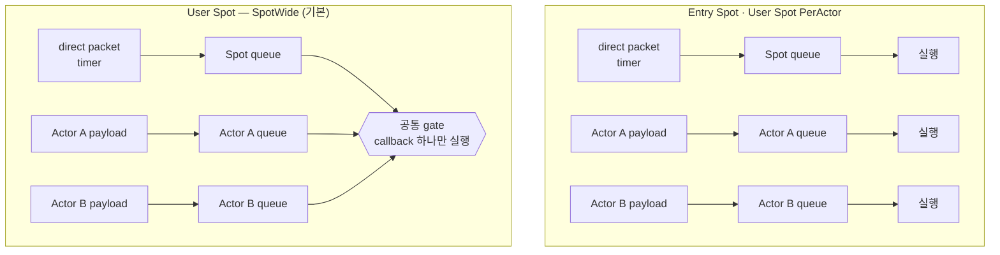

<!-- framework-adapter-nav:start -->
[문서 목록](../../../README.ko.md) | [이전: Channel Messaging](05-channel-messaging.ko.md) | [다음: Actor & Spot 호스팅](07-actor-spot.ko.md)
<!-- framework-adapter-nav:end -->

# 6. Spot

> 정확한 .NET 시그니처는 [Spot 공개 인터페이스](../../common/spec/server/languages/dotnet/interfaces/05-spots.ko.md)가 정의한다.
> Actor와 Spot membership은 [Actor & Spot 호스팅](07-actor-spot.ko.md)에서 설명한다.

Spot은 room, stage, zone처럼 문자열 ID로 찾는 실행 단위다. `SpotId`는 Location Store 전체에서
유일하며, 대소문자를 구분한다. Application은 Spot이 존재하는 `NodeRid`를 선택하거나 보관하지 않는다.
Framework가 현재 위치와 generation을 조회한다.

## 1. 세 가지 Spot

세 종류 모두 ID와 상태를 가지고 순서대로 callback을 실행하는 Spot이지만, 생성 시점,
Actor membership과 종료 계약이 다르다.

| | Entry Spot | User Spot | Instance Spot |
| --- | --- | --- | --- |
| 생성 시점 | Object Server startup에서 Framework가 생성한다 | Application이 `IZLinkSpotManager`로 명시적으로 생성한다 | 해당 ID로 첫 direct message가 도착할 때 생성한다(cold activation) |
| Spot ID | Framework가 발급한다 | `Create`는 Framework가, `GetOrCreate`는 caller가 지정한다 | Caller가 message의 target ID로 지정한다 |
| Stable type | 등록하지 않는다 | 필수 | 필수 |
| Actor membership | 지원한다. Actor 생성 직후의 기본 실행 위치다 | 지원한다. Actor가 join·leave로 이동한다 | 지원하지 않는다 |
| Application close | 제공하지 않는다 | `CloseAsync` 또는 local context에서 close한다 | 자신의 handler·timer context에서 close한다 |
| 주요 용도 | 아직 User Spot에 속하지 않은 Actor의 기본 위치 | room, stage, zone | matchmaking worker처럼 ID 기반 요청 처리 단위 |

User Spot과 Instance Spot은 역할이 다르다. User Spot은 caller가 ID를 지정하거나 Framework가 새 ID를
발급한다. Instance Spot은 별도 create API를 사용하지 않는다. 첫 메시지에 instance type을 지정하면
Framework가 기존 instance를 선택하거나 필요한 위치에 생성한 뒤 같은 메시지를 처리한다.

### 1.1 실제 샘플에서 보기

[Bingo 샘플](../../common/sample/bingo/README.ko.md)은 세 종류를 모두 사용한다. Play
서버가 Entry Spot과 방을 담을 User Spot을, Matchmaking 서버가 매칭 대기열을 담을
Instance Spot을 등록한다.

```csharp
// Play 서버 — Entry Spot과 방을 담을 User Spot.
mesh.Objects().Server()
    .AddEntrySpot<BingoEntrySpot>()                 // Entry Spot은 stable type이 없다.
    .AddSpotFactory<BingoRoom>(
        SampleNames.RoomSpotType,                   // stable type — 생성할 때 이 이름으로 선택한다.
        factory => factory
            .ExecutionMode(ZLinkUserSpotExecutionMode.SpotWide)
            .PreserveStateWith<BingoRoomRelocationAdapter>());

// Matchmaking 서버 — 매칭 대기열을 담을 Instance Spot.
options.AddRouteMesh(SampleNames.MatchmakingMeshName)
    .SetRoutingIdPrefix("matchmaking")
    .Listen(configuration.Node.MeshEndpoint)
    .Objects().Server()
    .AddInstanceSpotFactory<BingoMatchmaker>(
        SampleNames.MatchmakerSpotType,
        factory => factory.RecreateOnRelocation());
```

차이는 **호출하는 쪽**에서 드러난다. Entry Spot은 호출 대상이 아니고(server가 시작하며
이미 준비된다), User Spot은 생성 호출이 따로 있으며, Instance Spot은 그 호출이 없다.
Bingo의 매칭 handler 하나에 뒤의 둘이 함께 나온다.

```csharp
// Instance Spot — 생성 호출이 없다. 해당 ID로 보내면 없을 때 생성된다.
var allocated = await spotClient                    // IZLinkSpotClient
    .RequestToSpot($"match:{levelBucket}", new ReserveBingoRoomReq { ... })
    .InstanceSpot(SampleNames.MatchmakerSpotType)   // 없으면 생성해도 된다는 intent(cold activation).
    .InMesh(SampleNames.MatchmakingMeshName)
    .Async<ReserveBingoRoomRes>(cancellationToken);

// User Spot — 생성 호출이 따로 있다.
var created = await spots                           // IZLinkSpotManager
    .GetOrCreate(allocated.RoomId, SampleNames.RoomSpotType)
    .InMesh(SampleNames.PlayMeshName)
    .Request(allocated.Settings)                    // 새 Spot의 OnCreateAsync로 전달된다.
    .Async(cancellationToken);
```

User·Instance Spot은 factory 등록에서 relocation policy도 함께 지정한다. 생략할 수
없으며, 무엇을 선택하는지는 [Actor & Spot 호스팅](07-actor-spot.ko.md)이 다룬다.

## 2. Object Server 등록

Spot을 실행할 MeshNode는 Object Server role과 factory를 등록한다. 고정 `NodeRid`를 사용해 배치 대상을
선택하지 않는다. 같은 stable type을 등록한 `Serving` node가 배치 후보가 된다.

```csharp
var mesh = options.AddRouteMesh("play")
    .Listen("tcp://0.0.0.0:9001")
    .SetRoutingIdPrefix("play");

mesh.Objects().Server()
    .AddEntrySpot<PlayEntrySpot>() // Actor가 처음 배치될 Entry Spot을 등록한다.
    .AddSpotFactory<GameRoom>(
        "game-room",
        factory => factory
            .ExecutionMode(ZLinkUserSpotExecutionMode.SpotWide)
            .DisableRelocation())
    .AddInstanceSpotFactory<Matchmaker>(
        "matchmaker",
        factory => factory.RecreateOnRelocation());
```

### 2.1 실행 모델 — 무엇이 무엇과 동시에 실행되나

Spot에 들어오는 작업은 두 queue로 나뉘어 대기한다. Spot 자신에게 온 direct packet과
timer는 **Spot queue**에, 그 Spot에 속한 Actor 앞으로 온 payload는 **Actor queue**에
넣는다. 서로 다른 queue의 작업을 동시에 실행할 수 있는지는 Spot 종류와 execution
mode가 정한다.

| | 직렬화 범위 | 상태 소유 |
| --- | --- | --- |
| Entry Spot | Spot queue와 Actor queue를 각각 직렬화한다. 서로 다른 queue는 동시에 실행할 수 있다 | Actor가 각자 소유한다. Actor 사이에 공유하는 상태는 외부 저장소에 둔다 |
| User Spot `SpotWide`(기본) | Spot handler, member Actor handler, timer, lifecycle callback 전체를 공통 gate 하나로 직렬화한다 | Spot instance가 소유한다. Actor와 공유하는 상태에도 별도 동기화가 필요하지 않다 |
| User Spot `PerActor` | Actor별, Spot lane별로 각각 직렬화한다. 서로 다른 lane은 동시에 실행할 수 있다 | Actor가 각자 소유한다. lane 사이에 공유하는 상태는 외부 저장소에 둔다 |
| Instance Spot | Spot queue의 direct handler와 timer를 직렬화한다. Actor queue가 없다 | Spot instance가 소유한다 |



기본값은 **`SpotWide`**이며 대부분의 경우 이 mode를 사용한다. 해당 Spot의 모든
callback을 공통 gate 하나로 직렬화하므로, Spot instance와 member Actor가 같은 상태를
함께 사용해도 별도 동기화가 필요하지 않다. Relocation에서도 Spot과 소속 Actor가 하나의
단위로 함께 이동한다. 반면 오래 걸리는 callback 하나가 해당 Spot의 다음 callback
전체를 지연시킨다.

**`PerActor`**는 Actor마다 독립적으로 실행해야 처리량을 확보할 수 있을 때 선택한다.
Spot 자체는 stateless shell로 사용한다. 서로 다른 lane이 동시에 실행되므로 여러
Actor가 함께 변경하는 상태와 Spot-level schedule은 Redis나 database 같은 외부
저장소에 둔다. Factory relocation 방식은 `RecreateOnRelocation()`만 사용할 수 있다.
**Entry Spot도 같은 모델**이므로 같은 제약을 받는다.

직렬 실행은 스레드 하나를 계속 점유한다는 뜻이 아니다. Handler가 `await`에 도달하면
실행 스레드는 다른 일을 처리할 수 있지만, 해당 turn은 handler가 완료될 때까지 유지된다.
`SpotWide`에서는 그동안 같은 Spot의 다음 callback을 시작하지 않는다. 오래 걸리는 I/O를
기다리는 동안 다음 turn을 실행해야 한다면
[Timer와 worker](#6-timer와-worker)의 `Yield` 계약을 사용한다.

Execution mode는 factory 등록에서 고정하며 실행 중에는 변경하지 않는다.

## 3. User Spot 만들기

새 ID가 필요하면 `Create`를 사용한다. Framework가 SpotId를 발급하고 eligible node를 선택한다.

```csharp
ZLinkSpotCreateResult created = await spots
    .Create("game-room") // stable type으로 factory와 배치 후보를 선택한다.
    .InMesh("play")
    .Request(new CreateGame("ranked")) // OnCreateAsync에 전달할 생성 요청이다.
    .Timeout(TimeSpan.FromSeconds(10))
    .Async(cancellationToken);

string spotId = created.Spot.SpotId; // 이후 메시징에는 전역 SpotId만 사용한다.
```

Caller가 정한 ID를 사용하려면 `GetOrCreate`를 사용한다. 동시에 여러 caller가 같은 ID를 요청해도
Framework는 하나의 생성 시도만 실행한다.

```csharp
ZLinkSpotCreateResult result = await spots
    .GetOrCreate("lobby-eu-1", "lobby")
    .InMesh("play")
    .Request(new CreateLobby("eu"))
    .Async(cancellationToken);

if (result.State == ZLinkSpotCreateState.Rejected)
{
    // 생성 callback이 거절했으므로 Ready Spot은 만들어지지 않았다.
    throw new InvalidOperationException("Lobby creation was rejected.");
}
```

`SpotRef`는 조회 시점의 exact incarnation이다. 일반 메시징에는 사용하지 않는다. 같은 incarnation을
닫을 때만 사용한다.

```csharp
SpotRef? current = await spots.FindAsync("lobby-eu-1", cancellationToken);
if (current is { } exact)
{
    await spots.CloseAsync(exact, cancellationToken); // 다른 generation을 실수로 닫지 않는다.
}
```

## 4. Spot 작성

Spot handler는 [05-channel-messaging](05-channel-messaging.ko.md)의 channel handler와
작성 규칙이 다르다. 주소·수명·실행·상태 네 가지가 모두 갈린다.

| 구분 | channel handler | spot handler |
| --- | --- | --- |
| 주소 | `ChannelName` — 처리할 수 있는 node 중 하나 | spot id — 그 상태를 가진 객체 하나 |
| handler 수명 | message dispatch마다 새로 만든다 | Spot activation 동안 같은 instance를 재사용한다 |
| 실행 | 서로 다른 dispatch는 동시에 실행될 수 있다 | 같은 실행 queue의 작업은 한 번에 하나씩 실행한다 |
| application state | handler field에 보관하지 않는다 | Spot 또는 member Actor가 소유한다 |

`Configure()`에서 handler를 등록하고 lifecycle callback에서 초기화와 정리를 수행한다.

```csharp
public sealed class GameRoom(IZLinkSpotContext context) : IZLinkSpot
{
    public IZLinkSpotContext Context { get; } = context;

    public void Configure()
    {
        Context.Handlers.AddPacket<ChatHandler>(); // Spot send handler를 등록한다.
        Context.Handlers.AddSubscribe<ScoreHandler>(
            "game-events",
            "score.changed"); // Logical Multicast 구독을 등록한다.
    }

    public ValueTask<ZLinkSpotCreateResponse> OnCreateAsync(
        ZLinkMessage request,
        CancellationToken cancellationToken)
    {
        var create = request.Decode<CreateGame>();
        return ValueTask.FromResult(
            create.Mode is "ranked" or "casual"
                ? ZLinkSpotCreateResponse.Accept(new GameCreated(create.Mode))
                : ZLinkSpotCreateResponse.Reject(new InvalidMode(create.Mode)));
    }

    public ValueTask OnInitializeAsync(CancellationToken cancellationToken)
    {
        // 생성 승인 뒤 메시지를 받기 전에 필요한 준비를 끝낸다.
        return ValueTask.CompletedTask;
    }

    public ValueTask OnClosingAsync(
        ZLinkSpotClosingContext closing,
        CancellationToken cleanupCancellationToken)
    {
        // Deadline까지 application resource를 정리한다.
        return ValueTask.CompletedTask;
    }
}
```

`OnClosingAsync`의 reason은 explicit close, host shutdown, relocation out을 구분한다.
Framework는 `Deadline`이 끝날 때 cleanup token을 취소한다.

### 4.1 Spot과 Actor는 각 activation scope를 사용한다

Framework는 Spot을 활성화할 때 DI scope를 하나 만들고 Spot 본체와 Spot handler의
dependency를 이 scope에서 resolve한다. Scope는 Spot이 닫히거나 다른 node로 이전할
때 함께 정리된다. 따라서
**`Scoped`로 등록한 서비스는 그 Spot이 살아 있는 동안 인스턴스 하나**다. HTTP 요청마다
새로 만들어지는 것과 다르다.

Actor handler는 별도의 Actor activation scope를 사용한다. 서로 다른 Actor는 handler나
scoped dependency를 공유하지 않는다. Actor가 leave·destroy되거나 relocation되면 source
scope를 정리하고 target에서 다시 만든다.

그래도 `DbContext` 같은 ORM context를 Spot이나 Spot handler의 생성자로 주입하면
문제가 생긴다. 방 하나가 몇 시간 유지되면 그 context도 몇 시간 산다.

| 증상 | 내용 |
| --- | --- |
| 메모리 증가 | change tracker가 조회한 entity를 계속 추적한다 |
| 오래된 값 조회 | 같은 키를 다시 조회해도 추적 중인 이전 instance를 반환한다 |
| 오류 상태 고착 | 저장 실패로 context가 오염되면 Spot 수명 내내 복구되지 않는다 |

Handler type을 `Transient`나 `Singleton`으로 등록해도 Framework가 정한 수명은 바뀌지
않는다. Framework가 handler를 만들고 dependency만 activation scope에서 resolve한다.

**첫 번째 선택은 Spot에서 저장소에 직접 접근하지 않는 것이다.** 저장·조회는 channel
handler가 있는 서비스에 요청하고, Spot은 in-memory 상태와 실행 순서만 소유한다. Channel
handler는 dispatch마다 scope를 가지므로 ORM을 생성자로 받아도 된다.

```csharp
public sealed class SaveScoreHandler(IZLinkSpotContext context)
    : IZLinkSpotRequestHandler<GameRoom, SaveScore, SaveScoreReply>
{
    public async ValueTask<SaveScoreReply> HandleAsync(
        GameRoom spot, SaveScore request, CancellationToken cancellationToken)
    {
        // 저장은 그 일을 담당하는 channel의 handler에 맡긴다.
        var saved = await spot.Context.Outbound
            .RequestToChannel("score", new PersistScore(spot.Context.SpotId, request.Value))
            .Async<PersistScoreReply>(cancellationToken);

        return new SaveScoreReply(saved.Version);
    }
}
```

**Spot 안에서 직접 써야 한다면 `IServiceScopeFactory`로 그 호출에만 사는 scope를 연다.**
생성자 주입 대신 factory를 받고, 사용하는 자리에서 scope를 만들고 닫는다.

```csharp
public sealed class SaveScoreHandler(IServiceScopeFactory scopeFactory)
    : IZLinkSpotRequestHandler<GameRoom, SaveScore, SaveScoreReply>
{
    public async ValueTask<SaveScoreReply> HandleAsync(
        GameRoom spot, SaveScore request, CancellationToken cancellationToken)
    {
        // 이 호출 동안만 유지되는 scope다. 끝나면 context도 함께 정리된다.
        await using var scope = scopeFactory.CreateAsyncScope();
        var db = scope.ServiceProvider.GetRequiredService<AppDbContext>();

        db.Scores.Add(new ScoreRow(spot.Context.SpotId, request.Value));
        await db.SaveChangesAsync(cancellationToken);

        return new SaveScoreReply(request.Value);
    }
}
```

Spot 수명 동안 유지해도 되는 의존성(설정, 싱글톤 client, 순수 계산 서비스)은 생성자로
받아도 된다. 판단 기준은 "이 의존성을 Spot이 닫힐 때까지 붙잡고 있어도 되는가"다.

## 5. Spot으로 메시지 보내기

일반 User Spot 메시징은 SpotId만 필요하다. 위치와 generation은 Framework가 현재 authority에서 찾는다.

```csharp
await spotClient
    .SendToSpot("room-42", new Chat("hello"))
    .Async(cancellationToken);

RoomState state = await spotClient
    .RequestToSpot("room-42", new GetRoomState())
    .Timeout(TimeSpan.FromSeconds(3))
    .Async<RoomState>(cancellationToken);
```

Instance Spot은 같은 호출 표면에 intent를 추가한다. type이 하나만 등록된 mesh에서는
`InstanceSpot()`을 사용할 수 있다. 둘 이상이면 type을 명시한다.

```csharp
MatchResult match = await spotClient
    .RequestToSpot("bronze", new FindMatch(playerId))
    .InstanceSpot("matchmaker") // 기존 instance가 없으면 Framework가 생성한다.
    .InMesh("matchmaking")
    .Async<MatchResult>(cancellationToken);
```

`InstanceSpot(...)`을 붙이지 않은 호출은 이미 실행 중인 Spot만 찾고, 없으면 생성하지
않고 실패한다. `FindAsync`도 생성을 시작하지 않는다. 즉 cold activation은 호출하는
쪽이 intent로 명시적으로 허용해야 일어난다.

`SendToSpot`은 source-local admission까지 기다리는 one-way operation이다. Target handler 완료를
기다리지 않는다. `RequestToSpot`은 reply 또는 typed error까지 기다린다.

## 6. Timer와 worker

Timer는 Spot context에 등록한다. Framework가 relocation 때 등록 정보와 pending tick을 옮기므로
application adapter가 timer를 따로 저장하거나 target에서 다시 등록하지 않는다.

```csharp
await Context.AddTimer<HeartbeatHandler>(
    "heartbeat",
    TimeSpan.FromSeconds(1),
    new ZLinkTimerOptions
    {
        OverrunPolicy = ZLinkTimerOverrunPolicy.SkipLateTicks
    },
    cancellationToken);
```

긴 CPU 작업과 I/O는 Spot queue를 계속 점유하지 않도록 worker call로 실행할 수 있다. `Yield`는
`SpotWide` User Spot 안의 Actor가 자기 queue 순서를 유지하면서 Spot 전체 실행권만 잠시 반환해야 할 때
사용한다. Entry Spot과 `PerActor`에서는 허용되지 않는다.

## 7. Application이 relocation 경계를 고르는 경우

기본 `AnyTurnBoundary`는 Framework가 완료된 turn 사이에서 relocation을 시작한다. FPS round처럼
application만 안전한 경계를 아는 Spot은 `ApplicationSignaled`를 등록한다.

```csharp
mesh.Objects().Server()
    .AddSpotFactory<GameRoom>(
        "game-room",
        factory => factory
            .ExecutionMode(ZLinkUserSpotExecutionMode.SpotWide)
            .RelocationReadiness(
                ZLinkSpotRelocationReadinessMode.ApplicationSignaled)
            .PreserveStateWith<GameRoomRelocationAdapter>());
```

안전한 turn의 마지막 Framework operation으로 `Defer()`를 호출한다. 이동이 없거나 commit 전에
중단되면 source에서 `Continued`, 이동했으면 target에서 `Relocated` callback을 받는다.

```csharp
Context.RelocationReady().Defer(); // 이 handler가 끝난 뒤 다음 turn 전에 경계를 연다.

public ValueTask OnRelocationReadyCompletedAsync(
    ZLinkSpotRelocationReadyCompletion completion,
    CancellationToken cancellationToken)
{
    StartNextRound(completion.Outcome);
    return ValueTask.CompletedTask;
}
```

`Defer()` 뒤 같은 turn에서 다른 Framework operation을 시작하면 오류다. `PerActor`, Entry Spot,
Instance Spot과 기본 `AnyTurnBoundary`에서도 호출할 수 없다.

## 8. 다음 문서

- Actor 생성과 Spot 이동: [Actor & Spot 호스팅](07-actor-spot.ko.md)
- Session binding: [Session Actor Dispatch](08-actor-session.ko.md)
- Location Store 설정: [Location](10-location.ko.md)
