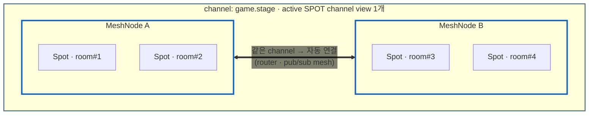
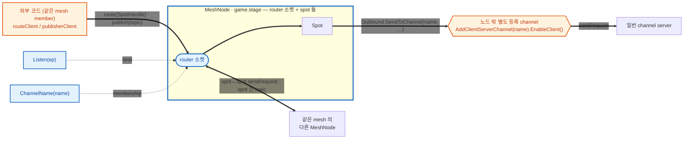
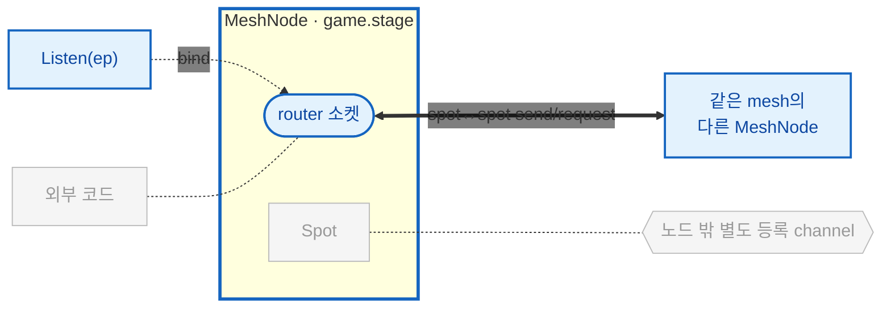
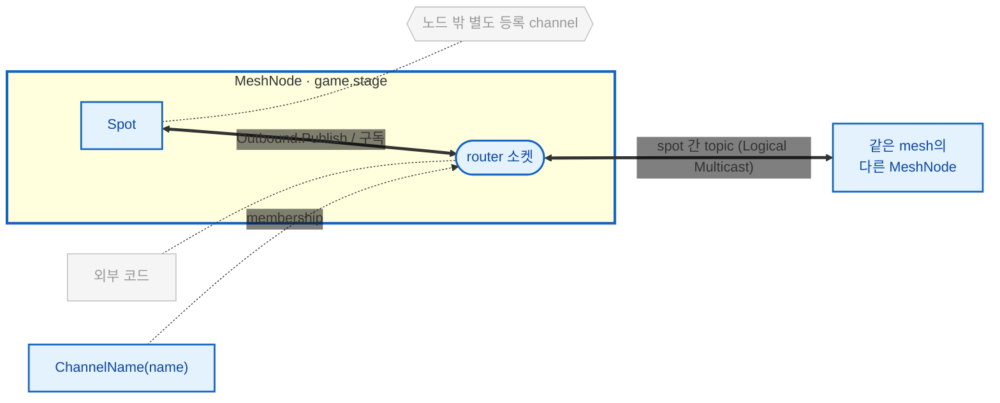
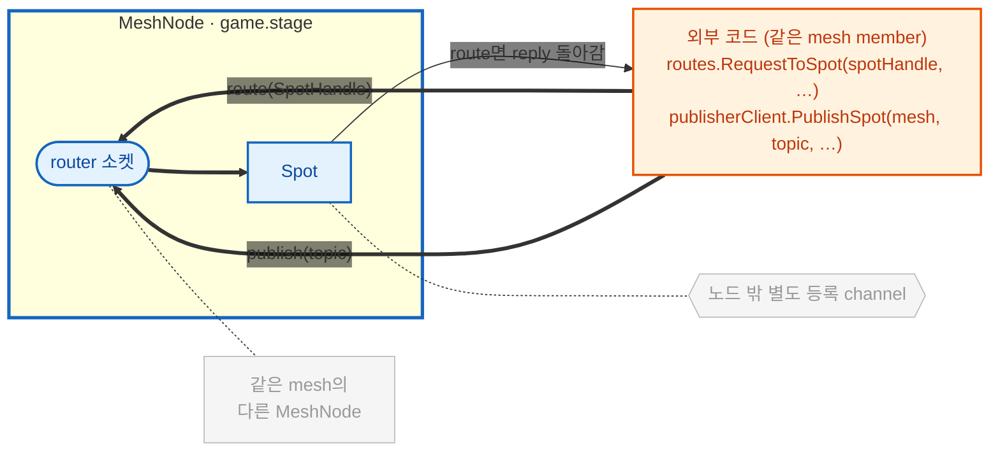
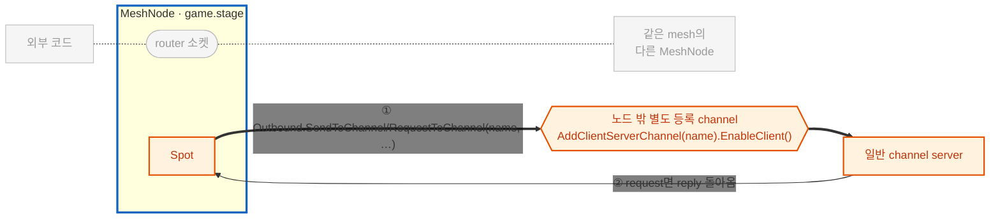
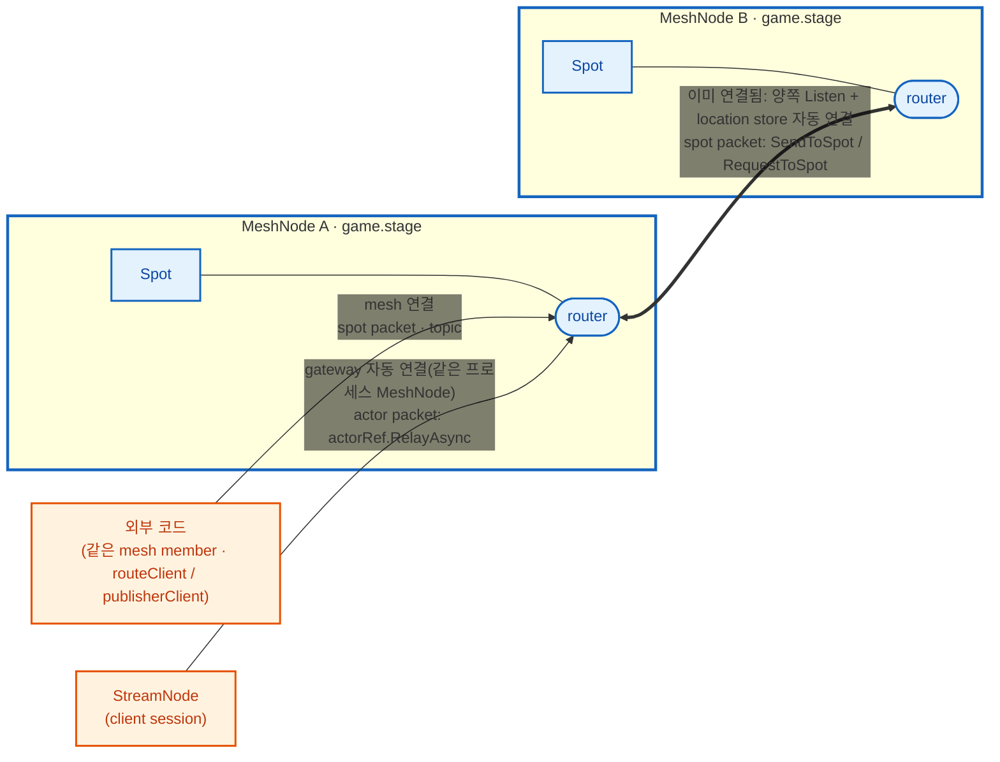
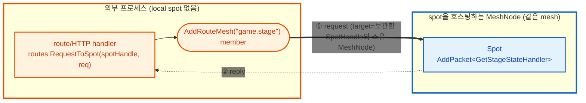

<!-- framework-adapter-nav:start -->
[문서 목록](../../../README.ko.md) | [이전: Channel Messaging](05-channel-messaging.ko.md) | [다음: Actor & Spot 호스팅](07-actor-spot.ko.md)
<!-- framework-adapter-nav:end -->

# 6. SPOT — room · stage · zone

> 정식 계약은 [spec/aspnet-core-spot](../../spec/server/languages/dotnet/01-system-structure.ko.md),
> [spec/spot-node](../../spec/server/languages/dotnet/01-system-structure.ko.md), [spec/stage-wrapper-on-spot](../../spec/server/languages/dotnet/02-handler-interfaces.ko.md)가
> 다룬다. 이 챕터는 SPOT을 등록하고 다루는 사용법 중심이다.
>
> 🔰 SPOT·actor·Entry Spot 등 용어가 낯설면 [03-concepts §0](03-concepts.ko.md)의
> 한 줄 풀이를 먼저 본다.

## 현재 구현 기준

외부(다른 프로세스·다른 channel)에서 특정 Spot에 메시지를 보내는 방법은 두 가지다.

- **send/request** — `IZLinkRouteClient`로 spot 전송 대상(`SpotHandle`)에 보낸다. `SpotHandle`는
  `IZLinkSpotHandleResolver`로 spot rid를 한 번 resolve 해서 보관하고, 보낼 때마다 그 값을
  그대로 재사용한다. framework는 위치 event와 주기적 조회로 handle의 내부 주소를 갱신한다.
  request 도중 주소가 무효화되면 안전한 경우에 한해 주소를 다시 조회하고 한 번 재전송한다.
  send는 이미 전달되었을 가능성이 있으므로 자동으로 다시 전송하지 않는다. 예제는 §5에서 본다.
- **publish** — `IZLinkSpotPublisherClient`를 주입해 `PublishSpot(...)`으로 topic을 보낸다. 같은
  mesh의 member 이기만 하면 자동으로 연결되므로 `SpotHandle`가 따로 필요 없다.

두 경우 모두 호출하는 프로세스가 **같은 mesh의 member**(`AddRouteMesh(mesh)` 등록)면 framework가
자동으로 연결해 준다. 호출자는 논리적 대상을 나타내는 `SpotHandle`만 보관하고 내부 주소와 갱신
정책은 framework에 맡긴다.

## 1. SPOT 이란

`SPOT`은 동적으로 생성·소멸되는 **주소 가능한 논리 인스턴스**다. 게임 room,
채팅 room, MMORPG zone처럼 "있다가 없어지는 단위"를 메시지 라우팅 대상으로 삼는다.

| 개념 | 뜻 |
|------|------|
| `Spot` | room/stage/zone 같은 논리 인스턴스 하나 |
| `MeshNode` | 여러 spot 인스턴스를 호스팅하는 컨테이너 노드 |
| `TSpot` | 생성할 user Spot 타입. framework 안에서 factory 선택에만 쓰며 public 식별자로 전달하지 않는다 |
| `spotRid` (`RoutingId`) | `MeshNode`가 인스턴스 생성 시 내주는 **논리 주소**. 특정 room 한 개를 가리킨다 |
| Entry Spot | 노드의 기본 실행 컨텍스트(actor가 생성 직후 머무는 곳) |

SPOT은 pub/sub helper가 아니다. publish/subscribe는 spot **안에서** 쓰는 한
기능일 뿐이다.

규칙 세 가지를 그림으로 먼저 보자. 여기서는 **Spot ↔ MeshNode ↔ 같은 channel **
까지, 즉 channel **안쪽** 관계만 본다. 다른 channel·외부와의 연결은 아래 §2 그림에서
함수별로 다룬다.



- **Spot은 `MeshNode` 안에 존재한다.** 특정 service에 종속되는 게 아니라, 자신을
  호스팅하는 노드(컨테이너)에 속한다. 그림의 Spot 들이 노드 박스 안에 들어 있는 모습.
- **같은 mesh 노드끼리는 자동으로 연결된다.** 같은 mesh의 MeshNode 끼리는
  router mesh가 자동으로 이어진다(굵은 화살표). 다른 mesh로 나가는 연결은
  별도 함수가 필요하고, 아래 §2 그림에서 본다.
- **한 `MeshNode`는 한 mesh만 본다.** 노드는 항상 하나의 mesh 박스 안에 속한다.
  단 **한 프로세스는 여러 `MeshNode`를 둘 수 있다**. `AddRouteMesh(...)`를 mesh
  이름별로 여러 번 호출하면 각각 자기 mesh 박스에 속한 별도 노드가 된다(§2).
  같은 이름으로 두 번 부르면 시작 예외다.

## 2. MeshNode 등록

location store로 mesh를 묶는 형태가 표준이다([10-location](10-location.ko.md)).

```csharp
builder.Services.AddZLinkFramework(options =>
{
    // 같은 mesh("game.stage") 노드끼리 자동 연결되는 핵심: 각 노드가 자기
    // router bind endpoint를 location store의 MeshNode descriptor row로
    // 등록하고, 런타임이 store에서 읽은 peer 들과 router↔router mesh를 알아서
    // 연결한다. 그래서 별도 "connect" 코드 없이 §1 그림의 굵은 화살표
    // (MeshNode A <==> B)가 생긴다.
    options.AddLocationStore(new ZLinkRedisLocationStore(redis => redis
        .SetConnectionString("redis-host:6379")
        .SetKeyPrefix("game:prod")));

    var node = options.AddRouteMesh("game.stage");
    node.Listen("tcp://0.0.0.0:9001");   // 이 MeshNode의 router 소켓을 이 endpoint에 bind (store의 descriptor row로 등록된다)
    node.ChannelName("game.stage");      // logical membership — topic publish도 같은 router 소켓으로 흐른다
    node.AddSpotFactory<StageSpot>();    // 이 노드가 만들 타입

    // ↓ spot이 호출할 외부 channel — 노드 설정이 아니라 options에 따로 등록(spot은 이름으로 이용, §5)
    options.AddClientServerChannel("orders").EnableClient();
});
```

> **여러 MeshNode를 한 프로세스에.** `AddRouteMesh(...)`는 호출마다 그 mesh의 노드 하나를
> 만든다. 서로 다른 mesh 이름으로 여러 번 부르면 한 프로세스가 **여러 MeshNode** 를 호스팅한다
> (예: room 노드 + session gateway 노드 동거). 같은 mesh 이름을 두 번 등록하면 시작 예외다.
>
> ```csharp
> var room = options.AddRouteMesh("game.room"); // room spot을 맡는 노드를 별도 mesh로 등록한다.
> room.Listen("tcp://0.0.0.0:9001");
> room.ChannelName("game.room");
> room.AddSpotFactory<RoomSpot>();
> var zone = options.AddRouteMesh("game.zone"); // zone spot은 다른 노드가 맡도록 mesh를 분리한다.
> zone.Listen("tcp://0.0.0.0:9002");
> zone.ChannelName("game.zone");
> zone.AddSpotFactory<ZoneSpot>();
> ```

node 역할은 서로 독립이다.

| node 함수 | 의미 |
|-----------|------|
| `Listen(endpoint)` | 이 MeshNode의 **유일한 router 소켓**을 bind — 같은 mesh의 다른 MeshNode와 spot↔spot routed send/request와 **topic publish/subscribe까지 전부** 이 소켓으로 오간다(별도 pub/sub 소켓 없음) |
| `ChannelName(name)` | logical channel membership 추가(소켓 추가 없음). mesh는 최소 1개 membership이 필요하고, 같은 이름의 membership이 select-one·Logical Multicast의 대상 집합이 된다 |
| `ConfigureSpotPublisher()` | publish 측 전송 옵션(HWM·send timeout·linger) 조정 |
| `AddSpotFactory<TSpot>()` | 이 노드가 만들 spot 타입 등록. 타입 중복은 시작 예외 |
| `AddEntrySpot<TEntrySpot>()` | Entry Spot handler registry 부착(actor 사용 시, [actor spec](../../spec/server/languages/dotnet/02-handler-interfaces.ko.md)) |
| `UseDrainPolicy(정책)` | 노드가 graceful drain으로 내려갈 때 이 mesh의 spot을 정리하는 방식 선언. 기본 `DrainNatural`(자연 종료 대기), 외부 영속 상태에서 재구성 가능한 spot은 `ReleaseAndRecreate`([12-operations §3](12-operations.ko.md)) |

위 표는 **MeshNode 자체 설정**이다 — 자기 소켓(`Listen`)·membership(`ChannelName`)과 만들 spot
타입(`AddSpotFactory`·`AddEntrySpot`)만 다룬다. 같은 mesh(예: `game.stage`) 안에서 MeshNode 끼리
주고받는 건 위 router 소켓으로 이미 자동이다. 그 **바깥**과 주고받는 방향은
둘인데, 그중 spot이 호출하는 **일반 channel**(예: `orders`)은 mesh와는 다른 개념이라 MeshNode
설정에 포함되지 않고 따로 등록한다 — 위 소켓과 (따로 등록한) 일반 channel이 이렇게 받쳐 준다.

- **spot → 외부 channel (보낼 때).** 쓰려는 channel은 노드와 **따로** 등록한다
  (`options.AddClientServerChannel("orders").EnableClient()`). spot 안에서는
  `Context.Outbound.SendToChannel("orders", …)` / `RequestToChannel("orders", …)`처럼 **channel 이름만**
  부르면 framework가 그 채널 client로 내보낸다. 즉 spot은 채널을 *이름으로 빌려 쓸* 뿐이다(§5).
- **외부 → spot (받을 때).** 외부 코드가 `SpotHandle`로 보낸 send/request도, 외부 publish도
  **이 노드의 같은 router 소켓**으로 들어온다. 보내는 프로세스가 같은 mesh의 member면
  (아래 "외부→spot inbound") 런타임이 연결을 잇는다 — 받는 쪽에 별도 bridge 등록이 없다.

각 소켓이 무엇을 활성화하고 메시지가 어디로 흐르는지 그림으로 보면 이렇다(점선 = 함수 호출로 활성화).



> 🟦 **파란** = 이 노드의 **router 소켓**(`Listen`) 하나. 같은 mesh에 참여하고, spot 간 topic도,
> **외부→spot inbound**(route·publish)도 전부 이 소켓으로 들어온다.
> 🟧 **주황** = **노드 밖에 따로 등록한 channel**. `AddClientServerChannel(name).EnableClient()`로
> 별도 등록하고, spot은 `Outbound`에서 그 **이름을 불러 빌려 쓴다**(노드 설정이 아니다).

### 함수 하나씩 — 같은 지도, 경로만 강조

위 종합 그림이 이 절의 **기준 지도**다. 아래 항목들은 같은 지도를 다시 쓰되, 그
함수가 여는 경로만 진하게 남기고 나머지는 회색으로 눕힌다. 그림마다 새로 읽을 필요
없이 "이번엔 어느 경로가 켜지는가"만 보면 된다.

**🟦 `Listen(ep)`** — 이 노드의 **router 소켓**을 bind 한다. 같은 mesh의 다른 MeshNode와
spot↔spot으로 send/request를 주고받는 축이고, topic publish도 같은 소켓으로 흐른다. 같은 mesh
노드끼리는 §1처럼 **location store 기준**으로 자동 연결되므로 이 소켓만 열면 추가로 연결할 게 없다.
store 없이 peer를 직접 잇는 수동 연결도 있다(바로 아래 "자동 연결 vs 수동 연결").



**🟦 `ChannelName(name)`** — logical channel **membership**을 더한다. 소켓이 새로 생기지 않는다.
topic publish/subscribe(Logical Multicast)는 이 membership 집합을 대상으로 **위 router 소켓**을
그대로 타고 흐르고, local spot 안의 `Outbound.Publish(...)`도 별도 소켓 없이 여기로 나간다.



**자동 연결 vs 수동 연결.** `Listen`은 *이 노드의 router 소켓을 여는 것*까지다. 그
소켓이 **같은 mesh의 다른 노드와 어떻게 이어지는지**는 두 방식이 있다.

- **자동(location store 기준, 기본).**
  router bind endpoint를 location store에 MeshNode descriptor row로 등록하고, store에서 읽은
  같은 mesh peer 들과 router↔router를 **런타임이 자동으로 연결한다.** connect 코드가 없다.
- **수동(store 없이 직접 지정).** `PeerConnections`로 peer 주소를 코드에 직접 지정한다 —
  `PeerConnections.Connect(endpoint)`, peer를 정확히 지정하려면
  `PeerConnections.Connect(expectedRid, endpoint)`. `Disconnect(endpoint)`로 끊고
  `ListConnections()`로 열거한다. peer가 늘면 그만큼 호출을 반복한다(노드 수가 고정된
  토폴로지에 적합). topic publish도 같은 router 연결을 쓰므로 pub 구독을 따로 잇지 않는다.

```csharp
// (A) 자동 — location store가 peer를 알려줘 mesh를 잇는다 (connect 코드 없음)
var node = options.AddRouteMesh("game.stage");
node.Listen("tcp://0.0.0.0:9001");         // 내 router 소켓을 이 endpoint에 bind
node.ChannelName("game.stage");

// (B) 수동 — store 없이 peer를 직접 지정 (TicTacToe Play 노드 방식, 2-노드 고정)
var node = options.AddRouteMesh("game.stage");
node.Listen("tcp://0.0.0.0:9001");                                 // 내 router 소켓을 연다
node.ChannelName("game.stage");
node.SetRoutingId(RoutingId.From("play-a"));                       // 내 노드 rid
node.PeerConnections.Connect(
    RoutingId.From("play-b"), "tcp://node-b:9001");                // 상대 router로 직접 연결
```

**🟦 외부→spot inbound — 보내는 프로세스도 같은 mesh member가 된다.** 외부 코드가
`IZLinkRouteClient`로 spot 주소(`SpotHandle`)에 send/request 하거나(route),
`IZLinkSpotPublisherClient.PublishSpot(...)`로 topic을 보내려면(publish), 그 프로세스도
`AddRouteMesh("game.stage")`로 **같은 mesh에 member로 등록**한다(`Listen`은 `tcp://0.0.0.0:0`
ephemeral bind면 충분 — resolve 된 실제 endpoint가 descriptor row로 광고된다). 그러면 런타임이
mesh 연결로 spot에 전달한다. route 면 reply가 같은 길로 돌아오고, publish는 단방향(reply 없음)이다.
상세 host 설정은 §5에서 본다.



**🟧 spot이 외부 channel 호출 (`AddClientServerChannel(name).EnableClient()`)** — 이건 **노드 설정이
아니라 따로 등록하는 channel** 이다. spot이 바깥 서비스로 send(단방향)/request(요청→응답 왕복) 할 때,
spot 안에서 `Context.Outbound.SendToChannel(name, …)` / `RequestToChannel(name, …)`로 그 **channel
이름을 부르면** framework가 등록된 이 client로 내보낸다. request 면 server의 reply가 spot으로
되돌아온다. (자세한 사용은 §5)



spot↔spot·actor까지 포함한 전체 연결·handler 표는 **§5 「한눈에 보기」**에서 한 번에 본다. 여기 §2 그림은 "함수가 활성화하는 MeshNode 소켓 ↔ channel" 한 축만 떼어 본 것이다.

> **location store는 프로세스 공용 등록(`AddLocationStore(...)`) 하나를** 기본으로 사용한다.
> mesh 단위로 다른 store endpoint를 따로 지정하지 않는다. 단일 노드만 실행하는 local
> 테스트도 `AddRouteMesh(...)`가 반환한 builder에 `Listen`, membership, factory를 바로 설정한다.

## 3. Spot 작성 — handler 등록과 lifecycle

spot 클래스는 `IZLinkSpot`을 구현하고, 주입받은 `Context`에 handler·subscribe·
timer를 `Configure()`에서 등록한다.

> **SPOT handler 등록은 두 가지다.** 기본은 spot의 `Configure()`(와 lifecycle) 안에서
> `Context.Handlers.Add*`/`Context.AddTimer`를 직접 호출하는 수동 등록이다. channel handler
> 처럼([04 §3](05-channel-messaging.ko.md)) class에 attribute를 붙이고
> `options.AddHandlersFromAssemblyOf<TMarker>()`로 assembly를 스캔하는 자동 등록도
> packet·subscribe·actor packet·timer handler 전부에서 쓸 수 있다(timer 자동 등록 예시는 아래
> "timer 사용법" §attribute 기반 자동 등록). spot node builder는 entry/spot factory만 등록하고,
> handler 자체는 이 두 방식 중 하나로 등록한다. 어떤 API가 무엇을 등록하는지는 아래 코드 주석을
> 참고한다.

```csharp
public sealed class StageSpot(IZLinkSpotContext context) : IZLinkSpot
{
    private IZLinkTimer? _heartbeat;
    public IZLinkSpotContext Context { get; } = context;

    // 같은 Spot의 callback은 직렬화되므로 이 상태에 lock이 필요 없다.
    private int _occupants;

    public void Configure()
    {
        // AddPacket<T>: spot으로 오는 send/request packet handler 등록
        Context.Handlers.AddPacket<GetStageStateHandler>();

        // AddActorPacket<T, TActor>: actor가 보낸 send/request를 처리하는 handler 등록 (actor 사용 시)
        // Context.Handlers.AddActorPacket<MoveStageHandler, StageActor>();

        // AddSubscribe<T>(topic): 지정 topic을 구독해 publish를 받는 handler 등록
        Context.Handlers.AddSubscribe<StageStateUpdatedHandler>("stage.state.updated");
    }

    public async ValueTask OnInitializeAsync(CancellationToken cancellationToken)
    {
        // AddTimer<T>: 주기 실행 timer handler 등록. Configure가 아니라 lifecycle에서 등록한다.
        _heartbeat = await Context.AddTimer<StageHeartbeatHandler>(
            "heartbeat",
            TimeSpan.FromSeconds(1),
            new ZLinkTimerOptions
            {
                OverrunPolicy = ZLinkTimerOverrunPolicy.DelayNextTick
            },
            cancellationToken);
    }

    public async ValueTask OnClosingAsync(CancellationToken cancellationToken)
    {
        if (_heartbeat is not null)
        {
            await _heartbeat.CancelAsync();
        }
    }
}
```

lifecycle callback은 호출 순서가 정해져 있다. **`OnCreateAsync`(생성 1회) → `OnInitializeAsync`
(초기화 1회) → … → `OnClosingAsync`(종료 1회).** 위 예제는 `OnInitializeAsync`/`OnClosingAsync`
만 보였는데, 생성 시점에 한 번 불리는 `OnCreateAsync`가 추가로 있다.

```csharp
// OnCreateAsync: 생성 요청 메시지를 받아 초기 상태를 세팅하고, 생성을 수락/거부한다.
public ValueTask<ZLinkSpotCreateResponse> OnCreateAsync(ZLinkMessage request, CancellationToken ct)
{
    var create = request.Decode<DeliverySpotCreate>();   // GetOrCreateAsync에 넘긴 payload(§4)
    _deliveryId = create.DeliveryId;

    // Accept(reply)의 reply는 생성 호출자에게 ZLinkSpotCreateResult.Reply로 돌아간다(선택).
    return ValueTask.FromResult(ZLinkSpotCreateResponse.Accept(new DeliverySpotCreated(_deliveryId)));
    // 거부하려면 ZLinkSpotCreateResponse.Reject() — 호출자는 State == Rejected를 받는다.
}
```

> **`Context.SpotRid` vs `Context.NodeRid`.** `Context.SpotRid`는 이 spot 한 개의 논리 주소,
> `Context.NodeRid`는 이 spot을 호스팅하는 **`MeshNode`**의 routing id 다. 어느 `MeshNode`가
> spot을 소유하는지 응답·로그에 실어 보낼 때 `Context.NodeRid`를 쓴다.

spot handler는 첫 인자로 spot 인스턴스를 받는다.

```csharp
// request 핸들러: 제네릭 인자는 <대상 spot, 요청, 응답> 순서다.
public sealed class GetStageStateHandler
    : IZLinkSpotRequestHandler<StageSpot, GetStageStateRequest, GetStageStateReply>
{
    public ValueTask<GetStageStateReply> HandleAsync(
        StageSpot spot,                  // 첫 인자 = 대상 spot 인스턴스. 그 spot의 상태·Context에 바로 접근한다.
        GetStageStateRequest request,
        CancellationToken cancellationToken)
        // spot.Context로 그 spot의 정보(여기선 SpotRid)를 읽어 응답을 만든다.
        => ValueTask.FromResult(new GetStageStateReply(spot.Context.SpotRid.ToString()));
}

// timer 핸들러: Configure가 아니라 AddTimer 등록(§ OnInitializeAsync)으로 주기 실행된다.
public sealed class StageHeartbeatHandler : IZLinkSpotTimerHandler<StageSpot>
{
    public ValueTask HandleAsync(
        StageSpot spot,                  // request 핸들러와 동일하게 첫 인자로 대상 spot을 받는다.
        ZLinkTimerTick tick,             // tick: 이번 주기 실행의 메타(예정 시각·지연 등)
        CancellationToken cancellationToken)
        => ValueTask.CompletedTask;
}
```

### 실행 직렬화 — SPOT의 핵심 보장

여기서 말하는 직렬화는 payload를 bytes로 바꾸는 codec 직렬화가 아니다. **메시지를
어떤 실행 줄에서 어떤 순서로 처리하는가**를 뜻한다. 실행 줄의 개수가 Spot 종류마다
다르다.

| 구분 | 주소 지정과 진입 경로 | 실행 순서 기준 |
|------|------------------------|----------------|
| user/domain Spot | `spotRid`로 특정 room/stage/zone을 가리키고, route mesh나 local call로 들어온다 | 해당 Spot 인스턴스의 **단일 실행 큐** — packet·request·subscription·timer·actor packet·channel reply 후속이 전부 여기서 직렬로 실행된다 |
| Entry Spot | actor 생성 직후의 기본 위치이며, actor packet은 session/actor relay를 거쳐 들어온다 | **줄이 둘로 나뉜다** — lifecycle·route packet·subscription·timer는 Entry Spot 자신의 줄에서, actor packet은 **대상 actor mailbox**에서 각각 직렬화된다. 두 줄은 서로 동시에 실행될 수 있다 |

이 차이가 상태를 둘 곳을 정한다.

- 여러 메시지가 함께 바꾸는 도메인 상태(room board, match queue, zone state)는
  **user/domain Spot**에 둔다. 단일 큐 덕분에 lock 없이 만질 수 있다.
- actor 하나만 쓰는 값은 Entry Spot에서도 mailbox 직렬화만으로 안전하다.
- 참가자 목록·admission 카운터처럼 **여러 actor·timer·route packet이 같이 만지는
  Entry Spot 공유 상태**는 `lock`/`Interlocked` 같은 명시적 동기화를 직접 건다.
  actor packet과 Entry Spot 자신의 실행 줄은 동시에 돌 수 있기 때문이다.
- 두 Spot 종류 모두, 외부에서 `SpotRid`로 직접 접근하는 코드는 이 보장 밖이다.

actor dispatch 세부 규칙은 [07-actor-spot](07-actor-spot.ko.md)과
[08-actor-session](08-actor-session.ko.md)에서 함께 본다.

> **샘플에서 보기 — [Bingo](../../common/sample/bingo/README.ko.md).** 플레이어들의 카드
> 제출과 room timer의 번호 추첨·자동 mark·승리 판정이 전부 room Spot 하나의 실행
> 줄에서 직렬로 처리된다. 게임 상태를 만지는 코드 어디에도 lock이 없다 — 이
> 직렬화 보장이 그 이유다.

### 자동 turn dispatch

Spot/Entry Spot handler에서 request, actor join, worker call의 단일 `Async(...)` terminator를
기다리면 framework가 현재 실행 turn을 자동으로 반납한다. 완료되면 원래 Spot 또는 actor mailbox
실행 문맥에서 continuation을 재개한다. 호출자가 실행 줄 관리 방식을 고르는 별도 terminator는 없다.

따라서 await 전의 공유 mutable state를 await 뒤에도 그대로 유효하다고 가정하면 안 된다. room list,
match queue, lobby state를 계속 판단해야 하면 await 뒤에 상태를 다시 확인하거나 Spot이 소유한 하나의
operation으로 책임을 모은다. player 한 명의 admission/preflight처럼 actor-local 값과 reply 값만
사용하는 흐름은 이 자동 turn 규칙을 그대로 사용한다.

Bingo sample의 `MatchBingoActorHandler`도 API channel request와 room `JoinSpot`의 단일
`Async(...)` terminator를 기다린다. framework가 turn 반납과 continuation 복귀를 관리하므로 sample에
별도 dispatch 선택 API가 나타나지 않는다.

### timer 사용법

timer는 spot 안에서 주기적으로 상태를 갱신하거나, 오래된 참가자를 정리하거나,
주기적인 snapshot을 publish 할 때 사용한다. 일반적인 사용 흐름은 다음과 같다.

1. `Configure()`에서는 packet, subscribe, actor handler처럼 동기 등록만 한다.
2. `OnInitializeAsync(...)`에서 `Context.AddTimer<THandler>(...)`를 호출한다.
3. 반환된 `IZLinkTimer`를 spot 필드에 보관한다.
4. `OnClosingAsync(...)`에서 `CancelAsync()`로 멈춘다.
5. 실제 주기 작업은 `IZLinkSpotTimerHandler<TSpot>` 구현체에 둔다.

`AddTimer<THandler>(name, period, options, cancellationToken)`의 인자는 다음 의미다.

| 인자 | 의미 |
|------|------|
| `THandler` | tick이 발생할 때 실행할 handler 타입. DI로 생성된다 |
| `name` | timer 이름. monitoring과 tick metadata에 들어간다 |
| `period` | tick 간격. `TimeSpan.Zero` 나 음수는 설정 오류다 |
| `options` | tick이 밀릴 때의 정책과 예외 처리 정책 |
| `cancellationToken` | 등록 작업 취소 토큰 |

timer handler는 매 tick마다 spot 인스턴스와 `ZLinkTimerTick`을 받는다.

```csharp
public sealed class StageHeartbeatHandler : IZLinkSpotTimerHandler<StageSpot>
{
    public async ValueTask HandleAsync(
        StageSpot spot,
        ZLinkTimerTick tick,
        CancellationToken cancellationToken)
    {
        if (tick.SkippedTicks > 0)
        {
            // 이전 tick이 밀렸다는 뜻이다. 무거운 보정 작업은 여기서 줄일 수 있다.
        }

        await spot.Context.Outbound
            .Publish("stage.heartbeat", new StageHeartbeat(spot.Context.SpotRid, tick.StartedAt))
            .Async(cancellationToken);
    }
}
```

#### attribute 기반 자동 등록

위는 수동 등록이다. handler class에 `[ZLinkSpotTimerHandler(name, periodMilliseconds)]`를 붙이고
`options.AddHandlersFromAssemblyOf<TMarker>()`로 assembly를 스캔하게 하면, `Context.AddTimer`/
`CancelAsync` 호출 없이 framework가 spot 생성·종료에 맞춰 등록·해제까지 대신한다.
`IZLinkSpotTimerHandler<TSpot>`의 제네릭 인자가 대상 spot 타입을 정하므로 별도 연결 코드가 없다
(Bingo 샘플의 `BingoRoomDrawTimerHandler` 실제 코드).

```csharp
// period는 attribute 생성자 제약상 TimeSpan이 아니라 double(ms)로 받는다.
[ZLinkSpotTimerHandler("bingo-draw", 200)]
internal sealed class BingoRoomDrawTimerHandler : IZLinkSpotTimerHandler<BingoRoom>
{
    public async ValueTask HandleAsync(
        BingoRoom spot, ZLinkTimerTick tick, CancellationToken cancellationToken)
    {
        if (!spot.IsReadyToDraw) return;
        var change = spot.DrawNextNumber();
        await spot.PublishAsync(change, cancellationToken);
    }
}

// host 설정 — 이 한 줄이 assembly 안의 attribute 기반 handler(packet·subscribe·actor packet·timer)를
// 전부 스캔해 등록한다. 별도로 MeshNode builder에 얹지 않는다.
options.AddHandlersFromAssemblyOf<Program>();
```

자동 등록은 이름과 주기만 받고 `ZLinkTimerOptions`(overrun 정책·`StopOnUnhandledException`)는
기본값을 쓴다. `CatchUpBounded` 같은 정책이 필요하면 수동 등록(`Context.AddTimer<THandler>(name,
period, options, ct)`)을 쓴다.

`ZLinkTimerTick`은 "이번 callback이 시간표에서 어떤 위치였고, 실제로 얼마나
늦게 실행됐는지"를 설명하는 값이다. handler 안에서 보정, 로깅, 부하 완화,
publish payload 작성에 사용할 수 있다.

| 값 | 의미 |
|----|------|
| `Name` | 등록한 timer 이름. handler 하나가 여러 timer에 재사용될 때 분기하거나 monitoring payload에 넣는다 |
| `DeliveryIndex` | 실제 handler callback 번호. "이 handler가 몇 번째 실행됐는지"가 필요할 때 쓴다 |
| `ScheduledIndex` | fixed-rate 시간표 기준 tick 번호. 건너뛴 tick까지 포함한 논리 tick 번호다 |
| `Period` | 등록한 tick 간격. handler에서 다음 상태 계산의 기본 간격으로 쓴다 |
| `ScheduledAt` | 원래 실행될 예정이던 시각. 외부 이벤트 timestamp 나 timeout 판정 기준으로 쓴다 |
| `StartedAt` | handler 실행이 시작된 실제 시각. publish payload 나 last-seen 갱신에 쓴다 |
| `ScheduledElapsed` | timer 시작 이후 `ScheduledAt` 까지의 논리 경과 시간 |
| `StartedElapsed` | timer 시작 이후 `StartedAt` 까지의 실제 경과 시간 |
| `Delay` | 예정 시각보다 얼마나 늦게 시작했는지. timer 부하 감지와 degrade 판단에 쓴다 |
| `SkippedTicks` | overrun 정책 때문에 건너뛴 tick 수. 무거운 보정 작업을 줄이거나 상태를 빠르게 catch-up 할 때 쓴다 |

`DeliveryIndex`와 `ScheduledIndex`는 항상 같은 값이 아니다. tick이 밀려 일부
tick을 건너뛰면 `ScheduledIndex`는 시간표를 따라 앞으로 가고,
`DeliveryIndex`는 실제 callback 횟수만 증가한다. 그래서 "실제로 몇 번
callback이 왔는가"는 `DeliveryIndex`, "논리 시간표에서 몇 번째 tick 인가"는
`ScheduledIndex`를 기준으로 삼는다.

이 세 값(`ScheduledIndex` · `Delay` · `SkippedTicks`)이 실제로 어떻게 맞물리는지는
아래 "고빈도 전투 room" 예시에서 코드로 본다.

`ScheduledAt`과 `StartedAt`은 목적이 다르다. `ScheduledAt`은 timer가 원래
실행됐어야 하는 논리 시각이고, `StartedAt`은 실제 callback이 시작된 시각이다.
turn timeout, room TTL, simulation step처럼 논리 시간이 중요하면 `ScheduledAt`
또는 `ScheduledElapsed`를 기준으로 삼는다. heartbeat publish, last-seen 갱신,
운영 로그처럼 실제 관측 시각이 중요하면 `StartedAt` 또는 `StartedElapsed`를
사용한다.

### timer 정책

`ZLinkTimerOptions.OverrunPolicy`로 tick이 밀릴 때 동작을 정한다.

| 정책 | 동작 |
|------|------|
| `SkipLateTicks` | 늦은 tick은 버리고 다음 정시 tick으로 이동한다 |
| `CatchUpBounded` | `MaxCatchUpTicks` 까지만 밀린 tick을 연속 보충한다 |
| `DelayNextTick` | handler 완료 후 period 만큼 다시 기다린다 |

정책 선택 기준은 보통 다음과 같다.

| 상황 | 권장 정책 | 이유 |
|------|----------|------|
| heartbeat, presence refresh, stale actor cleanup | `SkipLateTicks` | 최신 상태 한 번이면 충분하다 |
| physics step, turn timeout 보정처럼 빠진 tick을 일부 반영해야 함 | `CatchUpBounded` | 무한 catch-up을 막으면서 제한적으로 보충한다 |
| polling, 외부 API 호출, DB cleanup처럼 handler 완료 뒤 쉬어야 함 | `DelayNextTick` | handler 시간이 길어도 겹쳐 실행하지 않고 부하를 제한한다 |

`CatchUpBounded`를 쓰면 `MaxCatchUpTicks`도 함께 정한다.

```csharp
_timer = await Context.AddTimer<StageTickHandler>(
    "stage.tick",
    TimeSpan.FromMilliseconds(100),
    new ZLinkTimerOptions
    {
        OverrunPolicy = ZLinkTimerOverrunPolicy.CatchUpBounded,
        MaxCatchUpTicks = 3
    },
    cancellationToken);
```

기본값은 `SkipLateTicks` 다. `MaxCatchUpTicks`는 `CatchUpBounded` 에서만 의미가
있고, `CatchUpBounded`로 설정했는데 `MaxCatchUpTicks <= 0` 이면 설정 오류다.

### 예시: 고빈도 전투 room — tick이 밀릴 때

위 metadata·정책이 실제로 어디서 쓰이는지 가장 잘 드러나는 곳이 게임의 고빈도
timer 다. 실시간 전투 room을 보자. 두 개의 timer를 둔다.

- **`battle.sim` (50ms, 20Hz)** — 전투 simulation step. cooldown, 투사체 이동,
  도트 데미지가 모두 step 수에 묶여 있어 **빠진 step을 단순히 버리면 게임이 어긋난다.**
  그래서 `CatchUpBounded`로 빠진 step을 일부 보충하되, GC 정지처럼 길게 멈췄을 때
  수백 step을 몰아 도는 death-spiral은 `MaxCatchUpTicks`로 막는다.
- **`battle.snapshot` (100ms)** — 클라이언트로 world 상태 broadcast. 밀린 snapshot을
  몰아 보내봐야 **클라이언트엔 최신 한 장만 의미 있다.** 그래서 `SkipLateTicks`.

```csharp
public async ValueTask OnInitializeAsync(CancellationToken ct)
{
    // 50ms 전투 simulation — 빠진 step을 최대 4개(=200ms)까지만 보충
    _sim = await Context.AddTimer<BattleSimHandler>(
        "battle.sim",
        TimeSpan.FromMilliseconds(50),
        new ZLinkTimerOptions
        {
            OverrunPolicy = ZLinkTimerOverrunPolicy.CatchUpBounded,
            MaxCatchUpTicks = 4
        },
        ct);

    // 100ms world snapshot — 밀리면 과거는 버리고 최신만
    _snapshot = await Context.AddTimer<BattleSnapshotHandler>(
        "battle.snapshot",
        TimeSpan.FromMilliseconds(100),
        new ZLinkTimerOptions { OverrunPolicy = ZLinkTimerOverrunPolicy.SkipLateTicks },
        ct);
}
```

simulation handler에서 `tick`의 세 값이 각각 제 역할을 한다.

```csharp
public sealed class BattleSimHandler : IZLinkSpotTimerHandler<BattleRoomSpot>
{
    public ValueTask HandleAsync(
        BattleRoomSpot room, ZLinkTimerTick tick, CancellationToken ct)
    {
        // ① 논리 시간은 wall clock이 아니라 ScheduledIndex로 잡는다.
        //    프레임이 밀려도 cooldown·투사체·도트가 "몇 번째 step" 기준으로 정확히 진행된다.
        room.AdvanceCombat(step: tick.ScheduledIndex, dt: tick.Period);

        // ② Delay로 부하를 감지해, 권위 판정(데미지/사망)은 유지하되
        //    다시 만들 수 있는 파생 데이터는 이번 tick에서 건너뛴다.
        if (tick.Delay < TimeSpan.FromMilliseconds(100))
        {
            room.RebuildAoeSpatialIndex();   // AOE 조회용 공간 해시 — 비싸고 다음 tick에 다시 만들면 됨
        }

        // ③ SkippedTicks > 0 이면 정책 한도를 넘겨 버려진 step이 있었다는 뜻.
        //    하나씩 재현하지 말고 최신 상태로 빠르게 맞추고, 운영 지표로 남긴다.
        if (tick.SkippedTicks > 0)
        {
            room.FastForwardTo(tick.ScheduledIndex);
            room.ReportSimLag(tick.SkippedTicks, tick.Delay);
        }

        return ValueTask.CompletedTask;
    }
}
```

부하 시나리오로 따라가 보자. 서버가 GC/CPU 스파이크로 **180ms 멈췄다 깨어났다.**

- `battle.sim`은 그동안 약 3~4 step이 밀렸다. `CatchUpBounded(4)` 라 깨어난 직후
  handler가 연속 호출되어 빠진 step을 메운다. 각 호출의 `ScheduledIndex`가
  1씩 올라가므로 simulation은 "건너뛴 step까지 포함한 논리 시간"을 그대로 따라간다
  (`DeliveryIndex`는 실제 callback 수라서 catch-up 동안 점진적으로 증가한다).
- 멈춤이 더 길어 4 step 한도를 넘기면 초과분은 버려지고 그 수가 `SkippedTicks`로
  들어온다. 이때 step을 하나씩 재현하면 또 밀리므로 `FastForwardTo`로 한 번에 맞춘다.
- 깨어난 첫 tick 들은 `Delay`가 크므로 ② 분기에서 공간 해시 재생성 같은 비싼 작업을
  걸러, room이 빨리 정상 주기로 복귀하게 한다.
- `battle.snapshot`은 `SkipLateTicks` 라 밀린 동안의 snapshot이 한 장으로 합쳐져,
  깨어나면 현재 상태 한 장만 broadcast 한다. 오래된 world를 몰아 보내지 않는다.

요약하면 `ScheduledIndex`는 **시간 정확성**(빠져도 어긋나지 않게), `Delay`는
**부하 적응**(밀리면 덜어내기), `SkippedTicks`는 **복구 신호**(버려진 만큼 빠르게
맞추고 계측)에 쓴다. 정책은 "빠진 걸 따라잡아야 하나(`CatchUpBounded`) / 최신만
중요한가(`SkipLateTicks`) / 겹치면 안 되나(`DelayNextTick`)"로 고른다.

### 예외와 종료

timer handler에서 처리하지 않은 예외가 나면 runtime monitoring에
`TimerHandlerFailed` 이벤트가 발생한다([11-monitoring](11-monitoring.ko.md)).
기본값에서는 다음 tick을 계속 시도한다. 같은 예외가 반복될 수 있는 작업이라면
handler 안에서 application 상태를 점검하고 직접 복구하거나, timer를 중단하도록
설정한다.

```csharp
_timer = await Context.AddTimer<StageHeartbeatHandler>(
    "heartbeat",
    TimeSpan.FromSeconds(1),
    new ZLinkTimerOptions
    {
        StopOnUnhandledException = true
    },
    cancellationToken);
```

`StopOnUnhandledException`이 `true` 이면 첫 unhandled exception 뒤 timer를
중단하고 `TimerStoppedAfterUnhandledException` 이벤트를 기록한다.

timer를 더 이상 쓰지 않으면 `CancelAsync()`를 호출한다. 예를 들어 room이
닫히거나 spot이 closing 될 때 멈춘다.

```csharp
public async ValueTask OnClosingAsync(CancellationToken cancellationToken)
{
    if (_heartbeat is not null)
    {
        await _heartbeat.CancelAsync();
    }
}
```

user Spot timer는 같은 spot 실행 큐에서 처리된다. 그래서 같은 spot의 packet
handler와 timer handler는 동시에 같은 spot 상태를 변경하지 않는다. Entry Spot actor
packet은 대상 actor mailbox에서 처리하므로 Entry Spot timer 설명과 섞지 않는다.
Entry Spot timer 실행 줄 정합성은 actor packet dispatch 계약과 분리해서 다룬다.

짧은 local 계산을 Spot 실행 큐 밖에서 처리해야 하면 `RunWorker(...)`를 사용한다. worker
함수 안에서는 Spot 상태를 직접 바꾸지 않고, 완료 뒤 Spot 실행 큐로 돌아온 callback에서
상태를 갱신한다.

```csharp
Context.RunWorker(_ => ScoreCalculator.Calculate(snapshot))
    .Submit((result, ct) =>
    {
        CurrentScore = result;
        return ValueTask.CompletedTask;
    });
```

## 4. spot 인스턴스 생성과 조회

spot 인스턴스는 handler가 아니라 `IZLinkSpotManager`로 생성·조회한다.

```csharp
public sealed class StageAllocator(IZLinkSpotManager spots, IZLinkSpotPublisherClient publisher)
{
    public async Task<string> OpenAsync(CancellationToken ct)
    {
        ZLinkSpotCreateResult stage = await spots.CreateAsync<StageSpot>(ct);

        publisher
            .PublishSpot("game.stage", "stage.state.updated",
                new StageStateUpdatedEvent(stage.SpotRid.ToString()))
            .Submit(ct);

        return stage.SpotRid.ToString();
    }
}
```

- `CreateAsync<TSpot>()`는 빈 `ZLinkMessage`로 생성하고 `OnCreateAsync`가 허용하면
  `OnInitializeAsync`가 한 번 실행된다.
- `GetOrCreateAsync<TSpot>(spotRid, ...)`는 이미 있으면 `State == Existing`으로
  재사용하고(새로 만들면 `Created`, `OnCreateAsync`가 거부하면 `Rejected`), 같은
  `spotRid`가 다른 타입으로 있으면 `SpotTypeMismatch` 오류로 **예외를 던진다**
  (`ZLinkSpotCreateState`가 아니라 `ZLinkFrameworkErrorKind`).
- 반환된 `ZLinkSpotCreateResult`는 long-lived handle이 아니다. `SpotRid`/
  `State`/`Reply`만 전달하고, 이후 메시징은 publish 나 spot packet(§5)으로 한다.

#### 생성 시 payload 넘기기 — `GetOrCreateAsync(spotRid, createMessage, ct)`

실무에서는 보통 **domain id로 `spotRid`를 만들고, 생성 메시지를 함께 넘긴다.** 그 메시지는
spot의 `OnCreateAsync`로 그대로 전달돼, spot이 자기 초기 상태를 세팅한다(§3 참고).

```csharp
// 채널 handler 안 — deliveryId라는 domain id로 tracking spot을 보장(없으면 생성)
await spots.GetOrCreateAsync<DeliveryTrackingSpot>(
    RoutingId.From(request.DeliveryId),               // spotRid = domain id를 RoutingId로
    new DeliverySpotCreate(request.DeliveryId),       // 이 payload가 OnCreateAsync로 들어간다
    cancellationToken);
```

> **샘플에서 보기 — [ShoppingMall](../../common/sample/event/shoppingmall.ko.md).** `OrderId`를
> spotRid로 쓰는 owner routing의 대표 예다. 같은 주문의 모든 이벤트가 그 주문의
> workflow Spot 한 곳에서 직렬로 처리되고, spot이 event sourcing으로 재구성
> 가능하므로 노드가 바뀌어도 다음 `GetOrCreateAsync`가 이어받는다.

#### 생성한 spot에 이어서 상태 반영하기 — 항상 메시징으로

같은 프로세스의 채널 handler라도 spot 인스턴스를 직접 참조해 메서드를 호출해서는 안 된다.
그러면 그 spot의 **직렬 실행 큐를 건너뛰어**(§3 "실행 직렬화") 다른 packet과 같은 상태를
동시에 건드릴 수 있다 — ZLink는 spot 상태 변경을 그 spot의 메시지 처리 큐 안으로만 모아서
lock 없이 안전하게 만드는 게 핵심 전제이므로, 참조를 얻어 직접 호출하는 지름길은 이 전제를
깬다. 같은 프로세스에 있든 다른 노드에 있든 상태 변경은 항상 spot packet
(`SendToSpot`/`RequestToSpot`, §5)으로 보낸다 — 같은 프로세스 대상도 예외가 아니다.

```csharp
// 생성을 보장한 뒤, SpotHandle를 resolve 해서 spot packet으로 보낸다 — 인스턴스를 직접 참조하지 않는다.
await spots.GetOrCreateAsync<DeliveryTrackingSpot>(
    RoutingId.From(request.DeliveryId), new DeliverySpotCreate(request.DeliveryId), ct);

var spotHandle = await spotHandles.ResolveSpotHandleAsync(RoutingId.From(request.DeliveryId), ct)
              ?? throw new InvalidOperationException("delivery tracking spot이 아직 없다");
routes.SendToSpot(spotHandle, new RecordDeliveryEvent(request)).Submit(ct);
```

spot 쪽은 이 packet을 `AddPacket<T>`로 등록한 handler(§5)로 받아, 자기 직렬 실행 큐 안에서
상태를 바꾼다 — 그래서 lock이 필요 없다.

## 5. SPOT 메시징

spot이 주고받는 메시지는 **대상이 무엇이냐**로 나뉜다. 종류마다 보내는 함수와 받는
handler가 짝이고, spot **안**(callback)에서 부르는 함수와 **밖**(HTTP·일반 channel·
background)에서 부르는 함수가 다를 뿐 결국 같은 handler로 들어간다. 종류는 넷이다.

- **topic** — channel topic으로 publish/subscribe
- **spot packet** — spot 전송 대상(`SpotHandle`)으로 보내는 send/request
- **actor packet** — session에 bind 된 actor로 들어가는 메시지
- **일반 channel** — spot이 다른 (비-spot) channel service를 호출

### 한눈에 보기

연결 그림부터 보자. spot은 `MeshNode`에 존재하고, **같은 mesh의 MeshNode 들은
router↔router로 이미 연결**돼 있어(각 노드 `Listen` + location store 자동 연결)
spot↔spot 메시징은 추가로 연결할 게 없다. 외부 프로세스도 **같은 mesh에 member로
등록하면**(`AddRouteMesh(mesh)`) 같은 router 평면으로 잇는다(굵은 화살표 = mesh 자동,
가는 화살표 = 같은 프로세스 자동 연결).



종류별 함수·handler·연결을 한 표로 모으면 다음과 같다.

| 종류 | spot 안에서 (`Outbound`) | spot 밖에서 (주입 client) | 받는 handler (§3 등록) | 연결 |
|------|---------------------------|----------------------------|------------------------|-----------|
| topic | `Publish(topic, …)` | `IZLinkSpotPublisherClient.PublishSpot(mesh, topic, …)` | `AddSubscribe<T>(topic)` → `IZLinkSpotSubscriptionHandler` | 같은 mesh membership → **자동** (Logical Multicast, 별도 pub 소켓 없음) |
| actor packet | — | session `actorRef.RelayAsync(…)` | `AddActorPacket<T, TActor>` → `IZLinkSpotActorSendHandler` · `IZLinkSpotActorRequestHandler` | STREAM gateway 자동(같은 프로세스 MeshNode) + `Listen` + `AddEntrySpot` + `AddActorFactory` |
| 일반 channel | `SendToChannel / RequestToChannel(name, …)` | (그 channel의 handler, [04](05-channel-messaging.ko.md)) | 그 channel의 handler | `AddClientServerChannel(name).EnableClient()` ↔ 그 channel server |

spot **안**에서 내보내는 코드는 한 handler에서 세 종류를 이렇게 부른다.

```csharp
public sealed class StageNoticeHandler
    : IZLinkSpotRequestHandler<StageSpot, BroadcastRequest, BroadcastReply>
{
    public async ValueTask<BroadcastReply> HandleAsync(
        StageSpot spot, BroadcastRequest request, CancellationToken ct)
    {
        var outbound = spot.Context.Outbound;

        // topic — 현재 channel의 topic으로 publish
        outbound.Publish("stage.notice", new StageNoticeEvent(request.Text)).Submit(ct);

        // 일반 channel — attach 된 비-spot channel로 send/request
        outbound.SendToChannel("orders", new RoomNoticeMessage(request.Text)).Submit(ct);
        var state = await outbound
            .RequestToChannel("orders", new GetOrderStateRequest())
            .Async<GetOrderStateReply>(ct);

        // spot packet — 다른 Spot으로. SpotHandle는 미리 resolve 해서 보관한 값이다(§5 아래).
        outbound.SendToSpot(peerHandle, new StageNoticeEvent(request.Text)).Submit(ct);

        return new BroadcastReply(state.Count);
    }
}
```

아래에서 종류별로 받는 handler와 밖에서 보내는 코드를 본다. host 설정 전문은 맨 끝
"host 연결 설정 한곳에 모아 보기" 에 모았다.

### topic — publish / subscribe

받는 쪽은 spot이 `Configure()`에서 topic을 구독한 handler 다. event는 같은 Spot
실행 큐에서 직렬로 처리된다.

```csharp
// StageSpot.Configure() 안
Context.Handlers.AddSubscribe<StageStateUpdatedHandler>("stage.state.updated");

public sealed class StageStateUpdatedHandler
    : IZLinkSpotSubscriptionHandler<StageSpot, StageStateUpdatedEvent>
{
    public ValueTask HandleAsync(
        StageSpot spot, StageStateUpdatedEvent message, CancellationToken ct)
    {
        spot.ApplyPeerState(message);   // lock 불필요 — 같은 Spot 큐에서 직렬 실행
        return ValueTask.CompletedTask;
    }
}
```

spot **밖**(local spot 없는 프로세스)에서는 `IZLinkSpotPublisherClient`로 같은 topic에 쏜다.

```csharp
app.MapPost("/stage/publish", (
    PublishStageStateHttpRequest request,
    IZLinkSpotPublisherClient spotPublisher,
    CancellationToken ct) =>
{
    spotPublisher
        .PublishSpot("game.stage", "stage.state.updated",
            new StageStateUpdatedEvent(request.StageRid))
        .Submit(ct);
    return Results.Accepted();
});
```

spot 안에서 자기 mesh topic으로 `Publish`만 할 거면 추가 소켓 설정이 없다 — mesh
router 연결이 그대로 나른다.

### spot packet — send / request

받는 쪽은 `AddPacket<T>`로 등록한 handler 다. 보내는 쪽이 다른 spot 이든 외부 코드든
같은 handler가 받고, request 면 reply를 돌려준다.

```csharp
// StageSpot.Configure() 안
Context.Handlers.AddPacket<GetStageStateHandler>();

public sealed class GetStageStateHandler
    : IZLinkSpotRequestHandler<StageSpot, GetStageStateRequest, GetStageStateReply>
{
    public ValueTask<GetStageStateReply> HandleAsync(
        StageSpot spot, GetStageStateRequest request, CancellationToken ct)
        => ValueTask.FromResult(new GetStageStateReply(spot.Occupants));
}
```

spot **안**(spot↔spot)에서는 `RequestToSpot(spotHandle, …)`. 같은 mesh 라 연결이 자동이다.

대상 spot의 **`SpotHandle`는 한 번 조회해서 보관한다.** `IZLinkSpotHandleResolver`로
spot rid를 논리적 handle로 바꾸면 framework가 내부 주소를 갱신한다. request 중 주소가
무효화되면 안전한 경우에 한해 한 번 갱신하고 재전송하며, send는 중복 전달을 피하려고 재전송하지 않는다
([공통 스펙: spot 주소 메시징](../../spec/server/24-spot-address-messaging.ko.md)).

```csharp
// ① 상호작용을 시작할 때 한 번 — spot rid로 SpotHandle 조회
var peerHandle = await spotHandles.ResolveSpotHandleAsync(peerStageRid, ct)
              ?? throw new InvalidOperationException("peer stage가 아직 없다");

// ② 이후에는 보관한 SpotHandle로 요청 — 내부 주소 갱신은 framework가 담당
var peer = await spot.Context.Outbound
    .RequestToSpot(peerHandle, new GetStageStateRequest())
    .Async<GetStageStateReply>(ct);
```

spot **밖**(외부 코드)에서는 `IZLinkRouteClient`로 **RouteMesh channel 이름 + `SpotHandle`**에
보낸다. `SpotHandle`는 spot 안에서와 똑같이 resolve 한 번으로 얻어 보관한다.

```csharp
// 일반 코드(spot 아님) — route client로 SpotHandle에 request
public sealed class StageQueryAdapter(
    IZLinkRouteClient routes,
    IZLinkSpotHandleResolver spotHandles)
{
    private SpotHandle? _stageHandle;   // 논리적 대상을 나타내는 handle을 보관

    public async ValueTask<GetStageStateReply> GetAsync(RoutingId spotRid, CancellationToken ct)
    {
        _stageHandle ??= await spotHandles.ResolveSpotHandleAsync(spotRid, ct)
                      ?? throw new InvalidOperationException("stage가 아직 없다");
        return await routes
            .RequestToSpot(_stageHandle, new GetStageStateRequest())
            .Async<GetStageStateReply>(ct);
    }
}
```

연결은 **mesh membership**이다. 받는 쪽은 spot을 호스팅하는 MeshNode 그 자체라 별도 등록이
없고, 보내는 쪽이 같은 mesh에 member로 등록하면(`AddRouteMesh("game.stage")` + ephemeral
`Listen`) 런타임이 mesh 연결로 잇는다. `SpotHandle`의 내부 주소는 framework가
갱신한다. request가 무효화된 주소에서 실패하면 안전한 경우에만 한 번 갱신해 재전송한다.
request 면 spot의 reply가 같은 길로 돌아온다.



```csharp
// ── 보내는 쪽 (API 서버) — 같은 mesh의 member로 참여 ──
var member = options.AddRouteMesh("game.stage");
member.Listen("tcp://0.0.0.0:0");   // ephemeral bind — resolve 된 endpoint가 descriptor row로 광고된다
member.ChannelName("game.stage");
// store가 없으면 수동: member.PeerConnections.Connect(RoutingId.From("play-a"), "tcp://play-node-1:9101");

// ── 받는 쪽 (spot을 호스팅하는 MeshNode) ──
var node = options.AddRouteMesh("game.stage");
node.Listen("tcp://0.0.0.0:9101");
node.ChannelName("game.stage");
node.AddSpotFactory<StageSpot>();
```

### actor packet

받는 쪽은 actor를 호스팅하는 spot(`IZLinkSpot<TActor>`)이 `AddActorPacket`으로
actor packet handler를 등록한다. handler는 spot과 함께 dispatch 대상 actor를 받는다.

```csharp
// StageSpot.Configure() 안 (StageSpot : IZLinkSpot<StageActor>)
Context.Handlers.AddActorPacket<MoveActorHandler, StageActor>();

public sealed class MoveActorHandler
    : IZLinkSpotActorRequestHandler<StageSpot, StageActor, MoveActorCommand, MoveActorReply>
{
    public ValueTask<MoveActorReply> HandleAsync(
        StageSpot spot, StageActor actor,
        ZLinkSpotActorRequestContext context,
        MoveActorCommand message, CancellationToken ct)
    {
        actor.MoveTo(message.X, message.Y);
        return ValueTask.FromResult(new MoveActorReply(message.X, message.Y));
    }
}
```

호출하는 쪽: client stream의 session이 들어온 packet을 bind 된 actor로 relay 하면,
그 actor가 join 해 있는 spot의 위 handler로 dispatch 된다.

```csharp
// SampleSession.OnDispatchAsync — client packet을 bound actor로 relay
var actorRef = Context.Actors.Find(actorId)
    ?? throw new InvalidOperationException("actor not bound");
await actorRef.RelayAsync(payload, ct);
```

자세한 actor bind/dispatch 흐름은 [07-actor-spot](07-actor-spot.ko.md)에서 다룬다.

### 일반 channel — spot이 다른 channel 호출

spot이 비-spot channel service(예: `orders`)를 호출하는 경우다. spot **안**에서
`SendToChannel/RequestToChannel`을 쓰고(위 "한눈에 보기" 의 handler 예시), 해당
client/server channel에 `EnableClient()`가 있어야 한다. 받는 쪽은 그 channel의 일반 handler이고
([05-channel-messaging](05-channel-messaging.ko.md) §3) spot handler가 아니다. 반대
방향(channel → spot)은 위 "spot packet" 의 외부→spot 경로를 쓴다.

### host 연결 설정 한곳에 모아 보기

종류별 연결("한눈에 보기" 의 표·다이어그램)을 실제 host 설정으로 모으면 한 쌍의
설정이 된다. **"받는 쪽(spot 호스팅 MeshNode)" 와 "보내는 쪽(외부 프로세스)" 가 짝**을 이룬다.

#### 받는 쪽 (spot을 호스팅하는 play MeshNode)

```csharp
builder.Services.AddZLinkFramework(options =>
{
    var node = options.AddRouteMesh("game.stage");
    node.Listen("tcp://0.0.0.0:9001");                      // spot↔spot · actor packet · topic — 전부 이 소켓
    node.ChannelName("game.stage");                         // logical membership (topic publish 대상 집합)
    node.AddEntrySpot<StageEntrySpot>();                    // actor packet — entry spot
    node.AddSpotFactory<StageSpot>();
    node.AddActorFactory<StageActorFactory>("player");      // actor packet — actor 생성 매핑
});
```

#### 보내는 쪽 (외부 프로세스 — publish · session · spot으로 보내기)

```csharp
builder.Services.AddZLinkFramework(options =>
{
    // spot packet(routes.RequestToSpot)·topic publish(PublishSpot) — 같은 mesh member로 참여
    var mesh = options.AddRouteMesh("game.stage");
    mesh.Listen("tcp://0.0.0.0:9001");
    mesh.ChannelName("game.stage");

    // actor packet — stream의 gateway는 같은 프로세스 game.stage MeshNode로 자동 연결
    options.AddStreamNode("client-stream")
        .Bind("tcp://0.0.0.0:7101")
        .RegisterSession<StageSession>();
});
```

STREAM의 actor-gateway 입구는 **같은 프로세스의 (router가 활성화된) local MeshNode**(여기선
`game.stage`)로 자동 연결된다(별도 호출 없음). 자세한 actor/session 흐름은
[07-actor-spot](07-actor-spot.ko.md)·[08-actor-session](08-actor-session.ko.md)에서 다룬다.

## 6. Stage wrapper (playhouse Stage 류)

`playhouse` Stage 같은 상위 실행 모델을 SPOT 위에 올릴 수 있다. SPOT이 transport
바닥(MeshNode lifecycle, spotRid 생성/종료, publish/subscribe, attach client
send/request, timer, 같은 Spot 직렬 실행)을 제공하고, wrapper는 그 위에
membership 정책, broadcast 정책, 입장/권한, `stageId -> 주소` 조회를 얹는다.

자세한 추가 요건(실행 컨텍스트 계약, 생성 시 초기 메타데이터, directory)은
[spec/stage-wrapper-on-spot](../../spec/server/languages/dotnet/02-handler-interfaces.ko.md)가 다룬다.

## 7. 자주 막히는 곳

- **`Publish`가 안 된다** → 보내는 프로세스가 그 mesh의 member가 아니거나, mesh에
  `ChannelName(...)` membership이 없다.
- **외부→spot route가 안 닿는다** → 세 가지를 확인한다. (1) 보내는 프로세스가 같은 mesh에
  `AddRouteMesh(mesh)`로 등록돼 있는지, (2) store 자동 연결이면 descriptor row가 발행되는지
  (수동이면 `PeerConnections.Connect(...)` 대상이 맞는지), (3) handle 갱신 경로가 정상인지 확인한다.
- **Spot factory 타입 중복** → 같은 `MeshNode` 안에서 같은 타입을 두 번 등록하면 시작 예외.
- **`AddRouteMesh`가 시작 예외** → 같은 mesh 이름으로 두 번 등록했다. 한 프로세스에 여러
  MeshNode를 둘 수 있지만 이름은 mesh마다 달라야 한다.
- **spot 상태에 lock을 걸어야 하나?** → 같은 user Spot 내부 callback 끼리는 직렬 실행이라 불필요.
  외부 `SpotRid` 직접 접근만 별도 동기화.
- **spot request가 오류로 끝났다 — 주소가 낡은 건가?** → framework는 stale 주소를
  조용히 삼키지 않고 구분해서 돌려준다. handler 미실행이 확정된 stale 실패는 handle을
  **한 번** 갱신하고 **한 번** 재전송하며, 그래도 실패하면 typed error로 끝난다 —
  mesh가 모르는 node면 `RequestTargetNotFound`, node는 알지만 연결 수렴이 한계를
  넘으면 `RouteNotConnected`, node에 닿았는데 spot이 없으면 `SpotRouteNotFound`.
  **timeout은 재전송하지 않는다.** send는 best-effort라 재전송 없이 다음 전송부터 새
  주소를 쓴다. 전체 계약은 [공통 스펙 spot 주소 메시징 §4](../../spec/server/24-spot-address-messaging.ko.md).

## 8. 더 보기

- 이 챕터 계약의 실행 검증 예문(spot/context/client/handler): [13-interface-catalog](13-interface-catalog.ko.md) §3 — 검증 클래스 `SpotContracts`
- 노드/채널 builder 계약: [13-interface-catalog](13-interface-catalog.ko.md) §2.3 — 검증 클래스 `BuilderContracts`
- 정식 계약: [spec/aspnet-core-spot](../../spec/server/languages/dotnet/01-system-structure.ko.md), [spec/spot-node](../../spec/server/languages/dotnet/01-system-structure.ko.md)
- 전체 시나리오: [공통 샘플](../../common/sample/README.ko.md)
- spot 안의 참가자별 상태/세션이 필요하면: [07-actor-spot](07-actor-spot.ko.md)

---
<!-- framework-adapter-nav:bottom:start -->
[문서 목록](../../../README.ko.md) | [이전: Channel Messaging](05-channel-messaging.ko.md) | [다음: Actor & Spot 호스팅](07-actor-spot.ko.md)
<!-- framework-adapter-nav:bottom:end -->
