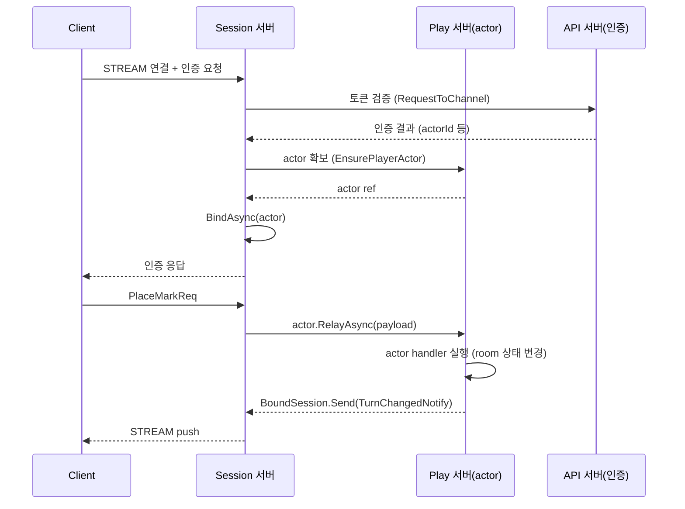

<!-- framework-adapter-nav:start -->
[문서 목록](../../../README.ko.md) | [이전: Actor & Spot 호스팅](06-actor-spot.ko.md) | [다음: STREAM — 외부 client](08-stream.ko.md)
<!-- framework-adapter-nav:end -->

# 7. Session Actor Dispatch

> 정식 계약은 [spec/aspnet-core-actor](../spec/aspnet-core-actor.ko.md)와
> [spec/session-actor-dispatch](../spec/session-actor-dispatch.ko.md)가 다룬다.
> 이 챕터는 actor 의 **binding 축** — STREAM session 에 bound 된 actor 로 client packet 을
> relay 하고, actor 가 자기 client 로 push 하는 면 — 을 다룬다. actor 모델과 spot 호스팅(location
> 축)은 [06-actor-spot](06-actor-spot.ko.md)을 먼저 본다.
>
> 🔰 actor·session·binding·Entry Spot 용어가 낯설면 [03-concepts §0](03-concepts.ko.md) 한 줄 풀이를 먼저 본다.

## 1. 배포 토폴로지 — Session·Play 분리 vs 통합

actor 를 호스팅하는 **Play 역할**과 client STREAM 을 받는 **Session 역할**은 **한 프로세스에 같이
둘 수도, 서로 다른 프로세스로 떼어 놓을 수도** 있다. 각 역할이 맡는 일은 이렇다.

- **Session** — client STREAM 을 받아 인증하고, actor 에 binding 한 뒤, client 가 보낸 packet 을
  그 actor 로 넘긴다. 게임 로직은 돌리지 않는다.
- **Play(Actor)** — actor·Entry Spot·user Spot 을 띄우고 실제 게임 로직을 돌린다.

어느 쪽으로 배포하든 로직 코드(handler·actor·spot)는 똑같다. **달라지는 건 등록 코드(§6)뿐**이다.
두 방식 모두 client 는 STREAM 하나만 들고
있으면 되고, Play 가 보내는 메시지도 그 STREAM 으로 돌아온다. 다시 접속할 때(분리 구성이면 다른
Session 서버로 붙을 수도 있다)도 binding 만 새 stream 으로 바뀔 뿐, actor 인스턴스와 spot
membership 은 그대로 남는다(actor id 만 같으면 되니 — 멱등).

### (A) 분리 — Session 서버 ↔ Play 서버 (다른 프로세스)

Session 서버는 자기 프로세스에 gateway 용 local SpotNode 하나를 두고(자동 연결), 그 gateway 가
**원격 Play 서버의 actor 로 relay 를 forward** 한다. 그래서 relay 가 네트워크를 한 번 건너간다.
(예: **Bingo** 샘플 — Session·Play·Api·Registry 를 각각
별도 서버로 운영)



### (B) 통합 — Session + Play (같은 프로세스)

한 `AddZLinkFramework` 안에 StreamNode(session)와 SpotMesh/ActorFactory(play)를 함께 두면, stream 의
gateway 가 **같은 프로세스의 그 SpotNode 로 자동 연결**된다. relay 가 프로세스 안에서 끝나
네트워크를 타지 않는다. (예: **TicTacToe** 샘플)

```csharp
builder.Services.AddZLinkFramework(options =>
{
    spot.AddActorFactory<PlayerActorFactory>("player");      // play 역할

    // session 역할 — gateway 는 같은 프로세스의 SpotNode 로 자동 연결(in-process relay)
    options.AddStreamNode("client-stream")
        .Bind("tcp://0.0.0.0:9000")
        .RegisterSession<PlaySession>();

    // play 역할 — 같은 프로세스가 spot 노드를 호스팅(= 위 stream 의 gateway 입구)
    options.AddSpotMesh("play-spot")
        .EnableRouter("tcp://0.0.0.0:9201")
        .AddEntrySpot<PlayerEntrySpot>()
        .AddSpotFactory<MatchSpot>();
});
```

> STREAM 의 actor-gateway 입구는 **같은 프로세스의 (router 가 켜진) SpotNode 로 자동 연결**된다 —
> stream 과 SpotNode 를 한 프로세스에 두면 framework 가 알아서 잇는다(별도 호출 없음). 통합·분리의
> 진짜 차이는 그 gateway 노드가 **actor 를 직접 호스팅하느냐(통합)** vs **원격 Play 노드로 forward
> 하느냐(분리)** 다. actor 의 실제 위치는 bind 된 ref 가 운반하고, gateway 노드는 그쪽으로
> relay·return 을 잇는 입구일 뿐이다.

### 장단점 — 언제 무엇을

| 기준 | (A) 분리 | (B) 통합 |
|------|----------|----------|
| session→play relay | **네트워크 홉** | **in-process**(저지연) |
| 스케일 | session·play **독립 증설**(연결 폭증 ↔ 로직 부하 각각) | **한 단위로 묶임**(따로 못 늘림) |
| 장애 격리 | 강함(역할별 프로세스) | 약함(session·play 상호 영향) |
| 운영·배포 | 프로세스가 늘고 store 배선 필요 | **한 프로세스, 단순** |
| 적합 | 대규모, 연결/로직 부하 특성이 다름, 무중단 스케일·배포 | 프로토타입·소규모·단순 게임·단일 리전 |
| 샘플 | **Bingo** | **TicTacToe** |

규모가 작거나 막 시작하는 단계면 통합(B)으로 간단하게 출발했다가, 연결 부하와 로직 부하가 서로
다른 속도로 커지면 그때 분리(A)로 나누는 게 보통이다. 이때도 로직 코드는 그대로 두고 **등록
코드만** 바꾸면 된다.

## 2. Session 서버: 인증과 relay

session 콜백은 인증을 먼저 처리하고, 인증된 actor handle 을 session 에 묶은 다음, 이후 들어오는
packet 을 그 actor 로 넘긴다(어떤 API 가 무엇을 하는지는 아래 코드 주석 참고). 이때 `payload` 는
framework `ZLinkMessage` 이며, relay API 에 그대로 넘기면 된다. 인증처럼 session 에서 직접 처리할
packet 이 여러 개라면 `IZLinkSessionPacketDispatcher<TSessionContext>` 를 주입받아 등록된 packet 만
handler 로 보낼 수 있다. dispatcher 가 `false` 를 반환한 뒤 actor 로 relay 할지, 인증 오류를 낼지,
로그만 남길지는 session 이 정한다.

```csharp
public sealed class TicTacToeSession(
    IZLinkSessionContext context,
    IZLinkSessionPacketDispatcher<IZLinkSessionContext> handlers) : IZLinkSession
{
    public IZLinkSessionContext Context { get; } = context;

    public async ValueTask OnDispatchAsync(
        ZLinkSessionDispatchContext dispatch, ZLinkMessage payload, CancellationToken ct)
    {
        if (await handlers.TryHandleAsync(context, dispatch, payload, ct))
        {
            return;
        }

        if (context.Actors.Bound.Count == 1)
        {
            // RelayAsync: 이 packet 을 bound actor 로 넘긴다.
            await context.Actors.Bound.Single().RelayAsync(payload, ct);
            return;
        }

        throw new ZLinkFrameworkException(
            ZLinkFrameworkErrorKind.ActorRouteNotFound,
            "No actor route is bound to this session packet.");
    }

    public ValueTask OnConnectedAsync(CancellationToken ct) => ValueTask.CompletedTask;
    public ValueTask OnErrorAsync(ZLinkStreamError error, CancellationToken ct)
        => ValueTask.CompletedTask;

    public ValueTask OnDisconnectedAsync(CancellationToken ct)
    {
        // session disconnect 는 bound actor 전체에 자동 전파되지 않는다.
        // 필요한 actor 에게만 actor.NotifyDisconnectedAsync(ct) 를 호출한다.
        return ValueTask.CompletedTask;
    }
}

public sealed class AuthenticateSessionPacketHandler(IZLinkActorManager actors)
    : IZLinkSessionPacketHandler<IZLinkSessionContext>
{
    public string PacketName => "auth";

    public async ValueTask HandleAsync(
        IZLinkSessionContext context,
        ZLinkSessionDispatchContext dispatch,
        ZLinkMessage payload,
        CancellationToken ct)
    {
        _ = dispatch;
        var request = payload.Decode<AuthReq>();
        ActorRef actor = await actors.GetOrCreateAsync(
            request.ActorId,
            "player",
            ct);
        // BindAsync: 인증된 actor handle 을 이 session 에 묶는다. 이후 packet 은 RelayAsync 로 이 actor 에 간다.
        await context.Actors.BindAsync(
            actor, ct);
        context.Client.Reply(new AuthRep(ok: true)).Submit();
    }
}
```

> `OnDispatchAsync` 안의 `context.Client.Reply(...)` 는 **session** 표면이다. actor request handler
> 의 응답 방식(반환값, [06 §3](06-actor-spot.ko.md))과 다르다는 점에 주의한다. STREAM session
> 작성법은 [08-stream](08-stream.ko.md)이 다룬다.

위 예제는 actor 가 **같은 프로세스**에 있어 `IZLinkActorManager.GetOrCreateAsync` 로 바로 만들고
bind 한다. actor 를 **다른 노드(Play 서버)** 가 호스팅하는 분리 토폴로지(§1 A)에서는, Play 서버에
actor 를 보장해 달라고 요청해 ref 3종을 받은 뒤, 그 값으로 `ActorRef` 를 만들어 bind 한다
(ensure-then-bind).

```csharp
// 1) Play 서버(route mesh channel)에 actor 보장을 요청 → ref 3종을 받는다([06 §2])
var ensured = await channels.RequestToChannel(
        TrackingRouteChannel, new EnsureCustomerActor(customerId))
    .Async<CustomerActorEnsured>(ct);

// 2) 받은 NodeRid/ActorId/Generation 으로 ActorRef 를 만들어 이 session 에 bind
await context.Actors.BindAsync(
    new ActorRef(
        RoutingId.From(ensured.Actor.NodeRid),
        ensured.Actor.ActorId,
        ensured.Actor.Generation),
    ct);
```

> **한 session 에 actor 가 여러 개 bind 될 수 있다.** 위 `OnDispatchAsync` 예제는 `Bound.Count == 1`
> 일 때만 relay 했지만, 한 session 이 두 개 이상 actor 에 bind 된 경우엔 어느 actor 로 보낼지
> **actor-id metadata** 로 지정하고 `Context.Actors.Find(actorId)` 로 찾아 relay 한다(metadata 는
> client 가 붙인다 — [08 §metadata](08-stream.ko.md)). actor 가 하나뿐이면 metadata 없이
> `Bound.Single()` 로, 여럿인데 metadata 가 없으면 `ActorRouteNotFound` 로 처리한다.
>
> ```csharp
> var actorId = dispatch.Metadata.Find("actor-id");
> var actor = string.IsNullOrWhiteSpace(actorId)
>     ? context.Actors.Bound.Single()             // 하나뿐이면 그걸로
>     : context.Actors.Find(actorId)              // 여럿이면 metadata 로 선택
>       ?? throw new InvalidOperationException($"actor route not found: {actorId}");
> await actor.RelayAsync(payload, ct);
> ```

## 3. Play 서버: actor 가 자기 client 로 push

Spot actor handler 는 stream 을 직접 들지 않는다. 자기 client 로 보내려면 handler 가 받은 actor 의
`Context.BoundSession` 를 쓴다. stream packet 이름과 전달 허용된 metadata 는 handler context 에
들어 있다.

```csharp
public sealed class JoinMatchActorHandler
    : IZLinkSpotActorRequestHandler<MatchSpot, PlayerActor, JoinMatchReq, JoinMatchRes>
{
    public async ValueTask<JoinMatchRes> HandleAsync(
        MatchSpot spot,
        PlayerActor actor,
        ZLinkSpotActorRequestContext context,
        JoinMatchReq request,
        CancellationToken ct)
    {
        // 같은 actor 에 묶인 client 로 push
        await actor.Context.BoundSession
            .Send(new OpponentJoinedNotify(request.MatchId))
            .Async(ct);

        // 응답 frame의 metadata/compression 옵션. 응답 body는 반환값이다.
        context.Reply
            .Metadata("trace-id", "reply-trace")
            .Compress();

        return new JoinMatchRes(request.MatchId);
    }
}
```

다른 actor 의 client 로 보내야 하면 먼저 그 actor 에게 메시지를 보낸 뒤, 해당 actor 가 자기
`Context.BoundSession` 로 client 에 push 한다. session 위치를 actor id 로 직접 조회하는 public
client 는 제공하지 않는다.

```csharp
public sealed class PlayerNotifyHandler
    : IZLinkSpotActorSendHandler<MatchSpot, PlayerActor, GameStateNotify>
{
    public ValueTask HandleAsync(
        MatchSpot spot,
        PlayerActor actor,
        ZLinkSpotActorSendContext context,
        GameStateNotify message,
        CancellationToken ct)
    {
        // 다른 actor 가 이 actor 앞으로 보낸 메시지를 받아, 자기 BoundSession 으로 client 에 push 하는 끝점.
        actor.Context.BoundSession.Send(message).Submit(ct);
        return ValueTask.CompletedTask;
    }
}
```

- `IZLinkBoundSession` 의 표면은 **`Send<TMessage>(message)`** 와 **`DisconnectAsync(...)`** 둘뿐이다.
  client 로의 push 는 단방향이며 별도의 `Request` 표면은 없다. `Send(...).Submit(...)` 은
  호출자가 응답이나 송신 수락 완료를 기다리지 않는 push 호출이다.
- `DisconnectAsync(...)` 는 응용이 거는 것이라 session 의 `OnDisconnectedAsync` 를 다시 일으키지
  않는다(stream 만 닫고 binding 정리).

## 3.5 세션 directory — actor 밖에서 특정 client 로 push

§3 의 `BoundSession.Send` 는 *actor handler 안*에서 자기 client 로 보내는 길이다. 그런데 actor 와
무관한 외부 사건(예: 다른 서비스의 publish, 관리자 명령)을 **특정 사용자의 client 로** 밀어 넣어야
할 때가 있다. framework 는 "appId 로 session 을 찾아 주는" public client 를 제공하지 않으므로,
**앱이 직접 session directory 를 들고** 푸시한다. 패턴은 세 부분이다.

**(1) 연결/해제 시 directory 에 등록·제거** — `OnConnectedAsync`/`OnDisconnectedAsync` 가 그 자리다.
session 의 key 로는 `Context.SessionId` 를 쓴다.

```csharp
public ValueTask OnConnectedAsync(CancellationToken ct)
{
    sessions.Add(Context);        // 앱이 가진 directory(예: Dictionary<sessionId, IZLinkSessionContext>)
    return ValueTask.CompletedTask;
}

public ValueTask OnDisconnectedAsync(CancellationToken ct)
{
    sessions.Remove(Context);     // 끊긴 session 은 반드시 빼 준다(메모리 누수·죽은 push 방지)
    return ValueTask.CompletedTask;
}
```

> appId(playerId 등)로 찾고 싶으면 directory 를 `Dictionary<appId, IZLinkSessionContext>` 로 두고,
> 인증 packet handler 에서 appId→`Context` 를 등록한다. 정리는 `OnDisconnectedAsync` 에서 한다.

**(2) directory 로 찾아 `Context.Client.Send(...)` 로 push** — `Reply(...)` 가 아니라 `Send(...)` 다
(요청에 대한 응답이 아니라 server 가 먼저 보내는 단방향 push). packet 이름은 `.PacketName(...)` 으로
명시한다.

```csharp
if (sessions.TryGet(playerId, out var session))
{
    session.Client.Send(new QuestProgressNotify(playerId, progress))
        .PacketName("QuestProgress")    // client 가 이 이름으로 받는다
        .Submit();
}
```

**(3) 죽은 session 정리** — 이미 끊긴 session 은 `OnDisconnectedAsync` 에서 directory 에서 뺀다.
push 호출부가 송신 수락 결과를 기다려 stale entry 를 정리하는 패턴을 만들지 않는다.

```csharp
public ValueTask OnDisconnectedAsync(CancellationToken ct)
{
    sessions.Remove(Context);   // 끊긴 session — directory 에서 제거
    return ValueTask.CompletedTask;
}
```

### publish handler → session push 브리지

흔한 조합은 **fanout channel 의 publish 를 받아 위 directory 로 흘려보내는** 것이다. publish
handler 가 메시지를 받아, 구독 중인 session 들에 `Context.Client.Send` 로 push 한다(이러면 다른
서비스가 publish 한 이벤트가 특정 client 들에게 전달된다).

```csharp
public sealed class DeliveryStatusFanoutHandler(CustomerSessionDirectory sessions)
    : IZLinkPublishHandler<DeliveryStatusNotify>
{
    public ValueTask HandleAsync(DeliveryStatusNotify message, ZLinkPublishContext context, CancellationToken ct)
        => sessions.PublishAsync(message, ct);   // directory 가 구독 session 들로 Client.Send fan-out
}
```

## 4. resolver — 위치 조회는 주소 하나로

session relay 는 actor id/type logical handle 과 core SessionRelay 를 사용한다. actor 가 어느
spot 에 있는지 조회하고 싶으면 `IZLinkActorLocationResolver.ResolveActorSpotAddressAsync(
actorType, actorId)` 를 쓴다 — location store 를 읽어 actor 가 위치한 spot 의 주소
(`ZLinkSpotAddress`)를 돌려준다(재연결 시 "있으면 re-bind, 없으면 생성" 판단이 대표 사용처,
[09-location §4](09-location.ko.md)). 반면 **actor↔session binding 은 framework 내부 상태**라
조회용 public 표면이 없다 — actor 가 client 로 push 할 때는 `Context.BoundSession` 을 쓰면 된다.

spot rid → 주소 변환을 기본(location store) 대신 직접 구현으로 바꾸고 싶을 때만
`AddSpotRemoteAddressResolver<T>()` 를 등록한다. `JoinSpot(spotRid, ...)` 가 노드 경계를 넘을 때
이 변환이 쓰인다.

## 5. 오류 처리 — `ZLinkFrameworkException`

framework 가 던지는 actor/spot/session 관련 오류는 `ZLinkFrameworkException` 에
`Kind`(`ZLinkFrameworkErrorKind`) 로 담긴다.

| Kind (일부) | 의미 |
|-------------|------|
| `ActorRouteNotFound` | actor 를 찾을 수 없거나 session relay 경로를 열 수 없음 |
| `ActorAlreadyExists` / `ActorTypeMismatch` | actor 생성 충돌 |
| `SpotCreateFailed` / `SpotRouteNotFound` / `SpotTypeMismatch` | spot 생성, route 조회, 타입 충돌 |
| `ActorSessionNotBound` | push 할 bound session 이 없음 |
| `HandlerNotFound` / `ActorDispatchHandlerNotFound` / `PayloadDecodeFailed` | handler dispatch 또는 payload decode 실패 |
| `RouteNotConnected` / `RequestTargetNotFound` / `RequestRejected` / `RequestProtocolError` / `RequestFailed` | request/route 하부 실패 매핑 |

`IsRetriable` 는 분류 힌트일 뿐 framework 가 자동 retry 하지 않는다. retry 루프를 이 값으로 만들지 않는다.

## 6. 등록 코드

session relay 는 application route mesh channel 로 흐르지 않는다. STREAM session 의 actor-gateway
입구는 **같은 프로세스의 (router 가 켜진) local SpotNode 로 자동 연결**된다(별도 호출 없음).
`BindAsync(...)` 가 local actor ref 또는 Play 서버가 발급한 remote actor locator 를 core SessionRelay
경로에 bind 하므로, session handler 는 route mesh channel 이름이나 router socket 을 알 필요가 없다.

> 아래는 **(A) 분리** 방식의 등록 코드(두 프로세스)다. **(B) 통합**은 이 둘을 한
> `AddZLinkFramework` 로 합친다 — 코드는 §1 (B) 스니펫을 참고한다.

### Session 서버

```csharp
builder.Services.AddZLinkFramework(options =>
{
    // STREAM session 의 actor-gateway 입구로 쓸 local SpotNode (router 만 있으면 됨)
    options.AddSpotMesh("game.session")
        .EnableRouter("tcp://0.0.0.0:9101")
        .SetRoutingId(sessionNodeRid);

    options.AddStreamNode("client-stream")   // gateway 는 위 game.session 노드로 자동 연결
        .Bind("tcp://0.0.0.0:9000")
        .RegisterSession<TicTacToeSession>();
});
```

### Play(Actor) 서버

```csharp
builder.Services.AddZLinkFramework(options =>
{

    spot.AddActorFactory<PlayerActorFactory>("player");  // actor 와 Spot 은 Play 서버가 호스팅(Session 서버엔 이 factory 가 없다)

    {
        var mesh =     options.AddSpotMesh("game.match");
        {
            var node = mesh;
            node.EnableRouter("tcp://0.0.0.0:9201");
            node.AddEntrySpot<PlayerEntrySpot>();  // Entry Spot 은 노드당 1개(actor 가 처음 머무는 곳)
            node.AddSpotFactory<MatchSpot>();      // user Spot 은 factory 로 요청마다 동적 생성

        }

    }
});
```

> 노드 등록 시그니처는 [spec/aspnet-core-actor](../spec/aspnet-core-actor.ko.md)와 샘플 코드를
> 기준으로 확인한다.

## 7. 더 보기

- actor 모델·spot 호스팅 콜백(location 축): [06-actor-spot](06-actor-spot.ko.md)
- bound session push 계약: [12-interface-catalog](12-interface-catalog.ko.md) §5.2 — 검증 클래스 `StreamContracts`
- 정식 계약: [spec/aspnet-core-actor](../spec/aspnet-core-actor.ko.md), [spec/session-actor-dispatch](../spec/session-actor-dispatch.ko.md)
- 전체 예제: [tictactoe 샘플](samples/tictactoe-game-sample.ko.md), [bingo 샘플](samples/bingo-game-sample.ko.md)
- 외부 client 를 STREAM 으로 받는 법: [08-stream](08-stream.ko.md)

---
<!-- framework-adapter-nav:bottom:start -->
[문서 목록](../../../README.ko.md) | [이전: Actor & Spot 호스팅](06-actor-spot.ko.md) | [다음: STREAM — 외부 client](08-stream.ko.md)
<!-- framework-adapter-nav:bottom:end -->
