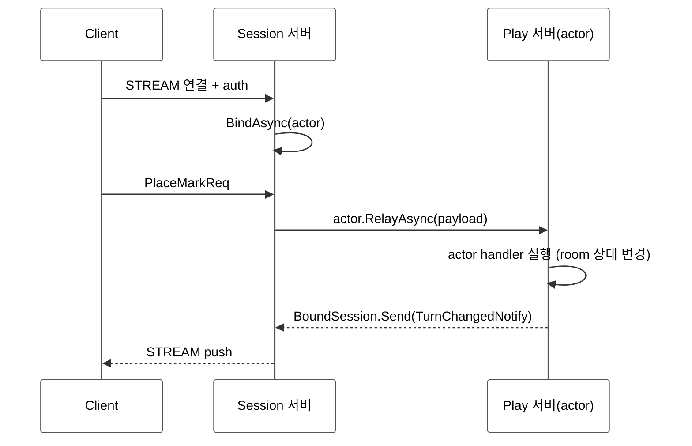

<!-- framework-adapter-nav:start -->
[문서 목록](../../../README.ko.md) | [이전: Actor & Spot 호스팅](06-actor-spot.ko.md) | [다음: STREAM — 외부 client](08-stream.ko.md)
<!-- framework-adapter-nav:end -->

# 7. Session Actor Dispatch

> 정식 계약은 [spec/aspnet-core-actor](../spec/aspnet-core-actor.ko.md)와
> [spec/session-actor-dispatch](../spec/session-actor-dispatch.ko.md)가 다룬다.
> 이 챕터는 actor 의 **binding 축** — STREAM session 에 bound 된 actor 로 client packet 을
> relay 하고, actor 가 자기 client 로 push 하는 면 — 을 다룬다. actor 모델과 spot 호스팅(location
> 축)은 [06-actor-spot](06-actor-spot.ko.md)을 먼저 본다.
>
> 🔰 actor·session·binding·Entry Spot 용어가 낯설면 [03-concepts §0](03-concepts.ko.md) 한 줄 풀이를 먼저 본다.

## 1. 연결 서버와 로직 서버 분리

큰 게임 서버는 보통 두 역할로 나눈다.

- **Session 서버** — client STREAM 연결만 받는다(인증, actor binding, client 요청 relay). 게임
  로직은 돌리지 않는다.
- **Play(Actor) 서버** — actor, Entry Spot, user Spot 을 호스팅하고 실제 로직을 돌린다.

client 는 STREAM 하나만 유지하고, Play 서버가 보내는 메시지도 그 STREAM 으로 되돌아간다.
재접속(다른 Session 서버일 수도 있음) 시 binding 만 새 stream 으로 교체되고 actor 인스턴스와 spot
membership 은 그대로 유지된다(actor id 기준 멱등).



## 2. Session 서버: 인증과 relay

session 콜백은 인증을 먼저 처리하고, 인증된 actor handle 을 session 에 묶은 다음, 이후 들어오는
packet 을 그 actor 로 넘긴다(어떤 API 가 무엇을 하는지는 아래 코드 주석 참고). 이때 `payload` 는
framework `ZLinkMessage` 이며, relay API 에 그대로 넘기면 된다. 인증처럼 session 에서 직접 처리할
packet 이 여러 개라면 `IZLinkSessionPacketDispatcher<TSessionContext>` 를 주입받아 등록된 packet 만
handler 로 보낼 수 있다. dispatcher 가 `false` 를 반환한 뒤 actor 로 relay 할지, 인증 오류를 낼지,
로그만 남길지는 session 이 정한다.

```csharp
public sealed class TicTacToeSession(
    IZLinkSessionContext context,
    IZLinkSessionPacketDispatcher<IZLinkSessionContext> handlers) : IZLinkSession
{
    public IZLinkSessionContext Context { get; } = context;

    public async ValueTask OnDispatchAsync(
        ZLinkSessionDispatchContext dispatch, ZLinkMessage payload, CancellationToken ct)
    {
        if (await handlers.TryHandleAsync(context, header, payload, ct))
        {
            return;
        }

        if (context.Actors.Bound.Count == 1)
        {
            // RelayAsync: 이 packet 을 bound actor 로 넘긴다.
            await context.Actors.Bound.Single().RelayAsync(payload, ct);
            return;
        }

        throw new ZLinkFrameworkException(
            ZLinkFrameworkErrorKind.ActorRouteNotFound,
            "No actor route is bound to this session packet.");
    }

    public ValueTask OnConnectedAsync(CancellationToken ct) => ValueTask.CompletedTask;
    public ValueTask OnErrorAsync(ZLinkStreamError error, CancellationToken ct)
        => ValueTask.CompletedTask;

    public ValueTask OnDisconnectedAsync(CancellationToken ct)
    {
        // session disconnect 는 bound actor 전체에 자동 전파되지 않는다.
        // 필요한 actor 에게만 actor.NotifyDisconnectedAsync(ct) 를 호출한다.
        return ValueTask.CompletedTask;
    }
}

public sealed class AuthenticateSessionPacketHandler(IZLinkActorManager actors)
    : IZLinkSessionPacketHandler<IZLinkSessionContext>
{
    public string PacketName => "auth";

    public async ValueTask HandleAsync(
        IZLinkSessionContext context,
        ZLinkSessionDispatchContext dispatch,
        ZLinkMessage payload,
        CancellationToken ct)
    {
        _ = header;
        var request = payload.Decode<AuthReq>();
        ActorRef actor = await actors.GetOrCreateAsync(
            request.ActorId,
            "player",
            ct);
        // BindAsync: 인증된 actor handle 을 이 session 에 묶는다. 이후 packet 은 RelayAsync 로 이 actor 에 간다.
        await context.Actors.BindAsync(
            actor, ct);
        await context.Client.Reply(new AuthRep(ok: true)).Async();
    }
}
```

> `OnDispatchAsync` 안의 `context.Client.Reply(...)` 는 **session** 표면이다. actor request handler
> 의 응답 방식(반환값, [06 §3](06-actor-spot.ko.md))과 다르다는 점에 주의한다. STREAM session
> 작성법은 [08-stream](08-stream.ko.md)이 다룬다.

## 3. Play 서버: actor 가 자기 client 로 push

Spot actor handler 는 stream 을 직접 들지 않는다. 자기 client 로 보내려면 handler 가 받은 actor 의
`Context.BoundSession` 를 쓴다. stream packet 이름과 전달 허용된 metadata 는 handler context 에
들어 있다.

```csharp
public sealed class JoinMatchActorHandler
    : IZLinkSpotActorRequestHandler<MatchSpot, PlayerActor, JoinMatchReq, JoinMatchRes>
{
    public async ValueTask<JoinMatchRes> HandleAsync(
        MatchSpot spot,
        PlayerActor actor,
        ZLinkSpotActorRequestContext context,
        JoinMatchReq request,
        CancellationToken ct)
    {
        // 같은 actor 에 묶인 client 로 push
        await actor.Context.BoundSession
            .Send(new OpponentJoinedNotify(request.MatchId))
            .Async(ct);

        // 응답 frame의 metadata/compression 옵션. 응답 body는 반환값이다.
        context.Reply
            .Metadata("trace-id", "reply-trace")
            .Compress();

        return new JoinMatchRes(request.MatchId);
    }
}
```

다른 actor 의 client 로 보내야 하면 먼저 그 actor 에게 메시지를 보낸 뒤, 해당 actor 가 자기
`Context.BoundSession` 로 client 에 push 한다. session 위치를 actor id 로 직접 조회하는 public
client 는 제공하지 않는다.

```csharp
public sealed class PlayerNotifyHandler
    : IZLinkSpotActorSendHandler<MatchSpot, PlayerActor, GameStateNotify>
{
    public ValueTask HandleAsync(
        MatchSpot spot,
        PlayerActor actor,
        ZLinkSpotActorSendContext context,
        GameStateNotify message,
        CancellationToken ct)
        // 다른 actor 가 이 actor 앞으로 보낸 메시지를 받아, 자기 BoundSession 으로 client 에 push 하는 끝점.
        => actor.Context.BoundSession.Send(message).Async(ct);
}
```

- `IZLinkBoundSession` 의 표면은 **`Send<TMessage>(message)`** 와 **`DisconnectAsync(...)`** 둘뿐이다.
  client 로의 push 는 단방향이며 별도의 `Request` 표면은 없다. `Send(...).Async(...)` 은
  fire-and-forget(route 위임 완료이지 client app ack 이 아님)이다.
- `DisconnectAsync(...)` 는 응용이 거는 것이라 session 의 `OnDisconnectedAsync` 를 다시 일으키지
  않는다(stream 만 닫고 binding 정리).

## 4. resolver — Spot lookup 만 public

session relay 는 actor id/type logical handle 과 core ActorGateway 를 사용한다. actor 위치 조회용
public resolver 는 없다(actor↔session binding 은 framework 내부 상태).

| 등록 | 역할 |
|------|------|
| `options.UseRegistrySpotRemoteAddresses("game")` | spot owner 조회 + spot 이름 directory |

Redis/DB 같은 별도 저장소가 필요하면 spot remote address resolver 만 custom 으로 등록한다:
`AddSpotRemoteAddressResolver<T>()`. actor-session binding 은 session bind 시 actor runtime state 에
저장되는 framework 내부 상태다.

`IZLinkSpotRemoteAddressResolver` 는 `JoinSpot(spotRid, ...)` 가 노드 경계를 넘을 때만 필요하다.

## 5. 오류 처리 — `ZLinkFrameworkException`

framework 가 던지는 actor/spot/session 관련 오류는 `ZLinkFrameworkException` 에
`Kind`(`ZLinkFrameworkErrorKind`) 로 담긴다.

| Kind (일부) | 의미 |
|-------------|------|
| `ActorRouteNotFound` | actor 를 찾을 수 없거나 ActorGateway relay 경로를 열 수 없음 |
| `ActorAlreadyExists` / `ActorTypeMismatch` | actor 생성 충돌 |
| `SpotCreateFailed` / `SpotRouteNotFound` / `SpotTypeMismatch` | spot 생성, route 조회, 타입 충돌 |
| `ActorSessionNotBound` | push 할 bound session 이 없음 |
| `HandlerNotFound` / `ActorDispatchHandlerNotFound` / `PayloadDecodeFailed` | handler dispatch 또는 payload decode 실패 |
| `RouteNotConnected` / `RequestTargetNotFound` / `RequestRejected` / `RequestProtocolError` / `RequestFailed` | request/route 하부 실패 매핑 |

`IsRetriable` 는 분류 힌트일 뿐 framework 가 자동 retry 하지 않는다. retry 루프를 이 값으로 만들지 않는다.

## 6. 등록 골격

session relay 는 application route mesh channel 로 흐르지 않는다. STREAM session 이 쓸 local
SpotNode 를 `AttachActorGateway(...)` 로 지정하면, `BindAsync(...)` 가 local actor ref 또는 Play
서버가 발급한 remote actor locator 를 core ActorGateway 경로에 bind 한다. 그래서 session handler 는
route mesh channel 이름이나 router socket 을 알 필요가 없다.

### Session 서버

```csharp
builder.Services.AddZLinkFramework(options =>
{
    // STREAM session 이 사용할 local SpotNode (ActorGateway ingress)
    options.AddSpotMesh("game.session")
        .AddNode("session-node")
        .EnableRouter("tcp://0.0.0.0:9101")
        .SetRouterRoutingId(sessionNodeRid);

    options.AddStreamNode("client-stream")
        .AttachActorGateway("session-node")   // 이 stream 의 relay 대상 SpotNode
        .Bind("tcp://0.0.0.0:9000")
        .RegisterSession<TicTacToeSession>();

    options.UseRegistrySpotRemoteAddresses("game");
});
```

### Play(Actor) 서버

```csharp
builder.Services.AddZLinkFramework(options =>
{
        options.UseDiscovery().AddRegistryEndpoint("tcp://registry1:5551");

    options.AddActorFactory<PlayerActorFactory>("player");  // actor 와 Spot 은 Play 서버가 호스팅(Session 서버엔 이 factory 가 없다)

    {
        var mesh =     options.AddSpotMesh("game.match");
                mesh.UseDiscovery().AddRegistryEndpoint("tcp://registry1:5551");
        {
            var node =         mesh.AddNode("play-node");
            node.EnableRouter("tcp://0.0.0.0:9201");
            node.AddEntrySpot<PlayerEntrySpot>();  // Entry Spot 은 노드당 1개(actor 가 처음 머무는 곳)
            node.AddSpotFactory<MatchSpot>();      // user Spot 은 factory 로 요청마다 동적 생성

        }

    }

    options.UseRegistrySpotRemoteAddresses("game");
});
```

> 노드 등록 시그니처는 [spec/aspnet-core-actor](../spec/aspnet-core-actor.ko.md)와 샘플 코드를
> 기준으로 확인한다.

## 7. 더 보기

- actor 모델·spot 호스팅 콜백(location 축): [06-actor-spot](06-actor-spot.ko.md)
- bound session push 계약: [12-interface-catalog](12-interface-catalog.ko.md) §5.2 — 검증 클래스 `StreamContracts`
- 정식 계약: [spec/aspnet-core-actor](../spec/aspnet-core-actor.ko.md), [spec/session-actor-dispatch](../spec/session-actor-dispatch.ko.md)
- 전체 예제: [tictactoe 샘플](samples/tictactoe-game-sample.ko.md), [bingo 샘플](samples/bingo-game-sample.ko.md)
- 외부 client 를 STREAM 으로 받는 법: [08-stream](08-stream.ko.md)

---
<!-- framework-adapter-nav:bottom:start -->
[문서 목록](../../../README.ko.md) | [이전: Actor & Spot 호스팅](06-actor-spot.ko.md) | [다음: STREAM — 외부 client](08-stream.ko.md)
<!-- framework-adapter-nav:bottom:end -->
