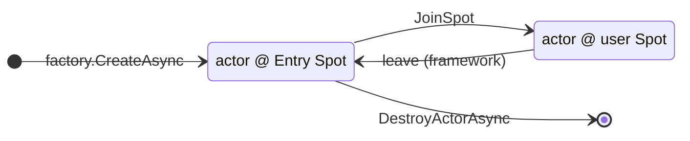
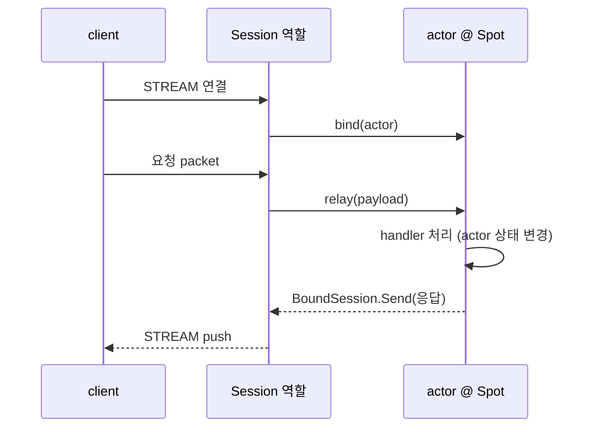
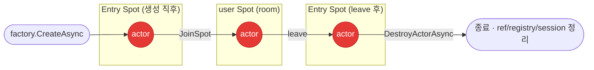
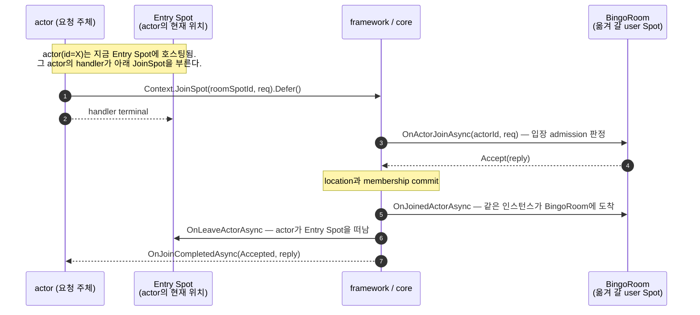
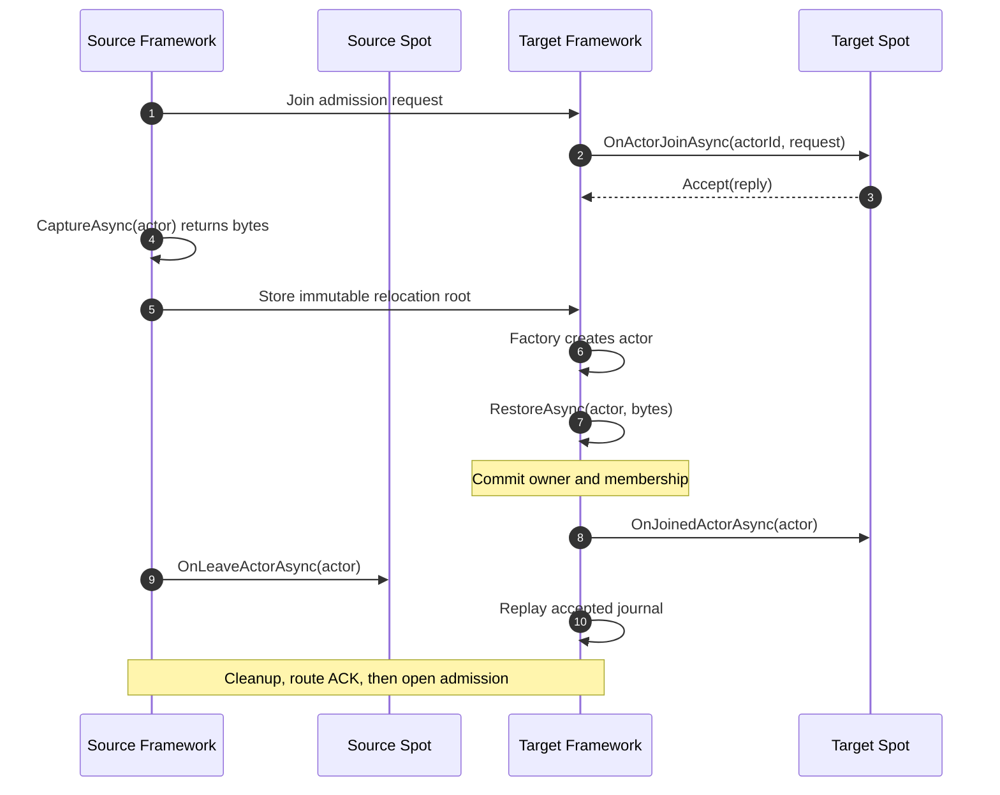

<!-- framework-adapter-nav:start -->
[문서 목록](../../../README.ko.md) | [이전: SPOT](06-spot.ko.md) | [다음: Session Actor Dispatch](08-actor-session.ko.md)
<!-- framework-adapter-nav:end -->

# 7. Actor & Spot 호스팅

> 정식 계약은 [spec/aspnet-core-actor](../../common/spec/server/languages/dotnet/02-handler-interfaces.ko.md)가 다룬다.
> 이 챕터는 actor 모델과 **Spot이 actor를 호스팅하는 면(location 축)** — 즉 spot 쪽에
> 호출되는 actor lifecycle 콜백과 그 콜백을 부르는 트리거 함수 — 를 다룬다.
> session ↔ actor relay(binding 축)는 [08-actor-session](08-actor-session.ko.md)이 다룬다.
> [06-spot](06-spot.ko.md)을 먼저 읽었다고 가정한다.
>
> 🔰 actor·session·Entry Spot 용어가 낯설면 [03-concepts §0](03-concepts.ko.md) 한 줄 풀이를 먼저 본다.

## 1. actor 란

actor는 **ID로 식별되는 상태 보유 객체**다. 같은 `ActorId`로 들어오는 메시지는 항상 **같은
인스턴스**가 처리한다(일반 handler는 stateless 라 메시지마다 새로 resolve 된다). 게임에서 한
플레이어, 한 session의 진행 상태를 담기에 맞다.

호출자는 actor가 어느 MeshNode/Spot에 있는지 몰라도 된다. `actorId` 만으로 호출하면 routing은
framework가 등록된 resolver로 푼다.

actor **하나**를 볼 때 서로 독립인 **두 속성**이 있다.

- **위치(location)** — 이 actor가 **어느 Spot에 존재하는가**. Entry Spot(생성 직후 기본) ↔ user Spot.
- **binding** — 이 actor에 **어느 client의 연결이 설정되어 있는가**. `bind`는 client의 STREAM
  session을 actor에 이어 주는 것이다. bound 되면 그 client가 보낸 packet이 이 actor로 들어오고,
  actor가 보낸 메시지는 그 session을 타고 같은 client로 돌아간다 — **client 연결 하나 ↔ actor
  하나를 잇는 선**이라고 보면 된다.

| 속성 | 값 | 바꾸는 트리거 | 다루는 곳 |
|----|------|------|----------|
| **위치(location)** | Entry Spot ↔ user Spot | `JoinSpot` / `leave` | **이 챕터(§3)** |
| **binding** | unbound ↔ client STREAM session에 bound | `bind` / `disconnect·unbind` | [08-actor-session](08-actor-session.ko.md) |

두 속성은 **완전히 독립**이다. user Spot에 join 하는 데 client bind가 필요 없고, 반대로 client가
끊겨 unbound가 돼도 actor의 위치·상태는 그대로 남는다(같은 `actorId`로 다시 연결하면 새 session이
같은 actor에 bind 될 뿐이다). 그래서 actor는 **두 가지 모습**으로 동작한다.

**(A) session 없이 사용하는 경우 — spot이 actor를 호스팅한다.** client가 연결되지 않아도 actor는
유지되고, `actorId` routing으로 다른 actor·handler가 호출한다. 바뀌는 건 **어느 Spot에 존재하는지**뿐이다.



- 생성 직후 **Entry Spot**, `JoinSpot`으로 user Spot(room)에 들어가고 framework가 `leave`로 되돌린다.
- destroy는 **Entry Spot 에서만** 가능하다(user Spot 이면 먼저 `leave`). 여기엔 client가 없다.

**왜 client 없이 존재하는 actor가 필요한가.** binding은 "지금 이 actor를 누가 조종하느냐"일 뿐,
actor의 존재 이유가 아니다. client를 연결하지 않고 유지하는 대표 경우는 둘이다.

- **재접속 사이 상태 유지** — 연결이 잠깐 끊겨도 진행 상태·위치는 그대로 남고, 재접속하면 새
  session이 **같은 actor** 에 다시 bind 된다. TicTacToe·Bingo는 disconnect 때 actor를 지우지
  않고 `MarkDisconnected`만 호출해 두고, SupportChat은 conversation membership을 actor에 묶어
  둬서 재접속한 client가 상태만 다시 fetch 하면 이어가게 한다.
- **서버 내부 로직이 구동하는 상태 객체** — client 요청이 아니라 다른 actor·handler가 `actorId`
  routing으로 호출하는 대상. 대표적으로 **봇/NPC** 를 이렇게 만든다. 사람 client를 bind 하는
  대신 서버 로직(또는 spot 타이머)이 같은 player actor를 `actorId`로 구동해 수를 두면, **사람과
  봇을 같은 actor 타입으로 한 room에 섞을 수 있다** — 상대편 입장에선 bound 여부를 몰라도 된다.

**(B) client session에 bind — client 요청을 그 actor가 처리한다 (binding 축, [07](08-actor-session.ko.md)).**
Session 역할이 client STREAM을 받아 actor에 `bind` 하면, client packet이 그 actor로 relay 되고
actor가 처리한 결과가 같은 session을 타고 client로 돌아간다. actor는 (A)와 **같은 인스턴스**로,
Entry/user 어느 Spot에 있든 bind 될 수 있다.



- client는 STREAM 하나만 사용하면 된다. actor가 어느 Spot에 존재하는지는 client가 몰라도 된다.
- client가 끊겨도 actor·spot membership은 그대로 — 재접속하면 새 session이 같은 actor에 다시 bind 된다.

framework가 자동으로 관리하는 것: Entry Spot 생성/소멸, user Spot에서 Entry Spot으로 leave.
session disconnect는 actor membership을 바꾸지 않는다. actor에게 끊김을 알려야 하면 어플리케이션에서
대상 actor를 선택해서 `NotifyDisconnectedAsync(...)`를 호출한다.

actor 객체를 끝내려면 actor를 Entry Spot에 둔 뒤 `IZLinkEntrySpotContext.DestroyActorAsync(actor)`
를 호출한다. 이 호출은 lifecycle callback을 호출하지 않고 native actor ref, framework registry,
bound session mapping을 정리한다. user Spot에 있는 actor를 직접 destroy 할 수 없으므로 room
안에서는 먼저 leave를 완료해야 한다.

수명주기를 시간순으로 한눈에 보면 아래와 같다. 두 **Entry Spot** 박스는 같은 Entry Spot을 시점만
달리 표시한 것이다.



- 생성은 **Entry Spot** 에서 시작하고, room 진입은 `JoinSpot`, room 이탈은 `leave` 다.
- **destroy는 Entry Spot 에서만** 가능하다. user Spot에 있으면 `leave`로 Entry Spot에 돌아온 뒤에야
  destroy 할 수 있어서, 경로는 항상 **user Spot → leave → Entry Spot → destroy** 를 지난다.

## 2. actor 등록과 작성

actor는 factory로 만든다. factory는 `actorType` 짧은 문자열로 등록한다.

```csharp
builder.Services.AddZLinkFramework(options =>
{
    var objectServer = options.AddRouteMesh("play-spots").Objects().Server();
    objectServer.AddActorFactory<PlayerActor, PlayerActorFactory>(
        "player",                                        // GetOrCreate가 factory를 선택하는 stable actor type이다.
        placement: null,
        ZLinkRelocationPolicy<PlayerActor>
            .Snapshot<PlayerActorRelocationAdapter>()); // cross-node 이동에서 opaque state를 보존한다.
    // Entry Spot / user Spot 등록(AddEntrySpot / AddSpotFactory)은 MeshNode 쪽에서
    // ([08-actor-session](08-actor-session.ko.md) §6 등록 코드)
});

public sealed class PlayerActorFactory : IZLinkActorFactory<PlayerActor>
{
    public ValueTask<PlayerActor> CreateAsync(
        string actorId, IZLinkActorContext context, CancellationToken ct)
        // 같은 actorId는 framework가 한 인스턴스만 유지 — CreateAsync는 그 actorId의 최초 1회만 불린다.
        => ValueTask.FromResult(new PlayerActor(actorId, context));
}

public sealed class PlayerActor(string actorId, IZLinkActorContext context)
    : IZLinkActor
{
    public string ActorId { get; } = actorId;
    public IZLinkActorContext Context { get; } = context;
}
```

actor 안에서의 spot join과 현재 상태 조회는 주입된 `IZLinkActorContext`로 한다. channel outbound
는 actor context의 기능이 아니며, Entry Spot 또는 user Spot handler에서 받은 spot context로
호출한다.

| `IZLinkActorContext` 멤버 | 용도 |
|---------------------------|------|
| `SpotId?` | 현재 Spot join 상태 조회. `null`이면 어느 User Spot에도 참여하지 않은 상태다. |
| `BoundSession` | 자기 client로 push ([08-actor-session §3](08-actor-session.ko.md)) |
| `JoinSpot(spotId, requestMessage)` | User Spot join intent를 만들며 현재 handler에서 `.Defer()`로 등록한다. |
| `JoinEntrySpot(requestMessage)` | Framework가 선택한 Entry Spot으로 이동할 intent를 만들며 현재 handler에서 `.Defer()`로 등록한다. |

`JoinSpot`/`JoinEntrySpot`은 admission deadline을 바꾸는 `Timeout(...)`을 제공한다. 생략하면 기본
5초를 사용한다. Join call은 결과를 기다리는 `Async(...)`·`Yield(...)`를 제공하지 않는다.

join 호출은 현재 Actor handler의 후속 작업으로 등록한다. Handler가 정상적으로 끝나면 Framework가
등록된 intent를 실행하고, 실패하거나 취소되면 같은 handler에서 등록한 intent를 모두 폐기한다. Join의
승인·거절·실패 결과는 Actor의 `OnJoinCompletedAsync(...)`로 전달한다. Handler에서 결과를 기다리면
Actor 실행 turn과 Spot admission이 서로를 기다릴 수 있으므로 지원하지 않는다.

`spotId`는 Location Store 전체에서 유일한 UTF-8 string logical ID다. `matchId`나 `roomId` 같은
domain 값을 그대로 사용할 수 있으며 `RoutingId`로 변환하지 않는다. `RoutingId`는 실제 transport
endpoint인 MeshNode의 `NodeRid`에만 사용한다.

### actor 생성·보장 — `IZLinkActorManager.GetOrCreateAsync`

actor를 처음 만들거나(있으면 재사용) 보장하는 진입점은 `IZLinkActorManager.GetOrCreateAsync` 다.
보통 일반 채널 handler에서 부른다. 생성 요청 payload를 넘기면 그것이 Entry Spot의
`OnCreateActorAsync`로 전달된다(§3). 반환값은 그 actor를 가리키는 **ref 3종(`NodeRid`·`ActorId`·
`Generation`)** 이라, 이후 session이 이 값으로 actor에 bind 한다([07 §2](08-actor-session.ko.md)).

```csharp
public sealed class EnsureCustomerActorHandler(IZLinkActorManager actors)
    : IZLinkRequestHandler<EnsureCustomerActor, CustomerActorEnsured>
{
    public async ValueTask<CustomerActorEnsured> HandleAsync(
        EnsureCustomerActor request, IZLinkMessageContext context, CancellationToken ct)
    {
        var actor = await actors.GetOrCreateAsync(
            request.CustomerId,                 // actorId (domain id)
            SampleNames.CustomerActorType,      // §2 factory 등록 키("player" 같은 actorType)
            request,                            // createReq → Entry Spot의 OnCreateActorAsync로 전달(선택)
            ct);

        // 반환된 ref 3종을 session bind 용으로 돌려준다
        return new CustomerActorEnsured(request.CustomerId,
            new ActorRefSnapshot(actor.NodeRid, actor.ActorId, actor.Generation));
    }
}
```

> create payload가 필요 없으면 `GetOrCreateAsync(actorId, actorType, ct)` 오버로드를 쓴다.
>
### `ObjectGeneration` — 같은 ID의 새 incarnation을 구분하는 세대 번호

`ActorRef.ObjectGeneration`은 같은 Actor ID를 delete한 뒤 다시 만들었는지 판별하는 fencing token이다.
Same-node join과 cross-node relocation에서는 logical incarnation이 유지되므로 증가하지 않는다.
Relocation은 내부 `AuthorityOwnerGeneration`을 증가시키지만 이 값은 public `ActorRef`에 노출하지 않는다.

일반 messaging은 global Actor ID로 current owner를 resolve한다. Relocation 직후 이전 route로 도착한 message는
기본 30초 `RelocationForwardingWindow` 안에서 committed source→target mapping으로 relay할 수 있다. Exact
destroy 같은 mutation은 `ActorRef`의 `ObjectGeneration`을 검사하며, Actor를 delete한 뒤 같은 ID로 새로 만든
경우 이전 ref는 새 incarnation을 변경하지 못한다.

fencing 규칙 전체는 [spec/aspnet-core-location](../../common/spec/server/languages/dotnet/01-system-structure.ko.md)이 다룬다.

> 30초는 `RelocationForwardingWindow`의 기본값이다. 값을 늘리면 stale route를 더 오래
> 흡수하는 대신 source node가 forwarding mapping을 더 오래 보관한다. 이 값은 bound
> session의 packet 순서 보장과는 무관하다.

## 3. Spot이 actor를 호스팅 — 콜백과 트리거 함수

Spot이 `IZLinkSpot<TActor>`(user Spot) 또는 `IZLinkEntrySpot<TActor>`(Entry Spot)를 구현하면,
framework가 actor lifecycle의 특정 시점마다 그 Spot의 **콜백 메서드**를 부른다. 각 콜백은
**누가 무엇을 호출했을 때 불리는지(트리거 함수)** 가 정해져 있다. 콜백은 그 Spot의 단일 실행
큐에서 직렬로 돌므로 room 상태를 lock 없이 만질 수 있다.

### 콜백 ↔ 트리거 함수

| spot-side 콜백 | 언제(트리거) | Entry Spot | user Spot |
|----------------|---------------|:----------:|:---------:|
| `OnCreateActorAsync(actor, createReq, ct)` | factory가 actor를 **최초 생성**할 때(`IZLinkActorManager.GetOrCreateAsync`) | ✅ 전용 | — |
| `OnActorJoinAsync(actorId, req, ct) → ZLinkSpotActorJoinResult` | Actor의 `Context.JoinSpot(spotId, req)` — User Spot의 **admission 결정 지점**(Accept/Reject). Actor instance나 route 정보 없이 Actor ID만 받는다 | — | ✅ |
| `OnJoinedActorAsync(actor, ct)` | membership commit이 끝난 뒤 join 완료를 알릴 때 | ✅ | ✅ |
| `OnLeaveActorAsync(actor, ct)` | actor가 **그 Spot을 떠날 때** — 다른 Spot으로 join(Entry→room 포함) 또는 `LeaveActorAsync`/framework leave | ✅ | ✅ |
| `OnDisconnectActorAsync(actor, ct)` | 어플리케이션이 그 actor에 `NotifyDisconnectedAsync(...)` | ✅ | ✅ |
| actor packet handler | session이 bound actor로 `actorRef.RelayAsync(payload)`(→ [07 §1](08-actor-session.ko.md)) | ✅ | ✅ |

> **admission은 `OnActorJoinAsync`의 반환값으로 정한다.** `ZLinkSpotActorJoinResult.Accept(reply)`
> 면 통과, `Reject(reply)` 면 거부다. reply `ZLinkMessage`는 Actor의
> `OnJoinCompletedAsync(...)` completion에 포함된다.
> **reply는 선택**이라, 돌려줄 게 없으면 인자 없는 `Accept()` / `Reject()`를 쓴다(샘플의 흔한 형태:
> User Spot이 별도 reply를 만들지 않으면 `Accept()`, 조건이 맞지 않으면 `Reject()`).
> 이 콜백은 admission만 담당한다. 여기서 membership 확정, location 확정, client event 발행, actor
> instance 변경을 하지 않는다. 그런 처리는 join이 확정된 뒤 `OnJoinedActorAsync`에서 한다.

> **`OnCreateActorAsync`는 Entry Spot 전용**이다(actor가 처음 머무는 곳). user Spot은 이미 만들어진
> actor가 join으로 들어오므로 create 콜백이 없다.

### actor 이동 — 무슨 일이 일어나나 (로컬 vs 크로스노드)

`JoinSpot`으로 actor가 한 Spot에서 다른 Spot으로 옮길 때, 대상 Spot이 **같은 MeshNode**에
있느냐 **다른 MeshNode**에 있느냐로 동작이 갈린다. Host `Retire`도 같은 relocation factory와 Snapshot
adapter를 사용하지만 membership lifecycle은 application join과 다르다. Source Entry Spot의 Actor를 target
Entry Spot에 복원할 때는 target `OnActorRelocatedAsync`와 source `OnLeaveActorAsync`를 사용하고
`OnActorJoinAsync`·`OnJoinedActorAsync`를 호출하지 않는다([12-operations §2](12-operations.ko.md)).

**① 같은 노드 — route 이동(단일 인스턴스).** 인스턴스는 그대로 두고 위치(route)만 바꾼다.

`JoinSpot`을 부르는 주체는 **현재 Entry Spot에 존재하는 actor**(정확히는 그 actor의 handler)다 —
actor가 스스로 "나를 BingoRoom으로 옮겨 달라"고 요청하는 흐름이다(§4.②의 Entry Spot actor handler
참고). framework는 target(BingoRoom)에 입장 허가를 물어보고(admission), 허가되면 **source(Entry Spot)에
"떠났다"(`OnLeave`), target(BingoRoom)에 "도착했다"(`OnJoined`)**를 알린다. actor 객체는 내내 같은 하나다.



> admission이 **Reject** 면 이동·leave 없이 actor는 Entry Spot에 그대로 남는다.

**② 다른 노드 — actor relocation(인스턴스 이주).** Source node의 actor state를 relocation adapter가
opaque byte 배열로 capture한다. Target node는 factory로 먼저 actor instance를 만든 뒤 adapter가 같은
instance에 payload를 restore한다. `OnActorJoinAsync`는 target admission만 결정하고, remote materialize는
새 logical Actor 생성이 아니므로 Entry Spot `OnCreateActorAsync`는 호출하지 않는다.

Actor의 `actorId`와 `ObjectGeneration`은 유지되고 `AuthorityOwnerGeneration`만 증가한다. Client의 bound
STREAM route도 target으로 전환되어 push가 이어진다.



#### `RestoreAsync`의 `payload`는 어디서 오는가

`RestoreAsync`의 `payload`는 target application이 별도로 조회하거나 만드는 값이 아니다. Source node의
같은 Actor type adapter가 `CaptureAsync(sourceActor, ct)`로 반환한 byte 배열을 Framework가 immutable
relocation root에 저장하고 target까지 전달한 값이다.

1. Target `OnActorJoinAsync(actorId, request, ct)`가 application join admission을 accept한다.
2. Source가 `CaptureAsync(actor, ct)`를 호출해 opaque bytes를 얻는다.
3. Framework가 bytes와 accepted queue·journal·timer metadata를 immutable relocation root에 저장한다.
4. Target factory가 Actor instance를 만들고, owner·membership commit 전에
   `RestoreAsync(actor, payload, ct)`로 state를 적용한다.
5. Framework가 owner·membership을 commit한 뒤 target `OnJoinedActorAsync`, source
   `OnLeaveActorAsync`와 journal replay를 완료하고 target admission을 연다.

Join의 `request`와 relocation payload는 서로 다른 데이터다. Request는 target Spot이 입장을 허용할지
판단하는 typed message이고, payload는 application이 format·version·compatibility를 관리하는 opaque bytes다.
Framework는 state contract ID, state type이나 relocation codec을 제공하지 않는다.

```csharp
public sealed class PlayerActorRelocationAdapter
    : IZLinkActorRelocationAdapter<PlayerActor>
{
    public ValueTask<byte[]> CaptureAsync(
        PlayerActor actor,
        CancellationToken ct)
    {
        ct.ThrowIfCancellationRequested();

        // Application이 소유한 JSON format을 opaque bytes로 반환한다.
        return ValueTask.FromResult(JsonSerializer.SerializeToUtf8Bytes(
            new PlayerRelocationState(actor.DisplayName, actor.RoomId)));
    }

    public ValueTask RestoreAsync(
        PlayerActor actor,
        ReadOnlyMemory<byte> payload,
        CancellationToken ct)
    {
        ct.ThrowIfCancellationRequested();

        // Factory가 만든 target instance에 source state를 적용한다.
        var restored = JsonSerializer.Deserialize<PlayerRelocationState>(payload.Span)
            ?? throw new InvalidDataException("Missing player relocation state.");
        actor.SetDisplayName(restored.DisplayName);
        if (!string.IsNullOrEmpty(restored.RoomId))
            actor.JoinRoom(restored.RoomId);
        return ValueTask.CompletedTask;
    }

    private sealed record PlayerRelocationState(string DisplayName, string RoomId);
}
```

Source와 target의 adapter는 같은 객체 인스턴스가 아니다. 각 node의 DI container가 자기 adapter를 만들고,
node 사이에는 Framework가 복사한 byte sequence만 전달된다. 따라서 같은 actor type을 호스팅하는 모든
node는 같은 Snapshot adapter와 호환되는 application state format을 사용해야 한다.

> Application state를 옮기지 않는 type은 factory registration에 `Recreate`를 명시한다. `Snapshot`은 adapter가
> 필요하며 빈 byte 배열도 유효한 state다. `Disabled`는 cross-node materialization을 capture 전에 거부한다.
> Same-node join은 policy와 adapter를 사용하지 않고 기존 actor instance를 그대로 사용한다.

| | 같은 노드 | 다른 노드 relocation |
|---|---|---|
| actor 인스턴스 | 그대로(route만 갱신) | source cleanup + target factory materialize |
| in-memory 상태 | 유지 | `Snapshot` opaque bytes 또는 `Recreate` |
| membership callback | target OnJoined + source OnLeave | target OnJoined + source OnLeave |
| bound session | 그대로 | route를 target으로 commit |
| 식별 | 같은 `actorId`·`ObjectGeneration` | 같은 `actorId`·`ObjectGeneration` |

Same-node Join은 기존 Actor instance와 Context를 유지한다. Cross-node Join은 같은 Actor ID와
ObjectGeneration으로 target instance와 새 owner Context를 만들고 source Context를 fence한다. Application은
Actor instance나 Context를 장기 보관하지 않고 lifecycle callback과 handler가 받은 current instance를
사용한다. Join 직후의 client push 같은 후처리는 대상 Spot의 `OnJoinedActorAsync` 또는 Actor의
`OnJoinCompletedAsync`에서 한다. `OnLeaveActorAsync`는 객체 destroy가 아니라 source Spot membership
해제를 알리는 콜백이다.

### actor packet handler 등록과 시그니처

actor packet handler는 actor 클래스가 아니라 **그 actor를 호스팅하는 Spot 쪽**에 등록한다. 두
방법이다 — Spot의 `Configure()`에서 `AddActorPacket<THandler, TActor>()`로 **수동** 등록하거나,
handler class에 `[ZLinkSpotActorRequestHandler("...")]`/`[ZLinkSpotActorSendHandler("...")]` attribute
를 붙이고 그 assembly를 `options.AddHandlersFromAssemblyOf<...>()`로 등록해 **자동** 등록한다(Bingo
가 이 attribute 방식). Entry Spot 용인지 user Spot 용인지는 handler interface가
`IZLinkEntrySpotActor...` 냐 `IZLinkSpotActor...` 냐로 갈린다. handler는 첫 두 인자로 **(spot, actor)**
를 받는다 — Entry Spot은 `entrySpot`, user Spot은 그 user Spot 이다.

```csharp
// user Spot: (spot, actor, context, payload). room 상태를 함께 만진다.
[ZLinkSpotActorRequestHandler(nameof(SubmitBingoCardReq))]
internal sealed class SubmitBingoCardHandler
    : IZLinkSpotActorRequestHandler<BingoRoom, PlayerActor, SubmitBingoCardReq, SubmitBingoCardRes>
{
    public async ValueTask<SubmitBingoCardRes> HandleAsync(
        BingoRoom spot, PlayerActor actor,
        IZLinkMessageContext context,
        SubmitBingoCardReq message, CancellationToken ct)
    {
        spot.EnsureRoomId(message.RoomId);
        var change = spot.SubmitCard(actor.ActorId, BingoCard.FromSubmittedNumbers(message.Card));
        await spot.PublishAsync(change, ct);
        return new SubmitBingoCardRes { State = change.State };
    }
}
```

> **응답 body는 반환값으로.** actor request handler는 응답 body를 직접 보내지 않고 반환한
> `TReply`로 정한다. 공통 message context에는 reply operation이나 응답 metadata·compression
> option이 없다. Send handler(`IZLinkSpotActorSendHandler<...>`)는 반환이 없다(단방향).

### 실행 직렬화 (위치별 큐)

| 대상 | 실행 라인 |
|------|-----------|
| Entry Spot actor packet | actor별 mailbox |
| Entry Spot lifecycle 콜백 · route packet · subscription · timer | Entry Spot 자신의 단일 실행 큐(직렬) |
| user Spot actor packet / packet / timer / subscription · lifecycle 콜백 | 그 user Spot의 단일 실행 큐(직렬) |

user Spot은 모든 콜백이 한 줄에 몰려서 lock 없이 room board 같은 가변 상태를 만질 수 있다. **Entry
Spot은 줄이 둘이라 이 보장이 그대로 적용되지 않는다** — actor packet은 actor별 mailbox에서,
lifecycle·route packet·subscription·timer는 Entry Spot 자신의 줄에서 각각 직렬화되고, 이 두 줄은
서로 동시에 실행될 수 있다. 그래서 Entry Spot 인스턴스의 공유 mutable state(참가자 카운터 등)를
actor 간 또는 actor-vs-lifecycle 순서 보장 수단으로 쓰면 안 되고, 여러 actor·timer·route packet이
같이 건드리는 상태가 있으면 명시적 동기화(lock)가 필요하다. join 직후 들어온 packet이 옛 Entry
Spot handler로 가지 않도록, dispatch는 actor의 현재 위치를 다시 읽어 큐를 atomic 하게 고른다.

## 4. 예제 — Bingo로 따라가는 actor 생애 (콜백이 불리는 순서)

실제 동작 샘플(`samples/Bingo`)로 actor가 **생성 → Entry Spot → match → room(user Spot) → 정리**
까지 흐르며 위 콜백들이 어디서 불리는지 본다.

### ① Entry Spot — 생성·match (`BingoEntrySpot : IZLinkEntrySpot<PlayerActor>`)

```csharp
internal sealed class BingoEntrySpot(IZLinkEntrySpotContext context, ILogger<BingoEntrySpot> logger)
    : IZLinkEntrySpot<PlayerActor>
{
    public IZLinkEntrySpotContext Context { get; } = context;
    public void Configure() { }   // actor handler는 attribute 자동 등록(아래 ②)

    // 트리거: GetOrCreateAsync로 actor 최초 생성. 초기 메타(displayName) 세팅.
    public ValueTask OnCreateActorAsync(PlayerActor actor, ZLinkMessage createRequest, CancellationToken ct)
    {
        actor.SetDisplayName(createRequest.Decode<EnsurePlayerActorReq>().DisplayName);
        return ValueTask.CompletedTask;
    }

    // Entry Spot 복귀는 admission callback 없이 membership commit 뒤 이 callback으로 알린다.
    public async ValueTask OnJoinedActorAsync(PlayerActor actor, CancellationToken ct)
    {
        if (actor.DestroyAfterEntrySpotJoin)
            await Context.DestroyActorAsync(actor, ct);   // lifecycle 콜백 없이 actor 정리
    }

    public ValueTask OnLeaveActorAsync(PlayerActor actor, CancellationToken ct)
        => ValueTask.CompletedTask;
}
```

### ② Entry Spot actor handler — room 배정 후 user Spot으로 join

session이 relay 한 `MatchBingoReq`를 Entry Spot actor handler가 받아, API로 room을 배정받고
`actor.Context.JoinSpot(roomSpotId, ...)`를 호출한다 → 이 호출이 **room(User Spot)의 `OnActorJoinAsync`
admission을 트리거**한다.

```csharp
[ZLinkSpotActorRequestHandler(nameof(MatchBingoReq))]
internal sealed class MatchBingoActorHandler(ILogger<MatchBingoActorHandler> logger)
    : IZLinkEntrySpotActorRequestHandler<BingoEntrySpot, PlayerActor, MatchBingoReq, MatchBingoRes>
{
    public async ValueTask<MatchBingoRes> HandleAsync(
        BingoEntrySpot entrySpot, PlayerActor actor,
        IZLinkMessageContext context, MatchBingoReq message, CancellationToken ct)
    {
        // Entry Spot actor handler에서는 일반 async 대기로 외부 API 결과를 기다린다.
        var matched = await entrySpot.Context.Outbound
            .RequestToChannel(SampleNames.ApiChannel, new MatchBingoApiReq { ActorId = actor.ActorId, Mode = message.Mode })
            .Async<MatchBingoApiRes>(ct);

        // Handler가 정상 종료된 뒤 실행할 Join intent를 등록한다.
        actor.Context
            .JoinSpot(matched.RoomId, new BingoRoomJoinReq
            {
                RoomId = matched.RoomId,
                ActorId = actor.ActorId
            })
            .Defer();

        // 이 응답은 matching 결과다. Join의 최종 결과는 Actor lifecycle callback에서 처리한다.
        return new MatchBingoRes { RoomId = matched.RoomId };
    }
}
```

`OnJoinCompletedAsync(...)`는 같은 operation의 결과를 중복 전달할 수 있으므로 application side effect도
operation ID로 idempotent하게 처리한다. Cross-node Accepted completion은 durable하게 다시 전달될 수 있고,
Rejected와 commit 전 Failed completion은 current process lifetime 안에서만 다시 전달될 수 있다.

### ③ room (user Spot) — admission · leave · disconnect (`BingoRoom : IZLinkSpot<PlayerActor>`)

```csharp
internal sealed class BingoRoom(IZLinkSpotContext context, /* … */) : IZLinkSpot<PlayerActor>
{
    public IZLinkSpotContext Context { get; } = context;

    // 트리거: ②의 actor.Context.JoinSpot(roomSpotId, req). 입장 admission — Accept 면 join 확정.
    public async ValueTask<ZLinkSpotActorJoinResult> OnActorJoinAsync(
        string actorId, ZLinkMessage request, CancellationToken ct)
    {
        var reply = await JoinAsync(actorId, request.Decode<BingoRoomJoinReq>(), ct);  // admission 결과만 결정
        return ZLinkSpotActorJoinResult.Accept(reply);   // 정원 초과 등에서 Reject(...) 가능
    }

    public ValueTask OnJoinedActorAsync(PlayerActor actor, CancellationToken ct) { /* room membership 확정 */ return ValueTask.CompletedTask; }

    // 트리거: Context.LeaveActorAsync(actor, ct) 또는 framework leave. room 상태에서 제거.
    public ValueTask OnLeaveActorAsync(PlayerActor actor, CancellationToken ct) { _actors.Remove(actor.ActorId); return ValueTask.CompletedTask; }

    // 트리거: 어플리케이션의 actor.NotifyDisconnectedAsync(). 끊김 표시만, membership은 유지.
    public ValueTask OnDisconnectActorAsync(PlayerActor actor, CancellationToken ct) { actor.MarkDisconnected(); return ValueTask.CompletedTask; }

    // 게임 종료 시 room이 직접 참가자들을 내보낸다 → 각 actor의 OnLeaveActorAsync 트리거.
    internal async ValueTask LeaveFinishedActorsAsync(CancellationToken ct)
    {
        foreach (var actor in _actors.Values.ToArray())
            await Context.LeaveActorAsync(actor, ct);
    }
}
```

흐름 요약: 최초 생성 때 Entry `OnCreateActorAsync` → match handler → `JoinSpot` →
room `OnActorJoin`(admission)/`OnJoined` → 게임 중 actor packet handler →
종료 시 `LeaveActorAsync`→ room `OnLeaveActor`. 끊김은 `NotifyDisconnectedAsync`→ `OnDisconnectActor`(독립).
다른 membership에서 Entry Spot으로 실제 복귀할 때만 membership commit 뒤 Entry `OnJoinedActorAsync`를
호출한다. 최초 생성이나 이미 같은 Entry Spot에 있는 Actor의 `JoinEntrySpot`은 이 복귀 lifecycle을
실행하지 않는다.

## 5. 더 보기

- session ↔ actor relay(인증·binding·bound session push·등록 코드): [08-actor-session](08-actor-session.ko.md)
- 이 챕터 계약의 실행 검증 예문(actor/context/factory/handler): [13-interface-catalog](13-interface-catalog.ko.md) §4 — 검증 클래스 `ActorContracts`
- 정식 계약: [spec/aspnet-core-actor](../../common/spec/server/languages/dotnet/02-handler-interfaces.ko.md)
- 전체 예제: [bingo 샘플](../../common/sample/bingo/README.ko.md), [tictactoe 샘플](../../common/sample/tictactoe/README.ko.md)
- Spot 자체(생성·메시징·timer): [06-spot](06-spot.ko.md)

---
<!-- framework-adapter-nav:bottom:start -->
[문서 목록](../../../README.ko.md) | [이전: SPOT](06-spot.ko.md) | [다음: Session Actor Dispatch](08-actor-session.ko.md)
<!-- framework-adapter-nav:bottom:end -->
