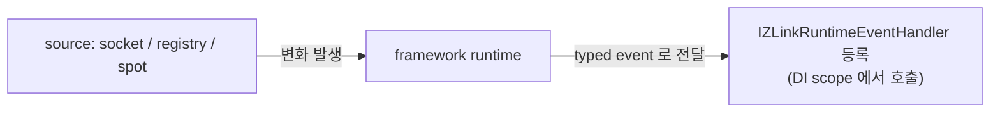

<!-- framework-adapter-nav:start -->
[문서 목록](../../../README.ko.md) | [이전: Registry](08-registry.ko.md) | [다음: 기능 맵](10-feature-map.ko.md)
<!-- framework-adapter-nav:end -->

# 9. Monitoring — runtime 이벤트 관찰

> 정식 계약은 [spec/aspnet-core-monitoring](../spec/aspnet-core-monitoring.ko.md)가
> 다룬다.

handler 호출만으로는 운영을 다 볼 수 없다. socket connect/disconnect, registry
status/topology 변화, spot peer/subject 변화, timer handler 실패 같은 **runtime
변화**도 framework 표면에서 받아야 한다. monitoring 이 이를 source 별로 통일된
방식으로 노출한다.

## 1. source 별 표면

하부 `.NET zlink` 표면이 source 마다 모양이 달라, framework 는 source 별로 표면을
다르게 둔다.

| source | 방식 |
|--------|------|
| socket | raw monitor 기반 event (connect/disconnect/handshake 등) |
| registry | 주기적 snapshot diff 기반 event 합성 |
| spot | 주기적 snapshot diff 기반 + timer 실패는 즉시 |
| discovery | 별도 runtime event 없음 → Registry snapshot/query 로 조회([08-registry](08-registry.ko.md)) |

공통 규칙: event kind 는 `enum`, payload 는 `record struct`, 응용은
`IZLinkRuntimeEventHandler<TEvent>` 를 DI 에 등록해 수신한다.

흐름은 단순하다 — **source 에서 변화가 나면 framework 가 typed handler 로 전달**하고,
DI 에 등록된 handler 를 scope 안에서 꺼내 호출한다(HTTP 요청 handler 와 같은 결).



## 2. 등록

`AddZLinkMonitoring(...)` 은 **source 등록만** 한다. 실제 source(socket/registry/
spot)는 같은 앱에 `AddZLinkFramework(...)` 또는 `AddZLinkRegistry(...)` 로 이미
올라와 있어야 한다.

```csharp
builder.Services.AddZLinkMonitoring(monitor =>
{
    monitor.AddSocketEvents(
        "profile.server",                        // channel + capability 형태
        ZLinkSocketEventKind.ConnectionReady,
        ZLinkSocketEventKind.Disconnected);

    monitor.AddRegistryEvents("registry", TimeSpan.FromSeconds(1));
    monitor.AddSpotEvents("stage-node", TimeSpan.FromSeconds(1));
});

builder.Services.AddSingleton<
    IZLinkRuntimeEventHandler<ZLinkSocketEvent>,
    ProfileServerSocketMonitor>();
builder.Services.AddSingleton<
    IZLinkRuntimeEventHandler<ZLinkRegistryEvent>,
    RegistryMonitor>();
builder.Services.AddSingleton<
    IZLinkRuntimeEventHandler<ZLinkSpotEvent>,
    StageNodeMonitor>();
```

- socket source 이름은 `channel + capability`(예: `profile.server`,
  `profile.client`) 형태다. capability 는 `server`, `client`, `publisher`,
  `subscriber` 중 하나다. spot 은 spot node 등록 이름(예: `stage-node`)이다.
- registry source 이름(예: `registry`)은 event 의 `SourceName` 으로 들어가는
  식별자다. `.NET` framework 는 앱 안에 등록된 `AddZLinkRegistry(...)` 런타임
  하나를 조회하므로, registry source 이름을 별도 infrastructure 등록 이름으로
  검증하지 않는다.
- registry/spot polling 주기는 **항상 명시**해야 한다(숨은 기본 주기 없음 — 운영
  코드가 polling 비용을 설정에서 바로 읽도록).
- socket source 가 등록된 channel capability 와 맞지 않거나, spot source 가 등록된
  spot node 이름과 맞지 않으면 시작 단계 예외다. registry event 는 source 이름보다
  `AddZLinkRegistry(...)` 등록 여부가 시작 단계에서 중요하다.
- `AddSocketEvents(...)` 에 kind 를 안 넘기면 그 source 가 지원하는 모든 이벤트를
  받는다.

## 3. event handler 작성

`IZLinkRuntimeEventHandler<TEvent>` 를 구현한 뒤 같은 타입으로 DI 에 등록하면
framework 가 scope 에서 handler 를 꺼내 호출한다. `AddZLinkMonitoring(...)` 은
source 만 등록하며, event handler 를 자동 스캔하거나 자동 등록하지 않는다.

### socket

```csharp
public sealed class ProfileServerSocketMonitor(ILogger<ProfileServerSocketMonitor> logger)
    : IZLinkRuntimeEventHandler<ZLinkSocketEvent>
{
    public ValueTask HandleAsync(ZLinkSocketEvent @event, CancellationToken ct)
    {
        switch (@event.Event)
        {
            case ZLinkSocketEventKind.ConnectionReady:
                logger.LogInformation("socket ready: {Source} {Remote}",
                    @event.SourceName, @event.RemoteAddr);
                break;
            case ZLinkSocketEventKind.Disconnected:
                logger.LogWarning("socket disconnected: {Source} {Remote} value={Value}",
                    @event.SourceName, @event.RemoteAddr, @event.Diagnostic?.NativeValue);
                break;
        }
        return ValueTask.CompletedTask;
    }
}
```

socket event 만 native monitor event/value 를 진단 정보로 함께 노출한다
(`Diagnostic.NativeEvent`, `Diagnostic.NativeValue`).

### registry

```csharp
public sealed class RegistryMonitor(ILogger<RegistryMonitor> logger)
    : IZLinkRuntimeEventHandler<ZLinkRegistryEvent>
{
    public ValueTask HandleAsync(ZLinkRegistryEvent @event, CancellationToken ct)
    {
        switch (@event.Event)
        {
            case ZLinkRegistryEventKind.StatusChanged:
                logger.LogInformation("registry status: {State}", @event.Status?.State);
                break;
            case ZLinkRegistryEventKind.TopologyChanged:
                logger.LogInformation("registry topology: {Count}", @event.Topology?.Count ?? 0);
                break;
        }
        return ValueTask.CompletedTask;
    }
}
```

registry event 는 `StatusChanged`, `TopologyChanged`, `ServiceSummaryChanged` **3종
고정**이다. 하부 raw monitor 가 없어 framework 가 주기적으로 snapshot 을 읽어
직전 값과 비교해 합성한다.

### spot

```csharp
public sealed class StageNodeMonitor(ILogger<StageNodeMonitor> logger)
    : IZLinkRuntimeEventHandler<ZLinkSpotEvent>
{
    public ValueTask HandleAsync(ZLinkSpotEvent @event, CancellationToken ct)
    {
        switch (@event.Event)
        {
            case ZLinkSpotEventKind.PeersChanged:
                logger.LogInformation("spot peers: {Source} {Count}",
                    @event.SourceName, @event.Peers?.Count ?? 0);
                break;
            case ZLinkSpotEventKind.SubjectsChanged:
                logger.LogInformation("spot subjects: {Source} {Count}",
                    @event.SourceName, @event.Subjects?.Count ?? 0);
                break;
            case ZLinkSpotEventKind.TimerHandlerFailed:
            case ZLinkSpotEventKind.TimerStoppedAfterUnhandledException:
                logger.LogError("spot timer failed: {Source} {Timer} {Handler} {Exception}",
                    @event.SourceName,
                    @event.TimerDiagnostic?.TimerName,
                    @event.TimerDiagnostic?.HandlerType,
                    @event.TimerDiagnostic?.ExceptionType);
                break;
        }
        return ValueTask.CompletedTask;
    }
}
```

spot event 는 `StatusChanged`, `PeersChanged`, `SubjectsChanged`,
`TimerHandlerFailed`, `TimerStoppedAfterUnhandledException` **5종 고정**이다.

> **timer 실패는 polling 주기를 기다리지 않는다.** status/peer/subject 변화는
> `AddSpotEvents(...)` 의 `interval` 로 snapshot diff 하지만, timer handler 실패는
> 발생 시점에 즉시 발행된다. timer 정책은 [05-spot](05-spot.ko.md) §3 참고.

## 4. 자주 막히는 곳

- **이벤트가 안 온다** → `AddZLinkMonitoring` 은 source 등록만 한다. 해당 source 가
  `AddZLinkFramework`/`AddZLinkRegistry` 로 실제로 떠 있는지와
  `IZLinkRuntimeEventHandler<TEvent>` 구현체가 DI 에 등록됐는지 확인한다.
- **discovery 상태를 받고 싶다** → discovery 는 runtime event 가 아니다. Registry
  snapshot/query 로 조회한다([08-registry](08-registry.ko.md) §5).
- **health/metric endpoint 를 기대한다** → `AddZLinkMonitoring(...)` 은 socket/
  registry/spot runtime event source 를 등록한다. 별도 health check 또는 metric
  endpoint 를 자동으로 만들지 않는다. health 는 필요하면 `IZLinkRegistryQuery` 같은
  조회 표면으로 직접 노출한다([08-registry](08-registry.ko.md) §5).
- **handler payload 의 정확한 필드** → 가이드는 자주 쓰는 필드만 보였다. 전체는
  [spec/aspnet-core-monitoring](../spec/aspnet-core-monitoring.ko.md) 참고.

## 5. 더 보기

- 이 챕터 계약의 실행 검증 예문(monitoring options/event/handler/publisher): [11-interface-catalog](11-interface-catalog.ko.md) §7 — 검증 클래스 `EventingContracts`
- 정식 계약: [spec/aspnet-core-monitoring](../spec/aspnet-core-monitoring.ko.md)
- topology 스냅샷 조회: [08-registry](08-registry.ko.md)

---
<!-- framework-adapter-nav:bottom:start -->
[문서 목록](../../../README.ko.md) | [이전: Registry](08-registry.ko.md) | [다음: 기능 맵](10-feature-map.ko.md)
<!-- framework-adapter-nav:bottom:end -->
