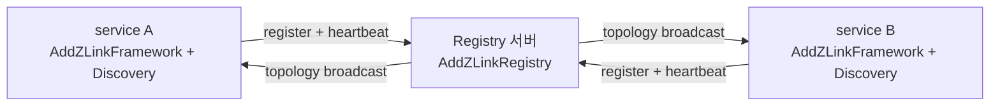
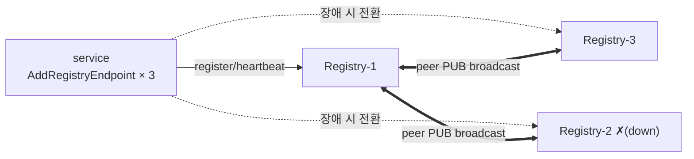

<!-- framework-adapter-nav:start -->
[문서 목록](../../../README.ko.md) | [이전: STREAM](08-stream.ko.md) | [다음: Monitoring — runtime 이벤트](10-monitoring.ko.md)
<!-- framework-adapter-nav:end -->

# 9. Registry — 구동과 topology 조회

> 정식 계약은 [spec/aspnet-core-registry](../spec/aspnet-core-registry.ko.md)가
> 다룬다. 이 챕터는 Registry 를 띄우고 topology 를 조회하는 사용법이다.

## 1. Registry 란

framework 의 channel discovery 는 **Registry 서버**를 중심에 둔다. Registry 는 세
가지를 담당한다: channel 등록, heartbeat 수신, topology broadcast. client 측
`Discovery` 는 이 Registry 에 붙어 자기 channel view 를 자동 갱신한다.

의존 방향에 주의한다: **channel runtime 이 Registry 에 의존한다**(반대가 아님).
연결을 거는 쪽과 받는 쪽으로 나눠 보면 분명하다.

- `AddZLinkFramework(...)` 쪽의 `Discovery` 가 Registry 로 **연결을 건다(outbound)** —
  즉 client 역할이다.
- `AddZLinkRegistry(...)` 는 그 연결을 **받는 서버(inbound)** 다.

즉 방향은 언제나 `channel runtime → Registry` 한쪽이며, 그래서 등록 호출도 둘로
나뉜다. Registry 는 framework runtime 의 일부가 아니라 독립 infrastructure 컴포넌트다.

그림으로 보면 방향이 분명하다 — **서비스가 Registry 로 붙으러 가고**(등록·heartbeat),
Registry 는 **topology 를 다시 뿌려** 각 서비스의 `Discovery` view 를 갱신한다.



> 🔰 **Registry** = 누가 어디 떠 있는지 모으는 디렉터리 서버, **Discovery** = 그
> Registry 를 보고 연결 대상을 자동으로 찾는 client 기능([03 §0](03-concepts.ko.md)).

## 2. 두 가지 배포 모델

| 모델 | 설명 | 적합 |
|------|------|------|
| embedded | 앱 프로세스 안에서 Registry 를 함께 구동 | 소규모 배포, 개발 환경 |
| standalone | Registry 만 단독 프로세스로 | 운영에서 Registry 를 로직과 분리 |

두 모델의 차이는 **배포 구성**일 뿐 API 는 같다. 같은 `AddZLinkRegistry(...)` 를
쓰되 서비스 handler 를 함께 등록하느냐로 갈린다.

### embedded — Registry + 서비스 한 프로세스

```csharp
var builder = WebApplication.CreateBuilder(args);

// Registry 서버
builder.Services.AddZLinkRegistry(registry =>
{
    registry.PubEndpoint = "tcp://0.0.0.0:5550";     // topology broadcast(PUB)
    registry.RouterEndpoint = "tcp://0.0.0.0:5551";  // 역할 등록·query(ROUTER)
    registry.RegistryId = 1;
});

// 서비스 런타임 — 같은 프로세스의 Registry 를 명시적으로 가리킨다
builder.Services.AddZLinkFramework(options =>
{
                options.AddClientServerChannel("api").EnableServer("tcp://0.0.0.0:7101");
        options.UseDiscovery().AddRegistryEndpoint("tcp://127.0.0.1:5551");  // 위 RouterEndpoint(5551) 와 동일 포트 — PUB(5550) 아님
    options.Codecs.Use(ZLinkProtobufCodec.Default);
    options.AddHandlersFromAssemblyOf<Program>();
});

var app = builder.Build();
app.Run();
```

> embedded 라도 `UseDiscovery().AddRegistryEndpoint(...)` 가 같은 프로세스의 Registry 를 **자동으로
> 찾아주지 않는다.** Discovery endpoint(`5551`)를 명시해야 한다. framework 는
> Registry 가 먼저 bind 된 뒤 Discovery 가 연결되도록 startup 순서를 자동
> 보장한다.

### standalone — Registry 만

```csharp
var builder = WebApplication.CreateBuilder(args);

// AddZLinkFramework 없음 → Registry 서버만 돌고 서비스 handler 는 구동되지 않는다(embedded 와의 유일한 차이).
builder.Services.AddZLinkRegistry(registry =>
{
    registry.PubEndpoint = "tcp://0.0.0.0:5550";
    registry.RouterEndpoint = "tcp://0.0.0.0:5551";
    registry.RegistryId = 1;
});

builder.Build().Run();
```

`AddZLinkFramework(...)` 가 없으니 handler 없이 Registry 서버만 돈다.

## 3. 설정 옵션

```csharp
builder.Services.AddZLinkRegistry(registry =>
{
    registry.PubEndpoint = "tcp://0.0.0.0:5550";
    registry.RouterEndpoint = "tcp://0.0.0.0:5551";
    registry.RegistryId = 1;
    registry.HeartbeatInterval = TimeSpan.FromSeconds(5);
    registry.HeartbeatTimeout = TimeSpan.FromSeconds(15);
    registry.BroadcastInterval = TimeSpan.FromSeconds(30);
});
```

| 설정 | 기본값 | 의미 |
|------|--------|------|
| `PubEndpoint` | (필수) | topology broadcast 를 내보내는 PUB endpoint |
| `RouterEndpoint` | (필수) | 등록·heartbeat·query 요청을 받는 ROUTER endpoint |
| `RegistryId` | 0 | 클러스터 안 인스턴스 식별 ID |
| `HeartbeatInterval` | 5s | 서비스가 보낼 heartbeat 주기 |
| `HeartbeatTimeout` | 15s | 이 시간 안에 heartbeat 가 없으면 lost 로 봄 |
| `BroadcastInterval` | 30s | 전체 service list 를 PUB 으로 내보내는 주기 |

> 포트 관례: PUB=`5550`, ROUTER=`5551`. peer 는 PUB 을, query client/discovery 는
> ROUTER 를 가리킨다(혼동 주의).

## 4. clustering 과 failover

Registry 하나면 단일 장애점(SPOF)이다. 이걸 없애려면 **두 곳을 같이** 손봐야 한다.
Registry 끼리 묶는 일(아래 4-1)과, 서비스가 여러 Registry 를 바라보게 하는 일(4-2)은
서로 다른 설정이며 **둘 다** 있어야 한 Registry 가 죽어도 messaging 이 이어진다.

### 4-1. Registry 끼리 묶기 — peer broadcast

peer Registry 의 **PUB endpoint** 를 등록하면, 서로의 topology broadcast 를 구독해
같은 그림을 공유한다(한 곳에 등록된 서비스를 다른 곳도 알게 된다).

```csharp
builder.Services.AddZLinkRegistry(registry =>
{
    registry.PubEndpoint = "tcp://0.0.0.0:5550";
    registry.RouterEndpoint = "tcp://0.0.0.0:5551";
    registry.RegistryId = 1;
    registry.AddPeer("tcp://registry-2:5550");   // PUB(5550) 임에 주의
    registry.AddPeer("tcp://registry-3:5550");
});
```

### 4-2. 서비스가 여러 Registry 를 바라보게 하기 — Discovery multi-endpoint

peer 로 묶기만 해서는 부족하다. **서비스 쪽**도 여러 Registry 의 ROUTER endpoint 를
등록해야, 붙어 있던 Registry 가 죽었을 때 남은 Registry 로 옮겨 가며 discovery 를
유지한다. `AddRegistryEndpoint(...)` 를 **여러 번** 부르면 된다.

```csharp
builder.Services.AddZLinkFramework(options =>
{
    options.UseDiscovery()
        .AddRegistryEndpoint("tcp://registry-1:5551")   // ROUTER(5551) — peer 의 PUB(5550) 아님
        .AddRegistryEndpoint("tcp://registry-2:5551")
        .AddRegistryEndpoint("tcp://registry-3:5551");
    // ... 채널 등록 ...
});
```

등록한 endpoint 중 살아 있는 Registry 가 하나라도 있으면(4-1 의 peer 공유 덕에 그 Registry 가
양쪽 서비스를 알고 있으므로) 서비스는 discovery 를 잃지 않고 messaging 을 이어 간다. endpoint 를
하나만 등록하면, 그 Registry 가 죽는 순간 discovery 가 끊겨 새 연결을 찾지 못한다(클러스터를 띄워도
4-2 를 빼면 failover 가 동작하지 않는 흔한 함정이다).



## 5. topology 조회

### in-process — `IZLinkRegistryQuery`

`AddZLinkRegistry(...)` 를 등록하면 `IZLinkRegistryQuery` 가 DI 에 자동 등록된다.
운영 점검, warm-up 확인, 관리 화면에 쓴다.

```csharp
app.MapGet("/admin/topology", async (IZLinkRegistryQuery registry) =>
    Results.Ok(await registry.TopologyAsync()));            // TopologyAsync(filter?): 채널·멤버·peer 연결 토폴로지

app.MapGet("/admin/services", async (IZLinkRegistryQuery registry) =>
    Results.Ok(await registry.ServiceSummaryAsync()));      // ServiceSummaryAsync(filter?): 서비스(채널)별 요약

app.MapGet("/admin/peers/{channel}", async (string channel, IZLinkRegistryQuery registry) =>
    Results.Ok(await registry.MemberPeersAsync(channel)));  // MemberPeersAsync(channelName): 한 채널의 멤버 peer 목록

app.MapGet("/health", async (IZLinkRegistryQuery registry) =>
{
    var status = await registry.StatusAsync();             // StatusAsync: Registry 자체 상태(Active/Starting 등)
    return status.State == ZLinkRegistryState.Active
        ? Results.Ok(status)
        : Results.StatusCode(503);
});
```

네 가지 query 메서드를 제공한다(각 메서드가 무엇을 돌려주는지는 위 코드 주석 참고). 모두
`ValueTask` 비동기다. embedded Registry 가 아직 시작되지 않았으면 첫 query 호출이
그 자리에서 Registry 를 시작시킨다(lazy start).

#### filter 로 한 channel 만 보기 + readiness 판정

`TopologyAsync` 는 `ZLinkRegistryTopologyFilter` 를 받아 한 channel 만 추려서 본다. warm-up 확인
(특정 channel 의 router 가 준비됐는지)에 자주 쓴다.

```csharp
var topology = await query.TopologyAsync(
    new ZLinkRegistryTopologyFilter(ChannelName: "play"), ct);

// 이 channel 에 Ready 상태인 router 가 N개 이상인지로 준비 완료를 판정
var readyRouters = topology.Count(entry =>
    entry.State == ZLinkTopologyState.Ready && entry.ServiceRole == ZLinkServiceRole.Router);
```

topology 항목(`ZLinkRegistryTopologyEntry`)의 주요 필드:

| 필드 | 의미 |
|------|------|
| `ChannelName` | 이 항목이 속한 channel 이름 |
| `RoutingId` | 멤버의 routing id |
| `Endpoint` | 멤버가 bind 한 endpoint |
| `State` | `ZLinkTopologyState` — `Ready` 면 트래픽을 받을 준비가 됨 |
| `ServiceRole` | `ZLinkServiceRole` — `Router`/`Server`/`Publisher` 등 그 멤버의 역할 |

`MemberPeersAsync(channelName)` 도 멤버별로 `ServiceRole`·`Endpoint` 를 돌려주므로, peer broadcast 로
합쳐진 멤버가 보이는지 검증할 때 같은 필드를 본다.

### 원격 — `IZLinkRegistryQueryClient`

다른 프로세스의 Registry 를 조회할 때는 별도 등록한다.

```csharp
builder.Services.AddZLinkRegistryQueryClient(query =>
{
    query.Endpoint = "tcp://registry-1:5551";   // ROUTER endpoint
});

app.MapGet("/admin/topology", async (IZLinkRegistryQueryClient query) =>
    Results.Ok(await query.TopologyAsync()));
```

| 항목 | `IZLinkRegistryQuery` | `IZLinkRegistryQueryClient` |
|------|----------------------|-----------------------------|
| 대상 | 같은 프로세스 embedded Registry | 다른 프로세스 Registry |
| 등록 | `AddZLinkRegistry` 시 자동 | `AddZLinkRegistryQueryClient` 별도 |
| 제공 | status·service·topology·member peers | topology snapshot 만 |

원격 client 가 좁은 이유는 하부 C API 가 topology snapshot 만 지원하기 때문이다.
연결 실패 시 framework 가 몰래 retry 하지 않으니, retry 는 호출자/monitoring 에서
명시적으로 한다.

## 6. Registry 기반 SPOT 주소 resolver

외부에서 `spotRid` 로 보낸 send/request 가 소유 노드에 닿으려면, framework 가
`spotRid → 소유 노드 주소`를 찾을 수 있어야 한다. 이 resolver 는 자동으로 켜지지
않는다 — `UseDiscovery().AddRegistryEndpoint(...)` 만으로는 등록되지 않으니 명시해야 한다.

대부분은 **SpotMesh 빌더의 `UseRegistrySpotResolver()`** 한 줄이면 된다. 이 mesh 의
channel 이름을 그대로 registry namespace 로 삼아 resolve 한다(spot 호스팅 노드의 전체
배선은 [05-spot §2·§5](05-spot.ko.md) 참고).

```csharp
builder.Services.AddZLinkFramework(options =>
{
    options.UseDiscovery().AddRegistryEndpoint("tcp://127.0.0.1:5551");

    options.AddSpotMesh("game.stage")
        .UseRegistrySpotResolver()            // spotRid → 소유 노드 주소 (mesh 이름 "game.stage" 를 namespace 로)
        .EnableRouter("tcp://0.0.0.0:9001");
});
```

> **namespace 와 route channel 이름이 달라야 하는 경우에만** 수동형을 쓴다.
> `UseRegistrySpotResolver()` 는 mesh 이름 하나를 namespace 와 route channel 양쪽에
> 똑같이 쓴다. 둘을 따로 지정해야 하는 드문 경우에는 framework 수준의
> `UseRegistrySpotRemoteAddresses(namespace)` 로 풀어 쓴다.
>
> ```csharp
> options.UseRegistrySpotRemoteAddresses("game")   // resolve 에 쓸 namespace
>     .RouterChannelId = "play";                    // route 가 실제로 흐르는 channel 이름
> ```

Registry 를 key-value 저장소로 노출하는 것은 아니다. Redis/DB 가 필요하면 custom
resolver 를 등록한다([07-actor-session](07-actor-session.ko.md) §4).

## 7. lifecycle

- 시작: `Context` 생성 → `Registry` 생성 → 설정 적용 → `Bind(pub, router)`.
- 종료: channel runtime shutdown → Registry shutdown → `Context` 정리. 서비스가
  먼저 내려가야 다른 노드의 Discovery 가 이 서비스 소멸을 정상 감지한다.
- Registry 용 health check 는 자동 등록되지 않는다. 필요하면 `IZLinkRegistryQuery`
  로 직접 노출한다(§5 의 `/health` 예시).

## 8. 더 보기

- 이 챕터 계약의 실행 검증 예문(options/query/query client): [12-interface-catalog](12-interface-catalog.ko.md) §6 — 검증 클래스 `RegistryContracts`
- 정식 계약: [spec/aspnet-core-registry](../spec/aspnet-core-registry.ko.md)
- runtime 이벤트로 topology 변화 관찰: [10-monitoring](10-monitoring.ko.md)

---
<!-- framework-adapter-nav:bottom:start -->
[문서 목록](../../../README.ko.md) | [이전: STREAM](08-stream.ko.md) | [다음: Monitoring — runtime 이벤트](10-monitoring.ko.md)
<!-- framework-adapter-nav:bottom:end -->
