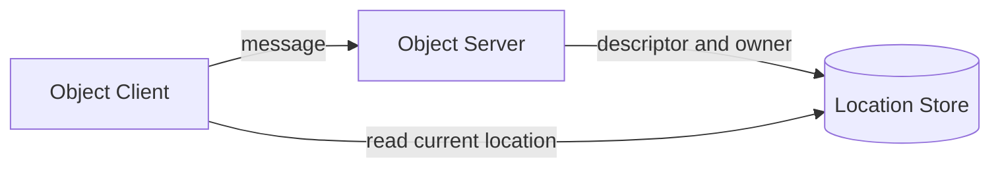

<!-- framework-adapter-nav:start -->
[문서 목록](../../../README.ko.md) | [이전: STREAM](09-stream.ko.md) | [다음: Monitoring — runtime 이벤트](11-monitoring.ko.md)
<!-- framework-adapter-nav:end -->

# 10. Location — 자동 연결과 Object 위치

> 정식 계약은 [Location runtime](../../common/spec/21-location-runtime.ko.md),
> [Location Store](../../common/spec/22-location-store-redis.ko.md)와
> [.NET exact interface](../../common/spec/server/languages/dotnet/interfaces/08-location-maintenance.ko.md)가
> 정의한다. 이 문서는 application에서 Store를 등록하고 상태를 확인하는 방법을 설명한다.

## 0. 무엇을 해주는가

Location Store는 MeshNode descriptor와 Actor·Spot의 현재 owner를 저장한다. Framework는 이 정보를
사용해 peer를 자동으로 연결하고 논리 ID를 현재 owner로 전달한다.



Store는 위치를 찾을 때만 사용한다. 실제 application message는 선택한 MeshNode로 직접 전송한다.

## 1. Store 등록

공식 Redis extension은 Location Store와 Relocation Store를 별도 class로 제공한다. Location Store는
작은 위치 record의 원자적 변경을 담당한다. Relocation Store는 object 이동에 필요한 immutable payload를
저장한다.

```csharp
services.AddZLinkFramework(options =>
{
    options.AddLocationStore(
        new ZLinkRedisLocationStore(new ZLinkRedisLocationOptions
        {
            ConnectionString = "redis-host:6379",
            KeyPrefix = "game:location"
        }));
        // 현재 owner와 위치를 결정하는 Store를 등록한다.

    options.AddRelocationStore(
        new ZLinkRedisRelocationStore(new ZLinkRedisRelocationOptions
        {
            ConnectionString = "redis-host:6379",
            KeyPrefix = "game:relocation"
        }));
        // 이동할 state·queue·timer payload를 저장하는 Store를 별도로 등록한다.
});
```

두 Store는 같은 Redis deployment를 사용할 수 있다. Key prefix는 서로 다르게 둔다. Framework는
cross-store transaction에 의존하지 않으므로 필요하면 물리 Redis도 분리할 수 있다.

Store를 등록한 뒤 application이 provider operation을 직접 호출하거나 dispose하지 않는다. Framework가
Store 수명과 호출 순서를 관리한다.

## 2. 자동 연결

같은 Location Store를 사용하는 MeshNode는 descriptor를 통해 상대 endpoint와 역할을 확인한다. Automatic
RouteMesh에서는 RID가 더 작은 쪽만 연결을 시작한다. 연결 경합으로 중복 후보가 생기면 handshake와
admission에서 하나만 Ready로 유지한다.

```csharp
services.AddZLinkFramework(options =>
{
    var play = options.AddRouteMesh("play")
        .Listen(5501)
        .SetRoutingIdPrefix("play");

    play.Objects().Server()
        .AddSpotFactory<RoomSpot>(
            "room",
            factory => factory.RecreateOnRelocation());

    play.Channel("play.ops").Server()
        .AddRequestHandler<NodeStatusHandler, GetNodeStatus, NodeStatus>();
});
```

Application은 Actor·Spot을 생성할 target Node RID나 endpoint를 지정하지 않는다. Framework가 stable type,
Serving 상태, capacity와 placement weight를 확인해 eligible node를 선택한다.

Manual peer를 하나라도 사용한 host에서는 host relocation을 지원하지 않는다. 자동 연결과 수동 연결을
같은 MeshNode에서 섞지 않는다.

## 3. Location 옵션

`ConfigureLocations()`는 lease, route cache와 relocation 실행 상한을 설정한다.

```csharp
var location = options.ConfigureLocations();
location.OwnerLeaseRenewInterval = TimeSpan.FromSeconds(5);
location.OwnerLeaseTtl = TimeSpan.FromSeconds(15);
location.MessageFollowDuration = TimeSpan.FromSeconds(30);
location.MaxActiveOutboundRelocations = 64;
location.MaxActiveInboundRelocations = 64;
location.MaxRelocationPayloadInFlightBytes = 256L * 1024 * 1024;
```

| 옵션 | 기본값 | 의미 |
|---|---:|---|
| `OwnerLeaseRenewInterval` | 5초 | owner lease 갱신 주기 |
| `OwnerLeaseTtl` | 15초 | 갱신이 중단된 owner를 만료로 판단하는 시간 |
| `PollingInterval` | 1초 | change watch가 없을 때 Store를 다시 읽는 주기 |
| `StoreFailureGrace` | 30초 | Store 장애 중 마지막 route 판단을 유지하는 시간 |
| `RouteCacheMaxAge` | 15초 | cached route를 다시 확인하기 전 최대 시간 |
| `MessageFollowDuration` | 30초 | 이동 전 owner가 새 owner로 메시지를 relay하는 기간 |
| `MaxActiveOutboundRelocations` | 64 | process에서 동시에 내보내는 relocation unit 상한 |
| `MaxActiveInboundRelocations` | 64 | process에서 동시에 복원하는 relocation unit 상한 |
| `MaxRelocationPayloadInFlightBytes` | 256 MiB | process 전체 encoded payload 상한 |

Lease option의 전체 제약과 Capture·Restore callback 상한은
[exact interface](../../common/spec/server/languages/dotnet/interfaces/08-location-maintenance.ko.md#2-location-option)를
따른다.

## 4. readiness와 운영 조회

운영 코드는 `IZLinkLocationReadiness`로 필요한 peer가 Ready인지 확인한다. 전체 상태와 paged topology는
`IZLinkLocationRuntimeQuery`로 조회한다.

```csharp
app.MapGet("/ops/location", async (
    IZLinkLocationReadiness readiness,
    IZLinkLocationRuntimeQuery query,
    CancellationToken ct) =>
{
    var status = await query.GetStatusAsync(ct);
    var page = await query.ListTopologyAsync(
        new ZLinkLocationTopologyFilter(MeshName: "play"),
        new ZLinkPageRequest(PageSize: 100),
        ct);

    var objectPeerReady = await readiness.IsPeerReadyAsync(
        "play",
        ZLinkLocationRole.Spot,
        cancellationToken: ct);

    return Results.Ok(new
    {
        status.StoreHealthy,
        status.OwnerLeaseHealthy,
        objectPeerReady,
        topology = page.Items
    });
});
```

운영 query는 health와 사람이 확인할 topology만 반환한다. Store key, authority version, owner token과
relocation record는 Framework 내부 정보이므로 반환하지 않는다. `NodeRid`는 실제 transport node를
운영 정보와 대응할 때만 사용한다.

## 5. Actor와 Spot 조회

업무 코드는 global ActorId와 SpotId를 사용한다. Manager의 `FindAsync(...)`는 현재 Ready object만
반환한다.

```csharp
ActorRef? actor = await actorManager.FindAsync("player-1", ct);
SpotRef? room = await spotManager.FindAsync("room-42", ct);

if (room is not null)
{
    await spotClient
        .RequestToSpot(room.Value.SpotId, new GetRoomState())
        .Async<RoomState>(ct);
}
```

일반 메시징은 `SpotRef.NodeRid`를 target으로 사용하지 않는다. `IZLinkSpotClient`와
`IZLinkActorClient`가 Location Store에서 current owner를 확인하고 이동 중에는 Message Follow 규칙을
적용한다. `SpotRef`와 `ActorRef`는 exact generation을 닫거나 삭제할 때 사용한다.

---
<!-- framework-adapter-nav:bottom:start -->
[문서 목록](../../../README.ko.md) | [이전: STREAM](09-stream.ko.md) | [다음: Monitoring — runtime 이벤트](11-monitoring.ko.md)
<!-- framework-adapter-nav:bottom:end -->
