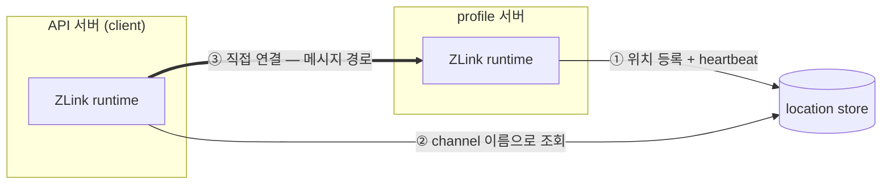
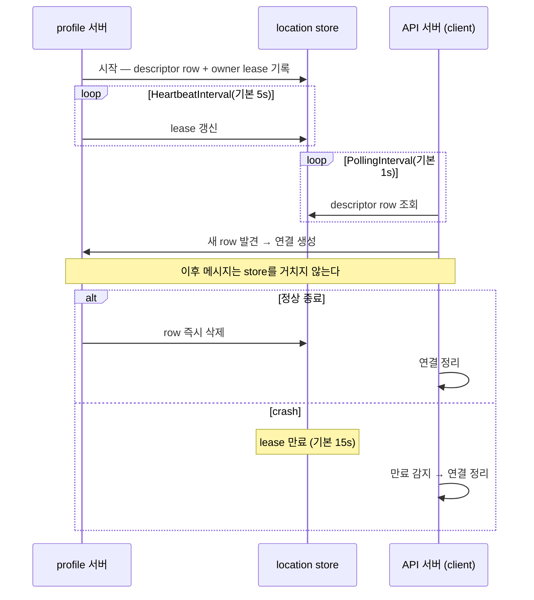
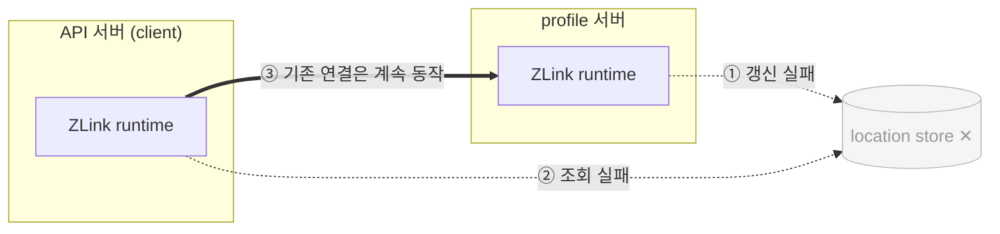

<!-- framework-adapter-nav:start -->
[문서 목록](../../../README.ko.md) | [이전: STREAM](09-stream.ko.md) | [다음: Monitoring — runtime 이벤트](11-monitoring.ko.md)
<!-- framework-adapter-nav:end -->

# 10. Location — store 기반 자동 연결

> 정식 계약은 공통 스펙 [location runtime](../../common/spec/40-location-runtime.ko.md)과
> [Redis extension](../../common/spec/41-location-store-redis.ko.md)이 다룬다. 이 챕터는
> .NET에서 store를 등록하고 자동 연결과 운영 조회를 쓰는 방법을 다룬다.

## 0. 무엇을 해주는가

지금까지 챕터는 연결할 endpoint를 코드에 직접 적었다(`Listen("tcp://...")`,
`PeerConnections.Connect("tcp://...")`). **location store**를 등록하면 호출하는 쪽에서 remote
endpoint 값이 사라진다. 서버는 자기 위치를 store에 자동 등록한다. 호출자는 MeshName과
ChannelName으로 상대를 찾아 연결한다. 서버가 늘어나거나 줄어들면 connection도 자동으로 새로
연결되거나 정리된다.

처음 나오는 용어는 다음과 같다.

| 용어 | 한 줄 풀이 |
|---|---|
| location store | 각 서버의 현재 위치를 모아 두는 공유 저장소. 공식 extension은 Redis |
| peer location row | "서버 X가 channel Y를 endpoint Z에서 서비스 중"이라는 위치 한 줄 |
| owner lease | row 소유자의 유효성을 증명하는 임대. 갱신이 중단되면 만료된다 |
| heartbeat | lease를 주기적으로 갱신하는 신호 |
| Draining | "새 배치는 받지 않지만 기존 연결은 유지 중"이라는 row 표시 |

전체 그림은 하나다. 이 지도를 챕터 내내 다시 쓴다.



핵심은 ③이다. store는 ①②의 위치 교환에만 쓰인다. 메시지는 store를 거치지 않고
runtime에서 서버 runtime으로 직접 간다.

## 1. store 등록

공식 Redis extension(`Zlink.Framework.Locations.Redis` 패키지)의 인스턴스를
`AddLocationStore(...)`로 등록한다. codec serializer 등록과 같은 형태다. 전용 등록
함수는 없다.

```csharp
builder.Services.AddZLinkFramework(framework =>
{
    framework.AddLocationStore(new ZLinkRedisLocationStore(redis => redis
        .SetConnectionString("redis-host:6379")
        .SetKeyPrefix("myapp:prod")));

    // 제공 노드: 호출자가 찾을 MeshName과 ChannelName을 descriptor에 함께 기록한다.
    framework.AddRouteMesh("shop")
        .Listen("tcp://0.0.0.0:5555")
        .SetRoutingId(RoutingId.From("profile-a"))
        .ChannelName("shop.profile");
});
```

호출자도 같은 MeshName의 MeshNode로 참여하지만 remote endpoint는 지정하지 않는다. 호출만 하는
membership은 weight를 0으로 두어 select-one 대상에서 제외한다. 연결 대상은 store의 descriptor
row에서 찾는다.

```csharp
framework.AddRouteMesh("shop")
    .Listen("tcp://0.0.0.0:0")
    .SetRoutingId(RoutingId.From("api-a"))
    .ChannelName("shop.api")
    .SetWeight(0);

var reply = await routes
    .RequestToChannel("shop", "shop.profile", new GetProfileReq("player-1"))
    .Async<GetProfileRes>();
```

- `SetKeyPrefix`는 배포 환경별 격리 접두사다. 같은 Redis를 여러 환경이 공유해도
  prefix가 다르면 서로 보이지 않는다.
- 같은 MeshNode에서 자동 연결과 수동 peer endpoint 연결을 섞지 않는다. 수동으로 등록한
  연결은 자동 연결의 상태 맞추기 작업이 끊지 않는다.
- 사용자 저장소가 필요하면 통합 계약 `IZLinkLocationStore` 구현체를 같은 지점에
  등록한다.

> **샘플에서 보기 — [Bingo](../../common/sample/bingo/README.ko.md).** gateway와 play
> 노드를 분리한 배포에서 endpoint를 코드에 적지 않고 store 자동 연결로 서로 찾는다.
> 반대로 [TicTacToe](../../common/sample/tictactoe/README.ko.md)는 store 없이 수동
> endpoint로 직접 잇는 최소 구성이라, 두 샘플을 비교하면 store가 지우는 코드가
> 정확히 보인다.

## 2. 동작 방식

시간 순서로 보면 다음과 같다.



- 정상 종료는 row를 즉시 지운다. crash는 lease 만료로 전파된다.
- row에 `Draining` 표시가 켜지면 client는 그 서버를 **새 연결·새 배치 후보에서만**
  뺀다. 기존 연결과 진행 중인 메시징은 그대로 둔다. drain 수명주기 전체는
  [11-monitoring](11-monitoring.ko.md)이 다룬다.

store가 잠시 죽어도 메시징은 멈추지 않는다. 기준 지도에서 store만 빠진 상태다.



새 정보를 얻지 못하는 동안 runtime은 마지막으로 성공한 연결 판단을 유지한다.
`StoreFailureGrace`(기본 30s) 안에 store가 복구되면 조회와 갱신이 그대로
재개되고, 기존 연결 상태는 바뀌지 않는다.

## 3. 옵션

타이밍과 운영 조회 범위는 `ConfigureLocations()`로 조정한다. Spot·Actor 위치 row의 `MeshName`이
전송에 사용할 RouteMesh를 직접 가리키므로 별도 route channel 매핑은 설정하지 않는다.

```csharp
var locations = framework.ConfigureLocations();
locations.HeartbeatInterval = TimeSpan.FromSeconds(5);
locations.ObservedMeshNames.Add("game-mesh"); // 직접 참여하지 않는 mesh도 운영 조회에 포함한다.
```

| 옵션 | 기본값 | 무엇을 정하나 |
|---|---|---|
| `HeartbeatInterval` | 10s | 서버가 owner lease를 갱신하는 주기 |
| `OwnerLeaseTtl` | 30s | 갱신이 끊긴 owner의 row가 stale로 취급되기까지의 시간 |
| `PollingInterval` | 1s | watch 미지원 store를 다시 읽는 주기 |
| `StoreFailureGrace` | 30s | store 장애 시 마지막 판단을 유지하는 시간 |
| `ListPageSize` | 1000 | 목록 조회 한 페이지 크기 |
| `ObservedMeshNames` | 빈 목록 | 이 호스트가 직접 참여하지 않는 mesh를 운영 조회로 관찰할 때 열거 |
| `RoutingIdFencingMargin` | 5s | 할당 routing id 사용 시 lease 만료 전 소켓 정지에 확보하는 여유 |
| `OwnerLeaseRenewTimeout` | 3s | owner lease를 한 번 갱신할 때 허용하는 최대 시간 |

## 4. 운영 조회

`IZLinkLocationRuntimeQuery`를 주입받으면 store 상태와 위치 row를 읽을 수 있다.
관리 endpoint, 헬스 체크, E2E 검증에서 쓴다.

| 메서드 | 무엇을 돌려주나 |
|---|---|
| `GetStatusAsync()` | store health, 마지막 오류, lease 갱신 상태 |
| `ListMeshNodeDescriptorsAsync(meshName)` | 그 mesh의 활성 MeshNode descriptor row (lease 유효한 것만) |
| `ListTopologyAsync(filter, page)` | runtime이 row를 합성한 topology 보기 |
| `ListServiceSummariesAsync(filter)` | channel 단위 서비스 요약 |

개별 spot·actor의 위치는 목록으로 열거하지 않는다 — 호출자가 rid/actorId를
지정해 §5의 resolver로 단건 확인한다(10.0.0 resolve-only 계약).

```csharp
app.MapGet("/ops/locations", async (IZLinkLocationRuntimeQuery query) =>
{
    var status = await query.GetStatusAsync();
    var nodes = await query.ListMeshNodeDescriptorsAsync("game.room");
    return Results.Ok(new
    {
        storeHealthy = status.StoreHealthy,
        lastError = status.LastError,
        nodes = nodes.Select(n => new { rid = n.Rid.ToString(), n.Endpoint, n.Draining })
    });
});
```

비활성 서버의 row는 lease 만료 후 목록에서 자동으로 빠진다. topology·service
summary를 이벤트로 관측하려면 [11-monitoring](11-monitoring.ko.md)의
`location-runtime` source를 함께 쓴다.

## 5. spot / actor 위치 조회

SPOT과 actor 메시징이 원격 대상을 찾을 때도 같은 store를 쓴다. resolver는 논리적
대상을 가리키는 `SpotHandle`을 돌려준다. 호출자는 handle만 보관한다. handle이
가리키는 실제 주소는 framework가 위치 event와 주기 조회로 갱신한다.

```csharp
public sealed class OrderRouter(IZLinkSpotHandleResolver spots)
{
    public async Task<SpotHandle> FindRoomAsync(string meshName, RoutingId roomRid)
    {
        return await spots.ResolveSpotHandleAsync(meshName, roomRid)
            ?? throw new InvalidOperationException($"room '{roomRid}' not found");
    }
}
```

- `IZLinkActorSpotHandleResolver.ResolveActorSpotHandleAsync(meshName, actorId)`는 actor가
  위치한 spot의 handle을 돌려준다.
- Spot RID와 actor id는 다른 MeshName에서 같을 수 있으므로 두 resolver 모두 MeshName을
  명시한다. framework는 등록된 mesh를 순서대로 탐색하지 않는다.
- 이동·소멸로 handle이 낡으면 framework가 주소를 한 번 갱신하고, 안전한 요청만
  한 번 재전송한다. 세부 흐름은 [06-spot](06-spot.ko.md)과
  [07-actor-spot](07-actor-spot.ko.md)을 참고한다.

---
<!-- framework-adapter-nav:bottom:start -->
[문서 목록](../../../README.ko.md) | [이전: STREAM](09-stream.ko.md) | [다음: Monitoring — runtime 이벤트](11-monitoring.ko.md)
<!-- framework-adapter-nav:bottom:end -->
