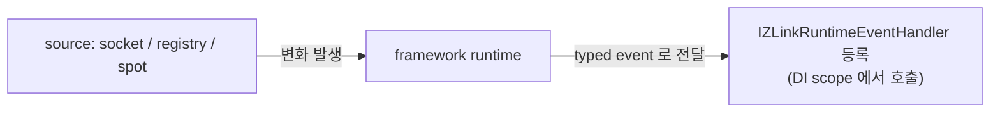

<!-- framework-adapter-nav:start -->
[문서 목록](../../../README.ko.md) | [이전: Registry](09-registry.ko.md) | [다음: 기능 맵](11-feature-map.ko.md)
<!-- framework-adapter-nav:end -->

# 10. Monitoring — runtime 이벤트 관찰

> 정식 계약은 [spec/aspnet-core-monitoring](../spec/aspnet-core-monitoring.ko.md)가
> 다룬다.

handler 호출만으로는 운영을 다 볼 수 없다. socket connect/disconnect, registry
status/topology 변화, spot peer/subject 변화, timer handler 실패 같은 **runtime
변화**도 framework 표면에서 받아야 한다. monitoring 이 이를 source 별로 통일된
방식으로 노출한다.

## 1. source 별 표면

하부 `.NET zlink` 표면이 source 마다 모양이 달라, framework 는 source 별로 표면을
다르게 둔다.

| source | 방식 |
|--------|------|
| socket | raw monitor 기반 event (connect/disconnect/handshake 등) |
| registry | 주기적 snapshot diff 기반 event 합성 |
| spot | 주기적 snapshot diff 기반 + timer 실패는 즉시 |
| discovery | 별도 runtime event 없음 → Registry snapshot/query 로 조회([09-registry](09-registry.ko.md)) |

공통 규칙: event kind 는 `enum`, payload 는 `record struct`, 응용은
`IZLinkRuntimeEventHandler<TEvent>` 를 DI 에 등록해 수신한다.

흐름은 단순하다 — **source 에서 변화가 나면 framework 가 typed handler 로 전달**하고,
DI 에 등록된 handler 를 scope 안에서 꺼내 호출한다(HTTP 요청 handler 와 같은 결).



## 2. 등록

`AddZLinkMonitoring(...)` 은 **source 등록만** 한다. 실제 source(socket/spot)는
framework runtime 에 올라와 있어야 한다.

```csharp
builder.Services.AddZLinkMonitoring(monitor =>
{
    monitor.AddSocketEvents(
        "profile.server",                        // channel + capability 형태
        ZLinkSocketEventKind.ConnectionReady,
        ZLinkSocketEventKind.Disconnected);

    monitor.AddSpotEvents("stage-node", TimeSpan.FromSeconds(1));
});

// AddZLinkMonitoring 은 source 등록만 한다 — event handler 는 자동 등록되지 않으니 직접 DI 로 등록한다.
// framework 는 이벤트마다 새 scope 에서 handler 를 resolve 하므로 AddScoped 가 자연스럽다.
builder.Services.AddScoped<
    IZLinkRuntimeEventHandler<ZLinkSocketEvent>,
    ProfileServerSocketMonitor>();
builder.Services.AddScoped<
    RegistryMonitor>();
builder.Services.AddScoped<
    IZLinkRuntimeEventHandler<ZLinkSpotEvent>,
    StageNodeMonitor>();
```

- socket source 이름은 `channel + capability`(예: `profile.server`,
  `profile.client`) 형태다. capability 는 `server`, `client`, `publisher`,
  `subscriber` 중 하나다. spot 은 spot node 등록 이름(예: `stage-node`)이다.
- registry source 이름(예: `registry`)은 event 의 `SourceName` 으로 들어가는
  하나를 조회하므로, registry source 이름을 별도 infrastructure 등록 이름으로
  검증하지 않는다.
- registry/spot polling 주기는 **항상 명시**해야 한다(숨은 기본 주기 없음 — 운영
  코드가 polling 비용을 설정에서 바로 읽도록).
- socket source 가 등록된 channel capability 와 맞지 않거나, spot source 가 등록된
  spot node 이름과 맞지 않으면 시작 단계 예외다. registry event 는 source 이름보다
- `AddSocketEvents(...)` 에 kind 를 안 넘기면 그 source 가 지원하는 모든 이벤트를
  받는다.

## 3. event handler 작성

`IZLinkRuntimeEventHandler<TEvent>` 를 구현한 뒤 같은 타입으로 DI 에 등록하면
framework 가 이벤트마다 새 DI scope 를 열어 그 안에서 handler 를 resolve 해 호출한다.
그래서 `AddScoped` 가 기본 선택이고, handler 가 무상태라면 `AddSingleton` 도 무방하다.
`AddZLinkMonitoring(...)` 은 source 만 등록하며, event handler 를 자동 스캔하거나
자동 등록하지 않는다.

> **handler 가 던져도 messaging 은 멈추지 않는다.** 이벤트 dispatch 는 messaging 경로와 분리된
> detached task(`monitoring-event-dispatch`)로 돌아, `HandleAsync` 가 예외를 던져도 그 실패는
> 격리되고 이후 메시지 처리는 정상 복구된다. 단 이 실패의 stderr 로그는 기본적으로 조용하고,
> `ZLINK_DEBUG_FRAMEWORK_TASKS=1` 환경변수를 켰을 때만 `monitoring-event-dispatch` 마커로 남는다
> (handler 문제를 추적할 땐 이 변수를 켜고 그 마커로 grep 한다).

### socket

```csharp
public sealed class ProfileServerSocketMonitor(ILogger<ProfileServerSocketMonitor> logger)
    : IZLinkRuntimeEventHandler<ZLinkSocketEvent>
{
    public ValueTask HandleAsync(ZLinkSocketEvent @event, CancellationToken ct)
    {
        switch (@event.Event)
        {
            case ZLinkSocketEventKind.ConnectionReady:
                logger.LogInformation("socket ready: {Source} {Remote}",
                    @event.SourceName, @event.RemoteAddr);
                break;
            case ZLinkSocketEventKind.Disconnected:
                logger.LogWarning("socket disconnected: {Source} {Remote} value={Value}",
                    @event.SourceName, @event.RemoteAddr, @event.Diagnostic?.NativeValue);
                break;
        }
        return ValueTask.CompletedTask;
    }
}
```

socket event 만 native monitor event/value 를 진단 정보로 함께 노출한다
(`Diagnostic.NativeEvent`, `Diagnostic.NativeValue`).

### registry

```csharp
public sealed class RegistryMonitor(ILogger<RegistryMonitor> logger)
{
    {
        switch (@event.Event)   // 3종 고정: StatusChanged / TopologyChanged / ServiceSummaryChanged
        {
                // raw monitor 가 없어 주기 snapshot 을 직전 값과 비교해 합성한 이벤트(그래서 polling 주기가 필요).
                logger.LogInformation("registry status: {State}", @event.Status?.State);
                break;
                logger.LogInformation("registry topology: {Count}", @event.Topology?.Count ?? 0);
                break;
        }
        return ValueTask.CompletedTask;
    }
}
```

registry event 는 `StatusChanged`, `TopologyChanged`, `ServiceSummaryChanged` **3종
고정**이다. 하부 raw monitor 가 없어 framework 가 주기적으로 snapshot 을 읽어
직전 값과 비교해 합성한다.

### spot

```csharp
public sealed class StageNodeMonitor(ILogger<StageNodeMonitor> logger)
    : IZLinkRuntimeEventHandler<ZLinkSpotEvent>
{
    public ValueTask HandleAsync(ZLinkSpotEvent @event, CancellationToken ct)
    {
        switch (@event.Event)   // 5종 고정(StatusChanged 포함) — 여기선 4 케이스만 처리
        {
            case ZLinkSpotEventKind.PeersChanged:
                // peers/subjects 는 interval snapshot diff 로 합성된다(주기 의존).
                logger.LogInformation("spot peers: {Source} {Count}",
                    @event.SourceName, @event.Peers?.Count ?? 0);
                break;
            case ZLinkSpotEventKind.SubjectsChanged:
                logger.LogInformation("spot subjects: {Source} {Count}",
                    @event.SourceName, @event.Subjects?.Count ?? 0);
                break;
            // 이 둘만 발생 시점에 즉시 발행된다(polling 주기를 기다리지 않음).
            case ZLinkSpotEventKind.TimerHandlerFailed:
            case ZLinkSpotEventKind.TimerStoppedAfterUnhandledException:
                logger.LogError("spot timer failed: {Source} {Timer} {Handler} {Exception}",
                    @event.SourceName,
                    @event.TimerDiagnostic?.TimerName,
                    @event.TimerDiagnostic?.HandlerType,
                    @event.TimerDiagnostic?.ExceptionType);
                break;
        }
        return ValueTask.CompletedTask;
    }
}
```

spot event 는 `StatusChanged`, `PeersChanged`, `SubjectsChanged`,
`TimerHandlerFailed`, `TimerStoppedAfterUnhandledException` **5종 고정**이다.

> **timer 실패는 polling 주기를 기다리지 않는다.** status/peer/subject 변화는
> `AddSpotEvents(...)` 의 `interval` 로 snapshot diff 하지만, timer handler 실패는
> 발생 시점에 즉시 발행된다. timer 정책은 [05-spot](05-spot.ko.md) §3 참고.

## 4. 자주 막히는 곳

- **이벤트가 안 온다** → `AddZLinkMonitoring` 은 source 등록만 한다. 해당 source 가
  `IZLinkRuntimeEventHandler<TEvent>` 구현체가 DI 에 등록됐는지 확인한다.
- **discovery 상태를 받고 싶다** → discovery 는 runtime event 가 아니다. Registry
  snapshot/query 로 조회한다([09-registry](09-registry.ko.md) §5).
- **health/metric endpoint 를 기대한다** → `AddZLinkMonitoring(...)` 은 socket/
  registry/spot runtime event source 를 등록한다. 별도 health check 또는 metric
  조회 표면으로 직접 노출한다([09-registry](09-registry.ko.md) §5).
- **등록되지 않은 메시지를 알고 싶다** → `ConfigureDispatch()` 에
  `IZLinkMessageFlowObserver` 를 등록한다. request 실패는 error reply 로 돌아가고,
  send/publish/subscription/actor send 실패는 drop 되지만 로그, metric, observer event 로 남는다.
  observer 는 관측용이므로 callback 이 실패해도 원래 dispatch 결과를 바꾸지 않는다.
- **handler payload 의 정확한 필드** → 가이드는 자주 쓰는 필드만 보였다. 전체는
  [spec/aspnet-core-monitoring](../spec/aspnet-core-monitoring.ko.md) 참고.

## 5. 메시지 흐름 추적 — 메시지 생애주기 관찰

monitoring 이 socket/registry/spot 의 **상태 변화**를 본다면, 메시지 흐름 추적은 메시지
하나가 **도착했는지 / handler 로 전달됐는지 / 응답이 나갔는지**를 dispatch 경로에서 기록한다.
로그를 `corr=` 로 grep 하면 한 요청의 생애주기를 노드 간에 이어서 추적할 수 있다. dispatch 를
제어하는 게 아니라 관측만 한다.

`ConfigureDispatch()` 체인으로만 켠다(진단 필드는 read-only).

```csharp
builder.Services.AddZLinkFramework(options =>
{
    options.ConfigureDispatch()
        // off → ErrorsOnly(기본) → KeyTransitions → Verbose → Diagnostic
        .MessageFlow(ZLinkMessageFlowLogMode.KeyTransitions)
        .TraceLogFile("logs/flow-api.log")   // 지정=전용 파일, 미지정=앱 ILogger 통합, 둘 다 없으면 stderr
        .TraceLabel("api");                 // 구조화 필드 label=
});
```

- 모드 게이팅: `Dropped`·에러는 `ErrorsOnly` 이상, 성공 전이(`Received`/`Dispatched`/`Replied`/
  `Sent`/`ReplyReceived`)는 `KeyTransitions` 이상. `Off` 면 이벤트 생성 자체가 없어 제로코스트다.
- 운영 중 켜고 끄기: `IZLinkMessageFlowControl` 을 DI 에서 받아 `SetMessageFlowMode(...)`(재시작
  불필요, 모든 surface 즉시 반영).
- 콜렉터/OTel 연동: `IZLinkMessageFlowObserver` 를 등록해 구조화 이벤트를 받는다(앱 레이어).
  framework 는 OTel 에 의존하지 않고 `CorrelationId` + 구조화 필드 + observer 훅까지만 제공한다
  (작성법은 바로 아래 "observer 로 흐름 이벤트 받기").
- 정식 계약은 [spec/aspnet-core-monitoring §9](../spec/aspnet-core-monitoring.ko.md), 공통 의미는
  [공통 스펙 메시지 흐름 추적](../../common/spec/message-flow-tracing.ko.md) 참고.

### observer 로 흐름 이벤트 받기

로그 파일만으로는 부족하고 흐름 이벤트를 코드로 받고 싶을 때(metric 집계, OTel 전송,
에러 알림) `IZLinkMessageFlowObserver` 를 구현한다. 등록은 같은 `ConfigureDispatch()`
체인의 `SetMessageFlowObserver<T>()` 로 하고, observer 는 **DI 에서 resolve** 되므로
생성자에 필요한 서비스를 주입받을 수 있다.

```csharp
options.ConfigureDispatch()
    .SetMessageFlowObserver<MetricFlowObserver>()   // DI 에서 생성 — 생성자 주입 가능
    .MessageFlow(ZLinkMessageFlowLogMode.KeyTransitions);
```

```csharp
public sealed class MetricFlowObserver(IMetricSink metrics) : IZLinkMessageFlowObserver
{
    public ValueTask OnMessageFlowAsync(ZLinkMessageFlowEvent flow, CancellationToken ct)
    {
        // 에러만 추려서 집계 — Outcome 으로 분기한다
        if (flow.Outcome == ZLinkMessageFlowOutcome.Error)
        {
            metrics.CountError(
                surface: flow.Surface,            // 어느 dispatch 표면에서
                kind: flow.MessageKind,           // request/send/publish 중 무엇이
                reason: flow.ErrorReason,         // 왜 실패했는지
                packet: flow.PacketName);
        }
        return ValueTask.CompletedTask;
    }
}
```

`OnMessageFlowAsync` 가 매 전이마다 받는 `ZLinkMessageFlowEvent` 의 주요 필드:

| 필드 | 의미 |
|------|------|
| `Outcome` | 이 이벤트가 무슨 전이인지. `Received`·`Dispatched`·`Replied`·`Sent`·`ReplyReceived`·`Dropped`·`Error` |
| `Surface` | dispatch 표면(채널/spot/stream 등 어느 경로에서 일어났는지) |
| `MessageKind` | request·send·publish 등 메시지 종류 |
| `PacketName` / `ChannelName` / `Topic` | 어떤 packet 이, 어느 channel·topic 에서 |
| `CorrelationId` | 노드 간 한 요청을 잇는 추적 ID(로그의 `corr=`) |
| `SpotRid` / `ActorId` | 관련된 spot·actor(해당될 때만) |
| `SourceRid` / `LocalRid` / `PeerRid` | 이벤트의 출발 노드·현재 노드·상대 노드 routing id |
| `SocketRole` | 이벤트가 일어난 소켓 역할(server/client/publisher/subscriber 등) |
| `ErrorReason` / `ErrorAction` / `ErrorType` / `ErrorMessage` | 실패 원인·후속 처리·예외 정보(`Outcome=Error` 일 때만 채워짐) |
| `MessageSize` | payload 크기(`IncludeMessageSizes(true)` 일 때) |

전체 필드는 spec 또는 record 정의(`ZLinkMessageFlowEvent`)를 확인한다.

- **`MessageFlow(...)` 모드는 로그와 observer 양쪽의 이벤트 생성 범위를 함께 정한다.**
  observer 가 모든 전이를 받는 게 아니다 — `Off` 면 이벤트를 아예 만들지 않고, `ErrorsOnly`
  는 drop/error 중심, `KeyTransitions` 이상이면 성공 전이까지 전달한다. 성공 전이는
  `TraceSampleRate(...)` 로 샘플링될 수도 있다. 즉 observer 는 이 게이팅·샘플링을 통과한
  이벤트만 받으므로, 모든 에러를 빠짐없이 받으려면 모드를 `ErrorsOnly` 이상으로 둔다.
- observer 는 **관측 전용**이고 dispatch 와 분리된 fire-and-forget 으로 호출되므로,
  `OnMessageFlowAsync` 가 예외를 던져도 원래 dispatch 결과는 바뀌지 않는다(흐름이 막히지
  않는다).

## 6. 더 보기

- 이 챕터 계약의 실행 검증 예문(monitoring options/event/handler/publisher): [12-interface-catalog](12-interface-catalog.ko.md) §7 — 검증 클래스 `EventingContracts`
- 정식 계약: [spec/aspnet-core-monitoring](../spec/aspnet-core-monitoring.ko.md)
- topology 스냅샷 조회: [09-registry](09-registry.ko.md)

---
<!-- framework-adapter-nav:bottom:start -->
[문서 목록](../../../README.ko.md) | [이전: Registry](09-registry.ko.md) | [다음: 기능 맵](11-feature-map.ko.md)
<!-- framework-adapter-nav:bottom:end -->
