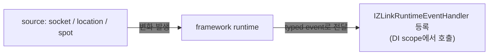

<!-- framework-adapter-nav:start -->
[문서 목록](../../../README.ko.md) | [이전: Location](10-location.ko.md) | [다음: 운영 — 메트릭 · drain · readiness](12-operations.ko.md)
<!-- framework-adapter-nav:end -->

# 11. Monitoring — runtime 이벤트 관찰

> 정식 계약은 [spec/aspnet-core-monitoring](../../spec/server/languages/dotnet/01-system-structure.ko.md)가
> 다룬다.

handler 호출만으로는 운영을 다 볼 수 없다. socket connect/disconnect, 위치·연결 상태를 runtime이
합성한 보기의 변화, spot peer/subject 변화, timer handler 실패 같은 **runtime
변화**도 framework 표면에서 받아야 한다. monitoring이 이를 source 별로 통일된
방식으로 노출한다.

## 1. source 별 표면

하부 `.NET zlink` 표면이 source마다 모양이 달라, framework는 source 별로 표면을
다르게 둔다.

| source | 방식 |
|--------|------|
| socket | raw monitor 기반 event (connect/disconnect/handshake 등) — classic channel용 |
| mesh | `AddRouteMesh`로 등록한 MeshNode의 runtime 이벤트 스트림(state/peer 전이)을 그대로 전달 |
| location | 주기적으로 상태를 읽고 직전 상태와 비교해 event 합성 (`location-runtime` source, [10-location](10-location.ko.md)) |
| spot | 주기적으로 상태를 읽고 직전 상태와 비교해 event 합성 + timer 실패는 즉시 |

공통 규칙: event kind는 `enum`, payload는 `record struct`, 어플리케이션은
`IZLinkRuntimeEventHandler<TEvent>`를 DI에 등록해 수신한다.

흐름은 단순하다 — **source에서 변화가 나면 framework가 typed handler로 전달**하고,
DI에 등록된 handler를 scope 안에서 꺼내 호출한다(HTTP 요청 handler와 같은 결).



## 2. 등록

`AddZLinkMonitoring(...)`은 **source 등록만** 한다. 실제 source(socket/spot)는
framework runtime에 올라와 있어야 한다.

```csharp
builder.Services.AddZLinkMonitoring(monitor =>
{
    monitor.AddSocketEvents(
        "profile.server",                        // channel + capability 형태
        ZLinkSocketEventKind.ConnectionReady,
        ZLinkSocketEventKind.Disconnected);

    // RouteMesh 노드의 state/peer 전이 이벤트 — mesh 이름으로 등록
    monitor.AddMeshNodeEvents("game.room");

    monitor.AddSpotEvents("stage-node", TimeSpan.FromSeconds(1));

    // location store를 등록한 배포에서 — 자기 노드의 위치/연결 상태 변화 이벤트를 받는다
    monitor.AddLocationRuntimeEvents("location-runtime", TimeSpan.FromSeconds(1));
});

// AddZLinkMonitoring은 source 등록만 한다 — event handler는 자동 등록되지 않으니 직접 DI로 등록한다.
// framework는 이벤트마다 새 scope에서 handler를 resolve 하므로 AddScoped가 자연스럽다.
builder.Services.AddScoped<
    IZLinkRuntimeEventHandler<ZLinkSocketEvent>,
    ProfileServerSocketMonitor>();
builder.Services.AddScoped<
    IZLinkRuntimeEventHandler<ZLinkLocationRuntimeEvent>,
    LocationMonitor>();
builder.Services.AddScoped<
    IZLinkRuntimeEventHandler<ZLinkSpotEvent>,
    StageNodeMonitor>();
builder.Services.AddScoped<
    IZLinkRuntimeEventHandler<ZLinkMeshRuntimeEvent>,
    RoomMeshMonitor>();
```

- socket source 이름은 `channel + capability`(예: `profile.server`,
  `profile.client`) 형태다. capability는 `server`, `client`, `publisher`,
  `subscriber` 중 하나다. spot은 `MeshNode` 등록 이름(예: `stage-node`)이다.
- location source 이름(예: `location-runtime`)은 event의 `SourceName` 으로만
  쓰이는 자유 문자열이라 별도 infrastructure 등록 이름으로 검증하지 않는다.
- location/spot polling 주기는 **항상 명시**해야 한다(숨은 기본 주기 없음 — 운영
  코드가 polling 비용을 설정에서 바로 읽도록).
- socket source가 등록된 channel capability와 맞지 않거나, spot source가 등록된
  `MeshNode` 이름과 맞지 않으면 시작 단계 예외다. location source는 자유 문자열이라
  이 검증의 대상이 아니다.
- `AddSocketEvents(...)`에 kind를 안 넘기면 그 source가 지원하는 모든 이벤트를
  받는다.
- `AddMeshNodeEvents(meshName)`의 이름은 `AddRouteMesh(meshName)`로 등록한 mesh와
  일치해야 한다(시작 단계 검증). 이벤트는 kind 필터 없이 전부 전달되고, handler는
  `ZLinkMeshRuntimeEvent.Identifier`(예: `zlink.runtime.mesh_node.peer_changed`)와
  `Reason`/`State` 필드로 구분한다.

## 3. event handler 작성

`IZLinkRuntimeEventHandler<TEvent>`를 구현한 뒤 같은 타입으로 DI에 등록하면
framework가 이벤트마다 새 DI scope를 열어 그 안에서 handler를 resolve 해 호출한다.
그래서 `AddScoped`가 기본 선택이고, handler가 무상태라면 `AddSingleton`도 무방하다.
`AddZLinkMonitoring(...)`은 source만 등록하며, event handler를 자동 스캔하거나
자동 등록하지 않는다.

> **handler가 던져도 messaging은 멈추지 않는다.** 이벤트 dispatch는 messaging 경로와 분리된
> detached task(`monitoring-event-dispatch`)로 돌아, `HandleAsync`가 예외를 던져도 그 실패는
> 격리되고 이후 메시지 처리는 정상 복구된다. 단 이 실패의 stderr 로그는 기본적으로 조용하고,
> `ZLINK_DEBUG_FRAMEWORK_TASKS=1` 환경변수를 켰을 때만 `monitoring-event-dispatch` 마커로 남는다
> (handler 문제를 추적할 땐 이 변수를 켜고 그 마커로 grep 한다).

### socket

```csharp
public sealed class ProfileServerSocketMonitor(ILogger<ProfileServerSocketMonitor> logger)
    : IZLinkRuntimeEventHandler<ZLinkSocketEvent>
{
    public ValueTask HandleAsync(ZLinkSocketEvent @event, CancellationToken ct)
    {
        switch (@event.Event)
        {
            case ZLinkSocketEventKind.ConnectionReady:
                logger.LogInformation("socket ready: {Source} {Remote}",
                    @event.SourceName, @event.RemoteAddr);
                break;
            case ZLinkSocketEventKind.Disconnected:
                logger.LogWarning("socket disconnected: {Source} {Remote} value={Value}",
                    @event.SourceName, @event.RemoteAddr, @event.Diagnostic?.NativeValue);
                break;
        }
        return ValueTask.CompletedTask;
    }
}
```

socket event만 native monitor event/value를 진단 정보로 함께 노출한다
(`Diagnostic.NativeEvent`, `Diagnostic.NativeValue`).

### mesh

```csharp
public sealed class RoomMeshMonitor(ILogger<RoomMeshMonitor> logger)
    : IZLinkRuntimeEventHandler<ZLinkMeshRuntimeEvent>
{
    public ValueTask HandleAsync(ZLinkMeshRuntimeEvent @event, CancellationToken ct)
    {
        // peer 전이는 Reason("ready"/"disconnected" 등), 노드 전이는 State로 온다.
        if (@event.PeerRid is { } peer)
            logger.LogInformation("mesh peer: {Mesh} {Peer} {Reason}",
                @event.MeshName, peer, @event.Reason);
        else if (@event.State is { } state)
            logger.LogInformation("mesh state: {Mesh} {State}", @event.MeshName, state);
        return ValueTask.CompletedTask;
    }
}
```

mesh 이벤트는 polling 합성이 아니라 MeshNode runtime의 순서 있는 이벤트
스트림([12-operations](12-operations.ko.md)의 `IZLinkRouteMeshRuntime.ObserveAsync`)을
그대로 event 버스에 올린 것이다 — `Sequence`가 mesh 안에서 단조 증가한다.

### location

location store를 등록한 배포([10-location](10-location.ko.md))에서, 자기 노드의 위치와 연결 상태
보기(활성 peer, 연결 상태, store 상태)가 바뀔 때 이벤트가 온다.

```csharp
public sealed class LocationMonitor(ILogger<LocationMonitor> logger)
    : IZLinkRuntimeEventHandler<ZLinkLocationRuntimeEvent>
{
    public ValueTask HandleAsync(ZLinkLocationRuntimeEvent @event, CancellationToken ct)
    {
        switch (@event)   // 종류별 중첩 record — 타입 패턴으로 분기한다
        {
            case ZLinkLocationRuntimeEvent.TopologyChanged topology:
                // 서버가 추가/제거되어 활성 peer 구성이 바뀌었다
                logger.LogInformation("topology: {Count} entries", topology.Topology.Count);
                break;
            case ZLinkLocationRuntimeEvent.StoreFailure failure:
                // store가 죽었다 — 기존 연결은 유지되지만 새 위치 반영이 멈춘다
                logger.LogWarning("location store unavailable: {Source}", failure.SourceName);
                break;
            case ZLinkLocationRuntimeEvent.StoreRecovered:
                logger.LogInformation("location store recovered");
                break;
        }
        return ValueTask.CompletedTask;
    }
}
```

event 종류는 enum이 아니라 **중첩 sealed record**다. `switch (@event)`에 타입
패턴을 쓰고, 각 종류의 데이터(`Topology`, `Status` 등)는 해당 record에만 있다.
종류는 `StatusChanged` / `TopologyChanged` / `ServiceSummaryChanged` /
`StoreFailure` / `StoreRecovered` **5종 고정**이다. 하부 raw monitor가 없어
framework가 `interval` 주기로 runtime query 결과를 읽어 직전 값과 비교해 합성한다.
store가 죽어도 이 source는 죽지 않는다 — 조회 실패는 `StoreFailure` 이벤트 한
번으로 강등되고, 복구되면 `StoreRecovered`가 온다.

### spot

```csharp
public sealed class StageNodeMonitor(ILogger<StageNodeMonitor> logger)
    : IZLinkRuntimeEventHandler<ZLinkSpotEvent>
{
    public ValueTask HandleAsync(ZLinkSpotEvent @event, CancellationToken ct)
    {
        switch (@event)   // 5종 고정(StatusChanged 포함) — 여기선 4종만 처리
        {
            case ZLinkSpotEvent.PeersChanged peers:
                // peers/subjects는 interval마다 상태를 비교해 합성된다(주기 의존).
                logger.LogInformation("spot peers: {Source} {Count}",
                    peers.SourceName, peers.Peers.Count);
                break;
            case ZLinkSpotEvent.SubjectsChanged subjects:
                logger.LogInformation("spot subjects: {Source} {Count}",
                    subjects.SourceName, subjects.Subjects.Count);
                break;
            // 이 둘만 발생 시점에 즉시 발행된다(polling 주기를 기다리지 않음).
            case ZLinkSpotEvent.TimerHandlerFailed failed:
                logger.LogError("spot timer failed: {Source} {Timer} {Handler} {Exception}",
                    failed.SourceName,
                    failed.Diagnostic.TimerName,
                    failed.Diagnostic.HandlerType,
                    failed.Diagnostic.ExceptionType);
                break;
            case ZLinkSpotEvent.TimerStoppedAfterUnhandledException stopped:
                logger.LogError("spot timer stopped: {Source} {Timer}",
                    stopped.SourceName, stopped.Diagnostic.TimerName);
                break;
        }
        return ValueTask.CompletedTask;
    }
}
```

spot event는 `StatusChanged`, `PeersChanged`, `SubjectsChanged`,
`TimerHandlerFailed`, `TimerStoppedAfterUnhandledException` **5종 고정**이다.

> **timer 실패는 polling 주기를 기다리지 않는다.** status/peer/subject 변화는
> `AddSpotEvents(...)`의 `interval`로 직전 상태와 비교하지만, timer handler 실패는
> 발생 시점에 즉시 발행된다. timer 정책은 [06-spot](06-spot.ko.md) §3 참고.

## 4. 자주 막히는 곳

- **이벤트가 안 온다** → `AddZLinkMonitoring`은 source 등록만 한다. 해당 source가
  `IZLinkRuntimeEventHandler<TEvent>` 구현체가 DI에 등록됐는지 확인한다.
- **자동 연결 상태를 받고 싶다** → `location-runtime` source의 이벤트
  (`AddLocationRuntimeEvents`)를 받거나, 시점 조회는 location runtime query를 쓴다
  ([10-location](10-location.ko.md) §3).
- **health/metric endpoint를 기대한다** → `AddZLinkMonitoring(...)`은 socket/
  location/spot runtime event source를 등록할 뿐 HTTP endpoint를 만들지 않는다.
  health check 나 metric은 이벤트와 runtime query를 읽어 앱이 직접 노출한다
  ([10-location](10-location.ko.md) §3).
- **등록되지 않은 메시지를 알고 싶다** → `ConfigureDispatch()`에
  `IZLinkMessageFlowObserver`를 등록한다. request 실패는 error reply로 돌아가고,
  send/publish/subscription/actor send 실패는 drop 되지만 로그, metric, observer event로 남는다.
  observer는 관측용이므로 callback이 실패해도 원래 dispatch 결과를 바꾸지 않는다.
- **handler payload의 정확한 필드** → 가이드는 자주 쓰는 필드만 보였다. 전체는
  [spec/aspnet-core-monitoring](../../spec/server/languages/dotnet/01-system-structure.ko.md) 참고.

## 5. 메시지 흐름 추적 — 메시지 생애주기 관찰

monitoring이 socket/location/spot의 **상태 변화**를 본다면, 메시지 흐름 추적은 메시지
하나가 **도착했는지 / handler로 전달됐는지 / 응답이 나갔는지**를 dispatch 경로에서 기록한다.
로그를 `corr=`로 grep 하면 한 요청의 생애주기를 노드 간에 이어서 추적할 수 있다. dispatch를
제어하는 게 아니라 관측만 한다.

`ConfigureDispatch()` 체인으로만 활성화한다(진단 필드는 read-only).

```csharp
builder.Services.AddZLinkFramework(options =>
{
    options.ConfigureDispatch()
        // off → ErrorsOnly(기본) → KeyTransitions → Verbose → Diagnostic
        .MessageFlow(ZLinkMessageFlowLogMode.KeyTransitions)
        .TraceLogFile("logs/flow-api.log")   // 지정=전용 파일, 미지정=앱 ILogger 통합, 둘 다 없으면 stderr
        .TraceLabel("api");                 // 구조화 필드 label=
});
```

- 모드 게이팅: `Dropped`·에러는 `ErrorsOnly` 이상, 성공 전이(`Received`/`Dispatched`/`Replied`/
  `Sent`/`ReplyReceived`)는 `KeyTransitions` 이상. `Off` 면 이벤트 생성 자체가 없어 제로코스트다.
- 운영 중 켜고 끄기: `IZLinkMessageFlowControl`을 DI에서 받아 `SetMessageFlowMode(...)`(재시작
  불필요, 모든 surface 즉시 반영).
- 콜렉터/OTel 연동: `IZLinkMessageFlowObserver`를 등록해 구조화 이벤트를 받는다(앱 레이어).
  framework는 OTel에 의존하지 않고 `CorrelationId` + 구조화 필드 + observer 훅까지만 제공한다
  (작성법은 바로 아래 "observer로 흐름 이벤트 받기").
- 정식 계약은 [spec/aspnet-core-monitoring §9](../../spec/server/languages/dotnet/01-system-structure.ko.md), 공통 의미는
  [공통 스펙 메시지 흐름 추적](../../spec/server/52-message-flow-tracing.ko.md) 참고.

> **샘플에서 보기 — 전 샘플.** [Bingo](../../common/sample/bingo/README.ko.md) ·
> [TicTacToe](../../common/sample/tictactoe/README.ko.md) ·
> [SupportChat](../../common/sample/supportchat/README.ko.md) ·
> [ShoppingMall](../../common/sample/event/shoppingmall.ko.md) ·
> [DeliveryDispatch](../../common/sample/deliverydispatch/README.ko.md) ·
> [GameQuest](../../common/sample/event/gamequest.ko.md)가 **모두 위 세 줄을 그대로 켠다** —
> 서버마다 `MessageFlow(KeyTransitions)` + `TraceLogFile(...)` + `TraceLabel(...)`이다.
> 이유는 E2E 규약이다: 시나리오가 실패하면 노드별 flow 로그를 evidence로 남겨
> `corr=`로 요청 하나의 생애주기를 노드 간에 이어 원인 레이어를 좁힌다. 여러 서버가
> 도는 샘플에서 `TraceLabel`이 어느 노드의 로그인지 구분해 준다.

### observer로 흐름 이벤트 받기

로그 파일만으로는 부족하고 흐름 이벤트를 코드로 받고 싶을 때(metric 집계, OTel 전송,
에러 알림) `IZLinkMessageFlowObserver`를 구현한다. 등록은 같은 `ConfigureDispatch()`
체인의 `SetMessageFlowObserver<T>()`로 하고, observer는 **DI에서 resolve** 되므로
생성자에 필요한 서비스를 주입받을 수 있다.

```csharp
options.ConfigureDispatch()
    .SetMessageFlowObserver<MetricFlowObserver>()   // DI에서 생성 — 생성자 주입 가능
    .MessageFlow(ZLinkMessageFlowLogMode.KeyTransitions);
```

```csharp
public sealed class MetricFlowObserver(IMetricSink metrics) : IZLinkMessageFlowObserver
{
    public ValueTask OnMessageFlowAsync(ZLinkMessageFlowEvent flow, CancellationToken ct)
    {
        // 에러만 추려서 집계 — Outcome으로 분기한다
        if (flow.Outcome == ZLinkMessageFlowOutcome.Error)
        {
            metrics.CountError(
                surface: flow.Surface,            // 어느 dispatch 표면에서
                kind: flow.MessageKind,           // request/send/publish 중 무엇이
                reason: flow.ErrorReason,         // 왜 실패했는지
                packet: flow.PacketName);
        }
        return ValueTask.CompletedTask;
    }
}
```

`OnMessageFlowAsync`가 매 전이마다 받는 `ZLinkMessageFlowEvent`의 주요 필드:

| 필드 | 의미 |
|------|------|
| `Outcome` | 이 이벤트가 무슨 전이인지. `Received`·`Dispatched`·`Replied`·`Sent`·`ReplyReceived`·`Dropped`·`Error` |
| `Surface` | dispatch 표면(채널/spot/stream 등 어느 경로에서 일어났는지) |
| `MessageKind` | request·send·publish 등 메시지 종류 |
| `PacketName` / `ChannelName` / `Topic` | 어떤 packet이, 어느 channel·topic에서 |
| `CorrelationId` | 노드 간 한 요청을 잇는 추적 ID(로그의 `corr=`) |
| `FlowId` | request/reply 경계를 넘어 이어지는 상위 흐름 ID(아래 flow_id 절 참고) |
| `FlowOrigin` | 이 흐름이 시작된 지점. `Inbound`·`Timer`·`Application`·`Lifecycle` |
| `SpotRid` / `ActorId` | 관련된 spot·actor(해당될 때만) |
| `SourceRid` / `LocalRid` / `PeerRid` | 이벤트의 출발 노드·현재 노드·상대 노드 routing id |
| `SocketRole` | 이벤트가 일어난 소켓 역할(server/client/publisher/subscriber 등) |
| `ErrorReason` / `ErrorAction` / `ErrorType` / `ErrorMessage` | 실패 원인·후속 처리·예외 정보(`Outcome=Error` 일 때만 채워짐) |
| `MessageSize` | payload 크기(`IncludeMessageSizes(true)` 일 때) |

전체 필드는 spec 또는 record 정의(`ZLinkMessageFlowEvent`)를 확인한다.

- **`MessageFlow(...)` 모드는 로그와 observer 양쪽의 이벤트 생성 범위를 함께 정한다.**
  observer가 모든 전이를 받는 게 아니다 — `Off` 면 이벤트를 아예 만들지 않고, `ErrorsOnly`
  는 drop/error 중심, `KeyTransitions` 이상이면 성공 전이까지 전달한다. 성공 전이는
  `TraceSampleRate(...)`로 샘플링될 수도 있다. 즉 observer는 이 게이팅·샘플링을 통과한
  이벤트만 받으므로, 모든 에러를 빠짐없이 받으려면 모드를 `ErrorsOnly` 이상으로 둔다.
- observer는 **관측 전용**이고 dispatch와 분리된 fire-and-forget으로 호출되므로,
  `OnMessageFlowAsync`가 예외를 던져도 원래 dispatch 결과는 바뀌지 않는다(흐름이 막히지
  않는다).

### flow_id — 경계를 넘는 상위 상관 키

`CorrelationId`는 **한 request와 그 reply**를 짝짓는 전송 계층 키다. 그런데 실제
업무 흐름은 request 하나로 끝나지 않는다 — 예를 들어 client 요청 하나가 spot으로
relay되고, spot이 actor를 호출하고, actor가 다른 channel로 send를 이어 갈 수 있다.
이 전체 사슬을 하나로 묶는 상위 키가 `FlowId`다.

- **설정이 없다.** `MessageFlow(...)` 모드가 `Off`가 아니면 framework가 흐름의 첫
  지점에서 자동으로 생성하고(create-if-absent), spot·actor·channel 경계를 넘어
  그대로 전파한다.
- `FlowOrigin`은 흐름이 어디서 시작됐는지 알려준다. 외부 메시지(`Inbound`), timer
  callback(`Timer`), 앱이 시작한 호출(`Application`), lifecycle callback(`Lifecycle`).
- 같은 `FlowId`로 여러 `CorrelationId`가 지나갈 수 있다. "요청 하나"를 볼 때는
  `corr=`, "업무 흐름 하나"를 볼 때는 flow id로 grep 한다.
- 공통 의미는 [공통 스펙 — 메시지 흐름 상관관계](../../spec/server/53-flow-correlation.ko.md)가
  다룬다.

## 6. 더 보기

- 이 챕터 계약의 실행 검증 예문(monitoring options/event/handler/publisher): [13-interface-catalog](13-interface-catalog.ko.md) §7 — 검증 클래스 `EventingContracts`
- 정식 계약: [spec/aspnet-core-monitoring](../../spec/server/languages/dotnet/01-system-structure.ko.md)
- location 운영 조회: [10-location](10-location.ko.md)
- 런타임 메트릭·drain 상태 관측: [12-operations](12-operations.ko.md)

---
<!-- framework-adapter-nav:bottom:start -->
[문서 목록](../../../README.ko.md) | [이전: Location](10-location.ko.md) | [다음: 운영 — 메트릭 · drain · readiness](12-operations.ko.md)
<!-- framework-adapter-nav:bottom:end -->
