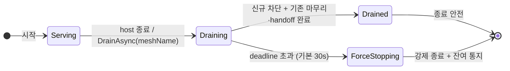

<!-- framework-adapter-nav:start -->
[문서 목록](../../../README.ko.md) | [이전: Monitoring — runtime 이벤트](11-monitoring.ko.md) | [다음: 인터페이스 카탈로그](13-interface-catalog.ko.md)
<!-- framework-adapter-nav:end -->

# 12. 운영 — 런타임 메트릭 · graceful drain · readiness

> 정식 계약은 공통 스펙 [런타임 메트릭](../../spec/server/51-runtime-metrics.ko.md)과
> [Graceful Drain & Handoff](../../spec/server/54-graceful-drain-handoff.ko.md)가 다룬다.
> `.NET` 표면의 정식 정의는 [spec/aspnet-core-monitoring §10·§12](../../spec/server/languages/dotnet/01-system-structure.ko.md)다.
> 이 챕터는 운영 환경에서 실제로 무엇을 붙이고 무엇을 선언하는지 사용법 중심으로 다룬다.

## 0. 무엇을 해주는가

서비스를 운영에 올리면 [11-monitoring](11-monitoring.ko.md)의 이벤트 관측 외에 세 가지가
더 필요하다.

1. **메트릭** — CCU, 큐 깊이, 요청 지연 같은 수치를 대시보드로 본다.
2. **graceful drain** — 배포·축소로 노드를 내릴 때 접속 유저를 튕기지 않고 정리한다.
3. **readiness** — "이 노드가 새 요청을 받아도 되는가"를 배포 인프라에 알린다.

framework는 메트릭 계기와 host 종료 시의 drain 절차를 제공한다. 앱은 meter 이름을 수집
파이프라인에 넣고, 배포 환경이 호출할 readiness endpoint를 공개 런타임 조회 API로 구성한다.

처음 나오는 용어는 다음과 같다.

| 용어 | 한 줄 풀이 |
|---|---|
| Meter / 계기(instrument) | .NET 표준 메트릭 방출 단위. counter·gauge·histogram이 계기다 |
| OpenTelemetry(OTel) | 메트릭·트레이스 수집 표준. Prometheus 등 exporter로 내보낸다 |
| drain | 신규 배정은 막고, 진행 중인 작업은 마무리하거나 넘긴 뒤 종료하는 절차 |
| handoff | drain 중인 노드의 actor를 다른 노드로 옮기는 것 |
| readiness probe | "새 요청을 받아도 되는가"를 묻는 배포 인프라의 상태 확인 |

## 1. 런타임 메트릭

framework는 `"zlink.framework"`라는 이름의 `System.Diagnostics.Metrics.Meter` 하나로
모든 계기를 방출한다. 앱은 이 정식 meter 이름을 수집 파이프라인에 등록한다.

```csharp
// 이 한 줄로 zlink 계기 전체가 앱의 OTel 파이프라인에 들어간다.
builder.Services.AddOpenTelemetry().WithMetrics(m => m
    .AddMeter("zlink.framework") // Framework가 계기를 방출하는 정식 meter 이름이다.
    .AddPrometheusExporter());
```

- zlink 전용 메트릭 API는 없다. `.NET` 표준 `Meter`/`MeterListener`가 그대로 표면이다.
  OTel 없이 수집하려면 `MeterListener`에서 meter 이름 `"zlink.framework"`를 직접 구독한다.
- 어떤 listener도 붙지 않으면 계기 갱신은 최소 비용의 비활성 경로로 끝난다. 계기를
  등록만 해 두고 켜지 않아도 messaging 성능에 영향이 없다.
- 대시보드와 exporter 선택은 앱 몫이다. framework는 내장 scrape 서버를 두지 않는다.

계기 카탈로그는 다음과 같다. MeshNode, object·STREAM, location·fanout 계기의 라벨·단위·종류는
[Runtime Metrics §§3~5](../../spec/server/51-runtime-metrics.ko.md)가 정하고, drain 계기는
[Graceful Drain §9](../../spec/server/54-graceful-drain-handoff.ko.md#9-observability-identifiers)가 정한다.

| 계기 | 무엇을 재나 |
|---|---|
| `zlink.stream.connections.active` | 활성 STREAM 연결 수(CCU) |
| `zlink.stream.connections.opened` | 누적 STREAM 연결 시작 수 |
| `zlink.stream.connections.closed` | 누적 STREAM 연결 종료 수 |
| `zlink.spot.count` | 활성 spot 수 |
| `zlink.spot.queue.depth` | Spot application queue의 pending work 수 |
| `zlink.spot.queue.wait.duration` | Spot work admission부터 turn 시작까지의 시간 |
| `zlink.actor.count` | 활성 Actor 수 |
| `zlink.actor.queue.depth` | Actor application queue의 pending payload 수 |
| `zlink.actor.queue.wait.duration` | Actor payload admission부터 turn 시작까지의 시간 |
| `zlink.actor.transfers` | Actor transfer 결과 누계 |
| `zlink.actor.transfer.duration` | Actor transfer 시작부터 terminal까지의 시간 |
| `zlink.instance_spot.activations` | Instance Spot activation 결과 누계 |
| `zlink.instance_spot.activation.duration` | 첫 주소 확인부터 Ready 또는 terminal 실패까지의 시간 |
| `zlink.instance_spot.pending.messages` | activation barrier 앞에서 기다리는 message 수 |
| `zlink.instance_spot.pending.bytes` | activation barrier 앞에서 예약한 payload byte 수 |
| `zlink.instance_spot.claim.conflicts` | Instance location claim 충돌 누계 |
| `zlink.instance_spot.takeovers` | 만료된 owner row 교체 결과 누계 |
| `zlink.mesh_node.peers.configured` | descriptor에 존재하는 peer 수 |
| `zlink.mesh_node.peers.connected` | transport가 연결된 peer 수 |
| `zlink.mesh_node.peers.ready` | admission과 handler readiness를 통과한 peer 수 |
| `zlink.mesh_node.channels.ready_members` | ChannelName select-one에 사용할 수 있는 member 수 |
| `zlink.mesh_node.channel.selections` | ChannelName select-one 결과 누계 |
| `zlink.mesh_node.requests.inflight` | reply를 기다리는 request 수 |
| `zlink.mesh_node.request.duration` | request submit부터 terminal completion까지의 시간 |
| `zlink.mesh_node.request.timeouts` | request timeout 누계 |
| `zlink.mesh_node.multicast.submits` | Logical Multicast operation 결과 누계 |
| `zlink.mesh_node.multicast.targets` | operation마다 선택한 remote MeshNode 수 |
| `zlink.mesh_node.multicast.pending` | admission을 기다리는 multicast operation 수 |
| `zlink.mesh_node.multicast.backpressures` | multicast backpressure 누계 |
| `zlink.mesh_node.multicast.drops` | multicast target별 drop 누계 |
| `zlink.mesh_node.messages.dropped` | Framework가 원인을 확인한 one-way drop 누계 |
| `zlink.mesh_node.claim.queue.depth` | owner application·infrastructure pending work 수 |
| `zlink.mesh_node.claim.active` | 현재 실행 중인 claim 수 |
| `zlink.mesh_node.claim.wait.duration` | ready부터 claim 획득까지의 시간 |
| `zlink.mesh_node.turn.duration` | application turn 실행 시간 |
| `zlink.fanout.published` | classic fanout publish 누계 |
| `zlink.fanout.received` | classic fanout receive 누계 |
| `zlink.fanout.dropped` | Framework가 원인을 확인한 classic fanout drop 누계 |
| `zlink.location.records` | 유효한 descriptor·Spot·Actor record 수 |
| `zlink.location.store.errors` | Redis read·write·lease failure 누계 |
| `zlink.location.owner_lease.renew.failures` | owner lease 갱신 실패 누계 |
| `zlink.location.owner_lease.renew.lateness` | 예정 시각 대비 owner lease 갱신 지연 |
| `zlink.observability.events.overflow` | monitoring·trace observer queue overflow 누계 |
| `zlink.drain.state` | 현재 drain state |
| `zlink.drain.duration` | drain 시작부터 terminal result까지의 시간 |
| `zlink.drain.requests.completed` | drain 중 정상 완료된 request 수 |
| `zlink.drain.actors.handed_off` | 성공한 Actor handoff 수 |
| `zlink.drain.stream_barriers.completed` | 성공한 STREAM barrier 수 |
| `zlink.drain.forced` | force stop에서 남은 work 수 |

## 2. Graceful drain — 무중단 종료

무상태 서버는 그냥 내려도 된다. 그러나 라이브 room과 바인딩된 actor, 활성 STREAM
세션을 가진 노드를 `SIGTERM`으로 즉시 죽이면 접속 유저가 전부 튕기고 진행 중 room이
유실된다. drain은 이를 막는 명시적 절차다.

drain의 수명주기는 상태 4개로 고정되어 있다.



**앱 코드는 필요 없다.** framework hosted service가 host 종료(`IHostApplicationLifetime`)에
참여해 `StopAsync`에서 자동으로 drain한다. Draining 동안 일어나는 일은 다음 순서로
고정되어 있으며 MeshNode마다 다른 정리 방식을 선택하지 않는다.

1. local MeshNode state와 readiness를 먼저 `Draining`으로 바꾸고 새 Node·Spot·Actor admission과
   새 transfer 배정을 막는다.
2. local admission을 닫은 뒤 location store descriptor 또는 manual peer control에 drain state를 게시하고,
   새 ChannelName·Logical Multicast 선택에서 제외한다. 기존 연결은 유지된다
   ([10-location §2](10-location.ko.md)).
3. drain 전에 수락한 application callback과 request가 완료될 때까지 deadline 안에서 기다린다.
4. 이동 가능한 Actor의 handoff를 처리하고 진행 중인 transfer를 종단 상태로 만든다.
5. STREAM binding과 session을 종단 상태로 만든다.
6. application이 이미 종료를 요청한 Spot을 포함해 남은 local Spot을 lifecycle 순서에 맞춰
   종료한다.
7. Spot·Actor ownership, MeshNode descriptor·owner lease와 peer resource를 정리하고
   `Drained`로 전이한다.
8. deadline(기본 30초)을 넘기거나 필수 정리가 실패하면 `ForceStopping`으로 전이해 제한된
   강제 종료를 수행하고, 모든 대기자는 같은 종단 결과를 받는다.

## 3. SPOT 종료와 다시 만들기

일반 request가 완료됐다는 이유만으로 Spot을 종료하지 않는다. drain 때는 위의 고정 순서에
따라 남은 local Spot을 종료하지만, framework가 Spot 상태를 다른 MeshNode로 복사하거나 원격에서
Spot을 자동으로 만들지는 않는다.

location row가 정리된 뒤 기존 `SpotHandle`로 호출하면 stale handle 또는 target-not-found로
끝난다. Spot이 다시 필요하면 application이 대상 프로세스의 local `IZLinkSpotManager`에서
`GetOrCreateAsync`를 명시적으로 호출하고, 필요한 상태는 application이 복원한다. 이 호출은
다른 serving MeshNode를 선택해 원격 생성을 요청하는 API가 아니다.

`InstanceSpotAddress`는 이 기존 SpotHandle·Spot manager 계약과 분리된 주소다. Instance factory를 등록한
serving MeshNode가 있으면 이 주소의 첫 direct send/request가 location claim과 actor-free Instance Spot
activation을 시작할 수 있다. Drain operation이 기존 Spot을 다른 node로 옮기는 것은 아니며, Instance Spot도
close와 owner release가 끝난 뒤 시작한 새 주소 호출에서만 새 generation으로 activation된다.

## 4. 명시 제어와 readiness

배포 자동화가 종료 시점을 직접 통제하려면 `IZLinkRouteMeshRuntime`(DI singleton)에서
등록한 mesh 이름을 지정해 drain을 시작한다. 대부분의 앱은 자동 drain으로 충분해서 이
표면을 직접 쓸 일이 없다.

```csharp
var meshRuntime = app.Services.GetRequiredService<IZLinkRouteMeshRuntime>();
var result = await meshRuntime.DrainAsync(
    "game.room",                       // 등록한 MeshName의 고정 drain을 시작한다.
    TimeSpan.FromSeconds(25),
    cancellationToken: ct);

if (result is ZLinkMeshDrainResult.ForceStopped forced)
    Console.Error.WriteLine($"mesh drain force-stopped: {forced.Reason}");
```

- `DrainAsync(meshName, deadline, cancellationToken)`는 멱등이다. 첫 호출이 공유 deadline을
  고정하고, 이후 호출은 같은 결과에 합류한다. `deadline`을 생략하거나 `null`로 넘기면
  기본 30초를 쓴다.
- `AwaitDrainedAsync(meshName, cancellationToken)`는 drain을 시작하지 않고 완료만 기다린다.
  drain 시작 전에 호출해도 같은 결과를 받는다.
- 결과는 `ZLinkMeshDrainResult.Drained` 또는
  `ZLinkMeshDrainResult.ForceStopped(string Reason)`이다. 강제 종료 reason은
  `deadline_exceeded`, `drain_state_publish_failed`, `owner_cleanup_failed`,
  `teardown_failed` 중 하나다.

readiness는 framework 전용 health check 확장을 등록하는 방식이 아니다. 앱이 운영할
mesh의 상태를 `IsReady(meshName)`으로 읽고 기존 HTTP endpoint에 연결한다.

```csharp
// Serving일 때만 200을 반환해 배포 인프라가 신규 요청을 배정하도록 한다.
app.MapGet("/healthz/ready", (IZLinkRouteMeshRuntime runtime) =>
    runtime.IsReady("game.room")
        ? Results.Ok()
        : Results.StatusCode(StatusCodes.Status503ServiceUnavailable));
```

`IsReady(meshName)`은 해당 mesh가 `Serving`일 때만 `true`다. 여러 mesh를 운영하는 앱은
외부 트래픽을 받기 위해 필요한 mesh들을 정하고, 그 결과를 조합하는 readiness 정책을
앱의 endpoint에 둔다.

Kubernetes 배포에 연결하면 다음 개념이 된다.

```yaml
# readiness probe → /healthz/ready — Draining 진입 즉시 신규 트래픽 대상에서 제외
# preStop hook + terminationGracePeriodSeconds ≥ drain deadline — 자동 drain이 끝날 시간을 확보
```

## 5. MeshNode 런타임 제어와 관측

`AddRouteMesh`로 등록한 MeshNode는 두 DI singleton으로 운영한다.

**런타임 옵션 — `IZLinkRouteMeshRuntimeOptions`.** serving 중에 바꿀 수 있는 값은
두 가지뿐이다. 나머지 소켓 옵션(HWM·timeout)은 시작 전 `ConfigureRouterSocket()`
전용이다.

```csharp
var meshOptions = app.Services.GetRequiredService<IZLinkRouteMeshRuntimeOptions>();
meshOptions.MeshNode("game.room").MaxMessageSize = 8 * 1024 * 1024;  // 0 = 무제한
meshOptions.Channel("game.room").Weight = 0;                          // 신규 select-one 대상에서 제외
```

`Weight`는 0~100이고 즉시 반영된다. 0은 그 membership을 새 select-one과 Logical
Multicast 원격 대상에서 빼는 값이라, 재배포 전 트래픽을 빼는 용도로 쓴다. 등록되지
않은 mesh나 membership을 조회하면 `ZLinkConfigurationException`이다.

**상태 조회 — `IZLinkRouteMeshRuntime`.** mesh 하나에 대해 일관된 snapshot 한 장,
순서 있는 이벤트 스트림, drain 진입점을 제공한다.

```csharp
var meshRuntime = app.Services.GetRequiredService<IZLinkRouteMeshRuntime>();

var snapshot = meshRuntime.Snapshot("game.room");   // 노드 상태·peer·channel 일관 스냅샷
var ready = meshRuntime.IsReady("game.room");

await foreach (var meshEvent in meshRuntime.ObserveAsync("game.room", cancellationToken: ct))
{
    // state/peer 전이가 Sequence 순서로 온다 — 11-monitoring의
    // AddMeshNodeEvents(mesh)는 이 스트림을 event 버스에 올린 것이다.
}
```

`DrainAsync(meshName, ...)`와 `AwaitDrainedAsync(meshName, ...)`는 §4의 공개 drain
진입점이다. 첫 `DrainAsync` 호출이 공유 deadline을 고정하고, 이후 호출과 대기자는 모두
같은 `ZLinkMeshDrainResult` 종단 결과를 받는다.

## 6. drain 상태 관측

drain 상태 전이는 `IZLinkRouteMeshRuntime`의 MeshName별 bounded event stream에서 관측한다. 별도 전역
drain control이나 guide에만 존재하는 event handler interface를 등록하지 않는다.

```csharp
var runtime = app.Services.GetRequiredService<IZLinkRouteMeshRuntime>();

await foreach (var meshEvent in runtime.ObserveAsync(
    "game.room", cancellationToken: ct))
{
    // 이 MeshName의 event 중 drain 상태 전이만 선택한다.
    if (meshEvent.Identifier == "zlink.runtime.mesh_node.drain_changed" &&
        meshEvent.State is { } state)
        logger.LogInformation("mesh drain: {Mesh} {State} {Reason}",
            meshEvent.MeshName, state, meshEvent.Reason);
}
```

`zlink.runtime.mesh_node.drain_changed` 이벤트의 `State`로
`Serving`/`Draining`/`Drained`/`ForceStopping` 전이를 구분한다. 이벤트의 `MeshName`은
관측한 mesh를 나타내고 `Reason`은 전이 사유를 담는다. 수치로 보려면 §1의
`zlink.drain.*` 계기를 쓴다.

---
<!-- framework-adapter-nav:bottom:start -->
[문서 목록](../../../README.ko.md) | [이전: Monitoring — runtime 이벤트](11-monitoring.ko.md) | [다음: 인터페이스 카탈로그](13-interface-catalog.ko.md)
<!-- framework-adapter-nav:bottom:end -->
