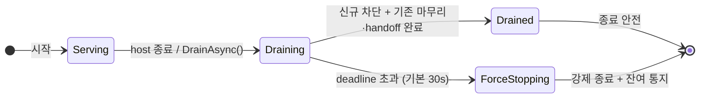

<!-- framework-adapter-nav:start -->
[문서 목록](../../../README.ko.md) | [이전: Monitoring — runtime 이벤트](11-monitoring.ko.md) | [다음: 인터페이스 카탈로그](13-interface-catalog.ko.md)
<!-- framework-adapter-nav:end -->

# 12. 운영 — 런타임 메트릭 · graceful drain · readiness

> 정식 계약은 공통 스펙 [런타임 메트릭](../../spec/server/51-runtime-metrics.ko.md)과
> [Graceful Drain & Handoff](../../spec/server/54-graceful-drain-handoff.ko.md)가 다룬다.
> `.NET` 표면의 정식 정의는 [spec/aspnet-core-monitoring §10·§12](../../spec/server/languages/dotnet/01-system-structure.ko.md)다.
> 이 챕터는 운영 환경에서 실제로 무엇을 붙이고 무엇을 선언하는지 사용법 중심으로 다룬다.

## 0. 무엇을 해주는가

서비스를 운영에 올리면 [11-monitoring](11-monitoring.ko.md)의 이벤트 관측 외에 세 가지가
더 필요하다.

1. **메트릭** — CCU, 큐 깊이, 요청 지연 같은 수치를 대시보드로 본다.
2. **graceful drain** — 배포·축소로 노드를 내릴 때 접속 유저를 튕기지 않고 정리한다.
3. **readiness** — "이 노드가 새 요청을 받아도 되는가"를 배포 인프라에 알린다.

framework는 셋 다 **무설정이 기본**이다. 메트릭은 meter 이름 하나만 파이프라인에 넣으면
나오고, drain은 host 종료에 자동으로 참여하고, readiness는 health check 한 줄로 등록된다.

처음 나오는 용어는 다음과 같다.

| 용어 | 한 줄 풀이 |
|---|---|
| Meter / 계기(instrument) | .NET 표준 메트릭 방출 단위. counter·gauge·histogram이 계기다 |
| OpenTelemetry(OTel) | 메트릭·트레이스 수집 표준. Prometheus 등 exporter로 내보낸다 |
| drain | 신규 배정은 막고, 진행 중인 작업은 마무리하거나 넘긴 뒤 종료하는 절차 |
| handoff | drain 중인 노드의 actor를 다른 노드로 옮기는 것 |
| readiness probe | "새 요청을 받아도 되는가"를 묻는 배포 인프라의 상태 확인 |

## 1. 런타임 메트릭

framework는 `"zlink.framework"` 라는 이름의 `System.Diagnostics.Metrics.Meter` 하나로
모든 계기를 방출한다. 앱이 배우는 것은 이 이름 하나다. 상수는
`ZLinkMeters.Framework`다.

```csharp
// 이 한 줄로 zlink 계기 전체가 앱의 OTel 파이프라인에 들어간다.
builder.Services.AddOpenTelemetry().WithMetrics(m => m
    .AddMeter(ZLinkMeters.Framework)
    .AddPrometheusExporter());
```

- zlink 전용 메트릭 API는 없다. `.NET` 표준 `Meter`/`MeterListener`가 그대로 표면이다.
  OTel 없이 수집하려면 `MeterListener`로 `ZLinkMeters.Framework`를 직접 구독한다.
- 어떤 listener도 붙지 않으면 계기 갱신은 최소 비용의 비활성 경로로 끝난다. 계기를
  등록만 해 두고 켜지 않아도 messaging 성능에 영향이 없다.
- 대시보드와 exporter 선택은 앱 몫이다. framework는 내장 scrape 서버를 두지 않는다.

계기 카탈로그는 다음과 같다. 라벨·단위·종류의 정식 정의는
[공통 스펙 §4](../../spec/server/51-runtime-metrics.ko.md)를 본다.

| 계기 | 무엇을 재나 |
|---|---|
| `zlink.stream.connections.active` | 활성 STREAM 연결 수(CCU) |
| `zlink.stream.connections.opened` / `.closed` | 누적 연결 시작/종료 수 |
| `zlink.stream.session.bind.duration` | 연결이 session에 bind되기까지 걸린 시간 |
| `zlink.stream.inbound.bytes` / `.outbound.bytes` | 수신/송신 바이트 |
| `zlink.spot.count` | 활성 spot 수 |
| `zlink.spot.queue.depth` / `.queue.wait.duration` | spot 실행 큐 깊이 / 큐 대기 시간 |
| `zlink.spot.timer.tick.lateness` | timer tick이 예정보다 늦은 정도 |
| `zlink.spot.created` / `.closed` | 누적 spot 생성/종료 수 |
| `zlink.actor.count` / `.mailbox.depth` | 활성 actor 수 / mailbox 대기 항목 수 |
| `zlink.actor.transfers` / `.transfer.duration` | actor 이동 횟수 / 이동 소요 시간 |
| `zlink.actor.transfer.pending_requests.count` | 이동 시점에 대기 중이던 request 수 |
| `zlink.channel.request.duration` / `.request.inflight` | 요청 지연 / 진행 중 요청 수 |
| `zlink.channel.request.timeouts` / `.messages.dropped` | 요청 timeout / drop된 메시지 수 |
| `zlink.fanout.published` / `.received` | publish한/받은 이벤트 수 |
| `zlink.location.peers` | store가 보는 활성 peer 수 |
| `zlink.location.store.errors` / `.write.conflicts` | store 오류 / 쓰기 충돌 수 |
| `zlink.location.owner_lease.renew.failures` / `.renew.lateness` | lease 갱신 실패 / 갱신 지각 |
| `zlink.observability.observer.overflow` | 관측 이벤트 큐가 넘쳐 drop된 이벤트 수 |
| `zlink.drain.state` / `.duration` | 현재 drain 상태 / drain 소요 시간 |
| `zlink.drain.actors.handed_off` / `.rooms.drained` / `.forced` | 넘긴 actor / 정리된 room / 강제 종료된 잔여 수 |

## 2. Graceful drain — 무중단 종료

무상태 서버는 그냥 내려도 된다. 그러나 라이브 room과 바인딩된 actor, 활성 STREAM
세션을 가진 노드를 `SIGTERM`으로 즉시 죽이면 접속 유저가 전부 튕기고 진행 중 room이
유실된다. drain은 이를 막는 명시적 절차다.

drain의 수명주기는 상태 4개로 고정되어 있다.



**앱 코드는 필요 없다.** framework hosted service가 host 종료(`IHostApplicationLifetime`)에
참여해 `StopAsync`에서 자동으로 drain한다. Draining 동안 일어나는 일은 다음 순서로
고정되어 있다.

1. location store의 peer row에 `Draining` 표시를 켠다. 이 노드는 신규 배치 후보에서
   빠지지만 **기존 연결은 유지된다**([10-location §2](10-location.ko.md)).
2. 새 STREAM 연결, 새 SPOT 생성, 새 actor join을 거부한다. 진행 중이던 transfer의
   inbound commit은 받아들인다.
3. 이동 가능한 actor를 다른 노드로 handoff하고, spot은 §3의 선언된 정책으로 정리한다.
4. 처리 중이던 request와 callback이 끝날 때까지 deadline 안에서 기다린다.
5. owner row와 lease를 정리하고 `Drained`로 전이한다.
6. deadline(기본 30초)을 넘기면 `ForceStopping`으로 전이한다. 잔여 room과 actor를 강제
   종료하고, 활성 STREAM 세션에는 종료 사유(`server_drain`)를 담은 통지를 보낸다.

## 3. SPOT drain 정책 선언

spot은 상태를 자동으로 옮길 수 없으므로, mesh 등록 시 정리 방식을 앱이 선언한다.

```csharp
options.AddRouteMesh("orders")
    .UseDrainPolicy(ZLinkMeshNodeDrainPolicy.ReleaseAndRecreate);
```

| 정책 | 동작 | 적합한 SPOT |
|---|---|---|
| `DrainNatural` (기본) | 신규 join만 막고 room이 자연 종료될 때까지 기다린다 | 한 판이 짧은 room(TicTacToe, Bingo) |
| `ReleaseAndRecreate` | 실행 큐를 비운 뒤 spot을 닫고 row를 해제한다. 다음 요청이 다른 노드에서 `GetOrCreate`로 재구성한다 | 외부 영속 상태에서 재구성 가능한 event-sourcing owner spot(주문 workflow 등) |

`ReleaseAndRecreate`는 그 spot이 외부 영속 상태에서 재구성 가능할 때만 선언한다.
framework가 메모리 상태를 자동으로 복사해 주지 않는다.

> **샘플에서 보기 — [ShoppingMall](../../common/sample/event/shoppingmall.ko.md).** 주문
> workflow Spot이 event sourcing으로 재구성 가능하므로 `ReleaseAndRecreate`를
> 선언한다. drain된 노드가 갖고 있던 주문은 다음 요청의 `GetOrCreateAsync`가 다른
> 노드에서 이어받는다.

## 4. 명시 제어와 readiness

배포 자동화가 종료 시점을 직접 통제하려면 `IZLinkDrainControl`(DI singleton)을 쓴다.
대부분의 앱은 자동 drain으로 충분해서 이 표면을 쓸 일이 없다.

```csharp
var drain = app.Services.GetRequiredService<IZLinkDrainControl>();
var result = await drain.DrainAsync(TimeSpan.FromSeconds(25), ct);
// result는 Drained 또는 ForceStopped(reason)다.
```

- `DrainAsync()`는 멱등이다. 첫 호출이 deadline을 고정하고, 이후 호출은 같은 결과에
  합류한다. 인자 없는 overload는 기본 30초를 쓴다.
- `AwaitDrainedAsync()`는 drain을 시작하지 않고 완료만 기다린다. drain 시작 전에
  등록해도 같은 결과를 받는다.
- 결과는 `Drained` 또는 `ForceStopped(ZLinkDrainForceReason)`다. reason은
  `DeadlineExceeded`, `DrainingStatePublishFailed`, `OwnerCleanupFailed`,
  `TeardownFailed` 네 가지다.

readiness는 두 표면 중 하나로 연결한다.

```csharp
// ASP.NET Core health check 통합 — "zlink-drain" 체크가 ready 태그로 등록된다.
builder.Services.AddHealthChecks().AddZLinkDrainHealthCheck();
app.MapHealthChecks("/healthz/ready",
    new HealthCheckOptions { Predicate = check => check.Tags.Contains("ready") });
```

직접 읽으려면 `IZLinkDrainControl.IsReady`를 쓴다. `Serving`일 때만 `true`다.

Kubernetes 배포에 연결하면 다음 개념이 된다.

```yaml
# readiness probe → /healthz/ready — Draining 진입 즉시 신규 트래픽 대상에서 제외
# preStop hook + terminationGracePeriodSeconds ≥ drain deadline — 자동 drain이 끝날 시간을 확보
```

## 5. MeshNode 런타임 제어와 관측

`AddRouteMesh`로 등록한 MeshNode는 두 DI singleton으로 운영한다.

**런타임 옵션 — `IZLinkRouteMeshRuntimeOptions`.** serving 중에 바꿀 수 있는 값은
두 가지뿐이다. 나머지 소켓 옵션(HWM·timeout)은 시작 전 `ConfigureRouterSocket()`
전용이다.

```csharp
var meshOptions = app.Services.GetRequiredService<IZLinkRouteMeshRuntimeOptions>();
meshOptions.MeshNode("game.room").MaxMessageSize = 8 * 1024 * 1024;  // 0 = 무제한
meshOptions.Channel("game.room", "game.room").Weight = 0;            // 신규 select-one 대상에서 제외
```

`Weight`는 0~100이고 즉시 반영된다. 0은 그 membership을 새 select-one과 Logical
Multicast 원격 대상에서 빼는 값이라, 재배포 전 트래픽을 빼는 용도로 쓴다. 등록되지
않은 mesh나 membership을 조회하면 `ZLinkConfigurationException`이다.

**상태 조회 — `IZLinkRouteMeshRuntime`.** mesh 하나에 대해 일관된 snapshot 한 장,
순서 있는 이벤트 스트림, drain 진입점을 제공한다.

```csharp
var meshRuntime = app.Services.GetRequiredService<IZLinkRouteMeshRuntime>();

var snapshot = meshRuntime.Snapshot("game.room");   // 노드 상태·peer·channel 일관 스냅샷
var ready = meshRuntime.IsReady("game.room");

await foreach (var meshEvent in meshRuntime.ObserveAsync("game.room", cancellationToken: ct))
{
    // state/peer 전이가 Sequence 순서로 온다 — 11-monitoring의
    // AddMeshNodeEvents(mesh)는 이 스트림을 event 버스에 올린 것이다.
}
```

`DrainAsync(mesh)`/`AwaitDrainedAsync(mesh)`는 §4의 `IZLinkDrainControl`과 같은
공유 drain에 위임한다 — 첫 호출이 deadline을 고정하고 모두 같은 종단 결과를 받는다.

## 6. drain 상태 관측

drain 상태 전이는 [11-monitoring](11-monitoring.ko.md)의 이벤트 메커니즘을 그대로 쓴다.
source 등록은 필요 없다. handler만 DI에 등록하면 된다.

```csharp
public sealed class DrainMonitor(ILogger<DrainMonitor> logger)
    : IZLinkRuntimeEventHandler<ZLinkDrainEvent>
{
    public ValueTask HandleAsync(ZLinkDrainEvent @event, CancellationToken ct)
    {
        logger.LogInformation("drain state: {State}", @event.State);
        return ValueTask.CompletedTask;
    }
}
```

`ZLinkDrainEvent.State`는 `Serving`/`Draining`/`Drained`/`ForceStopping` 네 값이고
`SourceName`은 고정값 `"drain"`이다. 수치로 보려면 §1의 `zlink.drain.*` 계기를 쓴다.

---
<!-- framework-adapter-nav:bottom:start -->
[문서 목록](../../../README.ko.md) | [이전: Monitoring — runtime 이벤트](11-monitoring.ko.md) | [다음: 인터페이스 카탈로그](13-interface-catalog.ko.md)
<!-- framework-adapter-nav:bottom:end -->
