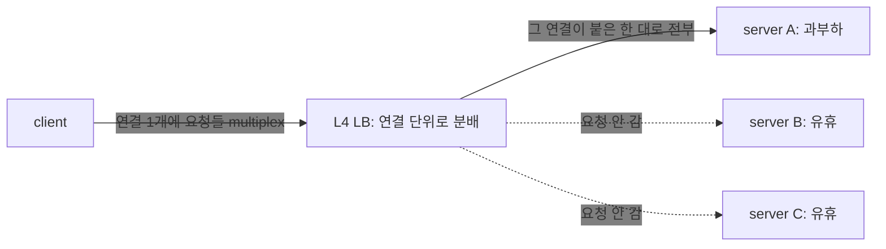
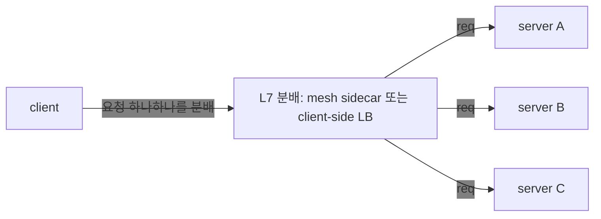
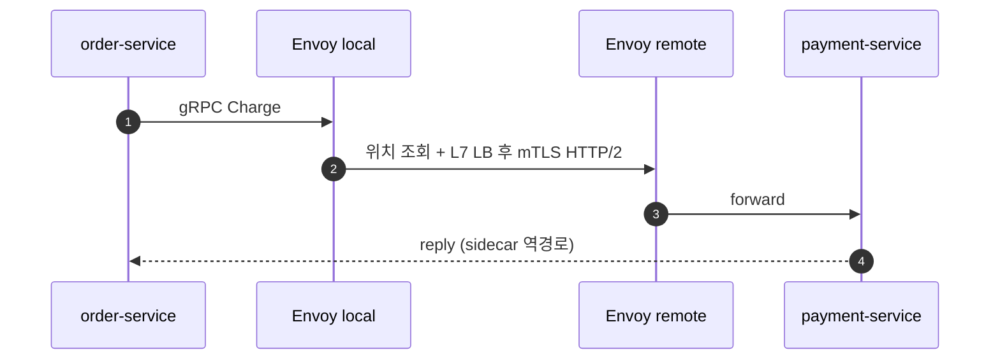
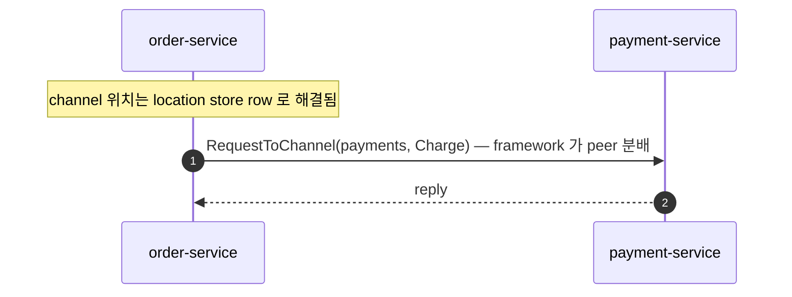

<!-- framework-adapter-nav:start -->
[문서 목록](../../../README.ko.md) | [이전: 인터페이스 카탈로그](12-interface-catalog.ko.md) | [다음: 케이스 — 전자상거래 체크아웃](case-studies/13-case-ecommerce-checkout.ko.md)
<!-- framework-adapter-nav:end -->

# 13. ZLink 을 어디에 쓰나 — 내부 서비스 통신과 실시간 상태 서버 패턴

> ZLink 은 단순 RPC 라이브러리가 아니라, `.NET` 백엔드에서 **논리 channel, 연결
> 수명, 동적 상태 단위(SPOT), pub/sub, 위치 기반 자동 연결을 한 framework 안에서 묶어 주는
> 서버 간·실시간 메시징 계층**이다. 특히 "서비스가 어디 떠 있는지", "client 가
> 어디 붙어 있는지", "room/zone/symbol 같은 상태 단위를 어떻게 직렬 처리할지" 가
> **반복 문제로 나올 때** 효과가 크다.
>
> 이 챕터는 그 판단을 돕는 **허브 + 도입 판단 문서**다. 도메인별 상세 사례는 §5 의
> 개별 케이스가, 사용법 정식은 04~09 챕터가 다룬다.

## 1. 한눈에 보는 사용처

먼저 경계를 잡는다. **모노리스나 모듈러 모노리스로 충분하면 ZLink 를 먼저 넣지
않는다.** 같은 프로세스 안의 모듈 호출은 함수 호출이면 되고, 서버 간 transport 가
필요 없다. ZLink 는 여러 프로세스/서버로 나뉘어야 하는 이유가 생겼을 때, 그 사이의
통신·연결·라우팅·상태 dispatch 복잡도를 줄이는 도구다.

| 상황 | ZLink 이 좋은 이유 | 쓰는 기능 |
|------|--------------------|-----------|
| 내부 `.NET` 서비스끼리 자주 호출 | host/port/stub 대신 **channel name** 으로 호출 | channel + location store |
| 이벤트를 실시간으로 여러 서비스에 뿌림 | 별도 broker 없이 **transport fan-out** | fanout pub/sub |
| 게임 room·채팅 room·ride zone 같은 동적 상태 단위 | **단일 실행 큐**로 lock 없는 직렬 상태 처리 | SPOT |
| 모바일·게임 client 와 장기 연결 | 연결 수명·framing·재접속 흐름을 framework 가 소유 | STREAM |
| 연결 서버와 로직 서버를 분리 | actor id 기준 binding 으로 **재접속 이전성** | session actor dispatch |
| **서로 다른 언어로 구현된 서비스끼리 호출** | 언어 중립 wire protocol + codec 위 같은 channel 계약으로 **상호 호출** | cross-language binding |
| 초저지연 HFT·durable queue·외부 공개 API | **ZLink 주 영역 아님** | gRPC/REST/Kafka/FIX 유지 |

## 2. 무엇을 덜 고민하게 되나 — 개발 모델

ZLink 의 체감 장점은 "인프라 박스가 빠진다"보다 **"개발자가 덜 고민한다"** 에 있다.
응용은 도메인 단위(channel/spot/session)만 다루고, 나머지는 framework 가 가져간다.

- **channel name 만 알고 호출한다** — 대상 host/port/stub 를 모른다.
- **service location 과 peer 분배**는 location store 기반 자동 연결이 맡는다([09-location](09-location.ko.md)).
- **request correlation 과 reply 대기**는 framework 가 맡는다.
- **client 연결 수명과 packet framing** 은 STREAM 이 맡는다.
- **room/zone/symbol 상태 직렬성**은 SPOT 실행 큐가 맡는다.
- **재접속 후 actor/session binding** 은 framework 가 이어 준다.
- **handler/filter/DI 모델**이 `ASP.NET Core` 방식과 맞아 익숙하게 쓴다.

> ZLink 은 이 문제들을 **없애는 게 아니라 호출자 밖으로 밀어낸다.** 위치·연결·
> correlation·dispatch 직렬성을 framework 가 가져가므로, 응용 코드가 transport
> 설정이 아니라 **업무 흐름처럼** 보인다.

### 2.1 여러 언어가 한 channel 위에서 (cross-language)

ZLink 은 `.NET` 전용이 아니다. 호출 계약이 **언어 중립 wire protocol(ZMP) +
codec(protobuf/json/messagepack) + 논리 channel/packet 이름** 이라, 서로 다른
언어로 구현된 서비스가 **같은 channel 위에서 상호 호출**한다. 예를 들어 게임
시스템에서 **room 서버는 C++, API·매치메이킹 서버는 .NET 또는 Java** 로 두고 같은
channel/spot 계약으로 메시징할 수 있다.

- 언어 간 계약 = **packet 이름 + codec 으로 인코딩된 DTO**(교차 언어는 protobuf
  권장, 또는 합의된 JSON/MessagePack 스키마). gRPC 처럼 service-stub 코드 생성이나
  HTTP/2 를 강제하지 않는다 — payload 스키마만 공유하면 된다.
- 각 언어 binding 은 같은 core(C ABI, ZMP) 위에 handler/SPOT/STREAM 표면을 올린다.
  그래서 handler 작성 언어가 달라도 wire 상으로는 같은 channel·packet 이다.

> **다른 언어 binding.** `.NET` 이 reference 구현이며, 같은 channel/packet 계약을
> 다른 언어 binding 이 자기 언어로 구현한다. 이 가이드는 `.NET` binding 기준이다.
> cross-language 는 ZLink 의 **설계 목표**다 — 호출 계약이 binding 구현 언어와
> 무관하기 때문이다.

## 3. 이런 문제가 반복되면 ZLink 후보

기술명보다 **증상**으로 판단한다. 아래가 반복되면 ZLink 가 후보다.

- 서비스마다 gRPC stub·channel factory·deadline·서비스 위치 조회 설정이 반복된다.
- Kubernetes L4 LB 로 gRPC 부하가 고르게 안 퍼져 mesh 를 고민한다.
- 게임 room·채팅 room·ride zone 처럼 상태 단위를 lock 으로 보호하고 있다.
- 재접속 때 client 가 어느 서버에 붙어 있었는지 Redis 로 따로 관리한다.
- 실시간 이벤트 fan-out 때문에 Kafka 를 쓰는데, 실제로는 replay 가 필요 없다.
- 외부 client 연결·내부 서비스 호출·room 상태 처리가 서로 다른 framework 로 흩어져
  있다.

## 4. ZLink 이 하지 않는 것 — 경계

장점이 선명하려면 경계도 분명해야 한다. 다음은 그대로 두는 게 맞다.

| 요구 | ZLink 판단 |
|------|------------|
| 외부 공개 HTTP API | REST/gRPC 유지 |
| durable queue·replay·consumer offset | Kafka/NATS 유지 |
| DB 조회·geo-index·audit trail | DB/Redis/event store 유지 |
| HFT 마이크로초 matching loop | Disruptor/Aeron/FIX 유지 |
| 내부 `.NET` 서비스 통신 + 실시간 상태 dispatch | **ZLink 적합** |

요지: ZLink 은 transport·dispatch 계층이지 **datastore·durable log·HFT 버스가
아니다.** 분산 데이터 일관성(saga·outbox·idempotency)·영속·중복 제어 같은
도메인 난제는 그대로 응용/인프라가 진다(각 케이스의 "그대로 남는 것" 참고).

## 5. 케이스 스터디 — 도메인별 개별 문서

쉬운 기본형 → 기능이 모두 필요한 강한 사례 → 경계가 분명한 사례 순으로 읽으면 된다.

| 케이스 | 무엇을 보나 | ZLink 핵심 기능 |
|--------|-------------|-----------------|
| [13 전자상거래 체크아웃](case-studies/13-case-ecommerce-checkout.ko.md) | channel messaging 기본형(request/send/pub-sub) | channel + pub/sub |
| [14 내부 마이크로서비스 mesh + 운영](case-studies/14-case-microservice-mesh.ko.md) | 서비스 위치 조회와 운영·topology | channel + location store + monitoring |
| [15 실시간 멀티플레이 게임](case-studies/15-case-realtime-game.ko.md) | STREAM+SPOT+actor 가 모두 필요한 강한 사례 | STREAM + SPOT + actor + session dispatch |
| [16 라이드헤일링 디스패치](case-studies/16-case-ride-hailing.ko.md) | zone 상태와 위치 fan-out | STREAM + pub/sub + zone SPOT |
| [17 채팅·메시징](case-studies/17-case-chat-messaging.ko.md) | room membership 과 presence | STREAM + room SPOT + BoundSession |
| [17-1 마켓플레이스 채팅](case-studies/17-1-case-marketplace-chat.ko.md) | 거래·문의 conversation | STREAM + conversation actor/SPOT |
| [17-2 라이브 커머스 채팅](case-studies/17-2-case-live-commerce-chat.ko.md) | live chat, slow mode, moderation | STREAM + stream SPOT |
| [17-3 게임 채팅](case-studies/17-3-case-game-chat.ko.md) | party/guild/match chat scope | STREAM + player actor + room |
| [18 트레이딩 시스템](case-studies/18-case-trading-system.ko.md) | SPOT 모델은 맞지만 HFT 핫패스는 제외되는 경계 사례 | STREAM + symbol SPOT + pub/sub |

각 케이스는 "도메인의 진짜 난제 → 기존 스택 → ZLink 스택 → 코드 비교 → 아키텍처·
메시지 흐름 비교 → 줄어드는 것/그대로 남는 것" 순으로 구성된다.

### 5.1 케이스 스터디와 샘플 문서의 차이

케이스 스터디와 샘플은 역할이 다르다.

| 구분 | 먼저 답하는 질문 | 문서가 다루는 것 |
|------|------------------|--------------------|
| 케이스 스터디 | "이 도메인에 ZLink 를 넣을 만한가?" | 도메인 난제, 기존 스택, ZLink 매핑, 줄어드는 것, 그대로 남는 것 |
| 샘플 문서(`guide/samples/`) | "실제로 어떻게 등록하고 실행하나?" | 프로젝트 구조, 등록 코드, handler/DTO, 실행 방법, 검증 흐름 |

따라서 케이스 스터디는 실행 가능한 전체 예제를 대체하지 않는다. 케이스에서 도입
판단과 아키텍처 위치를 잡고, 같은 패턴을 코드로 따라 해 볼 때 샘플 문서를 본다.
샘플 문서는 기능별 구현 학습이 목적이므로, 특정 도메인에서 ZLink 가 맞는지
판단하는 내용은 이 문서와 각 케이스 스터디가 다룬다.

## 6. 참고 — gRPC·service mesh 스택과의 비교

§1 의 "내부 `.NET` 서비스끼리 자주 호출" 이 왜 ZLink 후보인지, gRPC 스택과 비교해
근거를 본다.

### 6.1 gRPC 는 혼자 끝나지 않는다

gRPC 자체는 빠르고 좋다. 문제는 이런 류의 서비스를 **"프로덕션급"** 으로 만들려면
공식 베스트프랙티스가 곧바로 추가 인프라를 요구한다는 점이다.

- **channel/stub 재사용 강제.** "Always re-use stubs and channels when possible" —
  호출마다 channel 을 만들면 지연이 크게 늘어 channel factory/pool 로 수명을 직접
  관리한다. ([grpc.io performance](https://grpc.io/docs/guides/performance/))
- **deadline 을 매 호출에.** 단일 느린 RPC 가 상위 서비스를 막지 않도록 deadline 을
  건다. ([Microsoft Learn](https://learn.microsoft.com/en-us/aspnet/core/grpc/performance))
- **기본 로드밸런서(L4)로는 gRPC 부하가 고르게 안 흩어진다.**
  - **L4 로드밸런서**란 네트워크 4계층(TCP) 수준에서, 즉 **"연결(connection)" 단위**로
    트래픽을 나누는 흔한 로드밸런서다. 새 연결이 들어올 때마다 여러 서버에 번갈아
    배정한다.
  - 그런데 gRPC 는 **HTTP/2** 위에서 **연결 하나를 오래 열어 둔 채(long-lived
    connection)** 그 연결에 여러 요청을 겹쳐 실어 보낸다. 이렇게 한 연결로 여러 호출을
    동시에 실어 나르는 것을 **multiplex(다중화)** 라고 한다.
  - 그래서 L4 로드밸런서 눈에는 **연결이 1개뿐**이라, 그 연결이 처음 붙은 **서버 한
    대로 모든 요청이 쏠린다**(나머지 서버는 거의 논다).
  - 고르게 나누려면 연결이 아니라 **요청(request) 하나하나를 보고 분배**해야 한다.
    이렇게 애플리케이션 7계층에서 요청 단위로 나누는 것을 **L7 분배**라고 한다.
  - 그래서 보통 아래 중 하나를 추가로 끌어온다.
    - **client-side LB**: 클라이언트가 서버 목록을 들고 직접 번갈아 호출하는 방식.
    - **headless service**(Kubernetes): 서비스를 단일 가상 IP 하나가 아니라 **뒤에
      있는 각 파드의 IP 목록**으로 노출해, 클라이언트가 직접 골고루 분배하게 하는
      방식.
    - **Envoy/Istio service mesh sidecar**: 각 서비스 옆에 자동으로 붙는 **프록시**가
      요청 단위(L7) 분배와 암호화(mTLS)를 대신 처리하는 방식.
  - 정리하면, gRPC 를 여러 서버로 고르게 분산하려면 위와 같은 **별도 장치**가 거의
    항상 따라온다.
  ([Kubernetes 블로그](https://kubernetes.io/blog/2018/11/07/grpc-load-balancing-on-kubernetes-without-tears/))
- **그 밖에** 서비스 위치 조회(Eureka/Consul/xDS), retry·hedging, `.proto` 파이프
  라인, mTLS, 그리고 **이벤트 fan-out 은 또 별도 broker**(Kafka/NATS)로 간다.

위 셋째 항목(L4 로드밸런싱)을 그림으로 보면 차이가 분명하다. **L4 는 "연결"을 나누고,
L7 은 "요청"을 나눈다.** gRPC 는 연결 하나를 오래 유지하므로, L7 분배 장치가 없으면
요청이 서버 한 대에 쏠린다.





즉 "gRPC 를 쓴다"는 실제로 **gRPC + L7 LB(보통 mesh) + 서비스 위치 조회 + event broker +
proto 파이프라인**을 함께 운영한다는 뜻이다.

### 6.2 배치 구조 비교

```text
[classic] gRPC + service mesh + broker + WS edge

  +------------------+          +------------------+
  | order-service    |          | payment-service  |
  | app + gRPC stub  |          | app + gRPC server|
  | Envoy sidecar    +--mTLS--->| Envoy sidecar    |
  +--------+---------+          +---------+--------+
           |                              |
           +-------------+----------------+
                         |
                +--------v---------+
                | mesh control     |
                | 위치 조회 + L7 LB |
                +------------------+

  +------------------+          +------------------+
  | event broker     |          | WS edge gateway  |
  +------------------+          +------------------+
```

```text
[ZLink] ZLink Framework  + location store

  +------------------+          +------------------+
  | order-service    |          | payment-service  |
  | app              | channel  | app              |
  | ZLink Framework  +--------->| ZLink Framework  |
  | channel client   | name     | channel server   |
  +--------+---------+          +---------+--------+
           |                              |
           +-------------+----------------+
                         |
                +--------v---------+
                | location store   |
                | peer rows        |
                +------------------+

  +------------------+          +------------------+
  | fanout channel   |          | STREAM session   |
  +------------------+          +------------------+
```

Envoy sidecar 와 mesh control plane(서비스 위치 조회·L7 LB·mTLS) 자리가 framework 와
location store 한 겹으로 들어온다. broker 와 WS edge 는 요구가 단순한 실시간 전파·연결
수용이면 fanout channel·STREAM 으로 흡수할 수 있고, 영속 큐·replay 나 HTTP edge
정책이 필요하면 그대로 둔다.

### 6.3 한 번의 호출이 지나는 경로





### 6.4 접히는 항목 요약

| gRPC 베스트프랙티스/필요 인프라 | ZLink 에서 | 비고 |
|----------------------------------|------------|------|
| "stub/channel 을 재사용하라" | `IZLinkChannelClient` 가 DI singleton, socket 수명은 framework | 호출마다 만들 일 없음 |
| RPC deadline | `RequestToChannel(...).Timeout(...)` | reply 대기 시간 |
| L7 로드밸런싱(Envoy/Istio) | channel name + store 자동 연결이 peer 분배 | sidecar 불필요 |
| interceptor | `IZLinkHandlerFilter` | [4](04-channel-messaging.ko.md) §5 |
| 이벤트 broker(Kafka/NATS) | fanout channel pub/sub | 실시간 fan-out 한정. 영속/replay 는 broker 유지 |
| 통합 관측(mesh telemetry) | runtime monitoring 이벤트 | [10-monitoring](10-monitoring.ko.md) |
| 양방향 streaming | STREAM session | 외부 client 수용. HTTP edge 정책은 별도 |

## 7. 더 보기

- 케이스 스터디:
  [13](case-studies/13-case-ecommerce-checkout.ko.md) ·
  [14](case-studies/14-case-microservice-mesh.ko.md) ·
  [15](case-studies/15-case-realtime-game.ko.md) ·
  [16](case-studies/16-case-ride-hailing.ko.md) ·
  [17](case-studies/17-case-chat-messaging.ko.md) ·
  [17-1](case-studies/17-1-case-marketplace-chat.ko.md) ·
  [17-2](case-studies/17-2-case-live-commerce-chat.ko.md) ·
  [17-3](case-studies/17-3-case-game-chat.ko.md) ·
  [18](case-studies/18-case-trading-system.ko.md)
- 표면 매핑: [04-channel-messaging](04-channel-messaging.ko.md) §0, [12-interface-catalog](12-interface-catalog.ko.md) §1.6
- 기능 선택 지도: [11-feature-map](11-feature-map.ko.md)

### 참고 자료

- gRPC Performance Best Practices — https://grpc.io/docs/guides/performance/
- Performance best practices with gRPC (.NET) — https://learn.microsoft.com/en-us/aspnet/core/grpc/performance
- gRPC Load Balancing on Kubernetes without Tears — https://kubernetes.io/blog/2018/11/07/grpc-load-balancing-on-kubernetes-without-tears/
- System Design Study: Netflix's adoption of Service Mesh — https://vivekbansal.substack.com/p/system-design-study-netflixs-adoption
- Scaling Microservices: Lessons from Netflix, Uber, Amazon, and Spotify — https://www.netguru.com/blog/scaling-microservices

---
<!-- framework-adapter-nav:bottom:start -->
[문서 목록](../../../README.ko.md) | [이전: 인터페이스 카탈로그](12-interface-catalog.ko.md) | [다음: 케이스 — 전자상거래 체크아웃](case-studies/13-case-ecommerce-checkout.ko.md)
<!-- framework-adapter-nav:bottom:end -->
