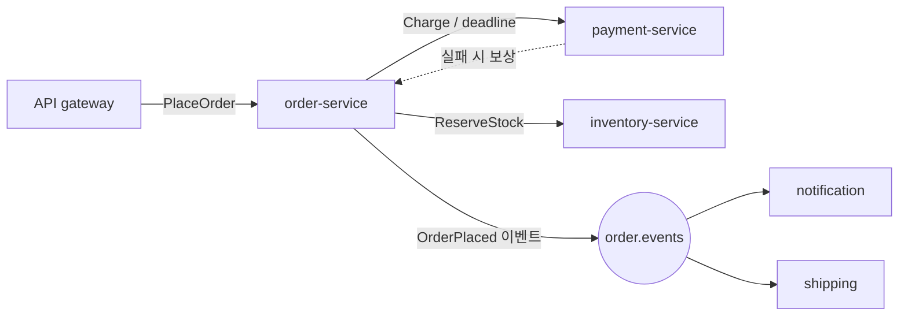
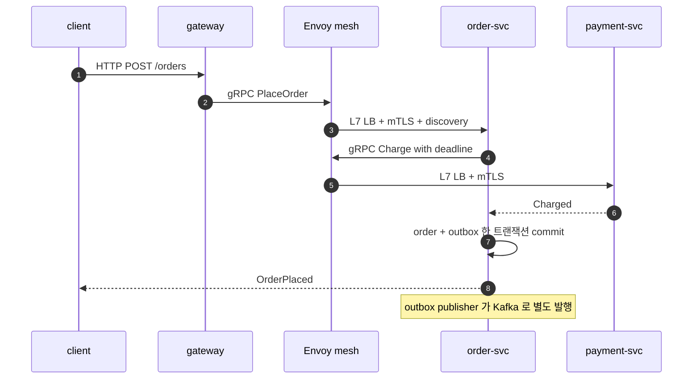
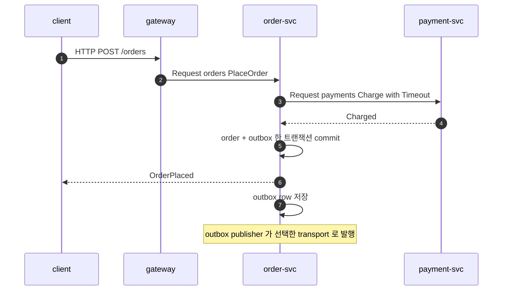

<!-- framework-adapter-nav:start -->
[문서 목록](../../../../README.ko.md) | [이전: ZLink 을 어디에 쓰나](../13-grpc-alternative.ko.md) | [다음: 케이스 — 내부 마이크로서비스 mesh + 운영](14-case-microservice-mesh.ko.md)
<!-- framework-adapter-nav:end -->

# 케이스 — 전자상거래 체크아웃

> [13-grpc-alternative](../13-grpc-alternative.ko.md)의 케이스 스터디 중 하나다. 이
> 문서는 실행 가능한 샘플이 아니라 **도입 판단과 아키텍처 매핑**을 위한 사례다.
> "ZLink 가 무엇을 줄이고 **무엇은 그대로 남는지**" 를 가장 분명히 보여 준다.
> 사용법 정식은 [04-channel-messaging](../04-channel-messaging.ko.md)이 다루고,
> 같은 체크아웃 도메인을 event sourcing 으로 빌드·실행해 보는 샘플은
> [ShoppingMall](#7-실행-가능한-샘플--shoppingmall)이다(§7).

> **이 케이스에서 ZLink 이 좋은 지점**
> - 서비스 간 request/send/pub-sub 배선을 하나의 channel 모델로 줄인다.
> - **그대로 남는 것**: 주문/결제 영속성·outbox·보상 트랜잭션은 애플리케이션 책임.
> - 즉 ZLink 은 체크아웃의 비즈니스 일관성을 대신하지 않고, 서비스 간 통신 배선을 줄인다.

## 1. 도메인 — 체크아웃이 어려운 진짜 이유

체크아웃은 "서비스 3개를 호출한다"가 아니다. 어려운 건 **order·payment·inventory
가 서비스·DB 경계를 넘나들며 부분 실패 속에서도 일관성을 지켜야 한다**는 점이다.
현업 백엔드가 실제로 떠안는 문제는 다음 네 가지다.

- **중복 제출(idempotency).** client 재시도·네트워크 재전송으로 같은 "주문 생성"
  이 두 번 들어와도 **결제가 두 번 일어나면 안 된다.** 표준 해법은 idempotency
  key — payment 서비스가 `(orderId, idempotencyKey)` 를 보고 이미 처리했으면
  같은 결과를 그대로 돌려준다. 모든 saga step 은 멱등이어야 한다.
- **dual-write 문제 + outbox.** "DB 에 주문을 commit" 과 "이벤트를 broker 에
  publish" 는 한 트랜잭션이 아니다. commit 후 publish 직전에 죽으면 이벤트가
  유실된다. 그래서 **business row + outbox row 를 한 트랜잭션으로 commit** 하고,
  별도 publisher 가 outbox 를 읽어 발행한다(transactional outbox).
- **부분 실패 보상(saga).** 결제는 성공했는데 재고 차감이 실패하면, 결제를
  **환불(compensating transaction)** 해야 한다. true rollback 이 아니라 의미적
  역연산이다. choreography(각 서비스가 이벤트 구독) 또는 orchestration(중앙
  조정자가 명령) 으로 엮는다.
- **지연 예산.** 동기 결제 호출은 상한(deadline)이 있어야 한다 — 느린 호출 하나가
  체크아웃 전체를 무한정 잡지 않도록.

> 출처: [Saga 패턴(microservices.io)](https://microservices.io/patterns/data/saga.html),
> [Saga choreography(AWS)](https://docs.aws.amazon.com/prescriptive-guidance/latest/cloud-design-patterns/saga-choreography.html),
> [Outbox·idempotency·dual-write](https://www.techinterview.org/post/3233474197/system-design-microservices-data-patterns-saga-outbox-pattern-event-sourcing-cqrs-dual-write-problem-transactional-messaging/).

이 네 가지는 **transport 를 무엇으로 바꾸든 사라지지 않는다.** 이 케이스의 핵심은
"ZLink 가 줄이는 것(배선)"과 "그대로 남는 것(분산 데이터 일관성)"을 가르는 데 있다.



## 2. 기존 스택 — gRPC + service mesh + Kafka

### 2.1 컴포넌트와 그 이유

| 컴포넌트 | 왜 필요한가 |
|----------|-------------|
| `.proto` + 코드 생성 | 서비스 간 계약을 stub 으로 찍어냄. CI 에 proto 컴파일 단계 |
| gRPC stub/channel | 호출. channel 재사용·deadline 을 직접 관리 |
| Envoy sidecar + mesh control plane | HTTP/2 는 L4 LB 가 안 되므로 **L7(request-level) 분배**·mTLS·재시도 |
| service discovery(Consul/xDS) | 어느 pod 이 떠 있는지 |
| Kafka | `order.events` 영속 fan-out + saga choreography 백본 |
| outbox publisher | DB→Kafka 이중 쓰기 문제 해소 |
| idempotency store | 중복 결제 차단 |

### 2.2 계약과 서버 (gRPC)

```proto
// order.proto — CI 에서 stub 으로 컴파일된다
syntax = "proto3";
service PaymentService {
  rpc Charge (ChargeRequest) returns (ChargeReply);
  rpc Refund (RefundRequest) returns (RefundReply);   // 보상용
}
message ChargeRequest { string order_id = 1; string account_id = 2;
                        int64 amount_minor = 3; string idempotency_key = 4; }
```

```csharp
// order-service: 주문 생성 + outbox + 동기 결제 호출
public sealed class OrderGrpcService(
    PaymentService.PaymentServiceClient payments,   // 생성된 gRPC stub
    IOrderDb db) : OrderApi.OrderApiBase
{
    public override async Task<PlaceOrderReply> PlaceOrder(
        PlaceOrderRequest req, ServerCallContext ctx)
    {
        // (1) 멱등: 같은 주문이 이미 있으면 그 결과를 그대로 반환
        if (await db.TryGetOrder(req.OrderId) is { } existing)
            return existing.ToReply();

        // (2) 동기 결제 — gRPC stub + deadline(직접)
        var charge = await payments.ChargeAsync(
            new ChargeRequest { OrderId = req.OrderId, AccountId = req.AccountId,
                                AmountMinor = req.AmountMinor, IdempotencyKey = req.OrderId },
            deadline: DateTime.UtcNow.AddSeconds(2));

        // (3) 주문 row + outbox row 를 한 트랜잭션으로 commit (dual-write 회피)
        await using var tx = await db.BeginTx();
        await db.InsertOrder(req.OrderId, charge.ReceiptId, tx);
        await db.InsertOutbox("OrderPlaced", req.OrderId, tx);   // publisher 가 나중에 Kafka 로
        await tx.CommitAsync();

        return new PlaceOrderReply { OrderId = req.OrderId, ReceiptId = charge.ReceiptId };
    }
}
```

### 2.3 이벤트와 mesh 배선

```csharp
// outbox publisher (백그라운드): DB outbox -> Kafka. 별도 컴포넌트로 항상 떠 있어야 함
while (await outbox.TryDequeue() is { } row)
    await kafkaProducer.ProduceAsync("order.events", row.ToMessage());

// inventory-service: Kafka consumer 로 choreography 참여 + 보상 트리거
await foreach (var ev in kafkaConsumer.Consume("order.events"))
    if (!await inventory.TryReserve(ev.OrderId, ev.Sku, ev.Qty))
        await kafkaProducer.ProduceAsync("order.events", new StockReserveFailed(ev.OrderId));
```

```yaml
# Istio: gRPC(HTTP/2)는 connection-level LB 가 안 되므로 L7 분배를 명시
apiVersion: networking.istio.io/v1
kind: DestinationRule
metadata: { name: payment-service }
spec:
  host: payment-service
  trafficPolicy:
    loadBalancer: { simple: ROUND_ROBIN }   # per-request, sidecar 가 처리
```

서 있어야 하는 것: **proto 파이프라인 + gRPC stub + Envoy sidecar 2개 + mesh
control plane + Consul/xDS + Kafka + outbox publisher + idempotency store.**

## 3. ZLink 스택 — 같은 로직, 줄어든 배선

ZLink 에서는 `.proto`·stub·Envoy·mesh·별도 discovery 가 빠진다. **하지만 saga·
outbox·idempotency 는 그대로 짠다** — 분산 데이터 문제는 transport 가 아니라
도메인 문제이기 때문이다.

```csharp
// 등록: channel 이름만. proto/stub/mesh/discovery 컴포넌트 없음
builder.Services.AddZLinkFramework(options =>
{
    options.Codecs.Use(ZLinkProtobufCodec.Default);
    {
        var channel =     options.AddClientServerChannel("orders");
                channel.EnableServer("tcp://0.0.0.0:7401");
        channel.AddRequestHandler<PlaceOrderHandler>();

    }
        options.AddClientServerChannel("payments").EnableClient();
                options.AddFanoutChannel("order.events").EnablePublisher("tcp://0.0.0.0:7402");
    options.AddHandlersFromAssemblyOf<Program>();
});
```

```csharp
public sealed class PlaceOrderHandler(
    IZLinkChannelClient services, IOrderDb db) : IZLinkRequestHandler<PlaceOrder, OrderPlaced>
{
    public async ValueTask<OrderPlaced> HandleAsync(
        PlaceOrder req, ZLinkRequestContext context, CancellationToken ct)
    {
        // (1) 멱등 — 여전히 앱 책임
        if (await db.TryGetOrder(req.OrderId, ct) is { } existing)
            return existing.ToReply();

        // (2) 동기 결제: gRPC stub 대신 channel 이름 + Timeout(reply 대기 상한)
        var charge = await services
            .RequestToChannel("payments", new Charge(req.OrderId, req.AccountId, req.AmountMinor, req.OrderId))
            .Async<Charged>(ct);

        // (3) 주문 row + outbox row 한 트랜잭션 — 여전히 앱 책임(dual-write 는 그대로)
        await using var tx = await db.BeginTx(ct);
        await db.InsertOrder(req.OrderId, charge.ReceiptId, tx);
        await db.InsertOutbox("OrderPlaced", req.OrderId, tx);
        await tx.CommitAsync(ct);

        return new OrderPlaced(req.OrderId, charge.ReceiptId);
    }
}
```

> **왜 여전히 outbox 인가.** `Publish(...).Async()` 의 완료는 **transport 위임까지만**
> 보장한다(remote 수신 보장 아님, [03-concepts](../03-concepts.ko.md) §7). 즉
> 유실 없이 재발행해야 하거나 중복 처리를 제어해야 하는 이벤트는 ZLink 에서도 outbox
> row 를 남기고 publisher 가 재발행하는 패턴을 그대로 쓴다. 단순 통지성(유실 허용)
> 이벤트면 핸들러에서 바로 `Publish` 해도 된다.

## 4. 양쪽 코드 비교 — "주문 → 결제" 한 경로

| 축 | 기존(gRPC + mesh) | ZLink |
|----|-------------------|-------|
| 계약 | `.proto` + 코드 생성(CI 단계) | record DTO(공유 어셈블리), proto 파이프라인 없음 |
| 호출 | `payments.ChargeAsync(req, deadline:)` (생성된 stub) | `services.RequestToChannel("payments", req).Timeout(...)` |
| 전송 보안 | Envoy mTLS | 배포 계층/TLS 지원 범위/네트워크 정책에서 별도 결정 |
| 멱등/outbox/saga | **앱 책임** | **앱 책임(동일)** |

배선(계약·stub·mesh·discovery)은 사라지지만, **비즈니스 로직(멱등·outbox·보상)은
양쪽이 글자 그대로 같다.** 이게 이 케이스의 핵심이다.

## 5. 아키텍처 비교 — 컴포넌트와 메시지 흐름

같은 체크아웃을 운영할 때 떠 있어야 하는 **컴포넌트 인벤토리**를 나란히 보면,
무엇이 빠지고 무엇이 그대로인지 한눈에 들어온다.

```text
[classic]  gRPC + service mesh + Kafka

  +--------------+  +--------------+  +--------------+
  | order-svc    |  | payment-svc  |  | inventory-svc|   each pod =
  | app + stub   |  | app + server |  | app + server |   app + gRPC + Envoy
  | Envoy sidecar|  | Envoy sidecar|  | Envoy sidecar|
  +------+-------+  +------+-------+  +------+-------+
         |                 |                |   xDS
         +-----------------+----------------+
                  +--------v---------+
                  | mesh control     |   L7 LB + mTLS
                  | service discovery|   Consul / xDS
                  +------------------+
  +--------------+  +------------------+  +----------------+
  | Kafka        |  | outbox publisher |  | idempotency DB |
  +--------------+  +------------------+  +----------------+
  +-------------------------------------------------------+
  | orders/payments/inventory DB  +  .proto pipeline       |
  +-------------------------------------------------------+
```

```text
[ZLink]  ZLink Framework  + Registry

  +--------------+  +--------------+  +--------------+
  | order-svc    |  | payment-svc  |  | inventory-svc|   each app +
  | + ZLink FW   |  | + ZLink FW   |  | + ZLink FW   |   ZLink Framework
  +------+-------+  +------+-------+  +------+-------+
         |                 |                |   channel name
         +-----------------+----------------+
                   +-------v--------+
                   | location store |   (Redis) peer row 공유
                   +----------------+
  +------------------+
  | fanout channel   |   order.events (live fan-out)
  +------------------+
  +-------------------------------------------------------+
  | orders/payments/inventory DB  +  outbox publisher      |  (unchanged)
  | + idempotency DB   (keep Kafka if durable replay needed)|
  +-------------------------------------------------------+
```

- **빠지는 박스:** Envoy sidecar ×3, mesh control plane, 별도 discovery,
  `.proto` 파이프라인.
- **그대로인 박스:** 도메인 DB, outbox publisher, idempotency store —
  분산 데이터 일관성은 transport 가 바뀌어도 그대로 남는다.

### 메시지 흐름 — 시퀀스 비교

"주문 생성" 한 번의 흐름을 나란히 보면 hop 차이가 드러난다.





mesh sidecar hop 이 빠지고, 위치 해결은 Registry view 가 미리 끝낸다. 단 durable
이벤트라면 outbox commit 과 outbox publisher 는 양쪽 모두 그대로다. 단순 통지성
이벤트처럼 유실을 허용할 때만 handler 에서 바로 `Publish` 한다.

## 6. 줄어드는 것 / 그대로 남는 것

**줄어드는 것 (배선).**

- `.proto` 컴파일 파이프라인과 생성 stub 관리
- Envoy sidecar + mesh control plane(L7 LB·mTLS)
- 별도 service discovery(Consul/xDS) → `UseDiscovery`  + Registry
- 단순 실시간 fan-out 한정으로는 Kafka 한 겹

**그대로 남는 것 (도메인 — ZLink 가 대신 풀어주지 않음).**

- **saga 오케스트레이션/보상**: 결제 성공·재고 실패 시 환불은 여전히 응용이 짠다.
- **transactional outbox**: dual-write 문제는 transport 와 무관하다.
- **idempotency key**: 중복 결제 차단은 payment 도메인 책임.
- **영속 DB**: 주문·결제·재고 상태는 DB.
- **영속/replay 이벤트**: at-least-once 영속 큐가 필요하면 Kafka 유지.
- **mTLS/HTTP edge**: 인증 edge·브라우저 호환·외부 공개 API 는 별도 계층.

## 7. 실행 가능한 샘플 — ShoppingMall

§6 에서 "그대로 남는다" 고 한 보상·idempotency·event 영속을, ZLink owner routing 과
event sourcing 으로 **애플리케이션 안에서** 견고하게 구성하는 모습을 실행해 보는 샘플이
ShoppingMall 이다. Kafka 를 다시 만드는 것이 아니라, 외부 HTTP API 와 stateful
workflow owner 를 분리해도 상태 전이·복구·audit·조회 projection 이 분명함을 보여 준다.

- 구현 학습(deep-dive): [ShoppingMall Sample 문서](../samples/shoppingmall-sample.ko.md)
- 실행 코드: [.NET ShoppingMall 샘플](../../../../../languages/dotnet/samples/ShoppingMall)
- 공통 시나리오(언어 중립): [spec/sample/event/shoppingmall](../../../common/sample/event/shoppingmall.ko.md)

### 서버 구성 — stateless API + stateful order owner

| 서버 | instance | 책임 |
|------|:--------:|------|
| `CommerceApi` | 2 | HTTP API, 입력 검증, idempotency lookup, projection **조회만** (event append 안 함) |
| `OrderWorkflow` | 2 | `OrderWorkflowSpot` 호스팅, `OrderId` owner 로 상태 전이·event append·projection 갱신 |
| stores | 1 set | `OrderEventStore`(기준 stream) + `OrderReadModelStore`(projection) + `CommerceStateStore` |

어느 `CommerceApi` instance 가 받아도 `OrderId` 기준 같은 `OrderWorkflowSpot` owner 로
route 된다(케이스 §3 의 channel routing 을 owner 소유권으로 확장).

### 케이스 본문 너머로 이 샘플이 더 보여 주는 것

- **event sourcing**: `OrderWorkflowSpot` 만 `OrderEventStore` 에 append 하고,
  projection 을 삭제해도 stream replay 로 다시 만든다(`RebuildOrderProjectionReq`).
- **idempotency 를 owner 안에서**: 같은 `IdempotencyKey` 는 같은 `OrderId` 로 모이고,
  pending → started mapping 으로 중복 시작과 중간 실패 복구를 구분한다.
- **보상 흐름**: 결제 실패 시 `PaymentFailedEvent → InventoryReleasedEvent → OrderFailedEvent`
  로 재고 예약을 되돌린다(성공/재고실패/결제실패 3 branch 의 event sequence 고정).
- **scale-out routing**: 서로 다른 주문은 서로 다른 `OrderWorkflow` instance 에서 동시
  처리되고, 두 instance 어디서 조회해도 같은 projection 을 반환한다.
- **codec**: 읽기 쉬운 JSON payload.

### client self-check 가 검증하는 의미

성공 주문은 `Created → Confirmed` projection 과 `OrderStartedEvent →
InventoryReservedEvent → PaymentAuthorizedEvent → OrderConfirmedEvent` append 를,
중복 시작은 같은 `OrderId` 반환과 event 무중복 append 를, 결제 실패는 보상 event 와
`Failed` 사유를, projection rebuild 는 event replay 만으로 재생성을 검증한다.

## 8. 더 보기

- 케이스 허브: [13-grpc-alternative](../13-grpc-alternative.ko.md) (공통 경계는 §4 경계 절)
- 사용법 정식: [04-channel-messaging](../04-channel-messaging.ko.md)
- 다음 케이스: [14-case-microservice-mesh](14-case-microservice-mesh.ko.md)

---
<!-- framework-adapter-nav:bottom:start -->
[문서 목록](../../../../README.ko.md) | [이전: ZLink 을 어디에 쓰나](../13-grpc-alternative.ko.md) | [다음: 케이스 — 내부 마이크로서비스 mesh + 운영](14-case-microservice-mesh.ko.md)
<!-- framework-adapter-nav:bottom:end -->
