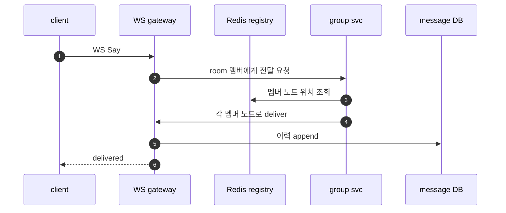
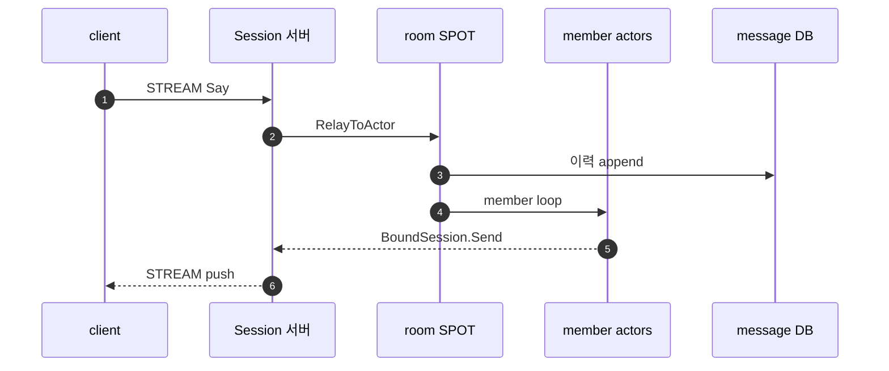

<!-- framework-adapter-nav:start -->
[문서 목록](../../../../README.ko.md) | [이전: 케이스 — 라이드헤일링 실시간 디스패치](16-case-ride-hailing.ko.md) | [다음: 케이스 — 마켓플레이스 구매자·판매자 채팅](17-1-case-marketplace-chat.ko.md)
<!-- framework-adapter-nav:end -->

# 케이스 — 채팅·메시징 플랫폼

> [13-grpc-alternative](../13-grpc-alternative.ko.md)의 케이스 스터디 중 하나다.
> room 을 **주소 가능한 노드(SPOT)** 로 두어 membership 과 fan-out 결정을 직렬화하는
> 사례다. 실제 client push 는 각 user actor 의 `BoundSession` 이 맡고,
> **메시지 영속 저장은 그대로 DB** 다. 이 문서는 채팅 도메인의
> 책임 경계와 ZLink 매핑을 설명하는 케이스 스터디이고, 같은 흐름을 빌드·실행해 보는
> 샘플은 [SupportChat](#7-실행-가능한-샘플--supportchat)이다(§7).

> **이 케이스에서 ZLink 이 좋은 지점**
> - STREAM 이 client 연결을, actor binding 이 "누가 어디 붙었나"를 소유한다.
> - room SPOT 이 membership 과 fan-out 결정을 단일 큐에서 직렬 처리한다.
> - **그대로 남는 것**: 메시지 durable 저장·순서/전달 보장 정책은 DB·앱 책임.

## 1. 도메인 — 채팅 백엔드의 진짜 난제

- **연결 레지스트리.** 수백만 동시 연결에서 "누가 어느 노드에 붙었나" 를 알아야
  메시지를 전달한다. 보통 **Redis 연결 레지스트리** 로 추적한다.
- **room fan-out + presence.** 한 메시지가 room 멤버 전원에게 가고, presence(접속
  상태)는 한 사람 변화가 수백 구독자로 퍼진다 — fan-out 이 넓다.
- **순서와 전달 보장.** room 안 메시지 순서, 재접속 시 누락 없는 전달, read receipt
  같은 의미가 필요하다.
- **영속 이력.** 메시지는 durable 저장(스크롤백·검색)이 필요하다.
  ([getstream](https://getstream.io/blog/chat-application-architecture/),
  [Ably](https://ably.com/blog/scaling-pub-sub-with-websockets-and-redis))

남는 난제: **메시지 durable 저장(DB)** 과 순서/전달 보장 정책은 그대로 남는다.
ZLink 가 줄이는 건 연결 위치 조회 직접 관리·room fan-out 결정·group service 다.

## 2. 기존 스택 — WS fleet + Redis 레지스트리 + group service

### 2.1 컴포넌트와 그 이유

| 컴포넌트 | 왜 필요한가 |
|----------|-------------|
| WS gateway fleet | 수백만 동시 연결 수용(stateless 노드 여러 대) |
| Redis 연결 레지스트리 | "누가 어느 노드에 붙었나" 추적 → 전달 routing 의 근거 |
| group/fan-out service | room 멤버 목록 조회 + 각 멤버 노드로 전달 결정 |
| Redis pub/sub | 노드 간 메시지 전달 버스 |
| 메시지 DB | 스크롤백·검색용 **영속 이력** |

### 2.2 전달 경로

```csharp
// WS gateway: 연결 수용 + Redis 연결 레지스트리 등록(누가 어디 붙었나)
var userId = await Authenticate(ws);
await redis.HashSetAsync($"presence:{userId}", "node", thisNodeId);

// room send → group service: 멤버 조회 후 각 멤버 노드로 Redis pub/sub 라우팅
var members = await redis.SetMembersAsync($"room:{roomId}:members");
foreach (var m in members)
{
    var node = await redis.HashGetAsync($"presence:{m}", "node");
    await redis.PublishAsync($"deliver:{node}", Encode(roomId, msg)); // 멤버 노드가 자기 WS 로 push
}
await messageDb.AppendAsync(roomId, msg);   // 영속 이력
```

서 있어야 하는 것: WS gateway fleet, Redis 연결 레지스트리, Redis pub/sub 라우팅,
group/fan-out service, 메시지 DB.

## 3. ZLink 스택 — STREAM + room SPOT + BoundSession

```csharp
// 채팅 client STREAM session: 메시지를 room actor 로 relay
public sealed class ChatSession(IZLinkSessionContext context, IZLinkActorManager actors) : IZLinkSession
{
    public IZLinkSessionContext Context { get; } = context;
    private IZLinkSessionActor? _user;

    public async ValueTask OnDispatchAsync(
        ZLinkSessionDispatchContext dispatch, ZLinkMessage payload, CancellationToken ct)
    {
        if (dispatch.PacketName == "auth")
        {
            var req = payload.Decode<AuthReq>();
            ActorRef actor = await actors.GetOrCreateAsync(req.UserId, "chat-user", ct);
            _user = await context.Actors.BindAsync(actor, ct);
            await context.Client.Reply(new AuthOk()).Async();
            return;
        }
        await _user!.RelayAsync(payload, ct);
    }

    public ValueTask OnConnectedAsync(CancellationToken ct) => ValueTask.CompletedTask;
    public ValueTask OnDisconnectedAsync(CancellationToken ct) => ValueTask.CompletedTask;
    public ValueTask OnErrorAsync(ZLinkStreamError error, CancellationToken ct) => ValueTask.CompletedTask;
}
```

```csharp
// room SPOT: membership 을 spot 이 소유하고 단일 큐에서 fan-out 결정을 직렬화
public sealed class SayHandler(IMessageDb db)
    : IZLinkSpotActorSendHandler<ChatRoomSpot, UserActor, Say>
{
    public async ValueTask HandleAsync(
        ChatRoomSpot spot,
        UserActor actor,
        ZLinkSpotActorSendContext context,
        Say msg,
        CancellationToken ct)
    {
        _ = context;
        var chat = new ChatMessage(spot.RoomId, actor.ActorId, msg.Text);
        await db.AppendAsync(chat, ct);                              // durable 이력 — 그대로
        foreach (var member in spot.Members)
        {
            member.PushChat(chat, ct);                               // 각 actor 의 BoundSession 단방향 push
        }
    }
}

public sealed class UserActor(string actorId, IZLinkActorContext context) : IZLinkActor
{
    public string ActorId { get; } = actorId;
    public IZLinkActorContext Context { get; } = context;

    public void PushChat(ChatMessage chat, CancellationToken ct)
        => Context.BoundSession.Send(chat).Submit(ct);
}
```

```csharp
// 등록 골격(정식은 05·07): STREAM(연결) + room SpotMesh(pub/sub 포함)
{
    var s = options.AddStreamNode("chat");
    s.Bind("tcp://0.0.0.0:9100");
    s.RegisterSession<ChatSession>();

}
spot.AddActorFactory<UserActorFactory>("user");
{
    var n = options.AddSpotMesh("rooms");
        n.EnableRouter("tcp://0.0.0.0:7700");
        n.EnablePubSub("tcp://0.0.0.0:7701");   // presence/fan-out
    n.AddSpotFactory<ChatRoomSpot>();

}
```

> 연결 레지스트리("누가 어디 붙었나")를 응용이 직접 조회하지 않는다. session↔actor
> binding 은 framework 가 들고, room membership 과 fan-out 순서는 room SPOT 이
> 소유한다. 다른 actor 의 client 로 보내려면 해당 actor 가 자기 `BoundSession` 으로
> push 한다([7](../07-actor-session.ko.md) §3). presence 는 같은 room SPOT 상태 변화나
> 별도 pub/sub 토픽으로 표현할 수 있다.

## 4. 양쪽 코드 비교 — "room 에 한 마디"

| 축 | 기존(WS + Redis) | ZLink |
|----|------------------|-------|
| 연결 수용 | WS gateway 직접 | STREAM `IZLinkSession` |
| 연결 레지스트리 | Redis presence 해시 | framework(session/actor binding) |
| 멤버 조회·라우팅 | group service + Redis pub/sub | room SPOT(membership 소유) |
| fan-out | 멤버별 deliver publish | room SPOT loop + `BoundSession.Send(...)` |
| 메시지 영속 | 메시지 DB | 메시지 DB(유지) |

## 5. 아키텍처 비교 — 컴포넌트와 메시지 흐름

```text
[classic]  WS fleet + Redis registry + group service

  +----------------------+
  | WS gateway fleet     |
  +----------+-----------+
  +----------v-----------+   +------------------+
  | Redis conn registry  |   | group/fanout svc |
  | + pub/sub routing    |   +------------------+
  +----------+-----------+
  +----------v-----------+
  | message DB (history) |
  +----------------------+
```

```text
[ZLink]  STREAM + room SPOT + BoundSession

  +----------------------+
  | Session server       |   conn + actor bind/relay
  | (STREAM)             |
  +----------+-----------+
  +----------v-----------+    +-----------+
  | room SPOT            |--->| Registry  |
  | membership + fan-out |    +-----------+
  +----------+-----------+
  +----------v-----------+
  | message DB (history) |   (unchanged)
  +----------------------+
```

- **빠지는 박스:** WS gateway fleet, Redis 연결 레지스트리, group/fan-out service,
  pub/sub 라우팅 계층.
- **그대로인 박스:** 메시지 DB(영속 이력).

### 메시지 흐름 — 시퀀스 비교

room 에 한 마디 보내는 흐름이다.





연결 레지스트리 조회와 group service 라우팅이 줄어든다. room SPOT 이 membership 과
fan-out 순서를 소유하고, 각 user actor 가 자기 `BoundSession` 으로 client 에 push
한다. 메시지 DB append 는 양쪽 모두 그대로다.

## 6. 줄어드는 것 / 그대로 남는 것

- **줄어드는 것:** WS gateway fleet, 연결 위치 조회 직접 관리, group/fan-out service.
- **그대로 남는 것:** **메시지 durable 저장(DB)**, 순서/전달 보장 정책, read
  receipt 같은 의미. pub/sub 는 transport fan-out 이라 영속/replay 가 필요하면
  broker 가 맞다. 공통 경계는
  [13-grpc-alternative](../13-grpc-alternative.ko.md)의 §4 경계 절 참고.

## 7. 실행 가능한 샘플 — SupportChat

이 케이스의 흐름을 실제로 빌드·실행해 볼 수 있는 샘플이 SupportChat이다. §3~§5의
room SPOT·BoundSession·STREAM 매핑을 1:1 고객 상담 도메인으로 좁혀, 코드와 smoke
검증으로 확인한다.

- 구현 학습(deep-dive): [SupportChat Sample 문서](../samples/supportchat-sample.ko.md)
- 실행 코드: [.NET SupportChat 샘플](../../../../../languages/dotnet/samples/SupportChat)
- 공통 시나리오(언어 중립): [spec/sample/supportchat](../../../common/sample/supportchat/README.ko.md)

### 서버 구성 — session gateway

| 프로세스 | 책임 |
|----------|------|
| `SupportChat.Session` | client STREAM 연결, 인증, actor binding, conversation packet relay |
| `SupportChat.Api` | token 검증, 상담 시작 orchestration, agent 배정 요청 |
| `SupportChat.Support` | customer/agent actor, `SupportEntrySpot`, `ConversationSpot` 호스팅 |
| `SupportChat.Registry` | 세 서버 endpoint 자동 발견(Discovery) |

customer 와 agent client 가 직접 연결하는 서버는 Session 하나뿐이다. Api·Support 는
client-facing endpoint 를 열지 않는다(케이스 §3 의 gateway 경계를 그대로 구현).

### 케이스 본문 너머로 이 샘플이 더 보여 주는 것

- **`ConversationSpot` 이 소유하는 상태**: 참여자, 단조 증가 `MessageSeq`, typing,
  idle deadline, close. 메시지 순서·typing·종료 판정이 handler 에 흩어지지 않고 한
  SPOT 큐에서 직렬화된다.
- **재접속 이전성**: 같은 `ActorId` 가 다시 인증하면 새 stream session 만 기존 actor 에
  bind 되고 conversation 상태는 유지된다 — §3 의 actor binding 을 실제로 검증한다.
- **대기 ≠ 오류**: 배정 가능한 agent 가 없으면 conversation 은 `WaitingForAgent` 로
  남고 오류 response 가 아니다.
- **idle timer → close**: `ConversationSpot` timer 가 idle → close grace 를 거쳐
  `ConversationClosedNotify` 를 양쪽 bound session 에 push 한다(timer 는 신호만,
  전이 판정은 domain).
- **codec**: 읽기 쉬운 JSON payload.

### client self-check 가 검증하는 의미

성공 로그가 아니라 payload 의미를 직접 확인한다 — agent join 뒤 customer 는
`ParticipantJoinedNotify`, agent 는 `ConversationAssignedNotify` 를 받고, greeting 은
`MessageSeq=1`·답변은 `MessageSeq=2`, reconnect 후 `JoinConversationReq` 로 같은
`Subject` 와 상태가 복원되며, closed conversation 에 보낸 메시지는 오류 response 다.

## 8. 더 보기

- 케이스 허브: [13-grpc-alternative](../13-grpc-alternative.ko.md)
- 사용법: [04-channel-messaging](../04-channel-messaging.ko.md), [05-spot](../05-spot.ko.md), [06-actor-spot](../06-actor-spot.ko.md), [08-stream](../08-stream.ko.md)
- 상세 채팅 케이스: [Marketplace](17-1-case-marketplace-chat.ko.md),
  [Live commerce](17-2-case-live-commerce-chat.ko.md),
  [Game chat](17-3-case-game-chat.ko.md)
- 다음 케이스: [17-1-case-marketplace-chat](17-1-case-marketplace-chat.ko.md)

---
<!-- framework-adapter-nav:bottom:start -->
[문서 목록](../../../../README.ko.md) | [이전: 케이스 — 라이드헤일링 실시간 디스패치](16-case-ride-hailing.ko.md) | [다음: 케이스 — 마켓플레이스 구매자·판매자 채팅](17-1-case-marketplace-chat.ko.md)
<!-- framework-adapter-nav:bottom:end -->
