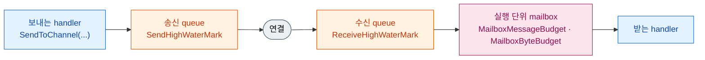

<!-- framework-adapter-nav:start -->
[문서 목록](../../../../README.ko.md) | [이전: 핵심 개념](03-concepts.ko.md) | [다음: Channel Messaging — request · send · pub/sub](05-channel-messaging.ko.md)
<!-- framework-adapter-nav:end -->

# 4. Backpressure — 처리보다 도착이 빠를 때

> 정식 계약은 [비동기 실행 정책](../../../common/spec/05-async-execution-policy.ko.md)과
> [Topology exact interface](../../../common/spec/server/languages/dotnet/interfaces/03-configuration-topology.ko.md)가
> 다룬다. 이 챕터는 그 동작을 개념과 원리로 설명하고 어떤 옵션이 영향을 주는지 다룬다.
> 옵션의 기본값과 변경 시점은 [16-options](16-options.ko.md)가 소유한다.

## 0. 초당 5,000건을 처리하는 서비스에 12,000건이 도착하면

세 가지 중 하나가 일어난다.

- **버린다** — 처리량은 유지되지만 message가 사라지고, 무엇이 사라졌는지 확인할 방법도 없다.
- **무한히 쌓는다** — 아무것도 잃지 않지만 memory 사용량이 계속 늘어 결국 process가 종료된다.
- **보내는 쪽을 기다리게 한다** — 받는 쪽의 처리 지연이 보내는 쪽의 송신 지연으로 돌아온다.

ZLink는 세 번째 방식을 사용한다. 이렇게 **받는 쪽의 처리 지연을 보내는 쪽의 송신 대기로
되돌리는 흐름 제어를 backpressure라고 한다.** 따라서 부하가 걸린 상태에서 application에
나타나는 증상은 "message가 사라졌다"가 아니라 "`send`가 느려졌다" 또는
"`DeadlineExceeded`가 발생했다"다.

## 1. message는 곧바로 상대에게 전달되지 않는다

`SendToChannel(...)`이나 `Publish(...)`로 보낸 message는 이 process가 상대별로 유지하는
**송신 queue**에 먼저 들어가고, 그 queue에서 차례로 연결을 통해 나간다. 받는 쪽에도 아직
처리하지 못한 message가 머무는 **수신 queue**가 있다. 두 queue에는 각각 상한이 있고, 이
상한을 high-water mark(HWM)라 한다.



**두 종류를 구분해야 한다.** 송신·수신 queue(주황)의 상한은 **대기**로 이어진다 — 상한에
닿으면 그 앞 단계의 처리가 지연되고, 보내는 쪽에 최종적으로 나타나는 결과는 "보낼 자리가
없다" 하나다. 반면 [Spot](03-concepts.ko.md#2-spot--상태를-소유하고-순서대로-처리하는-단위)과
[Actor](03-concepts.ko.md#3-actor--id로-식별되는-상태-객체)는 자기에게 온 message를 한 줄로
하나씩 처리하는 실행 단위이고, 각각 처리를 기다리는 message를 담아 두는 mailbox(분홍)를
가진다. 이 mailbox는 상한을 넘으면 **그 message를 버린다.** 보내는 쪽까지 대기가 전달되지
않고 `Backpressured` 이벤트만 남는다. 이 챕터에서 backpressure라고 부르는 것은 앞의
대기이며, mailbox 상한은 [영향을 주는 옵션](#4-영향을-주는-옵션)에서 다시 다룬다.

## 2. 동작 원리

### 2.1 보내는 쪽은 자기 queue만 본다

보내기를 멈출지 여부는 **자기 process 안의 값 하나**로 판단한다. 상대에게 얼마나 보내도
되는지 묻지 않고, 아직 상대가 가져가지 않은 message 수가 송신 queue의 상한에 닿으면 그
상대로 가는 송신을 잠근다. 상한에 닿는 이유는 여럿이다.

- 짧은 시간에 평소보다 훨씬 많이 보냈다.
- 네트워크가 느려 queue가 평소만큼 비워지지 않는다.
- 받는 쪽이 처리하지 못해 전송 경로가 막혔다.
- 연결이 끊겨 재연결하는 동안 내보낼 곳이 없다.

### 2.2 받는 쪽이 느려지면 왜 보내는 쪽이 대기하나

두 단계를 거친다. 앞 단계는 TCP가 처리하고, 뒤 단계에서 비로소 application이 대기를 겪는다.

**1단계 — TCP 흐름 제어가 전송 속도를 낮춘다.** 받는 쪽이 도착한 데이터를 제때 가져가지
못하면 그쪽 수신 버퍼가 차고, TCP는 남은 여유(수신 윈도우)를 보내는 쪽에 알려 준다. 여유가
없으면 보내는 쪽 TCP는 더 내보내지 않고 상대가 읽어 갈 때까지 기다린다. 결과적으로 **전송
속도가 받는 쪽이 처리하는 속도에 맞춰진다.** 이 단계는 실패가 아니라 감속이므로
application에는 아직 아무 변화도 나타나지 않는다.

**2단계 — 송신 queue가 상한에 닿으면 `send`가 대기한다.** 전송이 느려진 만큼 송신 queue도
천천히 비워진다. application이 그보다 빠른 속도로 계속 message를 넣으면 queue에 쌓이고,
`SendHighWaterMark`에 닿는 순간 그 상대로 가는 송신이 잠긴다. 이때부터 `send` 호출이 곧바로
반환되지 않고 자리가 나기를 기다린다 — 받는 쪽의 지연이 application의 대기로 처음 나타나는
지점이다.

```text
받는 handler가 처리 속도를 못 맞춤
  → 받는 쪽 수신 버퍼가 차고 TCP 수신 윈도우가 줄어든다
  → TCP가 전송 속도를 낮춘다                          (1단계: 전송이 느려진다)
  → 보내는 쪽 송신 queue가 비워지는 속도도 느려진다
  → 넣는 속도가 빠지는 속도보다 크면 queue가 상한까지 찬다
  → send가 자리를 기다린다                            (2단계: application이 대기한다)
```

**즉 backpressure는 TCP 흐름 제어의 연장이다.** TCP는 전송 속도를 낮추는 데서 멈추고,
HWM이 그 영향을 application 호출까지 끌어올린다. 그래서 보내는 쪽이 알 수 있는 것은 "내
자리가 없다" 하나이고, "상대가 느리다"는 정보는 전달되지 않는다. `DeadlineExceeded`도 상대의
상태를 알려 주지 못하므로, 원인을 구분하려면 상대 node의 처리 지표를 함께
확인한다([11-monitoring](11-monitoring.ko.md)).

### 2.3 잠기는 지점과 풀리는 지점이 다르다

상한에 닿으면 송신이 잠기지만, message가 하나 빠져나갈 때마다 곧바로 풀리지는 않는다.
**상한의 절반가량이 비워졌을 때** 다시 보낼 수 있게 된다.

message 하나 단위로 잠금과 해제를 반복하지 않기 위한 동작이다. 가득 찬 상태에서 하나가
빠질 때마다 하나씩 넣도록 하면 양쪽이 번갈아 깨어나기만 하고 throughput이 오르지 않는다.
반대로 queue가 완전히 빌 때까지 잠가 두면 필요 이상으로 오래 멈춘다. **그래서 상한은
"잠기는 지점"이면서 동시에 "절반만큼 비워야 풀리는 단위"다** — 값을 크게 설정할수록 한 번
잠겼을 때 다시 흐르기까지 비워야 하는 양도 함께 늘어난다.

## 3. 코드에서 보이는 것

### 3.1 send가 `async`인 이유

send는 응답을 기다리지 않지만, 기다려야 하는 대상이 하나 있다 — **보낼 자리**다.

```csharp
await client.SendToChannel("orders", new CancelOrder("order-1042")).Async(ct);
// 이 await가 끝났다는 것은 "내 runtime이 제출을 받아들였다"까지다.
// 상대가 받았거나 handler가 끝났다는 뜻이 아니다.
```

자리가 없으면 즉시 실패하지 않고 `DefaultSocketSendTimeout`(기본 1초)까지 기다린다. 그
안에 자리가 생기면 정확히 한 번 제출하고 정상 완료하며, 끝까지 자리가 생기지 않으면
`DeadlineExceeded` 예외로 끝난다. **자동으로 다시 보내지 않는다** — 재시도할지, 버릴지,
사용자에게 실패를 알릴지는 application이 정한다.

```csharp
try
{
    await client.SendToChannel("orders", command).Async(ct);
}
catch (ZLinkFrameworkException ex)
    when (ex.Kind == ZLinkFrameworkErrorKind.DeadlineExceeded)
{
    // 이 시점에 확실한 것은 "제출되지 않았다" 하나다. 상대 상태는 알 수 없다.
    // RetryAdvice는 framework가 확인한 조건만 알려 준다 — 실제 재시도 여부는 application이 정한다.
    if (ex.RetryAdvice == ZLinkRetryAdvice.RetryAfterBackoff)
        _pending.Enqueue(command);
}
```

다시 보내도 되는지는 application이 업무 규칙에 따라 판단한다. **같은 명령이 두 번 도착해도
결과가 같을 때만** 재시도가 안전하다 — 주문 취소는 두 번 도착해도 취소된 상태 하나로
끝나지만, 결제 승인은 두 번 승인될 수 있다. 후자라면 재시도 대신 실패를 호출자에게
전달하거나, 명령에 고유 id를 실어 받는 쪽이 중복을 걸러내도록 한 다음에 재시도한다.
재시도하더라도 곧바로 다시 보내면 아직 비워지지 않은 queue에 요청을 다시 쌓아 정체를
키우므로, 재시도 사이에 간격을 둔다.

기다리는 동안 대기하는 것은 그 호출뿐이며, 실행 스레드는 다른 작업을 처리한다
([05-channel-messaging](05-channel-messaging.ko.md#비동기-실행--asyncawait-valuetask)).

### 3.2 request는 timeout이 마지막 경계다

request는 보낼 자리와 상대의 reply를 모두 기다리므로, 정체가 일어난 구간에서는
`Timeout(...)`이 실질적인 상한이다. 특히 **handler 안에서 다시 request를 보내는 흐름에는
유한한 timeout을 반드시 지정한다.**

```csharp
public async ValueTask<PlaceOrderReply> HandleAsync(
    PlaceOrder request, IZLinkMessageContext context, CancellationToken ct)
{
    // handler가 reply를 기다리는 동안 이 handler가 받은 message도 계속 자리를 차지한다.
    // 양쪽 node의 처리가 동시에 지연되면 유한한 timeout이 회복을 시작하는 유일한 지점이다.
    var reserved = await _client
        .RequestToChannel("inventory", new ReserveStock(request.Sku, request.Quantity))
        .Timeout(TimeSpan.FromSeconds(3))
        .Async<StockReserved>(ct);

    return new PlaceOrderReply(request.OrderId, reserved.ReservationId);
}
```

timeout은 backpressure를 조절하는 수단이 아니라 **더 기다리지 않는 경계**다. 호출자가
timeout으로 끝나도 이미 시작된 remote handler의 실행은 취소되거나 되돌려지지 않는다.

## 4. 영향을 주는 옵션

| 옵션 | 무엇을 정하나 | 설정 자리 |
| --- | --- | --- |
| `DefaultSocketSendTimeout` | 보낼 자리가 없을 때 기다리는 상한(기본 1초) | 루트 옵션 |
| `SendHighWaterMark` | 상대별로 **보내려고** 쌓아 둘 수 있는 message 수 | `ConfigureRouterSocket()` |
| `ReceiveHighWaterMark` | 상대별로 **받아서** 쌓아 둘 수 있는 message 수 | `ConfigureRouterSocket()` |
| `MaxMessageSize` | 받아들일 message 하나의 최대 크기 | `ConfigureRouterSocket()` |
| `MailboxMessageBudget` · `MailboxByteBudget` | 실행 단위별 mailbox 용량(건수·byte). **넘으면 대기가 아니라 drop이다.** `0`은 framework 기본 profile | `ConfigureRouterSocket()` |
| `SendHighWaterMark` · `Linger` | pub/sub 발행 소켓의 상한과 종료 시 잔여 발행 대기 | `ConfigureSpotPublisher()` |

두 HWM은 방향만 다를 뿐 성격이 같다. 각각 **자기 node가 들고 있을 양**을 정하고, 그 한도가
상대 쪽 흐름으로 이어진다. 값을 정할 때 기준은 셋이다.

- **올리면** 순간 폭주를 더 흡수하고, **내리면** 혼잡이 더 일찍 드러난다.
- **`MaxMessageSize`를 유한하게 둔다.** 상한을 message 개수로 세므로, 크기를 제한하지 않으면
  같은 개수라도 보유 memory가 크게 달라진다.
- **high-water mark를 올리는 것이 기본 대응은 아니다.** 상한을 키우면 혼잡이 memory로
  흡수되어 `DeadlineExceeded`가 늦게 나타나고, 그만큼 원인도 늦게 파악하게 된다. 처리
  지연이 계속된다면 상한이 아니라 처리 쪽(수신 node 수, handler 실행 시간)을 확인한다.

기본값, 실행 중 변경 가능 여부와 옵션별 상세는
[16-options §3.2](16-options.ko.md#32-backpressure-한도를-정하는-옵션)가 다룬다.

## 5. 정체가 실제로 일어났는지 확인하기

```csharp
options.ConfigureDispatch().Diagnostics
    .SetLevel(ZLinkDiagnosticsLevel.Errors); // 기본값 — error와 backpressure, drop을 기록한다.
```

message flow 기록에 `backpressured`가 남았다면 대기 또는 mailbox drop이 실제로 일어났다는
뜻이다. 함께 확인하는 메트릭은 `zlink.mesh_node.request.timeouts`(request가 경계에 걸린
횟수)와 `zlink.mesh_node.messages.dropped`(원인을 확인한 one-way drop)다
([11-monitoring](11-monitoring.ko.md) · [12-operations](12-operations.ko.md)). 대기와 drop은
같은 이벤트 이름을 쓰므로, 어느 쪽인지는 drop 메트릭이 함께 증가했는지로 구분한다.

## 6. 설계상 모델 — 미구현

지금 상한은 **message 개수**로 센다. 개수는 payload 크기를 반영하지 못하므로 같은
상한에서도 보유 memory가 수십 배 달라질 수 있다. 그래서 다음 두 가지를 설계하고 있다.

- **byte 기준 상한** — 개수 대신 실제 보유 byte로 세고, host가 보관하는 application message
  전체에 하나의 상한을 적용한다. Application이 지정하는 값은 `ApplicationHwmBytes`이며 유한한
  `MaxMessageSize`가 전제 조건이 된다.
- **application과 completion 경로 분리** — application message는 상한에 닿으면 수신을 멈추고,
  이미 보낸 request의 reply와 진행에 필요한 control은 별도 경로로 계속 받는다. application
  backlog가 이미 보낸 request의 완료를 막는 순환을 없애기 위한 구조다.

2026-07-30 기준으로 이 설계는 Core 계층에만 구현되어 있고 Framework에는 적용되지 않았다.
따라서 **이 챕터의 나머지 절이 설명하는 것이 현재 동작이며, 위 두 항목은 아직 코드에 없다.**
미리 설정해 둘 옵션도 없다.
설계 근거와 적용 순서는
[수신 backpressure 목표 설계와 적용 계획](../../../../plan/inbound-dispatch-lane-design.ko.md)이
소유한다.

## 7. 자주 막히는 곳

- **`send`가 `DeadlineExceeded`로 끝난다** → 보낼 자리가 끝까지 생기지 않았다. 상한을 올리기
  전에 받는 쪽 handler의 실행 시간과 node 수를 확인한다.
- **상한을 올렸더니 증상이 늦게 나타난다** → 정상이다. 혼잡이 memory로 흡수되면 실패가 늦게
  드러난다. 빠르게 실패시켜 다른 경로로 전환하려면 상한을 낮추고 `DefaultSocketSendTimeout`을
  줄인다.
- **보내는 쪽은 대기하지 않는데 받는 쪽에 message가 도착하지 않는다** → 실행 단위 mailbox
  용량을 넘겨 drop된 경우다. `zlink.mesh_node.messages.dropped`가 함께 증가한다. 한
  Spot·Actor가 처리 속도를 따라가지 못한다는 신호이므로, `MailboxMessageBudget`을 늘리기
  전에 handler의 실행 시간을 확인한다.
- **`Publish`는 정상 완료했는데 구독자가 받지 못했다** → publish의 완료는 보낼 준비가 끝나
  runtime이 제출을 받아들였다는 뜻까지다. 전달·재전송·ack는 제공하지
  않는다([05-channel-messaging](05-channel-messaging.ko.md#13-pubsub은-두-갈래다)).
- **handler 안의 request가 오래 멈춘다** → 양쪽 처리가 동시에 지연되면 유한한 timeout이
  회복의 시작점이다. nested request에 `Timeout(...)`을 지정한다.
- **한 node가 느린데 다른 호출까지 늦다** → 송신 queue는 상대별로 따로 있지만, 같은 handler
  안에서 기다리면 그 handler의 실행 자리도 함께 점유된다. 응답이 느린 대상으로 보내는
  호출은 같은 handler에 함께 두지 않는다.

## 8. 더 보기

- 옵션 기본값과 변경 시점: [16-options §3](16-options.ko.md#3-meshnode-옵션)
- one-way submit과 완료 경계의 정식 계약:
  [비동기 실행 정책](../../../common/spec/05-async-execution-policy.ko.md)
- 소켓 설정 표면: [Topology exact interface](../../../common/spec/server/languages/dotnet/interfaces/03-configuration-topology.ko.md)
- 다음 축: [05-channel-messaging](05-channel-messaging.ko.md)

---
<!-- framework-adapter-nav:bottom:start -->
[문서 목록](../../../../README.ko.md) | [이전: 핵심 개념](03-concepts.ko.md) | [다음: Channel Messaging — request · send · pub/sub](05-channel-messaging.ko.md)
<!-- framework-adapter-nav:bottom:end -->
