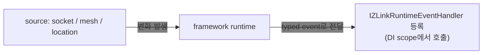

<!-- framework-adapter-nav:start -->
[문서 목록](../../../../README.ko.md) | [이전: Location](10-location.ko.md) | [다음: 운영 — 메트릭 · drain · readiness](12-operations.ko.md)
<!-- framework-adapter-nav:end -->

# 11. Monitoring — runtime 이벤트 관찰

> 정식 계약은 [spec/aspnet-core-monitoring](../../../common/spec/server/languages/dotnet/01-system-structure.ko.md)가
> 다룬다.

handler 호출만으로는 운영을 다 볼 수 없다. socket connect/disconnect, 위치·연결 상태를 runtime이
합성한 보기의 변화, timer handler 실패 같은 **runtime
변화**도 framework 표면에서 받아야 한다. monitoring이 이를 source 별로 통일된
방식으로 노출한다.

## 1. source 별 표면

하부 `.NET zlink` 표면이 source마다 모양이 달라, framework는 source 별로 표면을
다르게 둔다.

| source | 방식 |
|--------|------|
| socket | raw monitor 기반 event (connect/disconnect/handshake 등) — classic channel용 |
| mesh | `AddRouteMesh`로 등록한 MeshNode의 runtime 이벤트 스트림(state/peer 전이)을 그대로 전달 |
| location | 주기적으로 상태를 읽고 직전 상태와 비교해 event 합성 (`location-runtime` source, [10-location](10-location.ko.md)) |

공통 규칙: event kind는 `enum`, payload는 `record struct`, 어플리케이션은
`IZLinkRuntimeEventHandler<TEvent>`를 DI에 등록해 수신한다.

흐름은 단순하다 — **source에서 변화가 나면 framework가 typed handler로 전달**하고,
DI에 등록된 handler를 scope 안에서 꺼내 호출한다(HTTP 요청 handler와 같은 결).



## 2. 등록

`AddZLinkMonitoring(...)`은 **source 등록만** 한다. 실제 socket이나 mesh source는
framework runtime에 올라와 있어야 한다.

```csharp
builder.Services.AddZLinkMonitoring(monitor =>
{
    monitor.AddSocketEvents(
        "profile.server",                        // channel + capability 형태
        ZLinkSocketEventKind.ConnectionReady,
        ZLinkSocketEventKind.Disconnected);

    // RouteMesh 노드의 state/peer 전이 이벤트 — mesh 이름으로 등록
    monitor.AddMeshNodeEvents("game.room");

    // location store를 등록한 배포에서 — 자기 노드의 위치/연결 상태 변화 이벤트를 받는다
    monitor.AddLocationRuntimeEvents("location-runtime", TimeSpan.FromSeconds(1));
});

// AddZLinkMonitoring은 source 등록만 한다 — event handler는 자동 등록되지 않으니 직접 DI로 등록한다.
// framework는 이벤트마다 새 scope에서 handler를 resolve 하므로 AddScoped가 자연스럽다.
builder.Services.AddScoped<
    IZLinkRuntimeEventHandler<ZLinkSocketEvent>,
    ProfileServerSocketMonitor>();
builder.Services.AddScoped<
    IZLinkRuntimeEventHandler<ZLinkLocationRuntimeEvent>,
    LocationMonitor>();
builder.Services.AddScoped<
    IZLinkRuntimeEventHandler<ZLinkSpotEvent>,
    StageNodeMonitor>();
builder.Services.AddScoped<
    IZLinkRuntimeEventHandler<ZLinkMeshRuntimeEvent>,
    RoomMeshMonitor>();
```

- socket source 이름은 `channel + capability`(예: `profile.server`,
  `profile.client`) 형태다. capability는 `server`, `client`, `publisher`,
  `subscriber` 중 하나다.
- location source 이름(예: `location-runtime`)은 event의 `SourceName` 으로만
  쓰이는 자유 문자열이라 별도 infrastructure 등록 이름으로 검증하지 않는다.
- location polling 주기는 **항상 명시**해야 한다(숨은 기본 주기 없음 — 운영
  코드가 polling 비용을 설정에서 바로 읽도록).
- socket source가 등록된 channel capability와 맞지 않으면 시작 단계 예외다.
  location source는 자유 문자열이라
  이 검증의 대상이 아니다.
- `AddSocketEvents(...)`에 kind를 안 넘기면 그 source가 지원하는 모든 이벤트를
  받는다.
- `AddMeshNodeEvents(meshName)`의 이름은 `AddRouteMesh(meshName)`로 등록한 mesh와
  일치해야 한다(시작 단계 검증). 이벤트는 kind 필터 없이 전부 전달되고, handler는
  `ZLinkMeshRuntimeEvent.Identifier`(예: `zlink.runtime.mesh_node.peer_changed`)와
  `Reason`/`State` 필드로 구분한다.

## 3. event handler 작성

`IZLinkRuntimeEventHandler<TEvent>`를 구현한 뒤 같은 타입으로 DI에 등록하면
framework가 이벤트마다 새 DI scope를 열어 그 안에서 handler를 resolve 해 호출한다.
그래서 `AddScoped`가 기본 선택이고, handler가 무상태라면 `AddSingleton`도 무방하다.
`AddZLinkMonitoring(...)`은 source만 등록하며, event handler를 자동 스캔하거나
자동 등록하지 않는다.

> **handler가 던져도 messaging은 멈추지 않는다.** 이벤트 dispatch는 messaging 경로와 분리된
> detached task(`monitoring-event-dispatch`)로 돌아, `HandleAsync`가 예외를 던져도 그 실패는
> 격리되고 이후 메시지 처리는 정상 복구된다. 단 이 실패의 stderr 로그는 기본적으로 조용하고,
> `ZLINK_DEBUG_FRAMEWORK_TASKS=1` 환경변수를 켰을 때만 `monitoring-event-dispatch` 마커로 남는다
> (handler 문제를 추적할 땐 이 변수를 켜고 그 마커로 grep 한다).

### socket

```csharp
public sealed class ProfileServerSocketMonitor(ILogger<ProfileServerSocketMonitor> logger)
    : IZLinkRuntimeEventHandler<ZLinkSocketEvent>
{
    public ValueTask HandleAsync(ZLinkSocketEvent @event, CancellationToken ct)
    {
        switch (@event.Event)
        {
            case ZLinkSocketEventKind.ConnectionReady:
                logger.LogInformation("socket ready: {Source} {Remote}",
                    @event.SourceName, @event.RemoteAddr);
                break;
            case ZLinkSocketEventKind.Disconnected:
                logger.LogWarning("socket disconnected: {Source} {Remote}",
                    @event.SourceName, @event.RemoteAddr);
                break;
        }
        return ValueTask.CompletedTask;
    }
}
```

socket event는 backend의 native event code를 노출하지 않고 framework가 정의한
event kind와 endpoint·routing identity만 전달한다.

### mesh

```csharp
public sealed class RoomMeshMonitor(ILogger<RoomMeshMonitor> logger)
    : IZLinkRuntimeEventHandler<ZLinkMeshRuntimeEvent>
{
    public ValueTask HandleAsync(ZLinkMeshRuntimeEvent @event, CancellationToken ct)
    {
        // peer 전이는 Reason("ready"/"disconnected" 등), 노드 전이는 State로 온다.
        if (@event.PeerRid is { } peer)
            logger.LogInformation("mesh peer: {Mesh} {Peer} {Reason}",
                @event.MeshName, peer, @event.Reason);
        else if (@event.State is { } state)
            logger.LogInformation("mesh state: {Mesh} {State}", @event.MeshName, state);
        return ValueTask.CompletedTask;
    }
}
```

mesh 이벤트는 polling 합성이 아니라 MeshNode runtime의 순서 있는 이벤트
스트림([12-operations](12-operations.ko.md)의 `IZLinkRouteMeshRuntime.ObserveAsync`)을
그대로 event 버스에 올린 것이다 — `Sequence`가 mesh 안에서 단조 증가한다.

### location

location store를 등록한 배포([10-location](10-location.ko.md))에서, 자기 노드의 위치와 연결 상태
보기(활성 peer, 연결 상태, store 상태)가 바뀔 때 이벤트가 온다.

```csharp
public sealed class LocationMonitor(ILogger<LocationMonitor> logger)
    : IZLinkRuntimeEventHandler<ZLinkLocationRuntimeEvent>
{
    public ValueTask HandleAsync(ZLinkLocationRuntimeEvent @event, CancellationToken ct)
    {
        switch (@event)   // 종류별 중첩 record — 타입 패턴으로 분기한다
        {
            case ZLinkLocationRuntimeEvent.TopologyChanged topology:
                // 서버가 추가/제거되어 활성 peer 구성이 바뀌었다
                logger.LogInformation("topology: {Count} entries", topology.Topology.Count);
                break;
            case ZLinkLocationRuntimeEvent.StoreFailure failure:
                // store가 죽었다 — 기존 연결은 유지되지만 새 위치 반영이 멈춘다
                logger.LogWarning("location store unavailable: {Source}", failure.SourceName);
                break;
            case ZLinkLocationRuntimeEvent.StoreRecovered:
                logger.LogInformation("location store recovered");
                break;
        }
        return ValueTask.CompletedTask;
    }
}
```

event 종류는 enum이 아니라 **중첩 sealed record**다. `switch (@event)`에 타입
패턴을 쓰고, 각 종류의 데이터(`Topology`, `Status` 등)는 해당 record에만 있다.
종류는 `StatusChanged` / `TopologyChanged` / `ServiceSummaryChanged` /
`StoreFailure` / `StoreRecovered` **5종 고정**이다. 하부 raw monitor가 없어
framework가 `interval` 주기로 runtime query 결과를 읽어 직전 값과 비교해 합성한다.
store가 죽어도 이 source는 죽지 않는다 — 조회 실패는 `StoreFailure` 이벤트 한
번으로 강등되고, 복구되면 `StoreRecovered`가 온다.

### spot

spot의 timer handler 실패는 polling source를 별도로 등록하지 않아도 발생 시점에
provider-neutral runtime event로 전달된다. SpotNode의 state·peer 상태는 중복된
spot 전용 projection을 만들지 않고 `AddMeshNodeEvents(...)`와
`IZLinkRouteMeshRuntime` snapshot을 사용한다.

```csharp
public sealed class StageNodeMonitor(ILogger<StageNodeMonitor> logger)
    : IZLinkRuntimeEventHandler<ZLinkSpotEvent>
{
    public ValueTask HandleAsync(ZLinkSpotEvent @event, CancellationToken ct)
    {
        switch (@event)   // timer failure 두 종류만 provider-neutral event로 받는다.
        {
            case ZLinkSpotEvent.TimerHandlerFailed failed:
                logger.LogError("spot timer failed: {Source} {Timer} {Handler} {Exception}",
                    failed.SourceName,
                    failed.Diagnostic.TimerName,
                    failed.Diagnostic.HandlerType,
                    failed.Diagnostic.ExceptionType);
                break;
            case ZLinkSpotEvent.TimerStoppedAfterUnhandledException stopped:
                logger.LogError("spot timer stopped: {Source} {Timer}",
                    stopped.SourceName, stopped.Diagnostic.TimerName);
                break;
        }
        return ValueTask.CompletedTask;
    }
}
```

spot event는 `TimerHandlerFailed`, `TimerStoppedAfterUnhandledException` **2종 고정**이다.
timer 실패는 polling 주기를 기다리지 않고 발생 시점에 즉시 발행된다.
timer 정책은 [06-spot](06-spot.ko.md) §3을 참고한다.

## 4. 자주 막히는 곳

- **이벤트가 안 온다** → `AddZLinkMonitoring`은 source 등록만 한다. 해당 source가
  `IZLinkRuntimeEventHandler<TEvent>` 구현체가 DI에 등록됐는지 확인한다.
- **자동 연결 상태를 받고 싶다** → `location-runtime` source의 이벤트
  (`AddLocationRuntimeEvents`)를 받거나, 시점 조회는 location runtime query를 쓴다
  ([10-location](10-location.ko.md) §3).
- **health/metric endpoint를 기대한다** → `AddZLinkMonitoring(...)`은 socket,
  mesh, location runtime event source를 등록할 뿐 HTTP endpoint를 만들지 않는다.
  health check 나 metric은 이벤트와 runtime query를 읽어 앱이 직접 노출한다
  ([10-location](10-location.ko.md) §3).
- **등록되지 않은 메시지를 알고 싶다** → `ConfigureDispatch().Diagnostics`의 level을
  `Errors` 이상으로 설정하고 application의 `ILogger` 또는 `ActivitySource` exporter를
  확인한다. Request 실패는 error reply로 돌아가며, send 실패는 diagnostic record로
  확인할 수 있다. Publish는 subscriber별 결과를 확인하지 않으므로 target별 record를
  만들지 않는다.
- **handler payload의 정확한 필드** → 가이드는 자주 쓰는 필드만 보였다. 전체는
  [spec/aspnet-core-monitoring](../../../common/spec/server/languages/dotnet/01-system-structure.ko.md) 참고.

## 5. 메시지 흐름 추적

메시지 흐름 추적은 메시지의 수신, handler 전달과 terminal 결과를 기록한다.
`CorrelationId`는 한 request와 reply를 연결하고, `FlowId`는 그 request가 시작한
후속 Spot·Actor·Channel 호출까지 연결한다.

Application은 기록 수준, 정상 흐름의 sampling 비율과 message byte 크기 포함 여부만
설정한다. Log 저장 위치와 trace exporter는 application의 표준 logging·telemetry
설정이 소유한다.

```csharp
builder.Services.AddZLinkFramework(options =>
{
    options.ConfigureDispatch().Diagnostics
        .SetLevel(ZLinkDiagnosticsLevel.Normal) // 오류와 주요 처리 경계를 기록한다.
        .SetSampleRate(0.1)                     // 정상 흐름의 10%를 Flow 단위로 선택한다.
        .IncludeMessageSizes(false);            // Payload 내용과 byte 크기를 기록하지 않는다.
});
```

| Level | 기록 범위 |
|---|---|
| `Off` | Message flow와 dispatch error를 만들지 않는다. |
| `Errors` | Error, backpressure와 drop만 기록한다. |
| `Normal` | Error와 주요 처리 경계를 기록한다. |
| `Detailed` | `Normal`에 byte 크기와 terminal 경과 시간을 추가할 수 있다. |

기본값은 `Errors`다. `Off`에서는 trace event, attribute, 문자열과 sampling hash를
만들지 않는다. 출력만 버리는 logger filter는 이 조건을 만족하지 않는다.

운영 중에는 DI에서 process singleton인 `IZLinkDiagnosticsRuntime`을 얻어 이후
처리의 level을 바꾼다.

```csharp
public sealed class DiagnosticsSwitch(IZLinkDiagnosticsRuntime diagnostics)
{
    public void Disable() =>
        diagnostics.Level = ZLinkDiagnosticsLevel.Off; // 이후 처리부터 trace 생성 비용을 제거한다.

    public void EnableNormal() =>
        diagnostics.Level = ZLinkDiagnosticsLevel.Normal;
}
```

.NET runtime은 trace를 `ActivitySource` 이름 `Zlink.Framework`로 내보낸다.
`ILogger`의 structured log를 사용할 때는 `corr`와 `flow` field로 각각 request와
업무 흐름을 검색한다. Publish는 subscriber별 결과를 확인하지 않으므로 target별
trace나 count를 만들지 않는다.

정확한 attribute와 전파 규칙은
[메시지 흐름 추적](../../../common/spec/26-message-flow-tracing.ko.md)과
[Flow 상관관계](../../../common/spec/27-flow-correlation.ko.md)를 참고한다.

## 6. 더 보기

- 이 챕터 계약의 실행 검증 예문(monitoring options/event/handler/publisher): [13-interface-catalog](13-interface-catalog.ko.md) §7 — 검증 클래스 `EventingContracts`
- 정식 계약: [spec/aspnet-core-monitoring](../../../common/spec/server/languages/dotnet/01-system-structure.ko.md)
- location 운영 조회: [10-location](10-location.ko.md)
- 런타임 메트릭·drain 상태 관측: [12-operations](12-operations.ko.md)

---
<!-- framework-adapter-nav:bottom:start -->
[문서 목록](../../../../README.ko.md) | [이전: Location](10-location.ko.md) | [다음: 운영 — 메트릭 · drain · readiness](12-operations.ko.md)
<!-- framework-adapter-nav:bottom:end -->
