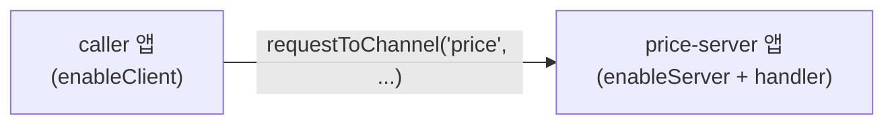

<!-- framework-adapter-nav:start -->
[문서 목록](../README.ko.md) | [이전: Overview](01-overview.ko.md) | [다음: Concepts](03-concepts.ko.md)
<!-- framework-adapter-nav:end -->

# Java Getting Started

## 1. 의존성

첫 구현은 모듈을 아래처럼 나눈다.

```kotlin
dependencies {
    implementation("systems.zlink:zlink-framework-core")
    implementation("systems.zlink:zlink-framework-spring-boot-starter")
    // zlink 바인딩(systems.zlink:zlink)은 zlink-framework-core 가 api 의존으로 함께 가져온다
}
```

버전과 artifact id는 구현 시점의 빌드 정책에 맞춰 확정한다.

Java framework는 Spring Boot host lifetime 안에서 시작하고 종료한다.
application은 `@EnableZLinkFramework`와 Spring bean 등록으로 channel, handler,
Spot, stream 구성을 넘긴다. runtime을 직접 만들거나 `start` 함수로 시작하는 방법은
public contract로 노출하지 않는다.
애플리케이션 코드는 `ZLinkClient`, `ZLinkRouteClient`, `ZLinkSpotManager`,
runtime 구현 class 이름을 직접 참조해도 시작 함수나 public 생성자는 제공하지 않는다.
Java classpath 환경에서는 package 내부 class 이름 자체를 완전히 숨기기 어렵기 때문에,
Spring Boot starter가 lifecycle owner가 되는 방식을 public 사용 경로로 고정한다.

## 2. 토폴로지

이 예제는 두 개의 Spring Boot 앱과 Registry 하나로 구성한다.



- `price-server` : `price` channel에 server 역할을 열고 handler를 둔다.
- `caller` : `price` channel에 client 역할만 열고 호출한다.

두 앱은 서로의 주소를 직접 모른다. 위치는 `Discovery`(또는 수동 연결)가 해결한다.

## 3. 공유 메시지 타입

두 앱이 공유하는 DTO다. 단순 record면 충분하다.

```java
public record PriceRequest(String symbol) {}
public record PriceReply(String symbol, double price) {}
```

## 4. price-server: handler + channel 등록

```java
@Component
public final class GetPriceHandler
    implements ZLinkRequestHandler<PriceRequest, PriceReply> {

    @Override
    public PriceReply handle(
        PriceRequest request,
        ZLinkRequestContext context) {
        // 실제로는 시세 캐시/DB 조회. 여기서는 고정값.
        return new PriceReply(request.symbol(), 187.42);
    }
}

@Configuration
@EnableZLinkFramework
public class PriceServerConfig implements ZLinkFrameworkConfigurer {
    @Override
    public void configure(ZLinkFrameworkOptions framework) {
        framework.addClientServerChannel("price")
            .enableServer("tcp://0.0.0.0:7301")
            .addRequestHandler(
                GetPriceHandler.class,
                PriceRequest.class,
                PriceReply.class);

        // 위치 해결: 같은 Registry를 가리키게 한다.
        framework.useDiscovery()
            .addRegistryEndpoint("tcp://127.0.0.1:5551");
    }
}
```

핵심: server 역할을 하려면 `enableServer(endpoint)` 에 endpoint 를 넘겨야 한다(server bind
endpoint). server는 요청을 받는 쪽이라, 다른 앱이 접속해 올 주소를 미리 열어 둬야 하기 때문이다. 요청을 보내기만 하는
client는 이 주소가 필요 없다.

## 5. caller: outbound client

```java
@Configuration
@EnableZLinkFramework
public class CallerConfig implements ZLinkFrameworkConfigurer {
    @Override
    public void configure(ZLinkFrameworkOptions framework) {
        framework.addClientServerChannel("price")
            .enableClient();
        framework.useDiscovery()
            .addRegistryEndpoint("tcp://127.0.0.1:5551");
    }
}

@RestController
public final class PriceController {
    private final ZLinkClient client;

    public PriceController(ZLinkClient client) {
        this.client = client;
    }

    @GetMapping("/price/{symbol}")
    public CompletionStage<PriceReply> price(@PathVariable String symbol) {
        return client.requestToChannel("price", new PriceRequest(symbol))
            .submit(PriceReply.class);
    }
}
```

`enableClient()`만 선언한 앱은 inbound handler 없이 outbound 전용으로 동작한다.
`bind(...)`는 필요 없다. `requestToChannel`은 target endpoint를 받지 않는다.
`Discovery`나 manual connection 설정이 peer acquisition을 담당한다. client
역할에 둘 다 없으면 startup validation 오류다.

## 6. Registry 띄우기

`Discovery`가 위치를 해결하려면 Registry 서버가 하나 떠 있어야 한다. 가장 간단한
방법은 별도 Registry 앱이다.

```java
@Configuration
public class RegistryConfig {
    @Bean
    ZLinkEmbeddedRegistryOptions zlinkEmbeddedRegistryOptions() {
        ZLinkEmbeddedRegistryOptions options = new ZLinkEmbeddedRegistryOptions();
        options.setPubEndpoint("tcp://0.0.0.0:5550");
        options.setRouterEndpoint("tcp://0.0.0.0:5551");
        return options;
    }
}
```

배포 모델(embedded/standalone)과 topology 조회는 [09-registry](08-registry.ko.md)에서
다룬다. 수동 연결만으로 Registry 없이 구성하는 방법은
[04-channel-messaging](04-channel-messaging.ko.md)에서 확인한다.

## 7. 실행과 확인

1. `registry` -> `price-server` -> `caller` 순으로 띄운다.
2. `caller`에 `GET /price/AAPL`을 호출한다.
3. `{ "symbol": "AAPL", "price": 187.42 }`가 돌아오면 Discovery 연결과 inbound
   handler dispatch까지 정상이다.

## 8. 다음 단계

- pub/sub는 [channel messaging](../../spec/server/languages/java/01-system-structure.ko.md)을 본다.
- room/stage/zone은 [Spot](../../spec/server/languages/java/01-system-structure.ko.md)을 본다.
- 외부 client는 [STREAM](../../spec/server/languages/java/01-system-structure.ko.md)과
  [Stream Connector](../../spec/stream-connector/languages/java/03-stream-connector.ko.md)를 본다.

---
<!-- framework-adapter-nav:bottom:start -->
[문서 목록](../README.ko.md) | [이전: Overview](01-overview.ko.md) | [다음: Concepts](03-concepts.ko.md)
<!-- framework-adapter-nav:bottom:end -->
