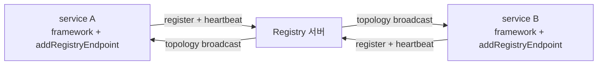

<!-- framework-adapter-nav:start -->
[문서 목록](../README.ko.md) | [이전: STREAM](07-stream.ko.md) | [다음: Monitoring](09-monitoring.ko.md)
<!-- framework-adapter-nav:end -->

# Java Registry Guide

## 1. Registry란

framework의 channel discovery는 **Registry 서버**를 중심에 둔다. Registry는 세
가지를 담당한다: channel 등록, heartbeat 수신, topology broadcast. client 측
`Discovery`는 이 Registry에 붙어 자기 channel view를 자동 갱신한다.

의존 방향에 주의한다: **channel runtime이 Registry에 의존한다**(반대가 아님).
`useDiscovery().addRegistryEndpoint(...)`는 Registry에 **연결하러 가는** 쪽이고, Registry 등록은 그
연결을 **받으러 오는** 쪽이다. 그래서 두 등록은 분리되어 있다.



## 2. Embedded registry

Registry server의 시작과 종료는 Spring host lifetime이 맡는다. application이 registry
runtime을 직접 만들거나 `start` 함수로 시작하는 방법은 public contract로 노출하지
않는다.

```java
import java.time.Duration;
import org.springframework.context.annotation.Bean;
import systems.zlink.framework.registry.ZLinkEmbeddedRegistryOptions;

@Bean
ZLinkEmbeddedRegistryOptions zlinkEmbeddedRegistryOptions() {
    ZLinkEmbeddedRegistryOptions options = new ZLinkEmbeddedRegistryOptions();
    options.setPubEndpoint("tcp://0.0.0.0:5550");
    options.setRouterEndpoint("tcp://0.0.0.0:5551");
    options.setHeartbeatInterval(Duration.ofSeconds(5));  // provider heartbeat 확인 주기
    options.setHeartbeatTimeout(Duration.ofSeconds(15));  // stale provider로 판단하는 시간
    options.setBroadcastInterval(Duration.ofSeconds(30)); // peer registry로 service view를 보내는 주기
    return options;
}
```

> 포트 관례: PUB=`5550`, ROUTER=`5551`. peer는 PUB을, query client/discovery는
> ROUTER를 가리킨다(혼동 주의). embedded라도 `useDiscovery().addRegistryEndpoint(...)`가 같은 프로세스의
> Registry를 자동으로 찾아주지 않는다. Discovery endpoint(`5551`)를 명시해야 한다.

heartbeat와 broadcast interval은 기본값 그대로 두어도 된다. 장애·복구 검증처럼 stale
provider 제거와 peer 합산 view 전파를 빨리 보고 싶을 때만 짧게 조절한다.

## 3. 두 가지 배포 모델

| 모델 | 설명 | 적합 |
|------|------|------|
| embedded | 앱 프로세스 안에서 Registry를 함께 구동 | 소규모 배포, 개발 환경 |
| standalone | Registry만 단독 프로세스로 | 운영에서 Registry를 로직과 분리 |

두 모델의 차이는 **배포 구성**일 뿐 API는 같다. standalone은 framework 등록 없이
`ZLinkEmbeddedRegistryOptions` bean만 둔다.

## 4. topology 조회


warm-up 확인, 관리 화면에 쓴다.

```java
@RestController
public final class TopologyController {

        this.registry = registry;
    }

    @GetMapping("/admin/topology")
    public CompletionStage<List<ZLinkRegistryTopologyEntry>> topology() {
        return registry.topology();
    }

    @GetMapping("/health")
    public CompletionStage<ResponseEntity<ZLinkRegistryStatus>> health() {
        return registry.status().thenApply(status ->
            status.state() == RegistryState.ACTIVE
                ? ResponseEntity.ok(status)
                : ResponseEntity.status(503).build());
    }
}
```


다른 프로세스의 Registry를 조회할 때는 별도 등록한다.

```java
@Bean
    return options -> options.setEndpoint("tcp://127.0.0.1:5551");
}
```

|------|----------------------|-----------------------------|
| 대상 | 같은 프로세스 embedded Registry | 다른 프로세스 Registry |
| 제공 | status·service·topology·member peers | topology snapshot만 |

프로세스 runtime snapshot을 읽고, 후자는 remote query protocol을 사용한다. 원격
client가 좁은 이유는 하부 C API가 topology snapshot만 지원하기 때문이다. 연결
실패 시 framework가 몰래 retry하지 않으니 retry는 호출자/monitoring에서 명시한다.

## 5. Hot path

일반 request hot path는 registry query를 직접 호출하지 않는다. 각 channel/Spot
runtime의 discovery view가 peer 선택을 담당한다. Registry를 key-value 저장소로
노출하는 것도 아니다. Redis/DB가 필요하면 custom resolver/store를 등록한다.

## 6. 더 보기

- 위치 해결 흐름 첫 예제: [02-getting-started §6](02-getting-started.ko.md)
- topology 변화를 runtime event로 관찰: [09-monitoring](09-monitoring.ko.md)
- 정식 계약: [spring-boot-registry](../../spec/server/languages/java/01-system-structure.ko.md)

---
<!-- framework-adapter-nav:bottom:start -->
[문서 목록](../README.ko.md) | [이전: STREAM](07-stream.ko.md) | [다음: Monitoring](09-monitoring.ko.md)
<!-- framework-adapter-nav:bottom:end -->
