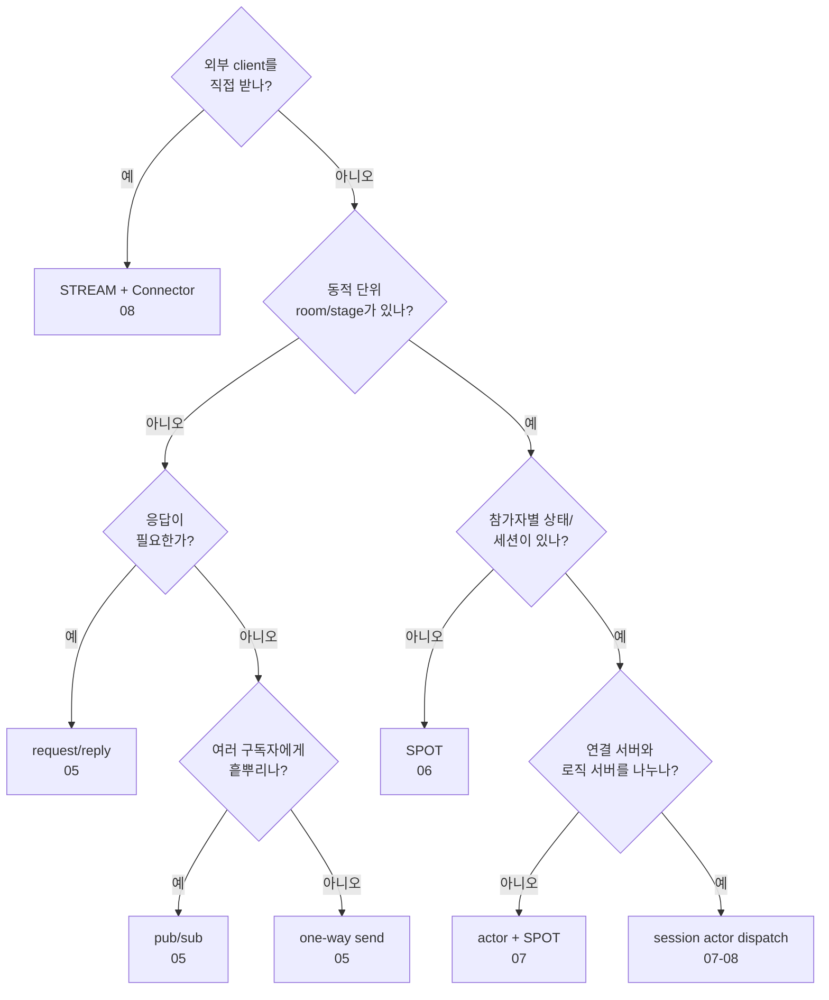

<!-- framework-adapter-nav:start -->
[문서 목록](../README.ko.md) | [이전: Monitoring](09-monitoring.ko.md) | [다음: 인터페이스 카탈로그](11-interface-catalog.ko.md)
<!-- framework-adapter-nav:end -->

# Java Feature Map

## 1. 난이도 기준

| 등급 | 의미 |
|------|------|
| **낮음** | handler 1개 + channel 등록 수준. 가이드만으로 도입 가능 |
| **중간** | lifecycle/factory/등록 조합을 이해해야 함 |
| **높음** | 분산 토폴로지·세션 라우팅 결정이 필요 |

## 2. 기능 × 난이도 × 언제 쓰나

| 기능 | 난이도 | 언제 쓰나 | 쓰는 표면 | 가이드 |
|------|:------:|-----------|-----------|--------|
| 서버 간 request/reply | 낮음 | 서비스 A가 서비스 B의 결과가 필요할 때 | `ZLinkClient.requestToChannel` | [05](04-channel-messaging.ko.md) |
| 서버 간 one-way send | 낮음 | 응답 없는 작업 위임/통지 | `ZLinkClient.sendToChannel` | [05](04-channel-messaging.ko.md) |
| event fanout (pub/sub) | 낮음 | domain event를 여러 구독자에게 전파 | `ZLinkFanoutClient.publish` | [05](04-channel-messaging.ko.md) |
| target node 지정 route | 중간 | application이 target `RoutingId`를 직접 알 때 | `ZLinkRouteClient.request` | [05](04-channel-messaging.ko.md) |
| room/stage/zone 생성 | 중간 | 동적 생성·소멸 논리 노드 단위 라우팅 | `ZLinkSpotManager.create` | [06](05-spot.ko.md) |
| Spot 내부 timer | 중간 | 주기 tick, heartbeat, 정리 작업 | `ZLinkTimer` | [06](05-spot.ko.md) |
| actor 생성/재사용 | 높음 | session과 묶인 상태 보유 객체로 packet dispatch | `ZLinkActorManager.getOrCreate` | [07](06-actor-session.ko.md) |
| client session binding | 높음 | STREAM session을 actor에 묶기 | `context.actors().bind` | [07](06-actor-session.ko.md) |
| actor에서 client push | 높음 | actor가 자기 client로 one-way push | `ZLinkBoundSession.send` | [07](06-actor-session.ko.md) |
| 외부 client STREAM (서버) | 중간 | 외부 client(TCP/WS)를 framework로 받기 | `ZLinkSession` | [08](07-stream.ko.md) |
| Stream Connector (client) | 중간 | client 측에서 STREAM 서버에 접속 | `ZLinkStreamConnector` | [08](07-stream.ko.md) |
| topology 조회 | 중간 | 클러스터 topology snapshot/query | `ZLinkRegistryQuery` | [09](08-registry.ko.md) |
| runtime monitoring | 낮음 | socket/registry/spot 이벤트 관찰 | `ZLinkRuntimeEventHandler<T>` | [10](09-monitoring.ko.md) |

## 3. 빠른 선택 가이드

- **서비스끼리 호출만** -> request/reply 또는 send. 난이도 낮음,
  [02-getting-started](02-getting-started.ko.md)로 충분.
- **이벤트를 흩뿌린다** -> pub/sub.
- **방/판/존 같은 동적 단위** -> SPOT. 그 안에 참가자별 상태/세션이 있으면 actor.
- **외부 게임/모바일 client** -> STREAM(서버) + Stream Connector(client).
- **연결 서버와 로직 서버 분리(재접속 이전성)** -> session actor dispatch.

## 4. 완료 기준

feature map의 모든 항목은 구현, 테스트, sample 중 하나 이상에서 실제 public API로
확인되어야 한다. 특히 Stream Connector와 sample은 포팅 완료 범위에 포함된다.

## 5. 더 보기

- 표면 멘탈 모델: [03-concepts](03-concepts.ko.md)
- ZLink를 어디에 쓰나(도입 판단): [12-grpc-alternative](12-grpc-alternative.ko.md)
- 전체 public interface: [11-interface-catalog](11-interface-catalog.ko.md)

---
<!-- framework-adapter-nav:bottom:start -->
[문서 목록](../README.ko.md) | [이전: Monitoring](09-monitoring.ko.md) | [다음: 인터페이스 카탈로그](11-interface-catalog.ko.md)
<!-- framework-adapter-nav:bottom:end -->
