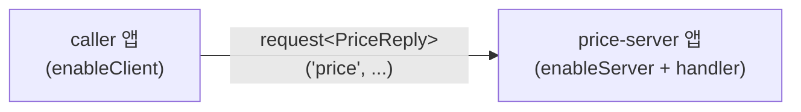

<!-- framework-adapter-nav:start -->
[문서 목록](../README.ko.md) | [이전: Overview](01-overview.ko.md) | [다음: Concepts](03-concepts.ko.md)
<!-- framework-adapter-nav:end -->

# Kotlin Getting Started

## 1. 의존성

첫 구현은 모듈을 아래처럼 나눈다. `zlink-framework-kotlin`이 coroutine 표면을 더한다.

```kotlin
dependencies {
    implementation("systems.zlink:zlink-framework-core")
    implementation("systems.zlink:zlink-framework-spring-boot-starter")
    implementation("systems.zlink:zlink-framework-kotlin")
    implementation("systems.zlink:zlink")
    implementation("org.jetbrains.kotlinx:kotlinx-coroutines-core")
}
```

버전과 artifact id는 구현 시점의 빌드 정책에 맞춘다. Kotlin은 `2.1.0` 이상을 쓴다.

framework는 Spring Boot host lifetime 안에서 시작하고 종료한다. application은
`@EnableZLinkFramework`와 `ZLinkFrameworkConfigurer` bean으로 channel, handler,
Spot, stream 구성을 넘긴다. runtime을 직접 만들거나 `start` 함수로 시작하는 방법은
public contract로 노출하지 않는다. 애플리케이션 코드는 `ZLinkClient`,
등록되는 public contract만 주입받는다.

### coroutine handler 켜기

`suspend` handler 인터페이스는 scanner가 직접 인식해 package scan으로 등록한다.
`useCoroutineHandlers(...)`는 등록을 켜는 스위치가 아니라, suspend handler를 실행할
coroutine dispatcher/scope를 지정하는 설정이다.

```kotlin
import kotlinx.coroutines.Dispatchers
import systems.zlink.framework.kotlin.useCoroutineHandlers

ZLinkFrameworkConfigurer { options ->
    options.useCoroutineHandlers(Dispatchers.Default)   // suspend handler 활성화
    // ... channel/handler 등록
}
```

직접 만든 `CoroutineScope`로 lifecycle을 묶고 싶으면
`useCoroutineHandlers(scope, dispatcher)` 오버로드를 쓴다.

## 2. 토폴로지

이 예제는 두 개의 Spring Boot 앱과 Registry 하나로 구성한다.



- `price-server` : `price` channel에 server 역할을 열고 handler를 둔다.
- `caller` : `price` channel에 client 역할만 열고 호출한다.

두 앱은 서로의 주소를 직접 모른다. 위치는 `Discovery`(또는 수동 연결)가 해결한다.

## 3. 공유 메시지 타입

두 앱이 공유하는 DTO다. 단순 `data class`면 충분하다.

```kotlin
data class PriceRequest(val symbol: String)
data class PriceReply(val symbol: String, val price: Double)
```

## 4. price-server: handler + channel 등록

handler는 `ZLinkSuspendingRequestHandler<TReq, TReply>`를 구현하고 `handle`을
`suspend`로 둔다. `@ZLinkHandlerGroup`으로 어떤 channel group에 붙을지 표시한다.

```kotlin
import systems.zlink.framework.channels.ZLinkRequestContext
import systems.zlink.framework.handlers.ZLinkHandlerGroup
import systems.zlink.framework.kotlin.ZLinkSuspendingRequestHandler

@ZLinkHandlerGroup("price")
class GetPriceHandler : ZLinkSuspendingRequestHandler<PriceRequest, PriceReply> {
    override suspend fun handle(
        request: PriceRequest,
        context: ZLinkRequestContext,
    ): PriceReply {
        // 실제로는 시세 캐시/DB 조회(suspend repository 등). 여기서는 고정값.
        return PriceReply(request.symbol, 187.42)
    }
}

@Configuration
@EnableZLinkFramework
class PriceServerConfig {
    @Bean
    fun priceServerFramework(): ZLinkFrameworkConfigurer =
        ZLinkFrameworkConfigurer { options ->
            options.useCoroutineHandlers(Dispatchers.Default)
            options.addHandlersFromPackageOf(PriceServerConfig::class.java)
            options.addClientServerChannel("price")
                .enableServer("tcp://0.0.0.0:7301")
                .addHandlerGroup("price")

            // 위치 해결: 같은 Registry를 가리키게 한다.
            options.useDiscovery()
                .addRegistryEndpoint("tcp://127.0.0.1:5551")
        }
}
```

핵심: server 역할을 하려면 `enableServer(...)`가 필수다. server는 요청을 받는 쪽이라,
다른 앱이 접속해 올 주소를 미리 열어 둬야 하기 때문이다. 요청을 보내기만 하는
client는 이 주소가 필요 없다. `addHandlersFromPackageOf(...)` package scan은 후보를
찾고, 실제 노출은 `addHandlerGroup("price")`로 channel에 묶을 때 정해진다.

## 5. caller: outbound client

controller는 `suspend fun`으로 두고 client 확장 `request<T>(...)`로 한 줄 호출한다.

```kotlin
import systems.zlink.framework.kotlin.request

@Configuration
@EnableZLinkFramework
class CallerConfig {
    @Bean
    fun callerFramework(): ZLinkFrameworkConfigurer =
        ZLinkFrameworkConfigurer { options ->
            options.addClientServerChannel("price").enableClient()
            options.useDiscovery().addRegistryEndpoint("tcp://127.0.0.1:5551")
        }
}

@RestController
class PriceController(private val client: ZLinkClient) {
    @GetMapping("/price/{symbol}")
    suspend fun price(@PathVariable symbol: String): PriceReply =
        client.request("price", PriceRequest(symbol))
}
```

`request<TReply>(channel, message)`는 `ZLinkFrameworkExtensions`의 `suspend` 확장으로,
`requestToChannel(...).submit(TReply::class.java).await()`를 한 줄로 줄인다. timeout이나
metadata 옵션이 필요하면 `client.requestToChannel("price", req).timeout(...).submit(PriceReply::class.java).await()`처럼
builder를 직접 쓴다.

`enableClient()`만 선언한 앱은 inbound handler 없이 outbound 전용으로 동작한다.
`enableServer(...)`는 필요 없다. `request`/`requestToChannel`은 target endpoint를 받지
않는다. `Discovery`나 manual connection 설정이 peer acquisition을 담당한다. client
역할에 둘 다 없으면 startup validation 오류다.

## 6. Registry 띄우기

`Discovery`가 위치를 해결하려면 Registry 서버가 하나 떠 있어야 한다. 가장 간단한
방법은 별도 Registry 앱이다.

```kotlin
@Configuration
class RegistryConfig {
    @Bean
    fun zlinkEmbeddedRegistryOptions(): ZLinkEmbeddedRegistryOptions =
        ZLinkEmbeddedRegistryOptions().apply {
            pubEndpoint = "tcp://0.0.0.0:5550"
            routerEndpoint = "tcp://0.0.0.0:5551"
        }
}
```

배포 모델(embedded/standalone)과 topology 조회는 [08-registry](08-registry.ko.md)에서
다룬다. 수동 연결만으로 Registry 없이 구성하는 방법은
[04-channel-messaging](04-channel-messaging.ko.md)에서 확인한다.

## 7. 실행과 확인

1. `registry` -> `price-server` -> `caller` 순으로 띄운다.
2. `caller`에 `GET /price/AAPL`을 호출한다.
3. `{ "symbol": "AAPL", "price": 187.42 }`가 돌아오면 Discovery 연결과 inbound
   handler dispatch까지 정상이다.

## 8. 다음 단계

- pub/sub는 [04-channel-messaging](04-channel-messaging.ko.md)을 본다.
- room/stage/zone은 [05-spot](05-spot.ko.md)을 본다.
- 외부 client는 [07-stream](07-stream.ko.md)과
  [Stream Connector](../../spec/stream-connector/languages/java/03-stream-connector.ko.md)를 본다.

---
<!-- framework-adapter-nav:bottom:start -->
[문서 목록](../README.ko.md) | [이전: Overview](01-overview.ko.md) | [다음: Concepts](03-concepts.ko.md)
<!-- framework-adapter-nav:bottom:end -->
