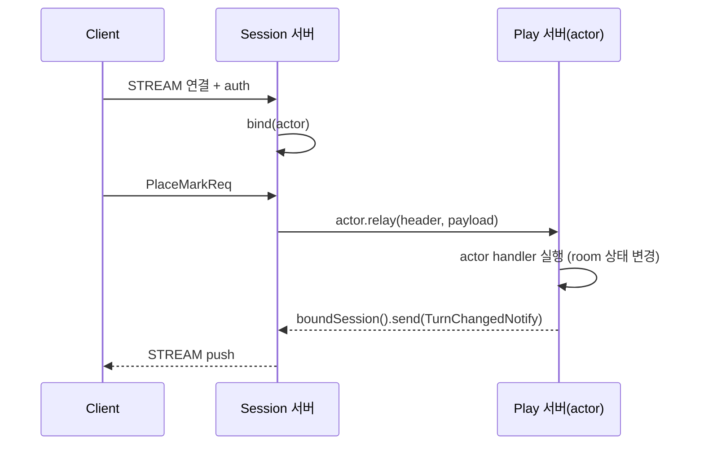

<!-- framework-adapter-nav:start -->
[문서 목록](../README.ko.md) | [이전: Spot](05-spot.ko.md) | [다음: STREAM](07-stream.ko.md)
<!-- framework-adapter-nav:end -->

# Kotlin Actor/Session Guide

## 1. actor란

actor는 **ID로 식별되는 상태 보유 객체**다. 같은 `actorId`로 들어오는 메시지는
항상 같은 인스턴스가 처리한다(일반 handler는 stateless라 메시지마다 새로 resolve된다).
게임에서 한 플레이어, 한 세션의 진행 상태를 담기에 맞다.

호출자는 actor가 어느 노드/Spot에 있는지 몰라도 된다. `actorId`만으로 호출하면
라우팅은 framework가 등록된 resolver로 푼다.

actor의 상태는 서로 독립인 두 축으로 본다.

| 축 | 값 |
|----|------|
| 위치(location) | Entry Spot(생성 직후 기본) <-> user Spot(join 후) |
| binding | unbound <-> STREAM session에 bound |

위치 이동과 session binding은 독립이다. user Spot join에 session bind가 꼭
필요한 것은 아니다. session disconnect는 actor membership을 바꾸지 않는다.

## 2. actor 등록과 작성

actor는 factory로 만든다. factory는 `actorType` 짧은 문자열로 등록한다. coroutine
factory는 `ZLinkSuspendingActorFactory`를 상속해 `createActor`를 `suspend`로 둔다.

```kotlin
ZLinkFrameworkConfigurer { options ->
    options.addActorFactory("player", PlayerActorFactory::class.java)
    // Entry Spot / user Spot 등록은 SpotNode 쪽에서 (§3)
}

import systems.zlink.framework.kotlin.ZLinkSuspendingActorFactory

class PlayerActorFactory : ZLinkSuspendingActorFactory() {
    override suspend fun createActor(
        actorId: String,
        context: ZLinkActorContext,
    ): ZLinkActor = PlayerActor(actorId, context)
}
```

actor 안에서의 Spot join과 현재 상태 조회는 주입된 `ZLinkActorContext`로 한다.
channel outbound는 actor context의 기능이 아니며, Entry Spot 또는 user Spot
handler에서 받은 spot context로 호출한다.

| `ZLinkActorContext` 멤버 | 용도 |
|--------------------------|------|
| `spotRid()`, `isJoined()` | 현재 Spot join 상태 조회 |
| `boundSession()` | 자기 client로 push (§4) |
| `joinSpot(spotRid, request)` | user Spot으로 join. `.submit(...).await()`로 종결 |
| `joinEntrySpot(spotNodeRid, request)` | target SpotNode의 Entry Spot으로 이동. request는 DTO 또는 `ZLinkMessage`로 넘긴다 |
| `destroyActor(actor)` (Entry Spot context의 suspend 확장) | Entry Spot에 있는 actor를 종료 |

`joinSpot(...).submit(replyType).await()`는 actor join 요청을 제출하고, join reply를
`replyType`으로 역직렬화한다. 성공하면 actor context의 `spotRid()`, `isJoined()`,
`getSpot(Class)`가 join된 user Spot을 가리킨다.

actor 객체를 끝내려면 actor가 Entry Spot에 있는 상태에서 Entry Spot context의
`destroyActor(actor)`를 호출하고 반환된 `CompletionStage`를 `await()`로 기다린다. 이 호출은
lifecycle callback을 호출하지 않고 native actor ref와 framework registry를 정리한다.
user Spot에 있는 actor는 바로 destroy할 수 없으므로 먼저 leave 또는
`joinEntrySpot(..., request)` 흐름을 완료해야 한다.

```kotlin
entrySpotContext.destroyActor(actor).await()
```

## 3. Entry Spot과 user Spot의 actor handler

actor handler와 lifecycle callback은 actor 클래스가 아니라 Entry Spot / user
Spot의 `configure()`에서 등록한다. Entry Spot과 user Spot은 등록 표면이 같지만
실행 정책이 다르다.

```kotlin
class PlayerEntrySpot(
    private val context: ZLinkEntrySpotContext,
) : ZLinkEntrySpot<PlayerActor> {
    override fun context(): ZLinkEntrySpotContext = context

    override fun configure() {
        context.handlers().addActorPacket(AuthenticateHandler::class.java)
        context.handlers().addActorPacket(JoinMatchHandler::class.java)
    }
}
```

실행 순서가 위치마다 다르다.

| 대상 | 실행 라인 |
|------|-----------|
| Entry Spot actor packet / lifecycle / timer | Entry Spot의 단일 실행 큐(직렬) |
| user Spot actor packet / packet / timer / subscription | 그 user Spot의 단일 실행 큐(직렬) |

그래서 Entry Spot의 actor admission 상태와 user Spot 안의 room 상태 같은 가변 상태는
각 Spot 실행 큐 안에서 lock 없이 만질 수 있다.

짧은 local 작업을 Spot 실행 큐 밖에서 처리해야 하면 `context.runWorker(...)`를 사용한다.
worker 함수는 Spot 상태를 직접 만지지 않고, 완료 후 Spot 큐로 돌아온 자리에서 상태를
갱신한다.

```kotlin
val result = context.runWorker { ScoreCalculator.calculate(snapshot) }
    .submit()
    .await()
currentScore = result   // Spot 실행 큐로 복귀한 지점에서 갱신
```

> **응답 body는 반환값으로.** actor request handler는 응답 body를 직접 보내지
> 않고 `suspend fun handle(...)`의 반환값 `TReply`로 정한다. `context`의 reply는
> metadata/compression 같은 응답 frame 옵션만 기록한다.

actor request handler는 `ZLinkSuspendingSpotActorRequestHandler<TSpot, TActor, TReq, TReply>`,
send는 `ZLinkSuspendingSpotActorSendHandler<...>`로 작성하며, Entry Spot 버전은
`ZLinkSuspendingEntrySpotActorRequestHandler`/`...SendHandler`다.

## 4. session actor dispatch — 연결 서버와 로직 서버 분리

큰 게임 서버는 보통 두 역할로 나눈다.

- **Session 서버** — client STREAM 연결만 받는다(인증, actor binding, client 요청
  relay). 게임 로직은 돌리지 않는다.
- **Play(Actor) 서버** — actor, Entry Spot, user Spot을 호스팅하고 실제 로직을 돌린다.

client는 STREAM 하나만 유지하고, Play 서버가 보내는 메시지도 그 STREAM으로
되돌아간다. 재접속(다른 Session 서버일 수도 있음) 시 binding만 새 stream으로
교체되고 actor 인스턴스와 spot membership은 그대로 유지된다(actor id 기준 멱등).



### Session 서버: 인증과 relay

session은 `ZLinkSuspendingSession`을 상속해 `onDispatchSuspending`에서 packet을 받는다.
인증 packet은 typed session packet handler로 처리하고(`bind(...)`), 그 외 packet은
`ZLinkSessionActor.relay(...)`로 actor에 넘긴다. `payload`는 framework runtime이 콜백
동안 빌려준 값이다. `relay(...)`는 caller payload를 소비하지 않으므로 그대로 넘긴다.

```kotlin
import kotlinx.coroutines.future.await
import systems.zlink.framework.kotlin.ZLinkSuspendingSession

class PlaySession(
    private val context: ZLinkSessionContext,
    private val handlers: ZLinkSessionPacketDispatcher<ZLinkSessionContext>,
) : ZLinkSuspendingSession() {
    override fun context(): ZLinkSessionContext = context

    override suspend fun onDisconnectedSuspending() {
        context.actors().bound().forEach { actor -> actor.notifyDisconnected().await() }
    }

    override suspend fun onDispatchSuspending(header: ZLinkStreamHeader, payload: Message) {
        // 등록된 typed session packet handler(예: 인증)를 먼저 시도
        if (handlers.tryHandleAsync(context, header, payload).await()) return
        // 나머지는 bound actor로 relay
        requireActor(header.packetName()).relay(header, payload).await()
    }

    private fun requireActor(packetName: String): ZLinkSessionActor =
        when (context.actors().bound().size) {
            1 -> context.actors().bound()[0]
            0 -> throw IllegalStateException("auth required before '$packetName'")
            else -> throw IllegalStateException("exactly one actor must be bound")
        }
}
```

인증 packet handler는 `ZLinkSuspendingTypedSessionPacketHandler`로 작성한다.

```kotlin
class AuthenticatePlaySessionHandler(
    private val actors: ZLinkActorManager,
    private val channels: ZLinkClient,
) : ZLinkSuspendingTypedSessionPacketHandler<ZLinkSessionContext, AuthenticateReq> {
    override fun packetName() = "AuthenticateReq"
    override fun messageType() = AuthenticateReq::class.java

    override suspend fun handle(
        context: ZLinkSessionContext,
        header: ZLinkStreamHeader,
        request: AuthenticateReq,
    ) {
        val authenticated: AuthenticatePlayerRes =
            channels.requestToChannel("api", AuthenticatePlayerReq(request.accessToken))
                .submit(AuthenticatePlayerRes::class.java)
                .await()
        val playActor = actors.getOrCreate(authenticated.actorId, "player").await()
        val bound = context.actors().bind(playActor).await()
        context.client().reply(AuthenticateRes(bound.actorId())).submit().await()
    }
}
```

### Play 서버: actor가 자기 client로 push

Spot actor handler는 stream을 직접 들지 않는다. 자기 client로 보내려면 handler가
받은 actor의 `context().boundSession()`을 쓴다.

```kotlin
context.boundSession().send(MatchFound(roomId)).submit().await()
```

`ZLinkBoundSession`의 표면은 **`send(message)`** 와 **`disconnect()`** 둘뿐이다.
client로의 push는 단방향이며 별도 request 표면은 없다. `send(...).submit().await()`는
fire-and-forget(route 위임 완료이지 client app ack이 아님)이다. 다른 actor의
client로 보내야 하면 먼저 그 actor에게 메시지를 보낸 뒤, 해당 actor가 자기
`boundSession()`으로 push한다.

## 5. 등록 골격

session relay는 application route mesh channel로 흐르지 않는다. 같은 runtime 안에서
만든 local managed actor instance를 bind하는 direct stream 역할은 attach 없이
framework 내부 dispatch 경로를 사용한다. remote actor ref를 bind해야 하는 session
gateway 역할에서는 STREAM session이 쓸 local SpotNode를 `attachActorGateway(...)`로
지정하면, `bind(...)`가 remote actor locator를 core ActorGateway 경로에 bind한다.

- **Session 서버**: `addSpotMesh`로 session-node(router)를 두고,
  `addStreamNode(...).attachActorGateway("session-node")`로 relay 대상을 지정한다.
- **Play 서버**: `addActorFactory(...)` + `addSpotMesh`로 play-node에
  `addEntrySpot(...)`, `addSpotFactory(...)`를 등록한다.

전체 등록 시그니처와 sample 흐름은
[spring-boot-actor-session](../../java/spec/spring-boot-actor-session.ko.md)과
[stream 샘플](samples/stream-samples.ko.md)이 소유한다.

## 6. Reconnect와 gotcha

- 같은 actor id가 새 session에 다시 bind되면 actor 인스턴스와 Spot membership은
  유지하고 binding token만 갱신한다.
- session disconnect는 bound actor 전체에 자동 전파되지 않는다. 필요한 actor에게만
  `ZLinkSessionActor.notifyDisconnected()`를 호출한다(위 `onDisconnectedSuspending` 예).
- actor 위치 조회용 public resolver는 없다. actor<->session binding은 framework
  내부 상태다. Spot owner 조회만 `useRegistrySpotRemoteAddresses(...)` 또는 custom
  `addSpotRemoteAddressResolver(...)`로 public이다.

## 7. 더 보기

- SPOT 기반: [05-spot](05-spot.ko.md)
- STREAM session 작성: [07-stream](07-stream.ko.md)
- actor 런타임 오류 관찰: [09-monitoring](09-monitoring.ko.md)
- 전체 계약: [spring-boot-actor-session](../../java/spec/spring-boot-actor-session.ko.md)

---
<!-- framework-adapter-nav:bottom:start -->
[문서 목록](../README.ko.md) | [이전: Spot](05-spot.ko.md) | [다음: STREAM](07-stream.ko.md)
<!-- framework-adapter-nav:bottom:end -->
