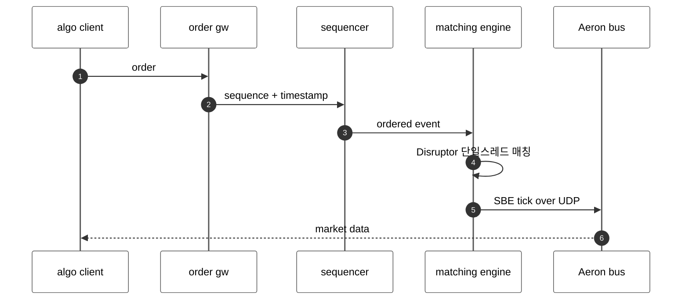
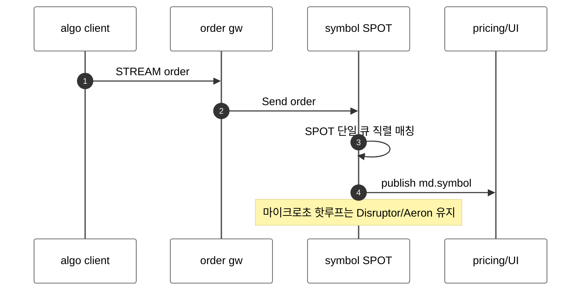

<!-- framework-adapter-nav:start -->
[문서 목록](../../README.ko.md) | [이전: 케이스 — 게임 채팅](17-3-case-game-chat.ko.md) | [다음: ZLink Framework Java Interface Catalog (spec)](../../../java/spec/handler-interfaces.ko.md)
<!-- framework-adapter-nav:end -->

# 케이스 — 트레이딩 시스템

> [12-grpc-alternative](../12-grpc-alternative.ko.md)의 케이스 스터디 중 하나다.
> "심볼별 오더북 = 결정적 직렬 처리" 가 SPOT 의 단일 실행 큐와 맞는 사례이자,
> **마이크로초 HFT 핫패스는 ZLink 영역이 아니라는 경계**가 가장 분명한 사례다.
> 실행 가능한 샘플이 아니라, ZLink 를 쓰기 좋은 경계와 쓰면 안 되는 경계를 가르는
> 도입 판단 문서다.

> **이 케이스에서 ZLink 이 좋은 지점**
> - symbol SPOT 이 "심볼별 직렬" 매칭 모델을 단일 실행 큐로 표현한다.
> - 주문 라우팅·시세 fan-out·연결 수용을 한 framework 로 묶는다.
> - **그대로 남는 것(경계)**: 마이크로초 매칭 핫루프(Disruptor/Aeron/colocation)·FIX·audit 은 전용 인프라 유지.

## 1. 도메인 — 트레이딩 시스템의 진짜 난제

- **매칭 엔진은 수평 확장이 안 되는 단일 스레드 결정적 상태 기계다.** 심볼별
  오더북(정렬된 bid/ask)은 입력 순서가 결과를 정하므로, **심볼당 하나의 직렬
  라인**에서 처리해야 한다. sequencer 가 타임스탬프·배치해 공급한다.
- **마이크로초 지연.** 핫루프는 **LMAX Disruptor**(lock-free 링버퍼),
  **Aeron**(UDP 저지연 메시징), **SBE**(zero-copy 인코딩), **colocation**(거래소
  옆 전용 서버, 커널 바이패스)로 마이크로초를 다툰다. 클라우드 하이퍼바이저를
  거부하고 전용 CPU 코어를 쓴다.
- **시세 대량 fan-out.** 체결·호가는 pricing·리스크·UI·알고로 동시에 퍼진다.
- **외부 연동과 감사.** 외부 venue 는 **FIX**, 주문·체결은 **regulatory audit
  trail** 로 영속된다.
  ([electronic trading platform 설계](https://www.techinterview.org/post/3233474476/system-design-design-electronic-trading-platform-order-book-matching-engine-market-data-feed-low-latency-colocation/),
  [low-latency trading walkthrough](https://medium.com/@himanshu2915j/building-a-scalable-low-latency-real-time-trading-system-detailed-walkthrough-7f7ea0be885c))

핵심 경계가 여기서 갈린다: **"심볼별 직렬" 이라는 _모델_ 은 SPOT 과 같지만, 그
모델을 _마이크로초_ 로 돌리는 _구현_ 은 ZLink(ZMP/TCP) 가 아니라 Disruptor/Aeron/
colocation 의 영역이다.**

## 2. 기존 스택 — Disruptor 매칭 + Aeron 시세 + FIX

### 2.1 컴포넌트와 그 이유

| 컴포넌트 | 왜 필요한가 |
|----------|-------------|
| FIX gateway | 외부 거래소(venue)와 표준 **FIX** 프로토콜로 주문 연동 |
| sequencer | 주문에 전역 순서·타임스탬프를 부여해 매칭 엔진에 공급 |
| Disruptor 매칭 엔진 | 심볼당 **단일 스레드 결정적** 매칭(lock-free 링버퍼) |
| Aeron + SBE | **마이크로초** 시세 배포(UDP 위 zero-copy 인코딩) |
| audit store | regulatory 주문·체결 **영속 기록** |
| colocation 인프라 | 거래소 옆 전용 서버·커널 바이패스로 지연 최소화 |

### 2.2 매칭·시세·외부 연동

```java
disruptor.handleEventsWith(new MatchingHandler());

public final class MatchingHandler implements EventHandler<OrderEvent> {
    private final OrderBook book = new OrderBook();
    @Override
    public void onEvent(OrderEvent event, long seq, boolean endOfBatch) { book.match(event); }
}

aeronPublication.offer(encodeSbe(tick));
fixSession.send(new NewOrderSingle(...));
```

서 있어야 하는 것: FIX gateway, sequencer, Disruptor 매칭 엔진(전용 코어),
Aeron 시세 버스, SBE 스키마, audit store, colocation 인프라.

## 3. ZLink 스택 — symbol SPOT + pub/sub (핫패스 밖)

ZLink 는 **매칭 핫루프가 아니라 그 주변**(OMS·주문 라우팅·시세 배포·리스크·
리테일/알고 게이트웨이)에 맞는다. 심볼 오더북을 SPOT 으로 모델링하면 "심볼당 직렬"
이 framework 보장으로 떨어진다.

```kotlin
@Component
class SubmitOrderHandler :
    ZLinkSuspendingSpotRequestHandler<SymbolBookSpot, SubmitOrder, OrderAck> {
    override suspend fun handle(spot: SymbolBookSpot, order: SubmitOrder): OrderAck {
        val fills = spot.match(order)
        return OrderAck(order.orderId, fills)
    }
}

@Component
class TickPublishHandler :
    ZLinkSuspendingSpotPacketHandler<SymbolBookSpot, Trade> {
    override suspend fun handle(spot: SymbolBookSpot, trade: Trade) {
        spot.context().outbound().publish("md.${spot.symbol()}", trade).submit().await()
    }
}
```

```kotlin
// 리스크 점검 같은 주변부는 일반 channel request (마이크로초 hot path 밖)
val decision: RiskDecision =
    client.requestToChannel("risk", CheckLimit(order.accountId, order.notional))
        .submit(RiskDecision::class.java)
        .await()
```

```kotlin
val node = options.addSpotMesh("books").addNode("book-node")
node.enableRouter("tcp://0.0.0.0:7800")
node.enablePubSub("tcp://0.0.0.0:7801")
node.addSpotFactory(SymbolBookSpot::class.java)
options.addClientServerChannel("risk").enableClient()
```

주문 라우팅·리스크 점검은 channel messaging(`Request`/`Send` + `timeout`)으로,
리테일/알고 client 수용은 STREAM 으로 받는다([4](../04-channel-messaging.ko.md),
[7](../07-stream.ko.md)). 단 **마이크로초 매칭 핫루프는 이 channel 경로 밖**에서
Disruptor/Aeron 으로 남긴다.

## 4. 양쪽 코드 비교 — "주문 제출 → 매칭 → 시세"

| 축 | 기존(Disruptor/Aeron) | ZLink |
|----|------------------------|-------|
| 심볼 직렬성 | Disruptor 단일 컨슈머 | SPOT 단일 실행 큐 |
| 매칭 지연 | **마이크로초**(전용 코어/커널 바이패스) | ZMP/TCP — 마이크로초 tier 아님 |
| 시세 배포 | Aeron UDP + SBE | `publish("md.{sym}", ...)` pub/sub |
| 외부 venue | FIX 엔진 | FIX 유지(ZLink 대체 아님) |
| 주문 라우팅/리스크 | 내부 버스 | `Request/Send` channel |

> **모델은 같고 latency tier 는 다르다.** SPOT 의 직렬 보장은 매칭 엔진의 결정성과
> 같은 _shape_ 다. 하지만 마이크로초가 생사인 매칭 핫루프는 Disruptor/Aeron/
> colocation 으로 남긴다 — ZLink 는 그 _주변부_ 를 단순화한다.

## 5. 아키텍처 비교 — 컴포넌트와 메시지 흐름

```text
[classic]  FIX + Disruptor matching + Aeron market data

  +--------------+   +--------------+
  | FIX gateway  |   | order gateway|
  +------+-------+   +------+-------+
         +--------+---------+
            +-----v------+
            | sequencer  |
            +-----+------+
            +-----v----------------+
            | matching engine      |  single thread / dedicated core
            | (Disruptor, colocate)|
            +-----+----------------+
            +-----v--------+   +----------------+
            | Aeron md bus |-->| pricing/UI/risk|
            +--------------+   +----------------+
  + SBE schema  + audit store  + colocation
```

```text
[ZLink]  symbol SPOT + pub/sub (outside the hot path)

  +--------------+                 +----------------------------+
  | algo/retail  |-- STREAM -->     | (*) matching hot loop      |
  | client       |                 |  Disruptor/Aeron/colocate  |
  |              |                 |  kept for microsecond tier  |
  +--------------+                 +----------------------------+
  +--------------+   Request/Send   +--------------+
  | order gateway|---------------->| symbol SPOT  |  symbol-serial (periphery)
  +--------------+                 +------+-------+
                        publish md.{sym}  |
                        +-----------------+
                        v
                +----------------+   +-----------+
                | pricing/UI/risk|   | Registry  |
                +----------------+   +-----------+
  + FIX gateway (external venue)  + audit DB   (unchanged)
```

- **빠지는 박스:** 시세 배포용 별도 메시징 버스(주변부 한정), 연결 수용 gateway,
  discovery/mesh.
- **그대로인 박스:** **마이크로초 매칭 핫루프(Disruptor/Aeron/colocation)**,
  FIX gateway, audit DB.

### 메시지 흐름 — 시퀀스 비교

주문 제출과 시세 배포 흐름이다.





흐름의 _모양_ 은 같다(심볼 직렬 → 시세 fan-out). 차이는 latency tier 다 — ZLink 는
주변부를 단순화하고, 마이크로초 매칭 코어는 전용 인프라로 남긴다.

## 6. 줄어드는 것 / 그대로 남는 것

- **줄어드는 것:** 주변부의 시세 배포 transport, 연결 수용 gateway, discovery/mesh.
- **그대로 남는 것:** **마이크로초 HFT 매칭 코어**(Aeron/Disruptor/SBE/colocation),
  **FIX 외부 연동**, **regulatory audit 영속(DB/event store)**. ZLink 는 이 핫패스
  latency tier 를 노리지 않는다. 공통 경계는
  [12-grpc-alternative](../12-grpc-alternative.ko.md)의 §4 경계 절 참고.

## 7. 더 보기

- 케이스 허브: [12-grpc-alternative](../12-grpc-alternative.ko.md)
- 사용법: [04-channel-messaging](../04-channel-messaging.ko.md), [05-spot](../05-spot.ko.md), [07-stream](../07-stream.ko.md)
- 전체 인터페이스 카탈로그(spec): [spec/handler-interfaces](../../../java/spec/handler-interfaces.ko.md)

---
<!-- framework-adapter-nav:bottom:start -->
[문서 목록](../../README.ko.md) | [이전: 케이스 — 게임 채팅](17-3-case-game-chat.ko.md) | [다음: ZLink Framework Java Interface Catalog (spec)](../../../java/spec/handler-interfaces.ko.md)
<!-- framework-adapter-nav:bottom:end -->
