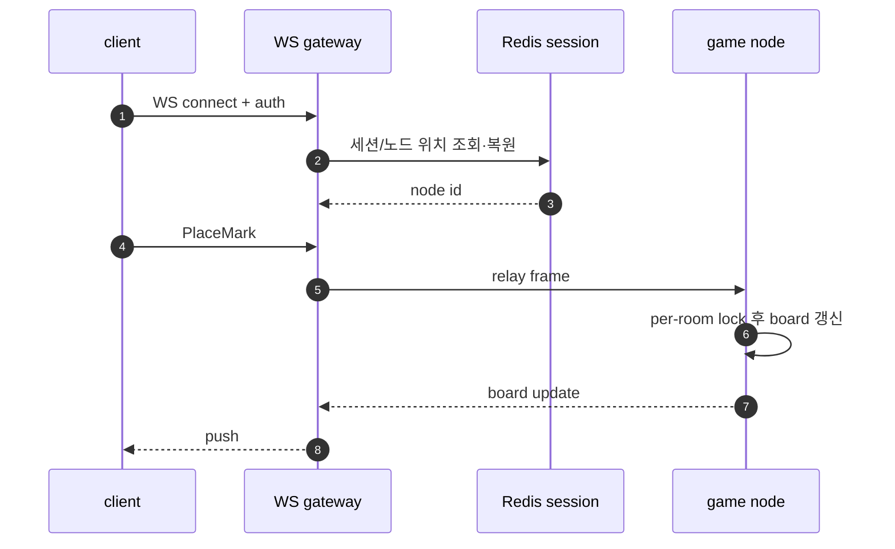
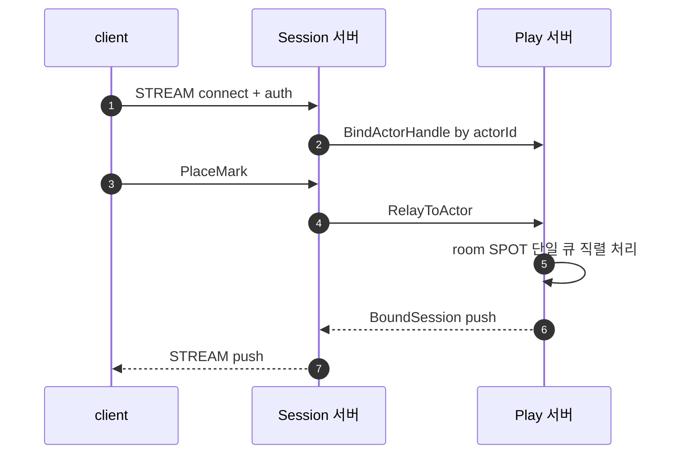

[문서 목록](../../README.ko.md) | [이전: 케이스 — 내부 마이크로서비스 mesh + 운영](14-case-microservice-mesh.ko.md) | [다음: 케이스 — 라이드헤일링 실시간 디스패치](16-case-ride-hailing.ko.md)

# 케이스 — 실시간 멀티플레이 게임

> [12-grpc-alternative](../12-grpc-alternative.ko.md)의 케이스 스터디 중 하나다.
> STREAM·SPOT·actor·session actor dispatch 가 한 도메인에 모두 맞는 사례. 등록
> 정식은 [05-spot](../05-spot.ko.md)·[06-actor-session](../06-actor-session.ko.md)·
> [07-stream](../07-stream.ko.md)이 다룬다. 이 문서는 게임 도메인에 ZLink 를 넣을지
> 판단하는 케이스 스터디다.

> **이 케이스에서 ZLink 이 좋은 지점**
> - STREAM 이 client 연결을 받고, session actor dispatch 가 재접속 이전성을 다룬다.
> - SPOT 이 room 상태를 단일 큐로 직렬 처리한다(lock 없음).
> - **그대로 남는 것**: DB 가 progression 저장을, ZLink 은 실시간 연결·room 실행 모델을 맡는다.

## 1. 도메인 — 실시간 게임 백엔드의 진짜 난제

- **권위적 방 상태의 직렬성.** 같은 room/match 안에서 두 입력이 동시에 board 를
  바꾸면 안 된다. 매칭 엔진처럼 **room 당 단일 실행 라인**이 필요하다 — 보통
  per-room lock 이나 actor mailbox(Akka/Orleans/커스텀)로 푼다. entity 는 메모리에
  깨워 권위적으로 다룬다.
- **stateful 연결 + sticky session.** 실시간 서버는 stateful 이라, LB 는 같은
  세션의 패킷을 **같은 노드**로 보내야 한다(sticky). gateway 는 stateless 로 두고
  연결만 받는다.
- **재접속 이전성.** 끊겼다 다시 붙으면(다른 gateway 일 수 있음) 진행을 잃지 않아야
  한다. 보통 **Redis/DynamoDB 세션 스토어**에 위치·상태를 두고 재접속 시 복원한다.
  ([Metaplay](https://docs.metaplay.io/game-server-programming/introduction-to-the-game-server-architecture.html),
  [AWS multiplayer hosting](https://aws.amazon.com/solutions/guidance/multiplayer-session-based-game-hosting-on-aws/))

남는 난제: **장기 progression 영속(DB), 권위적 검증/안티치트, 매칭 알고리즘** 은
도메인 문제로 그대로 남는다. ZLink 가 줄이는 건 연결 수용·재접속 라우팅·방 직렬화
배선이다.

## 2. 기존 스택 — WebSocket gateway + Redis 세션 + 게임 노드

### 2.1 컴포넌트와 그 이유

| 컴포넌트 | 왜 필요한가 |
|----------|-------------|
| WS gateway fleet | 게임 client 의 영속 연결 수용(stateless 노드 여러 대) |
| sticky-session L7 LB | 같은 세션 패킷을 **같은 게임 노드**로 고정 |
| Redis 세션 스토어 | 재접속 시 "이 player 가 어느 노드/방에 있었나" 복원 |
| matchmaker | 새 player 를 방·노드에 배정 |
| 게임 노드(actor runtime) | room 상태를 **직렬 처리**(per-room lock 또는 grain) |
| 노드↔gateway 라우팅 | 프레임을 올바른 게임 노드로 relay |

### 2.2 연결 수용 + 방 처리

```ts
// ws gateway: 연결 수용 + 세션 위치 복원
wss.on('connection', async (ws) => {
  const playerId = authenticate(ws);
  const node = (await redis.get(`sess:${playerId}`)) ?? matchmaker.assignNode(playerId);
  await redis.set(`sess:${playerId}`, node, 'EX', 600);
  pumpFramesTo(ws, node);
});
```

```ts
// game node: per-room lock 으로 board 직렬화
export class MatchRoom {
  private readonly gate = new AsyncLock();

  async placeMark(playerId: string, cell: number): Promise<PlaceMarkResult> {
    return this.gate.acquire('board', () => this.updateBoardAndJudge(playerId, cell));
  }
}
```

서 있어야 하는 것: WebSocket gateway fleet, sticky-session L7 LB, Redis 세션 스토어,
matchmaker, 게임 노드(actor runtime), 그리고 노드↔gateway 라우팅.

## 3. ZLink 스택 — STREAM + SPOT + actor

연결은 STREAM session 이, room 직렬성은 SPOT 이, 재접속 이전성은 session actor
dispatch 가 가져간다. **per-room lock 도, Redis 세션 라우팅 캐시도 응용 코드에서
사라진다.**

```ts
ZLinkModule.forRoot(
  zlinkFramework()
    .addSpotMesh('play')
      .enableRouter('tcp://0.0.0.0:9200')
      .addEntrySpot(PlayerEntrySpot)
      .addSpotFactory(MatchSpot)
      .actorFactory('player', PlayerActorFactory)
    .addStreamNode('session')
      .bind('tcp://0.0.0.0:9100')
      .registerSession(GameSession)
    .build()
);
```

```ts
@zlinkSpotActorRequestHandler({
  spot: () => MatchSpot,
  actor: () => PlayerActor,
  packetName: 'PlaceMark',
})
export class PlaceMarkHandler
  implements ZLinkSpotActorRequestHandler<MatchSpot, PlayerActor, PlaceMark, PlaceMarkResult> {
  async handle(
    spot: MatchSpot,
    actor: PlayerActor,
    context: ZLinkSpotActorRequestContext,
    req: PlaceMark,
  ): Promise<PlaceMarkResult> {
    return spot.placeMark(actor.actorId, req.cell);
  }
}
```

```ts
@Injectable()
export class GameSession implements ZLinkSession {
  private actor?: ZLinkSessionActor;

  constructor(
    readonly context: ZLinkSessionContext,
    @Inject(ZLINK_ACTOR_MANAGER) private readonly actors: ZLinkActorManager,
  ) {}

  async onDispatch(dispatch: ZLinkSessionDispatchContext, payload: ZLinkMessage): Promise<void> {
    if (dispatch.packetName === 'auth') {
      const req = payload.decode<AuthReq>();
      const actor = await this.actors.getOrCreate(req.playerId, 'player');
      this.actor = await this.context.actors.bind(actor);
      this.context.client.reply(new AuthOk()).submit();
      return;
    }
    if (!this.actor) {
      throw new Error('actor is not bound');
    }
    await this.actor.relay(payload);
  }
}
```

> **재접속 이전성은 framework 기본기.** 다른 Session 서버로 다시 붙어도
> `bind(actor)` 가 actor id 기준으로 멱등하게 이어지며, actor 인스턴스와 spot
> membership 은 유지된다([06-actor-session](../06-actor-session.ko.md)).
> 즉 **Redis 세션 라우팅 캐시가 응용에서 빠진다.**

> **다국어 배치.** 위 코드는 Node/NestJS binding 예시지만, ZLink 은 언어 중립 wire
> protocol 위 다국어 binding 이라 한 시스템을 여러 언어로 섞을 수 있다. 예컨대
> **room/match 로직은 C++**(고성능 tick), **API·매치메이킹은 Node 또는 다른 ZLink binding** 로
> 두고 **같은 channel/spot/packet 계약**으로 상호 호출한다. 계약은 packet 이름 +
> codec DTO(교차 언어는 protobuf 권장)다([12-grpc-alternative](../12-grpc-alternative.ko.md)).

## 4. 양쪽 코드 비교 — "한 수 두기" 경로

| 축 | 기존(WS + Redis + 게임노드) | ZLink |
|----|------------------------------|-------|
| 연결 수용 | WebSocket gateway 직접 구현 | STREAM `ZLinkSession`(framework 소유) |
| 재접속 라우팅 | Redis 세션 스토어 get/set | `bind`(actorId 멱등) |
| 방 직렬성 | per-room `lock`/actor runtime | SPOT 단일 실행 큐(lock 없음) |
| 입력 처리 | `room.placeMark(...)` (lock 안) | `ZLinkSpotActorRequestHandler.handle` |
| 연결/로직 분리 | gateway↔게임노드 라우팅 직접 | session actor dispatch |

## 5. 아키텍처 비교 — 컴포넌트와 메시지 흐름

```text
[classic]  WebSocket gateway + Redis session + game node

  +----------------------+
  | WS gateway fleet     |   accept conn (stateless)
  +----------+-----------+
       sticky L7 LB
  +----------v-----------+   +------------------+
  | Redis session store  |   | matchmaker       |
  | (location/reconnect) |   +------------------+
  +----------+-----------+
  +----------v-----------+
  | game node            |   room serial state (lock/grain)
  | (actor runtime)      |
  +----------------------+
  + progression DB
```

```text
[ZLink]  STREAM + SPOT + actor

  +----------------------+
  | Session server       |   accept conn + actor bind/relay
  | (STREAM)             |
  +----------+-----------+
       relay by actorId
  +----------v-----------+
  | Play server          |   room = SPOT (serial), player = actor
  | (SpotNode)           |
  +----------+-----------+
        +-----v------+
        | Registry   |   location resolve
        +------------+
  + progression DB        (unchanged)
```

- **빠지는 박스:** WS gateway fleet, sticky-session LB 설정, Redis 세션 라우팅
  스토어, gateway↔노드 라우팅 계층.
- **그대로인 박스:** progression DB, 매칭 알고리즘, 권위적 검증/안티치트.

### 메시지 흐름 — 시퀀스 비교

접속·한 수 두기 흐름이다.





Redis 세션 조회 hop 과 per-room lock 이 빠진다. 재접속은 actorId 기준 멱등이라
binding 만 새 stream 으로 옮겨 붙는다.

## 6. 줄어드는 것 / 그대로 남는 것

- **줄어드는 것:** WS gateway fleet, sticky-session LB, 재접속용 연결 라우팅 캐시,
  per-room lock 배선, 매칭 라우팅 mesh.
- **그대로 남는 것:** 장기 progression **DB**, 매칭 알고리즘, 권위적 검증. SPOT/actor
  의 인메모리 상태는 그 lifetime 동안만 유지된다. 공통 경계는
  [12-grpc-alternative](../12-grpc-alternative.ko.md)의 참고 절 참고.

## 7. 더 보기

- 케이스 허브: [12-grpc-alternative](../12-grpc-alternative.ko.md)
- 사용법: [05-spot](../05-spot.ko.md), [06-actor-session](../06-actor-session.ko.md), [07-stream](../07-stream.ko.md)
- 다음 케이스: [16-case-ride-hailing](16-case-ride-hailing.ko.md)

---
[문서 목록](../../README.ko.md) | [이전: 케이스 — 내부 마이크로서비스 mesh + 운영](14-case-microservice-mesh.ko.md) | [다음: 케이스 — 라이드헤일링 실시간 디스패치](16-case-ride-hailing.ko.md)
