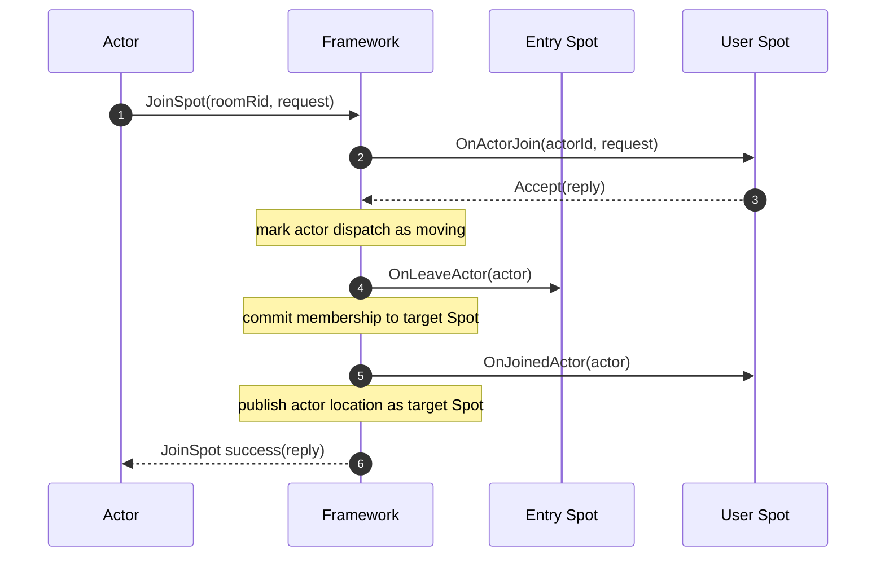
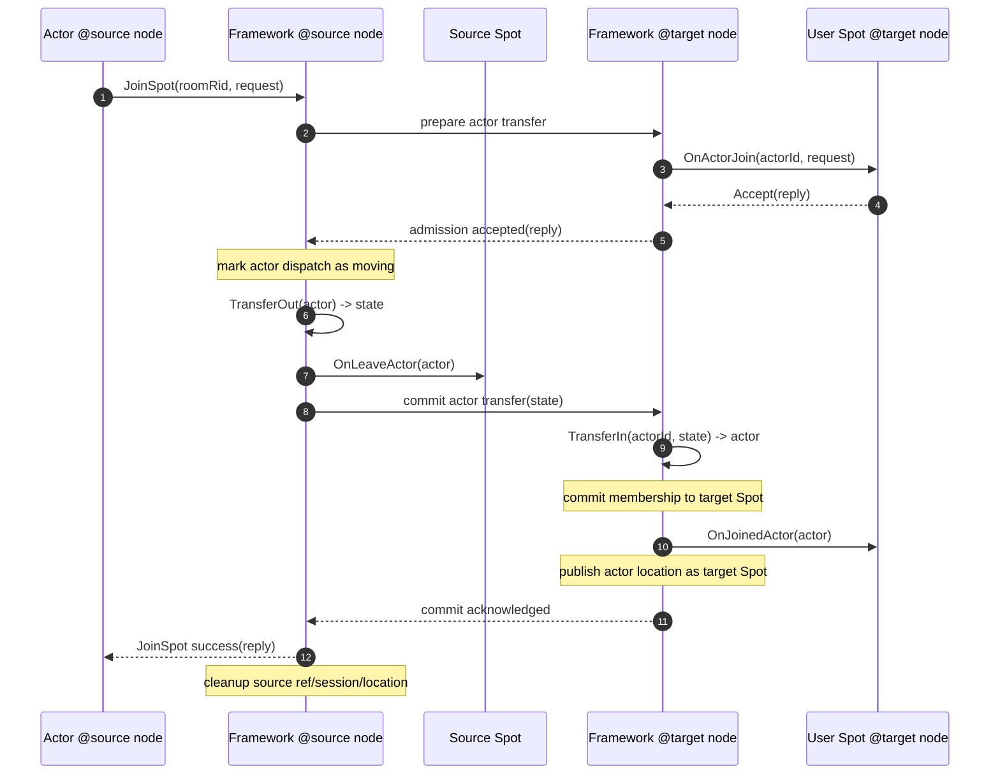
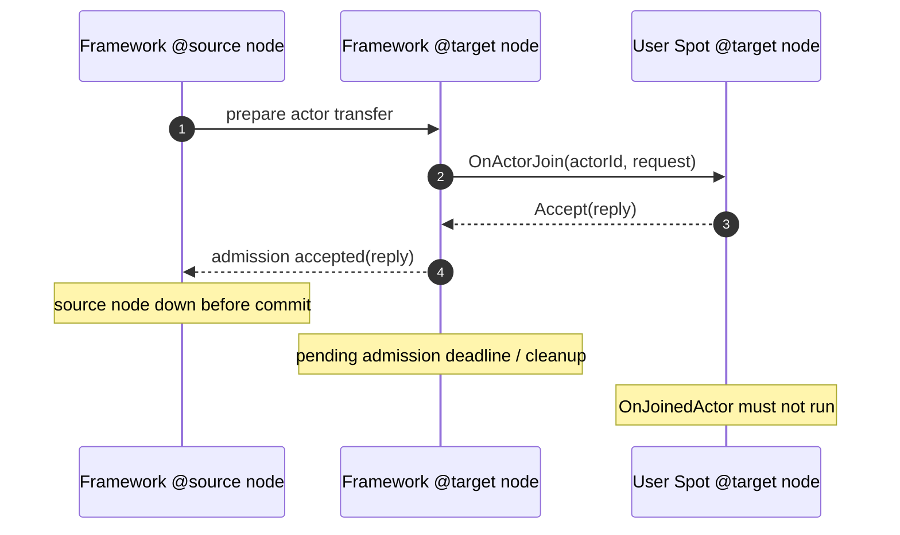
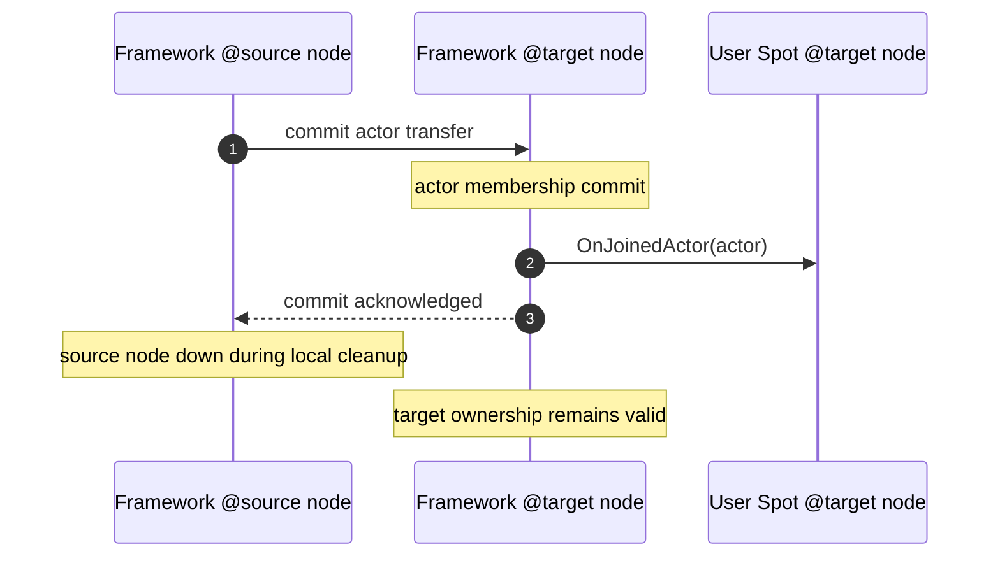
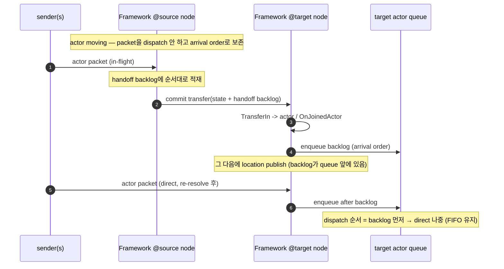

<!-- framework-adapter-nav:start -->
[스펙 목차](../README.ko.md) | [이전: ZLink Framework Actor Model](22-actor-model.ko.md) | [다음: SpotHandle 기반 메시징](24-spot-address-messaging.ko.md)
<!-- framework-adapter-nav:end -->

[문서 묶음](../../common/README.ko.md) | [개요](../01-overview.ko.md) | [상호작용 모델](../02-interaction-model.ko.md) | [메시지 모델](../03-message-model.ko.md) | [Actor 모델](22-actor-model.ko.md) | [Spot Actor Join / Transfer](23-spot-actor.ko.md) | [Session Actor Dispatch 사용성](31-session-actor-dispatch.ko.md)

# Spot Actor Join / Transfer 공통 스펙

## 1. 목적

이 문서는 actor가 Entry Spot과 user Spot 사이를 이동할 때 모든 framework 언어가 지켜야 하는
공통 계약을 정의한다. [22-actor-model.ko.md](22-actor-model.ko.md)는 actor 개념과 lifecycle 전체를
다루고, 이 문서는 그중 **Spot actor join과 node 간 transfer**의 완료 조건, callback 순서,
장애 처리 기준을 고정한다.

언어별 framework는 이름과 API 모양이 달라도 이 문서의 의미를 바꾸면 안 된다. 현재 구현이 이
문서와 다르면 그 언어의 구현 gap으로 기록하고, 같은 동작을 하도록 맞춘다.

## 2. 용어

| 용어 | 의미 |
| --- | --- |
| source Spot | actor가 이동하기 전에 속한 Spot이다. 생성 직후 actor는 Entry Spot에 있다. |
| target Spot | actor가 `JoinSpot`으로 들어가려는 Spot이다. |
| source node | 이동 전 actor instance를 소유한 SpotNode다. |
| target node | target Spot을 소유한 SpotNode다. 같은 node 이동이면 source node와 같다. |
| admission | target Spot이 actor identity와 request를 보고 받을 수 있는지 확인하는 단계다. 이 단계의 callback은 `OnActorJoin` 계열이다. |
| actor transfer adapter | node 간 transfer에서 source actor의 이동 state를 `ZLinkMessage`로 만들고, target node에서 actor 객체를 materialize하는 actor type별 hook이다. 등록하지 않으면 framework는 빈 state transfer를 기본으로 사용한다. |
| commit | actor membership을 실제로 target Spot으로 바꾸는 단계다. commit 뒤에만 target Spot은 actor가 들어왔다고 볼 수 있다. |
| joined callback | commit 완료를 application에 알리는 callback이다. 이름은 언어별로 다르지만 의미는 `OnJoinedActor` 계열이다. |
| left callback | source Spot membership에서 actor가 빠졌음을 알리는 callback이다. 이름은 언어별로 다르지만 의미는 `OnLeaveActor` 계열이다. |

이 문서에서 `OnActorJoin`, `OnJoinedActor`, `OnLeaveActor`, `OnCreateActor`는 공통 의미를
가리키는 이름이다. 언어별 실제 이름은 `.NET`의 `OnActorJoinAsync`, Node.js의 `onActorJoin`,
C++의 `on_actor_join`처럼 달라도 된다.

## 3. 핵심 원칙

### 3.1 `OnActorJoin`은 admission만 담당한다

`OnActorJoin`은 target Spot이 actor를 받을 수 있는지 판단한다. 이 callback이 `Accept`를 반환해도
actor가 target Spot에 들어온 것은 아니다. application은 `OnActorJoin`에서 room membership,
game participant list, broadcast 대상 목록처럼 "actor가 들어왔다"는 사실을 확정하는 상태를
바꾸지 않아야 한다.

`OnActorJoin` 입력에는 actor instance를 전달하지 않는다. admission 단계에서 public callback이 받는
identity는 actor id뿐이다. actor type, source/target Spot, source/target node 같은 값은 framework가
내부 routing과 검증에 사용하지만 application admission 표면으로 넘기지 않는다.

`OnActorJoin`에서 해도 되는 일:

- request payload 검증
- actor id, 권한, room 상태 확인
- join reply payload 계산
- admission 실패 사유 기록

`OnActorJoin`에서 하면 안 되는 일:

- target Spot membership 확정
- source Spot 상태 정리
- client에게 "입장 완료" event 발행
- actor instance 접근 또는 저장
- actor packet을 target Spot handler로 dispatch 가능하다고 간주

actor instance를 application에 처음 노출하는 lifecycle은 target `OnJoinedActor`다. remote transfer에서
target node는 `OnActorJoin` accept만으로 target actor instance를 만들지 않는다. source node는 custom
adapter 또는 framework 기본 빈 state transfer로 만든 state message를 commit 요청에 싣고, target node는
custom adapter 또는 actor factory 생성 경로로 target actor instance를 materialize한다. target
`OnJoinedActor`에는 이 actor를 전달한다.

### 3.2 `OnJoinedActor`가 join 완료 신호다

actor가 target Spot에 들어왔다고 application이 볼 수 있는 첫 시점은 target Spot의
`OnJoinedActor` callback이다. `JoinSpot` caller에게 성공을 반환하는 것도 target `OnJoinedActor`
가 정상 완료된 뒤여야 한다.

따라서 다음 문장은 모든 언어에서 참이어야 한다.

- `OnActorJoin`이 `Accept`를 반환했지만 `OnJoinedActor`가 호출되지 않았다면 join은 완료되지 않았다.
- target Spot이 actor를 membership에 넣고 domain state를 갱신하는 기준은 `OnJoinedActor`다.
- public actor location은 target `OnJoinedActor`가 정상 완료된 뒤 target user Spot으로 관찰되어야 한다.
- `JoinSpot` 성공 reply는 `OnJoinedActor` 완료 뒤에만 caller가 받을 수 있다.

### 3.3 `OnLeaveActor`는 target `OnJoinedActor`보다 먼저 관찰되어야 한다

source Spot이 존재하는 이동에서는 target `OnActorJoin`이 accept된 뒤 source `OnLeaveActor`를 먼저
호출하고, 그 다음 target `OnJoinedActor`를 호출한다. 이 순서를 지켜야 한 actor가 같은 시점에 두
room에 들어와 있는 것처럼 보이는 application 상태를 줄일 수 있다.

source Spot이 없거나 이미 target node로 actor ownership이 넘어간 복구 경로에서는 source
`OnLeaveActor`를 호출할 수 없다. 이런 경로는 정상 join 경로가 아니라 recovery 또는 reconcile
경로로 분리하고, feature-map에 명시해야 한다.

### 3.4 join 완료 전 packet dispatch 금지

target Spot은 target `OnJoinedActor`가 정상 완료되기 전까지 actor packet을 user Spot handler로
dispatch하면 안 된다. commit이 먼저 끝나더라도 `OnJoinedActor`가 아직 실행 중이거나 실패했다면
application은 actor가 target user Spot에 들어왔다고 관찰하면 안 된다. source Spot도 actor가 moving
상태에 들어간 뒤 같은 actor packet을 계속 처리하면 안 된다.

구현은 언어별로 actor별 serial queue, moving flag, pending join table, location generation guard
중 적절한 조합을 쓸 수 있다. 어떤 방식을 쓰더라도 외부에서 보이는 계약은 같다.

## 4. 같은 node에서 user Spot으로 join

같은 SpotNode 안에서 Entry Spot actor가 user Spot으로 이동하는 기본 흐름은 다음과 같다.

`Reject(reply)`이면 source membership은 유지된다. source `OnLeaveActor`, target `OnJoinedActor`,
location row 갱신은 실행하지 않는다.

### 4.1 같은 node join의 완료 조건

같은 node join은 아래 조건을 모두 만족해야 성공이다.

1. target `OnActorJoin`이 `Accept`를 반환했다.
2. source `OnLeaveActor`가 필요한 경우 정상 완료됐다.
3. framework 내부 membership이 target Spot으로 바뀌었다.
4. target `OnJoinedActor`가 정상 완료됐다.
5. actor location row가 target user Spot을 가리키는 committed 상태로 관찰된다.

위 조건 중 하나라도 실패하면 caller에게 성공을 반환하면 안 된다. 실패 시 source membership을
유지하거나, 이미 바뀐 내부 상태를 되돌릴 수 없으면 actor를 recoverable error 상태로 두고
location/runtime reconcile 절차가 처리해야 한다.

## 5. 다른 node의 user Spot으로 transfer

다른 SpotNode의 user Spot으로 actor를 이동할 때도 public lifecycle 의미는 같다. 다만 source node와
target node가 나뉘므로 framework는 admission과 commit을 분리해서 처리해야 한다.

이 다이어그램은 public contract를 보여준다. target node는 `OnActorJoin` 전에 actor identity와 request를
담은 pending admission record를 만들 수 있다. 그러나 target actor instance, target membership, public
location row는 만들지 않는다. target actor instance는 source node의 commit 요청에 들어 있는 transfer
state를 `TransferIn`으로 복원한 뒤 materialize하고, target `OnJoinedActor`에서 처음 application에
전달한다.

actor transfer adapter는 domain actor materialization만 담당한다. adapter가 등록된 actor type에서는
`TransferOut(actor)`가 source actor의 이동 state를 `ZLinkMessage`로 만들고, `TransferIn(actorId, state)`가
그 message와 actor id로 target actor instance를 만든다. adapter가 등록되지 않은 actor type은 framework가
빈 `ZLinkMessage`를 transfer state로 사용하고, target actor를 actor factory 같은 언어별 actor 생성 경로로
만든다. 필요한 domain state는 target `OnJoinedActor`나 actor의 lazy-load 정책에서 별도로 읽어 올 수 있다.
입장 가능 여부, actor id/type 일치성, source/target route 일치성, transfer deadline 같은 검사는
framework와 `OnActorJoin` 책임이다. transfer adapter는 이런 검사를 반복하지 않는다.

### 5.1 remote transfer의 완료 조건

remote transfer는 아래 조건을 모두 만족해야 성공이다.

1. target node가 actor identity와 request로 admission을 준비했다.
2. target `OnActorJoin`이 `Accept`를 반환했다.
3. source node가 custom adapter 또는 framework 기본 빈 state transfer로 transfer state `ZLinkMessage`를 만들었다.
4. source node가 source `OnLeaveActor`를 정상 완료했다.
5. source node가 transfer state를 포함한 commit 요청을 target node에 보냈다.
6. target node가 custom adapter 또는 actor factory 생성 경로로 target actor instance를 materialize했다.
7. target node가 actor membership을 target user Spot으로 commit했다.
8. target `OnJoinedActor`가 정상 완료됐다.
9. actor location row가 target user Spot을 가리키는 committed 상태로 관찰된다.
10. target node가 source node에 commit 완료를 응답했다.

caller는 10번 이후에만 성공 reply를 받을 수 있다. 기존 actor ref, bound session route,
source location tracking 정리는 성공 reply 뒤에도 이어질 수 있는 사후 정리다. 이 정리가
실패하더라도 target commit이 이미 완료됐으면 actor ownership은 target node가 가진다. source 정리는
stale owner release처럼 멱등적으로 재시도할 수 있어야 한다.

### 5.2 target `OnJoinedActor` 전에 source node가 죽는 경우

source node가 target admission accept 뒤 commit 전에 죽으면 transfer는 완료되지 않은 것으로 본다.
target node는 source down signal을 기다리지 않는다. target node는 admission accepted 응답을 보낼 때
pending admission deadline을 함께 설정하고, deadline 안에 commit 요청이 오지 않으면 pending record를
스스로 정리한다.

이 경우 target user Spot은 `OnJoinedActor`를 호출하면 안 된다. actor가 source node와 함께 사라졌다면
client는 reconnect, actor recreate, rejoin 같은 상위 복구 흐름으로 들어간다. target node는 아직 transfer
state를 받지 않았고 actor instance를 만들지 않았으므로 pending admission record, admission reply,
temporary route metadata만 제거하면 된다. 이 정리는 actor lifecycle 성공이 아니므로 target
`OnJoinedActor`와 source/target `OnLeaveActor`를 호출하지 않는다.

### 5.3 target commit 뒤 source node가 죽는 경우

target node가 membership commit과 `OnJoinedActor`를 완료한 뒤 source node가 죽으면 transfer는 성공한
것으로 본다. source node의 stale location row나 bound session bookkeeping은 generation fencing과
owner lease 정리로 제거한다.

## 6. actor transfer adapter

remote transfer는 actor 객체를 transport로 직접 보내지 않는다. source node는 custom transfer adapter가
있으면 그 adapter로 이동 state를 `ZLinkMessage`로 만들고, 없으면 framework 기본 빈 state transfer를
사용한다. target node도 같은 기준으로 custom adapter 또는 actor factory 생성 경로를 사용해 target actor
instance를 만든다.

모든 framework 언어는 같은 public contract를 제공해야 한다. 실제 interface 이름, async 반환형,
취소 지원 여부와 등록 API는 언어별 spec에서 고정한다. 특정 언어가 아래 의미의 surface를 제공하지
못하면 구현 완료가 아니라 public contract parity gap으로 기록한다.

| 항목 | 공통 계약 |
| --- | --- |
| 등록 단위 | state 이동이 필요한 actor type별 하나의 transfer adapter |
| custom 등록 | actor type과 adapter type을 함께 등록한다. |
| 기본 빈 state transfer | adapter가 없으면 framework가 빈 state transfer와 actor factory 생성 경로를 사용한다. 별도 stateless 등록 API를 요구하지 않는다. |
| source method | `TransferOut(actor)`. 취소를 제공하는 언어는 언어별 취소 인자를 추가할 수 있다. |
| source 반환 | `ZLinkMessage` 또는 그 언어의 framework message type |
| target method | `TransferIn(actorId, state)`. actor 생성에 별도 runtime context가 필요한 언어는 해당 context를, 취소를 제공하는 언어는 언어별 취소 인자를 추가로 고정할 수 있다. |
| target 반환 | target node에서 사용할 actor instance |
| 미등록 정책 | 실패가 아니다. framework 기본 빈 state transfer로 처리한다. |
| 빈 state 정책 | adapter가 등록되어 있거나 기본 빈 state transfer를 사용하면 빈 `ZLinkMessage`를 정상 transfer로 처리한다. |
| 같은 node join | transfer adapter를 호출하지 않고 기존 actor instance를 그대로 이동한다. |

`TransferOut`은 source node의 실제 actor instance를 받는다. actor id는 actor 객체가 이미 알고
있으므로 별도 context로 다시 넘기지 않는다. 이 method는 actor의 이동 가능한 상태만 message로 만든다.
adapter가 등록되어 있더라도 이동 state가 필요 없으면 빈 `ZLinkMessage`를 반환할 수 있다.

`TransferIn`은 target node에서 아직 actor instance가 없을 때 호출된다. framework는 복원할
`actorId`와 source가 보낸 state message를 넘긴다. 이 method는 target node에서 사용할 actor instance를
반환한다. `.NET`처럼 actor 객체가 framework context를 생성자에서 받아야 하는 언어는, 언어별 spec에서
그 context 인자를 함께 정의한다. 이 context는 검증이나 admission 판단을 위한 값이 아니라 actor instance가
기존 actor factory 계약과 같은 runtime context를 노출하게 하려는 생성 인자다.

state가 비어 있으면 adapter 또는 framework 기본 빈 state transfer는 actor id와 언어별 actor factory
또는 public actor 생성 경로를 사용해 actor instance를 만들 수 있다. 필요한 domain state는 target
`OnJoinedActor` 이후 별도 저장소에서 읽어 올 수 있다.

framework는 transfer adapter 미등록을 실패로 보지 않는다. adapter가 없으면 source `OnLeaveActor` 전에
빈 `ZLinkMessage`를 준비하고, target commit에서 actor factory/public 생성 경로로 actor를 materialize한다.
adapter가 등록되어 있고 빈 `ZLinkMessage`를 반환하는 경우도 같은 빈 state transfer로 처리한다.

transfer adapter가 담당하지 않는 일:

- actor id, actor type, source/target route 일치성 검사
- admission 조건 검사
- transfer id 중복 처리
- membership 등록
- location row 갱신
- bound session route 연결

위 항목은 framework 또는 `OnActorJoin`의 책임이다. transfer adapter에 검사를 반복시키면 actor state
변환 책임과 join 정책 책임이 섞인다.

transfer adapter 등록은 actor type별로 하나만 허용한다. remote transfer 대상 actor type에 transfer
adapter가 없으면 framework 기본 빈 state transfer를 사용한다. 같은 node join은 actor instance를
그대로 이동하므로 transfer adapter와 기본 빈 state transfer를 사용하지 않는다.

transfer state의 content type, codec, version은 `ZLinkMessage`의 envelope에 담는다. framework는 state
message를 transport payload로 전달하지만, 그 내부 domain schema는 해석하지 않는다.

actor transfer와 함께 `OnActorJoin`도 모든 언어에서 같은 의미의 admission surface를 가져야 한다.
`OnActorJoin`은 actor instance를 받지 않고, actor id와 request만 받아야 한다. 실제 method signature는
언어별 spec에서 고정한다.

언어별 framework는 actor type, source/target Spot, source/target node 값을 다른 이름의 low-level header나
raw message로 application admission callback에 노출하면 안 된다. application이 admission에서 보는 입력은
actor id와 request payload로 제한한다.

## 7. Entry Spot lifecycle와 user Spot transfer

actor 생성과 user Spot transfer는 다른 사건이다.

| 사건 | Entry Spot lifecycle | user Spot lifecycle |
| --- | --- | --- |
| actor가 처음 생성됨 | `OnCreateActor`를 한 번 호출한다. 생성 직후 actor는 Entry Spot에 있다. | 호출하지 않는다. |
| Entry Spot에서 user Spot으로 join 성공 | Entry Spot `OnLeaveActor`를 호출한다. | target user Spot `OnActorJoin` accept 뒤 `OnJoinedActor`를 호출한다. |
| user Spot에서 다른 user Spot으로 join 성공 | source user Spot `OnLeaveActor`를 호출한다. | target user Spot `OnActorJoin` accept 뒤 `OnJoinedActor`를 호출한다. |
| user Spot에서 Entry Spot으로 leave 성공 | target Entry Spot `OnJoinedActor`를 호출한다. | source user Spot `OnLeaveActor`를 호출한다. |
| destroyActor 성공 | `OnLeaveActor`를 호출하지 않는다. actor 수명 종료다. | actor가 user Spot에 있으면 destroy할 수 없다. |

remote transfer에서 target node는 admission 단계에서 actor instance를 만들지 않는다. commit 요청을
받은 뒤 source actor의 논리적 수명을 이어받는 target actor instance를 materialize한다. 이 작업은 새
actor 생성 완료가 아니므로 target Entry Spot `OnCreateActor`를 호출하지 않는다. user Spot membership
완료 신호는 항상 target user Spot `OnJoinedActor`다.

## 8. location row와 generation

actor location row는 actor packet routing과 remote lookup의 기준이다. 따라서 location row는 lifecycle
의미와 모순되면 안 된다.

공통 규칙:

- `OnActorJoin` accept만으로 public actor location을 target user Spot으로 확정하지 않는다.
- target `OnJoinedActor`가 정상 완료된 뒤 actor location row를 target user Spot의 committed location으로 공개한다.
- location row를 먼저 써야 하는 구현은 그 row를 pending 상태로 취급해야 하며, resolver와 actor packet routing은 pending row를 성공한 user Spot join으로 해석하면 안 된다.
- `OnJoinedActor`가 실패하면 target user Spot location으로 공개하지 않는다. 이미 public row가 보였다면 rollback하거나 actor packet dispatch를 중단하고 reconcile 대상으로 격리한다.
- source와 target이 동시에 같은 actor의 live owner라고 주장하지 않도록 generation fencing을 사용한다.
- stale source owner의 release는 target owner의 generation을 지우면 안 된다.
- target commit 뒤 source cleanup이 실패해도 target owner가 이긴다.

구현 편의를 위해 target node가 `OnActorJoin` 전에 claim을 먼저 수행할 수 있다. 이 경우 다음 중 하나를
반드시 만족해야 한다.

- claim이 pending 상태라 public resolver가 성공한 user Spot join으로 해석하지 않는다.
- source가 commit 전에 죽으면 target이 claim을 release하거나 timeout cleanup으로 제거한다.
- generation fencing과 owner lease가 pending/committed 상태를 구분해 stale route가 actor packet을
  잘못 받지 않게 한다.

## 9. bound session transfer

bound session은 actor 위치와 독립된 축이지만, remote transfer가 성공하면 session-bound actor의 push와
reply가 target node의 actor instance로 이어져야 한다.

공통 규칙:

- remote transfer request에는 source bound session route를 전달해야 한다.
- target node는 commit 전에 bound session route를 준비할 수 있다.
- target `OnJoinedActor` 완료 전에는 bound session push를 target user Spot actor로 성공 처리하면 안 된다.
- transfer가 실패하면 source bound session binding은 유지되거나, source node가 죽은 경우 client
  reconnect 흐름으로 복구한다.
- transfer가 성공하면 source node의 old binding release는 멱등적으로 처리한다.

## 10. actor 이동 중 in-flight packet 처리 (source queue handoff)

§3.4는 actor가 moving 상태에 들어간 뒤 source Spot이 그 actor의 packet을 handler로 dispatch하면
안 된다고 정한다. 이 절은 그 사이 **도착한 packet을 어떻게 보존하고 target으로 넘기는지**를 고정해,
이동이 없었을 때와 같은 결과 — actor가 받을 packet을 유실 없이 보낸 순서대로 받는 것 — 을 모든
언어가 같은 방식으로 보장하게 한다.

기준 관점은 **개별 packet의 재라우팅이 아니라 정렬된 queue의 handoff**다. 이동이 없었다면 moving 중
도착한 packet은 source에 있는 actor의 serial queue(§3.4가 허용하는 per-actor serial queue/mailbox)에
arrival order로 쌓여 있었을 것이다. 이동은 이 backlog를 target으로 옮겨 **같은 순서로 다시 dispatch**
하는 것으로 정의한다. queue가 이미 FIFO이므로 순서 보존은 구조적으로 성립하며, client에게
pre-transfer queueing 같은 협조를 요구하지 않는다.

### 10.1 용어

| 용어 | 의미 |
| --- | --- |
| in-flight packet | actor가 moving 상태에 들어간 뒤 target join이 완료되기 전에 그 actor로 도착한 actor packet(bound session relay 또는 by-id dispatch). |
| handoff backlog | moving 시작 시점에 source actor queue에 남아 있던 미dispatch packet과, 이동 중 source로 더 도착한 packet을 arrival order로 모은 정렬 집합. |
| straggler | location이 target으로 공개된(=이동 완료) 뒤에도 stale ref를 든 sender가 source로 보낸 actor packet. |
| forwarding mapping | source가 이동 완료 뒤에도 일정 기간 유지하는 `(actorId, old generation) → target location` 매핑. straggler를 target으로 넘기는 데 쓴다. |

### 10.2 공통 규칙

1. **유실 금지·이중 dispatch 금지.** moving 중 source는 actor packet을 source Spot handler로
   dispatch하면 안 되고(§3.4), drop해서도 안 된다. arrival order를 유지한 채 보존한다.
2. **정렬 handoff (cross-node).** commit 시 source는 보존한 handoff backlog를 arrival order를 보존해
   target으로 전달해야 한다. 전달 채널은 언어별로 다를 수 있으나 순서 보존은 계약이다. **source는 moving
   시작부터 forwarding mapping 활성화(§10.4)까지 도착 packet을 끊김 없이 arrival order로 보존·전달한다** —
   commit 요청에 동봉한 backlog와 그 이후 straggler forwarding 사이에 순서 공백이나 유실이 없어야 한다
   (commit 요청과 commit ack 사이에 도착해 backlog snapshot을 놓친 packet도 보존했다가 순서대로 이어
   전달한다). 같은 node join은 actor instance와 그 queue를 그대로 유지하므로(§4) backlog를 재구성하지
   않고 이 규칙을 구조적으로 만족한다.
3. **new-path 개방 전 replay (핵심).** target은 handoff backlog를 target actor의 dispatch queue에
   **enqueue한 뒤에** 그 actor로 향하는 **새 경로를 연다.** 새 경로는 둘이며 둘 다 backlog enqueue
   이후여야 한다: (a) committed target location 공개(§8, by-id direct 경로), (b) bound session route의
   target 활성화(§9, session direct 경로). 즉 `backlog enqueue < location publish` 이고
   `backlog enqueue < session route 활성화`다. 이 순서를 지켜야 이후 두 경로로 들어오는 direct packet이
   backlog를 추월하지 못한다. backlog의 실제 handler dispatch는 §3.4에 따라 target `OnJoinedActor`
   완료 후에 시작한다.
4. **per-session FIFO 보장.** bound session route는 commit과 함께 target으로 atomically rebind되고(§9),
   §10.2-3에 따라 backlog가 rebound session의 direct packet보다 먼저 enqueue되므로, **한 bound session이
   보낸 packet은 이동을 가로질러도 보낸 순서대로 actor에 도달한다.** 이 보장은 client의 협조를 요구하지
   않으며, voluntary join과 involuntary transfer(rebalance/drain) 모두에 적용된다(involuntary 이동 중
   계속 도착하는 session packet도 rebind 전이면 backlog로, 후면 direct로 가되 순서는 §10.2-3이 지킨다).
5. **by-id sender는 best-effort.** bound session이 아닌 by-id dispatch(다른 actor/handler가 actorId로
   호출)는 각 sender가 자기 re-resolve 시점에 source→target으로 경로를 바꾼다. 같은 sender의 packet이
   전부 forwarding mapping을 거치면 arrival order로 보존되지만, 한 sender가 이동 창에서 일부는
   forward·일부는 direct로 갈리면 상대 순서는 보장하지 않는다. 이 방향의 cross-move ordering은
   best-effort이며, 강한 순서가 필요한 by-id 호출자는 자체 sequencing으로 보완해야 한다.
6. **straggler forwarding과 cutoff.** location 공개 뒤 source로 온 straggler는 source가 forwarding
   mapping을 유지하는 동안 arrival order로 target에 forward해야 한다. 유지 기간은 `actorTransferForwardWindow`
   (기본 5초, §10.4)로 고정하며, **자원 회수 상한이지 correctness 파라미터가 아니다.** mapping이 evict된
   뒤 같은 old ref로 온 packet은 fail-fast(`ActorLocationStale` / `ActorRouteNotFound`)로 처리하고,
   sender가 re-resolve해 재전송한다. framework는 in-flight packet을 저장했다가 이 bounded forwarding을
   넘어서 자동 재전송하지 않는다.

### 10.3 cross-node handoff 순서

- **backlog enqueue → new-path 개방(location publish + session route 활성화) → direct 수용** 순서가
  뒤바뀌면 direct packet이 backlog를 추월해 per-session FIFO가 깨진다. by-id 경로(location)와 session
  경로 **둘 다** backlog enqueue 이후여야 한다(§10.2-3). 이 순서가 이 절의 핵심 강제 배타 지점이다.
- straggler(§10.1)는 forwarding mapping을 통해 backlog 뒤에 이어 붙는다. mapping 축출 이후는
  fail-fast다.

### 10.4 relay 유지 기간 (cutoff)

§10.2-6은 straggler를 "forwarding mapping을 유지하는 동안" forward한다고만 정한다. 모든 언어가 같은
경계에서 같게 동작하려면 그 유지 기간을 고정해야 한다. 유지 기간을 언어별로 자유화하면 같은 시점에
도착한 straggler가 언어마다 forward되거나 fail-fast되어 관찰 동작이 갈린다.

**forwarding mapping 수명:**

1. **생성.** source가 target commit ack를 받아 target location을 확정한 시점(= location이 target으로
   publish되는 시점, moving 종료)에 `(actorId, old generation) → target location` mapping을 만든다.
2. **유지 (MUST 하한).** 생성 후 최소 `actorTransferForwardWindow` 동안 유지한다. 이 구간에 old
   generation ref로 도착한 packet은 arrival order로 target에 forward한다. 이 유지는 source의
   old-generation location row/owner lease release(§8 stale owner release)와 **독립**이다 — lease를
   먼저 fencing해도 mapping은 window 동안 남아 straggler를 흡수한다.
3. **축출 (MUST 상한).** forwarding mapping은 source가 들고 있는 transfer별 **retained state**다.
   window 경과 후 이 mapping을 **반드시 제거해야 한다** — window마다 제거하지 않으면 transfer가 잦은
   구간(rebalance/drain)에서 mapping이 무한히 쌓여 자원 누수가 된다. 이 축출은 §5.1의 멱등 사후
   정리(source ref/session/location cleanup)에 포함되며, source node가 죽어 정리가 지연돼도 mapping은
   해당 node 소멸과 함께 사라지므로 target ownership에는 영향이 없다. 축출 뒤 old generation ref로 온
   packet은 fail-fast(`ActorLocationStale`)로 처리한다.
4. **chained forward.** forwarding mapping은 **source node별**로 유지하며, 한 node에서 같은 actor에
   대한 entry는 최대 하나다(전역 하나가 아니라 node당 하나). actor가 window 안에 A→B→C로 연쇄
   이동하면, A의 mapping은 그 hop의 target인 B를, B의 mapping은 C를 가리킨다. A로 온 straggler는 A의
   mapping을 따라 B로, 다시 B의 mapping을 따라 C로 **hop을 따라 전달**된다(A가 C를 직접 아는 것이
   아니라 각 node가 자기 다음 hop만 안다). 각 hop은 자기 window 동안 자기 mapping을 유지한다. 한 node가
   같은 actor를 다시 host했다가 또 내보내면 그 node의 기존 entry를 새 target으로 갱신하고 window를
   재시작한다(entry를 누적하지 않는다).

**`actorTransferForwardWindow` 계약:**

- **기본값은 5초로 고정한다.** 모든 언어 framework는 이 기본값을 동일하게 사용해야 한다.
- 배포별 override를 허용한다. override의 단위·표현·설정 API는 언어별 spec에서 고정하되, 기본값
  5초는 언어 간에 바꾸지 않는다.
- 이 값은 **correctness 파라미터가 아니라 straggler 흡수율 vs source 자원 보유의 트레이드오프**다
  (§10.2-6). per-session FIFO는 window 값과 무관하게 성립한다(§10.2-4). window를 크게 잡으면 stale
  ref straggler를 더 오래 흡수하고 source mapping을 더 오래 들고, 작게 잡으면 fail-fast가 빨리 난다.
- window를 `0`으로 override하면 commit 시점 backlog만 handoff하고 이후 straggler는 즉시 fail-fast다
  (가장 단순, straggler 에러 최대). window 기본값 5초는 이 극단이 아니라 stale ref가 한 round-trip
  안에 re-resolve할 시간을 주는 값이다.

### 10.5 request packet의 reply correlation과 timeout

§10.2~§10.4는 packet **전달·순서**를 다룬다. actor packet이 **request**(reply 대기)면 이동을
가로질러도 아래를 추가로 보장한다. Send(fire-and-forget)는 이 절이 필요 없다.

1. **framing 보존.** handoff backlog와 straggler forwarding은 packet의 **request id, flags, reply
   route(caller 좌표)**를 그대로 보존해야 한다. 이동 후 target actor가 그 request를 처리하면 reply는
   원래 caller로 **정확히 correlate**되어 돌아간다(actor 이동 사실을 caller가 몰라도 된다). reply는
   source를 다시 거치지 않고 target에서 caller 좌표로 바로 간다.
2. **timeout은 caller의 기존 timeout.** 이동은 request timeout을 리셋하지 않는다. caller가 request를
   보낼 때 시작한 timeout이 그대로 흐른다. 이동+handoff 지연이 timeout 안이면 정상 reply, timeout을
   넘기면 caller는 **평소와 같은 request timeout 실패**로 분류한다. 이동 전용 timeout 경로를 신설하지
   않는다.
3. **late reply drop.** caller가 이미 timeout된 뒤 target이 늦게 만든 reply는 normal late-reply(orphan)
   처리로 버린다 — 이동 특유의 예외 경로가 아니다.
4. **straggler request.** window(§10.4) 안 straggler가 request면 forward된 뒤 target에서 처리되고
   reply가 correlate된다. window 후 fail-fast면 caller는 reply가 아니라 `ActorLocationStale`을 받고
   re-resolve·재요청한다.

## 11. callback과 transfer 오류 처리

`OnActorJoin`, `OnLeaveActor`, `OnJoinedActor`와 actor transfer adapter는 application 코드이므로 실패할 수
있다. framework는 실패 시점을 기준으로 join 결과를 다르게 처리한다.

| 실패 지점 | join 결과 | 필수 처리 |
| --- | --- | --- |
| target `OnActorJoin` throws | 실패 | target membership을 만들지 않고 caller에 실패를 반환한다. |
| target `OnActorJoin` rejects | rejected | source membership을 유지하고 joined/left callback을 호출하지 않는다. |
| source `TransferOut` throws | 실패 | source `OnLeaveActor`, target `TransferIn`, target `OnJoinedActor`를 호출하지 않는다. source membership을 유지한다. |
| source `OnLeaveActor` throws | 실패 | target `OnJoinedActor`를 호출하지 않는다. **source membership은 callback 호출 전에 이미 제거되었으므로 복원하지 않는다** — actor를 runtime reconcile 대상으로 기록한다([22 §5.3](22-actor-model.ko.md)의 제거 → callback 순서). |
| target `TransferIn` throws | 실패 | target membership을 만들지 않고 caller에 실패를 반환한다. source actor는 이미 left가 끝났으므로 runtime reconcile 대상으로 기록한다. |
| target commit 실패 | 실패 | target `OnJoinedActor`를 호출하지 않는다. pending state를 cleanup한다. |
| target `OnJoinedActor` throws | 실패 | caller에게 성공을 반환하지 않는다. target membership을 rollback한다. rollback할 수 없으면 actor packet dispatch를 중단하고 actor를 reconcile 대상으로 격리한다. |
| source cleanup 실패 | 성공 가능 | target commit과 `OnJoinedActor`가 완료됐다면 target ownership을 유지하고 source cleanup을 재시도한다. |

`OnJoinedActor` 실패 뒤에는 그 join이 성공한 membership으로 관찰되면 안 된다. 가장 좋은 처리는
target membership과 location row를 rollback하는 것이다. 이미 외부 store write나 actor instance 준비가
섞여 있어 즉시 되돌릴 수 없으면, framework는 해당 actor의 target user Spot packet dispatch를 막고
runtime error event와 reconcile 대상으로 기록해야 한다.

## 12. 언어별 구현 요구 사항

각 언어 framework는 다음 항목을 feature-map 또는 구현 문서에 표시해야 한다.

- 같은 node join에서 callback 순서가 `OnActorJoin`, `OnLeaveActor`, `OnJoinedActor` 순서인지
- remote transfer에서 admission과 commit이 분리되어 있는지
- `OnActorJoin` public callback이 actor id와 request만 받고 actor instance나 route metadata를 받지 않는지
- remote transfer에서 actor type별 transfer adapter를 통해 state message를 전달하는지
- remote transfer에서 adapter 미등록 actor type을 기본 빈 state transfer로 처리하는지
- `OnJoinedActor`와 `OnLeaveActor` callback의 기본 no-op 구현을 public contract로 제공하지 않는지
- target commit ack 이후 source cleanup 실패를 join 실패로 되돌리지 않고 멱등 정리 대상으로 남기는지
- source node down signal 없이도 accept / before commit 상태의 pending admission을 deadline으로 정리하는지
- target `OnJoinedActor` 완료 전 caller에게 success를 반환하지 않는지
- target `OnJoinedActor` 완료 전 actor packet dispatch가 target user Spot으로 들어가지 않는지
- location row가 pending join과 committed join을 구분하는지
- bound session transfer가 commit 완료 전 성공으로 노출되지 않는지
- moving 중 도착한 actor packet을 drop하지 않고 arrival order로 보존해 target으로 handoff하는지(§10.2-1,2)
- target이 handoff backlog를 location publish 전에 enqueue해 direct packet의 추월을 막는지(§10.2-3)
- bound session이 보낸 packet이 이동을 가로질러 per-session FIFO로 도달하는지(§10.2-4)
- location 공개 뒤 straggler를 bounded forwarding으로 넘기고 상한 초과 시 fail-fast로 처리하는지(§10.2-6)
- forwarding mapping을 `actorTransferForwardWindow`(기본 5초) 후 축출해 누수 없이 정리하는지, node당·actor당 entry가 최대 하나이고 각 entry가 다음 hop을 가리키는지(§10.4)
- 이동 중 request packet의 reply correlation과 timeout을 보존하는지(reply가 원래 caller로 correlate, timeout은 caller 기존 경로, late reply는 drop)(§10.5)

이 항목 중 하나라도 빠지면 그 언어는 이 스펙을 완전히 만족하지 않는다. 구현 gap은 "테스트 미구현"이
아니라 public contract parity gap으로 기록한다.

## 13. 회귀 테스트 기준

모든 언어는 최소한 아래 테스트를 가져야 한다.

| 테스트 | 검증 내용 |
| --- | --- |
| local join accept order | target admission accept 뒤 source left가 target joined보다 먼저 관찰된다. |
| local join reject no side effect | reject 시 source left, target joined, location update가 없다. |
| remote join success order | target admission, source left, target joined, commit ack와 success reply 순서가 증거로 남는다. source cleanup은 성공 뒤 멱등 정리 evidence로 분리한다. |
| remote transfer state | source transfer out state가 target transfer in으로 전달되고 복원된 actor가 target joined에 전달된다. |
| remote transfer empty state | 등록된 custom adapter가 빈 state를 반환해도 target actor를 만들고, target joined 이후 domain state를 별도로 읽어 올 수 있다. |
| missing transfer adapter | remote transfer 대상 actor type에 transfer adapter가 없으면 기본 빈 state transfer로 성공한다. |
| source down before commit | target admission accept 뒤 commit이 오지 않으면 target joined가 호출되지 않고 pending admission이 deadline으로 정리된다. |
| source down after commit | target joined 완료 뒤 source cleanup이 실패해도 target ownership이 유지된다. |
| joined callback failure | target joined callback 실패 시 caller가 success를 받지 않는다. |
| packet during moving | moving 상태에서 source와 target 양쪽 user Spot handler가 동시에 actor packet을 처리하지 않는다. |
| bound session transfer | remote transfer 성공 뒤 bound session push가 target actor로 도달하고, 실패한 transfer는 성공으로 보이지 않는다. |
| in-flight handoff order | moving 중 도착한 packet이 유실 없이 target에서 도착 순서대로 처리된다(§10.2-1,2). |
| direct overtakes prevented | 이동 완료 직후 새 location으로 온 direct packet이 handoff backlog보다 먼저 처리되지 않는다(§10.2-3). |
| bound session cross-move order | 한 bound session이 이동 창을 가로질러 보낸 packet이 보낸 순서대로 actor에 도달한다(§10.2-4). |
| straggler forward then fail-fast | location 공개 뒤 straggler는 bounded window 안에서 target으로 forward되고, window 초과분은 fail-fast로 분류된다(§10.2-6). |
| forwarding mapping eviction | `actorTransferForwardWindow`(기본 5초) 경과 후 forwarding mapping이 제거되어 누수가 없고, window 안 재이동은 entry를 갱신한다(§10.4). |
| in-flight request reply correlation | 이동 중 도착한 request가 target 처리 후 reply를 원래 caller로 correlate하고, timeout은 caller 기존 경로이며 late reply는 drop된다(§10.5). |

테스트는 단순 source grep이 아니라 실제 runner나 fake backend로 callback 순서, location row, actor packet
dispatch 결과를 검증해야 한다.
