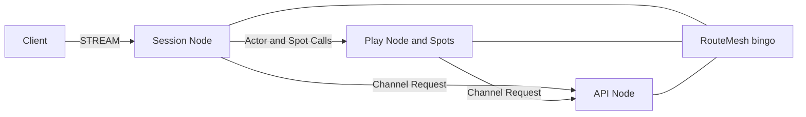
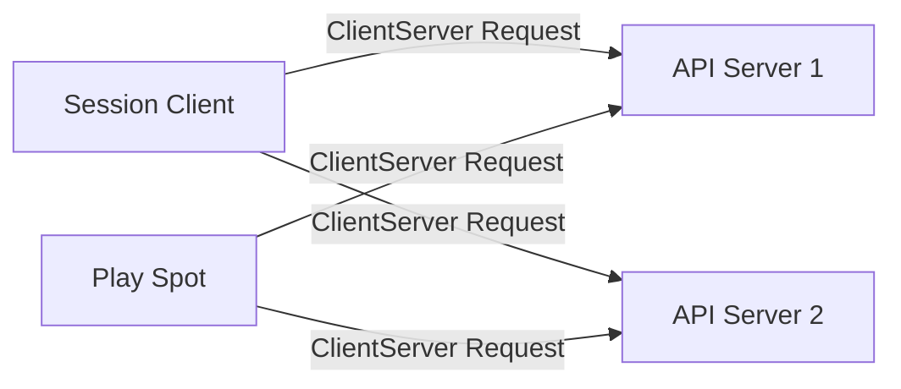
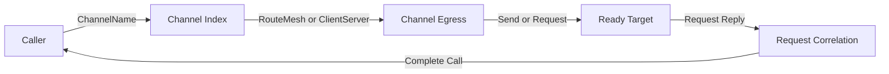
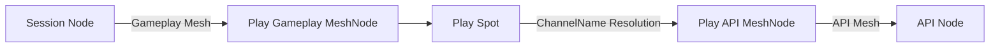
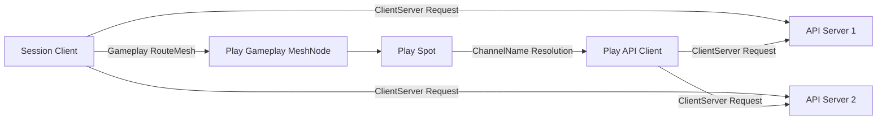

# ChannelName 단일 주소 기반 Channel egress 선택 초안

## 0. 문서 상태와 질문

이 문서는 **구현 전 설계 초안**이며 현재 공개 계약이 아니다. 현재 정식 spec, 언어별 interface,
source와 sample은 Channel 호출의 대상 범위를 `(MeshName, ChannelName)`으로 식별한다.

대상 독자는 Framework public contract와 Channel routing을 검토하는 개발자다. 이 문서는 다음 질문에
답하기 위한 설계 후보를 정리한다.

> 사용자가 논리 Channel로 메시지를 보낼 때마다 물리 topology를 지정해야 하는가, 아니면 Framework가
> ChannelName으로 RouteMesh 또는 ClientServer egress를 결정해야 하는가?

이 초안은 사용자에게 ChannelName 하나만 받는 방식을 권장안으로 제시한다. 이 방향을 승인하더라도 이
문서 자체가 계약을 변경하지는 않는다. 승인 뒤 공통 spec과 모든 언어의 정식 interface를 먼저 변경하고,
implementation gap과 실행 항목은
[`RouteMesh 10.0.0 실행 진행표`](./route-mesh-10.0.0-execution-ledger.ko.md)에 기록해야 한다.

## 1. 결론 요약

Channel 메시징의 공개 대상은 `ChannelName` 하나로 단순화한다. 하나의 application topology에서 같은
`ChannelName`을 서로 다른 물리 egress에 등록하지 못하게 하고, Framework가 프로세스 내부 등록 정보로
`ChannelName`에 대응하는 RouteMesh MeshNode 또는 ClientServer client를 찾는다.

```text
ChannelName -> process-local Channel egress -> ready target -> submit
```

같은 RouteMesh의 여러 MeshNode가 같은 ChannelName에 참여하는 것은 정상적인 scale-out 구성이다. 금지하는
것은 한 ChannelName을 서로 다른 RouteMesh나 RouteMesh와 ClientServer Channel에 동시에 등록하는
구성이다. ClientServer Channel에서는 같은 ChannelName의 여러 server가 하나의 ready target 집합을
구성하므로 중복 등록으로 보지 않는다.

Node direct 메시징은 RID namespace를 선택해야 하므로 계속 `MeshName`과 target RID를 함께 받는다. Spot과
Actor의 위치·수명 주기 및 runtime 관리 API에서 MeshName이 필요한 계약도 유지한다. 공개 Channel handler와
handler filter에는 ChannelName과 메시지 정보만 제공한다. ChannelName이 egress를 유일하게 결정하므로
application handler가 메시지를 전달한 물리 배선 이름을 알 필요가 없기 때문이다.

## 2. 현재 계약과 문제

### 2.1 현재 대상 식별 방식

현재 [공통 Channel messaging spec](../../framework/spec/server/11-channel-messaging.ko.md)은 Channel
select-one 대상을 `(MeshName, ChannelName)`으로 식별한다. [`.NET` 정식
interface](../../framework/spec/server/languages/dotnet/02-handler-interfaces.ko.md)의 전역
`IZLinkRouteClient`도 두 이름을 모두 받는다.

```csharp
public interface IZLinkRouteClient
{
    IZLinkSendCall SendToChannel<TMessage>(
        string meshName,       // 물리 RouteMesh를 호출자가 선택한다.
        string channelName,    // 선택한 RouteMesh 안의 논리 대상을 지정한다.
        TMessage message);

    IZLinkRequestCall RequestToChannel<TRequest>(
        string meshName,       // 물리 RouteMesh를 호출자가 선택한다.
        string channelName,    // 선택한 RouteMesh 안의 논리 대상을 지정한다.
        TRequest request);
}
```

반면 Spot의 outbound API는 Spot이 등록된 MeshNode를 이미 알고 있으므로 ChannelName만 받는다.

```csharp
public interface IZLinkSpotOutbound
{
    IZLinkSendCall SendToChannel<TMessage>(
        string channelName,
        TMessage message);

    IZLinkRequestCall RequestToChannel<TRequest>(
        string channelName,
        TRequest request);
}
```

두 API는 같은 Channel select-one 기능을 제공하지만 호출 위치에 따라 대상 표현이 다르다.

### 2.2 물리 topology 정보가 호출부로 노출된다

대부분의 application 코드는 논리 서비스 역할을 기준으로 호출한다. 예를 들어 인증 요청을 보내는 코드는
`bingo.api`라는 대상만 알면 충분하다. 해당 Channel이 `bingo` RouteMesh의 ROUTER 연결을 사용하는지는
topology 설정이 소유할 정보다.

현재 전역 client는 호출자가 다음 두 사실을 함께 알아야 한다.

1. 업무 요청을 처리하는 ChannelName
2. 해당 ChannelName을 전달하는 MeshName

이 지식이 handler, HTTP endpoint, session, system timer와 background service에 반복된다. Channel을 다른
RouteMesh로 옮기면 topology 설정뿐 아니라 모든 호출부의 MeshName도 함께 변경해야 한다.

### 2.3 실행 위치마다 사용법이 달라진다

| 실행 위치 | 현재 동일 RouteMesh Channel 호출 | 문제 |
|---|---|---|
| 일반 Channel handler | `IZLinkRouteClient`에 MeshName과 ChannelName 전달 | 수신 context가 이미 MeshName을 제공하지만 다시 전달한다 |
| Spot handler | `spot.Context.Outbound`에 ChannelName 전달 | 다른 호출 위치와 시그니처가 다르다 |
| Spot timer | `spot.Context.Outbound`에 ChannelName 전달 | Spot 소유 MeshNode로만 전달한다 |
| system timer·background service | `IZLinkRouteClient`에 MeshName과 ChannelName 전달 | callback마다 물리 topology 이름이 반복된다 |
| HTTP endpoint | `IZLinkRouteClient`에 MeshName과 ChannelName 전달 | 업무 endpoint가 물리 topology를 알아야 한다 |

실행 문맥을 이용해 MeshName을 생략하는 방식만 추가하면 system timer와 HTTP endpoint에는 적용할 수 없다.
반대로 모든 위치에서 MeshName을 요구하면 Spot이 이미 알고 있는 값을 application이 반복한다.

### 2.4 여러 Mesh를 지원한다는 이유만으로 두 이름이 항상 필요한 것은 아니다

한 process가 여러 RouteMesh에 참여할 수 있다는 사실은 유지해야 한다. 그러나 서로 다른 RouteMesh에서
같은 ChannelName 사용을 허용해야만 여러 RouteMesh를 지원할 수 있는 것은 아니다. ChannelName이 application
topology 안에서 물리 egress를 유일하게 가리키면, 여러 RouteMesh와 ClientServer Channel이 있어도
Framework가 ChannelName으로 대상 egress를 결정할 수 있다.

### 2.5 현재 계약은 서로 호출하는 역할을 같은 RouteMesh에 모으게 한다

자동 발견을 사용하는 RouteMesh는 같은 MeshName의 유효한 peer 전체를 직접 연결 대상으로 계산한다.
수동 연결은 application이 명시한 peer graph만 구성하며, 설정하지 않은 같은 MeshName peer를
자동으로 찾지 않는다. 두 방식 모두 peer 쌍은 양방향 메시지를 전달할 수 있는 물리 pipe 하나를
공유한다. 현재 Spot의 Channel 호출은 Spot을 소유한 MeshNode의 RouteMesh만 사용한다. 따라서
Spot이 다른 역할의 Channel을 호출하려면 두 역할을 같은 RouteMesh에 등록하는 구성이 가장 단순하다.

현재 Bingo sample의
[Session](../../../languages/dotnet/samples/Bingo/Server/Session/SessionServerHostFactory.cs),
[Play](../../../languages/dotnet/samples/Bingo/Server/Play/PlayServerHostFactory.cs)와
[API](../../../languages/dotnet/samples/Bingo/Server/Api/ApiServerHostFactory.cs)는 모두
`SampleNames.MeshName`으로 MeshNode를 등록한다. Client와 Session 사이는 STREAM이 담당하고, 세 서버 역할은
하나의 RouteMesh에서 ChannelName으로 구분한다.



[Session은 API Channel에 인증을
요청하고](../../../languages/dotnet/samples/Bingo/Server/Session/Sessions/Handlers/AuthenticateSessionHandler.cs),
[Play의 EntrySpot](../../../languages/dotnet/samples/Bingo/Server/Play/Infrastructure/ZLink/Spots/EntrySpot/Handlers/MatchBingoActorHandler.cs)과
[BingoRoom](../../../languages/dotnet/samples/Bingo/Server/Play/Infrastructure/ZLink/Spots/BingoRoomSpot/BingoRoom.cs)도
API Channel에 요청한다. 따라서 현재 sample의 실제 호출 관계는 `Session -> Play -> API` 한 방향만이 아니라
`Session -> API`도 포함한다. 이 세 역할을 하나의 RouteMesh에 등록한 현재 구성은 기존 계약에 맞는 정상적인
topology다.

다음처럼 호출 관계의 각 구간을 별도 RouteMesh로 나누려면 현재 계약에서는 추가 처리가 필요하다.

```text
RouteMesh gameplay: Session, Play
RouteMesh api:      Play, API
```

Play process는 두 MeshNode를 모두 등록해야 한다. 그러나 gameplay MeshNode가 소유하는 Spot의
`Context.Outbound`는 api RouteMesh를 선택하지 못한다. Play의 Spot handler가 전역 `IZLinkRouteClient`에
api MeshName과 API ChannelName을 함께 전달해야 한다. Session이 API를 직접 호출하는 현재 Bingo 흐름까지
유지한다면 Session process도 api RouteMesh에 참여해야 한다.

따라서 현재 계약은 잘못된 topology를 요구하는 것이 아니라, 서로 Channel 메시지를 주고받는 역할을 하나의
물리 연결 범위에 모으는 쪽을 기본 경로로 만든다. 이 방식은 호출이 단순하지만, 논리 Channel 경계와 물리
연결 범위를 별도로 나누려는 경우에는 Spot 호출부에 MeshName과 전역 client 사용을 노출한다.

### 2.6 client가 요청을 시작하는 별도 물리 배선

Session과 Play가 API 인증·조회 요청을 시작하고 API가 Session이나 Play로 업무 메시지를 시작하지 않는
구성은 RouteMesh의 peer graph과 요구가 다르다. 이 경우에는 Session과 Play의 DEALER가 여러 API ROUTER에
연결되는 ClientServer Channel이 물리 연결 방향과 scale-out 방식을 더 정확히 표현한다.



ClientServer Channel의 transport는 reply를 반환해야 하므로 양방향 pipe를 사용하지만, Framework의 업무
호출은 client가 send 또는 request를 시작하고 server는 handler 실행과 request reply만 수행하도록 제한한다.
Server가 연결된 client를 대상으로 임의의 업무 send나 request를 시작하는 공개 표면은 제공하지 않는다.

여러 ready server가 같은 ClientServer ChannelName에 참여하면 새 send와 request는 round-robin 또는
weight에 따라 server 하나를 선택한다. 이미 제출한 request가 timeout이나 연결 종료로 실패해도 다른
server에 자동 재전송하지 않는다. Server가 request를 실행한 뒤 reply만 유실됐을 수 있기 때문이다.

이 topology는 RouteMesh의 하위 option이 아니다. RouteMesh는 Node direct, Channel select-one, Spot, Actor와
Logical Multicast가 공유하는 peer 연결 범위이고, ClientServer Channel은 client가 요청을 시작하는 별도
service 배선이다. 두 topology는 물리 runtime을 분리하되 application의 Channel send/request 호출 표면은
공유할 수 있다.

## 3. 목표와 제외 범위

### 3.1 목표

1. Channel send와 request는 실행 위치와 관계없이 ChannelName 하나로 대상을 표현한다.
2. Framework가 ChannelName과 RouteMesh·ClientServer egress의 대응 관계를 한 곳에서 관리한다.
3. 일반 handler, Spot, Spot timer, system timer와 HTTP endpoint가 같은 대상 선택 규칙을 사용한다.
4. 다른 RouteMesh 또는 ClientServer Channel을 호출해도 send와 request가 같은 route 선택 단계를 사용한다.
5. request correlation, timeout, cancellation과 Spot serial turn 의미를 현재 계약대로 유지한다.
6. Node direct 호출의 `(MeshName, RID)` 대상은 변경하지 않는다.
7. 호출 process에 대상 egress가 없을 때 암묵적 relay나 fallback을 만들지 않는다.
8. 논리 Channel 경계와 물리 topology를 나누더라도 Channel 호출부의 사용법을 바꾸지 않는다.
9. ClientServer Channel은 client가 업무 호출을 시작하고 server는 handler 실행과 reply만 수행한다.

### 3.2 제외 범위

- 서로 다른 RouteMesh 사이에 transport pipe를 새로 만들지 않는다.
- 호출 process가 참여하지 않은 RouteMesh로 proxy하거나 relay하지 않는다.
- Channel send와 request의 retry 또는 terminal completion 의미를 바꾸지 않는다.
- ClientServer Channel server가 연결된 client로 임의의 업무 send나 request를 시작하게 하지 않는다.
- classic fanout channel 이름을 routed ChannelName과 같은 namespace로 합치지 않는다.
- MeshName을 topology 설정, Node direct, monitoring, location과 lifecycle 계약에서 제거하지 않는다.
- ambient context나 thread-local 값으로 system timer의 대상 Mesh를 추론하지 않는다.

## 4. 검토한 대안

| 대안 | 일반 호출 | 장점 | 문제 | 판정 |
|---|---|---|---|---|
| A. 현재 `(MeshName, ChannelName)` 유지 | 호출마다 두 이름 전달 | 대상 범위가 항상 명시적이다 | 물리 topology 지식이 모든 호출부에 반복되고 Spot API와 다르다 | 비권장 |
| B. Mesh-bound client 추가 | context 또는 `ForMesh(meshName)`에서 client 획득 | 같은 Mesh 호출의 반복을 줄인다 | handler, Spot, system timer마다 client를 얻는 방식이 달라지고 새 interface가 늘어난다 | 차선 |
| C. default Mesh 또는 ambient Mesh 추론 | ChannelName만 전달 | 호출이 짧다 | system timer에는 현재 문맥이 없고 topology 변화에 따라 선택 결과가 달라진다 | 제외 |
| D. ChannelName으로 Channel egress 선택 | ChannelName만 전달 | 모든 실행 위치가 같은 API를 사용하고 RouteMesh·ClientServer 선택을 Framework가 처리한다 | ChannelName 중복 금지와 egress index가 필요하다 | **권장** |

### 4.1 Mesh-bound client가 최종안이 아닌 이유

Mesh-bound client는 같은 Mesh에서 반복 호출하는 경우에는 유효하다. 그러나 일반 handler에는 수신 context,
Spot에는 Spot context, system timer에는 별도 factory가 필요하다. 사용자는 같은 Channel 기능을 호출하면서
실행 위치에 따라 서로 다른 client 획득 방법을 알아야 한다.

ChannelName이 물리 egress를 유일하게 결정할 수 있다면 이 추가 표면은 필요하지 않다. Framework 내부의
route index 하나가 같은 정보를 관리하는 편이 변경 범위와 호출자 지식을 줄인다.

## 5. 권장 계약

### 5.1 ChannelName의 유일성

하나의 application topology에서 ChannelName 하나는 물리 egress 하나에만 대응한다. 물리 egress는
RouteMesh MeshNode 또는 ClientServer Channel client다.

```text
Allowed
  MeshName: bingo
    Node: api-1  ChannelName: bingo.api
    Node: api-2  ChannelName: bingo.api

  ClientServer ChannelName: bingo.auth
    Server: api-1
    Server: api-2

Rejected
  MeshName: bingo    ChannelName: common.api
  MeshName: payment  ChannelName: common.api

  RouteMesh ChannelName: bingo.auth
  ClientServer ChannelName: bingo.auth
```

같은 RouteMesh의 여러 ready member와 같은 ClientServer Channel의 여러 ready server는 각각 하나의 egress
안에서 scale-out한 구성이므로 허용한다. 하나의 ChannelName이 서로 다른 RouteMesh 또는 서로 다른 egress
종류에 대응하면 물리 전달 경로를 결정할 수 없으므로 금지한다.

ChannelName에는 application 또는 bounded context를 구분할 수 있는 prefix 사용을 권장한다. 예를 들어
`api`보다 `bingo.api`가 충돌 가능성을 줄인다. prefix 규칙은 문자열 형식의 강제 계약이 아니며,
ChannelName과 물리 egress의 대응 관계가 유일하다는 조건이 실제 계약이다.

### 5.2 프로세스 내부 송신 경로 선언

Channel 호출은 프로세스 내부 송신 경로를 통해서만 submit할 수 있다. 따라서 호출 process는 사용하려는
ChannelName이 어느 local RouteMesh MeshNode 또는 ClientServer client를 사용하는지 startup 전에 선언해야
한다.

RouteMesh의 Channel 설정은 해당 process가 그 Channel의 server 역할인지 client 역할인지 명시한다.
`Server()`는 실제 대상 역할과 handler namespace를 등록하고, `Client()`는 같은 RouteMesh를 사용할
송신 경로만 등록한다. Client 역할은 peer에게 메시지 처리 대상으로 광고하지 않으며 선택 weight와
handler를 갖지 않는다. `SetWeight(0)`을 client 역할 표현으로 사용하지 않는다.

공개 계약에서 논리 주소 값의 이름은 `ChannelName`으로 유지한다. Fluent builder는 `Channel(channelName)`로
해당 Channel의 역할 설정을 시작한다. 값 이름을 메서드 이름에 반복하지 않아 설정 코드를 짧게 유지한다.

`Server()`가 반환하는 server 역할 builder에서만 `SetWeight(...)`, `AddHandlerGroup(...)`과 typed handler
등록 함수를 제공한다. 이 구조는 handler를 제공하는 역할과 호출만 하는 역할을 interface 수준에서
구분한다. Server 역할도 같은 ChannelName의 outbound route를 사용할 수 있으므로 같은 Channel을 호출하기
위해 `Client()`를 중복 선언할 필요는 없다.

현재 Core 정식 계약은 MeshNode가 시작할 때 ChannelName을 하나 이상 가져야 한다. 그러나
`Client()`만 설정한 MeshNode는 peer에게 게시할 대상 역할이 없으므로 Core membership가 0개가 된다.
`SetWeight(0)` 또는 가짜 ChannelName으로 이 제약을 우회하지 않는다. Core가 membership 0개인
MeshNode를 Node direct와 호출 전용 Channel egress로 시작할 수 있도록 정식 Core spec, C API,
contract test와 bindings 검증을 Framework 구현보다 먼저 변경해야 한다.

```csharp
var mesh = options.AddRouteMesh("gameplay")
    .Listen(node.MeshEndpoint); // 이 process가 사용할 ROUTER endpoint를 설정한다.

mesh.Channel("gameplay.session")
    .Server()
    .AddHandlerGroup("session"); // 메시지 처리 대상과 handler group을 peer에게 게시한다.

mesh.Channel("gameplay.play")
    .Client(); // 대상 역할을 게시하지 않고 호출 경로만 등록한다.

options.AddClientServerChannel("shoppingmall.workflow.owner-a")
    .Client(); // location store에서 ready server를 발견하는 호출 경로를 등록한다.
```

Framework는 모든 local route registration을 모아 다음 index를 만든다.

```text
gameplay.play   -> RouteMesh MeshNode "gameplay"
payment.api     -> RouteMesh MeshNode "payment"
shoppingmall.workflow.owner-a -> ClientServer client
```

한 process에서 같은 ChannelName이 서로 다른 egress에 등록되면 host startup을 실패시킨다. 대상 ChannelName이
local index에 없으면 호출 시 명확한 configuration 또는 target 오류로 끝낸다. 정확한 오류 이름은 정식 spec
변경 단계에서 결정한다. 다른 RouteMesh나 ClientServer client를 검색하거나 임의의 egress를 선택하지 않는다.

서로 연결되지 않은 process들의 중복 이름은 한 process의 startup validation만으로 모두 찾을 수 없다.
따라서 application topology 전체의 유일성은 public contract와 배포 구성 검사가 보장해야 한다. shared
location store가 없는 수동 topology에도 같은 계약을 적용해야 하므로, 이 검증만을 위해 중앙 store를
필수로 만들지는 않는다.

### 5.3 Channel 메시징 후보 interface

다음 코드는 승인 뒤 정식 언어별 spec에 기록할 **후보 계약**이며 현재 source에 존재하는 interface가
아니다.

```csharp
public interface IZLinkRouteClient
{
    IZLinkSendCall SendToNode<TMessage>(
        string meshName,       // RID namespace를 선택한다.
        RoutingId targetNodeRid,
        TMessage message);

    IZLinkRequestCall RequestToNode<TRequest>(
        string meshName,       // RID namespace를 선택한다.
        RoutingId targetNodeRid,
        TRequest request);

    IZLinkSendCall SendToChannel<TMessage>(
        string channelName,    // Framework가 대응하는 Channel egress를 찾는다.
        TMessage message);

    IZLinkRequestCall RequestToChannel<TRequest>(
        string channelName,    // send와 같은 route index를 사용한다.
        TRequest request);
}
```

Spot outbound도 같은 ChannelName 해석 규칙을 사용한다. Spot이 등록된 MeshName을 Channel 호출의 암묵적
제한으로 사용하지 않는다.

```csharp
var response = await spot.Context.Outbound
    .RequestToChannel("payment.api", request) // ChannelName으로 target egress를 결정한다.
    .Yield<PaymentResponse>(cancellationToken); // callback 가능성이 있으면 Spot turn을 반환한다.
```

system timer와 background service도 같은 전역 client를 사용한다.

```csharp
protected override async Task ExecuteAsync(CancellationToken stoppingToken)
{
    using var timer = new PeriodicTimer(TimeSpan.FromSeconds(1));

    while (await timer.WaitForNextTickAsync(stoppingToken))
    {
        await routes
            .SendToChannel("bingo.api", new MatchTick()) // 실행 문맥 없이 논리 대상만 지정한다.
            .SubmitAsync(stoppingToken);
    }
}
```

### 5.4 Send와 Request의 공통 route 선택

Send와 Request는 같은 Channel route resolver를 사용한다. Request만 현재 Spot의 MeshName을 사용하거나
실행 문맥에 따라 다른 대상 선택 규칙을 사용하지 않는다.



RouteMesh egress는 선택된 MeshNode outbound에서 ready positive-weight member 하나를 고른다. ClientServer
egress는 client DEALER가 연결된 ready server 가운데 하나를 round-robin 또는 weight에 따라 고른다. Send는
선택된 egress의 submit 결과를 반환하고, Request는 같은 egress가 correlation을 보관했다가 reply를 받으면
원래 call을 완료한다.

### 5.5 Spot serial turn

다른 RouteMesh나 ClientServer Channel을 요청하더라도 `Async`와 `Yield` 의미는 현재 Spot request 계약을
유지한다.
대상 handler가 원래 Spot을 다시 호출할 가능성이 있으면 `Yield`가 Spot의 serial turn을 반환한 뒤 reply를
기다린다. 이 규칙은 cross-mesh 전용 예외가 아니라 모든 Spot request에 적용되는 재진입 규칙이다.

Channel route resolver는 Spot의 현재 MeshName이 아니라 ChannelName으로 target egress를 선택한다. 따라서
Spot이 `game` MeshNode에 등록되어 있어도 local process에 `payment.api -> payment` RouteMesh binding이나
`shoppingmall.workflow.owner-a -> ClientServer client` binding이 선언되어 있으면 해당 egress로 send와
request를 실행할 수 있다.

Cross-egress request는 Framework가 원래 Spot의 serial turn, lifecycle과 request correlation을 보존한다.
선택된 egress의 Core-visible source identity는 해당 RouteMesh MeshNode 또는 ClientServer client의 RID다.
원래 Spot RID를 다른 물리 topology의 routing identity로 사용하지 않으며, 원래 Spot 정보는 Framework trace와
correlation에 보존한다. Spot이 종료되면 outstanding request를 정식 shutdown terminal completion으로
끝내고 다른 target으로 재전송하지 않는다.

다른 egress에서 받은 reply를 일반 Spot packet으로 application queue에 다시 dispatch하지 않는다. 선택된
egress의 completion pump가 reply를 받은 뒤 pending operation을 완료하고, 호출 방식에 따라 원래 Spot turn을
계속 실행하거나 serial queue에 실행 재개 작업을 등록한다.

```text
Spot Handler
    -> Channel Resolver
    -> Target Egress Request
    -> Reply Completion
    -> Pending Operation
    -> Original Spot Turn Resume
```

`Async`는 원래 Spot turn을 소유한 상태로 request completion을 기다린다. 다른 egress의 completion pump가
pending task를 완료하면 기다리던 continuation이 같은 turn에서 계속 실행된다. 이 경로는 Spot queue에 별도
reply message나 resume work item을 추가하지 않는다.

`Yield`는 request를 제출한 뒤 원래 Spot turn을 반환한다. Reply 또는 terminal error가 pending task를
완료하면 Framework는 원래 Spot serial queue에 resume work item을 등록한다. 이 work item이 실행권을 얻은
뒤 continuation이 다시 실행된다. Reply payload 자체를 새 handler message로 넣지 않으므로 request reply가
application packet handler를 한 번 더 호출하지 않는다.

Framework의 pending operation은 최소한 다음 정보를 보존한다. 이 record는 내부 구현이며 public API에
노출하지 않는다.

```text
Operation ID
Origin Spot Activation
Origin Spot Generation
Captured Serial Turn
Target Egress
Completion Source
Timeout and Cancellation State
```

Completion pump는 operation ID로 pending record를 찾고 원래 Spot activation과 generation이 여전히 유효한지
확인한다. Reply, timeout, cancellation과 Spot shutdown이 경쟁해도 terminal completion은 하나만 허용한다.
Spot이 종료되면 outstanding operation을 shutdown으로 완료하고, 같은 RID로 새 Spot이 만들어져도 이전
generation의 reply를 전달하지 않는다. Timeout이나 cancellation 뒤 도착한 reply는 application에 전달하지
않고 늦은 completion으로 관측한 뒤 폐기한다.

이 의미에서는 Core가 request를 처리한 실제 egress와 reply correlation을 제공하고 Framework가 원래 Spot의
turn과 lifecycle을 관리한다. Target handler나 Core monitoring에 원래 Spot RID를 물리 source identity로
보존하지 않으므로 기존 MeshNode·DEALER request API 위에서 구현할 수 있다. 원래 Spot RID와 generation을
다른 물리 topology의 Core route에도 보존해야 한다는 요구가 추가되면 Framework 우회로 처리하지 않고 Core
정식 계약과 API 변경을 먼저 검토한다.

### 5.6 Handler와 관측 정보

사용자가 Channel을 호출할 때는 물리 topology를 지정하지 않지만 Framework는 선택된 egress kind와 물리
identity를 계속 보존한다. RouteMesh는 MeshName과 MeshNode RID를, ClientServer는 channel client/server
역할과 연결 peer RID를 관측 정보에 기록할 수 있다.

현재 다섯 언어의 정식 interface는 Channel handler context에도 `MeshName`을 포함한다. 따라서 이
변경은 새 member 추가를 취소하는 작업이 아니라 기존 공개 member를 제거하는 계약 변경이다. Node direct
context는 RID namespace를 위해 `MeshName`이 필요하므로, 공통 context에서 모두 제거하지 않는다.
공통 context에는 packet과 metadata 계약만 두고, Node direct context에만 `MeshName`과 source RID를
두며, Channel context에는 `ChannelName`만 두는 분리 interface를 다섯 언어 exact spec에 고정한다.

공개 Channel handler의 논리 식별자는 다음 값으로 충분하다.

```text
ChannelName, message kind, packet name
```

언어별 Channel handler context와 handler filter invocation은 ChannelName과 메시지 정보만 제공한다.
RouteMesh의 특정 RID를 직접 대상으로 하는 handler context와 Spot·Actor 위치 context처럼 실제로 mesh
범위가 필요한 별도 계약에는 `MeshName`을 유지한다.

Core 내부 route와 관측 자료는 선택한 egress에 따라 다음 값을 계속 사용할 수 있다.

```text
RouteMesh:    MeshName, ChannelName, source RID, target RID
ClientServer: ChannelName, client RID, server RID
```

ChannelName이 egress를 유일하게 결정하므로 내부 tuple을 유지하더라도 호출자에게 물리 topology 이름을
다시 요구하거나 공개 Channel handler context에 노출하지 않는다. 물리 egress 정보가 필요한 진단과 운영
기능은 handler context가 아니라 monitoring event와 runtime snapshot에서 제공한다.

### 5.7 topology를 나눈 경우의 동작

이 절의 Session·Play·API는 여러 송신 경로를 검증하기 위한 합성 예시다. Bingo sample의 목표
topology가 아니며, 실제 sample 선택은 7.5를 따른다.

권장 계약을 적용하면 `Session -> Play -> API` 호출만 존재하는 합성 구성은 다음처럼 두
RouteMesh로 나눌 수 있다. Play process는 두 RouteMesh에 각각 프로세스 내부 MeshNode를 등록한다.



Spot의 Channel 호출은 Spot을 소유한 gameplay MeshNode에 고정되지 않는다. Channel route index가 API
ChannelName에 대응하는 Play process의 api MeshNode를 선택한다. Send와 Request 모두 같은 선택을 사용하며,
Request reply는 api MeshNode의 correlation을 거쳐 원래 Spot call을 완료한다.

이 동작은 RouteMesh 사이의 자동 relay가 아니다. Play process가 두 MeshNode를 명시적으로 등록했기 때문에
같은 process 안에서 target MeshNode를 선택할 수 있는 것이다. API MeshNode가 local process에 없으면 호출은
실패한다.

합성 구성에 Session의 API 직접 호출까지 추가한다면 Session process 역시 api MeshNode를 등록해야
한다. 이
경우 api RouteMesh에는 Session, Play와 API가 모두 참여하므로 물리 연결 수를 줄이는 효과가 크지 않을 수
있다. RouteMesh 분리 여부는 역할 이름이 아니라 실제 호출 관계, 보안 경계와 lifecycle 분리 필요성을
기준으로 결정해야 한다. 권장 계약의 목적은 항상 RouteMesh를 나누는 것이 아니라, 나누거나 합치는 결정을
Channel 호출부에서 제거하는 것이다.

API가 Session이나 Play로 업무 호출을 시작하지 않는 합성 구성이라면 API 경계를 별도
ClientServer Channel로 구성할 수 있다. Session과 Play는 같은 `service.api.auth` 호출 경로를
등록하고 API 인스턴스만 server로 참여한다.



이 구성에서는 API가 gameplay RouteMesh에 참여하지 않고 API server 사이에도 peer 연결이 생기지 않는다.
Session과 Play가 API를 직접 호출하므로 두 process 모두 ClientServer client egress를 등록한다. 어느 쪽도
다른 process를 암묵적 relay로 사용하지 않는다.

### 5.8 operation별 egress 지원

| operation | RouteMesh egress | ClientServer egress | Classic fanout |
|---|---|---|---|
| Channel send | 지원 | client가 시작하는 send만 지원 | 대상 아님 |
| Channel request | 지원 | client가 시작하는 request와 server reply 지원 | 대상 아님 |
| Spot Logical Multicast publish | 지원 | 지원하지 않음 | 대상 아님 |
| Classic publish | 대상 아님 | 대상 아님 | 별도 fanout 계약으로 지원 |

ClientServer Channel에 Logical Multicast publish를 제출하거나 server가 client 대상 업무 호출을 시작하면
즉시 configuration 또는 unsupported-operation 오류로 끝낸다. 정확한 오류 이름은 정식 spec 변경 단계에서
확정한다.

### 5.9 ClientServer 후보 등록 interface

ClientServer Channel은 제거한 기존 builder 전체를 그대로 복원하지 않는다. Client와 server 역할을 startup에
명확히 나누고, client가 호출을 시작하는 데 필요한 설정과 server handler·reply에 필요한 설정만 제공한다.
다음 이름은 정식 언어별 interface를 작성하기 전의 후보다.

```csharp
// Workflow process: 이 ChannelName의 request를 처리하고 받은 request에만 reply한다.
options.AddClientServerChannel("shoppingmall.workflow.owner-a")
    .Server()
    .Listen(workflowEndpoint)
    .SetWeight(100) // 새 request를 받을 비율을 게시한다. 0은 새 선택에서 제외한다.
    .AddHandlerGroup("workflow"); // Server 역할에서만 handler 등록 함수를 제공한다.
```

```csharp
// 자동 발견: location store에서 유효한 Workflow server를 찾아 연결 집합을 계속 갱신한다.
options.AddClientServerChannel("shoppingmall.workflow.owner-a")
    .Client();

// 수동 연결: application이 모든 server endpoint를 제공한다.
options.AddClientServerChannel("manual.api.auth")
    .Client()
    .Connect(serverEndpoint1)
    .Connect(serverEndpoint2);
```

`Client()`에 endpoint를 주지 않으면 등록한 production location store를 사용해 같은 ChannelName의
server를 발견한다. 현재 정식 location 계약의 `MeshNode descriptor`는 RouteMesh peer 전용이므로
ClientServer server를 그 record에 MeshName으로 위장해 기록하지 않는다. 다음 정보를 가진 별도
ClientServer server descriptor와 store 조회·갱신 계약을 정식 spec에 먼저 추가한다.

```text
ChannelName
Server RID
Lifecycle generation
Descriptor revision
Advertised endpoint
Weight and drain state
Security identity
Owner lease
```

Server는 bind를 완료한 뒤 실제 endpoint와 수명 정보를 하나의 revision으로 게시한다. Client는
유효한 lease와 가장 큰 revision을 가진 ready server만 연결 대상으로 계산한다. Weight가 0이거나
drain 중인 server는 새 send·request 선택에서 제외하되 기존 pending request를 즉시 취소하지 않는다.
Store 장애, server 재시작, endpoint 변경과 낮은 generation·revision 제거는 RouteMesh와 같은 lease·fencing
원칙을 적용하되, 서로 다른 descriptor 종류를 하나의 record로 합치지 않는다.

`SetWeight(...)`는 server 역할 builder에만 있다. 실행 중 weight·drain 변경 API와 monitoring
snapshot의 정확한 이름은 정식 언어별 interface에서 고정한다. 수동 연결도 Core peer handshake에서
server weight와 generation을 확인해 같은 선택·재시작 의미를 제공해야 한다.

Application 호출은 RouteMesh와 같은 Channel client를 사용한다. Builder에서 결정한 물리 topology를 호출부에
다시 전달하지 않는다.

```csharp
var response = await routes
    .RequestToChannel("shoppingmall.workflow.owner-a", request) // ChannelName으로 ClientServer 송신 경로를 선택한다.
    .Async<WorkflowReply>(cancellationToken); // 선택된 server의 reply로 한 번만 완료한다.
```

ClientServer server가 수신한 request의 reply token은 해당 request에만 사용한다. Server의 public runtime에는
연결된 client RID를 대상으로 새 업무 send나 request를 시작하는 기능을 제공하지 않는다. Client receive
경로는 자신이 제출한 request와 일치하는 completion만 application에 전달하며 unsolicited server message는
protocol 오류로 관측한다.

### 5.10 Framework 공통 network identity

Bind host와 peer에게 게시할 host는 RouteMesh만의 설정이 아니다. Network listener를 만드는 모든 Framework
기능이 같은 process 또는 container의 network identity를 사용한다. 따라서 기본 host 설정은 RouteMesh
builder가 아니라 Framework 공통 설정이 소유한다.

| 기능 | 공통 host 설정 사용 역할 | remote endpoint를 소비하는 역할 |
|---|---|---|
| RouteMesh | 모든 MeshNode | 같은 RouteMesh의 peer |
| ClientServer Channel | `Server()` | `Client()` |
| classic Pub/Sub | publisher | subscriber |
| STREAM | server bind 역할 | STREAM client |

다음 코드는 정식 언어별 interface를 작성하기 전의 후보다.

```csharp
options.ConfigureNetwork(network =>
{
    network.BindHost = "0.0.0.0"; // local listener가 수신할 network interface를 정한다.
    network.AdvertiseHost = podIp; // remote process가 실제로 연결할 host를 정한다.
});
```

각 listener는 고정 port를 명시하거나 Framework에 빈 port 할당을 맡길 수 있다. Framework가 port를 할당하면
bind가 끝난 뒤 Core에서 실제 port를 읽고 `AdvertiseHost`와 결합해 connect 가능한 endpoint를 게시한다.
`0.0.0.0`, `::`와 port `0`은 bind 입력에는 사용할 수 있지만 remote endpoint로 게시하지 않는다.

```text
Bind endpoint       = BindHost + configured or allocated port
Advertised endpoint = AdvertiseHost + actual bound port
```

Location store를 사용하는 listener는 `AdvertiseHost`를 별도 필드로 저장하지 않는다. Bind가 끝난 뒤 만든
연결 가능한 endpoint를 해당 topology가 소유한 descriptor의 `Endpoint`에 기록한다. RouteMesh는 기존
MeshNode descriptor를 사용하고, ClientServer는 5.9의 별도 server descriptor를 사용한다. Pub/Sub과
STREAM의 게시·발견 record와 handshake는 각 topology 정식 계약이 소유한다. MeshNode descriptor를
공통 listener record처럼 재사용하지 않는다. `BindHost`와 bind 입력의 port `0`은 로컬 socket
설정이므로 어떤 descriptor에도 기록하지 않는다.

```json
{
  "MeshName": "bingo",
  "Rid": "api-1",
  "Endpoint": "tcp://10.42.1.17:49152",
  "ChannelWeights": {
    "bingo.api": 100
  }
}
```

공통 bind·advertised endpoint 계산 순서는 다음과 같다. 4·5단계의 record 종류와
handshake 필드는 topology별 정식 계약이 정한다.

1. `BindHost`와 configured port 또는 port `0`으로 listener를 bind한다.
2. Core에서 실제 bind port를 읽는다.
3. `AdvertiseHost`와 실제 port를 결합해 connect 가능한 endpoint를 만든다.
4. RID, lifecycle generation과 endpoint를 같은 descriptor revision에 기록한다.
5. Peer는 descriptor의 endpoint로 연결하고 handshake에서 RID와 generation을 검증한다.

Pod 또는 process가 다시 시작되어 advertised host나 실제 port가 바뀌면 새 lifecycle generation과 endpoint를
함께 게시한다. 이전 descriptor lease는 기존 location lifecycle 규칙으로 제거한다. Peer가 새 descriptor를
관찰하기 전에 기존 endpoint를 새 identity에 재사용하거나, endpoint만 바꾸고 generation을 유지하지 않는다.

Automatic discovery mode에서는 application이 listener별 고정 port를 관리하지 않도록 Framework가 기본 bind
endpoint를 만들 수 있다. Manual mode에서는 remote process가 endpoint를 다른 경로로 얻지 못하므로 명시적
listener와 peer endpoint 설정을 유지한다. 같은 process나 Pod 안에 listener가 여러 개 있으면 실제 bind
port는 서로 달라야 한다.

Kubernetes에서는 Downward API로 주입한 Pod IP를 `AdvertiseHost`로 사용한다. Pod마다 IP가 다르므로 서로
다른 Pod의 같은 종류 listener는 같은 container port를 사용할 수 있다. 일반 Service의 단일 가상 주소는
개별 RID, weight, admission과 drain을 관측해야 하는 RouteMesh peer 주소를 대신하지 않는다. Redis location
store 또는 headless Service처럼 개별 Pod endpoint를 확인할 수 있는 discovery를 사용한다.

Container, NAT, sidecar 또는 여러 network interface가 있는 환경에서는 bind host와 advertised host가 다를
수 있다. 공통 설정은 process 기본값이며, 특정 listener가 별도 interface나 DNS 이름을 사용해야 할 때만
해당 builder에서 override한다. 이 분리가 Core의 handshake가 게시하는 endpoint에도 필요하면 Framework
내부 우회로 처리하지 않고 Core와 bindings의 정식 advertised-endpoint 계약을 먼저 추가한다.

## 6. 실패 계약

| 조건 | 결과 |
|---|---|
| 같은 process에서 ChannelName이 서로 다른 egress에 등록됨 | host startup configuration error |
| 호출한 ChannelName이 local route index에 없음 | 정식 spec에서 확정할 configuration 또는 target 오류 |
| RouteMesh egress는 있으나 ready positive-weight member가 없음 | 기존 target-not-found 또는 timeout 계약 적용 |
| ClientServer egress는 있으나 ready server가 없음 | 기존 target-not-found 또는 not-admitted 계약 적용 |
| 선택 뒤 연결 종료 또는 request timeout 발생 | 다른 member, server 또는 egress로 자동 재전송하지 않음 |
| target handler가 없음 | reply route를 복원할 수 있으면 기존 handler-not-found error reply |
| Spot이 다른 egress의 Channel을 request | Framework가 correlation과 Spot lifecycle을 관리하고 기존 `Async`/`Yield` 계약 적용 |
| ClientServer server가 client 대상 업무 호출을 시작함 | configuration 또는 unsupported-operation 오류 |
| ClientServer Channel에 Logical Multicast publish를 제출함 | configuration 또는 unsupported-operation 오류 |
| wildcard host 또는 port 0을 remote endpoint로 게시하려 함 | endpoint 게시 전 startup configuration 오류 |
| 자동 listener가 연결 가능한 advertised host를 결정할 수 없음 | endpoint 게시 전 startup configuration 오류 |

오류의 정확한 이름과 언어별 타입은 정식 spec을 변경할 때 확정한다. 이 초안에서는 새 오류 이름을
발명하지 않는다.

## 7. 공개 계약과 구현 영향

### 7.1 Framework 공통 계약

승인되면 다음 정식 계약을 함께 검토해야 한다.

- Channel topology: ChannelName과 물리 egress의 유일한 대응 관계 및 startup validation
- Channel messaging: Channel 호출자가 지정하는 값을 ChannelName 하나로 변경
- Channel handler와 filter: 논리 handler context와 invocation은 ChannelName과 메시지 정보만 제공
- RouteMesh: 프로세스 내부 Channel 송신 경로 등록과 ready member 선택
- ClientServer Channel: client DEALER, server ROUTER, client가 시작하는 send/request와 server reply
- 공통 network identity: RouteMesh, ClientServer, Pub/Sub과 STREAM listener의 bind·advertised host 기본값
- 비동기 실행 정책: cross-egress request correlation과 Spot `Yield`가 기존 의미를 유지하는지 확인
- monitoring: 호출자가 생략한 egress kind와 물리 identity를 Framework가 선택한 결과로 기록

### 7.2 언어별 interface

`.NET`, C++, Java, Kotlin과 Node.js의 10.0.0 목표 Channel client는 ChannelName으로 대상을 지정한다. 각
언어의 Channel handler context와 handler filter invocation은 ChannelName과 메시지 정보만 제공한다. Spot
outbound도 현재처럼 ChannelName으로 대상을 지정하되, 현재 Spot의 MeshNode에 고정된 선택을 공통 Channel
route resolver로 바꿔야 한다. RouteMesh와 ClientServer는 물리 builder를 별도로 제공하지만 send/request
호출과 handler 계약은 같은 ChannelName 기반 계약을 공유한다.

언어별 구현은 다른 언어의 source를 계약 근거로 사용하지 않는다. 공통 spec과 각 언어의 exact interface를
먼저 확정하고, implementation gap에 현재 구현과의 차이를 기록한다.

### 7.3 Core와 bindings

Core MeshNode는 이미 선택된 MeshNode instance에서 ChannelName member를 고르는 책임을 유지한다.
Core DEALER는 연결된 ready server를 round-robin 또는 weight에 따라 고르고 request completion을 반환하는
기존 계약을 사용한다. `ChannelName -> 프로세스 내부 송신 경로` 선택과 Spot의 다른 송신
경로 request completion 연결은 Framework가 담당한다.
제거한 Spot bridge처럼 Core가 여러 RouteMesh 사이를 relay하는 경로를 다시 만들지 않는다. Framework가
같은 process에 이미 등록된 Core handle 중 하나를 선택하고, Core는 선택된 handle 안의 송수신만
처리한다. 따라서 중간 hop, bridge 전용 연결과 reply relay lifecycle이 생기지 않는다.

그러나 RouteMesh `Client()`만 사용하는 MeshNode를 가짜 membership 없이 시작하려면 Core의
“ChannelName 하나 이상” 불변 조건을 바꾸어야 한다. 따라서 이 변경은 Core·bindings 무변경 작업이 아니다.
Core 정식 spec에 membership 0개 MeshNode의 용도와 허용 동작을 먼저 고정하고 C API·test를 바꾼 뒤,
다섯 bindings가 그 구성을 거부하지 않는지 검증해야 한다.

Core의 `ZLINK_OPT_LAST_ENDPOINT`로 port 0 bind의 실제 endpoint를 읽는 표면은 이미 있다. 따라서
Framework의 `AdvertiseHost + actual bound port` 계산은 우선 기존 Core API로 구현할 수 있는지
검증한다. Core peer handshake가 bind literal을 별도로 게시하거나 연결 가능한 endpoint를 새 필드로
받아야만 한다면 network identity 계약을 Core와 bindings까지 함께 변경한다.

Core 변경이 필요하다고 판단되면 Framework 편의를 위해 우회 API를 추가하지 않고 Core 정식 spec에서
별도 설계 후보로 검토한다.

### 7.4 Sample과 E2E

현재 두 이름을 전달하는 모든 Channel 호출을 ChannelName 하나로 바꿔야 한다. 특히 다음 실행 위치를
각각 검증해야 한다.

- 일반 Channel handler에서 같은 Mesh의 다른 Channel 호출
- 일반 Channel handler에서 다른 Mesh의 Channel 호출
- 일반 Channel handler에서 ClientServer Channel 호출
- Spot packet handler와 Spot timer에서 다른 RouteMesh와 ClientServer egress의 send와 request
- system timer와 background service에서 ChannelName만 사용한 send와 request
- HTTP endpoint에서 ChannelName만 사용한 request
- 여러 ClientServer server에 대한 round-robin·weight 선택과 drain
- ClientServer server가 client 대상 업무 호출을 시작할 수 없다는 방향 제한

Sample은 public contract 예제이므로 MeshName을 숨기는 application helper를 추가해서 이행하지 않는다.
Framework의 정식 Channel client 표면을 직접 사용해야 한다.

### 7.5 공통 sample의 호출 구조와 topology 선택

공통 sample은 언어별 구현을 시작하기 전에 업무 호출 방향, Channel 역할과 물리 연결을 먼저 고정한다.
한 호출만 떼어 ClientServer 여부를 정하지 않고, 같은 process 역할 사이의 전체 호출과 이미 필요한
RouteMesh 범위를 함께 본다. Request reply는 client가 시작한 한 operation의 completion이므로 반대 방향
업무 호출로 세지 않는다.

다음 규칙을 모든 공통 sample에 적용한다.

1. RID direct, Node direct, Spot, Actor, actor transfer 또는 Logical Multicast가 필요한 process 역할은
   RouteMesh를 사용한다.
2. 같은 두 process 역할이 서로 독립적인 send나 request를 시작하면 하나의 RouteMesh 연결을 공유한다.
   호출 방향별 ClientServer Channel 두 개를 만들어 같은 peer pair를 중복 연결하지 않는다.
3. 같은 process 역할이 상태 주소 기반 메시징 때문에 이미 RouteMesh peer라면, 별도 물리 격리 이유가 없는
   Channel send와 request도 그 RouteMesh를 사용한다.
4. 한쪽 역할만 업무 send나 request를 시작하고, 반대쪽은 handler와 request reply만 수행하며, 두 역할이
   공유해야 할 RouteMesh가 없을 때 ClientServer Channel을 사용한다.
5. 보안 경계, 서로 다른 transport 수명 또는 상호 연결을 금지해야 하는 배포 집합 때문에 반대 방향
   ClientServer Channel 두 개가 꼭 필요하면, 공통 sample 문서에 물리 분리 이유와 추가 연결 수를 먼저
   기록한다. 현재 정본 sample에는 이 예외가 없다.
6. 한 process는 특별한 격리 이유가 없으면 RouteMesh 하나만 등록한다. 시스템 전체에는 서로 겹치지 않는
   상태 소유 process 집합을 위한 RouteMesh가 여러 개 존재할 수 있다.
7. STREAM과 classic Pub/Sub은 Channel egress가 아니므로 각자의 물리 builder를 유지한다.
8. 업무 호출 방향, Channel의 `Client()`·`Server()` 역할과 실제 connect를 시작하는 쪽을 서로 다른 표로
   기록한다. 양방향 transport pipe 하나를 사용한다는 사실이 양쪽 process에 같은 Channel 역할을 주는 것은
   아니다.

정식 계약 반영 단계에서 고정할 sample별 목표 topology는 다음과 같다.

| sample | RouteMesh 범위 | ClientServer 범위 | 별도 연결 | 결정 이유 |
|---|---|---|---|---|
| Bingo | Session, API와 Play가 `bingo` RouteMesh 하나를 공유한다 | 없음 | Session STREAM, Redis match queue | Session·Play의 Actor/session route, API·Play의 상호 호출과 Play 사이 Spot·Logical Multicast가 같은 peer 범위를 사용한다 |
| TicTacToe | API와 Play가 수동 연결 `tictactoe` RouteMesh 하나를 공유한다 | 없음 | Play STREAM, Redis location store | API→Play game 생성과 Play→API 인증이 독립적인 양방향 호출이고 Play 사이 Spot·Actor·Logical Multicast가 필요하다 |
| SupportChat | Session, API와 Support가 `supportchat` RouteMesh 하나를 공유한다 | 없음 | Session STREAM | API와 Support가 서로 업무 request를 시작하고 Session·Support가 Actor/session route를 공유한다 |
| DeliveryDispatch | Dispatch·CourierSession·CourierActorNode는 `deliverydispatch.courier` RouteMesh를, Tracking·CustomerGateway는 `deliverydispatch.customer` RouteMesh를 사용한다 | `deliverydispatch.tracking`: Dispatch client → Tracking server | Courier STREAM, Customer STREAM | courier와 customer 상태 소유 범위는 겹치지 않으며 Dispatch→Tracking만 단방향 service request다 |
| ShoppingMall | Workflow instance만 `shoppingmall.workflow` RouteMesh에서 OrderWorkflowSpot과 projection Logical Multicast를 처리한다 | owner별 workflow Channel: CommerceApi client → 해당 Workflow server | Commerce HTTP | CommerceApi만 workflow request를 시작하고 Workflow가 CommerceApi로 업무 호출을 시작하지 않는다 |
| GameQuest | GameApi와 QuestMission이 `gamequest` RouteMesh 하나를 공유한다 | 없음 | GameApi STREAM, shared state store | GameApi→Mission gameplay·sync와 Mission→GameApi notify가 독립적인 양방향 호출이며 Spot·Actor·session route가 이어진다 |
| ZoneWorld | Gateway, ZoneNode와 Ops가 `zoneworld.mesh` 하나를 공유한다 | 없음 | Gateway STREAM, Ops STREAM, `zoneworld.broadcast` classic fanout | Gateway·ZoneNode의 Actor/session route, Ops·ZoneNode의 Node direct·report와 ZoneNode 사이 transfer·Logical Multicast가 필요하다 |

TicTacToe는 수동 연결이므로 같은 MeshName이라는 이유만으로 모든 쌍을 연결하지 않는다. 다음
initiator 표를 정본으로 삼아 순서가 없는 peer 쌍마다 pipe 하나만 만든다.

| 연결을 시작하는 MeshNode | 연결 대상 | 이유 |
|---|---|---|
| API-A | Play-A, Play-B | 두 Play에 새 game 생성을 request한다 |
| API-B | Play-A, Play-B | 두 Play에 새 game 생성을 request한다 |
| Play-A | Play-B | Play 사이 RID direct·Spot direct·Logical Multicast가 필요하다 |

Play→API 업무 request는 위 API→Play pipe를 반대 방향으로 사용한다. Play→API 전용 connect와
API-A↔API-B pipe는 만들지 않는다. API 사이에 직접 Node·Spot·Actor·Channel 호출이 추가되면 이
표를 먼저 갱신한다.

각 sample의 Channel 역할은 다음 기준으로 고정한다.

| sample | RouteMesh 또는 ClientServer Channel 역할 |
|---|---|
| Bingo | Session·Play는 `bingo.api` Client, API는 Server다. reward Logical Multicast 메시지 처리 대상은 Play만 등록한다 |
| TicTacToe | Play는 `tictactoe.api` Client이고 API는 Server다. API는 `play-0`·`play-1` Client이고 각 Play는 자기 play Channel의 Server다. milestone 메시지 처리 대상은 Play만 등록한다 |
| SupportChat | Session은 api·support Client다. API는 api Server이자 support Client고, Support는 api Client이자 support Server다 |
| DeliveryDispatch | CourierActorNode는 dispatch Channel Client이고 Dispatch는 Server다. Tracking ClientServer에서는 Dispatch가 Client, Tracking이 Server다 |
| ShoppingMall | CommerceApi는 owner별 workflow Channel Client이고 각 Workflow는 자기 owner Channel의 Server다. projection 메시지 처리 대상은 Workflow만 등록한다 |
| GameQuest | GameApi는 session-api Server이자 두 mission owner Channel의 Client다. 각 Mission은 session-api Client이자 자기 owner Channel의 Server다 |
| ZoneWorld | Gateway는 actors Client이고 actor 생성 담당 ZoneNode가 Server다. ZoneNode는 report Client이고 Ops는 Server다. zone Logical Multicast 메시지 처리 대상은 ZoneNode만 등록한다 |

정식 sample 문서와 구현을 맞출 때 다음 현재 차이를 함께 정리한다.

- Bingo의 API→Play 흐름은 현재 구현처럼 특정 Entry Spot request로 고정하고, 실제 호출이 없는
  `bingo.play` Channel 등록과 공통 sample 문서의 오래된 Channel 설명을 제거한다.
- TicTacToe는 API→Play와 Play→API의 업무 방향을 별도 물리 connect 방향으로 해석하지 않는다. API와
  Play 사이 peer pair마다 양방향 pipe 하나만 만들고 역방향 중복 connect를 만들지 않는다.
- SupportChat은 MeshName을 업무 Channel처럼 등록한 항목과 실제 호출이 없는 membership을 제거한다.
- DeliveryDispatch는 현재 하나인 RouteMesh를 courier와 customer 상태 범위로 나누고, 두 범위 사이의
  tracking request만 ClientServer Channel로 옮긴다.
- ShoppingMall은 CommerceApi를 workflow RouteMesh에서 제외하고 ClientServer ingress 뒤에 Workflow 내부
  Spot routing이 이어지는 구조로 공통 sample 문서를 고친다.
- GameQuest는 MeshName을 업무 Channel처럼 등록한 항목과 다른 Mission의 사용하지 않는 owner membership을
  제거한다. 특정 GameApi instance에 고정한 snapshot HTTP 호출은 정본의 shared state store 흐름과 맞춘다.
- ZoneWorld의 Ops→특정 ZoneNode 점검·진단은 per-node Channel이 아니라 Node direct로 고정한다. Gateway와
  Ops가 사용하지 않는 zone·report·actors membership도 제거한다.

이 절은 구현 전 목표를 기록한다. 승인 전에는 공통 sample 문서와 언어별 sample source를 변경하지 않는다.
정식 계약을 반영할 때는 먼저 `framework/doc/framework/common/sample/`의 공통 README와 각 sample 문서에
업무 호출 표, Channel 역할 표와 물리 연결 표를 반영한다. 그 다음 .NET, JVM(Java/Kotlin), Node.js와 C++
sample을 같은 표에 맞추고, 한 언어의 기존 topology를 다른 언어의 계약 근거로 사용하지 않는다.

## 8. 전환 계획

이 변경은 아직 공개 전인 RouteMesh 10.0.0 계약 후보이므로 승인되면 호환 overload를 남기지 않고 한 번에
전환한다.

1. Core 정식 spec에 membership 0개 MeshNode의 용도·수명·오류 계약을 먼저 고정하고 C API·contract test·bindings
   검증을 완료한다.
2. 공통 topology와 Channel messaging spec에 ChannelName 유일성 및 송신 경로 선택 계약을 기록한다.
3. Location runtime에 ClientServer server descriptor와 자동 발견·lease·weight·drain·재시작 계약을 기록한다.
4. 모든 언어의 10.0.0 목표 exact interface에서 Channel 호출 대상을 ChannelName으로 정의한다.
5. 공통 handler context를 분리해 Channel context에서는 MeshName을 제거하고 Node direct context에는 유지한다.
6. implementation gap에 언어별 현재 차이를 기록한다.
7. Framework 등록 단계에서 `ChannelName -> Channel egress` index와 중복 검증을 구현한다.
8. 전역 client와 Spot outbound가 같은 route resolver를 사용하도록 통합한다.
9. ClientServer client/server runtime과 방향 제한을 기존 Core DEALER/ROUTER 계약 위에 구현한다.
10. 공통 bind·advertised host 설정과 listener별 override를 구현하고, Core 계약 변경 필요 여부를 확정한다.
11. 공통 sample README와 sample별 문서에 7.5의 업무 호출, Channel 역할과 물리 연결을 먼저 반영한다.
12. .NET, JVM(Java/Kotlin), Node.js와 C++ sample을 공통 sample 문서의 topology와 ChannelName 기반 계약에
    맞춘다.
13. 공통 E2E, 언어별 contract test, topology regression, source snapshot과 guide를 정식 interface에 맞춘다.
14. 실행 상태와 검증 증거는 담당 stage를 배정한 뒤 실행 진행표에만 기록한다.

## 9. 검증 요구

### 9.1 Registration

- 같은 process의 서로 다른 RouteMesh 또는 RouteMesh와 ClientServer에 같은 ChannelName을 등록하면
  startup이 실패한다.
- 같은 MeshName을 공유하는 여러 process의 MeshNode가 같은 ChannelName을 등록할 수 있다.
- 같은 ClientServer ChannelName에 여러 server가 참여할 수 있다.
- 한 MeshNode에서 같은 ChannelName을 두 번 등록하면 기존 duplicate membership 오류를 유지한다.
- RouteMesh Channel의 `Client()` 역할은 송신 경로만 등록하고 메시지 처리 대상으로 광고되지 않는다.
- RouteMesh Channel의 `Server()` 역할에서만 weight와 handler를 설정할 수 있다.
- `Client()`만 가진 MeshNode는 Core membership 0개로 시작하고 Node direct·Channel outbound를 사용할 수
  있으며, peer에게 가짜 ChannelName을 게시하지 않는다.
- ClientServer 자동 발견은 MeshNode descriptor가 아닌 ChannelName 기반 server descriptor를 사용하고,
  lease·generation·revision·weight·drain 변경에 따라 연결 대상을 수렴한다.

### 9.2 Route 선택

- ChannelName 하나로 정확한 프로세스 내부 RouteMesh 또는 ClientServer 송신 경로를 선택한다.
- 같은 Mesh의 ready positive-weight member 선택 비율이 기존 weight 계약과 일치한다.
- ClientServer의 ready server 선택 비율이 round-robin·weight 계약과 일치한다.
- route index에 없는 ChannelName을 다른 egress로 fallback하지 않는다.
- Node direct는 계속 MeshName과 RID를 사용한다.
- 합성 Session, Play와 API를 하나의 RouteMesh에 등록한 topology가 ChannelName 호출로 동작한다.
- 합성 Session·Play Mesh와 Play·API Mesh를 분리하고 Play가 두 MeshNode를 등록한 topology에서 Spot send와
  request가 API MeshNode를 선택한다.
- Session이 API를 직접 호출하면서 api MeshNode를 등록하지 않은 경우 Play를 relay로 사용하지 않고
  명확한 target 오류로 끝난다.
- Session과 Play가 ClientServer client, API 인스턴스가 server인 topology에서 두 client가 API server를
  직접 선택하고 서로를 relay로 사용하지 않는다.

### 9.3 Request completion

- 같은 RouteMesh, 다른 RouteMesh와 ClientServer Channel request가 reply 또는 정확한 terminal error 하나로
  완료된다.
- cross-egress request의 timeout과 cancellation이 다른 member나 server에 재전송되지 않는다.
- Spot `Async`는 원래 serial turn을 소유한 상태로 다른 egress의 completion을 기다리고 별도 reply message를
  Spot queue에 넣지 않는다.
- Spot `Yield`는 cross-egress request 중 serial turn을 반환하고 reply 뒤 원래 Spot serial queue의 resume
  work item으로 실행을 재개한다.
- Reply를 application packet으로 다시 dispatch하지 않아 request handler continuation이 정확히 한 번만
  실행된다.
- Reply, timeout, cancellation과 Spot shutdown이 경쟁해도 pending operation은 terminal completion 하나로
  끝난다.
- 같은 Spot RID의 이전 generation에 속한 늦은 reply가 새 generation에 전달되지 않는다.
- system timer와 background service의 request가 ambient Spot context 없이 완료된다.
- ClientServer client가 제출하지 않은 unsolicited server message를 application에 dispatch하지 않는다.

### 9.4 Public surface

- 모든 언어의 Channel client가 ChannelName만 받는다.
- Spot outbound와 전역 client가 같은 ChannelName 해석 규칙을 사용한다.
- RouteMesh와 ClientServer builder가 물리 topology를 구분하고 호출부는 같은 Channel API를 사용한다.
- sample에 Channel 호출용 MeshName 반복이나 이를 감추는 helper가 남지 않는다.
- 정식 spec, source, API snapshot과 contract test가 같은 signature를 사용한다.

### 9.5 Network identity

- RouteMesh, ClientServer server, Pub/Sub publisher와 STREAM server가 같은 process 기본 bind·advertised host
  설정을 사용한다.
- listener별 override는 공통 기본값보다 우선하며 다른 listener의 endpoint를 바꾸지 않는다.
- 자동 port 할당을 사용하면 실제 bind port와 게시한 port가 일치한다.
- location descriptor는 RID와 `AdvertiseHost + actual bound port`로 만든 endpoint를 별도 필드에 기록한다.
- advertised host나 실제 port가 바뀐 재시작은 새 lifecycle generation과 endpoint를 함께 게시한다.
- wildcard bind host와 port 0이 location descriptor나 peer handshake의 connect endpoint에 남지 않는다.
- Kubernetes Pod IP를 advertised host로 사용한 여러 Pod가 같은 container port로 직접 연결된다.
- advertised host를 결정할 수 없으면 connect 불가능한 endpoint를 게시하지 않고 startup이 실패한다.

### 9.6 추가 기능 E2E

다음 E2E는 공통 시나리오로 먼저 정의하고 .NET, JVM(Java/Kotlin), Node.js와 C++에서 같은 사용자 동작을
검증한다. 언어별 문법 차이는 허용하지만 route 선택, completion과 오류 의미는 달라지면 안 된다.

| ID | 시나리오 | 필수 검증 |
|---|---|---|
| `CH-E2E-01` | 하나의 RouteMesh에서 서로 다른 Channel 역할이 양방향으로 독립 request를 시작한다 | peer pair마다 물리 pipe 하나를 사용하고 양쪽 request가 각각 정확한 Server handler와 reply로 완료된다 |
| `CH-E2E-02` | 일반 Channel handler가 다른 RouteMesh 또는 ClientServer Channel을 호출한다 | ChannelName으로 local egress를 선택하고 원래 request completion으로 한 번만 반환한다 |
| `CH-E2E-03` | Spot packet handler와 Spot timer가 ClientServer Channel에 send·request를 수행한다 | `Async`와 `Yield`의 serial turn 의미, timeout과 cancellation이 5.5 계약과 일치한다 |
| `CH-E2E-04` | ClientServer Channel에 server를 두 개 이상 등록한다 | round-robin·weight 선택, weight 0 drain, server 종료와 재등록 뒤 ready target 집합이 정확하다 |
| `CH-E2E-05` | ClientServer 방향 제한을 검증한다 | 공개 API snapshot·compile negative test에서 server→client 업무 호출 표면이 없고, protocol integration test에서 주입한 unsolicited server message는 업무 handler에 전달되지 않는다 |
| `CH-E2E-06` | 같은 process에서 ChannelName을 서로 다른 RouteMesh 또는 ClientServer egress에 중복 등록한다 | host startup이 dispatch 시작 전에 실패하고 두 등록 위치가 진단 정보에 포함된다 |
| `CH-E2E-07` | 호출 process에 target ChannelName egress가 없다 | 다른 MeshNode나 ClientServer client로 fallback·relay하지 않고 정해진 target 오류 하나로 끝난다 |
| `CH-E2E-08` | ClientServer handler가 별도 RouteMesh의 Spot·Actor로 요청을 이어 보낸다 | ClientServer reply correlation과 RouteMesh state route가 섞이지 않고 원래 client request가 한 번만 완료된다 |
| `CH-E2E-09` | 자동 port 할당과 advertised host를 사용해 RouteMesh·ClientServer·Pub/Sub·STREAM listener를 시작한다 | topology별 descriptor·발견 record·handshake가 해당하는 경우 실제 연결 가능한 endpoint를 게시하고 모든 remote client가 연결된다 |
| `CH-E2E-10` | ClientServer client가 응답 없는 send를 제출한다 | ready server 하나의 send handler만 실행되고 reply token이나 client 수신 packet을 만들지 않는다 |

`CH-E2E-01`은 TicTacToe, `CH-E2E-08`은 DeliveryDispatch와 ShoppingMall을 대표 sample로 사용한다. 이 sample을
위한 전용 우회 helper를 만들지 않고 공통 public Channel client와 builder를 그대로 사용한다.

### 9.7 회귀 테스트와 sample topology gate

추가 기능을 구현한 뒤 다음 회귀 항목을 기존 RouteMesh·Spot·Actor·STREAM suite와 함께 실행한다.

| ID | 회귀 범위 | 실패로 판단하는 조건 |
|---|---|---|
| `CH-REG-01` | 기존 같은 RouteMesh Channel send·request와 weighted routing | ChannelName 단일 주소 전환 뒤 기존 handler 선택, weight 또는 reply 의미가 달라진다 |
| `CH-REG-02` | Node direct, Spot direct, Actor direct, join, transfer와 bound-session push | Channel egress index가 상태 주소 route를 가로채거나 MeshName·RID 대상이 바뀐다 |
| `CH-REG-03` | Logical Multicast와 classic Pub/Sub | ClientServer egress로 잘못 선택되거나 publish 대상 수와 best-effort 의미가 바뀐다 |
| `CH-REG-04` | reply·timeout·cancellation·disconnect·Spot shutdown 경쟁 | pending request가 두 번 완료되거나 completion이 누락되거나 늦은 reply가 새 generation에 전달된다 |
| `CH-REG-05` | 같은 endpoint·RID 재시작, reciprocal handover와 ready target 복구 | 재연결 뒤 요청이 소실되거나 이전 connection generation을 계속 선택한다 |
| `CH-REG-06` | local 실행의 정상 timeout 범위 | timeout 증가나 반복 retry를 해야만 통과한다. 이 경우 timing 조정으로 완료 처리하지 않고 원인을 수정한다 |
| `CH-REG-07` | 7개 공통 sample의 구성 snapshot | 7.5의 RouteMesh 범위, ClientServer 경계 또는 Channel `Client()`·`Server()` 역할과 다르다 |
| `CH-REG-08` | 물리 peer와 listener 수 | TicTacToe에 반대 방향 API↔Play pipe가 중복되거나 DeliveryDispatch·ShoppingMall에서 같은 peer pair가 RouteMesh와 ClientServer에 동시에 존재한다 |
| `CH-REG-09` | sample source 공개 API | MeshName을 숨기는 helper, `SetWeight(0)` client 표현, MeshName 가짜 Channel, 사용하지 않는 Channel membership 또는 언어별 topology 예외가 남는다 |

Sample topology gate는 공통 sample 문서에서 확정한 기대값 하나를 사용한다. 각 언어 test가 서로 다른 기대
topology를 복사해 소유하지 않도록, 구성 결과를 같은 공통 fixture와 비교한다. Runtime E2E는 정상 업무 결과뿐
아니라 connection·membership 관측 결과도 함께 확인한다.

회귀가 발생하면 timeout 확대, sleep, retry, sample 전용 adapter 또는 assertion 완화로 통과시키지 않는다.
재현 test를 먼저 고정하고 Core, bindings 또는 Framework의 원래 책임 계층에서 원인을 수정한 뒤 해당 sample
runner와 전체 공통 E2E를 다시 실행한다.

## 10. 리뷰에서 확정할 항목

이 방향을 정식 계약으로 옮기기 전에 다음 항목을 리뷰에서 확정해야 한다.

1. ChannelName 유일성의 배포 범위를 하나의 product deployment로 규정할지, 하나의 application topology로
   규정할지 결정한다.
2. 서로 연결되지 않은 process 사이의 중복 이름을 배포 구성 검사로만 잡을지 추가 catalog를 둘지 결정한다.
   수동·store-free topology를 위해 중앙 store를 필수로 만들지는 않는다.
3. local route index에 없는 ChannelName의 정확한 공통 오류와 언어별 오류 타입을 정한다.
4. RouteMesh Channel의 `Server()`와 `Client()` 역할 builder를 각 언어의 관용적인 interface로 고정한다.
   Server 역할 builder에서만 weight와 handler 등록을 제공한다.
5. ClientServer Channel의 정식 공개 이름과 client/server role builder를 정한다. 제거한 기존 builder 전체를
   복원하지 않고 client가 시작하는 send/request, server handler·reply와 필요한 socket 설정만 포함한다.
6. runtime weight·monitoring API도 ChannelName만 받도록 단순화할지, 운영자가 물리 topology를 명시하도록
   egress별 identity를 유지할지 결정한다.
7. Channel을 다른 egress로 이동할 때 같은 이름을 양쪽에 동시에 등록하지 않는 전환 절차를 정한다.
8. ClientServer Channel에 허용되지 않은 operation과 unsolicited server message의 정확한 오류·관측 계약을
   정한다.
9. 공통 network identity의 언어별 이름, 자동 listener의 기본 bind 정책과 listener별 override 규칙을
   정한다.
10. bind host와 advertised host 분리가 Core peer handshake에도 필요할 때 Core와 bindings의 공개 계약을
    함께 변경할지 결정한다.
11. membership 0개 MeshNode를 호출 전용·Node direct 용도로 허용하는 Core 계약과 다섯 bindings 검증
    범위를 확정한다.
12. ClientServer server descriptor의 정확한 이름·key·field, store interface, owner lease, 자동 발견과
    weight·drain·재시작 수렴 계약을 확정한다.
13. 기존 공통 handler context의 MeshName을 Channel context에서 제거하고 Node direct context에 유지하는
    언어별 interface 분리와 handler filter invocation을 확정한다.
14. 7.5의 sample별 RouteMesh·ClientServer 경계와 제거할 오래된 Channel membership을 공통 sample 정본으로
    받아들일지 결정한다.
15. 공통 sample topology 기대값을 언어별 test가 함께 읽을 수 있는 fixture 형식과 위치를 정한다.
16. 중복 물리 pipe와 listener 수를 contract test에서 확인할지 runtime monitoring E2E에서 확인할지, 두
    계층의 책임을 나눠 정한다.

## 11. 승인 기준

다음 질문에 모두 동의할 때 이 초안을 정식 계약 변경 입력으로 사용한다.

- 업무 ChannelName을 application topology 안에서 유일하게 관리할 수 있는가?
- 하나의 ChannelName을 서로 다른 RouteMesh 또는 RouteMesh와 ClientServer egress에 중복 등록하지 않는 정책을
  받아들일 수 있는가?
- Channel 호출 process가 target RouteMesh binding 또는 ClientServer client를 등록한다는 조건을 받아들일
  수 있는가?
- Spot의 Channel 호출도 현재 Spot Mesh에 고정하지 않고 ChannelName으로 target egress를 선택해야 하는가?
- ClientServer Channel을 client가 시작하는 send/request와 server handler·reply로 제한하는가?
- system timer와 HTTP endpoint를 포함한 모든 Channel 호출 대상을 ChannelName으로 지정해야 하는가?
- 공개 Channel handler context와 handler filter invocation은 ChannelName과 메시지 정보만 제공하고, 물리
  egress 정보는 monitoring과 runtime 관측 계약으로 제공해야 하는가?
- RouteMesh, ClientServer, Pub/Sub과 STREAM listener가 공통 bind·advertised host 기본값을 사용하고 필요한
  listener만 이를 override해야 하는가?
- 같은 역할 사이의 독립 호출이 양방향이거나 상태 주소 기반 RouteMesh가 이미 필요하면 Channel도 그
  RouteMesh를 공유하고, 단방향 service 경계만 ClientServer로 분리하는 sample 선택 규칙을 받아들일 수 있는가?
- 공통 sample 문서를 먼저 고친 뒤 모든 언어 sample과 E2E를 같은 topology fixture에 맞추는 전환 순서를
  받아들일 수 있는가?
- 호출 전용 RouteMesh MeshNode를 위해 Core가 membership 0개를 허용하도록 정식 계약·C API·bindings를
  함께 변경할 수 있는가?
- DeliveryDispatch·ShoppingMall을 수동 endpoint 설정 없이 구성할 수 있도록 ClientServer 전용
  descriptor와 location store 자동 발견 계약을 공개 계약에 추가할 수 있는가?

하나라도 동의하지 못하면 현재 `(MeshName, ChannelName)` 계약을 유지하거나 topology-bound client 대안을
다시 검토해야 한다. 승인 전에는 정식 spec, source, sample과 E2E를 변경하지 않는다.
