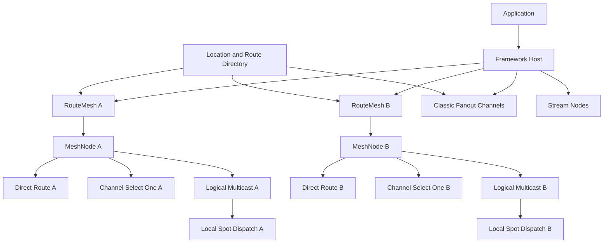

# ZLink Framework RouteMesh 메시징 통합 계획

## 0. 문서 상태와 목적

이 문서는 framework의 서버 간 네트워크 구성을 단순화하기 위한 **구현 전 계획**이다. 현재 공개
계약을 변경하지 않으며, 이 문서에 적힌 설명용 API 이름과 내부 구조는 정식 public contract가
아니다.

대상 독자는 Core·bindings·framework 10.0.0 전환을 설계하고 검증하는 개발자다. 이 문서는 “기존 기능을
어떤 목표 계약과 순서로 MeshNode에 통합하며, 각 단계의 완료를 무엇으로 증명하는가?”에 답한다. 문서를
작성·개정·검토할 때는
[`기술문서 작성 원칙`](../../../../doc/principal/documentation/documentation-principles.ko.md)을 반드시
적용한다. 이 문서는 미래 변경을 실행하기 위한 blueprint이므로 현재 checkout/10.0.0 계약 비교와 삭제 목록을 포함한다.
정식 spec에는 10.0.0 목표 계약을 구현보다 먼저 반영한다. guide와 internals는 구현 뒤 각 문서의 대상
독자에 맞는 사용법과 실제 구조를 반영하고, 실행 중 삭제 추적은 이 임시 plan에만 기록한다.

구현에 들어가기 전에 §21에서 확정한 방향을 exact 계약으로 옮기고 Core 10.0.0 목표 계약을
`core/doc/spec/core/`의 정식 owner 문서에 먼저 기록한다. 이어서
`framework/doc/framework/spec/`의 공통 목표 spec과
`framework/doc/framework/spec/server/languages/<lang>/`의 언어별 interface를 갱신한다. 현재 checkout
구현과 목표 계약의 차이는 implementation gap으로 기록하고 Core 구현, public header와 contract test를
정식 spec에 맞춘다.

전체 실행 순서, Codex agent와 Claude Fable 모델의 반복 검토 방법과 단계별 완료 증거는
[`RouteMesh 10.0.0 실행 진행표`](./route-mesh-10.0.0-execution-ledger.ko.md)를 따른다. 이 문서는 설계
근거와 목표 계약을 설명하고, 실행 진행표는 실제 완료 상태와 검증 증거를 관리한다.

MeshNode·Spot·Actor service runtime의 dispatch, mailbox, batch, claim, Actor transfer와 timer backend는
[`MeshNode·Spot·Actor framework 우선 dispatch 설계`](./mesh-node-framework-dispatch-design.ko.md)를 따른다.
이 문서에 남은 기존 callback·part recv 또는 Actor의 Spot callback 경유 설명과 충돌하면 해당 전용 설계가
우선한다. 정식 spec 변경 전에 두 문서의 중복 설명은 같은 의미로 정리한다.

이 계획의 목표는 socket 종류를 하나로 줄이는 것이 아니다. 사용자가 기능마다 endpoint와 peer
배선을 설계하지 않아도 되게 하고, framework가 기능의 의미에 맞는 내부 전송 경로를 선택하게 하는
것이 목표다.

중복 설명의 원본은 역할별로 나눈다. 전체 결정과 단계는 이 문서, Core 공개 API 전수 판정은
`mesh-node-core-api-review.ko.md`, service dispatch 내부 구조는
`mesh-node-framework-dispatch-design.ko.md`, 상태와 증거는 실행 진행표가 소유한다. 독자가 한 문서에서
판단을 끝내야 해 같은 내용을 반복하면 원본을 링크하고 S3 변경 동기화 목록에 포함한다.

### 0.1 현재 기준 자료

| 범위 | 현재 기준 |
|---|---|
| framework 제품 방향 | [`.NET overview`](../../framework/dotnet/guide/01-overview.ko.md) |
| 상호작용 모델 | [`02-interaction-model.ko.md`](../../framework/spec/02-interaction-model.ko.md) |
| channel topology | [`10-channel-topology.ko.md`](../../framework/spec/server/10-channel-topology.ko.md) |
| SPOT publish/subscribe 경계 | [`20-spot-messaging.ko.md`](../../framework/spec/server/20-spot-messaging.ko.md) |
| SpotNode 책임 | [`21-mesh-node.ko.md`](../../framework/spec/server/21-mesh-node.ko.md) |
| MeshNode Core API 전수 검토 | [`mesh-node-core-api-review.ko.md`](./mesh-node-core-api-review.ko.md) |
| framework 우선 service dispatch | [`mesh-node-framework-dispatch-design.ko.md`](./mesh-node-framework-dispatch-design.ko.md) |
| 구현·리뷰·배포 진행표 | [`route-mesh-10.0.0-execution-ledger.ko.md`](./route-mesh-10.0.0-execution-ledger.ko.md) |
| discovery와 auto-connect | [`40-location-runtime.ko.md`](../../framework/spec/server/40-location-runtime.ko.md) |
| 현재 core SpotNode runtime | [`spot_data_plane_runtime.cpp`](../../../../core/src/runtime/services/spot/data_plane/spot_data_plane_runtime.cpp) |
| 현재 ROUTER targeted send | [`router_send_path.cpp`](../../../../core/src/runtime/sockets/router/router_send_path.cpp) |
| 현재 Spot의 node-local topic dispatch | [`spot_node_pubsub_fanout.cpp`](../../../../core/src/runtime/services/spot/node/spot_node_pubsub_fanout.cpp) |
| 현재 native PUB topic fan-out | [`xpub.cpp`](../../../../core/src/runtime/sockets/pubsub/xpub.cpp) |
| POSD·DDD 검토 기준 | [`software-design-principles.ko.md`](../../../../doc/principal/software-design-principles.ko.md) |
| bindings local package 정책 | [`scripts/local-package/README.ko.md`](../../../../scripts/local-package/README.ko.md) |
| Core native release | [`.github/workflows/build.yml`](../../../../.github/workflows/build.yml) |
| Core Conan release | [`.github/workflows/core-conan-release.yml`](../../../../.github/workflows/core-conan-release.yml) |
| bindings release | [`.github/workflows/bindings-release.yml`](../../../../.github/workflows/bindings-release.yml) |

계획을 구현할 때는 이 문서의 과거 진술보다 작업 시점의 위 파일, public header, contract test와
package snapshot을 우선한다. 관련 정식 spec이 다른 작업으로 바뀌면 S0~S3에서 차이를 다시
대조한다.

### 0.2 10.0.0 일괄 전환 원칙

이 변경은 Core와 bindings의 major version을 `10.0.0`으로 올리면서 한 번에 적용한다. 폐기 대상 공개 API를
전달하는 alias, deprecated wrapper, 기존 topology와 새 topology를 동시에 실행하는 mode는 두지 않는다.
제거 대상으로 판정한 API는 header의 선언뿐 아니라 구현, adapter, test, sample, 문서, generated
snapshot과 bindings wrapper까지 같은 작업에서 삭제한다.

구현과 배포 순서는 다음과 같이 고정한다.

1. Core 정식 spec 적용 범위와 확정한 결정의 exact 계약을 고정한다.
2. Core 10.0.0 계약을 `core/doc/spec/core/`의 정식 owner 문서에 작성하고 현재 checkout과의 차이는
   이 디렉토리의 임시 실행 추적 문서에 기록한다.
3. framework 공통·언어별 정식 spec을 갱신하고 E2E·sample 영향을 검토한다.
4. Codex agent와 Claude Fable 모델이 문서를 독립 검토하고 둘 다 clean 판정을 낼 때까지 수정과
   재리뷰를 반복한다.
5. Core의 MeshNode 기능과 공개 C API를 구현하고 제거 대상 code와 file을 정리한 뒤 public header와
   test를 정식 spec에 맞춘다. 구현과 구조 test가 확정된 뒤 Core internals를 갱신한다.
6. 두 리뷰어가 Core의 누락·오류, POSD·DDD 리팩터링 요소와 dead code·file을 반복 검토한다.
7. 두 Core 리뷰가 clean이면 리뷰에 포함된 `10.0.0` version·ABI·release metadata를 변경하지 않고
   GitHub Actions로 순번 RC native artifact를 prerelease에 배포한다. stable tag와 Conan remote package는
   만들지 않는다.
8. RC artifact를 모든 bindings에 적용하고 같은 방식의 리뷰와 local package E2E smoke를 완료한다.
9. `.NET` framework, sample과 E2E를 적용하고 두 리뷰어 clean 판정까지 반복한다.
10. C++, Java/Kotlin과 Node.js를 격리된 lane에서 병렬 구현하고 lane별 두 리뷰를 병렬 반복한다.
11. 마지막 RC와 같은 commit을 Core 10.0.0 stable과 Conan remote에 공개하고 stable artifact로 downstream
    검증을 반복한다. 이어서 bindings를 언어별 배포 채널에 공개하고 package smoke를 수행한 뒤 전체 spec,
    source, package, sample, E2E와 release artifact를 최종 검토한다. 두 리뷰어가 모두 clean일 때 종료한다.

한 RouteMesh의 배포 단위는 전체 process다. 서로 다른 10.0.0 RC artifact를 같은 RouteMesh에서 함께
실행하지 않는다. 검증 실패 시 RouteMesh 전체를 마지막으로 검증한 10.0.0 RC artifact로 되돌린다.

## 1. 배경

현재 framework는 다음 기능을 각각 제공한다.

- client/server channel의 request와 send
- route mesh의 RID 지정 send와 request
- fanout channel의 일반 publish/subscribe
- SpotNode의 router와 topic publish/subscribe
- SPOT과 actor의 위치 기반 메시징
- 외부 client를 위한 STREAM session

기능은 하나의 framework에서 제공하지만 현재 설정은 topology마다 별도의 socket 역할, endpoint와
peer 연결을 선언한다. 사용자는 논리적인 channel, SPOT 또는 actor를 사용하면서도 물리적인
ClientServer, RouteMesh, Fanout, SpotMesh 배선을 함께 이해해야 한다.

논의 결과, 서버 간 직접 메시징과 SPOT의 위치 투명한 publish는 이름 있는 RouteMesh의 ROUTER full
mesh 위에서 제공하는 편이 의미에 더 잘 맞는다는 결론에 도달했다. SPOT publish는 원격
subscription을 이용해 수신 node를 고르는 일반 pub/sub가 아니다. 같은 RouteMesh에서 target
`ChannelName`의 준비된 node에 메시지를 한 번씩
전달하고, 각 node가 자신의 local subscription과 일치하는 SPOT을 선택하는 **Spot Logical
Multicast**다.

일반 fanout channel은 publisher와 subscriber만 연결하면 되며 모든 참여자가 대칭적인 full mesh를
구성할 필요가 없다. 이 기능은 native PUB/SUB socket model을 유지한다. 결과적으로 framework는
ROUTER와 PUB/SUB 두 socket model을 계속 사용하지만, 현재 SpotNode를 확장해 이름을 바꾸는 MeshNode는
ROUTER full mesh만 사용한다.

## 2. 문제 정의

### 2.1 사용자 관점의 문제

사용자는 다음 두 결정을 동시에 하고 있다.

1. 어떤 상호작용이 필요한가: request, send, publish, SPOT, actor 또는 STREAM
2. 그 기능을 어떤 socket과 endpoint 조합으로 배선할 것인가

첫 번째 결정은 application의 책임이지만 두 번째 결정은 framework가 흡수할 수 있는 transport
책임이다. 같은 기능을 사용하면서도 server마다 endpoint 수와 연결 방향을 반복해서 설정하면 다음
문제가 발생한다.

- channel 추가가 endpoint와 peer 설정의 추가로 이어진다.
- SPOT에서 일반 channel을 호출할 때 별도의 route bridge 또는 channel socket이 필요하다.
- 동일한 node identity, TLS, drain과 peer lifecycle 결정이 topology마다 반복된다.
- 설정은 정상이어도 한 topology의 peer 배선만 빠진 부분 구성이 만들어질 수 있다.
- framework가 연결과 위치 투명성을 제공한다는 설명과 실제 사용법 사이에 차이가 생긴다.

### 2.2 내부 구현의 문제

현재 SpotNode는 ROUTER mesh와 PUB/XSUB mesh를 별도로 관리한다. PUB/XSUB mesh는 원격 subscription
전파, subscription readiness, reconnect 뒤 재적용, topic endpoint와 별도 peer lifecycle을 요구한다.
현재 node-local dispatch는 이미 topic exact/prefix match 결과에 따라 같은 메시지를 일치하는 SPOT의
수신 경로로 전달한다.

SPOT publish의 원격 대상이 개별 subscriber node가 아니라 같은 multicast domain의 모든 준비된
node라면 원격 subscription 색인은 필요하지 않다. 호출 MeshNode가 target channel의 준비된 peer마다
한 번씩 routed message를 보내고, 수신 node가 node-local subscription만 검사하면 된다. 이 전송을 공개
`sendToNode()` 반복 호출로 구현하면 메시지 인코딩, target RID snapshot과 `NODROP` 적용이 호출자
쪽으로 노출된다. 따라서 core MeshNode가 multi-target routed send를 한 번의 publish로 처리하고,
기존 pipe HWM과 `NODROP` 의미를 조건부 local queue와 target pipe 전체에 적용해야 한다. 별도의 peer별
pending queue는 추가하지 않는다.

### 2.3 일반 fanout의 별도 요구

현재 SpotNode topic publish는 같은 mesh 범위의 node가 직접 연결된 상태를 전제로 한다. 반면 일반
fanout channel은 다음 구성이 가능해야 한다.

- publisher 하나와 subscriber 여러 개만 존재하는 구성
- subscriber 사이에 직접 연결이 필요하지 않은 구성
- request, SPOT 또는 actor 기능을 전혀 사용하지 않는 event 전용 process
- publisher와 subscriber의 수가 크게 다른 비대칭 구성

이런 process까지 RouteMesh 가입을 강제하면 선택한 기능보다 많은 연결과 lifecycle을 요구한다.
그러므로 classic fanout은 별도 기능으로 유지한다.

## 3. 목표와 제외 범위

### 3.1 목표

1. 사용자는 socket topology가 아니라 channel, SPOT, actor, fanout, STREAM 기능을 선택한다.
2. 각 RouteMesh는 독립된 ROUTER full mesh로 direct route와 Spot Logical Multicast를 제공한다.
3. 한 process는 필요하면 서로 독립된 RouteMesh 여러 개에 참여할 수 있다.
4. channel 대상 선택은 같은 RouteMesh 안의 `ChannelName`과 ready MeshNode 집합을 기준으로 수행한다.
5. 특정 node, SPOT 또는 actor 호출은 RID와 위치 정보를 사용해 같은 routed lane으로 전달한다.
6. classic fanout channel은 native PUB/SUB publisher/subscriber topology로 별도 유지한다.
7. fanout-only 또는 stream-only process에 RouteMesh 참여를 강제하지 않는다.
8. 기존 callback 안의 message call, handler와 dispatch 의미를 유지하고, 외부 DI client에는 mesh
   scope만 명시적으로 추가한다.
9. endpoint, peer discovery, reconnect, drain과 TLS 결정을 framework runtime 안으로 이동한다.
10. `.NET`, Java, Kotlin, Node.js와 C++ framework가 같은 공개 기능과 동작을 제공한다.

### 3.2 제외 범위

- classic fanout channel을 ROUTER 기반 multicast로 자동 전환하지 않는다.
- Spot Logical Multicast에 원격 subscription 전파, broker식 replay 또는 global ordering을 추가하지
  않는다.
- 서로 다른 RouteMesh 사이에 자동 forwarding 또는 transparent routing을 제공하지 않는다.
- STREAM을 RouteMesh에 포함하지 않는다.
- durable queue, replay, consumer group 또는 exactly-once delivery를 제공하지 않는다.
- Kafka, NATS나 Redis Streams 같은 broker를 대체한다고 설명하지 않는다.
- application에 peer RID 목록, subscription table 또는 socket 선택 policy를 노출하지 않는다.
- 제거하기로 확정한 기존 endpoint 기반 설정에 호환 wrapper나 이중 실행 mode를 남기지 않는다.
- framework 내부 변경을 샘플 전용 adapter나 raw-frame 우회로 구현하지 않는다.

## 4. 용어

| 용어 | 의미 |
|---|---|
| **RouteMesh** | 같은 이름과 보안·discovery 범위에 속한 MeshNode가 구성하는 독립 ROUTER full mesh |
| **MeshNode** | RouteMesh 하나에 참여하며 RID 하나와 immutable `ChannelName` 집합을 가지는 process-local runtime |
| **MeshName** | 서로 연결할 MeshNode 집합과 RID namespace를 구분하는 물리 연결망 이름 |
| **ChannelName** | 같은 RouteMesh 안에서 `selectOne`과 `selectMany`의 RID 집합을 구분하는 논리 이름 |
| **Routed Lane** | RID 하나를 대상으로 send/request/reply를 전달하는 ROUTER 기반 경로 |
| **Spot Logical Multicast** | origin이 multicast domain의 준비된 node마다 한 번 전달하고, 각 node가 local subscription과 일치하는 SPOT을 선택하는 배포 방식 |
| **Multicast Domain** | 같은 RouteMesh 안에서 지정한 `ChannelName`에 속한 준비된 MeshNode 범위 |
| **Local Subscription** | 한 node 안에서 topic과 수신 SPOT의 관계를 나타내는 등록 정보. 원격 node로 전파하지 않는다 |
| **Spot Dispatch** | 수신 node가 local subscription을 검사해 일치하는 SPOT에 메시지를 전달하는 단계 |
| **Classic Fanout Channel** | publisher endpoint를 subscriber가 발견해 연결하는 비대칭 PUB/SUB 경로 |
| **Mesh Member** | 같은 `MeshName`과 보안 정책 아래 full mesh 연결에 참여하는 MeshNode |
| **Channel Set** | 특정 `ChannelName` membership을 포함하며 현재 선택 가능한 MeshNode RID 집합 |
| **Endpoint Bundle** | `MeshName`, `ChannelName` 집합, RID, ROUTER endpoint와 제어 정보를 함께 게시하는 연결 정보 |

`MeshName`은 물리 연결망을 구분하고 `ChannelName`은 그 안의 논리 선택 집합을 구분한다. 두 이름을
합치지 않으며 새 10.0.0 계약 등록 API에서는 둘 다 명시한다.
`MeshNode`는 ROUTER 전송만 담당하는 객체가 아니다. RouteMesh membership와 RID를 가지면서 channel
messaging, Spot, actor와 Spot Logical Multicast를 함께 제공하는 실행 단위다. ROUTER는 내부 연결
방식이므로 참여 실행 단위의 public 이름에 `Route`를 넣지 않는다.
`local Spot queue`는 node-local dispatch의 현재 구현을 설명할 때만 사용하는 내부 용어다. 공개 계약과
guide에서는 동작의 의미를 나타내는 `Spot Logical Multicast`를 사용한다.

## 5. 확정한 설계 결정

다음 항목은 이번 논의에서 확정한 방향이다. 구현 단계에서 편의상 반대 구조를 추가하지 않는다.

### F-01 사용자는 기능을 선택한다

사용자는 request, send, fanout, SPOT, actor와 STREAM 가운데 필요한 기능을 등록한다. ROUTER, PUB,
SUB, connect 방향과 peer endpoint 조합은 runtime이 결정한다.

### F-02 RouteMesh는 ROUTER socket model만 사용한다

MeshNode는 자신이 속한 RouteMesh에 ROUTER socket 하나로 참여한다. direct route와 Spot Logical
Multicast는 같은 peer membership와 connection을 사용한다. 각 MeshNode의 ROUTER는 같은
`MeshName`의 다른 모든 MeshNode와 pipe를 구성한다. native PUB/SUB socket은 MeshNode 내부에
추가하지 않는다.

### F-03 routed 기능은 하나의 lane으로 수렴한다

다음 기능은 같은 routed lane을 사용한다.

- 특정 node RID를 대상으로 하는 direct send/request
- `ChannelName`으로 MeshNode 하나를 선택하는 send/request
- SPOT handle이 가리키는 owner node 호출
- actor location이 가리키는 owner node 호출
- 지정한 `ChannelName`의 준비된 peer 전체를 대상으로 하는 Spot Logical Multicast
- reply와 framework 내부 correlation 반환 경로

기존 ClientServer와 RouteMeshChannel은 각각 별도 socket을 요구하는 topology로 유지하지 않는다.
`selectNode(targetRid)`, `selectOne(channelName)`과 `selectMany(channelName, topic)`은 같은 MeshNode
runtime이 send, request와 publish를 제출하는 과정에서 처리하는 내부 선택 의미다. RID 또는 RID 배열만
반환하는 공개 select API는 제공하지 않는다.

`selectMany(channelName, topic)`은 target channel의 다른 origin MeshNode를 먼저 선택하지 않는다.
호출한 MeshNode가 자신의 channel index에서 target `ChannelName`의 ready member를 직접 snapshot하고
한 번의 Core publish로 제출한다. 호출한 MeshNode의 membership set에 target `ChannelName`이 포함될 때만 node-local
Spot dispatch를 대상에 포함한다.

### F-04 Spot publish는 Logical Multicast다

호출 MeshNode는 지정한 `ChannelName`의 준비된 remote MeshNode마다 한 번씩 routed message를 보낸다.
호출 MeshNode의 membership set에 target channel이 포함될 때만 node-local dispatch도 대상에 포함한다. 수신 node는 local
subscription의 topic exact/prefix match 결과에 따라 SPOT을 선택한다. remote node는 이 메시지를
다른 node로 다시 전달하지 않는다. local
subscription은 node 밖으로 전파하지 않으며, 연결 복구 전의 publish를 replay하지 않는다.

### F-05 classic fanout은 별도 topology로 유지한다

`AddFanoutChannel(...)` 계열은 native PUB/SUB publisher/subscriber topology를 유지한다. subscriber는 해당
fanout channel의 publisher endpoint만 발견해 연결한다. subscriber 사이 또는 publisher 사이에 full
mesh를 구성하지 않는다.

### F-06 두 publish 표면의 의미를 합치지 않는다

| 표면 | 대상 선택 | topic 의미 |
|---|---|---|
| Spot Logical Multicast | 같은 RouteMesh에서 `ChannelName`이 일치하는 ready MeshNode 전체, 이후 일치하는 local SPOT | node-local SPOT 선택 키 |
| Classic Fanout Channel | fanout channel subscriber 전부 | publish context 또는 payload의 application 정보 |

기존 channel fanout에 topic 기반 transport filtering을 추가하지 않는다. 이것이 필요하면 별도 public
contract 확장으로 검토한다.

### F-07 MeshNode identity는 단순한 불변식으로 고정한다

MeshNode 하나는 `MeshName` 하나, RID 하나와 ROUTER endpoint 하나를 가지며 `ChannelName`은 immutable
set으로 게시한다. 모든 membership은 startup 전에 설정하고 실행 중에는 추가하거나 바꾸지 않는다. 같은
process에는 `MeshName`당 MeshNode를 하나만 등록하며 중복 등록은 startup validation에서 실패한다. 같은
process가 여러 server channel 역할을 제공할 때는 물리 MeshNode를 늘리지 않고 하나의 MeshNode에 여러
`ChannelName`을 등록한다. fanout-only 또는 stream-only process는 RouteMesh에 참여하지 않아도 되며, 한
process가 서로 다른 `MeshName`의 MeshNode와 classic fanout을 함께 사용할 수 있다.

### F-08 전송 경로를 실행 중에 자동 교체하지 않는다

같은 RouteMesh에 publisher와 subscriber가 있다는 이유로 classic fanout을 Spot Logical Multicast로 자동
전환하지 않는다. 같은 public call이 배치 상태에 따라 다른 readiness, backpressure와 복구 의미를
가지면 운영 예측 가능성이 낮아지기 때문이다.

### F-09 STREAM은 별도 경계다

STREAM은 외부 client connection과 session lifecycle을 소유한다. RouteMesh나 classic fanout에
포함하지 않는다.

### F-10 구현 상세와 사용자 개념을 분리한다

guide는 기능과 membership 범위를 설명한다. Spot publish는 `Logical Multicast`라는 동작으로
설명하고 local queue나 내부 frame은 노출하지 않는다. socket 배선, peer 연결 방향, 내부 endpoint와
protocol frame은 internals 문서가 설명한다. 사용자는 RouteMesh가 대칭적인 server membership이라는
점과 classic fanout이 publisher/subscriber 관계라는 점은 이해해야 하지만, socket별 connect 순서를
직접 구성하지 않는다.

guide의 첫 설명에서는 RouteMesh를 rail network, MeshNode를 station에 비유할 수 있다. `Rail`과
`RailStation`은 이해를 돕는 비유로만 사용하고 public type과 method 이름에는 사용하지 않는다.

## 6. 검토한 대안

### 6.1 대안 A — 기능별 topology 유지

ClientServer, RouteMesh, Fanout과 SpotMesh가 각각 socket과 endpoint를 계속 소유한다.

장점:

- 현재 구현과 공개 설정의 변경이 가장 적다.
- traffic class와 장애 범위가 topology마다 분리된다.
- 각 socket pattern을 이미 이해하는 사용자는 배선을 예상하기 쉽다.

단점:

- channel 수와 기능 수가 늘수록 endpoint와 peer 설정이 증가한다.
- SPOT에서 다른 channel을 호출하기 위한 bridge와 attachment가 계속 필요하다.
- node identity, discovery, drain과 TLS 정책이 여러 runtime에 반복된다.
- framework가 물리 연결 결정을 충분히 흡수하지 못한다.

판정: 목표를 충족하지 못하므로 선택하지 않는다. 해당 topology의 등록 API와 runtime은 10.0.0
전환 작업에서 제거한다.

### 6.2 대안 B — ROUTER full mesh와 Spot Logical Multicast

MeshNode는 RouteMesh별 ROUTER full mesh를 사용한다. direct route는 RID 하나를 선택하고 channel
messaging은 `ChannelName`으로 RID 하나 또는 RID 집합을 선택한다. Spot Logical Multicast는 선택한
channel 집합을 snapshot한 뒤 각 remote member에 한 번씩 전달한다. 각 node의 subscription은
node-local dispatch에만 사용한다. Classic Fanout Channel은 native PUB/SUB로 유지한다.

장점:

- SpotNode의 중복 full mesh와 topic endpoint를 제거할 수 있다.
- RouteMesh별 node identity, TLS와 reconnect를 하나의 socket 경로에 모을 수 있다.
- direct, select-one과 select-many를 `RID`와 `ChannelName` 두 index로 설명할 수 있다.
- 원격 subscription 전파와 readiness handshake가 필요하지 않다.

단점:

- 조건부 local queue와 여러 target pipe에 기존 `NODROP` 의미를 일관되게 적용해야 한다.
- request/reply와 대량 publish가 같은 queue와 connection을 공유한다.
- 메시지 공유, multipart 원자성과 local queue·target pipe 전체의 send readiness 확인을 MeshNode 내부에서
  해결해야 한다.
- 현재 PUB/XSUB 경로가 전달하는 bootstrap과 제어 메시지를 ROUTER 경로로 옮겨야 한다.

판정: **선택한 목표 구조다.** 구현은 public routed-send 반복이 아니라 core MeshNode 내부의
multi-target send로 제공한다. 배압과 손실 허용은 별도 queue나 새 정책을 만들지 않고 기존
`ZLINK_PUB_OPT_NODROP` 계약을 따른다.

### 6.3 대안 C — Classic Fanout까지 ROUTER로 통합

Spot Logical Multicast뿐 아니라 일반 fanout channel도 ROUTER 위의 subscriber registry와
multi-target send로 구현한다.

장점:

- socket model을 가장 적게 사용할 수 있다.
- node identity와 보안 설정을 하나의 연결 방식으로 모을 수 있다.

단점:

- fanout-only process에도 RouteMesh membership 또는 별도 subscriber routing registry가 필요하다.
- native PUB/SUB의 비대칭 topology와 subscription filtering을 다시 구현해야 한다.
- Spot의 위치 투명한 multicast와 일반 event fanout의 서로 다른 의미가 하나의 내부 계약에 섞인다.

판정: 선택하지 않는다. Classic Fanout Channel은 native PUB/SUB가 더 깊고 단순한 모듈 경계를
제공한다.

## 7. 목표 구조



각 RouteMesh는 같은 `MeshName`으로 게시된 ready MeshNode만 연결한다. 서로 다른 RouteMesh 사이에는
core나 framework가 메시지를 자동 전달하지 않는다. 두 mesh에 참여한 소수 process가 필요하면 각
mesh에 MeshNode를 하나씩 등록하고 application handler가 명시적으로 메시지를 변환해 전달한다.
transparent bridge, 자동 relay와 loop 방지 protocol은 이 계획에 포함하지 않는다.

direct route는 같은 RouteMesh에서 RID 하나를 선택한다. `selectOne(channelName)`은 channel index에서
RID 하나를 선택하고 Spot Logical Multicast의 `selectMany(channelName, topic)`은 publish 시점의 ready
RID 집합을 대상으로 한다. remote subscription은 directory에 게시하지 않는다. 외부 publisher도
process-local MeshNode에 target channel을 전달해 같은 direct select-many 경로를 사용한다.

Classic fanout은 같은 directory를 사용할 수 있지만 별도의 publisher/subscriber row와
연결 방향을 유지한다. 같은 directory를 사용한다는 것은 같은 full mesh에 참여한다는 뜻이 아니다.

## 8. 메시지 선택 모델

### 8.1 특정 node 선택

개념적인 `selectNode(targetRid)`는 현재 RouteMesh에서 target RID의 pipe를 선택한다. application public
API는 상태 대상 호출에 raw RID를 기본으로 요구하지 않는다. SPOT과 actor는 handle 또는 location
resolver가 owner RID를 제공하고 framework가 내부에서 node를 선택한다.

필수 동작:

- RID가 현재 연결되어 있고 요청 수락 상태이면 전송한다.
- drain 중인 node는 새 select-one 대상에서 제외한다.
- 명시적으로 선택한 RID가 없거나 연결되지 않았으면 임의의 다른 node로 보내지 않는다.
- one-way send의 전달 여부가 불확실한 경우 자동 재전송하지 않는다.
- request는 기존 correlation, timeout과 안전한 재시도 계약을 유지한다.

### 8.2 channel MeshNode 하나 선택

개념적인 `selectOne(channelName)`은 다음 순서로 처리한다.

1. 현재 RouteMesh의 channel index에서 `ChannelName`이 같은 RID 집합을 읽는다.
2. terminal, disconnected와 drain weight 0인 MeshNode를 제외한다.
3. node weight와 선택 policy에 따라 하나를 고른다.
4. 같은 routed lane에서 선택한 RID로 메시지를 전송한다.

초기 기본 policy는 기존 client/server channel의 관찰 가능한 분배 의미를 유지한다. 동일 weight
MeshNode 사이의 round-robin cursor는 core RouteMesh runtime이 소유한다. 호출자가 RID 목록을
직접 순회하거나 selection cursor를 관리하지 않는다.

### 8.3 channel publish

Classic Fanout Channel publish는 RouteMesh의 `selectMany`로 구현하지 않는다. 해당 fanout channel의
PUB socket과 subscriber connection 집합을 사용한다. 모든 subscriber가 packet을 받고, packet name으로
handler를 찾는다. topic 값이 있으면 publish context 또는 payload로 전달되며 transport 대상 선택에는
사용하지 않는다.

### 8.4 Spot Logical Multicast

SPOT publish는 topic으로 remote node를 선택하지 않는다. publish를 호출한 MeshNode는 명시한 target
`ChannelName`의 ready RID 집합을 자신의 channel index에서 직접 snapshot한다. 다른 origin MeshNode를
먼저 선택하는 중계 hop은 두지 않는다. 호출한 MeshNode의 membership set에 target `ChannelName`이 있을 때만 local
subscription match 결과를 대상에 포함하고, 각 remote target member에는 routed message를 한 번씩
전송한다. 수신 node는 topic exact/prefix match를 node-local subscription에 적용해 일치하는 SPOT을
선택한다. publisher application은 수신 RID 목록을 알지 않는다. 현재 SPOT에서 호출하는
`Publish(channelName, topic, message)`도 target `ChannelName`을 명시한다.

필수 동작:

- local subscription 등록 전 또는 peer readiness 이전 publish를 나중에 replay하지 않는다.
- topic과 packet name을 서로 다른 dispatch key로 유지한다.
- local subscriber와 remote subscriber의 공개 처리 의미를 같게 유지한다.
- remote node는 수신한 multicast를 다른 node로 다시 전달하지 않는다.
- 한 번 인코딩한 immutable message를 peer 전송과 local dispatch가 안전하게 공유한다.
- `NODROP=1`을 기본값으로 사용한다. target snapshot과 local match를 먼저 계산하고 local queue와 모든
  remote pipe가 수용 가능한지 확인한 뒤 하나의 원자적 commit으로 제출한다.
- multicast admission과 commit은 MeshNode outbound owner에서 다른 submit 및 peer-state 전이와
  직렬화한다. admission 뒤 commit 전에 target 집합을 축소하거나 일부 대상부터 제출하지 않는다.
- `NODROP=0`이면 HWM에 도달한 개별 local queue 또는 remote pipe에는 조용히 drop하고 나머지 writable
  대상에는 전달한다.
- node별 local subscription 상태와 관계없이 target `ChannelName`의 ready member 전체에 전달한다.

### 8.5 SPOT과 actor 선택

SPOT과 actor 호출은 location resolver가 제공하는 owner RID와 logical target address를 함께 사용한다.
routed lane은 node까지 전달하고, 대상 node의 SPOT/actor dispatcher가 logical target을 선택한다.

위치 정보가 바뀌어도 application이 endpoint 또는 router socket을 다시 선택하지 않는다. address
refresh, handoff ordering, stale owner 처리와 안전한 request 재시도는 기존 SPOT/actor 계약을
유지한다.

## 9. Spot Logical Multicast와 Classic Fanout의 경계

### 9.1 Spot Logical Multicast

적합한 사용:

- 같은 RouteMesh의 target channel에 참여한 node 사이의 상태 event
- room, stage, zone 같은 SPOT channel 내부 배포
- actor 또는 SPOT lifecycle과 같은 node identity를 공유해야 하는 event
- 위치와 관계없이 같은 logical group의 SPOT에 event를 전달해야 하는 경우

특성:

- RouteMesh membership가 선행 조건이다.
- target `ChannelName`의 모든 준비된 member가 routed message를 한 번 수신한다.
- topic subscription은 각 node 안에서 수신 SPOT을 선택하는 데만 사용한다.
- remote relay와 replay를 제공하지 않는다.
- direct route와 ROUTER connection, node identity, TLS와 lifecycle을 공유한다.

### 9.2 Classic Fanout Channel

적합한 사용:

- publisher와 subscriber 역할만 필요한 domain event
- subscriber 사이에 직접 연결이 필요하지 않은 경우
- fanout-only process를 운영하는 경우
- publisher endpoint 집합을 subscriber가 발견하면 충분한 경우

특성:

- RouteMesh membership가 필요하지 않다.
- publisher가 endpoint를 게시하고 subscriber가 해당 endpoint를 연결한다.
- subscriber는 fanout channel의 packet을 전량 수신한다.
- topic은 transport filter가 아니라 application context다.
- 영속성 또는 replay가 필요하면 외부 broker를 사용한다.

### 9.3 두 모델을 동시에 사용하는 host

한 host는 여러 RouteMesh와 여러 Classic Fanout Channel을 함께 등록할 수 있다. runtime은 lifecycle과
관측을 한 framework host에서 통합하지만, RouteMesh별 ROUTER 상태와 fanout PUB/SUB 상태를
혼합하지 않는다.

같은 packet type을 두 표면에 등록할 수 있는지는 기존 handler exposure와 duplicate registration
계약을 따른다. 동일한 public call을 runtime 상태에 따라 다른 pub/sub model로 전환하지 않는다.

## 10. RouteMesh membership와 channel index

### 10.1 node identity

각 MeshNode는 자신이 속한 RouteMesh 안에서 유일한 routing ID를 가진다. 서로 다른 RouteMesh는 RID
namespace를 공유하지 않아도 된다. RouteMesh 밖에서 사용하는 Spot/actor handle과 mesh-scoped client는
`MeshName`을 함께 보관해 어느 ROUTER runtime을 사용할지 결정한다. 같은 mesh에서 같은 RID로 새로운
endpoint가 게시될 때 기존 node를 즉시 덮어쓰지 않고 duplicate-RID, lease, endpoint replacement와
drain 계약을 적용한다.

한 process의 registration key는 `MeshName`이며 같은 이름의 MeshNode는 하나만 존재할 수 있다. 따라서
process-local client lookup도 `MeshName` 하나로 모호하지 않다. 같은 이름으로 두 번째 MeshNode를
등록해야 하는 요구가 생기면 channel alias로 우회하지 않고 별도 public contract로 다시 설계한다.

node descriptor에는 최소한 다음 정보가 필요하다.

| 정보 | 목적 |
|---|---|
| mesh name | 서로 직접 연결할 MeshNode 집합과 RID namespace 구분 |
| channel memberships | `selectOne`과 `selectMany`가 사용할 immutable name set과 현재 per-channel weight |
| node RID | routed lane 대상 선택 |
| routed endpoint | ROUTER peer 연결 |
| descriptor generation | endpoint와 lifecycle 변경의 순서 판정 |
| lifecycle state | 모든 channel의 select-one 대상 제외 및 MeshNode drain |
| protocol version | 10.0.0 wire contract 일치 여부 판정 |
| 보안 profile identity | TLS와 admission policy 일치 확인 |

정확한 location row 형식과 versioning은 S0 결정과 S2 framework spec에서 확정한다.

### 10.2 ChannelName 불변식

MeshNode descriptor의 immutable `ChannelName` set 자체가 channel membership다. 별도 endpoint나 socket을
membership마다 만들지 않으며 같은 이름의 중복 membership은 startup 오류다. 모든 `ChannelName`은 bind와
descriptor 게시 전에 설정하며 runtime에서 추가하거나 제거하지 않는다. 변경이 필요하면 기존 MeshNode를
drain하고 새 RID 또는 새 generation의 MeshNode를 등록한다.

SPOT과 actor의 위치 row는 logical object의 현재 owner를 나타내므로 MeshNode descriptor와 별도로
유지한다. Classic Fanout Channel과 STREAM도 RouteMesh membership가 아니므로 각자의 discovery row를
유지한다.

### 10.3 연결 상태와 선택 상태의 분리

directory에 row가 존재하는 것과 socket이 ready인 것은 다른 상태다. select-one은 다음 상태를 함께
확인해야 한다.

- `MeshName`과 `ChannelName`이 현재 client scope와 일치한다.
- routed connection이 ready다.
- MeshNode weight가 0보다 크다.
- protocol version이 10.0.0이고 security profile identity가 정확히 일치한다.

directory row만 보고 request를 제출하거나, socket ready만 보고 이미 lease가 끝난 MeshNode를 계속
선택하지 않는다.

### 10.4 연결 방향

같은 `MeshName`의 두 MeshNode가 모두 routed endpoint를 게시하면 pairwise initiator 규칙으로 한쪽만
connect한다. 다른 `MeshName`의 descriptor에는 연결하지 않는다. 모든 MeshNode는 ROUTER endpoint를
게시하며, 하나의 planner가 같은 mesh의 pairwise 연결 방향을 소유한다.

Spot Logical Multicast는 별도 연결 방향을 만들지 않는다. routed connection planner가 만든 준비된 peer
집합이 multicast 대상 집합이다. local subscription의 추가와 제거는 peer connection을 변경하지
않는다.

## 11. Socket과 endpoint 모델

### 11.1 routed lane

- MeshNode마다 ROUTER socket 하나를 사용한다.
- 하나의 socket이 remote node RID별 pipe를 관리한다.
- channel마다 별도 ROUTER socket을 만들지 않는다.
- `selectOne(channelName)` 결과는 같은 RouteMesh 안의 target RID다.
- 한 process가 RouteMesh 두 개에 참여하면 MeshNode와 ROUTER socket도 두 개이며 상태를 공유하지
  않는다.
- request/reply, send, SPOT, actor와 logical multicast frame을 구분하는 envelope를 유지한다.
- traffic별 queue, priority 또는 admission 분리가 필요하면 socket을 다시 늘리기 전에 측정과 별도
  core 설계를 거친다.

### 11.2 Spot Logical Multicast runtime

- MeshNode는 multicast를 위해 PUB, XSUB 또는 별도 peer connection을 만들지 않는다.
- local subscription registry는 해당 node의 SPOT과 topic 관계만 보관한다.
- publish는 immutable message를 한 번 만들고 대상 channel에 포함되는 local dispatch와 remote peer
  전송이 안전하게 공유한다.
- origin은 target `ChannelName`의 준비된 peer RID를 snapshot해 내부 multi-target routed send에
  제출한다.
- 별도의 peer별 pending queue를 만들지 않고 ROUTER가 이미 소유한 RID별 pipe와 HWM을 사용한다.
- `NODROP=1`에서는 target snapshot과 local match를 먼저 고정한다. 대상 local queue와 remote pipe 중
  하나라도 HWM에 도달하면 어느 대상에도 제출하지 않고 backpressure를 반환한다. blocking publish는
  `SNDTIMEO`까지 기다리고 `DONTWAIT` publish는 즉시 `BACKPRESSURED`를 반환한다.
- 수용 가능성 확인과 전체 제출은 MeshNode outbound owner 안에서 다른 submit 및 peer-state 전이와
  직렬화한 하나의 admission/commit으로 처리한다. commit 뒤 실제 연결이 끊어져도 이미 성공한
  publish가 remote 수신을 보장하는 것으로 의미를 확대하지 않는다.
- `NODROP=0`에서는 HWM에 도달한 개별 local queue 또는 remote pipe의 메시지를 조용히 버리고 writable
  대상에는 제출한다.
- publish 성공은 선택한 정책에 따라 local dispatch와 target pipe가 메시지를 받아들였다는 뜻이다.
  remote node의 수신 또는 SPOT handler 처리를 보장하지 않는다.
- remote receiver는 local dispatch만 수행하며 같은 multicast를 다시 전송하지 않는다.
- remote subscription readiness를 기다리지 않으며 단절 중 메시지를 replay하지 않는다.
- 같은 origin MeshNode에서 같은 destination mailbox 또는 remote RID로 성공한 publish는 outbound commit
  순서대로 관찰된다. multicast의 각 destination은 이 FIFO를 독립적으로 보존한다. 서로 다른 origin이나
  destination 사이의 global ordering은 제공하지 않으며, `NODROP=0`으로 버린 메시지는 순서에 빈 구간을
  만들 수 있다.

### 11.3 classic fanout PUB/SUB

- fanout channel별 publisher와 subscriber socket lifecycle은 유지한다.
- publisher 역할을 가진 process만 public publisher endpoint를 게시한다.
- subscriber는 같은 channel의 publisher endpoint 집합만 연결한다.
- fanout-only process는 routed endpoint를 만들지 않아야 한다.
- 여러 fanout channel의 socket 공유는 이 계획의 필수 목표가 아니다. 공유하려면 packet namespace,
  HWM과 lifecycle 격리 계약을 별도로 설계한다.

### 11.4 endpoint bundle

사용자에게 routed endpoint를 channel 기능마다 입력하게 하지 않는다. MeshNode가 ROUTER endpoint를
한 번 구성하고, runtime이 `MeshName`, immutable `ChannelName` set, RID와 실제 resolved endpoint를 directory에
게시한다.
Classic Fanout Channel과 STREAM endpoint는 각 기능의 비대칭 연결 경계를 나타내므로 별도로 유지한다.

현재 PUB/XSUB mesh가 bootstrap descriptor와 routed endpoint 교환에도 사용되므로 socket만 먼저
제거해서는 안 된다. 해당 제어 메시지는 location descriptor 또는 ROUTER control envelope로 옮긴 뒤
PUB/XSUB runtime을 제거한다. 운영 환경의 명시적 ROUTER port와 개발 환경의 port 0 사용 범위는
S1 Core 정식 spec과 S2 framework spec의 endpoint contract에서 확정한다.

## 12. 공개 인터페이스 현재 checkout와 10.0.0 계약

이 절의 현재 checkout는 현재 `core/include/zlink/service/spot.h`와 `.NET framework`의
`Contracts/Configuration/Builders.cs`에서 확인한 공개 이름을 사용한다. 10.0.0 계약는 이 계획이 추천하는
목표 interface다. 아직 정식 계약이 아니며 S1·S2에서 Core spec과 `.NET` interface 문서에 먼저
고정한 뒤 구현한다. 다른 framework 언어의 exact signature도 S2에서 `.NET` 계약과 공통 spec을
기준으로 정식 문서에 고정한다.

Core API는 node 이름이 있는 함수만 검토해서는 안 된다. Spot facade, actor, STREAM–actor 연결,
공통 option, callback, send-ready와 poller까지 포함한 전수 인벤토리와 symbol별 판정은
[`MeshNode Core 공개 API 전환 검토`](./mesh-node-core-api-review.ko.md)에서 관리한다. 이 절은 전체
framework 계획을 이해하는 데 필요한 요약만 유지한다.

### 12.1 core C API 현재 checkout

| 범위 | 현재 interface | 현재 의미 |
|---|---|---|
| node mode | `zlink_spot_node_mode_t`의 `PUBSUB`, `ROUTED`, `ALL` | SpotNode가 만들 socket plane을 선택 |
| routed bind | `zlink_spot_node_set_router_bind(...)` | ROUTER ingress endpoint 설정 |
| pub/sub bind | `zlink_spot_node_set_pub_bind(...)` | Spot mesh PUB/SUB endpoint 설정 |
| pub/sub identity | `zlink_spot_node_set_pub_routing_id(...)`, `zlink_spot_node_set_sub_routing_id(...)` | 내부 PUB/SUB socket identity 설정 |
| peer 연결 | `zlink_spot_node_connect_peer(...)`, `zlink_spot_node_connect_peer_rid(...)` | PUB/SUB peer endpoint와 routed RID 연결에 함께 사용 |
| Spot publish | `zlink_spot_node_publisher_new(...)`, `zlink_spot_node_publisher_publish(...)` | SpotNode topic plane으로 publish |
| Spot·actor | `zlink_spot_node_spot_*`, `zlink_spot_node_actor_*`, `zlink_remote_actor_get_ref(...)` | node-local Spot과 actor registry, route와 session 연결 |
| route bridge | `zlink_spot_route_bridge_*` | 별도 ROUTER channel과 SpotNode 사이 message 변환 |
| 수신 callback | Spot에는 `zlink_spot_dispatch_event_handler(...)`가 있으나 SpotNode에는 대응 API가 없음 | node-target message를 framework handler로 전달할 공개 경로가 없음 |
| 공통 handle | option, routing ID, TLS, send-ready와 `zlink_poller_*` | 함수 이름에는 node가 없지만 SpotNode handle을 분기 처리 |
| 배압 설정 | `ZLINK_SPOT_NODE_OPT_ROUTER_*`, `ZLINK_SPOT_NODE_OPT_PUBSUB_*` | ROUTER와 PUB/SUB HWM을 별도 설정 |
| 상태 조회 | `zlink_spot_node_status(...)`, `zlink_spot_node_peers(...)`, `zlink_spot_node_subjects(...)` | 두 plane의 endpoint, peer와 subject 상태를 조회 |

### 12.2 core C API 10.0.0 계약

| 현재 checkout | 10.0.0 계약 | 처리 |
|---|---|---|
| `zlink_spot_node_*` type과 함수 | `zlink_mesh_node_*` 계열 | SPOT보다 큰 runtime 책임을 나타내도록 MeshNode로 이름을 바꾼다 |
| `PUBSUB`, `ROUTED`, `ALL` mode | MeshNode는 ROUTER 기반 단일 동작 | 10.0.0에서 mode type, option과 분기 구현을 함께 제거한다 |
| `zlink_spot_node_set_router_bind(...)` | `zlink_mesh_node_set_bind(...)` 후보 | MeshNode의 유일한 network bind가 된다 |
| `zlink_spot_node_set_pub_bind(...)` | 없음 | 10.0.0에서 선언과 구현을 제거한다 |
| pub/sub routing-id 두 함수 | 없음 | 내부 PUB/SUB socket과 함께 제거한다 |
| endpoint만 받는 `connect_peer(...)` | peer RID, immutable `ChannelName` set과 endpoint를 받는 MeshNode peer descriptor | RID pipe와 channel index를 한 번에 갱신한다 |
| channel별 service router 선택 | MeshNode의 `selectOne(channelName)` | 같은 RouteMesh의 ready RID 집합과 round-robin cursor를 core가 소유한다 |
| SpotNode가 소유하는 Spot·actor API | MeshNode가 소유하는 같은 Spot·actor API | Spot과 actor 개념은 유지하고 node owner가 드러나는 symbol만 `zlink_mesh_node_*`로 바꾼다 |
| `zlink_remote_actor_get_ref(...)` | `zlink_mesh_node_remote_actor_get_ref(...)` 후보 | node handle을 받는 사실이 이름에 드러나게 한다 |
| `zlink_spot_route_bridge_*` | 없음 | MeshNode가 channel, node와 Spot ingress를 직접 처리하므로 10.0.0에서 선언과 구현을 제거한다 |
| SpotNode node-target callback 없음 | MeshNode ready callback, claim과 batch API | Node·Spot·Actor mailbox를 분리하고 callback은 공통 wakeup만 담당한다 |
| `zlink_spot_node_publisher_publish(...)` | target `ChannelName`을 받는 `zlink_mesh_node_publisher_publish(...)` 후보 | Core가 target channel의 ready member를 직접 선택해 Logical Multicast한다 |
| publisher의 `ZLINK_PUB_OPT_NODROP` | 같은 `ZLINK_PUB_OPT_NODROP` | Logical Multicast에도 같은 의미로 적용하며 기본값은 `1`이다 |
| PUB socket의 `ZLINK_OPT_SNDHWM`, `ZLINK_OPT_SNDTIMEO` | MeshNode ROUTER의 같은 공통 socket option | 별도 multicast queue option을 추가하지 않고 RID별 pipe HWM과 send timeout을 사용한다 |
| PUB/SUB 중심 상태 필드 | routed endpoint, ready peer, multicast submit·drop 중심의 versioned status/query | 기존 ABI를 재사용하지 않고 size와 version field가 있는 MeshNode 구조로 새로 정의해 구현 뒤 정식 spec으로 승격한다 |

MeshNode options에는 `MeshName`을 기록하고 startup 전 membership API로 하나 이상의 `ChannelName`을
추가한다. `MeshName`은 peer admission과 상태 관측에 사용하고 immutable `ChannelName` set은
select-one/select-many index에 사용한다. start 뒤 membership 변경 API는 제공하지 않는다.

publish API는 호출자에게 peer RID 배열을 받지 않는다. core MeshNode가 target channel의 ready peer
snapshot, local dispatch와 `NODROP` 적용을 소유해야 한다. `zlink_send_to_rid(...)` 같은 단일 대상
API를 framework가 반복 호출하는 구현은 10.0.0 계약가 아니다. `NODROP=1`이 기본이며, 호출자가 명시적으로
`0`을 설정한 경우에만 HWM에 도달한 대상의 메시지를 조용히 버릴 수 있다.

core 사용 흐름은 다음처럼 바뀐다. 이 코드는 interface 차이를 보여 주기 위한 예시다. `zlink_mesh_node_*`
이름과 versioned ABI 방향은 D-17에서 확정했으며 exact parameter와 result signature는 Core 정식 spec이 소유한다.

```c
/* 현재 checkout: one SpotNode configures both routed and PUB/SUB endpoints. */
void *node = zlink_spot_node_new(ctx, &all_mode_options);
zlink_spot_node_set_router_bind(node, "tcp://0.0.0.0:7300");
zlink_spot_node_set_pub_bind(node, "tcp://0.0.0.0:7301");

/* 10.0.0 계약: one MeshNode has one mesh, an immutable channel set, RID, and ROUTER endpoint. */
zlink_mesh_node_options_t options = {
    .mesh_name = "world"
};
void *node = zlink_mesh_node_new(ctx, &options);
zlink_mesh_node_add_channel_name(node, "game");
zlink_mesh_node_add_channel_name(node, "actors");
zlink_set_routing_id(node, game_node_rid.data, game_node_rid.size);
zlink_mesh_node_set_bind(node, "tcp://0.0.0.0:7300");
zlink_mesh_node_connect_peer(node, &peer_descriptor);

/* Publish selects the target channel directly and performs one-hop multicast. */
void *publisher = zlink_mesh_node_publisher_new(node);

/* NODROP defaults to 1. Set 0 only when silent HWM loss is acceptable. */
int nodrop = 0;
zlink_set_pub_option(
    publisher, ZLINK_PUB_OPT_NODROP, &nodrop, sizeof(nodrop));

zlink_mesh_node_publisher_publish(
    publisher, "game", topic, parts, count, flags); /* target ChannelName을 명시한다. */
```

`zlink_set_pub_option(...)`은 물리 PUB socket을 다시 만드는 API가 아니다. MeshNode publisher가
수행하는 Logical Multicast의 손실 정책을 설정한다. target `ChannelName`은 publish 호출마다 명시하고,
Core가 다른 origin을 경유하지 않고 자신의 channel index에서 대상 집합을 선택한다.
`ZLINK_OPT_SNDHWM`과 `ZLINK_OPT_SNDTIMEO`는 MeshNode의 공유 ROUTER에 적용되는 공통 socket option으로
유지한다.

### 12.3 `.NET framework` 등록 interface 현재 checkout

현재는 topology마다 root options에 별도 channel을 만들고 각 builder에 endpoint를 설정한다.

```csharp
services.AddZLinkFramework(options =>
{
    options.AddClientServerChannel("orders")
        .EnableServer("tcp://0.0.0.0:7100"); // channel 전용 ROUTER endpoint를 설정한다.

    options.AddRouteMeshChannel("game.route")
        .EnableServer("tcp://0.0.0.0:7200")
        .EnableClient(); // route mesh의 bind와 outbound 역할을 별도로 설정한다.

    options.AddSpotMesh("game.stage")
        .EnableRouter("tcp://0.0.0.0:7300")
        .EnablePubSub("tcp://0.0.0.0:7301")
        .AddSpotFactory<StageSpot>(); // SpotNode에 ROUTER와 PUB/SUB endpoint를 모두 설정한다.

    options.AddFanoutChannel("events")
        .EnablePublisher("tcp://0.0.0.0:7400"); // 일반 fanout은 별도 PUB endpoint를 사용한다.
});
```

현재 interface에서 물리 배선을 노출하는 주요 멤버는 다음과 같다.

| builder | 현재 checkout 멤버 |
|---|---|
| `IZLinkClientServerChannelBuilder` | `EnableServer(endpoint)`, `EnableClient(endpoint)`, `ClientConnections`, socket별 설정 |
| `IZLinkRouteMeshChannelBuilder` | `EnableServer(endpoint)`, `EnableClient(endpoint)`, `ClientConnections`, `ConfigureSocket()` |
| `IZLinkSpotNodeBuilder` | `EnableRouter(endpoint)`, `ConnectRouter(...)`, `EnablePubSub(endpoint)`, `ConnectPeerPub(...)` |
| `IZLinkSpotNodeBuilder` | `RouterConnections`, `PubSubConnections`, `PublisherConnections`, `ConfigurePubSubPublisher()`, `ConfigurePubSubSubscriber()` |
| `IZLinkFanoutChannelBuilder` | `EnablePublisher(endpoint)`, `EnableSubscriber(endpoint)`, `SubscriberConnections` |

### 12.4 `.NET framework` 등록 interface 10.0.0 계약

추천하는 10.0.0 계약는 `AddRouteMesh(meshName)`이 process-local MeshNode builder를 반환하는 형태다.
`ChannelName(channelName)`은 그 RID가 참여하는 논리 그룹과 channel handler scope를 반환하며 여러 번
호출할 수 있다. ClientServer와 direct route를 별도 topology builder로 다시 등록하지 않는다. MeshNode는
같은 ROUTER 위에서 channel send/request, RID direct route, Spot, actor와 Logical Multicast를 모두 제공한다.

```csharp
public interface IZLinkFrameworkOptions
{
    TimeSpan DefaultRequestTimeout { get; set; }
    TimeSpan ActorTransferForwardWindow { get; set; }
    TimeSpan? DefaultSocketSendTimeout { get; set; }
    IZLinkCodecRegistryBuilder Codecs { get; }
    IZLinkWorkerOptions Worker { get; }

    void AddHandlersFromAssemblyOf<TMarker>();
    void AddHandlersFromAssemblyOf(Type markerType);
    void AddHandlersFromAssembly(System.Reflection.Assembly assembly);
    void DisableImplicitHandlerAutoRegistration();
    IZLinkMetadataPolicyBuilder ConfigureMetadata();
    void AddLocationStore(Locations.IZLinkLocationStore store);
    Locations.ZLinkLocationOptions ConfigureLocations();
    void UseFilter<TFilter>() where TFilter : class, IZLinkHandlerFilter;
    IZLinkDispatchOptions ConfigureDispatch();
    IZLinkStreamCompressionBuilder ConfigureStreamCompression();

    IZLinkMeshNodeBuilder AddRouteMesh(string meshName);
    IZLinkFanoutChannelBuilder AddFanoutChannel(string channelName);
    IZLinkStreamNodeBuilder AddStreamNode(string streamNodeName);
}

public interface IZLinkMeshNodeBuilder
{
    IZLinkMeshChannelBuilder ChannelName(string channelName);
    IZLinkMeshNodeBuilder Listen(string endpoint);
    IZLinkMeshNodeBuilder SetRoutingId(RoutingId routingId);
    IZLinkMeshNodeBuilder UseAllocatedRoutingId(int slotCount);
    IZLinkMeshNodeBuilder UseAllocatedRoutingId(
        int slotCount,
        string routingIdPrefix);
    IZLinkMeshNodeBuilder SetRoutingIdAllocationGroup(string groupName);
    IZLinkMeshNodeBuilder UseDrainPolicy(ZLinkMeshNodeDrainPolicy policy);
    IZLinkTransportSocketConfig ConfigureRouterSocket();
    IZLinkRouteConfig ConfigureRouterRouting();
    IZLinkOutboundRouteConfig ConfigurePeerRouting();
    IZLinkSpotPublisherConfig ConfigureSpotPublisher();
    IZLinkMeshPeerConnections PeerConnections { get; }

    IZLinkMeshNodeBuilder SetDefaultRequestTimeout(TimeSpan timeout);
    IZLinkMeshNodeBuilder AddHandlerGroup(string groupName);

    // RID 직접 대상 message는 source RID를 제공하는 기존 route handler 계약을 유지한다.
    IZLinkMeshNodeBuilder AddRouteSendHandler<THandler, TMessage>(
        string? packetName = null)
        where THandler : class, IZLinkRouteSendHandler<TMessage>;
    IZLinkMeshNodeBuilder AddRouteSendHandler<THandler>(string? packetName = null)
        where THandler : class;
    IZLinkMeshNodeBuilder AddRouteRequestHandler<THandler, TRequest, TReply>(
        string? packetName = null)
        where THandler : class, IZLinkRouteRequestHandler<TRequest, TReply>;
    IZLinkMeshNodeBuilder AddRouteRequestHandler<THandler>(string? packetName = null)
        where THandler : class;

    IZLinkEntrySpotOptions ConfigureEntrySpot();
    IZLinkMeshNodeBuilder SetEntrySpotRoutingId(RoutingId routingId);
    IZLinkMeshNodeBuilder AddSpotFactory<TSpot>()
        where TSpot : IZLinkSpot;
    IZLinkMeshNodeBuilder AddEntrySpot<TEntrySpot>()
        where TEntrySpot : IZLinkEntrySpot;
    IZLinkMeshNodeBuilder AddActorFactory<TFactory>(string actorType)
        where TFactory : class, IZLinkActorFactory;
    IZLinkMeshNodeBuilder AddActorTransferAdapter<TActor, TAdapter>(string actorType)
        where TActor : IZLinkActor
        where TAdapter : class, IZLinkActorTransferAdapter<TActor>;
}

public readonly record struct ZLinkMeshPeerConnection(
    string Endpoint,
    RoutingId? ExpectedRoutingId);

public interface IZLinkMeshPeerConnections
{
    // RID를 모르면 admission handshake에서 identity를 얻는다.
    void Connect(string endpoint);

    // 지정한 RID와 handshake identity가 다르면 admission을 거부한다.
    void Connect(RoutingId expectedRoutingId, string endpoint);

    void Disconnect(string endpoint);
    IReadOnlyList<ZLinkMeshPeerConnection> ListConnections();
}

public interface IZLinkMeshChannelBuilder
{
    IZLinkMeshChannelBuilder SetWeight(int weight);

    // 이 ChannelName으로 선택된 message는 기존 channel handler 계약을 유지한다.
    IZLinkMeshChannelBuilder AddSendHandler<THandler, TMessage>(
        string? packetName = null)
        where THandler : class, IZLinkSendHandler<TMessage>;
    IZLinkMeshChannelBuilder AddSendHandler<THandler>(string? packetName = null)
        where THandler : class;
    IZLinkMeshChannelBuilder AddRequestHandler<THandler, TRequest, TReply>(
        string? packetName = null)
        where THandler : class, IZLinkRequestHandler<TRequest, TReply>;
    IZLinkMeshChannelBuilder AddRequestHandler<THandler>(string? packetName = null)
        where THandler : class;
}

public interface IZLinkSpotPublisherConfig
{
    bool NoDrop { get; set; }
}

public interface IZLinkRouteMeshRuntimeOptions
{
    // 유효 설정은 조회할 수 있지만 socket option setter는 startup 뒤 예외를 발생시킨다.
    IZLinkTransportSocketConfig MeshNode(string meshName);

    // Weight는 실행 중에도 바꿀 수 있으며 descriptor와 select-one에 반영된다.
    IZLinkMeshChannelRuntimeOptions Channel(string meshName, string channelName);
}

public interface IZLinkMeshChannelRuntimeOptions
{
    int Weight { get; set; }
}

public interface IZLinkTransportSocketConfig
{
    long MaxMessageSize { get; set; }
    int SendHighWaterMark { get; set; }
    int ReceiveHighWaterMark { get; set; }
    int SendBufferSize { get; set; }
    int ReceiveBufferSize { get; set; }
    TimeSpan? Linger { get; set; }
    TimeSpan? ReceiveTimeout { get; set; }
    TimeSpan? SendTimeout { get; set; }
    TimeSpan? ConnectTimeout { get; set; }
    TimeSpan? HandshakeInterval { get; set; }
    bool IPv6 { get; set; }
    bool TcpNoDelay { get; set; }
    bool Immediate { get; set; }
}
```

`ChannelName(...)`이 반환하는 객체는 별도 socket이나 lifecycle owner가 아니다. MeshNode descriptor의
immutable membership과 해당 channel handler namespace만 설정한다. timeout, RID direct handler, Spot과
actor 등록은 MeshNode builder가 직접 받는다.
`Group(...)`은 handler group과 routing-id allocation group을 비롯한 다른 그룹 개념과 구분하기
어려우므로 사용하지 않는다.

`IZLinkRouteMeshRuntimeOptions`는 기존 `IZLinkChannelRuntimeOptions`를 대체하며 framework가 public DI
singleton으로 등록한다. application은 constructor injection으로 이 interface를 받는다. 등록되지 않은
`meshName` 또는 membership에 없는 `channelName` 조회는 `ZLinkConfigurationException`으로 실패한다.
`MeshNode(meshName)`은 실제 ROUTER에 적용된 값을 조회하는 runtime view지만, 반환한
`IZLinkTransportSocketConfig`의 모든 setter는 startup-only이므로 host 시작 뒤
`ZLinkConfigurationException`을 발생시킨다. 실행 중 바꿀 수 있는 항목은
`Channel(meshName, channelName).Weight`뿐이며 변경 결과는 location descriptor와 이후 select-one에
반영한다.

위 10.0.0 계약는 topology 변경 뒤의 전체 `IZLinkFrameworkOptions`와 `IZLinkMeshNodeBuilder` 공개 계약을 나타낸다.
기존 전역 codec, worker, metadata, location, filter, dispatch와 compression 설정은 제거하지 않는다.
기존 channel handler와 source RID를 받는 route handler도 모두 유지하되 등록 이름을 분리한다.
channel-target envelope는 `(ChannelName, message kind, packet name)`으로, RID direct envelope는
`(route, message kind, packet name)`으로 dispatch한다. 같은 packet을 서로 다른 channel 또는 route family에
등록할 수 있고 같은 key 안의 중복만 startup validation에서 실패한다.

`ConfigureSpotPublisher().NoDrop`은 기본값이 `true`다. `true`이면 대상 local queue 또는 remote pipe
중 하나라도 HWM에 도달했을 때 부분 전달하지 않고 publish에 backpressure를 적용한다. blocking publish는 MeshNode
ROUTER의 send timeout까지 기다린 뒤 실패하고, non-blocking publish는 즉시 backpressure 결과를
반환한다. `false`는 HWM에 도달한 대상의 메시지를 조용히 버려도 되는 경우에만 설정한다.

`SendHighWaterMark`와 `SendTimeout`은 Logical Multicast만의 queue 설정이 아니다. ROUTER가 request,
direct send와 multicast를 함께 처리하므로 `ConfigureRouterSocket()`에서 공유 socket 설정으로
관리한다. `ConfigureSpotPublisher()`는 publish에만 적용되는 `NoDrop` 의미만 노출한다.
기존 ClientServer의 server/client socket 설정이 서로 달랐다면 한 ROUTER에서 동시에 보존할 수 없으므로
10.0.0 계약에서 공유 `ConfigureRouterSocket()` 값 하나를 명시적으로 선택해야 한다. server routing 설정은
`ConfigureRouterRouting()`으로, client의 `ProbeRouterOnConnect`는 `ConfigurePeerRouting()`으로 이동한다.

기존 socket `Weight`는 server channel별 선택 weight였으므로 공유 ROUTER socket 속성으로 합치지 않는다.
startup에서는 `ChannelName(name).SetWeight(...)`, runtime에서는
`IZLinkRouteMeshRuntimeOptions.Channel(meshName, channelName).Weight`로 같은 logical membership의 weight를
변경한다. weight `0`은 해당 channel의 새 select-one 대상에서만 제외하며 같은 MeshNode의 RID direct,
다른 channel membership과 진행 중인 request에는 영향을 주지 않는다.

사용 예시는 다음과 같다.

```csharp
services.AddZLinkFramework(options =>
{
    var mesh = options.AddRouteMesh("world") // 물리적으로 연결할 RouteMesh를 선택한다.
        .Listen("tcp://0.0.0.0:7300") // 이 MeshNode의 ROUTER endpoint를 설정한다.
        .SetRoutingId(gameNodeRid)
        .AddSpotFactory<StageSpot>(); // Spot과 actor도 같은 MeshNode runtime을 사용한다.

    mesh.ChannelName("game") // 별도 socket 없이 logical membership과 handler scope를 추가한다.
        .AddSendHandler<GameCommandHandler, GameCommand>();
    mesh.ChannelName("actors"); // 같은 MeshNode가 두 logical channel에 참여할 수 있다.

    mesh.ConfigureSpotPublisher().NoDrop = true; // 기본값이며 HWM에서 backpressure를 반환한다.

    options.AddFanoutChannel("events")
        .EnablePublisher("tcp://0.0.0.0:7400"); // native PUB/SUB fanout endpoint는 유지한다.
});
```

### 12.5 `.NET framework` 메시징 interface 10.0.0 계약

기존 channel·route handler의 method signature와 source RID 의미는 유지한다. 다만 send/request를 통해
application metadata를 전달할 수 있도록 call builder와 handler context의 immutable metadata snapshot을
공통 계약으로 추가한다.

| interface | 현재 checkout | 10.0.0 계약 |
|---|---|---|
| `IZLinkSpotPublisherClient.PublishSpot(...)` | mesh 구분 없이 channel 이름으로 SpotNode topic plane에 publish | `IZLinkRouteMeshClient.PublishSpot(...)`이 mesh scope 안에서 target channel을 Core direct select-many에 전달 |
| `IZLinkSpotOutbound.Publish(topic, message)` | 현재 SpotNode의 단일 channel을 암묵 사용 | `Publish(channelName, topic, message)`로 target membership을 명시하고 각 node에서 channel-scoped local subscription match |
| `IZLinkSpotHandlerRegistry.AddSubscribe(topic)` | SpotNode의 단일 channel에 SPOT subscription 등록 | `AddSubscribe(channelName, topic)`으로 node-local subscription namespace를 명시 |
| `IZLinkSpotOutbound.SendToChannel(...)` | 별도 channel client 경로 사용 | 현재 RouteMesh에서 `selectOne(channelName)` 뒤 같은 ROUTER 사용 |
| `IZLinkSpotOutbound.RequestToChannel(...)` | 별도 channel client 경로 사용 | 현재 RouteMesh에서 MeshNode 하나를 선택해 같은 ROUTER 사용 |
| channel·route·Spot direct call metadata | C++ 일부 call에는 metadata가 있으나 `.NET` channel·route·Spot direct call에는 없음 | 모든 언어의 Node direct·ChannelName·Spot direct send/request가 같은 application metadata snapshot 계약 제공 |
| SPOT handle call | owner node routed 경로 사용 | 위치 투명성을 유지하고 공통 send/request call metadata를 제공 |
| actor handle call | owner node routed 경로와 actor 전용 call·reply option 사용 | 기존 actor metadata와 reply option 계약 유지 |
| fanout publish/handler | native PUB/SUB | 변경 없음 |

message codec, packet name, timeout, cancellation, handler dispatch와 error policy를 topology 전환 때문에
호출자에게 다시 노출하지 않는다.

Spot 또는 MeshNode callback 안에서는 현재 `MeshName`이 실행 context에 있으므로 기존
`SendToChannel(channelName)` signature를 유지할 수 있다. RouteMesh 밖의 DI client는 mesh가 둘 이상일
때 target을 추측하지 않는다. 10.0.0 계약는 mesh-scoped client를 먼저 얻은 뒤 기존 channel 호출을 사용하는
형태를 추천한다.

```csharp
public interface IZLinkRouteMeshClientProvider
{
    IZLinkRouteMeshClient Get(string meshName);
}

public interface IZLinkRouteMeshClient
{
    IZLinkSendCall SendToChannel<TMessage>(string channelName, TMessage message);
    IZLinkRequestCall RequestToChannel<TRequest>(string channelName, TRequest request);
    IZLinkSendCall SendToNode<TMessage>(RoutingId targetNodeRid, TMessage message);
    IZLinkRequestCall RequestToNode<TRequest>(RoutingId targetNodeRid, TRequest request);
    IZLinkSendCall SendToSpot<TMessage>(SpotHandle target, TMessage message);
    IZLinkRequestCall RequestToSpot<TRequest>(SpotHandle target, TRequest request);
    IZLinkPublishCall PublishSpot<TEvent>(
        string channelName,
        string topic,
        TEvent message);
}

public interface IZLinkSpotOutbound
{
    IZLinkSendCall SendToSpot<TMessage>(SpotHandle target, TMessage message);
    IZLinkRequestCall RequestToSpot<TRequest>(SpotHandle target, TRequest request);
    IZLinkPublishCall Publish<TEvent>(
        string channelName,
        string topic,
        TEvent message);
    IZLinkSendCall SendToChannel<TMessage>(string channelName, TMessage message);
    IZLinkRequestCall RequestToChannel<TRequest>(string channelName, TRequest request);
}

public interface IZLinkSpotHandlerRegistry : IZLinkActorHandlerRegistry
{
    void AddPacket<THandler>() where THandler : class;
    void AddSubscribe<THandler>(string channelName, string topic)
        where THandler : class;
}

public interface IZLinkSendCall
{
    IZLinkSendCall Metadata(string key, string value);
    void Submit(CancellationToken cancellationToken = default);
}

public interface IZLinkRequestCall
{
    IZLinkRequestCall Metadata(string key, string value);
    IZLinkRequestCall Timeout(TimeSpan timeout);
    void Submit<TReply>(CancellationToken cancellationToken = default);
    ValueTask<TReply> Async<TReply>(CancellationToken cancellationToken = default);
    ValueTask<TReply> Yield<TReply>(CancellationToken cancellationToken = default);
}

public interface IZLinkHandlerContext
{
    string? ChannelName { get; }
    string? PacketName { get; }
    string? ContentType { get; }
    CancellationToken ConnectionAborted { get; }
    ZLinkMessageMetadata Metadata { get; }
}

var world = routeMeshClients.Get("world"); // 사용할 물리 RouteMesh를 한 번 선택한다.
world.SendToChannel("game", command)
    .Metadata("trace-id", traceId) // submit 시점에 immutable metadata snapshot을 만든다.
    .Submit();
var reply = await world.RequestToNode<LookupRequest>(targetRid, request)
    .Metadata("tenant-id", tenantId) // Node direct request도 같은 metadata 계약을 쓴다.
    .Async<LookupReply>();
world.PublishSpot("game", topic, gameEvent).Submit();
```

`PublishSpot(...).Submit()`의 정상 반환은 호출 MeshNode가 `NoDrop` 설정에 따라 조건부 local dispatch와
target pipe 제출을 완료했다는 뜻이다. `NoDrop=true`에서 blocking submit이 ROUTER `SendTimeout`에 도달하면
기존 publish timeout 또는 backpressure 예외를 발생시킨다. remote node의 실제 수신이나 handler 완료까지
기다리지는 않는다.

외부 mesh-scoped client는 해당 process의 MeshNode에 target `ChannelName`을 전달한다. Core가 그
MeshNode의 channel index에서 target set을 직접 선택하므로 다른 target-channel origin을 경유하는
acknowledgement protocol은 추가하지 않는다. client call은 local queue와 target pipe에 대한 Core
Logical Multicast submit 결과를 그대로 반환한다.

Node direct, ChannelName과 Spot direct send/request의 application metadata는 하나의 compact metadata frame으로
인코딩한다. key마다 multipart part를 만들지 않으며 metadata가 없으면 frame도 생략한다. Core routing
metadata와 application metadata는 서로 다른 namespace와 record field를 사용한다. handler context에는
immutable `ZLinkMessageMetadata`만 제공하고 source RID, operation ID와 raw request sequence는 기존 typed
context 또는 opaque token 밖으로 노출하지 않는다.

canonical frame은 `version u8`, `count u8`, 이어지는 entry 배열이다. entry는 `key_len u8`, UTF-8 key,
`value_len u16` network byte order와 UTF-8 value 순서이고 전체 frame 상한은 1024 bytes다. call builder에서
같은 key를 반복 설정하면 마지막 값 하나만 encode한다. 수신 wire에 빈 key, duplicate key, count·length
불일치, truncated entry, trailing bytes 또는 invalid UTF-8이 있으면 handler admission 전에 decode failure로
처리한다. request correlation을 안전하게 복원할 수 있을 때만 기존 invalid-frame error reply 정책을
적용하고, 그렇지 않으면 drop과 monitor event로 끝낸다.

metadata 전달 경계는 다음과 같이 고정한다.

| 경계 | 정책 |
|---|---|
| Node direct·ChannelName·Spot direct send/request → target handler | caller가 명시적으로 붙인 snapshot을 그대로 제공 |
| handler가 새 Node·Channel·Spot direct call 생성 | ambient metadata 자동 승계 없음. 새 call에 명시적으로 설정한 값만 전송 |
| handler가 새 Actor call 생성 | actor 전용 기존 metadata 계약을 유지하며 ambient metadata는 자동 승계하지 않음 |
| STREAM session → MeshNode·Spot·Actor relay | `ConfigureMetadata()` allowlist를 적용하며 기본값은 deny |
| Actor·Spot → bound STREAM session relay | `ConfigureMetadata()` allowlist를 적용하며 routing·session-local metadata는 제외 |
| Node·Channel·Spot direct request handler → reply | request metadata 자동 복사 없음. 10.0.0은 명시적 reply metadata도 지원하지 않음 |
| actor request handler → reply | 기존 `ZLinkSpotActorReplyOptions` metadata 계약 유지 |

`Metadata(key, value)`는 CS와 같은 validation과 snapshot 규칙을 사용한다. 빈 key는 submit 전에 실패하고,
같은 key를 여러 번 설정하면 마지막 값이 snapshot에 들어간다. call을 submit한 뒤 원본 builder를 바꾸어
이미 전송한 metadata를 변경할 수 없다. request metadata는 reply에 자동 복사하지 않는다. 이 변경의 범위는
request ingress metadata다. 10.0.0의 Node·Channel·Spot direct typed request는 bare reply 값을 반환하므로
별도 reply-options나 metadata result wrapper를 추가하지 않는다. actor 전용 reply option은 변경하지
않는다. Core spec은 전체 application metadata frame byte 상한을
소유하고 framework spec은 key 수, key/value UTF-8 byte 상한과 초과 오류를 CS와 동일한 값으로 고정한다.

복수 `ChannelName` membership에서는 Spot publish와 subscription의 암묵 owner channel이 존재하지 않는다.
target channel 인자를 생략하는 overload는 10.0.0에서 제거하며 default channel이나 첫 번째 membership으로
보정하지 않는다. 같은 Spot이 여러 channel의 같은 topic을 구독할 수 있고 handler key에는 channel이
포함된다.

### 12.6 제거·이동 대상

| 현재 checkout `.NET` 멤버 | 10.0.0 계약 | 전환 |
|---|---|---|
| `IZLinkFrameworkOptions`의 timeout, codec, worker, handler scan, metadata, location, filter, dispatch, compression 설정 | `UseInMemoryLocationStores()`를 제외한 같은 멤버 유지 | production framework는 store가 없을 때 process-local 구현으로 대체하지 않으며, in-memory store는 testing 지원으로 이동 |
| root `AddClientServerChannel(channelName)` | `AddRouteMesh(meshName).ChannelName(channelName)` | 10.0.0에서 기존 registration과 runtime을 제거한다 |
| root `AddRouteMeshChannel(channelName)` | `AddRouteMesh(meshName)`의 RID direct handler | 10.0.0에서 별도 direct-route registration과 runtime을 제거한다 |
| root `AddSpotMesh(channelName)` | `AddRouteMesh(meshName).ChannelName(channelName)` 뒤 MeshNode에 Spot factory 등록 | 10.0.0에서 기존 SpotMesh registration과 runtime을 제거한다 |
| ClientServer의 typed·handler-only `AddSendHandler`/`AddRequestHandler` overload | MeshNode의 같은 이름 overload | 기존 channel handler context와 generic constraint를 유지한다 |
| RouteMeshChannel의 typed·handler-only `AddSendHandler`/`AddRequestHandler` overload | MeshNode의 `AddRouteSendHandler`/`AddRouteRequestHandler` overload | source RID를 제공하는 route handler context를 유지하고 channel handler와 구분한다 |
| `EnableServer(endpoint)` | 없음 | 모든 MeshNode가 같은 ROUTER로 수신하며 endpoint는 `Listen(...)`으로 이동 |
| `EnableClient(endpoint)`, `ClientConnections` | MeshNode의 `IZLinkMeshPeerConnections` manual mode | endpoint 또는 예상 RID와 endpoint를 명시해 RouteMesh peer를 직접 연결한다 |
| `EnableRouter(...)`, `ConnectRouter(...)` | `Listen(...)`, `IZLinkMeshPeerConnections` | MeshNode builder로 이동 |
| `EnablePubSub(...)`, `ConnectPeerPub(...)` | 없음 | SpotNode PUB/SUB mesh와 함께 제거 |
| `PubSubConnections`, `PublisherConnections` | 없음 | remote subscription connection을 제거 |
| `ConfigurePubSubPublisher()` | `ConfigureSpotPublisher()` | `NoDrop`을 유지하며 기본값은 `true`다 |
| `ConfigurePubSubSubscriber()` | 없음 | remote subscription socket과 함께 제거한다 |
| publisher의 `SendHighWaterMark`, `SendTimeout` | `ConfigureRouterSocket()`의 공통 설정 | ROUTER를 공유하는 모든 routed traffic에 적용한다 |
| `ConfigureRouterSocket/Routing()` on Spot builder | 같은 설정을 MeshNode builder로 이동 | ROUTER의 소유권과 설정 위치를 일치시킴 |
| ClientServer `ConfigureServerSocket()`·`ConfigureClientSocket()` | MeshNode `ConfigureRouterSocket()`의 `IZLinkTransportSocketConfig` 하나 | 물리 ROUTER가 하나이므로 10.0.0 계약에서 값 하나를 선택하고 selection `Weight`는 channel membership으로 이동 |
| ClientServer `ConfigureServerRouting()` | MeshNode `ConfigureRouterRouting()` | known-peer, handover, peer probe와 connect RID 의미 유지 |
| ClientServer `ConfigureClientRouting().ProbeRouterOnConnect` | MeshNode `ConfigurePeerRouting().ProbeRouterOnConnect` | outbound peer 연결 probe 의미 유지 |
| 각 topology의 `ClientConnections`, Spot `RouterConnections` | MeshNode `IZLinkMeshPeerConnections` | manual peer endpoint 또는 예상 RID와 endpoint 입력으로 통합하고 descriptor는 admission에서 교환 |
| Spot `ChannelClientConnections` | 없음 | `RouterConnections` 별칭이므로 `IZLinkMeshPeerConnections` 하나로 정리 |
| `IZLinkSocketConfig.Weight`와 DI singleton `IZLinkChannelRuntimeOptions`의 channel별 weight | startup `ChannelName(name).SetWeight(...)`와 DI singleton `IZLinkRouteMeshRuntimeOptions.Channel(meshName, channelName).Weight` | 여러 ChannelName이 한 socket을 공유하므로 selection weight를 logical membership에 두고 기존 runtime-options interface를 제거 |
| `ZLinkSpotDrainPolicy` | `ZLinkMeshNodeDrainPolicy` | Node·Spot·Actor와 transfer를 포함한 MeshNode drain 계약으로 확대 |
| `ConfigureEntrySpot()`, `SetEntrySpotRoutingId(...)` | 같은 멤버를 MeshNode builder로 이동 | entry Spot 공개 설정을 유지한다 |
| `IZLinkSpotOutbound.Publish(topic, message)` | `Publish(channelName, topic, message)` | 복수 membership에서 target multicast domain을 명시한다 |
| `IZLinkSpotHandlerRegistry.AddSubscribe(topic)` | `AddSubscribe(channelName, topic)` | local subscription을 channel namespace와 함께 등록한다 |
| `IZLinkChannelClient`, `IZLinkRouteClient`, `IZLinkSpotPublisherClient` | mesh-scoped `IZLinkRouteMeshClient`와 provider | 물리 mesh 선택 뒤 channel, RID, Spot과 Logical Multicast 호출을 한 client에 모은다 |
| `AddSpotFactory`, `AddEntrySpot`, `AddActorFactory`, `AddActorTransferAdapter` | 같은 generic constraint와 함께 MeshNode builder로 이동 | Spot·actor 등록과 transfer adapter 기능을 유지한다 |
| `IZLinkFanoutChannelBuilder` | 같은 interface 유지 | classic fanout은 변경하지 않음 |

기존 이름을 새 builder로 전달하는 forwarding method는 만들지 않는다. 10.0.0으로 갱신한 application은
제거된 registration을 사용하면 compile 단계에서 실패해야 하며, generated API snapshot에도 이전
이름이 남아서는 안 된다.

## 13. core 변경과 framework 변경의 분리

### 13.1 core 변경 범위

core는 MeshNode의 socket, RID·channel index, round-robin cursor, wire envelope, RID별 pipe, node-target
queue와 Spot·actor의 node-local dispatch를 소유한다. framework의 location store row나 typed handler를
알지 않는다. Core 공개 API 전체의 처리표는
[`MeshNode Core 공개 API 전환 검토`](./mesh-node-core-api-review.ko.md)를 따른다.

| 영역 | 현재 checkout | 10.0.0 계약 |
|---|---|---|
| socket runtime | `routed_router`, `mesh_pub`, `mesh_xsub`와 local PUB/SUB attachment 생성 | `routed_router`와 node-local dispatch queue만 생성 |
| channel 선택 | channel별 service router 또는 framework provider set | peer descriptor의 `ChannelName`으로 ready RID index와 round-robin cursor 관리 |
| remote publish | native PUB/XSUB가 subscription에 맞는 pipe로 fan-out | origin이 target channel의 ready peer snapshot에 one-hop multicast frame 제출 |
| subscription | remote subscription 전파와 reconnect 재적용 | exact/prefix subscription은 node-local registry에만 보관 |
| 수신 처리 | `mesh_xsub` 수신 뒤 local fan-out | ROUTER multicast envelope 수신 뒤 local dispatch, remote relay 금지 |
| service 수신 | 별도 ROUTER channel, route bridge, Spot callback과 part recv 사용 | 객체별 mailbox, MeshNode ready index, opaque claim과 versioned batch 사용 |
| dispatch 분리 | Spot callback이 Spot·actor service readiness를 함께 통지하고 C/C++ timer는 별도 handle도 제공 | Node, Spot, Actor application claim과 completion·send-ready infrastructure claim을 분리하고 timer는 framework keyed scheduler에 제출 |
| 메시지 소유권 | PUB/SUB multipart 복제 경로 | 한 immutable message를 local dispatch와 peer submit이 참조 횟수로 공유 |
| 배압 | mesh PUB HWM과 PUB/SUB pending queue | ROUTER의 RID별 pipe HWM과 기존 `NODROP`, `SNDTIMEO`, `DONTWAIT` 의미 사용 |
| bootstrap | PUB topic으로 descriptor 주기 전송 | location descriptor 또는 ROUTER control envelope 사용 |
| 관측 | PUB/SUB subject, socket과 peer readiness | multicast domain, ready routed peer, backpressure와 `NODROP=0` drop 상태 |

core 구현 작업은 다음 순서로 진행한다.

1. routed envelope에 `spot-logical-multicast` kind, origin RID와 origin sequence를 추가한다.
2. publisher가 target `ChannelName`을 받고 Core channel index에서 remote target과 조건부 local target을
   직접 계산하게 한다. 다른 origin MeshNode를 거치는 경로는 만들지 않는다.
3. peer descriptor의 immutable `ChannelName` set, ready RID index와 round-robin cursor를 MeshNode 내부에
   구현한다.
4. target channel의 ready peer snapshot, local match, shared message ownership과 모든 대상의 HWM 확인을
   MeshNode 내부에 구현한다. admission과 전체 enqueue는 outbound owner에서 다른 submit 및 peer-state
   전이와 직렬화한다.
5. receiver가 multicast frame을 local dispatch에만 넘기고 relay하지 않는 guard를 추가한다.
6. 현재 `spot_node_pubsub_fanout`의 exact/prefix local match를 remote transport와 분리해 재사용한다.
7. PUB bootstrap descriptor를 location/ROUTER control 경로로 옮긴다.
8. `mesh_pub`, `mesh_xsub`, remote subscription protocol과 PUB/SUB HWM state를 제거한다.
9. Node·Spot·Actor mailbox, MeshNode ready index, opaque claim과 versioned receive batch를 구현한다.
10. completion과 send-ready infrastructure lane을 application claim과 분리하고 Actor payload가 Spot
    callback을 경유하지 않게 한다.
11. 공통 option, routing ID, TLS, send-ready와 poller의 MeshNode handle 지원표를 구현에 고정한다.
12. status, monitor, error와 send-ready event를 RouteMesh와 channel 의미로 바꾼다.
13. 전수 API 처리표의 public C symbol, type과 enum을 Core 10.0.0 정식 spec에 맞춰 갱신한다.

core는 channel의 업무 의미나 handler를 알지 않지만 `ChannelName -> ready RID set` index와 동일 weight
round-robin은 소유한다. core가 제공하는 깊은 기능은 node/channel send·request와 target-channel
publish 안에서 선택과 submit을 원자적으로 처리하는 것이다.
framework가 RID 배열을 반복해서 core에 전달하는 범용 `sendMany(rids)` public API는 기본안으로
추가하지 않는다.

### 13.2 framework 변경 범위

framework는 RouteMesh/MeshNode 등록, location store, typed call과 application dispatch를 소유한다.
RID/channel index, selection cursor, socket 복제, multicast peer queue와 wire frame은 소유하지 않는다.

| 영역 | 현재 checkout | 10.0.0 계약 |
|---|---|---|
| 등록 모델 | channel, route mesh와 Spot mesh가 각 endpoint 소유 | `AddRouteMesh(meshName)` 아래 여러 `ChannelName(name)` membership이 MeshNode 하나를 등록 |
| client/server | channel별 server/client socket과 connection | 별도 등록 없이 core `selectOne(channelName)`과 MeshNode ROUTER 사용 |
| route mesh | 이름별 ROUTER channel runtime | `MeshName`별 독립 RouteMesh와 RID direct route 사용 |
| SPOT publish | SpotNode PUB/SUB 설정과 publisher bundle | process-local MeshNode가 target channel을 Core Logical Multicast submit에 전달 |
| SPOT subscription | native subscription과 framework handler registry 연결 | local handler registry만 core local subscription에 연결 |
| discovery | topology별 endpoint row | `(MeshName, ChannelName set, RID, endpoint)` MeshNode descriptor |
| lifecycle | topology별 start/reconnect/drain | MeshNode별 start/reconnect/drain, RouteMesh 간 상태 격리 |
| classic fanout | 별도 PUB/SUB channel | 변경 없음 |
| generic STREAM | 별도 STREAM node | topology와 socket 계약은 변경하지 않음. Actor mailbox bind·send 확장점만 service 통합 계약에 맞춰 교체 |

### 13.3 `.NET framework` 구체 작업

1. `ZLinkFrameworkRegistration`에 `MeshName`, immutable `ChannelName` set, RID와 endpoint를 가진 MeshNode
   registration을 추가한다.
2. `ZLinkFrameworkOptionsBuilder`에 `AddRouteMesh(meshName)`을 추가하고 하나 이상의
   `ChannelName(channelName)` membership을 startup 설정으로 검증한다.
3. ClientServer, RouteMeshChannel과 SpotMesh의 handler·Spot·actor 등록을 MeshNode builder로 옮기고
   별도 channel topology registration을 제거한다.
4. `ZLinkSpotNodeRegistration`과 runtime 이름을 MeshNode 책임에 맞게 바꾸고
   `ZLinkSpotPubSubCapabilityRegistration`을 제거한다.
5. channel call이 socket이나 provider set을 만들지 않고 mesh-scoped MeshNode의 core
   `selectOne(channelName)`에 typed envelope를 제출하게 한다.
6. initializer가 routed-only native MeshNode를 만들고 PUB bind를 호출하지 않게 한다.
7. peer connector가 같은 `MeshName`의 descriptor만 연결하고 RID, `ChannelName`, endpoint를 core에 함께
   전달하게 한다.
8. publish call은 process-local MeshNode에 target channel을 넘기고 기존 typed JSON 및 packet 계약을
   유지한 채 Core Logical Multicast를 사용한다. target channel의 다른 origin을 경유하지 않는다.
9. `ConfigureSpotPublisher().NoDrop`을 MeshNode registration에 저장하고 기본값 `true`를 bindings의
   `ZLINK_PUB_OPT_NODROP=1`로 적용한다. HWM와 send timeout은 공유 ROUTER 설정을 사용한다.
10. MeshNode ready callback은 scheduler wakeup만 수행하고 Node·Spot·Actor claim과 batch를 bounded
    scheduler에 전달한다. completion과 send-ready는 application turn과 독립적으로 drain한다.
11. startup validator가 `ChannelName` 누락, 중복 membership, 같은 process의 중복 `MeshName`과
    mesh가 둘 이상인 unscoped client를 거부하게 한다.
12. 기존 channel handler와 RID-aware route handler의 typed·handler-only overload를 MeshNode builder로
    옮기고 envelope kind별로 서로 다른 handler context에 dispatch한다.
13. DI client, handler scan, source API snapshot, package API snapshot과 consumer test를 함께 갱신한다.

### 13.4 bindings 변경 범위

framework는 bindings public API만 사용한다. `.NET bindings`에서는 `ISpotNode`를 `IMeshNode`로
전환하되 Spot, actor와 subscription interface의 이름은 유지한다. `SpotNodeMode.PubSub/All`,
`SetPubBind`, publisher/subscriber routing ID와 물리 PUB/SUB 전용 상태 모델을 10.0.0에서 제거한다.
이전 이름을 전달하는 wrapper는 두지 않는다. publisher interface는 MeshNode가 제공하는 Spot Logical Multicast로
바꾸되 `ZLINK_PUB_OPT_NODROP`과 기본값 `1`은 같은 의미로 유지한다. core public API가 확정되기
전에는 리플렉션, internal symbol, raw frame 또는 test-only adapter로 우회하지 않는다. `IMeshNode`는
Core의 MeshNode ready callback, opaque claim과 versioned batch를 공개 bindings API로 제공해야 한다.
기존 bindings의 `ISpot.SetDispatchHandler(...)`, `SpotDispatchHandler`와 framework
`ZLinkBackendSpotWrapper.OnDispatchEvent(...)` 경로는 제거 대상이다. Actor의 Spot callback 경유 경로와
함께 compatibility wrapper를 두지 않는다.

### 13.5 location store와 discovery 변경 범위

location store extension은 `MeshName`, immutable `ChannelName` set과 현재 channel별 weight, node RID, ROUTER endpoint, lease와
lifecycle marker를 하나의 MeshNode descriptor에 저장한다. 별도 channel membership row, topic endpoint와
remote subscription row는 저장하지 않는다. Spot Logical Multicast 대상은 같은 mesh의 channel index로
계산하고 local topic은 store에 게시하지 않는다.

분산 location runtime의 공식 production 기본 구현은 Redis extension이다. extension은 framework 본체와
별도 package로 배포하지만, 자동 peer discovery, 분산 Spot·Actor 주소 조회 또는 분산 Actor authority를
사용하는 application은 공식 Redis extension 또는 필요한 capability를 제공하는 사용자 store를 명시적으로
등록해야 한다. framework는 store가 없을 때 process-local in-memory store를 자동으로 만들지 않으며,
필요한 기능을 등록하고 store를 등록하지 않은 구성은 startup validation에서 실패한다.
`UseInMemoryLocationStores()`는 production framework 공개
표면에서 제거하고, process 하나에서 실행하는 contract test를 위한 in-memory 구현은 testing 지원으로
분리한다. 계약과 capability를 만족하는 사용자 구현 store는 계속 허용한다.

Actor 이동의 authority record는 MeshNode descriptor와 분리한다. record에는 actor identity, membership
epoch, transfer token, 봉인된 participant set, prepared/committed/activated 상태와 lease를 저장하고 모든
전이는 compare-and-swap으로 수행한다. production Redis store는 이 계약과 participant crash 뒤 successor
복구를 구현한다. 다른 store가 분산 CAS·lease capability를 제공하지 않으면 distributed Actor transfer를
활성화한 host는 startup validation에서 실패해야 하며 process-local 제한을 조용히 적용하지 않는다.

RouteMesh peer 연결 자체를 gossip만으로 발견하는 설계는 초기 기본안으로 선택하지 않는다. 자동 모드는
location store에서 peer endpoint를 발견하고 연결 상태를 맞춘다. manual mode에서는 application이
`IZLinkMeshPeerConnections`에 endpoint 또는 예상 RID와 endpoint를 명시한다. 연결 뒤 두 MeshNode는 같은 admission
handshake로 `MeshName`, RID, immutable `ChannelName` set, weight, lifecycle generation과 capability를
교환한다. 따라서 manual 설정에 remote descriptor 전체를 반복해서 적지 않는다. store를 사용하지 않는
manual mode에서는 설정에 빠진 peer를 framework가 발견할 수 없으므로 full mesh 배선의 완전성은 배포
설정에서 검증해야 한다. 운영자는 같은 RouteMesh에 참여하는 모든 peer 연결을 설정해야 한다. admission을
통과한 peer의 messaging과 channel selection 의미는 자동 모드와 같다.

## 14. Lifecycle

### 14.1 startup

1. 모든 MeshNode의 `MeshName`, 하나 이상의 immutable `ChannelName`, RID와 endpoint 조합을 검증한다.
2. MeshNode별 RID와 endpoint bundle을 확정한다.
3. MeshNode별 ROUTER를 bind하고 실제 endpoint를 얻는다.
4. location store를 등록한 자동 모드는 MeshNode descriptor를 mesh-scoped key에 게시한다. manual mode는
   설정된 peer endpoint에 연결한다.
5. 자동 모드는 같은 `MeshName`의 peer descriptor만 조회하고 pairwise connection plan을 적용한다. 두
   모드 모두 admission handshake가 끝난 peer만 RID와 channel index에 추가한다.
6. local Spot subscription과 handler registration을 완료한다.
7. 자동 discovery, 분산 Spot·Actor 주소 조회 또는 Actor transfer가 활성화되어 있으면 location store
   등록을 검증한다. Actor transfer는 store의 CAS·lease·recovery capability도 검증한다.
8. location store를 사용하는 구성은 Spot·Actor location row와 MeshNode readiness를 게시한다. manual
   RouteMesh-only 구성은 admission을 마친 local readiness만 갱신한다.
9. ROUTER와 local dispatch가 준비된 MeshNode만 channel index에 ready로 노출한다.

handler가 없거나 endpoint bundle이 불완전한데 host가 healthy 상태가 되는 구성을 허용하지 않는다.

### 14.2 peer 추가와 제거

- 같은 mesh의 새 peer descriptor가 추가되면 connection planner가 ROUTER connection을 설정하고
  `ChannelName` index를 갱신한다.
- 다른 mesh의 descriptor는 해당 MeshNode의 connection과 channel index에 추가하지 않는다.
- peer lease가 끝나면 channel selection에서 제외한 뒤 connection을 정리한다.
- 같은 RID의 endpoint replacement는 generation과 기존 연결 상태를 비교해 순서를 보장한다.
- 일시적인 store 조회 실패만으로 마지막 정상 connection을 즉시 제거하지 않는다.
- manual mode에서 `IZLinkMeshPeerConnections`가 추가·제거되면 같은 admission과 drain 절차로 RID 및 channel index를
  갱신한다. discovery와 manual source가 같은 endpoint를 가리키면 하나의 peer connection으로 합친다.

### 14.3 drain

1. location store를 사용하는 구성은 draining marker를 게시한다. manual mode는 peer control plane으로
   draining 상태를 알리고 새 local submit을 중단한다.
2. propagation bound 뒤 channel selection과 Actor·Spot placement 선택에서 제외한다.
3. 이미 수락한 request와 handoff를 완료한다.
4. SPOT과 actor owner 상태를 기존 계약에 따라 이동하거나 종료한다.
5. classic fanout publisher와 STREAM session을 각 전용 drain 계약으로 처리한다.
6. location store를 사용하는 구성은 MeshNode descriptor를 제거한다. manual mode는 peer admission
   state를 제거한다.
7. ROUTER connection과 runtime을 종료한다.

ROUTER 종료를 먼저 수행해 이미 수락한 reply와 multicast submit 경로를 제거하지 않는다.

### 14.4 partial readiness

RouteMesh는 별도 topic lane readiness를 갖지 않는다. 다만 ROUTER peer 일부가 준비되지 않았거나
local Spot dispatch가 아직 준비되지 않은 상태는 구분해야 한다.

- channel request/send는 선택한 MeshNode와의 routed connection이 준비된 경우에만 사용할 수 있다.
- Spot Logical Multicast는 publish 시점에 준비된 member snapshot을 대상으로 하며 단절 peer의 event를
  나중에 replay하지 않는다.
- local subscription 등록이 끝나기 전에는 해당 MeshNode의 Spot dispatch를 ready로 보고하지 않는다.
- RouteMesh 하나의 장애가 같은 process의 다른 RouteMesh readiness를 변경하지 않는다.
- 운영 event에는 `MeshName`, `ChannelName`, 누락된 peer와 local dispatch 상태를 함께 기록한다.

## 15. 10.0.0 일괄 전환과 제거 정책

### 15.1 유지하는 application 동작

- typed message와 기본 JSON codec
- packet name과 handler selection
- request correlation, timeout과 cancellation
- channel, fanout, SPOT과 actor의 application message 의미
- Spot subscription handler의 `HandleAsync` signature와 message 의미
- location lease, drain과 owner handoff의 관찰 가능한 동작
- classic fanout의 late subscriber와 reconnect 의미

호출 의미를 유지한다는 말은 폐기 대상 registration API나 모든 call signature를 유지한다는 뜻이 아니다.
application message와 handler invocation 의미는 유지하지만 topology 등록, client scope, Spot publish target,
subscription registration과 metadata context는 10.0.0 계약으로 바꾼다.

### 15.2 제거하는 구조와 API

- client/server channel별 DEALER/ROUTER socket 묶음과 registration
- 별도 RouteMeshChannel runtime과 builder
- SPOT에서 channel로 전달하기 위한 route bridge와 raw ROUTER–Spot adapter
- SpotNode의 `mesh_pub`, `mesh_xsub`, topic endpoint와 remote subscription state
- SpotNode mode, PUB bind, PUB/SUB routing ID와 전용 상태 API
- 제거된 이름을 새 MeshNode API로 전달하는 alias와 forwarding wrapper
- old/new mode 선택 분기, 별도 startup validation과 해당 test fixture
- 제거 API를 설명하는 sample, guide, generated API snapshot과 bindings wrapper

제거 검사는 이름 검색만으로 끝내지 않는다. public header, export map, implementation, build target,
runtime dispatch, status·monitor, tests, package contents와 모든 bindings generator 입력을 확인한다.

### 15.3 배포 단위

RouteMesh admission은 같은 10.0.0 protocol과 capability를 가진 descriptor만 허용한다. Dual publish와
protocol 변환 proxy는 제공하지 않는다.

배포는 다음 순서로 수행한다.

1. 대상 RouteMesh의 process를 모두 정지한다.
2. Core, bindings와 framework 참조를 검증된 10.0.0 artifact로 바꾼다.
3. 같은 RouteMesh의 process를 10.0.0으로 시작하고 readiness와 E2E smoke를 확인한다.
4. 실패하면 일부 node만 다른 artifact로 바꾸지 않고 RouteMesh 전체를 마지막으로 검증한 10.0.0 RC
   artifact로 되돌린다.

## 16. 단계별 구현 계획

다음 stage 순서는 고정한다. 앞 stage의 완료 gate와 두 독립 리뷰 결과가 충족되지 않으면 다음 stage를
시작하지 않는다. 세부 check ID, 담당 범위, 검증 명령, review finding과 완료 증거는
[`RouteMesh 10.0.0 실행 진행표`](./route-mesh-10.0.0-execution-ledger.ko.md)에 기록한다.

| Stage | 작업 | 다음 단계 진입 조건 |
|---|---|---|
| **S0** | Core 정식 spec 범위와 결정 검증 | 정식 owner 문서와 implementation gap 경로, 모든 결정의 exact 계약 고정 |
| **S1** | Core 10.0.0 정식 spec 작성 | exact C API, 제거 목록, error·ownership·polling·monitoring 목표 계약 확정 |
| **S2** | framework 정식 spec 변경 | 공통 및 모든 언어별 계약, E2E·sample 영향 목록, implementation gap 확정 |
| **S3** | 문서 독립 리뷰 반복 | Codex agent와 Claude Fable 모델이 모두 `DOC REVIEW CLEAN` 판정 |
| **S4** | Core 구현·제거 정리와 정식 spec 일치 | Core 기능·회귀·성능·삭제 no-hit와 header-spec parity 통과 뒤 실제 구현을 반영한 internals 및 10.0.0 release metadata 검증 통과 |
| **S5** | Core 구현 독립 리뷰와 리팩터링 반복 | 두 리뷰어가 모두 `CORE REVIEW CLEAN` 판정 |
| **S6** | Core 10.0.0 RC GitHub Actions build·pre-release | 리뷰된 source의 RC native artifact와 local Conan package 검증 완료. stable 외부 공개 없음 |
| **S7** | bindings 적용·리뷰·local E2E smoke | 두 리뷰어 clean, 모든 언어 local package smoke 완료 |
| **S8** | `.NET framework`, sample과 E2E 적용·리뷰 | 두 리뷰어가 모두 `DOTNET REVIEW CLEAN` 판정 |
| **S9** | C++, Java/Kotlin과 Node.js framework 병렬 적용 | 세 언어 lane의 구현·sample·E2E 완료 |
| **S10** | 세 언어 lane 독립 리뷰 반복 | lane마다 두 리뷰어가 모두 언어별 clean 판정 |
| **S11** | Core stable·bindings 외부 배포, 전체 최종 검토와 종료 | stable package smoke, 전체 검증, stale no-hit와 두 리뷰어의 `FINAL REVIEW CLEAN` 판정 |

아래 항목은 stage에서 수행할 기능별 작업 범위다. 아래 소제목의 번호를 실행 순서로 사용하지 않는다.
실행 순서와 완료 상태는 위 stage 표와 별도 실행 진행표만을 기준으로 한다.

### 작업 묶음 A — 결정과 public contract 고정

- [ ] 문서를 작성하거나 개정하기 전에
  [`기술문서 작성 원칙`](../../../../doc/principal/documentation/documentation-principles.ko.md)을 읽고
  대상 독자, 답할 질문, 원본 문서와 current-state 또는 blueprint 성격을 문서 첫머리에 기록한다.
- [ ] §21의 모든 결정 항목을 Core와 framework 정식 spec의 exact 계약으로 옮기고 상충 여부를 검증한다.
- [ ] 별도 Core API 검토 문서의 모든 공개 함수, type과 enum에 유지, 이름 변경, 제거 또는 신규 대체
  판정을 기록한다.
- [ ] MeshNode ready callback, Node·Spot·Actor claim/batch와 option·poller handle 표를 포함한 Core 10.0.0
  목표 계약을 `core/doc/spec/core/`의 정식 owner 문서에 작성한다.
- [ ] Core 현재 checkout 공개 계약과 10.0.0 목표 계약의 차이를 implementation gap 문서에 기록한다.
- [ ] Core 정식 spec이 검토된 뒤 선택한 구조를 framework 공통 spec과 `.NET` 정식 interface에
  반영한다.
- [ ] interaction model에서 classic fanout과 Spot Logical Multicast의 의미를 분리한다.
- [ ] channel topology를 `MeshName`, immutable `ChannelName` set과 MeshNode 중심으로 갱신한다.
- [ ] MeshNode, SPOT messaging, location runtime, drain과 monitoring 계약을 갱신한다.
- [ ] Redis extension을 분산 location runtime의 production 기본 구현으로 고정하고 명시적 등록,
  location store 미등록 시 startup failure, 사용자 store capability와 test-only in-memory 경계를 공통 및 언어별 spec에
  반영한다.
- [ ] Actor transfer authority의 participant-set CAS, transfer token, lease, prepared/commit/abort 복구와
  store capability validation을 framework 정식 spec에 고정한다.
- [ ] framework 구현 전 차이를 공통 및 언어별 implementation gap 문서에 기록한다.
- [ ] 공통 E2E와 sample의 영향 범위, 수정 대상 scenario와 runner를 목록으로 고정한다.
- [ ] 10.0.0 삭제 목록, wire version과 RouteMesh 단위 배포 절차를 고정한다.
- [ ] 현재 topology의 기능, 성능과 resource baseline을 기록한다.

완료 gate:

- 공통 spec과 모든 언어별 interface가 같은 RouteMesh, MeshNode와 channel 동작을 설명한다.
- 구현이 없다는 이유로 목표 계약을 현재 최소 공통분모로 축소하지 않는다.
- 비자명한 공개 API와 내부 경계마다 두 가지 이상의 안을 비교한 기록이 있다.
- Core 공개 header의 MeshNode 참여 API 전수 목록과 10.0.0 draft 처리표가 누락 없이 대응한다.
- 삭제 대상에는 유지 기간이나 forwarding 조건이 남아 있지 않다.

### 작업 묶음 B — Core MeshNode 구현과 기존 코드 제거

이 단계는 framework registration을 바꾸지 않고 Core 동작과 C API를 완성한다.

- [ ] direct ROUTER full mesh의 node identity와 pairwise connection lifecycle을 검증한다.
- [ ] ROUTER 하나가 다수 peer RID를 관리하는 lookup, HWM와 monitor 계약을 고정한다.
- [ ] peer descriptor의 `MeshName` admission과 immutable `ChannelName` set index를 구현한다.
- [ ] manual endpoint와 discovery endpoint가 같은 admission handshake를 사용하고 예상 RID pin,
  duplicate source 병합, connect·disconnect와 draining state 전이를 검증한다.
- [ ] node/channel send·request와 target-channel publish C API 안에서 `selectNode`, `selectOne`과
  `selectMany` 의미를 원자적으로 구현하고 RID-only 공개 select API를 만들지 않는다.
- [ ] Node·Spot·Actor mailbox, domain-masked ready callback, claim/batch, request completion과 poller mode guard를
  구현한다.
- [ ] 공통 ready callback이 wakeup만 수행하고 Node·Spot·Actor application claim과 infrastructure claim이
  중복 없이 올바른 mailbox만 drain하는지 검증한다.
- [ ] multicast envelope, local dispatch, ready-peer multi-target submit과 no-relay guard를 구현한다.
- [ ] immutable message의 참조 횟수로 local Spot queue와 remote node submit이 payload를 공유하게 한다.
- [ ] `ZLINK_PUB_OPT_NODROP` 기본값 `1`, 부분 전달 없는 backpressure, `NODROP=0` drop을 구현한다.
- [ ] exact/prefix local subscription match를 remote subscription state에서 분리한다.
- [ ] bootstrap descriptor를 location 또는 ROUTER control 경로로 옮긴다.
- [ ] `mesh_pub`, `mesh_xsub`, PUB/SUB endpoint, remote subscription protocol과 전용 상태를 제거한다.
- [ ] route bridge, raw ROUTER–Spot helper, old mode와 제거 API의 implementation을 삭제한다.
- [ ] Core dispatch worker pool과 worker 수 option, remote subject query를 제거하고 direct C consumer도
  callback 또는 poller와 claim·batch를 사용하게 한다.
- [ ] Spot service의 channel·Spot send/request/reply·publish `*_part`, Spot recv/subscribe part API,
  Actor recv·Actor–STREAM part API와 Actor join/lifecycle 전용 receive·reply API를 complete multipart
  submit·Spot control batch·one-shot reply token으로 대체하고 source·symbol·bindings no-hit를 검증한다.
- [ ] Core는 framework store를 구현하지 않고 전달받은 Actor transfer ID·epoch·prepared/commit token의
  검증, mailbox/session fence와 deterministic fake coordinator contract test만 구현한다.
- [ ] 제거 API의 header 선언, export, test, sample, 현재 계약·guide·internals, generated snapshot과 build
  target을 삭제한다. v10 plan·review record는 no-hit 범위에서 제외한다.
- [ ] duplicate RID, endpoint replacement, peer loss, reconnect와 HWM test를 추가한다.
- [ ] 1천·1만 peer의 connection, multicast memory, lookup와 reconnect benchmark를 실행한다.
- [ ] `VERSION`, public header version, CMake project/SOVERSION, Conan metadata와 release note를
  10.0.0 목표 상태로 갱신해 Core 리뷰 범위에 포함한다.
- [ ] 구현된 public header, result와 contract test를 Core 정식 spec에 대조해 implementation gap을 닫고
  한국어·영문·service index를 함께 검증한다.
- [ ] 기능·구조·stress·sanitizer·성능·package 검증이 모두 통과한 뒤에만 Core internals를 갱신한다.
  실제 socket, queue, thread, lock과 lifecycle 구조를 반영하고 source·구조 test·다이어그램을 다시
  대조한다. 계획의 예상 구조나 아직 구현되지 않은 목표는 internals에 기록하지 않는다.

Red gate:

- SpotNode가 ROUTER 외에 PUB/XSUB socket을 생성하는 현재 상태를 구조 test로 먼저 포착한다.
- remote subscription 없이는 publish할 수 없는 경로와 multicast relay 가능성을 먼저 재현한다.
- 삭제 대상 symbol과 type이 현재 header, library와 bindings generator 입력에 존재함을 목록으로 고정한다.

완료 gate:

- MeshNode 내부 network socket은 ROUTER 하나뿐이다.
- publish 하나가 local dispatch와 target `ChannelName`의 ready remote member마다 정확히 한 번 submit된다.
- Node, Spot과 Actor message는 각각의 claim과 batch에서만 나타나고 completion은 infrastructure claim으로
  application turn과 독립적으로 완료된다.
- public header와 Core 정식 spec의 signature, ownership, error와 version이 일치한다.
- `NODROP=1`은 부분 전달 없이 backpressure를 반환하고 `NODROP=0` drop은 관측할 수 있다.
- classic PUB/SUB socket 구현에는 변경이 없다.
- v10 plan·review record의 삭제 추적을 제외한 symbol, source, target, test와 현재
  계약·guide·internals에 대해 범위를 정한 no-hit 검사가 통과한다.

### 작업 묶음 C — Core POSD·DDD 리팩터링과 재검증

S4의 기능 및 제거 gate가 통과한 뒤 Core를 다시 검토한다. 이 단계에서는 새 기능을 우회해서
테스트만 통과시키지 않고 책임 경계를 정리한다.

- [ ] 패스스루 method, transport 지식 중복, 시간 순서로만 나뉜 class, 얕은 adapter, 거대한 class와
  같은 POSD 위험 신호를 먼저 목록으로 만든다.
- [ ] 각 위험 신호를 깊은 모듈, 정보 은닉, 복잡성을 아래로 이동, 오류를 정의로 제거하는 원칙과
  연결한다.
- [ ] 비자명한 구조마다 두 가지 이상의 설계를 비교하고 public C API가 더 단순한 안을 선택한다.
- [ ] MeshNode lifecycle, peer membership·selection, destination dispatch, message ownership,
  Spot·actor·session association, transport adapter와 observation의 경계를 검토한다.
- [ ] `MeshNodeCreated`, `PeerReady`, `NodeMessageAccepted`, `SpotMessageAccepted`,
  `MulticastSubmitted`, `MessageBackpressured`, `RequestTimedOut`, `ReplyCompleted`와 lifecycle event가
  도메인 상태 변화를 정확히 표현하는지 검토한다.
- [ ] transport frame이나 queue가 domain object 및 framework callback 계약으로 누출되지 않게 한다.
- [ ] 리팩터링 뒤 contract, integration, stress, sanitizer, symbol, package와 benchmark를 모두 반복한다.
- [ ] 제거된 bridge와 API를 이름만 바꾼 adapter가 다시 생기지 않았는지 재검사한다.

완료 gate:

- POSD 위험 신호 목록, 비교한 안, 선택 이유와 수정 후 재점검 결과가 남아 있다.
- DDD event와 경계가 Core 내부 책임에 맞고 framework의 typed handler 책임을 침범하지 않는다.
- S4의 기능, 삭제 no-hit와 성능 gate가 리팩터링 뒤에도 통과한다.

### 작업 묶음 D — Core 10.0.0 RC GitHub Actions pre-release

- [ ] `.github/workflows/build.yml`이 `core/v10.0.0-rc.N`에는 `prerelease: true`, stable tag에는
  `prerelease: false`를 적용하도록 분기한다.
- [ ] `.github/workflows/core-conan-release.yml`은 RC tag에서 remote upload를 실행하지 않고 stable tag에서
  publish credential이 없으면 성공으로 처리하지 않도록 변경한다.
- [ ] S5에서 리뷰한 `VERSION`, public header version, CMake project/SOVERSION, Conan metadata와 release
  문서가 tag 시점까지 바뀌지 않았는지 검증한다.
- [ ] `core/build`를 새로 만들고 build, test, install, exported symbol, SONAME와 package contents를
  검증한다.
- [ ] `bindings/c/perf`가 출력한 실제 `core/build/lib/libzlink.so`로 performance gate를 실행한다.
- [ ] 순번 `core/v10.0.0-rc.N` tag를 만들고 push하며 stable tag는 만들지 않는다.
- [ ] `.github/workflows/build.yml` RC run을 끝까지 감시하고 GitHub prerelease asset을 게시한다.
- [ ] 각 platform archive, checksum, source package와 local Conan create/consumer를 직접 확인한다.

완료 gate:

- Core native workflow와 RC prerelease asset이 성공하고 실제 RC tag source로 만든 isolated local Conan
  package가 `zlink/10.0.0-rc.N`으로 조회된다.
- archive의 header, library SONAME과 exported symbol이 source tree의 10.0.0 계약과 일치한다.
- `core/v10.0.0` stable tag, stable GitHub Release와 Conan remote package는 S11 전까지 만들지 않는다.

### 작업 묶음 E — bindings 10.0.0 적용, 리뷰와 local package E2E smoke

- [ ] local-package native script가 prerelease tag와 runtime version을 분리하도록 수정하고,
  `core/v10.0.0-rc.N` fixture에서 asset tag는 보존하면서 C/header version은 `10.0.0`으로 기록되는지 검증한다.
- [ ] malformed RC tag, version macro의 `-rc.N` 잔존, source SHA·checksum 불일치가 fixture test에서 실패하게 한다.
- [ ] `scripts/local-package/native/update-zlink-libs.sh core/v10.0.0-rc.N --expect-version 10.0.0`으로 각
  bindings의 native artifact를 갱신한다.
- [ ] C, C++, .NET, Java, Node.js, Python, Go와 Rust bindings에서 MeshNode 공개 API를 구현한다.
- [ ] SpotNode mode, PUB bind, PUB/SUB routing ID, route bridge wrapper와 이전 이름을 모두 제거한다.
- [ ] source API snapshot, generated binding, package API snapshot과 native payload를 갱신한다.
- [ ] 각 언어에서 contract test와 실제 package consumer test를 실행한다.
- [ ] 각 언어의 실제 package를 설치한 두 개 이상의 process로 RouteMesh를 만들고 direct RID,
  channel round-robin, Spot Logical Multicast, `NODROP`, callback 분리와 shutdown을 E2E smoke로 검증한다.
- [ ] smoke는 source project reference가 아니라 local package와 Core 10.0.0 native artifact를 사용한다.
- [ ] 제거된 API compile-fail 또는 source no-hit를 각 bindings의 red/cleanup gate로 둔다.
- [ ] `scripts/local-package/publish-all-wsl.sh core/v10.0.0-rc.N --expect-version 10.0.0`으로 framework 적용 전
  local package 묶음을 검증한다.
- [ ] `.github/workflows/bindings-release.yml`이 Core RC와 final stable의 동일 source SHA/checksum을 필수 검증 입력으로 사용하고
  `.NET` native 입력을 `bindings/dotnet/native/<rid>/`로 통일하도록 변경한다.
- [ ] workflow의 `all` target으로 외부 배포 없는 전체 검증을 수행한다. 언어별 tag와 registry 공개는
  S10의 모든 framework lane이 clean일 때까지 수행하지 않는다.

완료 gate:

- 모든 bindings가 public API만으로 MeshNode와 Logical Multicast를 제공한다.
- 모든 언어의 local package E2E smoke가 통과한다.
- 외부 배포 전에 immutable 10.0.0 artifact에 영향을 줄 Core·bindings 계약 finding이 남아 있지 않다.
- package에 폐기 대상 symbol, wrapper, native library나 문서가 남아 있지 않다.

### 작업 묶음 F — `.NET framework` RouteMesh 구현

이 단계부터 framework를 변경한다. `.NET`을 기준 구현으로 사용하며 §12.4의 10.0.0 계약 interface를 먼저
적용한다.

- [ ] `AddRouteMesh(meshName).ChannelName(channelName)`과 MeshNode-owned handler·Spot·actor
  registration을 구현한다.
- [ ] `.NET` 중앙 package version에서 bindings 10.0.0을 참조한다.
- [ ] location row를 MeshNode descriptor와 SPOT/actor location row로 분리한다.
- [ ] descriptor lease, generation, endpoint replacement와 pairwise connection planner를 구현한다.
- [ ] `IZLinkMeshPeerConnections` manual mode를 구현하고 endpoint 또는 예상 RID와 endpoint만으로 연결한 뒤 remote
  descriptor를 admission handshake에서 얻는다.
- [ ] Redis extension의 명시적 등록을 production 기본 경로로 만들고 자동 discovery·분산 Spot/Actor 주소
  조회를 store 없이 구성하면 startup에서 실패하게 한다. production `UseInMemoryLocationStores()`는
  제거하고 in-memory contract fixture는 testing 지원으로 이동한다.
- [ ] Redis transfer authority record, participant-set CAS·lease·crash recovery를 구현하고 capability가 없는
  store에서 distributed Actor transfer startup을 거부한다.
- [ ] channel call, direct RID call, Spot과 actor call을 MeshNode ROUTER에 연결한다.
- [ ] MeshNode ready callback을 bounded pump에 연결하고 Node·Spot·Actor claim 및 completion infrastructure
  claim을 각각의 framework scheduler 경계에 연결한다.
- [ ] Spot publish와 local subscription을 Core Logical Multicast에 연결한다.
- [ ] `ConfigureSpotPublisher().NoDrop` 기본값 `true`와 명시적 `false`를 검증한다.
- [ ] classic fanout과 STREAM runtime의 독립성을 유지한다.
- [ ] startup, readiness, drain, monitoring과 mesh-scoped DI client를 갱신한다.
- [ ] store 장애, transfer participant crash recovery, unsupported-store startup failure, scale-out/in,
  same-RID replacement와 weight 0 selection을 검증한다.

완료 gate:

- `selectOne(channelName)`과 Logical Multicast domain이 같은 `(MeshName, ChannelName)` membership를 쓴다.
- fanout-only와 stream-only host는 MeshNode socket을 만들지 않는다.
- framework는 bindings의 public 10.0.0 API만 사용한다.

### 작업 묶음 G — `.NET` 제거 정리, package와 E2E

- [ ] `AddClientServerChannel`, `AddRouteMeshChannel`, `AddSpotMesh`와 해당 builder/runtime을 제거한다.
- [ ] endpoint overload, SpotNode PUB/SUB capability, route bridge와 이전 registration의 test를 제거한다.
- [ ] 제거한 Spot service `*_part` wrapper와 partial-message state가 `.NET` source, mock, generated API와
  package에 남지 않았는지 확인한다.
- [ ] 외부 Spot publisher가 process-local MeshNode에 target channel을 전달하고 Core direct select-many
  결과를 받도록 구현한다.
- [ ] source 및 package API snapshot을 갱신하고 이전 이름 no-hit를 확인한다.
- [ ] 실제 bindings 10.0.0 package를 사용하는 framework consumer test를 통과시킨다.
- [ ] LocationMessaging, SpotService, PubSub, ResilienceLifecycle, SpotActorTransfer와 RuntimeMonitoring E2E를
  새 topology에서 실행한다.
- [ ] request/reply와 multicast burst의 혼합 traffic p99를 baseline과 비교한다.
- [ ] `.NET` runtime을 POSD·DDD 기준으로 재검토하고 얕은 wrapper와 책임 중복을 제거한다.

완료 gate:

- sample application이 peer RID 목록이나 channel endpoint를 직접 관리하지 않는다.
- application message와 handler invocation 의미가 정식 10.0.0 call signature와 일치한다.
- source와 package 어디에도 제거한 registration, wrapper와 runtime이 남아 있지 않다.
- classic fanout의 public 동작과 E2E가 바뀌지 않는다.

### 작업 묶음 H — 다른 framework 언어 적용

C++, Java/Kotlin과 Node.js는 S9에서 서로 격리된 세 lane으로 동시에 진행한다. 각 lane은 언어의 중앙
version 지점에서 검증된 bindings 10.0.0 local package를 참조한다.

각 언어에서 다음 작업을 반복한다.

- [ ] 정식 public interface와 실제 builder를 맞춘다.
- [ ] RouteMesh/MeshNode registration, channel select-one과 SPOT/actor routed path를 구현한다.
- [ ] v10 plan·review record의 삭제 추적을 제외하고 제거한 topology API, runtime, test와 현재
  계약·guide·internals를 남기지 않는다.
- [ ] bindings public API만 사용하고 reflection, raw frame과 private helper를 사용하지 않는다.
- [ ] contract, package consumer, E2E와 sample runner를 통과시킨다.
- [ ] implementation gap checkbox와 한 줄 evidence를 함께 갱신한다.
- [ ] POSD·DDD 재검토에서 언어별 우회 interface가 없는지 확인한다.

한 lane의 완료 상태를 다른 lane에 복사하지 않는다. 각 lane은 자기 contract, package, sample과 E2E
증거를 독립적으로 제출하고 S10의 두 리뷰어 clean 판정을 받아야 한다.

### 작업 묶음 I — sample, guide와 최종 배포 검증

guide와 internals 본문은 관련 구현, sample과 E2E가 확정된 뒤 갱신한다. spec 단계에서는 대상 문서와
검증 기준만 식별한다. 특히 internals는 계획의 예상 구조를 옮겨 적지 않고 실제 소켓 배선, queue,
thread, lock과 lifecycle을 source 및 구조 test에 대조해 설명한다.

- [ ] 변경한 문서마다 기술문서 작성 원칙의 원칙 준수와 1차 소스 부합을 독립적으로 review하고,
  finding을 직접 검증한 뒤 한 문서 단위로 수정·render 확인·commit한다.
- [ ] 마지막 Core RC와 같은 commit에 `core/v10.0.0` stable tag를 붙이고 native GitHub Release와 Conan
  remote package를 검증한 뒤 stable artifact로 bindings local package와 framework E2E를 다시 실행한다.
- [ ] `.NET` guide를 새 public contract와 구현에 맞춰 먼저 갱신한다.
- [ ] overview는 물리 배선은 framework가 관리하고 논리 topology는 기능으로 선택한다는 설명을
  중심으로 다시 구성한다.
- [ ] guide에서 내부 socket 설명을 제거하고 internals로 옮긴다.
- [ ] internals에 RouteMesh, MeshNode, Spot Logical Multicast, classic fanout과 STREAM 경계를 설명한다.
- [ ] 운영 guide에 membership 크기, TLS, firewall, resource와 RouteMesh 단위 배포를 설명한다.
- [ ] 공통 sample과 다른 언어 guide를 `.NET` 기준으로 전환한다.
- [ ] C++, .NET, Java, Node.js, Python과 Rust는 각 registry 또는 GitHub Release 채널에, Go는 module
  tag와 GitHub Release에 10.0.0을 배포하고 C ABI는 Core release artifact로 검증한다.
- [ ] 언어별 배포 package를 빈 workspace에 다시 설치해 bindings E2E smoke를 실행한다.
- [ ] repository, source package와 배포 package에서 제거 이름의 scoped no-hit를 실행한다.
- [ ] 모든 link, section anchor, release note와 실제 package version을 검증한다.
- [ ] 코드 예제 compile/smoke, 필수 구성 누락, 원본·번역 동기와 실제 render를 검사하는 자동 gate를
  실행하고 결과를 진행표에 기록한다.

## 17. 검증 계획

### 17.1 contract test

| ID | 검증 |
|---|---|
| RM-C01 | `AddRouteMesh(meshName)`과 반복 가능한 `ChannelName(channelName)`이 물리·논리 이름을 분리한다 |
| RM-C02 | MeshNode 하나는 `MeshName`, RID와 ROUTER endpoint를 각각 하나, `ChannelName`은 하나 이상의 immutable set으로 가지며 같은 process의 중복 `MeshName` 등록은 실패한다 |
| RM-C03 | classic fanout은 RouteMesh registration 없이 구성할 수 있다 |
| RM-C04 | stream-only host는 MeshNode socket을 만들지 않는다 |
| RM-C05 | 제거된 dedicated topology registration이 source와 package public API에 존재하지 않는다 |
| RM-C06 | SPOT topic과 classic fanout topic의 의미가 섞이지 않는다 |
| RM-C07 | framework는 bindings internal/private API를 사용하지 않는다 |
| RM-C08 | 10.0.0 계약에는 ClientServerChannel, RouteMeshChannel과 SpotMesh 하위 topology builder가 없다 |
| RM-C09 | Spot publish·subscription 등록은 target ChannelName을 요구하고 subscription handler의 invocation signature는 유지된다 |
| RM-C10 | RouteMesh가 둘 이상이면 unscoped external channel call을 거부한다 |
| RM-C11 | `ConfigureSpotPublisher().NoDrop`의 기본값이 `true`이며 명시적으로 변경할 수 있다 |
| RM-C12 | publisher별 HWM와 send timeout을 만들지 않고 `ConfigureRouterSocket()`의 공유 설정을 사용한다 |
| RM-C13 | Core 공개 헤더의 MeshNode 참여 함수, type과 enum이 전수 처리표에 정확히 한 번 나타난다 |
| RM-C14 | `.NET bindings`의 `IMeshNode`가 internal symbol과 raw frame 없이 node dispatch를 제공한다 |
| RM-C15 | Core와 모든 bindings package version이 10.0.0이며 폐기 대상 alias와 wrapper가 없다 |
| RM-C16 | S/S metadata frame codec, 1024-byte 상한, outbound last-write-wins와 inbound duplicate-key decode failure가 모든 언어 spec에서 동일하다 |
| RM-C17 | Node·Channel·Spot direct request metadata는 reply에 자동 복사되지 않고 10.0.0에는 해당 reply metadata API가 없으며 actor 전용 reply option은 유지된다 |

### 17.2 core 및 integration test

| ID | 검증 |
|---|---|
| RM-I01 | 2-node ROUTER direct request/reply와 source RID 보존 |
| RM-I02 | 3-node RouteMesh에서 각 RID targeted delivery |
| RM-I03 | 하나의 MeshNode ROUTER가 여러 remote `ChannelName`의 select-one을 처리 |
| RM-I04 | same-mesh duplicate RID 거부와 endpoint replacement 순서 |
| RM-I05 | 서로 다른 RouteMesh가 같은 RID와 channel 이름을 가져도 상태가 섞이지 않음 |
| RM-I06 | target pipe HWM이 다른 target의 request를 손상시키지 않음 |
| RM-I07 | multicast가 target channel의 ready member에 한 번 전달되고 local exact·prefix match만 실행됨 |
| RM-I08 | `NODROP=1`에서 local queue 또는 remote pipe 하나가 HWM이면 어느 대상에도 부분 전달하지 않고 `BACKPRESSURED` 반환 |
| RM-I08A | admission과 commit 사이의 peer disconnect 및 동시 submit에서도 target 축소, local 선행 전달과 부분 enqueue가 없음 |
| RM-I09 | shutdown 중 accepted reply와 multicast submit이 ROUTER 종료보다 먼저 완료 |
| RM-I10 | MeshNode internal network socket이 ROUTER 하나이며 PUB/XSUB가 없음 |
| RM-I11 | remote subscription, PUB endpoint와 subscription readiness 없이 multicast가 동작 |
| RM-I12 | `NODROP=0`에서 HWM에 도달한 개별 local queue 또는 remote pipe는 조용히 drop하고 writable 대상에는 전달 |
| RM-I13 | blocking publish가 `SNDTIMEO`까지 기다린 뒤 실패하고 `DONTWAIT`은 즉시 `BACKPRESSURED` 반환 |
| RM-I14 | 외부 mesh-scoped publish가 target channel을 process-local MeshNode에 전달하고 direct multicast submit 결과를 반환 |
| RM-I15 | node RID 직접 send와 channel send가 ready mask callback을 깨우고 Node claim에서만 한 번 수신됨 |
| RM-I16 | node request의 source RID와 request sequence가 MeshNode recv에서 reply까지 보존됨 |
| RM-I17 | Spot·actor 대상 message가 Node batch에 나타나지 않고 각 Spot·Actor claim에서만 한 번 수신됨 |
| RM-I18 | control frame이 application callback과 recv API에 나타나지 않음 |
| RM-I19 | MeshNode callback mode와 `POLLIN` recv mode의 금지 조합이 정해진 오류로 실패함 |
| RM-I20 | send-ready와 `POLLOUT`이 MeshNode receive callback mode와 독립적으로 동작함 |
| RM-I21 | exported symbol과 runtime source에 제거한 SpotNode mode, PUB/SUB plane과 route bridge가 없음 |
| RM-I22 | Spot channel request completion이 infrastructure claim과 Core operation ID로 정확히 한 번 완료되고 old reply-readable·channel-dealer event와 drain API가 없음 |
| RM-I22A | Spot service의 제거한 send/request/reply/publish/recv/subscribe `*_part` symbol과 partial-message state가 없고 complete API·batch만 사용됨 |
| RM-I23 | Node direct·ChannelName·Spot direct 각각의 send/request metadata가 submit snapshot과 immutable handler view를 보존함 |
| RM-I24 | 빈 key, malformed wire duplicate, count·length 불일치, trailing bytes, invalid UTF-8과 1024-byte 초과가 handler admission 전에 같은 오류로 실패함 |
| RM-I25 | explicit direct metadata는 target handler에 도달하고 ambient metadata는 새 call에 자동 승계되지 않으며 STREAM relay는 deny-by-default allowlist를 적용함 |
| RM-I26 | request metadata가 S/S reply에 복사되지 않고 reply token이 one-shot·generation·shutdown 오류를 지킴 |
| RM-I27 | non-empty receive batch 재호출은 `EBUSY`, reset 뒤 재사용은 성공하며 retained metadata/payload만 batch보다 오래 유지됨 |

### 17.3 framework E2E

| Config | 필수 검증 |
|---|---|
| LocationMessaging | mesh-scoped channel discovery, select-one, round-robin, scale-in/out, targeted RID |
| SpotService | Logical Multicast, local topic match, routed SPOT call, channel call, peer reconnect |
| PubSub | classic fanout, late subscriber, subscriber reconnect, publisher restart |
| ResilienceLifecycle | reconnect storm, drain, endpoint remap, store 장애 복구 |
| SpotActorTransfer | owner 이동 전후 routed delivery와 backlog ordering |
| ToActorMessaging | local·remote actor direct send/request와 owner MeshNode route |
| StoreFailureRecovery | MeshNode descriptor와 Spot·actor location row의 store 장애 복구 |
| RuntimeMonitoring | RouteMesh·MeshNode별 ready/disconnected/draining과 message flow |
| ObservabilityOps | routed/logical-multicast/fanout 계기 분리와 닫힌 label 집합 |

이 표는 직접 영향이 분명한 최소 집합이다. RegistrationCodec과 ExecutionTurn을 포함한 config 1~11의
영향·비영향 판정과 근거는 S2 E2E inventory에서 빠짐없이 기록한다.

### 17.4 혼합 구성

다음 process 조합을 별도로 검증한다.

1. channel send/request만 사용하는 MeshNode
2. channel messaging과 Spot Logical Multicast를 함께 사용하는 MeshNode
3. classic fanout publisher만 사용하는 process
4. classic fanout subscriber만 사용하는 process
5. RouteMesh와 classic fanout을 함께 사용하는 host
6. STREAM과 RouteMesh를 함께 사용하는 gateway
7. fanout-only와 stream-only 기능만 있고 RouteMesh는 없는 구성
8. 한 process가 서로 다른 RouteMesh 두 개에 참여하지만 자동 forwarding하지 않는 구성

### 17.5 bindings E2E smoke

각 bindings의 smoke는 해당 언어의 source test가 아니라 사용자가 설치하는 package를 기준으로 한다.
먼저 local package로 실행하고, S10 뒤 언어별 GitHub Actions 배포가 끝나면 각 언어의 실제 배포
채널에서 새 환경에 설치해 같은 scenario를 다시 실행한다.

| ID | 검증 |
|---|---|
| RM-B01 | package가 Core 10.0.0 native library와 header 또는 generated ABI를 포함함 |
| RM-B02 | 두 process가 같은 RouteMesh에 참여하고 RID direct send/request를 왕복함 |
| RM-B03 | 같은 `ChannelName`의 세 node에 대한 round-robin 선택이 분산됨 |
| RM-B04 | Spot Logical Multicast가 remote node마다 한 번 전달되고 node-local exact/prefix match를 수행함 |
| RM-B05 | `NODROP=1` backpressure와 `NODROP=0` drop 결과가 bindings 공개 API에서 구분됨 |
| RM-B06 | Node·Spot·Actor batch가 같은 message를 중복 반환하지 않고 ready callback은 payload를 전달하지 않음 |
| RM-B07 | peer reconnect, drain과 shutdown 뒤 process와 native handle이 정상 종료됨 |
| RM-B08 | 제거된 폐기 대상 API를 사용하는 compile fixture가 실패하고 package symbol no-hit가 통과함 |
| RM-B09 | node·channel·Spot direct send/request metadata의 snapshot, malformed frame, 1024-byte 경계, relay allowlist와 reply 비자동복사가 package E2E에서 일치함 |

C, C++, .NET, Java, Node.js, Python, Go와 Rust 가운데 해당 언어 package가 제공하는 표준 test runner와
process model을 사용한다. 언어 제약으로 scenario 표현이 달라져도 관찰 가능한 결과를 줄이지 않는다.

### 17.6 release와 package gate

| ID | 검증 |
|---|---|
| RM-R01 | `core/v10.0.0`의 native archive와 checksum이 모든 대상 platform에 존재함 |
| RM-R02 | Core GitHub Release와 Conan package가 같은 source commit과 version을 가리킴 |
| RM-R03 | 언어별 `*/v10.0.0` bindings workflow가 해당 registry, GitHub Release 또는 Go module tag 공개까지 성공함 |
| RM-R04 | 각 언어의 실제 배포 채널에서 설치한 bindings package E2E smoke가 모두 통과함 |
| RM-R05 | framework 중앙 version 지점이 검증된 bindings 10.0.0만 참조함 |
| RM-R06 | release asset과 package에 제거된 symbol, wrapper와 폐기 대상 native artifact가 없음 |

### 17.7 성능과 resource gate

성능 판정은 source가 아니라 `core/build`의 실제 runtime을 다시 만든 뒤 수행한다.

| 축 | 측정 |
|---|---|
| peer 수 | 10, 100, 1,000, 10,000 node |
| routed lookup | RID lookup throughput와 p50/p95/p99 |
| select-one | 같은 `ChannelName`의 MeshNode 수 1, 10, 100, 1,000 |
| logical multicast | domain 크기 10, 100, 1,000, 10,000 및 node-local match 비율 1%, 10%, 100% |
| classic fanout | subscriber 수와 publish throughput baseline 유지 |
| 혼합 traffic | request/reply와 logical multicast burst 동시 실행 시 request p99 |
| reconnect | peer 1%, 10%, 100% 동시 재연결 |
| resource | socket당 pipe, FD, RSS, pipe HWM 사용량, TLS handshake |
| drain | MeshNode 제외 전파와 accepted request 완료 시간 |

통과 기준 수치는 S0에서 현재 topology의 baseline을 측정한 뒤 고정한다. 결과 수치 없이 “문제가
없다”고 판정하지 않는다.

## 18. 관측과 운영

### 18.1 논리 기능 구분

message flow event는 다음 논리 기능을 구분한다.

- channel request/send
- node direct route
- SPOT direct
- actor direct
- Spot Logical Multicast publish/receive
- classic fanout publish/receive
- STREAM session

socket type을 application metric label로 무제한 노출하지 않는다. 운영 진단 event에는 내부 lane을
구조화된 enum으로 포함할 수 있다.

### 18.2 topology 상태

runtime query는 최소한 다음 상태를 제공해야 한다.

- `MeshName`별 member 수와 ready routed peer 수
- `(MeshName, ChannelName)`별 member 수, ready peer 수와 local subscription 수
- multicast backpressure, `NODROP=0` drop과 마지막 오류
- channel별 eligible MeshNode 수와 drain 제외 수
- classic fanout channel별 publisher/subscriber readiness
- descriptor generation과 마지막 변경 시각
- connection failure reason과 retry 상태

사용자 식별자, actor ID, 동적 topic과 RID를 무제한 metric label로 만들지 않는다.

### 18.3 장애 진단

다음 장애를 구분할 수 있어야 한다.

- directory row는 있으나 routed connection이 준비되지 않음
- routed connection은 있으나 peer membership set에 target `ChannelName`이 없음
- target channel의 MeshNode가 모두 draining 상태임
- multicast domain member의 routed connection이 준비되지 않음
- local Spot dispatch 또는 subscription registration이 준비되지 않음
- classic fanout publisher endpoint가 없음
- protocol version 또는 security profile이 맞지 않음
- duplicate RID 또는 stale generation이 거부됨

단순한 `not connected` 한 종류로 축약하지 않는다.

## 19. 위험과 완화

| 위험 | 영향 | 완화 |
|---|---|---|
| full mesh 규모를 전체 connection 수만으로 판단 | 실제 per-socket pipe, FD와 reconnect 비용을 놓침 | node당 resource와 socket별 pipe를 함께 측정 |
| ROUTER connection에 request와 multicast가 집중됨 | request tail latency 증가 | 공유 HWM 조정과 혼합 traffic p99 gate |
| 모든 member 대상 multicast 증폭 | domain 크기에 비례한 bandwidth와 CPU 증가 | domain 범위 명시, shared encoding, 1천·1만 node benchmark |
| local queue 또는 remote pipe HWM 도달 | `NODROP=1` publish backpressure 또는 `NODROP=0` 대상별 drop | PUB/SUB와 같은 `NODROP`, `SNDTIMEO`, `DONTWAIT` 계약과 상태 관측 |
| remote multicast relay | 중복 전달과 traffic 폭증 | one-hop envelope와 no-relay contract test |
| PUB bootstrap 제거 순서 오류 | peer가 ROUTER endpoint를 알 수 없음 | location/ROUTER control 경로를 먼저 구현하고 red test로 차단 |
| MeshNode descriptor와 socket readiness 불일치 | 존재하지만 호출할 수 없는 RID 선택 | directory와 live readiness를 함께 확인 |
| 같은 RID endpoint replacement 경합 | stale connection으로 전송 | generation, lease와 same-RID E2E |
| classic fanout의 무의식적인 RouteMesh 전환 | 배치별 의미 변화 | 표면별 transport mode 고정 |
| fanout-only process의 불필요한 RouteMesh 가입 | connection과 운영 비용 증가 | registration planner와 no-mesh contract test |
| core와 framework가 channel selection을 중복 소유 | policy drift와 변경 증폭 | core가 channel index·cursor·RID pipe를 함께 관리 |
| 제거한 endpoint topology 코드가 일부 남음 | runtime 책임과 공개 계약이 다시 둘로 나뉨 | symbol·source·package scoped no-hit gate |
| 서로 다른 RouteMesh의 자동 relay | 경계 우회, loop와 장애 전파 | framework relay 금지, application handler에서 명시적으로 변환 |
| mesh가 둘 이상인데 unscoped client 사용 | 동일 channel/RID의 target mesh 모호 | mesh-scoped client 강제와 startup validation |
| guide에 socket 상세 노출 | 사용자가 내부 배선을 다시 선택 | guide/internals 경계 유지 |
| 한 언어만 임시 API 추가 | public contract parity 붕괴 | 공통 spec 및 언어별 signature 선행 |
| framework 검증 전에 immutable Core 10.0.0 stable 공개 | 발견한 ABI·동작 결함을 같은 version으로 고칠 수 없음 | S6는 순번 RC prerelease만 배포하고 S10 clean 뒤 S11에서 같은 commit을 stable tag·Conan으로 공개 |
| framework 검증 전에 immutable bindings 10.0.0 공개 | 후속 결함을 같은 version으로 수정·재배포할 수 없음 | S10 clean 뒤 S11에서 외부 배포하고 그전에는 local package만 사용 |

## 20. 문서 변경 지도

구현 승인 뒤 다음 문서를 순서대로 갱신한다.

### 20.1 정식 contract

- `core/doc/spec/core/`의 MeshNode 10.0.0 정식 계약과
  [`Core API 전수 검토표`](./mesh-node-core-api-review.ko.md)
- Core Spot service, router, polling, monitoring과 errno 정식 spec
- `framework/doc/framework/spec/01-overview.ko.md`
- `framework/doc/framework/spec/02-interaction-model.ko.md`
- `framework/doc/framework/spec/05-framework-api.ko.md`
- `framework/doc/framework/spec/server/10-channel-topology.ko.md`
- `framework/doc/framework/spec/server/11-channel-messaging.ko.md`
- `framework/doc/framework/spec/server/20-spot-messaging.ko.md`
- `framework/doc/framework/spec/server/21-mesh-node.ko.md`
- `framework/doc/framework/spec/server/22-actor-model.ko.md`
- `framework/doc/framework/spec/server/23-spot-actor.ko.md`
- `framework/doc/framework/spec/server/24-spot-address-messaging.ko.md`
- `framework/doc/framework/spec/server/31-session-actor-dispatch.ko.md`
- `framework/doc/framework/spec/server/40-location-runtime.ko.md`
- `framework/doc/framework/spec/server/41-location-store-redis.ko.md`
- `framework/doc/framework/spec/server/50-runtime-monitoring.ko.md`
- `framework/doc/framework/spec/server/51-runtime-metrics.ko.md`
- `framework/doc/framework/spec/server/52-message-flow-tracing.ko.md`
- `framework/doc/framework/spec/server/53-flow-correlation.ko.md`
- `framework/doc/framework/spec/server/54-graceful-drain-handoff.ko.md`
- 각 언어의 server interface 문서
- `framework/doc/framework/spec/90-implementation-gap.ko.md`와 언어별 gap 문서

### 20.2 사용자 guide

- `.NET` overview, concepts, channel messaging, SPOT, actor/session과 interface catalog
- Java, Kotlin, Node.js와 C++ 대응 guide
- 10.0.0 공개 API guide와 interface catalog

guide에는 기능 선택, membership 범위와 기본 사용법을 설명한다. ROUTER pipe lookup, multicast
envelope, local dispatch queue와 pairwise initiator의 상세 알고리즘은 넣지 않는다.

### 20.3 internals와 운영 문서

- RouteMesh·MeshNode, Spot Logical Multicast와 classic fanout 경계
- endpoint bundle과 connection planner
- MeshNode descriptor, channel index와 SPOT/actor location row 흐름
- startup, reconnect, drain과 shutdown 순서
- backpressure, queue와 mixed-traffic 성능 근거
- 1천·1만 node benchmark 결과와 운영 한계

## 21. 결정 기록과 남은 사항

다음 표는 이번 논의에서 확정한 항목을 관리한다. location store는 공식 Redis extension을 production
기본 구현으로 사용하는 안을 채택했으며, 나머지 항목도 표의 방향으로 확정했다. 정식 spec review에서는
표현과 signature를 검증하되 의미를 되돌리지 않는다.

| ID | 상태 | 결정 사항 | 확정 내용 | 차단 단계 |
|---|---|---|---|---|
| **D-01** | 확정 | 공개 개념 이름 | 물리 연결망은 `RouteMesh`, 참여 runtime은 `MeshNode`로 부른다 | S0~S2 |
| **D-02** | 확정 | 물리·논리 이름 분리 | `MeshName`은 물리 RouteMesh, `ChannelName`은 논리 RID 선택 집합이다 | S0~S2 |
| **D-03** | 확정 | MeshNode cardinality | MeshNode 하나는 mesh 하나, 하나 이상의 immutable channel membership, RID 하나와 ROUTER endpoint 하나를 가진다. 같은 process에는 `MeshName`당 하나만 등록한다 | S0·S1·S2 |
| **D-04** | 확정 | 여러 물리 mesh | 한 process가 RouteMesh 여러 개에 참여할 수 있으며 mesh 사이 자동 messaging은 없다 | S0~S2 |
| **D-05** | 확정 | `.NET` 등록 표면 | `AddRouteMesh(meshName)`과 반복 가능한 `ChannelName(channelName)`을 사용하고 ClientServer·DirectRoute topology 등록은 두지 않는다. channel handler는 logical child scope에, RID-aware route handler는 MeshNode builder에 유지한다 | S2·S8 |
| **D-06** | 확정 | 선택 모델 | 같은 mesh의 node/channel send·request와 target-channel publish가 각각 `selectNode(RID)`, `selectOne(ChannelName)`, `selectMany(ChannelName, topic)` 의미를 내부에서 수행한다. RID 또는 RID 배열만 반환하는 공개 select API는 제공하지 않는다 | S1·S4 |
| **D-07** | 확정 | channel membership 저장 | MeshNode descriptor의 immutable `ChannelName` set을 index로 쓰고 별도 endpoint·socket·membership row를 두지 않는다 | S1·S2·S8 |
| **D-08** | 확정 | multicast target snapshot | 호출 MeshNode가 target channel의 ready member와 조건부 local match를 직접 snapshot한다. `NODROP=1` admission/commit 동안 target과 peer-state 전이를 고정한다 | S1·S4 |
| **D-09** | 확정 | multicast 배압과 ordering | `NODROP=1`은 local queue와 모든 remote pipe의 원자적 admission이며 기본값은 `1`이다. `NODROP=0`은 막힌 개별 local/remote 대상만 drop한다. 별도 peer queue는 두지 않는다. 같은 origin의 성공한 publish는 destination별 commit FIFO를 보장하고 서로 다른 origin·destination 사이의 global ordering은 제공하지 않는다 | S0·S1 |
| **D-10** | 확정 | location store 없는 manual mode | application이 endpoint 또는 예상 RID와 endpoint를 `IZLinkMeshPeerConnections`에 명시한다. remote descriptor는 admission handshake로 교환하고 admission 뒤 messaging 의미는 자동 모드와 같다. framework는 설정에서 빠진 peer를 발견하지 않으므로 운영자가 모든 peer 연결을 배포 설정에 포함해야 한다 | S0·S2 |
| **D-11** | 확정 | 기존 endpoint API 수명 | 10.0.0에서 제거하며 alias, deprecated forwarding과 별도 mode를 두지 않는다 | S1·S2·S4·S8~S10 |
| **D-12** | 확정 | RouteMesh 보안 identity | mesh별 trust profile과 MeshNode certificate identity를 사용하고 admission에서 `MeshName`, 인증 identity와 trust profile 불일치를 거부한다 | S0·S1 |
| **D-13** | 확정 | MeshNode endpoint | full mesh와 peer-initiated call을 위해 모든 MeshNode가 ROUTER endpoint를 하나 게시한다 | S1·S4 |
| **D-14** | 확정 | 외부 publisher와 mesh-scoped client | process-local MeshNode에 target `ChannelName`을 전달하고 Core가 직접 select-many를 수행한다. 다른 origin MeshNode와 acknowledgement hop은 추가하지 않는다 | S1·S2·S8 |
| **D-15** | 확정 | RouteMesh 배포 단위 | 같은 10.0.0 RC artifact로 RouteMesh 전체를 정지·배포·검증하며 일부 node만 다른 artifact로 실행하지 않는다 | S1·S6·S11 |
| **D-16** | 확정 | STREAM과 RouteMesh 연결 | StreamNode가 server-side messaging에 사용할 `MeshName` 하나를 명시적으로 선택한다. process에 MeshNode가 하나뿐이어도 암묵적 기본값을 두지 않는다 | S0·S2·S8 |
| **D-17** | 확정 | core status ABI와 최종 C symbol | MeshNode 신규 표면은 versioned status/query와 `zlink_mesh_node_*` 이름을 사용한다. exact signature와 구조체 크기는 Core 10.0.0 정식 spec에 먼저 고정한다 | S0·S1 |
| **D-18** | 확정 | MeshNode service dispatch | callback은 infrastructure/application ready mask만 알리고 Node·Spot·Actor payload와 completion은 독립 claim·batch에서 수신한다 | S0·S1·S4·S7 |
| **D-19** | 확정 | Core API와 handle 지원표 | 별도 전수 검토표의 모든 함수·type·enum type·enumerator·public macro를 유지·이름 변경·제거·신규 대체 중 하나로 판정하고 option·poller handle 조합을 Core 10.0.0 정식 spec에 고정한다. 폐기 대상 alias와 pass-through wrapper는 두지 않는다 | S0·S1·S4·S7 |
| **D-20** | 확정 | version과 제거 정책 | Core와 bindings를 10.0.0으로 고정하고 제거 API의 선언, 구현, test, 현재 계약·guide·internals와 wrapper를 한 번에 삭제한다. v10 plan과 review record는 유지한다 | S1~S11 |
| **D-21** | 확정 | 구현과 배포 순서 | Core 정식 spec, framework spec·E2E·sample 영향 검토, 문서 review loop, Core 구현·internals 갱신·review loop, Core RC pre-release, bindings local package, `.NET`, 세 언어 병렬 적용·review loop, 같은 commit의 Core stable과 bindings 외부 배포, 최종 검토 순서로 진행한다 | S0~S11 |
| **D-22** | 확정 | Spot timer backend | .NET·Java·Node는 platform timer, C/C++는 C API timer를 사용하고 모두 Spot keyed scheduler의 generation·cancel 계약을 따른다 | S1·S2·S4·S8~S10 |
| **D-23** | 확정 | S/S application metadata | Node direct·ChannelName·Spot direct send/request에 CS와 같은 call snapshot과 immutable handler metadata를 제공하고 routing metadata와 분리한다. actor 전용 metadata·reply option은 유지한다. 일반 request metadata는 reply에 자동 복사하지 않으며 10.0.0은 Node·Channel·Spot direct reply metadata를 제공하지 않는다 | S1·S2·S4·S7~S10 |
| **D-24** | 확정 | ready와 claim 수명 | infrastructure/application domain을 독립 통지·rearm하고 claim은 MeshNode destroy 뒤에도 독립 thread-safe release가 가능한 control block을 가진다 | S1·S4·S7·S8 |
| **D-25** | 확정 | Actor transfer fence | peer, source-local sender와 bound STREAM session ingress를 activation release까지 fence하고 sender·session FIFO를 보존한다 | S1·S2·S4·S8~S10 |
| **D-26** | 확정 | Actor transfer authority store | participant-set CAS, transfer token, lease와 prepared/commit/abort 복구를 별도 authority record로 관리하고 capability가 없는 store에서는 distributed transfer startup을 거부한다 | S2·S4·S8~S10 |
| **D-27** | 확정 | location store production 기본 정책 | 공식 Redis extension을 분산 location runtime의 production 기본 구현으로 사용한다. package와 연결 설정은 명시적으로 등록하며 store가 없을 때 in-memory로 대체하지 않는다. 자동 discovery, 분산 Spot·Actor 주소 조회 또는 분산 Actor authority를 store 없이 등록하면 startup에서 실패한다. in-memory 구현은 process 하나에서 실행하는 test 지원으로만 분리한다 | S0·S2·S8~S10 |

### 21.1 S0에서 spec으로 옮길 확정 항목

D-01~D-27의 방향은 모두 확정했다. S0에서는 결정 내용을 Core와 framework 정식 spec의
정확한 signature, error, ownership과 lifecycle 계약으로 옮긴다. 특히 manual connection의 admission
handshake, Redis location store 필수 구성 검증, destination별 publish FIFO, RouteMesh security identity,
STREAM의 명시적 `MeshName` 선택과 Core handle 지원표가 문서 사이에서 달라지지 않게 검토한다.

### 21.2 결정 기록 형식

각 항목을 확정할 때 다음 정보를 이 문서 또는 후속 spec review 기록에 남긴다.

- 선택한 안
- 선택하지 않은 안과 이유
- public API 영향
- location row 및 wire 영향
- 10.0.0 전환 영향
- 필요한 red test와 완료 gate

## 22. 완료 판정

다음 조건을 모두 충족해야 이 계획을 완료로 판정한다.

- [ ] D-01~D-27이 reviewed Core와 framework 정식 spec의 exact 계약에 모두 반영되어 있다.
- [ ] MeshNode 참여 Core 함수, type, enum type, enumerator와 public macro 전수 목록이 Core 10.0.0 정식 spec 및 공개 헤더와 일치한다.
- [ ] Node·Spot·Actor claim/batch와 completion infrastructure claim 경계가 contract test로 증명된다.
- [ ] 공통 spec과 모든 언어별 public interface가 같은 목표 계약을 가진다.
- [ ] channel, SPOT과 actor routed messaging이 MeshNode의 ROUTER를 공유한다.
- [ ] Spot Logical Multicast는 ROUTER full mesh를 사용하고 classic fanout은 native PUB/SUB를 유지한다.
- [ ] MeshNode internal network socket이 ROUTER 하나뿐임을 core 구조 test가 증명한다.
- [ ] `.NET` 현재 checkout/10.0.0 계약 interface 전환이 source 및 package snapshot과 일치한다.
- [ ] fanout-only 및 stream-only process가 RouteMesh 없이 동작한다.
- [ ] application message와 handler invocation 의미가 10.0.0 call·context 계약과 일치한다.
- [ ] core channel index가 directory, live readiness, weight와 drain 결과를 일관되게 반영한다.
- [ ] manual peer와 Redis discovery peer가 같은 admission·messaging 계약을 사용하고, 분산 Spot·Actor
  location 기능을 store 없이 등록한 구성의 startup failure 및 production in-memory fallback 부재가 검증된다.
- [ ] 서로 다른 RouteMesh의 RID, channel index, socket과 장애 상태가 섞이지 않는다.
- [ ] Core 10.0.0 GitHub Release와 Conan package가 검증되어 있다.
- [ ] C, C++, .NET, Java, Node.js, Python, Go와 Rust bindings 10.0.0의 local package 및 배포 package
  E2E smoke가 모두 통과한다.
- [ ] `.NET`, Java, Kotlin, Node.js와 C++ framework contract/package/E2E가 통과한다.
- [ ] 1천·1만 node benchmark와 mixed-traffic p99 결과가 기록되어 있다.
- [ ] guide, internals, 운영 문서와 sample이 실제 구현과 일치한다.
- [ ] 폐기 대상 alias, forwarding wrapper, route bridge, SpotNode PUB/SUB plane과 stale topology 문서에 대한
  scoped no-hit 검사가 source 및 배포 package에서 통과한다.
- [ ] Core와 framework의 POSD·DDD 재검토에서 socket, membership와 selection policy 지식의 중복
  소유가 없고 event 및 책임 경계가 기록되어 있다.
- [ ] Codex agent와 Claude Fable 모델의 문서, Core, bindings, `.NET`, C++, Java/Kotlin, Node.js와
  전체 최종 review loop가 각각 clean 판정으로 종료되었다.
- [ ] 단계별 review manifest, finding ledger, 검증 결과와 완료 증거가 별도 실행 진행표에 연결되어 있다.

## 23. 진행 상태

| 단계 | 상태 | 근거 |
|---|---|---|
| 논의 정리 | 완료 | RouteMesh·MeshNode, 복수 ChannelName membership, Logical Multicast와 별도 classic fanout을 확정 |
| 계획 작성 | 검토 중 | 네 개 v10.0 계획 문서의 Codex agent·Claude Fable 반복 리뷰 진행 중 |
| 현재 checkout/10.0.0 계약 정리 | 검토 중 | §12 요약과 별도 Core API 전수 검토 문서를 작성했으며 exact C 계약 판정 필요 |
| D-01~D-27 결정 | 완료 | manual connection, Redis production 기본 store, ordering, security, STREAM mesh 선택, Core ABI·지원 범위를 포함해 모두 확정 |
| S0 Core 정식 spec 범위와 결정 | 완료 | `s0-scope-baseline.ko.md`에 결정, 정식 owner 문서, framework 영향 범위, review manifest와 현재 checkout 기준선 기록 |
| S1 Core 10.0.0 정식 spec | 진행 중 | governance, implementation gap과 service dispatch 한영 정식 spec 작성; MeshNode·Spot·연관 owner 문서 남음 |
| S2 framework spec·영향 검토 | 미착수 | 공통·언어별 계약과 E2E·sample inventory 미작성 |
| S3 문서 review loop | 미착수 | S1·S2 선행 필요 |
| S4 Core 구현·삭제 | 미착수 | ROUTER multicast와 PUB/XSUB·bridge 제거 미구현 |
| S5 Core review loop | 미착수 | S4 선행 필요 |
| S6 Core 10.0.0 RC pre-release | 미착수 | Core 구현·리뷰·검증 선행 필요 |
| S7 bindings 10.0.0 local package | 미착수 | Core RC pre-release 선행 필요 |
| S8 `.NET` framework | 미착수 | S7 bindings local package와 review clean 선행 필요 |
| S9 세 언어 병렬 구현 | 미착수 | `.NET` clean 기준 구현 선행 필요 |
| S10 세 언어 병렬 review | 미착수 | S9 선행 필요 |
| S11 Core stable·bindings 외부 배포·전체 최종 검토 | 미착수 | 모든 framework lane clean과 package 검증 선행 필요 |
