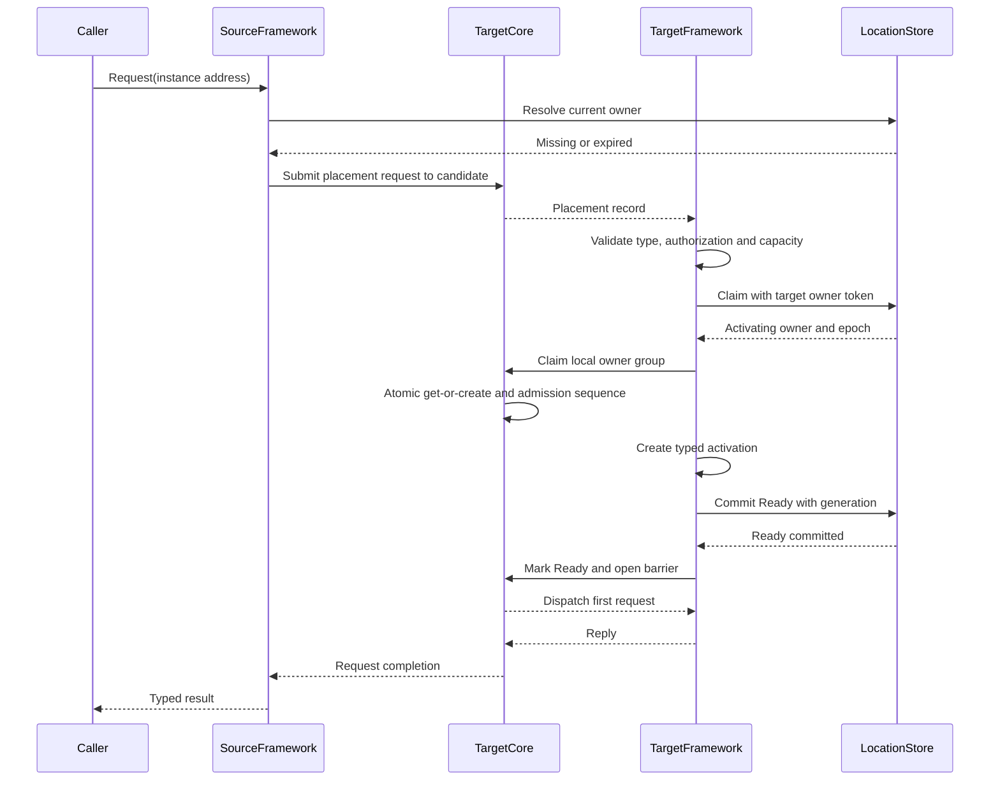

# Instance Spot 주소 기반 지연 활성화 설계와 구현 계획

## 0. 문서 상태와 목적

이 문서는 구현 전 초안으로 시작했지만, 현재는 정식 spec과 구현에 반영한 Instance Spot 설계 및 후속 변경
계획을 함께 소유한다. 파일 이름의 `draft`는 기존 링크를 유지하기 위해 바꾸지 않는다.

RouteMesh 10.0.0은 아직 외부에 배포하지 않았다. Core 정식 spec과 Framework 공통 spec·언어별 exact
interface에는 Instance Spot 목표 계약을 이미 반영했고, Core header·runtime·wire와 contract test 구현도
진행했다. 현재 구현 단계와 검증 증거는 이 문서가 아니라
[`RouteMesh 10.0.0 실행 진행표`](./route-mesh-10.0.0-execution-ledger.ko.md)의 `S2-IS-*`와 `S4-IS-CORE`가
소유한다.

Instance Spot은 MeshNode drain policy를 되살리는 기능이 아니다. Entry·Domain Spot의 생성은 계속 local-only이고,
기존 `SpotHandle` 호출도 existing-only다. 이 설계는 명시적인 Instance Spot 주소를 사용한 호출에만 적용하는
별도 분산 activation 계약을 정의한다.

대상 독자는 Core·bindings·Framework의 Spot lifecycle과 location runtime을 설계하고 검토하는 개발자다.
이 문서는 다음 질문에 답하는 계약과 구현 경계를 정리한다.

> 명시적인 생성 호출 없이 논리 Spot 주소로 첫 메시지를 보냈을 때, Framework가 owner MeshNode를 정하고
> Core가 Instance Spot 하나를 만든 뒤 모든 메시지를 같은 application queue에서 순서대로 처리할 수 있는가?

이 문서의 설계 결정을 변경하면 Core 정식 spec, Framework 공통 spec과 모든 언어의 exact interface를 먼저
같은 내용으로 갱신한다. 구현은 갱신된 정식 계약에 맞추며 현재 구현과의 차이 및 진행 상태는 실행 진행표의
담당 행에만 기록한다.

## 1. 결론 요약

Instance Spot은 명시적인 `Create`나 `GetOrCreate` 없이 첫 direct send/request가 activation을 시작하는 논리
Spot이다. Actor membership을 제공하지 않으며 direct message callback, timer, outbound call과 명시적인
close를 제공한다.

Instance Spot address는 다음 세 값을 포함한다.

```text
MeshName + InstanceSpotType + SpotRid
```

Location과 Core가 보장하는 논리 Spot의 uniqueness key는 기존 Spot과 같은 `(MeshName, SpotRid)`다.
`InstanceSpotType`은 별도 이름 공간을 만드는 값이 아니라, 해당 key를 처음 활성화할 때 사용할 factory와
이후 호출에서 검증할 불변 type을 나타낸다. 따라서 같은 key를 Domain Spot이나 서로 다른 Instance Spot
type이 동시에 사용할 수 없다.

주소에는 owner RID나 Spot generation을 고정하지 않는다. Framework는 유효한 location row가 있으면 현재
owner를 사용한다. Row가 없으면 source가 해당 type을 제공하는 serving MeshNode 중 하나를 placement 후보로
고르고, 선택된 target coordinator가 local 권한·type·capacity를 확인한 뒤 자기 owner token으로 location
store의 원자 claim을 수행한다. 여러 caller가 동시에 같은 주소를 요청해도 claim winner 하나만 남는다.

Core는 target MeshNode에서 같은 Instance Spot RID를 원자적으로 하나만 만들고, activation이 완료될 때까지
첫 메시지와 뒤따른 메시지를 보류한다. Framework가 type factory activation과 location `Ready` commit을
완료하면 Core가 같은 Spot application queue에서 메시지를 순서대로 제공한다.

Instance Spot의 close는 영구 삭제가 아니라 passivation이다. Close가 끝나 location row가 제거된 뒤 새
메시지가 오면 다른 serving MeshNode에서 새 generation으로 다시 활성화할 수 있다. Framework는 이전
activation의 in-memory state, timer나 처리 중인 callback을 새 activation으로 복사하거나 replay하지 않는다.

## 2. 현재 계약과 해결할 문제

이 절은 Instance Spot 계약을 추가하기 전에 존재했던 제약과 기능을 추가한 이유를 설명한다. 기존
[Framework Spot 메시징 spec](../../framework/spec/server/20-spot-messaging.ko.md)의 Domain Spot 생성과
`GetOrCreate`는 호출받은 local MeshNode에서만 수행한다. [Spot 주소 메시징
spec](../../framework/spec/server/24-spot-address-messaging.ko.md)의 기존 `SpotHandle` resolver도 location row가
없을 때 owner를 선택하거나 생성 요청을 시작하지 않는다. 이 동작은 Instance Spot을 추가한 뒤에도
existing-only 계약으로 유지한다.

Core의 [`zlink_mesh_node_spot_get_or_new()`](../../../../core/doc/spec/core/service/03-spot.ko.md#3-생성-조회와-종료)는
한 MeshNode 안에서 같은 Spot RID를 원자적으로 확보할 수 있지만 remote Spot을 만들거나 조회하지 않는다.
현재 Spot direct API는 target node RID, Spot RID와 0이 아닌 정확한 Spot generation을 요구한다. 수신 node에
Spot이 없으면 request는 not-found로 끝나므로 Framework factory에 첫 메시지가 도달하지 않는다.

이 경계에서는 다음 사용성을 제공할 수 없다.

- game room, match, lobby처럼 ID는 있지만 아직 activation되지 않은 대상을 바로 호출한다.
- node drain 뒤 같은 논리 주소의 다음 요청이 다른 serving node에서 activation을 시작한다.
- 여러 process의 동시 첫 요청이 logical Spot 하나로 수렴한다.
- 생성과 첫 메시지 사이의 경합 없이 첫 메시지를 새 Spot의 serial queue에서 처리한다.

## 3. Spot 종류와 기능 경계

Instance Spot은 Entry Spot이나 현재 user Spot의 생성 옵션이 아니라 별도 lifecycle을 가진 Spot 종류다.
이 초안에서 Domain Spot은 현재 정식 spec의 user Spot을 설명하기 위한 이름이며, 정식 용어 변경을 제안하지
않는다.

| 종류 | activation 시작 | Actor membership | 주요 용도 |
|---|---|---|---|
| Entry Spot | MeshNode startup | Actor의 기본 위치 | Actor 생성과 membership 진입 |
| Domain Spot | application의 명시적 `Create` 또는 local `GetOrCreate` | 허용 | Actor와 domain state를 함께 소유하는 room·stage·zone |
| Instance Spot | 논리 주소로 보낸 첫 direct send/request | 금지 | Actor 없이 ID별 callback과 timer 상태를 소유하는 room·match·workflow |

Instance Spot은 다음 기능을 제공한다.

- typed direct send/request handler
- 같은 Instance Spot 안의 serial application turn
- Spot timer
- Channel send/request와 필요한 outbound call
- 명시적인 `Close`
- activation과 close lifecycle callback

첫 계약에서는 Actor join·leave·transfer와 Logical Multicast subscription을 제공하지 않는다. 이 기능이
필요하면 Instance Spot의 기본 불변식을 유지할 수 있는지 별도 설계로 검토한다.

## 4. 공개 주소와 호출 모델

### 4.1 Instance Spot address

아직 location row가 없는 대상도 표현해야 하므로 기존 `SpotHandle`만으로는 충분하지 않다. Framework는
location resolve 결과와 독립적으로 만들 수 있는 Instance Spot address를 제공한다.

```text
InstanceSpotAddress
  Kind             = Instance
  MeshName         = logical RouteMesh name
  InstanceSpotType = registered factory identity
  SpotRid          = logical instance identity
```

주소의 Instance 표시는 생성 권한이나 보안 증명이 아니다. Target Framework는 등록된 type, caller 권한,
resource limit과 payload contract를 다시 검증한다. 주소에는 owner node RID, endpoint, owner lifecycle
generation 또는 Spot generation을 공개 입력으로 넣지 않는다.

언어별 API 이름은 각 exact interface가 정하지만 사용 형태는 다음 의미를 투영한다.

```csharp
var room = new InstanceSpotAddress(
    MeshName: "play",                         // owner를 선택할 RouteMesh를 고정한다.
    InstanceSpotType: "game-room",            // 서버에 등록한 stable factory type이다.
    SpotRid: roomRid);                         // 존재 여부와 관계없는 논리 instance ID다.

await spotClient.RequestToSpot(room, request)
    .Async<GameRoomReply>();       // missing이면 activation 뒤 같은 request를 처리한다.
```

호출마다 `createIfMissing` boolean을 받지 않는다. 같은 주소에 대한 lifecycle 의미가 호출부마다 달라지면
업무 코드에 placement 정책이 퍼지고 잘못된 Spot RID가 의도하지 않은 resource를 만들 수 있기 때문이다.
주소 kind와 server-side type registration이 지연 activation 여부를 함께 결정한다.

### 4.2 Existing-only 주소와의 구분

기존 SpotHandle 호출은 계속 existing-only다. Location row가 없으면 hidden placement나 activation을 시작하지
않고 not-found로 끝난다. 지연 activation은 Instance Spot address를 사용한 호출에서만 가능하다.

같은 `(MeshName, SpotRid)`를 Domain Spot과 Instance Spot이 동시에 소유할 수 없다. Location claim과 Core
local lookup은 kind mismatch를 conflict로 끝내며 기존 Spot을 다른 kind로 해석하지 않는다.

### 4.3 다중 Mesh process의 source 선택

한 process에 RouteMesh가 여러 개 있어도 `InstanceSpotAddress.MeshName`이 물리 배선을 하나로 확정한다. Global
client는 runtime의 mesh registry에서 같은 이름의 MeshNode Entry Spot을 내부 source로 선택한다. 현재 Spot
callback에서 다른 MeshName의 Instance address를 호출해도 callback Spot의 native handle을 다른 mesh에 사용하지
않고 target MeshName의 Entry Spot을 선택한다. Framework는 원래 callback의 turn과 request completion 수명만
유지한다.

해당 MeshName이 process에 등록되지 않았거나 serving connection이 없으면 route-not-connected로 끝낸다. 다른
MeshName으로 fallback하지 않는다. 같은 Spot RID와 InstanceSpotType이 서로 다른 MeshName에 존재할 수 있으며,
location key, Core queue, owner lease와 activation epoch는 mesh별로 완전히 분리한다.

## 5. 등록과 target eligibility

MeshNode는 startup 전에 생성 가능한 Instance Spot type factory를 등록한다. 등록 뒤 type set은 해당
MeshNode lifecycle 동안 바꾸지 않는다. Automatic placement를 사용하는 MeshNode descriptor는 Instance Spot
type capability set을 제공한다.

Framework는 다음 조건을 모두 만족하는 node만 새 owner 후보로 사용한다.

- 같은 MeshName의 admitted MeshNode
- `serving` 상태이고 drain 중이 아님
- 요청한 Instance Spot type factory를 등록함
- owner lease와 lifecycle generation이 유효함
- 필요한 protocol capability와 security profile이 일치함

후보 선택 알고리즘은 caller가 지정하지 않는다. Round-robin, random 또는 rendezvous hashing을 구현에서
사용할 수 있지만 location claim의 결과와 메시징 의미를 바꾸지 않는다. 같은 key를 호출하는 여러 process가
가능하면 같은 후보를 고르고 node 집합 변경 시 불필요한 재배치를 줄일 수 있으므로 초기 구현은 rendezvous
hashing을 우선 검토한다. 어떤 알고리즘을 사용해도 owner의 최종 authority는 location store CAS다.
Initial selector는 public 계약으로 고정하지 않는다. 동일한 eligible snapshot에서는 같은 key가 같은 우선
candidate를 고르도록 첫 구현이 rendezvous hashing을 사용하지만, 관측 가능한 보장은 CAS winner와 target
eligibility뿐이다.

후보가 없으면 request는 typed target-not-found 결과로 끝나고 one-way send는 target-not-found submit 결과를
반환한다. 다른 MeshName으로 fallback하거나 Actor·Domain Spot factory를 대신 사용하지 않는다.

Source가 읽는 descriptor에는 startup에서 고정한 type capability만 둔다. Active instance 수처럼 계속 바뀌는
resource 상태를 descriptor에 게시하면 placement 호출마다 descriptor revision과 Redis write가 늘어난다. Type별
active 상한과 authorization은 target coordinator가 자기 owner token으로 claim하기 전에 다시 검사한다.
초과하거나 거부되면 location row를 만들지 않고 target-unavailable 또는 rejected로 끝낸다. Source는 이 결과를
받았다는 이유만으로 같은 업무 message를 다른 node에 재제출하지 않는다.

Target coordinator는 type별 active slot을 local atomic reservation으로 먼저 확보한 뒤 claim한다. Claim loss,
transport 취소, Core `claim_owner` 실패 또는 activation abort에서는 reservation을 한 번만 반환한다. Descriptor는
이 가변 slot 수를 게시하지 않으며, Framework process 안의 registry 하나가 check와 reserve를 원자적으로
수행한다.

같은 local owner group의 `claim_owner` 결과가 follower이면 그 coordinator가 확보한 중복 reservation을 즉시 한 번
반환한다. Activation group에는 leader reservation 하나만 남고 Ready lifecycle이 끝날 때 반환한다. Leader보다
나중에 도착한 placement token이 먼저 claim될 수는 있지만, Core가 처음 성공한 `claim_owner`를 group leader로
원자 결정하므로 factory와 reservation 소유자는 항상 하나다. Ingress 도착 순서는 leader 선택 보장이 아니며,
모든 pending 업무 record의 Core admission sequence만 처리 순서를 결정한다.

## 6. Location row와 owner claim

### 6.1 Identity와 상태

Instance Spot location은 기존 Spot key namespace에서 `(MeshName, SpotRid)` uniqueness를 공유한다. Row에는
최소한 다음 정보가 필요하다.

| 필드 | 의미 |
|---|---|
| MeshName, SpotRid | 논리 Spot identity |
| Spot kind | `Instance` |
| InstanceSpotType | target Framework가 사용할 factory identity |
| Activation state | `Activating`, `Ready`, `Closing` |
| Owner RID, owner node lifecycle generation | 선택된 MeshNode lifecycle |
| Activation epoch | 같은 논리 주소의 재활성화와 stale command를 구분하는 fencing 값 |
| Spot generation | Core activation 뒤 확정되는 generation. `Activating` 전용 reservation에서는 아직 없을 수 있음 |
| Owner ID와 location generation | 기존 `LocationOwnerToken`을 구성하고 stale row commit·release를 구분하는 authority |

Entry·Domain Spot location row는 현재처럼 활성화가 완료된 owner만 나타낸다. `Activating`과 `Closing`은
Instance Spot에서만 유효하다. 일반 Spot resolver는 `Ready` Instance Spot만 SpotHandle 성공 결과로 사용한다.

### 6.2 원자 claim

Row가 없거나 이전 lease가 만료됐을 때 Framework는 `claim-if-absent-or-expired` CAS로 `Activating` row를
만든다. Store operation은 현재 row와 owner lease를 한 번에 읽고, 만료 row의 activation epoch와 location
generation을 원자적으로 증가시킨다. Caller가 읽은 값을 다시 넘긴 뒤 unconditional write하는 방식은
사용하지 않는다. 여러 candidate가 동시에 claim해도 성공 결과는 하나여야 한다.

Claim conflict는 생성 오류가 아니다. Losing caller는 winning row를 읽고 같은 owner로 메시지를 전달한다.
같은 key의 live Domain Spot, 다른 Instance Spot type 또는 더 높은 activation epoch가 있으면 conflict로 끝낸다.

`Activating -> Ready`, `Ready -> Closing`, `Closing -> absent`와 만료 row에서 더 높은 epoch의 `Activating`으로
교체하는 전이는 owner ID·location generation, owner node generation과 activation
epoch를 모두 확인하는
CAS다. Claim 결과와 resolve 결과에는 현재 location generation이 포함된다. Framework는 owner ID와 location
generation으로 기존 `LocationOwnerToken`을 구성하고 모든 row 전이에 같은 token을 사용한다. Stale target은
새 owner의 row를 commit하거나 release하지 않는다.

Source Framework는 target의 owner ID를 대신 사용해 claim하지 않는다. 선택된 target coordinator가 local
authorization, type과 capacity를 확인한 뒤 자기 owner ID로 claim한다. Claim에 성공하면 target Framework는
Store snapshot에서 만든 fence를 Ready·Closing·release CAS에만 사용한다. Core에는 owner ID만
`claim_owner` 입력으로 전달하여 같은 local activation group의 leader와 follower를 확정한다. Location
generation과 activation epoch는 Core record, message envelope나 local admission key에 넣지 않는다.

CAS loser가 local target의 같은 owner group을 확인하면 Core placement token을 follower로 claim한다. Remote
winner가 `Activating`이면 `Ready` 전환을 bounded wait한 뒤 exact generation route로 Core placement token을
redirect한다. Core는 아직 application queue에 한 번도 admission하지 않은 원본 record와 request correlation을
winning owner에게 한 번 전달하고 token을 소비한다. 이 동작은 업무 request의 재실행이 아니다. 두 번째
redirect, stale winning route 또는 수락 여부가 불명확한 실패는 terminal 오류로 끝내며 다른 candidate를 연속
탐색하지 않는다.

Redirect owner row가 사라졌으면 target-not-found, owner는 유효하지만 해당 물리 route가 준비되지 않았으면
route-not-connected로 완료한다. Store operation이나 activation infrastructure가 실패하면 `RequestFailed`,
kind·type이 충돌하면 `SpotTypeMismatch`, stale owner token·epoch 또는 `Closing` 상태에서 application admission
전에 거부되면 `RequestRejected`로 한 번만 완료한다. 두 번째 redirect도 `SpotTypeMismatch`가 아니라
`RequestRejected`로 거부한다.

## 7. Core와 Framework 책임 경계

### 7.1 Core 책임

Core는 다음 local 실행 불변식을 소유한다.

- `ZLINK_SPOT_KIND_INSTANCE`를 다른 Spot kind와 구분한다.
- 한 MeshNode에서 같은 Instance Spot RID를 원자적으로 하나만 만든다.
- Domain Spot과 Instance Spot의 같은 RID 충돌을 거부한다.
- Instance Spot에 대한 Actor join을 거부한다.
- placement와 activation 중 도착한 업무 record를 bounded pending queue에 보관한다.
- CAS loser placement token의 원본 record와 request correlation을 winning owner에게 최대 한 번 redirect한다.
- activation이 Framework callback을 기다리는 시간을 Core의 고정 상한으로 제한한다.
- Framework가 마지막으로 갱신한 owner lease 유효 시간을 Core의 monotonic admission deadline으로 보관한다.
- message와 timer를 application queue에 admission하거나 dispatch하기 전에 이 deadline을 검사한다.
- activation barrier가 열리기 전에 application callback record를 제공하지 않는다.
- activation 성공 뒤 모든 업무 record를 같은 Spot application queue에서 순서대로 제공한다.
- close가 시작되면 신규 admission을 닫고 accepted record와 active claim을 lifecycle 계약에 따라 정리한다.
- 같은 RID를 다시 만들면 Spot generation을 증가시킨다.

Core는 location store, Instance Spot type factory, DI, target 선택 알고리즘과 application payload type을 알지
않는다. Instance Spot type identity는 Framework에 전달할 opaque activation 정보로만 취급한다.

### 7.2 Framework 책임

Framework는 다음 분산·application 책임을 소유한다.

- Instance Spot address와 type registry
- eligible MeshNode snapshot과 placement
- location claim, owner lease와 activation epoch
- target Framework로 activation request 전달
- type factory, DI scope, handler와 timer 구성
- Core activation barrier의 `mark_ready` 또는 abort
- location `Ready` commit과 SpotHandle snapshot
- typed payload decode, callback와 reply/error mapping
- close와 location release 조정

Bindings는 Core의 새 kind와 Framework driver SPI를 일반 Spot API와 분리한 opaque wrapper로 제공한다. 한
언어만 raw placement field, activation token, Framework queue나 raw frame helper를 일반 사용자 표면에
노출하여 lifecycle을 우회하지 않는다.

### 7.3 공개 interface 변경 원칙

Core와 Framework의 전체 목표 interface는 §15에서 고정한다. 기존 Spot direct API의 generation `0`을
create-if-missing shortcut으로 재정의하지 않는다. 기존 generation fencing과 existing-only 호출의
not-found 의미를 유지하기 위해 cold placement 전용 operation과 activation record를 사용한다. Ready owner
호출은 기존 exact Spot direct API를 재사용한다.

## 8. Activation과 첫 메시지 순서

첫 메시지는 location을 `Ready`로 게시하기 전에 application callback을 실행하지 않는다. Framework factory
activation이나 Ready commit이 실패했는데 업무 callback이 먼저 실행되는 상태를 허용하면 owner authority와
application side effect가 분리되기 때문이다.



Target Core의 placement token은 Framework가 claim을 완료하기 전까지 application queue를 만들거나 업무
callback을 허용하지 않는다. Framework가 Store claim으로 얻은 owner ID를 `claim_owner`에 전달하면 Core의
local map과 activation barrier는 같은 Instance Spot RID, type과 owner ID로 들어온 activation request를 하나로
합친다. 다른 owner ID나 type은 기존 activation에 합치지 않고 conflict로 거부한다. Target Framework factory도
`(MeshName, InstanceSpotType, SpotRid, ActivationEpoch)`를 key로 single-flight activation을 수행한다.

Cold first message는 `Ready` commit 전에 Core pending queue의 첫 admission sequence를 받는다. `Ready` row가
보인 뒤 다른 source connection에서 들어온 exact-generation message도 barrier가 열릴 때까지 같은 Core queue에
보류하고 더 큰 sequence를 부여한다. 따라서 Ready 게시와 `mark_ready` 사이의 메시지가 cold first message를
추월하지 않는다. 이 MeshNode 안의 Instance admission sequence는 Core가 소유한다.

Activation callback은 Spot ID를 사용해 외부 저장소에서 상태를 읽을 수 있다. 첫 업무 message는 생성
payload로 소비하지 않고 activation과 Ready commit이 끝난 뒤 일반 direct handler에 그대로 전달한다.

## 9. 동시성, 순서와 한 번만 생성 보장

Instance Spot은 두 단계에서 중복을 차단한다.

1. Location store CAS가 cluster 전체 owner node를 하나로 정한다.
2. Core local get-or-create와 Framework single-flight가 선택된 node의 activation을 하나로 정한다.

이 구조는 live Instance Spot이 동시에 여러 node에 존재하지 않도록 한다. 다만 network partition, lease
expiry와 process pause가 있는 환경에서는 stale owner가 메모리에 남을 수 있다. Location transition은 owner
ID, owner node generation, location generation과 activation epoch를 묶은 Store fence를 CAS에서 확인한다.
Core는 Store fence를 알지 않으며 Framework가 갱신한 local monotonic admission deadline을 message와 timer
admission에서 독립적으로 검사한다.

같은 Instance Spot에 수락된 application callback 두 개를 동시에 실행하지 않는다. 한 source가 같은
destination connection으로 성공적으로 submit한 순서는 보존한다. 서로 다른 caller가 동시에 보낸 메시지의
wall-clock 기준 전역 순서는 보장하지 않으며 target queue에 수락된 순서로 처리한다.

Owner claim은 exactly-once 업무 실행을 보장하지 않는다. Timeout이나 연결 종료로 handler 실행 여부가
불명확하면 Framework는 다른 node에 같은 request를 자동 재제출하지 않는다. 중복에 민감한 업무는 domain
idempotency key와 결과 저장 정책을 사용한다.

## 10. Send와 request 의미

Request는 placement, activation, handler와 reply 가운데 발생한 실패를 하나의 terminal 결과로 완료한다.
Activation이 시작된 뒤 다른 candidate로 자동 재시도하지 않는다. Factory callback의 side effect 여부를
Framework가 판단할 수 없기 때문이다.

첫 계약에서는 target 미수락이 확정된 경우에도 같은 request를 다른 owner에게 자동 재제출하지 않는다.
Remote admission receipt를 추가하지 않은 상태에서 연결 실패를 미수락으로 추정하면 같은 업무가 두 번 실행될
수 있기 때문이다. 실패한 call은 한 번만 terminal 결과로 끝내고, 호출자가 새 call을 시작할 때 location을
다시 resolve한다.

One-way send의 submit 성공은 source Core가 outbound record를 local bounded queue에 수락했다는 뜻이다. 동기
submit 결과만으로 remote target의 activation queue 수락, factory 성공이나 handler 완료를 보장하지 않는다.
Submit 뒤 target 미수락이나 activation 실패가 확인되면 runtime error, trace와 drop metric에 기록하며 send를
숨은 request로 바꾸거나 다른 owner에게 replay하지 않는다.

One-way send는 source의 local submit이 실패했을 때만 caller에게 동기 미수락을 반환한다. Source가 수락한 뒤
remote node가 종료되거나 target 미수락이 확인된 send는 비동기 drop으로 관측하고 다른 owner에게 replay하지
않는다.

Instance Spot address의 cold route는 Location Store I/O가 필요하므로 동기 `TrySubmit`으로 처리하지 않는다.
Address overload는 [Framework one-way submit API 단순화 초안](./framework-submit-api-simplification-draft.ko.md)의
공통 비동기 send call을 반환한다. 이미 cache된 route가 있어도 같은 address가 호출 시점에 동기 경로로 바뀌지
않는다. 이 규칙으로 cache 유무가 public 호출 의미를 바꾸지 않게 한다.

다음 오류를 구분한다.

| 조건 | public 결과 |
|---|---|
| eligible node 없음 | target not found |
| Location Store resolve·claim·commit 실패 또는 activation infrastructure 실패 | `RequestFailed` |
| 기존 Domain Spot과의 kind 충돌 또는 다른 Instance Spot type과의 충돌 | `SpotTypeMismatch` |
| activation queue 수용 불가 | backpressure |
| factory가 activation 거부 | `RequestRejected` |
| stale owner token·epoch | `RequestRejected` |
| target drain 또는 `Closing` 상태에서 application admission 전 거부 | `RequestRejected` |
| request deadline 도달 | timeout |

표의 error kind는 request와 source local admission 전에 끝난 one-way exceptional completion에 적용한다. Source
outbound queue가 one-way record를 수락해 `Submitted`로 완료한 뒤 remote failure가 확인되면 결과를 다시
쓰지 않는다. 이 경우에는 drop metric과 message-flow event만 남기며 error reply나 replay를 만들지 않는다.

## 11. Close, passivation과 재활성화

Instance Spot의 `Close`는 다음 순서를 따른다.

1. Framework가 borrowed local Spot handle로 Core `begin_close`를 호출해 신규 application admission과 timer tick
   admission을 먼저 닫는다.
2. Framework가 location row를 같은 owner token으로 `Closing` 전환한다.
3. 이미 수락한 application turn과 infrastructure completion을 끝낸다.
4. Timer, handler scope와 Framework activation resource를 정리한다.
5. Core logical Spot을 닫는다.
6. Framework가 같은 Store fence로 location row를 release한다.

`Closing` row를 본 새 request는 같은 call 안에서 새 owner를 만들지 않고 target-closing으로 끝난다. Row가
완전히 제거된 뒤 시작한 다음 call은 새 placement와 activation을 수행할 수 있다. 이 규칙은 close와 즉시
재생성이 서로 경쟁해 두 owner가 생기는 것을 막는다.

Core seal 뒤 `Closing` CAS가 stale, conflict 또는 store 오류로 실패해도 같은 activation의 admission을 다시
열지 않는다. Stale 결과는 이전 local owner만 정리하고 새 owner row를 변경하지 않는다. Store 오류에서는 현재
owner lease deadline까지만 accepted work 정리를 계속한 뒤 bounded force cleanup을 수행하며, 다른 node의
takeover는 lease 만료 전 시작하지 않는다. Cached OWNER submit이 Core seal과 CAS 사이에 도착해도 Core가
target-closing으로 거부하므로 `Closing` row 게시 순서에 의존하지 않는다.

Owner가 `Closing` commit 뒤 row release 전에 종료될 수 있다. Owner lease가 유효한 동안에는 다른 node가
row를 제거하거나 activation을 시작하지 않는다. Lease가 만료되면 claim operation이 current owner ID,
location generation과 activation epoch를 원자적으로 fencing하고 더 높은 epoch의 `Activating` row로 교체할
수 있다. 이전 owner가 다시 실행되더라도 이전 token으로 close 완료나 release를 수행하지 못한다.

Instance Spot을 영구적으로 다시 만들지 못하게 하는 domain deletion은 `Close`와 다른 기능이다. 필요하면
tombstone, authorization과 보존 기간을 포함하는 별도 계약으로 설계한다.

## 12. Drain과 장애 복구

### 12.1 정상 drain

MeshNode가 drain을 시작하면 새 Instance Spot placement 후보에서 즉시 제외한다. 해당 node가 소유한 Instance
Spot은 고정 MeshNode drain 순서를 따른다. 먼저 신규 admission을 닫고 accepted turn과 request completion을
deadline까지 처리한다. 그 뒤 Actor handoff와 STREAM barrier가 완료된 다음 남은 local Spot close 단계에서
§11의 close를 수행한다. Location row와 owner lease는 Spot cleanup이 끝날 때까지 유지하고 마지막 owner cleanup
단계에서 release한다. 어느 단계든 deadline을 넘기거나 cleanup이 실패하면 `Drained`로 보고하지 않고 terminal
`ForceStopped`를 한 번만 완료한다. 이후 시작된 call은 남아 있는 serving MeshNode 중 하나를 새 owner로 claim할
수 있다.

이 동작은 MeshNode drain policy enum을 요구하지 않는다. Instance Spot의 정의 자체가 close 뒤 요청 기반
재활성화를 허용한다. Entry·Domain Spot은 현재 existing-only lifecycle을 유지한다.

한 process의 mesh A handler가 mesh B의 Instance address를 호출하면 application claim은 원래 callback을 실행한
mesh A에 남는다. Framework는 native submit 직전에 mesh B의 outbound operation claim을 별도로 획득한다. B가
이미 sealed 상태면 submit을 시작하지 않고 target-closing으로 끝내며, B가 수락한 request는 B drain이 completion을
deadline까지 기다린다. Request completion은 B claim을 먼저 release한 뒤 A callback을 재개한다. One-way send의
B claim은 B local outbound admission 결과가 정해질 때 release한다.

두 mesh의 runtime lock을 동시에 보유한 채 claim을 획득하거나 release하지 않는다. 두 mesh가 동시에 drain을
시작하면 모두 먼저 seal하여 새 cross-mesh dependency를 만들지 않고, 이미 수락한 call만 공통 deadline까지
완료한다. 순환 dependency가 deadline을 넘으면 bounded force stop으로 끝낸다. 이 계약에는 mesh별 owner cleanup,
operation claim과 runtime resource 격리가 선행되어야 한다. 현재 구현의 multi-mesh drain fail-fast는 각
`S8-IS-*` lane이 이 격리를 구현할 때까지 implementation gap으로 유지하며 완료 계약으로 간주하지 않는다.

### 12.2 `Ready` owner의 비정상 종료

`Ready` Instance Spot을 소유한 MeshNode process가 사전 drain 없이 종료되면 location row가 즉시 삭제된다고
가정하지 않는다. Row는 owner lease가 유효한 동안 이전 owner를 가리킬 수 있으며, 다른 node는 이 기간에
같은 key의 Instance Spot을 만들지 않는다.

Owner lease가 만료되면 row는 resolve 가능한 `Ready` 위치가 아니다. Lease 만료 전 takeover는 이전 owner가
신규 admission을 닫았다는 확인까지 포함하는 coordinated fencing이 완료된 경우에만 허용한다. 단순한
connection failure나 한 observer의 장애 감지만으로 새 owner를 만들지 않는다. 이후 같은 address를 resolve한
Framework caller가 만료 row를 발견하면 별도의 중앙 cleanup 완료를 기다리지 않고 다음 절차를 수행한다.

1. Serving 상태이고 해당 Instance Spot type을 제공하는 새 target을 선택한다.
2. Store가 현재 row, owner lease와 generation을 원자적으로 읽고 만료 여부를 확인한다.
3. CAS winner가 owner를 새 target으로 바꾸고 activation epoch를 증가시킨 `Activating` row를 확정한다.
4. 새 target의 Core가 새 Spot generation으로 Instance Spot을 만들고 activation barrier를 설정한다.
5. Framework factory가 외부 store에서 필요한 상태를 복구한 뒤 row를 `Ready`로 commit한다.
6. Core가 activation barrier를 열고 보류한 첫 메시지부터 같은 application queue에 제공한다.

첫 계약에서 Location reaper는 만료 row를 새 owner의 `Activating` row로 바꾸지 않는다. 만료 row의 교체는
업무 call이 수행하는 claim operation 하나가 원자적으로 흡수한다. 물리 정리가 필요하면 activation을 시작하지
않고 owner lease 만료와 현재 location generation을 함께 확인하는 조건부 cleanup operation을 별도 설계한다.

Source Framework가 보관한 route snapshot도 owner lease와 node lifecycle generation이 유효한 동안만 사용할 수
있다. 만료되거나 폐기된 snapshot으로 신규 메시지를 제출하지 않고 location을 다시 resolve한다. Public
Instance Spot address에는 이 값을 노출하지 않는다. Ready snapshot은 node RID, Spot RID와 0보다 큰 Spot
generation으로 고정한 기존 exact Spot direct route로만 전송하며 Store fence는 wire envelope에 넣지 않는다.

이전 owner process가 network partition이나 일시 정지 뒤 다시 실행을 계속하더라도 신규 owner의 메시지를
처리해서는 안 된다. Owner lease를 성공적으로 갱신한 Framework는 store가 반환한 남은 유효 시간보다 길지 않은
값으로 Core의 monotonic admission deadline을 갱신한다. Core는 message와 timer의 admission뿐 아니라 callback
dispatch 직전에도 이 deadline을 검사한다. Process가 일시 정지된 동안 monotonic 시간이 deadline을 넘으면,
Framework callback이 실행되지 않았어도 Core가 신규 admission과 dispatch를 거부한다.

Framework는 store operation을 시작하기 직전 local monotonic 시각을 기록한다. Core에 넘기는 유효 시간은
`leaseExpiresAt - storeNow - routingIdFencingMargin - (coreCallAt - storeCallStartedAt)`보다 길 수 없다. Store
왕복, 응답을 받은 뒤의 scheduling 지연과 process 정지 시간도 마지막 항에서 보수적으로 빠진다. 현재 정식
location 기본값을 사용하면 30초 lease에서 5초 fencing margin과 전체 local elapsed를 뺀 시각 전에 Core
deadline이 닫힌다. 계산 결과가 0 이하이면 `mark_ready`·renew로 deadline을 열지 않고 즉시 abort 또는 begin-close를
시작한다.

Target Framework도 다음 조건 중 하나가 발생하면 해당 Instance Spot의 신규 admission과 timer tick admission을
닫는다.

- local owner lease를 deadline 전에 갱신하지 못함
- Coordinated fencing으로 owner node lifecycle이 폐기됨
- 더 높은 activation epoch가 확인됨

이미 수락한 callback의 외부 side effect를 되돌릴 수 있다고 가정하지 않는다. Stale owner의 reply, location
commit과 release는 location generation과 activation epoch fencing으로 거부한다. 중복에 민감한 application은
새 owner가 복구한 상태에도 domain idempotency key를 적용한다.

### 12.3 `Activating` owner의 비정상 종료

Target process가 `Activating` 중 종료되면 owner lease가 만료되기 전까지 다른 node가 같은 key를 claim하지
않는다. Pending request는 timeout, connection failure 또는 infrastructure failure로 끝난다. Lease가 만료된
뒤 시작한 새 call은 activation epoch를 증가시켜 새 owner를 claim할 수 있다.

### 12.4 Location Store 장애

Location Store 장애 중 이미 `Ready`인 Instance Spot은 마지막으로 검증한 in-memory route와 local owner
lease가 아직 유효한 동안만 기존 메시지를 처리할 수 있다. Lease를 갱신하거나 authority를 검증할 수 없는
상태가 lease deadline을 넘으면 target은 신규 admission을 닫는다. Source도 만료된 route snapshot을 계속
사용하지 않는다.

Row가 없는 새 Instance Spot은 성공한 owner claim 없이 만들지 않는다. Store recovery 뒤 stale token은 현재
row를 덮어쓰거나 release하지 않는다. Store 장애를 이유로 location을 거치지 않은 local Instance Spot을
만들거나 두 번째 owner를 추측하지 않는다.

## 13. Resource와 보안 제한

주소를 만들 수 있다는 사실만으로 임의의 Instance Spot 생성이 허용되지는 않는다. Framework는 activation
전에 다음을 검증한다.

- 등록된 Instance Spot type과 허용된 message contract
- caller identity와 authorization policy
- Spot RID 길이와 형식
- MeshNode·type별 active activation 상한
- activation 중 pending message 수와 byte 상한
- factory timeout과 call별 request deadline

상한을 초과하면 새 claim이나 local activation을 시작하지 않고 bounded 오류로 끝낸다. Instance Spot ID,
topic과 application key는 metric label로 사용하지 않는다. Trace에는 sampling과 payload 비기록 정책을
적용한다.

One-way placement·activation 실패는 기존 `zlink.message_flow` event에서 `surface=instance_spot`,
`outcome=dropped`로 기록한다. 별도 public event identifier를 추가하지 않는다. Drop 누계는 기존
`zlink.mesh_node.messages.dropped`를 사용하고 `surface=instance_spot`을 붙인다. Formal metric·trace 반영에서는
reason의 닫힌 값에 `location_unavailable`, `activation_rejected`, `activation_timeout`을 추가한다. 기존
`backpressure`, `stale_target`, `target_closed`, `shutdown`은 같은 의미로 재사용한다.

첫 계약의 기본값은 type별 active Instance `4096`, Framework activation timeout `3초`, Core activation별
pending `256 message`·`4 MiB`, Core watchdog `5초`다. Existing mailbox budget이 더 작거나 drain deadline이
더 이르면 shared activation에는 더 이른 제한을 적용한다. 이 값은 정상 local activation을 기다리게 만들기 위한 timeout
증액이 아니라 stalled factory와 무제한 cold queue를 차단하는 안전 상한이다.

## 14. 대안 검토

### 14.1 기존 Domain Spot에 create-if-missing boolean 추가

호출마다 `createIfMissing`을 받으면 public API는 작아 보이지만 type과 lifecycle 결정이 모든 caller로
퍼진다. Existing-only 호출과 지연 activation 호출이 같은 주소에서 섞이고, Actor membership이 있는 Domain
Spot을 원격에서 의도하지 않게 만들 수 있다. 이 초안에서는 선택하지 않는다.

### 14.2 Framework 내부 Node direct helper로 첫 메시지 우회

Framework가 첫 메시지를 내부 Node packet으로 보내고 target Framework가 local `GetOrCreate` 뒤 별도 queue에
넣는 방식은 Core 변경을 줄인다. 하지만 request correlation, activation queue와 Core Spot queue의 순서 및
drain barrier를 모든 언어가 중복 구현해야 한다. 일반 Spot direct 경로가 missing을 먼저 거부하는 문제를
우회할 뿐 해결하지 않으므로 선택하지 않는다.

### 14.3 Core가 location과 placement까지 수행

Core가 Redis, type capability와 node selection을 알면 Framework와 location 정책이 중복되고 다른 store를
지원하기 어렵다. Core interface도 application type과 배포 정책에 의존하는 얕은 모듈이 되므로 선택하지
않는다.

### 14.4 선택안

Framework가 address·placement·location authority와 typed activation을 소유하고, Core가 Instance Spot kind,
atomic local creation, activation barrier와 serial dispatch를 소유하는 방식을 선택한다. 각 계층은 자신이
이미 소유한 정보만 처리하며 caller에게 node RID, generation, claim token이나 retry 절차를 노출하지 않는다.

## 15. Core·bindings·Framework 변경 interface

### 15.1 변경 범위와 호환성

이 절은 구현에서 추가하거나 변경할 공개·binding interface를 빠짐없이 정리한 목표 목록이다. 이름과 숫자는
이 draft 안에서 하나로 고정하며, 정식 spec review에서 변경하면 이 절과 모든 언어 exact interface를 같은
변경으로 갱신한다.

| 계층 | 추가·변경 | 그대로 유지 |
|---|---|---|
| Core Spot | `Instance` kind, cold placement, activation state·token·record, placement send/request, claim·Ready·redirect·abort·owner admission | 기존 Entry·User kind 숫자, lookup, local `get_or_new`, destroy, 기존 Spot direct API |
| Core dispatch | Instance activation infrastructure record | 기존 Spot send/request record와 reply token |
| Core option·result | Activation pending message·byte budget | 기존 submit·request·config result 숫자와 의미 |
| Bindings | Framework driver SPI의 opaque wrapper | 기존 일반 binding Spot API |
| Framework public API | Instance address, factory 등록, send/request overload, factory option | SpotHandle, manager `Create`·`GetOrCreate`, 기존 Spot lifecycle·handler interface |
| Location Store | 같은 key namespace의 Instance row variant, Instance location record와 원자 claim·Ready·Closing·release operation | 기존 Spot location record와 Entry·Domain Spot의 update·remove·resolve operation |
| Discovery descriptor | MeshNode가 제공하는 Instance Spot type set | 기존 MeshName, RID, endpoint, channel weight와 drain 정보 |

이미 외부에 배포한 기존 public method의 의미는 바꾸지 않는다. 아직 외부에 배포하지 않은 초기 Instance
driver 이름과 구조체는 호환 alias 없이 교체한다. 새 application overload에
`createIfMissing`, target node RID, Spot generation, owner token이나 retry option을 노출하지 않는다.

### 15.2 Core C ABI

#### 15.2.1 `spot.h`와 `instance_spot_driver.h`의 enum·구조체

일반 Spot 계약과 Framework runtime driver 계약은 같은 header에 섞지 않는다. `zlink/service/spot.h`에는 일반
Spot kind·status만 두고, placement·activation record와 관련 함수는
`zlink/service/instance_spot_driver.h`에 둔다. 후자는 `spot.h`를 include하지만 root `zlink.h`는 driver header를
자동으로 include하지 않는다. 따라서 C API 사용자와 일반 bindings의 `Spot` 표면에는 Instance activation의
내부 상태 조합이 추가되지 않는다.

`ZLINK_SPOT_ABI_VERSION`은 `2u`로 올린다. 기존 enum 숫자는 유지하고 `Instance`만 뒤에 추가한다. 아래 코드에서
첫 번째 영역은 `spot.h`, 두 번째 영역은 `instance_spot_driver.h`에 들어간다.

```c
/* zlink/service/spot.h */
#define ZLINK_SPOT_ABI_VERSION 2u

typedef enum zlink_spot_kind_t {
  ZLINK_SPOT_KIND_INVALID  = 0,
  ZLINK_SPOT_KIND_ENTRY    = 1,
  ZLINK_SPOT_KIND_USER     = 2,
  ZLINK_SPOT_KIND_INSTANCE = 3
} zlink_spot_kind_t;

typedef enum zlink_spot_activation_state_t {
  ZLINK_SPOT_ACTIVATION_INVALID    = 0,
  ZLINK_SPOT_ACTIVATION_ACTIVATING = 1,
  ZLINK_SPOT_ACTIVATION_READY      = 2,
  ZLINK_SPOT_ACTIVATION_CLOSING    = 3
} zlink_spot_activation_state_t;

/* zlink/service/instance_spot_driver.h */
#define ZLINK_INSTANCE_SPOT_TYPE_MAX 255u
#define ZLINK_INSTANCE_SPOT_OWNER_ID_MAX 255u
#define ZLINK_INSTANCE_SPOT_CONTRACT_ID_MAX 255u

typedef enum zlink_instance_spot_claim_role_t {
  ZLINK_INSTANCE_SPOT_CLAIM_INVALID  = 0,
  ZLINK_INSTANCE_SPOT_CLAIM_LEADER   = 1,
  ZLINK_INSTANCE_SPOT_CLAIM_FOLLOWER = 2
} zlink_instance_spot_claim_role_t;

typedef enum zlink_instance_spot_operation_kind_t {
  ZLINK_INSTANCE_SPOT_OPERATION_INVALID = 0,
  ZLINK_INSTANCE_SPOT_OPERATION_SEND    = 1,
  ZLINK_INSTANCE_SPOT_OPERATION_REQUEST = 2
} zlink_instance_spot_operation_kind_t;

typedef struct zlink_instance_spot_placement_t {
  zlink_routing_id_t node_rid;
  uint64_t node_generation;
  zlink_routing_id_t spot_rid;
  const char *instance_spot_type;
  size_t instance_spot_type_size;
  const char *message_contract_id;
  size_t message_contract_id_size;
} zlink_instance_spot_placement_t;

typedef struct zlink_instance_spot_activation_token_t {
  uint64_t opaque[4];
} zlink_instance_spot_activation_token_t;

typedef struct zlink_instance_spot_activation_data_t {
  zlink_routing_id_t spot_rid;
  zlink_instance_spot_operation_kind_t operation_kind;
  char instance_spot_type[ZLINK_INSTANCE_SPOT_TYPE_MAX + 1];
  char message_contract_id[ZLINK_INSTANCE_SPOT_CONTRACT_ID_MAX + 1];
  zlink_instance_spot_activation_token_t token;
} zlink_instance_spot_activation_data_t;

typedef struct zlink_instance_spot_claim_result_t {
  zlink_instance_spot_claim_role_t role;
  void *leader_spot;
  uint64_t leader_spot_generation;
} zlink_instance_spot_claim_result_t;
```

Placement는 cold activation에 필요한 node RID·node generation·Spot RID·Instance type·packet name만 가진다.
Ready owner 전송은 기존 exact Spot direct API를 사용하므로 placement와 owner를 mode로 함께 표현하지 않는다.
Source Entry Spot과 target MeshNode가 Mesh를 이미 확정하므로 MeshName도 반복하지 않는다.

`instance_spot_type`, `message_contract_id`와 non-empty owner ID는 UTF-8 byte 기준 각각 255 이하이다. Core는
caller가 넘긴 문자열과 placement 값을 함수 반환 전에 복사하고 caller pointer를 보존하지 않는다. Activation
data에는 Spot RID, type, packet name, send/request 구분과 일회용 token만 둔다. Owner ID는 Framework가 Store
claim에 성공한 뒤 `claim_owner`를 호출할 때만 전달한다.

Source Framework는 typed packet의 기존 packet name을 `message_contract_id`로 target에 넣는다. 별도 contract
identifier registry를 만들지 않는다. Target coordinator는 activation data의 identifier·operation kind, receive
record의 source node RID·application metadata와 admitted
peer descriptor의 security identity를 사용해 claim 전에 contract와 authorization을 검사한다. Caller가 임의로
security identity를 target struct에 넣지 않는다. Payload part는 Core pending queue에 유지하고 Ready 전
application handler나 일반 decoder에 제공하지 않는다.

`zlink_spot_status_t`는 다음 최종 layout으로 확장한다. Entry·User Spot의 activation state는 `READY`다.

```c
typedef struct zlink_spot_status_t {
  uint32_t struct_size;
  uint32_t version;
  zlink_routing_id_t spot_rid;
  zlink_spot_kind_t spot_kind;
  uint64_t lifecycle_generation;
  uint64_t pending_application_messages;
  uint64_t pending_infrastructure_messages;
  uint64_t pending_bytes;
  uint32_t active_actor_count;
  uint32_t draining;
  int32_t last_error;
  uint64_t last_changed_ms;
  zlink_spot_activation_state_t activation_state;
} zlink_spot_status_t;
```

기존 ABI v1의 `last_changed_ms`까지는 byte offset과 의미를 그대로 보존한다. `activation_state`는 v1 prefix
뒤에만 추가한다. `zlink_spot_status()`는 caller가 `version=1`과 v1 크기를
지정하면 기존 prefix만 채우고, `version=2`와 v2 크기를 지정하면 추가 tail도 채운다. 지원 version보다 큰 값이나
선택한 version의 필수 크기보다 작은 `struct_size`는 config-invalid-argument로 거부한다. Core가 더 큰 구조체를
받더라도 자신이 아는 크기 뒤의 caller storage를 덮어쓰지 않는다.

Placement, activation data와 claim result는 `struct_size`와 `version`이 없는 고정 layout이다. 이 driver SPI는
candidate manifest의 header·runtime hash가 정확히 일치할 때만 사용한다. layout을 바꿔야 하면 기존 prefix를
확장하지 않고 새 symbol 또는 새 record kind를 정의한다. Placement와 activation data에는 MeshName, Spot
generation, owner ID, location generation과 activation epoch를 넣지 않는다. Claim result의
`leader_spot_generation`은 owner claim으로 새 local Spot이 확정된 뒤 기존 exact Spot route를 구성하는 결과이므로
유지한다. Mesh는 source Entry Spot과 target MeshNode가 이미 확정하며, Location Store authority는 Framework가
Store CAS에만 사용한다.

#### 15.2.2 `instance_spot_driver.h` 함수

다음 여덟 함수는 애플리케이션 lifecycle callback 여덟 개가 아니다. cold placement를 제출하는 두 함수와,
Framework가 비동기 factory·Location Store CAS 사이에서 호출하는 activation·admission 전이 여섯 함수다. 일반
애플리케이션은 이 여덟 함수를 직접 조합하지 않고 Framework의 Instance address와 factory API를 사용한다. 기존
`zlink_spot_send_to_spot()`과
`zlink_spot_request_to_spot()`은 exact generation을 요구하는 existing-only API로 유지한다.

```c
ZLINK_EXPORT zlink_submit_result_t zlink_spot_send_to_instance_placement(
  void *spot,
  const zlink_instance_spot_placement_t *placement,
  const zlink_mesh_metadata_view_t *metadata,
  const zlink_msg_t *parts,
  size_t part_count,
  zlink_send_flags_t flags);

ZLINK_EXPORT zlink_submit_result_t zlink_spot_request_to_instance_placement(
  void *spot,
  const zlink_instance_spot_placement_t *placement,
  const zlink_mesh_metadata_view_t *metadata,
  const zlink_msg_t *parts,
  size_t part_count,
  zlink_mesh_operation_id_t *operation_id_out,
  zlink_send_flags_t flags,
  uint32_t timeout_ms);

ZLINK_EXPORT zlink_config_result_t zlink_instance_spot_activation_claim_owner(
  zlink_instance_spot_activation_token_t *token,
  const char *location_owner_id,
  size_t location_owner_id_size,
  zlink_instance_spot_claim_result_t *result_out);

ZLINK_EXPORT zlink_config_result_t zlink_instance_spot_activation_mark_ready(
  zlink_instance_spot_activation_token_t *token,
  uint32_t owner_lease_valid_for_ms);

ZLINK_EXPORT zlink_config_result_t zlink_instance_spot_activation_redirect(
  zlink_instance_spot_activation_token_t *token,
  const zlink_routing_id_t *target_node_rid,
  const zlink_routing_id_t *target_spot_rid,
  uint64_t target_spot_generation);

ZLINK_EXPORT zlink_config_result_t zlink_instance_spot_activation_abort(
  zlink_instance_spot_activation_token_t *token,
  zlink_request_result_t terminal_result,
  int32_t failure_errno);

ZLINK_EXPORT zlink_config_result_t zlink_instance_spot_begin_close(
  void *spot);

ZLINK_EXPORT zlink_config_result_t zlink_instance_spot_renew_owner_admission(
  void *spot,
  uint32_t owner_lease_valid_for_ms);
```

Framework는 주소의 MeshName에 해당하는 MeshNode Entry Spot을 source `spot`으로 사용하므로 별도 MeshNode
전송 함수를 추가하지 않는다. Spot callback 안의 same-mesh·cross-mesh 호출도 target MeshName의 Entry Spot을
사용한다. Framework는 callback turn과 request completion 수명을 원래 Spot에 연결하되 native transport source는
target mesh에서만 선택한다. 이 선택은 global call과 Spot outbound가 같은 Core admission·correlation 경로를
사용하게 하고 잘못된 물리 배선 사용을 막는다.

Activation token은 receive batch에서 값으로 복사할 수 있지만 Core가 소유한 placement와 activation 하나만
가리킨다. Target Framework는 local 검증과 Store claim 뒤 `claim_owner`를 한 번 호출한다. 같은 local Spot RID,
type과 owner ID의 첫 성공은 `LEADER`이며 Core는 local object와 Spot generation을 원자적으로 확정한다. 같은
owner의 뒤 token은 `FOLLOWER`로 공유 activation에 합쳐지고 성공한 claim이 follower token을 소비한다.
Framework는 leader에서만 factory와 Ready commit을 수행하고 남은 owner lease 유효 시간으로 `mark_ready`를
호출한다.

Leader token state는 `Placement -> ClaimedLeader -> Consumed`, follower state는
`Placement -> Consumed`다. `mark_ready`는 claimed leader에서만, `redirect`는 placement에서만 허용한다.
`abort`는 placement와 claimed leader에서 허용한다. 성공한 mark-ready, redirect와 abort는 token을 소비한다.
Leader result의 Spot handle은 MeshNode가 소유하며 Framework는 `zlink_spot_destroy()`로 끝내지 않는다.

CAS loser는 `redirect`에 Store에서 확인한 Ready owner의 exact node RID, Spot RID와 0보다 큰 Spot generation을
전달한다. Core는 원본 payload와 request correlation을 기존 direct Spot route로 한 번 전달하고 token을
소비한다. Winning owner가 아직 `Activating`이면 Framework가 Ready를 기다려 exact route를 얻은 뒤 호출한다.
두 번째 redirect와 consumed token 재사용은 invalid-state다.

Receive record의 activation data는 receive batch가 소유하는 view다. Binding은 고정 배열과 token 값을 batch
수명 안에 복사할 수 있다. 복사한 token은 terminal 전이 또는 watchdog·MeshNode shutdown이 종료할 때까지만
유효하다.

Lease renew가 store에서 성공할 때마다 Framework는 store가 반환한 남은 시간 이하의 값으로
`renew_owner_admission`을 호출한다. Core는 deadline이 지나면 Framework thread가 정지한 상태에서도 신규
message·timer admission과 callback dispatch를 거부한다. `begin_close`와 renew는 borrowed Spot handle이
가리키는 정확한 local activation에만 적용한다. Location generation과 activation epoch는 Core 입력으로 받지
않고 Store CAS에서만 확인한다.

#### 15.2.3 `dispatch.h` 변경

`ZLINK_MESH_DISPATCH_ABI_VERSION`은 `2u`로 올린다. 기존 record kind 숫자는 유지하고 다음 값을 추가한다.

```c
#define ZLINK_MESH_DISPATCH_ABI_VERSION 2u

typedef enum zlink_mesh_record_kind_t {
  ZLINK_MESH_RECORD_NODE_SEND                = 1,
  ZLINK_MESH_RECORD_NODE_REQUEST             = 2,
  ZLINK_MESH_RECORD_CHANNEL_SEND             = 3,
  ZLINK_MESH_RECORD_CHANNEL_REQUEST          = 4,
  ZLINK_MESH_RECORD_SPOT_SEND                = 5,
  ZLINK_MESH_RECORD_SPOT_REQUEST             = 6,
  ZLINK_MESH_RECORD_SPOT_MULTICAST           = 7,
  ZLINK_MESH_RECORD_SPOT_CONTROL             = 8,
  ZLINK_MESH_RECORD_ACTOR_SEND               = 9,
  ZLINK_MESH_RECORD_ACTOR_REQUEST            = 10,
  ZLINK_MESH_RECORD_COMPLETION               = 11,
  ZLINK_MESH_RECORD_SEND_READY               = 12,
  ZLINK_MESH_RECORD_TRANSFER_CONTROL         = 13,
  ZLINK_MESH_RECORD_INSTANCE_SPOT_ACTIVATION = 14
} zlink_mesh_record_kind_t;
```

Activation record는 infrastructure domain에 속하며 `zlink_mesh_receive_record_t.kind_data`가
`zlink_instance_spot_activation_data_t` 하나를 가리킨다. 첫 업무 send/request는 activation record에 합치지
않고 Core pending queue에 그대로 보존한다. `mark_ready` 뒤 기존 `SPOT_SEND` 또는 `SPOT_REQUEST` record로
application domain에 제공한다. 따라서 기존 Spot handler와 reply API는 바뀌지 않는다.

Placement coordinator가 받는 record의 claim domain은 `INFRASTRUCTURE`, owner kind는 `NODE`다. Activation
data의 `operation_kind`는 원본 operation이 send인지 request인지 보존한다. Framework는 activation data와 token
값을 복사한 뒤 store
I/O를 시작하기 전에 receive batch claim을 즉시 release한다. 복사한 token은 batch release 뒤에도
`claim_owner`, `redirect`, `mark_ready` 또는 `abort`가 소비할 때까지 유효하지만, Core watchdog과 MeshNode shutdown
경계를 넘을 수 없다. Watchdog·shutdown은 미소비 token의 request를 한 번 terminal 완료하고 send를 drop으로
기록한다.

Coordinator는 서로 다른 key의 store work를 병렬로 처리할 수 있다. 같은 key는 Framework single-flight와 Core
leader/follower 판정으로 하나의 factory 실행에 수렴한다. Receive batch, runtime lock이나 MeshNode lock을
store await 동안 유지하지 않는다. 같은 token의 중복 lifecycle 호출, batch destruction 뒤 복사 token 사용,
watchdog과 shutdown 소비는 Core contract test에서 검증한다.

#### 15.2.4 `mesh_node.h` option

Core가 activation 중 한 Spot에 보관할 수 있는 양과 activation barrier의 최대 시간을 제한하도록 다음
option을 추가한다. 값의 자료형은 `uint64_t`이며 `0`은 무제한이 아니라 Core 정식 spec의 안전한 기본값을
사용한다는 뜻이다. Option은 MeshNode마다 한 번 설정하지만 message·byte 상한은 activating Instance 하나마다
적용한다. MeshNode 전체 상한은 기존 mailbox message·byte budget이 계속 소유한다. 이 값들은 type별 동적
resource 상태로 discovery descriptor에 게시하지 않는다.

```c
typedef enum zlink_mesh_node_option_t {
  ZLINK_MESH_NODE_OPT_ROUTER_HWM_PROFILE                  = 0x3620,
  ZLINK_MESH_NODE_OPT_ROUTER_HWM                          = 0x3621,
  ZLINK_MESH_NODE_OPT_MAILBOX_MESSAGE_BUDGET              = 0x3622,
  ZLINK_MESH_NODE_OPT_MAILBOX_BYTE_BUDGET                 = 0x3623,
  ZLINK_MESH_NODE_OPT_INSTANCE_ACTIVATION_MESSAGE_BUDGET = 0x3624,
  ZLINK_MESH_NODE_OPT_INSTANCE_ACTIVATION_BYTE_BUDGET    = 0x3625,
  ZLINK_MESH_NODE_OPT_INSTANCE_ACTIVATION_TIMEOUT_MS     = 0x3626
} zlink_mesh_node_option_t;
```

#### 15.2.5 Core result와 errno

새 result enum은 만들지 않는다. 기존 분류를 다음 의미로 사용한다.

| 조건 | Core result |
|---|---|
| Source outbound queue가 record를 수락함 | `ZLINK_SUBMIT_OK` |
| Source outbound message·byte budget 초과 | `ZLINK_SUBMIT_BACKPRESSURED` |
| Framework가 eligible logical target을 찾지 못함 | Core 호출 전 Framework target-not-found |
| 선택한 owner node의 물리 pipe가 없음 | submit은 `ZLINK_SUBMIT_NOT_CONNECTED`, request terminal은 `ZLINK_REQUEST_NOT_CONNECTED` |
| Owner node에는 도달했지만 일치하는 local Instance activation·Spot이 없음 | submit은 `ZLINK_SUBMIT_NOT_FOUND`, request terminal은 `ZLINK_REQUEST_NOT_FOUND` |
| Remote activation pending budget 초과 | send는 비동기 drop 관측, request terminal은 `ZLINK_REQUEST_BACKPRESSURED` |
| Remote kind·type·authority 충돌 | send는 비동기 drop 관측, request terminal은 `ZLINK_REQUEST_CONFLICT` |
| Remote Closing 또는 lease fencing으로 admission 차단 | send는 비동기 drop 관측, request terminal은 `ZLINK_REQUEST_BUSY` |
| Factory가 activation 거부 | request terminal은 `ZLINK_REQUEST_REJECTED` |
| Activation deadline 도달 | `ZLINK_REQUEST_TIMED_OUT` |
| Token 재사용·stale epoch | `ZLINK_CONFIG_INVALID_STATE`와 `ESTALE` |

Core는 target queue가 record를 수락하지 않았을 때만 submit 결과로 미수락을 확정한다. `SUBMIT_OK` 뒤의
connection failure는 미수락 증거가 아니다. Shared activation deadline은 Framework의 type별 activation
timeout, Core safety watchdog과 drain deadline 중 가장 이른 값이다. Call별 request deadline은 public call
시작부터 location resolve, placement와 queue 대기를 모두 포함하며 source가 이미 사용한 시간을 뺀 잔여 시간만
Core request에 전달한다. 짧은 request가 만료되면 그 request만 pending group에서 제거하고 한 번 terminal
완료한다. Shared activation, send와 더 긴 request는 함께 abort하지 않는다. One-way submit의 deadline은 source
local outbound admission 성공으로 끝나며 이후 remote activation timeout은 비동기 drop이다. Framework dispatcher가
멈춰도 Core watchdog은 shared safety deadline에 남은 pending request를 terminal 완료하고 pending send를 drop
관측에 기록한다.

### 15.3 Bindings 변경

모든 binding은 §15.2의 driver SPI를 Framework가 사용할 수 있는 public wrapper로 제공한다. 다만 일반 `Spot`
API나 package root에 raw placement field와 activation token을 일대일로 노출하지 않는다. Framework 전용 private
symbol, reflection이나 raw frame helper로 대체하지 않는다.

| Core 선언 | Binding에서 제공할 항목 |
|---|---|
| `ZLINK_SPOT_KIND_INSTANCE` | 기존 Spot kind enum의 `Instance = 3` |
| Activation state enum | 언어별 공통 `SpotActivationState` |
| Placement struct | Framework driver 영역의 immutable placement value |
| Activation data·token | driver receive record에서 읽는 typed activation value와 opaque activation object |
| Placement send/request | Framework driver Spot wrapper의 cold-placement operation |
| Claim·Ready·redirect·abort·renew·begin-close | opaque activation·owner-admission wrapper |
| Status 확장 | 기존 Spot status에 activation state 추가 |
| MeshNode budget option | 기존 option setter/getter의 새 enum 값 |

Activation token은 binding object가 임의로 복제해 여러 activation을 만들 수 있는 capability가 아니다. Binding은
Core token 값을 보존하고 redirect 성공, follower claim, leader mark-ready 또는 abort 뒤 consumed 상태를
표시한다. Leader claim만 token을 미소비 상태로 유지한다. Dispose는 성공으로 간주하지 않고, 미완료 leader
또는 placement token을 발견하면 Framework가 abort하도록 한다.

### 15.4 Framework 공통 공개 계약

#### 15.4.1 주소와 종류

모든 언어는 다음 세 값을 가진 immutable `InstanceSpotAddress`를 제공한다.

```text
InstanceSpotAddress
  MeshName
  InstanceSpotType
  SpotRid
```

`MeshName`과 `InstanceSpotType`은 비어 있을 수 없고 UTF-8 byte 기준 각각 255 이하로 제한한다. `SpotRid`는
빈 RID일 수 없다. Equality와 hash는 세 값을 모두 사용하지만 location uniqueness는 `(MeshName, SpotRid)`다.
`InstanceSpotType`은 같은 key의 factory type 검증 값이지 별도 Spot RID namespace가 아니다.

Framework Spot kind에는 wire 값 `3`인 `Instance`를 추가한다. Address에는 node RID, node generation, Spot
generation, activation epoch나 owner token을 넣지 않는다.

#### 15.4.2 Factory 등록과 option

기존 lifecycle callback과 direct handler interface를 재사용하되 Actor capability가 없는 Instance marker를
추가한다. .NET과 C++는 기존 actor-free Spot base를 확장한다. Java와 Node.js는 현재 일반 Spot type이 Actor
lifecycle을 함께 상속하므로 공통 lifecycle을 actor-free base로 분리하고, Domain Spot과 Instance Spot이 서로
다른 marker를 상속한다. 이 분리 없이 "Actor lifecycle 구현 type 거부"만 적용하면 Java의 모든 기존 Spot이
Instance 등록에서 거부되므로 허용하지 않는다.

```text
InstanceSpotFactoryOptions
  MaxActiveInstances
  ActivationTimeout
```

`MaxActiveInstances`와 `ActivationTimeout`은 local MeshNode와 Instance Spot type별 값이다. Option을 생략하면
각각 `4096`과 `3초`를 적용한다. 명시한 값은 모두 0보다 커야 하며 `0`을 기본값 sentinel로 사용하지 않는다.
Activation pending message·byte 상한은 Core MeshNode 전체의 안전 option 하나가 소유하며 type별 public
option으로 중복 노출하지 않는다. 동일 MeshNode에서 같은 `InstanceSpotType` 또는 같은 class를 Domain factory와
Instance factory로 중복 등록하면 startup conflict다. Actor-capable marker를 Instance factory에 등록하면
startup을 거부한다.

Instance activation에 제공하는 handler registry는 direct packet과 timer만 허용한다. `Configure` 중 Actor
handler 또는 Logical Multicast subscription 등록을 시도하면 activation을 `Ready`로 commit하기 전에 거부하고,
Core token을 abort한 뒤 `Activating` row를 fencing 조건으로 release한다. Dynamic `Configure` 내용을 startup에
실행해 미리 검사한다고 가정하지 않는다.

Instance activation은 actor-free lifecycle을 다음처럼 사용한다.

1. Activation scope와 Spot instance를 만든다.
2. `Configure` callback으로 direct handler와 timer handler를 등록한다.
3. 메시지 인자 없는 initialize callback으로 상태를 초기화한다.
4. Location `Ready` commit 뒤 Core activation barrier를 `mark_ready`로 연다.

기존 Domain Spot의 message 기반 create callback을 상속하거나 빈 메시지로 호출하지 않는다. 첫 업무 message는
Ready barrier가 열린 뒤 등록한 handler에 원래 payload로 전달한다.

`Ready` commit 뒤 Core `mark_ready`가 timeout, stale token 또는 owner deadline 만료로 실패하면 location을
`Ready`로 남기지 않는다. Current owner token·location generation·epoch로 즉시 `Ready -> Closing` CAS를
수행하고, Core abort 또는 close, DI scope·type slot 정리와 row release를 한 번만 실행한다. 다른 caller는
`Closing`을 보고 같은 call에서 새 owner를 만들지 않는다. CAS가 stale이면 새 owner row를 release하지 않고
local Core object와 scope만 fencing해 정리한다.

#### 15.4.3 Client overload

SpotHandle overload는 existing-only로 유지한다. 같은 이름의 InstanceSpotAddress overload만 추가한다.
Framework 내부에서 source는 address를 resolve하고 eligible target을 선택한 뒤 Core의 Instance 전송 API를
호출한다. Target Framework는 placement record를 받은 뒤 claim과 activation을 수행한다. Caller가 target node나
claim 결과를 받는 public API는 추가하지 않는다.

### 15.5 .NET exact interface

```csharp
public enum ZLinkSpotKind
{
    Invalid = 0,
    Entry = 1,
    User = 2,
    Instance = 3
}

public sealed record InstanceSpotAddress(
    string MeshName,
    string InstanceSpotType,
    RoutingId SpotRid);

public sealed record ZLinkInstanceSpotFactoryOptions
{
    public int MaxActiveInstances { get; init; } = 4096;
    public TimeSpan ActivationTimeout { get; init; } = TimeSpan.FromSeconds(3);
}

public interface IZLinkInstanceSpot
{
    IZLinkInstanceSpotContext Context { get; }
    void Configure();
    ValueTask OnInitializeAsync(CancellationToken cancellationToken);
    ValueTask OnClosingAsync(CancellationToken cancellationToken);
}

public interface IZLinkMeshNodeBuilder
{
    IZLinkMeshNodeBuilder AddInstanceSpotFactory<TSpot>(
        string instanceSpotType,
        ZLinkInstanceSpotFactoryOptions? options = null)
        where TSpot : class, IZLinkInstanceSpot;
}

public interface IZLinkSpotClient
{
    IZLinkSendCall SendToSpot<TMessage>(
        InstanceSpotAddress target,
        TMessage message);
    IZLinkRequestCall RequestToSpot<TRequest>(
        InstanceSpotAddress target,
        TRequest request);
}

public interface IZLinkSpotOutbound
{
    IZLinkSendCall SendToSpot<TMessage>(
        InstanceSpotAddress target,
        TMessage message);
    IZLinkRequestCall RequestToSpot<TRequest>(
        InstanceSpotAddress target,
        TRequest request);
}
```

위 interface에는 기존 member도 그대로 존재한다. 코드 블록은 추가 member만 보여준다. .NET의 global direct
Spot operation은 기존 `IZLinkSpotClient`가 소유하며 `IZLinkRouteClient`에 같은 overload를 중복 추가하지
않는다.

### 15.6 Java exact interface

```java
public enum ZLinkSpotKind {
    INVALID(0), ENTRY(1), USER(2), INSTANCE(3)
}

public record InstanceSpotAddress(
    String meshName,
    String instanceSpotType,
    RoutingId spotRid) {}

public record ZLinkInstanceSpotFactoryOptions(
    int maxActiveInstances,
    Duration activationTimeout) {}

public interface ZLinkSpotLifecycle {
    ZLinkSpotContext context();
    default void configure() {}
    default CompletionStage<ZLinkSpotCreateResponse> onCreate(ZLinkMessage request) {
        return CompletableFuture.completedFuture(ZLinkSpotCreateResponse.accept());
    }
    default CompletionStage<Void> onInitialize() {
        return CompletableFuture.completedFuture(null);
    }
    default CompletionStage<Void> onClosing() {
        return CompletableFuture.completedFuture(null);
    }
}

public interface ZLinkInstanceSpot {
    ZLinkInstanceSpotContext context();
    default void configure() {}
    default CompletionStage<Void> onInitialize() {
        return CompletableFuture.completedFuture(null);
    }
    default CompletionStage<Void> onClosing() {
        return CompletableFuture.completedFuture(null);
    }
}

public interface ZLinkSpot<TActor extends ZLinkActor>
    extends ZLinkSpotLifecycle, ZLinkSpotActorLifecycle {}

public interface ZLinkMeshNodeBuilder {
    ZLinkMeshNodeBuilder addInstanceSpotFactory(
        String instanceSpotType,
        Class<? extends ZLinkInstanceSpot> spotType,
        @Nullable ZLinkInstanceSpotFactoryOptions options);
}

public interface ZLinkRouteClient {
    ZLinkSendCall sendToSpot(
        InstanceSpotAddress target,
        Object message);
    ZLinkRequestCall requestToSpot(
        InstanceSpotAddress target,
        Object request);
}

public interface ZLinkSpotOutbound {
    ZLinkSendCall sendToSpot(
        InstanceSpotAddress target,
        Object message);
    ZLinkRequestCall requestToSpot(
        InstanceSpotAddress target,
        Object request);
}
```

Option을 생략하는 overload도 제공한다. Java의 기존 global SpotHandle direct operation이
`ZLinkRouteClient`에 있으므로 같은 client에 address overload를 추가한다.

### 15.7 Kotlin exact interface

Kotlin은 Java의 `InstanceSpotAddress`, `ZLinkInstanceSpotFactoryOptions`, lifecycle, builder와 client interface를
그대로 사용한다. 같은 runtime type을 Kotlin package에 다시 선언하지 않는다. 기존 Kotlin 표면과 같은 이름의
non-suspend extension만 추가하고 reply 대기는 기존 `awaitReply()`를 사용한다. Java member와 같은 인자의
`requestToSpot` suspend extension은 member 우선 규칙에 가려지므로 추가하지 않는다.

```kotlin
fun <TMessage> ZLinkRouteClient.send(
    target: InstanceSpotAddress,
    message: TMessage,
): ZLinkSendCall

fun <TMessage> ZLinkRouteClient.request(
    target: InstanceSpotAddress,
    message: TMessage,
): ZLinkRequestCall

fun <TMessage> ZLinkSpotOutbound.send(
    target: InstanceSpotAddress,
    message: TMessage,
): ZLinkSendCall

fun <TMessage> ZLinkSpotOutbound.request(
    target: InstanceSpotAddress,
    message: TMessage,
): ZLinkRequestCall
```

공통 `ZLinkSendCall`에는 동기 `trySubmit()`이 없으며 coroutine에서 `submit().await()`로 bounded resolve와
local submit 결과를 기다린다.

### 15.8 Node.js exact interface

```ts
export enum ZLinkSpotKind {
    Invalid = "invalid",
    Entry = "entry",
    User = "user",
    Instance = "instance"
}

export interface InstanceSpotAddress {
    readonly meshName: string;
    readonly instanceSpotType: string;
    readonly spotRid: RoutingId;
}

export interface ZLinkInstanceSpotFactoryOptions {
    readonly maxActiveInstances?: number;
    readonly activationTimeoutMs?: number;
}

export interface ZLinkSpotLifecycle<TContext> {
    readonly context: TContext;
    configure?(): void;
    onCreate?(request: ZLinkMessage): Promise<ZLinkSpotCreateResponse>;
    onInitialize?(): Promise<void>;
    onClosing?(): Promise<void>;
}

export interface ZLinkInstanceSpot
{
    readonly context: ZLinkInstanceSpotContext;
    configure?(): void;
    onInitialize?(): Promise<void>;
    onClosing?(): Promise<void>;
}

export interface ZLinkSpot<TActor extends ZLinkActor = ZLinkActor>
    extends ZLinkSpotLifecycle<ZLinkSpotContext<TActor>>, ZLinkSpotActorLifecycle {
}

export interface ZLinkInstanceSpotContext
    extends ZLinkSpotCommonContext<ZLinkActor, ZLinkInstanceSpot> {
    close(signal?: AbortSignal): Promise<boolean>;
}

export interface ZLinkMeshNodeBuilder {
    addInstanceSpotFactory<TSpot extends ZLinkInstanceSpot>(
        instanceSpotType: string,
        spotType: Type<TSpot>,
        options?: ZLinkInstanceSpotFactoryOptions): this;
}

export interface ZLinkRouteClient {
    sendToSpot(target: InstanceSpotAddress, message: unknown): ZLinkSendCall;
    requestToSpot(target: InstanceSpotAddress, request: unknown): ZLinkRequestCall;
}

export interface ZLinkSpotOutbound {
    sendToSpot(target: InstanceSpotAddress, message: unknown): ZLinkSendCall;
    requestToSpot(target: InstanceSpotAddress, request: unknown): ZLinkRequestCall;
}
```

`zlinkSpotKindToWire(ZLinkSpotKind.Instance)`는 `3`을, `zlinkSpotKindFromWire(3)`은 `Instance`를 반환한다.

### 15.9 C++ exact interface

```cpp
namespace zlink::framework {

enum class spot_kind_t {
    invalid = 0,
    entry = 1,
    user = 2,
    instance = 3
};

struct instance_spot_address_t {
    std::string mesh_name;
    std::string instance_spot_type;
    spot_rid_t spot_rid;
};

struct instance_spot_factory_options_t {
    std::size_t max_active_instances = 4096;
    std::chrono::milliseconds activation_timeout{3000};
};

class instance_spot_t : public spot_t {
public:
    ~instance_spot_t() override = default;
    virtual void configure(spot_context_t &context);
    virtual task_t<void> on_initialize();
    virtual task_t<void> on_closing();
};

class mesh_node_builder_t {
public:
    template <typename TSpot>
      requires std::derived_from<TSpot, instance_spot_t>
    mesh_node_builder_t &add_instance_spot_factory(
      std::string instance_spot_type,
      instance_spot_factory_options_t options = {});
};

class route_client_t {
public:
    template <typename TMessage>
    route_send_call_t send_to_spot(
      const instance_spot_address_t &target,
      TMessage message);

    template <typename TRequest>
    channel_request_call_t request_to_spot(
      const instance_spot_address_t &target,
      TRequest request);
};

class spot_common_context_t {
public:
    template <typename TMessage>
    send_call_t send_to_spot(
      const instance_spot_address_t &target,
      TMessage message);

    template <typename TReply, typename TRequest>
    request_call_t<TReply> request_to_spot(
      const instance_spot_address_t &target,
      TRequest request);
};

} // namespace zlink::framework
```

### 15.10 Location Store 공통 record와 operation

기존 `ZLinkSpotLocation`과 Entry·Domain Spot의 update·resolve interface는 변경하지 않는다. Instance 전용
operation은 `ZLinkInstanceSpotLocation`을 사용한다. Redis key namespace와 `(MeshName, SpotRid)` uniqueness는
공유하지만 public input record를 분리하여 기존 caller가 store-issued location generation을 미리 입력하지 않게
한다. `Activating` row의 Spot generation은 `0`, `Ready`와 `Closing` row의 generation은 0보다 크다.

```text
InstanceSpotLocation
  MeshName
  SpotRid
  SpotGeneration
  OwnerNodeRid
  OwnerNodeGeneration
  InstanceSpotType
  ActivationState
  ActivationEpoch
  OwnerId
  LocationGeneration
  UpdatedAt

InstanceSpotClaimRequest
  MeshName
  SpotRid
  InstanceSpotType
  TargetNodeRid
  TargetNodeGeneration
  OwnerId

InstanceSpotClaimResult
  Claimed(Snapshot)
  Existing(Snapshot)
  Conflict

InstanceSpotLeaseSnapshot
  LeaseExpiresAt
  StoreNow

InstanceSpotSnapshot
  Location
  Lease

InstanceSpotWriteResult
  Stored(Snapshot)
  Stale
  Conflict

InstanceSpotResolveResult
  Found(Snapshot)
  Missing
```

Claim 결과는 `Claimed(Snapshot)`, `Existing(Snapshot)`과 `Conflict`의 닫힌 값이다. `Existing`의 세부 상태는
`Location.ActivationState`에서만 확인한다. Snapshot은 현재 row와 owner lease를 같은 operation에서 읽은
결과다.
Target capacity·authorization 실패는 store claim을
호출하기 전에 target coordinator가 반환하므로 store status에 넣지 않는다.
`Conflict`에는 다른 kind·type의 location이나 lease를 노출하지 않는다. Instance 전용 location에는 항상 같은
값이던 SpotKind를 두지 않는다. Claim result에 별도 owner token을 중복하지 않는다. Framework는 `Location.OwnerId`와
`Location.LocationGeneration`으로 기존 `LocationOwnerToken`을 구성한다.

Claim request는 caller가 미리 읽은 이전 token, epoch나 revision을 받지 않는다. Store가 현재 row와 owner
lease를 같은 원자 operation 안에서 읽고, row가 없거나 현재 lease가 만료된 경우에만 location generation과
activation epoch를 증가시켜 교체한다. 따라서 read-then-write race를 뜻하는 `IgnoredStale` 상태가 필요하지
않다. Target의 local 검증이 끝나지 않았으면 claim 자체를 호출하지 않는다.

Ready·Closing·release CAS는 MeshName, Spot RID, owner ID, owner node generation, location generation과
activation epoch를 하나의 `InstanceSpotFence` 값으로 받는다. 이 fence는 Store CAS에만 사용하며 Core driver나
wire envelope로 전달하지 않는다. Instance 전용 store capability는 다음 다섯 operation을 제공한다.

1. Claim은 row 부재 또는 현재 owner lease 만료를 같은 원자 operation에서 확인하고 `Activating` row를 쓴다.
2. CommitReady는 owner token·node generation·epoch가 일치할 때 Spot generation을 기록하고 `Ready`로 바꾸며,
   write 결과와 같은 operation에서 확인한 새 owner lease snapshot을 함께 반환한다.
3. BeginClosing은 같은 fencing 값을 확인하고 `Closing`으로 바꾼다.
4. Release는 `Closing` row와 같은 fencing 값을 확인하고 row를 제거한다.
5. Resolve는 `Activating`과 `Closing`을 포함한 현재 row와 그 owner lease snapshot을 같은 operation 결과로
   반환한다. Public SpotHandle resolver는 그중 lease가 유효한 `Ready`만 반환한다.

`InstanceSpotLeaseSnapshot`은 기존 owner lease와 같이 `LeaseExpiresAt`과 store가 읽은 `StoreNow`를 가진다.
Claim·Resolve·CommitReady가 반환하는 location과 lease는 같은 store operation 안에서 읽는다. Row가 없거나
owner lease가 없으면 Resolve의 두 값은 모두 비어 있어야 하며 한쪽만 반환하지 않는다. Framework는 이 snapshot과
operation 시작 전 monotonic 시각으로 §12.2의 Core deadline을 계산한다.
CommitReady의 write status가 `Stored`이면 lease가 반드시 있고 같은 owner ID의 lease여야 한다. Stale·conflict
결과에는 lease를 넣지 않으며 Framework가 별도 resolve 없이 그 결과를 새 authority로 사용하지 못하게 한다.

### 15.11 .NET Location Store exact interface

```csharp
public enum ZLinkSpotActivationState
{
    Activating = 1,
    Ready = 2,
    Closing = 3
}

public sealed record InstanceSpotLocation(
    string MeshName,
    RoutingId SpotRid,
    ulong SpotGeneration,
    RoutingId OwnerNodeRid,
    ulong OwnerNodeGeneration,
    string InstanceSpotType,
    ZLinkSpotActivationState ActivationState,
    ulong ActivationEpoch,
    string OwnerId,
    ulong LocationGeneration,
    DateTimeOffset UpdatedAt);

public sealed record InstanceSpotClaimRequest(
    string MeshName,
    RoutingId SpotRid,
    string InstanceSpotType,
    RoutingId TargetNodeRid,
    ulong TargetNodeGeneration,
    string OwnerId);

public sealed record InstanceSpotLeaseSnapshot(
    DateTimeOffset LeaseExpiresAt,
    DateTimeOffset StoreNow);

public sealed record InstanceSpotSnapshot(
    InstanceSpotLocation Location,
    InstanceSpotLeaseSnapshot Lease);

public abstract record InstanceSpotClaimResult
{
    public sealed record Claimed(InstanceSpotSnapshot Snapshot) : InstanceSpotClaimResult;
    public sealed record Existing(InstanceSpotSnapshot Snapshot) : InstanceSpotClaimResult;
    public sealed record Conflict : InstanceSpotClaimResult;
}

public abstract record InstanceSpotWriteResult
{
    public sealed record Stored(InstanceSpotSnapshot Snapshot) : InstanceSpotWriteResult;
    public sealed record Stale : InstanceSpotWriteResult;
    public sealed record Conflict : InstanceSpotWriteResult;
}

public abstract record InstanceSpotResolveResult
{
    public sealed record Found(InstanceSpotSnapshot Snapshot) : InstanceSpotResolveResult;
    public sealed record Missing : InstanceSpotResolveResult;
}

public sealed record InstanceSpotFence(
    string MeshName,
    RoutingId SpotRid,
    string OwnerId,
    ulong OwnerNodeGeneration,
    ulong LocationGeneration,
    ulong ActivationEpoch);

public interface IZLinkInstanceSpotLocationStore
{
    ValueTask<InstanceSpotClaimResult> ClaimInstanceSpotAsync(
        InstanceSpotClaimRequest request,
        CancellationToken cancellationToken = default);
    ValueTask<InstanceSpotWriteResult> CommitInstanceSpotReadyAsync(
        InstanceSpotFence fence,
        ulong spotGeneration,
        CancellationToken cancellationToken = default);
    ValueTask<ZLinkLocationWriteResult> BeginInstanceSpotClosingAsync(
        InstanceSpotFence fence,
        CancellationToken cancellationToken = default);
    ValueTask<ZLinkLocationWriteStatus> ReleaseInstanceSpotAsync(
        InstanceSpotFence fence,
        CancellationToken cancellationToken = default);
    ValueTask<InstanceSpotResolveResult> ResolveInstanceSpotAsync(
        ZLinkSpotLocationKey key,
        CancellationToken cancellationToken = default);
}
```

기존 `ZLinkSpotLocation` positional record와 생성자는 바꾸지 않는다. Instance store 구현만 새
`InstanceSpotLocation`을 읽고 쓴다. Aggregate `IZLinkLocationStore`는 이 capability를 강제로 상속하지 않는다.

### 15.12 Java·Kotlin Location Store exact interface

```java
public enum ZLinkSpotActivationState { ACTIVATING, READY, CLOSING }

public record ZLinkInstanceSpotLocation(
    String meshName, RoutingId spotRid, long spotGeneration,
    RoutingId ownerNodeRid, long ownerNodeGeneration,
    String instanceSpotType,
    ZLinkSpotActivationState activationState, long activationEpoch,
    String ownerId, long locationGeneration, Instant updatedAt) {}

public record ZLinkInstanceSpotClaimRequest(
    String meshName, RoutingId spotRid, String instanceSpotType,
    RoutingId targetNodeRid, long targetNodeGeneration, String ownerId) {}

public record ZLinkInstanceSpotLeaseSnapshot(
    Instant leaseExpiresAt, Instant storeNow) {}

public record ZLinkInstanceSpotSnapshot(
    ZLinkInstanceSpotLocation location,
    ZLinkInstanceSpotLeaseSnapshot lease) {}

public sealed interface ZLinkInstanceSpotClaimResult {
    record Claimed(ZLinkInstanceSpotSnapshot snapshot) implements ZLinkInstanceSpotClaimResult {}
    record Existing(ZLinkInstanceSpotSnapshot snapshot) implements ZLinkInstanceSpotClaimResult {}
    record Conflict() implements ZLinkInstanceSpotClaimResult {}
}

public sealed interface ZLinkInstanceSpotWriteResult {
    record Stored(ZLinkInstanceSpotSnapshot snapshot) implements ZLinkInstanceSpotWriteResult {}
    record Stale() implements ZLinkInstanceSpotWriteResult {}
    record Conflict() implements ZLinkInstanceSpotWriteResult {}
}

public sealed interface ZLinkInstanceSpotResolveResult {
    record Found(ZLinkInstanceSpotSnapshot snapshot) implements ZLinkInstanceSpotResolveResult {}
    record Missing() implements ZLinkInstanceSpotResolveResult {}
}

public record ZLinkInstanceSpotFence(
    String meshName, RoutingId spotRid, String ownerId,
    long ownerNodeGeneration, long locationGeneration, long activationEpoch) {}

public interface ZLinkInstanceSpotLocationStore {
    CompletionStage<ZLinkInstanceSpotClaimResult> claimInstanceSpot(
        ZLinkInstanceSpotClaimRequest request);
    CompletionStage<ZLinkInstanceSpotWriteResult> commitInstanceSpotReady(
        ZLinkInstanceSpotFence fence,
        long spotGeneration);
    CompletionStage<ZLinkLocationWriteResult> beginInstanceSpotClosing(
        ZLinkInstanceSpotFence fence);
    CompletionStage<ZLinkLocationWriteStatus> releaseInstanceSpot(
        ZLinkInstanceSpotFence fence);
    CompletionStage<ZLinkInstanceSpotResolveResult> resolveInstanceSpot(
        ZLinkSpotLocationKey key);
}
```

Java의 기존 `ZLinkSpotLocation` record는 바꾸지 않는다. Kotlin은 새 Java
`ZLinkInstanceSpotLocation`과 store interface를 그대로 사용하며 별도 suspend store interface를 선언하지
않는다. Aggregate `ZLinkLocationStore`는 Instance capability를 강제로 상속하지 않는다.

### 15.13 Node.js Location Store exact interface

```ts
export type ZLinkSpotActivationState = "activating" | "ready" | "closing";
export interface ZLinkInstanceSpotLocation {
    readonly meshName: string;
    readonly spotRid: RoutingId;
    readonly spotGeneration: bigint;
    readonly ownerNodeRid: RoutingId;
    readonly ownerNodeGeneration: bigint;
    readonly instanceSpotType: string;
    readonly activationState: ZLinkSpotActivationState;
    readonly activationEpoch: bigint;
    readonly ownerId: string;
    readonly locationGeneration: bigint;
    readonly updatedAt: Date;
}

export interface ZLinkInstanceSpotClaimRequest {
    readonly meshName: string;
    readonly spotRid: RoutingId;
    readonly instanceSpotType: string;
    readonly targetNodeRid: RoutingId;
    readonly targetNodeGeneration: bigint;
    readonly ownerId: string;
}

export interface ZLinkInstanceSpotLeaseSnapshot {
    readonly leaseExpiresAt: Date;
    readonly storeNow: Date;
}

export interface ZLinkInstanceSpotSnapshot {
    readonly location: ZLinkInstanceSpotLocation;
    readonly lease: ZLinkInstanceSpotLeaseSnapshot;
}

export type ZLinkInstanceSpotClaimResult =
    | { readonly kind: "claimed"; readonly snapshot: ZLinkInstanceSpotSnapshot }
    | { readonly kind: "existing"; readonly snapshot: ZLinkInstanceSpotSnapshot }
    | { readonly kind: "conflict" };

export type ZLinkInstanceSpotWriteResult =
    | { readonly kind: "stored"; readonly snapshot: ZLinkInstanceSpotSnapshot }
    | { readonly kind: "stale" }
    | { readonly kind: "conflict" };

export type ZLinkInstanceSpotResolveResult =
    | { readonly kind: "found"; readonly snapshot: ZLinkInstanceSpotSnapshot }
    | { readonly kind: "missing" };

export interface ZLinkInstanceSpotFence {
    readonly meshName: string;
    readonly spotRid: RoutingId;
    readonly ownerId: string;
    readonly ownerNodeGeneration: bigint;
    readonly locationGeneration: bigint;
    readonly activationEpoch: bigint;
}

export interface ZLinkInstanceSpotLocationStore {
    claimInstanceSpot(request: ZLinkInstanceSpotClaimRequest,
        signal?: AbortSignal): Promise<ZLinkInstanceSpotClaimResult>;
    commitInstanceSpotReady(fence: ZLinkInstanceSpotFence,
        spotGeneration: bigint, signal?: AbortSignal): Promise<ZLinkInstanceSpotWriteResult>;
    beginInstanceSpotClosing(fence: ZLinkInstanceSpotFence,
        signal?: AbortSignal): Promise<ZLinkLocationWriteResult>;
    releaseInstanceSpot(fence: ZLinkInstanceSpotFence,
        signal?: AbortSignal): Promise<ZLinkLocationWriteStatus>;
    resolveInstanceSpot(key: ZLinkSpotLocationKey,
        signal?: AbortSignal): Promise<ZLinkInstanceSpotResolveResult>;
}

```

기존 `ZLinkSpotLocation`은 바꾸지 않고 Instance operation만 `ZLinkInstanceSpotLocation`을 사용한다. Aggregate
`ZLinkLocationStore`는 Instance capability를 강제로 상속하지 않는다.

### 15.14 C++ Location Store exact interface

```cpp
enum class spot_activation_state_t { activating = 1, ready = 2, closing = 3 };
struct instance_spot_location_t {
    std::string mesh_name;
    zlink::routing_id_t spot_rid;
    std::uint64_t spot_generation;
    zlink::routing_id_t owner_node_rid;
    std::uint64_t owner_node_generation;
    std::string instance_spot_type;
    spot_activation_state_t activation_state;
    std::uint64_t activation_epoch;
    std::string owner_id;
    std::uint64_t location_generation;
    std::chrono::system_clock::time_point updated_at;
};

struct instance_spot_claim_request_t {
    std::string mesh_name;
    zlink::routing_id_t spot_rid;
    std::string instance_spot_type;
    zlink::routing_id_t target_node_rid;
    std::uint64_t target_node_generation;
    std::string owner_id;
};

struct instance_spot_lease_snapshot_t {
    std::chrono::system_clock::time_point lease_expires_at;
    std::chrono::system_clock::time_point store_now;
};

struct instance_spot_snapshot_t {
    instance_spot_location_t location;
    instance_spot_lease_snapshot_t lease;
};

struct instance_spot_claimed_t { instance_spot_snapshot_t snapshot; };
struct instance_spot_existing_t { instance_spot_snapshot_t snapshot; };
struct instance_spot_conflict_t {};
using instance_spot_claim_result_t = std::variant<
  instance_spot_claimed_t, instance_spot_existing_t, instance_spot_conflict_t>;

struct instance_spot_stored_t { instance_spot_snapshot_t snapshot; };
struct instance_spot_stale_t {};
using instance_spot_write_result_t = std::variant<
  instance_spot_stored_t, instance_spot_stale_t, instance_spot_conflict_t>;

struct instance_spot_found_t { instance_spot_snapshot_t snapshot; };
struct instance_spot_missing_t {};
using instance_spot_resolve_result_t = std::variant<
  instance_spot_found_t, instance_spot_missing_t>;

struct instance_spot_fence_t {
    std::string mesh_name;
    zlink::routing_id_t spot_rid;
    std::string owner_id;
    std::uint64_t owner_node_generation;
    std::uint64_t location_generation;
    std::uint64_t activation_epoch;
};

class instance_spot_location_store_t {
public:
    virtual ~instance_spot_location_store_t() = default;
    virtual task_t<instance_spot_claim_result_t> claim_instance_spot(
      instance_spot_claim_request_t request) = 0;
    virtual task_t<instance_spot_write_result_t> commit_instance_spot_ready(
      instance_spot_fence_t fence, std::uint64_t spot_generation) = 0;
    virtual task_t<location_write_result_t> begin_instance_spot_closing(
      instance_spot_fence_t fence) = 0;
    virtual task_t<location_write_status_t> release_instance_spot(
      instance_spot_fence_t fence) = 0;
    virtual task_t<instance_spot_resolve_result_t> resolve_instance_spot(
      spot_location_key_t key) = 0;
};

```

기존 `spot_location_t`는 바꾸지 않는다. Instance operation만 `instance_spot_location_t`을 사용하며 기존
`zlink::routing_id_t` 필드 type은 바꾸지 않는다. Aggregate `location_store_t`는 Instance capability를 강제로
상속하지 않는다.

### 15.15 MeshNode descriptor와 Redis extension

모든 언어의 `MeshNodeDescriptor`에 `InstanceSpotTypes`라는 immutable string set을 추가한다. Builder에 등록한
type만 descriptor에 게시하며 startup 이후 set을 바꾸지 않는다. Descriptor revision과 owner lease가 유효하고
drain 중이 아닌 node만 placement 후보가 된다.

변경된 descriptor의 언어별 최종 signature는 다음과 같다. 기존 field 순서를 유지하고 type set을
`ChannelWeights` 다음에 추가한다.

```csharp
public sealed record ZLinkMeshNodeDescriptor(
    string MeshName,
    RoutingId Rid,
    ulong LifecycleGeneration,
    ulong DescriptorRevision,
    string Endpoint,
    IReadOnlyDictionary<string, int> ChannelWeights,
    IReadOnlySet<string> InstanceSpotTypes,
    bool Draining,
    string SecurityIdentity,
    string OwnerId,
    DateTimeOffset UpdatedAt);
```

```java
public record ZLinkMeshNodeDescriptor(
    String meshName, RoutingId rid,
    long lifecycleGeneration, long descriptorRevision,
    String endpoint, Map<String, Integer> channelWeights,
    Set<String> instanceSpotTypes, boolean draining,
    String securityIdentity, String ownerId, Instant updatedAt) {}
```

```ts
export interface ZLinkMeshNodeDescriptor {
    readonly meshName: string;
    readonly rid: RoutingId;
    readonly lifecycleGeneration: bigint;
    readonly descriptorRevision: bigint;
    readonly endpoint: string;
    readonly channelWeights: Readonly<Record<string, number>>;
    readonly instanceSpotTypes: readonly string[];
    readonly draining: boolean;
    readonly securityIdentity: string;
    readonly ownerId: string;
    readonly updatedAt: Date;
}
```

```cpp
struct mesh_node_descriptor_t {
    std::string mesh_name;
    node_rid_t rid;
    std::uint64_t lifecycle_generation;
    std::uint64_t descriptor_revision;
    std::string endpoint;
    std::map<std::string, int> channel_weights;
    std::set<std::string> instance_spot_types;
    bool draining;
    std::string security_identity;
    std::string owner_id;
    std::chrono::system_clock::time_point updated_at;
};
```

Kotlin은 Java descriptor를 그대로 사용한다. Redis canonical JSON에서는 `instanceSpotTypes`를 UTF-8 byte 순서로
정렬한 array로 기록해 언어별 set iteration 순서가 wire 결과를 바꾸지 않게 한다.

Redis store는 기존 Spot row key namespace를 그대로 사용한다. Instance 전용 별도 key를 만들어 Domain Spot과
중복 owner를 허용하지 않는다. Claim, Ready commit, Closing과 release는 Lua script 또는 동등한 단일 원자
operation으로 다음 값을 함께 비교한다.

Entry·Domain row의 기존 codec에는 새 필드를 요구하지 않는다. Instance row만 activation state·epoch와 location
generation을 기록한다. 기존 `ResolveSpot`은 Instance `Activating`·`Closing` row를 missing으로 투영하고,
`Ready` row만 기존 `ZLinkSpotLocation` 모양으로 투영할 수 있다. Instance lifecycle coordinator는 항상 새
`ResolveInstanceSpot`을 사용해 full record와 lease snapshot을 읽는다.

- Spot key와 kind·type
- Location owner ID와 generation
- Owner lease expiry
- Owner node RID와 lifecycle generation
- Activation epoch와 허용 state transition

Change stamp의 Spot scope는 Instance state transition에도 증가한다. 새 change scope를 추가하지 않는다.

### 15.16 변경하지 않는 interface

다음 interface에는 overload, option이나 숨은 동작을 추가하지 않는다.

- `SpotHandle`과 SpotHandle resolver: 계속 `Ready`인 existing Spot만 표현한다.
- Spot manager의 `Create`, `GetOrCreate`, `Resolve`, `List`, `Destroy` 또는 `Close`: 계속 명시적인 local
  Domain Spot 관리 API다.
- Actor create·join·leave·transfer API: Instance Spot을 target으로 사용할 수 없다.
- 기존 Spot send/request C 함수: target generation `0`을 거부한다.
- Channel send/request와 Logical Multicast API: Instance activation을 시작하지 않는다.
- Entry Spot 등록과 lifecycle interface: MeshNode startup에서만 구성한다.
- Public request call의 retry option: Instance recovery를 호출자가 설정하지 않는다.

### 15.17 구현 변경 inventory

다음 항목은 interface 추가만 하고 runtime 연결을 빠뜨리는 일을 막기 위한 구현 범위다. 완료 상태는 이
문서가 아니라 RouteMesh 10.0.0 실행 진행표의 담당 행에 기록한다.

#### Core

| ID | 변경 영역 | 필요한 변경 |
|---|---|---|
| `IS-C01` | Public header와 ABI | §15.2의 enum, struct, 함수, option과 ABI version을 header와 export symbol에 추가하고 status v1 prefix를 보존한다. |
| `IS-C02` | Cold placement protocol | Node RID·node generation, Spot RID, type과 packet name만 encode·decode하고 고정 layout·size·UTF-8를 검증한다. Ready owner는 기존 exact Spot direct route를 사용한다. |
| `IS-C03` | Local Spot registry | 같은 RID의 Entry·User·Instance kind 충돌을 원자적으로 검사하고 Instance local object를 하나만 만든다. |
| `IS-C04` | Activation state machine | Placement token `claim_owner` leader/follower, `Activating`, `Ready`, `Closing` 전이와 group·token single-consume를 구현한다. |
| `IS-C05` | Pending queue | Activation 중 send/request를 기존 Spot별 bounded queue에 보관하고 application claim에서 숨긴다. |
| `IS-C06` | Dispatch | Activation infrastructure record를 한 번 제공하고 cold first message에 먼저 admission sequence를 부여하며 `mark_ready` 뒤 기존 Spot send/request record를 순서대로 제공한다. |
| `IS-C07` | Abort·timeout | Factory reject, shared activation deadline, call별 request deadline, shutdown과 protocol 오류를 구분해 request를 한 번만 terminal 완료하고 send failure를 관측한다. |
| `IS-C08` | Close와 admission | Borrowed Spot handle의 monotonic owner deadline과 begin-close가 신규 message·timer admission·dispatch를 차단한다. Store fence는 Core 입력으로 받지 않는다. |
| `IS-C09` | Actor 경계 | Instance Spot을 대상으로 한 Actor join·leave·transfer를 admission 전에 거부한다. |
| `IS-C10` | Status·monitoring | Spot status에 kind·Core activation state·pending 수치를 반영하고 Store activation epoch를 제외하며 기존 status prefix를 보존한다. |
| `IS-C11` | Core contract test | Status v1 prefix·v2 tail, driver 고정 layout canary, atomic local creation, concurrent `claim_owner` leader/follower와 중복 reservation 0, copied token lifetime, watchdog·shutdown, packet name·send/request 구분, exact route redirect 1회와 두 번째 거부, correlation·payload 보존, Ready-visible ordering, `mark_ready` barrier, backpressure, token 재사용, monotonic lease expiry, close seal 경쟁, generation과 Actor 거부를 C API로 검증한다. |

#### Bindings

| ID | 변경 영역 | 필요한 변경 |
|---|---|---|
| `IS-B01` | C symbol import | §15.2의 모든 symbol과 ABI version을 C#, Java JNI, Node native addon과 C++ binding에 추가한다. |
| `IS-B02` | Value mapping | Kind `3`, activation state, cold placement, packet name·send/request 구분, 최소 activation data, claim role, token과 status field를 Framework driver wrapper에서 손실 없이 변환한다. |
| `IS-B03` | Token ownership | Redirect, follower `claim_owner`, leader `mark_ready`·abort의 consume 상태를 구분하고 미완료 token disposal을 성공으로 숨기지 않는다. |
| `IS-B04` | Result mapping | 기존 Core submit·request·config result를 언어별 기존 결과·exception 분류로 매핑한다. |
| `IS-B05` | Binding contract test | 숫자 parity, driver 고정 record size, candidate header·runtime hash, UTF-8 type과 token state를 실제 Core library로 검증한다. Redirect, follower `claim_owner`, leader `mark_ready`·abort 뒤 재사용은 거부되고 leader claim만 미소비 상태를 유지하며 미완료 dispose가 성공으로 처리되지 않아야 한다. |

#### Framework 공통 runtime

| ID | 변경 영역 | 필요한 변경 |
|---|---|---|
| `IS-F01` | Public contract | §15.4~15.9의 address, option, builder와 client overload를 모든 언어에 추가한다. |
| `IS-F02` | Factory registry | Stable type string과 actor-free Instance marker로 factory를 등록하고 Domain 중복·Actor capability·option 오류를 startup에서 거부한다. Configure 중 subscription 등록은 Ready 전에 거부한다. |
| `IS-F03` | Descriptor publication | Instance type set을 MeshNode descriptor와 Redis canonical JSON에 게시하고 startup 뒤 변경하지 않는다. |
| `IS-F04` | Eligible node selector | 같은 MeshName, serving, non-draining, valid lease·generation과 type capability를 모두 만족하는 node만 고른다. |
| `IS-F05` | Address coordinator | MeshName별 source를 선택하고 atomic lease snapshot을 포함한 resolve, target-side claim, CAS loser redirect 1회, cached route expiry와 call별 deadline을 caller에게 노출하지 않고 처리한다. |
| `IS-F06` | Location Store | §15.10~15.15의 row, CAS, Redis script, in-memory test store와 change stamp를 구현한다. |
| `IS-F07` | Target activation dispatcher | Infrastructure claim을 즉시 release하고 복사 token으로 authorization·type·capacity를 claim 전에 확인한 뒤 자기 owner token으로 claim한다. Core leader에서만 typed factory와 type slot을 유지하고 follower의 중복 reservation은 즉시 반환한다. |
| `IS-F08` | Lifecycle·DI | Activation scope 생성, configure, message 없는 actor-free initialize, Ready commit과 Core `mark_ready` 순서를 보장한다. 기존 create callback에 빈 message를 전달하지 않는다. |
| `IS-F09` | Failure cleanup | Factory·Ready commit 실패와 Ready 뒤 Core `mark_ready` 실패에서 Core abort·close, scope·slot disposal과 Store fence 기반 Closing·release를 한 번만 수행한다. |
| `IS-F10` | Request 재제출 경계 | CAS loser의 pre-admission redirect 1회 외에는 target 미수락이 확정돼도 같은 call을 다른 owner에게 재제출하지 않는다. |
| `IS-F11` | Lease와 stale owner | Lease 갱신 성공 뒤 Core monotonic deadline을 갱신하고, 갱신 실패 시 begin-close를 호출하며 expired cached route와 timer admission을 중단한다. |
| `IS-F12` | 만료 row takeover | Reaper writer 없이 caller claim이 현재 row와 lease를 원자적으로 읽어 만료 row를 교체하고 location generation·epoch를 증가시킨다. |
| `IS-F13` | Drain | 신규 placement 제외, Core seal 뒤 Closing, accepted turn drain과 row release 순서를 연결하고 cross-mesh outbound operation claim을 mesh별로 격리한다. |
| `IS-F14` | Observability | Activation latency·outcome, claim conflict, takeover, pending backpressure와 send drop을 bounded label로 기록한다. |
| `IS-F15` | Sample·E2E | §17과 §18의 공통 E2E 및 두 reference sample을 모든 지원 언어에서 같은 public 동작으로 검증한다. |

#### 언어별 package

| 언어 | 변경 package와 범위 |
|---|---|
| .NET | Contracts의 Spot·builder·location record, Runtime의 client·coordinator·activation dispatcher, Redis store와 DI registration |
| Java | Framework API의 Spot·builder·location record, runtime coordinator·dispatcher, Spring bean exposure와 Redis store |
| Kotlin | Java type 재사용, 기존 이름의 send/request extension, sample과 coroutine E2E |
| Node.js | Framework type·client, NestJS provider·builder, native binding adapter, Redis store와 async lifecycle |
| C++ | Framework header의 address·builder·client·location capability, native Core adapter, Redis store와 task lifecycle |

HTTP client와 stream connector package에는 Instance Spot API를 추가하지 않는다. 이 기능은 server Framework의
RouteMesh·Spot runtime이 소유한다.

## 16. 공개 계약 반영 대상

이 초안을 승인하면 다음 정식 문서를 구현보다 먼저 갱신한다.

| 범위 | 정식 owner 문서 |
|---|---|
| Core Spot kind, local activation과 close | `core/doc/spec/core/service/03-spot.ko.md`와 영문 정본 |
| Core record·claim과 activation barrier | `core/doc/spec/core/service/02-dispatch.ko.md`와 영문 정본 |
| Core MeshNode budget option | `core/doc/spec/core/service/01-mesh-node.ko.md`와 영문 정본 |
| Core versioned struct ownership·lifetime | `core/doc/spec/core/service/README.ko.md`와 영문 정본 |
| Core 오류 | `core/doc/spec/core/04-errno-map.ko.md`와 영문 정본 |
| Core public C ABI | `core/include/zlink/service/spot.h`, `dispatch.h`, `mesh_node.h` |
| Bindings public projection | 각 binding의 Spot·dispatch·MeshNode option public interface와 contract test |
| Framework interaction과 address | `framework/doc/framework/spec/02-interaction-model.ko.md`, `03-message-model.ko.md` |
| Framework async와 handler turn | `framework/doc/framework/spec/04-async-execution-policy.ko.md` |
| Framework root 등록과 client | `framework/doc/framework/spec/05-framework-api.ko.md` |
| Instance Spot 메시징 | `framework/doc/framework/spec/server/20-spot-messaging.ko.md` |
| MeshNode type capability | `framework/doc/framework/spec/server/21-mesh-node.ko.md` |
| 주소 resolve와 stale 처리 | `framework/doc/framework/spec/server/24-spot-address-messaging.ko.md` |
| Location row, claim과 recovery | [Location runtime], [Redis location store] |
| Drain과 close | `framework/doc/framework/spec/server/54-graceful-drain-handoff.ko.md` |
| .NET exact interface | `languages/dotnet/02-handler-interfaces.ko.md`, `05-route-mesh.ko.md`, `06-location-store.ko.md` |
| Java exact interface | `languages/java/02-handler-interfaces.ko.md`, `03-location-store.ko.md` |
| Kotlin exact interface | `languages/kotlin/02-handler-interfaces.ko.md`, `03-location-store.ko.md` |
| Node.js exact interface | `languages/node/02-handler-interfaces.ko.md`, `04-location-store.ko.md` |
| C++ exact interface | `languages/cpp/02-framework-interfaces.ko.md`, `03-location-store.ko.md` |

[Location runtime]: ../../framework/spec/server/40-location-runtime.ko.md
[Redis location store]: ../../framework/spec/server/41-location-store-redis.ko.md

현재 구현과 목표 계약의 차이는 `90-implementation-gap.ko.md`와 언어별 gap 문서에 기록한다. 이 draft나
gap 문서를 완료 증거로 사용하지 않는다.

## 17. 검증 요구 초안

### 17.1 Identity와 동시 생성

- 여러 process에서 같은 주소로 동시에 100개 request를 시작해도 live location owner와 Core Instance Spot은
  각각 하나다.
- 서로 다른 candidate가 동시에 claim해도 loser는 winner owner로 수렴한다.
- 같은 `(MeshName, SpotRid)`의 Domain Spot과 Instance Spot type 충돌이 activation 전에 실패한다.
- Stale owner token과 낮은 activation epoch가 Ready commit이나 release를 수행하지 못한다.

### 17.2 Dispatch와 ordering

- 첫 request가 activation과 Ready commit 뒤 정확한 typed handler에서 실행된다.
- 같은 Instance Spot handler의 최대 동시 실행 수가 항상 1이다.
- Activation 중 도착한 request가 bounded queue에서 보존되고 activation 성공 뒤 수락 순서로 실행된다.
- Factory 실패 시 업무 handler가 실행되지 않고 pending request가 terminal activation 오류로 끝난다.
- One-way activation 실패가 reply를 만들지 않고 error·drop 관측에 기록된다.

### 17.3 Lifecycle

- `Close`가 신규 admission을 닫고 accepted turn, timer와 completion을 정리한 뒤 row를 release한다.
- Core seal과 `Closing` CAS 사이에 cached OWNER call이 도착해도 신규 application admission으로 들어가지 않는다.
- Closing 중인 call이 같은 operation에서 새 owner를 만들지 않는다.
- Close 완료 뒤 새 call이 새 activation epoch와 Spot generation으로 다시 활성화한다.
- 이전 activation의 늦은 reply와 timer가 새 activation에서 실행되지 않는다.
- Instance Spot에 Actor join·leave·transfer가 허용되지 않는다.

### 17.4 Drain과 failure

- Draining MeshNode가 신규 placement 후보에서 제외된다.
- Drain으로 row를 release한 뒤 다음 call이 다른 serving MeshNode에서 activation될 수 있다.
- `Ready` owner가 비정상 종료돼도 lease가 유효한 동안 두 번째 owner를 만들지 않는다.
- `Ready` owner lease 만료 뒤 첫 caller가 중앙 cleanup을 기다리지 않고 더 높은 activation epoch의 새 owner를
  claim할 수 있다.
- 서로 다른 caller가 만료 row를 동시에 claim해도 `Ready` owner가 하나만 확정된다.
- Lease를 잃은 이전 owner가 신규 message와 timer tick을 수락하지 않는다.
- Activating target crash 뒤 lease가 유효한 동안 중복 owner를 만들지 않는다.
- Lease expiry 뒤 새 owner가 더 높은 activation epoch로 claim한다.
- Store 장애 중 신규 missing Instance Spot을 local 추측으로 만들지 않는다.
- Store 장애가 owner lease deadline을 넘으면 기존 target과 source가 신규 admission과 cached route 사용을
  중단한다.
- CAS loser의 application pre-admission redirect 1회 외에는 미수락·timeout·불명확한 실패 뒤 같은 call을 다른
  node에 자동 재제출하지 않는다.
- `Closing` commit 직후 owner가 종료되면 lease 만료 전 takeover를 막고, 만료 뒤 더 높은 location generation과
  activation epoch로 교체하며 이전 owner의 늦은 release를 거부한다.
- Owner lease 갱신 뒤 process를 정지했다가 deadline 이후 재개해도 Core가 신규 message·timer dispatch를
  거부한다.
- 같은 activation을 기다리는 짧은 request가 timeout돼도 긴 request, one-way send와 shared activation은
  취소되지 않는다.
- Cross-mesh call은 target mesh의 outbound claim을 별도로 소유하며 양 mesh 동시 drain에서도 새 dependency를
  만들지 않고 deadline 안에서 완료하거나 한 번 force stop된다.

### 17.5 Cross-language parity

- Core C header, 모든 bindings와 Framework 언어가 `Instance` kind 숫자와 row wire 값을 동일하게 사용한다.
- 모든 언어가 같은 address identity, error, close와 retry 의미를 제공한다.
- 어떤 언어도 raw frame, private helper나 test-only adapter로 첫 activation을 우회하지 않는다.
- 공통 E2E가 두 개 이상의 Framework 언어 caller가 하나의 Instance Spot owner와 serial handler로 수렴함을
  검증한다.

### 17.6 회귀 테스트

Instance Spot 추가가 기존 Spot과 messaging 계약을 바꾸지 않았음을 다음 항목으로 검증한다. 이 항목은 새
기능 테스트가 통과하더라도 생략하지 않는다.

| ID | 검증 대상 | 완료 조건 |
|---|---|---|
| `IS-REG-01` | 기존 SpotHandle의 missing target | Location row나 local Spot이 없으면 기존과 같은 not-found로 끝나며 Instance activation을 시작하지 않는다. |
| `IS-REG-02` | 기존 direct Spot generation fencing | Generation `0`과 현재 target Spot lifecycle generation과 다른 값을 기존 규칙대로 거부하며 create-if-missing으로 해석하지 않는다. |
| `IS-REG-03` | Domain Spot local 생성 | 기존 local `Create`와 `GetOrCreate`가 같은 RID를 원자적으로 하나만 만들고 remote placement를 시작하지 않는다. |
| `IS-REG-04` | Entry Spot lifecycle | MeshNode startup의 Entry Spot 구성, Actor 기본 위치와 shutdown 순서가 바뀌지 않는다. |
| `IS-REG-05` | Actor membership | Domain Spot의 join·leave·transfer와 actor handler가 기존대로 동작하고 Instance Spot에서만 membership을 거부한다. |
| `IS-REG-06` | Domain Spot drain | Drain 뒤 Domain Spot의 location row를 Instance Spot처럼 자동 claim하거나 재생성하지 않는다. |
| `IS-REG-07` | Channel messaging | Channel send/request, handler group 선택과 reply correlation이 Instance Spot address 또는 location claim의 영향을 받지 않는다. |
| `IS-REG-08` | Location row 호환 | Entry·Domain Spot resolver는 기존 `Ready` row만 처리하고 Instance 전용 `Activating`·`Closing` 상태를 기존 SpotHandle로 반환하지 않는다. |
| `IS-REG-09` | Spot RID kind 충돌 | 같은 `(MeshName, SpotRid)`에 live Domain Spot이 있으면 Instance claim이 실패하고 기존 Spot의 kind나 factory를 변경하지 않는다. |
| `IS-REG-10` | 기존 one-way send | 기존 send의 submit 성공 의미와 post-submit 실패 관측이 바뀌지 않으며 숨은 request나 replay가 추가되지 않는다. |
| `IS-REG-11` | 기존 request timeout | 기존 request deadline, cancellation과 실행 여부가 불확실한 실패의 결과가 Instance retry 정책 때문에 달라지지 않는다. |
| `IS-REG-12` | 언어별 public surface | Instance API를 지원하지 않는 기존 호출을 adapter, raw frame 또는 private helper로 자동 전환하지 않는다. |
| `IS-REG-13` | 다중 Mesh 격리 | 같은 Spot RID·type을 서로 다른 MeshName에서 사용해도 source Entry Spot, owner row, queue와 generation이 섞이지 않는다. |
| `IS-REG-14` | 공통 submit API | Instance send도 공통 one-way call의 async submit만 제공하며 제거된 public `TrySubmit` 계열을 다시 추가하지 않는다. |

Core contract test는 kind, local atomic creation, generation, activation barrier와 queue ordering을 검증한다.
Bindings contract test는 Core 결과와 record를 언어별 public type으로 손실 없이 투영하는지 검증한다. Framework
contract test는 address, location CAS, factory와 error mapping을 검증한다. 기존 공통 E2E suite도 모두 통과해야
회귀 테스트가 완료된 것으로 판단한다.

### 17.7 공통 E2E 시나리오

E2E는 최소 두 개의 serving MeshNode와 하나의 caller process를 사용한다. 동시 claim 시나리오는 서로 다른
두 caller process를 사용한다. Lease와 장애 시나리오는 임의의 장시간 대기 대신 제어 가능한 clock,
lease-expiry hook과 process termination을 사용하며 실제 Location Store의 CAS 결과를 확인한다.

| ID | 시나리오 | 완료 조건 |
|---|---|---|
| `IS-E2E-01` | Cold request activation | Row가 없는 address로 보낸 첫 request가 owner claim, factory activation과 `Ready` commit 뒤 한 번만 handler에서 실행되고 reply를 반환한다. |
| `IS-E2E-02` | Cold one-way activation | Row가 없는 address의 첫 send는 address resolve·eligible target 선택과 source local outbound admission으로 submit을 완료한다. Target-side claim·activation queue 수락은 submit 완료 조건이 아니다. 이후 activation이 성공하면 handler에서 한 번 실행되고 실패하면 drop·message-flow로 관측한다. |
| `IS-E2E-03` | 동시 최초 request | 서로 다른 caller가 같은 address로 동시에 100개 request를 보내도 location owner, Core Spot과 Framework factory 실행은 각각 하나이며 handler 최대 동시 실행 수는 1이다. |
| `IS-E2E-04` | 서로 다른 address 분산 | 여러 Spot RID가 eligible node 집합에 배치되고 각 RID의 메시지만 해당 serial queue에서 처리된다. 한 RID의 claim이 다른 RID를 차단하지 않는다. |
| `IS-E2E-05` | `Ready` owner 비정상 종료 | A의 Spot이 `Ready`인 상태에서 A를 종료하면 lease 만료 전 B가 생성하지 않는다. 만료 뒤 첫 call이 더 높은 epoch로 B를 claim하고 외부 상태를 복구한 뒤 처리된다. |
| `IS-E2E-06` | `Activating` owner 비정상 종료 | A의 factory activation 중 A를 종료하면 pending request가 정해진 terminal 오류로 끝난다. Lease 만료 뒤 새 call만 B에서 새 activation을 시작한다. |
| `IS-E2E-07` | 정상 drain | A drain 뒤 신규 placement가 A를 제외하고, accepted turn 완료와 row release 뒤 다음 call이 B에서 새 generation으로 활성화된다. |
| `IS-E2E-08` | Close와 재활성화 | Spot 내부 close가 `Closing` 동안 신규 activation을 막고 row 제거 뒤 시작된 call이 새 epoch와 generation으로 활성화된다. 이전 timer와 늦은 reply는 새 Spot에 전달되지 않는다. |
| `IS-E2E-09` | 만료 row 동시 takeover | 서로 다른 두 caller가 만료 row를 동시에 claim해도 CAS winner와 최종 `Ready` owner는 하나다. Losing target은 factory나 handler를 실행하지 않는다. |
| `IS-E2E-10` | Stale owner fencing | A의 lease 만료 뒤 B가 owner가 된 상태에서 A의 process 실행을 재개해도 A는 신규 message와 timer tick을 수락하지 못하고 row를 commit하거나 release하지 못한다. |
| `IS-E2E-11` | 확정된 미수락 request | Transport가 target queue 미수락을 확정해도 같은 call을 다른 owner에게 재제출하지 않고 한 번만 terminal 완료한다. 새 call만 location을 다시 resolve한다. |
| `IS-E2E-12` | 불확실한 request 결과 | Target 수락 뒤 connection을 끊어 실행 여부를 불확실하게 만들면 다른 owner로 자동 재제출하지 않고 정해진 terminal 결과를 반환한다. |
| `IS-E2E-13` | 수락된 send 뒤 target 종료 | Send 수락 직후 target을 종료해도 다른 owner에서 자동 replay하지 않으며 runtime error, trace와 drop metric으로 관측된다. |
| `IS-E2E-14` | Location Store 장애 | Store 장애가 현재 lease deadline을 넘으면 source의 cached route 사용과 target admission이 중단된다. Store 복구 전 신규 missing address를 local 추측으로 만들지 않는다. |
| `IS-E2E-15` | Kind와 type 충돌 | 같은 key의 Domain Spot 또는 다른 Instance Spot type이 존재하면 activation 전에 conflict로 끝나고 기존 owner가 계속 처리한다. |
| `IS-E2E-16` | Eligible node 없음 | 요청 type factory를 제공하는 serving node가 없으면 request와 send submit이 정해진 target-not-found 결과로 끝나며 location row를 남기지 않는다. |
| `IS-E2E-17` | Activation backpressure | Pending message·byte 상한을 넘긴 call이 bounded backpressure 결과로 끝나고 수락된 메시지의 순서와 단일 handler 실행은 유지된다. |
| `IS-E2E-18` | 교차 언어 호출 | 서로 다른 두 Framework 언어 caller가 같은 address를 호출해 하나의 owner와 serial queue로 수렴한다. Store·infrastructure 실패는 `RequestFailed(16)`, kind·type 충돌은 `SpotTypeMismatch(6)`, stale owner token·epoch와 `Closing` pre-admission 거부는 `RequestRejected(14)`로 같아야 하며 timeout 의미도 같아야 한다. |
| `IS-E2E-19` | Ready-visible ordering | Cold first message가 Core pending queue에 들어간 뒤 Ready를 본 다른 connection이 메시지를 보내도 first message를 추월하지 않으며 둘 다 barrier 뒤 serial 처리된다. |
| `IS-E2E-20` | Closing owner crash | A가 `Closing` commit 직후 종료되면 lease 만료 전 B가 takeover하지 않고, 만료 뒤 B가 더 높은 generation·epoch로 owner가 되며 A의 늦은 release는 거부된다. |
| `IS-E2E-21` | 다중 Mesh source 격리 | 한 process의 두 MeshName에 같은 RID·type을 호출하면 각 MeshName의 Entry Spot과 물리 배선만 사용하고 owner row와 queue가 분리된다. Cross-mesh Spot outbound도 address MeshName을 따른다. |
| `IS-E2E-22` | Core owner deadline | Lease renew 뒤 A process를 deadline보다 오래 정지하고 재개하면 Framework callback 실행 여부와 관계없이 Core가 신규 message와 timer dispatch를 거부한다. |
| `IS-E2E-23` | Handler capability 거부 | Instance Configure가 Actor handler나 Logical Multicast subscription을 등록하면 Ready commit 전에 activation이 실패하고 row·Core token·DI scope가 정리된다. |
| `IS-E2E-24` | Store 응답 뒤 process 정지 | Lease renew store call 시작 뒤 Core renew 전에 process를 deadline보다 오래 정지하면 과거 응답의 잔여 시간으로 deadline을 다시 열지 않고 신규 message·timer dispatch를 거부한다. |
| `IS-E2E-25` | Ready 뒤 `mark_ready` 실패 | Ready commit 직후 Core `mark_ready`를 실패시키면 row가 Closing을 거쳐 release되고 Core object·scope·type slot이 한 번만 정리되며 Ready row가 남지 않는다. |
| `IS-E2E-26` | Concurrent owner claim | 같은 owner의 cold call 여러 개가 target에 동시에 도착해도 Core `claim_owner` 결과는 leader 하나와 follower들로 나뉘고 factory·Ready commit·`mark_ready`는 leader가 한 번만 수행한다. Follower 처리 뒤 type slot 사용량이 leader 하나만 남도록 복구되고, leader close 뒤 같은 type의 다른 Instance activation이 상한에 막히지 않고 성공한다. |
| `IS-E2E-27` | Call별 deadline 격리 | 같은 cold activation에 짧은 request, 긴 request와 send를 함께 넣으면 짧은 request만 timeout되고 activation은 계속되어 긴 request와 send가 정상 처리된다. Location resolve가 지연된 시간도 각 request deadline에 포함된다. |
| `IS-E2E-28` | Close seal 경쟁 | Owner cached route의 submit을 Core seal과 `Closing` CAS 사이에 주입해도 handler queue에 수락되지 않으며 CAS 실패 시 이전 activation의 admission이 다시 열리지 않는다. |
| `IS-E2E-29` | Cross-mesh in-flight drain | Mesh A handler가 mesh B Instance request를 수행하는 동안 B drain을 시작하면 B가 수락한 completion까지 기다리고 B claim을 release한 뒤 A turn이 재개된다. |
| `IS-E2E-30` | Multi-mesh 동시 drain | 서로 cross-mesh accepted call이 있는 두 mesh를 동시에 drain해도 신규 dependency를 만들지 않고 shared deadline 안에 완료하거나 각 terminal ForceStopped를 한 번만 반환한다. |
| `IS-E2E-31` | Remote CAS loser와 Ready 경쟁 | Remote loser가 `Existing`의 `Activating` snapshot을 winner `claim_owner`·Ready 전에 받아도 owner target이나 generation 0 route를 만들지 않는다. Ready 뒤 node RID, Spot RID와 0보다 큰 Spot generation의 기존 exact route로 한 번 redirect하고 원본 packet name, send/request 구분, correlation과 payload를 보존하며 두 번째 redirect는 거부한다. |

### 17.8 Reference sample E2E

`GameQuest.PlayerQuestSpot`은 다음 시나리오를 모두 통과해야 Instance Spot 전환이 완료된다.

- 서로 다른 QuestMission node에 동시에 전달된 첫 gameplay message가 Player ID별 owner 하나로 수렴한다.
- Gameplay send와 quest progress request가 같은 PlayerQuestSpot queue에서 순서대로 처리된다.
- Owner close 또는 process 종료 뒤 다른 node에서 새 generation으로 활성화된다.
- 새 activation이 event stream과 projection store에서 상태를 복구하고 중복 gameplay event를 다시 적용하지
  않는다.
- Caller sample에는 수동 `GetOrCreate`, SpotHandle resolve나 owner node 선택 코드가 남지 않는다.

`ShoppingMall.OrderWorkflowSpot`은 다음 시나리오를 모두 통과해야 Instance Spot 전환이 완료된다.

- 첫 `StartOrderWorkflowReq`가 Instance Spot과 신규 domain workflow를 각각 한 번만 생성한다.
- Runtime Spot이 없는 기존 주문에 `ContinueOrderWorkflowReq`나 `RebuildOrderProjectionReq`가 오면 외부
  store에서 workflow를 복구하고 처리한다.
- Runtime Spot과 domain workflow가 모두 없는 ID의 continue·rebuild는 빈 workflow를 만들지 않고 domain
  not-found로 끝난다.
- Terminal 또는 idle passivation 뒤 다음 유효 command가 같은 Order ID를 새 generation으로 활성화한다.
- Caller sample에는 수동 `GetOrCreate`, SpotHandle resolve나 owner node 선택 코드가 남지 않는다.

## 18. 기존 sample 적용 결정

`GameQuest.PlayerQuestSpot`과 `ShoppingMall.OrderWorkflowSpot`은 Instance Spot으로 전환한다.
`PlayerQuestSpot`을 첫 reference sample로 먼저 전환하고, 같은 계약을 검증한 뒤 `OrderWorkflowSpot`을 두 번째
reference sample로 전환한다. 이 결정은 두 sample의 Spot 종류와 호출 형태에 관한 결정이며, 실제 sample
변경은 Core·bindings·Framework의 Instance Spot 공개 계약과 구현이 준비된 뒤 수행한다.

### 18.1 판단 기준

기존 sample의 일반 Spot을 Instance Spot으로 바꾸려면 다음 조건을 만족해야 한다.

- Actor join·leave·transfer를 사용하지 않는다.
- 첫 메시지가 Spot RID와 type을 정하기에 충분하다.
- 특정 node를 application이 미리 선택해야 하는 제약이 없다.
- 상태가 Spot RID로 다시 읽을 수 있거나, 첫 메시지부터 새 상태를 구성할 수 있다.
- 생성 전에 별도의 domain admission이나 자원 예약을 완료해야 하는 대상이 아니다.
- Direct send/request handler가 주요 진입점이며 호출부가 생성과 resolve를 반복하고 있다.

Timer를 사용한다는 사실만으로 Instance Spot에서 제외하지 않는다. Instance Spot도 activation 뒤 timer를
등록할 수 있다. 반면 Actor membership이나 application이 결정한 고정 배치는 Instance Spot 첫 계약의 기능
경계를 벗어난다.

### 18.2 검토 결과

| sample의 Spot | 판정 | 근거 |
|---|---|---|
| `GameQuest.PlayerQuestSpot` | **전환 결정·1순위** | Player ID별 direct message만 처리하고 Actor membership을 사용하지 않는다. 호출마다 local `GetOrCreate`, location resolve와 direct messaging을 순서대로 수행하며, close 뒤 외부 event stream에서 projection을 다시 구성하는 시나리오도 이미 있다. |
| `ShoppingMall.OrderWorkflowSpot` | **전환 결정·2순위** | Order ID별 command를 직렬 처리하고 Actor membership을 사용하지 않는다. 여러 route handler가 같은 생성·resolve 절차를 반복하므로 address 기반 첫 request로 단순화한다. Terminal workflow close나 idle passivation의 정확한 조건은 구현 전에 정식 계약으로 고정한다. |
| `Bingo.BingoRoomSpot` | 전환하지 않음 | Player Actor와 observer Actor가 join·leave하고 membership을 사용해 push 대상을 관리한다. Instance Spot의 Actor 금지 계약과 맞지 않는다. |
| `TicTacToe.TicTacToeGameSpot` | 전환하지 않음 | Play Actor가 game Spot으로 이동하고 actor handler에서 game state를 변경한다. Room 생성만 지연할 수 있다는 이유로 Spot 종류를 바꾸면 membership 의미가 사라진다. |
| `SupportChat.ConversationSpot` | 전환하지 않음 | Customer·agent Actor membership, reconnect 시 membership 갱신과 actor 기반 notification을 사용한다. Conversation ID별 생성이라는 한 가지 특성만으로 Instance Spot에 해당하지 않는다. |
| `ZoneWorld.ZoneSpot` | 전환하지 않음 | Player Actor membership과 zone 간 이동을 소유하고, zone placement도 node topology와 연결되어 있다. 첫 메시지의 자동 배치 대상으로 바꾸지 않는다. |
| `DeliveryDispatch`의 Entry Spot | 대상 아님 | Courier·customer Actor의 기본 진입 위치인 Entry Spot이다. Entry Spot은 MeshNode lifecycle에 따라 구성되며 Instance Spot으로 대체하지 않는다. |

C++의 현재 Spot sample은 Bingo와 TicTacToe의 Actor 기반 game room이므로 전환 후보가 없다. Kotlin의 현재
GameQuest와 ShoppingMall port는 해당 처리를 channel handler로 수행하며 일반 Spot 전환 대상에 포함되지
않는다. 이후 언어별 sample parity를 맞출 때는 한 언어에만 Instance Spot을 남기지 않고 공통 시나리오와
각 언어 sample을 함께 갱신한다.

### 18.3 `PlayerQuestSpot`이 1순위인 이유

현재 .NET, Java와 Node.js sample의 PlayerQuest 경로는 의미상 다음 절차를 수행한다.

1. Player ID에서 Spot RID를 계산한다.
2. 호출을 받은 QuestMission node에서 Spot을 `GetOrCreate`한다.
3. Location store에서 방금 만든 SpotHandle을 resolve한다.
4. 같은 Spot으로 gameplay send 또는 quest request를 보낸다.

이 절차는 caller가 local owner node에 먼저 도달해야 하므로 분산 placement가 route handler 구성에 드러난다.
Instance Spot을 적용하면 caller는 Player ID로 만든 address에 메시지만 보내고, location claim과 activation은
Framework와 Core가 처리한다. 기존 external event stream과 projection store는 activation callback이 state를
다시 구성하는 근거로 유지할 수 있다.

이 sample은 다음 Instance Spot 계약을 한 흐름에서 검증할 수 있다.

- 서로 다른 QuestMission node에 동시에 도착한 첫 gameplay message가 owner 하나로 수렴한다.
- 첫 one-way send의 submit은 source local outbound admission에서 완료되고, target-side claim과 activation이
  성공한 뒤 Spot handler에서 한 번 처리된다.
- Quest progress request가 같은 PlayerQuestSpot queue에서 gameplay message와 직렬화된다.
- 명시적인 close 뒤 다음 요청이 다른 serving node에서 새 generation으로 재활성화된다.
- 새 activation이 외부 event stream을 읽어 기존 projection을 복구한다.

따라서 첫 reference sample은 `PlayerQuestSpot`으로 정한다. 기존 수동 owner channel이나 고정 shard가 sample의
업무 요구가 아니라 현재 생성 제약을 보완하기 위한 것인지 먼저 확인하고, 업무 요구가 아니라면 Instance
Spot placement로 대체한다. 특정 mission node가 반드시 특정 Player ID를 담당해야 하는 실제 요구가 있다면
그 배치 규칙은 Instance Spot type의 server-side placement policy로 표현하며 caller에게 node RID를 요구하지
않는다.

### 18.4 `OrderWorkflowSpot` 적용 계약

OrderWorkflowSpot의 runtime instance가 없으면 `StartOrderWorkflowReq`, `ContinueOrderWorkflowReq` 또는
`RebuildOrderProjectionReq`가 activation을 시작할 수 있다. 하지만 runtime instance가 없다는 사실은 주문
데이터가 없다는 뜻이 아니다. Instance Spot activation과 domain workflow 생성 여부를 분리한다.

- `StartOrderWorkflowReq`는 Instance Spot을 활성화한 뒤 handler에서 신규 domain workflow를 생성한다.
- `ContinueOrderWorkflowReq`와 `RebuildOrderProjectionReq`는 Instance Spot을 활성화하고 외부 store에서 기존
  workflow를 복구한다. 기존 workflow가 없으면 빈 workflow를 만들지 않고 domain not-found로 끝낸다.
- 최초 message는 activation payload로 소비하지 않는다. Activation과 state 복구가 끝난 뒤 같은 message를
  일반 Spot handler에 전달한다.
- Workflow가 terminal state에 도달하면 명시적으로 close하거나, state를 외부 store에 기록한 뒤 idle timer로
  passivation한다. 정확한 close 조건과 기본 idle 시간은 정식 spec 반영 전에 고정한다.

이 구분은 호출별 `createIfMissing` option으로 표현하지 않는다. Address는 runtime activation만 결정하고,
domain workflow를 만들거나 조회하는 의미는 typed handler가 message contract에 따라 결정한다.

### 18.5 sample 변경 시점과 범위

이 결정에 따라 Core와 Framework의 Instance Spot 계약, bindings와 각 언어 exact interface가 구현된 뒤
다음 순서로 reference sample을 변경한다.

1. `GameQuest.PlayerQuestSpot`의 수동 `GetOrCreate`와 resolve 절차를 Instance Spot address 호출로 교체한다.
2. 동시 최초 요청, close 뒤 다른 node 재활성화와 state 복구 E2E를 추가한다.
3. 지원하는 모든 Framework 언어에서 같은 public 사용 형태와 결과를 검증한다.
4. `OrderWorkflowSpot`의 close와 passivation 세부 값을 확정한 뒤 두 번째 reference sample로 전환한다.
5. Actor membership을 사용하는 room·conversation·zone sample은 Domain Spot 예제로 유지한다.

## 19. 리뷰에서 확정한 항목

1. Initial placement 알고리즘은 public 계약으로 고정하지 않는다. 첫 구현은 rendezvous hashing을 사용하되
   correctness는 target eligibility와 location CAS가 소유한다.
2. One-way placement·activation 실패는 기존 message flow event와 message drop metric을 사용한다. Instance
   전용 public event identifier를 추가하지 않는다.
3. Type별 active Instance는 `4096`, Framework activation timeout은 `3초`, Core activation별 pending은
   `256 message`·`4 MiB`, Core watchdog은 `5초`를 기본값으로 사용한다. Shared activation에는 더 이른
   drain·mailbox 제한이 우선하며, call별 request deadline은 해당 request만 완료한다.
4. Core monotonic deadline은 store가 반환한 lease 잔여 시간에서 기존 routing ID fencing margin을 뺀 값보다
   길 수 없다. 0 이하이면 즉시 admission을 닫는다.
5. CAS loser redirect는 application pre-admission 단계에서 한 번만 허용한다. Row 부재와 known owner route
   부재는 각각 target-not-found와 route-not-connected로 완료한다. Store·activation infrastructure 실패는
   `RequestFailed`, kind·type 충돌은 `SpotTypeMismatch`, 두 번째 redirect와 stale owner authority 또는
   `Closing` pre-admission 거부는 `RequestRejected`로 완료한다.
6. Target queue 미수락을 위한 remote receipt와 request 자동 재제출은 첫 계약에 추가하지 않는다.
7. Logical Multicast subscription과 Actor membership은 첫 계약에서 제외한다. Configure 중 해당 capability
   등록은 Ready commit 전에 activation 실패로 처리한다.
8. 기존 Spot status ABI v1 prefix는 그대로 유지하고 Core activation state만 v2 tail에 추가한다. Store
   activation epoch는 status에 넣지 않으며 placement·activation data·claim result는 version field가 없는 고정
   layout으로 사용한다.
9. 같은 owner의 동시 placement는 Core `claim_owner` leader 하나와 follower들로 합친다. Framework factory,
   Ready commit과 `mark_ready`는 leader만 실행한다.
10. Claim·Resolve·CommitReady는 location과 owner lease 유효 시각을 같은 store operation snapshot으로 반환한다.
    별도의 owner lease generation은 만들지 않고 기존 owner token의 generation을 location generation으로 사용한다.
11. Close는 Core admission seal을 먼저 수행한 뒤 `Closing` CAS를 실행한다. CAS 실패 뒤 같은 activation의
    admission을 다시 열지 않는다.
12. Shared activation deadline과 call별 request deadline을 분리한다. 짧은 request timeout은 같은 activation의
    다른 call을 abort하지 않는다.
13. Target coordinator는 infrastructure receive claim을 store I/O 전에 release하고 복사 token으로 계속한다.
    Cross-mesh call은 target mesh outbound claim을 별도로 소유하며 multi-mesh drain은 mesh별 resource 격리를
    선행 조건으로 둔다.
14. `message_contract_id`는 기존 typed packet name을 재사용하고 activation data가 원본 send/request 구분을
    별도 enum으로 보존한다. Remote CAS loser와 source는 `Activating` row에 owner target이나 generation 0
    route를 만들지 않고 `Ready`의 exact node RID·Spot RID·Spot generation을 bounded wait한 뒤 한 번만
    redirect한다.
15. 기존 Entry·Domain `ZLinkSpotLocation`은 바꾸지 않는다. Store-issued location generation이 필요한 필드는
    새 `ZLinkInstanceSpotLocation`과 Instance store operation만 소유한다.

이 결정에는 아래 POSD 재검토 결과를 반영했다. §20은 앞 절을 덮어쓰는 별도 계약이 아니라, interface를 줄인
근거와 적용 여부를 확인하는 기록이다.

## 20. POSD 재검토 근거와 적용 확인

### 20.1 적용 상태와 변경 순서

이 절은 구현 중 수행한 interface 재검토의 근거와 반영 gate를 남긴다. §5~§19와 §15 exact interface는 이미
이 결론을 반영하며, 이 절이 별도 override를 만들지 않는다. 앞 절과 이 절이 다르면 문서 결함이므로 구현을
계속하기 전에 같은 계약으로 고친다.

적용 확인은 다음 순서로 수행한다.

1. Core 한글·영문 정식 spec과 Framework 공통 spec·언어별 exact interface를 이 절과 일치시킨다.
2. contract fixture와 verifier가 제거할 이름·필드와 새 결과 형태를 검사하게 한다.
3. Core header·runtime·wire와 C contract test를 변경한다.
4. Core candidate를 다시 검증한 뒤 bindings와 Framework 구현을 시작한다.

현재 RouteMesh 10.0.0과 Instance Spot ABI는 외부에 배포하지 않았으므로 제거하는 이름을 호환 alias로 남기지
않는다. 변경 뒤에는 Core와 bindings를 모두 새 header로 다시 만들고 candidate manifest의 header·runtime
hash가 일치하는 조합만 사용한다. `zlink_spot_status_t`의 확장 계약에는
`ZLINK_SPOT_ABI_VERSION=2`를 유지한다. 새 placement 입력, activation data와 claim result는
`struct_size`와 `version`을 두지 않는 고정 layout으로 정의한다. Framework driver는 header와 runtime의
candidate hash가 정확히 일치해야 하며, 이 record를 바꿔야 하면 prefix를 늘리지 않고 새 symbol 또는 새
record kind로 계약을 분리한다.

### 20.2 변경 판단 원칙

API 개수를 일괄적으로 줄이지 않는다. 비동기 factory 실행이나 Location Store CAS가 사이에 있는 상태 전이는
서로 다른 함수로 유지한다. 반대로 호출자가 내부 상태를 조합해야 하거나 타입이 잘못된 조합을 표현할 수
있으면 값과 결과를 다시 구성한다.

- 애플리케이션은 논리 주소, factory 등록과 send/request만 사용한다.
- node RID, Spot generation, owner ID, location generation과 activation epoch는 애플리케이션 API에 노출하지
  않는다.
- node RID와 node generation은 cold placement를 전달할 때만 Core에 제공한다.
- owner ID는 local activation을 같은 owner group으로 묶을 때 한 번 제공한다. location generation과 activation
  epoch는 Location Store CAS를 수행하는 Framework 내부에만 유지한다.
- 상태 값과 nullable field를 함께 조합하여 같은 상태를 두 번 표현하지 않는다.
- 실제 동작이 다른 lifecycle 전이를 범용 `transition(action, payload)` 함수 하나로 합치지 않는다.

### 20.3 Core placement와 activation data

Instance 전용 전송은 missing Spot의 cold placement만 담당한다. 기존 Ready owner로 보내는 동작은 이미 exact
node RID, Spot RID와 Spot generation을 받는 `zlink_spot_send_to_spot()`과
`zlink_spot_request_to_spot()`을 사용한다. 따라서 placement와 owner를 한 target에서 mode로 구분하지 않고
`zlink_instance_spot_target_t`, target mode와 owner target을 제거한다.

Mesh는 Framework가 선택한 source Entry Spot으로 이미 확정된다. Placement에는 target pipe를 고정하는 node
RID와 node generation, 생성할 Spot RID, factory를 선택하는 Instance type과 기존 packet name만 전달한다.

```c
typedef struct zlink_instance_spot_placement_t {
  zlink_routing_id_t node_rid;
  uint64_t node_generation;
  zlink_routing_id_t spot_rid;
  const char *instance_spot_type;
  size_t instance_spot_type_size;
  const char *message_contract_id;
  size_t message_contract_id_size;
} zlink_instance_spot_placement_t;
```

Placement record에는 Location Store authority와 local Spot generation이 아직 없다. Target Mesh와 selected
node는 activation record를 제공하는 Entry Spot과 MeshNode가 이미 알고 있다. 따라서 activation data에는 업무
payload를 보류한 activation을 식별하고 Framework factory를 실행하는 데 필요한 값만 복사한다.

```c
typedef struct zlink_instance_spot_activation_data_t {
  zlink_routing_id_t spot_rid;
  zlink_instance_spot_operation_kind_t operation_kind;
  char instance_spot_type[ZLINK_INSTANCE_SPOT_TYPE_MAX + 1];
  char message_contract_id[ZLINK_INSTANCE_SPOT_CONTRACT_ID_MAX + 1];
  zlink_instance_spot_activation_token_t token;
} zlink_instance_spot_activation_data_t;
```

두 구조체에서 다음 필드는 최종 제안에 포함하지 않는다.

| 제거 필드 | 제거 이유 |
|---|---|
| `struct_size`, `version` | 두 record는 독립 공개 데이터 모델이 아니라 header와 runtime hash가 같은 candidate에서만 사용하는 Framework driver 고정 layout이다. 호환 가능한 tail 확장을 호출자에게 맡기지 않는다. |
| `spot_generation` | cold placement와 activation record를 받는 시점에는 새 local Spot generation이 아직 확정되지 않는다. Core가 owner claim에 성공할 때 생성하고 claim 결과로만 돌려준다. |
| `activation_epoch` | Core와 Framework가 별도 epoch를 함께 관리하면 authority가 중복된다. 활성화 순서와 token의 일회성은 opaque token state가 보장한다. |
| `location_generation` | Location Store CAS의 fence이며 Core wire와 activation record가 해석할 값이 아니다. Framework가 Store operation 안에서만 유지한다. |

따라서 `zlink_instance_spot_placement_t`와 `zlink_instance_spot_activation_data_t`에는 위 다섯 필드가
없어야 한다. Core status나 다른 wire record에서 값을 읽어 이 구조체에 다시 채우는 호환 경로도 만들지 않는다.

이 제거 범위는 두 driver record와, 별도 언급한 claim result에 한정한다. 일반 `zlink_spot_status_t`의
`struct_size`·`version`은 기존 ABI prefix 호환을 위해 유지한다. Spot generation은 owner claim 뒤 exact route를
구성하는 claim result와 Ready location에 필요하다. Location generation과 activation epoch도 Location Store CAS
fence에는 유지하되 Core placement·activation data·status·lifecycle 함수 입력으로 전달하지 않는다. 같은 이름의
값이 서로 다른 책임 영역에 있다는 이유로 Store fence까지 제거하면 stale owner를 차단할 수 없다.

`operation_kind`는 activation record가 감싼 업무 message를 release하기 전에 send와 request를 구분하는 데
필요하다. 문자열은 receive batch가 끝나기 전에 안정적으로 복사할 수 있도록 고정 배열로 유지한다. Opaque
token은 Core activation과 한 번만 수행할 terminal 전이를 가리키므로 유지한다. Target Framework는 이 record를
받은 뒤 Location Store claim을 실행하고, 성공한 owner ID만 다음 절의 local owner claim 함수로 전달한다.

### 20.4 Core activation 함수와 status

Core driver 함수는 cold placement용 send/request 두 개와 activation·admission 전이 여섯 개로 구성한다. 각
전이 사이에 Framework 검증, Location Store CAS 또는 비동기 factory 실행이 있으므로 하나의 범용 함수로
합치지 않는다. 현재 동작과 맞지 않는 이름, 중복 authority 입력과 여러 output pointer는 정리한다.

```c
typedef enum zlink_instance_spot_claim_role_t {
  ZLINK_INSTANCE_SPOT_CLAIM_INVALID  = 0,
  ZLINK_INSTANCE_SPOT_CLAIM_LEADER   = 1,
  ZLINK_INSTANCE_SPOT_CLAIM_FOLLOWER = 2
} zlink_instance_spot_claim_role_t;

typedef struct zlink_instance_spot_claim_result_t {
  zlink_instance_spot_claim_role_t role;
  void *leader_spot;              /* LEADER에서만 borrowed handle을 제공한다. */
  uint64_t leader_spot_generation; /* LEADER에서만 0보다 크다. */
} zlink_instance_spot_claim_result_t;

ZLINK_EXPORT zlink_submit_result_t zlink_spot_send_to_instance_placement(
  void *spot,
  const zlink_instance_spot_placement_t *placement,
  const zlink_mesh_metadata_view_t *metadata,
  const zlink_msg_t *parts,
  size_t part_count,
  zlink_send_flags_t flags);

ZLINK_EXPORT zlink_submit_result_t zlink_spot_request_to_instance_placement(
  void *spot,
  const zlink_instance_spot_placement_t *placement,
  const zlink_mesh_metadata_view_t *metadata,
  const zlink_msg_t *parts,
  size_t part_count,
  zlink_mesh_operation_id_t *operation_id_out,
  zlink_send_flags_t flags,
  uint32_t timeout_ms);

ZLINK_EXPORT zlink_config_result_t zlink_instance_spot_activation_claim_owner(
  zlink_instance_spot_activation_token_t *token,
  const char *location_owner_id,
  size_t location_owner_id_size,
  zlink_instance_spot_claim_result_t *result_out);

ZLINK_EXPORT zlink_config_result_t zlink_instance_spot_activation_mark_ready(
  zlink_instance_spot_activation_token_t *token,
  uint32_t owner_lease_valid_for_ms);

ZLINK_EXPORT zlink_config_result_t zlink_instance_spot_begin_close(
  void *spot);

ZLINK_EXPORT zlink_config_result_t zlink_instance_spot_renew_owner_admission(
  void *spot,
  uint32_t owner_lease_valid_for_ms);

ZLINK_EXPORT zlink_config_result_t zlink_instance_spot_activation_redirect(
  zlink_instance_spot_activation_token_t *token,
  const zlink_routing_id_t *target_node_rid,
  const zlink_routing_id_t *target_spot_rid,
  uint64_t target_spot_generation);

ZLINK_EXPORT zlink_config_result_t zlink_instance_spot_activation_abort(
  zlink_instance_spot_activation_token_t *token,
  zlink_request_result_t terminal_result,
  int32_t failure_errno);
```

`activation_authorize`는 권한을 판정하는 함수처럼 보이지만 실제로는 Store에서 얻은 authority로 local
leader/follower를 확정하므로 `activation_claim_owner`로 바꾼다. `activation_complete`는 일반 작업 완료가
아니라 Ready barrier를 여는 전이이므로 `activation_mark_ready`로 바꾼다. 기존 두 symbol과 authorize role
이름은 제거한다.

`redirect`는 Store에서 확인한 Ready owner의 기존 exact Spot route를 받는다. 별도 Instance owner target이나
authority field를 다시 만들지 않는다. `redirect`와 `abort`는 허용 상태와 입력이 다르므로 각각 유지한다.
`begin_close`와 `renew_owner_admission`도 admission 차단과 deadline 갱신이라는 다른 동작이므로 각각 유지한다.
두 함수의 borrowed Spot handle이 Core의 정확한 local activation을 식별한다. Framework는 Location Store CAS가
성공한 뒤에만 이 함수를 호출하므로 location generation과 activation epoch를 Core에 다시 전달하지 않는다.

일반 `zlink_spot_status_t`에는 Core가 소유한 `activation_state`만 추가한다. Location Store authority인
`activation_epoch`는 제거한다. Instance authority를 status에서 읽어 lifecycle API 입력으로 재사용하지 않으며,
Framework는 Location Store의 fence를 Store CAS에만 사용한다.

Activation message 수, byte 수와 watchdog timeout option은 서로 다른 resource 고갈을 제한하므로 세 option을
모두 유지한다. 안전한 기본값을 적용하므로 일반 Framework builder에는 같은 option을 다시 노출하지 않는다.

### 20.5 Framework 주소와 lifecycle

`InstanceSpotAddress`의 세 값은 유지한다. Cold activation에서 factory를 선택하고 기존 owner의 type을 검증하려면
`InstanceSpotType`이 필요하기 때문이다. Location identity는 `(MeshName, SpotRid)`이며
`InstanceSpotType`은 같은 identity에 적용하는 불변 type 조건이다. 두 주소가 MeshName과 SpotRid는 같지만 type이
다르면 별도 resource를 뜻하지 않고 type conflict로 끝난다.

각 언어의 address 생성자는 빈 MeshName·type, 255 UTF-8 byte를 넘는 값과 빈 Spot RID를 즉시 거부한다. Node.js의
구조형 객체도 Framework 진입 시 같은 검증을 수행한다. 별도 server class generic이나 target node 값을 주소에
추가하지 않는다.

현재 빈 marker인 `IZLinkInstanceSpot`, `ZLinkInstanceSpot`, `ZLinkInstanceSpot`과 `instance_spot_t`는 제거하지
않고 실제 actor-free lifecycle interface로 바꾼다. 기존 Domain Spot lifecycle의 message 기반 create callback을
상속하지 않는다.

```csharp
public interface IZLinkInstanceSpot
{
    IZLinkInstanceSpotContext Context { get; }
    void Configure(); // direct packet과 timer handler만 등록한다.
    ValueTask OnInitializeAsync(CancellationToken cancellationToken); // message 없이 상태를 초기화한다.
    ValueTask OnClosingAsync(CancellationToken cancellationToken);
}
```

Java·Node.js·C++도 같은 네 lifecycle 지점을 각 언어 관례로 투영한다. Instance activation에서 기존
`OnCreateAsync(ZLinkMessage)` 또는 `onCreate(message)`에 빈 message를 전달하지 않는다. 초기화 실패는
`OnInitializeAsync`의 예외 또는 각 언어의 비동기 실패로 처리하고 Core token abort와 location 정리를
Framework가 수행한다.

Factory builder의 generic constraint는 새 actor-free lifecycle interface를 요구한다. Actor lifecycle을 함께
구현한 type과 Actor handler 또는 Logical Multicast subscription을 등록한 type은 startup 또는 activation의
Ready commit 전에 거부한다.

Factory option은 `0` sentinel을 공개 의미로 사용하지 않는다. Option을 생략하면 Framework가 다음 실제 기본값을
적용하고, option을 제공한 경우 두 값은 모두 0보다 커야 한다.

```csharp
public sealed record ZLinkInstanceSpotFactoryOptions
{
    public int MaxActiveInstances { get; init; } = 4096; // type별 local 활성 수를 제한한다.
    public TimeSpan ActivationTimeout { get; init; } = TimeSpan.FromSeconds(3);
}
```

Java는 option 없는 builder overload로 같은 기본값을 제공한다. Node.js는 생략한 field마다 기본값을 적용하고
명시한 값만 0보다 큰지 검사한다. C++는 member initializer를 사용하므로 `options = {}`도 유효한 실제 기본값을
만든다.

Global client와 Spot outbound의 Instance address send/request overload는 둘 다 유지한다. 호출 문맥이 다르므로
중복 제거만을 위한 새 public capability interface는 추가하지 않는다. 두 interface의 구현은 같은 내부 resolver와
Core admission 경로를 사용한다.

### 20.6 Location Store 결과와 fencing 값

Instance Store의 Claim, CommitReady, BeginClosing, Release와 Resolve 다섯 operation은 유지한다. 하나의 범용
transition 함수로 합치면 각 transition에 필요하지 않은 field와 잘못된 action 조합을 다시 만들기 때문이다.

현재 `Status + Location? + Lease?` 결과는 location만 있거나 lease만 있는 금지 상태를 표현할 수 있다. Location과
lease를 하나의 snapshot으로 묶고 결과 종류가 포함 값을 결정하게 바꾼다.

```text
InstanceSpotSnapshot
  Location
  Lease

InstanceSpotClaimResult
  Claimed(Snapshot)
  Existing(Snapshot)       # 세부 상태는 Location.ActivationState만 사용한다.
  Conflict

InstanceSpotWriteResult
  Stored(Snapshot)
  Stale
  Conflict

InstanceSpotResolveResult
  Found(Snapshot)
  Missing
```

Instance 전용 location에서 항상 `Instance`이던 `SpotKind`는 제거한다. Claim status의
`ExistingActivating`·`ExistingReady`·`Closing`도 `Existing`으로 합치고 activation 상태는 location record 한
곳에서만 제공한다.

Ready·Closing·Release가 반복해서 받던 key와 authority field는 다음 값으로 묶는다.

```text
InstanceSpotFence
  MeshName
  SpotRid
  OwnerId
  OwnerNodeGeneration
  LocationGeneration
  ActivationEpoch
```

언어별 operation은 다음 의미를 그대로 투영한다. 함수 이름 옆 주석은 각 CAS가 사용하는 추가 입력을 설명한다.

```csharp
ValueTask<InstanceSpotClaimResult> ClaimInstanceSpotAsync(
    InstanceSpotClaimRequest request,
    CancellationToken cancellationToken);

ValueTask<InstanceSpotWriteResult> CommitInstanceSpotReadyAsync(
    InstanceSpotFence fence,
    ulong spotGeneration, // Ready에 기록할 Core generation이다.
    CancellationToken cancellationToken);

ValueTask<ZLinkLocationWriteResult> BeginInstanceSpotClosingAsync(
    InstanceSpotFence fence,
    CancellationToken cancellationToken);

ValueTask<ZLinkLocationWriteStatus> ReleaseInstanceSpotAsync(
    InstanceSpotFence fence,
    CancellationToken cancellationToken);

ValueTask<InstanceSpotResolveResult> ResolveInstanceSpotAsync(
    string meshName,
    RoutingId spotRid,
    CancellationToken cancellationToken);
```

`IZLinkInstanceSpotLocationStore`에 해당하는 독립 capability는 유지한다. 다만 Instance 기능을 사용하지 않는 custom
store에도 다섯 operation 구현을 강제하지 않도록 aggregate `IZLinkLocationStore`와 각 언어의 대응 interface가
Instance capability를 상속하는 구조는 제거한다. Instance factory를 하나라도 등록한 runtime만 같은 backend의
Instance Store capability가 있는지 startup에서 확인한다.

### 20.7 MeshNode descriptor

`InstanceSpotTypes`는 유지한다. Placement는 node descriptor revision, owner lease, drain 상태와 제공 type을 같은
snapshot에서 판단해야 하므로 별도 location row나 범용 key-value capability map으로 분리하지 않는다.

각 언어 구현은 builder 입력을 복사하고 빈 값과 중복을 검사한 immutable set을 descriptor에 기록한다. Redis
표현은 기존 결정과 같이 UTF-8 byte 순서로 정렬한 array를 사용한다.

### 20.8 제거·유지 확인표

| 분류 | interface |
|---|---|
| 제거 | Core Instance target·mode·owner target, driver record의 `struct_size`·`version`, activation data의 MeshName·세대·owner authority, 일반 Spot status의 activation epoch, Instance location의 SpotKind |
| 이름 변경 | `activation_authorize` → `activation_claim_owner`, `activation_complete` → `activation_mark_ready` |
| 형태 변경 | cold placement 전용 Core 입력, 최소 activation data, exact Spot route redirect, claim result 구조체, actor-free Instance lifecycle, Store snapshot·fence·닫힌 결과 |
| API 영역 분리 | 일반 Spot API와 Framework runtime용 Instance Spot driver SPI |
| 상속 제거 | aggregate Location Store에서 Instance Store capability 강제 상속 |
| 재사용 | Ready owner send/request는 기존 exact Spot direct API 사용 |
| 유지 | Instance address 세 값, factory 등록, 두 client 문맥의 send/request, Core driver 함수 여덟 개, Core option 세 개, Store CAS 다섯 operation, descriptor type set |

변경을 반영한 뒤 verifier는 제거 대상 이름과 field가 Core header, bindings projection, Framework exact interface,
sample과 contract test에 남아 있지 않은지 검사한다. 기존 local package나 stale native runtime을 호환 대상으로
취급하지 않는다.

### 20.9 일반 bindings API와 Framework driver SPI 분리

일반 socket API는 transport와 queue만으로 기능이 완결되므로 C API나 bindings를 직접 사용하는 호출자도 사용할
수 있다. 반면 Instance Spot은 Location Store, placement, owner lease와 application factory가 함께 있어야 한다.
Core와 bindings만으로 이 분산 기능을 완결할 수 없으므로 §20.3~20.4의 함수와 구조체를 일반 Spot 사용
interface로 설명하지 않는다.

Core header는 다음 두 영역으로 분리한다.

```text
zlink/service/spot.h
  Local Spot lifecycle
  Existing-only direct messaging
  Channel and multicast messaging
  Status and timer

zlink/service/instance_spot_driver.h
  Cold placement input
  Activation record and token
  Cold placement send and request
  Claim, Ready, redirect and abort
  Owner admission renew and close
```

`zlink/service/instance_spot_driver.h`는 Framework runtime 구현자를 위한 공개 SPI다. C에서는 Framework가
Core symbol을 사용할 수 있도록 public visibility를 유지하지만 일반 애플리케이션이 Instance Spot을 직접
구성하는 API로 보장하지 않는다. Root `zlink.h`는 일반 API만 포함하고 driver header는 명시적으로 include한
Framework용 binding build에서만 사용한다.

언어별 bindings도 raw placement field와 activation token을 일반 `Spot` interface에 추가하지 않는다. Framework가
bindings의 public API만 사용해야 하므로 driver wrapper는 public visibility를 갖지만 일반 package root와 사용
guide에서는 분리한다.

| 언어 | Framework driver 영역 |
|---|---|
| .NET | `Zlink.Runtime.Service.InstanceSpots` |
| Java | `systems.zlink.runtime.service.instances` |
| Node.js | `zlink/runtime/service/instance-spots` export subpath |
| C++ | `zlink::runtime::service::instance_spots` |

각 wrapper는 Core activation token 하나를 소유하는 opaque activation 객체를 제공한다. 일반 caller가 C
placement field, owner ID pointer, token 소비 상태나 borrowed Spot handle을 직접 조합하지 않게 한다.

```csharp
public interface IInstanceSpotActivation
{
    InstanceSpotClaimResult ClaimOwner(string locationOwnerId);
    void MarkReady(TimeSpan ownerLease);
    void Redirect(ResolvedSpotRoute owner); // 기존 exact Spot route만 전달한다.
    void Abort(ZLinkRequestResult result, int error);
}

public interface IInstanceSpotOwnerAdmission
{
    void Renew(TimeSpan ownerLease); // 성공한 Store lease 갱신 뒤 local deadline만 연장한다.
    void BeginClose(); // Store Closing CAS 전에 local admission을 차단한다.
}
```

Wrapper는 terminal operation을 한 번만 허용하고 follower 결과에서 leader handle 접근을 거부한다. Borrowed
handle, 문자열과 token의 수명도 wrapper가 관리한다. Location generation과 activation epoch는 Location Store
wrapper가 CAS에만 사용하며 Core driver wrapper로 넘기지 않는다. C driver 함수의 의미상 전이 여섯 개는
유지하지만 raw 함수와 구조체를 언어별 일반 사용자 API에 일대일로 노출하지 않는다.

Framework 애플리케이션 package만 `InstanceSpotAddress`, factory 등록과 address 기반 send/request를 사용자
기능으로 제공한다. Location resolve, placement, Core activation과 lease 갱신은 Framework runtime이 처리한다.

이 분리를 적용할 때 다음 Core 정식 문서를 같은 변경으로 갱신한다.

- `core/doc/spec/core/service/README.ko.md`와 영문 문서에서 일반 Service API와 Framework driver SPI의 대상
  독자를 구분한다.
- `core/doc/spec/core/service/03-spot.ko.md`와 영문 문서에서 `spot.h`와
  `instance_spot_driver.h`의 소유 interface를 나눈다.
- Core public contract governance, 설치 header 목록과 ABI 검증에서 driver header도 공개 SPI로 검사한다.
- bindings 정식 spec은 driver wrapper가 일반 package root에 노출되지 않는지 검증한다.
