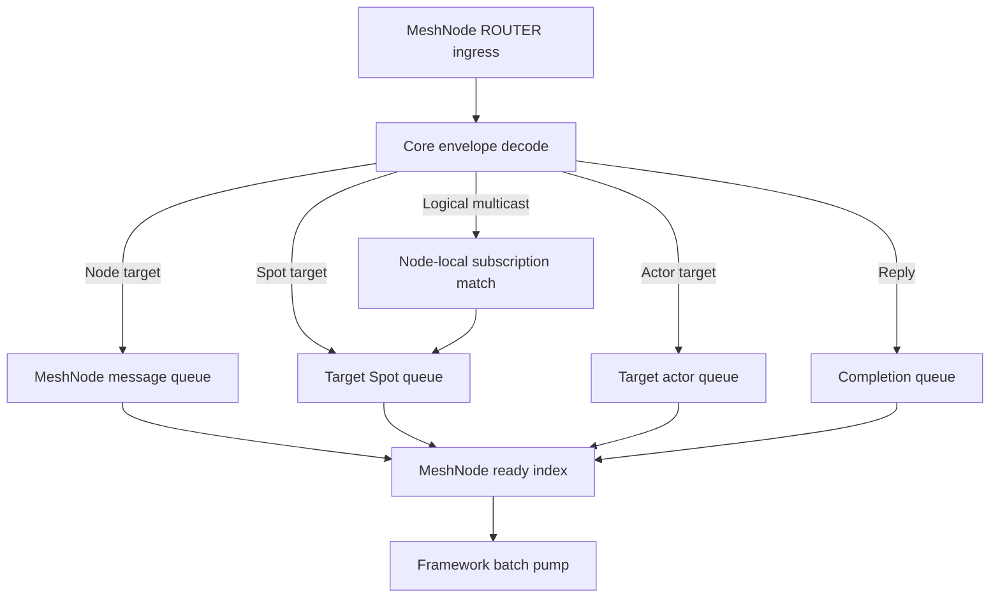

# MeshNode Core 10.0.0 공개 API 검토

> 상태: 구현 전 검토 문서다. 이 문서의 10.0.0 계약 이름과 시그니처는 현재 공개 계약이 아니다.
> 이 문서의 방향 결정은 §14에서 확정했다. exact C signature와 ABI를 `core/doc/spec/core/`의 한국어·영문
> 정식 owner 문서에 먼저 작성하고 구현을 시작한다. 현재 checkout과 정식 계약의 차이는 이 디렉토리의
> 임시 실행 추적 문서에 기록하며, 구현과 `core/include/zlink.h`, contract test를 정식 spec에 맞춘다.
>
> Core 10.0.0은 정식 spec에 기록한 공개 표면만 제공한다. 제거 대상으로 판정한 API는
> deprecated alias나 forwarding wrapper를 남기지 않고 공개 symbol과 구현 코드를 함께 삭제한다.
>
> MeshNode·Spot·Actor service runtime의 dispatch와 framework 경계는
> [`MeshNode·Spot·Actor framework 우선 dispatch 설계`](./mesh-node-framework-dispatch-design.ko.md)를
> 따른다. 이 문서의 초기 callback·part recv 후보와 충돌하면 전용 설계가 우선한다.

대상 독자는 Core C API와 bindings 계약을 검토하는 개발자다. 이 문서는 “현재 service 공개 표면의 모든
함수·type·enum·macro를 10.0.0에서 어떻게 판정하고 무엇으로 대체하는가?”에 답한다. 작성·개정·검토에는
[`기술문서 작성 원칙`](../../../../doc/principal/documentation/documentation-principles.ko.md)을 적용한다.
이 문서는 10.0.0 API 실행 blueprint라서 현재 checkout과 정식 계약을 대조한다. 정식 Core spec에는
10.0.0 공개 계약만 기록한다.

## 1. 목적

`SpotNode`를 `MeshNode`로 이름만 바꾸면 전환이 끝나지 않는다. 현재 Core에서는 node lifecycle,
Spot 생성, actor registry, actor와 STREAM session 연결, routed messaging, topic publish, callback,
poller, 공통 option과 상태 조회가 하나의 handle 관계망을 이룬다. 따라서 `zlink_spot_node_*` 접두사가
있는 함수만 바꾸면 기존 이름과 책임이 다른 공개 API에 남고, framework가 node-target message를
수신할 공개 경로도 누락된다.

이 문서는 다음 질문에 답한다.

- 현재 공개 헤더에서 SpotNode 또는 그 하위 객체에 참여하는 API가 무엇인가?
- 각 API를 MeshNode로 이름 변경할지, Spot 또는 STREAM에 유지할지, 제거할지 결정했는가?
- node, Spot, actor와 STREAM session의 수신 callback과 queue 경계가 분리되어 있는가?
- 공통 option, send-ready와 poller가 MeshNode handle에서 어떤 의미를 가지는가?
- framework가 bindings의 공개 API만으로 MeshNode 기능을 사용할 수 있는가?

## 2. 기준과 검토 범위

현재 checkout의 기준은 다음 공개 헤더와 현재 handle 분기 구현이다.

다음 목록은 현재 checkout의 공개 표면을 10.0.0 정식 계약에 대조하는 입력이다.

- [`core/include/zlink/service/spot.h`](../../../../core/include/zlink/service/spot.h)
- [`core/include/zlink/service/actor.h`](../../../../core/include/zlink/service/actor.h)
- [`core/include/zlink/service/common.h`](../../../../core/include/zlink/service/common.h)
- [`core/include/zlink/socket/api.h`](../../../../core/include/zlink/socket/api.h)
- [`core/include/zlink/eventing/api.h`](../../../../core/include/zlink/eventing/api.h)
- [`core/include/zlink_enum.h`](../../../../core/include/zlink_enum.h)
- [`core/src/api/service/service_option_api.cpp`](../../../../core/src/api/service/service_option_api.cpp)
- [`core/src/api/service/service_handler_api.cpp`](../../../../core/src/api/service/service_handler_api.cpp)
- [`core/src/api/service/service_poller_api.cpp`](../../../../core/src/api/service/service_poller_api.cpp)

검토 범위는 세 단계로 나눈다.

| 범위 | 포함 기준 | 예 |
|---|---|---|
| 직접 API | SpotNode handle을 직접 받거나 `spot_node` 이름을 공개하는 API | lifecycle, peer, actor, publisher, query |
| 소유 객체 API | SpotNode에서 만들어지거나 node registry와 route를 사용하는 객체의 API | Spot, actor, Spot publisher, STREAM–actor 연결 |
| 공통 handle API | 이름에는 node가 없지만 현재 SpotNode 또는 Spot handle을 분기 처리하는 API | option, routing ID, TLS, send-ready, poller |

`zlink_socket(...)`, 일반 DEALER/ROUTER/PUB/SUB/STREAM send·receive와 classic PUB/SUB의 독립 공개
계약은 전환 대상이 아니다. 다만 기존 Spot route bridge가 raw ROUTER helper에 의존하므로 해당 helper에
bridge 전용 코드가 남지 않게 함께 검토한다.

## 3. 검토 결론

현재 상태에서 확인된 핵심 결론은 다음과 같다.

1. MeshNode는 Spot보다 상위 runtime이므로 lifecycle, topology, Spot registry, actor registry와 node
   query의 `spot_node` 이름을 모두 `mesh_node`로 바꿔야 한다.
2. Spot, actor와 STREAM session 개념은 유지한다. Spot handle을 받는 함수는 이름을 유지하고,
   node handle을 받는 actor 함수만 MeshNode 이름으로 바꾼다.
3. `zlink_spot_route_bridge_*`는 별도 ROUTER channel과 SpotNode를 연결하기 위한 공개 adapter다.
   MeshNode가 channel, node, Spot route를 직접 수신하면 책임이 중복되므로 10.0.0 계약의 정상 경로에서는
   제거한다.
4. Spot Logical Multicast publisher는 유지하되 `zlink_mesh_node_publisher_*`로 바꾼다. 물리
   PUB/XSUB socket, remote subscription 전파와 PUB/SUB 전용 node option은 제거한다.
5. 현재 Spot callback, part recv와 per-request callback 묶음은 framework 수신 경로에 불필요한 FFI와
   drain loop를 만든다. 새 계약은 MeshNode ready callback, opaque claim과 versioned batch를 사용한다.
6. Actor payload는 Spot callback을 경유하지 않고 Actor mailbox와 Actor claim에서 직접 수신한다. Node,
   Spot과 Actor application claim은 분리하고 completion·send-ready는 infrastructure claim으로 처리한다.
7. MeshNode는 공통 HWM·timeout option, routing ID, TLS와 poller를 지원한다. receive callback과
   `POLLIN`은 함께 등록할 수 없고 `POLLOUT`은 독립적으로 사용할 수 있다. send-ready는 infrastructure
   claim으로 제공한다.
8. `zlink_set_router_option(...)`은 raw ROUTER/DEALER에만 유지한다. MeshNode는 공통 option과 MeshNode
   전용 ROUTER HWM·service mailbox budget만 공개하고 Core dispatch worker 수를 노출하지 않는다.
9. 폐기 대상 API를 전달하는 alias, old/new mode 분기와 deprecated 기간은 두지 않는다. 제거 API의 header,
   export, runtime branch, test, sample, 문서와 bindings 코드를 Core 10.0.0 전환에서 함께 삭제한다.

## 4. Core C API 현재 checkout 전수 인벤토리

### 4.1 lifecycle, Spot registry와 topology

| 영역 | 현재 checkout 공개 API | 현재 책임 |
|---|---|---|
| node 생성·종료 | `zlink_spot_node_new`, `zlink_spot_node_destroy` | mode에 따라 routed와 PUB/SUB runtime 생성·종료 |
| Spot facade | `zlink_spot_new`, `zlink_spot_destroy` | node가 소유하는 entry/user Spot 접근 facade 생성·종료 |
| entry Spot | `zlink_spot_node_entry_spot` | node의 entry Spot 조회 |
| user Spot registry | `zlink_spot_node_spot_lookup`, `zlink_spot_node_spot_get_or_new` | Spot RID로 node-local Spot 조회·생성 |
| bind | `zlink_spot_node_set_router_bind`, `zlink_spot_node_set_pub_bind` | ROUTER endpoint와 PUB/SUB endpoint 설정 |
| PUB/SUB identity | `zlink_spot_node_set_pub_routing_id`, `zlink_spot_node_set_sub_routing_id` | 내부 PUB·XSUB socket identity 설정 |
| peer 연결 | `zlink_spot_node_connect_peer`, `zlink_spot_node_connect_peer_rid` | endpoint 연결과 선택적 target node RID 연결 |
| peer 해제 | `zlink_spot_node_disconnect_peer`, `zlink_spot_node_disconnect_peer_rid` | endpoint 또는 target RID 기준 연결 해제 |

### 4.2 actor registry, 이동과 session 연결

| 영역 | 현재 checkout 공개 API | 현재 책임 |
|---|---|---|
| actor 생성 | `zlink_spot_node_actor_new`, `zlink_spot_node_actor_new_with_request` | node-local actor 생성과 선택적 생성 payload 전달 |
| actor 조회 | `zlink_spot_node_actor_lookup`, `zlink_remote_actor_get_ref` | local actor 조회와 remote node actor ref 요청 |
| actor 종료 | `zlink_spot_node_actor_destroy` | actor 종료 요청과 completion 전달 |
| Spot 참여 | `zlink_spot_node_actor_join_spot`, `zlink_spot_node_actor_join_entry_spot`, `zlink_spot_node_actor_leave_spot` | actor가 존재할 Spot 변경 |
| 참여 수신·응답 | `zlink_spot_actor_join_recv`, `zlink_spot_actor_join_reply` | 대상 Spot에서 참여 요청 수신·응답 |
| actor 수신 | `zlink_spot_node_actor_recv_part` | part 단위 수신을 제거하고 Actor claim·batch가 complete multipart를 반환하도록 대체 |
| actor send·request | `zlink_spot_node_send_to_actor`, `zlink_spot_node_request_to_actor`, `zlink_spot_node_actor_reply_no_bind` | complete multipart 의미는 유지하되 per-request callback과 route-bearing reply info를 operation ID·completion과 one-shot reply token으로 대체 |
| bound session send | `zlink_spot_node_actor_send_bound_session_msg`, `zlink_spot_node_actor_forward_bound_session_part` | 두 함수를 제거하고 actor와 연결된 STREAM session에 complete multipart를 한 번에 제출하는 API로 대체 |
| bound session 관리 | `zlink_spot_node_actor_bind_remote_session`, `zlink_spot_node_actor_close_bound_session` | remote STREAM session 연결 정보 설정·종료 |
| lifecycle 수신 | `zlink_spot_recv_actor_lifecycle`, `zlink_spot_recv_actor_lifecycle_with_request` | Spot에서 actor 생성·종료 event 수신 |
| STREAM 조회 | `zlink_stream_bound_actors` | STREAM session에 연결된 ActorRef 목록 조회 |

### 4.3 route bridge, publisher와 drain

| 영역 | 현재 checkout 공개 API | 현재 책임 |
|---|---|---|
| bridge lifecycle | `zlink_spot_route_bridge_new`, `zlink_spot_route_bridge_close` | SpotNode와 별도 ROUTER channel 사이 adapter 생성·종료 |
| channel attach | `zlink_spot_route_bridge_attach_router_channel` | raw ROUTER와 channel name을 bridge에 등록 |
| bridge outbound | `zlink_spot_route_bridge_send`, `zlink_spot_route_bridge_request` | channel별 Spot send·request 변환 |
| bridge inbound | `zlink_spot_route_bridge_handle_router_received` | raw ROUTER 수신 message를 Spot route로 변환 |
| bridge completion | `zlink_spot_route_bridge_drain` | bridge request completion 처리 |
| publisher | `zlink_spot_node_publisher_new`, `zlink_spot_node_publisher_publish`, `zlink_spot_node_publisher_close` | node topic plane publish handle |
| Spot completion | `zlink_spot_drain_reply`, `zlink_spot_drain_channel_reply` | Spot request와 channel dealer completion 처리 |

### 4.4 status와 inventory query

| 영역 | 현재 checkout 공개 API | 현재 책임 |
|---|---|---|
| node 상태 | `zlink_spot_node_status` | 두 socket plane의 endpoint, peer, subject와 오류 요약 |
| peer 목록 | `zlink_spot_node_peers` | manual/discovery peer 상태 조회 |
| subject 목록 | `zlink_spot_node_subjects` | PUB/SUB role과 topic/pattern readiness 조회 |
| 내부 socket | `zlink_spot_node_internal_sockets` | node·Spot 소유 socket과 monitor 상태 조회 |
| Spot 목록 | `zlink_spot_node_spots` | node-local Spot, actor 참여와 route sync 상태 조회 |
| actor 목록 | `zlink_spot_node_actors`, `zlink_spot_actors` | node 또는 Spot 범위 ActorRef 조회 |

### 4.5 Spot messaging과 callback

이 표의 함수는 Spot handle을 받으므로 이름은 유지할 수 있다. 그러나 내부 전송 경로가 PUB/SUB 또는
route bridge에 연결된 함수는 MeshNode ROUTER와 local subscription registry를 사용하도록 바꿔야 한다.

| 영역 | 현재 checkout 공개 API | 10.0.0 계약에서 유지할 의미 |
|---|---|---|
| channel send·request | `zlink_spot_send_channel_part`, `zlink_spot_request_channel_part` | 의미는 유지하되 complete multipart와 metadata를 한 번에 받는 새 API로 대체 |
| Spot send·request | `zlink_spot_send_spot_part`, `zlink_spot_request_spot_part` | 의미는 유지하되 destination과 complete multipart·metadata를 한 번에 받는 새 API로 대체 |
| raw ROUTER 대상 | `zlink_spot_request_router_part`, `zlink_spot_reply_router_part` | Spot bridge 전용 표면이므로 10.0.0에서 제거 |
| Spot reply | `zlink_spot_reply_spot_part` | source route를 노출하지 않는 opaque reply token과 complete multipart API로 대체 |
| Logical Multicast | `zlink_spot_publish_part` | target `ChannelName`과 complete multipart를 한 번에 받는 Logical Multicast API로 대체 |
| subscription data 수신 | `zlink_spot_subscribe_part` | Spot subscription claim·batch가 source `ChannelName`과 complete multipart를 함께 반환 |
| subscription control 수신 | `zlink_spot_recv_subscription_event` | remote subscription protocol과 함께 제거할 대상 |
| routed 수신 | `zlink_spot_recv_part` | Spot routed claim·batch가 complete multipart와 request token을 함께 반환 |
| dispatch callback | `zlink_spot_dispatch_event_handler` | 현재는 Spot, timer, actor와 Spot-owned completion readiness를 통지하며, 10.0.0 계약에서는 symbol을 제거하고 MeshNode ready·claim·batch로 대체 |

### 4.6 raw ROUTER와 STREAM 경계 API

| 영역 | 현재 checkout 공개 API | 검토 이유 |
|---|---|---|
| raw ROUTER receive | `zlink_router_recv_part` | 현재 bridge가 node RID와 Spot RID가 포함된 frame을 수신할 때 사용 |
| raw ROUTER–Spot | `zlink_router_request_spot_part`, `zlink_router_reply_spot_part`, `zlink_router_send_spot_part` | 별도 raw ROUTER에서 Spot route를 만드는 bridge 표면이므로 제거 |
| raw ROUTER request | `zlink_router_request_part`, `zlink_router_reply_part` | MeshNode가 숨기는 ROUTER를 framework가 직접 사용하지 않는지 확인 필요 |
| channel metadata | `zlink_socket_set_channel_name`, `zlink_socket_get_channel_name` | raw socket channel metadata와 MeshNode `ChannelName`을 혼동하지 않도록 분리 필요 |
| STREAM–actor 연결 | `zlink_stream_bind_actor`, `zlink_stream_unbind_actor`, `zlink_stream_send_bound_actor_part` | STREAM socket 계약은 유지한다. 다만 MeshNode Actor mailbox로 들어가는 part send는 complete multipart submit으로 대체하며 bind·unbind callback도 operation completion으로 바꾼다 |

### 4.7 공통 handle API

| 영역 | 현재 checkout 공개 API | 현재 SpotNode 참여 방식 |
|---|---|---|
| 공통 option | `zlink_set_option`, `zlink_get_option` | service handle을 판별해 node 내부 socket option에 전달 |
| identity | `zlink_set_routing_id`, `zlink_get_routing_id` | Spot 또는 SpotNode identity 설정·조회 |
| TLS | `zlink_set_tls_server`, `zlink_set_tls_client` | SpotNode가 소유한 network socket에 TLS 설정 적용 |
| ROUTER option | `zlink_set_router_option`, `zlink_get_router_option` | 현재 raw ROUTER/DEALER만 지원하며 SpotNode는 지원하지 않음 |
| Spot option | `zlink_set_spot_option`, `zlink_get_spot_option` | Spot request timeout 설정 |
| publisher option | `zlink_set_pub_option`, `zlink_get_pub_option` | PUB/XPUB와 Spot publisher 계열 option 설정 |
| subscriber option | `zlink_set_sub_option`, `zlink_get_sub_option` | SUB/XSUB와 Spot subscriber 계열 option 설정 |
| node option | `zlink_set_spot_node_option`, `zlink_get_spot_node_option` | ROUTER/PUBSUB HWM profile과 dispatch worker 설정. 10.0.0 계약에서는 PUBSUB과 Core worker 설정을 제거 |
| subscription registry | `zlink_set_subscription`, `zlink_unset_subscription`, `zlink_subscription_at` | raw SUB/XSUB filter 설정·조회는 유지하고 Spot 지원은 channel-scoped 전용 API로 대체 |
| generic publish | `zlink_publish_part` | raw PUB/XPUB만 지원하고 다른 socket·service handle은 거부 |
| generic send·recv | `zlink_send_part`, `zlink_send_part_rid`, `zlink_recv_part` | 현재 service handle을 받지 않음. MeshNode 전송·수신을 이 raw socket API로 우회하지 않음 |
| send readiness | `zlink_send_ready_handler` | Spot과 SpotNode의 send retry readiness callback 등록 |
| poller | `zlink_poller_add`, `zlink_poller_modify`, `zlink_poller_remove` | Spot/SpotNode의 PUB·SUB 양쪽 readiness를 합성 |
| Spot timer | `zlink_spot_timer_new` | SpotNode-owned scheduler를 쓰는 별도 timer handle 생성. timer handler 또는 poller/recv로 만료 수신 |

`zlink_poll(...)`은 raw socket 또는 fd를 받는 API이며 service handle을 분기하지 않는다. 따라서
MeshNode 지원 대상으로 확대하지 않고, service handle은 `zlink_poller_*` 계약으로만 다룬다.

`zlink_timer_*`와 `zlink_spot_timer_new(...)`는 C/C++에서 사용할 전통적인 eventing API로 유지한다.
C++ framework adapter는 별도 timer handler 또는 poller/recv에서 받은 만료를 Spot keyed scheduler에
제출한다. 관리형 framework의 Spot timer는 platform timer를 같은 keyed scheduler에 직접 제출한다.
어느 경로도 MeshNode service mailbox나 receive batch에 timer lane을 추가하지 않는다.

### 4.8 공개 type과 enum

| 분류 | 현재 checkout type·enum | 판정 방향 |
|---|---|---|
| node lifecycle | `zlink_spot_node_mode_t`, `zlink_spot_node_options_t`, `zlink_spot_node_state_t` | mode 제거, options와 state를 MeshNode 이름으로 새 계약 작성 |
| node option | `zlink_spot_node_option_t` | ROUTER·worker 항목만 MeshNode option으로 이동하고 PUBSUB 항목 제거 |
| socket inventory | `zlink_spot_node_socket_owner_t`, `zlink_spot_node_socket_filter_t`, `zlink_spot_node_socket_entry_t` | MeshNode 이름으로 변경하고 network socket 종류를 ROUTER 하나로 제한 |
| peer inventory | `zlink_spot_peer_source_t`, `zlink_spot_peer_kind_t`, `zlink_spot_peer_state_t`, `zlink_spot_node_peer_filter_t`, `zlink_spot_node_peer_entry_t` | source/state 유지, peer kind와 row를 RouteMesh descriptor에 맞게 변경 |
| subject inventory | `zlink_spot_role_t`, `zlink_spot_node_subject_filter_t`, `zlink_spot_node_subject_entry_t` | remote PUB/SUB subject 의미와 query를 제거하며 public local subscription inventory로 대체하지 않음 |
| object inventory | `zlink_spot_node_spot_entry_t`, `zlink_spot_node_actor_entry_t` | MeshNode 소유 inventory로 이름 변경 |
| status | `zlink_spot_node_status_t` | 기존 ABI를 변경하지 않고 versioned MeshNode status 또는 새 query 작성 |
| bridge | `zlink_spot_route_bridge_options_t`, `zlink_spot_route_bridge_endpoint_options_t` | Core 10.0.0에서 bridge 함수와 함께 제거 |
| Spot identity·option | `zlink_spot_kind_t`, `zlink_spot_option_t` | Spot-scoped 의미와 값을 유지 |
| Spot dispatch | `zlink_spot_dispatch_event_t`, `zlink_spot_dispatch_subject_kind_t`, `zlink_spot_dispatch_info_t` | Spot별 dispatch callback과 함께 제거하고 숫자는 reserved. MeshNode ready record의 owner kind·event mask로 대체 |
| service callback type | `zlink_spot_dispatch_event_handler_fn`, `zlink_actor_join_spot_handler_fn`, `zlink_actor_join_entry_spot_handler_fn`, `zlink_actor_lookup_handler_fn` | type과 service 사용처를 제거하고 Core operation ID와 ready·claim·completion batch로 대체 |
| 공용 reply callback type | `zlink_reply_handler_fn` | raw DEALER/ROUTER request가 사용하므로 type은 유지하고 MeshNode·Spot·Actor service 사용처만 operation completion으로 교체 |
| raw send-ready callback | `zlink_send_ready_handler_fn` | 전통적인 socket API에는 유지하고 MeshNode·Spot service handle 지원은 제거 |
| raw receive callback type | `zlink_socket_msg_handler_fn` | source RID만 제공하므로 MeshNode request sequence와 destination metadata를 표현하는 용도로 재사용하지 않음 |
| 사용처 없는 subscription callback type | `zlink_subscribe_handler_fn` | 공개 등록 API가 없는 현재 상태를 확인하고 제거 또는 실제 계약 편입을 결정 |
| actor identity·route | `zlink_actor_ref_t`, `zlink_actor_route_t` | type과 개념을 유지하며 `node_rid`는 owner MeshNode RID를 뜻함 |
| actor receive·lookup 결과 | `zlink_actor_recv_info_t`, `zlink_actor_lookup_result_t` | source route를 포함한 기존 결과 type을 제거하고 Actor receive batch와 infrastructure completion의 versioned record로 대체 |
| actor join | `zlink_actor_join_info_t`, `zlink_actor_join_result_t`, `zlink_actor_join_entry_spot_result_t` | `request` pointer를 포함한 기존 type과 callback 결과 type을 제거하고 Spot control batch의 join record, one-shot reply token과 infrastructure completion record로 대체 |
| actor lifecycle | `zlink_spot_actor_lifecycle_info_t`, `zlink_spot_actor_lifecycle_event_kind_t`, `zlink_spot_actor_lifecycle_event_t` | 기존 전용 receive type을 제거하고 Spot control batch의 versioned lifecycle record와 새 event kind로 대체 |
| monitor source | `zlink_monitor_source_kind_t`의 `SPOT_PUB`, `SPOT_SUB` | MeshNode status가 참조하는 source를 ROUTER와 local queue 의미로 재설계하고 기존 값은 재사용하지 않음 |
| service/channel role | `ZLINK_SERVICE_ROLE_SPOT`, `ZLINK_CHANNEL_ROLE_SPOT`과 연관 PUB/SUB/ROUTER 값 | bridge 제거 뒤 classic fanout·STREAM을 포함한 독립 사용처를 조사하고 값 단위로 유지·제거 판정 |
| bridge capability | `ZLINK_SPOT_ROUTE_BRIDGE_CAP_SPOT_ROUTE`, `ZLINK_SPOT_ROUTE_BRIDGE_ROUTE_ONLY` | bridge type·함수와 함께 제거하고 이름을 재사용하지 않음 |

기존 enum 숫자는 다른 의미로 재사용하지 않는다. 제거되는 PUB/SUB mode와 option 값은 reserved로
남기고, 새 MeshNode enum에는 별도 이름과 값을 부여한다.

공개 macro와 누락되기 쉬운 값도 함수 처리표와 같은 수준으로 고정한다.

| 현재 checkout macro·enumerator | 10.0.0 계약 처리 |
|---|---|
| `ZLINK_ACTOR_ID_MAX` | ActorRef와 public actor row의 고정 상한으로 유지 |
| `ZLINK_ACTOR_JOIN_INFO_REMOTE` | 기존 join info type과 함께 제거하고 숫자는 reserved. 새 join control/completion record에는 별도 이름의 remote-owner flag를 정의 |
| `ZLINK_ACTOR_RECV_INFO_NO_BIND` | 기존 receive info type과 함께 제거하고 숫자는 reserved. 새 Actor batch record에는 별도 이름의 no-bound-session flag를 정의 |
| `ZLINK_SPOT_KIND_INVALID`, `ZLINK_SPOT_KIND_ENTRY`, `ZLINK_SPOT_KIND_USER` | Spot 종류의 현재 값과 의미 유지 |
| `ZLINK_SPOT_ACTOR_LIFECYCLE_JOINED`, `ZLINK_SPOT_ACTOR_LIFECYCLE_LEFT`, `ZLINK_SPOT_ACTOR_LIFECYCLE_DISCONNECTED` | 기존 lifecycle enum과 함께 제거하고 숫자는 reserved. 새 Spot control record에는 별도 이름과 값으로 lifecycle kind를 정의 |
| `ZLINK_SPOT_OPT_REQUEST_TIMEOUT_MS` | Spot·Actor request의 기본 timeout option으로 유지하고 Core operation completion에 적용 |
| `ZLINK_SPOT_ROUTE_BRIDGE_CAP_SPOT_ROUTE`, `ZLINK_SPOT_ROUTE_BRIDGE_ROUTE_ONLY` | route bridge와 함께 제거하고 이름·숫자를 재사용하지 않음 |

### 4.9 enum 값과 status 필드 처리표

| 현재 checkout 값 | 10.0.0 계약 처리 |
|---|---|
| `ZLINK_SPOT_NODE_MODE_PUBSUB`, `ZLINK_SPOT_NODE_MODE_ROUTED`, `ZLINK_SPOT_NODE_MODE_ALL` | MeshNode mode에서는 모두 제거하고 숫자는 reserved로 유지 |
| `ZLINK_SPOT_NODE_OPT_ROUTER_HWM_PROFILE`, `ZLINK_SPOT_NODE_OPT_ROUTER_HWM` | MeshNode 이름의 대응 option으로 이동 |
| `ZLINK_SPOT_NODE_OPT_PUBSUB_HWM_PROFILE`, `ZLINK_SPOT_NODE_OPT_PUBSUB_HWM` | 제거하고 숫자는 reserved로 유지 |
| `ZLINK_SPOT_NODE_OPT_DISPATCH_WORKERS_MIN`, `ZLINK_SPOT_NODE_OPT_DISPATCH_WORKERS_MAX` | 제거하고 숫자는 reserved. MeshNode는 Core worker pool을 소유하지 않으며 callback 또는 poller와 claim·batch를 사용 |
| `ZLINK_SPOT_NODE_SOCKET_OWNER_ANY`, `ZLINK_SPOT_NODE_SOCKET_OWNER_NODE`, `ZLINK_SPOT_NODE_SOCKET_OWNER_SPOT` | MeshNode 이름으로 변경. node owner의 network socket은 ROUTER 하나이고 Spot owner는 local queue/dispatch resource를 나타냄 |
| `ZLINK_SPOT_NODE_STATE_IDLE`, `ZLINK_SPOT_NODE_STATE_CONNECTING`, `ZLINK_SPOT_NODE_STATE_PARTIAL_READY`, `ZLINK_SPOT_NODE_STATE_READY`, `ZLINK_SPOT_NODE_STATE_ERROR` | MeshNode 이름으로 변경하고 partial-ready가 peer 일부 연결인지 application dispatch 미준비인지 구체적으로 정의 |
| `ZLINK_SPOT_PEER_SOURCE_MANUAL`, `ZLINK_SPOT_PEER_SOURCE_DISCOVERY`, `ZLINK_SPOT_PEER_SOURCE_MIXED` | 같은 source 의미로 MeshNode peer type에 유지 |
| `ZLINK_SPOT_PEER_KIND_SPOT_MESH`, `ZLINK_SPOT_PEER_KIND_ROUTER_CHANNEL` | 두 종류를 RouteMesh peer 하나로 통합하고 기존 숫자는 재사용하지 않음 |
| `ZLINK_SPOT_PEER_STATE_CONFIGURED`, `ZLINK_SPOT_PEER_STATE_CONNECTING`, `ZLINK_SPOT_PEER_STATE_CONNECTED` | RouteMesh peer state로 이름 변경. handler-ready와 drain은 별도 state 또는 flag로 표현 |
| `ZLINK_SPOT_ROLE_PUB`, `ZLINK_SPOT_ROLE_SUB` | remote socket role로는 제거. local publisher/subscription 관측에 필요하면 새 의미와 이름으로 정의 |
| `ZLINK_MONITOR_SOURCE_SPOT_PUB`, `ZLINK_MONITOR_SOURCE_SPOT_SUB` | 물리 Spot PUB/SUB source로는 제거하고 기존 숫자는 재사용하지 않음 |
| `ZLINK_SPOT_DISPATCH_EVENT_SUBSCRIBE_READABLE` | Spot별 dispatch callback 제거와 함께 제거하고 숫자는 reserved로 유지 |
| `ZLINK_SPOT_DISPATCH_EVENT_CHANNEL_REPLY_READABLE` | 제거하고 숫자는 reserved로 유지. request completion은 infrastructure claim으로 통합 |
| `ZLINK_SPOT_DISPATCH_EVENT_TIMER_READABLE` | 제거하고 숫자는 reserved로 유지. C/C++ timer는 독립 timer handle의 handler 또는 poller/recv를 사용 |
| `ZLINK_SPOT_DISPATCH_EVENT_ACTOR_READABLE` | 제거하고 숫자는 reserved로 유지. Actor application readiness는 Actor claim으로 대체 |
| `ZLINK_SPOT_DISPATCH_EVENT_ACTOR_JOIN_READABLE` | 제거하고 숫자는 reserved로 유지. join completion은 operation ID infrastructure claim으로 대체 |
| `ZLINK_SPOT_DISPATCH_EVENT_ACTOR_LIFECYCLE_READABLE` | 제거하고 숫자는 reserved로 유지. lifecycle record는 Spot claim의 control lane으로 대체 |
| `ZLINK_SPOT_DISPATCH_SUBJECT_CHANNEL_DEALER` | 제거하고 숫자는 reserved로 유지. 10.0.0 계약에는 raw channel dealer subject가 없음 |
| `ZLINK_SPOT_DISPATCH_SUBJECT_SPOT`, `ZLINK_SPOT_DISPATCH_SUBJECT_TIMER`, `ZLINK_SPOT_DISPATCH_SUBJECT_ACTOR` | Spot dispatch subject enum type과 함께 제거하고 숫자는 reserved로 유지 |
| `ZLINK_SPOT_DISPATCH_EVENT_ROUTED_READABLE` | 기존 값은 제거하고 숫자는 reserved로 유지. Spot application readiness는 MeshNode ready record의 owner kind와 event mask로 표현 |

`zlink_spot_node_status_t`는 기존 layout을 유지한 채 필드 뜻을 바꾸지 않는다. 새 versioned 구조 또는
새 query는 다음 필드 처리를 반영한다.

| 현재 checkout 필드 | 10.0.0 계약 처리 |
|---|---|
| `channel_name` | `mesh_name`과 versioned immutable channel-name set query로 분리 |
| `local_endpoint`, `node_routing_id` | MeshNode ROUTER endpoint와 RID로 유지 |
| `state`, `last_error`, `last_changed_ms` | MeshNode lifecycle 의미로 유지 |
| `configured_peer_count`, `active_peer_count`, `connected_peer_count` | RouteMesh peer descriptor와 RID pipe 기준으로 유지 |
| `subject_count`, `ready_subject_count`, `disconnected_sub_target_count` | remote subscription 상태와 함께 제거 |
| `disconnected_routed_target_count` | disconnected RouteMesh peer 또는 unavailable channel member처럼 관측 목적에 맞는 이름으로 분리 |

peer row에는 현재 checkout에 없는 peer RID, peer immutable `ChannelName` set, generation과 drain/ready 상태가 필요하다.
subject row는 remote subscription 상태를 표현하므로 그대로 이름만 바꾸지 않는다. internal socket row는
PUB/XSUB 항목을 제거하고 ROUTER와 local dispatch resource를 구분한다. Spot과 actor row는 owner 이름만
MeshNode로 바꾸고 RID, actor generation, pending queue와 route sync 의미를 유지한다.

## 5. 현재 빠진 node 수신 계약

### 5.1 현재 checkout callback 경계

| 대상 | 공개 callback | 실제 data 수신 | 판정 |
|---|---|---|---|
| raw STREAM | `zlink_recv_handler` | callback이 multipart 소유권을 직접 받음 | 유지 |
| Spot | `zlink_spot_dispatch_event_handler` | event별 Spot·actor·timer recv/drain API 호출 | ready·claim·batch로 대체 |
| SpotNode | 없음 | node-target message를 framework handler로 전달할 공개 recv 경로도 없음 | 신규 계약 필요 |
| SpotNode send | `zlink_send_ready_handler` | 실패한 send를 호출자가 재시도 | service handle 지원을 제거하고 MeshNode infrastructure `SEND_READY` claim으로 대체 |

Core 내부의 `spot_node_install_recv_handler(...)`는 공개 헤더에 없으므로 계약 근거가 아니다. bindings나
framework가 internal symbol, raw ROUTER frame 또는 reflection으로 이 누락을 우회하면 안 된다.

### 5.2 10.0.0 계약 dispatch 분리



ready callback은 payload나 owner별 event를 직접 전달하지 않고 framework pump를 깨운다. pump는 ready
batch에서 Node, Spot, Actor 또는 infrastructure claim을 인수하고 해당 typed receive batch만 drain한다.
peer handshake, descriptor 교환, ping과 route sync 같은 control frame은 Core 내부에서 끝내고 application
batch에 노출하지 않는다.

### 5.3 callback 설계안 비교

| 안 | 설명 | 장점 | 문제 |
|---|---|---|---|
| payload 직접 callback | callback 인자로 metadata와 multipart payload를 함께 전달 | 호출 횟수가 적고 표면이 짧음 | Core I/O callback 안에서 framework dispatch가 실행되고, ownership·부분 수신·request reply 처리가 callback signature에 집중됨 |
| callback + part recv | callback은 readable event만 알리고 framework가 part recv를 반복함 | 현재 Spot 모델과 가까움 | FFI 호출과 drain loop가 message·part 수에 비례함 |
| ready index + claim + batch | callback은 MeshNode wakeup만 알리고 객체별 mailbox를 claim으로 batch drain함 | ownership, fairness와 async turn을 Core가 숨김 | claim·batch lifetime과 infrastructure completion 계약이 필요함 |

추천안은 ready index, opaque claim과 versioned batch다. application claim은 Node, Spot과 Actor handler
turn을 직렬화하고 completion·send-ready infrastructure claim은 handler가 `await`하는 동안에도 drain할 수
있다. exact lifetime과 error는 전용 dispatch 설계와 Core 10.0.0 spec에서 고정한다.

### 5.4 신규 API 후보

다음 코드는 필요한 책임을 확인하기 위한 후보이며 정식 C 계약이 아니다.

```c
/* Channel membership은 start 전에만 추가하고 게시 뒤에는 immutable이다. */
zlink_mesh_node_add_channel_name(node, "orders");
zlink_mesh_node_add_channel_name(node, "billing");

/* Membership name은 고정하지만 selection weight는 실행 중 갱신할 수 있다. */
zlink_mesh_node_set_channel_weight(node, "orders", 50);

/* Callback은 readable domain mask만 알리고 payload를 전달하지 않는다. */
zlink_mesh_node_set_ready_handler(node, on_ready, userdata);

/* 여러 ready record와 batch-independent claim capability를 한 번에 가져온다. */
zlink_mesh_node_drain_ready(node, ready_batch, &has_residue);

/* Claim kind에 맞는 complete multipart record만 versioned batch에 채운다. */
zlink_mesh_node_recv_batch(node, claim, event_mask, receive_batch, flags);
zlink_spot_recv_batch(node, claim, event_mask, receive_batch, flags);
zlink_actor_recv_batch(node, claim, event_mask, receive_batch, flags);

/* Claim은 MeshNode handle과 독립적으로 어느 thread에서든 반환할 수 있다. */
zlink_mesh_claim_release(&claim);

/* RID 직접 전송은 선택과 submit을 한 Core 호출 안에서 수행한다. */
zlink_mesh_node_send_to_node(
    node, &target_rid, application_metadata, parts, part_count, flags);

/* RID request 성공 시 Core-generated operation ID를 반환하고 completion batch로 완료한다. */
zlink_mesh_node_request_to_node(
    node, &target_rid, application_metadata, parts, part_count,
    &operation_id, flags, timeout_ms);

/* ChannelName 선택과 submit도 하나의 Core 호출로 수행한다. */
zlink_mesh_node_send_to_channel(
    node, "orders", application_metadata, parts, part_count, flags);

/* ChannelName round-robin 선택과 request submit 사이에 RID를 외부로 노출하지 않는다. */
zlink_mesh_node_request_to_channel(
    node, "orders", application_metadata, parts, part_count,
    &operation_id, flags, timeout_ms);

/* Request record의 one-shot token으로 source route를 재구성하지 않고 응답한다. */
zlink_mesh_node_reply(
    node, reply_token, parts, part_count, flags);

/* Target channel의 ready member를 Core가 직접 snapshot해 Logical Multicast한다. */
zlink_mesh_node_publisher_publish(
    publisher, "game", topic, parts, part_count, flags);
```

selection 함수가 RID만 반환하고 framework가 나중에 raw send를 호출하는 형태는 선택 직후
drain·disconnect가 발생할 수 있으므로 기본안으로 삼지 않는다.

위 `application_metadata`는 없을 수 있는 compact opaque frame view다. Core는 key-value 정책을 해석하지
않고 frame 존재 flag, codec version, 전체 byte 상한과 lifetime만 검증한다. C submit API의 입력 frame과
payload part는 borrowed read-only view다. 성공하면 Core가 반환 전에 각 `zlink_msg_t` reference를 보유하고,
실패를 포함한 모든 반환 결과에서 caller가 원본을 계속 소유한다. 따라서 caller는 함수 반환 직후 원본을
close하거나 재사용할 수 있고 Core는 caller buffer를 move하지 않는다. receive batch record는 routing field와
application metadata view를 분리해 제공한다. bindings/framework는 후자만 immutable application metadata
snapshot으로 decode한다.

10.0.0의 canonical metadata frame은 `version u8`, `count u8`, 이어지는 entry 배열로 고정한다. 각 entry는
`key_len u8`, UTF-8 key bytes, `value_len u16` network byte order와 UTF-8 value bytes 순서다. 전체 frame은
1024 bytes 이하이고 key 길이는 1..255 bytes다. outgoing builder에서 같은 key를 반복 설정하면 마지막 값만
encode하므로 wire에는 중복 key가 없다. ingress에서 count·length 불일치, 잘린 entry, trailing bytes, invalid
UTF-8 또는 duplicate key를 발견하면 protocol error로 complete service message를 handler admission 전에
폐기한다. Core의 canonical decoder가 위 조건을 모두 검사하고, bindings/framework는 검증이 끝난
record를 immutable application metadata로 투영한다. 모든 bindings는 같은 byte vector conformance
corpus를 사용해 Core result와 언어별 투영을 함께 검증한다.

## 6. 10.0.0 계약 API 처리표

### 6.1 이름 변경 또는 유지

| 현재 checkout | 10.0.0 계약 후보 | 처리 |
|---|---|---|
| `zlink_spot_node_new`, `zlink_spot_node_destroy` | `zlink_mesh_node_new`, `zlink_mesh_node_destroy` | 이름 변경 |
| `zlink_spot_new(node)`, `zlink_spot_destroy` | `zlink_spot_new(mesh_node)`, `zlink_spot_destroy` | 함수 이름 유지, 허용 owner type만 변경 |
| `zlink_spot_node_entry_spot` | `zlink_mesh_node_entry_spot` | 이름 변경 |
| `zlink_spot_node_spot_lookup`, `zlink_spot_node_spot_get_or_new` | `zlink_mesh_node_spot_lookup`, `zlink_mesh_node_spot_get_or_new` | 이름 변경 |
| actor lifecycle·registry·binding의 유지 대상 `zlink_spot_node_actor_*` | 대응하는 `zlink_mesh_node_actor_*` | node owner 이름을 바꾸고 callback·part 계약은 아래 제거·신규 계약에 따라 교체 |
| `zlink_spot_node_send_to_actor`, `zlink_spot_node_request_to_actor` | `zlink_mesh_node_send_to_actor`, `zlink_mesh_node_request_to_actor` 후보 | complete multipart 입력은 유지하고 per-request callback을 operation ID·completion으로 교체 |
| `zlink_remote_actor_get_ref` | `zlink_mesh_node_remote_actor_get_ref` 후보 | node handle을 받는 사실이 드러나도록 이름 보정 |
| `zlink_spot_actors` | 같은 이름 | Spot-scoped ActorRef inventory이므로 유지 |
| `zlink_stream_bind_actor`, `zlink_stream_unbind_actor`, `zlink_stream_bound_actors` | 같은 이름 | STREAM-scoped 의미는 유지하되 bind·unbind callback은 operation ID·completion 계약으로 교체 |
| `zlink_spot_node_set_router_bind` | `zlink_mesh_node_set_bind` | network bind가 하나이므로 이름 단순화 |
| `zlink_spot_node_connect_peer_rid` | `zlink_mesh_node_connect_peer`와 peer descriptor | RID, MeshName, immutable ChannelName set과 endpoint를 원자적으로 등록 |
| `zlink_spot_node_disconnect_peer_rid` | `zlink_mesh_node_disconnect_peer` | RID/generation 기준 해제 |
| `zlink_spot_node_publisher_*` | `zlink_mesh_node_publisher_*` | Logical Multicast publisher로 이름 변경 |
| `zlink_spot_node_status/peers/internal_sockets/spots/actors` | `zlink_mesh_node_*` query | 이름과 row type을 함께 변경 |
| `zlink_spot_node_subjects` | 제거 | remote subject 의미를 제거하며 10.0.0에는 public local subscription inventory를 추가하지 않음 |
| `zlink_socket_set_channel_name`, `zlink_socket_get_channel_name` | 같은 이름과 raw socket metadata 의미로 유지 | 모든 raw socket에 적용되는 독립 metadata 계약을 유지하며 MeshNode logical membership API로 재사용하지 않음 |
| Spot handle의 channel·Spot send/request/reply와 recv API | complete multipart `zlink_spot_*_to_*`, opaque-token reply와 Spot claim·batch 계열로 변경 | MeshNode ROUTER와 channel index를 사용하고 part 단위 공개 상태 제거 |
| generic `zlink_set_subscription`, `zlink_unset_subscription`, `zlink_subscription_at`의 Spot 지원 | Spot handle 지원을 제거하고 raw SUB/XSUB 의미만 유지 | Spot에는 channel 인자가 없는 generic filter API를 사용하지 않음 |
| `zlink_publish_part` | 같은 이름 | 전통적인 raw PUB/XPUB publish 의미만 유지하고 service handle 지원은 제거 |
| `zlink_send_ready_handler` | raw socket에서는 같은 이름 유지 | MeshNode·Spot service send recovery는 infrastructure ready claim으로 대체 |
| `zlink_poller_add/modify/remove` | 같은 이름 | MeshNode의 새 `POLLIN`/`POLLOUT` 의미와 mode 제한을 추가 |
| `zlink_spot_timer_new` | 같은 이름 | C/C++의 SpotNode-owned scheduler 기반 timer handle로 유지하며 service dispatch callback과 분리 |

### 6.2 Core 10.0.0에서 제거

| 현재 checkout | 10.0.0 계약 처리 | 이유 |
|---|---|---|
| `zlink_spot_node_mode_t`의 `PUBSUB`, `ROUTED`, `ALL` | MeshNode에서 제거 | MeshNode network plane은 ROUTER 하나로 고정 |
| `zlink_spot_node_set_pub_bind` | symbol과 구현을 즉시 제거 | MeshNode가 PUB/XSUB endpoint를 만들지 않음 |
| `zlink_spot_node_set_pub_routing_id`, `zlink_spot_node_set_sub_routing_id` | symbol과 구현을 즉시 제거 | 내부 PUB/SUB socket identity가 없어짐 |
| endpoint만 받는 `zlink_spot_node_connect_peer`, `zlink_spot_node_disconnect_peer` | descriptor와 RID/generation API로 대체 | channel index와 RID pipe를 따로 갱신하지 않기 위함 |
| `zlink_spot_route_bridge_*` 전체 | type, symbol, source와 test를 함께 제거 | MeshNode가 channel·node·Spot ingress를 직접 소유 |
| `zlink_spot_drain_channel_reply` | symbol과 channel dealer completion 구현을 제거 | completion infrastructure batch로 통합 |
| `zlink_spot_drain_reply` | 기존 symbol을 제거하고 completion batch로 대체 | per-request callback·drain API를 operation ID completion으로 통합 |
| `zlink_spot_dispatch_event_handler` | 기존 symbol을 제거하고 MeshNode ready handler·claim·batch로 대체 | Spot별 callback과 payload dispatch를 Core I/O 경계에서 제거 |
| `zlink_spot_recv_subscription_event` | symbol과 구현을 제거 | remote subscription 전파와 control event가 없어짐 |
| `ZLINK_SPOT_NODE_OPT_PUBSUB_HWM_PROFILE`, `ZLINK_SPOT_NODE_OPT_PUBSUB_HWM` | 제거하고 값은 reserved | 물리 PUB/SUB queue가 없어짐 |
| `zlink_spot_peer_kind_t`의 Spot mesh/PUBSUB 의미 | 새 MeshNode peer row로 대체 | peer는 RouteMesh RID connection 하나만 나타냄 |
| `zlink_spot_request_router_part`, `zlink_spot_reply_router_part` | symbol과 bridge 구현을 제거 | Spot이 raw ROUTER endpoint를 직접 대상으로 삼는 경로가 없어짐 |
| `zlink_router_request_spot_part`, `zlink_router_reply_spot_part`, `zlink_router_send_spot_part` | symbol과 Spot envelope adapter를 제거 | MeshNode ingress가 Spot destination을 직접 해석함 |
| `zlink_spot_send_channel_part`, `zlink_spot_request_channel_part` | symbol을 제거하고 complete multipart `zlink_spot_*_to_channel` 후보로 대체 | part별 submit 상태와 metadata 반복을 공개하지 않음 |
| `zlink_spot_send_spot_part`, `zlink_spot_request_spot_part`, `zlink_spot_reply_spot_part` | symbol을 제거하고 complete multipart send/request와 opaque-token reply 후보로 대체 | message admission·ownership과 reply correlation을 한 호출에 고정 |
| `zlink_spot_publish_part` | symbol을 제거하고 target ChannelName·complete multipart를 받는 `zlink_spot_publish` 후보로 대체 | Logical Multicast target snapshot 전에 전체 message를 확보 |
| `zlink_spot_subscribe_part`, `zlink_spot_recv_part` | symbol을 제거하고 Spot claim·receive batch로 대체 | part 수에 비례한 FFI와 partial receive state 제거 |
| `zlink_spot_node_actor_recv_part` | symbol을 제거하고 Actor claim·receive batch로 대체 | callback context와 part별 receive state에서 Actor mailbox ownership을 분리 |
| `zlink_spot_node_actor_send_bound_session_msg`, `zlink_spot_node_actor_forward_bound_session_part` | symbol을 제거하고 complete multipart `zlink_mesh_node_actor_send_bound_session` 후보로 통합 | single-frame와 part-sequence 전송을 하나의 원자적 submit 계약으로 통합 |
| `zlink_stream_send_bound_actor_part` | symbol을 제거하고 complete multipart `zlink_stream_send_bound_actor` 후보로 대체 | 전통적인 STREAM socket은 유지하면서 Actor mailbox ingress의 partial submit만 제거 |
| `zlink_spot_actor_join_recv`, `zlink_spot_actor_join_reply` | symbol을 제거하고 Spot control batch의 join record와 one-shot reply token API로 대체 | request pointer·별도 receive queue와 reply route를 공개하지 않음 |
| `zlink_spot_recv_actor_lifecycle`, `zlink_spot_recv_actor_lifecycle_with_request` | symbol을 제거하고 Spot control batch의 lifecycle record로 대체 | lifecycle과 선택적 creation payload를 하나의 versioned record로 반환 |

### 6.3 신규 계약

| 책임 | 10.0.0 계약 API 계열 | 반드시 포함할 계약 |
|---|---|---|
| node direct send/request | complete multipart와 선택적 application metadata frame을 받는 `zlink_mesh_node_*_to_node` 후보 | target RID, multipart 원자성, Core operation ID와 completion |
| channel send/request | complete multipart와 선택적 application metadata frame을 받는 `zlink_mesh_node_*_to_channel` 후보 | 같은 mesh의 ready member 선택과 submit 원자성 |
| Spot outbound channel call | complete multipart와 선택적 application metadata frame을 받는 `zlink_spot_send_to_channel`, `zlink_spot_request_to_channel` 후보 | select-one, operation ID, timeout과 borrowed input ownership |
| Spot direct send/request | complete multipart와 선택적 application metadata frame을 받는 `zlink_spot_send_to_spot`, `zlink_spot_request_to_spot` 후보 | 위치 투명성, destination generation, multipart와 metadata ownership |
| responder reply | one-shot opaque reply token과 complete multipart를 받는 `zlink_mesh_node_reply` 후보 | source route 비노출, token generation·shutdown 오류, borrowed input ownership. 10.0.0 S/S reply application metadata는 지원하지 않음 |
| service receive | Node·Spot·Actor `*_recv_batch` 후보 | claim kind, versioned routing metadata, 별도 application metadata view, complete multipart와 batch lifetime |
| ready dispatch | domain-masked ready handler, ready batch와 independent claim acquire/release 후보 | wakeup-only callback, infrastructure/application 독립 진행, fairness, single consumer와 close 규칙 |
| Logical Multicast | target `ChannelName`을 받는 `zlink_mesh_node_publisher_*` | 조건부 local dispatch, target snapshot, NODROP와 no-relay |
| Spot Logical Multicast | target `ChannelName`, 선택적 application metadata frame과 complete multipart를 받는 `zlink_spot_publish`, source `ChannelName`을 반환하는 Spot subscription batch | local match, target snapshot, complete message ownership과 batch metadata |
| Spot subscription registry | `zlink_spot_set_subscription`, `zlink_spot_unset_subscription` 후보 | `(ChannelName, topic filter)` 등록·해제, 중복·start/close·동시 publish 가시성. public inventory query는 제공하지 않음 |
| Actor send·request·reply | complete multipart를 받는 `zlink_mesh_node_*_to_actor`와 one-shot reply token 후보 | ActorRef generation, operation ID·completion, 기존 actor application metadata와 reply option의 wire 의미 |
| Actor–STREAM 전달 | complete multipart를 받는 `zlink_mesh_node_actor_send_bound_session`, `zlink_stream_send_bound_actor` 후보 | session·ActorRef binding generation, message 원자성, backpressure와 borrowed input ownership |
| Spot Actor control | Spot control batch의 join·lifecycle record와 one-shot join reply 후보 | ActorRef·Spot generation, optional creation payload, join result, operation completion과 batch lifetime |
| request completion | owner infrastructure completion batch | operation ID당 terminal result, in-turn await와 reserved capacity |
| peer descriptor | `zlink_mesh_node_peer_descriptor_t` 후보 | MeshName, immutable ChannelName set, 현재 channel별 weight, RID, endpoint와 generation |
| local membership | start 전 add와 runtime weight API 후보 | name 하나 이상 필수, 중복 오류, start 뒤 name 변경 거부, channel별 weight 0..100 갱신과 descriptor generation |
| status/query | versioned `zlink_mesh_node_status_*` 후보 | ABI 크기, ready/draining, multicast submit/drop와 error |

manual connection은 endpoint 또는 예상 RID와 endpoint만 받는다. 연결 뒤 MeshNode admission handshake가
peer descriptor를 교환하고 `MeshName`, RID, security identity와 lifecycle generation을 검증한 뒤 RID 및
channel index에 반영한다. location store에서 발견한 endpoint도 같은 handshake를 사용하므로 Core는
manual peer와 discovery peer에 서로 다른 messaging 경로를 만들지 않는다.

## 7. option과 handle 지원표

MeshNode가 내부 ROUTER를 숨기므로 option 지원을 구현 관성으로 정하면 안 된다. 다음 표를 Core 10.0.0
정식 spec에 명시하고, 지원하지 않는 조합은 일관된 `ENOTSUP` 또는 `EINVAL` 계약으로 고정한다.

| API 계열 | MeshNode | Spot | MeshNode publisher | 10.0.0 계약 판정 |
|---|---:|---:|---:|---|
| `zlink_set/get_option` | 지원 | 지원 | 지원 | handle별 실제 적용 socket/queue를 문서화 |
| `zlink_set/get_routing_id` | 지원 | 미지원 | 미지원 | MeshNode RID는 network identity이고 Spot RID는 registry 생성 시 고정 |
| `zlink_set_tls_server/client` | 지원 | 미지원 | 미지원 | 보안 설정은 owner MeshNode ROUTER에만 적용 |
| `zlink_set/get_router_option` | 미지원 | 미지원 | 미지원 | raw ROUTER 전용 표면은 숨기고 공통 option과 MeshNode 전용 option만 허용 |
| `zlink_set/get_spot_option` | 미지원 | 지원 | 미지원 | Spot request policy 유지 |
| `zlink_set/get_pub_option` | 미지원 | 미지원 | `NODROP`만 지원 | XPUB 전용 option을 Logical Multicast에 적용하지 않음 |
| `zlink_set/get_sub_option` | 미지원 | 미지원 | 미지원 | remote SUB socket 의미를 MeshNode·Spot에 적용하지 않음 |
| `zlink_set/get_mesh_node_option` 후보 | 지원 | 미지원 | 미지원 | ROUTER HWM profile·HWM과 service mailbox budget만 포함하고 Core worker 수는 포함하지 않음 |
| subscription 등록·해제 | 미지원 | 지원 | 미지원 | subscription은 Spot-local registry에만 두며 public inventory query는 제공하지 않음 |

`ZLINK_OPT_SNDHWM`, `ZLINK_OPT_RCVHWM`, `ZLINK_OPT_SNDTIMEO`, `ZLINK_OPT_RCVTIMEO`처럼 ROUTER에
적용되는 공통 option은 MeshNode에서 유지한다. publisher의 `NODROP`은 손실 정책이고 HWM·timeout은
공유 ROUTER의 queue 정책이므로 서로 다른 설정으로 유지한다.

## 8. ready, claim과 poller 모드표

| handle 또는 domain | ready mode | recv/drain | poller 의미 | 중복 통지 금지 |
|---|---|---|---|---|
| MeshNode application | 공통 ready callback의 Node claim | Node batch | `POLLIN`은 ready index readable | Spot·Actor payload를 반환하지 않음 |
| Spot application | 공통 ready callback의 Spot claim | routed·subscription·control batch | 같은 ready index 사용 | Node·Actor payload를 반환하지 않음 |
| Actor application | 공통 ready callback의 Actor claim | Actor batch | 같은 ready index 사용 | Spot callback을 경유하지 않음 |
| completion·send-ready | infrastructure claim | completion batch 또는 재시도 signal | 같은 ready index 사용 | application claim이 active여도 drain 가능 |
| STREAM | 기존 raw/packet callback | 기존 STREAM recv | 기존 STREAM 의미 | actor lifecycle을 STREAM callback에 섞지 않음 |

MeshNode callback mode와 `POLLIN` receive-poller mode는 ready index의 single consumer를 공유하므로 하나만
허용한다. 중복 등록은 `EBUSY`로 실패한다. `POLLOUT` poller 등록은 receive callback과 독립적으로 허용한다.
send-ready도 별도 callback surface가 아니라 infrastructure ready record로 제공한다.

## 9. message 소유권과 error 계약

Core 10.0.0 정식 spec에는 적어도 다음 목표 계약이 필요하다. 구현 뒤 같은 항목을 public header와
contract test에 대조하고 implementation gap을 닫는다.

- callback은 readable 신호만 전달하며 message 또는 owner 소유권을 넘기지 않는다.
- infrastructure와 application ready domain은 notification과 rearm state를 분리하고 application scheduler가
  포화되어도 completion·send-ready pump가 진행된다.
- ready batch가 claim을 scheduler에 인수시키기 전까지 소유하고 미인수 claim을 reset에서 반환한다.
- receive batch는 complete multipart record만 반환하며 batch reset과 selective retain 수명을 명시한다.
- Spot Actor join과 lifecycle은 별도 receive 함수가 아니라 Spot control batch의 versioned record로 반환하며,
  join 응답은 record의 one-shot reply token을 사용한다.
- application metadata frame은 routing envelope와 payload part에서 분리하고 byte 상한을 ingress 전에
  검증한다. Core는 key 의미나 forwarding policy를 해석하지 않는다.
- request record는 handler 계약에 필요한 source RID와 application metadata view를 제공하고, reply correlation은
  raw request sequence 대신 opaque reply token으로 제공한다.
- send와 request는 selection과 첫 submit 사이의 peer 상태 변경을 Core 내부에서 처리한다.
- `NODROP=1` multicast는 target snapshot과 local match를 먼저 고정하고 모든 local queue와 remote pipe가
  수용 가능한 경우에만 부분 전달 없이 submit한다.
- 수용 가능성 확인과 commit은 MeshNode outbound owner에서 다른 submit 및 peer-state 전이와
  직렬화한다. admission 뒤 target을 축소하거나 local queue에 먼저 제출하지 않는다.
- `NODROP=0`은 HWM에 도달한 개별 local queue 또는 remote pipe만 조용히 drop하고 writable 대상에는
  제출한다.
- blocking publish는 `SNDTIMEO`, non-blocking publish는 `DONTWAIT` 의미를 사용한다.
- callback 안의 destroy, 동일 handle 재진입, 다른 thread의 close와 in-flight API 규칙을 명시한다.
- claim release는 MeshNode 포인터를 요구하지 않는 thread-safe API이며 native control block은 마지막
  claim/batch release까지 2단계 수명을 유지한다.
- callback 등록 뒤 poller/recv 모델로 전환하거나 반대로 전환할 때의 오류를 명시한다.
- disconnected, draining, no-member와 duplicate RID를 구분할 result/errno mapping을 작성한다.

## 10. Core 내부 변경 범위

API 전환은 다음 내부 책임을 함께 바꿔야 한다.

1. service handle kind를 SpotNode에서 MeshNode로 바꾸고 모든 option·handler·poller 분기를 갱신한다.
2. MeshNode ROUTER ingress에서 destination kind를 해석해 node, Spot, actor와 multicast queue로 한 번만
   분배한다.
3. 객체별 mailbox, MeshNode ready index, opaque claim, versioned ready/receive batch와 receive mode lifecycle을
   구현한다.
4. channel index, round-robin cursor, target-channel direct multicast와 RID pipe submit을 같은 MeshNode
   runtime에 둔다.
5. actor registry, ActorRef route, Spot registry와 bound session table의 owner type을 MeshNode로 바꾼다.
6. local subscription match를 PUB/XSUB transport와 분리하고 Spot queue에 message reference를 전달한다.
7. shared immutable multipart의 reference count가 target channel에 포함되는 local Spot queue 수와 remote
   target submit 수에 맞는지 검증한다. `NODROP=1` admission/commit은 outbound owner에서 직렬화한다.
8. route bridge와 raw ROUTER–Spot adapter의 type, registry, source, build entry와 test를 삭제한다.
9. snapshot, monitor source, peer state와 internal socket inventory에서 PUB/XSUB 전용 항목을 제거한다.
10. channel·node·Spot request completion을 owner-independent infrastructure completion mailbox와 Core
    operation ID로 통합한다.
11. 제거 이름을 전달하는 alias, forwarding wrapper와 old/new mode branch가 남지 않았는지 검증한다.

### 10.1 제거 코드 정리 gate

Core 기능 test가 통과해도 제거 API의 코드가 남아 있으면 S4 완료로 판정하지 않는다. 다음 범위를
같은 변경에서 정리한다.

| 범위 | 제거 대상 |
|---|---|
| 공개 계약 | `spot_node`·route bridge의 제거 header 선언, type, enum 값의 현재 의미와 export symbol |
| API adapter | bridge create/attach/send/request/receive/drain, old mode validation과 forwarding 함수 |
| runtime | `mesh_pub`, `mesh_xsub`, remote subscription registry·protocol·reconnect와 PUB/SUB bootstrap |
| dispatch | channel dealer completion source, remote subscription control event와 중복 callback branch |
| 상태·monitor | PUB/SUB subject, peer kind, socket owner row와 제거된 monitor source 생성 코드 |
| build | 제거 source의 CMake entry, generated export 목록, install header와 package file list |
| 검증 자산 | 제거 API만 검증하는 unit/E2E, fixture, mock, benchmark와 API snapshot |
| 사용 예 | 제거 API를 호출하는 sample, guide, internals와 코드 주석 |
| bindings 입력 | vendored header, native symbol declaration, generated enum과 제거 API wrapper |

함수 이름만 아니라 `ZLINK_SPOT_DISPATCH_EVENT_CHANNEL_REPLY_READABLE`,
`ZLINK_SPOT_DISPATCH_SUBJECT_CHANNEL_DEALER`, subscription-control event와 bridge capability macro도 제거
목록에 포함한다. raw socket channel metadata symbol은 모든 raw socket의 독립 metadata 계약으로 유지하되
MeshNode membership 처리에 사용하지 않는다. 제거하는 `zlink_spot_request_channel_part`의 completion
contract test는 삭제하지 않고, 새 complete request와 infrastructure completion claim·operation ID가
같은 종료 결과를 제공하는 contract test로 바꾼다. Actor 수신과 Actor–STREAM 전달의 part 단위 test도
complete multipart의 원자성·backpressure·소유권을 검증하는 새 test로 바꾼다.

완료 시 공개 shared library에 대해 symbol inventory를 생성하고 제거 symbol이 없음을 확인한다. source
검색은 선언뿐 아니라 bridge class, service handle kind, mode branch, socket name과 monitor source까지
포함한다. 임시 plan의 삭제 추적에는 과거 이름을 기록할 수 있지만, 실행 코드·현재
계약·sample에는 남기지 않는다.

### 10.2 Core 완료 후 POSD·DDD 리팩터링

기능 구현과 제거 gate가 먼저 통과한 뒤 별도의 리팩터링 단계를 수행한다. 리팩터링 중 public 계약을
임의로 다시 바꾸지 않는다. 계약 변경이 필요하면 Core 정식 spec과 contract test를 먼저 갱신한다.

DDD 검토에서는 먼저 다음 사건과 실패를 시간 순서가 아니라 의미와 불변 조건 기준으로 정리한다.

- `MeshNodeCreated`, `NodeBound`, `PeerAdmitted`, `PeerReady`, `PeerDraining`, `PeerDisconnected`
- `NodeMessageAccepted`, `SpotMessageAccepted`, `ActorMessageAccepted`, `MulticastSubmitted`
- `MessageBackpressured`, `RequestTimedOut`, `ReplyCompleted`, `MeshNodeDestroyed`

이 사건을 기준으로 다음 경계를 검토한다.

| 경계 | 소유해야 하는 지식과 불변 조건 |
|---|---|
| MeshNode lifecycle | MeshName, immutable ChannelName set, RID, bind, start, drain과 destroy 순서 |
| peer membership·selection | descriptor generation, ready set, weight, round-robin cursor와 RID pipe |
| destination dispatch | node, Spot, actor와 Logical Multicast destination을 정확히 한 queue로 분류 |
| message ownership | multipart 원자성, local/remote reference count와 실패 시 정리 |
| actor·session association | ActorRef generation, owner Spot과 bound STREAM session 전이 |
| transport adapter | ROUTER bind/connect/send/receive와 TLS 세부를 runtime 경계 안에 격리 |
| observation | runtime 상태를 변경하지 않는 snapshot, monitor와 error projection |

POSD 검토는 먼저 위험 신호를 목록화하고 각 항목마다 두 가지 이상의 설계를 비교한 뒤 수정한다.

- route bridge를 대체한다는 이유로 이름만 바뀐 forwarding class가 생기지 않았는지 확인한다.
- lifecycle 순서대로 잘게 나눈 class와 helper가 같은 state를 함께 알아야 하는지 확인한다.
- public API와 runtime method가 같은 signature로 전달만 하는 얕은 계층을 제거한다.
- channel index, peer readiness와 RID pipe 지식이 여러 모듈에 중복되지 않게 한 owner로 모은다.
- destination kind, envelope와 queue 선택이 callback·poller·recv 구현에 반복되지 않게 한다.
- transport, codec와 monitoring 세부가 MeshNode 공개 계약에 노출되지 않게 한다.
- DDD 이름만 가진 manager, service, adapter가 요청을 전달만 하면 합치거나 실제 지식 소유자로 바꾼다.

리팩터링 완료 뒤 위험 신호 목록을 다시 검사하고, Core 전체 test, callback/ownership stress test,
1천·1만 peer benchmark와 public symbol 검사를 다시 실행한다. 이 재검증이 끝나기 전에는 10.0.0 RC
commit과 tag를 만들지 않는다.

### 10.3 Core 10.0.0 release 입력

Core 공개 API 전환은 다음 version·ABI 입력까지 같은 review revision에 포함한다. release 실행 순서와
증거의 원본은
[`RouteMesh 10.0.0 실행 진행표`](./route-mesh-10.0.0-execution-ledger.ko.md)의 S6과 S11이다.

| 파일 | 10.0.0 변경 |
|---|---|
| `VERSION` | major/minor/patch와 `LIBZLINK_VERSION=10.0.0` |
| `core/include/zlink.h` | 공개 version macro 10.0.0 |
| `core/include/zlink/common.h` | direct include version macro 10.0.0 |
| `core/CMakeLists.txt` | project version 10.0.0과 `SOVERSION "10"` |
| `core/packaging/conan/conandata.yml` | 선택한 `core/v10.0.0-rc.N` source entry와 아직 게시하지 않은 `core/v10.0.0` stable source URL |

RC tag가 존재하기 전에는 stable source URL로 `conan create`하지 않는다. S6의 local consumer는 실제
`core/v10.0.0-rc.N` source에서 `zlink/10.0.0-rc.N`을 만든다. 이때 stable URL은 아직 resolve되지 않는 것이
정상이다. S11에서 RC와 같은 commit에 stable tag를 만든 뒤 `zlink/10.0.0`을 새로 만들고 remote consumer를
검증한다. Core source가 바뀌어 RC 순번을 올리면 `conandata.yml`의 RC entry도 바꾸고 S5 review부터 다시
수행한다.

## 11. bindings와 `.NET framework` 영향

bindings는 Core의 새 공개 계약을 그대로 노출해야 한다. `.NET framework`가 먼저 private native symbol을
호출하거나 raw frame을 해석해서는 안 된다.

필요한 `.NET bindings` 표면은 다음 책임을 포함한다.

```csharp
// Callback은 MeshNode ready index를 framework pump에 알리기만 한다.
meshNode.OnReady(OnMeshNodeReady);

// Pump는 claim kind에 맞는 Node, Spot 또는 Actor batch를 drain한다.
await dispatchPump.DrainAsync(meshNode, cancellationToken);

// Channel 선택과 submit은 native MeshNode 호출 하나로 수행한다.
meshNode.SendToChannel(channelName, message);
```

framework backend는 MeshNode ready callback 하나만 등록하고 bounded pump가 claim kind에 따라 Node, Spot,
Actor 또는 infrastructure batch를 drain한다. 기존 Spot dispatch pump와 Actor의 Spot callback 경유는
제거한다. 관리형 Spot timer는 platform timer에서 framework keyed scheduler로 직접 제출하며 Core batch를
거치지 않는다.

### 11.1 bindings 적용 경계

각 bindings는 제거한 service symbol·callback·part receive wrapper를 함께 삭제하고 MeshNode
lifecycle, complete multipart submit, ready·claim·batch와 operation completion을 public API로 제공해야
한다. raw DEALER/ROUTER가 사용하는 `zlink_reply_handler_fn`과 모든 raw socket의 channel metadata wrapper는
유지한다. framework는 bindings의 public API만 호출하며 private native symbol이나 raw service envelope
해석으로 누락을 보완하지 않는다.

RC artifact 동기화, 언어별 local package, E2E smoke, 외부 배포와 framework 중앙 version pin의 실행
순서·명령·증거는
[`RouteMesh 10.0.0 실행 진행표`](./route-mesh-10.0.0-execution-ledger.ko.md)의 S7~S11에서 관리한다.

## 12. 문서 변경 범위

최종 계약을 확정할 때 다음 문서를 함께 검토한다.

| 문서 범위 | 필요한 변경 |
|---|---|
| Core 정식 spec | MeshNode lifecycle, messaging, dispatch, option, poller와 status의 10.0.0 계약 |
| Core service spec | Spot, actor, Logical Multicast와 MeshNode owner 관계 |
| Core socket/router spec | raw ROUTER 일반 계약과 제거된 ROUTER–Spot helper 경계 |
| Core polling spec | MeshNode callback과 `POLLIN` receive-poller mode의 상호 배제, 독립적인 `POLLOUT` 의미 |
| Core monitoring spec | MeshNode source, peer, internal socket와 multicast event |
| Core errno map | 신규 send/request/recv/reply, no-member, draining과 mode 오류 |
| framework server spec | Core MeshNode를 사용하는 channel, Spot와 actor 동작 |
| `.NET` interface spec | `IMeshNode`, callback, client와 builder exact signature |

## 13. 필수 검증

### 13.1 API inventory gate

- `core/include/zlink.h`가 포함하는 공개 헤더에서 `spot_node`, route bridge와 node handle 지원 API를
  다시 추출해 이 문서의 각 행과 일치시킨다.
- 모든 현재 checkout symbol에 유지, 이름 변경, 제거 또는 신규 대체 중 하나의 판정이 있다.
- 모든 공개 type, enum type, enumerator와 public macro에도 같은 판정이 있다.
- generic option·handler·poller의 handle 지원표가 구현 분기와 contract test에 반영되어 있다.
- v10 plan·review record의 삭제 추적만 제외하고 제거 symbol, type,
  구현과 test가 없으며 현재 계약·guide·internals와 package에도 노출되지 않는다.

### 13.2 dispatch contract test

| ID | 검증 |
|---|---|
| MN-C01 | node RID 직접 send가 Node claim과 batch에서 한 번 수신됨 |
| MN-C02 | channel send가 선택된 MeshNode의 Node claim과 channel routing metadata로 한 번 수신됨 |
| MN-C03 | node request가 opaque reply token으로 reply되고 operation ID completion이 정확히 한 번 발생함 |
| MN-C04 | Spot-target message가 Node batch에 나타나지 않고 대상 Spot claim에서만 수신됨 |
| MN-C05 | actor-target message가 Spot callback을 경유하지 않고 Actor claim에서 한 번 수신됨 |
| MN-C06 | Logical Multicast가 일치하는 local Spot queue에 message reference를 한 번씩 추가함 |
| MN-C07 | control frame이 application callback과 recv API에 나타나지 않음 |
| MN-C08 | ready callback mode와 `POLLIN` receive-poller mode의 금지 조합은 `EBUSY`로 실패하고 `POLLOUT` 등록은 성공함 |
| MN-C09 | application claim 중 completion·send-ready infrastructure claim이 교착 없이 drain됨 |
| MN-C10 | callback, claim, batch와 다른 thread close가 공개 lifecycle 계약을 따름 |
| MN-C11 | Node direct·ChannelName·Spot direct send/request와 Logical Multicast의 optional application metadata frame이 payload와 분리되어 batch lifetime 동안 보존됨 |
| MN-C12 | application metadata frame byte 상한 초과와 malformed version이 payload admission 전에 실패함 |
| MN-C13 | application admission이 포화된 동안에도 별도 infrastructure pump가 completion과 SEND_READY를 drain함 |
| MN-C14 | MeshNode destroy 뒤 managed finalizer thread의 claim release가 use-after-free 없이 control block을 정리함 |
| MN-C15 | 한 MeshNode가 여러 ChannelName을 게시하고 각 channel select-one·select-many와 weight를 독립 적용함 |
| MN-C16 | complete multipart `zlink_spot_publish`와 subscription registry가 target ChannelName을 요구하고 수신 batch가 source ChannelName을 보존함 |
| MN-C19 | Actor join·lifecycle이 Spot control batch의 complete record로 수신되고 join reply token이 정확히 한 번만 사용됨 |
| MN-C17 | borrowed metadata/payload submit input을 Core가 성공 전에 retain하고 모든 반환 결과에서 caller ownership이 유지됨 |
| MN-C18 | non-empty receive batch 재호출이 `EBUSY`이며 reset, `BUFFER_TOO_SMALL`과 retained view 수명이 정해진 결과와 일치함 |
| MN-C21 | responder reply token이 source route 비노출, one-shot, owner generation과 shutdown 오류를 지킴 |
| MN-C20 | canonical metadata byte vectors의 version·1024-byte 경계를 Core가 검사하고 malformed entry는 bindings/framework decoder에서 동일하게 거부됨 |

### 13.3 actor와 STREAM regression

- actor 생성, lookup, destroy, Spot 참여·이탈과 lifecycle request가 MeshNode owner에서 동작한다.
- local·remote actor send/request/reply가 같은 ActorRef와 generation 계약을 유지한다.
- STREAM session bind/unbind, actor-bound send와 close가 owner MeshNode route를 사용한다.
- actor와 Spot inventory query가 이름 변경 뒤에도 같은 범위와 ownership을 반환한다.
- framework는 actor/STREAM 기능을 위해 raw frame이나 internal binding API를 사용하지 않는다.

### 13.4 bindings package E2E smoke

- 각 언어의 local package가 Core 10.0.0 native artifact를 포함한다.
- 두 process가 같은 RouteMesh에서 RID direct send/request를 왕복한다.
- 같은 `ChannelName`의 여러 node에 대한 round-robin 결과가 분산된다.
- Logical Multicast가 remote node마다 한 번 전달되고 node-local subscription만 검사한다.
- `NODROP=1` backpressure와 `NODROP=0` drop을 bindings 공개 결과로 구분한다.
- Node·Spot·Actor batch가 같은 message를 중복 반환하지 않고 callback은 payload를 전달하지 않는다.
- reconnect, drain과 shutdown 뒤 native handle과 process가 정상 종료된다.
- S11에서 언어별 실제 배포 채널의 package를 새 workspace에 설치한 뒤 같은 smoke를 다시 통과한다.

## 14. 구현 전 결정 사항

| ID | 상태 | 결정 사항 | 추천안 |
|---|---|---|---|
| **MN-D01** | 확정 | service dispatch 전달 방식 | MeshNode ready callback, opaque claim과 versioned batch 사용 |
| **MN-D02** | 확정 | receive metadata | versioned record와 opaque reply token으로 제공하고 wire frame을 노출하지 않음 |
| **MN-D03** | 확정 | MeshNode `POLLIN` 의미 | ready index가 non-empty임을 의미 |
| **MN-D04** | 확정 | callback과 poller 조합 | callback과 `POLLIN` receive-poller 중 하나만 허용하고 `POLLOUT`은 독립적으로 허용하며 completion·send-ready는 infrastructure claim으로 제공 |
| **MN-D05** | 확정 | ROUTER option 지원 | 공통 `SNDHWM`, `RCVHWM`, `SNDTIMEO`, `RCVTIMEO`, routing ID와 TLS, MeshNode 전용 ROUTER HWM profile·HWM 및 service mailbox budget만 허용한다. raw ROUTER 전용 option과 Core dispatch worker 수는 노출하지 않는다 |
| **MN-D06** | 확정 | raw ROUTER–Spot helper 수명 | Core 10.0.0 공개 표면에 bridge와 raw ROUTER–Spot helper를 포함하지 않음 |
| **MN-D07** | 확정 | subject query 대체 | remote subject query를 제거하고 10.0.0에는 public local subscription inventory를 추가하지 않는다. Spot의 channel-scoped subscription 등록·해제만 제공한다 |
| **MN-D08** | 확정 | exact C symbol과 ABI | 신규 service 표면은 `zlink_mesh_node_*` 이름, 크기와 version field가 있는 status·batch record, opaque value reply token을 사용한다. exact signature와 구조체 크기는 Core 10.0.0 정식 spec에 먼저 고정한다 |
| **MN-D09** | 확정 | 공개 표면 단일화 | 10.0.0 정식 이름과 runtime만 제공하며 alias, deprecated wrapper와 dual mode를 두지 않음 |
| **MN-D10** | 확정 | 전체 실행 순서 | Core와 framework 정식 spec 및 문서 review loop 뒤 Core 구현·implementation gap 해소·internals 갱신·review loop를 끝낸다. S6는 `core/v10.0.0-rc.N`을 배포하고 bindings·framework를 검증한 뒤 S11에서 같은 commit을 `core/v10.0.0` stable과 bindings로 공개 |
| **MN-D11** | 확정 | 독립 구현 리뷰 | Codex agent와 Claude Sonnet 모델이 같은 revision에서 I1 계약 구현 일치, I2 POSD·DDD 리팩터링, I3 정리 완결성을 각각 finding·evidence·clean으로 판정한다. 어느 축 수정 뒤에도 두 리뷰어가 세 축 전체를 재검토하고 모두 `CORE REVIEW CLEAN`일 때까지 반복 |
| **MN-D12** | 확정 | multicast target channel | publisher가 target `ChannelName`을 받고 호출 MeshNode가 Core channel index에서 직접 select-many 수행 |
| **MN-D13** | 확정 | multicast atomicity | `NODROP=1`은 조건부 local queue와 모든 remote pipe를 하나의 직렬화된 admission/commit으로 처리 |
| **MN-D14** | 확정 | Spot channel reply completion | channel request reply를 owner-independent infrastructure completion claim과 Core operation ID로 통합 |
| **MN-D15** | 확정 | raw socket channel metadata | 모든 raw socket에 적용되는 set/get symbol과 bindings wrapper를 유지하고 MeshNode membership과 분리 |
| **MN-D16** | 확정 | S/S application metadata | Node direct·ChannelName·Spot direct send/request와 Logical Multicast가 선택적 metadata frame을 받고 Core canonical decoder가 frame 전체의 형식·상한·수명을 검증한다 |
| **MN-D17** | 확정 | 공개 선택 표면 | `selectNode`, `selectOne`, `selectMany`는 send·request·publish 내부 의미로만 사용한다. RID 또는 RID 배열만 반환하는 공개 C API는 두지 않는다 |
| **MN-D18** | 확정 | metadata 검증 owner | Core가 version, count, length, trailing bytes, UTF-8, duplicate key와 1024-byte 상한을 모두 검증하고 잘못된 complete message를 mailbox admission 전에 거부한다 |
| **MN-D19** | 확정 | MeshNode lifecycle | `new → configure → start → draining → stopped → destroy`를 명시적 공개 C API와 상태로 제공한다. shutdown은 deadline을 받고 terminal result를 반환한다 |
| **MN-D20** | 확정 | claim 중심 receive와 reply | claim이 owner kind·generation을 소유하므로 `zlink_mesh_claim_recv_batch(...)` 하나로 수신한다. reply는 node 인자 없이 `zlink_mesh_reply(...)`가 one-shot token만 사용한다 |
| **MN-D21** | 확정 | Actor transfer C 경계 | 분산 권한 결정과 durable 상태는 framework location store가 소유한다. Core의 prepare가 64-byte sealed token을 발급하고 commit은 이 token과 정확히 다음 membership epoch를 검증하며 activate와 abort도 같은 transfer를 식별한다. Core는 application이 만든 임의의 authority bytes나 외부 검증 callback을 받지 않는다 |
| **MN-D22** | 확정 | MeshNode monitoring | 기존 socket monitor와 구분되는 `zlink_mesh_node_monitor_open(...)`을 제공하고 versioned event에 peer generation, channel, owner kind, backpressure·drop과 failure reason을 담는다 |
| **MN-D23** | 확정 | multicast submit detail | publish는 versioned detail output으로 remote와 node-local Spot 각각의 snapshot, admitted, dropped 수를 반환한다. `NODROP=1`은 성공 시 모든 dropped 수가 0이고 `NODROP=0`은 admission에 실패한 대상을 결과로 관측할 수 있다 |
| **MN-D24** | 확정 | 정식 spec과 public header owner | service 계약을 `mesh_node`, `dispatch`, `spot`, `actor`, `stream_session` owner로 나눈다. raw `socket/stream`은 범용 STREAM만 소유하고 Actor session 결합 계약을 포함하지 않는다 |

MN-D01~MN-D24의 방향은 확정했다. §13.1의 inventory gate와 정식 Core/framework spec의 두 독립 리뷰가
끝나기 전에는 `SpotNode` 일부만 `MeshNode`로 바꾸는 구현을 시작하지 않는다. 구현을 시작한 뒤에도
MN-D09의 단일 공개 표면을 우회하는 alias나 forwarding 코드는 추가하지 않는다. 상세 단계와 리뷰 증거는
[`RouteMesh 10.0.0 실행 진행표`](./route-mesh-10.0.0-execution-ledger.ko.md)에 기록한다.
