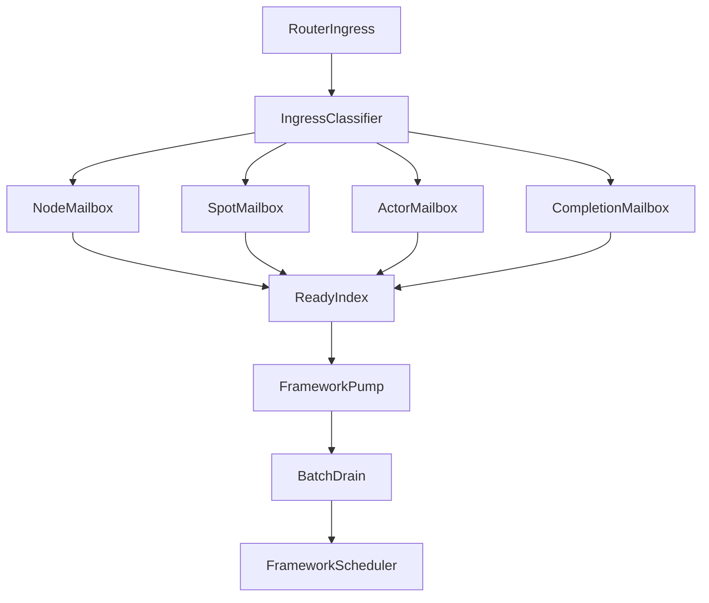

# MeshNode·Spot·Actor framework 우선 dispatch 설계 및 실행 기준

## 0. 문서 상태와 목적

이 문서는 ZLink 10.0.0에서 MeshNode, Spot과 Actor service runtime을 전면 재설계하는 임시 실행
blueprint다. 공개 계약은 이 문서가 아니라 `core/doc/spec/core/`와 `framework/doc/framework/spec/`의
정식 owner 문서가 소유한다. §16은 설계 결정을, §19는 정식 계약을 구현하는 순서를 고정한다. 현재
checkout과 정식 계약의 차이는 이 디렉토리의 임시 실행 추적 문서에 기록한다.

대상 독자는 Core service runtime과 framework dispatch 경계를 구현·검증하는 개발자다. 이 문서는
“Node·Spot·Actor message를 FFI와 scheduler overhead를 늘리지 않고 어떤 mailbox·ready·claim·batch
경계로 전달하는가?”에 답한다. 작성·개정·검토에는
[`기술문서 작성 원칙`](../../../../doc/principal/documentation/documentation-principles.ko.md)을 적용한다.
이 문서는 구현 전 내부 설계 blueprint다. 구현 뒤 `internals` 문서에는 현재 구조만 기록하고 대안 비교와
전환 이력은 이 계획 및 decision record에 둔다.

이 문서는 기존 socket API를 framework 요구에 맞게 바꾸려는 계획이 아니다. ROUTER, DEALER,
PUB/SUB, generic STREAM과 message API처럼 전통적인 ZLink socket 공개 계약은 유지한다. STREAM header에
있더라도 Actor mailbox에 연결되는 bind·send 확장점은 generic STREAM 계약이 아니라 service 통합 표면이므로
변경 범위에 포함한다. 나머지 변경 범위는 현재 SpotNode를 중심으로 구성된 MeshNode, Spot과 Actor service
C API 및 runtime이다.

상위 실행 순서와 전체 중단 변경 범위는 다음 문서를 따른다.

- [`RouteMesh 메시징 통합 계획`](./framework-route-mesh-messaging-consolidation.ko.md)
- [`MeshNode Core 공개 API 전환 검토`](./mesh-node-core-api-review.ko.md)
- [`RouteMesh 10.0.0 실행 진행표`](./route-mesh-10.0.0-execution-ledger.ko.md)

### 0.1 구현 계약 참조

이 blueprint의 설계 대안과 결정 기록은 구현 배경을 보존하기 위한 자료다. S3 승인 뒤에는 아래 정식
스펙이 구현 계약을 소유한다. 이후 구현 항목은 이 문서의 문장을 별도 계약처럼 복제하지 않고 해당 정식
스펙을 red gate와 contract test의 입력으로 사용한다. 두 내용이 다르면 정식 스펙을 우선해 임의로
구현하지 않고 S1 또는 S2와 S3 리뷰를 다시 연다.

| 구현 영역 | 정식 계약 주소 |
|---|---|
| MeshNode identity·lifecycle·peer·ChannelName·Logical Multicast | [Core MeshNode](../../../../core/doc/spec/core/service/mesh-node.ko.md) |
| ready·claim·batch·owner dispatch | [Core Dispatch](../../../../core/doc/spec/core/service/dispatch.ko.md) |
| Spot direct·subscription·timer | [Core Spot](../../../../core/doc/spec/core/service/spot.ko.md) |
| Actor mailbox·membership·transfer | [Core Actor](../../../../core/doc/spec/core/service/actor.ko.md) |
| STREAM binding·barrier | [Core STREAM session](../../../../core/doc/spec/core/service/stream-session.ko.md) |
| multipart ownership·metadata·오류·polling·monitoring | [Core message](../../../../core/doc/spec/core/message.ko.md), [errno](../../../../core/doc/spec/core/errno-map.ko.md), [polling](../../../../core/doc/spec/core/polling.ko.md), [monitoring](../../../../core/doc/spec/core/monitoring.ko.md) |
| Framework topology·메시징·location·관측 | [Framework 공통 스펙](../../framework/spec/README.ko.md), [MeshNode](../../framework/spec/server/21-mesh-node.ko.md), [Location Runtime](../../framework/spec/server/40-location-runtime.ko.md), [Runtime monitoring](../../framework/spec/server/50-runtime-monitoring.ko.md) |
| `.NET` 공개 시그니처 | [.NET exact interface 목차](../../framework/spec/server/languages/dotnet/README.ko.md) |

실행 순서, 제거 범위, 성능 threshold, package 배포와 리뷰 증거는 계획의 책임이므로 이 문서와
[실행 진행표](./route-mesh-10.0.0-execution-ledger.ko.md)에 남긴다. 정식 스펙은 이 임시 계획 문서를
역참조하지 않는다.

## 1. 고정한 설계 전제

다음 항목은 이 설계의 출발점이다.

1. 전통적인 socket API와 runtime은 범용 low-level 전송 계층으로 유지한다.
2. MeshNode, Spot과 Actor는 framework와 bindings가 사용하는 service runtime으로 다시 정의한다.
3. 폐기 대상으로 분류한 service API를 전달하는 alias, deprecated wrapper와 dual runtime을 만들지 않는다.
4. 기존 callback, part 단위 recv, route bridge와 channel dealer completion은 현재 형태를 보존할 계약이
   아니다.
5. framework가 필요한 수신·수명·성능 계약을 먼저 정한 뒤 Core C API와 bindings 계약을 설계한다.
6. Core는 routing, mailbox, ordering, backpressure, request correlation과 readiness를 담당한다.
7. framework는 typed codec, handler 선택, DI, scheduler와 application lifecycle을 담당한다.

이 전제는 Actor 개념을 Core에서 제거한다는 뜻이 아니다. Core는 `ActorRef`, generation, 현재 Spot
membership, actor mailbox, request route와 STREAM session binding처럼 전송에 필요한 actor 상태를
계속 소유한다. 실제 actor 객체 생성, 업무 handler와 application 상태는 framework가 소유한다.

## 2. 현재 구현에서 확인한 비용과 유지할 자산

### 2.1 이미 활용할 수 있는 구조

현재 local Spot multicast는 topic과 message part를 한 번 만든
`spot_logical_pubsub_message_t`를 `shared_ptr`로 여러 Spot subscription queue에 넣는다.
[`spot_node_pubsub_fanout.cpp`](../../../../core/src/runtime/services/spot/node/spot_node_pubsub_fanout.cpp)는
local subscription을 먼저 선택하고 하나의 message block을 각 대상 queue가 공유한다. 이 구조는
Logical Multicast에서 payload를 Spot 수만큼 복제할 필요가 없다는 근거다.

`zlink_msg_t`도 큰 payload 또는 외부 storage를 reference count로 공유할 수 있다.
[`message/api.h`](../../../../core/include/zlink/message/api.h)의 `zlink_msg_copy(...)`는 큰 message의
payload를 복제하지 않고 storage를 공유하며, `zlink_msg_move(...)`와 `zlink_msg_adopt(...)`는 ownership을
이동한다. 새 service runtime은 별도 message storage를 만들기보다 이 계약을 기반으로 공유 multipart
block을 구성한다.

현재 Spot dispatch worker pool은 같은 Spot을 동시에 실행하지 않고, 처리 중 다시 준비된 Spot을 dirty로
표시한 뒤 재등록한다. [`spot_dispatch_worker_pool.cpp`](../../../../core/src/runtime/services/spot/dispatch/spot_dispatch_worker_pool.cpp)의
queued, active와 dirty 집합은 중복 scheduling을 합치고 Spot 단위 직렬 실행을 제공한다. 새 구조는 이
원리를 ready index와 claim에 일반화하고 Core worker pool은 제거한다. framework scheduler와 direct C
consumer의 callback 또는 poller가 claim을 인수하므로 scheduling 책임을 두 계층이 중복해서 소유하지 않는다.

### 2.2 제거해야 할 비용

현재 routed Spot 수신은 message를 queue에 넣은 뒤 `ROUTED_READABLE` callback을 발생시키고, `.NET`
wrapper가 callback 안에서 `RecvRouted(..., DontWait)`를 반복 호출해 queue를 모두 비운다.
[`ZLinkBackendSpotWrapper.cs`](../../../languages/dotnet/src/Zlink.Framework/Runtime/Backend/DotNet/Wrappers/ZLinkBackendSpotWrapper.cs)는
각 message마다 `Received` 객체를 만들며, Core public API는 multipart를 part 단위로 반환한다.

현재 channel과 route receive loop도 `DontWait` 호출과 backoff를 반복한다.
[`ZLinkChannelReceiveLoop.cs`](../../../languages/dotnet/src/Zlink.Framework/Runtime/Channels/ZLinkChannelReceiveLoop.cs)와
[`ZLinkRouteReceivePump.cs`](../../../languages/dotnet/src/Zlink.Framework/Runtime/Channels/ZLinkRouteReceivePump.cs)는
별도 socket별 pump를 사용하고, route pump는 bridge frame을 framework에서 판별한다. MeshNode가 ingress를
직접 분류하면 이 polling, bridge 판별과 socket별 pump를 제거할 수 있다.

현재 Actor는 part 하나마다 queue entry를 만들고 Spot callback context 안에서만
`zlink_spot_node_actor_recv_part(...)`를 호출할 수 있다. 이 구조는 multipart 경계, actor ordering과
callback 실행 context를 한 API에 결합한다. Actor도 message 단위 batch 수신과 명시적인 single-consumer
lease를 사용하는 편이 framework scheduler에 더 적합하다.

추가로 현재 Spot request/reply state는 process 전역 owner index를 조회하고, enqueue와 recv에서 여러
mutex를 순서대로 획득한다. dispatch dedupe도 event별 deque와 `std::set`을 갱신한다.
[`service_spot_request_reply_internal.hpp`](../../../../core/src/api/spot/request_reply/service_spot_request_reply_internal.hpp)와
[`service_spot_request_reply_queue.cpp`](../../../../core/src/api/spot/request_reply/service_spot_request_reply_queue.cpp)의
전역 lookup, queue state와 TLS metadata는 owner-local mailbox와 batch record로 대체할 대상이다.

현재 routed envelope과 index key는 여러 RID를 `std::string`으로 변환하고, part recv helper는 이미 queue에
들어 있는 multipart를 다시 part별 상태에 보관한다. 새 ingress record는 고정 크기 RID와 versioned
metadata를 사용하고 complete multipart를 하나의 ownership 단위로 옮겨야 한다.

## 3. 목표와 제외 범위

### 3.1 목표

- network ingress에서 envelope을 한 번만 해석한다.
- Node, Channel, Spot, subscription과 Actor의 최종 mailbox를 Core가 바로 선택한다.
- native에서 managed runtime으로 message마다 callback하지 않는다.
- readiness는 빈 queue가 readable 상태로 전환될 때 합쳐서 통지한다.
- 한 번의 C API 호출로 여러 message를 수신할 수 있게 한다.
- local multicast는 같은 immutable message block을 대상 mailbox가 공유한다.
- Spot과 Actor의 순차 실행 단위를 Core와 framework가 같은 key로 이해한다.
- queue HWM, byte limit, drop, timeout과 shutdown 결과를 공개 계약으로 고정한다.
- callback, poller와 recv 조합에서 중복 통지와 lost wakeup이 발생하지 않게 한다.
- bindings가 private symbol, reflection 또는 raw frame 해석 없이 같은 API를 사용하게 한다.

### 3.2 제외 범위

- raw ROUTER, DEALER, PUB/SUB와 Actor 통합 확장점을 제외한 generic STREAM API의 의미 변경
- framework typed codec 또는 DI를 Core로 이동
- Core가 application handler를 직접 실행하는 구조
- remote handler 완료까지 기다리는 publish delivery guarantee
- 서로 다른 RouteMesh 사이의 자동 relay

## 4. 책임 경계

| 책임 | Core service runtime | bindings | framework |
|---|---|---|---|
| wire envelope | encode, decode와 검증 | 공개 type 변환 | 알지 않음 |
| destination 선택 | MeshName, RID, ChannelName, Spot과 Actor route | 호출 인자 전달 | public client 제공 |
| mailbox | 생성, HWM, enqueue, dequeue와 close | batch wrapper | handler scheduling |
| readiness | coalescing, ready index와 wakeup | callback/poller 연결 | pump와 work scheduling |
| message storage | shared multipart block과 ownership | C/C++은 borrowed view·명시적 retain, 관리형 언어는 즉시 decode | typed decode 뒤 release |
| request | sequence, timeout와 completion mailbox | operation ID와 result 변환 | Task/Promise 완료 |
| ordering | origin·mailbox·Actor 단위 공개 순서 | 그대로 전달 | 업무 처리 순서 준수 |
| codec | payload를 opaque part로 취급 | message wrapper | typed JSON encode/decode |
| handler | 알지 않음 | 알지 않음 | packet·channel·Actor handler 선택 |
| application lifecycle | 전송 객체의 close·generation만 처리 | dispose 연결 | Spot·Actor 객체와 DI scope 관리 |

Core가 handler type, DI scope 또는 serializer를 알게 되면 framework 지식이 Core로 누출된다. 반대로
framework가 wire destination class, request sequence, queue rearm과 native ownership을 직접 처리하면
Core 전송 지식이 framework에 누출된다.

## 5. 대안 비교

### 5.1 대안 A — message callback 유지

Core가 message 또는 readable event마다 framework callback을 호출하고 framework가 기존 recv API로
message를 꺼낸다.

장점은 현재 구현과 가까워 변경량이 작다는 것이다. 그러나 native-to-managed 전환 횟수가 message 수에
비례하고, callback과 recv를 함께 이해해야 하며, framework마다 반복 drain loop가 필요하다. callback
실행 thread, reentrancy와 close 규칙도 public 계약에 계속 노출된다.

### 5.2 대안 B — MeshNode 중앙 dispatch queue

모든 Node, Spot과 Actor message를 MeshNode 중앙 queue에 넣고 한 batch API로 framework에 반환한다.

FFI 호출 횟수는 가장 적지만 Spot별 HWM, Actor ordering, hot owner fairness와 close 격리를 framework가
다시 구현해야 한다. Core의 Spot·Actor route와 framework scheduler 사이에 mailbox 책임이 분산되고,
개별 Spot API의 의미도 약해진다.

### 5.3 대안 C — 객체별 mailbox와 MeshNode ready index

Core가 Node, Spot과 Actor별 mailbox를 유지하고, MeshNode에는 payload가 아니라 ready owner token만
저장한다. framework는 ready token을 batch로 가져온 뒤 해당 owner mailbox를 batch로 비운다.

이 방식은 다음 특성을 가진다.

- payload ownership과 backpressure는 Core mailbox 안에 유지된다.
- framework는 ready owner만 scheduling하므로 wire와 queue 구현을 알 필요가 없다.
- 한 owner의 여러 message를 한 번의 FFI 호출로 가져올 수 있다.
- busy owner는 정해진 quantum 뒤 ready index 뒤쪽에 다시 등록할 수 있다.
- Spot과 Actor별 직렬 실행을 유지하면서 다른 owner는 병렬 처리할 수 있다.

### 5.4 선택

| 기준 | A: callback+recv | B: 중앙 queue | C: mailbox+ready index |
|---|---:|---:|---:|
| FFI 호출 감소 | 낮음 | 높음 | 높음 |
| 객체별 backpressure | 보통 | 낮음 | 높음 |
| Spot·Actor 격리 | 보통 | 낮음 | 높음 |
| framework 복잡도 | 높음 | 높음 | 낮음 |
| Core 구현 복잡도 | 낮음 | 보통 | 보통 |
| fairness 제어 | 낮음 | 보통 | 높음 |
| POSD 정보 은닉 | 낮음 | 낮음 | 높음 |

권장안은 대안 C다. C API는 ready index와 receive batch라는 두 개의 깊은 모듈을 제공하고, 실제 queue,
signal, message sharing과 rearm 알고리즘을 숨긴다.

## 6. 권장 runtime 구조



다이어그램의 `IngressClassifier`는 wire envelope을 한 번 해석하고 destination class와 message kind를
확정한다. mailbox는 payload를 소유하고, `ReadyIndex`는 어느 owner가 읽을 수 있는지만 관리한다.

### 6.1 주요 모듈

| 모듈 | 책임 | 숨기는 결정 |
|---|---|---|
| ingress classifier | 한 번의 parse로 최종 destination과 metadata 확정 | wire frame 위치와 protocol version |
| route directory | RID, ChannelName, Spot과 Actor route 조회 | index 자료구조와 generation 검증 |
| service mailbox | message·byte HWM, enqueue, batch dequeue와 close | queue type, lock과 signaling |
| ready index | owner별 event bit coalescing과 fairness | 중복 제거, rearm과 wakeup |
| shared message block | metadata와 immutable multipart storage | `zlink_msg_t` copy/move와 ref count |
| completion runtime | request timeout, cancellation과 owner completion | request sequence와 callback storage |
| receive batch | caller가 한 번에 여러 record를 읽고 해제 | native vector와 frame lifetime |

이 모듈을 ingress, notify, drain처럼 실행 순서에 따라 나누지 않는다. mailbox와 ready index가 각각
enqueue부터 close까지 전체 책임을 가져야 시간적 분해와 pass-through method가 늘어나지 않는다.

## 7. mailbox 모델

### 7.1 mailbox 종류

| owner | lane | message 또는 event | framework 처리 |
|---|---|---|---|
| MeshNode | node direct | RID로 MeshNode에 보낸 send/request | route handler |
| MeshNode | channel | ChannelName으로 선택한 send/request | channel handler |
| MeshNode | completion | MeshNode에서 시작한 request 결과 | Task/Promise 완료 |
| Spot | routed | 특정 Spot에 보낸 send/request | Spot packet/request handler |
| Spot | subscription | Logical Multicast local match | Spot subscription handler |
| Spot | completion | Spot에서 시작한 channel·Spot request 결과 | Spot call 완료 |
| Spot | actor join | Actor의 Spot 참여 요청 | join handler |
| Spot | actor lifecycle | joined, left와 disconnected | lifecycle handler |
| Actor | actor message | ActorRef 또는 bound session 대상 message | actor handler |
| Actor | completion | Actor context에서 시작한 request와 lifecycle operation 결과 | Actor Task/Promise 완료 |

Node mailbox에는 Spot 또는 Actor payload를 넣지 않는다. Spot routed와 subscription lane도 서로 다른
event bit와 receive metadata를 유지한다. Logical Multicast를 일반 routed event로 바꾸면 framework가
어느 handler family를 실행할지 payload를 다시 해석해야 하므로 허용하지 않는다.

Actor mailbox는 ActorRef generation을 key로 사용한다. Actor payload readiness는 Spot callback을
경유하지 않고 ActorRef를 가진 Actor owner token으로 직접 표시한다. ActorRef generation은 actor의
destroy/recreate identity만 나타내며 Spot membership epoch와 혼용하지 않는다. actor가 다른 Spot으로
이동해도 같은 ActorRef mailbox와 도착 순서는 유지된다. 따라서 Core는 이전 Spot membership이라는
이유만으로 이미 수용한 actor payload를 dequeue에서 폐기하지 않는다. Actor join과 Spot membership
lifecycle만 Spot mailbox의 별도 lane을 사용한다.

### 7.2 여러 ChannelName membership

MeshNode 하나는 MeshName, RID와 ROUTER endpoint를 하나씩 가지되 `ChannelName`은 immutable set으로
게시한다. 같은 process에서 현재 여러 server channel을 제공하는 기능을 유지하면서 물리 socket은 하나만
사용하려면 복수 membership이 필요하다.

channel message는 Node mailbox의 channel lane에 들어가며 metadata에 target `ChannelName`을 포함한다.
framework handler key는 `(ChannelName, message kind, packet name)`이다. RID direct handler key와 channel
handler key는 서로 다른 namespace이므로 같은 packet name을 두 family에 등록할 수 있다.

`.NET` 등록 API는 `ChannelName(name)`이라는 사용자가 선택한 용어를 유지하되, 해당 호출이 logical
membership과 channel handler scope를 반환하도록 설계한다. 별도 endpoint 또는 socket builder는 만들지
않는다. exact fluent 형태는 framework spec 단계에서 결정한다.

Spot에서 Logical Multicast를 시작할 때도 target `ChannelName`을 명시해야 한다. 단일 ChannelName을 가진
기존 SpotNode에서는 owner channel을 암묵적으로 사용할 수 있었지만 복수 membership MeshNode에서는 그
규칙이 모호하다. subscription도 `(ChannelName, topic 또는 prefix, Spot)`을 key로 등록한다. 그래야 같은
MeshNode가 여러 channel 역할을 제공해도 한 channel의 multicast가 다른 channel을 위해 등록한 Spot
handler로 전달되지 않는다. 같은 Spot은 필요하면 여러 ChannelName에 subscription을 등록할 수 있다.

### 7.3 Actor registry와 동시성

현재 Actor runtime은 process 전역 static state와 하나의 `timed_mutex`를 사용한다.
[`service_spot_actor_runtime_state_internal.hpp`](../../../../core/src/api/actor/spot/service_spot_actor_runtime_state_internal.hpp)와
[`service_spot_actor_api.cpp`](../../../../core/src/api/actor/spot/service_spot_actor_api.cpp)의 구조는 서로 다른
MeshNode와 Actor mailbox 작업까지 같은 lock 범위에 포함할 수 있다.

전면 재설계에서는 Actor directory, route, join, lifecycle, session binding과 mailbox를 MeshNode가
소유한다. process 안의 다른 MeshName은 actor state와 lock을 공유하지 않는다. 같은 MeshNode 안에서도
다음처럼 lock domain을 분리한다.

- ActorRef lookup과 generation을 관리하는 directory lock 또는 shard
- Actor 하나의 mailbox와 lifecycle state
- Spot membership 이동을 원자적으로 commit하는 transfer coordinator
- STREAM session binding index

lock을 함수 호출 순서에 따라 중첩하지 않는다. join 또는 transfer는 검증, reservation과 commit을 가진
하나의 domain operation으로 정의하고, network 또는 framework callback을 lock을 보유한 상태에서
실행하지 않는다.

Actor owner state에는 일반 처리 상태와 별도로 `MOVING`을 둔다. `MOVING` 동안 도착한 payload는 거부하지
않고 source Core의 ordered transfer stream에 수용한다. Core는 application actor를 만들지 않으며 transport
freeze, sequence와 backlog 수명만 담당한다. framework는 DI scope, application state 저장과 target actor
materialize를 담당한다. transfer는 다음 source/target protocol을 하나의 계약으로 가진다.

1. source Core가 Actor를 `QUIESCING`으로 바꾸고 새 application claim만 막는다. 이미 실행 중인 Actor turn,
   responder reply token과 Actor가 시작한 requester operation이 모두 끝날 때까지 completion·send-ready
   infrastructure claim은 계속 허용한다. deadline 안에 끝나지 않으면 transfer admission을 실패시킨다.
2. route authority가 transfer ID, membership version과 ingress snapshot을 기록하고 `FENCING`으로 전환한다.
   snapshot에는 MeshNode peer와 source-local sender뿐 아니라 Actor에 연결된 STREAM session ingress가 모두
   포함된다. 각 MeshNode sender는 해당 ActorRef의 새 send를 bounded pending queue에 보관하고, source와
   연결된 ordered pipe에 마지막 old-epoch message 뒤 route-fence marker를 보낸다. 각 bound session owner도
   per-session FIFO에서 마지막 old-epoch packet 뒤 barrier를 기록하고 이후 packet을 bounded pending queue에
   보관한다.
3. source Core가 snapshot의 모든 marker를 받은 뒤 old-epoch ingress를 닫는다. marker 전에 peer가
   disconnect하면 fence를 완료한 것으로 간주하지 않고 transfer를 abort한다. 이 시점의 마지막 arrival
   sequence가 변경되지 않는 `final_sequence`다.
4. source Core가 아직 drain하지 않은 mailbox와 fence 전까지 도착한 delta를 `final_sequence`까지 freeze한다.
   source framework는 application state를 만들고 target framework는 actor를 suspended 상태로 materialize한다.
5. route authority는 participant-set version을 조건으로 `PREPARING_ACTIVATION` CAS를 수행해 pre-commit
   participant 집합을 봉인한다. 각 sender와 session owner는 자기 serialization domain에서 새 admission을
   잠시 중단해 backpressure를 반환하고, 기존 pending FIFO의 정확한 message·byte 수와 terminal high-water를
   보고한다. 이미 transport에 수용된 session packet은 이 high-water에 포함한다. 봉인 뒤 새 peer·session은
   old source participant로 등록되지 않고 commit 또는 abort가 정해질 때까지 admission을 기다리거나 정식
   backpressure 결과를 받는다.
6. target Core는 source frozen backlog와 sealed participant 보고량 전체에 대해 mailbox 및 bounded transfer
   staging capacity를 원자적으로 예약한다. 예약은 실제 payload를 미리 복사하지 않지만 각 message·byte
   HWM을 차감하므로 commit 뒤 flush가 capacity를 기다리지 않는다. 예약할 수 없거나 participant 보고가
   deadline 안에 끝나지 않으면 transfer를 commit 전에 abort하고 source와 sender admission을 복원한다.
   target은 transfer ID, `final_sequence`, participant-set version과 reservation을 durable prepared record로
   확인한 뒤에만 ACK한다.
7. route authority가 target prepared ACK를 조건으로 membership epoch를 갱신한다. 이 성공이 유일한 commit
   결정점이다. committed record를 확인한 뒤에도 target Actor는 suspended 상태를 유지한다. authority는
   participant에 activation-prepare release를 보낸다. 각 participant는 sealed FIFO를 예약된 target staging에
   submit하고 `FORWARDING`으로 전환한다. 전환 뒤 새 message는 local pending에 추가하지 않고 target에 직접
   submit한다. session owner는 target session binding도 설치한 뒤 terminal high-water ACK를 보낸다. target은
   sealed participant의 ACK, 예약한 high-water까지의 backlog와 target session binding 설치를 모두 확인한 뒤
   같은 participant-set version으로 final activation CAS를 수행한다. 조건이 바뀌면 CAS가 실패하고 다시
   확인한다. 성공한 뒤에만 예약을 normal mailbox/staging accounting으로 전환하고 Actor ready token과 최종
   activation ACK를 발급하며 sender는 `DIRECT(new epoch)`로 전환한다.

`FENCING`부터 `PREPARING_ACTIVATION` 전까지 route authority는 새로 참여하거나 reconnect하거나 route를 다시 조회한 peer에도
같은 transfer ID와 fence state를 반환한다. 해당 peer는 old epoch로 보내지 않고 같은 bounded pending
queue 계약을 따른다. 각 sender Core는 Actor send admission과 route-fence marker를 같은 per-Actor
serialization domain에서 처리한다. 따라서 application send는 marker 앞의 old-epoch pipe submit 또는
marker 뒤의 pending queue admission 가운데 하나로만 들어간다.

`PREPARING_ACTIVATION`부터 commit 결정 전까지는 participant 집합과 보고한 pending 양을 바꾸지 않는다.
이 짧은 구간의 새 send, session packet admission과 bind는 기다리거나 정식 backpressure를 반환한다. commit
뒤에는 새 participant가 target `FORWARDING(new epoch)` 경로만 사용하므로 sealed reservation을 늘리지 않는다.

bound STREAM session도 같은 fence participant다. session owner는 packet decode 뒤 Actor mailbox submit과
barrier를 같은 per-session serialization domain에서 처리한다. transfer coordinator는 모든 session barrier와
MeshNode route-fence marker를 확인하기 전에는 `final_sequence`를 확정하지 않는다. session disconnect는
기존 per-session FIFO에 이미 수용된 packet을 barrier까지 반영한 뒤 terminal session event를 기록하며,
barrier를 임의로 완료 처리하지 않는다.

`FENCING` 뒤 새로 bind하거나 reconnect하는 session도 snapshot 밖의 우회 ingress가 될 수 없다. Actor-session
binding CAS는 route authority의 transfer ID와 fence state를 함께 검증한다. 최종 activation ACK 전의 새 bind는
`PREPARING_ACTIVATION` 전이면 pending binding participant와 bounded per-session FIFO를 등록하고, 그 뒤이면
old source binding을 만들지 않은 채 commit 또는 abort 결정을 기다린다. 기존 session reconnect도 같은
participant와 FIFO를 이어받는다. abort이면 source binding으로, commit의 activation-prepare release이면
target binding으로 한 번만 전환하되 Actor application dispatch는 최종 activation ACK 전까지 시작하지 않는다.

commit 뒤 participant가 ACK 전에 중단되면 rollback하지 않는다. authority는 participant generation lease와
bounded recovery deadline을 기록한다. 같은 generation의 durable pending state 또는 successor generation이
있으면 `FORWARDING` flush를 이어받는다. 복구할 durable pending state가 없고 lease가 만료되면 authority는
그 generation을 `PARTICIPANT_FAILED`로 terminal 기록하고 sealed barrier에서 제외하며 target은 해당
participant의 사용하지 않은 reservation을 해제한다. process-local memory에
admission된 one-way message를 process crash 뒤에도 보장한다고 확대하지 않으며, 해당 손실 가능성은 기존
process-failure delivery 계약과 monitor event로 드러낸다. failure 또는 successor 결정 없이 participant를
조용히 제외하거나 activation lease를 무기한 유지하지 않는다.

source가 fence 뒤 old-epoch frame을 받는 것은 conforming peer에서는 발생할 수 없는 protocol violation이다.
이를 application-level retry 결과로 바꾸지 않고 peer generation과 epoch mismatch 오류로 연결을 격리하고
monitor event를 기록한다. 일반 one-way send를 원격 admission ACK 방식으로 확대하거나 이미 해제한 payload를
호출자에게 재전송시키지 않는다.

peer fence부터 `PREPARING_ACTIVATION` 전까지 새 send는 sender의 bounded pending queue와 backpressure 계약을
따른다. 준비 구간은 새 admission을 잠시 중단하고, commit 뒤에는 target forwarding 경로를 사용한다. 그래서
commit 뒤 source에 도착할 수 있는 old-epoch message가 없고 별도 cutover marker도 필요하지 않다. source는
target activation ACK까지 frozen backlog와 framework application-state snapshot의 authoritative reference를
유지한다. target prepared ACK 전 실패는 target의 suspended copy를 폐기하고 source mailbox를 같은
sequence로 복원하며 peer fence를 해제한다.

여기서 route authority는 Core 내부 전역 상태가 아니라 framework location store와 transfer coordinator가
제공하는 durable record다. Core는 전달받은 transfer ID, membership epoch와 prepared/commit token을
검증하고 mailbox fence를 수행한다. 공식 Redis extension을 production 기본 authority로 사용한다.
process-local test용 in-memory store는 이 보장을 제공하지 않으므로 distributed transfer를 등록한 구성은
store capability를 시작 전에 검증하고 지원하지 않는 store를 거부한다.

prepared token은 target MeshNode lifecycle generation과 activation lease를 포함한다. target은 prepare부터
activation ACK까지 lease를 유지하며 `DRAINING` 전환은 이 lease의 commit·activation 또는 abort를 bounded
deadline까지 기다린다. 재시작으로 lease가 사라지면 commit CAS는 stale ACK를 거부한다. target이 prepared 또는 committed
상태에서 activation 전에 재시작하면 source에 transfer ID와 `final_sequence`로 backlog와 application-state
snapshot을 다시 요청하고 target generation을 바꿔 prepare한다.

target prepared ACK 뒤 source나 coordinator가 중단되어도 route authority의 durable transfer record가
commit 또는 abort를 한 번만 결정한다. commit 성공 뒤에는 source로 rollback하지 않는다. target은
authority의 committed record와 durable participant ACK/high-water state로 activation preparation을 복구하며
source의 후속 marker에 의존하지 않는다. 모든 session binding 설치와 pending backlog 조건을 다시 확인하기
전에는 Actor를 활성화하지 않는다. 같은 transfer ID와 sequence의 재전달은 idempotent하게 수용해 중복
enqueue하지 않는다.

source는 target activation ACK 뒤에만 authoritative snapshot을 해제한다. source와 target이 동시에
snapshot을 잃는 장애까지 in-memory mailbox가 전달을 보장한다고 확대하지 않는다. 해당 수준의 보장이
필요하면 application state와 backlog payload를 durable store에 기록하는 별도 capability가 필요하다.

framework로 이미 전달한 batch를 Core가 임의로 회수하지 않는다. transfer는 해당 Actor의 active claim과
pending requester operation이 끝날 때까지 fencing을 시작할 수 없으며, deadline이 끝나면 이동을 실패시키고
기존 membership을 유지한다.

### 7.4 Spot timer backend

Spot timer는 network destination을 선택하거나 wire message를 소유하지 않는 local scheduling 기능이다.
따라서 관리형 framework의 timer tick을 Core service mailbox에 넣지 않는다. `.NET`은 `Task.Delay` 기반
timer를, Java/Kotlin은 `ScheduledExecutorService`를, Node.js는 `setTimeout`을 사용하고 tick을 해당 Spot의
framework keyed scheduler에 직접 제출한다. 이 경로는 native callback과 batch drain을 거치지 않는다.

C와 C++ bindings의 기존 `zlink_timer_*`, `zlink_spot_timer_new(...)` 공개 계약은 전통적인 eventing API로
유지한다. C++ framework가 이를 사용할 때는 만료 event를 application handler에서 직접 실행하지 않고 같은
Spot keyed scheduler에 제출한다. backend가 달라도 timer handler는 같은 Spot의 packet, subscription과
동시에 실행되지 않는다.

timer registration은 생성 당시 Spot lifecycle generation을 저장한다. platform callback이 만든 tick도
generation을 함께 가지며 keyed scheduler는 handler 실행 직전에 현재 Spot generation과 대조한다. Spot
close 또는 같은 RID의 recreate 뒤 남은 stale tick은 실행하지 않는다. `DRAINING`에서는 새 timer 등록을
`SHUTTING_DOWN`으로 거부한다.

timer cancel은 새 tick 생성과 아직 실행하지 않은 tick admission을 중단한다. handler 밖에서 호출한
`CancelAsync`는 이미 시작한 timer handler가 끝날 때까지 기다리고, 같은 timer handler 안에서 호출하면
현재 turn을 기다리지 않아 self-deadlock을 만들지 않는다. Spot close는 모든 timer를 먼저 cancel한 뒤
Spot application claim의 정상 drain/force-close 규칙을 따른다. 이 의미는 platform backend와 C++ C API
timer adapter에서 동일해야 한다.

receive batch가 여러 timer 만료를 한 번에 가져올 수 있더라도 관리형 언어에서 Core timer를 사용하면
native timer handle 수명과 FFI drain이 다시 생긴다. `DelayNextTick`, `SkipLateTicks`, `CatchUpBounded`처럼
handler 완료와 연관된 정책도 framework가 이미 소유한다. 그러므로 Core batched timer를 public option으로
추가하지 않는다. 별도 benchmark에서 관리형 platform timer보다 명확한 이점이 입증되면 새 설계 후보로
검토하되 10.0 기본 경로에는 포함하지 않는다.

## 8. shared message와 batch ownership

### 8.1 shared message block

network wire message는 complete multipart를 하나의 admission과 ownership 단위로 사용한다. 앞쪽의
versioned service envelope frame은 destination kind, source/target RID, `ChannelName`, Spot·Actor identity,
operation ID와 protocol flag 같은 Core routing metadata를 담고, 그 뒤에 선택적인 application metadata
frame과 원래 payload part가 이어진다.

application metadata는 trace, tenant, locale처럼 호출자가 Node direct, ChannelName 또는 Spot direct
send/request에 붙이는 작은 key-value snapshot이다. key마다 part를 만들지 않고 하나의 compact frame으로
인코딩하며 값이 없으면 frame도 생략한다. Core ingress classifier는 frame boundary와 lifetime만 검증하고 key-value 의미,
forwarding allowlist와 handler context 변환은 framework가 담당한다. application은 routing metadata를
덮어쓰거나 raw envelope와 request sequence를 읽지 않는다.

canonical frame은 `version u8`, `count u8`, 이어지는 entry 배열이다. entry는 `key_len u8`, UTF-8 key,
`value_len u16` network byte order와 UTF-8 value 순서이며 전체 frame 상한은 1024 bytes다. outbound
builder는 같은 key의 마지막 값 하나만 encode한다. ingress decoder는 빈 key, duplicate key, count·length
불일치, truncated entry, trailing bytes와 invalid UTF-8을 protocol error로 처리하고 handler mailbox에
넣지 않는다. Core canonical decoder는 version, count, length, trailing bytes, UTF-8, duplicate key와
전체 frame 상한을 검사한다. 각 bindings/framework는 검증된 record를 immutable metadata로 투영하고
같은 byte vector conformance corpus로 Core result와 언어별 투영을 함께 맞춘다.

local dispatch는 wire envelope를 다시 직렬화하지 않는다. Core가 decode한 native metadata record와
application metadata frame, payload part를 shared block이 함께 소유한다. receive batch는 routing metadata를
versioned field로 제공하고 application metadata는 bindings/framework가 immutable snapshot으로 decode한다.
framework가 내부 metadata part를 payload part로 노출하거나 제거하기 위해 caller-side frame parsing을
요구하지 않는다.

하나의 block은 다음 정보를 가진다.

- source MeshNode RID와 선택적인 source Spot RID
- destination class와 destination identity
- target ChannelName 또는 multicast topic
- send, request, reply와 completion kind
- request operation ID와 protocol flags
- 선택적인 opaque application metadata frame
- immutable multipart `zlink_msg_t` collection
- 전체 byte 수와 생성 sequence

network ingress에서 받은 part는 가능한 경우 block으로 move한다. local multicast와 여러 outbound pipe는
`zlink_msg_copy(...)` 또는 block ref count를 사용한다. reference-counted payload는 복제하지 않고 small
inline message만 값으로 복사될 수 있다.

현재 local multicast처럼 payload를 `std::string`으로 다시 복사하는 경로는 제거 대상으로 검토한다.
topic과 metadata string도 block 하나가 소유하고 각 mailbox entry에는 block reference만 둔다.

### 8.2 receive batch

part 단위 recv 대신 caller가 제공한 batch object를 채우는 API를 기본으로 한다. batch는 여러 message
record와 각 record의 multipart view를 한 수명으로 관리한다.

```c
/* 후보 이름이다. batch storage를 한 번 만들고 여러 drain에서 다시 사용한다. */
zlink_receive_batch_t *batch =
    zlink_receive_batch_new(message_capacity, part_capacity, byte_capacity);

/* Node mailbox의 node/channel message만 해당 claim 범위에서 batch에 채운다. */
zlink_mesh_node_recv_batch(node, claim, event_mask, batch, ZLINK_DONTWAIT);

/* Spot mailbox의 선택한 lane만 해당 claim 범위에서 batch에 채운다. */
zlink_spot_recv_batch(node, claim, event_mask, batch, ZLINK_DONTWAIT);

/* Actor mailbox는 Actor owner claim으로만 drain할 수 있다. */
zlink_actor_recv_batch(node, claim, event_mask, batch, ZLINK_DONTWAIT);

/* batch가 가진 native message reference를 한 번에 해제하고 storage는 재사용한다. */
zlink_receive_batch_reset(batch);
zlink_receive_batch_destroy(&batch);
```

opaque batch owner는 생성할 때 정한 message, part와 byte 상한 안에서만 동작하며 자동 확장하지 않는다.
contiguous한 versioned record view 배열은 한 번에 제공한다. record에는 `size`와 `version`을 넣고 part는
batch가 소유한 연속 part view 배열의 offset과 count로 나타낸다. bindings는 한 번의 native 호출로 배열을
읽으면서도 alignment, record size와 지원 version을 먼저 검증한다. record마다 accessor를 호출하게 만들면
batch를 도입하고도 FFI 호출이 message 수에 비례하므로 표준 bindings 경로로 사용하지 않는다.

batch 안의 view는 `reset` 또는 destroy 전까지만 유효하다. record가 하나라도 남은 non-empty batch에 다시
receive하면 `EBUSY`를 반환하고 기존 record, view와 reference를 바꾸지 않는다. batch는 한 thread에서만
사용하며 동시에 receive, reset 또는 destroy해도 `EBUSY`를 반환한다. framework는 view가 유효한 동안 typed
decode를 끝낸 뒤 명시적으로 reset하고 다음 receive를 호출한다. 비동기 처리까지 raw payload를 유지해야
하면 선택한 record를 opaque retained message로 분리하고 별도로 close한다. 모든 message를 자동 복제하는
안전 장치는 두지 않는다.

receive는 empty batch에 완전한 record만 채운다. 하나 이상 채운 뒤 다음 record가 상한을 넘으면 성공과
채운 개수를 반환하고, caller가 reset한 다음 drain에서 이어간다. 첫 record도 들어가지 않으면 필요한
message, part와 byte 크기를 결과에 기록하고 `BUFFER_TOO_SMALL`을 반환하며 empty 상태를 유지한다. `reset`은
batch가 소유한 모든 record를 한 번의 원자적인 정리 단계에서 해제한다.

## 9. readiness와 scheduling

### 9.1 통지 단위

producer는 mailbox가 empty에서 non-empty로 전환될 때 owner의 pending event bit를 설정한다. owner가 ready
index에 아직 없을 때만 ready token을 추가한다. MeshNode ready index가 empty에서 non-empty로 전환될
때 framework wake callback 또는 poller signal을 발생시킨다. reusable ready batch보다 token이 많으면
consumer는 `has_residue`가 false가 될 때까지 반복 drain한 뒤 다시 기다려야 한다. callback
경로는 잔여 token이 있는 동안 level-triggered 상태를 유지하므로 한 번의 제한된 drain 때문에 readiness가
유실되지 않는다.

application scheduling state는 `IDLE`, `QUEUED`, `CLAIMED`와 `CLOSING`을 사용하고, enqueue 경합은 별도
dirty bit로 기록한다. producer가 이미 `QUEUED` 또는 `CLAIMED`인 application mailbox에 enqueue하면 새
application token을 추가하지 않고 lane bit와 dirty bit만 설정한다. `drain_ready`는 mailbox를 원자적으로
`CLAIMED`로 바꾸고 opaque claim capability를 반환한다.

completion과 `SEND_READY`는 application claim과 다른 infrastructure scheduling domain을 사용한다. Actor나
Spot application mailbox가 `CLAIMED`여도 completion enqueue와 send recovery는 infrastructure ready token을
만든다. infrastructure claim은 completion pump만 drain하며 application handler를 새로 실행하지 않는다.
따라서 handler가 현재 turn 안에서 request 또는 send readiness를 `await`해도 completion pump가 Task를
완료할 수 있다. 각 infrastructure lane도 자체 single-consumer claim과 coalescing을 가진다.

ready index는 infrastructure와 application queue를 분리하고 각 domain에 독립 notification/rearm state를
둔다. 같은 callback을 사용하더라도 callback의 ready mask로 두 pump를 각각 깨우며 application readiness가
미처리 상태여도 새 infrastructure empty-to-non-empty 전환은 반드시 통지한다. Core는 masked drain과 masked
rearm을 제공한다. framework는 dedicated infrastructure pump로 completion과 `SEND_READY`를 처리하며
application scheduler capacity를 기다리지 않는다. application pump도 scheduler admission을 `await`하지
않고 claim을 즉시 scheduler 또는 bounded framework admission queue에 인계한다. admission queue가 가득
차면 application domain만 rearm하지 않고 scheduler가 capacity를 반환할 때 이어서 drain한다.
framework scheduler는 claim admission과 capacity waiter 등록을 하나의 원자적 연산으로 제공한다. capacity가
있으면 claim을 즉시 인수하고, 없으면 resume signal을 먼저 등록한 뒤 capacity를 다시 검사한다. 두 검사
사이에 capacity가 반환됐으면 즉시 signal한다. 이 신호는 Core ready callback을 기다리지 않고 paused
MeshNode application drain state의 같은 residue를 이어서 처리한다. 따라서 admission 실패와 waiter 등록
사이의 lost wakeup이나 application domain을 rearm하지 않은 영구 대기가 없다.
completion pump는 Task, Promise 또는 future를 완료할 때 inline continuation을 실행하지 않는다. 대기하던
application turn의 continuation은 owner keyed scheduler 또는 application executor에 다시 제출하며,
infrastructure pump thread에서 application code를 동기 실행하지 않는다.

callback에는 message, Spot 객체 또는 application handler를 전달하지 않는다. callback의 계약은
framework pump를 깨우는 것으로 제한한다. callback 안에서 recv, close 또는 application code를 실행할
필요가 없어야 한다.

```c
/* callback은 readable domain만 알린다. 실제 owner와 message는 drain API로 가져온다. */
zlink_mesh_node_set_ready_handler(node, ready_handler, user_data);

/* reusable opaque batch에 versioned ready record를 채운다. */
zlink_mesh_node_drain_ready(node, ready_batch, &has_residue);

/* Completion과 SEND_READY만 우선 drain할 수 있다. */
zlink_mesh_node_drain_ready_masked(
    node, ZLINK_READY_INFRASTRUCTURE, ready_batch, &has_residue);

/* 지정 domain을 모두 drain한 뒤 다음 ready 전환을 원자적으로 다시 확인한다. */
zlink_mesh_node_rearm_ready(node, ready_mask);

/* async handler turn이 끝난 뒤 claim을 반환한다. 남은 work는 Core가 다시 등록한다. */
zlink_mesh_claim_release(&claim);
```

### 9.2 ready entry

ready batch도 receive batch와 같은 fixed capacity, single-thread, reset과 `EBUSY` 계약을 사용한다. opaque
owner가 contiguous한 ready record view를 제공하며 각 record는 `size`와 `version`으로 ABI 호환성을
검증한다. ready record는 최소한 다음 정보를 제공한다.

- owner kind: MeshNode, Spot 또는 Actor
- stable owner ID와 generation
- event mask
- 선택적인 ChannelName과 ActorRef
- owner를 안전하게 찾을 opaque owner reference
- Core가 발급한 opaque single-consumer claim capability

ready batch가 처음에는 모든 record의 claim을 소유한다. scheduler가 claim을 인수하려면
`zlink_ready_batch_take_claim(batch, index, &claim)`을 명시적으로 호출한다. reset 또는 destroy는 인수하지
않은 claim을 자동 release해 pump의 cancellation, 예외 또는 부분 순회가 owner를 영구 `CLAIMED`로 남기지
않게 한다.

raw owner pointer만 반환하면 close와 ready drain 사이에 use-after-free가 발생할 수 있다. 인수한 claim
capability는 ready batch와 MeshNode handle에서 독립된 native control block이며 release 또는 shutdown
revoke까지 container runtime, owner lifetime과 generation을 보유한다. `zlink_mesh_claim_release(&claim)`은
MeshNode 포인터를 다시 받지 않고 어느 thread에서든 호출할 수 있다. MeshNode destroy는 새 lookup과 receive를
막은 뒤 active claim을 revoke하지만, native control block은 마지막 claim과 batch가 release될 때까지 2단계로
유지한다. pump가 ready batch를 즉시 재사용하거나 bindings finalizer가 destroy 뒤 실행돼도 release가
use-after-free를 만들지 않는다.

receive는 claim의 owner kind, owner generation과 허용 event mask가 모두 일치할 때만 성공한다. 같은 claim은
정해진 message·byte quantum 안에서 여러 receive에 사용할 수 있지만 다른 owner나 quantum을 넘는 drain에는
사용할 수 없다. 재등록 여부는 framework에 노출하지 않고 claim release가 pending lane과 dirty bit로
결정한다.

### 9.3 fairness와 single consumer

한 drain은 owner별 message 수와 byte 수 quantum을 적용한다. claim의 첫 receive는 byte quantum보다 큰
message도 complete record 하나까지 허용하며 quantum은 그 뒤의 추가 record만 제한한다. 하나의 hot Spot이나 Actor가 다른 owner를
계속 지연시키지 않아야 한다. Core claim은 FIFO dequeue와 owner당 한 consumer만 보장한다. framework의
keyed scheduler는 async application handler turn이 끝날 때까지 Spot 또는 Actor claim을 보유하여 같은
owner의 다음 turn이 먼저 시작되지 않게 한다. MeshNode claim은 bounded scheduler가 batch를 수용한 뒤
반환할 수 있으며, 허용할 동시성은 framework spec에서 별도로 고정한다. Core active/dirty 상태와
framework scheduler의 active key는 서로 다른 책임이며 하나의 공유 집합으로 합치지 않는다.

ready bit를 지우는 시점과 producer enqueue가 경합해 lost wakeup이 발생하지 않게 다음 의미를 보장한다.

1. consumer가 claim으로 quantum만큼 dequeue하고 application turn을 끝낸다.
2. claim release가 mailbox lock 또는 동등한 atomic protocol 안에서 남은 lane과 dirty bit를 검사한다.
3. 남은 message가 있으면 owner를 `QUEUED`로 바꾸고 ready index 뒤에 다시 등록한다.
4. 비었으면 owner를 `IDLE`로 바꾸고 bit를 지운다. 이후 producer의 empty-to-non-empty 전환이 새 token을
   만든다.

claim capability는 재사용하지 않으며 내부 generation으로 stale handle을 검출한다. release를 두 번
호출하거나 다른 MeshNode에 사용하면 고정 오류를 반환한다. graceful shutdown deadline까지 반환되지 않은
claim은 revoke 상태로 전환해 receive를 거부하고 owner를 다시 활성화하지 않는다. revoke 뒤에도 release는
handle storage를 정리할 수 있다. payload storage는 outstanding batch 또는 retained message가 각각
release될 때까지 독립적으로 유지된다.

## 10. 수신 흐름

### 10.1 Node와 Channel

1. ROUTER ingress가 MeshNode envelope을 한 번 decode한다.
2. RID direct인지 ChannelName 대상인지 구분한다.
3. Node mailbox의 해당 lane에 shared block을 enqueue한다.
4. ready index에 MeshNode event bit를 설정한다.
5. framework가 batch를 drain하고 envelope family에 맞는 handler registry를 사용한다.

`mesh_node_recv_batch`는 이 두 lane과 MeshNode-owned completion만 다룬다. Spot, subscription 또는 Actor
message를 반환하지 않는다.

### 10.2 특정 Spot

1. ingress classifier가 target Spot RID와 generation을 확인한다.
2. Spot routed mailbox에 block을 enqueue한다.
3. ready entry에 Spot routed bit를 설정한다.
4. framework는 `spot_recv_batch`의 routed lane을 drain한다.

request metadata는 같은 record에 들어가며 reply API가 source RID와 request operation ID를 다시
조립하지 않게 한다.

### 10.3 Spot Logical Multicast

1. origin MeshNode가 target ChannelName member와 조건부 local target을 선택한다.
2. 수신 MeshNode가 local subscription index를 사용해 대상 Spot을 선택한다.
3. topic과 multipart payload를 가진 shared block 하나를 만든다.
4. 각 Spot subscription mailbox에는 같은 block reference를 enqueue한다.
5. 각 Spot에는 subscription event bit를 설정한다.

subscription event는 remote subscription control이 아니다. 해당 Spot의 local subscription mailbox가
읽을 수 있다는 뜻이다. 기존 `ZLINK_SPOT_DISPATCH_EVENT_SUBSCRIBE_READABLE`과 숫자는 제거·reserved로
두고, 새 MeshNode ready event-mask enum에 `LOGICAL_MULTICAST_READABLE` 의미의 별도 bit를 정의한다.

### 10.4 Actor

1. classifier가 ActorRef의 node RID, actor ID와 generation을 검증한다.
2. local Actor route가 유효하고 일반 상태이면 Actor mailbox에 block을 enqueue한다.
3. `MOVING` 상태이면 같은 도착 sequence를 사용해 이동 backlog에 수용한다.
4. ready index에 ActorRef owner token을 등록한다.
5. framework가 Actor batch를 가져와 Actor key별 pipeline에 전달한다.

Actor payload를 Spot routed mailbox에 넣거나 Spot callback을 거치지 않는다. join과 Spot membership
lifecycle은 Actor payload와 별도 Spot lane을 사용한다. ActorRef generation은 destroy/recreate 때만
바뀌며 Spot 이동은 별도 membership epoch와 transfer fence를 사용한다.

### 10.5 request completion

service request API는 per-request native callback 대신 성공한 admission에서 Core가 opaque operation ID를
항상 발급한다. ID는 owner scope와 generation을 포함하며 Core가 uniqueness, wraparound와 재사용을
검증한다. admission이 실패하면 ID를 발급하지 않는다. Core는 sequence, timeout과 remote reply를 ID에 대응시키고,
요청을 시작한 MeshNode, Spot 또는 Actor owner의 completion mailbox에 결과를 넣는다. completion record는
owner generation을 포함하지만 application ordering key로 scheduling하지 않는다. infrastructure completion
pump가 Task, Promise 또는 future를 완료하면 이를 기다리던 현재 application turn이 계속 실행된다. 새
application handler turn을 시작하지 않으므로 Spot·Actor 직렬 실행 계약은 유지된다.

request 수신 record는 reply 경로를 나타내는 opaque reply token을 포함한다. framework는 source RID,
request sequence와 transport kind를 조합하지 않고 token과 reply payload만 Core에 반환한다. token은 한
번만 사용할 수 있고 responder owner generation 변경 또는 shutdown 뒤에는 고정 오류를 반환한다. 값
type과 Core-owned handle 가운데 어느 형태를 쓸지는 lifetime test로 정하되, thread-local metadata에는
의존하지 않는다.

10.0.0의 Node·Channel·Spot direct reply는 application metadata를 싣지 않는다. request metadata를 자동
복사하지 않으며 responder가 별도 reply metadata를 설정하는 API도 제공하지 않는다. typed request가 bare
reply 값을 반환하는 현재 계약에 metadata result wrapper를 함께 추가하면 범위가 달라지므로, 해당 reply
metadata가 필요하면 후속 정식 spec에서 requester result와 responder options를 함께 설계한다. actor 전용
reply option은 기존 계약을 유지한다. Core의 일반 reply API는 one-shot token과 complete multipart payload만
받고 C 입력은 borrowed read-only view로 처리한다.

requester operation ID와 responder reply token의 수명은 분리한다. wire protocol에 deadline 또는 cancel
전파를 별도로 도입하지 않는 한 responder는 requester의 local timeout을 알 수 없다. 이 설계에서는
responder-side timeout invalidation을 보장하지 않는다. timeout completion을 이미 만든 requester는 늦게
도착한 reply를 `LATE` 또는 `NOT_FOUND`로 폐기하고 operation ID당 terminal completion을 정확히 한 번만
만든다. responder의 reply submit 성공은 requester application이 reply를 처리했다는 뜻이 아니다.

bindings는 receive batch record의 responder reply token을 framework request context로 복사한 뒤 batch를
reset한다. token은 해당 handler turn을 소유한 Node claim, Spot routed/control claim 또는 Actor claim을
반환하기 전까지만 사용할 수 있다. batch reset은 복사한 token을 무효화하지 않지만 claim 반환, owner
generation 변경 또는 shutdown은 token을 무효화한다. Spot join handler는 Spot control claim의 token을
사용한다. Actor transfer freeze는 active Actor claim과 reply token이 모두 끝날 때까지 시작하지 않으므로
node-local reply token을 이동하지 않는다. handler가 끝난 뒤 임의 시점에 reply하는 별도 계약이 필요하면
transfer가 가능한 routable token으로 먼저 spec을 확장해야 하며, 10.0 기본 경로에서 암묵적으로 허용하지
않는다.

Actor transfer admission은 해당 Actor가 시작한 requester operation이 0일 때만 성공한다. pending operation을
source와 target 사이에 옮기거나 completion reservation을 이전하지 않는다. deadline까지 operation이 끝나지
않으면 transfer를 실패시키고 source Actor를 유지한다. bindings의 Task, Promise 또는 future correlation
object는 bindings 내부 map에만 두고 Core에 handler pointer나 user data를 전달하지 않는다.

framework는 completion batch를 drain해 Task, Promise 또는 future를 완료한다. channel dealer subject와
별도 drain API는 필요하지 않다. timeout, cancellation, shutdown과 remote error도 같은 completion record
형식으로 전달한다.

raw socket request API의 callback 계약은 이 변경의 대상이 아니다.

## 11. backpressure와 전달 의미

각 mailbox는 message count와 byte count를 모두 관리한다. 큰 multipart 하나가 message HWM만으로 제한을
우회하지 못하게 한다. owner별 기본값과 runtime 변경 가능 범위는 Core spec에서 고정한다. ROUTER
`SNDHWM`과 `RCVHWM`만으로 local Node·Spot·Actor mailbox 용량을 대신하지 않는다. network pipe와 local
mailbox는 서로 다른 queue이므로 MeshNode 총 ingress budget과 owner mailbox budget을 service option으로
제공해야 한다.

ready index token 수와 outstanding receive batch가 보유할 수 있는 native byte 수도 MeshNode 총 budget에
포함한다. batch를 오래 유지해 queue HWM을 우회하는 경로를 만들지 않는다.

`NODROP=1` Logical Multicast는 origin의 service outbound coordinator가 조건부 local mailbox와 선택한
모든 remote pipe에 complete multipart를 넣을 공간을 먼저 예약한 뒤 하나의 commit으로 제출한다. 예약
중 어느 대상이 HWM, disconnect 또는 shutdown 상태이면 확보한 reservation을 모두 해제하고 아무 대상에도
제출하지 않는다. commit 뒤에는 같은 shared block reference를 local mailbox와 각 pipe staging에
전달한다. raw ROUTER 공개 API를 여러 번 호출해서 이 원자성을 흉내 내지 않으며, pipe reservation은
MeshNode service runtime 내부 계약으로 숨긴다. `NODROP=0`은 막힌 개별 대상만 drop할 수 있다.

publish 성공은 origin의 local mailbox와 remote pipe가 message를 수용했다는 뜻이다. remote framework
handler 완료를 보장하지 않는다. remote MeshNode가 network frame을 받은 뒤 local mailbox가 가득 찬
경우 matched local mailbox 전체의 atomic admission을 다시 수행한다. capacity가 부족하면 origin peer와
destination class별 bounded ingress staging에 유지한다. classifier는 reply, completion과 control frame을
먼저 식별하고 data lane보다 우선 처리한다. 특정 subscription staging이 가득 찼다는 이유로 공유 ROUTER
ingress 전체의 read를 중단하지 않는다. reserved completion/control budget과 lane별 fairness quantum을
두어, 가득 찬 multicast mailbox가 같은 peer의 request reply나 다른 owner의 message를 막지 않게 한다.

staging까지 가득 차면 해당 origin과 lane에만 backpressure를 전달하고, protocol이 이를 표현하지 못하면
정식 spec에서 정한 peer disconnect 또는 publish failure 정책을 적용한다. mailbox lock을 보유한 상태로
pipe capacity를 기다리지 않는다. origin에 remote local admission acknowledgement를 반환하지 않으므로
origin의 publish 성공 의미는 확대하지 않는다. 어느 안에서도 무제한 queue 또는 통지되지 않는 silent
drop은 허용하지 않는다.

request와 direct send도 mailbox HWM을 우회하지 않는다. request completion queue가 가득 차면 이미 받은
reply를 버리지 않도록 request admission에서 terminal completion record 한 개를 예약한다. reply payload
byte는 completion 전용 bounded budget에서 예약하고, 부족하면 정식 overflow 결과를 terminal completion에
기록한다. request admission은 handler pointer 또는 user data를 Core에 보관하지 않는다.

nonblocking send가 backpressure로 실패하면 framework가 재시도 시점을 알 수 있어야 한다. ready event
mask에 Node, Spot과 Actor owner별 `SEND_READY`를 포함하고, HWM 아래로 복구되는 전환을 receive readiness와
같은 MeshNode ready index로 통지한다. blocking API를 제공하더라도 timeout은 이 readiness 의미를
대체하지 않는다.

## 12. callback과 poller 모델

framework 기본 경로는 MeshNode당 ready callback 하나와 batch drain 하나다. Spot마다 native callback을
등록하지 않는다. callback은 queue 전환당 한 번만 발생하며 framework scheduler를 직접 실행하지 않는다.

ready handler를 등록할 때 index가 이미 non-empty이면 Core가 즉시 한 번 통지한다. handler는 Core lock
밖의 정해진 callback executor에서 실행하며 callback 안에서는 signal-safe로 지정한 wakeup 작업만 한다.
handler는 입력 `ready_mask` 가운데 managed wakeup queue에 기록한 domain만 `accepted_mask`로 반환한다.
Core는 accepted bit만 notification 대기 상태로 바꾸고, 반환되지 않은 bit는 ready 상태인 동안 rate limit을
적용해 다시 통지한다. 두 domain bit가 함께 와도 일부 수용 결과가 다른 domain의 wakeup을 숨기지 않는다.
accepted domain은 consumer가 해당 masked index를 capacity 미만 반환까지 drain하고 명시적으로 masked
rearm한다. rearm과 producer가 경합하면 Core가 그 domain index를 다시 확인해 non-empty 상태를 즉시
통지한다.

handler 제거가 성공하면 이미 시작한 callback도 모두 끝났고 이후 새 callback이 시작되지 않는다. callback
mode의 acknowledge와 rearm, `POLLIN` receive-poller mode의 level-trigger signal은 같은 ready state를
사용하므로 두 receive mode를 동시에 등록하지 않는다. `POLLOUT` poller는 receive callback과 독립적으로
등록할 수 있다.

Core C API를 직접 사용하는 경우에는 MeshNode를 기존 `zlink_poller_*`에 `POLLIN`으로 등록해 ready index를
기다릴 수 있게 한다. callback과 `POLLIN` poller를 동시에 허용하면 동일 receive readiness를 두 소비자가
drain할 수 있으므로 두 대안을 비교했다.

1. receive model을 하나만 허용하고 중복 등록은 `EBUSY`로 실패한다.
2. wakeup은 공유하되 ready index의 single-consumer lease를 별도 API로 획득한다.

`MN-D04`에 따라 첫 번째 안으로 확정한다. callback과 `POLLIN` poller 가운데 receive model 하나만 허용하고
중복 등록은 `EBUSY`로 실패한다. `POLLOUT` 등록은 이 제한에 포함하지 않는다. service runtime의 호출
규칙을 단순하게 유지하고 framework에서 사용하지 않는 복수 consumer lease 기능을 Core에 추가하지 않는다.

## 13. shutdown과 lifetime

shutdown은 다음 순서를 공개 계약으로 가진다.

1. MeshNode가 `DRAINING`으로 전환하고 모든 새 service submit과 topology·lifecycle mutation을 원자적으로
   중단한다. 같은 snapshot에서 기존 timer source를 freeze/cancel해 새 tick 생성을 막고, 이미 keyed
   scheduler에 admission된 bounded tick만 sealed application work에 포함한다.
2. prepared transfer token을 target MeshNode lifecycle generation과 대조하고 모든 transfer를 abort 또는
   commit/activation 상태로 먼저 종결한다.
3. network ingress의 새 admission을 중단하고 이미 수용한 mailbox와 bounded staging을 하나의 drain 범위로
   seal한다. staging은 mailbox capacity가 생길 때마다 FIFO로 옮기되 mailbox의 논리적 연장으로 직접
   application claim에서도 drain할 수 있게 한다.
4. framework application drain, staging flush와 infrastructure pump를 반복·병행해 sealed data, reply와
   `SEND_READY`가 모두 소진될 때까지 진행한다. staging 전체를 먼저 mailbox에 옮기는 선행 조건을 두지
   않는다.
5. 아직 terminal 상태가 아닌 pending request를 정상 reply, timeout 또는 shutdown completion으로 정확히
   한 번 바꾼다. 새로 만든 completion과 infrastructure queue를 다시 drain하는 과정을 pending operation과
   infrastructure residue가 모두 0이 될 때까지 반복하고 남은 claim을 반환한다.
6. Actor lifecycle terminal completion을 만들고 이를 drain한 뒤 Actor route와 session binding을 제거한다.
7. Spot membership과 route를 제거하고 ready index에 terminal event를 넣은 뒤 해당 application 및
   infrastructure residue를 모두 drain한다.
8. callback quiescence와 active claim 반환을 확인하고 Core가 mailbox와 ROUTER를 닫는다.

batch가 message block reference를 가지고 있으면 Node나 Spot close 뒤에도 batch release까지 payload
storage는 유지된다. 새 owner lookup과 reply는 generation 검증으로 거부한다. ready callback 제거 또는
MeshNode close가 성공한 뒤에는 새 callback이 시작되지 않아야 한다.

callback 또는 drain 중 같은 MeshNode를 동기 close하면 deadlock이 발생할 수 있다. close는 별도 shutdown
operation으로 제출하고 framework pump 밖에서 await한다. graceful drain에는 deadline을 둔다. deadline이
끝나면 Core는 반환되지 않은 claim을 revoke하고 owner를 다시 ready 상태로 만들지 않은 채 force-close
결과를 반환한다. outstanding batch와 retained message의 storage는 MeshNode 자원과 분리된 ref count로
마지막 release까지 유지한다. callback quiescence가 끝난 뒤에는 terminal event를 포함해 새 dispatch를
시작하지 않는다.

`DRAINING` 전 ingress 또는 bounded staging에 완전히 admission된 data message는 새 submit이 아니라 기존
admission의 완료로 보고 sealed staging 또는 대상 owner mailbox에서 drain한다. 이미 수용한 request의 reply는 infrastructure
completion mailbox에 넣고 terminal shutdown completion도 같은 domain에서 만든다. 이 세 종류 밖의 새
application enqueue는 허용하지 않는다.
transfer는 shutdown snapshot의 durable state에 따라 처리한다. target prepared ACK 전이면 target copy를
폐기하고 source rollback을 끝낸다. prepared ACK 뒤이면 route authority가 commit 또는 abort를 한 번
결정하며, commit된 transfer는 target이 authority record만으로 활성화한다. peer pending queue의 release도
authority가 수행하므로 source MeshNode shutdown에 종속되지 않는다. 이 control 작업은 shutdown snapshot에
미리 예약한 capacity를 사용한다.

target이 `DRAINING`이면 lifecycle generation이 바뀌므로 이전 prepared ACK를 사용한 commit CAS는 실패한다.
commit CAS가 성공한 뒤에는 activation lease 때문에 target의 `DRAINING` 전환이 activation ACK까지
기다린다. ACK 뒤에는 일반 Actor drain/terminal completion 규칙으로 route와 mailbox를 해제한다. source
rollback이 필요한 transfer도 source Actor route 제거 전에 종결한다.

direct send, 새 request·publish, Actor create·join·transfer, subscription 변경, timer 등록과 일반 peer
membership 변경은 고정된 `SHUTTING_DOWN` 결과를 반환한다. 이미 시작한 transfer의 fence 해제, durable
결정과 peer pending queue 해제는 일반 topology mutation이 아니라 terminal control로 구분한다.

## 14. bindings와 framework 적용

bindings는 Core batch record를 언어별 message object로 전부 복제하지 않는다. 가능한 경우 다음 형태를
제공한다.

- reusable native batch wrapper
- batch lifetime에 종속된 read-only message view
- 비동기 보존이 필요한 record만 retain하는 API
- ready batch에서 claim을 명시적으로 인수하고 모든 오류 경로에서 release하는 owned/SafeHandle wrapper
- operation ID와 언어별 Task, Promise 또는 future의 mapping
- ready callback에서 scheduler signal만 발생시키는 adapter

`.NET` framework pump의 개념 예시는 다음과 같다. 실제 구현은 두 loop를 독립 task로 실행한다.

```csharp
meshNode.OnReady(mask => readySignals.Signal(mask));

// Application scheduler가 포화되어도 이 loop는 독립적으로 계속 진행한다.
await foreach (var readyNode in readySignals.Infrastructure.ReadAllAsync(cancellationToken))
{
    do
    {
        using (var infrastructure = readyNode.DrainInfrastructureReady())
        {
            foreach (var record in infrastructure)
                infrastructurePump.CompleteWithoutInlineContinuation(
                    infrastructure.TakeClaim(record));
        }
    }
    while (readyNode.HasInfrastructureResidue);

    readyNode.RearmReady(ZLinkReadyMask.Infrastructure);
}

await foreach (var readyNode in readySignals.ApplicationOrCapacity.ReadAllAsync(cancellationToken))
{
    do
    {
        using var application = readyNode.DrainApplicationReady();
        foreach (var record in application)
        {
            using var claim = application.TakeClaim(record);
            // Admission과 capacity wake 등록은 원자적이다. 포화 시 dispose가 claim을 반환하고
            // capacity 회복 signal이 같은 node의 residue drain을 재개한다.
            if (!scheduler.TryAcceptOrRegisterCapacityWake(
                    claim,
                    () => readySignals.SignalApplication(readyNode)))
            {
                break;
            }
            claim.TransferOwnershipToScheduler();
        }
    }
    while (readyNode.HasApplicationResidue && scheduler.HasAdmissionCapacity);

    if (!readyNode.HasApplicationResidue)
        readyNode.RearmReady(ZLinkReadyMask.Application);
}
```

실제 callback에서 `Received` 목록을 만들거나 handler를 실행하지 않는다. typed decode가 끝나기 전에
batch를 release하지 않으며, handler가 raw native buffer를 application state에 보관하지 못하게 한다.
bindings claim wrapper는 deterministic dispose를 기본으로 하고 finalizer 또는 `SafeHandle`을 비정상 경로의
안전망으로 사용한다. Core status와 monitor는 outstanding claim 수, 최장 보유 시간과 dirty 상태를 제공하되
정상 실행 중 오래된 claim을 강제로 회수하지 않는다. 강제 revoke는 shutdown deadline에서만 수행한다.

## 15. POSD·DDD 검토

### 15.1 깊은 모듈

ready index는 coalescing, fairness, rearm, lifetime과 lost-wakeup 방지를 숨기고 public API에는 ready batch만
노출한다. receive batch는 queue, part 이동, TLS view와 message close를 숨기고 message record iteration만
노출한다.

### 15.2 정보 은닉

- wire destination class는 ingress classifier에만 둔다.
- mailbox admission과 HWM 계산은 service mailbox에만 둔다.
- operation sequence와 timeout은 completion runtime에만 둔다.
- framework는 packet name과 typed handler를 소유하고 Core는 알지 않는다.
- bindings는 Core 내부 struct layout이나 private callback을 조회하지 않는다.

### 15.3 복잡성을 아래로 이동

framework가 socket별 receive loop, bridge frame 판별, per-part recv, callback rearm과 request sequence를
다루지 않게 한다. Core가 transport 결정과 message lifetime을 하나의 service API로 흡수한다.

### 15.4 위험 신호

구현 리뷰에서 다음 패턴이 남으면 설계를 다시 검토한다.

- callback이 event를 그대로 framework callback에 한 번 더 전달하는 pass-through adapter
- framework의 `while (Recv(DontWait))` 반복
- message마다 `Task.Run` 또는 native-to-managed callback 실행
- Node와 Spot queue가 같은 recv API에서 destination metadata로만 구분됨
- batch를 받자마자 모든 payload를 언어 heap으로 복사함
- Core와 framework가 각각 ready·dirty·active owner 집합을 관리함
- Actor와 Spot ordering을 실행 순서에 따라 여러 helper가 나누어 관리함

## 16. 결정 상태

### 16.1 확정한 방향

| ID | 결정 |
|---|---|
| FD-01 | 전통적인 socket API와 runtime은 유지한다. |
| FD-02 | MeshNode, Spot과 Actor service API/runtime은 10.0.0에서 전면 재설계한다. |
| FD-03 | 10.0.0 정식 service 계약 밖의 alias, forwarding adapter와 dual runtime을 두지 않는다. |
| FD-04 | framework 요구를 먼저 고정하고 Core C API와 bindings 계약을 그 아래에 설계한다. |
| FD-05 | Node recv와 Spot recv의 message domain을 분리한다. |
| FD-06 | Spot routed, Logical Multicast subscription과 Actor readiness를 구분한다. |
| FD-07 | 객체별 mailbox와 MeshNode ready index를 사용한다(`D-18`, `MN-D01`). |
| FD-08 | callback은 wakeup만 제공하고 payload는 claim·batch로 수신한다(`D-18`, `MN-D03`). |
| FD-09 | caller가 재사용하는 fixed-capacity receive batch를 사용한다. |
| FD-10 | multicast payload는 immutable shared multipart block이 소유한다. |
| FD-11 | request completion은 requester owner의 infrastructure mailbox로 전달한다. |
| FD-12 | MeshNode는 하나 이상의 immutable `ChannelName` membership을 게시한다(`D-03`, `D-07`). |
| FD-13 | callback과 `POLLIN` poller receive model은 상호 배타이며 중복 등록은 `EBUSY`다. `POLLOUT`은 독립적으로 허용한다(`MN-D04`). |
| FD-14 | Actor runtime state는 owner MeshNode가 소유한다. |
| FD-15 | Actor payload readiness는 Actor owner token으로 직접 제공한다. |
| FD-16 | complete multipart를 service queue와 batch의 ownership 단위로 사용한다. |
| FD-17 | opaque batch owner와 contiguous versioned record view를 제공한다. |
| FD-18 | Core claim lifetime과 framework async turn lifetime을 분리한다. |
| FD-19 | ActorRef generation과 Spot membership epoch를 분리한다. |
| FD-20 | NODROP multi-target reservation은 service runtime이 처리한다(`D-08`, `D-09`). |
| FD-21 | reply·completion·control staging을 application data staging보다 먼저 처리한다. |
| FD-22 | operation ID는 성공한 request admission에서 Core가 발급한다. |
| FD-23 | Actor transfer는 suspended target과 membership epoch CAS로 commit한다(`D-25`, `D-26`). |
| FD-24 | 관리형 framework의 Spot timer는 platform timer를 사용한다(`D-22`). |
| FD-25 | completion·send-ready는 전용 infrastructure pump에서 먼저 drain한다(`D-24`). |
| FD-26 | ready batch가 scheduler에 인수되지 않은 claim을 reset에서 자동 반환한다(`D-24`). |
| FD-27 | Node direct·ChannelName·Spot direct send/request에 application metadata를 제공한다(`D-23`). |

### 16.2 확정한 상세 정책

| ID | 결정 |
|---|---|
| FD-28 | owner mailbox는 message 수와 byte 수를 함께 제한하고 Core의 `Balanced` auto-HWM profile을 기본으로 사용한다. profile과 명시적 budget은 start 전 설정만 허용하며 실행 중에는 바꾸지 않는다. exact 계산값과 상한은 Core 정식 spec에 기록한다. |
| FD-29 | peer·lane ingress staging은 bounded budget을 사용하고 infrastructure lane의 예약분을 application data와 분리한다. `NODROP=1` data가 staging 상한을 넘고 origin에 failure를 전달할 protocol이 없으면 해당 peer를 protocol failure로 disconnect하고 monitor event를 남긴다. silent drop과 전체 ROUTER read 중단은 허용하지 않는다. `NODROP=0`은 계약대로 막힌 개별 data 대상만 drop할 수 있다. |
| FD-30 | Actor join과 lifecycle은 하나의 Spot control batch에서 versioned record kind로 구분한다. lane별 공개 receive API를 만들지 않는다. |
| FD-31 | Core는 숨은 shutdown·transfer deadline 기본값을 만들지 않는다. framework가 정식 option의 graceful shutdown 및 Actor transfer deadline을 operation에 전달하고 option은 host start 전까지만 변경한다. deadline이 끝나면 claim storage 안전성을 유지한 채 정해진 abort 또는 revoke 결과를 만든다. |
| FD-32 | C와 C++ bindings는 claim 수명에 묶인 borrowed view와 명시적 retain을 제공한다. .NET, Java/Kotlin과 Node.js는 borrowed native view를 application에 공개하지 않고 framework pump에서 즉시 typed decode한다. |
| FD-33 | `.NET`의 `IZLinkMeshNodeBuilder.ChannelName(string)`은 `IZLinkMeshChannelBuilder`를 반환한다. child builder는 channel weight와 channel handler만 소유하고 socket·peer·Spot·Actor 설정은 parent MeshNode builder에 둔다. |
| FD-34 | Core dispatch worker pool과 worker 수 option을 제거한다. direct C consumer도 ready callback 또는 `POLLIN` poller와 claim·batch를 사용한다. |
| FD-35 | Actor가 시작한 request completion은 해당 Actor의 infrastructure mailbox에 유지한다. Spot join·lifecycle operation은 Spot control/infrastructure mailbox에 유지하며 결과 종류에 따라 owner를 바꾸지 않는다. |
| FD-36 | responder reply token은 generation과 owner lifecycle을 포함한 fixed-size opaque value type으로 제공한다. 별도 close API는 두지 않고 owner claim 반환까지 유효하며 reply submit은 정확히 한 번만 성공한다. |
| FD-37 | subscription 등록·해제의 linearization point는 Spot owner가 immutable match index를 교체하는 시점이다. operation 완료 뒤 시작한 publish는 새 index를 보고, 교체 전에 snapshot을 얻은 concurrent publish는 이전 index를 사용할 수 있다. public subscription inventory query는 제공하지 않는다. |
| FD-38 | 10.0.0 wire에는 deadline 또는 cancel 전파를 추가하지 않는다. requester는 local timeout 뒤 terminal completion을 한 번 만들고 늦게 도착한 reply를 폐기한다. |
| FD-39 | Actor transfer의 분산 권한 결정과 durable 상태는 framework location store의 별도 record가 소유한다. participant-set CAS, lease와 prepared·committed·activated·aborted 상태를 사용하며 successor가 lease 만료 뒤 복구한다. framework와 Core는 같은 process 안의 신뢰 경계에 있고, Core의 prepare가 64-byte sealed token을 발급한다. commit은 이 token과 정확히 다음 membership epoch를 검증한다. Core는 application이 만든 임의의 authority bytes나 외부 검증 callback을 받지 않는다. 공식 Redis extension은 production 기본 구현이고 필요한 capability가 없으면 distributed transfer startup을 거부한다. |

## 17. contract test

### 17.1 routing과 queue 격리

- Node direct와 ChannelName message만 MeshNode recv batch에서 반환된다.
- Spot direct message는 target Spot routed batch에서만 반환된다.
- Logical Multicast는 일치하는 Spot subscription batch에서만 한 번씩 반환된다.
- Actor message는 ActorRef generation이 일치하는 Actor mailbox에서만 반환된다.
- 같은 packet name을 channel과 RID direct handler family에 각각 등록할 수 있다.
- 한 MeshNode가 여러 ChannelName을 게시하고 각 channel을 독립 select-one/select-many할 수 있다.

### 17.2 readiness

- empty-to-non-empty 전환 여러 번을 하나의 ready token으로 합친다.
- producer enqueue와 consumer rearm 경합에서 message와 wakeup을 잃지 않는다.
- quantum 뒤 message가 남으면 owner가 다시 ready 상태가 된다.
- hot Spot이 Node, 다른 Spot과 Actor의 ready 처리를 계속 지연시키지 않는다.
- callback과 `POLLIN` poller의 중복 등록은 실패하고 callback과 `POLLOUT` poller의 조합은 성공한다.
- ready owner 수가 drain capacity보다 많아도 반복 drain 뒤 모든 token을 얻는다.
- handler 등록 전 이미 준비된 work를 즉시 통지하고 handler 제거 뒤 새 callback이 시작되지 않는다.
- ready handler의 `RETRY`가 bounded rate로 재통지되고 `ACCEPTED` 뒤 rearm 경합에서 work를 잃지 않는다.
- 같은 Spot 또는 Actor의 다음 async turn은 이전 claim을 반환하기 전에 시작되지 않는다.
- application claim을 보유한 handler가 request를 `await`해도 infrastructure completion claim이 결과를
  drain하여 turn이 끝난다.
- application claim을 보유한 handler가 send readiness를 기다려도 infrastructure `SEND_READY` claim이
  교착 없이 Task를 완료한다.
- application scheduler가 capacity에 도달하고 모든 turn이 completion을 기다려도 infrastructure drain이
  먼저 진행되어 turn이 끝난다.
- `TryAccept` 실패 뒤 scheduler capacity 반환 신호가 같은 application residue drain을 재개한다.
- admission의 첫 capacity 검사와 waiter 등록 사이에 capacity가 반환되는 경합에서도 원자적
  accept-or-register가 wakeup을 잃지 않는다.
- infrastructure와 application bit가 함께 통지될 때 일부 `accepted_mask`만 반환해도 나머지 domain이
  rate-limited retry로 다시 통지된다.
- completion-heavy 부하에서도 application continuation이 infrastructure pump thread에서 inline 실행되지
  않고 owner keyed scheduler에서 실행된다.
- 잘못되거나 두 번 반환한 claim capability가 고정 오류를 내고 owner를 다시 활성화하지 않는다.
- 첫 message가 byte quantum보다 커도 complete record 하나를 drain하고 뒤 record부터 quantum을 적용한다.

### 17.3 ownership

- local multicast 대상 수가 늘어도 reference-counted payload buffer 수가 증가하지 않는다.
- batch reset 전에 view가 유효하고 reset 뒤 접근을 bindings가 차단한다.
- non-empty batch의 다음 receive가 `EBUSY`를 반환하며 기존 record·view·reference를 바꾸지 않는다.
- retained message는 Node·Spot close 뒤에도 release 전까지 유효하다.
- multipart receive 중 capacity 부족이나 decode 실패가 모든 part를 정확히 한 번 정리한다.
- inline, large, external zero-copy message를 각각 검증한다.
- 첫 record가 batch 상한을 넘으면 empty batch를 유지하고 필요한 message·part·byte 크기를 반환한다.
- batch concurrent receive/reset/destroy가 `EBUSY`로 거부되고 selective retain만 batch보다 오래 유지된다.
- ready batch record도 `size`·`version`, fixed capacity와 reset 수명 계약을 검증한다.
- ready batch reset 뒤에도 전달받은 claim capability로 receive할 수 있고 release 뒤 owner lifetime이 끝난다.
- ready batch를 일부만 순회하거나 scheduler admission이 취소·실패하면 미인수 claim이 자동 반환된다.
- MeshNode destroy 뒤 finalizer thread가 마지막 claim을 반환해도 native control block에 use-after-free가
  없고 마지막 batch·claim release에서 정확히 한 번 정리된다.

### 17.4 backpressure와 completion

- `NODROP=1`에서 local target 또는 remote pipe 하나가 막히면 부분 제출이 없다.
- `NODROP=0`에서는 막힌 대상만 drop되고 drop counter가 증가한다.
- mailbox message HWM과 byte HWM을 각각 검증한다.
- request reply, timeout, cancellation과 shutdown completion이 operation ID당 정확히 한 번 발생한다.
- completion mailbox가 가득 찬 조건에서 reply를 조용히 버리지 않는다.
- reply token은 정확히 한 번만 사용할 수 있고 responder owner generation 변경 뒤 고정 오류를 반환한다.
- Node, Spot routed/control과 Actor handler context로 복사한 reply token은 batch reset 뒤에도 각 owner claim
  반환 전까지 사용할 수 있고 claim 반환 뒤에는 고정 오류를 반환한다.
- requester timeout completion 뒤 늦게 도착한 reply를 폐기하고 두 번째 completion을 만들지 않는다.
- full subscription mailbox와 staged NODROP publish가 같은 ingress의 reply·control 처리를 막지 않는다.
- handler가 기다리는 reply와 full subscription mailbox가 같은 peer에 있어도 교착이 발생하지 않는다.
- 한 peer의 multicast staging 포화가 다른 peer와 destination class의 처리량을 고갈시키지 않는다.
- DRAINING 시작 시 mailbox가 가득 차 있고 sealed staging이 남아도 application drain과 staging flush가
  반복·병행되어 deadline 전 모두 처리되며 선행 flush 교착이 없다.
- DRAINING snapshot이 기존 periodic timer를 freeze하고 이미 admission된 tick만 처리해 application drain이
  끝난다.
- shutdown completion을 만든 뒤 infrastructure pump를 다시 drain해 pending operation과 residue가 모두 0이
  된 다음 route를 제거한다.
- HWM 아래로 복구되면 해당 owner의 `SEND_READY`가 발생하고 실패한 nonblocking send를 재시도할 수 있다.
- request admission 실패는 operation ID를 만들지 않고 성공한 ID는 owner scope에서 충돌하지 않는다.

### 17.5 shutdown

- callback, ready drain, batch decode, Spot close와 MeshNode close 경합을 반복 실행한다.
- close 완료 뒤 새 callback과 ready token이 발생하지 않는다.
- stale owner generation의 ready entry와 ActorRef가 거부된다.
- outstanding retained batch가 있는 동안 payload만 유지되고 route 또는 owner가 다시 활성화되지 않는다.
- graceful deadline 뒤 미반환 claim을 revoke해도 batch storage는 release까지 유효하다.
- Actor terminal completion, route 제거, Spot membership 제거와 mailbox 해제 순서가 유지된다.
- `DRAINING` 전환 뒤 direct send와 topology·lifecycle mutation이 모두 `SHUTTING_DOWN`으로 거부된다.
- `DRAINING` 전 admission된 staged data는 owner mailbox까지 flush하고 reply·terminal completion은
  infrastructure completion mailbox에 넣는다.
- shutdown snapshot 당시 target prepared ACK 전 transfer는 rollback하고 ACK 뒤 transfer는 durable
  authority 결정에 따라 commit 또는 abort된다.
- target lifecycle generation이 바뀐 prepared ACK로 commit할 수 없고 transfer 종결 전에 Actor route를
  제거하지 않는다.

### 17.6 Actor 이동

- 이동 전 mailbox, `MOVING` 동안 도착한 message와 이동 뒤 message가 정의한 순서로 한 번씩 처리된다.
- active Actor claim이 있는 동안 transfer commit이 시작되지 않는다.
- transfer deadline이 끝나면 기존 membership을 유지하고 backlog를 폐기하거나 중복 처리하지 않는다.
- 이동은 ActorRef generation을 바꾸지 않고 destroy/recreate만 generation을 바꾼다.
- target이 source backlog와 sealed participant pending message·byte 전량의 capacity를 예약하고 prepared
  ACK하기 전에 membership epoch가 commit되지 않는다.
- target failure가 initial 또는 delta backlog enqueue 중 발생하면 suspended copy를 폐기하고 source를 복원한다.
- commit ACK가 일부 participant에 늦게 도착해도 transfer ID와 membership epoch가 단일 결과를 정한다.
- transfer 전 inbound request turn의 reply token은 freeze 전에 끝나며 target으로 이동하지 않는다.
- pending requester operation이 있으면 transfer admission이 deadline까지 기다린 뒤 실패하며 reservation을
  source와 target 사이에 옮기지 않는다.
- peer별 route-fence marker 뒤 old-epoch message가 source에 도착하지 않고 `final_sequence`가 바뀌지 않는다.
- bound STREAM session별 barrier 앞 packet은 old epoch backlog에 들어가고 barrier 뒤 packet은 최종
  activation ACK까지 pending FIFO에 유지된다.
- snapshot peer가 fence marker 전에 disconnect하면 transfer가 commit되지 않고 source가 복원된다.
- fencing 동안 sender·session pending queue HWM과 backpressure가 적용되고 activation-prepare release에서
  기존 pending FIFO와 target binding을 준비한 뒤 최종 activation ACK 후에만 새 epoch direct route로
  전환한다.
- commit을 먼저 관찰한 새 send가 같은 sender의 기존 pending message를 추월하지 않는다.
- target session binding은 pending packet submit과 원자적으로 전환되고 per-session FIFO를 유지한다.
- FENCING 뒤 새 session bind 또는 reconnect가 old source ingress를 만들지 않고 최종 activation ACK까지
  pending binding FIFO를 사용한다.
- target Actor ready token은 모든 session binding과 participant pending FIFO가 준비되기 전에 발급되지 않는다.
- `PREPARING_ACTIVATION` CAS와 새 peer/session 등록이 경합하면 participant-set version이 한쪽만 성공하고,
  봉인 뒤 등록은 commit 결정까지 기다린 뒤 target forwarding만 사용한다.
- participant는 terminal high-water ACK 뒤 새 message를 local pending에 남기지 않고 target으로 forwarding해
  ACK를 stale하게 만들지 않는다.
- commit 뒤 participant가 중단되면 successor generation이 flush를 이어받거나 lease 만료 후
  `PARTICIPANT_FAILED`가 terminal 기록되어 activation barrier가 무기한 대기하지 않는다.
- source backlog와 participant pending 총량이 target reservation 한도를 넘으면 commit 전에 transfer가
  실패하고, mailbox보다 크지만 mailbox+transfer-staging 예약 안에 들면 commit 뒤 capacity 교착 없이 flush된다.
- coordinator 또는 target 재시작 뒤 같은 transfer ID와 sequence의 backlog 재전달이 중복 enqueue되지 않는다.
- source나 coordinator가 prepared ACK 뒤 중단되어도 durable authority가 target commit 또는 abort를 복구한다.
- `FENCING` 중 처음 참여하거나 reconnect한 peer가 같은 fence state를 받아 새 epoch target에 한 번 전달한다.
- target이 prepared ACK 뒤 activation 전에 재시작하면 source snapshot을 다시 받아 backlog를 잃지 않는다.
- source는 target activation ACK 전 snapshot을 해제하지 않고, target `DRAINING`은 stale prepared commit을
  거부한다.

### 17.7 Spot timer

- `.NET`, Java/Kotlin과 Node.js timer tick이 native callback이나 Core receive batch를 거치지 않는다.
- C++ framework의 C API timer 만료도 해당 Spot keyed scheduler를 거쳐 다른 handler와 직렬 실행된다.
- 모든 framework 언어가 `DelayNextTick`, `SkipLateTicks`, `CatchUpBounded`와 shutdown 의미를 동일하게
  관찰한다.
- timer가 쌓인 상태에서도 bounded catch-up과 취소가 Spot application queue를 무제한 증가시키지 않는다.
- Spot close/recreate 뒤 이전 generation의 platform timer tick이 새 Spot에서 실행되지 않는다.
- handler 밖의 cancel은 active timer turn을 기다리고 같은 timer handler 안의 cancel은 self-deadlock 없이
  이후 tick만 중단한다.

### 17.8 S/S application metadata

- Node direct, ChannelName과 Spot direct send/request metadata가 수신 handler의 immutable snapshot에 보존된다.
- metadata가 없으면 application metadata frame을 만들지 않고 payload multipart 경계를 유지한다.
- 여러 key를 하나의 compact frame으로 전달하고 key 수에 비례한 multipart part를 만들지 않는다.
- application metadata가 RID, `ChannelName`, operation ID와 request sequence를 덮어쓸 수 없다.
- outgoing builder의 중복 key는 마지막 값으로 snapshot되고, ingress wire의 빈 key·중복 key·count/length
  불일치·trailing bytes·invalid UTF-8은 handler admission 전 decode failure가 된다.
- metadata frame의 1024-byte 경계와 초과, batch reset·retain 수명이 모든 framework 언어에서 같은 결과를
  낸다.
- submit 뒤 builder 원본 변경이 wire snapshot을 바꾸지 않고 request metadata가 reply로 자동 복사되지
  않는다.
- bindings와 framework가 raw service envelope frame을 application payload로 노출하지 않는다.

## 18. 성능 검증

현재 checkout의 service runtime과 10.0.0 계약을 같은 payload와 handler 없는 drain 조건에서 비교한다.

| 축 | 측정 항목 |
|---|---|
| FFI | message당 native 호출, callback과 transition 수 |
| allocation | native block, managed `Received`, collection과 Task allocation |
| copy | payload byte copy, `zlink_msg_t` ref count와 multicast target별 증가량 |
| throughput | Node, Channel, Spot, Actor와 Logical Multicast msg/s |
| latency | 단독 및 혼합 traffic p50, p95와 p99 |
| fairness | hot owner 부하에서 다른 owner의 최대 대기 시간 |
| backpressure | HWM 도달 시간, recovery와 timeout 정확성 |
| shutdown | outstanding batch·request 수별 drain 시간 |

시나리오는 최소한 다음을 포함한다.

- 1, 64와 1,024개의 active Spot
- multicast local target 1, 100과 1,000개
- 1-part와 8-part message
- small inline, 4 KiB와 64 KiB payload
- Node/Channel request와 multicast 혼합 traffic
- Actor 1개 hot key와 다수 Actor 균등 부하
- Spot·Actor handler 내부 request await와 completion-heavy traffic
- Actor transfer 중 지속적인 send와 request
- full multicast mailbox와 request reply·control 혼합 traffic
- platform timer와 C API timer의 고빈도 tick, overrun과 Spot handler 혼합 부하
- callback wakeup과 poller wakeup 비교

완료 기준에는 다음을 포함한다.

- steady-state에서 native-to-managed callback 수가 message 수가 아니라 ready 전환 수에 비례한다.
- batch 크기가 2 이상일 때 message당 FFI 호출 수가 현재 part 단위 경로보다 감소한다.
- framework 수신 경로에서 message마다 새 `Task`를 만들지 않는다.
- reference-counted local multicast payload는 target 수에 비례해 복제되지 않는다.
- throughput 개선 때문에 request p99와 owner fairness가 허용 baseline을 벗어나지 않는다.
- benchmark runner가 실제 `core/build`의 runtime 경로와 source freshness를 검증한다.

## 19. 구현 순서

1. §16의 확정 사항을 exact type·수치로 옮기고 두 독립 설계 리뷰를 정리한다.
2. Core service 목표 contract와 exact type, ownership, error와 shutdown 규칙을 정식 owner spec에 작성한다.
3. framework `.NET` 목표 interface와 pump contract를 정식 spec에 작성해 C API가 실제 사용 흐름을 충족하는지
   검증한다.
4. shared message block과 receive batch contract test를 red 상태로 추가한다.
5. service mailbox와 ready index를 구현하고 lost-wakeup·fairness test를 통과시킨다.
6. MeshNode ingress classifier와 Node/Channel batch를 구현한다.
7. Spot routed·subscription batch와 Logical Multicast sharing을 구현한다.
8. Actor mailbox, join, lifecycle와 completion runtime을 새 구조로 옮긴다.
9. 폐기 대상으로 분류한 SpotNode PUB/SUB plane, bridge, callback·part recv와 channel dealer completion을 제거한다.
10. public header와 contract test를 Core 정식 spec에 맞추고 implementation gap과 internals를 갱신한 뒤
    두 리뷰어의 Core 리뷰를 통과한다.
11. 배포한 Core를 bindings batch API에 적용하고 각 언어 package E2E smoke를 실행한다.
12. `.NET` framework pump를 구현하고 sample·E2E와 성능 gate를 통과시킨다.
13. Codex agent와 Claude Fable이 정확성, POSD·DDD, dead code와 성능 증거를 반복 리뷰한다.

각 단계에서 10.0.0 정식 계약 밖의 adapter를 추가하지 않는다. 정식 owner와 같은 책임을 중복해서
유지하는 service code는 죽은 코드로 판정해 제거한다.

## 20. 관련 실행 문서 반영 항목

독립 설계 리뷰가 끝나면 기존 세 문서에 다음 내용을 반영한다.

- Core 작업 범위를 SpotNode rename이 아니라 MeshNode·Spot·Actor service runtime 전면 재설계로 변경
- 기존 `SUBSCRIBE_READABLE` 이름·숫자는 제거·reserved로 두고 새 ready event-mask에 local Logical
  Multicast readiness bit를 정의
- node callback/recv 검토 항목을 MeshNode ready index와 batch receive 결정으로 확장
- Actor callback, queue, join, lifecycle와 completion API의 현재 checkout·10.0.0 계약 전수 대응 추가
- request callback과 channel dealer completion을 owner completion batch로 바꾸는 검토 추가
- 여러 `ChannelName` membership과 channel-scoped handler 등록 계약 추가
- `.NET` callback pump, route bridge와 polling receive loop 제거 작업 추가
- bindings batch ownership, borrowed view와 retain contract test 추가
- FFI, allocation, copy, fairness와 mixed-traffic benchmark gate 추가
- 제거 대상 source, callback type, part recv helper, worker pool과 bindings wrapper no-hit 목록 추가

§16의 exact ownership, concurrency, backpressure와 shutdown 결정은 S0의 입력이며 별도 선행 리뷰
stage를 만들지 않는다. S1에서 이 결정을 Core 10.0.0 정식 owner 문서에 반영하고 Core 범위의 독립
재리뷰를 먼저 통과한다. S2 framework 계약과 S3 전체 문서 리뷰가 clean이 되기 전에는 Core production
source를 수정하지 않는다. 현재 checkout의 구현 차이는 임시 실행 추적 문서에 기록하고, 구현과 public
header·contract test가 일치한 뒤 실제 구조를 internals에 반영한다.
