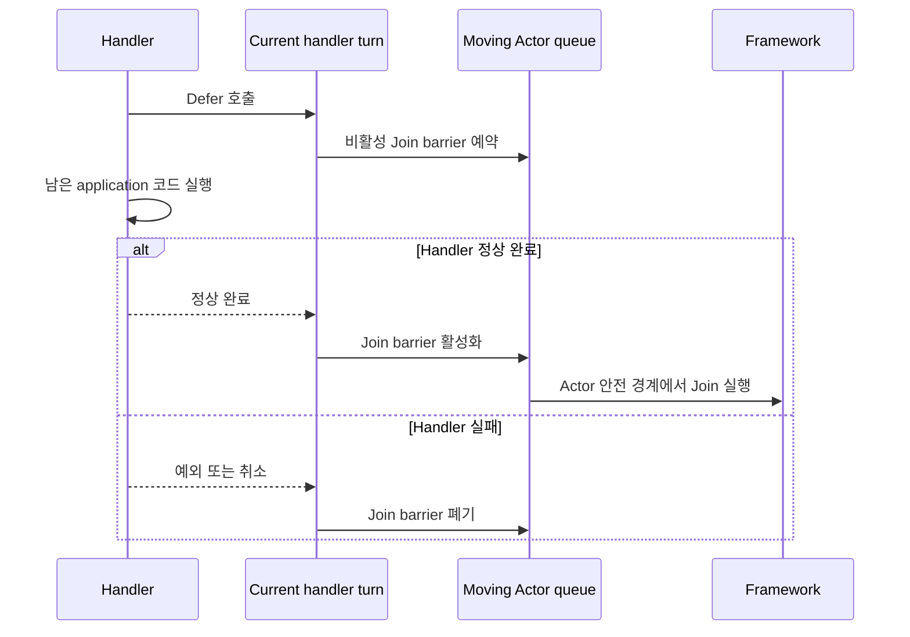
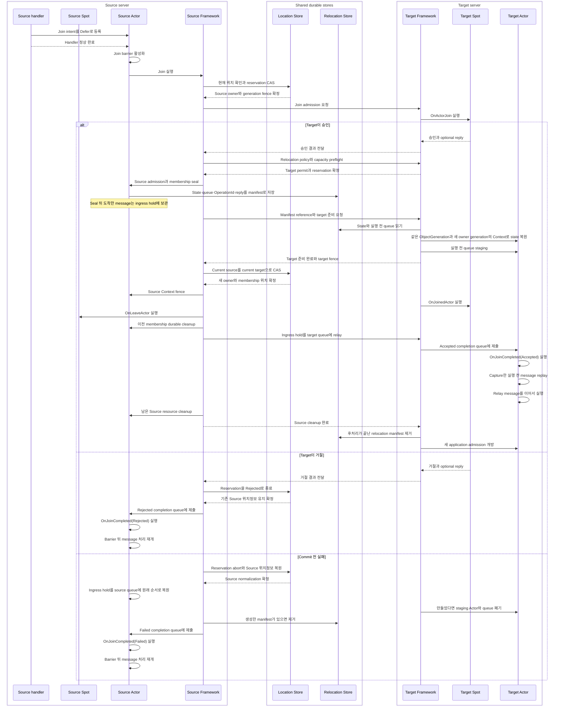

# Actor Join deferred execution, object Context composition과 message context 통합 계약 변경 요청

> 이 문서는 변경 요청의 추적 자료이며 현재 Framework 공개 계약을 설명하지 않는다.
> `Defer()` 기반 목표 계약은 정식 spec과 다섯 언어 exact interface에 흡수됐다.
> 이 문서는 독립 review와 정식 문서 흡수 확인이 끝날 때까지만 유지한다.

## 1. 변경 목적

변경 전 Actor Join은 Actor handler가 `JoinSpot(...).Async()` 또는
`JoinEntrySpot(...).Async()`를 호출하여 최종 승인 결과를 기다리는 형태다. Target
Spot이 다른 node에 있으면 같은 operation 안에서 Actor owner와 membership을
target node로 옮기고 target factory가 만든 새 Actor instance에 state를 복원한다.

Cross-node Join이 성공한 뒤 source handler의 비동기 continuation을 다시 실행하면
continuation이 source Actor instance의 field와 method를 계속 참조한다. 일반적인
.NET `Task`·Java `CompletionStage`·Kotlin coroutine·Node.js `Promise`·C++
coroutine continuation을 다른 process의 새 Actor instance로 이전할 수는 없다.
Source instance에 Join 이후 기록한 상태는 이미 만들어진 target snapshot에
포함되지 않으며 current owner의 상태에도 반영되지 않는다.

Same-node Join에서만 기존 instance와 continuation을 유지하면 target의 현재 위치에
따라 application 동작이 달라져 위치 투명성이 깨진다. 따라서 same-node와
cross-node Join을 모두 다음 원칙으로 통일한다.

- Join 호출은 현재 handler에서 이동을 실행하지 않고 intent만 등록한다.
- `Defer()`를 호출한 Framework handler가 정상적으로 끝난 뒤 intent를 활성화한다.
- 대상 Actor가 안전한 queue 경계에 도달한 뒤 membership 변경 또는 relocation을
  실행한다.
- Join 성공 뒤 source handler continuation을 다시 실행하지 않는다.
- Join에는 `Async`·`await`와 `Yield` terminal을 제공하지 않는다.
- Join 승인·거절·실패를 원래 handler continuation으로 반환하지 않는다.
- Join이 terminal outcome에 도달하면 이동 대상 Actor의
  `OnJoinCompletedAsync(...)` callback으로 결과를 통지한다.

이 문서에서 위 항목은 구현 과정에서 선택할 대안이 아니라 함께 지켜야 하는 목표
계약이다. 특히 `Defer()`를 비동기 결과 terminal로 다시 감싸거나 same-node에서만
handler continuation을 재개하는 구현은 허용하지 않는다.

이 변경과 함께 Actor·User Spot·Entry Spot·Instance Spot이 Framework Context를
동일한 composition 형식으로 소유하도록 다섯 언어 public interface를 통일한다.
Factory, handler, lifecycle과 relocation adapter도 object의 Context 멤버를 기준으로
정리하여 ID와 Context를 중복 전달하거나 `Configure(context)`에서만 Context를
사용하는 표면을 제거한다.

## 2. 적용 범위

Deferred Join 변경은 application이 요청하는 다음 Actor membership operation에
적용한다.

| Operation | Target | Cross-node일 때 |
|---|---|---|
| `JoinSpot` | Application이 지정한 User Spot | Actor relocation을 같은 operation에서 수행한다. |
| `JoinEntrySpot` | Framework가 선택한 Entry Spot | Actor relocation을 같은 operation에서 수행한다. |

이 요청은 Join을 handler가 끝난 뒤 실행하도록 바꾸는 것과 결과 통지 방식을
변경한다. 기존 Join의 target 선택, User Spot admission, relocation policy,
capacity preflight, snapshot 크기 제한, timer 복원, accepted journal, session route
전환과 Location·Relocation Store provider 계약은 별도로 변경하지 않는다. 이 문서에
전체 field나 제한값을 다시 쓰지 않았다는 이유로 기존 계약을 생략해서는 안 된다.

Host maintenance가 시작하는 standalone Actor relocation과 whole User Spot aggregate
relocation은 application `Defer()`를 사용하지 않는다. 기존 infrastructure
coordinator가 안전한 queue 경계를 예약한다.

Context composition 변경은 다음 public surface에 적용한다.

- Actor·User Spot·Entry Spot·Instance Spot application object
- Actor와 Spot의 생성·factory·DI activation 경로
- Spot direct·subscription·timer handler
- User·Entry Spot의 Actor send/request handler
- Channel·Node direct·Publish handler와 handler filter
- Spot lifecycle과 Actor membership callback
- Spot·Actor relocation adapter

함께 발견한 Spot Actor 전용 message context와 request reply option은 잘못된 public
surface이므로 이 변경에서 제거한다. Actor send·request handler에는 공통 handler
context를 직접 전달한다. Reply compression을 application이 선택하는 기능은 STREAM
Session Reply call에만 유지한다.

## 3. Actor·Spot과 Context의 관계

Actor와 세 종류의 Spot은 모두 Framework가 결합한 Context를 멤버로 소유한다. Context를
상속하거나 `Configure()`를 호출할 때만 임시 인자로 받는 형태를 사용하지 않는다.

### 3.1 Actor와 Actor Context

Actor와 Actor Context는 상속 관계가 아니다. Actor가 자신에게 결합된 Context를
멤버로 보관하는 composition 관계다.

```csharp
public interface IZLinkActor
{
    // Framework가 이 Actor에 결합한 Context다.
    IZLinkActorContext Context { get; }

    void Configure();

    // Defer로 등록한 Join이 terminal outcome에 도달하면 Actor queue에서 호출한다.
    ValueTask OnJoinCompletedAsync(
        ZLinkActorJoinCompletion completion,
        CancellationToken cancellationToken)
    {
        return ValueTask.CompletedTask;
    }
}

public interface IZLinkActorContext
{
    // Context가 결합된 Actor의 identity다.
    string ActorId { get; }
    ulong ObjectGeneration { get; }

    string MeshName { get; }
    string? SpotId { get; }
    IZLinkBoundSession BoundSession { get; }

    IZLinkActorJoinSpotCall JoinSpot(
        string targetSpotId);

    IZLinkActorJoinSpotCall JoinSpot(
        string targetSpotId,
        ZLinkMessage request);

    IZLinkActorJoinSpotCall JoinSpot<TRequest>(
        string targetSpotId,
        TRequest request);

    IZLinkActorJoinEntrySpotCall JoinEntrySpot();

    IZLinkActorJoinEntrySpotCall JoinEntrySpot(
        ZLinkMessage request);

    IZLinkActorJoinEntrySpotCall JoinEntrySpot<TRequest>(
        TRequest request);
}
```

`IZLinkActor`가 `IZLinkActorContext`를 상속하게 만들지 않는다. Actor는 application
state와 handler 구성을 소유하고, Context는 Framework가 관리하는 identity,
membership과 session capability를 제공한다.

Actor Context의 `ActorId`와 `ObjectGeneration`은 해당 Actor의 logical incarnation을
식별한다. Factory가 Context를 Actor에 전달한 뒤 application이 다른 Context로 교체할
수 없어야 한다. Actor가 별도 `ActorId` property를 노출한다면 `Context.ActorId`를
그대로 투영해야 하며 서로 다른 값을 저장하지 않는다.

`SpotId`는 identity가 아니라 현재 membership을 보여 주는 값이다. Same-node Join은
Actor instance와 Context 객체를 유지하되 Location Store의 membership commit과 같은
논리적 시점에 `Context.SpotId`를 target Spot ID로 바꾼다. Commit 전 callback과
handler에서는 source Spot ID를 읽고, commit 뒤 lifecycle·completion callback에서는
target Spot ID를 읽는다. Cross-node Join은 같은 `ActorId`와
`ObjectGeneration`, target `SpotId`에 결합한 새 Context를 target Actor에 제공한다.

Same-node membership 변경, cross-node Join과 standalone relocation은 모두
`ObjectGeneration`을 유지한다. Cross-node에서 application Actor object와 Context
객체를 새로 만들더라도 같은 logical incarnation을 복원하는 것이므로 generation을
증가시키지 않는다. Cross-node에서는 owner가 바뀌므로
`AuthorityOwnerGeneration`을 증가시키고 owner·membership을 target으로 바꾼다.
Same-node Join은 owner가 그대로이므로 owner generation을 증가시키지 않고 membership만
바꾼다. `ObjectGeneration`은 기존 incarnation을 종료하고 같은 ActorId의 새
incarnation을 만드는 destroy·recreate에서만 증가한다.

| Relocation 항목 | 적용 규칙 |
|---|---|
| `ObjectGeneration` | 같은 logical incarnation이므로 source 값을 유지한다. |
| `AuthorityOwnerGeneration` | Cross-node owner 변경에서 증가한다. |
| Target Context | 유지한 `ObjectGeneration`과 새 owner generation에 결합한다. |
| Source Context | Location Store commit 뒤 fence한다. |

Factory도 ActorId와 Context를 서로 독립된 입력으로 받지 않는다. Context가 exact
identity의 단일 입력이다.

```csharp
public interface IZLinkActorFactory<TActor>
    where TActor : class, IZLinkActor
{
    ValueTask<TActor> CreateAsync(
        IZLinkActorContext actorContext,
        CancellationToken cancellationToken = default);
}
```

Application Actor도 factory 인자로 받은 Context를 멤버로 보관한다.

```csharp
public sealed class PlayerActor : IZLinkActor
{
    public PlayerActor(IZLinkActorContext actorContext)
    {
        // Factory가 받은 exact Context가 Actor의 읽기 전용 멤버가 된다.
        Context = actorContext;
    }

    public IZLinkActorContext Context { get; }

    public void Configure()
    {
        // Configure에서도 별도 Context 인자를 받지 않는다.
    }
}
```

Factory가 반환한 Actor의 `Context`는 전달받은 exact Context여야 한다. Framework는
factory completion에서 이 관계를 검증하고 일치하지 않으면 Actor를 Ready로
공개하지 않는다. Cross-node relocation target은 target owner에 결합한 새 Context를
factory에 전달한다.

Cross-node commit 뒤 source Actor Context는 fence한다. Source Spot이 보관한 Actor와
Context는 source `OnLeaveActor` callback에서 application membership projection에서
제거해야 한다. Fenced Context로 send, request, session mutation이나 새 Join을
시작하면 current owner operation으로 전달하지 않고 typed stale·moving failure로
끝낸다.

Fenced source Context에서도 `ActorId`, `ObjectGeneration`과 마지막 source
membership 같은 진단용 property는 `OnLeaveActor`가 끝날 때까지 읽을 수 있다. Fence는
property 조회를 막는 것이 아니라 current owner만 시작할 수 있는 operation을 막는다.

### 3.2 Spot과 Spot Context

Spot도 Actor와 같은 composition 형식을 사용한다. Application Spot instance는 자신에게
결합된 Context를 읽기 전용 멤버로 보관한다.

```csharp
public interface IZLinkSpot
{
    // Framework가 이 User Spot에 결합한 Context다.
    IZLinkSpotContext Context { get; }

    void Configure();
}

public interface IZLinkEntrySpot
{
    // Framework가 이 Entry Spot에 결합한 Context다.
    IZLinkEntrySpotContext Context { get; }

    void Configure();
}

public interface IZLinkInstanceSpot
{
    // Framework가 이 Instance Spot에 결합한 Context다.
    IZLinkInstanceSpotContext Context { get; }

    void Configure();
}

public interface IZLinkSpotCommonContext
{
    // Context가 결합된 Spot의 exact identity다.
    string SpotId { get; }
    ulong ObjectGeneration { get; }

    string MeshName { get; }
    RoutingId NodeRid { get; }
    IZLinkSpotOutbound Outbound { get; }
}
```

세 Context를 하나의 공통 Context 타입으로 축소하지 않는다. 공통 identity와 outbound
기능은 `IZLinkSpotCommonContext`가 정의하지만, Spot instance가 노출하는 property
type은 자신의 종류에 맞는 Context다.

| Spot 종류 | Spot이 소유하는 Context | 종류별 기능 |
|---|---|---|
| User Spot | `IZLinkSpotContext` | Actor leave와 User Spot close |
| Entry Spot | `IZLinkEntrySpotContext` | Actor destroy |
| Instance Spot | `IZLinkInstanceSpotContext` | Instance Spot close와 direct handler registry |

Context는 해당 Spot exact instance와 같은 lifecycle에 결합한다. Factory 또는
Framework가 Spot instance를 만든 뒤 다른 Context로 교체할 수 없어야 한다. Spot
relocation target에는 기존 `ObjectGeneration`을 유지하고 새
`AuthorityOwnerGeneration`과 target owner에 결합한 새 Context를 제공한다. Source
Context는 relocation commit 뒤 fence하며, 그 Context를 사용한 새
operation은 current target으로 묵시적으로 전달하지 않는다.

이 composition 계약은 다섯 언어에 동일하게 적용한다. 언어 문법에 따른 property나
accessor 표기만 다를 수 있다.

| 언어 | Context 멤버 형식 |
|---|---|
| .NET | `IZLinkSpotContext Context { get; }` |
| Java | `ZLinkSpotContext context()` |
| Kotlin | `val context: ZLinkSpotContext` |
| Node.js | `readonly context: ZLinkSpotContext` |
| C++ | `spot_context_t& context()`과 `const spot_context_t& context() const` |

C++도 `configure(spot_context_t&)`처럼 `Configure` 호출에서만 Context를 전달하지
않는다. User·Entry·Instance Spot이 각각 자신의 Context accessor를 제공하고
`configure()`는 인자 없이 호출한다.

### 3.3 Context를 결합하는 생성 경로

Framework는 Actor나 Spot application instance보다 exact Context를 먼저 만든다. 그
Context를 해당 언어의 표준 생성 경로로 application instance에 전달하고, instance가
노출하는 Context 멤버가 전달한 exact 객체인지 Ready 공개 전에 검증한다.

Actor factory는 ActorId와 Actor Context를 별도 입력으로 받지 않는다. ActorId와
ObjectGeneration은 Actor Context에 포함하며 factory는 Context 하나만 identity
입력으로 받는다. 정확한 .NET 목표 signature는 §3.1의
`IZLinkActorFactory<TActor>`와 같다.

Spot은 별도 공통 public factory interface를 새로 만들지 않는다. 기존 type
registration과 언어별 DI·factory overload가 Context를 생성자 또는 factory 입력으로
전달한다. 생성된 Spot의 `Context` property·accessor가 전달한 exact Context와 다르면
activation을 실패시키며 factory, `Configure()`와 `OnInitialize`를 다시 진행하지
않는다.

```csharp
// .NET의 application type 예시
public sealed class LobbySpot : IZLinkSpot<PlayerActor>
{
    public LobbySpot(IZLinkSpotContext spotContext)
    {
        // 생성자에서 받은 exact Context를 Spot의 읽기 전용 멤버로 보관한다.
        Context = spotContext;
    }

    public IZLinkSpotContext Context { get; }

    public void Configure()
    {
        // Context는 Configure 인자가 아니라 Spot이 소유한 멤버다.
        Context.Handlers.AddPacket<LobbyPacketHandler>();
    }
}
```

```java
// 모든 Java User Spot이 지켜야 하는 Context composition 계약이다.
public interface ZLinkSpot<TActor extends ZLinkActor> {
    // Concrete Spot이 소유한 Context를 반환한다.
    ZLinkSpotContext context();

    void configure();
}

// Application Spot은 final field로 실제 Context를 소유한다.
public final class LobbySpot implements ZLinkSpot<PlayerActor> {
    private final ZLinkSpotContext context;

    public LobbySpot(ZLinkSpotContext spotContext) {
        // Framework가 생성한 exact Context를 Spot lifecycle 동안 유지한다.
        this.context = spotContext;
    }

    @Override
    public ZLinkSpotContext context() {
        return context;
    }

    @Override
    public void configure() {
        // configure 인자가 아니라 Spot이 소유한 Context로 handler를 등록한다.
        context().handlers().addHandler(LobbyPacketHandler.class);
    }
}
```

Java에서 “`ZLinkSpot`이 Context를 멤버로 소유한다”는 말은 interface에 shared field를
둔다는 뜻이 아니다. `ZLinkSpot.context()`가 모든 Spot의 public contract를 정의하고,
각 concrete Spot이 생성자에서 받은 exact Context를 `private final` field에 보관한다는
뜻이다. Framework는 `context()`가 생성할 때 전달한 동일한 Context 객체를 반환하는지
Ready 공개 전에 검증한다.

```kotlin
// Kotlin wrapper는 object Context를 읽기 전용 property로 노출한다.
abstract class ZLinkSuspendingSpot<TActor : ZLinkActor> :
    ZLinkSpot<TActor> {
    abstract val context: ZLinkSpotContext

    // Java interface의 context()를 Kotlin property에 연결한다.
    final override fun context(): ZLinkSpotContext = context

    abstract override fun configure()
}

class LobbySpot(
    // 생성자에서 받은 exact Context가 Spot의 읽기 전용 property가 된다.
    override val context: ZLinkSpotContext,
) : ZLinkSuspendingSpot<PlayerActor>() {
    override fun configure() {
        // configure 인자가 아니라 Spot이 소유한 Context를 사용한다.
        context.handlers().addHandler<LobbyPacketHandler>()
    }
}
```

```ts
// Node.js의 application type 예시
export class LobbySpot implements ZLinkSpot<PlayerActor> {
    constructor(
        public readonly context: ZLinkSpotContext<PlayerActor>,
    ) {}

    configure(): void {
        // configure 인자 없이 멤버 Context를 사용한다.
        this.context.handlers.addPacket(LobbyPacketHandler);
    }
}
```

```cpp
class lobby_spot_t final : public spot_t<player_actor_t> {
public:
    explicit lobby_spot_t(spot_context_t spot_context)
      : context_(std::move(spot_context)) {}

    spot_context_t &context() noexcept override { return context_; }
    const spot_context_t &context() const noexcept override { return context_; }

    void configure() override {
        // configure(context) 대신 멤버 accessor를 사용한다.
        context_.handlers().add_handler<lobby_packet_handler_t>();
    }

private:
    spot_context_t context_;
};
```

위 C++ 코드는 ownership 형식을 보여 주는 목표 pseudocode다. 실제 binding은 Context
handle의 복사·이동 가능 여부를 exact interface에서 고정해야 하지만, `configure`에
Context를 임시로 전달하는 형태로 되돌릴 수는 없다.

### 3.4 Handler interface에 적용하는 규칙

Handler는 실행 대상 application object를 인자로 받고 그 object의 Context 멤버를
사용한다. Object lifecycle Context를 handler의 별도 인자로 중복 전달하지 않는다.

Actor payload handler에는 containing Spot과 Actor를 함께 전달한다. 따라서 handler는
Spot 기능에는 `spot.Context`, Actor 기능에는 `actor.Context`를 사용한다. User Spot과
Entry Spot handler 모두 같은 형식을 사용한다.

`PerActor` User Spot과 Entry Spot에서는 서로 다른 Actor handler가 같은 containing
Spot instance를 동시에 받을 수 있다. Spot의 mutable shared state에 대한 thread
safety는 application 책임이며 Framework가 race를 막거나 자동 직렬화한다고 보장하지
않는다. Spot-owned mutable state를 직렬화해야 하면 명시적인 Spot send/request로
Spot lane에서 처리한다.

여기에는 수명이 다른 두 종류의 context가 등장한다.

| 구분 | 전달 방법 | 수명과 용도 |
|---|---|---|
| Spot·Actor object Context | `spot.Context`, `actor.Context` 멤버 | Object lifecycle 동안 유지하며 identity, membership과 object operation을 제공한다. |
| Message context | Handler의 `messageContext` 인자 | 현재 message 처리 동안만 유효하며 packet 정보와 metadata 등 언어별 exact interface가 정의한 값을 제공한다. |

Message context는 object Context를 다시 주입하는 값이 아니다. Per-message 정보를
수명이 긴 `actor.Context`나 `spot.Context`에 넣으면 동시에 실행되는 message의
metadata가 섞일 수 있으므로 handler 호출 인자로 분리한다.

이 변경 요청은 일반 Spot handler에 새 context 인자를 추가하지 않는다. 다만 public
message context의 이름과 계층은 함께 통일한다. 공통 타입은 `MessageContext`로
부르고, 고유 field가 없는 send·request·Spot Actor context는 제거한다. Route와
Publish처럼 고유 field가 있는 경우에만 `MessageContext`를 확장한 specialization을
둔다.

.NET 구현의 현재 Spot Actor message context는 다음과 같다. Framework가 현재 Actor
message를 dispatch할 때 만들며 application이 생성하거나 Actor에 보관하는 타입이
아니다.

```csharp
public interface IZLinkHandlerContext
{
    string MeshName { get; }
    string? ChannelName { get; }
    string PacketName { get; }
    string? ContentType { get; }
    ZLinkMessageMetadata Metadata { get; }
    CancellationToken ConnectionAborted { get; }
}

// 현재 구현에 있지만 제거할 타입이다.
public sealed class ZLinkSpotActorSendContext
    : IZLinkHandlerContext
{
    // Message가 들어온 RouteMesh 이름이다.
    public string MeshName { get; }

    // Spot Actor direct message는 Channel 호출이 아니므로 항상 null이다.
    public string? ChannelName => null;

    // 현재 dispatch할 packet의 stable 이름이다.
    public string PacketName { get; }

    // Sender가 지정하지 않았으면 null이다.
    public string? ContentType { get; }

    // Sender가 현재 message에 첨부한 immutable metadata snapshot이다.
    public ZLinkMessageMetadata Metadata { get; }

    // 현재 transport connection이 종료되면 취소된다.
    public CancellationToken ConnectionAborted { get; }
}

// 현재 구현에 있지만 제거할 타입이다.
public sealed class ZLinkSpotActorRequestContext
    : IZLinkHandlerContext
{
    public string MeshName { get; }
    public string? ChannelName => null;
    public string PacketName { get; }
    public string? ContentType { get; }
    public ZLinkMessageMetadata Metadata { get; }
    public CancellationToken ConnectionAborted { get; }

    // 현재 구현에 있지만 제거해야 하는 property다.
    public ZLinkSpotActorReplyOptions Reply { get; }
}
```

`ZLinkSpotActorReplyOptions`는 독립된 reply call builder가 아니다. Handler가
`TReply`를 반환하기 전에 `messageContext.Reply.Metadata(...)` 또는
`messageContext.Reply.Compress(...)`를 호출하면 .NET dispatcher가 handler 반환값을
encode할 때 이 option의 snapshot을 함께 적용한다. 현재 저장소에는 Spot Actor
request handler에서 reply payload를 넘겨 시작하는 별도 public Reply builder가 없다.

두 Actor 전용 context type과 `ZLinkSpotActorReplyOptions`를 함께 제거한다. Spot
Actor request handler는 `TReply`만 반환하며, Framework가 정한 고정된 reply encoding과
envelope 정책을 적용한다. Application은 Spot·Actor request reply에 metadata를
추가하거나 compression을 선택하지 않는다.

Application이 명시적으로 reply payload를 제출하고 reply compression을 선택하는
public 표면은 STREAM Session의 Reply call에만 둔다. Session 이외의 request handler에
Reply builder나 reply option 객체를 추가하지 않는다.

언어별 제거 범위는 다음과 같다.

| 언어 | 제거할 public surface | Actor handler가 받을 공통 context |
|---|---|---|
| .NET | `ZLinkSpotActorSendContext`, `ZLinkSpotActorRequestContext`, `ZLinkSpotActorReplyOptions` | `IZLinkMessageContext` |
| Java | `ZLinkSpotActorSendContext`, `ZLinkSpotActorRequestContext` | `ZLinkMessageContext` |
| Kotlin | Java의 두 Actor 전용 context 사용 | Java의 `ZLinkMessageContext` |
| Node.js | `ZLinkSpotActorSendContext`, `ZLinkSpotActorRequestContext`, `ZLinkSpotActorReplyOptions` | `ZLinkMessageContext` |
| C++ | `spot_actor_send_context_t`, `spot_actor_request_context_t`, `spot_actor_reply_options_t` | `message_context_t` |

Handler가 반환한 `TReply`는 변경 전과 같이 Framework가 encode하고 전송한다. 제거되는
것은 reply payload가 아니라 application이 Spot Actor reply의 envelope와 compression을
개별 설정하는 기능이다.

공통 message context의 field 계약은 Actor 전용 타입에서 다시 정의하지 않는다. Actor
direct message에서는 ChannelName이 없고, packet name·content type·수신 metadata와
connection cancellation 등 공통 계약에 있는 값만 채운다. Request correlation을
public으로 노출하기로 한 공통 계약이라면 request에서 같은 field를 채우고 send에서는
값이 없도록 표현한다. Framework 내부에서는 send와 request에 다른 concrete object를
사용할 수 있지만 그 구현 타입을 public handler signature에 노출하지 않는다.

현재 .NET exact interface와 구현 사이에도 다음 차이가 있다. 변경할 때 기존 어느
한쪽을 그대로 복사하지 않고 아래 목표 계약으로 맞춘다.

| 확인 대상 | `MeshName` | `CorrelationId` | Actor request reply option |
|---|---:|---:|---:|
| `04-channel-messaging` exact interface | 없음 | 있음 | 정의하지 않음 |
| `05-spots` exact interface의 concrete Actor context | 표시하지 않음 | 표시하지 않음 | `Reply` 있음 |
| 현재 .NET 구현 | 있음 | 없음 | `Reply` 있음 |
| 목표 계약 | 있음 | nullable로 제공 | 없음 |

`05-spots`의 concrete context는 `IZLinkHandlerContext`를 구현한다고 선언하면서 base
exact interface의 `CorrelationId`를 표시하지 않는다. 반대로 실제
`IZLinkHandlerContext` 구현에는 `MeshName`이 있고 `CorrelationId`가 없다. 따라서
위의 구현 code를 exact contract라고 해석해서는 안 된다.

다섯 언어를 확인한 현재 상태는 다음과 같다.

| 언어 | 일반 Spot packet·request context | Spot Actor context | Actor request reply option |
|---|---|---|---|
| .NET | Handler 인자 없음 | `ZLinkSpotActorSendContext`·`ZLinkSpotActorRequestContext` | metadata·compression |
| Java | `ZLinkSendContext`·`ZLinkRequestContext`를 받는 default overload | 이름만 분리한 Actor 전용 context | 없음 |
| Kotlin | Java와 같은 context를 받는 suspending overload | Java의 Actor 전용 context 사용 | 없음 |
| Node.js | 두 handler 모두 `ZLinkHandlerContext` | Actor 전용 context | compression |
| C++ | 선택적 `spot_packet_context_t` | `spot_actor_send_context_t`·`spot_actor_request_context_t` | metadata·compression |

목표 message context 이름과 계층은 다음과 같다.

| 의미 | .NET | Java·Kotlin | Node.js | C++ |
|---|---|---|---|---|
| 모든 inbound message의 공통 정보 | `IZLinkMessageContext` | `ZLinkMessageContext` | `ZLinkMessageContext` | `message_context_t` |
| Node direct의 source node 정보 | `IZLinkRouteMessageContext` | `ZLinkRouteMessageContext` | `ZLinkRouteMessageContext` | `route_message_context_t` |
| Publish의 topic·source 정보 | `IZLinkPublishMessageContext` | `ZLinkPublishMessageContext` | `ZLinkPublishMessageContext` | `publish_message_context_t` |
| STREAM Session inbound packet 정보 | `ZLinkSessionMessageContext` | `ZLinkSessionMessageContext` | `ZLinkSessionMessageContext` | `stream_message_context_t` |

다음 이름은 제거한다.

- `HandlerContext`, `SendContext`, `RequestContext`
- `RouteSendContext`, `RouteRequestContext`
- `SpotActorSendContext`, `SpotActorRequestContext`
- C++의 `spot_packet_context_t`

구현 작업자는 다음 이름 매핑을 다섯 언어 public surface와 exact interface에 함께
적용한다.

| 현재 이름 계열 | 목표 이름 계열 |
|---|---|
| `.NET` `IZLinkHandlerContext` | `IZLinkMessageContext` |
| Java·Kotlin·Node.js `ZLinkHandlerContext` | `ZLinkMessageContext` |
| C++ `handler_context_t` | `message_context_t` |
| `ZLinkSendContext`, `ZLinkRequestContext`, `send_context_t`, `request_context_t` | 제거하고 공통 `MessageContext` 사용 |
| `ZLinkSpotActorSendContext`, `ZLinkSpotActorRequestContext`, C++ Actor 전용 context | 제거하고 공통 `MessageContext` 사용 |
| `ZLinkRouteSendContext`, `ZLinkRouteRequestContext` | `ZLinkRouteMessageContext` |
| C++ `route_handler_context_t` | `route_message_context_t` |
| `ZLinkPublishContext` | `ZLinkPublishMessageContext` |
| C++ `publish_context_t` | `publish_message_context_t` |
| `ZLinkSessionDispatchContext` | `ZLinkSessionMessageContext` |
| C++ `stream_dispatch_context_t` | `stream_message_context_t` |

`RouteSendContext`와 `RouteRequestContext`는 같은 source node 정보를 제공하므로
`RouteMessageContext` 하나로 합친다. Send와 request의 차이는 handler interface와
nullable correlation으로 표현한다.

STREAM Session의 per-packet context는 `CanReply`와 Session 전용 metadata를 제공하므로
공통 `MessageContext`로 합치지 않는다. 다만 현재 packet의 정보라는 의미가 드러나도록
`SessionDispatchContext` 대신 `SessionMessageContext`로 이름을 맞춘다. Actor·Spot
object Context, Session lifecycle Context, Spot closing event와 serializer selection
context는 message handler context가 아니므로 이름을 바꾸지 않는다.

```csharp
public interface IZLinkMessageContext
{
    string? MeshName { get; }
    string? ChannelName { get; }
    string PacketName { get; }
    string? ContentType { get; }
    ZLinkMessageMetadata Metadata { get; }

    // UTF-8 exact string이다. Send에는 null이고 request에는 non-null이다.
    string? CorrelationId { get; }
}

public interface IZLinkRouteMessageContext : IZLinkMessageContext
{
    RoutingId SourceNodeRid { get; }
}

public interface IZLinkPublishMessageContext : IZLinkMessageContext
{
    string Topic { get; }
    string? Source { get; }
}
```

`ConnectionAborted`는 모든 언어가 동등하게 제공하는 message 정보가 아니므로
universal `MessageContext`에서 제거한다. Handler cancellation은 언어별 기존
cancellation 인자나 Session 전용 context가 소유한다.
`MeshName`은 RouteMesh와 Spot·Actor dispatch에서는 non-null이고 ClientServer·STREAM처럼
Mesh에 속하지 않는 경로에서는 null이다. `ChannelName`도 Channel dispatch에서만
non-null이다.

일반 Channel과 Node direct handler도 같은 이름을 사용한다.

```csharp
public interface IZLinkSendHandler<in TMessage>
{
    ValueTask HandleAsync(
        TMessage message,
        IZLinkMessageContext messageContext,
        CancellationToken cancellationToken);
}

public interface IZLinkRequestHandler<in TRequest, TReply>
{
    ValueTask<TReply> HandleAsync(
        TRequest request,
        IZLinkMessageContext messageContext,
        CancellationToken cancellationToken);
}

public interface IZLinkRouteSendHandler<in TMessage>
{
    ValueTask HandleAsync(
        TMessage message,
        IZLinkRouteMessageContext messageContext,
        CancellationToken cancellationToken);
}

public interface IZLinkRouteRequestHandler<in TRequest, TReply>
{
    ValueTask<TReply> HandleAsync(
        TRequest request,
        IZLinkRouteMessageContext messageContext,
        CancellationToken cancellationToken);
}
```

Framework 내부에서는 message 종류에 따라 다른 concrete object를 만들 수 있다. 이
구현 타입은 public handler signature에 노출하지 않는다. Actor request reply option은
모든 언어에서 제거하고 별도 Reply call builder도 추가하지 않는다.

Handler filter가 받는 객체는 현재 message 정보만 나타내는 context가 아니라 descriptor,
payload와 filter chain 실행을 함께 나타낸다. 따라서 `MessageContext`의 subtype으로
이름 붙이지 않고 `HandlerInvocation`으로 통일한다.

| 언어 | 목표 filter invocation 이름 |
|---|---|
| .NET | `ZLinkHandlerInvocation` |
| Java·Kotlin | `ZLinkHandlerInvocation` |
| Node.js | `ZLinkHandlerInvocation` |
| C++ | `handler_invocation_t` |

Java의 `ZLinkInvocationContext`와 C++의 `handler_invocation_context_t`는 위 이름으로
바꾼다. Invocation이 노출하는 현재 message 정보의 타입은 각각
`ZLinkMessageContext`와 `message_context_t`다.

```csharp
public interface IZLinkSpotActorSendHandler<
    TSpot,
    TActor,
    in TMessage>
    where TSpot : class
    where TActor : IZLinkActor
{
    ValueTask HandleAsync(
        TSpot spot, // Spot Context는 spot.Context로 읽는다.
        TActor actor, // Actor Context는 actor.Context로 읽는다.
        IZLinkMessageContext messageContext, // 현재 Actor send의 inbound 정보다.
        TMessage message,
        CancellationToken cancellationToken);
}

public interface IZLinkSpotActorRequestHandler<
    TSpot,
    TActor,
    in TRequest,
    TReply>
    where TSpot : class
    where TActor : IZLinkActor
{
    ValueTask<TReply> HandleAsync(
        TSpot spot, // Spot Context는 spot.Context로 읽는다.
        TActor actor, // Actor Context는 actor.Context로 읽는다.
        IZLinkMessageContext messageContext, // 현재 Actor request의 inbound 정보다.
        TRequest request,
        CancellationToken cancellationToken);
}
```

`IZLinkMessageContext`는 제거 대상인 Actor Context나 Spot Context가 아니다. 현재
Actor message 한 건의 packet 정보, metadata와 connection cancellation을 제공하는
**message handler context**다.
이 문서의 목표 예시에서는 인자 이름을 `messageContext`로 써서 object Context와
구분한다. 언어별 public parameter 이름을 반드시 바꾸라는 뜻은 아니다. Object
lifecycle 기능은 `spot.Context`와 `actor.Context`에서만 가져온다.

일반 Spot direct·subscription·timer handler는 이 변경 요청에서 signature를 바꾸지
않는다. .NET의 현재 exact interface는 다음과 같으며 packet과 request handler에
message context 인자가 없다.

```csharp
public interface IZLinkSpotPacketHandler<TSpot, in TMessage>
    where TSpot : class
{
    ValueTask HandleAsync(
        TSpot spot,
        TMessage message,
        CancellationToken cancellationToken);
}

public interface IZLinkSpotRequestHandler<TSpot, in TRequest, TReply>
    where TSpot : class
{
    ValueTask<TReply> HandleAsync(
        TSpot spot,
        TRequest request,
        CancellationToken cancellationToken);
}

public interface IZLinkSpotSubscriptionHandler<TSpot, in TEvent>
    where TSpot : class
{
    ValueTask HandleAsync(
        TSpot spot,
        TEvent message,
        CancellationToken cancellationToken);
}

public interface IZLinkSpotTimerHandler<TSpot>
    where TSpot : class
{
    ValueTask HandleAsync(
        TSpot spot,
        ZLinkTimerTick tick,
        CancellationToken cancellationToken);
}
```

이 Handler들은 이미 Spot instance를 받으므로 object의 Spot Context 인자를 추가하지
않는다. Java/Kotlin의 일반 Spot packet·request overload, Node.js 일반 Spot handler와
C++의 context 선택형 Spot packet member처럼 이미 message context를 받는 표면은 모두
`MessageContext`를 사용한다. .NET처럼 현재 message context 인자가 없는 handler에 새
인자를 추가하는 것은 별도 handler parity 작업으로 남긴다.

### 3.5 Lifecycle callback과 relocation adapter

`Configure()`, `OnCreate`, `OnInitialize`, `OnClosing`, Actor membership callback과
relocation adapter도 application object의 Context 멤버를 사용한다.

- `Configure()`는 Context 인자를 받지 않는다.
- Spot lifecycle callback에 Spot Context를 별도 인자로 추가하지 않는다.
- `OnClosing`의 `ZLinkSpotClosingContext`는 종료 reason과 deadline을 담는 event
  data이며 Spot Context가 아니다.
- Actor membership callback은 Actor object를 받으며 Actor Context를 별도 인자로
  받지 않는다.
- Spot·Actor relocation adapter는 각각 Spot 또는 Actor object를 받고 Context를
  별도 인자로 받지 않는다.
- Target factory가 만든 object에는 target Context가 이미 결합되어 있으므로
  `Restore` callback도 object의 Context 멤버를 사용한다.

### 3.6 다섯 언어의 interface 변경 목록

| 언어 | 변경할 object·factory interface | 변경하거나 확인할 handler interface |
|---|---|---|
| .NET | `IZLinkActor`, `IZLinkSpot`, `IZLinkEntrySpot`, `IZLinkInstanceSpot`의 `Context`; `IZLinkActorFactory.CreateAsync(actorContext)` | User·Entry Actor handler가 Spot·Actor·`IZLinkMessageContext`·payload를 받는지 확인 |
| Java | `ZLinkActor`, `ZLinkSpot`, `ZLinkEntrySpot`, `ZLinkInstanceSpot`의 `context()`; `ZLinkActorFactory.create(actorContext)` | User·Entry Actor handler가 Spot·Actor·`ZLinkMessageContext`·payload를 받는지 확인 |
| Kotlin | Actor·User·Entry·Instance Spot의 `val context`; suspending Actor factory의 `createActor(actorContext)` | suspending Actor handler가 Java의 공통 `ZLinkMessageContext`를 사용하는지 확인 |
| Node.js | Actor·User·Entry·Instance Spot의 `readonly context`; Actor factory의 `create(actorContext, signal)` | Actor handler에 containing Spot을 추가하고 `ZLinkMessageContext`를 사용하는지 확인 |
| C++ | `actor_t::context()`와 User·Entry·Instance Spot의 종류별 `context()`; factory identity 입력을 Context 하나로 통일; `configure()` 인자 제거 | Actor payload member가 containing Spot인 `this`, Actor와 `message_context_t`를 사용하는지 확인 |

다섯 언어에서 함수 이름과 cancellation 표현은 달라도 다음 호출 정보는 같아야 한다.

| Callback 종류 | 전달하는 application object | 현재 호출에만 속하는 값 |
|---|---|---|
| Spot send·request·subscription·timer | Spot | 현재 message·tick에 필요한 경우만 전달 |
| User Spot Actor send·request | User Spot + Actor | send/request message context |
| Entry Spot Actor send·request | Entry Spot + Actor | send/request message context |
| Spot lifecycle | callback receiver인 Spot 자체 | closing event data 등 callback별 data만 전달 |
| Actor membership lifecycle | callback receiver인 Spot + 대상 Actor | 없음 |
| Spot relocation adapter | Spot | cancellation만 전달 |
| Actor relocation adapter | Actor | cancellation만 전달 |

#### 언어별 Actor factory 목표 signature

```java
public interface ZLinkActorFactory {
    CompletionStage<ZLinkActor> create(
        // 반환하는 Actor가 이 exact Context를 멤버로 보관해야 한다.
        ZLinkActorContext actorContext);
}
```

```kotlin
abstract class ZLinkSuspendingActorFactory : ZLinkActorFactory {
    protected abstract suspend fun createActor(
        // 반환하는 Actor의 context property가 이 객체를 보관해야 한다.
        actorContext: ZLinkActorContext,
    ): ZLinkActor
}
```

```ts
export interface ZLinkActorFactory<
    TActor extends ZLinkActor = ZLinkActor> {
    create(
        // 반환하는 Actor의 readonly context가 이 객체여야 한다.
        actorContext: ZLinkActorContext,
        signal?: AbortSignal): Promise<TActor>;
}
```

```cpp
template <typename TActor>
class actor_factory_t {
public:
    virtual task_t<std::shared_ptr<TActor>> create(
      // 반환하는 Actor의 context()가 이 exact Context를 반환해야 한다.
      actor_context_t &actor_context,
      std::stop_token operation_cancellation) = 0;
};
```

어느 언어에서도 `actorId`와 같은 값을 포함한 Actor Context를 함께 받지 않는다.

#### 언어별 Actor handler 목표 signature

.NET 목표 signature는 §3.4의
`IZLinkSpotActorSendHandler`·`IZLinkSpotActorRequestHandler`와 같다. Java와 Kotlin은
같은 호출 정보를 다음과 같이 표현한다.

```java
public interface ZLinkSpotActorSendHandler<
        TSpot, TActor extends ZLinkActor, TMessage> {
    CompletionStage<Void> handle(
        TSpot spot,
        TActor actor,
        ZLinkMessageContext messageContext, // Object Context가 아니다.
        TMessage message);
}

public interface ZLinkSpotActorRequestHandler<
        TSpot, TActor extends ZLinkActor, TRequest, TReply> {
    CompletionStage<TReply> handle(
        TSpot spot,
        TActor actor,
        ZLinkMessageContext messageContext, // Object Context가 아니다.
        TRequest request);
}
```

```kotlin
interface ZLinkSuspendingSpotActorSendHandler<
    TSpot,
    TActor : ZLinkActor,
    TMessage,
> {
    suspend fun handle(
        spot: TSpot,
        actor: TActor,
        messageContext: ZLinkMessageContext, // 현재 Actor send의 inbound 정보다.
        message: TMessage,
    )
}

interface ZLinkSuspendingSpotActorRequestHandler<
    TSpot,
    TActor : ZLinkActor,
    TRequest,
    TReply,
> {
    suspend fun handle(
        spot: TSpot,
        actor: TActor,
        messageContext: ZLinkMessageContext, // 현재 Actor request의 inbound 정보다.
        request: TRequest,
    ): TReply
}
```

Node.js는 현재 빠져 있는 `TSpot`과 `spot` 인자를 추가한다.

```ts
export interface ZLinkSpotActorSendHandler<
    TSpot,
    TActor extends ZLinkActor,
    TMessage> {
    handle(
        spot: TSpot,
        actor: TActor,
        messageContext: ZLinkMessageContext, // Object Context가 아니다.
        message: TMessage): Promise<void>;
}

export interface ZLinkSpotActorRequestHandler<
    TSpot,
    TActor extends ZLinkActor,
    TRequest,
    TReply> {
    handle(
        spot: TSpot,
        actor: TActor,
        messageContext: ZLinkMessageContext, // Object Context가 아니다.
        request: TRequest): Promise<TReply>;
}
```

C++ Actor handler는 Spot의 member function이므로 containing Spot을 별도 인자로
중복 전달하지 않는다. `this`가 현재 Spot이며 Actor와 message context, payload만
명시적으로 받는다.

```cpp
task_t<void> handle_actor_send(
  TActor &actor,
  const message_context_t &message_context, // Per-message data only.
  const TMessage &message);

task_t<TReply> handle_actor_request(
  TActor &actor,
  const message_context_t &message_context, // Per-message data only.
  const TRequest &request);
```

User Spot과 Entry Spot은 별도 class를 사용하지만 member 인자의 의미는 같다. .NET,
Java, Kotlin과 Node.js처럼 handler object가 Spot과 분리된 언어는 Spot 인자를
명시적으로 받고, C++처럼 Spot member를 handler로 등록하는 언어는 `this`로 같은
object에 접근한다.

### 3.7 구현에서 금지하는 중복 표면

다음 형태는 Context composition을 적용한 것으로 보지 않는다.

- Actor에 `ActorId`를 별도 저장하면서 `Actor.Context.ActorId`와 독립적으로 관리
- Spot에 `SpotId`나 `ObjectGeneration`을 별도 저장하면서 Context 값과 독립적으로
  관리
- Factory가 ID와 같은 ID를 포함한 Context를 함께 받음
- Spot이 Context accessor를 제공하면서 `Configure(context)`도 함께 유지
- Handler가 Spot·Actor object와 그 object의 lifecycle Context를 별도 인자로 함께
  받음
- Relocation 뒤 fenced source Context의 operation을 current target으로 자동 전달

## 4. 목표 Join interface

Join builder는 현재의 비동기 결과 terminal을 제거하고 deferred registration
terminal 하나만 제공한다.

```csharp
public interface IZLinkActorDeferredJoinCall
{
    // 현재 Framework handler에 Join intent를 등록한다.
    // Join은 이 handler가 정상적으로 끝난 뒤 실행 가능 상태가 된다.
    void Defer();
}

public interface IZLinkActorJoinSpotCall
    : IZLinkActorDeferredJoinCall
{
    IZLinkActorJoinSpotCall Timeout(TimeSpan timeout);
}

public interface IZLinkActorJoinEntrySpotCall
    : IZLinkActorDeferredJoinCall
{
    IZLinkActorJoinEntrySpotCall Timeout(TimeSpan timeout);
}
```

다음 terminal은 제공하지 않는다.

```csharp
// 제거 대상
ValueTask<ZLinkActorJoinResult> Async(...);
ValueTask<ZLinkActorJoinResult> Yield(...);
```

`Defer()`는 Join 결과를 반환하지 않는다. Handler 종료 뒤 시작하는 operation의
승인·거절·실패를 현재 handler continuation으로 전달할 수 없기 때문이다. 결과는
나중에 Actor의 `OnJoinCompletedAsync(...)`로 전달한다.

Target User Spot의 admission callback은 승인 또는 거절과 optional application
reply를 반환한다. 승인 뒤에는 기존 target `OnJoinedActor`와 source `OnLeaveActor`
callback을 실행한 다음 target Actor에 accepted completion을 제출한다. 거절은 source
membership을 유지하고 source Actor에 rejected completion을 제출한다. Timeout과
commit 전 relocation 실패도 source Actor에 failed completion을 제출한다. Commit 후
recovery가 필요한 실패는 target authority를 복구한 뒤 target Actor에 terminal
completion을 제출한다.

## 5. 호출할 수 있는 handler

`Defer()`는 Actor handler 전용이 아니다. Framework scheduler가 시작과 종료를
관리하는 다음 application handler에서 사용할 수 있다.

- Actor send handler
- Actor request handler
- User·Entry Spot packet·request·subscription handler
- User·Entry Spot timer handler

Entry Spot과 User Spot의 Actor handler에는 모두 적용한다. `SpotWide`와 `PerActor`
execution mode도 모두 지원한다.

Instance Spot은 Actor membership을 소유하지 않으므로 그 handler와 timer에서는
Actor Join을 등록할 수 없다. Application이 다른 곳에 보관한 Actor Context를 Instance
Spot handler로 가져와 호출해도 current local membership scope 검증에 실패한다.

Factory, `Configure()`, Spot lifecycle callback, relocation adapter와 Framework가
관리하지 않는 application thread에서는 호출할 수 없다. Handler가 반환된 뒤
별도로 실행되는 background task도 새 `Defer()`를 등록할 수 없다.

Handler가 `await`한 비동기 호출 뒤 같은 awaited execution chain에서 `Defer()`를
호출하는 것은 허용한다. Runtime은 open handler registration scope와 Actor exact
identity를 함께 검증한다. Handler가 기다리지 않는 detached·background task에서
`Defer()`를 호출하는 것은 application contract 위반이다. 언어 runtime의 ambient
context 전파만으로 awaited ancestry와 detached ancestry를 항상 구분할 수 없으므로
Framework는 이 오용을 조기에 검출한다고 보장하지 않는다. Handler scope close와
`Defer()`가 경합하면 registration은 scope seal 전에 원자적으로 포함되거나, seal 뒤
`InvalidConfiguration`으로 실패해야 한다.

Handler 인자 `messageContext`는 현재 message 정보만 제공한다. Join 대상 Actor를
식별하는 값은 message context가 아니라 Join을 호출한 `actor.Context`다.

## 6. Handler별 사용 형태

### 6.1 Actor handler

Actor handler는 Framework가 인자로 전달한 Actor의 Context로 자기 자신의 Join을
등록한다.

```csharp
public sealed class MoveToRoomHandler
    : IZLinkSpotActorSendHandler<
        LobbySpot,
        PlayerActor,
        MoveToRoom>
{
    public ValueTask HandleAsync(
        LobbySpot spot,
        PlayerActor actor,
        IZLinkMessageContext messageContext,
        MoveToRoom message,
        CancellationToken cancellationToken)
    {
        actor.Context
            .JoinSpot(
                message.TargetSpotId,
                message.JoinRequest)
            .Timeout(TimeSpan.FromSeconds(5))
            .Defer(); // 이 handler가 끝난 뒤 실행 가능 상태가 된다.

        // 아직 Join을 실행하지 않았으므로 현재 Actor state를 변경할 수 있다.
        actor.PendingSpotId = message.TargetSpotId;

        return ValueTask.CompletedTask;
    }
}
```

### 6.2 Spot handler

Spot handler는 application이 선택한 local member Actor 각각의 Context로 Join을
등록할 수 있다. 한 handler에서 서로 다른 Actor 여러 개의 Join을 등록할 수 있다.

```csharp
public ValueTask HandleAsync(
    LobbySpot spot,
    MoveMembers message,
    CancellationToken cancellationToken)
{
    foreach (var actor in spot.SelectedActors)
    {
        actor.Context
            .JoinSpot(
                message.TargetSpotId,
                message.JoinRequest)
            .Defer();
    }

    return ValueTask.CompletedTask;
}
```

위 예제의 `SelectedActors`는 application이 관리하는 membership projection을
설명하기 위한 pseudocode다. 새 public Actor lookup API를 추가한다는 뜻이 아니다.
Spot은 `OnJoinedActor`에서 전달받은 local Actor 또는 Actor Context를 membership
projection에 등록하고 `OnLeaveActor`에서 제거할 수 있다. Spot·Timer handler는 이
projection으로 대상 Actor Context를 선택한다. `PerActor` mode에서는 projection으로
Actor identity와 Context만 선택하며 동시에 실행될 수 있는 Actor의 mutable
application state를 직접 읽거나 변경하지 않는다.

### 6.3 Timer handler

Timer handler도 local member Actor를 선택하여 Join을 등록할 수 있다.

```csharp
public ValueTask HandleAsync(
    LobbySpot spot,
    ZLinkTimerTick tick,
    CancellationToken cancellationToken)
{
    foreach (var actor in spot.FindIdleActors())
    {
        actor.Context
            .JoinEntrySpot(LeaveLobbyRequest.Instance)
            .Defer();
    }

    return ValueTask.CompletedTask;
}
```

`FindIdleActors()`도 application state를 설명하는 pseudocode이며 Framework resolver
API가 아니다.

## 7. Deferred Join record

`Defer()`는 target 조회, proposal callback, capture, factory 또는 authority CAS를
시작하지 않는다. 대신 다음 작업을 terminal 호출 안에서 완료한다.

- Typed join request를 encode하고 immutable payload snapshot으로 고정한다.
- Request size와 형식 제약을 검증한다.
- `Defer()` 호출 시각을 기준으로 absolute end-to-end deadline을 고정한다.
- 현재 handler registration scope와 이동 대상 Actor exact identity를 고정한다.
- 대상 Actor queue에 비활성 relocation barrier를 예약한다.

Application이 `Defer()` 뒤 원래 typed request 객체나 metadata를 변경해도 고정한
payload에는 영향을 주지 않는다. Runtime은 handler가 끝날 때까지 mutable
application request 객체를 보관하지 않는다.

현재 handler turn에는 다음 의미의 record를 등록한다.

```csharp
internal sealed record DeferredActorJoin(
    ZLinkActorJoinOperationId OperationId,
    string ActorId,
    ulong ObjectGeneration,
    string? ExpectedSourceSpotId,
    DeferredJoinTarget Target,
    ZLinkMessage Request,
    Deadline Deadline,
    HandlerTurnId RegisteredBy);
```

이 코드는 internal record의 의미를 보여 주는 pseudocode다. Public type이나 실제
field layout을 요구하지 않는다.

`OperationId`는 `Defer()` attempt마다 발급하는 non-zero 128-bit completion
idempotency ID다. 비활성 barrier와 completion queue record가 사용하고 cross-node
Accepted에서는 Relocation Store manifest의 별도 field로 보존한다. 기존
RelocationId, placement reservation ID와 aggregate commit ID를 재사용하거나 이들과
동일하다고 간주하지 않는다.

`Defer()`는 호출 시 다음 조건을 검증한다.

- 현재 Framework가 관리하는 Actor handler 또는 User·Entry Spot의
  Spot·Timer handler가 실행 중이다.
- `actor.Context`가 current local exact Actor instance를 나타낸다.
- Target ID, request와 timeout이 유효하다.

검증에 실패하면 record를 만들지 않고 `Defer()` 호출 자체가
`InvalidConfiguration` typed error로 동기적으로 실패한다.

한 handler turn은 최대 64개의 Join을 등록할 수 있다. 각 encoded request는 최대
1 MiB이고 같은 turn의 encoded Join request 합계는 최대 8 MiB다. 어느 한도를
넘긴 `Defer()`는 `InvalidConfiguration`으로 동기 실패하며 partial record를 남기지
않는다. Join request를 생략하는 overload는 empty `ZLinkMessage`를 고정한다.

Timeout을 생략하면 5초를 사용한다. 명시 값은 millisecond 올림 기준
`1..INT_MAX` ms의 finite duration이어야 한다. `Defer()`는 monotonic clock 기준
absolute deadline을 고정하며 invalid timeout은 record 없이 `InvalidConfiguration`
으로 동기 실패한다.

이 단계에서는 target을 조회하거나 capacity와 relocation policy를 검사하지 않는다.
따라서 문법상 유효한 target Spot ID가 실제로 없거나, eligible Entry Spot·capacity가
없거나, cross-node policy가 이동을 허용하지 않는 경우에는 `Defer()`가 성공할 수
있다. 이런 조건은 handler 종료 뒤 Join을 실행할 때 확인하고 source Actor에 typed
`Failed` completion으로 전달한다.

Actor의 current generation·membership 확인, pending transition claim과 비활성
barrier 설치는 하나의 원자적 registration으로 처리한다. 일부만 성공한 상태를
`Defer()` 성공으로 반환하지 않는다. 이 record, handler-terminal linkage와 barrier
activation은 process-local이다. Location commit 전에 source process가 종료되면
deferred intent와 completion을 재구성하지 않으며 authority와 membership은 source에
유지된다. 새 durable Store나 cross-process handler-turn recovery를 요구하지 않는다.

Join claim과 Retire·Shutdown seal은 같은 Actor transition arbitration을 사용한다.
Join claim이 먼저면 maintenance가 Join terminal까지 기다린다. Retire seal이 먼저면
`Defer()`는 `ActorMoving`, Shutdown admission seal이 먼저면 `RuntimeShutdown`으로
동기 실패한다. 같은 target User Spot이나 현재 Entry Spot으로의 Join은 lifecycle
callback과 Store mutation 없이 idempotent `Accepted` completion을 제출한다.

Inactive Join claim은 handler가 이후 request·worker `Yield`를 사용해도 유지된다.
같은 target Actor에 대한 awaited self request는 기존 self-await 오류로 거부한다.
Spot handler가 자신이 barrier를 등록한 Actor의 terminal을 await하는 request도
`InvalidConfiguration`으로 거부해 barrier와 wait cycle을 만들지 않는다.

Request handler reply는 handler terminal 전에 encoding을 끝낸다. Reply encoding
실패는 handler failure이므로 inactive barrier를 폐기한다. Encoding이 끝난 뒤 reply
transport admission failure나 disconnect가 발생해도 정상 종료한 handler가 등록한
Join을 취소하지 않는다.

같은 call에서 `Defer()`를 두 번 호출하면 두 번째 호출이 `AlreadySubmitted` typed
error로 동기적으로 실패한다. 다른 call이 같은 Actor의 membership transition을 이미
예약했으면 `Defer()` 호출이 configuration 오류가 아닌 `ActorMoving` typed error로
동기적으로 실패한다. 이 오류들은 나중에 실행되는 Join 결과가 아니라 intent 등록
단계에서 확인한 오류다.

Deadline은 handler의 남은 실행, reply terminal, 대상 Actor 안전 경계 대기,
proposal, target 준비와 Location Store의 owner·membership commit까지 적용한다.
Handler가 끝나기 전에 deadline이 만료되면 handler 실행을 강제로 중단하지 않는다.
Handler가 정상 terminal 상태가 된 뒤 barrier 위치에
`OnJoinCompletedAsync(Failed(DeadlineExceeded))`를 제출하고 runtime event와 metric을
기록한다. Handler 자체가 실패하면 §10의 규칙에 따라 Join을 활성화하지 않고 barrier를
폐기한다.

Location Store commit이 성공하면 Join은 되돌릴 수 없는 `Accepted`다. 그 뒤 deadline이
지나거나 lifecycle callback, relay 또는 cleanup이 실패해도 결과를 `Failed`로 바꾸지
않는다. Framework는 target을 sealed 상태로 유지한 채 recovery를 계속하고, 후처리가
완료되면 target Actor에 같은 `OperationId`의 `Accepted` completion을 전달한다.

## 8. Relocation barrier와 queue ordering

Handler 종료 뒤 Join record를 처음 queue에 추가하면 이미 대기 중이거나 그 사이에
도착한 Actor message가 Join보다 먼저 실행될 수 있다. 이를 막기 위해 `Defer()` 호출
시 이동 대상 Actor queue에 비활성 relocation barrier를 예약한다.

```text
Current Actor job
→ Deferred Join barrier
→ Already queued Actor message 1
→ Already queued Actor message 2
→ Later Actor message 1
→ Later Actor message 2
```

Barrier는 일반 queue tail에 추가하지 않는다. 현재 실행 중인 Actor job이 있으면 그
job 바로 뒤, 실행 중인 job이 없으면 모든 대기 application message 앞에 설치한다.
이미 수락했지만 실행하지 않은 message와 barrier 뒤에 도착한 message는 source에서
실행하지 않는다. Same-node Join이면 새 membership에서 이어서 처리하고 cross-node
Join이면 accepted journal과 함께 target queue로 옮긴다.

Barrier는 Actor별 application ordering을 고정하지만 `Defer()`를 호출한 handler가
끝나기 전에는 Join을 실행하지 않는다. 비활성 barrier가 queue head에 먼저
도달하면 handler terminal 상태가 확정될 때까지 해당 Actor의 다음 application
message를 실행하지 않는다.

Handler의 정상 완료와 barrier 활성화는 같은 process-local handler-turn transition으로
처리한다. Request handler에서는 caller reply admission의 terminal 상태도 같은 turn
completion 조건에 포함한다. Activation이나 Location commit 전에 source process가
종료되면 Join intent 복구를 보장하지 않고 source authority와 membership을 유지한다.

한 handler turn이 여러 Actor의 Join을 등록했다면 그 turn의 정상 완료에 따라 같은
process 안에서 모든 비활성 barrier를 활성화하고, handler 실패에 따라 모두 폐기한다.
Process 종료를 넘어 이 all-or-none 결과를 복구한다고 보장하지 않는다. 각 Join의
target 승인과 최종 outcome은 활성화 뒤 서로 독립적으로 진행한다.

Handler 실패, target admission 거절 또는 commit 전 Join 실패로 source membership을
유지하면 barrier 위치에서 해당 `Rejected` 또는 `Failed` completion callback을 먼저
실행하고 대기 message를 원래 순서대로 source Actor에서 다시 처리한다. Handler
자체가 실패하여 Join을 활성화하지 않은 경우에만 completion 없이 barrier를
폐기한다. 따라서 실패한 Join 때문에 해당 Actor의 queue가 계속 정지하지 않는다.



같은 handler에서 서로 다른 Actor 여러 개에 barrier를 예약할 수 있다. 제한은
handler당 하나가 아니라 Actor당 pending membership transition 하나다.

## 9. 실행 경계

활성화된 barrier가 queue head에 도달해도 이동 대상 Actor의 application handler가
이미 실행 중이면 그 handler가 끝날 때까지 기다린다. Join은 다음 두 조건을 모두
만족한 뒤 시작한다.

1. `Defer()`를 호출한 handler가 정상적으로 끝났다.
2. 대상 Actor가 current application job을 끝내고 lifecycle 전환이 가능한 queue
   경계에 도달했다.

### 9.1 `SpotWide`

Actor handler, Spot handler와 timer handler가 같은 User Spot execution gate를
사용한다. 호출한 handler가 끝나 공통 gate를 반납하고 이동 대상 Actor barrier가
queue head에 도달하면 Join을 실행한다.

### 9.2 `PerActor`

Spot lane, timer lane과 Actor별 gate가 동시에 실행될 수 있다. Spot 또는 timer
handler가 Actor Join을 등록했더라도 target Actor handler가 실행 중이면 그 Actor
job이 끝날 때까지 기다린다. 다른 Actor의 handler와 관련 없는 Spot·timer lane은
계속 실행할 수 있다.

## 10. Handler 완료와 실패

Application handler가 정상적으로 반환한 경우에만 해당 turn이 등록한 barrier를
활성화한다. Handler가 exception을 반환하거나 cancelled terminal 상태로 끝나면 아직
비활성인 barrier를 폐기하고 기존 owner와 membership을 유지한다. Cancellation
token에 신호가 들어왔더라도 handler가 정상적으로 반환했다면 cancellation 신호만으로
barrier를 폐기하지 않는다.

Request handler가 Join을 등록한 경우 그 request handler가 caller에게 보내는
application reply의 encoding을 먼저 확정한다. 이 reply는 target `OnActorJoin`이
Join completion에 첨부하는 optional reply와 다른 기존 request/reply 결과다. Reply
송신 성공 여부가 이미 실행한 application state 변경을 rollback하는 근거는 아니므로
reply admission이 terminal 상태에 도달한 뒤 Join barrier를 활성화한다. Reply
timeout이나 caller disconnect가 Join intent를 자동으로 취소한다는 뜻은 아니다.

Join deadline이 barrier 활성화 전에 만료되면 reply 처리와 독립적으로 barrier를
활성화하지 않는다. Handler가 정상적으로 끝나면 barrier 위치를
`Failed(DeadlineExceeded)` completion으로 바꾸고, handler가 실패하면 completion
없이 폐기한다. 이미 시작한 application handler나 reply admission을 Join timeout으로
취소하지 않는다.

Handler가 exception 또는 cancellation으로 끝나 Join barrier를 폐기해도 handler가
이미 변경한 Actor·Spot application state를 Framework가 rollback하지 않는다. 이
문서의 폐기는 membership transition만 시작하지 않는다는 뜻이다.

Handler가 종료된 뒤 Context를 보관한 background task가 새 Join을 등록하면 현재
handler turn이 없으므로 `InvalidConfiguration`이다.

## 11. Same-node와 cross-node 실행

Same-node와 cross-node 모두 같은 deferred ordering을 사용한다.

### 11.1 Same-node

- Target proposal이 필요하면 User Spot callback을 실행한다.
- Actor instance를 새로 만들거나 relocation adapter를 호출하지 않는다.
- Membership commit과 같은 논리적 시점에 기존 Actor Context의 `SpotId`를 바꾼다.
- Commit 뒤 target joined와 source leave callback을 실행한다.
- 새 membership의 Actor에서 accepted completion callback을 실행한다.
- Completion 뒤 다음 Actor message를 새 membership에서 실행한다.

### 11.2 Cross-node

- Target proposal과 relocation preflight를 수행한다.
- Source Actor가 안전한 queue 경계에 도달한 뒤 source Actor state를 capture한다.
- Actor policy와 target capacity permit을 확인하고 target reservation을 만든다.
- Target factory·restore와 staging queue 준비를 끝낸다.
- Actor authority, source·target membership, capacity와 aggregate generation을
  bounded aggregate transaction으로 commit한다.
- Target joined와 source leave callback을 실행한다.
- 이전 source membership의 durable cleanup을 끝내고 seal 뒤 ingress hold를 target
  queue에 합류시킨다.
- Target Actor에서 accepted completion callback을 실행한다.
- Completion 뒤 accepted queue와 relay message를 순서대로 실행한다.
- 남은 source resource cleanup과 route barrier를 끝낸 뒤 새 target admission을 연다.

Current handler는 Join 시작 전에 이미 끝났으므로 source continuation을 target으로
이전하거나 commit 뒤 source Actor에서 다시 실행하지 않는다. Handler가 `Defer()`
뒤에 변경한 Actor state도 `Snapshot` policy에서는 handler 종료 뒤 capture하므로 target snapshot에 포함된다.

Deferred 실행으로 바뀌어도 relocation payload의 범위는 줄어들지 않는다. Actor
policy가 `Snapshot`이면 handler tail까지 반영된 application state와 함께 seal 전에
수락했지만 실행하지 않은 message, accepted journal, timer logical
registration·pending tick과 Framework metadata를 저장한다. `Recreate`는 target에서
새 object instance를 만들지만 같은 logical incarnation이므로 ObjectGeneration을
유지한다. Application state는 capture하지 않고 Framework queue, accepted journal,
timer와 metadata만 보존한다. `Disabled`는 cross-node capture 전에 거부한다.

## 12. Join state

Deferred Join은 다음 상태를 구분한다.

```text
RegisteredInactive
  ├─ HandlerFailed → Discarded
  └─ HandlerCompleted → Activated
                         → WaitingForActorBoundary
                         → Running
                            ├─ Accepted
                            ├─ Rejected
                            └─ Failed
```

`RegisteredInactive`와 `Activated`는 application에 공개하는 결과 enum이 아니다.
Runtime monitoring과 recovery coordinator가 barrier와 operation을 구분하기 위한
내부 상태다. `Accepted`, `Rejected`, `Failed`는 runtime terminal outcome이며
`ZLinkActorJoinCompletion`의 해당 variant로 Actor에게 전달한다.

`Rejected`와 commit 전 `Failed`에서는 source Actor와 membership을 유지한다.
Commit 뒤에는 Join outcome을 `Failed`로 바꾸지 않는다. Source로 rollback하지 않고
current target 위치와 같은 operation manifest를 기준으로 recovery를 계속한 뒤
`Accepted` completion을 전달한다.

`Accepted` outcome은 Location Store commit 성공 시점에 결정되지만 application에
completion을 전달했다는 뜻은 아니다. Commit 뒤 남은 lifecycle, completion, relay와
cleanup의 진행 위치는 기존 manifest cursor로 복구한다. 이 구분을 위해 별도 Location
Store 상태나 relocation operation record를 추가하지 않는다.

## 13. Join 완료 통지

`Defer()`는 registration만 완료하므로 Join 결과를 호출한 handler에 반환하지 않는다.
대신 Join이 terminal outcome에 도달하면 이동 대상 Actor의
`OnJoinCompletedAsync(...)` callback을 Actor queue에서 실행한다.

### 13.1 완료 결과 타입과 Actor callback

```csharp
public readonly record struct ZLinkActorJoinOperationId(
    ulong High,
    ulong Low);

public abstract record ZLinkActorJoinCompletion
{
    private ZLinkActorJoinCompletion()
    {
    }

    public sealed record Accepted(
        ZLinkActorJoinOperationId OperationId,
        ActorRef Actor,
        ZLinkMessage? Reply)
        : ZLinkActorJoinCompletion;

    public sealed record Rejected(
        ZLinkActorJoinOperationId OperationId,
        ZLinkMessage? Reply)
        : ZLinkActorJoinCompletion;

    public sealed record Failed(
        ZLinkActorJoinOperationId OperationId,
        ZLinkFrameworkErrorKind Kind,
        bool IsRetriable)
        : ZLinkActorJoinCompletion;
}

public interface IZLinkActor
{
    IZLinkActorContext Context { get; }

    ValueTask OnJoinCompletedAsync(
        ZLinkActorJoinCompletion completion,
        CancellationToken cancellationToken)
    {
        // Join 결과 처리가 필요하지 않은 Actor는 기본 no-op을 사용한다.
        return ValueTask.CompletedTask;
    }
}
```

다른 언어도 같은 Actor lifecycle callback을 제공한다.

```java
public interface ZLinkActor {
    ZLinkActorContext context();

    default CompletionStage<Void> onJoinCompleted(
            ZLinkActorJoinCompletion completion) {
        return CompletableFuture.completedFuture(null);
    }
}
```

```kotlin
interface ZLinkSuspendingActor : ZLinkActor {
    val context: ZLinkActorContext

    // Java의 context() 계약을 Kotlin property에 연결한다.
    override fun context(): ZLinkActorContext = context

    suspend fun onJoinCompleted(
        completion: ZLinkActorJoinCompletion,
    )
}
```

```ts
export interface ZLinkActor {
    readonly context: ZLinkActorContext;

    onJoinCompleted?(
        completion: ZLinkActorJoinCompletion): Promise<void>;
}
```

```cpp
class actor_t {
public:
    virtual actor_context_t &context() noexcept = 0;
    virtual const actor_context_t &context() const noexcept = 0;

    virtual task_t<void> on_join_completed(
      const actor_join_completion_t &completion);
};
```

Java·Kotlin·Node.js·C++의 completion type도 `Accepted`, `Rejected`, `Failed`
variant와 같은 field 의미를 제공한다. Binding 문법에 맞는 sealed type, discriminated
union 또는 variant를 사용할 수 있지만 outcome이나 optional reply를 생략할 수 없다.

`OperationId`는 `Defer()`에서 고정한 non-zero 128-bit completion idempotency ID다. Current process
retry와 cross-node Accepted manifest recovery는 같은 값을 전달한다. Same-node와
Rejected·commit 전 Failed는 process replacement 뒤 replay를 보장하지 않는다.
Application은 외부 side effect를 중복 실행하지
않도록 이 값을 idempotency key로 사용할 수 있다. 다섯 언어 exact interface는
동일한 128-bit 값을 손실 없이 표현해야 한다.

`Accepted.Reply`와 `Rejected.Reply`는 target User Spot의 `OnActorJoin` admission
callback이 반환한 optional application reply다. `Failed`는 callback exception
객체나 transport 내부 상태를 노출하지 않고 public
`ZLinkFrameworkErrorKind`와 재시도 가능 여부만 제공한다.

현재 `ZLinkFrameworkErrorKind`에는 Join relocation 실패를 구분할 값이 부족하다.
다섯 언어 exact interface에 다음 값을 같은 numeric value로 추가한다.

```csharp
public enum ZLinkFrameworkErrorKind
{
    // 기존 0..36 값은 유지한다.
    RelocationDisabled = 37,
    RelocationTargetUnavailable = 38,
    RelocationFailed = 39
}
```

`Failed.Kind`는 다음 기준으로 정한다.

| 실패 조건 | `Kind` |
|---|---|
| Target User Spot을 찾을 수 없음 | `SpotRouteNotFound` |
| Eligible Entry Spot이나 호환 target capability가 없음 | `RelocationTargetUnavailable` |
| Target capacity가 부족함 | `PlacementCapacityExhausted` |
| Actor policy가 cross-node 이동을 허용하지 않음 | `RelocationDisabled` |
| Deadline 전 location commit을 완료하지 못함 | `DeadlineExceeded` |
| Target admission callback exception이나 Capture·factory·restore·staging 실행 실패 | `RelocationFailed` |
| Durable relocation payload를 읽거나 검증할 수 없음 | `RelocationDataLost` |
| Generation·owner·membership fence가 달라짐 | `ActorGenerationStale`, `ActorLocationStale` 또는 `ActorMoving` |
| Runtime shutdown으로 commit 전에 중단됨 | `RuntimeShutdown` |

Target `OnActorJoin`이 정상적으로 거절을 반환하면 `Failed(RequestRejected)`로 바꾸지
않고 `Rejected` variant를 사용한다. Callback이 exception으로 끝나면 application이
선택한 거절이 아니므로 `Failed(RelocationFailed)`다.

기존 `ZLinkActorJoinResult`를 handler continuation에 반환하는 표면은 제거하지만,
승인·거절과 optional reply 의미는 `ZLinkActorJoinCompletion`으로 옮긴다. Optional
reply 자체를 제거하지 않는다.

### 13.2 어떤 Actor에서 callback을 실행하는가

| Terminal outcome | Callback을 실행하는 Actor | Callback 시점 |
|---|---|---|
| Accepted | 새 membership과 owner가 적용된 target Actor | Target `OnJoinedActor`와 source `OnLeaveActor`가 완료된 뒤 |
| Rejected | 기존 membership을 유지한 source Actor | Target admission 거절을 확정하고 source barrier를 해제하기 전 |
| Commit 전 Failed | 기존 membership을 유지한 source Actor | Source normalization을 완료하고 barrier를 해제하기 전 |
| Commit 후 recovery를 거친 Accepted | Current target 위치의 Actor | Target recovery와 lifecycle cleanup을 완료한 뒤 |

Callback이 실행될 때 `actor.Context`는 위 표에서 선택한 current instance의 Context다.
Cross-node Accepted를 source Actor에 통지하거나 Rejected를 target staging Actor에
통지하지 않는다.

`Defer()`가 동기 registration error로 실패하면 Join record가 없으므로 completion도
없다. `Defer()` 뒤 원래 handler가 exception 또는 cancellation으로 실패한 경우에도
Join을 활성화하지 않고 intent를 폐기하므로 completion callback을 실행하지 않는다.

### 13.3 Queue ordering

Join completion은 일반 application message보다 먼저 처리해야 하는 Actor queue
record다. 내구성 범위는 outcome별로 다르다.

```text
Current Actor job
→ Deferred Join barrier
→ Join operation
→ Actor OnJoinCompleted
→ Messages that waited behind the barrier
```

Accepted이면 barrier 뒤에 있던 message와 completion record를 target accepted
journal로 옮기고 completion을 첫 Actor application callback으로 실행한다. Rejected나
commit 전 Failed이면 source queue의 barrier 위치에 completion을 넣고, completion이
끝난 뒤 대기 message를 원래 순서대로 실행한다.

Completion callback이 실패하면 이미 확정한 membership이나 owner를 rollback하지
않는다. 현재 process 안에서는 해당 completion record를 retry하고 그 Actor의 뒤
message는 callback이 terminal completion에 도달할 때까지 실행하지 않는다.

Callback exception이 계속 발생해도 Framework가 completion을 성공으로 간주하거나
뒤 message를 건너뛰어 실행하지 않는다. Actor는 completion retry가 필요한 sealed
상태를 유지하고 runtime event와 retry count를 노출한다. 이 상태의 운영자 개입과
강제 종료 정책은 일반 lifecycle callback failure 정책을 사용하며 Join request의
deadline으로 callback을 생략하지 않는다.

Same-node Join은 membership CAS만 durable하다. Accepted completion의 `OperationId`,
optional reply와 retry cursor는 current process lifetime까지만 유지하며 process
교체 뒤 completion replay를 보장하지 않는다.

Cross-node Join에서만 Location authority가 published Relocation manifest reference를
가리킨다. Commit한 Accepted outcome은 manifest에 `OperationId`, optional reply와
completion cursor를 기록하므로 target replacement 뒤에도 durable at-least-once
completion을 제공한다. Target 준비가 끝났더라도 이 manifest를 publish할 수 없으면
commit하지 않고 source에서 `Failed`로 끝낸다.

Rejected와 commit 전 Failed는 Location authority를 바꾸지 않으며 completion record와
retry는 current source process lifetime까지만 유지한다. Source process가 교체되면
이 completion replay를 보장하지 않고 authority와 membership은 source에 유지된다.

### 13.4 전체 sequence



이 그림은 Source server와 Target server가 물리적으로 분리된 cross-node User Spot
`JoinSpot`을 기준으로 한다. 각 server box 안의 Framework, Spot과 Actor는 같은
process에 존재한다. Location Store와 Relocation Store는 두 server가 함께 사용하는
외부 durable infrastructure다.

`JoinEntrySpot`은 Target admission 단계를 건너뛰지만 Location Store reservation,
target 준비, bounded aggregate commit과 completion ordering은 같다. Same-node Join은
Source와 Target이 같은 server box에 있는 흐름이며 state capture·restore와 remote
queue relay를 건너뛴다. Location Store의 membership 변경은 같은 CAS commit으로
확정한다.

Resolver가 읽는 Location Store 위치정보는 한 번만 변경한다. Target factory·restore와
실행 전 queue staging이 모두 성공하면 `(ActorId, ObjectGeneration, expected source
owner fence)`를 조건으로 Actor authority, source·target membership, capacity와
aggregate generation을 bounded aggregate commit으로 함께 바꾼다. 이 commit이
논리적 이동의 확정점이며 단일 location row CAS로 축소하지 않는다.

앞 단계의 reservation CAS는 동일 Actor의 이동 실행자를 하나로 제한하는 control
fence이며 resolver가 읽는 current owner나 membership을 변경하지 않는다.

```text
Location Store current location
Current(source owner, source membership, owner fence N)
  → Current(target owner, target membership, owner fence N+1)
```

Lifecycle callback, Actor completion, accepted queue replay, ingress relay와 source
cleanup이 끝났는지는 current location row에 다시 기록하지 않는다. 기존 Relocation
Store manifest가 immutable Actor state, 실행 전 queue, source·target fence와
relay·cleanup cursor, Join `OperationId`와 optional reply를 보관한다. Recovery
coordinator는 이 manifest를 사용해 commit 뒤 남은 callback, message relay와 cleanup을
계속한다. 별도 relocation 진행 record나 단계별 state machine을 추가하지 않는다.

Location Store 위치 CAS 전에는 resolver가 source owner를 유지하고 target Actor에서
application callback이나 message를 실행하지 않는다. CAS 뒤에는 resolver가 target
owner를 반환한다. Target runtime은 이때 도착한 새 message와 source에서 relay한
message를 relocation ingress hold 또는 accepted journal에 수락할 수 있지만,
이전 source membership cleanup과 `OnJoinCompleted`가 끝날 때까지 application
handler를 실행하지 않는다. Completion 뒤에는 barrier 뒤에서 기다리던 기존 queue와
relay message를 확정한 순서대로 실행한다. 남은 source resource cleanup과 route
normalization까지 끝나 manifest를 제거할 수 있게 되면 새 target application
admission을 정상 상태로 전환한다.

여기서 닫아 두는 것은 application handler를 실행하는 dispatch admission이다.
Transport에서 message를 받는 것까지 모두 거부한다는 뜻은 아니다. Target은 bounded
relocation hold의 여유가 있는 동안 새 message를 받아 기록하고, hold가 가득 차면
일반 messaging 계약과 같은 backpressure·timeout을 적용한다.

Rejected에서는 owner와 membership을 변경하지 않으며 reservation의 terminal result만
기록한다. Commit 전 Failed에서는 reservation을 abort하고, source authority를
seal했다면 이를 해제한 뒤 source ingress hold를 원래 arrival order로 queue에
돌려놓는다.

Source seal 뒤 owner·membership commit 전까지 들어온 Actor message는 바로 target으로
보내지 않는다. Source의 bounded ingress hold에 original operation identity와
`ObjectGeneration`을 유지해 보관한다. Commit이 실패하면 source queue로 되돌리고,
commit이 성공하면 target으로 relay하여 capture한 실행 전 queue 뒤의 올바른 순서에
합류시킨다. Commit 뒤에도 이전 source route로 늦게 도착한 message는 active forwarding
mapping과 같은 fence를 검증한 뒤 target으로 relay한다. 새 Location Store 조회는
target owner를 반환한다.

이 규칙은 서로 다른 sender의 network arrival에 새로운 전역 FIFO를 보장하지 않는다.
기존 Actor messaging이 보장하는 operation identity, 중복 제거와 owner queue 수락
순서를 유지한다. Capture한 queue, source ingress hold와 commit 뒤 target hold 사이의
경계만 relocation 때문에 뒤집히지 않게 한다.

Commit 후 장애는 source로 rollback하지 않는다. Current target authority를 복구하고
target lifecycle cleanup을 완료한 뒤 target Actor에서 completion을 실행한다.
Location Store current location을 다시 source로 바꾸거나 같은 target 값으로 두 번째
commit하지 않는다. 이때 completion outcome은 `Failed`가 아니라 원래 admission
reply를 보존한 `Accepted`다. Recovery는 current target fence와 Relocation Store
manifest에서 계속한다.

Source process가 commit 뒤 종료되어 `OnLeaveActor`를 더 실행할 수 없으면 exact source
fence의 durable membership·resource cleanup terminal이 source callback 완료를
대신한다. Target recovery는 실행할 수 없는 source callback을 무기한 기다리지 않는다.
Source runtime이 유지되는 동안 발생한 callback exception은 같은 operation으로
재시도하며, 어느 경우에도 target application message는 lifecycle gate와 completion이
끝나기 전에 실행하지 않는다.

## 14. 오류와 중복 처리

| 조건 | 처리 |
|---|---|
| 허용되지 않은 실행 문맥에서 `Defer()` 호출 | Barrier를 만들지 않고 동기 `InvalidConfiguration` |
| 같은 call에서 `Defer()`를 두 번 호출 | 두 번째 호출에서 동기 `AlreadySubmitted` |
| 같은 Actor에 다른 pending Join이 있음 | 등록하지 않고 동기 `ActorMoving` |
| Handler 정상 완료 전 예외·취소 | 해당 handler가 등록한 비활성 barrier 폐기 |
| Registration CAS에서 Actor generation·membership 불일치 | Barrier를 만들지 않고 동기 typed stale-generation failure |
| 실행 시 target Spot·eligible Entry Spot을 찾지 못함 | Source Actor에 typed target-not-found `Failed` completion 제출 |
| Cross-node policy·target capability·capacity preflight 실패 | Source를 seal하지 않고 해당 typed `Failed` completion 제출 |
| Target proposal 거절 | Source membership 유지, source Actor에 `Rejected` completion 제출 뒤 barrier 해제 |
| Commit 전 timeout·capture·restore·CAS 실패 | Source normalization, source Actor에 `Failed` completion 제출 뒤 barrier 해제 |
| Commit 후 callback·cleanup 실패 | Source rollback 없이 target recovery 후 target Actor에 같은 `OperationId`의 `Accepted` completion 제출 |

같은 handler가 서로 다른 Actor에 등록한 Join은 서로 독립적으로 처리한다. Actor
하나의 Join 실패가 다른 Actor의 barrier를 rollback하지 않는다.

Actor destroy, standalone relocation과 다른 membership transition도 같은 Actor의
pending transition claim을 공유한다. 어느 operation도 진행 중인 Join을 건너뛰어
별도의 owner·membership commit을 만들지 않는다. 정확한 승자는 기존 authority CAS와
generation fence가 결정한다. Relocation과 membership transition은 generation을
바꾸지 않는다. 다른 operation이 먼저 membership을 바꾸거나 destroy·recreate가
generation을 바꾸면 `Defer()`가 동기 실패한다. Join registration이 먼저 성공하면
경쟁 operation은 Join terminal 전까지 기다리거나 typed moving 결과로 끝난다.

## 15. 언어별 terminal 이름

Join은 Messaging·Worker call builder naming 규칙의 대상이 아닌 object lifecycle
operation이다. 모든 언어에서 deferred 실행 의미를 직접 나타내는 이름을 사용한다.

| 언어 | Terminal |
|---|---|
| .NET | `Defer()` |
| Java | `defer()` |
| Kotlin | `defer()` |
| Node.js | `defer()` |
| C++ | `defer()` |

반환형은 모두 결과 데이터가 없는 즉시 registration 완료다. Kotlin coroutine,
Java `CompletionStage`, Node.js `Promise`와 C++ `task_t`를 반환하지 않는다.
`Defer()` 호출 자체는 target I/O나 relocation을 시작하지 않기 때문이다.

## 16. 정식 문서 변경 대상

이 요청을 채택하면 다음 계약을 함께 수정해야 한다.

- Actor model의 `Join은 Async로 결과를 기다린다`는 설명
- Spot과 Actor membership의 handler 내부 `Async()` 예제
- 비동기 실행 정책에서 Join을 일반 비동기 terminal로 분류한 표
- 다섯 언어 Actor exact interface의 Join terminal과 result type
- `OnActorJoin`의 승인·거절과 optional reply를 completion으로 전달하는 계약
- Actor `OnJoinCompleted` callback과 accepted·rejected·failed completion type
- Join `OperationId`와 completion callback의 idempotency 계약
- Join failure에 필요한 `RelocationDisabled`, `RelocationTargetUnavailable`,
  `RelocationFailed` error kind와 다섯 언어 numeric parity
- Same-node·cross-node Join state machine과 queue ordering
- Location Store의 Actor authority·source/target membership·capacity·aggregate generation bounded aggregate commit
- Existing Relocation Store manifest의 target fence, relay·cleanup cursor와 제거 조건
- SpotWide·PerActor execution gate 설명
- Handler failure와 deferred barrier cleanup
- Handler turn terminal과 barrier 활성화의 process-local atomicity
- `Defer()` 시 request snapshot과 absolute deadline 고정
- Actor Context identity, factory 주입과 source fencing
- User·Entry·Instance Spot의 Context composition과 source fencing
- C++ Spot의 Context accessor와 인자 없는 `configure()` 통일
- Node.js Actor handler의 containing Spot 인자 추가
- 다섯 언어의 공통 message context 이름을 `MessageContext`로 통일
- `HandlerContext`, send·request·Spot Actor 전용 context와 C++ Spot packet
  context 제거
- `RouteSendContext`·`RouteRequestContext`를 `RouteMessageContext`로 통합
- `PublishContext`를 `PublishMessageContext`로 통일
- `SessionDispatchContext`를 `SessionMessageContext`로 통일
- Java·Kotlin의 `ZLinkInvocationContext`와 C++의
  `handler_invocation_context_t`를 `HandlerInvocation` 계열로 통일
- 다섯 언어 공통 message context의 field와 nullability parity 확정
- .NET·Node.js·C++의 Spot Actor reply option 제거
- STREAM Session 이외의 request handler에는 Reply builder와 reply compression
  option을 제공하지 않는 경계
- 다섯 언어 factory에서 ID와 Context의 중복 입력 제거
- Handler·lifecycle·relocation adapter의 object Context 전달 규칙
- Implementation gap과 cross-language contract test

정식 spec에는 이 변경 요청 문서를 참조하지 않고 확정된 현재 계약만 직접
기술한다.

## 17. 필수 검증 scenario

- Actor send handler가 자기 Actor Join을 등록하고 handler 종료 뒤 실행한다.
- Actor request handler가 reply 값을 확정한 뒤 Join을 실행한다.
- `Defer()`의 잘못된 실행 문맥과 중복 등록 오류가 I/O를 시작하기 전에 동기적으로
  발생한다.
- Target lookup, relocation policy와 capacity 실패는 `Defer()`의 동기 오류가 아니라
  handler 종료 뒤 source Actor의 typed `Failed` completion으로 전달된다.
- Join failure 조건이 §13.1의 exact `ZLinkFrameworkErrorKind`로 매핑되고 다섯
  언어에서 같은 numeric value를 사용한다.
- Spot handler가 서로 다른 Actor 여러 개의 Join을 등록한다.
- Timer handler가 local member Actor Join을 등록한다.
- Factory에 전달한 Context와 반환한 Actor의 Context가 다르면 Actor를 Ready로
  공개하지 않는다.
- Actor factory가 ActorId와 Actor Context를 중복 입력으로 받지 않는다.
- User·Entry·Instance Spot이 종류에 맞는 Context를 멤버로 소유한다.
- Spot activation에 전달한 Context와 Spot이 노출하는 Context가 다르면 Ready로
  공개하지 않는다.
- Spot relocation target에는 새 target Context를 결합하고 commit 뒤 source
  Context를 fence한다.
- C++ Spot에서도 Context accessor를 제공하고 `configure()`에 Context 인자를
  전달하지 않는다.
- User·Entry Actor handler가 containing Spot과 Actor를 함께 받고 object lifecycle
  Context를 중복 인자로 받지 않는다.
- Node.js와 C++ Actor handler도 containing Spot을 사용할 수 있는 동일한 public
  호출 정보를 제공한다.
- Message handler context가 Actor·Spot lifecycle Context와 구분되어 유지된다.
- Send·request·Spot Actor handler가 종류별 marker context 대신 각 언어의 공통
  `MessageContext`를 받는다.
- Node direct handler가 send/request 구분 없이 `RouteMessageContext`를 받고 Publish
  handler가 `PublishMessageContext`를 받는다.
- STREAM Session packet callback이 `SessionMessageContext`를 사용하며 Reply 가능
  여부와 Session 전용 metadata 의미는 유지한다.
- Handler filter wrapper 이름이 `HandlerInvocation` 계열로 통일되고 그 안의 현재
  message 정보가 `MessageContext` 타입이다.
- Spot Actor request handler가 반환한 `TReply`에 고정된 Framework reply 정책을
  적용하고 application별 reply metadata·compression 설정을 노출하지 않는다.
- .NET·Node.js·C++에서 Spot Actor reply option type과 context property가 제거된다.
- STREAM Session Reply call에서만 application이 reply compression을 선택할 수 있다.
- `Snapshot` policy에서 `Defer()` 뒤 handler가 변경한 Actor state가 cross-node target에 복원된다.
- Handler가 실패하면 비활성 barrier를 폐기한다.
- 한 handler가 등록한 여러 barrier는 같은 handler terminal 결과에 따라 모두
  활성화하거나 모두 폐기한다.
- Handler terminal·barrier activation과 여러 barrier all-or-none은 process-local이며
  Location commit 전 process 종료에서 intent recovery를 기대하지 않고 source authority·membership을 유지한다.
- Handler당 64개와 encoded request 합계 8 MiB, 개별 request 1 MiB 경계를 검증하고
  초과 registration이 partial record 없이 동기 실패한다.
- Request 없는 overload는 empty `ZLinkMessage`를 전달한다.
- Timeout 생략은 5초, 명시는 millisecond 올림 `1..INT_MAX` ms이며 Defer 시 monotonic
  absolute deadline을 고정한다.
- 같은 Actor의 두 번째 pending Join을 거부한다.
- `Defer()` 전에 이미 대기하던 message와 이후 도착한 message가 Join보다 먼저
  실행되지 않는다.
- Cross-node Join이 barrier 뒤의 실행 전 message를 target queue로 옮긴다.
- Same-node Join, cross-node Join과 standalone relocation 전후에
  `ObjectGeneration`이 그대로 유지된다.
- Cross-node target factory·restore에 source와 같은 `ObjectGeneration`을 전달하고
  owner·membership과 `AuthorityOwnerGeneration`만 변경한다.
- Cross-node Target Context가 유지한 `ObjectGeneration`과 새
  `AuthorityOwnerGeneration`에 결합되며, Location Store commit 전에는 operation과
  application handler 실행을 허용하지 않는다.
- Target admission 거절이나 commit 전 실패 뒤에는 source Actor completion을 먼저
  실행하고 barrier 뒤 대기 message 처리를 재개한다.
- `Defer()` 뒤 mutable request를 변경해도 target은 `Defer()` 시점의 snapshot을 받는다.
- Deadline이 handler tail과 Actor 안전 경계 대기를 포함한다.
- `PerActor`에서 target Actor handler가 실행 중이면 안전한 Actor 경계까지 기다린다.
- `SpotWide`에서 다른 Actor·Spot·timer ordering을 깨뜨리지 않는다.
- Same-node와 cross-node가 같은 deferred application 의미를 제공한다.
- Same-node commit에서 기존 Actor Context의 `SpotId`가 target membership으로
  바뀌고 Actor identity와 Context 객체는 유지된다.
- Factory·Configure·lifecycle callback과 scope close 뒤 background·detached task의
  `Defer()`를 거부한다. Open scope의 detached 호출은 application misuse이며 조기 검출을 보장하지 않는다.
- Instance Spot handler와 timer의 `Defer()`를 거부한다.
- Open handler scope close와 `Defer()` 경합이 seal 전 포함 또는 seal 뒤
  `InvalidConfiguration`으로 끝난다. Detached task 조기 검출은 성공 조건으로 요구하지 않는다.
- Join claim과 Retire·Shutdown seal 경합에서 `ActorMoving`·`RuntimeShutdown` 우선순위와
  maintenance wait를 검증한다.
- Same-target User·Entry Join은 lifecycle·Store mutation 없이 idempotent Accepted completion을 실행한다.
- Defer 뒤 Yield가 inactive claim을 유지하고, self awaited request와 barrier 대상 Actor await가
  cycle을 만들기 전에 거부된다.
- Reply encoding 실패는 barrier를 폐기하지만 encoding 뒤 transport admission failure·disconnect는
  Join을 취소하지 않는다.
- Cross-node commit 뒤 source handler continuation을 실행하지 않는다.
- Location Store의 cross-node owner·membership commit이 성공한 직후 source Actor
  Context를 fence한다.
- Join 결과를 원래 handler continuation으로 반환하지 않고 Actor completion
  callback으로 전달한다.
- Accepted는 target Actor, Rejected와 commit 전 Failed는 source Actor에서
  completion을 실행한다.
- Completion callback을 barrier 뒤의 일반 message보다 먼저 실행한다.
- Current process 안의 completion retry와 cross-node Accepted durable retry가
  owner와 membership commit을 반복하지 않는다.
- Completion callback이 계속 실패하면 뒤 message를 실행하지 않고 sealed 상태와
  retry 진단 정보를 유지한다.
- Current process retry와 cross-node Accepted recovery는 같은 128-bit `OperationId`를 전달한다.
- Cross-node commit 전에 Accepted optional reply와 completion cursor를 Relocation manifest에
  고정한다. Same-node outcome과 Rejected·commit 전 Failed는 process lifetime을 넘는 replay를 보장하지 않는다.
- Public completion OperationId가 기존 RelocationId, reservation ID와 aggregate ID를 재사용하지 않는다.
- Control reservation fence winner 하나만 Join 실행을 소유한다.
- Actor authority·source/target membership·capacity·aggregate generation의 bounded aggregate commit 전에는 target lifecycle callback,
  completion과 일반 message를 실행하지 않는다.
- Commit 전 ingress hold는 abort에서 source queue로 복원하고 commit 뒤에는
  original operation identity와 generation을 유지해 target으로 relay한다.
- 이전 source membership cleanup과 completion 전에는 target application handler를
  실행하지 않는다. Completion 뒤 barrier 대기 message를 순서대로 실행하고, 남은
  relay·source cleanup과 target normalization 전에는 새로운 target admission을
  열지 않는다.
- Current authority와 membership은 bounded aggregate commit 한 번으로 전환하며
  후처리 완료를 기록하기 위해 같은 aggregate를 두 번째로 commit하지 않는다.
- Location CAS 뒤 target으로 직접 도착하거나 source forwarding을 거친 message는
  completion과 기존 queue replay가 끝날 때까지 target relocation hold에서 실행하지
  않는다.
- Bounded relocation hold가 가득 차면 일반 messaging backpressure·timeout을
  적용하며 무제한으로 message를 보관하지 않는다.
- Rejected는 Location Store owner·membership을 변경하지 않고 reservation terminal
  result만 기록한다.
- Commit 전 Failed는 Location Store에서 source 위치정보와 seal을 정상화한 뒤 source
  completion을 실행한다.
- Location commit 뒤 deadline이나 callback·cleanup failure가 발생해도 outcome을
  `Failed`로 바꾸지 않고 target recovery 뒤 `Accepted` completion을 실행한다.
- Commit 뒤 source process가 없어지면 exact source fence의 durable membership
  cleanup이 source leave callback 완료를 대신한다.
- Snapshot은 handler tail application state와 Framework queue·timer를 복원하고, Recreate는
  ObjectGeneration을 유지한 새 instance에 Framework queue·timer만 복원한다.

## 18. 완료 조건

- 다섯 언어 exact interface에서 Join `Async`·`await`·`Yield`를 제거하고
  `Defer`·`defer`를 제공한다.
- Actor가 Context를 composition으로 소유하며 Context identity가 Actor exact
  identity와 일치한다.
- User·Entry·Instance Spot이 종류별 Context를 composition으로 소유하며 다섯 언어가
  같은 lifecycle 의미를 제공한다.
- 다섯 언어 Actor factory는 Context 하나만 identity 입력으로 받는다.
- User·Entry Actor handler는 Spot, Actor, message context와 payload를 같은 의미로
  전달하고 lifecycle Context를 중복 전달하지 않는다.
- Send·request·Spot Actor marker context와 C++ Spot packet context가 없고 해당
  handler가 공통 `MessageContext`를 사용한다.
- Route send·request가 하나의 `RouteMessageContext`를 사용하고 Publish는
  `PublishMessageContext`를 사용한다.
- STREAM Session의 `DispatchContext` 이름이 `SessionMessageContext`로 바뀌고
  `CanReply` 의미는 유지된다.
- 공통 `MessageContext`에 Reply property가 없고, STREAM Session 이외의 request
  handler에는 reply compression option이나 Reply builder가 없다.
- Actor handler와 User·Entry Spot의 Spot·Timer handler가 deferred Join을 등록할 수
  있고 Instance Spot handler에서는 거부한다.
- Actor별 relocation barrier ordering과 handler failure cleanup을 구현한다.
- Same-node와 cross-node에서 source continuation을 재개하지 않는다.
- Same-node·cross-node Join과 standalone relocation에서 `ObjectGeneration`을
  증가시키지 않는다.
- Cross-node relocation에서 `AuthorityOwnerGeneration`만 증가시키고 Target Context를
  유지한 `ObjectGeneration`과 새 owner generation에 결합한다.
- Location Store owner·membership commit 전에는 Target Context의 operation을 막고,
  commit 성공 뒤 Source Context의 operation을 fence한다.
- Handler continuation에 반환하던 Join result terminal을 제거하고 Actor completion
  type과 callback을 제공한다.
- Target admission optional reply를 Accepted·Rejected completion에 보존한다.
- Completion에 current process retry와 cross-node Accepted recovery 동안 유지되는
  128-bit `OperationId`를 제공한다.
- Location Store의 Actor authority·source/target membership·capacity·aggregate
  generation bounded aggregate commit이 논리적 이동의 단일 commit 지점이며
  completion은 commit 또는 source normalization 뒤에만 실행한다.
- 후처리는 기존 Relocation Store manifest를 사용해 복구한다. 이전 membership
  cleanup과 completion 전에는 target application handler 실행을 막고, ingress relay와
  남은 source cleanup이 끝나 manifest를 제거할 수 있을 때까지 새 target admission을
  닫아 둔다.
- Request snapshot, end-to-end deadline과 source Context fencing을 구현한다.
- Cross-language E2E가 §17의 필수 scenario를 모두 검증한다.
