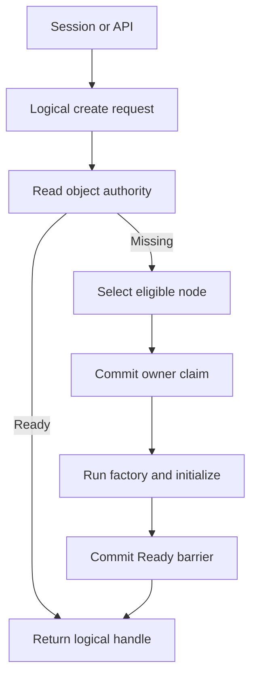
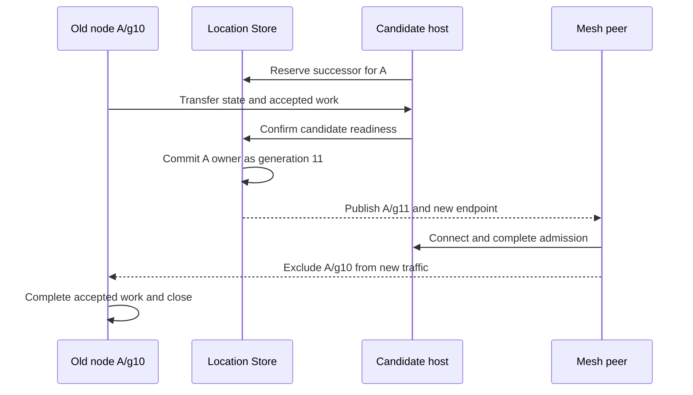

# Actor·Spot remote placement와 node identity 변경 제안

> **문서 상태:** RouteMesh 11.0 public contract 변경을 검토하기 위한 설계 입력이다.
> 이 문서는 현재 공개 계약, exact interface 또는 구현 기준이 아니다. 변경이 승인되고
> [execution ledger](route-mesh-11.0.0-execution-ledger.ko.md)의 contract amendment gate를 통과하기 전에는
> [Framework 정식 spec](../../framework/spec/README.ko.md)과
> [다섯 언어 exact interface](../../framework/spec/server/languages/README.ko.md)를 적용한다.

이 문서의 독자는 M5 이후 Framework public contract를 수정할 설계자와 언어별 runtime 담당자다. 이 문서는
“application이 `nid`를 업무 주소로 사용하지 않으면서 Actor·Spot을 생성하고 호출하려면 어떤 책임을
Framework가 맡아야 하는가?”에 답한다. 진행 상태, review finding과 완료 증거는 execution ledger만 소유한다.

## 1. 결정이 필요한 문제

현재 승인된 계약에서 Actor와 User Spot은 caller가 선택한 local MeshNode에서만 생성된다. 다른 process의
session이나 API가 Actor를 만들려면 Channel 또는 특정 node의 Entry Spot으로 업무 요청을 보내고, 수신
handler가 local manager를 호출해야 한다. 이 과정에서 application이 생성 위치를 선택하면 다음 정보가
업무 코드에 포함된다.

- 생성 요청을 받을 node의 `nid`
- 해당 node가 제공하는 Entry Spot과 handler
- node별 routing ID allocation 규칙
- 점검과 재시작 뒤 같은 역할을 제공하는 node를 다시 찾는 방법

`nid`는 endpoint 문자열을 직접 노출하지 않게 하지만 같은 MeshName 안의 exact node를 가리킨다. Actor와
Spot이 transfer되거나 다시 생성되면 owner node가 달라질 수 있으므로, `nid`를 object의 안정적인 주소로
사용할 수 없다. Node 점검을 위해 같은 `nid`를 다음 process가 인계하려 해도 application 생성 경로가
`nid`에 의존하면 object placement와 node lifecycle을 분리하기 어렵다.

검토 목표는 object의 논리 주소와 node의 실행 위치를 분리하는 것이다. Application은 Actor·Spot identity와
ChannelName을 사용하고, Framework가 placement, owner authority와 endpoint 선택을 처리한다.

## 2. 현재 승인 계약

이 절은 변경 전 대조 기준이다. 정식 의미는 링크한 Framework spec이 소유한다.

| 범위 | 현재 승인 계약 | 정식 소유 문서 |
|---|---|---|
| Node direct | 같은 MeshName의 exact RID 하나를 대상으로 한다 | [MeshNode](../../framework/spec/server/21-mesh-node.ko.md) |
| Channel | `ChannelName`의 ready Server member 하나를 Framework가 선택한다 | [Channel messaging](../../framework/spec/server/11-channel-messaging.ko.md) |
| Actor 생성 | Host-level manager가 호출받은 local MeshNode에서만 factory를 실행한다 | [Actor model](../../framework/spec/server/22-actor-model.ko.md) |
| User Spot 생성 | Manager가 호출받은 local MeshNode에서만 `Create`·`GetOrCreate`를 실행한다 | [Spot messaging](../../framework/spec/server/20-spot-messaging.ko.md) |
| Instance Spot 생성 | `InstanceSpotAddress`의 첫 direct call이 eligible node 선택과 cold activation을 시작할 수 있다 | [Spot address messaging](../../framework/spec/server/24-spot-address-messaging.ko.md) |
| Actor·Spot resolve | 이미 `Ready`인 owner만 찾으며 missing object를 만들지 않는다 | [Location runtime](../../framework/spec/server/40-location-runtime.ko.md) |
| RID allocation | Allocation group의 slot과 host owner lease token을 함께 관리한다 | [Redis Location Store](../../framework/spec/server/41-location-store-redis.ko.md) |
| User Spot maintenance | Actor membership이 남은 User Spot은 `Retire`를 차단한다 | [Host retirement](../../framework/spec/server/54-graceful-drain-handoff.ko.md) |

현재 contract test와 E2E도 이 의미를 검증한다. 특히 execution ledger의 `V11-E2E-M39`는 다섯 언어에서
Actor를 local MeshNode에만 생성하고 hidden remote create를 시작하지 않는지 확인한다. 이 제안이 승인되면
해당 scenario를 단순히 삭제하지 않고 새 생성·placement 계약이 같은 위험을 어떻게 검증하는지 다시
연결해야 한다.

## 3. 목표 불변 조건

다음 항목은 M5 이후 contract amendment가 보존해야 할 목표다. 정확한 type과 member 이름은 정식 spec과
언어별 exact interface에서 결정한다.

1. Application의 일반 업무 흐름은 `nid`, endpoint와 owner lease token을 입력으로 받지 않는다.
2. 여러 node가 제공하는 업무 요청은 `ChannelName`으로 시작한다.
3. Actor와 Spot은 MeshName 안의 논리 ID와 object generation으로 식별한다.
4. Framework는 eligible node 선택, owner claim, factory 실행과 `Ready` publication barrier를 하나의 생성
   lifecycle로 조정한다.
5. 생성 결과는 logical handle을 반환하며 target node RID를 application 선택 결과로 반환하지 않는다.
6. Actor·Spot message는 cached owner route를 사용할 수 있지만 target admission 직전에 current authority와
   generation을 검증한다.
7. Timeout, cancellation 또는 응답 손실 뒤 Framework는 원래 application payload를 다른 owner에게 숨겨서
   다시 제출하지 않는다.
8. `nid`는 한 MeshNode lifecycle 동안 변경하지 않는 opaque transport identity다.
9. 자동 할당 `nid`의 prefix는 진단용 역할 정보만 제공하고 uniqueness와 placement에 사용하지 않는다.
10. 같은 `nid`를 다른 process가 이어받아야 하면 일반 setter가 아니라 maintenance 전용 successor
    transaction을 사용한다.

이 불변 조건은 application에서 node 선택 책임을 제거하지만 물리 위치가 중요한 모든 요구를 없애지는
않는다. Hardware capability, region, local resource와 co-location은 `nid` 문자열 대신 별도 placement
requirement로 표현해야 한다.

## 4. 생성 모델 대안

### 4.1 비교 기준

대안은 다음 기준으로 비교한다.

- caller가 target node와 lifecycle을 알아야 하는가
- concurrent create가 owner 하나와 factory 실행 하나로 수렴하는가
- timeout 뒤 생성 여부를 logical ID로 확인할 수 있는가
- 일반 message와 생성 side effect의 retry 의미가 섞이는가
- Actor, User Spot과 Instance Spot의 서로 다른 lifecycle을 숨기지 않는가
- 네 언어가 같은 수준의 public contract를 제공할 수 있는가

### 4.2 대안 비교

| 대안 | 생성 흐름 | 장점 | 제약 |
|---|---|---|---|
| A. Channel을 통한 local create 유지 | Application이 Channel 또는 Entry Spot에 요청하고 handler가 local manager를 호출한다 | 현재 contract와 구현을 유지한다 | 업무 handler가 placement adapter 역할을 반복하며 node topology 의존을 제거하지 못한다 |
| B. 명시적인 remote create | Caller가 logical identity와 creation input을 전달하고 Framework가 target을 선택한다 | 생성 결과와 실패 경계가 분명하고 concurrent create를 authority CAS로 수렴시킬 수 있다 | 새 public contract, placement policy와 오류 결과가 필요하다 |
| C. 첫 message가 cold activation 시작 | Missing logical address의 send/request가 placement와 factory를 시작한다 | 별도 create call 없이 첫 사용 경로가 짧다 | 일반 payload와 생성 payload의 의미가 섞이고 timeout·side effect·retry 판정이 복잡해진다 |

우선 방향은 Actor와 User Spot에 B를 적용하고, actor-free Instance Spot에는 현재 C의 의미를 유지하는 것이다.
Actor와 User Spot은 생성 payload, membership과 application state를 가질 수 있으므로 생성과 일반 message를
분리하면 caller가 timeout 뒤 생성 여부를 logical identity로 다시 확인할 수 있다. Instance Spot은 첫 address
call이 service instance의 cold activation을 시작한다는 현재 목적이 분명하므로 별도 create surface를 중복하지
않는다.

정식 spec 작업은 B의 public result를 고정하기 전에 다음 경쟁을 정의해야 한다.

- 같은 logical ID와 같은 type을 동시에 생성하는 두 caller
- 같은 logical ID에 서로 다른 Actor type 또는 Spot kind를 지정하는 caller
- factory 실행 중 source가 종료되는 경우
- factory 성공 뒤 `Ready` CAS 결과를 받지 못한 경우
- create timeout 뒤 resolve가 `Creating`, `Ready`, failed cleanup 또는 missing을 확인하는 경우

## 5. Framework placement 책임

Application이 logical create를 시작하면 Framework는 물리 target을 반환하기 전에 다음 조건을 확인한다.

1. MeshName과 logical identity를 canonical key로 만든다.
2. Location Store에서 existing object와 진행 중인 creation authority를 exact read한다.
3. Missing이면 해당 type을 제공하는 complete descriptor를 찾는다.
4. `Serving` 상태이며 drain되지 않았고 application version, security identity, type capability와 bounded
   capacity를 만족하는 node만 후보로 사용한다.
5. Placement requirement가 있으면 후보 descriptor의 capability와 비교한다.
6. Exact owner lease와 node lifecycle generation을 확인한다.
7. Authority CAS로 owner와 ObjectGeneration을 한 번 확정한다.
8. Target factory, initialize와 initial membership을 실행한다.
9. 같은 owner fence의 `Ready` barrier가 끝난 뒤 logical handle을 반환한다.



Framework가 기본 placement를 처리하더라도 모든 node를 같은 후보로 취급할 수는 없다. 다음 정보는 target
선택에 필요할 수 있다.

| 요구 | `nid` 대신 사용할 정보 |
|---|---|
| GPU, local device 또는 특수 runtime | Type capability 또는 named placement capability |
| Region·zone 제한 | Deployment가 게시한 placement domain |
| 여러 object의 같은 process 배치 | Logical affinity 또는 co-location group |
| Tenant별 격리 | Placement constraint와 bounded capacity partition |
| Stateful type version 호환 | Application version과 readable state-contract set |
| 특정 session과 가까운 배치 | Session owner locality preference. correctness requirement와 preference를 구분한다 |

일반 caller가 placement algorithm, target RID, owner token과 retry option을 조립하지 않도록 Framework가 기본값을
제공해야 한다. 특수 요구를 표현하는 option이 필요하더라도 common create path에 필수 parameter로 추가하지
않는다.

## 6. Logical address와 메시징

Actor와 Spot message는 logical identity를 기준으로 route를 찾는다. 모든 message마다 Location Store를 직접
조회하면 Store latency와 장애가 전체 data path에 포함되므로, Framework는 handle이나 runtime cache에 current
owner route snapshot을 보관할 수 있다. Cache는 authority를 대신하지 않는다.

Target runtime은 mailbox admission 직전에 다음 값을 확인한다.

- logical key와 ObjectGeneration
- current AuthorityOwnerGeneration
- owner node RID와 lifecycle generation
- host OwnerId와 OwnerLeaseGeneration
- object와 host admission state

Owner가 transfer되면 resolver는 같은 ObjectGeneration과 새 authority owner route를 반환할 수 있다. Object를
destroy한 뒤 같은 logical key로 다시 만들면 새 ObjectGeneration을 발급하며 이전 handle은 새 object로 자동
전환하지 않는다. Request가 target에 수락된 뒤 connection failure나 timeout이 발생해도 다른 owner에게 hidden
retry하지 않는다.

Node direct는 이 logical object path를 대신하지 않는다. Maintenance, recovery, transfer, monitoring처럼 exact
node가 의미의 일부인 operation에서만 사용한다. 여러 node가 같은 업무를 제공하면 ChannelName이 target 선택을
담당한다.

## 7. `nid` 생성과 수명

### 7.1 자동 생성 방향

자동 생성 `nid`는 사람이 역할을 구분할 수 있는 prefix와 process lifecycle마다 새로 만드는 random suffix를
조합한다.

```text
play-7f3a91c6d2844d98
session-a12d6e80b6f74835
```

Prefix는 log와 topology snapshot에서 역할을 구분하는 진단 정보다. Prefix만으로 uniqueness, shard, ordering,
security principal과 placement를 결정하지 않는다. Random suffix는 CSPRNG로 만들고, 필요한 entropy와 encoded
길이는 정식 spec에서 고정한다. Collision은 다른 slot을 찾는 정상적인 allocation 경쟁으로 숨기지 않고
startup에서 새 identity 생성 또는 명시적인 conflict 결과로 처리한다.

한 process의 `OwnerId`와 MeshNode의 `nid`는 수명이 다르다. `OwnerId`는 host process lifecycle을 fence하고,
`nid`와 lifecycle generation은 Mesh 안의 node connection을 식별한다. Application은 어느 값도 업무 ID로
저장하지 않는다.

### 7.2 정식 spec에서 결정할 범위

- Fixed RID 설정을 manual topology와 test에 한정해 유지할지 제거할지
- 한 host의 여러 MeshNode가 prefix와 random source를 어떻게 공유할지
- Prefix의 문자, byte 길이와 normalization 규칙
- Random suffix의 entropy와 text encoding
- Store가 없는 manual topology에서 collision을 언제 검출할지
- Monitoring에서 prefix, full RID, OwnerId와 generation을 어떤 필드로 구분할지

## 8. Maintenance 전용 NID handover

NID handover는 실행 중인 MeshNode의 RID를 변경하는 일반 operation이 아니다. 새 process가 candidate로 준비된
뒤 기존 RID의 다음 lifecycle generation을 인계받는 successor transaction이다.



Successor commit 전에는 기존 generation만 current owner다. Candidate는 application admission을 열지 않는다.
Commit 뒤에는 새 generation만 신규 application request를 받을 수 있고 이전 generation은 accepted reply와
maintenance control을 deadline까지 처리한다.

Object continuity와 node identity continuity는 서로 다른 commit이다. Actor·Spot transfer가 성공한 뒤 NID
handover만 실패했을 때 object authority를 이전 owner로 되돌리면 안 된다. Contract amendment는 다음 중 어느
결과를 선택할지 결정해야 한다.

| 선택 | 의미 | 판단 |
|---|---|---|
| Handover를 `Retire`의 필수 commit으로 사용 | NID successor readiness가 없으면 object transfer 전에 preflight를 차단한다 | Exact-node continuity가 모든 배포에서 필수일 때 적합하다 |
| Object continuity 뒤 선택적 handover로 사용 | Channel·Actor·Spot service는 유지하고 handover 실패를 별도 maintenance 결과로 보고한다 | Application이 NID에 의존하지 않는 목표와 더 잘 맞는다 |

우선 방향은 후자다. NID handover는 exact-node operation과 peer topology를 이어 주는 maintenance 기능이며
application correctness의 전제가 아니다.

## 9. 시스템 제약

### 9.1 Location Store 의존

Remote create와 distributed owner authority는 Location Store를 필요로 한다. Store를 사용할 수 없을 때 hidden
in-memory provider를 만들지 않는다. Manual/no-Store topology에서 local create를 계속 허용할지, logical remote
create를 configuration error로 거부할지는 정식 spec에서 명시해야 한다.

Store 장애가 발생하면 existing connection을 일정 시간 유지할 수 있어도 새 owner claim, placement와 transfer를
계속할 수 없다. Owner lease의 local admission deadline이 끝나면 object message, timer, factory completion과
authority CAS를 seal해야 한다.

### 9.2 물리 위치가 의미를 갖는 system

다음 system은 unconstrained placement를 사용할 수 없다.

- state가 local filesystem이나 process memory에만 있는 service
- 특정 device, port, external session 또는 process-local library에 연결된 object
- 여러 Actor가 같은 memory를 공유해야 하는 구현
- node 이름을 shard key나 primary election key로 사용하는 구현
- firewall, ACL 또는 certificate principal을 RID 문자열에 연결한 배포

이 요구는 random RID를 안정적인 이름으로 되돌려 해결하지 않는다. Durable state adapter, placement
capability, affinity group, deployment identity와 security principal처럼 실제 제약을 표현하는 계약으로
분리해야 한다. Transfer할 수 없는 type은 `Disabled` policy로 maintenance를 차단할 수 있다.

### 9.3 운영과 debugging

Random RID는 `play1`, `play2`처럼 이름만 보고 역할과 순서를 추측하는 운영 방식을 지원하지 않는다. Runtime
snapshot과 log는 최소한 MeshName, full RID, diagnostic prefix, lifecycle generation, OwnerId, endpoint,
application version과 runtime state를 구분해 제공해야 한다. Operator는 prefix와 deployment label로 후보를
찾고 full identity와 generation으로 exact instance를 확인한다.

Test와 sample도 특정 RID 문자열을 조립하지 않는다. Topology snapshot에서 ready member를 확인하거나 public
Channel·Actor·Spot operation의 결과로 identity를 얻어야 한다.

### 9.4 성능과 availability

Framework placement는 create path에 descriptor 조회, lease 검증과 authority CAS를 추가한다. 일반 message
path는 cached route와 target-side fence를 사용해 Store round trip을 매번 요구하지 않아야 한다. Capacity와
candidate list는 bounded해야 하며 Store page와 descriptor 크기는 현재 정식 상한을 유지한다.

Logical create는 eligible node가 없거나 Store를 확인할 수 없을 때 실패한다. Framework가 caller 대신 무한히
대기하거나 다른 node에 application payload를 반복 제출하지 않는다. Timeout은 resolve, candidate selection,
owner claim과 activation barrier를 포함하는 하나의 deadline으로 정의해야 한다.

## 10. 합의한 방향과 남은 결정

### 10.1 Contract amendment의 기본 방향

| 항목 | 방향 |
|---|---|
| Application node 요청 | `ChannelName`을 사용한다 |
| Actor·Spot 주소 | Logical ID와 object generation을 사용한다 |
| Actor 생성 | Framework가 target을 선택하는 명시적인 remote create를 우선한다 |
| User Spot 생성 | Framework가 target을 선택하는 명시적인 remote create를 우선한다 |
| Instance Spot | `InstanceSpotAddress` 첫 direct call의 cold activation을 유지한다 |
| Node RID | MeshNode lifecycle 동안 immutable한 opaque identity로 사용한다 |
| 자동 RID | Diagnostic prefix와 random suffix를 조합한다 |
| NID handover | Maintenance 전용 successor-generation transaction으로 제공한다 |
| Node direct | Exact-node 의미가 필요한 infrastructure operation에 사용한다 |

### 10.2 정식 spec 작업 전 결정할 항목

1. Remote Actor create의 input, 결과와 concurrent create union
2. User Spot create의 input, 결과와 kind/type collision
3. User Spot과 member Actor의 maintenance 단위
4. Placement capability, affinity와 co-location의 최소 public 표현
5. Manual/no-Store topology의 local create와 remote create 경계
6. Existing local manager API의 유지, 축소 또는 제거
7. Fixed RID 설정의 manual/test 전용 유지 여부
8. Random suffix format과 collision 처리
9. NID successor reservation, commit, recovery와 failure result
10. NID handover와 host `Retire` terminal outcome의 관계

User Spot maintenance는 remote create와 별도로 반드시 결정해야 한다. Remote create만 추가하고 User Spot이
계속 `Retire` blocker로 남으면 생성 위치 의존은 줄지만 stateful rolling maintenance는 완성되지 않는다. Actor
membership이 있는 Spot을 하나의 aggregate로 이전할지, member Actor를 먼저 이동한 뒤 Spot을 닫을지, 별도
Snapshot policy를 제공할지 비교해야 한다.

## 11. 정식 계약과 구현 영향

| 범위 | 주요 영향 | M5 이후 소유 stage |
|---|---|---|
| 공통 Framework API | Remote create, logical result, placement requirement와 오류 계약 | Contract amendment |
| MeshNode·Channel | Node direct 제한, candidate capability와 random RID identity | Contract amendment, M6A |
| Actor·Spot | Remote create, publication barrier, resolve와 stale generation | Contract amendment, M6B |
| Location Store | Placement candidate, authority claim, allocation과 successor reservation | Protocol amendment, M6A·M6C |
| Maintenance | User Spot policy, object continuity와 NID handover 순서 | Contract amendment, M6C |
| 다섯 언어 exact interface | 같은 public operation과 closed result를 언어 관례로 표현 | Contract amendment |
| E2E | Local-only M39 대체 추적, concurrent create, placement, fencing, reconnect | M6 E2E catalog, M7 |
| Sample | Session/API의 RID 선택 제거, Channel과 logical create 사용 | M7 |
| Monitoring | Prefix, full RID, owner와 generation 구분 | Contract amendment, M6C |

정식 spec amendment는 최소한 다음 문서의 의미를 함께 검토한다.

- `framework/doc/framework/spec/05-framework-api.ko.md`
- `framework/doc/framework/spec/server/20-spot-messaging.ko.md`
- `framework/doc/framework/spec/server/21-mesh-node.ko.md`
- `framework/doc/framework/spec/server/22-actor-model.ko.md`
- `framework/doc/framework/spec/server/23-spot-actor.ko.md`
- `framework/doc/framework/spec/server/24-spot-address-messaging.ko.md`
- `framework/doc/framework/spec/server/31-session-actor-dispatch.ko.md`
- `framework/doc/framework/spec/server/40-location-runtime.ko.md`
- `framework/doc/framework/spec/server/41-location-store-redis.ko.md`
- `framework/doc/framework/spec/server/54-graceful-drain-handoff.ko.md`
- `framework/doc/framework/spec/server/languages/<lang>/interfaces/`

Protocol command나 field가 필요하면 `framework/runtime/protocol/`의 schema와 fixture를 같은 amendment에서
변경한다. 다른 언어의 기존 구현만 근거로 public member를 추가하지 않는다.

## 12. M5 이후 적용 순서

이 제안은 M5 구현 범위를 변경하지 않는다. M5가 현재 ledger gate를 통과한 뒤 M6를 시작하기 전에 다음
순서로 contract snapshot을 다시 고정한다.

1. Execution ledger에 contract amendment ID, 담당 범위, 선행 조건과 완료 gate를 추가한다.
2. 이 제안의 남은 결정을 두 가지 이상 대안과 함께 검토한다.
3. Framework 공통 정식 spec에서 목표 public behavior를 먼저 확정한다.
4. 다섯 언어 exact interface에서 같은 기능 수준의 signature와 result를 확정한다.
5. Protocol schema·fixture, public contract trace와 E2E catalog를 갱신한다.
6. 독립 reviewer가 public boundary, caller 부담, authority·fencing과 cross-language parity를 검토한다.
7. 영향받은 SPEC gate와 direct dependency를 새 contract snapshot에서 다시 검증한다.
8. M6A가 topology·RID allocation·placement 기반을 구현한다.
9. M6B가 remote Actor·Spot create와 logical route를 구현한다.
10. M6C가 maintenance ordering과 NID successor handover를 구현한다.
11. M7이 최종 contract를 기준으로 E2E, race, sample과 smoke를 검증한다.

정식 spec이나 exact interface를 수정하기 전에 runtime source를 변경하지 않는다. Contract amendment가 승인되지
않으면 현재 승인 계약과 execution ledger의 기존 M6·M7 gate를 그대로 적용한다.

## 13. 완료 판단 입력

Contract amendment는 다음 질문에 모두 답해야 한다.

- Session과 API가 `nid`를 알지 않고 Actor·Spot을 생성할 수 있는가?
- Concurrent create가 owner와 factory 실행 하나로 수렴하는가?
- Actor·Spot transfer 뒤 logical handle이 물리 owner 변경을 숨기는가?
- Destroy 뒤 recreate가 이전 generation의 handle과 message를 거부하는가?
- Application의 일반 node 요청이 ChannelName만으로 동작하는가?
- Random RID가 shard, security와 placement 의미로 사용되지 않는가?
- Store failure와 owner lease expiry에서 creation·message·transfer가 fail-closed하는가?
- User Spot과 member Actor의 maintenance 결과가 유한하게 결정되는가?
- NID handover 중 current generation이 하나만 존재하는가?
- Handover 실패가 완료된 object transfer를 되돌리지 않는가?
- 다섯 언어가 같은 public operation, 오류와 lifecycle을 제공하는가?
- E2E와 sample이 특정 RID naming rule을 사용하지 않는가?

이 질문의 답과 검증 scenario owner를 정식 spec, exact interface와 execution ledger에 연결한 뒤에만 M6 구현
입력으로 사용할 수 있다.
