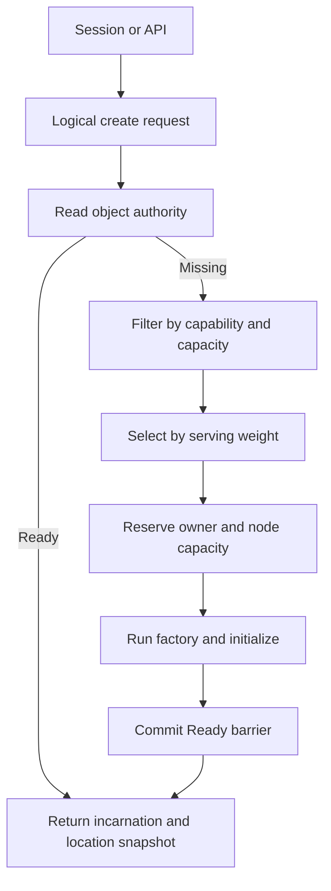
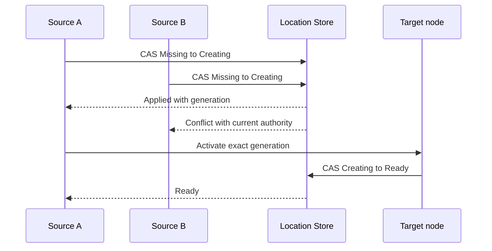

# Actor·Spot remote placement와 node identity 변경 제안

> **문서 상태:** RouteMesh 11.0 public contract 변경을 검토하기 위한 설계 입력이다.
> 이 문서는 현재 공개 계약, exact interface 또는 구현 기준이 아니다. 변경이 승인되고
> [execution ledger](route-mesh-11.0.0-execution-ledger.ko.md)의 contract amendment gate를 통과하기 전에는
> [Framework 정식 spec](../../framework/spec/README.ko.md)과
> [다섯 언어 exact interface](../../framework/spec/server/languages/README.ko.md)를 적용한다.

이 문서의 독자는 M5 이후 Framework public contract를 수정할 설계자와 언어별 runtime 담당자다. 이 문서는
“application이 `nid`를 업무 주소로 사용하지 않으면서 Actor·Spot을 생성하고 호출하려면 어떤 책임을
Framework가 맡아야 하는가?”에 답한다. 진행 상태, review finding과 완료 증거는 execution ledger만 소유한다.
이 문서의 `nid`는 현재 정식 spec이 `Routing ID` 또는 `RID`로 부르는 MeshNode identity를 뜻한다. 정식
contract amendment에서는 공개 용어를 하나로 통일해야 한다.

## 1. 결정이 필요한 문제

현재 승인된 계약에서 Actor와 User Spot은 caller가 선택한 local MeshNode에서만 생성된다. 다른 process의
session이나 API가 Actor를 만들려면 Channel 또는 특정 node의 Entry Spot으로 업무 요청을 보내고, 수신
handler가 local manager를 호출해야 한다. 이 과정에서 application이 생성 위치를 선택하면 다음 정보가
업무 코드에 포함된다.

- 생성 요청을 받을 node의 `nid`
- 해당 node가 제공하는 Entry Spot과 handler
- node별 routing ID allocation 규칙
- 점검과 재시작 뒤 같은 역할을 제공하는 node를 다시 찾는 방법

`nid`는 endpoint 문자열을 직접 노출하지 않게 하지만 같은 MeshName 안의 exact node를 가리킨다. Actor와
Spot이 transfer되거나 다시 생성되면 owner node가 달라질 수 있으므로, `nid`를 object의 안정적인 주소로
사용할 수 없다. Node 점검을 위해 같은 `nid`를 다음 process가 인계하려 해도 application 생성 경로가
`nid`에 의존하면 object placement와 node lifecycle을 분리하기 어렵다.

검토 목표는 object의 논리 주소와 node의 실행 위치를 분리하는 것이다. Application은 Actor·Spot identity와
ChannelName을 사용하고, Framework가 placement, owner authority와 endpoint 선택을 처리한다.

## 2. 현재 승인 계약

이 절은 변경 전 대조 기준이다. 정식 의미는 링크한 Framework spec이 소유한다.

| 범위 | 현재 승인 계약 | 정식 소유 문서 |
|---|---|---|
| Node direct | 같은 MeshName의 exact RID 하나를 대상으로 한다 | [MeshNode](../../framework/spec/server/21-mesh-node.ko.md) |
| Channel | `ChannelName`의 ready Server member 하나를 Framework가 선택한다 | [Channel messaging](../../framework/spec/server/11-channel-messaging.ko.md) |
| Actor 생성 | Host-level manager가 호출받은 local MeshNode에서만 factory를 실행한다 | [Actor model](../../framework/spec/server/22-actor-model.ko.md) |
| User Spot 생성 | Manager가 호출받은 local MeshNode에서만 `Create`·`GetOrCreate`를 실행한다 | [Spot messaging](../../framework/spec/server/20-spot-messaging.ko.md) |
| Instance Spot 생성 | `InstanceSpotAddress`의 첫 direct call이 eligible node 선택과 cold activation을 시작할 수 있다 | [Spot address messaging](../../framework/spec/server/24-spot-address-messaging.ko.md) |
| Actor·Spot resolve | 이미 `Ready`인 owner만 찾으며 missing object를 만들지 않는다 | [Location runtime](../../framework/spec/server/40-location-runtime.ko.md) |
| RID allocation | Allocation group의 slot과 host owner lease token을 함께 관리한다 | [Redis Location Store](../../framework/spec/server/41-location-store-redis.ko.md) |
| User Spot maintenance | Actor membership이 남은 User Spot은 `Retire`를 차단한다 | [Host retirement](../../framework/spec/server/54-graceful-drain-handoff.ko.md) |

현재 contract test와 E2E도 이 의미를 검증한다. 특히 execution ledger의 `V11-E2E-M39`는 다섯 언어에서
Actor를 local MeshNode에만 생성하고 hidden remote create를 시작하지 않는지 확인한다. 이 제안이 승인되면
해당 scenario를 단순히 삭제하지 않고 새 생성·placement 계약이 같은 위험을 어떻게 검증하는지 다시
연결해야 한다.

## 3. 목표 불변 조건

다음 항목은 M5 이후 contract amendment가 보존해야 할 목표다. 정확한 type과 member 이름은 정식 spec과
언어별 exact interface에서 결정한다.

1. Application의 일반 업무 흐름은 `nid`, endpoint와 owner lease token을 입력으로 받지 않는다.
2. 여러 node가 제공하는 업무 요청은 `ChannelName`으로 시작한다.
3. ActorId와 User Spot RID는 같은 Location Store namespace의 모든 MeshNode에서 전역으로 유일하다. MeshName은
   identity key가 아니라 create placement와 physical routing domain을 선택하는 attribute다.
4. MeshNode는 object operation을 시작하지 않는 상태, client-only 상태 또는 Actor·Spot을 host하는 server
   상태 가운데 하나를 startup 전에 확정한다.
5. Client-only MeshNode는 create와 message를 시작할 수 있지만 local Actor·Spot factory, Entry Spot과 placement
   capability를 게시하지 않는다.
6. Server MeshNode는 등록한 type의 placement target이 되며 같은 public client operation도 시작할 수 있다.
7. Framework는 eligible node를 선택한 뒤 Location Store의 `Missing → Creating` authority CAS로 owner를 먼저
   확정하고, 그 다음 factory 실행과 `Ready` publication barrier를 하나의 생성 lifecycle로 조정한다.
8. 생성과 lookup 결과는 `(ID, ObjectGeneration, MeshName, NodeRid)` location snapshot을 반환하되 local object
   instance는 노출하지 않는다. Messaging address는 snapshot이 아니라 ID만 사용한다.
9. Object Client 또는 Server role의 Mesh가 하나이면 create caller는 MeshName을 생략할 수 있다. 후보 Mesh가
   여러 개이면 Framework는 임의로 선택하지 않고 caller에게 명시적인 Mesh 선택을 요구한다.
10. User Spot을 maintenance로 이전할 때는 Spot과 현재 member Actor 전체를 하나의 transfer aggregate로 처리한다.
    성공하면 전체 owner와 membership을 한 번에 전환하고, commit 전에 하나라도 실패하면 전체 source 상태를
    유지한다.
11. Actor·Spot message는 cached owner route를 사용할 수 있지만 target admission 직전에 current authority와
   generation을 검증한다.
12. Timeout, cancellation 또는 응답 손실 뒤 Framework는 원래 application payload를 다른 owner에게 숨겨서
   다시 제출하지 않는다.
13. `nid`는 한 MeshNode lifecycle 동안 변경하지 않는 opaque transport identity다.
14. 자동 할당 `nid`의 prefix는 진단용 역할 정보만 제공하고 uniqueness와 placement에 사용하지 않는다.

이 불변 조건은 application에서 node 선택 책임을 제거하지만 물리 위치가 중요한 모든 요구를 없애지는
않는다. Hardware capability, region, local resource와 co-location은 `nid` 문자열 대신 별도 placement
requirement로 표현해야 한다.

## 4. 생성 모델 대안

### 4.1 비교 기준

대안은 다음 기준으로 비교한다.

- caller가 target node와 lifecycle을 알아야 하는가
- concurrent create가 owner 하나와 factory 실행 하나로 수렴하는가
- timeout 뒤 생성 여부를 logical ID로 확인할 수 있는가
- 일반 message와 생성 side effect의 retry 의미가 섞이는가
- Actor, User Spot과 Instance Spot의 서로 다른 lifecycle을 숨기지 않는가
- 다섯 언어가 같은 수준의 public contract를 제공할 수 있는가

### 4.2 대안 비교

| 대안 | 생성 흐름 | 장점 | 제약 |
|---|---|---|---|
| A. Channel을 통한 local create 유지 | Application이 Channel 또는 Entry Spot에 요청하고 handler가 local manager를 호출한다 | 현재 contract와 구현을 유지한다 | 업무 handler가 placement adapter 역할을 반복하며 node topology 의존을 제거하지 못한다 |
| B. 명시적인 remote create | Caller가 logical identity와 creation input을 전달하고 Framework가 target을 선택한다 | 생성 결과와 실패 경계가 분명하고 concurrent create를 authority CAS로 수렴시킬 수 있다 | 새 public contract, placement policy와 오류 결과가 필요하다 |
| C. 첫 message가 cold activation 시작 | Missing logical address의 send/request가 placement와 factory를 시작한다 | 별도 create call 없이 첫 사용 경로가 짧다 | 일반 payload와 생성 payload의 의미가 섞이고 timeout·side effect·retry 판정이 복잡해진다 |

우선 방향은 Actor, User Spot과 Instance Spot에 B를 적용한다. Actor와 User Spot은 생성
payload, membership과 application state를 가질 수 있으므로 생성과 일반 message를 분리한다. Instance
Spot도 Missing RID의 첫 message로 type과 Mesh를 알 수 없으므로 initial creation intent를 먼저 명시한다.
Framework가 `(SpotRid, InstanceSpotType, initial MeshName)` authority를 확정한 뒤에는 application이 SpotRid만으로
message를 보낸다. Ready owner가 없는 기존 Instance Spot의 reactivation은 authority에 고정된 type과 Mesh를
사용하므로 message call에 `InstanceSpotAddress`를 다시 요구하지 않는다.

MeshName과 creation payload는 logical create의 선택 항목이다. Host에 object Client 또는 Server role의 Mesh가
하나만 구성되어 있으면 Framework가 그 Mesh를 사용한다. 후보 Mesh가 둘 이상이면 create가 target node를 고르는
문제와 Mesh routing domain을 고르는 문제를 섞지 않도록 caller가 MeshName을 명시해야 한다. Creation payload를
생략하면 empty request로 처리한다. 언어별 interface는 이 선택 항목을 overload 조합으로 늘리지 않고 fluent
create call 또는 각 언어에 대응하는 option builder로 표현한다.

정식 spec 작업은 B의 public result를 고정하기 전에 다음 경쟁을 정의해야 한다.

- 같은 logical ID와 같은 type을 동시에 생성하는 두 caller
- 같은 logical ID에 서로 다른 Actor type 또는 Spot kind를 지정하는 caller
- factory 실행 중 source가 종료되는 경우
- factory 성공 뒤 `Ready` CAS 결과를 받지 못한 경우
- create timeout 뒤 resolve가 `Creating`, `Ready`, failed cleanup 또는 missing을 확인하는 경우

## 5. Framework placement 책임

Application이 logical create를 시작하면 Framework는 물리 target을 반환하기 전에 다음 조건을 확인한다.

1. ActorId 또는 User Spot RID를 global canonical key로 만들고 create에서 선택한 MeshName은 placement attribute로
   authority에 기록한다.
2. Location Store에서 existing object와 진행 중인 creation authority를 exact read한다.
3. Missing이면 해당 type을 제공하는 complete descriptor를 찾는다.
4. Object server role이 활성화되어 있고 `Serving` 상태이며 drain되지 않았고 application version, security
   identity, type capability와 placement requirement를 만족하는 node만 후보로 사용한다.
5. Node 전체와 object type별 active·pending capacity 제한을 먼저 적용하여 새 object를 받을 수 없는
   node를 후보에서 제외한다.
6. Capacity를 만족하는 후보 사이에서 Router의 신규 부하 배정에 사용하는 운영 weight 비율로
   target을 선택한다.
7. Exact owner lease와 node lifecycle generation을 확인한다.
8. Location Store transaction으로 ID의 creation authority와 target node의 pending capacity를 함께
   reservation한다.
9. Target factory, initialize와 initial membership을 실행한다.
10. 같은 owner fence의 `Ready` barrier가 끝나면 pending capacity를 active capacity로 전환하고 ID,
    ObjectGeneration과 current MeshName·NodeRid snapshot을 반환한다.



Capacity는 후보 자격을 결정하고 weight는 자격을 만족한 후보 사이의 분배 비율만 결정한다.
Framework는 placement만을 위한 별도의 public weight를 추가하지 않고, Router가 새 target을 선택할 때
사용하는 같은 운영 weight를 Actor·Spot 신규 생성과 maintenance transfer target 선택에도 적용한다.
Weight 0인 node는 새 placement와 transfer target에서 제외하지만 이미 해당 node에 배치된
Actor·Spot의 message 처리와 node direct operation은 계속 허용한다.

`GetOrCreate`가 `Ready` object를 찾은 경우에는 현재 owner의 capacity와 weight를 다시 적용하지 않고
기존 reference를 반환한다. Missing object의 target을 선택한 뒤 동시 생성 경쟁으로 node capacity
reservation이 실패하면, Framework는 object factory를 실행하기 전에 후보를 다시 계산하여 다른
node를 선택할 수 있다. Capacity를 만족하는 positive-weight node가 없으면 capacity 부족을 알리는
terminal placement error로 종료한다. ID authority와 pending capacity를 함께 reservation하므로 동시 요청이
같은 ID를 두 node에 생성하거나 node capacity를 초과하지 않는다.

현재 single-key authority CAS만으로는 object authority와 node capacity를 함께 변경할 수 없다. Location
Store provider contract은 object lifecycle을 해석하지 않는 generic placement reservation capability를 추가한다.
Reserve는 `Missing → Creating`과 pending capacity 차감, commit은 `Creating → Ready`와 pending-to-active
전환, abort는 exact Creating authority와 pending capacity 해제를 각각 하나의 transaction으로 처리한다.
Actor·Spot 전용 Store method를 두지 않고 object kind·stable type·target descriptor key·reservation fence를
공통 request에 담는다.

현재 public `SetWeight` 계약은 Channel Server별 값이므로 object placement에 사용할 하나의 Router
weight를 표현하지 못한다. Contract amendment는 MeshNode ROUTER의 신규 부하 배정 weight를
startup과 runtime에서 설정하는 node-wide public surface를 추가한다. Object-serving descriptor는 이 값을
게시하고 Actor·Spot 생성과 transfer target 선택이 같은 값을 사용한다. Channel weight는 해당
Channel의 select-one에만 사용하며 Framework는 여러 Channel weight의 평균·최대값을 placement weight로
해석하지 않는다.

Framework가 기본 placement를 처리하더라도 모든 node를 같은 후보로 취급할 수는 없다. 다음 정보는 target
선택에 필요할 수 있다.

| 요구 | `nid` 대신 사용할 정보 |
|---|---|
| GPU, local device 또는 특수 runtime | Type capability 또는 named placement capability |
| Region·zone 제한 | Deployment가 게시한 placement domain |
| 여러 object의 같은 process 배치 | Logical affinity 또는 co-location group |
| Tenant별 격리 | Placement constraint와 bounded capacity partition |
| Stateful type version 호환 | Application version과 readable state-contract set |
| 특정 session과 가까운 배치 | Session owner locality preference. correctness requirement와 preference를 구분한다 |

일반 caller가 placement algorithm, target RID, owner token과 retry option을 조립하지 않도록 Framework가 기본값을
제공해야 한다. 특수 요구를 표현하는 option이 필요하더라도 common create path에 필수 parameter로 추가하지
않는다.

### 5.1 MeshNode object role

Remote create source와 placement target은 같은 MeshNode가 될 수 있지만 책임은 구분해야 한다. Object client
role은 logical create·lookup·message를 시작하는 capability다. Object server role은 local Entry Spot, factory,
capacity와 type capability를 게시하고 placement target이 되는 capability다.

| MeshNode 설정 | Object operation 시작 | Local factory·Entry Spot | Placement target |
|---|---|---|---|
| Object role 없음 | 불가 | 없음 | 제외 |
| Client | 가능 | 없음 | 제외 |
| Server | 가능 | 있음 | 등록한 type에 한해 포함 |

Server role은 client capability를 포함한다. Actor·Spot handler가 다른 logical object를 호출할 수 있으므로
client와 server를 동시에 별도 등록하게 만들지 않는다. Role은 MeshNode마다 한 번만 선택하고 factory 등록은
server builder에서만 허용한다.

Session과 gameplay를 한 process에서 함께 처리하는 구성은 Server role을 사용한다. Session process와 Play
process가 분리된 구성에서는 Session MeshNode가 Client role을 사용하고 Play MeshNode가 Server role을 사용한다.
이때 Session process는 remote create와 message를 시작할 수 있지만 descriptor에 Actor·Spot type capability를
게시하지 않으므로 local placement 대상이 되지 않는다.

### 5.2 중복 생성을 막는 commit point

Actor와 Spot의 중복 생성을 막는 시점은 target factory 실행 전이어야 한다. 두 source node가 같은 logical
identity를 동시에 생성하려 해도 Location Store의 canonical authority key 하나에서 `Missing → Creating` CAS를
경쟁한다. 성공한 caller 하나만 target activation을 시작한다.

`Creating` authority에는 최소한 다음 의미가 필요하다. 정확한 field와 encoding은 protocol amendment에서
고정한다.

- Actor이면 global `ActorId`, Spot이면 global `SpotRid`인 canonical key와 selected MeshName attribute
- Actor type 또는 Spot kind와 type
- Store가 발급한 ObjectGeneration과 AuthorityOwnerGeneration
- 선택한 target의 OwnerId·OwnerLeaseGeneration과 node RID·lifecycle generation
- 생성 attempt를 fence하고 recovery와 cleanup을 판단할 수 있는 상태



CAS loser는 다른 node에 새 create를 제출하지 않는다. Current authority를 exact read한 뒤 상태에 따라 다음
결과로 수렴한다.

| Current authority | CAS loser 처리 |
|---|---|
| 같은 type의 `Ready` object | Existing 결과와 current incarnation·location snapshot을 반환한다 |
| 같은 type의 `Creating` object | 같은 creation completion을 기다리거나 in-progress 결과를 반환한다. 별도 factory를 실행하지 않는다 |
| 다른 Actor type, Spot kind 또는 Spot type | Type·kind conflict를 반환한다 |
| Failed cleanup 중인 object | Fenced delete와 Missing 확인 전까지 같은 failure를 반환한다 |
| Owner lease가 stale인 `Creating` object | Recovery coordinator가 exact StoreVersion으로 takeover 또는 abort를 결정한다. Caller가 임의로 새 owner를 만들지 않는다 |

Store CAS만으로 application factory callback의 임의 external side effect까지 exactly-once로 만들 수는 없다.
Target은 `(canonical key, ObjectGeneration, AuthorityOwnerGeneration, owner token)`으로 local activation registry를
구성해 같은 attempt의 중복 전달을 하나로 합쳐야 한다. Process가 factory 실행 중 종료되면 recovery가 callback을
다시 실행할 수 있으므로 factory와 initialize callback은 retry-safe해야 한다. 외부 DB나 service의 side effect에
exactly-once가 필요하면 application이 같은 logical generation을 idempotency key로 사용할 수 있는 계약을 별도로
검토해야 한다.

Framework가 보장할 기본 범위는 다음과 같다.

- 같은 canonical key와 ObjectGeneration에서 current owner와 `Ready` object는 하나다.
- CAS loser와 중복 activation record는 별도 object incarnation을 만들지 않는다.
- Factory 실패는 exact StoreVersion, generation과 owner token으로 authority를 fenced delete한다.
- Delete가 확인된 뒤 시작한 다음 create만 새 ObjectGeneration을 발급받는다.
- 이전 generation의 factory completion, timer, message와 `Ready` CAS는 새 incarnation에 적용되지 않는다.

Creation payload의 durability는 정식 spec에서 별도로 결정해야 한다. Payload를 authority나 durable checkpoint에
기록하지 않으면 source가 owner claim 뒤 target submit 전에 종료된 경우 runtime이 원래 payload를 복원할 수
없다. 이 경우 creation을 실패 상태로 정리하고 caller의 명시적인 재시도를 요구해야 한다. Payload를 durable
creation intent에 포함한다면 size bound, codec, retention, 보안과 replay-safe factory 계약을 함께 정의해야 한다.

## 6. Logical address와 메시징

Actor와 Spot message는 각각 global ActorId와 SpotRid만 입력으로 받아 route를 찾는다. MeshName, owner RID와
ObjectGeneration은 caller가 messaging target으로 전달하지 않는다. 모든 message마다 Location Store를 직접
조회하면 Store latency와 장애가 전체 data path에 포함되므로, Framework는 handle이나 runtime cache에 current
owner route snapshot을 보관할 수 있다. Cache는 authority를 대신하지 않는다.

Create와 lookup이 반환하는 ActorRef·SpotRef는 current Ready authority의 location snapshot이다. NodeRid는 Mesh 안에서
유일하므로 snapshot은 MeshName과 NodeRid를 함께 포함한다. Transfer 뒤 ID와 ObjectGeneration은 유지되지만 위치
field는 stale할 수 있다. Application이 현재 위치를 관측해야 하면 global ID로 다시 lookup하며 snapshot의 NodeRid를
일반 messaging이나 placement 입력으로 사용하지 않는다. Session binding은 create·lookup 직후의 fast path를 위해
ActorRef 위치로 먼저 전송하되 stale location은 old node의 forwarding mapping으로 처리한다.

Target runtime은 mailbox admission 직전에 다음 값을 확인한다.

- logical key와 ObjectGeneration
- current AuthorityOwnerGeneration
- owner node RID와 lifecycle generation
- host OwnerId와 OwnerLeaseGeneration
- object와 host admission state

Send·request는 ID를 resolve하거나 cache에서 current ObjectGeneration과 route를 선택한 뒤 그 generation을 wire
admission에 고정한다. Resolve 뒤 object를 destroy하고 같은 ID로 다시 만들더라도 진행 중인 old-generation
operation을 새 object로 retarget하지 않는다. Owner가 transfer되면 같은 ObjectGeneration과 새 authority owner
route를 사용할 수 있다. Request가 target에 수락된 뒤 connection failure나 timeout이 발생해도 다른 owner에게
hidden retry하지 않는다.

Node direct는 이 logical object path를 대신하지 않는다. Maintenance, recovery, transfer, monitoring처럼 exact
node가 의미의 일부인 operation에서만 사용한다. 여러 node가 같은 업무를 제공하면 ChannelName이 target 선택을
담당한다.

### 6.1 Session binding

Session binding은 create 또는 lookup이 반환한 ActorRef를 입력으로 받는다. Messaging은 global ActorId로 current
incarnation을 선택하지만 binding은 장기간 유지되는 관계이므로 `ActorId + ObjectGeneration`으로 exact incarnation을
고정한다. Framework는 ActorRef의 MeshName·NodeRid로 bind control request를 먼저 보내며 source에서 Location Store를
선조회하지 않는다.

Target에 exact Actor가 있으면 current authority와 owner lease를 검증해 binding을 commit한다. Actor가 transfer된 뒤라
local에 없고 active forwarding mapping이 있으면 original bind control request와 reply route를 mapping target으로
relay한다. Mapping이 없거나 만료됐으면 `ActorLocationStale`, 같은 ID의 generation이 달라졌으면
`ActorGenerationStale`, transfer pre-commit seal 중이면 `ActorMoving`으로 끝낸다. Source는 Store에서 새 route를 찾아
같은 bind를 hidden retry하지 않는다.

Binding commit 뒤 Actor가 다시 transfer되면 Framework가 session connection은 유지한 채 binding route와 owner fence를
갱신한다. 따라서 application이 transfer 뒤 다시 bind하거나 STREAM node에 Actor의 MeshName을 미리 고정하지 않는다.

Bind-or-get의 `Get`은 Actor를 생성하거나 directory에서 가져온다는 뜻이 아니다. 같은 session에 exact
`ActorId + ObjectGeneration` binding이 있으면 반환하고 없으면 bind를 시도한다. 같은 ID라도 다른 generation의
binding을 반환하지 않는다.

### 6.2 Route cache와 stale-route forwarding

Actor ID와 Spot ID를 사용할 때마다 Location Store를 읽으면 Store latency와 availability가 모든 message path에
포함된다. 각 runtime은 object kind와 global logical ID를 key로 current route snapshot을 cache한다.
Snapshot에는 최소한 owner node RID·lifecycle generation, AuthorityOwnerGeneration, StoreVersion, owner lease와
current ObjectGeneration, selected MeshName과 cache deadline이 포함되어야 한다. Cache hit도 owner lease deadline과 current connection을 확인하며 cache만으로
authority를 새로 만들거나 generation을 바꾸지 않는다.

Transfer commit 뒤 source node는 이전 route로 도착한 Actor·Spot message를 current owner로 전달하는 forwarding
entry를 bounded window 동안 유지한다. User Spot aggregate transfer는 Spot과 모든 member Actor의 forwarding entry를
같은 commit에서 설치한다. Forwarding은 old owner의 application handler에 message를 수락한 뒤 재시도하는 동작이
아니라 target admission 전에 stale physical route를 교정하는 동작이다. Original operation identity와
ObjectGeneration을 유지하며 handler 실행을 두 번 허용하지 않는다.

기본 시간 후보는 다음과 같다.

| 항목 | 기본값 후보 | 의미 |
|---|---:|---|
| Object forwarding window | 30초 | Transfer commit 뒤 source가 stale route를 current owner로 전달하는 최대 기간 |
| Positive route cache max age | 15초 | Authoritative read 또는 location event로 얻은 route를 refresh 없이 사용할 수 있는 최대 기간 |

`cache max age < forwarding window`를 configuration invariant로 검증한다. 30초와 15초 조합은 cache가 transfer
직전에 채워진 최악의 경우에도 cache가 만료된 뒤 source forwarding entry가 남도록 절반의 여유를 둔다. 실제
안전 조건은 cache max age에 최대 queue·network delay와 clock scheduling margin을 더한 값이 forwarding window보다
작아야 한다. Location watch나 higher StoreVersion event를 받으면 TTL을 기다리지 않고 cache를 invalidate한다.

Cache 만료와 stale result는 sender가 실패한 application operation을 Location Store에서 찾은 새 owner에게 다시
제출하는 근거가 아니다. 다음 call이 authority를 refresh한다. Message를 받은 node에 exact Actor·Spot instance가
없고 같은 ObjectGeneration과 source owner fence의 active forwarding entry가 있으면 entry에 기록된 target으로
그대로 relay한다. Relay node는 application handler를 실행하지 않고 original operation identity, payload와 reply
route를 보존한다.

Object가 다시 transfer되면 각 source node는 자기 transfer에서 만든 mapping만 적용한다. 따라서 A에서 B로, 다시
B에서 C로 이동한 경우 A에 도착한 stale message는 `A → B → C` 순서로 relay될 수 있다. Relay 과정에서 current
authority를 다시 조회하거나 최신 owner를 계산하지 않는다. 각 mapping은 committed transfer에서만 만들고 source
AuthorityOwnerGeneration보다 높은 target generation을 가리켜야 한다. Mapping이 없거나 만료됐거나 generation이
일치하지 않으면 stale result로 끝낸다.

Negative lookup은 positive route와 같은 15초 동안 cache하지 않는다. Missing·Creating과 Store failure를 길게
cache하면 새 create와 recovery 가시성이 지연되므로 별도의 짧고 bounded한 negative policy를 사용하거나 cache하지
않는다. Forwarding entry와 route cache entry 수는 object capacity와 transfer inventory bound 안에 있어야 한다.

### 6.3 Join과 Actor relocation

`JoinSpot`의 공개 의미는 membership 변경이다. Target User Spot의 owner node가 Actor owner와 다르더라도
application이 별도 transfer operation을 조합하지 않는다. Framework가 target Spot authority를 resolve하고 필요한
Actor relocation을 join lifecycle 안에서 수행한다. `JoinEntrySpot`도 Framework가 relocation target과 해당
node의 Entry Spot을 함께 선택하며 node RID를 입력으로 받지 않는다.

Join request는 선택 항목이다. 생략하면 empty request를 target Spot의 proposal callback에 전달한다. Request는
join 승인 판단에만 사용하고 Actor state transfer payload로 재사용하지 않는다. 언어별 fluent call은 기존 option
naming에 맞춰 `Request(...)`처럼 option 이름을 직접 사용하며 불필요한 `With` 접두어를 추가하지 않는다.

Cross-node join은 Actor factory registration에 연결된 state policy를 자동으로 적용한다. `Disabled`는 capture 전
join을 거부하고, `Recreate`는 state 복구 없이 target factory를 실행하며, `Snapshot`은 등록된 typed adapter로
state를 capture·restore한다. Same-node join은 relocation이 없으므로 `Disabled` policy여도 수행할 수 있다.

Target proposal 거부, timeout, callback failure와 commit 전 CAS conflict는 Actor owner, state와 기존 membership을
유지한다. 성공 commit은 Actor owner와 current Spot을 같은 authority transition으로 변경하며 ObjectGeneration은
유지한다. Maintenance의 host `Retire`가 시작하는 transfer phase를 application에 공개하거나 join caller가 target,
adapter와 transfer state를 전달하게 만들지 않는다.

## 7. `nid` 생성과 수명

### 7.1 자동 생성 방향

자동 생성 `nid`는 사람이 역할을 구분할 수 있는 prefix와 process lifecycle마다 새로 만드는 random suffix를
조합한다.

```text
play-7f3a91c6d2844d98
session-a12d6e80b6f74835
```

Prefix는 log와 topology snapshot에서 역할을 구분하는 진단 정보다. Prefix만으로 uniqueness, shard, ordering,
security principal과 placement를 결정하지 않는다. Random suffix는 CSPRNG로 만들고, 필요한 entropy와 encoded
길이는 정식 spec에서 고정한다. Collision은 다른 slot을 찾는 정상적인 allocation 경쟁으로 숨기지 않고
startup에서 새 identity 생성 또는 명시적인 conflict 결과로 처리한다.

한 process의 `OwnerId`와 MeshNode의 `nid`는 수명이 다르다. `OwnerId`는 host process lifecycle을 fence하고,
`nid`와 lifecycle generation은 Mesh 안의 node connection을 식별한다. Application은 어느 값도 업무 ID로
저장하지 않는다.

### 7.2 정식 spec에서 결정할 범위

- Fixed RID 설정을 manual topology와 test에 한정해 유지할지 제거할지
- 한 host의 여러 MeshNode가 prefix와 random source를 어떻게 공유할지
- Prefix의 문자, byte 길이와 normalization 규칙
- Random suffix의 entropy와 text encoding
- Store가 없는 manual topology에서 collision을 언제 검출할지
- Monitoring에서 prefix, full RID, OwnerId와 generation을 어떤 필드로 구분할지

## 8. User Spot maintenance transfer aggregate

User Spot과 현재 member Actor는 maintenance에서 분리해 이전하지 않는다. Framework는 User Spot 하나와 seal 시점의
exact member inventory를 하나의 transfer aggregate로 고정한다. Spot과 Actor마다 등록한 transfer policy는 다를 수
있지만, User Spot 또는 member Actor 하나라도 이전할 수 없으면 target 준비와 source capture 전에 전체 operation을
`Blocked/TransferDisabled`로 끝낸다.

Transfer aggregate는 다음 순서를 지킨다.

1. Source User Spot의 join·leave와 member Actor admission을 reversible하게 seal하고 이미 수락한 turn을 정리한다.
2. User Spot과 member Actor의 exact identity, ObjectGeneration, owner fence와 policy를 inventory에 고정한다.
3. 모든 participant의 target capability, capacity, adapter와 state contract compatibility를 preflight한다.
4. 각 participant의 state와 accepted work를 capture하고 target restore를 admission이 닫힌 staging 상태로 준비한다.
5. 하나의 aggregate commit barrier가 User Spot owner, 모든 member Actor owner와 membership을 함께 전환한다.
6. Target에서 Spot과 모든 member Actor가 Ready가 된 뒤에만 aggregate success를 반환하고 admission을 연다.

외부에서 관측 가능한 terminal 결과는 partial success를 허용하지 않는다. Aggregate commit 전 하나라도 실패하면
target staging을 폐기하고 source seal을 해제해 Spot, Actor와 membership 전체를 유지한다. Commit이 확인된 뒤에는
일부 participant만 source로 되돌리지 않는다. Target process failure나 응답 손실이 발생하면 같은 aggregate
identity와 checkpoint로 전체 target 복구를 계속하고 Store를 exact read해 commit 여부를 reconcile한다.

Location Store가 여러 object authority를 하나의 transaction으로 바꿀 수 없다면 Framework는 single aggregate
record와 commit generation을 authority가 참조하게 해야 한다. Resolver와 target admission은 aggregate commit이
완료되기 전의 개별 owner update를 current route로 공개하지 않는다. Generic authority CAS만으로 이 visibility
barrier를 표현할 수 없다면 Store provider contract에 bounded aggregate commit capability를 추가해야 한다.

`Disabled` policy는 object type을 사용할 수 없다는 뜻이 아니라 owner relocation을 지원하지 않는다는 뜻이다.
해당 User Spot이나 member Actor가 active inventory에 포함되면 무중단 transfer만 차단한다. `Recreate`는 state 복구
없이 target factory를 실행하고 `Snapshot`은 등록된 typed adapter를 사용한다. Application callback의 외부 side
effect까지 transaction으로 rollback할 수는 없으므로 capture, restore와 lifecycle callback은 retry-safe해야 한다.

## 9. 시스템 제약

### 9.1 Location Store 의존

Remote create와 distributed owner authority는 Location Store를 필요로 한다. Object Client 또는 Server role을
설정한 MeshNode는 Location Store 등록을 필수로 하고, Store가 없으면 startup validation에서 거부한다.
Framework는 hidden in-memory provider나 같은 Manager 이름의 local-only 의미를 제공하지 않는다. Object role을
설정하지 않은 manual topology는 Location Store 없이도 Node direct·Channel operation을 사용할 수 있다.

Store 장애가 발생하면 existing connection을 일정 시간 유지할 수 있어도 새 owner claim, placement와 transfer를
계속할 수 없다. Owner lease의 local admission deadline이 끝나면 object message, timer, factory completion과
authority CAS를 seal해야 한다.

### 9.2 물리 위치가 의미를 갖는 system

다음 system은 unconstrained placement를 사용할 수 없다.

- state가 local filesystem이나 process memory에만 있는 service
- 특정 device, port, external session 또는 process-local library에 연결된 object
- 여러 Actor가 같은 memory를 공유해야 하는 구현
- node 이름을 shard key나 primary election key로 사용하는 구현
- firewall, ACL 또는 certificate principal을 RID 문자열에 연결한 배포

이 요구는 random RID를 안정적인 이름으로 되돌려 해결하지 않는다. Durable state adapter, placement
capability, affinity group, deployment identity와 security principal처럼 실제 제약을 표현하는 계약으로
분리해야 한다. Transfer할 수 없는 type은 `Disabled` policy로 maintenance를 차단할 수 있다.

ActorId와 User Spot RID의 uniqueness scope는 Location Store namespace 전체다. 같은 ID를 서로 다른 MeshName에
동시에 만들 수 없으며 create CAS는 existing authority 또는 type conflict로 끝난다. Tenant나 application별로 같은
업무 ID를 재사용해야 하면 MeshName을 hidden namespace로 사용하지 않고 caller가 tenant를 포함한 ActorId를 만들거나
Location Store namespace 자체를 분리해야 한다. Auto-created Spot RID는 이 global scope에서 충돌하지 않도록
충분한 entropy로 생성하고 Store CAS로 최종 확인한다.

### 9.3 운영과 debugging

Random RID는 `play1`, `play2`처럼 이름만 보고 역할과 순서를 추측하는 운영 방식을 지원하지 않는다. Runtime
snapshot과 log는 최소한 MeshName, full RID, diagnostic prefix, lifecycle generation, OwnerId, endpoint,
application version과 runtime state를 구분해 제공해야 한다. Operator는 prefix와 deployment label로 후보를
찾고 full identity와 generation으로 exact instance를 확인한다.

Test와 sample도 특정 RID 문자열을 조립하지 않는다. Topology snapshot에서 ready member를 확인하거나 public
Channel·Actor·Spot operation의 결과로 identity를 얻어야 한다.

### 9.4 성능과 availability

Framework placement는 create path에 descriptor 조회, lease 검증과 authority CAS를 추가한다. 일반 message
path는 cached route와 target-side fence를 사용해 Store round trip을 매번 요구하지 않아야 한다. Capacity와
candidate list는 bounded해야 하며 Store page와 descriptor 크기는 현재 정식 상한을 유지한다.

Logical create는 eligible node가 없거나 Store를 확인할 수 없을 때 실패한다. Framework가 caller 대신 무한히
대기하거나 다른 node에 application payload를 반복 제출하지 않는다. Timeout은 resolve, candidate selection,
owner claim과 activation barrier를 포함하는 하나의 deadline으로 정의해야 한다.

## 10. 합의한 방향과 남은 결정

### 10.1 Contract amendment의 기본 방향

| 항목 | 방향 |
|---|---|
| Application node 요청 | `ChannelName`을 사용한다 |
| Actor·Spot 주소 | Messaging은 global ActorId·SpotRid만 받고 Framework가 current generation과 route를 resolve한다 |
| ActorRef·SpotRef | ID·ObjectGeneration과 조회 시점의 MeshName·NodeRid를 담은 immutable location snapshot이다 |
| Session binding | Create·lookup의 ActorRef 위치로 먼저 보내고 stale route는 transfer mapping으로 relay한다 |
| MeshNode object role | None·Client·Server를 startup에서 고정하고 Server가 client capability를 포함한다 |
| Actor 생성 | Framework가 target을 선택하는 명시적인 remote create를 우선한다 |
| User Spot 생성 | Framework가 target을 선택하는 명시적인 remote create를 우선한다 |
| Actor Join | Request를 선택 항목으로 두고 cross-node relocation을 Framework가 자동 수행한다 |
| User Spot maintenance | Spot과 current member Actor 전체를 하나의 transfer aggregate로 commit한다 |
| Route cache | Actor·Spot logical route를 기본 15초 후보로 cache하고 event·stale result로 조기 invalidate한다 |
| Stale-route forwarding | Actor·Spot이 없고 active transfer mapping이 있으면 mapping target으로 relay한다 |
| Instance Spot | Type·initial Mesh를 명시한 create intent를 먼저 확정하고 이후 message는 global SpotRid만 사용한다 |
| Node RID | MeshNode lifecycle 동안 immutable한 opaque identity로 사용하며 교체 node에는 새 RID를 발급한다 |
| 자동 RID | Diagnostic prefix와 random suffix를 조합한다 |
| Node direct | Exact-node 의미가 필요한 infrastructure operation에 사용한다 |

### 10.2 정식 spec 작업 전 결정할 항목

1. Global ActorId namespace, validation과 concurrent create union
2. Global User Spot RID 생성, input과 kind/type collision
3. Aggregate commit record, participant bound와 Store capability의 exact contract
4. Forwarding mapping fence, relay queue bound와 original operation identity 보존
5. Positive cache max age와 forwarding window를 public option으로 제공할지 derived profile로 고정할지
6. Negative cache와 Store failure 시 stale-cache 사용 범위
7. ActorRef bind의 stale generation·moving 처리와 STREAM Actor dispatch enablement
8. Placement capability, affinity와 co-location의 최소 public 표현
9. MeshNode object role의 public builder 이름과 role 미설정 시 manager 등록 여부
10. Mesh 후보가 없거나 여러 개인 경우의 exact error와 default Mesh 설정 필요 여부
11. Object role에 Location Store를 필수로 적용하는 startup validation과 migration
12. Fluent create call의 exact 이름, duplicate option과 기존 overload migration
13. Join relocation에서 target proposal, state capture와 authority commit의 정확한 순서
14. Join과 maintenance가 공유할 Actor state policy와 오류 결과
15. Fixed RID 설정의 manual/test 전용 유지 여부
16. Random suffix format과 collision 처리
17. Node-wide Router weight의 startup·runtime public interface와 descriptor field
18. Instance Spot create intent, reactivation과 `InstanceSpotAddress` 제거 migration
19. Global Actor·Spot key와 node capacity를 함께 reservation하는 Store capability
20. Actor destroy, Spot close의 exact-generation result와 global list/query 계약

## 11. 정식 계약과 구현 영향

| 범위 | 주요 영향 | M5 이후 소유 stage |
|---|---|---|
| 공통 Framework API | Remote create, ID-only messaging, exact-ref binding, location snapshot, placement requirement와 오류 계약 | Contract amendment |
| MeshNode·Channel | Object Client·Server role, Node direct 제한, candidate capability와 random RID identity | Contract amendment, M6A |
| Actor·Spot | Remote create, join relocation, aggregate transfer, route cache·forwarding, publication barrier와 stale generation | Contract amendment, M6B |
| Location Store | Placement candidate, authority claim, aggregate commit, capacity reservation과 random RID collision 검출 | Protocol amendment, M6A·M6C |
| Maintenance | User Spot aggregate와 object continuity ordering | Contract amendment, M6C |
| 다섯 언어 exact interface | 같은 public operation과 closed result를 언어 관례로 표현 | Contract amendment |
| E2E | Local-only M39 대체 추적, concurrent create, placement, fencing, reconnect | M6 E2E catalog, M7 |
| Sample | Session/API의 RID 선택 제거, Channel과 logical create 사용 | M7 |
| Monitoring | Prefix, full RID, owner와 generation 구분 | Contract amendment, M6C |

정식 spec amendment는 최소한 다음 문서의 의미를 함께 검토한다.

- `framework/doc/framework/spec/05-framework-api.ko.md`
- `framework/doc/framework/spec/server/20-spot-messaging.ko.md`
- `framework/doc/framework/spec/server/21-mesh-node.ko.md`
- `framework/doc/framework/spec/server/22-actor-model.ko.md`
- `framework/doc/framework/spec/server/23-spot-actor.ko.md`
- `framework/doc/framework/spec/server/24-spot-address-messaging.ko.md`
- `framework/doc/framework/spec/server/31-session-actor-dispatch.ko.md`
- `framework/doc/framework/spec/server/40-location-runtime.ko.md`
- `framework/doc/framework/spec/server/41-location-store-redis.ko.md`
- `framework/doc/framework/spec/server/54-graceful-drain-handoff.ko.md`
- `framework/doc/framework/spec/server/languages/<lang>/interfaces/`

Protocol command나 field가 필요하면 `framework/runtime/protocol/`의 schema와 fixture를 같은 amendment에서
변경한다. 다른 언어의 기존 구현만 근거로 public member를 추가하지 않는다.

.NET public interface의 현재 선언과 변경 후보는
[.NET remote placement public contract 변경 초안](dotnet-remote-placement-public-contract-change-sketch.ko.md)에
정리한다. 이 C# 초안은 공통 semantic contract를 발견하기 위한 입력이며 다른 언어 interface의 정본이 아니다.

## 12. M5 이후 적용 순서

이 제안은 M5 구현 범위를 변경하지 않는다. M5가 현재 ledger gate를 통과한 뒤 M6를 시작하기 전에 다음
순서로 contract snapshot을 다시 고정한다.

1. Execution ledger에 contract amendment ID, 담당 범위, 선행 조건과 완료 gate를 추가한다.
2. 이 제안의 남은 결정을 두 가지 이상 대안과 함께 검토한다.
3. Framework 공통 정식 spec에서 목표 public behavior를 먼저 확정한다.
4. 다섯 언어 exact interface에서 같은 기능 수준의 signature와 result를 확정한다.
5. Protocol schema·fixture, public contract trace와 E2E catalog를 갱신한다.
6. 독립 reviewer가 public boundary, caller 부담, authority·fencing과 cross-language parity를 검토한다.
7. 영향받은 SPEC gate와 direct dependency를 새 contract snapshot에서 다시 검증한다.
8. M6A가 topology·RID allocation·placement 기반을 구현한다.
9. M6B가 remote Actor·Spot create와 logical route를 구현한다.
10. M6C가 aggregate maintenance ordering과 recovery를 구현한다.
11. M7이 최종 contract를 기준으로 E2E, race, sample과 smoke를 검증한다.

정식 spec이나 exact interface를 수정하기 전에 runtime source를 변경하지 않는다. Contract amendment가 승인되지
않으면 현재 승인 계약과 execution ledger의 기존 M6·M7 gate를 그대로 적용한다.

## 13. 완료 판단 입력

Contract amendment는 다음 질문에 모두 답해야 한다.

- Session과 API가 `nid`를 알지 않고 Actor·Spot을 생성할 수 있는가?
- Concurrent create가 owner와 factory 실행 하나로 수렴하는가?
- ActorId·SpotRid messaging이 transfer 뒤 물리 owner 변경을 숨기는가?
- Destroy 뒤 recreate가 이전 generation의 handle과 message를 거부하는가?
- Application의 일반 node 요청이 ChannelName만으로 동작하는가?
- Random RID가 shard, security와 placement 의미로 사용되지 않는가?
- 교체 node가 새 RID를 사용하고 application 동작이 이전 RID의 유지에 의존하지 않는가?
- Store failure와 owner lease expiry에서 creation·message·transfer가 fail-closed하는가?
- User Spot과 member Actor의 maintenance 결과가 유한하게 결정되는가?
- 다섯 언어가 같은 public operation, 오류와 lifecycle을 제공하는가?
- E2E와 sample이 특정 RID naming rule을 사용하지 않는가?

이 질문의 답과 검증 scenario owner를 정식 spec, exact interface와 execution ledger에 연결한 뒤에만 M6 구현
입력으로 사용할 수 있다.
