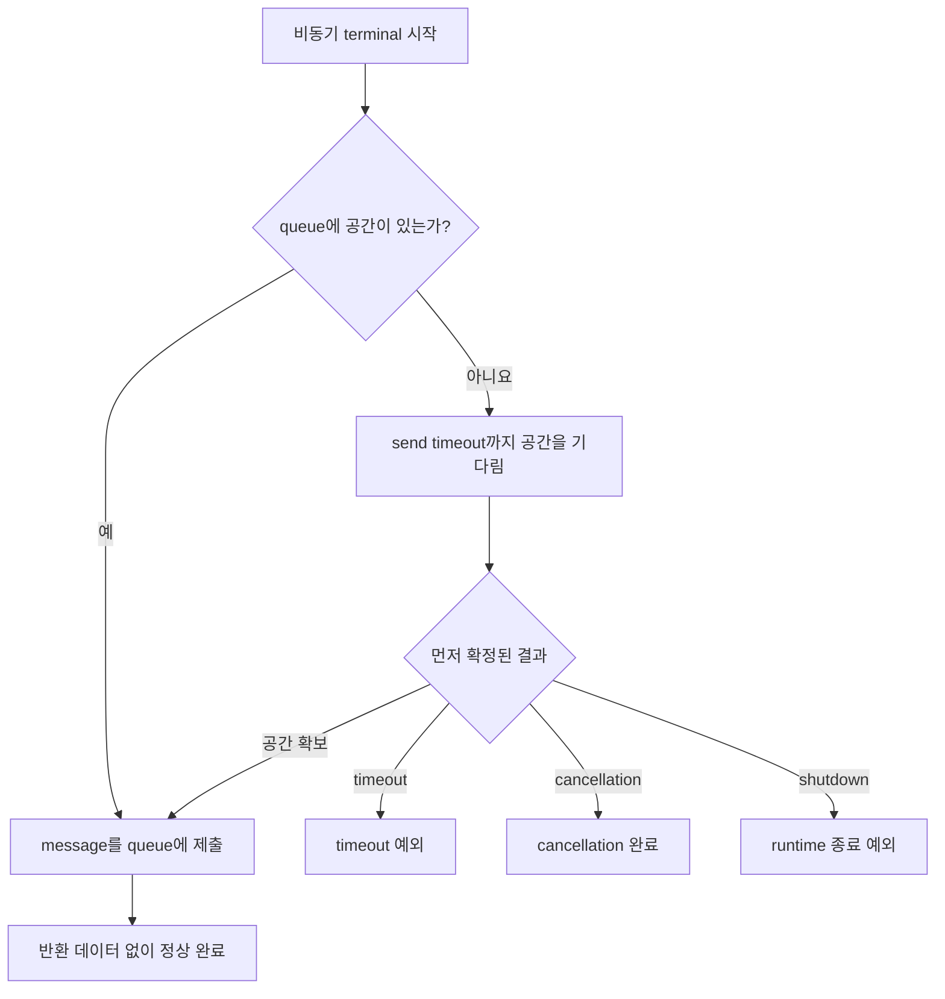

# One-way message submission 반환 계약 변경 요청

> 이 문서는 구현 전 변경 요청이다. 현재 Framework 공개 계약을 설명하지 않는다.
> 정식 spec과 다섯 언어 exact interface가 이 요청을 채택하기 전까지 기존
> `ZLinkSubmitResult`·`ZLinkPublishResult` 계약이 유효하다.

## 1. 요청 목적

One-way message API의 terminal call은 application 업무 결과를 만들지 않는다. 호출자가 알아야 할 것은
message를 Framework의 송신 queue에 제출했는지, 제출할 수 없다면 어떤 오류가 발생했는지다.

현재 계약은 정상 제출과 오류를 `ZLinkSubmitStatus`로 함께 반환한다. Logical Multicast는 여기에
target별 제출 개수까지 `ZLinkPublishResult`로 반환한다. 이 구조에서는 호출자가 모든 호출 뒤에 status를
검사해야 하고, 검사하지 않으면 timeout이나 route 오류를 놓칠 수 있다. 업무 결과가 없는 API에 결과 객체가
추가되어 모든 언어의 호출 코드와 오류 처리가 복잡해진다.

이 요청은 모든 one-way message API를 다음 원칙으로 통일한다.

- queue admission 완료를 비동기로 기다리는 terminal은 언어별 비동기 대기 이름을 사용한다.
- .NET은 `Async`, Kotlin 전용 wrapper는 `await`, Java·Node.js·C++는 `submit`을 사용한다.
- 비동기 terminal은 반환 데이터를 만들지 않는다.
- 정상 완료는 Framework가 해당 API의 local queue admission을 완료했다는 뜻이다.
- queue에 공간이 없으면 즉시 실패하지 않고 send timeout까지 기다린다.
- send timeout까지 queue에 제출하지 못하면 예외로 완료한다.
- cancellation, target 부재, route 단절과 runtime 종료도 반환 status가 아니라 예외로 알린다.
- target handler 실행이나 subscriber 수신 완료는 기다리지 않는다.

One-way 반환 계약은 Server Framework message API를 직접 변경한다. 이 과정에서 확정하는 Messaging 및
Worker call builder 종결자
naming은 Server Framework, Stream Connector와 zlink HTTP Client가 공유하는 repository-wide 규칙으로
적용한다. 세 패키지는 같은 언어에서 같은 실행 의미를 서로 다른 terminal 이름으로 노출하지 않는다.

### 1.1 Request 계약과 비교

일반 Request는 local queue admission 상태를 별도 결과로 반환하지 않는다. Framework는 target handler의
최종 application reply를 직접 반환하고, timeout·target 부재·route 단절은 예외로 알린다.

```csharp
public interface IZLinkRequestCall
{
    IZLinkRequestCall Timeout(TimeSpan timeout);

    // 정상 완료 값은 target handler가 만든 application reply다.
    // 전송이나 request 처리에 실패하면 exception으로 완료한다.
    ValueTask<TReply> Async<TReply>(
        CancellationToken cancellationToken = default);
}
```

Node direct, Channel, Spot과 Actor의 일반 Request가 이 원칙을 사용한다. Request와 비슷하게 응답을 기다리지만
결과 객체를 반환하는 create·get-or-create도 있다. 이 결과는 queue admission 상태가 아니라
`Existing`·`Created`·`Rejected`와 application reply처럼 operation의 최종 업무 결과다.

현재 계약에서 Send만 `ZLinkSubmitResult`라는 local queue 접수 결과를 반환한다. 호출자는 반환된 status를
확인하여 timeout이나 route 오류를 다시 분기해야 한다. Request가 이미 사용하는 “정상 완료 시 필요한 값만
반환하고 실패는 예외로 전달한다”는 규칙을 Send에도 적용하면 public 오류 모델이 하나로 통일된다.

### 1.2 Messaging 및 Worker call builder 종결자 naming

이 naming 규칙은 다음 두 종류의 call builder에만 적용한다.

- Messaging call builder: Framework의 Send·Request·Publish·Reply, Spot·Actor Send·Request,
  Stream Connector의 Send·Request·Wait, zlink HTTP Client의 HTTP request
- Worker call builder: Framework의 `RunCpuWorker`·`RunIoWorker`가 반환하는 worker call

이 builder의 terminal은 option 설정을 끝내고 실제 message I/O 또는 worker operation을 시작하는 마지막
호출이다. Builder의 재사용 가능 여부는 각 operation 계약이 별도로 정한다.

Spot·Actor create·get-or-create에 `Yield`를 추가하는 내용은 별도 실행 계약이다. 이 특례 때문에 object
lifecycle builder 전체를 이 naming 규칙의 대상으로 해석하지 않는다. Network topology·endpoint·MeshNode
연결 설정, Host·runtime·client 설정, handler 등록, security·retry·codec 정책처럼 구성 객체를 만드는
builder에도 적용하지 않는다. Builder를 반환하지 않는 일반 함수나 직접 비동기 method의 이름을 정하는
규칙도 아니다. 같은 실행 의미는 다섯 언어에서 다음 이름으로 표현한다.

| Fluent builder 종결 방식 | .NET | Java | Kotlin | Node.js | C++ |
|---|---|---|---|---|---|
| 비동기 완료를 반환하지 않는 즉시 제출 | `Submit()` | `submit()` | `submit()` | `submit()` | `submit()` |
| 비동기 완료를 반환하는 일반 종결자 | `Async()` | `submit()` → `CompletionStage<T>` | Kotlin wrapper의 `await()` | `submit()` → `Promise<T>` | `submit()` → `task_t<T>` |
| 현재 Spot turn을 반납하는 terminal | `Yield()` | `yield()` | Kotlin wrapper의 `yield()` | `yield()` | `yield()` |

이 표는 서로 다른 언어에 같은 철자 규칙을 강제하지 않는다. Java·Node.js·C++에서는 반환 type과
`await`·`co_await` 같은 호출 문법으로 비동기 operation임을 알 수 있으므로 terminal 이름에 `async`를
반복하지 않는다. Java의 `submit()`은 `CompletionStage<T>`, Node.js의 `submit()`은 `Promise<T>`,
C++의 `submit()`은 `task_t<T>`를 반환한다. .NET Messaging 및 Worker call builder는 비동기 완료
종결자에 `Async`를 사용하고,
Kotlin은 Java call을 숨긴 전용 wrapper에서 suspending `await()`를
제공한다. `Yield`·`yield`는 operation을 제출한 뒤 현재 Spot 실행 turn을 반납하고, 완료된 뒤 해당 실행
문맥으로 돌아온다.

여기서 `submit()` 자체가 Java의 Messaging 및 Worker call builder terminal이다. `CompletionStage`를
compose하거나
Virtual Thread에서 기다리는 것은 terminal 호출 뒤의 처리 방식이지 별도 terminal이 아니다. Node.js의
`await call.submit()`과 C++의 `co_await call.submit()`도 같은 관계다.

반환 type은 호출자가 종결자의 완료 방식을 이해하는 근거이지 overload를 선택하는 기준이 아니다. 어떤
언어에서도 인자 목록이 같은 두 종결자를 반환 type만 다르게 선언할 수 없다. 따라서 Java·Node.js·C++처럼
즉시 제출과 비동기 완료 종결자에 모두 `submit` 이름을 사용하는 언어는 한 Messaging 또는 Worker call
builder에 같은
인자의 두 종결자를 함께 제공하지 않는다. 하나의 결과 형태만 제공하거나, 실행 방식이 다른 call builder
type으로 분리해야 한다.

Java call은 Virtual Thread에서 실행되는 Java handler와 Kotlin coroutine이 같은 JVM runtime을 사용할 수 있도록
`submit()`과 `yield()`에서 `CompletionStage<T>`를 반환한다. Kotlin application에는 이 Java call을 직접
terminal로 노출하지 않는다.
Kotlin 전용 call wrapper가 Java stage와 `Class<T>`를 보관하고 `suspend fun await(): T`와
`suspend fun yield(): T`로 변환한다. 따라서 Kotlin 사용자는 `.submit().await()`나 `.yield().await()`를
작성하지 않는다.

Kotlin의 `kotlinx.coroutines.yield()`는 수신 객체 없이 coroutine 실행 기회를 양보한다. Framework wrapper의
`call.yield()`는 receiver가 있는 member이므로 두 호출을 구분할 수 있다. Request·Worker·Create라는 operation
종류는 wrapper type이 나타내므로 `awaitReply`, `yieldReply`, `yieldWorker`처럼 operation 이름을 terminal에
반복하지 않는다.

이번 변경에서 Send는 backpressure가 해소되거나 send timeout이 확정될 때까지 비동기로 기다린다. .NET은
`Async`, Kotlin wrapper는 `await`를 사용한다. Java·Node.js·C++는 `submit` 이름을 유지하고 비동기 반환
type의 완료를 기다린다. .NET의 `SubmitAsync`는 서로 다른 두 명명 관례를 한 이름에 섞으므로 `Async`로
바꾼다.

`Yield`·`yield`는 다음 세 종류의 call에만 제공한다.

- Channel·Spot·Actor를 대상으로 하는 Request builder
- CPU worker와 I/O worker를 실행하는 `RunWorker` 계열이 반환한 worker call
- Actor·Spot create와 get-or-create call

Send, Publish, timer 등록, close, destroy와 lifecycle call에는 `Yield`·`yield`를 추가하지 않는다.
Request, worker 또는 create/get-or-create call이라도 `Yield`를 실행할 수 있는 문맥은 `SpotWide` User Spot과
Instance Spot의 application callback으로 제한한다. 다른 실행 문맥에서는 reservation, factory 실행,
operation submission과 queue 변경 전에 `InvalidConfiguration`으로 끝낸다.

Actor Join은 이번 변경 요청에서 제외한다. Terminal 이름, 반환 type, `Yield` 제공 여부와 Actor 이동 중
continuation 처리 방식은 별도 설계에서 결정한다.

Messaging call builder가 아닌 `RelayAsync(...)` 같은 직접 비동기 method는 각 언어의 일반 method naming 규칙을
유지할 수 있다.

## 2. 변경 대상

다음 operation은 모두 같은 one-way submission 계약을 사용한다.

| Operation family | 현재 반환 | 요청하는 반환 |
|---|---|---|
| Node direct·Channel send | `ZLinkSubmitResult` | 반환 데이터 없음 |
| Spot send | `ZLinkSubmitResult` | 반환 데이터 없음 |
| Actor send | `ZLinkSubmitResult` | 반환 데이터 없음 |
| Classic fanout publish | `ZLinkSubmitResult` | 반환 데이터 없음 |
| Logical Multicast publish | `ZLinkPublishResult` | 반환 데이터 없음 |
| STREAM session send·reply | `ZLinkSubmitResult` | 반환 데이터 없음 |
| Bound STREAM session send | `ZLinkSubmitResult` | 반환 데이터 없음 |
| Session Actor relay | `ZLinkSubmitResult` | 반환 데이터 없음 |

Request, create, get-or-create와 worker의 **결과 type**은 one-way result 제거 대상이 아니다. 이 API들은
reply, 생성 여부, 거절 결과 또는 worker 실행값처럼 application이 사용하는 결과를 반환한다. 다만 완료를
기다리는 terminal에 `submit` 이름을 사용하고 있다면 §2.2의 naming 변경 대상에는 포함한다.

### 2.1 Public interface inventory

다섯 언어 exact interface를 `ZLinkSubmitResult`, `submit_result_t`, `ZLinkPublishResult`와
`publish_result_t` 반환 기준으로 대조했다. 다음 public 표면을 모두 변경해야 한다.

| Operation | .NET 기준 현재 public 표면 | 변경 후 call builder terminal |
|---|---|---|
| Node direct·Channel send | `IZLinkSendCall.SubmitAsync(...)` | `Async(...)` |
| Spot send | `IZLinkSpotSendCall.SubmitAsync(...)` | `Async(...)` |
| Actor send | `IZLinkActorSendCall.SubmitAsync(...)` | `Async(...)` |
| Classic fanout publish | `IZLinkFanoutPublishCall.SubmitAsync(...)` | `Async(...)` |
| Logical Multicast publish | `IZLinkPublishCall.SubmitAsync(...)` | `Async(...)` |
| STREAM session send | `IZLinkSessionSendCall.SubmitAsync(...)` | `Async(...)` |
| STREAM request reply | `IZLinkSessionReplyCall.SubmitAsync(...)` | `Async(...)` |
| Bound STREAM session send | `IZLinkBoundSessionSendCall.SubmitAsync(...)` | `Async(...)` |
| Session Actor relay | `IZLinkSessionActor.RelayAsync(...)` | 직접 async method 이름 유지, 반환 type만 변경 |

Java는 각 표면의 `CompletionStage<ZLinkSubmitResult>`, Node.js는 `Promise<ZLinkSubmitResult>`,
C++는 `task_t<submit_result_t>`를 반환한다. Kotlin wrapper는 Java Framework call을 내부에 보관하고
coroutine terminal에서 같은 완료 의미를 `Unit`으로 투영해야 한다.

C++에서는 `route_send_call_t`, `send_call_t`, `spot_send_call_t`, `actor_send_call_t`,
`fanout_publish_call_t`, `publish_call_t`, `stream_send_call_t`, `stream_write_call_t`와
`bound_session_send_call_t`의 Messaging call terminal 이름을 `submit()`으로 유지하고 반환 type만
`task_t<void>`로 변경한다.
`session_actor_t::relay(...)`처럼 builder를 반환하지 않는 직접 method는 별도 언어 naming review
대상으로 둔다.

다음 API는 이름에 `Submit`이 있거나 one-way처럼 보이지만 이 변경 대상이 아니다.

| 제외 API | 제외 이유 |
|---|---|
| 일반 Request의 `Async`·`submit<TReply>` | Target handler의 application reply를 반환 |
| Actor·Spot create와 get-or-create | `Existing`·`Created`·`Rejected`와 creation reply를 반환 |
| Worker 결과 | Message submission이 아니라 worker offload의 실행값을 반환 |
| `DisconnectAsync`, `NotifyDisconnectedAsync`, session close | `ZLinkSubmitResult`를 반환하지 않는 lifecycle signal |
| Location Store의 write result | CAS·lease·write의 업무 결과이며 message queue admission이 아님 |

이 표의 “제외”는 application 결과를 제거하지 않는다는 뜻이다. Request·create·worker의 terminal 이름은
§2.2와 §2.3에 적은 언어별 규칙에 맞춰 별도로 변경한다.

### 2.2 Messaging 및 Worker call builder 종결자 naming 전수 조사

다섯 언어 server exact interface에서 Messaging 및 Worker call builder의 public 종결자를 대조한 결과,
같은 완료 의미에 서로 다른 이름을 사용하는 부분이 남아 있다. 반환 type만 바꾸면 이 차이가 계속
유지되므로, 다음 기준으로 함께 수정한다.

| 언어 | 즉시 제출 종결자 | 비동기 완료 종결자 | Spot turn 반납 종결자 | 현재 수정 대상 |
|---|---|---|---|---|
| .NET | `Submit()` | `Async()` | `Yield()` | one-way builder의 `SubmitAsync()` |
| Java | `submit()` | `submit()` → `CompletionStage<T>` | `yield()` | one-way result type 제거 |
| Kotlin | `submit()` | wrapper의 `await()` | wrapper의 `yield()` | Java call 직접 노출과 operation별 extension |
| Node.js | `submit()` | `submit()` → `Promise<T>` | `yield()` | one-way result type 제거와 Worker의 `async()` |
| C++ | `submit()` | `submit()` → `task_t<T>` | `yield()` | one-way result type 제거와 Framework·Connector·HTTP Client의 `async()` |

표의 `Yield`·`yield` 열은 Naming 대상인 Request builder와 worker call에 적용한다. Actor·Spot
create·get-or-create의 `Yield` 추가는 §2.3의 별도 실행 계약으로 다룬다. 다른 call family에 같은 이름의
terminal을 추가하지 않는다.

#### .NET

`IZLinkSendCall`, `IZLinkSpotSendCall`, `IZLinkActorSendCall`, `IZLinkFanoutPublishCall`,
`IZLinkPublishCall`, `IZLinkSessionSendCall`, `IZLinkSessionReplyCall`과
`IZLinkBoundSessionSendCall`의 `SubmitAsync(...)`를 `Async(...)`로 바꾼다.

`IZLinkSessionActor.RelayAsync(...)`는 Messaging call builder terminal이 아닌 직접 비동기 method이므로 이름을
유지하고 반환 type에서 `ZLinkSubmitResult`만 제거한다.

#### Java

Java Messaging 및 Worker call builder의 일반 종결자는 `submit(...)`이다. 이 종결자는
`CompletionStage<T>`를 반환한다.
One-way operation은 반환 type만 `CompletionStage<Void>`로 바꾸며 Request, create·get-or-create와
worker의 `submit(...)` 이름과 application 결과 type은 유지한다. Spot turn을 반납해야 하는 call만
`yield(...)`를 제공하고 같은 결과 type의 `CompletionStage`를 반환한다.

#### Kotlin

Kotlin-facing builder는 Java call 대신 Kotlin 전용 wrapper를 반환한다. 일반 suspending 종결자는
wrapper의 `await()`, 현재 turn을 반납하는 종결자는 wrapper의 `yield()`를 사용한다. Typed Request
wrapper는 생성될 때 reified
reply type을 받아 내부 Java `Class<T>`로 보관하므로 terminal에서 reply type을 다시 받지 않는다.

Wrapper 내부에서만 Java `submit(...)`·`yield(...)`가 반환한 `CompletionStage`를 coroutine으로 기다린다.
Java call type에 같은 이름의 suspend extension을 추가하지 않는다. Java member가 Kotlin extension보다 먼저
선택되는 문제를 피하고, Java stage와 `.await()` 조합이 application 코드에 노출되지 않게 하기 위해서다.

#### Node.js

Node.js Messaging 및 Worker call builder의 일반 종결자는 `submit(...): Promise<T>`이다. Application은
`await call.submit()`으로 완료를 기다린다. Spot turn을 반납하는 종결자는
`yield(...): Promise<T>`를 사용한다. Promise를 반환한다는 이유만으로
`async(...)`라는 terminal 이름을 추가하지 않는다.

#### C++

C++ coroutine은 반환 type `task_t<T>`와 `co_await`로 비동기 대기를 표현한다. 따라서 별도의
`async()` terminal을 사용하지 않고 `submit()`을 유지한다. One-way builder의
`task_t<submit_result_t> submit()`은 이름을 유지한 채 `task_t<void> submit()`으로 바꾼다. 기존
Framework와 HTTP Client의 coroutine terminal에 `async()`가 있으면 `submit()`으로 변경한다.

`co_yield`와 Framework의 `yield()`도 의미가 다르다. `co_yield`는 C++ coroutine의 generator 값을
내보내는 언어 keyword다. `call.yield()`는 현재 Spot 실행 turn을 반납하고 operation이 완료된 뒤 새 turn에서
실행을 재개하도록 요청하는 Framework terminal이다. 따라서 turn을 반납하는 호출은
`co_await call.yield()`로 표현한다.

C++ Framework의 `task_t`는 coroutine을 만들 때 `initial_suspend()`가 `std::suspend_never`를 반환하므로
생성 즉시 실행을 시작한다. 이 실행 시점은 `async()`를 `submit()`으로 바꾸는 데 문제가 되지 않는다.

C++ Stream Connector는 public header에서 coroutine과 exception을 노출하지 않는 기존 package
경계를 유지한다. 따라서 one-way는 `void submit()`을 사용하고 실패는 기존 error event로 전달한다.
Request·wait·expect-none·sequence wait의 결과 계약과 callback overload도 유지한다. HTTP Client의
coroutine terminal만 `task_t<T> submit()`으로 이름을 맞춘다.

### 2.3 실제 public interface 변경 목록

다음 표는 현재 exact interface에서 확인한 public signature와 변경할 signature를 method 단위로 정리한다.
같은 call type을 상속하는 Spot·Channel별 facade는 부모 interface 변경을 그대로 적용한다.

#### .NET 변경 목록

| Public interface·method | 현재 | 변경 |
|---|---|---|
| `IZLinkSendCall.SubmitAsync(...)` | `ValueTask<ZLinkSubmitResult>` | `ValueTask Async(...)` |
| `IZLinkSpotSendCall.SubmitAsync(...)` | `ValueTask<ZLinkSubmitResult>` | `ValueTask Async(...)` |
| `IZLinkActorSendCall.SubmitAsync(...)` | `ValueTask<ZLinkSubmitResult>` | `ValueTask Async(...)` |
| `IZLinkFanoutPublishCall.SubmitAsync(...)` | `ValueTask<ZLinkSubmitResult>` | `ValueTask Async(...)` |
| `IZLinkPublishCall.SubmitAsync(...)` | `ValueTask<ZLinkPublishResult>` | `ValueTask Async(...)` |
| `IZLinkSessionSendCall.SubmitAsync(...)` | `ValueTask<ZLinkSubmitResult>` | `ValueTask Async(...)` |
| `IZLinkSessionReplyCall.SubmitAsync(...)` | `ValueTask<ZLinkSubmitResult>` | `ValueTask Async(...)` |
| `IZLinkBoundSessionSendCall.SubmitAsync(...)` | `ValueTask<ZLinkSubmitResult>` | `ValueTask Async(...)` |
| `IZLinkSessionActor.RelayAsync(payload, ...)` | `ValueTask<ZLinkSubmitResult>` | 이름 유지, `ValueTask` |
| `IZLinkSessionActor.RelayAsync(dispatch, payload, ...)` | `ValueTask<ZLinkSubmitResult>` | 이름 유지, `ValueTask` |
| `IZLinkSpotCreateCall.Async(...)` | `ValueTask<ZLinkSpotCreateResult>` | 기존 `Async(...)` 유지, 같은 결과 type의 `Yield(...)` 추가 |
| `IZLinkSpotGetOrCreateCall.Async(...)` | `ValueTask<ZLinkSpotCreateResult>` | 기존 `Async(...)` 유지, 같은 결과 type의 `Yield(...)` 추가 |
| `IZLinkActorCreateCall.Async(...)` | `ValueTask<ZLinkActorCreateResult>` | 기존 `Async(...)` 유지, 같은 결과 type의 `Yield(...)` 추가 |
| `IZLinkActorGetOrCreateCall.Async(...)` | `ValueTask<ZLinkActorCreateResult>` | 기존 `Async(...)` 유지, 같은 결과 type의 `Yield(...)` 추가 |

`ZLinkSubmitStatus`, `ZLinkSubmitResult`, `ZLinkLogicalMulticastDetail`과 `ZLinkPublishResult`는 다른 public
계약의 사용 여부를 확인한 뒤 message submission 반환 계약에서 제거한다.

#### Java 변경 목록

| Public interface·method | 현재 | 변경 |
|---|---|---|
| `ZLinkSendCall.submit()` | `CompletionStage<ZLinkSubmitResult>` | 이름 유지, `CompletionStage<Void>` |
| `ZLinkFanoutPublishCall.submit()` | `CompletionStage<ZLinkSubmitResult>` | 이름 유지, `CompletionStage<Void>` |
| `ZLinkPublishCall.submit()` | `CompletionStage<ZLinkPublishResult>` | 이름 유지, `CompletionStage<Void>` |
| `ZLinkActorSendCall.submit()` | `CompletionStage<ZLinkSubmitResult>` | 이름 유지, `CompletionStage<Void>` |
| `ZLinkBoundSessionSendCall.submit()` | `CompletionStage<ZLinkSubmitResult>` | 이름 유지, `CompletionStage<Void>` |
| `ZLinkSessionSendCall.submit()` | `CompletionStage<ZLinkSubmitResult>` | 이름 유지, `CompletionStage<Void>` |
| `ZLinkSessionReplyCall.submit()` | `CompletionStage<ZLinkSubmitResult>` | 이름 유지, `CompletionStage<Void>` |
| `ZLinkSessionActor.relay(payload)` | `CompletionStage<ZLinkSubmitResult>` | 이름 유지, `CompletionStage<Void>` |
| `ZLinkSessionActor.relay(dispatch, payload)` | `CompletionStage<ZLinkSubmitResult>` | 이름 유지, `CompletionStage<Void>` |
| `ZLinkRequestCall.submit(Class<TReply>)` | `CompletionStage<TReply>` | 이름과 반환 type 유지 |
| `ZLinkActorRequestCall.submit(Class<TReply>)` | `CompletionStage<TReply>` | 이름과 반환 type 유지 |
| `ZLinkSpotCreateCall.submit()` | `CompletionStage<ZLinkSpotCreateResult>` | 기존 `submit()` 유지, 같은 결과 type의 `yield()` 추가 |
| `ZLinkSpotGetOrCreateCall.submit()` | `CompletionStage<ZLinkSpotCreateResult>` | 기존 `submit()` 유지, 같은 결과 type의 `yield()` 추가 |
| `ZLinkActorCreateCall.submit()` | `CompletionStage<ZLinkActorCreateResult>` | 기존 `submit()` 유지, 같은 결과 type의 `yield()` 추가 |
| `ZLinkActorGetOrCreateCall.submit()` | `CompletionStage<ZLinkActorCreateResult>` | 기존 `submit()` 유지, 같은 결과 type의 `yield()` 추가 |
| `ZLinkWorkerCall<T>.submit()` | `CompletionStage<T>` | 이름과 반환 type 유지 |

`ZLinkSpotSendCall`과 `ZLinkSpotRequestCall`이 공통 Send·Request call을 상속한다면 별도 terminal을 중복
선언하지 않고 부모 변경을 따른다. `ZLinkSubmitStatus`, `ZLinkSubmitResult`,
`ZLinkLogicalMulticastDetail`과 `ZLinkPublishResult`도 message submission 반환 계약에서 제거한다.

#### Kotlin 변경 목록

Kotlin-facing builder와 manager는 다음 wrapper를 반환하도록 정리한다. Wrapper 이름은 역할을 보여 주기 위한
목표 이름이며 package와 공통 base interface의 정확한 배치는 Kotlin exact interface가 고정한다.

| 대상 operation | 현재 Kotlin 표면 | 변경 후 wrapper와 terminal |
|---|---|---|
| Send·Publish·STREAM one-way | Java call을 직접 반환하거나 별도 coroutine terminal이 없음 | `ZLinkKotlinMessageSendCall`; `suspend fun await(): Unit` |
| Request | Java request call과 `awaitReply(...)`·`yieldReply(...)` extension | `ZLinkKotlinRequestCall<TReply>`; `await(): TReply`, `yield(): TReply` |
| Spot create·get-or-create | Java call과 `CompletionStage`를 직접 사용 | `ZLinkKotlinSpotCreateCall`; `await()`와 `yield()` |
| Actor create·get-or-create | Java call과 `CompletionStage`를 직접 사용 | `ZLinkKotlinActorCreateCall`; `await()`와 `yield()` |
| Worker | Java worker call과 `yieldWorker()` extension | `ZLinkKotlinWorkerCall<T>`; `await(): T`, `yield(): T` |
| Session Actor relay | Java direct method가 반환한 `CompletionStage`를 직접 대기 | Kotlin relay wrapper의 `await(): Unit` |

Kotlin-facing client, manager와 Spot context도 Kotlin call wrapper를 반환하는 entry method를 제공한다.
Request builder는 reified reply type을 wrapper 생성 시점에 고정한다. Metadata, timeout, Instance Spot
intent와 create option은 wrapper가 같은 fluent 순서로 제공하고 내부 Java call에 위임한다. Wrapper는 별도
operation 상태 기계를 만들지 않으며 single-use, 중복 option, timeout, cancellation과 오류 계약은 Java call
결과를 그대로 보존한다.

기존 `awaitReply`, `yieldReply`, `yieldWorker`, 즉시 Request를 실행해 결과를 반환하는 convenience 함수와
Java call을 직접 반환하는 Kotlin builder는 wrapper 반환 API로 교체한다. Kotlin application code에는
`CompletionStage`, `Class<T>`, `.submit().await()`와 `.yield().await()`가 나타나지 않아야 한다.

#### Node.js 변경 목록

| Public interface·method | 현재 | 변경 |
|---|---|---|
| `ZLinkSendCall.submit(...)` | `Promise<ZLinkSubmitResult>` | 이름 유지, `Promise<void>` |
| `ZLinkSpotSendCall.submit(...)` | `Promise<ZLinkSubmitResult>` | 이름 유지, `Promise<void>` |
| `ZLinkActorSendCall.submit(...)` | `Promise<ZLinkSubmitResult>` | 이름 유지, `Promise<void>` |
| `ZLinkFanoutPublishCall.submit(...)` | `Promise<ZLinkSubmitResult>` | 이름 유지, `Promise<void>` |
| `ZLinkPublishCall.submit(...)` | `Promise<ZLinkPublishResult>` | 이름 유지, `Promise<void>` |
| `ZLinkSessionSendCall.submit(...)` | `Promise<ZLinkSubmitResult>` | 이름 유지, `Promise<void>` |
| `ZLinkSessionReplyCall.submit(...)` | `Promise<ZLinkSubmitResult>` | 이름 유지, `Promise<void>` |
| `ZLinkBoundSessionSendCall.submit(...)` | `Promise<ZLinkSubmitResult>` | 이름 유지, `Promise<void>` |
| `ZLinkSessionActor.relay(payload, ...)` | `Promise<ZLinkSubmitResult>` | 이름 유지, `Promise<void>` |
| `ZLinkSessionActor.relay(dispatch, payload, ...)` | `Promise<ZLinkSubmitResult>` | 이름 유지, `Promise<void>` |
| `ZLinkRequestCall.submit<TReply>(...)` | `Promise<TReply>` | 이름과 반환 type 유지 |
| `ZLinkChannelRequestCall.submit<TReply>(...)` | `Promise<TReply>` | 이름과 반환 type 유지 |
| `ZLinkSpotRequestCall.submit<TReply>(...)` | `Promise<TReply>` | 이름과 반환 type 유지 |
| `ZLinkActorRequestCall.submit<TReply>(...)` | `Promise<TReply>` | 이름과 반환 type 유지 |
| `ZLinkSpotCreateCall.submit(...)` | `Promise<ZLinkSpotCreateResult>` | 기존 `submit(...)` 유지, 같은 결과 type의 `yield(...)` 추가 |
| `ZLinkSpotGetOrCreateCall.submit(...)` | `Promise<ZLinkSpotCreateResult>` | 기존 `submit(...)` 유지, 같은 결과 type의 `yield(...)` 추가 |
| `ZLinkActorCreateCall.submit(...)` | `Promise<ZLinkActorCreateResult>` | 기존 `submit(...)` 유지, 같은 결과 type의 `yield(...)` 추가 |
| `ZLinkActorGetOrCreateCall.submit(...)` | `Promise<ZLinkActorCreateResult>` | 기존 `submit(...)` 유지, 같은 결과 type의 `yield(...)` 추가 |

Worker의 `submit(): void`와 `async(): Promise<T>`는 `submit(): Promise<T>` 하나로 통합하고
`yield(): Promise<T>`는 유지한다. `ZLinkSubmitStatus`, `ZLinkSubmitResult`,
`ZLinkLogicalMulticastDetail`과 `ZLinkPublishResult`는 message submission 반환 계약에서 제거한다.

#### C++ 변경 목록

| Public type·method | 현재 | 변경 |
|---|---|---|
| `send_call_t::submit()` | `task_t<submit_result_t>` | 이름 유지, `task_t<void>` |
| `route_send_call_t::submit()` | `task_t<submit_result_t>` | 이름 유지, `task_t<void>` |
| `spot_send_call_t::submit()` | `task_t<submit_result_t>` | 이름 유지, `task_t<void>` |
| `actor_send_call_t::submit()` | `task_t<submit_result_t>` | 이름 유지, `task_t<void>` |
| `fanout_publish_call_t::submit()` | `task_t<submit_result_t>` | 이름 유지, `task_t<void>` |
| `publish_call_t::submit()` | `task_t<publish_result_t>` | 이름 유지, `task_t<void>` |
| `stream_send_call_t::submit()` | `task_t<submit_result_t>` | 이름 유지, `task_t<void>` |
| `stream_write_call_t::submit()` | `task_t<submit_result_t>` | 이름 유지, `task_t<void>` |
| `bound_session_send_call_t::submit()` | `task_t<submit_result_t>` | 이름 유지, `task_t<void>` |
| `session_actor_t::relay(payload)` | `task_t<submit_result_t>` | 이름 유지, `task_t<void>` |
| `session_actor_t::relay(dispatch, payload)` | `task_t<submit_result_t>` | 이름 유지, `task_t<void>` |
| `spot_create_call_t::submit()` | `task_t<spot_create_result_t>` | 기존 `submit()` 유지, 같은 결과 type의 `yield()` 추가 |
| `actor_create_call_t::submit()` | `task_t<actor_create_result_t>` | 기존 `submit()` 유지, 같은 결과 type의 `yield()` 추가 |

Create와 get-or-create가 같은 call type의 mode로 구분된다면 같은 결과 type의 `submit()`과 `yield()`를
공유한다. Request, bind와 worker에 남은 coroutine terminal `async()`는 `submit()`으로 바꾸고,
`yield()`는 그대로 유지한다. C++ Stream Connector에는 coroutine terminal을 추가하지 않고 기존
no-exception·no-coroutine public 계약과 `submit()` 이름을 유지한다.
`submit_status_t`, `submit_result_t`, `logical_multicast_detail_t`와 `publish_result_t`는 message submission
반환 계약에서 제거한다.

#### Yield 제공 범위 확인 목록

`Yield`·`yield`는 새 one-way 계약의 terminal이 아니다. 다음 public call에만 유지하거나 Kotlin 이름을
정리한다.

| 언어 | Request builder | Worker call | Create·get-or-create call | 변경 |
|---|---|---|---|---|
| .NET | `IZLinkRequestCall`, `IZLinkSpotRequestCall`, `IZLinkActorRequestCall`의 `Yield<TReply>()` | `IZLinkWorkerCall<TResult>.Yield()` | `IZLinkSpotCreateCall`, `IZLinkSpotGetOrCreateCall`, `IZLinkActorCreateCall`, `IZLinkActorGetOrCreateCall` | Request·Worker는 유지, Create 계열에 같은 결과 type의 `Yield(...)` 추가 |
| Java | `ZLinkRequestCall`, 이를 상속하는 Spot request, `ZLinkActorRequestCall`의 `yield(...)` | `ZLinkWorkerCall<T>.yield()` | Spot·Actor create와 get-or-create call | Request·Worker는 유지, Create 계열에 같은 결과 type의 `yield()` 추가 |
| Kotlin | `ZLinkKotlinRequestCall<TReply>.yield()` | `ZLinkKotlinWorkerCall<T>.yield()` | Kotlin Spot·Actor create wrapper의 `yield()` | Java call이 아닌 Kotlin wrapper member로 제공 |
| Node.js | `ZLinkRequestCall`, `ZLinkChannelRequestCall`, `ZLinkSpotRequestCall`, `ZLinkActorRequestCall`의 `yield(...)` | `ZLinkWorkerCall<T>.yield()` | Spot·Actor create와 get-or-create call | Request·Worker는 유지, Create 계열에 같은 결과 type의 `yield(...)` 추가 |
| C++ | `request_call_t`, `channel_request_call_t`, `spot_request_call_t`, `actor_request_call_t`의 `yield()` | `worker_call_t<T>::yield()` | `spot_create_call_t`, `actor_create_call_t` | Request·Worker는 유지, Create 계열에 같은 결과 type의 `yield()` 추가 |

Send, Publish, timer, close, destroy와 lifecycle call에 `Yield`·`yield`가 노출되어 있으면 삭제 대상이다.
E2E와 contract test는 허용된 Request·Worker·Create call의 성공뿐 아니라 허용되지 않은 call family에
`Yield`가 없다는 compile-time 또는 declaration 검증도 포함한다.

### 2.4 전수 조사에서 제외한 builder와 method

다음 builder와 method는 이름에 `Async`, `async`, `Submit`이 있어도 Messaging 및 Worker call builder
종결자 규칙의 대상이 아니다.

- Host·runtime·client 설정 builder와 그 `Build`·`build` 종결자
- Network topology, endpoint, MeshNode 연결 관계와 Channel membership을 구성하는 builder
- Handler·Channel·codec·security·retry 정책 등록 builder
- Spot·Actor create·get-or-create, join, close·destroy·relocation 같은 object lifecycle builder
- Connector의 connect·close와 runtime start·retire·shutdown 같은 lifecycle call builder
- Handler와 lifecycle callback
- Location Store·Relocation Store의 직접 비동기 CRUD·CAS method
- Runtime `Start`, `Retire`, `Shutdown`, `Close`, `Disconnect` 같은 직접 lifecycle method
- `IZLinkSessionActor.RelayAsync(...)`처럼 call builder를 반환하지 않는 직접 message method
- 내부 runtime helper와 private adapter

이 method들의 이름은 이 변경 요청에서 다루지 않는다. 반환 type이나 오류 계약이 one-way result 변경의
영향을 받으면 별도로 수정하지만, Messaging 및 Worker call builder 종결자 규칙을 적용하지 않는다.

### 2.5 세 패키지에 적용하는 공통 naming 정책

이 naming 정책은 Server Framework에만 적용하지 않는다. Stream Connector와 zlink HTTP Client를 포함한
세 패키지의 Messaging call builder와 Framework의 Worker call builder에 같은 언어별 규칙을 적용한다.

| 언어 | 즉시 제출 종결자 | 비동기 완료 종결자 | 세 패키지 적용 |
|---|---|---|---|
| .NET | `Submit(...)` | `Async(...)` | Framework·Connector·HTTP Client |
| Java | `submit(...)` | `submit(...)` → `CompletionStage<T>` | Framework·Connector·HTTP Client |
| Kotlin | `submit()` | 전용 wrapper의 `await()` | Framework·Connector·HTTP Client |
| Node.js·TypeScript | `submit(...)` | `submit(...)` → `Promise<T>` | Framework·Connector·HTTP Client |
| C++ | `submit(...)` | `submit(...)` → `task_t<T>` 또는 package awaitable | Framework·Connector·HTTP Client |

반환 type이 없는 동기 제출과 callback 등록 overload도 각 언어에서 기존 `Submit`·`submit` 이름을 유지한다.
비동기 여부는 `ValueTask`, `CompletionStage`, `Promise`, `task_t` 같은 반환 type과
`await`·`co_await` 같은 호출 문법으로 드러낸다. Spot turn을 실제로 반납하는 Framework call만
`Yield`·`yield`를 사용한다. HTTP Client와 Stream Connector의 일반 비동기 대기에 `yield`를 추가하지 않는다.

현재 세 패키지에는 이 규칙과 다른 `async(...)` terminal이 남아 있으므로 다음 항목을 변경 대상으로
포함한다.

| 패키지·언어 | 현재 표면 | 변경 방향 |
|---|---|---|
| Server Framework C++ | Request·worker 등에 `async(...)` 사용 | 같은 반환 type의 `submit(...)`으로 변경 |
| Server Framework Node.js | Worker 등에 `async(...)` 사용 | `submit(...): Promise<T>`로 통합 |
| Stream Connector C++ core | 기존 no-exception·no-coroutine `submit(...)` 사용 | 이름과 실행 경계 유지 |
| zlink HTTP Client C++ | typed·raw request에 `async(...)` 사용 | `submit<T>(...)`·`submitRaw(...)`으로 변경 |
| zlink HTTP Client Java | `async(...)`가 `CompletionStage<T>` 반환 | `submit(...)`으로 변경 |
| zlink HTTP Client Node.js | standalone과 Server builder에 typed `async<T>()`가 있음 | Server builder의 one-way `submit()`과 상속 signature가 겹치므로 typed response `async<T>()` 유지 |

zlink HTTP Client의 공통 언어 대응표와 언어별 exact interface는 다음 이름으로 함께 바꾼다.

| HTTP operation | C++ | .NET | Java | Kotlin | Node.js |
|---|---|---|---|---|---|
| Raw response 대기 | `submit_raw()` | `AsyncRaw(...)` | `submitRaw()` | `awaitRaw()` | `submitRaw()` |
| Typed response 대기 | `submit<T>()` | `Async<T>(...)` | `submit(Class<T>)` | `await<T>()` | `async<T>()` |
| Streaming download | `download(...)` | `DownloadAsync(...)` | `download(...)` | `awaitDownload(...)` | `download(...)` |
| Callback 완료 | `submit<T>(callback)` | `Async<T>(callback)` | `submit(Class<T>, callback)` | suspending API 사용 | `submit<T>(callback)` |
| One-way 비동기 제출 | `submit()` | `Async(...)` | `submit()` | `await()` | `submit()` |

`submit_raw`·`submitRaw`처럼 operation 결과의 종류를 구분하는 suffix는 유지한다. 제거하는 것은 비동기라는
사실만 반복하는 `async` 이름이다. Streaming download는 operation 자체를 나타내는 `download` 이름을
유지하며, .NET만 일반 비동기 method naming 관례에 따라 `DownloadAsync`를 사용한다.
Node HTTP Client의 typed `async<T>()`는 비동기 여부를 반복하려는 이름이 아니라 TypeScript에서
Server builder의 one-way `submit()`과 같은 상속 signature를 피하기 위한 언어 제약 예외다.

Stream Connector의 Java `submit(...)`, TypeScript `submit(...)`, C++ core의 blocking·callback
`submit(...)`은 이미 이 규칙과 일치하므로 이름을 유지한다. zlink HTTP Client의 .NET `Async(...)`와
Kotlin wrapper `await()`도 유지한다.

세 패키지는 각각 exact interface, 구현, contract test, sample과 guide를 같은 contract snapshot에서
변경한다. 한 패키지의 interface만 먼저 바꾸어 동일 언어의 terminal 이름이 package마다 달라지게 하면
안 된다.

## 3. 공통 완료 계약

### 3.1 정상 완료

언어별 비동기 terminal(.NET의 `Async`, Kotlin의 `await`, Java·Node.js·C++의 `submit`)은 message를
해당 operation이 사용하는 local admission 경계에 제출한 뒤 정상 완료한다.

- Remote 단일 target은 local outbound transport queue admission을 완료한다.
- Local target은 해당 Spot·Actor mailbox 또는 relay queue admission을 완료한다.
- Classic fanout은 local publisher socket queue admission을 완료한다.
- STREAM send·reply는 해당 STREAM socket queue admission을 완료한다.

정상 완료는 target handler 실행, remote queue 수락 또는 subscriber 수신을 뜻하지 않는다.

### 3.2 Backpressure와 timeout

첫 제출 시도에서 queue 공간이 부족하면 Framework는 send timeout까지 공간이 생기기를 기다린다.
공간이 생기면 message를 한 번 제출하고 정상 완료한다. 제한 시간까지 공간이 생기지 않으면 timeout
예외로 완료한다.

`Backpressured`는 중간 상태이므로 application 반환값이나 즉시 발생하는 예외가 아니다. Framework가
기다린 뒤 정상 완료하거나 timeout, cancellation 또는 shutdown 중 먼저 확정된 하나로 완료한다.



### 3.3 오류 전달

현재 `ZLinkSubmitStatus`가 나타내는 상태는 다음 원칙으로 옮긴다.

| 현재 status | 변경 후 계약 |
|---|---|
| `Submitted` | 반환 데이터 없는 정상 완료 |
| `Backpressured` | send timeout까지 내부에서 대기하며 terminal 결과로 노출하지 않음 |
| `TimedOut` | timeout 예외 |
| `TargetNotFound` | target 부재를 나타내는 Framework 예외 |
| `RouteNotConnected` | `RouteNotConnected` Framework 예외 |
| `Shutdown` | runtime 종료를 나타내는 Framework 예외 |

Cancellation은 각 언어의 표준 비동기 cancellation 규칙을 따른다. 잘못된 인자, 중복 terminal 호출과
이미 소비한 reply token도 기존처럼 예외로 처리한다.

`ZLinkFrameworkErrorKind`에는 현재 one-way `TargetNotFound`와 runtime `Shutdown`을 모든 언어에서
같게 표현할 공통 kind가 없다. 정식 계약을 수정할 때 다음 중 하나로 이름과 숫자 값을 확정해야 한다.

- 기존의 target별 kind를 재사용하고 Channel·fanout에 필요한 공통 kind만 추가한다.
- 모든 one-way operation이 공유하는 `TargetNotFound`와 `RuntimeShutdown` kind를 추가한다.

언어별 표준 예외만 사용하면 cross-language 오류 분류가 달라지므로, Framework error kind와 언어별
exception projection을 함께 확정해야 한다.

## 4. Publish의 별도 경계

### 4.1 Classic fanout

Subscriber가 하나도 없어도 오류가 아니다. Publisher socket queue가 message를 수락하면 정상 완료한다.
Classic PUB socket은 subscriber 수와 수신 완료를 publisher에게 반환하지 않는다.

### 4.2 Logical Multicast

Logical Multicast는 publish를 시작할 때 고정한 target들로 message를 보낸다. 일부 target에 이미 제출한
뒤 다른 target에서 실패해도 이전 제출을 취소할 수 없다. 따라서 예외를 보고 무조건 전체 publish를
재시도하면 일부 target이 같은 message를 두 번 받을 수 있다.

변경 후 계약은 다음 경계를 사용한다.

- Publish operation 자체를 local executor에 제출할 수 없으면 backpressure 대기와 send timeout 규칙을
  적용한다.
- Operation을 시작한 뒤에는 고정한 target을 각각 한 번 시도한다.
- 개별 target의 실패는 publish 전체를 rollback하지 않는다.
- 개별 target의 성공·drop·unreachable 개수는 API 반환값이 아니라 metric과 runtime event로 관찰한다.
- 정상 완료는 subscriber handler 실행이나 모든 remote Spot queue의 수락을 보장하지 않는다.

고정한 target이 0개인 경우는 Classic fanout과 같은 publish 의미를 적용하여 정상 완료한다. 대상이 없는
publish를 오류로 처리해야 하는 별도 요구가 있다면 public publish와 분리된 검증 API로 설계한다.

## 5. 언어별 목표 signature

다음 코드는 언어별 표현을 보여 주는 목표 계약이다. 정확한 namespace와 type 배치는 각 언어 exact
interface가 소유한다.

### 5.1 .NET

```csharp
public interface IZLinkSendCall
{
    // queue가 가득 차면 send timeout까지 기다린다.
    // 정상 완료에는 별도 결과가 없고, 제출 실패는 exception으로 전달한다.
    ValueTask Async(
        CancellationToken cancellationToken = default);
}
```

`IZLinkSpotSendCall`, `IZLinkActorSendCall`, `IZLinkFanoutPublishCall`, `IZLinkPublishCall`,
`IZLinkSessionSendCall`, `IZLinkSessionReplyCall`과 `IZLinkBoundSessionSendCall`도 같은 반환 형태를
사용한다. Fluent terminal 이름은 모두 `Async(...)`다. `RelayAsync(...)`는 이름을 유지하고
`ValueTask`를 반환한다.

### 5.2 Java

```java
public interface ZLinkSendCall {
    // 정상 완료 값은 null이며, 실패는 CompletionStage의 exceptional completion이다.
    CompletionStage<Void> submit();
}
```

Java에서는 `submit()` 호출이 operation을 시작하고 `CompletionStage<Void>`를 반환한다. Application은
Virtual Thread에서 stage의 완료를 기다리거나 다른 stage와 compose할 수 있다. Java에는 별도의 `async`
terminal을 추가하지 않는다.

### 5.3 Kotlin

```kotlin
import kotlin.time.toJavaDuration

class ZLinkKotlinMessageSendCall internal constructor(
    private val inner: ZLinkSendCall,
) {
    // 정상 완료는 Unit이고 실패는 exception으로 전달한다.
    suspend fun await() {
        inner.submit().await()
    }
}

class ZLinkKotlinRequestCall<TReply> internal constructor(
    private val inner: ZLinkRequestCall,
    private val replyType: Class<TReply>,
) {
    fun timeout(timeout: kotlin.time.Duration): ZLinkKotlinRequestCall<TReply> {
        inner.timeout(timeout.toJavaDuration())
        return this
    }

    // 현재 Spot turn을 유지하면서 reply를 기다린다.
    suspend fun await(): TReply =
        inner.submit(replyType).await()

    // 현재 Spot turn을 반납하고 reply 완료 뒤 새 turn에서 재개한다.
    suspend fun yield(): TReply =
        inner.yield(replyType).await()
}

class ZLinkKotlinWorkerCall<T> internal constructor(
    private val inner: ZLinkWorkerCall<T>,
) {
    suspend fun await(): T =
        inner.submit().await()

    suspend fun yield(): T =
        inner.yield().await()
}
```

Spot·Actor create wrapper도 `ZLinkKotlinRequestCall`과 같은 `await()`·`yield()` 구조를 사용하고 각 create
result type을 반환한다. Kotlin-facing client, manager와 Spot context는 wrapper를 직접 반환하며 Java call을
application에 노출하지 않는다.

예상 사용 코드는 다음과 같다.

```kotlin
val reply = client
    .request<MoveReply>(targetActorId, MoveRequest(roomId))
    .timeout(3.seconds)
    .yield()

val score = context
    .runCpuWorker { calculateScore() }
    .yield()

client
    .send(targetActorId, PlayerUpdated(player))
    .await()
```

### 5.4 Node.js

```typescript
export interface ZLinkSendCall {
    // 정상 완료 값은 없고 실패는 rejected Promise로 전달한다.
    submit(signal?: AbortSignal): Promise<void>;
}
```

### 5.5 C++

```cpp
class send_call_t {
public:
    // 정상 완료 값은 없고 실패는 task의 exceptional completion으로 전달한다.
    task_t<void> submit();
};
```

C++ 호출 코드는 terminal의 실행 의미를 다음과 같이 구분한다.

```cpp
// Operation의 비동기 완료를 기다리지 않고 제출한다.
call.submit();

// 현재 Spot turn을 유지하면서 operation 완료를 기다린다.
auto reply = co_await call.submit<reply_t>();

// 현재 Spot turn을 반납하고 완료 뒤 새 turn에서 실행을 재개한다.
auto reply = co_await call.yield<reply_t>();
```

One-way send는 backpressure가 해소되거나 send timeout이 확정될 때까지 기다려야 하므로
`co_await call.submit()`을 사용한다. 정상 완료에는 별도 결과가 없고 실패는 coroutine에 exception으로
전달한다.

## 6. 제거하거나 축소할 public type

One-way API가 더 이상 status 객체를 반환하지 않으면 다음 type을 public contract에서 제거할 수 있다.

- `ZLinkSubmitResult`
- `ZLinkSubmitStatus`
- `ZLinkPublishResult`
- `ZLinkLogicalMulticastDetail`
- 각 언어의 대응 `submit_result_t`, `submit_status_t`, `publish_result_t`와 detail type

다른 public API가 이 type들을 사용하고 있는지 전체 contract와 구현을 검색한 뒤 제거해야 한다. Monitoring
event나 내부 통계가 같은 enum을 사용한다면 public call result와 분리된 monitoring 전용 type으로 유지한다.

## 7. 구현 요구

### 7.1 Terminal completion

각 call object의 terminal operation은 한 번만 실행할 수 있다. Admission, timeout, cancellation과 shutdown이
경쟁하면 원자적으로 하나만 완료해야 한다. Timeout이나 cancellation이 확정된 뒤 message를 늦게 제출하면
안 된다.

### 7.2 Message 소유권

호출자가 넘긴 payload 또는 encoded buffer는 언어별 비동기 terminal이 정상 완료되거나 예외로 끝날 때까지
Framework가 사용할 수 있다. 완료 뒤 Framework가 호출자 소유의 변경 가능한 buffer를 계속 참조하면 안 된다.

### 7.3 재시도

Framework는 timeout이나 route 오류 뒤 one-way message를 자동으로 다시 제출하지 않는다. Application이
예외를 받아 재시도하면 중복 전달될 수 있다. 특히 Logical Multicast의 partial submission과 STREAM reply는
재시도가 안전하다고 보장하지 않는다.

## 8. 문서와 코드 변경 범위

정식 계약을 채택할 때 다음 항목을 같은 contract snapshot에서 변경한다.

1. Server Framework 공통 messaging, Spot, Actor, STREAM과 오류 spec
2. Server Framework, Stream Connector와 zlink HTTP Client의 C++·.NET·Java·Kotlin·Node.js exact interface
3. 세 패키지의 언어별 runtime 구현과 Kotlin adapter
4. public contract test와 package consumer 검증
5. Submit admission, Pub/Sub, Spot·Actor messaging, STREAM 관련 공통 E2E
6. sample의 status 분기와 반환 type 사용
7. API reference와 glossary
8. `ZLinkSubmitResult`, `ZLinkPublishResult`를 검사하는 문서 검증 script
9. Server Framework, Stream Connector와 zlink HTTP Client에 남은 Java·Node.js·C++ `async(...)` terminal
10. Kotlin의 `awaitReply`·`yieldReply`·`yieldWorker`, Java call을 직접 반환하는 builder와 Kotlin 전용 call wrapper

### 8.1 문서 수정 대상

정식 계약을 채택할 때 최소한 다음 문서를 같은 변경에서 수정한다.

| 구분 | 수정 대상 |
|---|---|
| 공통 정식 정책 | `framework/spec/04-async-execution-policy.ko.md` |
| 이해하기 쉽게 다시 쓴 공통 문서 | `common/spec/01-glossary.ko.md`, `02-interaction-model.ko.md`, `04-async-execution-policy.ko.md`, `11-channel-messaging.ko.md`, `19-spot-model.ko.md`, `20-spot-messaging.ko.md`, `22-actor-model.ko.md`, `23-spot-actor.ko.md`, `31-session-actor-dispatch.ko.md` |
| .NET exact interface | `01-common-runtime.ko.md`, `04-channel-messaging.ko.md`, `05-spots.ko.md`, `06-actors.ko.md`, `07-stream-session.ko.md`, `07-bound-stream-session.ko.md`, `10-monitoring-errors.ko.md` |
| Java exact interface | `channel-messaging.ko.md`, `spots.ko.md`, `actors.ko.md`, `stream-session.ko.md` |
| Kotlin exact interface | `common-runtime.ko.md`, `channel-messaging.ko.md`, `spots.ko.md`, `actors.ko.md`, `stream-session.ko.md`, Kotlin 전용 call wrapper 선언 |
| Node.js exact interface | `01-foundation-configuration.ko.md`, `02-channel-messaging.ko.md`, `04-spots.ko.md`, `05-actors.ko.md`, `06-stream-worker.ko.md` |
| C++ exact interface | `01-common-runtime.ko.md`, `03-channel-messaging.ko.md`, `04-spots.ko.md`, `05-actors.ko.md` |
| Stream Connector exact interface | `framework/spec/stream-connector/`의 공통·언어별 interface |
| zlink HTTP Client exact interface | `framework/spec/http-client/`의 공통·언어별 interface와 `language-interfaces.ko.md` |

`framework/spec/server/languages/...`와 `framework/common/spec/server/languages/...`에 같은 exact interface
snapshot이 함께 존재하면 한쪽만 수정하지 않는다. 어느 위치가 생성 원본인지 먼저 확인하고, 생성 결과와
원본을 같은 contract snapshot으로 갱신한다.

특히 현재 one-way terminator를 `submit` 의미로 고정한
[`04-async-execution-policy.ko.md` §1.1·§1.3](../../framework/spec/04-async-execution-policy.ko.md#11-submit-async와-yield)과
`SubmitAsync`를 문서 설명 기준으로 사용하는
[`00-spec-writing-guide.ko.md` §9](../../framework/common/spec/00-spec-writing-guide.ko.md#9-완료와-실패를-설명하는-방법)를
함께 수정해야 한다. Exact interface만 바꾸고 이 두 문서를 남기면 이후 문서와 언어 구현이 다시
`SubmitAsync`로 돌아갈 수 있다.

## 9. 필수 검증 scenario

| Scenario | 기대 결과 |
|---|---|
| Queue에 즉시 공간이 있음 | 한 번 제출하고 반환 데이터 없이 정상 완료 |
| Queue가 찼다가 timeout 전에 공간이 생김 | 기다린 뒤 한 번 제출하고 정상 완료 |
| Queue가 send timeout까지 가득 참 | timeout 예외, late admission 없음 |
| 기다리는 동안 cancellation 확정 | cancellation 완료, late admission 없음 |
| 기다리는 동안 runtime 종료 | runtime 종료 예외, late admission 없음 |
| Single target이 없음 | target 부재 Framework 예외 |
| Target route가 준비되지 않음 | `RouteNotConnected` Framework 예외 |
| Classic fanout subscriber가 0개 | publisher queue 수락 후 정상 완료 |
| Logical Multicast target이 0개 | 정상 완료 |
| Logical Multicast에서 일부 target만 제출됨 | rollback·자동 재시도 없음, metric·event에 실패 기록 |
| 같은 call에서 비동기 terminal을 두 번 호출 | 두 번째 호출은 `AlreadySubmitted` 예외 |

모든 scenario는 다섯 언어의 public contract에서 같은 의미를 가져야 한다. Timeout과 cancellation race는
반복 stress test로 terminal completion이 하나뿐이고 late admission이 없음을 확인한다.

## 10. 완료 조건

- 모든 one-way public API에서 업무 의미가 없는 result type이 제거되어 있다.
- Server Framework, Stream Connector와 zlink HTTP Client의 Messaging call builder와 Framework의
  Worker call builder에서 비동기 완료를 반환하는 종결자는 .NET의 `Async`, Kotlin wrapper의 `await`,
  Java·Node.js·C++의 `submit`을 사용한다.
- 비동기 완료를 반환하지 않는 즉시 제출 종결자는 다섯 언어에서 `Submit`·`submit`을 사용한다.
- `SubmitAsync`처럼 `Submit`과 `Async` 의미를 섞은 terminal 이름이 남아 있지 않다.
- Java의 `submit(...)`은 `CompletionStage<T>`, Node.js의 `submit(...)`은 `Promise<T>`, C++의
  `submit(...)`은 `task_t<T>` 또는 해당 package가 정의한 awaitable을 반환한다.
- Java·Node.js·C++ Messaging 및 Worker call builder에는 비동기 여부만 나타내기 위한 `async(...)`
  종결자가 남아 있지 않다.
- .NET은 `Async` naming 관례를 유지하고 Kotlin application에는 전용 wrapper의 suspending `await()`를
  제공한다.
- Builder를 반환하지 않는 일반 함수와 직접 비동기 method의 이름은 이 종결자 규칙으로 변경하지 않는다.
- 이 요청이 변경하는 Kotlin messaging·Request·create·worker API는 전용 call wrapper를 사용한다. Turn 유지
  대기는 `await()`, turn 반납 대기는 `yield()`를 사용하며 Java `CompletionStage`, `Class<T>`와 operation
  이름을 terminal에 노출하지 않는다.
- Backpressure가 즉시 반환되지 않고 send timeout까지 대기한다.
- Timeout, cancellation, target 부재, route 단절과 shutdown의 오류 분류가 다섯 언어에서 일치한다.
- Request, create, get-or-create와 worker result 계약은 변경되지 않는다.
- Logical Multicast partial submission이 rollback이나 안전한 전체 재시도로 오해되지 않게 명시되어 있다.
- 정식 spec, exact interface, 구현, contract test, E2E와 sample에 이전 status 분기가 남아 있지 않다.
- 문서 원칙 준수와 공개 계약 부합을 독립적으로 review하고 모든 finding을 근거 파일과 대조했다.
