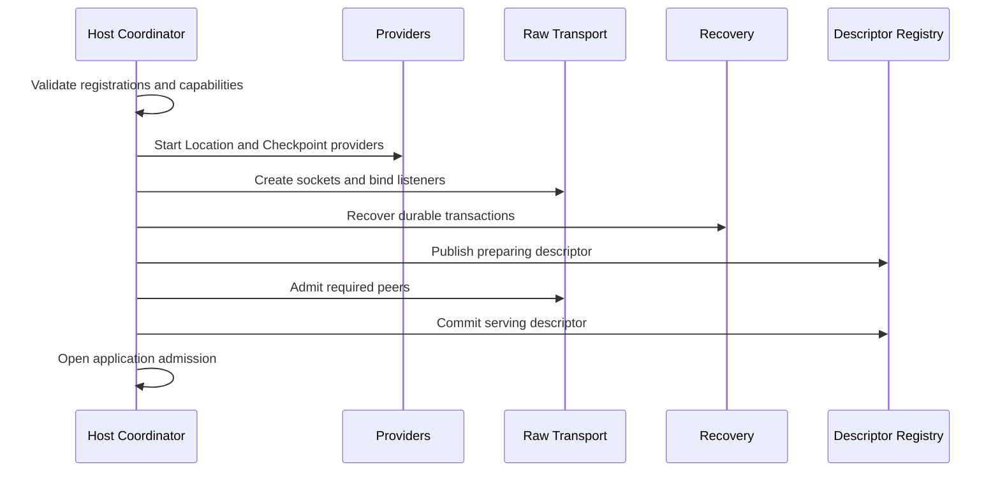

# Service runtime architecture

## 1. 책임 경계

Framework service runtime은 application intent를 raw socket transport로 변환하고, 반대 방향의 record를 typed
handler turn과 terminal result로 변환한다. Core와 binding은 raw context, message, socket, poller, timer와
monitor만 제공한다.

```text
+----------------------------------------------------------+
| Application API and Host Integration                     |
+----------------------------------------------------------+
| Language Service Runtime                                 |
| topology | mailbox | object | recovery | monitoring      |
+----------------------------------------------------------+
| Installed Public Raw Binding API                         |
+----------------------------------------------------------+
| Core Raw Socket, Poller, Timer and Monitor               |
+----------------------------------------------------------+
```

C++·.NET·JVM·Node.js는 각각 service runtime을 구현한다. Java와 Kotlin은 JVM runtime 하나를 공유한다. 네
runtime이 공유하는 것은 protocol schema, 생성된 상수, golden frame과 normalized behavior fixture뿐이다.
공통 native runtime, service C ABI, private C header와 callback SPI는 존재하지 않는다.

Framework는 해당 언어 binding의 public raw API만 호출한다. Reflection, private JNI·N-API symbol, Core 내부
handle과 source-tree include로 package 경계를 우회하지 않는다.

## 2. Runtime module

언어별 이름은 달라도 runtime은 다음 책임을 서로 다른 내부 module에 둔다.

| module | 책임 |
|---|---|
| host coordinator | startup, Retire·Shutdown, provider와 topology의 공통 lifecycle |
| raw transport gateway | public binding 호출, multipart send·receive와 raw monitor 변환 |
| protocol codec | schema version, field bound, command와 extension encode·decode |
| topology registry | RouteMesh, ClientServer, fanout과 STREAM의 local registration snapshot |
| peer registry | logical node descriptor, physical connection lifetime와 ready snapshot |
| mailbox scheduler | application·infrastructure admission, ready index와 turn 실행 |
| operation registry | request correlation, deadline, cancellation과 terminal completion |
| object runtime | Spot, Actor, Instance activation, owner fence와 timer |
| authority coordinator | Location Store CAS, Checkpoint Store와 transfer recovery |
| observability | event, metric, trace와 immutable runtime snapshot |

Raw gateway가 protocol이나 object state를 소유하지 않는다. Protocol codec은 handler를 호출하지 않는다. Store
provider는 Framework transfer phase와 checkpoint envelope을 해석하지 않는다. 이 분리는 같은 지식이 여러
module에 복제되는 것을 막는다.

## 3. Host aggregate

Process에는 service host aggregate 하나가 존재한다. 여러 RouteMesh, ClientServer, fanout과 STREAM topology는
같은 host lifecycle에 참여한다. Topology별 runtime은 selection과 monitoring view를 제공하지만 독립적인 종료
owner가 아니다.

RouteMesh MeshNode 하나는 service peer traffic을 raw ROUTER socket 하나로 multiplex한다. Node·Channel, Spot,
Actor, transfer, Instance Spot과 bound-session command가 같은 ingress를 사용하고 protocol codec 뒤에서 domain별
mailbox로 분기된다. ClientServer, classic fanout과 raw STREAM은 각 socket semantic에 맞는 별도 topology
resource를 사용한다.

Host aggregate가 소유하는 상태는 다음과 같다.

- 검증이 끝난 immutable registration snapshot
- raw context와 listener·connector handle
- topology와 peer registry
- application·infrastructure mailbox scheduler
- request operation과 terminal completion table
- Location authority lease와 recovery coordinator
- Spot·Actor·Instance aggregate와 session binding
- monitoring sequence와 bounded observer queue
- 하나의 shared termination operation과 terminal result

Resource는 만든 aggregate가 역순으로 닫는다. Application handler, provider와 observer는 raw socket, reply route,
mailbox claim과 authority token을 보관하지 않는다.

## 4. Startup

Startup은 public call을 받을 수 있는 snapshot을 한 번에 publish한다. 일부 topology만 준비된 상태를 application에
노출하지 않는다.



검증, provider 시작, raw bind, recovery와 descriptor publish 중 하나라도 실패하면 application admission을 열지
않는다. 실패한 startup은 만들어진 resource만 역순으로 정리하고 terminal startup 오류를 반환한다.

## 5. Identity와 ownership

Service identity는 raw handle과 분리한다.

| identity | 구성 | 사용 범위 |
|---|---|---|
| host | process-local runtime instance | lifecycle과 resource root |
| node | MeshName, node RID, node generation | descriptor와 peer routing |
| channel | process-local unique ChannelName | application target selection |
| Spot | owner node, Spot RID, Spot generation | local turn과 direct handle |
| Actor | Actor ID, Actor generation | logical Actor lifecycle |
| membership | Actor identity, current Spot authority | Actor turn과 session route fence |
| Instance Spot | type, logical key, authority revision | distributed owner resolution |
| transport | raw connection ID | reconnect와 stale disconnect 거부 |
| operation | 128-bit operation ID | request terminal completion |

Generation과 authority revision은 runtime 내부 검증 값이다. Application reference가 계약상 포함하는 identity만
public DTO에 나타나며 physical connection ID, store revision과 mailbox serial은 노출하지 않는다.

## 6. Receive와 send boundary

Raw receive callback은 multipart ownership을 runtime-owned immutable record로 넘긴 뒤 즉시 반환한다. Codec은
application admission 전에 magic, version, frame count와 field bound를 검증한다. 검증된 record만 topology와
object router로 전달한다.

Send는 먼저 logical target과 owner fence를 고정하고, bounded pending admission slot을 얻은 뒤 raw gateway에
multipart record 하나를 전달한다. Gateway는 partial multipart를 peer에 노출하지 않는다. Raw backpressure는
mailbox scheduler의 signal 기반 재시도로 변환하며 application code가 poller나 raw write-ready를 다루지 않는다.

## 7. Termination boundary

Retire와 Shutdown은 host coordinator 하나가 수행한다. First intent가 effective intent를 고정하고 이후 caller는
같은 operation에 합류한다. Caller cancellation은 해당 waiter만 끝내며 이미 시작한 host operation을 되돌리지
않는다.

Host coordinator는 admission seal, accepted work, object transfer, STREAM barrier, provider lease와 raw resource
정리를 하나의 deadline 아래에서 조정한다. Terminal result를 확정한 뒤에는 application callback, monitoring
event와 completion을 새로 시작하지 않는다.
