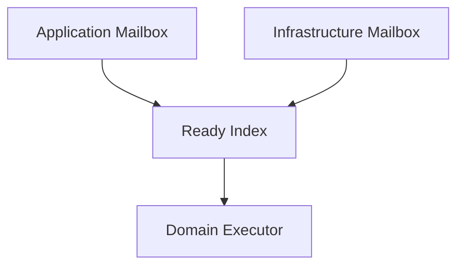
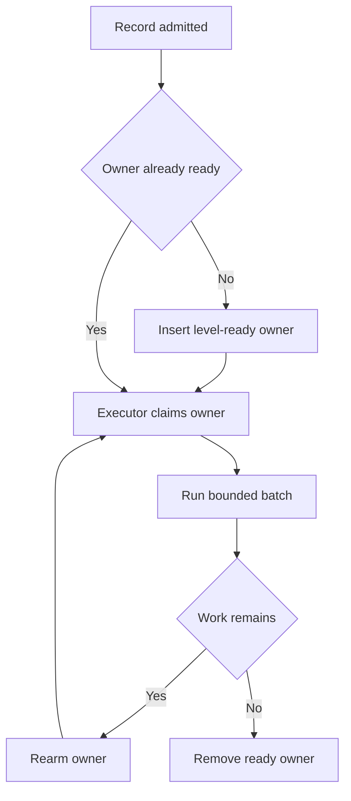
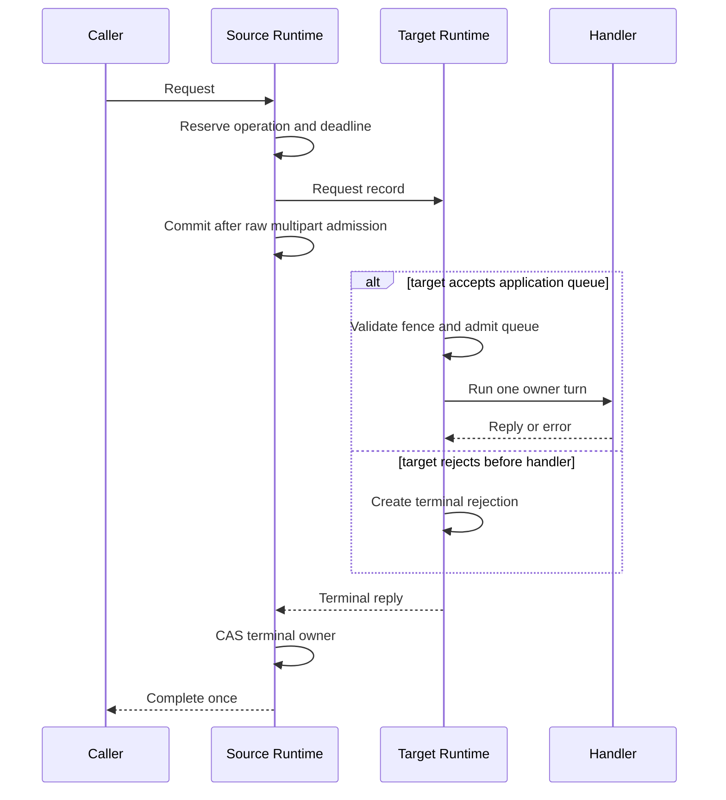

# Mailbox and dispatch runtime

[Wire protocol](02-wire-protocol.ko.md) ·
[Concurrency and resources](08-concurrency-resources.ko.md)

## 1. Dispatch record

Protocol decoder는 검증된 multipart를 immutable dispatch record로 만든다. Record는 domain, command, logical
target, owner fence, operation ID, metadata와 retained payload를 포함한다. Raw socket handle, mutable receive
buffer와 poller event는 record에 포함하지 않는다.

Dispatch record의 payload ownership은 record lifetime과 같다. Handler가 typed message를 요구하면 serializer가
record를 decode한 결과를 handler turn scope가 소유한다. Decode failure는 handler를 호출하지 않고 request
terminal error 또는 one-way diagnostic으로 끝낸다.

## 2. 두 mailbox domain

Runtime은 application과 infrastructure work를 별도 bounded mailbox로 관리한다.

| domain | 처리 대상 | progress 규칙 |
|---|---|---|
| application | handler turn, Spot·Actor message, application timer, session callback | owner별 순차 실행과 quota 적용 |
| infrastructure | peer admission, send-ready, completion, lease, transfer, recovery, termination, STREAM fence | application handler 대기와 무관하게 진행 |

Application mailbox는 message count와 retained byte 한도를 모두 확인한다. Infrastructure mailbox도 bounded지만
reply completion, lease expiry와 shutdown progress가 application queue에 막히지 않도록 별도 reserve를 가진다.
Observer와 metric exporter는 두 domain의 progress claim을 소유하지 않는다.

Bounded operation을 만들 때 terminal completion slot과 promise state를 함께 예약한다. 이 reserve를 얻지 못하면
request와 one-way pending operation을 raw transport에 제출하기 전에 backpressure로 끝낸다. 이미 수락된
operation의 reply, timeout, cancellation, disconnect와 shutdown completion은 예약한 slot을 사용하므로 일반
infrastructure queue가 가득 차도 terminal progress를 잃지 않는다.

## 3. Admission gate

한 함수가 queue limit과 owner fence를 같은 critical section에서 확인하고 record를 enqueue한다. Gate는 다음 순서로
판단한다.

1. host와 topology가 해당 domain의 admission을 허용하는지 확인한다.
2. target owner identity와 generation·membership·authority fence를 확인한다.
3. transfer seal, Instance activation barrier와 STREAM binding barrier를 확인한다.
4. queue message·byte budget과 pending admission capacity를 확인한다.
5. record를 enqueue하고 empty에서 non-empty로 바뀌면 ready index를 갱신한다.

검사와 enqueue 사이에 owner가 바뀌지 않는다. Gate를 통과하지 못한 record는 application queue에 나타나지 않으며,
request라면 원인을 stable terminal result로 변환한다.

## 4. Ready index와 claim

Ready index는 edge notification이 아니라 현재 work가 있는 owner 집합을 나타내는 level 상태다. Owner key는 object
kind, logical key와 local generation으로 구성한다. 같은 owner는 ready entry 하나만 가진다.

Executor는 ready owner를 claim하고 message count·byte·elapsed-time budget 안에서 batch를 처리한다. Batch가 끝난
뒤 work가 남아 있으면 owner를 다시 ready로 둔다. Queue가 비었으면 ready entry를 제거한다. Claim identity는
재사용하지 않는 process-local serial을 사용해 늦은 completion이 새 claim을 끝내지 못하게 한다.

한 owner의 application claim은 동시에 하나만 존재한다. Infrastructure work는 별도 executor에서 실행하므로
application handler가 await 중이어도 request timeout과 lease fence를 처리할 수 있다.

## 5. Wakeup mode

Runtime integration은 한 시점에 한 wakeup mode만 사용한다.

| mode | 사용 방식 |
|---|---|
| blocking drain | 전용 executor thread가 ready condition을 기다림 |
| callback wakeup | language scheduler에 drain task 하나만 게시 |
| poller signal | host event loop가 signal handle을 읽고 bounded drain 수행 |

Mode를 섞으면 같은 ready owner를 두 executor가 claim할 수 있으므로 startup에서 하나를 고정한다. Wakeup은 work의
존재를 알리는 수단일 뿐이며 정확한 count를 나타내지 않는다. 항상 ready index를 다시 확인한다.

## 6. One-way admission

Public one-way submit은 source runtime의 bounded pending admission operation 하나를 만든다. Local target queue 또는
raw transport가 바로 수락하면 `Submitted`로 끝난다. 첫 시도가 backpressured면 signal을 기다리되 pending 공간도
가득 찼으면 `Backpressured`, send deadline까지 수락되지 않으면 `TimedOut`으로 끝난다.

Admission 성공 뒤에는 다른 target에 다시 제출하지 않는다. 완료는 target queue 또는 transport가 record를
수락했다는 뜻이며 remote handler 실행 완료를 뜻하지 않는다. Cancellation은 waiter와 아직 수락되지 않은
pending operation만 끝낸다.

## 7. Request operation

Source runtime은 request를 transport에 전달하기 전에 operation table entry, deadline task와 correlation route를
준비한다. Full multipart가 source raw transport에 수락되면 entry를 committed 상태로 바꾼다. Service wire에는
별도 target-mailbox receipt가 없으므로 이 시점부터 target 실행 여부가 불명확할 수 있으며 다른 owner에 같은
operation을 자동 재제출하지 않는다. Target fence나 queue가 request를 거부하면 terminal reply로 원인을 보낸다.
64-bit wire correlation의 발급 범위와 128-bit operation ID 매핑은
[Wire protocol §6](02-wire-protocol.ko.md#6-maintenance-identity와-frozen-record)이 소유한다.

Target은 request마다 one-shot reply capability를 만든다. Capability는 operation route와 owner fence를 포함하지만
application-visible correlation이나 raw identity를 노출하지 않는다. 첫 reply, error 또는 explicit terminator가
public capability를 소비한다. 두 terminator가 경쟁하면 하나만 bounded reply admission operation을 시작한다.
Runtime이 이 admission의 send-ready, timeout과 shutdown 경쟁을 끝까지 소유하며 application은 같은 capability로
재시도하지 않는다. Admission이 끝내 실패하면 source request는 같은 operation ID의 terminal transport failure로
완료된다.

## 8. Terminal-once completion

Operation state는 `Pending`, `Committed`, terminal 가운데 하나다. Reply, timeout, cancellation, transport failure,
transfer relay와 shutdown은 atomic state transition으로 terminal owner를 경쟁한다. 승리한 path만 caller promise,
task, future 또는 coroutine continuation을 완료한다.

Completion record는 operation admission 때 예약한 infrastructure slot로 전달된다. Terminal CAS가 이미 promise를
직접 완료할 수 있는 언어 runtime은 같은 예약을 operation entry 안에 보관해 별도 enqueue 없이 완료할 수 있다.
Operation table lock을 잡은 상태에서 application callback을 호출하지 않는다. Timeout task와 route는 terminal
전환과 함께 table에서 detach하고, scheduler cancel과 payload dispose는 lock 밖에서 수행한다. Late reply는
diagnostic counter만 갱신한다.

## 9. Shutdown과 transfer race

Admission seal 전에 수락한 request는 deadline까지 reply 또는 명시적 failure로 완료한다. Seal 뒤 신규 request는
`TargetMoving` 또는 shutdown 결과로 끝내며 runtime이 새 owner에 숨은 재제출을 시작하지 않는다. Transfer 중
reply relay도 원래 operation ID와 terminal state를 사용한다.

Host terminal result를 publish하기 전에 pending operation을 모두 terminal로 전환한다. Terminal host 뒤에는 새
completion record를 enqueue하지 않는다.

## 10. Logical Multicast

Logical Multicast는 publish 시작 시 local subscription과 positive-weight remote peer의 immutable snapshot을 만든다.
Local subscriber마다 retained record 하나를 admission하고, remote node마다 wire record 하나만 보낸다. Remote
node는 다시 local subscriber snapshot에만 fanout한다.

각 target 결과는 독립적이다. 일부 target이 수락한 뒤 다른 target이 backpressured여도 이미 수락한 record를
rollback하지 않는다. Top-level 결과와 detail은 accepted, backpressured, not connected와 dropped count를
보존한다. Snapshot target이 0이면 `TargetNotFound`다.
