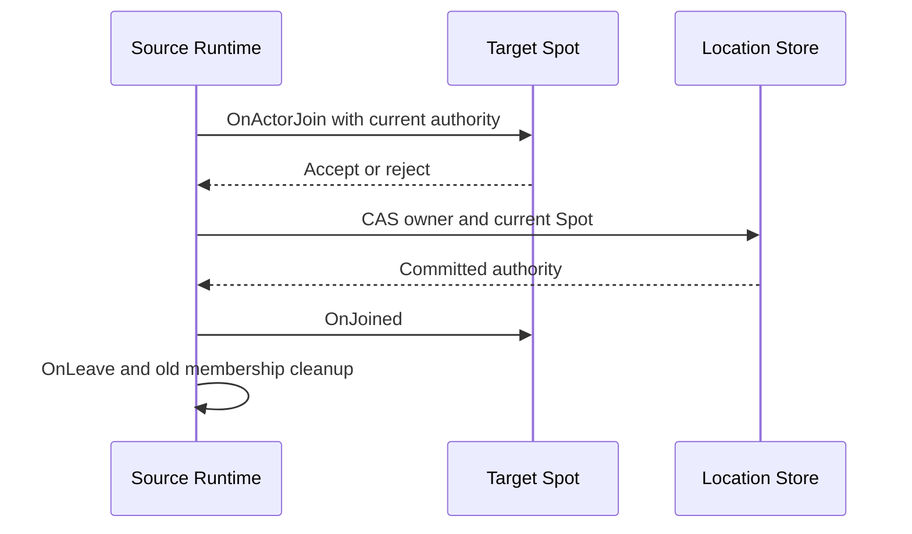

# Stateful object runtime

[Mailbox and dispatch](03-mailbox-dispatch.ko.md) ·
[Maintenance and recovery](05-maintenance-recovery.ko.md) ·
[Location runtime](../target-spec/07-location-maintenance.ko.md)

## 1. Aggregate와 authority

Service runtime은 Entry Spot, User Spot, Actor와 Instance Spot을 별도 lifecycle aggregate로 관리한다. Aggregate는
immutable identity, application·infrastructure mailbox, active turn, timer, handler scope와 current authority
snapshot을 소유한다. 모든 message, timer, reply와 lifecycle completion은 같은 admission fence를 통과한다.

Store-backed object는 다음 값을 구분한다.

| 값 | 용도 |
|---|---|
| `ObjectGeneration` | delete 뒤 같은 logical key로 새 object를 만들었는지 구분 |
| `AuthorityOwnerGeneration` | 같은 object incarnation에서 authority owner 변경 순서 |
| `OwnerId`, `OwnerLeaseGeneration` | current host process lifecycle fence |
| `StoreVersion` | exact compare-exchange expectation |

Store가 없는 host의 Actor와 Spot은 non-zero opaque lifecycle token과 current physical connection만 사용한다. Token은
equality만 비교하며 크기나 증가 순서를 해석하지 않는다. 이 모드에서는 remote directory resolve, distributed join,
transfer와 distributed session binding을 제공하지 않는다.

## 2. Local creation publication barrier

Store-backed User Spot과 Actor는 registry publish 전에 authority를 `Creating`으로 만든다. `NewObject` CAS가 final
ObjectGeneration과 AuthorityOwnerGeneration, owner lease를 한 번에 발급한다. Factory·configure·initialize가
완료된 뒤 같은 fence의 `Ready` CAS가 성공해야 resolver와 remote messaging이 object를 볼 수 있다.

Actor creation은 initial Entry Spot membership도 `Creating` authority에 포함한다. `Ready` 전에는 ActorRef resolve,
join, session binding과 transfer를 받지 않는다. Factory 또는 initialize가 실패하면 exact fenced delete를 수행하고
Read로 `Missing`을 확인한다. Registry는 확인 전까지 failed·sealed 상태를 유지하며 factory와 original payload를
다시 실행하지 않는다. 다음 caller만 새 `NewObject` CAS를 시작할 수 있다.

User Spot normal `Close`는 Actor membership이 하나라도 있으면 public `false`를 반환하고 아무 상태도 바꾸지 않는다.
Application은 Actor를 명시적으로 leave 또는 destroy한 뒤 다시 닫아야 한다. Runtime은 숨은 Actor 이동·destroy를
수행하지 않는다.

## 3. Actor membership

ActorRef는 logical Actor ID와 ObjectGeneration으로 구성한다. Current Spot identity는 authority snapshot에 포함하며
별도 membership counter를 두지 않는다. Actor owner나 membership 변경은 expected StoreVersion과 current object·owner
fence를 확인하는 CAS 한 번으로 확정한다.

Join은 existing Ready User Spot의 `OnActorJoin`으로 admission을 결정한다. 성공한 CAS 뒤 target `OnJoined`와 source
`OnLeave`를 committed authority에 맞춰 실행한다. Callback이 늦게 끝나도 current authority와 일치하지 않으면 새
application work, timer와 location update를 만들 수 없다.

## 4. Instance Spot cold activation

`InstanceSpotAddress` call의 source runtime이 eligible target을 고른 뒤 outbound wire보다 먼저 `NewObject` CAS를
수행한다. Target은 authority를 claim하지 않는다. Target은 exact `ColdActivating` row와 owner lease를 확인하고
factory·initialize·Ready barrier를 실행한다.

Target host는 startup initial scan과 bounded background reconcile에서 자신 소유의 `ColdActivating` row를 찾는다.
Source message가 유실돼도 same activation key의 barrier를 재개한다. Wire submit과 scan은 같은 local registry entry로
수렴하므로 factory와 initialize는 restart 뒤 반복 실행돼도 안전해야 한다.

Failure는 barrier를 sealed 상태로 고정한다. Request는 typed result로 한 번 끝내고 one-way call은 drop event만
기록한다. Exact fenced delete가 `Missing`으로 확인될 때까지 같은 failure를 반환하며 payload, factory와 target
selection을 다시 실행하지 않는다. 이후 caller만 새 generation의 `NewObject` CAS를 시작한다.

## 5. Admission과 timer

Aggregate는 application turn을 한 번에 하나만 시작한다. Infrastructure completion은 application callback과 분리된
queue에서 처리하되 callback 진입 전에 current fence를 다시 확인한다. Process pause 전에 시작한 callback은 강제로
중단할 수 있으므로 Framework가 external side effect의 exactly-once를 보장하지 않는다.

Timer는 callback을 직접 호출하지 않고 object fence를 가진 application record를 enqueue한다. Repeating timer의
schedule은 monotonic clock으로 계산한다. Owner lease deadline, close 또는 maintenance seal 뒤에는 새 tick을
enqueue하지 않으며 이미 만들어진 stale record도 callback으로 전달하지 않는다.

## 6. Maintenance transfer

Actor `Retire`는 source Entry Spot의 current member만 이동한다. User Spot member Actor는 그 User Spot과 함께
`TransferDisabled` blocker다. Target offer는 target Entry Spot identity를 reservation에 고정한다. Committed CAS는
Actor owner, AuthorityOwnerGeneration과 target Entry Spot membership을 atomic하게 바꾼다.

Commit 뒤 target factory·restore, target `OnJoined`, accepted journal replay를 수행한다. Source `OnLeave`와 old Entry
membership cleanup은 durable source cleanup으로 확정한다. Target aggregate는 cleanup, Completed authority, bound
session route ACK와 steady normalization을 모두 끝낼 때까지 sealed 상태를 유지한다. `Activated`만으로 Ready route나
application admission을 공개하지 않는다.

Connection-bound source에서 수락한 send·request와 bound-session request는 Captured 전에 terminal drain한다. Durable
frozen journal은 exact lease-backed source record만 포함한다. Drain이 deadline 안에 끝나지 않으면 pre-Captured
abort와 `Blocked/TransferDisabled`로 끝내고 source admission을 복원한다.

## 7. Cache와 stale result

Location cache는 logical key, current route, StoreVersion, object·owner generation, owner lease와 local monotonic
deadline을 immutable snapshot으로 저장한다. Cache hit도 deadline과 current connection을 확인한다. Higher authority,
lease expiry, handover와 explicit stale result는 다음 call을 위한 cache만 invalidate하며 실패한 operation을 다른
owner로 다시 제출하지 않는다.

Close된 handle은 같은 ObjectGeneration capability로 남는다. 같은 logical key에 새 object가 생성돼도 기존 handle을
자동 retarget하지 않는다.

## 8. 검증 기준

- `Creating`과 `ColdActivating` object가 resolver와 remote messaging에 노출되지 않는다.
- Creation failure 뒤 exact delete를 `Missing`으로 확인하기 전 factory와 payload를 다시 실행하지 않는다.
- Store-less token을 numeric generation처럼 정렬하지 않는다.
- User Spot close가 member Actor를 숨겨서 이동하거나 제거하지 않는다.
- Actor owner와 target Entry membership이 같은 CAS에서 바뀐다.
- `Activated` 뒤 cleanup·Completed·route ACK·steady normalization 전에는 target admission이 닫혀 있다.
