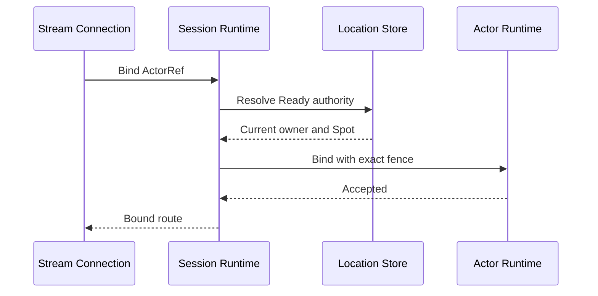
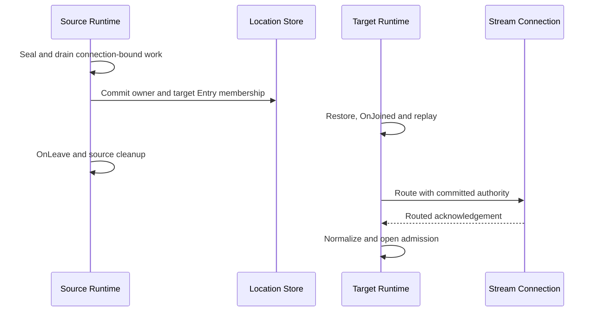

# STREAM session runtime

[Stateful object runtime](04-stateful-object-runtime.ko.md) ·
[Maintenance and recovery](05-maintenance-recovery.ko.md)

## 1. 책임과 key

Session runtime은 physical STREAM connection과 Actor route를 분리한다. Connection aggregate는 connection ID,
binding generation, inbound sequence, pending request와 current ActorRef를 소유한다. Actor authority는 Actor ID,
ObjectGeneration, current owner와 current Spot identity를 소유한다. 별도 membership counter를 두지 않는다.

Binding generation은 같은 physical connection에서 bind 상태가 바뀌는 순서를 구분한다. Reconnect는 새 connection
aggregate이며 이전 generation을 이어서 사용하지 않는다. Store-less host에서는 current physical connection과
runtime-local opaque Actor token만 인정하며 distributed binding과 transfer를 제공하지 않는다.

## 2. Bind와 dispatch

Bind request는 current connection, ActorRef와 Actor Ready authority를 함께 확인한다. CAS가 필요하면 authority commit이
성공한 뒤에만 connection route를 공개한다. Each application record는 connection ID, binding generation, ActorRef와
current authority fence를 가진다. Callback 직전에 모두 다시 확인하므로 stale route의 frame이 새 owner callback에
전달되지 않는다.

Application callback과 infrastructure completion은 서로 다른 queue에서 처리한다. Disconnect, timeout과 reply가
경쟁해도 operation ID별 terminal result 하나만 완료한다. Orderly disconnect는 service peer deadline을 기다리지 않고
connection admission을 즉시 닫는다.

## 3. Actor transfer barrier

Actor `Retire`는 source Entry Spot member만 이동한다. Target reservation은 target Entry Spot identity를 고정한다.
Committed CAS가 Actor owner, AuthorityOwnerGeneration과 target Entry membership을 한 번에 바꾼다. Session route는
이 committed authority만 사용한다.

Connection-bound source에서 이미 수락한 request는 Captured 전에 terminal drain한다. Bound-session request도 durable
journal로 이동하지 않는다. Drain이 deadline 안에 끝나지 않으면 transfer를 pre-Captured에서 abort하고 source
binding과 admission을 복원한다.

Commit 뒤 target factory·restore, `OnJoined`와 accepted journal replay를 끝낸다. Source `OnLeave`와 old Entry cleanup이
durable하게 완료된 뒤 session route command를 보낸다. Route ACK와 steady normalization 전에는 target application
admission을 열지 않는다.

## 4. Abort와 reconnect

Commit 전 abort는 durable Aborted authority가 먼저다. Session abort route와 routed acknowledgement, target
reservation cleanup과 steady source normalization을 마친 뒤 source binding을 다시 연다. Aborted CAS 전에 route를
되돌리지 않는다.

Physical connection이 끊기면 해당 connection aggregate와 pending waiter를 terminal 처리한다. Reconnect는 current
Actor authority를 새로 resolve하고 새 binding generation을 발급한다. 이전 connection의 reply, ACK와 timer는 새
connection state를 변경하지 않는다.

## 5. 검증 기준

- Bind가 `Creating`, moving 또는 stale Actor authority를 공개하지 않는다.
- Connection ID, binding generation, ActorRef와 authority fence가 모두 일치할 때만 callback을 시작한다.
- Connection-bound request는 Captured 전 terminal drain하며 durable frozen journal에 들어가지 않는다.
- Actor owner와 target Entry membership을 atomic하게 바꾼 뒤에만 route를 갱신한다.
- Route ACK와 steady normalization 전 target admission이 닫혀 있다.
- Reconnect가 이전 connection의 pending operation과 generation을 재사용하지 않는다.
