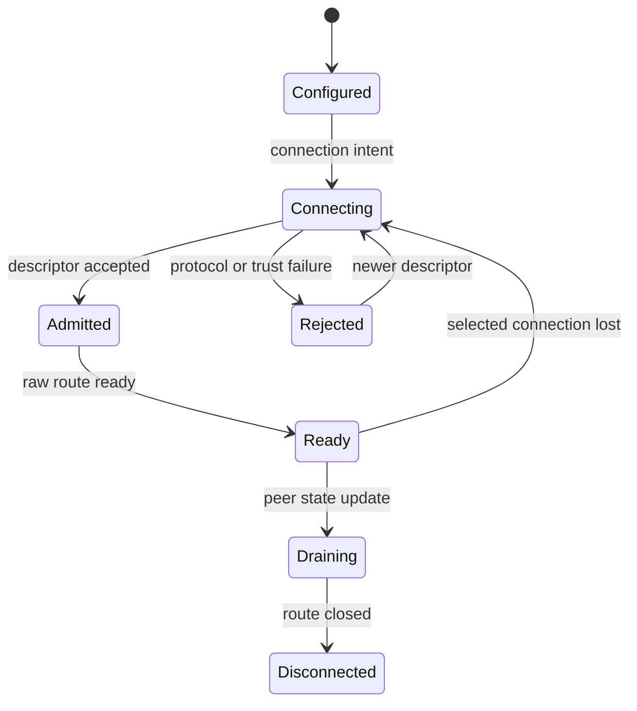
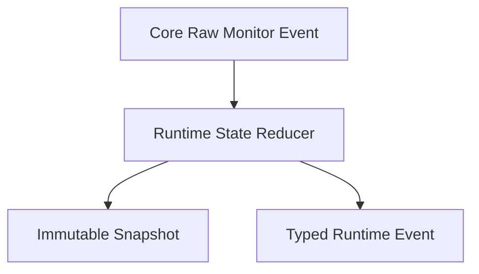

# Liveness and monitoring runtime

[Runtime architecture](01-runtime-architecture.ko.md)

Core raw transport의 최종 내부 경계는 `core/doc/internals/runtime-boundary.ko.md`가 설명한다.

## 1. Liveness layers

서로 다른 liveness 기능은 같은 timeout으로 합치지 않는다.

| layer | owner | 의미 |
|---|---|---|
| Core raw monitor | raw connection engine | orderly disconnect와 transport·protocol failure |
| Framework service liveness | RouteMesh·ClientServer runtime | admitted connection의 half-open 상태와 probe·ACK |
| Framework fanout liveness | fanout publisher·subscriber runtime | publisher별 one-way beacon과 receive deadline |
| kernel TCP policy | operating system | keepalive와 retransmission failure |
| Framework peer readiness | service runtime | descriptor admission과 selectable route |
| Location owner lease | authority coordinator | distributed owner write·admission 권한 |
| STREAM heartbeat | application session runtime | application protocol ping·pong |

Framework는 binding의 public raw socket API를 사용해 liveness 결과를 맞춘다. RouteMesh와 ClientServer는 공통
service protocol의 양방향 probe·ACK을 사용한다. Classic fanout은 publisher가 보내는 one-way beacon을 사용한다.
두 profile의 interval과 deadline은 Framework public API에 노출하지 않는다. Transport가 ready여도 descriptor 또는
authority가 유효하지 않으면 application route는 ready가 아니다.

## 2. Identity layers

| identity | 변화 시점 | 막는 stale event |
|---|---|---|
| raw connection ID | physical connect attempt마다 | 늦은 disconnect와 send-ready |
| lifecycle generation | logical node restart마다 | 이전 process descriptor와 route |
| descriptor revision | 같은 lifecycle의 metadata 갱신마다 | 이전 weight·state·capability update |
| authority revision | owner 또는 transaction CAS마다 | 이전 owner message·timer·phase update |

RID는 logical node identity이며 physical connection identity가 아니다. 같은 RID가 reconnect하거나 reciprocal
connection handover를 수행할 수 있으므로 peer registry는 selected connection ID를 별도로 보관한다.

## 3. Peer readiness

다음 state machine은 descriptor admission을 사용하는 RouteMesh와 ClientServer selected connection에 적용한다.
Classic fanout publisher readiness는 §4의 전용 SUB socket에서 첫 valid record를 받은 시점에 시작한다.

Ready snapshot은 raw connection, admitted lifecycle generation, descriptor revision, service state와 Channel
membership이 같은 selected lifetime을 가리킬 때만 publish한다. `connect` call이 성공했거나 desired endpoint 집합에
들어갔다는 사실만으로 ready를 만들지 않는다.

같은 RID의 reciprocal connection 중 하나를 deterministic policy로 선택한다. Successor를 admit하면 이전
connection의 event는 current selected identity와 비교해 무시한다. Same-generation descriptor update는 revision이
증가할 때만 적용한다.

## 4. Reconnect와 routing

Disconnect는 peer route의 ready를 즉시 내리지만 logical connection intent와 최신 descriptor를 유지할 수 있다.
Raw binding의 reconnect는 같은 endpoint에 새 connection lifetime을 만들고 Framework admission handshake를 다시
수행한다. Request operation은 target admission 뒤 reconnect를 이유로 다른 logical target에 replay하지 않는다.

Direct route는 known target의 새 physical lifetime이 ready가 될 때까지 `RouteNotConnected` 상태다. Select-one
ChannelName은 operation이 아직 수락되지 않은 동안 현재 eligible snapshot을 다시 선택할 수 있다. 수락 뒤에는
target을 바꾸지 않는다.

Runtime-wide liveness profile은 public option이 아니라 host 내부 정책이다. Profile은 RouteMesh·ClientServer
service liveness, fanout publisher liveness, raw monitor와 reconnect deadline을 함께 설정해 다음 관찰 상한을
만족한다.

| 장애 | Runtime 처리 | E2E observation budget |
|---|---|---|
| store-backed TCP peer의 FIN, RST 또는 process 종료 | raw monitor event를 관측한 즉시 selection에서 제외 | 5초 |
| manual TCP peer의 단방향 packet blackhole | inbound deadline에 selection에서 제외 | 15초 |
| store-backed owner process pause | lease expiry와 polling 결과를 적용한 즉시 제외 | owner lease TTL + polling interval + 1초 |

E2E observation budget은 process 종료와 monitor 전달을 외부 harness가 확인하는 상한이며 Runtime이 의도적으로
기다리는 시간이 아니다. 특히 FIN, RST와 raw disconnect event를 받은 뒤 5초 지연을 추가하지 않는다.

Runtime은 wall clock이 아니라 monotonic clock으로 local 상한을 계산한다. Event loop가 pause된 뒤 재개하면 누적
elapsed time을 한 번에 적용한다. Peer마다 blocking timer thread를 만들지 않고 shared bounded scheduler를 사용한다.

### 4.1 RouteMesh와 ClientServer

Service admission을 완료한 physical connection은 initial ready와 15초 peer deadline을 시작한다. Runtime은
application traffic과 무관하게 5초마다 tick을 실행하고 connection별 outstanding non-zero probe ID를 최대 하나만
보관한다. Outstanding ID가 없으면 새 ID를 할당해 `livenessProbe`로 보내고, 있으면 같은 ID를 재전송한다. Peer는
같은 connection에서 같은 ID를 `livenessAck`으로 반환한다. Current selected connection의 current outstanding
ID와 일치하는 첫 ACK만 deadline을 갱신하고 ID를 제거한다. Duplicate ACK, 이전 ID와 다른 connection의 ACK는
무시한다. Application frame을 포함한 다른 inbound traffic은 진단 시각만 갱신한다. Deadline을 넘으면 ready를
내리고 connection을 닫는다.

Probe·ACK decode와 timer callback은 infrastructure reserve에서 처리하며 application mailbox나 handler를 사용하지
않는다. Orderly disconnect와 raw transport failure는 15초 deadline을 기다리지 않고 ready를 즉시 내린다.

### 4.2 Classic fanout

Subscriber는 automatic discovery의 publisher descriptor 또는 manual endpoint마다 전용 SUB socket과 receive loop
하나를 만든다. 여러 publisher를 같은 socket에 연결하지 않으므로 inbound record를 보낸 publisher와 timeout 대상을
별도 correlation 없이 결정할 수 있다. Raw connect만으로 publisher를 ready로 만들지 않으며, 그 socket에서 첫 valid
application fanout record 또는 exact liveness beacon을 받았을 때 ready snapshot을 publish한다.

Publisher는 application fanout traffic과 무관하게 5초마다 reserved infrastructure topic으로 beacon을 보낸다.
Subscriber는 valid application record와 exact beacon을 모두 receive activity로 처리한다. 15초 동안 둘 다 없으면
그 publisher만 not-ready로 바꾸고 전용 socket을 닫은 뒤 reconnect한다. Beacon exact bytes는
[Service wire protocol §4](02-wire-protocol.ko.md#4-admission과-liveness)이 소유한다.

Fanout subscriber는 ACK를 보내지 않는다. Beacon decode와 deadline은 infrastructure reserve에서 처리하고
application mailbox·handler에 전달하지 않는다. Orderly disconnect와 raw transport failure는 15초 deadline을 기다리지 않는다.
Location owner lease는 automatic publisher의 discovery authority를 판단하며 이 receive deadline을 대신하지 않는다.

## 5. Monitor layering

Raw socket monitor는 connect, disconnect, accept, bind, protocol과 transport failure를 raw identity와 함께 제공한다.
Framework monitor는 이 event를 peer, topology, mailbox, object, transfer와 host lifecycle state에 적용한 뒤 typed
event와 immutable snapshot을 만든다.

Application observer는 raw monitor queue를 직접 읽지 않는다. Raw event는 current connection identity와 lifecycle을
확인한 뒤에만 Framework state를 바꾼다.

State reducer 앞의 monitor ingest는 connection lifecycle, protocol failure와 selected identity 변경을 유실하지
않는다. Binding monitor가 overflow를 보고할 수 있으면 runtime은 raw connection snapshot을 다시 읽거나 해당
topology를 not-ready로 전환해 상태를 추측하지 않는다. Send-ready처럼 빈도가 높은 edge는 current readiness를
먼저 reducer에 적용한 뒤 counter로 합칠 수 있다. Application observer queue의 drop·coalescing 정책을 reducer
ingest에 적용하지 않는다.

## 6. Event queue와 coalescing

Observer마다 독립 bounded queue가 있다. 느린 observer가 message dispatch, completion, lease와 termination을 막지
않는다. Queue가 가득 차면 상태 변경 event를 coalesce할 수 있지만 다음 정보를 보존한다.

- source별 가장 큰 snapshot sequence
- backpressure와 drop counter 증가분
- transfer·termination terminal event
- overflow와 coalescing 자체의 counter

Event는 변화 알림이고 snapshot이 current state authority다. Consumer가 sequence gap을 발견하면 최신 snapshot을
다시 읽는다. Event callback을 monitor state lock 안에서 호출하지 않는다.

## 7. Snapshot와 metric

State reducer는 MeshNode, ClientServer Channel, automatic fanout Channel과 host termination을 별도 immutable
snapshot으로 만든다. Snapshot sequence는 같은 source 안에서만 비교한다. Peer snapshot은 lifecycle generation,
descriptor revision, selected connection readiness와 service state를 분리한다.

Metric은 queue depth, pending bytes, active turn, request terminal reason, reconnect, multicast partial result,
Instance activation, transfer phase와 termination duration을 bounded-cardinality label로 집계한다. Endpoint, RID,
Actor ID, Spot RID, logical instance key와 payload를 metric label에 넣지 않는다.

Trace correlation은 operation ID와 public flow correlation을 runtime 내부에서 연결한다. Payload와 application
metadata를 monitoring event에 복사하지 않는다.

## 8. Observer lifetime

Observation handle close 또는 cancellation은 해당 observer 등록만 종료한다. Cancellation을 인식한 뒤 새 event를
queue에 넣지 않고 남은 event는 폐기한다. 이미 시작한 callback은 반환할 수 있지만 close 반환 뒤 새 callback을
시작하지 않는다.

Observer failure는 runtime state와 terminal result를 바꾸지 않는다. Host 종료는 일반 observer producer
admission을 먼저 닫되, observer마다 미리 예약한 terminal lane은 유지한다. Accepted completion과 resource
cleanup 뒤 final snapshot과 terminal event를 이 lane으로 한 번 게시하고 observer queue를 닫는다. Terminal
event를 게시한 뒤에는 어떤 producer도 새 event를 만들지 않는다.
